# 第十一章：测量性能和基准测试你的应用程序

在前面的章节中，我们学习了如何为数据摄取和数据发布问题设计解决方案。我们还讨论了如何选择正确的技术栈和平台来实现成本效益高且可伸缩的解决方案。除此之外，我们还了解了各种数据摄取的架构模式。我们还讨论了数据治理和数据安全。然而，作为架构师，我们的工作不仅仅是创建可伸缩的解决方案，还要创建高性能的解决方案。这就是性能工程在数据架构师工具箱中发挥作用的地方。

在本章中，我们将讨论性能工程的意义以及为什么它如此重要。我们还将了解它与性能测试有何不同。然后，我们将学习如何规划我们的性能测试和其他性能工程活动。然后，我们将简要讨论性能基准测试技术。最后，我们将了解在数据摄取或数据发布过程中缓解或避免各种性能瓶颈的常见方法来微调我们解决方案的性能。

到本章结束时，你将了解性能工程是什么以及如何为其制定计划。你将知道如何进行基准测试和发布性能结果。你将了解可用的性能工具以及何时使用它们。最后，你将了解如何微调性能以创建针对数据问题的优化、高性能解决方案，以及如何进行性能基准测试。

在本章中，我们将涵盖以下主要主题：

+   性能工程与规划

+   性能工程工具

+   发布性能基准

+   优化性能

# 性能工程与规划

**软件性能工程**（**SPE**）是一种系统性和量化的基于软件的方法，旨在设计、架构和实施解决方案，以最佳方式满足各种**非功能性需求**（**NFRs**），如性能、容量、可伸缩性、可用性和可靠性。在本书的早期，我们讨论了可伸缩性、可用性和可靠性。在本章中，我们将重点关注性能和容量。或者，SPE 被定义为一种主动和持续的性能测试和监控过程。它涉及不同的利益相关者，如测试人员、开发者、性能工程师、业务分析师和架构师。正如我们将在本章后面讨论的，性能工程是一个无缝的过程，它与开发活动并行运行，为开发者和架构师提供持续的反馈循环，以便在软件开发过程中吸收性能需求。

既然我们已经定义了性能工程，那么让我们讨论一下性能工程生命周期的各个阶段以及它是如何与**软件开发生命周期（SDLC**）活动并行的。以下图表展示了这一点：

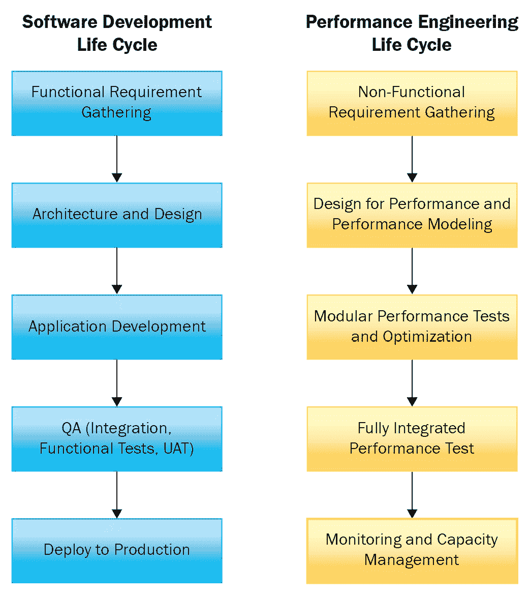

图 11.1 – 性能工程生命周期

如我们所见，以下是性能工程生命周期的各个阶段：

+   **收集 NFR**：为了开发高性能的数据管道，了解解决方案的非功能性需求非常重要。例如，在设计 DaaS 时，了解所需的每秒**事务数（TPS**）和系统平均并行负载更有意义。在设计管道时，可能还有另一个要求，即它应该能够与 Datadog 集成以进行监控。在这种情况下，应选择支持 Datadog 集成的技术堆栈。为了收集所有这些信息，我们需要产品负责人、系统分析师、**领域专家（SMEs**）、架构师、SPE 团队和 DevOps 之间有紧密的联系。

+   **针对性能和性能建模进行设计**：在瀑布模型中，性能测试和优化是在功能性和集成测试周期结束后进行的。这种方法的缺点是，与小型数据集完美工作的架构在负载测试方面可能根本不起作用。因此，我们必须再次重新设计解决方案。这导致在努力、时间和金钱方面造成了大量的浪费。由于现代数据工程团队越来越多地采用敏捷方法，同时采用性能工程的机会也增加了。在收集了非功能性需求之后，针对性能的设计需要满足以下标准：

    +   以最佳速度满足 NFRs

    +   解决方案必须足够可扩展，即使在负载增加的情况下也能保持相似的性能

我们的架构应该设计成随着业务数据的指数增长而扩展。这使设计失败、扩展应用而不是向上扩展应用以及云中自动扩展资源等想法变得生动起来。在以性能为导向的设计中，通常还应用了另一种常见方法，即**性能建模**。

性能建模是基于数据增长率中涉及的特征来建模应用性能的过程，目的是找出可能的 SLA 违规情况。它还有助于验证设计决策和基础设施决策。让我们来看一个例子——假设输入消息以速率*x*进入一个应用，该应用的响应速率是*y*。如果消息的到达速率是其自身的四倍会发生什么？我们如何确保相同的响应时间？我们需要将服务速率增加到四倍还是增加到两倍？这种决策可以通过性能建模来完成。在现代数据架构中，应用往往运行在容器化或虚拟化平台上，这可以确定未来如何分配资源以进行扩展。

+   **模块化性能测试和优化**：在这个阶段，使用 NFRs，**非功能性测试**（NFTs）被分类为压力测试、负载测试或浸泡测试。一旦测试用例被分类，就准备一个测试用例文档，该文档将 NFTs 与运行测试场景的详细步骤相对应。可选地，创建一个 NFT 到 NFR 性能矩阵。然后，使用这些文档，可以在模块开发并功能测试时测试 NFRs。运行这些测试用例与功能测试相结合，可以确保早期发现任何性能问题。优化和性能调整可以根据开发或 DevOps 团队的需求进行。

+   **完全集成的性能测试**：一旦完成模块化性能测试，就可以运行端到端性能测试。随着场景的**质量保证**（QA）完成，该场景将移动到测试集成性能。通常，在这一层，不需要太多调整或优化。然而，在此次活动期间，可能需要优化整体端到端流程。

+   **监控和容量管理**：一旦管道投入生产，我们需要持续监控和评估任何异常活动。根据未来和当前的工作负载状态，可以预测并适当管理容量。

在本节中，我们学习了性能工程生命周期的各个阶段。接下来，让我们了解性能工程与性能测试之间的区别。

## 性能工程与性能测试

性能工程与性能测试之间的关键区别如下：

+   性能测试是一个 QA 活动，它运行测试用例来检查 NFRs 的质量并找出任何问题。它是为了检查系统在负载生产方面的行为，并预测在重负载期间可能出现的任何问题。另一方面，性能工程是一个与 SDLC 同步进行的整体过程。与性能测试不同，性能工程从分析阶段开始。它还促进了在开发生命周期早期发现性能问题。

+   性能测试遵循软件开发过程的水下模型。它仅在软件开发和功能测试完成后进行。这种方法的缺点是，如果应用程序在生产负载下无法正常工作，我们可能需要重新设计和重新实现，这会导致不必要的耗时和财务损失。然而，性能工程是一个持续的过程，与 SDLC 的所有阶段相辅相成，通常由敏捷团队实施，并具有持续反馈循环到开发和设计团队。通过提供性能需求的前期分析和问题的早期发现，性能工程帮助我们节省时间和金钱。

+   性能测试由 QA 团队执行，而性能工程涉及架构师、开发者、SMEs、性能工程师和 QA。

在本节中，我们学习了性能工程，为什么需要它，以及它的生命周期。我们还讨论了性能测试和性能工程之间的区别。在下一节中，我们将简要讨论市场上可用的性能工程工具。

# 性能工程工具

在本节中，我们将简要讨论各种性能工程工具。

以下是可以用的不同类别的性能工程工具：

+   **可观测性工具**：这些工具监控并收集关于应用程序的信息。这些工具可能有助于识别瓶颈、跟踪吞吐量和延迟、内存使用等情况。在数据工程中，每个系统都是不同的，吞吐量和延迟的要求也不同。可观测性工具有助于确定我们的应用程序在吞吐量或延迟方面是否落后，以及落后多少。它们还有助于识别可能仅在长期运行中、在生产中出现的隐藏问题。例如，应用程序中的微小内存泄漏在部署后的几天内可能不明显。当这样的应用程序持续运行时，JVM 堆空间的旧区域会缓慢增加，直到超过堆空间。以下是一些可观测性工具的例子：

    +   **Datadog**：这是一个非常流行的监控工具，可以进行应用程序监控、网络监控、数据库监控、容器监控、无服务器监控等。它具有内置的仪表板和根据您的需求自定义仪表板的功能。它具有警报、日志集成和其他酷炫功能。这是一个付费产品，提供企业级支持。更多信息，请访问[`www.datadoghq.com/`](https://www.datadoghq.com/)。

    +   **Grafana 与 Graphite/Prometheus**: 这是一个开源的监控和仪表盘工具。它可以与 Prometheus 或 Graphite 一起使用。Prometheus 和 Graphite 都是开源的监控工具包，有助于生成和发布各种指标。Prometheus 有一个数据收集模块，可以拉取数据以生成指标。另一方面，Graphite 只能被动监听数据，但不能收集它。一些其他工具，如 Collectd，需要收集并将数据推送到 Graphite。查询 Graphite 指标时使用函数，而 PromQL 用于查询 Prometheus 指标。这些生成的指标与 Grafana 集成，以创建不同类型的仪表盘，例如统计仪表盘、时间序列监控、状态时间线和历史记录、警报仪表盘等。更多信息，请访问[`grafana.com/`](https://grafana.com/)。

    +   **Dynatrace**: Dynatrace 是另一个具有与 Datadog 非常相似功能的商业监控和仪表盘工具。它还提供了一个 AI 助手，可以帮助动态回答您的查询。它支持 DevOps 和 CloudOps 集成，如 CI/CD 管道等。更多信息，请访问[`www.dynatrace.com/`](https://www.dynatrace.com/)。

    +   **Confluent Control Center**: 这是一个内置的 Confluent Kafka 监控工具，随 Confluent Kafka 的企业（授权）版本一起提供。它有助于监控各种 Kafka 组件，如主题、生产者、消费者、Kafka Connect 集群、KSQL 查询以及整体 Kafka 集群健康。更多信息，请访问[`docs.confluent.io/platform/current/control-center/index.xhtml`](https://docs.confluent.io/platform/current/control-center/index.xhtml)。

    +   **Lenses**: 这是一个提供 Kafka 主题、集群和流可观测性的工具。Lenses 不仅支持可观测性，还支持 Kafka 集群的 DataOps。更多信息，请访问[`docs.lenses.io/`](https://docs.lenses.io/)。

+   **性能测试和基准测试工具**: 这些工具用于进行各种性能测试，例如烟雾测试、负载测试和压力测试。其中一些还提供基准测试功能。以下是一些可用于性能测试和基准测试的工具：

    +   **JMeter**: 这是一个用 Java 编写的免费开源工具，用于性能测试。它特别适用于大数据性能测试以及任何 API 的性能测试，如 REST 和 GraphQL。JMeter Hadoop 插件可用于进行大数据性能测试。我们可以运行负载测试并将结果导出为多种格式的文件。更多信息，请访问[`jmeter.apache.org/`](https://jmeter.apache.org/)。

    +   **SoapUI**：这是另一个用于功能测试的开源性能测试工具。它支持对 REST、SOAP 和 GraphQL 等 Web 服务的多用户、线程和并行负载测试。它还有一个名为 ReadyAPI 的专业商业版，该商业版支持更多高级功能和针对测试 GraphQL 和 Kafka 流应用的特定插件。更多信息，请访问[`www.soapui.org/`](https://www.soapui.org/)。

    +   **Blazemeter**：这是另一个开源性能测试工具，用于运行微服务（如 REST 或 GraphQL API）的可扩展测试。它还支持一些监控功能。更多信息，请访问[`www.blazemeter.com/`](https://www.blazemeter.com/)。

    +   **LoadRunner**：LoadRunner 是 Microfocus 的一个商业产品，它能够为各种工作负载和各种类型的应用程序提供负载测试。它支持超过 50 种应用程序的测试，例如微服务、HTML、MQTT、Oracle 等。更多信息，请访问[`www.microfocus.com/en-us/products/loadrunner-professional/overview`](https://www.microfocus.com/en-us/products/loadrunner-professional/overview)。

    +   **SandStorm**：这是一个商业基准测试和企业级性能测试工具。它对各种应用程序和工具提供巨大支持，从 JDBC 连接到大数据测试。它支持 Cassandra、HBase 和 MongoDB 等 NoSQL 数据库，以及 Hadoop、Elasticsearch 和 Solar 等大数据组件。它还提供对 Kafka 和 RabbitMQ 等消息平台的支持。更多信息，请访问[`www.sandstormsolution.com/`](http://www.sandstormsolution.com/)。

    +   `kafka-producer-perf-test.sh` 和 `kafka-consumer-perf-test.sh`。前一个脚本用于测试生产者性能，后一个脚本用于测试消费者性能。要了解更多关于此功能的信息，请访问[`docs.cloudera.com/runtime/7.2.10/kafka-managing/topics/kafka-manage-cli-perf-test.xhtml`](https://docs.cloudera.com/runtime/7.2.10/kafka-managing/topics/kafka-manage-cli-perf-test.xhtml)。

    +   **OpenMessaging Benchmark Framework**：这是一套工具，允许您轻松地在云上对分布式消息系统进行基准测试。它支持 Apache Kafka、Apache Pulsar、Apache RocketMQ 等多个消息平台。更多信息，请访问[`openmessaging.cloud/docs/benchmarks/`](https://openmessaging.cloud/docs/benchmarks/)。

在本节中，我们简要讨论了可以用于性能工程的多款工具。现在我们已经对性能工程有了相当的了解，包括如何进行以及我们可以使用的工具，让我们看看如何利用我们所获得的知识来创建性能基准。

# 发布性能基准

在本节中，我们将学习关于性能基准测试以及如何开发和发布它们。我们将从定义性能基准是什么开始。软件性能测试中的基准被定义为评估软件解决方案质量度量的参考点。它可以用来对同一问题的不同解决方案进行比较研究，或比较软件产品。

基准测试就像统计数据或度量标准，用于确定软件的质量。就像在足球等运动中，每位球员的价值或质量是通过各种统计数据来确定的，例如他们总共进球数、每场比赛进球数、锦标赛进球数等。这些统计数据有助于在不同规格下比较不同的球员。同样，软件世界中的基准测试有助于在特定条件下确定软件产品或解决方案的价值。

现在，让我们实际运行一些性能测试并创建性能基准。我们将使用我们在*第九章*，“将 MongoDB 作为服务公开”中开发的 REST API 来进行性能测试。我们将使用 JMeter 来测试和记录应用程序的性能。我们选择 JMeter，因为它易于使用，并且是一个基于 Java 的开源产品。

按照以下步骤进行性能测试和基准测试：

1.  **添加线程组**：首先，我们必须添加一个线程组。要添加线程组，我们需要执行以下操作：

    1.  启动 JMeter 工具。

    1.  从左侧的树中选择**测试计划**。

    1.  右键单击**测试计划**。然后，点击**添加** | **线程（用户）** | **线程组**以添加线程组，如图下所示：

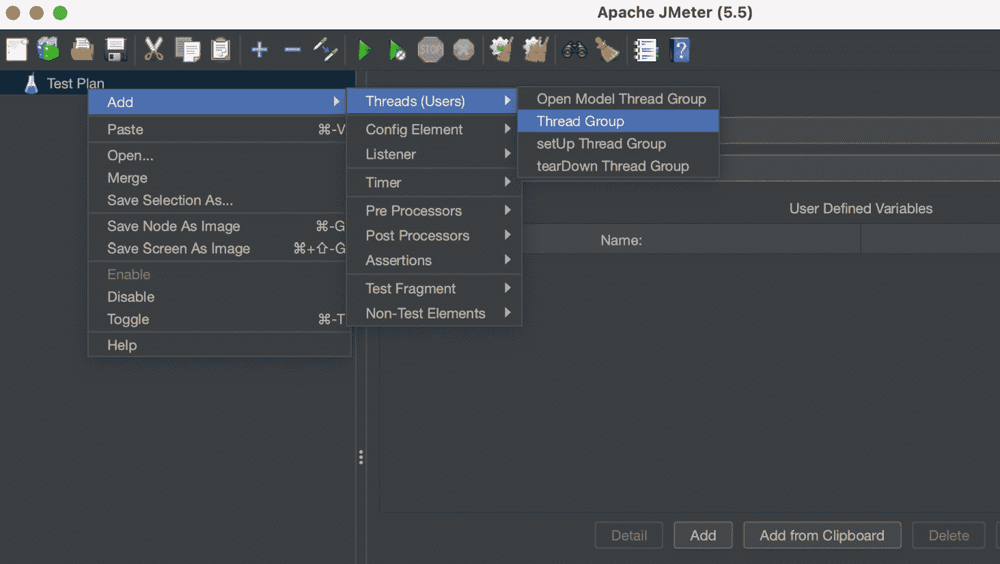

图-11.2 – 添加线程组

在**线程组**创建向导中，填写线程组的名称并输入线程属性，如图下所示：

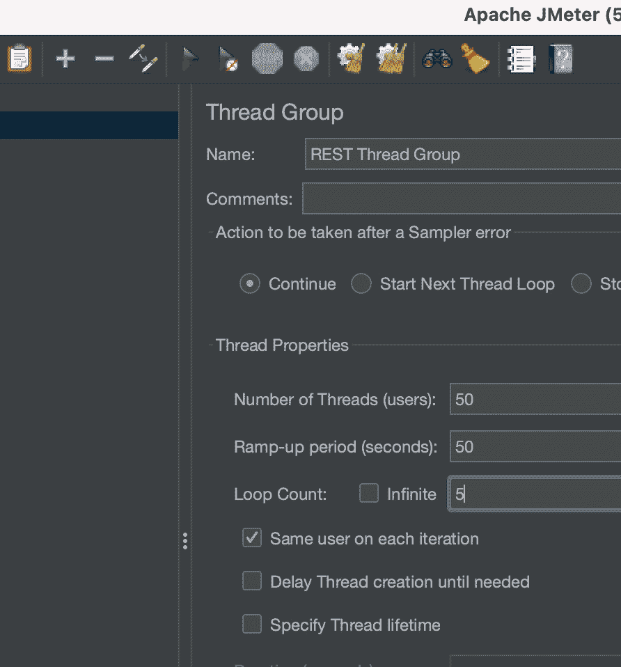

图 11.3 – 线程组创建向导

如您所见，**线程数（用户）**、**循环次数**和**预热时间（秒）**已经配置。让我们尝试理解这些术语：

+   **线程数（用户）**对应于同时发起请求的用户数量，如图下所示：

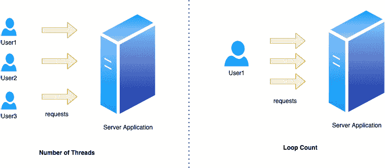

图 11.4 – 线程数与循环次数的关系

+   `5`。因此，一个用户向服务器发送 5 个请求。

+   `50`和`50`。因此，在启动下一个用户之前有一个 1 秒的延迟。

现在我们已经配置了线程组，让我们尝试添加 JMeter 元素。

1.  **配置 JMeter 元素**：现在，我们将添加一个名为 HTTP 请求的 JMeter 配置元素。这有助于在负载测试中进行 REST 或 Web 服务调用。右键点击 **REST 线程组** 并选择 **添加** | **采样器** | **HTTP 请求**，如图下截图所示：

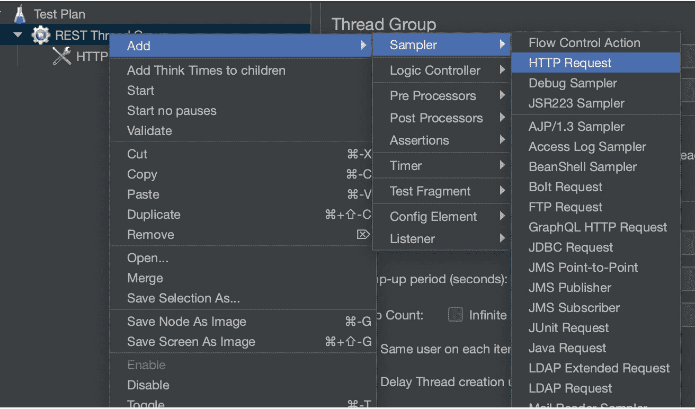

图 11.5 – 添加采样器

设置 `http`、`8080`（如果运行在本地机器上）、`GET` 和我们的 **路径**，如图下截图所示：

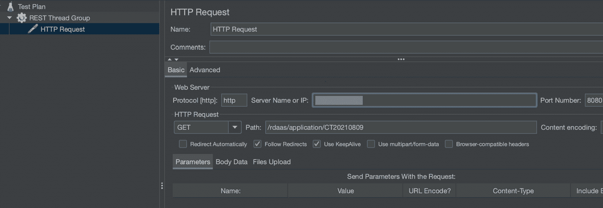

图 11.6 – 配置 HTTP 请求采样器

现在我们已经配置了 HTTP 请求采样器，我们需要添加一些 JMeter 元素来监控和发布性能报告。为此，我们必须配置一个或多个监听器。

1.  **添加监听器**：要创建性能基准，我们必须添加三个监听器，如下所示：

    1.  **总结报告**

    1.  **聚合报告**

    1.  **响应时间图**

添加监听器的步骤与配置任何新的监听器类似。在此，我们将演示如何添加聚合性能基准，如下所示：

1.  右键点击 **REST 线程组**，然后选择 **添加** | **监听器** | **聚合报告**，如图下截图所示：

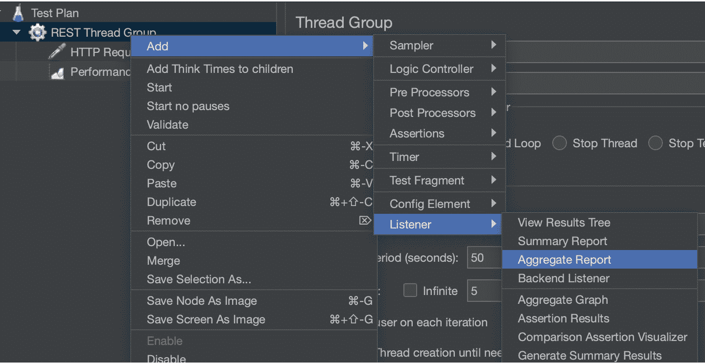

图 11.7 – 添加监听器

1.  在 **聚合报告** 的配置向导中将报告重命名为 `聚合性能基准`，如图下截图所示：

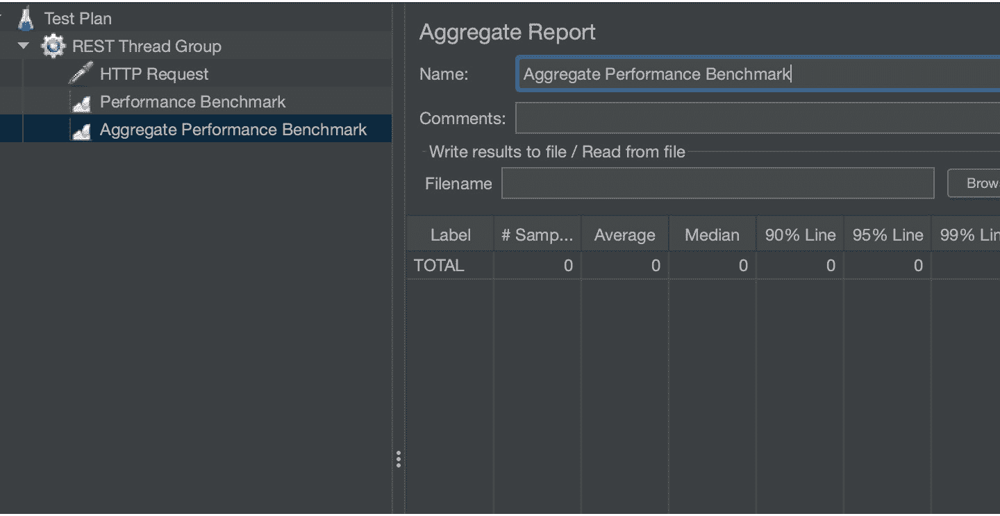

图 11.8 – 配置聚合报告监听器

按照类似的步骤设置 **总结报告** 和 **响应时间图** 监听器。通过这样做，我们将准备好运行测试并生成报告。

1.  **运行负载测试并创建基准**：通过点击以下截图中用红色圈出的启动符号来运行测试：

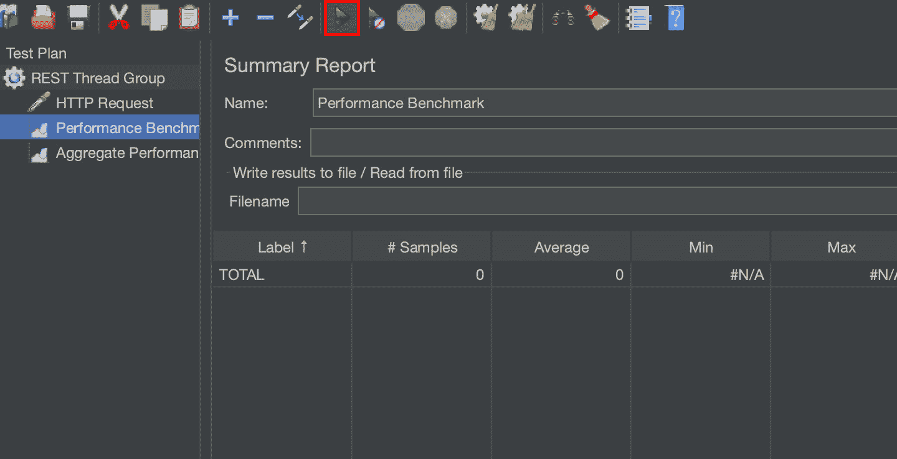

图 11.9 – 通过点击运行按钮运行性能测试

在成功执行性能测试后，将生成以下报告：

+   **总结报告**：此报告提供了性能基准的总结，并显示了请求的平均、最小和最大响应时间。您还可以看到应用程序的平均吞吐量。以下截图显示了基准结果的总结：

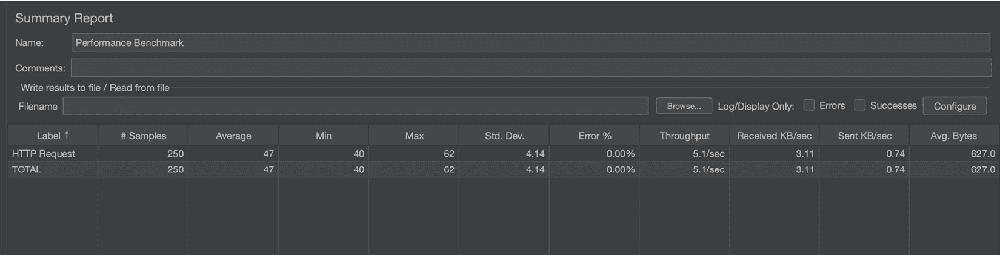

图 11.10 – 生成的总结基准报告

注意前一个截图中的 **# 样本** 列；其值为 **250**。样本值的计算使用以下公式：

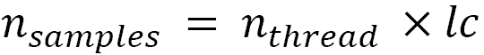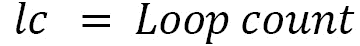

+   **综合报告**：这表示聚合基准测试报告。除了显示平均、中位数和最大响应时间外，它还有如**90%线**和**95%线**等列。**90%线**列表示 90%请求的平均响应时间。它假设 10%的请求包含异常值。同样，**95%线**假设 5%的请求是异常值。以下截图显示了聚合的性能基准测试：

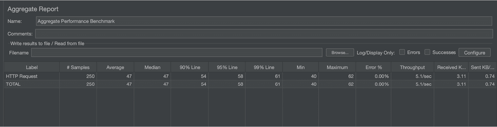

图 11.11 – 生成的聚合基准测试报告

+   **响应时间图**：性能基准测试可以包含多个图表或表格来测试应用性能。响应时间图描绘了在不同时间线记录的响应时间：

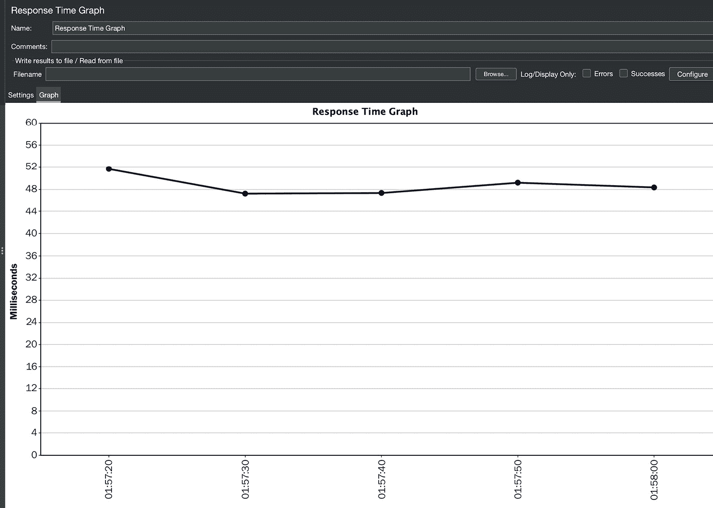

图 11.12 – 生成的响应时间图

在性能基准测试活动中，很多时候我们会进行对比研究，这些报告被用来创建一个综合报告或图形可视化，比较两个不同解决方案的性能基准。

在本节中，我们学习了为什么需要基准测试，以及在我们对解决方案进行基准测试时需要考虑什么。基准测试为我们提供了一种将我们的应用程序性能分类或分类为好、坏或一般的方法。在下一节中，我们将了解如何提高我们的性能并优化我们的数据工程解决方案。

# 优化性能

做基准测试、性能测试和监控系统应用和系统的主要原因是出于一个目标——优化性能，以便系统能够发挥其最佳潜力。卓越软件与普通软件之间的区别在于系统调整得有多好以实现更好的性能。在本节中，我们将了解您可以使用各种技术来微调您的数据工程管道。尽管性能调整是一个广泛的话题，但当涉及到各种数据工程解决方案时，我们将尝试涵盖基于 Java 的数据工程解决方案优化的基础知识。在接下来的子节中，我们将简要介绍各种性能调整技术。

## Java 虚拟机（JVM）和垃圾回收优化

**Java 虚拟机**（**JVM**）性能调整是调整各种 JVM 参数或参数以适应我们应用程序的需求，以便它能发挥最佳性能的过程。

JVM 调整涉及两种优化，如下所示：

+   堆空间优化

+   **垃圾回收**（**GC**）优化

但在我们讨论这些优化之前，值得注意的是，JVM 调整应该是调整应用程序性能的最后手段。我们应该从调整应用程序代码库、数据库和资源可用性开始。

### JVM 堆空间概述

在我们深入探讨 JVM 和 GC 调优之前，让我们花些时间了解 JVM 堆空间。

以下图表显示了 JVM 堆空间的外观：

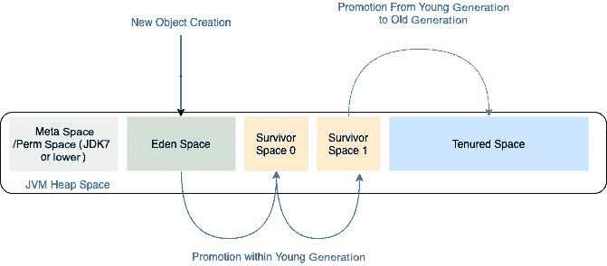

图 11.13 – JVM 堆空间

如我们所见，JVM 堆空间被划分为四个部分，如下所示：

1.  元空间或 Perm 空间

1.  Eden Space

1.  Survivor 空间

1.  Tenured 空间

元空间（在较老的 JDK 版本中称为 Perm 空间）存储堆的元数据。

Java 对象根据其存活时间从 Eden Space 提升到 Tenured Space。以下步骤显示了 Java 对象如何被提升：

1.  Java 应用程序新创建的对象被存储在*Eden Space*中。

1.  当*Eden Space*满时，会发生一个小的 GC 事件，并且仍然被 Java 应用程序引用的对象被提升到*Survivor Space 0*。

1.  再次，在下一个周期中，当*Eden Space*满时，会触发第二个小的 GC 事件。首先，它会将所有仍然被应用程序引用的对象从*Survivor Space 0*移动到*Survivor Space 1*，然后它将引用对象从*Eden Space*提升到*Survivor Space 0*。

1.  当引用对象从*Survivor Space 1*提升到*Tenured Space*时，会发生一个主要的 GC 事件。被提升到 tenured space 的对象被称为老年代对象。*Eden Space*、*Survivor Space 0*和*Survivor Space 1*对象是年轻代对象。

之前，我们讨论了如何通过小 GC 和大 GC 来释放堆空间。但是，GC 是否有单一的方式或多种方式？如果是的话，我们应该选择哪种，以及在何时选择？我们将在下一节中探讨这个问题。

重要注意事项

**垃圾收集**是一个自动确定 JVM 中哪些内存不再被 Java 应用程序使用，并将该内存回收以供其他用途的过程。

### 垃圾收集器类型

以下是一些不同的 GC 类型：

+   **串行垃圾收集器**：单个 GC 适用于单线程应用程序。在执行垃圾收集时，它会冻结所有应用程序线程，并使用单个线程进行操作。

+   **并行垃圾收集器**：并行 GC 也会冻结应用程序的所有线程，但使用多个线程进行垃圾收集。因此，应用程序线程的暂停间隔大大减少。它旨在适用于多处理器环境或具有中等和大数据量的多线程环境。

+   **并发标记清除（CMS）垃圾收集器**：从其名称中可以看出，垃圾收集工作与应用程序并发执行。因此，它不需要应用程序线程暂停。相反，它与应用程序线程共享线程以进行并发清除执行。然而，它需要短暂暂停应用程序线程进行**初始标记暂停**，在那里它最初标记活动对象。然后，第二次暂停，称为**remark 暂停**，暂停应用程序线程，并用于查找需要收集的任何 Java 对象。这些 Java 对象是在并发跟踪阶段创建的。以下图表解释了串行、并行和 CMS GC 之间的区别：

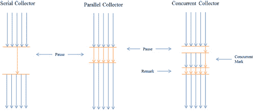

图 11.14 – 单一、并行和 CMS 垃圾收集器的区别

如我们所见，串行收集器使用单个线程进行垃圾收集，同时暂停所有应用程序线程。并行收集器暂停应用程序线程，但由于它使用多个线程来完成工作，因此暂停时间更短。另一方面，CMS 在初始标记阶段之后与应用程序线程并发运行。

+   **G1 垃圾收集器**：这是一个相对较新的 GC，在 Java 7 及以后的版本中引入。它依赖于一个用于并发垃圾收集的新算法。它与应用程序线程并行运行其较长时间的工作，并通过暂停线程来运行较快的任务。它使用内存清理的驱逐风格工作。对于内存清理的驱逐风格，G1 收集器将堆划分为区域。每个区域都是一个小的、独立的堆，可以动态分配给 Eden、Survivor 或 Tenured Space。以下图表显示了 G1 收集器如何看待数据：

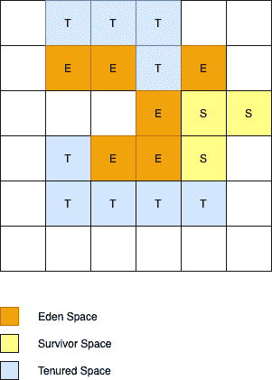

图 11.15 – G1 垃圾收集器将堆空间划分为区域

GC 简单地从某一区域复制数据到另一区域。这需要保留并标记旧区域为空白。

+   **Z 垃圾收集器**：这是一个用于非常可扩展的低延迟实现的实验性 GC。

在 GC 方面，以下几点应予以注意：

+   小型 GC 事件应尽可能收集尽可能多的已死亡对象，以减少完全 GC 的频率。

+   当 GC 事件有更多可用内存时，可以实现更有效的对象清理。更有效的对象清理确保完全 GC 事件的频率更低。

+   在使用 GC 进行性能调整的情况下，你只能调整三个参数中的两个 – 那就是吞吐量、延迟和内存使用。

接下来，让我们看看如何使用 GC 调整性能。

### 使用 GC 调整性能

使用 GC 设置进行性能调整也称为 GC 调整。我们必须遵循以下步骤来执行 GC 调整：

1.  **调查内存占用**：查找由于 GC 引起的任何性能问题的最常用方法之一是内存占用，它存在于 GC 日志中。GC 日志可以在不影响性能的情况下从 Java 应用程序中启用和生成。因此，它是调查生产中性能问题的流行工具。您可以使用以下命令启用 GC 日志：

    ```java
    -XX:+PrintGC -XX:+PrintGCDetails -XX:+PrintGCTimeStamps -Xloggc:<filename>
    ```

下面的屏幕截图显示了典型的 GC 日志看起来像什么：

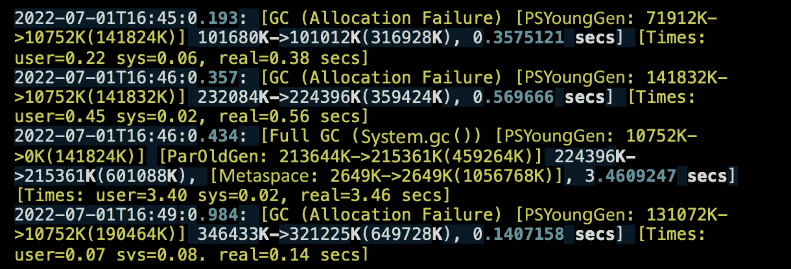

图 – 11.16 – 示例 GC 日志

在前一个屏幕截图中，每一行都显示了各种 GC 信息。让我们关注日志的第三行，它显示了一个完全 GC 事件：

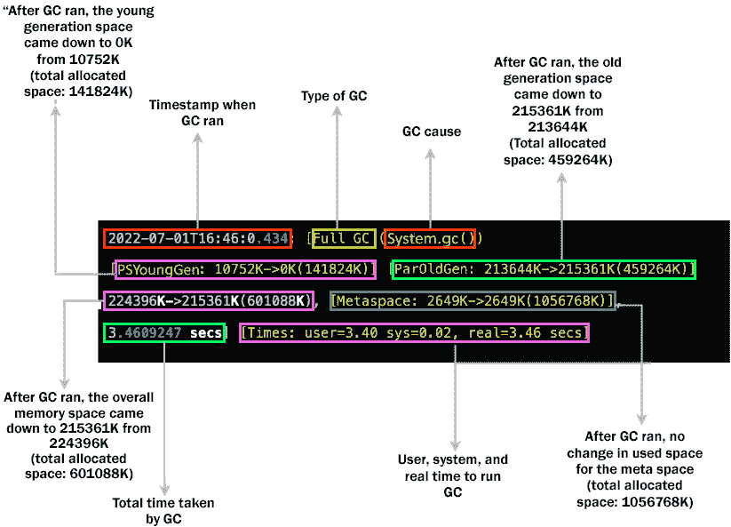

图 – 11.17 – GC 日志语句的解剖

如前图所示，让我们分析 GC 日志语句并了解其各个部分：

+   `2022-07-01T16:46:0.434`: GC 事件发生的日期和时间戳。

+   `Full GC`: 此字段描述了 GC 的类型。它可以是完全 GC 或 GC。

+   `[PSYoungGen: 10752K->0K(141824K)]`: GC 事件发生后，年轻代中使用的所有空间都被回收了。括号内的值(`141824K`)表示年轻代分配的总空间。

+   `[ParOldGen: 213644K->215361K(459264K)]`: GC 运行后，旧代的使用空间从`213644K`增加到`215361K`。旧代分配的总内存为`459264K`。

+   `224396K->215361K(601088K)`: GC 运行后，使用的总内存从`224396K`减少到`215361K`。总分配内存为`601088K`。

+   `[Metaspace: 2649K->2649K(1056768K)]`: 由于 GC，元空间没有回收任何内存。总共分配的元空间为`1056768K`。

+   `3.4609247 secs`: GC 所花费的总时间。

+   `[Times: user=3.40 sys=0.02, real=3.46 secs]`: 这部分日志语句告诉我们垃圾收集所花费的时间。`user`时间告诉处理器 GC 执行所花费的时间。`sys`时间表示 I/O 和其他系统活动所花费的时间。最后，`real`时间表示完成 GC 事件所花费的总时间。

根据这些痕迹，我们可以确定是否需要增加堆空间或元空间，并指定应用程序中发生的任何内存泄漏。

1.  **内存调整**：如果列出以下观察结果，则可能会发生内存泄漏：

    +   JVM 堆大小频繁被填满

    +   年轻代空间正在被完全回收，但每次 GC 运行后，旧代的使用空间都在增加。

在决定是否是真正的内存泄漏问题之前，您应该使用以下命令增加堆空间：

```java
-Xms<heap size>[unit] // for min heap size
-Xmx<heap size>[unit] //for max heap size
//unit can be g(GB),m(MB) or k(KB)
```

如果这不起作用，那么最可能的原因是内存泄漏。

如果我们发现年轻代空间频繁被填满，或者元空间被大量使用，我们可以计划使用以下命令更改所有这些区域的总分配空间：

+   `-XX:MaxMetaspaceSize`：这设置可以分配给类元数据的最大内存量。默认值是 `infinite`（或与堆空间相同）。

+   `-XX:MetaspaceSize`：设置分配的类元数据阈值的阈值，超过该阈值将触发垃圾回收。

+   `-XX:MinMetaspaceFreeRatio`：垃圾回收后需要可用的元空间内存区域的最小百分比。如果剩余的内存量低于阈值，元空间区域将调整大小。

+   `-XX:MaxMetaspaceFreeRatio`：垃圾回收后需要可用的元空间内存区域的最大百分比。如果剩余的内存量高于阈值，元空间区域将调整大小。

+   `-XX:NewSize`：这设置年轻代空间的初始大小。

+   `-XXMaxNewSize`：这指定了年轻代空间的最大大小。

+   `-Xmn`：这指定了整个年轻代空间的大小，即 Eden 和两个幸存空间。

1.  `-XX:+G1GC` 命令。

1.  将 `-Xmx` 和 `-Xms` 设置为相同的值以减少应用程序暂停间隔。

1.  将 `-XX:+AlwaysPreTouch` 标志设置为 `true`，以便在应用程序启动时加载内存页面。

1.  如果你正在使用 G1，检查是否是小垃圾回收（Minor GC）或完全垃圾回收（Full GC）花费了更多的时间。如果小垃圾回收花费了更多的时间，我们可以减少 `-XX:G1NewSizePercent` 和 `-XX:G1MaxNewSizePercent` 的值。如果主要垃圾回收花费了更多的时间，我们可以增加 `-XX:G1MixedGCCountTarget` 标志的值，这将有助于将持久垃圾回收分散到多次运行中，并减少完全垃圾回收事件的频率。

+   使用 `-XX:MaxGCPauseMillis` 属性在单个垃圾回收运行中清理更多垃圾。然而，这可能会影响你的延迟。*   通过设置 `-XX:+AlwaysPreTouch` 和 `-XX:+UseLargePages` 标志，在应用程序启动时将内存页面加载到内存中。

重要提示

**延迟**是处理和发送事件、消息或数据到其目的地所花费的总时间。另一方面，**吞吐量**是在指定时间段内处理的记录、事件或消息的数量。

虽然 JVM 和 GC 调优是一个庞大的主题，但我们简要尝试涵盖一些重要的 JVM 和 GC 调优技术，以提高吞吐量和延迟。在下文中，我们将讨论如何优化大数据加载。

## 大数据性能调优

大数据性能调优是一个巨大的主题。为了简洁，我们将限制自己只介绍一些通常应用于最流行的大数据处理技术（即 Spark 和 Hive）的性能调优技巧和窍门。

### Hive 性能调优

**Hive 性能调优**是提高和加速您 Hive 环境性能的过程和技术的集合。以下是一些常见的 Hive 性能问题：

+   **运行缓慢的查询**：通常，您会注意到您的 Hive 查询需要花费大量时间才能完成。运行缓慢的查询可能有几个原因。以下是一些常见的运行缓慢查询场景及其解决方案：

    +   编写不良的查询会导致交叉连接或全外连接。当任一表的连接列有重复或查询中发生自连接时，可能会发生意外的交叉连接。尽可能优化您的 Hive 查询以避免交叉连接。

    +   如果其中一个连接表包含少量数据，可以通过应用 map-side join 来提高运行缓慢查询的速度。在 map-side join 中，较小的数据集被广播到所有 mapper 节点，以便在本地进行连接而无需大量洗牌。map-side join 的缺点是，较小表中的数据需要足够小，以便适合内存。

    +   对于适合 map-side join 的场景，我们可以进一步通过将需要连接的表进行分桶来提高速度。**分桶**是一种技术，根据连接列将 Hive 表中的数据分成固定数量的范围或簇。分桶表可用于 **桶映射连接**或**排序合并分桶（SMB）映射连接**，这两种方式都比普通映射连接表现更好。然而，只有当一张表的总桶数是另一张表桶数的倍数时，分桶表才能相互连接。例如，Table1 有 2 个桶，Table2 有 4 个桶。由于 4 是 2 的倍数，这些表可以连接。

    +   有时，数据会迅速增长，这会导致 Hive 作业变慢。在这种情况下，map-side 操作会花费大量时间。为了克服这些问题，请使用分区。

    +   如果您注意到数据读取速度慢或数据洗牌速度相当慢，请检查所使用的 *数据格式* 和 *压缩*。例如，Parquet 和 ORC 等列式结构比 JSON 性能高 5% 到 10%。列式格式也已知比 JSON 具有大约 90% 的更高压缩率。更多压缩的数据可以减少大量的网络延迟，从而提高整体性能。

    +   通过将 *执行引擎* 从 map-reduce 更改为 Tez 或 Spark，可以显著提高 Hive 的执行速度。您可以通过在 Hive 配置文件中设置以下参数来实现这一点：

        ```java
        <property>
          <name>hive.execution.engine</name>
          <value>spark</value>
        </property>
        ```

+   `TimeoutException`，很可能是你遇到了*小文件问题*。这发生在数百万个小文件（其大小小于 128MB 的块大小）被写入 Hive 表的外部路径时。每个 HDFS 文件都有存储在 Hadoop 的 NameNode 中的元数据。Hive 表中过多的文件会导致作业读取过多的元数据。因此，作业可能由于内存溢出或超时异常而失败。在这种情况下，可以运行压缩作业（参考*第七章*的*核心批量处理模式*部分，*核心架构设计模式*）或将数据存储在顺序文件中。

因此，我们已经讨论了各种 Hive 优化技术，这些技术用于微调 Hive 查询速度和性能。现在，让我们看看 Spark 性能调优。

### Spark 性能调优

Spark 是最受欢迎的大数据处理引擎。当 Spark 应用程序得到适当调整时，它可以在保持关键流程 SLA 的同时降低资源成本。这对云和本地环境都很重要。

一个 Spark 调优作业从调试和观察 Spark 作业执行期间发生的问题开始。您可以使用 Spark UI 或任何分析应用程序（如 Datadog）来观察各种指标。

以下是一些在处理 Spark 应用程序时常用的 Spark 优化最佳实践：

+   **序列化**：

    +   *问题*：从 Hive 表或 HDFS 读取数据缓慢

    +   *原因*：默认的 Java 序列化器降低了从 Hive 或 HDFS 读取数据的读取速度

    +   *解决方案*：为了克服这个问题，我们应该将默认序列化器设置为 Kryo 序列化器，它执行更快的 Serde 操作

+   **分区大小**：

    +   *问题*：由于一个或两个执行器在众多执行器中花费了更多的时间来完成任务，Spark 作业运行缓慢。有时，作业会因为性能较慢的执行器而挂起。

    +   *原因*：可能的原因是数据倾斜。在这种情况下，你会发现性能较慢的执行器正在处理大部分数据。因此，数据没有很好地分区。

    +   *解决方案*：在进一步处理数据之前，重新分区加载到 Spark DataFrame 中的数据。

让我们看看另一个与分区相关的常见问题：

+   *问题*：由于所有执行器都负载过重，所有执行器处理作业的时间都很长，Spark 作业正在变慢。

+   *原因*：可能的原因是数据量过大，而你运行的 Spark 作业分区数量却很少。

+   *解决方案*：重新分区 Spark DataFrame 中加载的数据，并增加分区数量。调整分区数量，直到达到最佳性能。

在 Spark 中遇到的另一个常见问题是以下内容：

+   *问题*：Spark 作业需要写入单个文件作为输出，但作业在最后一步卡住了。

+   *原因*：由于您使用了`repartition()`来创建单个输出文件，因此发生了完整的数据洗牌，这阻碍了性能。

+   *解决方案*：使用`coalesce()`代替`repartition()`。`coalesce()`避免进行完整的洗牌操作，因为它从所有其他分区收集数据并将数据复制到包含最多数据的选定分区。

+   `OutofMemoryException`、GC 开销内存超过或 JVM 堆空间溢出。

+   *原因*：驱动器和执行器内存以及 CPU 核心的配置效率低下。

+   *解决方案*：没有一种解决方案。在这里，我们将讨论可以用来避免低效的驱动器和执行器资源配置的各种最佳实践。在我们开始之前，我们将假设您对 Apache Spark 有基本的了解，并知道其基本概念。如果您是 Apache Spark 的新手，您可以阅读这篇关于 Spark 架构基础的简要博客：[`www.edureka.co/blog/spark-architecture/`](https://www.edureka.co/blog/spark-architecture/)。

+   对于执行器和驱动器的大小调整，我们需要为 Spark 作业优化设置总共五个属性。它们如下：

    +   使用以下属性计算`5`：

    ```java
    5. So, in a node, the maximum number of executors will be 3 (16 cores / 5 executor-cores per executor). So, for three nodes, we will have a total of 9 executors (3 nodes x 3 executors/nodes). However, according to the best practice documentation of Spark, the executor cores per executor should be the same as the driver core. Hence, we would require 1 worker to work out of the 9 workers as the application driver. Hence, the number of executors will become 8 (9 workers – 1 driver worker). As a general formula, you can use the following: 
    ```

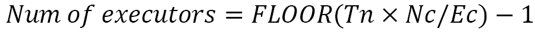

在这里，Nc 表示每个节点的核心数，Ec 表示每个执行器的执行器核心数，Tn 表示节点的总数。

在这个用例中，*Nc*是 16，*Ec*是 5，*Tn*是 3。因此，我们得到相同的结果 8（`FLOOR`(16*3/5) -1）。

通过这样，我们已经讨论了如何最优地设置驱动器和执行器属性。然而，对于在 YARN 集群上运行的 Spark 3.0 及以上版本，启用动态分配更有意义。虽然您可以设置执行器核心的最小值和最大值，但您必须让环境本身确定所需的执行器数量。在讨论过这个问题后，您可能还想设置最大执行器数量的上限（通过使用`spark.dynamicAllocation.maxExecutors`属性）。

+   **执行器内存或 executor-memory**：为了计算最优执行器内存，我们需要了解执行器使用的总内存量。执行器使用的总内存是执行器内存和内存开销的总和：

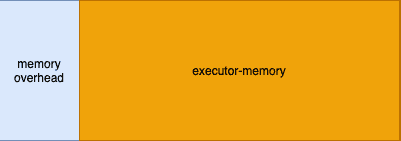

图 11.18 – 执行器使用的总内存 = 内存开销 + 执行器内存

执行器的内存开销默认为执行器内存大小的 10%或 384 MB 之间的较大值。现在，为了找到正确的执行器内存大小，我们需要查看 YARN 资源管理器的**节点**标签页。**节点**标签页中的每一条记录都将有一个**总内存列**，如下面的截图所示：

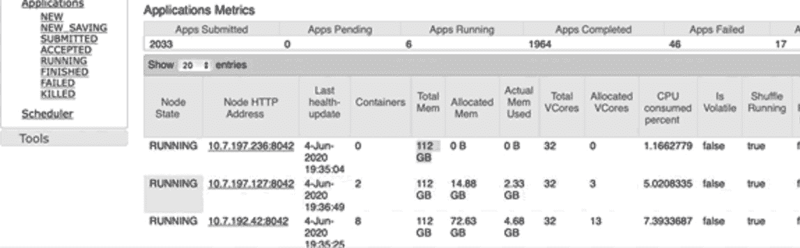

图 11.19 – 节点中执行器的可用总内存

在前面的屏幕截图上，节点为执行器和驱动器提供了总共**112 GB**的内存，在为集群管理器预留内存之后。现在，我们必须使用以下公式来计算这个执行器的内存开销：

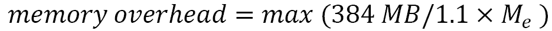

让我们尝试使用之前描述的例子来计算执行器内存。我们将把可用的节点内存除以每个节点的总执行器数量。然后，我们将这个结果除以 1.1。计算执行器内存的公式如下：

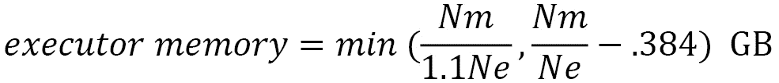

在这里，*Nm* 是总节点内存，而 *Ne* 是每个节点的执行器数量。

在我们的场景中使用前面的公式，执行器内存应该是 36.94 GB（112/3 – .384）。因此，我们可以将执行器内存设置为 36 GB。

+   `1`.

+   **驱动器内存或 driver-memory**：驱动器内存要么小于或等于执行器内存，要么等于执行器内存。根据特定场景，这个值可以设置为小于或等于执行器的内存。在驱动器内存问题的情况下，建议的一种优化是将驱动器内存设置为与执行器内存相同。这可以加快性能。

+   **有向无环图（DAG）优化**：让我们看看一些你可以通过 DAG 优化解决的问题：

    +   *问题*：在 DAG 中，我们可以看到多个阶段在所有任务或操作方面都是相同的。

    +   *原因*：DataFrame，表示为 d1，正在被用来派生出多个 DataFrame（例如 – d2、d3 和 d4）。由于 Spark 是惰性计算的，当创建每个 DataFrame（d2、d3 和 d4）时，d1 会每次都重新计算。

    +   *解决方案*：在这种情况下，我们必须使用`Dataset<T> persist(StorageLevel newLevel)`方法持久化依赖的 DataFrame（d1）。

既然我们已经讨论了大数据的性能调优，那么让我们学习如何调整实时应用。

## 优化流式应用

现在，让我们学习如何优化流式应用。在这里，我们的讨论将主要关注 Kafka，因为我们在这本书的早期已经讨论过它。当涉及到流式应用时，我们可以调整它们的延迟和吞吐量。在本节中，我们将学习如何观察 Kafka 中的性能瓶颈。然后，我们将学习如何优化生产者和消费者。最后，我们将讨论一些有助于调整整体 Kafka 集群性能的小技巧和技巧。

### 观察流式应用中的性能瓶颈

任何调优的第一件事就是监控和找出问题所在及其发生的位置。对于实时流处理应用来说，这一点至关重要。市面上有许多 Kafka 可观察性工具，例如 Lenses 和**Confluent Control Center**（**C3**）。在这里，我们将看看 C3 如何帮助我们观察异常。

当您导航到 C3 中的任何主题时，您将看到三个标签页 – **生产者**、**消费者**和**消费者延迟**。**消费者延迟**标签页可以告诉您消费者是否缓慢。以下截图显示，在从主题读取数据时，消费者（组）落后**1,654**条记录：

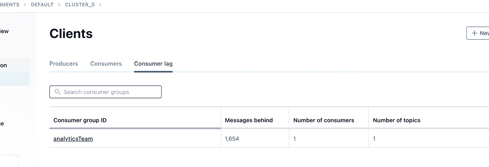

图 11.20 – 消费者延迟

前面的截图还显示了该消费者组的活跃消费者数量。这可以表明消费者是否被设置为利用主题的全部性能潜力。要了解更多信息，请点击**消费者组 ID**属性（在前面截图中为**analyticsTeam**）。您将看到以下屏幕：

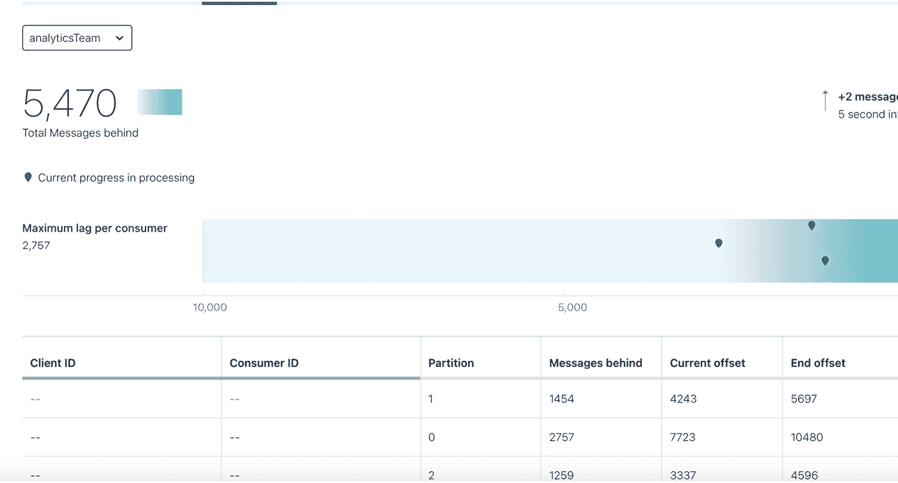

图 11.21 – 分区消费者延迟

前面的截图显示了消费者组分区级别的延迟。从*图 11.19*和*图 11.20*可以看出，只有一个消费者正在运行，但该主题有三个分区。正如我们所看到的，通过增加消费者组中的消费者数量，我们可以调整消费者应用程序。同样，我们可以查看主题的生产者速度与消费者速度，并找出生产者中的任何缓慢之处。

### 生产者调优

以下是一些针对 Kafka 生产者的常见调优技术：

+   当生产者向 Kafka 代理发送消息时，它会收到一个确认。`acks=all`属性以及`min.insync.replicas`的值决定了生产者的吞吐量。如果`acks=all`被设置，并且确认需要更长的时间来到来（因为它必须在发送确认之前写入所有副本），那么生产者就不能再产生任何消息。这会大大降低吞吐量。在这里，我们必须在持久性和吞吐量之间做出选择。

+   具有幂等性的生产者确保消息的精确一次投递。然而，这也有代价：它会降低生产者的吞吐量。因此，系统必须在去重和吞吐量之间做出选择。在使用幂等性生产者时，可以通过增加`max.in.flight.requests.per.connection`的值来略微提高吞吐量。

+   提高吞吐量的方法之一是增加`batch.size`属性的值。尽管生产者用于发送消息，但它是以异步方式进行的（对于大多数应用）。生产者通常有一个缓冲区，在将记录发送到 Kafka 代理之前，生产记录会被批量处理。将记录批量发送到代理可以提高生产者的吞吐量。然而，随着`batch.size`值的增加，延迟也会增加。将`batch.size`设置为平衡的值，以便在不严重影响延迟的情况下获得最佳吞吐量。

+   `Linger.ms`是另一个属性，当 Kafka 生产者缓冲区中的消息发送到 Kafka 代理时受到影响。`linger.ms`的值越高，吞吐量和延迟就越高。同样，它必须以平衡的方式设置，以获得最佳吞吐量和延迟。对于极大量的数据，较高的`linger.ms`值可以显著提高性能。

有了这些，我们已经简要讨论了生产者优化的技术。现在，让我们找出如何优化 Kafka 消费者的性能。

### 消费者调优

以下是一些你可以利用的技巧和窍门来优化消费者，以充分利用消费者可能带来的潜在改进：

+   为了使消费者以最优化方式消费，消费者的总数应等于分区的数量。在多线程 Kafka 消费者中，消费者组中所有消费者线程的总数应等于主题分区的数量。

+   另一个导致消费者变慢的典型场景是消费者过多的重新平衡。如果轮询和处理`max.poll.records`所需的时间超过`max.poll.interval.ms`的值，就会发生这种情况。在这种情况下，你可能想增加`max.poll.interval.ms`的值或减少`max.poll.records`的值。

+   在消费者无法发送心跳或由于网络延迟导致心跳包发送缓慢的场景中，可能会发生重新平衡。如果我们对静态消费者（消费者静态映射到分区）没有问题，我们可以为消费者组中的每个消费者实例配置一个唯一的`group.instance.id`值。这将增加下线消费者的延迟，但将确保其他分区的延迟和吞吐量极高，因为它将避免不必要的消费者重新平衡。

+   由于`consumer.commitSync()`在成功提交之前会阻塞线程，所以在大多数情况下，它可能比`consumer.commitAsync()`慢。然而，如果发生致命错误，使用`commitSync()`来确保在消费者应用程序关闭之前消息被提交是有意义的。

尽管我们主要讨论了 Apache Kafka，但其他支持流处理的替代产品，如 Apache Pulsar 和 AWS Kinesis，也有类似的性能调优技术。

## 数据库调优

数据库调优是性能调优中的重要活动。它包括 SQL 调优、从数据库表中的数据读写调优、数据库级调优以及在创建数据模型时进行优化。由于这些内容在各个数据库之间差异很大（包括 SQL 和 NoSQL 数据库），因此数据库调优不在此书的范围之内。

现在，让我们总结一下本章所学的内容。

# 摘要

我们从理解性能工程是什么以及学习性能工程生命周期开始本章。我们还指出了性能工程与性能测试之间的区别。然后，我们简要讨论了各种可用的工具，这些工具可以帮助进行性能工程。我们了解了性能基准测试的基础以及创建基准时需要考虑的因素。接着，我们学习了各种性能优化技术以及如何将它们应用到 Java 应用程序、大数据应用程序、流式应用程序和数据库中。

有了这些，我们已经学会了如何为基于批处理和实时数据工程问题进行性能工程。在下一章中，我们将学习如何评估多个架构解决方案以及如何提出建议。
