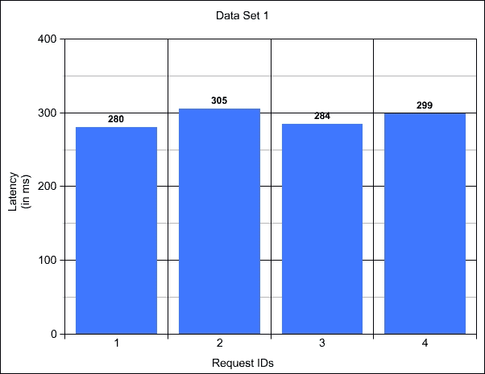

# 第一章 性能之路

我们欢迎你踏上学习实用方法使用 Scala 编程语言和函数式编程范式的旅程，以编写性能和高效的软件。函数式编程概念，如纯函数和高级函数、引用透明性和不可变性，是理想化的工程品质。它们使我们能够编写可组合的元素、可维护的软件，以及易于理解和推理的代码。然而，尽管功能编程具有所有这些优点，但它往往被错误地与性能下降和低效的代码联系起来。我们的目标是说服你相反的观点！本书探讨了如何利用函数式编程、Scala 语言的功能、Scala 标准库和 Scala 生态系统来编写性能软件。

Scala 是一种静态和强类型语言，它试图优雅地融合函数式和面向对象范式。在过去几年中，它因其吸引力和实用性而越来越受欢迎，成为在函数式范式下编写生产级软件的选择。Scala 代码编译成字节码，在**Java 虚拟机**（**JVM**）上运行，该虚拟机具有广泛理解的运行时环境，可配置，并提供出色的工具来检查和调试正确性和性能问题。一个额外的优势是 Scala 与 Java 的出色互操作性，这允许你使用所有现有的 Java 库。虽然 Scala 编译器和 JVM 不断得到改进，并且已经生成良好的优化字节码，但实现性能目标的责任仍然在你，即开发者身上。

在深入探讨 Scala 和 JVM 的具体细节之前，让我们首先培养对所追求的圣杯——性能——的直觉。在本章中，我们将介绍与编程语言无关的性能基础知识。我们将展示并解释本书中使用的术语和概念。

尤其是以下主题：

+   定义性能

+   总结性能

+   收集度量

我们还将介绍我们的案例研究，这是一个基于现实世界问题的虚构应用程序，它将帮助我们说明后面将要介绍的技巧和模式。

# 定义性能

一个性能词汇表为你提供了一种评估手头问题类型的方法，并常常帮助你找到解决方案。尤其是在时间紧迫的情况下，强烈的直觉和纪律性的策略是解决性能问题的资产。

让我们从形成对“性能”这一术语的共同理解开始。这个术语用于定性或定量地评估实现目标的能力。当前的目标可能会有很大的不同。然而，作为一名专业的软件开发人员，目标最终会与商业目标相联系。与您的业务团队合作，确定业务领域性能敏感性至关重要。对于一个面向消费者的购物网站，就同时在线应用用户数量和可接受的请求响应时间达成一致是相关的。在一家金融交易公司，交易延迟可能是最重要的，因为速度是竞争优势。同时，也要考虑到非功能性需求，例如“交易执行永远不会丢失”，这是由于行业法规和外部审计。这些领域约束也会影响您软件的性能特征。构建一个清晰且达成共识的领域图景是至关重要的第一步。如果您无法定义这些约束，就无法提供可接受的解决方案。

### 注意

收集需求是本书范围之外的一个复杂话题。如果您想深入了解这个话题，我们推荐 Gojko Adzic 的两本书：《影响映射：用软件产品和项目产生重大影响》（[`www.amazon.com/Impact-Mapping-software-products-projects-ebook/dp/B009KWDKVA`](http://www.amazon.com/Impact-Mapping-software-products-projects-ebook/dp/B009KWDKVA)）和《五十个快速提高您的用户故事的想法》（[`www.amazon.com/Fifty-Quick-Ideas-Improve-Stories-ebook/dp/B00OGT2U7M`](http://www.amazon.com/Fifty-Quick-Ideas-Improve-Stories-ebook/dp/B00OGT2U7M)）。

## 性能软件

设计性能良好的软件是我们作为软件工程师的一个目标。思考这个目标会导致一个常见的问题：“什么样的性能才算足够好？”我们使用“性能良好”这个术语来描述满足“足够好”的最小可接受阈值的性能。我们的目标是达到并尽可能超过可接受性能的最小阈值。考虑这一点：如果没有一个关于可接受性能的协议标准，那么定义性能良好的软件在定义上就是不可能的！这个陈述说明了定义期望结果作为编写性能良好软件的先决条件的压倒性重要性。

### 注意

请花点时间思考一下性能对您领域含义。您是否在维护符合您定义的性能良好的软件时遇到过困难？考虑一下您用来解决性能困境的策略。哪些是有效的，哪些是无效的？随着您阅读本书的进展，请记住这一点，以便您可以检查哪些技术可以帮助您更有效地达到您对性能的定义。

## 硬件资源

为了定义高性能软件的标准，我们必须扩展性能词汇。首先，了解你环境中的资源。我们使用“资源”这个术语来涵盖你的软件运行所需的所有基础设施。参考以下资源清单，它列出了在进行任何性能调优练习之前你应该收集的资源：

+   硬件类型：物理或虚拟化

+   CPU：

    +   核心数量

    +   L1, L2, 和 L3 缓存大小

    +   NUMA 区域

+   RAM（例如，16 GB）

+   网络连接评级（例如，1GbE 或 10GbE）

+   操作系统和内核版本

+   内核设置（例如，TCP 套接字接收缓冲区大小）

+   JVM 版本

列出资源清单迫使你考虑你操作环境的性能和限制。

### 注意

核心优化方面的优秀资源包括 Red Hat 性能调优指南([`goo.gl/gDS5mY`](https://goo.gl/gDS5mY))以及布伦丹·格雷格([`www.brendangregg.com/linuxperf.html`](http://www.brendangregg.com/linuxperf.html))的演示和教程。

## 延迟和吞吐量

延迟和吞吐量定义了两种性能类型，这些类型通常用于建立高性能软件的标准。以下德国高速公路的照片，就像以下照片，是培养对这些类型性能直觉的好方法：

Autobahn 帮助我们思考延迟和吞吐量。（图片来源维基媒体，[`en.wikipedia.org/wiki/Highway#/media/File:Blick_auf_A_2_bei_Rastst%C3%A4tte_Lehrter_See_(2009).jpg`](https://en.wikipedia.org/wiki/Highway#/media/File:Blick_auf_A_2_bei_Rastst%C3%A4tte_Lehrter_See_(2009).jpg)。许可 Creative Commons CC BY-SA 3.0）

延迟描述了观察到的过程完成所需的时间量。在这里，过程是一辆车在高速公路的单车道上行驶。如果高速公路没有拥堵，那么汽车能够快速行驶在高速公路上。这被描述为低延迟过程。如果高速公路拥堵，行程时间增加，这被描述为高延迟或潜伏过程。这个类比也捕捉了你可控的性能优化。你可以想象将一个昂贵的算法从多项式时间优化到线性执行时间，类似于改善高速公路的质量或汽车的轮胎以减少路面摩擦。摩擦的减少使得汽车能够以更低的延迟穿越高速公路。在实践中，延迟性能目标通常以你业务域可容忍的最大延迟来定义。

吞吐量定义了完成一个过程观察到的速率。使用高速公路的类比，单位时间内从 A 点到 B 点行驶的汽车数量是高速公路的吞吐量。例如，如果有三个车道，汽车在每个车道上以均匀的速度行驶，那么吞吐量就是：（在观察期间从 A 点到 B 点行驶的每个车道的汽车数量）* 3。归纳推理可能会暗示吞吐量和延迟之间存在强烈的负相关关系。也就是说，随着延迟的增加，吞吐量会减少。实际上，有许多情况下这种推理并不成立。在我们继续扩展性能词汇以更好地理解为什么会发生这种情况时，请记住这一点。在实践中，吞吐量通常定义为你的软件每秒可以支持的最多事务数。在这里，一个事务意味着你领域中的一个工作单元（例如，处理的订单或执行的交易）。

### 注意

回想一下你最近遇到的性能问题，你会如何描述它们？你遇到了延迟还是吞吐量问题？你的解决方案是否在降低延迟的同时提高了吞吐量？

## 瓶颈

一个瓶颈指的是系统中最慢的部分。按照定义，所有系统，包括调优良好的系统，都有一个瓶颈，因为总有一个处理步骤被测量为最慢的。请注意，延迟瓶颈可能不是吞吐量瓶颈。也就是说，可能同时存在多种类型的瓶颈。这是说明为什么理解你是在对抗吞吐量还是延迟性能问题很重要的另一个例子。通过识别你系统瓶颈的过程，为你提供一个有针对性的焦点来攻击你的性能难题。

从个人经验来看，我们看到了当操作环境清单被忽视时，时间是如何被浪费的。有一次，在我们为一个高吞吐量**实时竞价**（**RTB**）平台工作的时候，我们追查了一个多天的吞吐量问题，但都没有成功解决。在启动了一个 RTB 平台之后，我们开始优化以提高更高的请求吞吐量目标，因为请求吞吐量是我们行业的一个竞争优势。我们的业务团队将每秒 40,000 次请求（RPS）增加到 75,000 RPS 视为一个重要的里程碑。我们的调整工作一直稳定在约 60,000 RPS。这真是一个令人挠头的问题，因为系统似乎并没有耗尽系统资源。CPU 利用率远低于 100%，而之前增加堆空间实验并没有带来改进。

当我们意识到系统是在 AWS 上部署的，并且默认的网络连接配置为 1 千兆以太网时，我们有了“啊哈！”的时刻。系统处理的请求大约为每个请求 2KB。我们进行了一些基本的算术运算，以确定理论上的最大吞吐量率。1 千兆等于 125,000 千字节。125,000 千字节除以每个请求 2 千字节等于理论上的最大 RPS 为 62,500。这个算术运算通过使用名为 iPerf 的工具进行网络吞吐量测试得到了证实。果然，我们已经达到了我们的网络连接极限！

# 总结性能

我们正确地定义了一些关于性能的主要概念，即延迟和吞吐量，但我们仍然缺乏一个具体的量化测量方法。继续我们的例子，即汽车在高速公路上行驶，我们希望找到一种方法来回答“从 A 点到 B 点我应该期望多长时间的驾驶？”这个问题。第一步是在多次旅行中测量我们的旅行时间以收集经验信息。

下表列出了我们的观察结果。我们仍然需要一种方法来解释这些数据点并总结我们的测量结果以给出答案：

| **观察到的旅行** | **旅行时间（分钟**） |
| --- | --- |
| 旅行 1 | 28 |
| 旅行 2 | 37 |
| 旅行 3 | 17 |
| 旅行 4 | 38 |
| 旅行 5 | 18 |

## 平均值的问题

一个常见的错误是依赖于平均值来衡量系统的性能。算术平均值很容易计算。这是所有收集到的值的总和除以值的数量。使用之前的数据点样本，我们可以推断出平均来说，我们应该期望驾驶时间大约为 27 分钟。在这个简单的例子中，很容易看出为什么平均值是一个如此糟糕的选择。在我们的五个观察值中，只有第 1 次旅行接近我们的平均值，而其他所有旅行都相当不同。平均值的基本问题在于它是一个有损的汇总统计量。当从一系列观察值移动到平均值时，信息会丢失，因为不可能在单个数据点中保留原始观察的所有特征。

为了说明平均值如何丢失信息，考虑以下三个代表处理对 Web 服务请求所需测量延迟的数据集：

在第一个数据集中，有四个请求需要 280 毫秒到 305 毫秒的时间才能完成。将这些延迟与第二个数据集中的延迟进行比较，如下所示：

第二个数据集显示了更易变的延迟混合。你更愿意将第一个还是第二个服务部署到你的生产环境中？为了增加更多的多样性，显示了第三个数据集，如下所示：

尽管这些数据集的分布差异很大，但平均值都是相同的，等于 292 毫秒！想象一下，你必须维护代表数据集 1 的网络服务，目标是确保 75% 的客户在 300 毫秒内收到响应。从数据集 3 中计算平均值会给你一种你正在达到目标的印象，而实际上只有一半的客户实际上体验到了足够快的响应（ID 为 1 和 2 的请求）。

## 百分位数拯救了困境

上次讨论中的关键词是“分布”。测量系统性能的分布是确保你理解系统行为的最稳健的方法。如果我们认为平均值不是一个有效的选择来考虑我们测量的分布，那么我们需要找到一个不同的工具。在统计学领域，百分位数符合我们解释观察值分布的标准。百分位数是一个测量值，表示在观察值组中，给定百分比的观察值落入的值。让我们用一个例子来使这个定义更具体。回到我们的网络服务示例，假设我们观察到以下延迟：

| **请求** | **毫秒延迟** |
| --- | --- |
| 请求 1 | 10 |
| 请求 2 | 12 |
| 请求 3 | 13 |
| 请求 4 | 13 |
| 请求 5 | 9 |
| 请求 6 | 27 |
| 请求 7 | 12 |
| 请求 8 | 7 |
| 请求 9 | 75 |
| 请求 10 | 80 |

第 20 个百分位数定义为表示所有观察值 20% 的观察值。由于有十个观察值，我们想要找到表示两个观察值的值。在这个例子中，第 20 个百分位数的延迟是 9 毫秒，因为有两个值（即，总观察值的 20%）小于或等于 10 毫秒（9 毫秒和 7 毫秒）。将这个延迟与第 90 个百分位数进行对比。表示 90% 的观察值的值：75 毫秒（因为十个观察值中有九个小于或等于 75 毫秒）。

当平均值隐藏了我们的测量值的分布时，百分位数为我们提供了更深入的洞察，并突出了尾部观察值（接近第 100 个百分位数的观察值）经历了极端的延迟。

如果你记得本节的开头，我们试图回答的问题是，“从 A 点到 B 点的驾驶时间应该是多长？”在花了一些时间探索可用的工具之后，我们意识到原始问题并不是我们真正感兴趣的。一个更实际的问题是，“90% 的汽车从 A 点到 B 点需要多长时间？”

# 收集测量值

我们的性能测量工具包已经充满了有用的信息。我们定义了一个共同词汇表来讨论和探索性能。我们还达成了一项实用的方法来总结性能。我们旅程的下一步是回答问题：“为了总结它们，我如何收集性能测量数据？”本节介绍了收集测量的技术。在下一章中，我们将更深入地探讨，专注于从 Scala 代码中收集数据。我们将向你展示如何使用旨在与 JVM 一起工作并更好地理解你的程序的各种工具和库。

## 使用基准测试来衡量性能

基准测试是一种黑盒测量方式。基准测试通过提交各种类型的负载作为输入，并测量延迟和吞吐量作为系统输出，来评估整个系统的性能。例如，假设我们正在开发一个典型的购物车 Web 应用程序。为了基准测试这个应用程序，我们可以编写一个简单的 HTTP 客户端来查询我们的服务并记录完成请求所需的时间。这个客户端可以用来发送每秒增加的请求数量，并输出记录的响应时间摘要。

存在多种类型的基准测试，用以回答关于你系统不同问题的答案。你可以回放历史生产数据，以确保在处理实际负载时，你的应用程序能够达到预期的性能目标。负载和压力测试基准测试可以识别你应用程序的故障点，并在长时间内接收异常高负载时测试其鲁棒性。

基准测试也是比较同一应用程序不同版本并检测性能回归或确认改进的强大工具。通过针对你代码的两个版本执行相同的基准测试，你实际上可以证明你最近的变化带来了更好的性能。

尽管基准测试非常有用，但它们并不提供关于软件每个部分如何表现的信息；因此，它们是黑盒测试。基准测试不能帮助我们识别瓶颈或确定系统哪个部分应该改进以获得更好的整体性能。为了深入了解黑盒，我们转向分析。

## 分析以定位瓶颈

与基准测试相反，分析是旨在用于分析你应用程序内部特性的。分析器允许白盒测试，帮助你通过捕获程序每个部分的执行时间和资源消耗来识别瓶颈。通过在运行时检查你的应用程序，分析器为你提供了关于你的代码行为的详细信息，包括以下内容：

+   CPU 周期在哪里消耗

+   如何使用内存，以及对象在哪里实例化、释放（或者如果你有内存泄漏，则不会释放！）

+   IO 操作执行的位置

+   哪些线程正在运行、阻塞或空闲

大多数分析器在编译时或运行时对观察到的代码进行仪器化，以注入计数器和分析组件。这种仪器化在运行时产生成本，降低了系统吞吐量和延迟。因此，分析器不应用于评估生产环境中系统的预期吞吐量和延迟（提醒一下，这是一个基准测试用例）。

通常，您在决定进行任何性能驱动型改进之前，应该始终对应用程序进行性能分析。您应该确保您计划改进的代码部分实际上是一个瓶颈。

## 将基准测试和分析配对

分析器和基准测试有不同的目的，它们帮助我们回答不同的问题。提高性能的典型工作流程应该利用这两种技术，并利用它们的优势来优化代码改进过程。在实践中，这个工作流程看起来如下：

1.  对当前版本的代码运行基准测试，以建立性能基线。

1.  使用分析器分析内部行为并定位瓶颈。

1.  改进造成瓶颈的部分。

1.  对新代码运行与步骤 1 相同的基准测试。

1.  将新基准测试的结果与基线基准测试结果进行比较，以确定您所做更改的有效性。

请记住，运行所有基准测试和分析会话在相同的环境中非常重要。查阅您的资源清单，以确保您的环境在测试中保持一致。任何资源的变化都会使您的测试结果无效。就像科学实验一样，您必须小心地一次只改变实验的一部分。

### 注意

基准测试和分析在您的开发过程中扮演什么角色？您在决定改进代码的下一部分之前，是否总是对应用程序进行性能分析？您的“完成”定义是否包括基准测试？您能否在尽可能接近生产环境的环境中基准测试和分析应用程序？

# 案例研究

在本书中，我们将提供代码示例来阐述所涵盖的主题。为了使之前描述的技术在您的专业生活中尽可能有用，我们将我们的示例与一家虚构的金融交易公司相关联，该公司名为 MV Trading。公司名称来源于作者名字首字母的组合。巧合的是，这些首字母也形成了 Unix 文件移动命令，象征着公司正在不断发展！自一年前成立以来，MV Trading 已为少量客户提供成功的股票交易策略。在过去十二个月中，软件基础设施迅速建立，以支持业务的各个方面。MV Trading 开发了支持在各个股票交易所进行实时交易（即买卖）的软件，并且还建立了一个历史交易执行分析，以创建表现更好的交易算法。如果您没有金融领域的知识，请不要担心。在每个示例中，我们也会定义该领域的关键部分。

# 工具

我们建议您提前安装所有必要的工具，这样您就可以在没有设置时间的情况下完成这些示例。安装说明简短，因为每个所需工具的配套网站上都有详细的安装指南。以下软件是所有即将到来的章节所需的：

+   在编写时使用 Oracle JDK 8+，版本为 v1.8 u66

+   sbt v0.13+，编写时使用 v0.13.11，可在[`www.scala-sbt.org/`](http://www.scala-sbt.org/)找到，该版本在编写时使用

### 小贴士

有关下载代码包的详细步骤，请参阅本书的序言。请查看它。本书的代码包也托管在 GitHub 上，网址为[`github.com/PacktPublishing/Scala-High-Performance-Programming`](https://github.com/PacktPublishing/Scala-High-Performance-Programming)。我们还有其他来自我们丰富的图书和视频目录的代码包，可在[`github.com/PacktPublishing/`](https://github.com/PacktPublishing/)找到。请查看它们！

# 摘要

在本章中，我们专注于了解如何讨论性能。我们建立了一个词汇表来讨论性能，确定了用百分位数总结性能的最佳方式，并培养了对性能的直觉。我们介绍了我们的案例研究，然后安装了所需的工具来运行本书提供的代码示例和源代码。在下一章中，我们将探讨可用的工具来衡量 JVM 性能和分析我们的 Scala 应用程序的性能。
