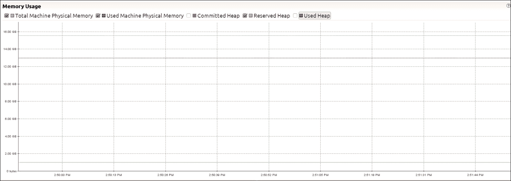

# 第二章. 在 JVM 上衡量性能

在上一章中，我们介绍了与性能相关的重要概念。虽然非常有价值，但到目前为止，我们的旅程多少有些学术性，你可能已经迫不及待地想要运用你新获得的知识。幸运的是，第二章正是这样做的！我们将仔细研究一个真实场景，并深入代码以分析应用程序并测量其性能特征。本章的实战部分专注于 MV Trading 最成功的产品之一：订单簿。这是为了在保持低延迟的同时提供高吞吐量而开发的软件。在本章中，我们将涵盖以下主题：

+   对应用程序的延迟和吞吐量进行基准测试

+   使用 Flight Recorder 分析系统

+   使用 JMH 进行代码微基准测试

# 漫步金融领域

本月标志着**MV Trading**（**MVT**）成立一周年的纪念日。在过去的一年里，公司通过利用新颖的交易策略，为客户带来了丰厚的回报。这些策略在能够在新价格信息接收后的毫秒内完成交易时最为有效。为了支持低延迟的交易，MVT 工程团队直接集成到股票交易所。交易所集成涉及数据中心工作，将交易系统与交易所协同定位，以及开发工作以构建交易系统。

交易系统的一个关键组件，称为订单簿，持有交易所的状态。交易所的目标是跟踪有多少买家和卖家对某只股票有活跃的兴趣，以及每一方愿意以什么价格进行交易。作为交易者，例如 MVT，提交买卖股票的订单时，交易所会确定何时发生交易，并通知买家和卖家关于交易的信息。交易所和 MVT 所管理的状态很有趣，因为订单并不总是在达到交易所时执行。相反，订单可以保持开放或挂起状态，直到交易日的长度（大约六小时）。这个订单簿的第一个版本允许交易者放置称为限价订单的订单。限价订单包括对最低可接受价格的约束。对于购买，限价代表交易者愿意支付的最高价格，对于销售，这表示交易者愿意为股票接受的最低价格。订单簿支持的另一个操作是取消未完成的限价订单，这将从簿中移除其存在。为了帮助总结可能的订单状态，以下表格列出了支持交易所动作的可能结果：

| **交换动作** | **结果** |
| --- | --- |
| 提交了价格低于最佳出价或要价的限价订单。 | 订单停留在订单簿上，这意味着订单将保持待处理状态，直到来自对立方的订单生成交易或提交的订单被取消。 |
| 提交了价格高于或等于最佳出价或要价的限价订单。 | 订单成交。成交是行业术语，表示订单因为其价格与订单簿对立方的订单相匹配而触发了交易。一笔交易包括两次执行，每次一边。 |
| 提交了取消挂单的请求。 | 挂单从订单簿中移除。 |
| 提交了取消已执行或不存在订单的请求。 | 取消请求被拒绝。 |

假设你作为新聘用的 MVT 员工，刚刚加入负责维护和改进订单簿的工程团队。今天是你的第一天，你计划用大部分上午时间平静地浏览代码，熟悉应用程序。

在检出源代码仓库后，你从领域模型开始：

```java
case class Price(value: BigDecimal) 
case class OrderId(value: Long) 

sealed trait LimitOrder { 
  def id: OrderId 
  def price: Price 
} 

case class BuyLimitOrder(id: OrderId, price: Price)  
  extends LimitOrder 
case class SellLimitOrder(id: OrderId, price: Price)  
  extends LimitOrder 

case class Execution(orderId: OrderId, price: Price) 

```

上一段代码中的类和特质定义代表了业务概念。我们特别注意到了两种订单（`BuyLimitOrder`和`SellLimitOrder`），它们通过唯一的 ID 和假设为美元的价格来识别。

### 注意

你可能会想知道为什么我们决定为`Price`和`OrderId`创建不同的类定义，尽管它们仅仅作为唯一属性的包装（分别是一个用于价格的`BigDecimal`和一个用于唯一 ID 的`Long`）。或者，我们也可以直接依赖原始类型。

`BigDecimal`可以代表很多不同的事物，包括价格，但也可以是税率或地球上的纬度。使用一个名为`Price`的特定类型，给`BigDecimal`赋予上下文意义，并确保编译器帮助我们捕捉可能的错误。我们相信，始终定义明确的类型来表示业务关注点是良好的实践。这项技术是被称为领域驱动设计的最佳实践之一，我们在整本书中经常应用这些原则。要了解更多关于这种软件开发方法的信息，我们推荐由 Eric Evans 所著的优秀书籍《领域驱动设计：软件核心的复杂性处理》（[`www.amazon.com/Domain-Driven-Design-Tackling-Complexity-Software/dp/0321125215`](http://www.amazon.com/Domain-Driven-Design-Tackling-Complexity-Software/dp/0321125215)）。

`OrderBook`模块利用领域模型来定义可用的命令以及由订单产生的结果事件：

```java
object OrderBook { 
  // all the commands that can be handled by the OrderBook module 
  object Commands { 
    sealed trait Command 
    case class AddLimitOrder(o: LimitOrder) extends Command 
    case class CancelOrder(id: OrderId) extends Command 
  } 

  // events are the results of processing a command 
  object Events { 
    sealed trait Event 
    case class OrderExecuted(buy: Execution, sell: Execution) 
      extends Event 
    case object LimitOrderAdded extends Event 
    case object OrderCancelRejected extends Event 
    case object OrderCanceled extends Event 
  } 

  // the entry point of the module - the current book and  
  // the command to process are passed as parameters,  
  // the new state of the book and the event describing the  
  // result of processing the command are returned 
  def handle(book: OrderBook, command: Command): (OrderBook, Event) = // omitted for brevity 
} 

```

假设你正准备详细查看`handle`函数的实现，这时你在即时通讯客户端收到技术负责人 Alice 的消息：“会议室所有人，生产环境中出现了问题！”

### 注意

拥有金融领域专业知识的读者可能会意识到，所提出的行动反映了实际金融交易所功能的一个子集。一个明显的例子是订单中缺少数量。在我们的例子中，我们假设每个订单代表购买相等数量的股票（例如，100 股）。有经验的读者知道，订单量进一步复杂化了订单簿状态管理，例如，通过引入部分执行的概念。我们故意简化了领域，以在处理现实问题的同时，最大限度地减少对领域新手的理解障碍。

# 意外的波动摧毁了利润

Alice 和首席交易员 Dave 通过总结生产问题开始了会议。你在会议中从问题中汲取了很多洞见。你了解到，目前市场波动性很高，价格的快速波动放大了产生盈利交易的机会。不幸的是，对于 MVT 来说，在最近几周，高波动性带来了前所未有的订单量。交易员们正在向市场大量提交限价订单和取消订单，以应对价格变化的快速行动。MVT 的订单簿通过负载测试认证，可以处理每秒最多 15,000 个订单（OPS），99^(th)百分位延迟为 10 毫秒（ms）。当前市场条件产生了持续的水平为 45,000 OPS，这正在摧毁尾部订单簿的延迟。在生产中，部署的订单簿版本现在产生 99^(th)百分位延迟高达 80 毫秒，最大延迟达到 200 毫秒。在交易业务中，反应慢可能会迅速将盈利交易变成巨大的损失。这正是 MVT 正在发生的事情。通常，在波动时期，MVT 能够产生健康的回报，但最近几周，损失惊人。我们的目标是应用我们在第一章《性能之路》中学到的技术，来克服性能问题。

MVT 的交易员正在寻找快速的性能提升，以利用当前的市场环境。交易员们相信市场波动将持续另一周才会平息。一旦波动消失，赚钱的机会也随之消失。因此，已经强调给工程团队，将 99^(th)百分位延迟从 40 毫秒逐步降低，应该能够停止交易策略的损失并实际上产生小额利润。一旦波动平息，更深入和广泛的表现改进将受到欢迎。目前，时间正在流逝，我们需要通过逐步提高性能来找到停止损失的方法。

# 重复问题

这并不是你预期的第一天，但前方有一个多么激动人心的挑战！我们通过重现问题来开始对性能问题的调查。正如我们在上一章中提到的，正确基准测试一个应用程序以建立基线总是至关重要的。基线用于评估我们可能尝试实施的任何改进的有效性。我们创建了两个简单的基准测试来重现生产中观察到的负载，并测量系统的吞吐量和延迟。

### Note

但是等等，我还没有完成对`OrderBook`实际实现的研究！你说得对！你仍然不知道该模块的实现。然而，生产环境已经出现问题，我们需要迅速采取行动！更严重的是，这是我们强调基准测试的一个重要特性的方式，我们在第一章《性能之路》中提到了这个特性。基准测试将应用程序视为一个黑盒。你有机会研究模块接口，这足以编写好的基准测试。

## Throughput benchmark

我们的第一个基准测试测量我们应用程序的吞吐量。操作团队为我们提供了从生产环境中记录的历史数据。这些数据包含了几十万条实际命令，这些命令由订单簿处理。我们使用这个样本，并在测试环境中重新播放这些消息，以获得对系统行为的准确了解。

### Note

从第一章《性能之路》中回顾，运行所有基准测试在完全相同的环境下是很重要的，这样才能进行比较。为了确保测试的一致性，我们创建了一个命令生成器，能够输出一组静态的命令。我们鼓励您对其进行审查。

下面是我们吞吐量基准测试的代码，您可以在章节子项目中找到：

```java
object ThroughputBenchmark { 

  def main(args: Array[String]): Unit = { 
    val commandSample = DataCodec.read(new File(args(0))) 
    val commandCount = args(1).toInt 

    jvmWarmUp(commandSample) 

    val commands = generateCount(commandSample, commandCount) 

    val start = System.currentTimeMillis() 
    commands.foldLeft(OrderBook.empty)(OrderBook.handle(_, _)._1) 
    val end = System.currentTimeMillis() 
    val delayInSeconds = (end - start) / 1000.0 

    println { 
      s""" 
         |Processed ${commands.size} commands 
         |in $delayInSeconds seconds 
         |Throughput: ${commands.size / delayInSeconds} operations/sec""" 
        .stripMargin 
    } 
  } 
} 

```

代码相当直接，让我们来了解一下。首先，我们读取输入参数，第一个是包含我们历史数据的文件路径，第二个是我们想要运行的命令数量。请注意，在我们的实现中，如果我们请求的命令数量超过了静态文件中的数量，程序将只会循环遍历提供的命令。然后，我们通过执行多达 100,000 条命令而不记录任何吞吐量信息来预热 JVM。预热的目的给 JVM 一个机会来执行代码并找到可以被即时编译器（**JIT**）优化的潜在热点。

### Note

JIT 编译器是在应用程序启动后运行的编译器。它将字节码（即`javac`编译器第一次编译的结果）即时编译成优化的形式，通常是操作系统的原生指令。JIT 能够根据运行时使用情况优化代码，这是传统编译器无法做到的，因为它在代码可以执行之前运行。

代码的下一部分是我们实际记录吞吐量的地方。我们保存了开始时间戳，执行了针对最初为空的订单簿的所有命令，并记录了结束时间戳。通过将命令计数除以执行所有命令的耗时，我们可以轻松计算出每秒的操作吞吐量。由于我们的吞吐量是以秒为单位的，因此对于我们的基准测试需求，毫秒级的精度是足够的。最后，我们打印出有趣的结果。我们可以通过以下命令以 250,000 个命令为参数运行此基准测试：

```java
sbt 'project chapter2' 'set javaOptions := Seq("-Xmx1G")' 'runMain highperfscala.benchmarks.ThroughputBenchmark src/main/resources/historical_data 250000'

```

在一系列命令计数范围内运行基准测试，得到以下结果：

| **命令计数** | **处理时间（秒）** | **吞吐量（每秒操作数）** |
| --- | --- | --- |
| 25 万 | 2.2 | 112,309 |
| 50 万 | 6.1 | 81,886 |
| 75 万 | 12.83 | 58,456 |
| 100 万 | 22.56 | 44,328 |

我们可以看到，当命令计数增加时，我们的吞吐量下降。一个可能的解释是，当收到更多订单时，订单簿的大小增加，因此效率降低。在此阶段，我们能够评估我们应用程序的吞吐量。在下一节中，我们将专注于测量程序的延迟。

### 备注

我们的基准测试以及本章后面将要编写的基准测试都是简单的。它在一个 JVM 中运行测试和订单簿。一个更现实的例子将涉及一个与客户端交换 FIX 消息（FIX 是金融界最广泛使用的协议）以放置或取消订单的维护 TCP 连接的服务器订单簿。我们的基准测试将模拟这些客户端之一，以模拟我们订单簿的生产负载。为了简单起见，并允许我们关注更有趣的主题，我们决定将这个问题放在一边。

## 延迟基准测试

回想一下第一章《性能之路》，延迟是指操作发生所需的时间，而操作的定义取决于你的领域。在我们的情况下，我们将操作定义为从收到命令到生成新的订单簿和相应事件的时间处理。

### 首次延迟基准测试

以下列表展示了我们延迟基准测试的第一个版本：

```java
 object FirstLatencyBenchmark { 

  def main(args: Array[String]): Unit = { 

    val commandSample = DataCodec.read(new File(args(0))) 
    val (commandsPerSecond, iterations) = (args(1).toInt, args(2).toInt) 
    val totalCommandCount = commandsPerSecond * iterations 

    jvmWarmUp(commandSample) 

    @tailrec 
    def sendCommands( 
      xs: List[(List[Command], Int)], 
      ob: OrderBook, 
      testStart: Long, 
      histogram: HdrHistogramReservoir): (OrderBook, HdrHistogramReservoir) 
      = 
      xs match { 
        case head :: tail => 
          val (batch, offsetInSeconds) = head 
          val shouldStart = testStart + (1000 * offsetInSeconds) 

          while (shouldStart > System.currentTimeMillis()) { 
            // keep the thread busy while waiting for the next batch to be 
            sent 
          } 

          val updatedBook = batch.foldLeft(ob) { 
            case (accBook, c) => 
              val operationStart = System.currentTimeMillis() 
              val newBook = OrderBook.handle(accBook, c)._1 
              val operationEnd = System.currentTimeMillis() 
              // record latency 
              histogram.update(operationEnd - operationStart) 
              newBook 
          } 

          sendCommands(tail, updatedBook, testStart, histogram) 
        case Nil => (ob, histogram) 
      } 

    val (_, histogram) = sendCommands( 
      // Organizes commands per 1 second batches 
      generateCount(commandSample, totalCommandCount) 
        .grouped(commandsPerSecond).zipWithIndex 
        .toList, 
      OrderBook.empty, 
      System.currentTimeMillis(), 
      new HdrHistogramReservoir()) 

    printSnapshot(histogram.getSnapshot) 
  } 
} 

```

这段代码的开始部分与我们在吞吐量基准测试中使用的类似。我们使用 HdrHistogram 来记录每个操作的延迟。尾递归方法`sendCommands`是大多数有趣事情发生的地方（我们将在后面的章节中更详细地探讨尾递归）。我们的命令按大小和`commandsPerSecond`的批次分组，这意味着我们将每秒发送一个批次。我们在发送命令之前记录当前时间（`operationStart`）和收到响应之后（`operationEnd`）。这些时间戳用于更新直方图。

### 注意

HdrHistogram 是直方图的高效实现。它专门设计用于在延迟和性能敏感的应用中。它在空间和时间上保持固定的成本。它不涉及内存分配操作，其内存占用是恒定的。要了解更多关于 HdrHistogram 的信息，请访问[`hdrhistogram.org/`](http://hdrhistogram.org/)。

最后，在所有批次都处理完毕后，我们会对直方图的状态进行快照并打印有趣的指标。让我们运行一下这个测试：

```java
 sbt 'project chapter2' 'set javaOptions := Seq("-Xmx1G")' 'runMain highperfscala.benchmarks.FirstLatencyBenchmark src/main/resources/historical_data 45000 10'
    ... // removed for brevity
    [info] Processed 450000 commands
    [info] 99p latency: 1.0 ms
    [info] 99.9p latency: 1.0 ms
    [info] Maximum latency: 24 ms 
```

我们以每秒 45,000 次操作的速度对我们的系统进行了 10 秒的测试，并观察到 99.9 百分位数的延迟为 1 毫秒。这些是出色的结果！但它们也是完全错误的。在我们匆忙编写延迟基准测试时，我们忽略了一个经常被忽视的问题：协同遗漏问题。

### 协同遗漏问题

我们的基准测试是错误的，因为我们测量处理命令所需的时间，而没有考虑到命令等待处理的时间。如果之前的命令处理时间超过了预期，这就会成为一个问题。以我们的先前的例子来说：我们每秒运行 45,000 个命令，即每毫秒 45 个命令。如果处理前 45 个命令需要超过 1 毫秒的时间怎么办？接下来的 45 个命令必须等待才能被选中并处理。然而，在我们的当前基准测试中，我们忽略了这种等待时间。让我们以一个通过 HTTP 提供网页的 Web 应用程序为例。一个典型的基准测试可能会通过测量请求处理和响应准备发送之间的时间来记录请求延迟。然而，这不会考虑到 Web 服务器读取请求并实际发送响应所需的时间。一个更好的基准测试将测量客户端发送请求和实际收到响应之间的延迟。要了解更多关于协同遗漏问题的信息，请参考包含直接链接到文章和演示文稿的讨论线程[`groups.google.com/forum/#!msg/mechanical-sympathy/icNZJejUHfE/BfDekfBEs_sJ`](https://groups.google.com/forum/#!msg/mechanical-sympathy/icNZJejUHfE/BfDekfBEs_sJ)。

为了解决这个问题，我们需要记录 `operationStart`，而不是当我们开始处理一批命令时，而是在这批命令应该被处理时，无论系统是否延迟。

### 第二个延迟基准

在我们的第二次尝试中，我们确保在考虑命令应该发送的时间时启动时钟，而不是它准备好被处理的时间。

基准测试代码除了记录延迟外保持不变，现在使用 `shouldStart` 而不是 `operationStart`：

```java
histogram.update(operationEnd - shouldStart) 

```

此更改后，这是新的基准输出：

```java
 sbt 'project chapter2' 'set javaOptions := Seq("-Xmx1G")' 'runMain highperfscala.benchmarks.SecondLatencyBenchmark src/main/resources/historical_data 45000 10'
    ... // removed for brevity
    [info] Processed 450000 commands
    [info] 99p latency: 743.0 ms
    [info] 99.9p latency: 855.0 ms
    [info] Maximum latency: 899 ms 
```

与我们的第一次基准测试相比，结果非常不同。实际上，这段新代码也存在一个缺陷。它假设在同一秒内发送的所有请求都应该在这一秒的开始时被处理。虽然技术上可行，但更有可能的是这些命令将在第二秒的不同时间发送（一些在第一毫秒，一些在第二毫秒，依此类推）。我们当前的基准测试可能大大高估了我们的延迟，因为大多数命令的计时器启动得太早。

### 最终的延迟基准

我们将尝试修复最新问题，并最终制定一个可靠的基准。在这个阶段，我们正在尝试解决每秒命令分布的问题。解决这个问题的最佳方法就是使用真实的生产数据。如果我们用于基准测试的记录命令附有时间戳（即，它们被生产系统接收的时刻），我们就可以复制在生产中观察到的命令分布。

不幸的是，我们当前的订单簿应用程序在记录数据时没有记录时间戳。我们可以选择不同的路线。一个选项是随机在第二秒发送命令。另一个选项是假设命令的均匀分布（即，每个毫秒发送相同数量的命令）。

我们选择修改基准测试，假设后者。为了实现这个目标，我们修改了事件的生成。由于我们的新策略是在时间上分布命令而不是批量处理命令，对于单个瞬间，新的命令列表返回类型从 `List[(List[Command], Int)]` 变为 `List[(Command, Int)]`。生成命令列表的逻辑也相应地改变，如下所示：

```java
  generateCount(sampleCommands, totalCommandCount) 
    .grouped(cps.value) 
    .toList.zipWithIndex 
    .flatMap { 
      case (secondBatch, sBatchIndex) => 
        val batchOffsetInMs = sBatchIndex * 1000 
        val commandIntervalInMs = 1000.0 / cps.value 
        secondBatch.zipWithIndex.map { 
          case (command, commandIndex) => 
            val commandOffsetInMs = 
              Math.floor(commandIntervalInMs * commandIndex).toInt 
            (command, batchOffsetInMs + commandOffsetInMs) 
        } 
    }  

```

我们创建命令集的过程稍微复杂一些。我们现在为每个命令计算一个偏移量，考虑到每个命令之间应该经过的毫秒数。使用这个基准测试，我们的最终结果如下：

```java
 sbt 'project chapter2' 'set javaOptions := Seq("-Xmx1G")' 'runMain highperfscala.benchmarks.FinalLatencyBenchmark src/main/resources/historical_data 45000 10'
    [info] Processed 450000 commands
    [info] 99p latency: 92.0 ms
    [info] 99.9p latency: 137.0 ms
    [info] Maximum latency: 145 ms 
```

我们最终为我们的系统建立了一个良好的延迟基准，确实，我们的结果接近当前在生产中观察到的结果。

### 注意

希望这次练习让你反思了自己的生产系统以及你可能想要基准测试的操作类型。本节的主要收获是正确记录操作延迟并考虑协调遗漏问题的重要性。你认为衡量你系统延迟的最佳方法是什么？如果你已经有了基准测试，它们是否考虑了协调遗漏效应？

## 定位瓶颈

现在我们能够一致地通过我们的基准测试在生产环境中重现不良性能，因此我们有信心可以准确测量我们做出的任何更改的影响。基准测试将订单簿视为一个黑盒，这意味着你无法洞察到订单簿的哪些区域导致了我们的性能问题。如果你之前熟悉这段代码，你可以利用你的直觉作为启发式方法，对需要更深入关注的子组件做出有根据的猜测。由于今天是你在 MVT 的第一天，你没有先前的直觉可以依赖。而不是猜测，我们将对订单簿进行剖析，以深入了解我们黑盒的各个方面。

JDK 捆绑了一个名为 Flight Recorder 的优秀剖析器。Flight Recorder 在非生产环境中免费使用。有关商业使用的更多信息，请参阅 Oracle 的许可协议，[`docs.oracle.com/javacomponents/jmc-5-5/jfr-runtime-guide/about.htm`](http://docs.oracle.com/javacomponents/jmc-5-5/jfr-runtime-guide/about.htm)。拥有一个优秀的剖析器是 Scala 成为生产质量函数式编程实用选择的原因之一。Flight Recorder 通过使用内部 JVM 钩子来记录 JVM 在运行时发出的事件。Flight Recorder 捕获的事件包括内存分配、线程状态变化、IO 活动和 CPU 活动。要了解更多关于 Flight Recorder 内部的信息，请参阅 Oracle 的 Flight Recorder 文档：[`docs.oracle.com/javacomponents/jmc-5-5/jfr-runtime-guide/about.htm#sthref7`](http://docs.oracle.com/javacomponents/jmc-5-5/jfr-runtime-guide/about.htm#sthref7)。与无法访问 JVM 内部结构的第三方剖析器相比，Flight Recorder 能够访问 JVM 安全点之外的数据。JVM 安全点是一个所有线程都暂停执行的时间点。安全点是协调全局 JVM 活动（包括停止世界的垃圾收集）所必需的。要了解更多关于 JVM 安全点的信息，请查看 Alexey Ragozin 在[`blog.ragozin.info/2012/10/safepoints-in-hotspot-jvm.html`](http://blog.ragozin.info/2012/10/safepoints-in-hotspot-jvm.html)上发表的这篇优秀的博客文章。如果一个剖析器只能检查安全点，那么它很可能是缺少有用的数据点，因为只出现了一个部分画面。

通过设置飞行记录器试验，让我们首先查看订单簿。为了加快周期时间，我们在执行`ThroughputBenchmark`回放历史数据的运行时，通过`sbt`设置分析器。我们使用以下 JVM 参数设置飞行记录器：

```java
 sbt 'project chapter2' 'set javaOptions := Seq("-Xmx1G", "-XX:+UnlockCommercialFeatures", "-XX:+FlightRecorder", "-XX:+UnlockDiagnosticVMOptions", "-XX:+DebugNonSafepoints", "-XX:FlightRecorderOptions=defaultrecording=true,dumponexit=true,dumponexitpath=/tmp/order-book.jfr")' 
```

最大 JVM 堆大小设置为与我们的基准测试运行匹配，然后是四个 JVM 参数。`-XX:+UnlockCommercialFeatures`和`-XX:+FlightRecorder`参数是必需的，以便为飞行记录器发出 JVM 事件。飞行记录器文档引用`-XX:+UnlockDiagnosticVMOptions`和`-XX:+DebugNonSafepoints`以改善采样质量。这些选项指示编译器生成元数据，使飞行记录器能够捕获不在安全点的样本。最后一个参数配置飞行记录器在程序启动时开始记录，并在程序退出时将配置文件结果输出到提供的路径。在我们的情况下，这意味着配置文件将在基准测试开始时开始，并在基准测试结束时终止。或者，也可以通过以下配置来配置飞行记录器，以延迟其启动时间并记录固定时间：

```java
 sbt 'project chapter2' 'set javaOptions := Seq("-Xmx1G", "-XX:+UnlockCommercialFeatures", "-XX:+FlightRecorder", "-XX:+UnlockDiagnosticVMOptions", "-XX:+DebugNonSafepoints", "-XX:StartFlightRecording=delay=10s,duration=60s,name=Recording,filename=/tmp/order-book.jfr")' 
```

前面的选项配置飞行记录器在五秒后（`delay`选项）启动并记录一分钟（`duration`选项）。结果存储在`/tmp/order-book.jfr`。

我们现在可以生成配置文件结果了。接下来，我们运行配置为回放 2,000,000 个请求的基准测试。回放更多请求，分析器就有更多机会捕获 JVM 事件。在其他条件相同的情况下，应优先选择较长的配置文件而不是较短的配置文件。以下输出显示了基准测试调用及其结果：

```java
 sbt 'project chapter2' 'set javaOptions := Seq("-Xmx1G", "-XX:+UnlockCommercialFeatures", "-XX:+FlightRecorder", "-XX:+UnlockDiagnosticVMOptions", "-XX:+DebugNonSafepoints", "-XX:FlightRecorderOptions=defaultrecording=true,dumponexit=true,dumponexitpath=/tmp/order-book.jfr")' 'runMain highperfscala.benchmarks.ThroughputBenchmark src/main/resources/historical_data 2000000'
    [info] 
    [info] Processed 2000000 commands
    [info] in 93.276 seconds
    [info] Throughput: 21441.742784853555 commands/sec 
```

要查看配置文件结果，我们使用**Java Mission Control**（**JMC**），这是一个免费捆绑的 GUI，支持许多功能，包括检查飞行记录器结果和运行飞行记录器配置文件会话。JMC 位于 Java 可执行文件的同一目录中，这意味着只需键入以下内容即可通过路径访问它：

```java
jmc

```

一旦 GUI 加载，通过导航到**文件** | **打开**来打开分析器结果。浏览到配置文件结果并点击**确定**以加载它们。在我们查看结果的同时，我们将构建一个清单，列出在审查分析器结果时需要考虑的问题。这些问题旨在让您批判性地分析结果。这些问题确保实验结果真正解决了导致配置文件的假设。在本章结束时，我们将这些问题以单个清单的形式呈现，以便以后更容易回顾。

### 我是否使用预期的资源集进行了测试？

如果测试环境被设置为使用不正确的资源，则结果无效。因此，首先检查环境设置是有意义的。幸运的是，飞行记录器为您捕获了大部分这些信息。

**常规**和**系统**选项卡组是本清单项需要关注的区域。在**常规**中，点击**JVM 信息**以识别关键 JVM 事实。在本节中，确认以下内容：

| 重点关注区域 | 重点关注该区域的原因 |
| --- | --- |
| JVM 启动时间 | 这是一个快速检查点，确认测试是在你认为的时间执行的。凭借一些配置文件结果，确保你正在审查正确的结果变得微不足道。随着你收集更多信息并调查更多假设，这个简单的检查确保你不会混淆结果。 |
| JVM 版本 | JVM 版本的差异会产生不同的结果。确保你使用的是与生产环境相同的 JVM 版本。 |
| JVM 命令行参数和 JVM 标志 | 通过命令行参数调整 JVM 是很常见的。通常，参数化会在运行之间发生变化，这使得后来难以回忆起哪个运行对应于哪组参数。审查这些信息为审查结果提供了有用的背景。 |
| Java 应用程序参数 | 与前面的担忧类似，目标是确保你确信你理解了测试的输入。 |

为了补充确认 JVM 配置，请在**内存**选项卡组下查看**GC 配置**选项卡。此选项卡详细说明了垃圾收集配置，它反映了用户提供的配置和 JVM 默认值的组合。正如你所意识到的，垃圾收集配置的微小变化可能会产生显著的运行时性能变化。鉴于应用程序性能对垃圾收集配置的敏感性，你应该反思此选项卡中的每个参数。在审查时需要考虑的问题如下：

+   如果我配置了此参数，配置的值是否生效？

+   如果我没有配置此参数，调整此值可能会产生什么影响？这个问题经常帮助你为未来的配置文件运行创建假设。

接下来，我们关注**系统**选项卡组。**概览**选项卡列举了非 JVM 资源，以便清楚地了解创建此配置文件所使用的资源。继续从**常规**选项卡组的主题出发，总体目标如下：

+   确认记录的信息是否与您预期的资源相匹配（例如，可用的 RAM 数量是否与您认为存在的数量相匹配？）

+   寻找测试资源和生产环境之间的意外差异（例如，我的本地机器使用内核版本 v3.18.x，而生产环境使用较旧的次要版本，v3.17.x）

如果您通过环境变量配置系统，应该检查**环境变量**选项卡。与**概览**选项卡一样，您需要确保您的测试资源已按预期配置和提供。需要重复的是，测试资源中的任何意外差异都会使测试结果无效。

### 分析期间系统环境是否干净？

一旦您确信使用了适当的资源，下一步就是确认只有被分析的程序使用了资源。这是在审查测试结果之前的一个重要诊断步骤，因为它确保了被分析的程序在测试中确实被隔离。幸运的是，飞行记录器收集了有用的信息来回答这个问题。在**系统**选项卡组中，**进程**选项卡捕获了分析期间运行的所有进程。在查看此列表时，请考虑以下问题：

+   当我扫描进程列表时，我是否看到任何不应该运行的进程？

+   当我通过命令行列进行筛选并输入`java`时，我是否看到预期的 JVM 应用程序运行集？

+   当我扫描进程列表时，我是否看到任何重复的进程？

接下来，在**常规**选项卡组下检查**记录**选项卡。飞行记录器提供了创建并发记录的能力。配置文件结果将包含并发记录的并集。如果只有几个运行中的一个出现了意外的多个记录，那么您可能无法在记录之间进行苹果对苹果的结果比较。

下一个需要关注的是在分析期间系统 CPU 的使用情况。在**常规**选项卡组中，选择**概览**选项卡。此视图显示 CPU 使用面板，它提供了在整个记录过程中检查机器 CPU 使用情况的能力。在这里，您正在寻找 JVM 和机器总 CPU 使用之间的意外差异。以下截图描述了一个值得调查的差异场景：


CPU 使用面板突出显示的意外非 JVM CPU 使用情况

在前面的截图中，**JVM + 应用（用户）**和**JVM + 应用（内核）**的组合表示正在测试的 JVM 的 CPU 使用情况，而**机器总**表示机器（即，正在测试的 JVM 和所有其他进程）的 CPU 使用情况。在这次记录的大部分时间里，正在测试的 JVM 的 CPU 使用情况代表了机器 CPU 使用情况的大部分。如果你的应用程序应该是唯一使用系统资源的进程，那么**JVM + 应用（用户）**和**机器总**之间的小差异就代表了期望的状态。记录期间中间附近的变化表明另一个进程或多个进程正在使用 CPU 资源。这些峰值表明了可能对分析结果产生负面影响的不正常行为。值得考虑其他进程正在使用系统资源，以及你的测试结果是否仍然有效。

这是一个介绍范围导航器的好机会，它是每个标签顶部的小型水平小部件，包含红色标记。范围导航器是一个时间线，它以红色标记显示当前标签中随时间发生的事件。默认情况下，整个时间线被选中，并且分析持续时间显示在时间线的中心上方。你可以选择时间线的一部分来放大感兴趣的区域。例如，你可能希望放大机器 CPU 使用率激增时的 CPU 使用情况。当选择时间线的一部分且数据只针对特定时间点（例如，记录开始时）可用，或者数据不表示时间序列（例如，JVM 版本）时，则数据被隐藏或替换为 N/A。

在**内存**标签组下的**概览**标签页中的**内存使用**面板中进行最终检查，以检查已使用的机器物理内存。在此检查期间，检查你是否正在尝试评估已使用的机器物理内存量是否是一个合理的值。如果剩余的机器物理内存很少，而保留的堆内存只占总机器物理内存的一小部分，你应该暂停下来考虑其他进程正在使用内存。以下截图展示了这种情况：



使用内存使用面板捕获的大多数可用内存的非 JVM 进程

在前面的示例中，预留的堆空间为 2 GB，占可用 16 GB 系统内存的 1/8，而系统内存使用了 13 GB。这意味着除了被分析 JVM 之外，还有 11 GB 的系统内存被其他进程消耗。除非你预期测试环境中会运行其他进程，否则这种内存使用差异需要进一步调查。例如，如果你的应用程序使用了堆外内存，这种差异可能会使你的测试结果无效，因为你的应用程序可能无法按需分配内存，或者可能导致系统交换过度。

### JVM 的内部资源是否按预期运行？

我们从最广泛的准则开始，通过验证资源是否正确配置和分配来构建我们的分析清单。我们继续缩小清单范围，通过关注 JVM 配置来确保测试结果来自有效的配置。现在，我们通过检查 JVM 内部来继续验证配置文件是否未受到损害。

几乎所有生产级应用程序都涉及多线程，以更好地利用多个 CPU 核心或分离 I/O 密集型工作与 CPU 中心型工作。**线程**选项卡组帮助你熟悉应用程序内部的劳动分工，并提供了一些深入调查的建议。以下表格概述了**线程**选项卡组中的重点区域，并突出了当你对被分析的应用程序不熟悉或需要比较多个配置文件结果时需要考虑的问题：

| **关注区域** | **新接触应用程序** | **熟悉应用程序** |
| --- | --- | --- |
| **线程计数**面板在**概述**选项卡中 | 总共有多少个线程？这与你预期的数量是否不同？例如，如果应用程序是 CPU 密集型，线程数量是核心数量的十倍，这可能是一个警告信号，表明应用程序的调优不佳。 | 线程计数在配置文件之间是否有定性变化？例如，线程计数加倍或减半可能表明配置错误。 |
| **热点线程**面板在**热点线程**选项卡中 | 样本计数分布是否均匀，还是有几个线程主导样本计数？最热的线程可能是需要深入调查的线程，也是你应该最熟悉的代码区域。 | 样本计数分布的线程样本计数是否有显著变化？如果有，这些变化是否合理？ |
| **顶级阻塞锁**、**顶级阻塞线程**和**顶级阻塞线程**在**竞争**标签中 | 熟悉锁的存在位置以及哪些线程最常阻塞。这些信息在考虑影响关键路径性能的因素时可能很有用。 | 与之前的配置文件结果相比，线程阻塞的频率或分布是否有所增加？结果中是否出现了新的锁？ |
| **延迟堆栈跟踪**在**延迟**标签中 | 熟悉不同事件类型的最大延迟，以便更好地理解哪些操作对应用程序影响最大。对应用程序中更延迟的部分进行深入思考。 | 最大延迟是定性增加、减少还是与之前的配置文件结果相似？当存在多个顶级堆栈跟踪的事件类型时，考虑那些对关键路径性能影响最大的。 |

在彻底检查**线程**标签组之后，你应该开始形成一个关于此应用程序如何运行以及哪些区域可能对进一步研究最有兴趣的心理图像。我们现在转向一个与 JVM 线程紧密相关的话题：**I/O**。

**I/O**标签组提供了有关配置文件应用程序文件和套接字访问的有价值信息。就像对**线程**标签组的审查一样，本节可能提供有关应用程序存在意外或不希望的行为的线索。在深入到这个标签组之前，请停下来考虑何时或什么原因导致磁盘读取和写入，以及网络读取和写入。当你审查**概述**标签时，你是否看到了你的想法与分析结果之间的差异？如果是这样，你应该确定这种差异的原因，以及它是否使你的测试结果无效。

一个意外的 I/O 行为示例可能是对标准输出的过度写入。这可能在调试语句被遗留时意外发生。想象一下，如果这种副作用发生在应用程序的关键路径上。这将负面地影响配置文件结果并使测试无效。在 Flight Recorder 中，标准输出的写入通过一个空白的写入路径被捕获。以下截图显示了一个简单的一次性应用程序的文件写入结果，该应用程序以高频率反复写入标准输出：


通过 I/O 标签组识别标准输出中的意外写入

这个例子为了效果夸张了，这就是为什么随着时间的推移会有连续的写操作块。通过检查**文件写入**选项卡，我们还可以看到花费在写入标准输出上的时间、写入的数据量以及发生的写入次数。在约 15 秒的执行时间内，发生了惊人的 40,000 次写入！文件写入堆栈跟踪提供了宝贵的情报，使我们能够回溯以确定哪些应用程序部分负责这些写入。飞行记录器还允许您按线程查看写入操作。在生产应用程序中，如果有专门的写入线程，您可以快速隔离不希望的 I/O 访问。

监控 I/O 读取和写入是讨论如何配置飞行记录器记录参数的好机会。`-XX:+FlightRecorderOptions`接受一个名为`settings`的参数，默认情况下，它指向`$JAVA_HOME/jre/lib/jfr/default.jfc`。您可以选择提供自己的配置文件或修改默认文件。在这个配置文件中，您可以调整飞行记录器记录的事件以及捕获某些事件的频率。例如，默认情况下，`java/file_write`事件有一个 20 毫秒的阈值。这是一个合理的默认值，但您可能希望将其调低，如果您专注于分析文件写入。降低阈值意味着捕获更多的事件样本。请仔细调整，因为更多并不总是更好。较低的阈值意味着更高的开销和更多需要筛选的信息。

最后一个要调查的领域是在**代码**选项卡组下的**异常**选项卡。即使在分析期间您密切监控应用程序日志，您可能也不会持久化日志以进行历史分析。幸运的是，飞行记录器会捕获异常和错误以供审查。扫描异常和错误时，请注意总共发生了多少异常和错误，以及哪些异常发生得最频繁。使用范围导航器缩小时间范围，以更好地了解异常和错误是否集中在应用程序启动时、分析后期或均匀发生。异常和错误发生的时间通常可以提供有关根本原因是配置错误还是意外运行时行为的洞察。始终如一，如果您注意到异常或错误的数量令人担忧，请在深入了解它们发生的原因之前，考虑使分析结果无效。

### CPU 瓶颈在哪里？

在这个阶段，我们已经完成了所有必要的检查，以最大限度地提高分析结果有效并值得进一步调查的可能性。现在，我们开始可能是分析过程中最有意思的部分：识别 CPU 瓶颈。这是一个令人愉快的过程，因为分析器让您深入了解应用程序的黑盒。这是一个通过将分析结果与您的假设和应用程序工作方式的心理模型进行比较，以客观测试您的假设的机会。一旦您确定了瓶颈，您将感到一种释然，因为您现在知道在哪里定位您的下一组更改以改进应用程序性能。

让我们从**概述**标签页开始，这是**代码**标签组的一部分。这个视图有助于您从底层开始了解代码中哪些区域最昂贵。以下图显示了订单簿样本运行的**概述**标签页：


总结昂贵包和类的**代码概述**标签页

在这个视图中，初始目标是了解应用程序中 CPU 时间的分布。**热点包**面板迅速使我们清楚，订单簿严重依赖于`scala.collection`包中的代码。**热点类**面板显示，订单簿花费了相当多的时间，大约 55%的时间，执行某种类型的迭代操作。在这个屏幕截图中，我们还看到，只有部分配置文件持续时间被范围导航器选中。查看配置文件期间的不同子集通常很有帮助，以确定热点是否随时间保持不变。在这个例子中，配置结果的前部分被排除，因为这些时间包括发送到订单簿的请求的准备工作。选择这个子集使我们能够专注于订单簿操作，而不受测试设置的干扰。

重要的是要注意，百分比列表示在显示的包和类中执行的应用程序时间量。这意味着这个视图，连同**热点方法**标签页，是自下而上的视图，而不是自上而下的视图。在自上而下的视图中，百分比列表示在堆栈跟踪的一部分中花费的总时间量。这个视图在**调用树**标签页中捕获。这种区别是关键的，因为这两个视图帮助我们回答不同的问题。以下表格从两个角度探讨了几个主题，以更好地理解何时每个视图最有帮助：

| **主题** | **自上而下的视图（调用树）** | **自下而上的视图（概述/热点方法）** |
| --- | --- | --- |
| 视角 | 这是从宏观图到微观图 | 这是从微观图到宏观图 |
| 确定热点 | 这些是代码库中委托给最昂贵函数调用的区域 | 这些是最昂贵的函数 |
| 每个视图最佳回答的问题 |

+   订单簿取消操作的成本是否高于添加一个静态限价订单？

+   关键路径上 CPU 时间花在哪里？

|

+   从`Double`价格表示切换到`BigDecimal`表示是否创建了任何热点？

+   相比于应用的其他部分，哪些树操作成本最高？

|

作为订单簿的首次分析者，你现在从**概览**标签页了解到订单簿大量使用了 Scala 集合，但你还没有感受到哪些订单簿操作导致了性能下降。为了深入了解不同订单簿操作的成本，你通过调查**调用树**标签页采取自上而下的视角：


使用调用树调查订单簿瓶颈

深入分析**调用树**，可以清楚地看出取消操作是瓶颈。绝大多数 CPU 时间都花在取消订单上，而不是添加订单上。你叫来公司最敏锐的交易员戴夫，与他分享这一发现。当提到取消操作成本高昂时，戴夫的眼睛亮了起来。作为一名交易领域的专家，他深知在波动时期，取消操作的频率相较于平静的市场时期显著增加。戴夫解释说，交易员在波动市场中经常取消订单，以便快速调整摇摆的价格。取消操作导致更多的取消，因为交易员正在学习有价值的定价信息。结束对话时，他告诉你取消你正在做的所有其他事情（没有开玩笑！），并专注于提高订单取消的性能。

通过确定可能是 MVT 交易损失来源的瓶颈，你从对话中感到更加安心。为了更好地了解情况，你进一步深入到**调用树**中，揭示**取消订单**中哪些函数是昂贵的。这是从宏观视角转向微观视角的过程。最后，你查看**调用树**标签页，如下所示：


通过调用树了解哪些取消订单函数最慢

**调用树**显示，取消订单涉及对`RedBlackTree find()`函数和`exists()`函数的调用。当你进一步查看调用时，你也会注意到百分比列变得更小。这是因为从自上而下的视角来看，百分比列代表了一个特定函数及其所有下级函数所花费的总 CPU 时间。根据结果，84.48%的 CPU 时间被用于`executingOrderBook$$anonfun$handleCancelOrder$1.apply()`以及**调用树**中更深层的函数。从这个视角来看，我们还可以看到，在 84.48%的 CPU 时间中，53.24%的时间被用于`withinAbstractIterator.exists()`以及更深层的函数调用。这看起来是最大的瓶颈，其次是`Queue.iterator()`的调用，占用了 31.24%的 CPU 时间。

反思这些信息，你好奇地想从最昂贵的函数开始，换句话说，从底部开始，逐步通过回溯来识别受影响的订单簿操作。为了满足你的好奇心，你调查了**热方法**标签页，并看到了以下视图：


从微观视角到宏观视角，通过热方法

通过数量级，你发现与**调用树**调查中相同的两个罪魁祸首是热方法。这是一个令人欣慰的发现，因为它增强了信心，认为对取消订单实现的更改可能会带来质的飞跃。由于你没有花时间研究源代码，关于实现的神秘之处仍然很多。退一步考虑情况，你思考在抽象中建模的操作。取消订单涉及找到可能具有任何价格的现有订单，然后一旦找到，修改订单簿的状态以删除订单。你的直觉表明，这些操作中的一些可能是线性的，或者最多是对数级的。当你开始考虑其他可能的更快实现时，Dave 打断了你。

你听到一个急促的声音说：“你修复订单簿了吗？我们现在需要部署它！”当然，你不知道如何回应，想到第一天就部署代码让你有些不安。你与 Dave 分享你的发现，希望你的发现能满足他对进步的渴望，并为你争取更多思考的时间。不幸的是，Dave 对订单簿性能之谜仍未解决并不高兴，“我们每天都在因为这个原因而损失金钱！”你承认你理解形势的严重性，并且你正在尽可能快地行动。毕竟，这是你的第一天！Dave 叹了口气，承认他有点苛刻，他的沮丧导致他反应过度。随着对话的结束，Dave 提到他对你快速掌握情况的感激之情，并就他如何无法理解他新买的智能手机，尽管加载了额外的内存，仍然运行缓慢进行了闲聊。“现在似乎没有什么能快速运行了！”他大声说道。他提到的内存让你有了顿悟。

你记得你还没有审查内存使用结果。你希望通过调整垃圾收集器来提高性能，而不需要修改代码，可能会有一些容易的胜利。在做出任何更改之前，你查看**内存**标签组以了解内存分配模式。

### 内存分配模式是什么？

**内存**标签组是我们分析中需要深入的最后区域。尽管我们没有花时间查看订单簿源代码，但**代码**标签组展示了不同操作顺序的相对成本。研究**热点方法**可以了解订单簿各个区域使用的对象类型。查看内存分配模式，我们希望识别年轻和老年代垃圾收集趋势以及哪些对象分配最多和最少。

默认的飞行记录器配置设置不跟踪对象分配。为了更全面地查看内存消耗，应启用以下配置设置：

+   Allocation-profiling-enabled

+   Heap-statistics-enabled

+   gc-enabled-all

+   为`java/object_alloc_in_new_TLAB`和`java/object_alloc_outside_TLAB`事件启用 Allocation-profiling-enabled

一旦生成包含所有先前参数的配置文件，你将在**垃圾收集**标签页的**堆**面板中首次了解应用程序的内存分配模式：


通过垃圾收集标签可视化内存分配模式

此视图显示的形状通常被称为锯齿形模式。由于 JVM 不断释放年轻代内存，频繁的垃圾回收在数据中创建了一个类似牙齿的模式。垃圾回收调优是一个广泛的话题，超出了本书的范围。我们鼓励您通过阅读这篇名为“理解 Java 垃圾回收”的精彩博客文章来深入了解这一领域（[`www.cubrid.org/blog/dev-platform/understanding-java-garbage-collection/`](http://www.cubrid.org/blog/dev-platform/understanding-java-garbage-collection/))。

如下截图所示，飞行记录器在**GC 时间**标签页中也提供了每个垃圾回收类别的摘要指标：


按收集事件类型总结垃圾回收

在检查堆使用可视化以及按收集类型拆分的垃圾回收时，以下是一些值得考虑的问题：

| **问题** | **需要考虑的思考** |
| --- | --- |
| 平均而言，内存使用量是保持恒定、向下倾斜还是向上倾斜？ | 内存使用量向上倾斜可能表明存在内存泄漏。在这种情况下，堆将增长，直到旧生代填满，导致旧生代收集。如果存在内存泄漏，旧生代收集不会清除很多内存，最终可能导致内存不足错误。在分析此类型问题时，获取尽可能长的分析结果，以确保尽可能全面地查看情况。 |
| 异常暂停时间是否与其他主要事件相关？ | 根据垃圾回收拆分，最大收集时间是平均收集时间的十倍。在**堆**面板中查找比平均收集时间质上更大的收集暂停。您是否在异常值中看到了某种模式？考虑您的应用程序与外部系统的交互以及它部署到的机器。是否存在解释极端暂停发生的原因？比较不同配置文件中的异常值，以确定该模式是否仅针对单个配置文件或似乎具有系统性。 |
| 收集的频率是多少？典型的收集持续多久？ | 在其他条件相同的情况下，较低的收集次数更可取，因为它表明垃圾生成速度较慢。话虽如此，较低的收集次数可能是由于堆大小增加的结果，这可能导致平均收集时间增加。重要的是要记住，检查收集次数和延迟应该持谨慎态度。因此，总垃圾收集时间指标是有洞察力的。总收集时间反映了收集频率和持续时间的影响。此外，它不会像平均收集持续时间那样遭受损失。 |
| 重要用例中对象的生存周期是多久？ | 在研究垃圾收集性能的分解时，了解您的应用程序中不同用例的内存分配方式是很重要的。理解这种关系可能有助于您找出为什么会出现某些分配模式。在波动较大的市场中，我们预计订单簿中有许多短生存期的对象，因为交易员经常取消订单。在波动较小的市场中，我们可能预计订单簿上休息的订单的平均年龄更高，这意味着有更多长生存期的对象。 |

研究这些内存分配的视角提供了内存分配活动的总结。通过调查**分配**标签页，可以以多种不同的方式查看应用程序中哪些部分正在施加内存压力。飞行记录器提供了三种分配视图：按类、按线程和按配置文件：


通过按类分配关联高压列表分配

类和配置文件分配在先前的屏幕截图中显示。请注意，由于订单簿是单线程的，因此在此情况下跳过了按线程分配。


使用自上而下的分配配置文件视图确认内存分配压力

当您审查这些分配视图时，应考虑以下问题。在阅读这些问题时，反思您将如何回答它们，以更好地理解如何提高订单簿的性能：

| **问题** | **需要考虑的思考** |
| --- | --- |
| 当检查**按类分配**时，具有重收集压力的类与在关键路径上引用的类之间是否存在正相关？ | 如果你确定创建最多垃圾收集压力的类也经常在关键路径上分配，那么你有充分的理由相信，如果你优化关键路径，将带来算法速度和垃圾收集的双重好处。订单簿结果表明，列表分配是最严重的违规者。回溯显示，分配几乎完全来自处理**取消订单**，这是我们已知是瓶颈的地方。 |
| 当检查**按线程分配**时，垃圾收集压力的分布是什么样的？ | 注意哪些线程负责生成最多的垃圾收集压力，可以帮助你确定代码中需要集中注意力的区域。通过减轻最严重的违规者的垃圾收集压力，将反映在总的暂停时间上。 |
| 当深入到**分配配置文件**堆栈跟踪时，已知的 CPU 时间瓶颈是否与高垃圾收集压力相关？ | 订单簿显示，大约 99%的垃圾是在处理**取消订单**时生成的。这证实了处理**取消订单**是计算密集型的，并且由于高对象分配率，进一步减慢了系统。建立这种相关性提供了强有力的证据，表明对这部分代码的代码更改将带来定性的性能改进。 |

### 尝试挽救局面

知道 Dave 很快会再次询问你关于提高订单簿性能的改进，你花了几分钟时间反思你的发现。很明显，处理**取消订单**既是 CPU 时间也是内存分配的瓶颈。在更多时间思考问题的同时，你自信可以改变订单簿实现来解决这个问题或可能两个问题。不幸的是，时间是你目前没有的东西。从内存分配中有一个有趣的观察：在波动市场中，大多数垃圾通常都是短暂的。有两个低成本的测试选项浮现在脑海中：

| **JVM 内存调整选项** | **假设** |
| --- | --- |
| 从默认的老一代收集器、并行老收集器切换到**并发标记清除**（**CMS**）。 | CMS 收集器旨在保持应用程序的响应性。切换到 CMS 收集器可能不会提高订单簿吞吐量，但在市场波动剧烈时，它可能提供更一致的响应延迟。 |
| 将新大小从默认值（大约最大堆大小的三分之一）增加到最大堆大小的四分之三。 | 订单簿有 1GB 的堆来存储状态，目前只使用大约 380MB 来存储年轻代对象。你希望利用频繁取消导致频繁短暂对象出现的直觉。增加新代大小是一种赌注，即将不会有超过 250MB 的持久对象，并且增加年轻代堆大小可以提高订单簿吞吐量，因为收集的频率更低。 |

下表总结了每个实验的结果：

| **设置** | **命令** | **99^(th) 百分位（毫秒）** |
| --- | --- | --- |
| 原始 |

```java
sbt 'project chapter2' 'set   javaOptions := Seq("-Xmx1G")' 'runMain   highperfscala.benchmarks.FinalLatencyBenchmark src/main/resources/historical_data   45000 10'

```

| 92 |
| --- |
| CMS 收集器 |

```java
sbt 'project chapter2' 'set   javaOptions := Seq("-Xmx1G",   "-XX:+UseConcMarkSweepGC")' 'runMainhighperfscala.benchmarks.FinalLatencyBenchmark   src/main/resources/historical_data 45000 10'

```

| 118 |
| --- |
| 750M 新大小 |

```java
sbt 'project chapter2' 'set   javaOptions := Seq("-Xmx1G", "-XX:NewSize=750M")' 'runMain   highperfscala.benchmarks.FinalLatencyBenchmark   src/main/resources/historical_data 45000 10'

```

| 74 |
| --- |
| CMS 收集器和 750M 新大小 |

```java
sbt 'project chapter2' 'set   javaOptions := Seq("-Xmx1G", "-XX:NewSize=750M", "-XX:+UseConcMarkSweepGC")'   'runMain highperfscala.benchmarks.FinalLatencyBenchmark   src/main/resources/historical_data 45000 10'

```

| 148 |
| --- |

看起来提高订单簿性能会比预期更复杂。至少有一种选择，即增加新大小，似乎能带来更好的整体延迟。我们建议你再次阅读本章，并使用这些新的选项集对应用程序进行基准测试和性能分析。观察这些 JVM 选项引入的新行为，并尝试理解由此产生的延迟增加或减少。

### 一点注意事项

我们想花点时间强调一下关于我们在上一节中解释的分析结果的一些背景信息。我们通过一个展示了多个现实世界问题的例子进行了分析。我们提出了一种实用方法来处理性能问题，这种方法是作者们在日常工作中应用的。需要注意的是，订单簿的复杂度可能远低于你日常工作中遇到的大多数应用。我们故意选择了一个足够复杂以展示如何处理性能问题的例子，同时也足够简单，无需数小时代码审查就能理解。在实践中，你可能需要多次重复分析，每次测试一个新的假设，以便在性能问题上取得进展。应用我们介绍的结构化方法将确保你在分析结果之前验证它们，并且它还将确保你有充分的证据来确定需要做出改变的地方。

### 分析清单

我们在本章中逐项检查了配置清单。为了便于参考，我们在此列出整个清单如下：

1.  我是否测试了预期的资源集？

1.  在分析过程中，系统环境是否干净？

1.  JVM 内部资源是否按预期运行？

1.  CPU 瓶颈在哪里？

1.  内存分配模式是什么？

## 使用微基准测试迈出大步

在接下来的章节中，我们将分享来自函数式范式和 Scala 语言的技巧，这些技巧使你能够编写更高效的软件。然而，你不应该盲目接受我们的建议。衡量性能是确定更改是否提高性能的客观方式。微基准测试是一个术语，用来描述对较大应用程序的一个小部分进行测试的基准。由于微基准测试设计上测试的是一小段代码，当进行细微更改时，运行微基准测试通常比基准测试整个应用程序更容易。

不幸的是，准确观察细微更改的性能是困难的，尤其是在 JVM 上。考虑以下这些与订单簿相关的更改示例，这些更改值得进行微基准测试。

+   用一个更有效地处理取消操作的数据结构替换持有静态限价订单的数据结构

+   将股票价格从双精度表示规范化为整数表示，以进行具有较低开销的订单匹配

+   确定重新排序一组分支语句以反映你认为最频繁访问的顺序的性能提升

你会如何衡量每次更改前后的性能？你可以尝试编写小的基准程序，这些程序类似于`ThroughputBenchmark`。由于 JVM 的智能，这种方法可能提供不可靠的结果。JVM 应用了多种启发式方法来进行运行时优化。在生产环境中，这些更改是受欢迎的，因为性能的改进总是受欢迎的。然而，在微基准测试中，这些更改并不受欢迎，因为它们会降低对微基准测试仅隔离细微更改的信心。JVM 能够做出的更改示例包括以下内容：

+   死代码消除

+   即时编译优化（请参阅我们之前关于 JIT 编译器的侧边栏）

+   常量折叠（一种优化，用于避免在每次调用具有常量参数和依赖于这些参数的返回值的函数时进行评估）

我们鼓励你通过阅读 Oracle 的《Java HotSpot 性能引擎架构》（[`www.oracle.com/technetwork/java/whitepaper-135217.html`](http://www.oracle.com/technetwork/java/whitepaper-135217.html)）来了解更多关于 JVM 优化的信息。鉴于这是一个隔离小代码更改的挑战，我们如何编写一个合适的微基准测试？幸运的是，OpenJDK 团队认识到了这些相同的挑战，并引入了一个名为 JMH 的库，即 Java 微基准测试工具（[`openjdk.java.net/projects/code-tools/jmh/`](http://openjdk.java.net/projects/code-tools/jmh/)）。JMH 是专门为克服我们提到的限制而设计的，以便隔离你更改的性能影响。使用 JMH 的过程与其他测试库类似。类似于 JUnit，JMH 定义了一组注解来控制测试设置和执行。尽管测试可以通过多种方式运行，但我们专注于通过 sbt 插件 `sbt-jmh`（[`github.com/ktoso/sbt-jmh`](https://github.com/ktoso/sbt-jmh)）执行测试，以便于使用。让我们通过创建、运行和分析使用订单簿的微基准测试的过程来一探究竟。在未来的章节中，我们将利用我们的 JMH 知识来客观地衡量指定更改的性能影响。

### 备注

你最近是否对应用程序进行了可能从微基准测试中受益的更改？如果你没有对更改进行微基准测试，你认为微基准测试是否可能引导你找到替代解决方案？

### 对订单簿进行微基准测试

通过调整 JVM 内存设置来提高性能取得进展后，你开始关注更好地理解取消性能。根据分析器结果中存在 `scala.collection.immutable.Queue` 的信息，你假设可能存在对 FIFO 队列的线性时间遍历来支持顺序取消。测试这一假设的一种方法是为不同场景设计一个微基准测试来衡量取消性能。你头脑风暴了以下场景：

+   取消一个不存在的订单

+   取消价格水平队列中的第一个订单

+   取消价格水平队列中的最后一个订单

在现实世界中，当取消请求到达之前，一个处于休息状态的订单被取消，这种情况就会发生。这是一个有趣的场景，因为你不确定是否存在提前终止逻辑来使这个操作更便宜，或者取消一个不存在的订单是否需要检查整个订单簿。剩下的两个场景关注的是证券交易所提供的填充保证。当以相同价格放置多个订单时，它们保证按照先到先得的原则进行填充。你推测在配置文件结果中看到的 FIFO 队列正在保留该价格水平上休息订单的时间顺序。你期望取消队列中的第一个订单比取消队列中的最后一个订单快一个线性因子。

在阅读了[`hg.openjdk.java.net/code-tools/jmh/file/tip/jmh-samples/src/main/java/org/openjdk/jmh/samples/`](http://hg.openjdk.java.net/code-tools/jmh/file/tip/jmh-samples/src/main/java/org/openjdk/jmh/samples/)上的优秀 JMH 示例和一些深入思考之后，你能够组合以下测试来捕捉你感兴趣的情景。代码是完整的，并且随后是一个遍历，如下所示：

```java
@BenchmarkMode(Array(Throughput)) 
@OutputTimeUnit(TimeUnit.SECONDS) 
class CancelBenchmarks { 

  @Benchmark 
  def cancelLastOrderInLine(b: BookWithLargeQueue): (OrderBook, Event) = OrderBook.handle(b.book, b.cancelLast) 

  @Benchmark 
  def cancelFirstOrderInLine(b: BookWithLargeQueue): (OrderBook, Event) = OrderBook.handle(b.book, b.cancelFirst) 

  @Benchmark 
  def cancelNonexistentOrder(b: BookWithLargeQueue): (OrderBook, Event) = OrderBook.handle(b.book, b.cancelNonexistent) 
} 

object CancelBenchmarks { 

  @State(Scope.Benchmark) 
  class BookWithLargeQueue { 
    private val p = Price(BigDecimal(1.00)) 
    private val firstId: Int = 1 
    private val defaultCancelLast = CancelOrder(OrderId(-1)) 

    @Param(Array("1", "100", "1000")) 
    var enqueuedOrderCount: Int = 0 

    var book: OrderBook = OrderBook.empty 

    @Setup(Level.Trial) 
    def setup(): Unit = { 
      if (enqueuedOrderCount < 0) 
        sys.error(s"Invalid enqueued order count = $enqueuedOrderCount") 
      assert(book == OrderBook.empty) 
      assert(cancelLast == defaultCancelLast) 

      cancelLast = CancelOrder(OrderId(enqueuedOrderCount)) 
      book = { 
        (firstId to enqueuedOrderCount).foldLeft(OrderBook.empty) { 
           case (ob, i) => 
             OrderBook.handle(ob, AddLimitOrder(BuyLimitOrder(OrderId(i), 
             p)))._1 
         } 
      } 

      assert(cancelLast != defaultCancelLast) 
      if (enqueuedOrderCount > 0) 
        assert(book.bids.head._2.size == enqueuedOrderCount, 
          s"Book built incorrectly! Expected book to contain " + 
            s"$enqueuedOrderCount bids for $p, but actual book is $book") 
   } 

    var cancelLast: CancelOrder = defaultCancelLast 
    val cancelFirst: CancelOrder = CancelOrder(OrderId(firstId)) 
    val cancelNonexistent: CancelOrder = CancelOrder(OrderId(-1)) 
  } 
} 

```

我们不会重复 JMH 文档，而是将重点放在感兴趣的特定部分，并期望你也调查 JMH 样本以获取更多背景信息。调查`CancelBenchmarks`类，你看到使用注解来定义基准测试和控制基准测试输出。存在几种基准模式。我们使用吞吐量模式来衡量基准测试在固定时间段内完成的次数。每个取消基准测试的实现仅通过取消订单的 ID 不同。让我们将重点转向`CancelBenchmarks`对象，它提供了设置每个基准测试所需的必要框架。

`CancelBenchmarks`对象定义了`BookWithLargeQueue`状态，这是我们观察到每个基准测试的参数。定义测试所需的州是参数化基准测试的第一步。对于这一组测试，我们通过创建一个只有$1.00 价格水平的订单簿来简化测试设置。我们专注于清除$1.00 价格水平上入队的订单数量，以帮助我们识别我们认为在线性时间内运行的运行时行为。使用`param`注解提供了一组用于清除入队订单计数的默认值。我们使用`setup`注解来指示 JMH 在调用每个三个基准测试之前准备订单簿的状态。对于每个入队订单计数值，JMH 调用`setup`方法来创建一个在$1.00 级别具有所需数量休息订单的订单簿。

接下来，我们从 sbt 运行基准测试。JMH 提供了一些命令行标志来控制测试配置，这些标志可以通过以下命令在`sbt`中查看：

```java
sbt 'project chapter2' 'jmh:run -help'

```

所有配置为注解的参数都可以通过提供相关的命令行标志来覆盖。以下是一个`CancelBenchmarks`的示例调用：

```java
sbt 'project chapter2' 'jmh:run CancelBenchmarks -wi 3 -w 5s -i 30 -r 10s -jvmArgs "-Xmx1G -Xms1G" -gc true -foe true -p enqueuedOrderCount=1,10,50,100'

```

在这次 JMH 调用中，我们配置了三个预热迭代，每个迭代运行 5 秒。预热迭代不计入输出吞吐量结果。我们配置了 30 个记录迭代，每个迭代持续 10 秒以计算吞吐量。我们为这次测试提供了 1 GB 的堆大小，并在未捕获异常时退出基准测试以防御代码回归。最后，我们参数化了我们希望扫描的入队订单数量，表明我们希望对 1、10、50 和 100 个订单的入队订单数量运行三个预热迭代和 30 个记录迭代。

在书中只有一个订单的情况下，我们假设所有操作的成本大致相等。因为我们认为取消操作运行在线性时间，所以我们的预期是，当入队订单数量为 50 时，每个基准测试应该比当数量为 10 时慢大约五倍。我们将测试限制在 100 个入队订单，因为在与 Dave 讨论时，我们了解到在他的经验中，他从未分析过超过 85 个订单的级别。将测试限制在 100 个订单确保我们了解的性能特征在一个我们预计不会在生产中看到但可能发生的级别。

### 注意

想象一下，你正在为系统中性能最敏感的使用案例编写一个微基准测试。为了全面了解系统在这个使用案例中的性能，哪些变量是重要的需要扫描的？你将如何确定基准测试的基础案例、步长值和最大值来参数化你的测试？考虑与领域专家交谈或使用生产数据来指导决策。

执行测试后，我们看到了以下总结结果：

| **基准测试** | **入队订单数量** | **吞吐量（每秒操作数）** | **误差（每秒操作数）** | **误差占吞吐量的百分比** |
| --- | --- | --- | --- | --- |
| 取消第一个订单 | 1 | 6,688,878.23 | ±351,518.041 | ±5.26 |
| 取消第一个订单 | 10 | 2,202,233.77 | ±103,557.824 | ±4.70 |
| 取消第一个订单 | 50 | 555,592.56 | ±18,632.547 | ±3.35 |
| 取消第一个订单 | 100 | 305,615.75 | ±14,345.296 | ±4.69 |
| 取消最后一个订单 | 1 | 7,365,825.52 | ±284,773.895 | ±3.87 |
| 取消最后一个订单 | 10 | 1,691,196.48 | ±54,903.319 | ±3.25 |
| 取消最后一个订单 | 50 | 509,339.60 | ±15,582.846 | ±3.06 |
| 取消最后一个订单 | 100 | 242,049.87 | ±8,967.785 | ±3.70 |
| 取消不存在的订单 | 1 | 13,285,699.96 | ±374,134.340 | ±2.82 |
| 取消不存在的订单 | 10 | 3,048,323.44 | ±140,983.947 | ±4.62 |
| 取消不存在的订单 | 50 | 772,034.39 | ±16,535.652 | ±2.14 |
| 取消不存在的订单 | 100 | 404,647.90 | ±3,889.509 | ±0.96 |

从这个结果集中，我们可以回答许多有趣的问题，这些问题有助于我们描述订单簿的性能。以下是一些您可以通过检查结果来回答的问题：

+   单个入队订单的基本情况是否导致三个基准测试在质量上具有相似的性能？

+   随着入队订单数量的增加，每个基准测试是否表现出线性吞吐量下降？

+   随着入队订单数量的增加，基准测试之间的相对性能是否发生变化（例如，当入队订单数量为 100 而不是 10 时，取消第一个和最后一个订单）？

+   在评估不存在的订单时，是否似乎存在提前终止逻辑？

除了针对订单簿的特定问题之外，对于任何基准测试结果，还必须问自己以下问题：

+   结果是否通过了一个合理性测试？

+   测试可能出了什么问题（即产生无效结果），我们是否已经采取措施防止这些缺点发生？

测量或测试设置中的错误会破坏结果的完整性。这些问题旨在让您批判性地分析微基准测试结果。合理性测试要求您为执行的测试建立心理模型。使用订单簿，我们需要考虑每秒可能的取消操作数量。回答这个问题的方法之一是取一个吞吐量结果，例如，取消最后一个订单，有 50 个入队订单，并计算每个操作的毫秒数。这很有用，因为我们已经从早期的基准测试中获得了每个操作的成本的感知；每秒 509,339.595 个取消转换为大约 0.002 毫秒的操作。这个结果可能出人意料地低，但请注意，这些结果没有考虑到协调的遗漏，因为没有特定的吞吐量速率（即测试试图尽可能每秒发送尽可能多的取消）。成本可能低于预期的另一个原因是，订单簿中只有一个价格水平。通常，书籍在买卖双方包含许多价格水平。这可能会引导我们设计基准测试，以扫描价格水平的数量，从而更好地了解管理多个价格水平的成本。

第二个问题迫使我们批判性地分析测试设置和测试方法。例如，我们如何知道设置函数产生了预期的订单簿？一种防御方法是添加断言来强制执行预期的约束。另一个需要验证的问题是基准测试中的每个取消调用都产生预期的事件。为单个试验的基准测试添加断言可能解决这个问题。然而，在基准测试代码中留下断言可能会影响性能，并且如果有的话，应该谨慎使用。为了额外的安全性，为正在测试的场景编写单元测试可能是有意义的，以确保期望的行为发生，并确保单元测试和性能测试代码是共享的。

在解释 JMH 结果时，考虑计算错误的显著性很重要。JMH 通过从基准测试的迭代中构建置信区间来计算错误。置信区间假设结果遵循正态分布，而错误表示计算出的 99.9%置信区间的范围。这表明，在其他条件相同的情况下，运行更多的基准测试迭代可以提高你对结果的信心。结果表中的最后一列说明了结果的变异性。变异性越低，你越应该相信结果。结果的高变异性表明存在测量错误或存在阻碍你测量真实性能特征的因素。这通常是一个警告信号，表明你需要重新审视你的测试方法，并且你应该对结果持怀疑态度。

### 注意

对于我们的示例，我们运行了 30 次迭代以记录吞吐量信息。你认为运行较少迭代会有什么影响？或者，考虑运行较少迭代但增加持续时间的效果。例如，10 次迭代，每次持续 30 秒。构建一个假设，然后运行 JMH 以查看结果。对不同的基准参数敏感性有意识，这是建立如何处理未来基准测试直觉的另一种方法。

由于我们的 JMH 配置没有考虑协调的省略，而是向订单簿发送大量取消请求，因此我们应该关注相对结果，而不是绝对吞吐量值。在结果之后提出的相关订单簿问题集中在相对差异上，这些差异应该独立于测试环境（例如，可用核心或 RAM）可见。关注相对问题是有价值的，因为答案应该对变化更加稳健。如果未来的代码更改导致显著的相对变化，例如，导致指数而不是线性取消性能下降，那么你可以更有信心地认为这种下降是由于代码更改而不是环境变化。

在本节中，我们了解了如何设置、执行和解释一个 JMH 微基准测试。在这个过程中，我们探讨了没有 JMH 的微基准测试的不足之处，以及在基准测试结果分析过程中需要注意的问题。我们对 JMH 的能力只是触及了皮毛。我们将在未来的章节中继续介绍 JMH。

# 摘要

恭喜，在本章中你帮助提升了 MVT 订单簿的性能，这将直接转化为公司利润的增加和损失的减少！在这个过程中，你深入了解了如何在 JVM 上进行基准测试和性能分析，以及需要避免的不足之处。你还完成了一个 JMH 微基准测试入门教程，这将使你能够在未来的章节中客观地评估性能改进。在下一章中，我们将探讨如何使用 Scala 语言特性来编写函数式软件，并使用本章学到的技能来评估它们对性能的影响。
