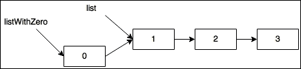
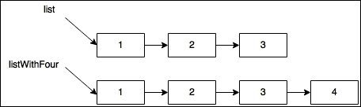
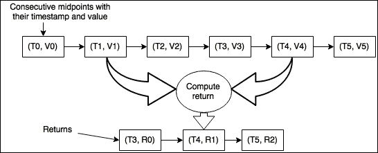

# 第四章。探索集合 API

在本章中，我们回到 MVT，以应对跨越多个 MVT 团队的多重挑战。市场数据团队需要改进关键路径订单簿性能以处理增加的取消请求量。数据科学团队希望有更好的临时数据分析工具来研究交易策略。每个人都面临一个昨天就必须解决的问题。这就是创业生活！

我们利用函数式范式、现有知识和 Scala 集合 API 的优势来解决这些挑战。Scala 语言及其集合 API 的力量允许你以前未曾想到的方式处理问题。随着我们解决这些挑战并遇到新的 Scala 集合使用，我们将详细说明集合实现和需要考虑的权衡。在本章中，我们将考虑以下集合：

+   List

+   TreeMap

+   Queue

+   Set

+   Vector

+   Array

# 高吞吐量系统 - 提高订单簿性能

在第一章《通往绩效之路》中，你在紧张的情境下遇到了 MVT 的首席交易员 Dave。金融市场经历了一段极端波动的时期，暴露了订单簿设计的弱点。在与 Dave 交谈后，你了解到在波动市场中，订单量主要由取消订单组成，因为交易员正在对快速变化的市场条件做出反应。通过订单簿基准测试和配置文件分析，你证实了在高成交量下，取消性能导致高订单簿响应延迟的怀疑。

尽管导致交易损失的波动市场已经过去，Dave 认识到未来波动对 MVT 回报的风险。Dave 希望投入工程力量，使订单簿在频繁取消时更具性能。通过与数据科学团队合作，Dave 分析了三个月的订单簿历史活动，并发现了有趣的市场特征。他与你分享，在分析的三个月中，按每个交易日计算，取消订单平均占订单簿命令的 70%。分析还显示，在波动最大的市场日，取消活动占订单簿活动的约 85%。以他的双关语而闻名，Dave 总结道：“现在，你知道了我所知道的一切。就像订单簿一样，我们依赖你来执行！”

## 理解历史权衡 - 列实现

为了提高订单簿的性能而感到兴奋，你的第一步是熟悉订单簿的实现。当你打开订单簿仓库时，你 ping 了 Gary，一位有先前的订单簿开发经验的工程师。由于 Gary 了解订单簿开发的历史，他告诉你检查`ListOrderBook`。“这是我们第一次尝试建模订单簿。我认为你可以通过看到它的第一个版本来学习我们的设计，”他补充说，“一旦你理解了实现，检查`QueueOrderBook`。那是订单簿的下一个版本。我们在波动波期间对这个实现的老版本进行了分析。如果你有任何问题，请告诉我！”在感谢他之后，你深入到仓库中寻找`ListOrderBook`。

`ListOrderBook`类定义以下状态来管理购买（出价）和销售（报价）：

```java
case class ListOrderBook( 
  bids: TreeMap[Price, List[BuyLimitOrder]], 
  offers: TreeMap[Price, List[SellLimitOrder]]) { 
  def bestBid: Option[BuyLimitOrder] =  
    ??? // hidden for brevity 
  def bestOffer: Option[SellLimitOrder] =  
    ??? // hidden for brevity 
} 

```

为了刷新我们的记忆，以下是`Price`、`BuyLimitOrder`和`SellLimitOrder`的定义：

```java
sealed trait LimitOrder { 
  def id: OrderId 
  def price: Price 
} 
case class BuyLimitOrder(id: OrderId, price: Price) extends LimitOrder 
case class SellLimitOrder(id: OrderId, price: Price) extends LimitOrder 
case class Price(value: BigDecimal) 

```

`LimitOrder`是一种**代数数据类型**（**ADT**），它表示两种可能的订单方向。`Price`类是`BigDecimal`的强类型包装。回忆一下值类提供的性能提升，你修改了`Price`的定义，如下所示：

```java
case class Price(value: BigDecimal) extends AnyVal 

```

`ListOrderBook`类使用两种 Scala 集合类型来维护其状态：`List`和`TreeMap`。让我们更深入地了解这些数据结构，以了解它们所呈现的权衡。

### 列表

Scala 将`List`实现为一个不可变的单链表。`List`是相同类型元素的有序集合。`List`是一个密封的抽象类，有两个实现：`Nil`，表示空列表，以及`::`（通常称为 cons），用于表示一个元素和尾部。为了使事情更加具体，让我们看看一些伪代码，它接近实际的实现：

```java
sealed trait List[+A] 
case object Nil extends List[Nothing] 
case class ::A extends List[A] 

```

可以使用以下记法构造包含三个整数的`List`：

```java
val list = ::(1, ::(2, ::(3, Nil)))

```

### 注意

注意`List`特质定义中的加号。加号（`+`）表示`List`在其类型参数`A`上是一致的。一致性允许你使用泛型类型表达多态约束。为了使这一点更加具体，请考虑以下定义：

`sealed trait Base`

`case class Impl(value: Int) extends Base`

在这里，`Base`和`Impl`之间存在一种关系。`Impl`类是`Base`的子类型。当与`List`一起使用时，一致性允许我们表达`List[Impl]`是`List[Base]`的子类型。用示例表达，一致性是以下代码片段能够编译的原因：

`val bases: List[Base] = ListImpl)`

一致性属于更广泛的话题——变异性。如果你想要了解更多关于 Scala 中变异性的信息，请参考 Andreas Schroeder 在[`blog.codecentric.de/en/2015/03/scala-type-system-parameterized-types-variances-part-1/`](https://blog.codecentric.de/en/2015/03/scala-type-system-parameterized-types-variances-part-1/)上的这篇优秀的博客文章。

与 Scala 中的大多数其他集合不同，`List`支持对其内容的模式匹配。这是一种编写表达性代码的强大方式，可以处理多个场景，同时保持编译时安全性，即处理所有可能的案例。考虑以下片段：

```java
List(1,2,3,4) match { 
  case 1 :: x :: rest => println(s"second element: $x, rest: $rest") 
} 

```

在这个简单的模式匹配中，我们能够表达几个关注点。在这里，`1`是`1`，`x`是`2`，而`rest`是`List(3,4)`。当编译时，这个片段会引发编译器警告，因为 Scala 编译器推断出存在可能的未匹配的`List`模式（例如，空的`List`）。编译器提供的警告最小化了你忘记处理有效输入的机会。

`List`针对预添加操作进行了优化。将 0 添加到上一个列表就像这样做一样简单：

```java
val list = ::(1, ::(2, ::(3, Nil))) 
val listWithZero = ::(0, list) 

```

这是一个常数时间操作，并且由于`List`实现了数据共享，所以几乎没有内存开销。换句话说，新的列表`listWithZero`不是`list`的深拷贝，而是重新使用所有已分配的元素，并只分配一个新元素，即包含`0`的单元格：



与预添加操作相比，追加操作（即在列表末尾添加一个元素）在计算上很昂贵，因为必须复制整个`List`：



由于`List`的追加性能较差，你可能想知道是否安全地使用`map`转换。`map`转换是通过将函数应用于`List`中的连续元素来发生的，这可以通过将转换后的值追加到新的`List`中在逻辑上表示。为了避免这种性能陷阱，`List.map`覆盖了由`TraversableOnce`特质提供的默认实现，使用预添加操作来应用转换。这提供了改进的`List.map`性能，同时保留了相同的 API。覆盖默认行为以提供专用实现是 Scala 集合模式中的常见做法。常数时间头部操作使`List`非常适合涉及后进先出（LIFO）操作的算法。对于随机访问和先进先出（FIFO）行为，你应该有选择地使用`List`。

在下一节中，我们将研究`TreeMap`。`TreeMap`类是`SortedMap`特质的实现，用于维护出价和报价。

### TreeMap

`TreeMap`类是一个根据提供的排序策略对键进行排序的映射。其类定义的以下片段清楚地说明了排序要求：

```java
class TreeMap[A, +B] private (tree: RB.Tree[A, B])(implicit val ordering: Ordering[A]) 

```

`Ordering`类是一个类型类，它定义了`A`类型元素的天然排序契约。

### 注意

如果类型类对你来说是一个新概念，我们鼓励你阅读 Daniel Westheide 关于此主题的出色博客文章，链接为[`danielwestheide.com/blog/2013/02/06/the-neophytes-guide-to-scala-part-12-type-classes.html`](http://danielwestheide.com/blog/2013/02/06/the-neophytes-guide-to-scala-part-12-type-classes.html)。

在`ListOrderBook`中，我们看到`Price`是关键。查看`Price`的伴随对象，我们看到排序是通过委托给底层`BigDecimal`类型的排序定义来实现的：

```java
object Price { 
  implicit val ordering: Ordering[Price] = new Ordering[Price] { 
    def compare(x: Price, y: Price): Int = 
      Ordering.BigDecimal.compare(x.value, y.value) 
  } 
} 

```

`ListOrderBook`中引用的`TreeMap`类，就像`List`一样，是不可变的。不可变性提供了强大的推理保证。我们可以确信没有副作用，因为从映射中添加或删除值的效应总是反映为一个新的映射。

`TreeMap`类实现是一种特殊的二叉搜索树，即红黑树。这种树实现提供了查找、添加和删除的对数时间操作。你可能惊讶地看到`TreeMap`代替了`HashMap`。如 Scala 集合性能概述文档所述（[`docs.scala-lang.org/overviews/collections/performance-characteristics.html`](http://docs.scala-lang.org/overviews/collections/performance-characteristics.html)），`HashMap`提供常数时间的查找、添加和删除，这比`TreeMap`更快。然而，`TreeMap`在执行有序遍历时提供了更好的性能。例如，在`TreeMap`中，可以在对数时间内找到映射中的最大键，而在`HashMap`中则需要线性时间。这种差异表明订单簿实现需要高效的有序`Price`遍历。

### 添加限价订单

回到`ListOrderBook`的实现，我们看到以下部分方法定义反映了订单簿的核心：

```java
  def handle( 
    currentTime: () => EventInstant, 
    ob: ListOrderBook, 
    c: Command): (ListOrderBook, Event) = c match { 
    case AddLimitOrder(_, o) => ??? // hidden for brevity 
    case CancelOrder(_, id) => ??? // hidden for brevity 
  } 

```

### 注意

可能会让人觉得奇怪，一个函数被作为参数提供以检索当前时间。实现相同效果的一个可能更简单的方法是调用`System.currentTimeMillis()`。这种方法的不利之处在于访问系统时钟是一个副作用，这意味着函数不再是引用透明的。通过提供一个函数来检索当前时间，我们能够控制这种副作用的发生，并产生可重复的测试用例。

给定一个`Command`、一个订单簿实例以及获取事件时间戳当前时间的方法，将产生一个`Event`和一个新状态。为了刷新我们的记忆，以下是订单簿可以处理的命令：

```java
  sealed trait Command 
  case class AddLimitOrder(i: CommandInstant, o: LimitOrder) extends Command 
  case class CancelOrder(i: CommandInstant, id: OrderId) extends Command 

```

以下是通过处理命令可能创建的事件：

```java
  sealed trait Event 
  case class OrderExecuted(i: EventInstant, buy: Execution,  
    sell: Execution) extends Event 
  case class LimitOrderAdded(i: EventInstant) extends Event 
  case class OrderCancelRejected(i: EventInstant,  
    id: OrderId) extends Event 
  case class OrderCanceled(i: EventInstant,  
    id: OrderId) extends Event 

```

让我们专注于支持`AddLimitOrder`命令，以更好地理解历史设计选择算法的特性。当添加限价订单时，可能出现两种结果之一：

+   进入的订单价格跨越订单簿，导致`OrderExecuted`

+   即将到来的订单基于产生`LimitOrderAdded`的书籍

判断订单是否跨越订单簿需要查看对立方的最佳价格。回到`LimitOrderBook`的定义，并完全实现`bestBid`和`bestOffer`，我们看到以下内容：

```java
case class ListOrderBook( 
  bids: TreeMap[Price, List[BuyLimitOrder]], 
  offers: TreeMap[Price, List[SellLimitOrder]]) { 
  def bestBid: Option[BuyLimitOrder] = 
    bids.lastOption.flatMap(_._2.headOption) 

  def bestOffer: Option[SellLimitOrder] = 
    offers.headOption.flatMap(_._2.headOption) 
} 

```

实现显示我们正在利用`TreeMap`的对数有序搜索属性。最佳买入价是具有最高价格的键，它是树中的最后一个值，因为排序是升序的。最佳卖出价是具有最低价格的键，它是树中的第一个值。

专注于买入限价订单的添加以及最佳出价，以下比较发生以确定即将到来的买入订单是穿过订单簿还是停留在订单簿上：

```java
orderBook.bestOffer.exists(buyOrder.price.value >= _.price.value)  
  match { 
          case true => ??? // cross the book 
          case false => ??? // rest on the book 
  } 

```

让我们首先假设即将到来的买入订单的价格低于最佳出价，这意味着订单被添加到订单簿中（即停留在订单簿上）。我们试图回答的问题是，“订单应该添加到订单簿的哪个位置？”订单簿执行对数搜索以找到与订单价格相关的价格水平。根据`ListOrderBook`的定义，你知道映射中的每个值（价格水平）都表示为一个订单的`List`。回忆与首席交易员 Dave 的讨论，你记得在同一价格水平内的订单是按照时间优先级执行的。首先添加到价格水平的订单是首先被执行的。从概念上讲，价格水平是一个先进先出（FIFO）队列。这意味着向价格水平添加订单是一个线性时间操作，因为订单被追加到末尾。下面的摘要是确认你的假设：

```java
val orders = orderBook.bids.getOrElse(buyOrder.price, Nil) 
          orderBook.copy(bids = orderBook.bids + (buyOrder.price -> orders.:+(buyOrder))) -> 
            LimitOrderAdded(currentTime()) 

```

摘要显示，向订单簿中添加一个休息限价订单涉及到对`BuyLimitOrder`的`List`进行线性时间追加操作。在你的脑海中，你开始怀疑 MVT 如何能够利用这个订单簿进行有利可图的交易。在做出这样的严厉判断之前，你考虑了如何处理订单簿的交叉。

假设即将到来的买入订单的价格大于或等于最佳出价，那么买入订单将穿过订单簿，导致执行。时间优先级规定，首先收到的卖出订单将与即将到来的买入订单执行，这相当于取价格水平中的第一个卖出订单。在生成执行时，你意识到使用`List`来模拟价格水平提供了常数时间性能。以下摘要是如何修改买入执行中的价格水平的：

```java
      case (priceLevel, (sell :: Nil)) => (orderBook.copy(offers = orderBook.offers - sell.price), 
        OrderExecuted(currentTime(), Execution(buy.id, sell.price), 
          Execution(sell.id, sell.price))) 
      case (_, (sell :: remainingSells)) => (orderBook.copy(offers = orderBook.offers + (sell.price -> remainingSells)), 
        OrderExecuted(currentTime(), 
          Execution(buy.id, sell.price), Execution(sell.id, sell.price))) 

```

`ListOrderBook`利用`List`模式匹配来处理两种可能的交叉场景：

+   执行的卖出订单是该价格水平中唯一可用的订单

+   额外的卖出订单仍然停留在价格水平

在前一种情况下，通过从 `offers` `TreeMap` 中移除键来从订单簿中删除价格层级。在后一种情况下，剩余的订单形成新的价格层级。显然，订单簿是针对执行操作而不是添加挂起订单进行优化的。你想知道为什么订单簿实现中存在这种偏见。你自问，“也许，执行操作比挂起订单更普遍？”你不确定，并在心里记下要和 Dave 聊聊。

### 注意

休息一下，考虑一下你设计的系统中存在的偏见。你是否优化了与使用量或延迟约束成比例的操作？回顾过去，你的设计选择是否使你朝着最重要的操作的最佳性能迈进？当然，事后诸葛亮很容易指出次优的设计选择。通过反思你如何做出这些选择，你可能能够更好地避免未来系统中类似的缺陷。

### 取消订单

`ListOrderBook` 也支持使用 `CancelOrder` 命令通过 ID 删除现有订单。取消请求对 `ListOrderBook` 构成了算法挑战。因为只提供了订单 ID，`ListOrderBook` 无法高效地确定订单位于哪一侧（即买入或卖出）。为了确定侧边，需要遍历买入和卖出的价格层级以找到订单 ID。这是一个与每侧价格层级数量和每个价格层级的长度成比例的操作。最坏的情况是提交一个在订单簿中不存在的订单 ID。整个订单簿必须被遍历以识别提供的订单 ID 是否缺失。恶意交易者可以通过提交一系列不存在的订单 ID 来减缓 MVT 订单簿的操作。你记下笔记，打算和 Dave 谈谈恶意交易活动以及 MVT 可以如何防御这些活动。

假设取消请求中引用的订单存在于订单簿中，并且其价格层级已被发现，从订单簿中移除已取消订单的操作也是昂贵的。取消是一个线性时间操作，需要遍历订单的链表并移除匹配订单 ID 的节点。以下代码片段实现了在 `ListOrderBook` 中取消卖出订单：

```java
orderBook.offers.find { case (price, priceLevel) => priceLevel.exists(_.id == idToCancel) } 
        .fold(ListOrderBook, Event), idToCancel)) { 
        case (price, priceLevel) => 
          val updatedPriceLevel = priceLevel.filter(_.id != idToCancel) 
          orderBook.copy(offers = updatedPriceLevel.nonEmpty match { 
            case true => orderBook.offers + (price -> updatedPriceLevel) 
            case false => orderBook.offers - price 
          }) -> OrderCanceled(currentTime(), idToCancel) 

```

研究这个代码片段，取消性能是最低效的订单簿操作，这并不让你感到惊讶。取消订单需要在每个价格层级上执行两次线性时间遍历。首先，`exists` 遍历价格层级订单列表以确定要取消的 ID 是否存在于价格层级中。一旦找到包含该 ID 的价格层级，就会通过 `filter` 执行第二次遍历来更新订单簿的状态。

`ListOrderBook`中的取消实现是 Scala 表达式集合 API 双刃剑的例证。由于表达能力强，取消逻辑简单易懂且易于维护。然而，其表达性也使得它容易隐藏从价格层级中删除订单的运行时间是*2 * N*，其中*N*是价格层级中的订单数量。这个简单的例子清楚地表明，在性能敏感的环境中，从代码中退一步考虑所使用数据结构的运行时开销是很重要的。

## 当前订单簿 – 队列实现

你不会对`ListOrderBook`过于苛刻，因为你从先前的软件开发经验中知道，可能存在导致这种实现的特殊情况。你将注意力转向当前的订单簿实现，它在`QueueOrderBook`中。查看源代码后，你惊讶地发现实现看起来与`ListOrderBook`相似，只是价格层级的数据结构不同：

```java
case class QueueOrderBook( 
  bids: TreeMap[Price, Queue[BuyLimitOrder]], 
  offers: TreeMap[Price, Queue[SellLimitOrder]]) 

```

这两个实现之间的唯一区别是将`List`替换为`scala.collection.immutable.Queue`来表示价格层级。从建模的角度来看，使用 FIFO 队列是有意义的。因为时间优先级决定了执行顺序，所以 FIFO 队列是存储挂起订单的自然选择。你开始怀疑是否将`List`替换为`Queue`仅仅是为了建模目的。你心中的问题是，“用`Queue`替换`List`是如何提高订单簿性能的？”理解这个变化需要更深入地挖掘 Scala 的`Queue`实现。

### 队列

这个`Queue`定义的代码片段揭示了一个有趣的见解：

```java
class Queue[+A] protected(protected val in: List[A], protected val out: List[A]) 

```

在没有深入阅读`Queue`实现之前，我们看到它使用两个`Lists`来管理状态。鉴于在`ListOrderBook`中使用`List`来模拟 FIFO 队列，使用`List`来构建不可变的 FIFO 队列数据结构并不令人惊讶。让我们看看入队和出队操作，以了解进出如何影响`Queue`性能。以下代码片段显示了入队实现的示例：

```java
def enqueueB >: A = new Queue(elem :: in, out) 

```

当元素被添加到`in`中时，入队操作是常数时间操作。回想一下，类似的`ListOrderBook`操作是添加一个挂起订单，其运行时间性能是线性的。这是`QueueOrderBook`的一个明显的性能优势。接下来，我们考虑出队实现：

```java
def dequeue: (A, Queue[A]) = out match { 
    case Nil if !in.isEmpty => val rev = in.reverse ; (rev.head, new Queue(Nil, rev.tail)) 
    case x :: xs            => (x, new Queue(in, xs)) 
    case _                  => throw new NoSuchElementException("dequeue on empty queue") 
  } 

```

### 注意

如实现所示，当使用空的`Queue`调用`dequeue`时，会抛出异常。这个异常是调用`dequeue`时的一个意外结果，在函数式编程范式中感觉不合适。因此，`Queue`还提供了`dequeueOption`，它返回一个`Option`。这使得处理空的`Queue`变得明确且更容易推理。我们建议在无法保证`dequeue`始终在非空`Queue`上调用的情况下使用`dequeueOption`。

`dequeue`操作比`enqueue`操作更复杂，因为它是由于`in`和`out`之间的交互。为了理解`Queue`状态是如何通过`dequeue`操作管理的，请查看以下表格。该表格通过一系列的`enqueue`和`dequeue`操作，列出了每个步骤的`in`和`out`状态。在查看表格时，考虑哪些`dequeue`模式与调用的语句相匹配：

| **Operation** | **In** | **Out** |
| --- | --- | --- |
| enqueue(1) | List(1) | Nil |
| enqueue(2) | List(1, 2) | Nil |
| enqueue(3) | List(1, 2, 3) | Nil |
| dequeue | Nil | List(2, 3) |
| dequeue | Nil | List(3) |
| enqueue(4) | List(4) | List(3) |
| dequeue | List(4) | Nil |
| dequeue | Nil | Nil |

由于`enqueue`和`dequeue`调用是交织在一起的，`in`和`out`都保留了状态。在显示的最后序列中，队列返回到其初始状态（即，`in`和`out`都为空）。从这个实现的关键洞察是，通过推迟从`in`和`out`的转移，`Queue`将`dequeue`的成本摊销为常数时间。从`in`和`out`到每个元素的转移是一个线性时间的`reverse`操作，以维护先进先出排序。将这种昂贵的操作的成本推迟到`out`为空，是一种惰性评估的形式。这是一个说明如何使用惰性评估来提高运行时性能的示例。

现在你已经了解了`Queue`的实现方式，你可以推理出`QueueOrderBook`带来的性能提升。下表列出了每个场景修改价格级别的运行时性能：

| **Scenario** | **ListOrderBook** | **QueueOrderBook** |
| --- | --- | --- |
| Add resting limit order | Linear | Constant |
| Generate execution | Constant | Amortized constant |
| Cancel order | Linear | Linear |

该表格说明了如何通过理解 Scala 集合 API 的运行时特性，通过对你实现的小幅改动，可以带来实际的性能提升。回想一下，当`QueueOrderBook`被引入时，它的实现与`ListOrderBook`相同，该模块的改变是将`List`操作替换为类似的`Queue`操作。这是之前展示的性能提升的一个相对简单的改动。

你很高兴看到`QueueOrderBook`在处理限价订单时的性能提升，但你仍然在思考如何提高取消订单的性能。`QueueOrderBook`保持相同的取消性能让你感到不安。特别是，由于最近市场波动暴露了订单簿取消性能的弱点，导致 MVT 交易无利可图。延迟评估是处理限价订单的一个大性能提升。这个原则是否也可以应用于取消请求？

## 通过延迟评估提高取消性能

`Queue`使用额外的状态，即第二个`List`，提供高性能的`enqueue`和`dequeue`操作，以延迟和批量处理昂贵的操作。这个原则可以应用于订单簿。在取消订单时，有两个昂贵的操作：

+   识别包含待取消订单的价格水平

+   遍历`Queue`或`List`以移除已取消的订单

专注于第二个操作，激发的问题是，“订单簿如何将线性遍历的成本延迟到修改内部状态？”为了回答这个问题，考虑你实现的优势通常是有帮助的。无论是哪种订单簿实现，我们都知道有出色的执行性能。利用这一洞察力的一种策略是延迟取消直到订单执行。方法是使用额外的状态来维持取消意图，而不从订单簿状态中移除订单，直到这样做是高效的。这种方法可能看起来如下：

```java
case class LazyCancelOrderBook( 
  pendingCancelIds: Set[OrderId], 
  bids: TreeMap[Price, Queue[BuyLimitOrder]], 
  offers: TreeMap[Price, Queue[SellLimitOrder]]) 

```

`LazyCancelOrderBook`类通过添加一个`scala.collection.immutable.Set`形式的额外状态来管理尚未反映到`bids`和`offers`状态中的已取消请求的 ID。在深入研究`pendingCancelIds`的使用之前，让我们调查 Scala 中`Set`的实现。

### Set

Scala 的`Set`实现既不是 ADT（如`List`），也不是具体实现（如`TreeMap`）。相反，它是一个特质，如下是其定义的片段所示：

```java
trait Set[A] 

```

标准库将其定义为特质的原因是为了支持根据元素数量特定的实现。`Set`伴生对象定义了从零到四的大小五种实现。每个实现包含固定数量的元素，如`Set3`所示，如下：

```java
class Set3[A] private[collection] (elem1: A, elem2: A, elem3: A) 

```

当元素数量较少时，使用手工编写的`Set`实现运行时性能更快。使用这种技术，添加和删除操作指向下一个或上一个手工编写的实现。例如，考虑`Set3`中的`+`和`-`操作：

```java
    def + (elem: A): Set[A] = 
      if (contains(elem)) this 
      else new Set4(elem1, elem2, elem3, elem) 

    def - (elem: A): Set[A] = 
      if (elem == elem1) new Set2(elem2, elem3) 
      else if (elem == elem2) new Set2(elem1, elem3) 
      else if (elem == elem3) new Set2(elem1, elem2) 
      else this 

```

在`Set4`之后，标准库使用了一个名为`HashSet`的实现。这在你向`Set4`添加元素时是可见的：

```java
 def + (elem: A): Set[A] = 
      if (contains(elem)) this 
      else new HashSet[A] + (elem1, elem2, elem3, elem4, elem) 

```

`HashSet` 与 `TreeMap` 类似，因为它背后有一个高效的数据结构来管理内部状态。对于 `HashSet`，其底层数据结构是一个哈希 trie。哈希 trie 提供了平均常数时间的性能，用于添加、删除和包含操作，如 Scala 集合性能概述（[`docs.scala-lang.org/overviews/collections/performance-characteristics.html`](http://docs.scala-lang.org/overviews/collections/performance-characteristics.html)）中所述。如果你想要深入了解哈希 trie 的工作原理，Scala 哈希 trie 概述（[`docs.scala-lang.org/overviews/collections/concrete-immutable-collection-classes.html#hash-tries`](http://docs.scala-lang.org/overviews/collections/concrete-immutable-collection-classes.html#hash-tries)）是一个很好的起点。

回到 `LazyCancelOrderBook`，我们现在知道使用 `pendingCancelIds` 的常见集合操作是在平均常数时间内完成的。只要我们专注于添加、删除和包含操作，这表明随着集合大小的增加，开销将最小。我们可以使用 `pendingCancelIds` 来表示从订单簿中移除订单的意图，而不必承担执行删除的成本。这简化了取消订单的处理，只需将取消订单添加到 `pendingCancelIds` 中的常数时间操作即可：

```java
def handleCancelOrder( 
    currentTime: () => EventInstant, 
    ob: LazyCancelOrderBook, 
    id: OrderId): (LazyCancelOrderBook, Event) = 
    ob.copy(pendingCancelIds = ob.pendingCancelIds + id) -> 
      OrderCanceled(currentTime(), id) 

```

`handleCancelOrder` 的实现变得非常简单，因为从订单簿中删除订单的工作被推迟了。虽然这是一个性能提升，但这种实现存在一个严重的缺陷。这种实现不再能够识别订单簿中不存在的订单 ID，这会导致 `OrderCancelRejected`。为了满足这一要求，可以维护一个包含正在订单簿上活跃的订单 ID 的额外 `Set`。现在，`LazyCancelOrderBook` 的状态如下：

```java
case class LazyCancelOrderBook( 
  activeIds: Set[OrderId], 
  pendingCancelIds: Set[OrderId], 
  bids: TreeMap[Price, Queue[BuyLimitOrder]], 
  offers: TreeMap[Price, Queue[SellLimitOrder]]) 

```

根据这个定义，我们可以重写 `handleCancelOrder` 以处理不存在的订单 ID：

```java
def handleCancelOrder( 
    currentTime: () => EventInstant, 
    ob: LazyCancelOrderBook, 
    id: OrderId): (LazyCancelOrderBook, Event) = 
    ob.activeIds.contains(id) match { 
      case true => ob.copy(activeIds = ob.activeIds - id, 
        pendingCancelIds = ob.pendingCancelIds + id) -> 
        OrderCanceled(currentTime(), id) 
      case false => ob -> OrderCancelRejected(currentTime(), id) 
    } 

```

当订单 ID 存在于订单簿中时，这个实现涉及三个平均常数时间的操作。首先，有一个操作用于确定订单 ID 是否存在于订单簿中。然后，提供的订单 ID 从活动 ID 集合中移除，并添加到待取消集合中。以前，这种情况需要两个线性运行时操作。处理不存在订单 ID 的退化场景现在缩小到单个平均常数时间的操作。

在庆祝性能提升之前，请记住我们仍然需要从订单簿中移除已取消的订单。为了减少取消的成本，我们在订单簿中添加了两个可能很大的集合，这增加了内存占用和垃圾回收的压力。此外，需要进行基准测试以证明理论上的性能提升可以转化为实际世界的性能提升。

要完成`LazyCancelOrderBook`的实现，我们需要在处理限价订单时考虑`activeIds`，在生成执行时考虑`pendingCancelIds`。如您所回忆的那样，处理限价订单涉及两种场景：

+   添加挂单限价订单

+   交叉订单簿以生成执行

这里是一个部分实现的代码片段，为我们处理这两种场景的`BuyLimitOrder`做准备：

```java
orderBook.bestOffer.exists(_.price.value <= buy.price.value) match { 
        case true => ??? // crossing order 
        case false => ???  // resting order 

```

为了支持挂单买入，提供的买入订单必须入队，并且，买入订单 ID 必须添加到`activeOrderIds`集合中：

```java
      def restLimitOrder: (LazyCancelOrderBook, Event) = { 
        val orders = orderBook.bids.getOrElse(buy.price, Queue.empty) 
        orderBook.copy(bids = orderBook.bids + (buy.price -> orders.enqueue(buy)), 
          activeIds = orderBook.activeIds + buy.id) -> LimitOrderAdded(currentTime()) 
      } 

orderBook.bestOffer.exists(_.price.value <= buy.price.value) match { 
        case true => ??? // crossing order 
        case false => restLimitOrder 

```

添加挂单限价订单的逻辑在前面代码中展示，并提取为一个名为`restLimitOrder`的方法。这个逻辑类似于`ListOrderBook`的类似场景，增加了摊销常数时间的活跃订单 ID 添加操作。这个更改很简单，并且几乎没有增加处理时间的开销。最后，我们考虑更复杂的订单交叉场景。这个场景类似于`Queue.dequeue`，因为这种实现承担了延迟操作的成本。首先需要解决的困境是确定哪些订单可以执行，哪些订单必须被移除，因为它们已被取消。`findActiveOrder`提供了这个功能，并且假设`orderBook`在作用域内，如下所示：

```java
      @tailrec 
      def findActiveOrder( 
        q: Queue[SellLimitOrder], 
        idsToRemove: Set[OrderId]): (Option[SellLimitOrder], Option[Queue[SellLimitOrder]], Set[OrderId]) = 
        q.dequeueOption match { 
          case Some((o, qq)) => orderBook.pendingCancelIds.contains(o.id) match { 
            case true => 
              findActiveOrder(qq, idsToRemove + o.id) 
            case false => 
              (Some(o), if (qq.nonEmpty) Some(qq) else None, idsToRemove + o.id) 
          } 
          case None => (None, None, idsToRemove) 
        } 

```

`findActiveOrder`递归检查售价水平，直到找到可执行的订单或价格水平为空。除了可选地解决可以执行的卖出订单外，该方法还返回剩余的价格水平。这些订单 ID 已被取消，必须从`pendingCancelIds`中移除。在这里，我们看到在处理取消请求时，大部分取消工作被延迟。现在，当执行重复发生且中间没有取消时，执行被摊销为常数时间操作。最坏的情况是线性运行时间，与价格水平中取消订单的数量成比例。让我们看看`findActiveOrder`是如何用来更新订单簿状态的：

```java
orderBook.offers.headOption.fold(restLimitOrder) { 
        case (price, offers) => findActiveOrder(offers, Set.empty) match { 
          case (Some(o), Some(qq), rms) => (orderBook.copy( 
            offers = orderBook.offers + (o.price -> qq), activeIds = orderBook.activeIds -- rms), 
            OrderExecuted(currentTime(), 
              Execution(buy.id, o.price), Execution(o.id, o.price))) 
          case (Some(o), None, rms) => (orderBook.copy( 
            offers = orderBook.offers - o.price, activeIds = orderBook.activeIds -- rms), 
            OrderExecuted(currentTime(), 
              Execution(buy.id, o.price), Execution(o.id, o.price))) 
          case (None, _, rms) => 
            val bs = orderBook.bids.getOrElse(buy.price, Queue.empty).enqueue(buy) 
            (orderBook.copy(bids = orderBook.bids + (buy.price -> bs), 
              offers = orderBook.offers - price, 
              activeIds = orderBook.activeIds -- rms + buy.id), 
              LimitOrderAdded(currentTime())) 
        } 
      } 

```

由于需要从`pendingCancelIds`中移除已取消的订单以及移除已移除的订单 ID，订单交叉实现现在可能比`ListOrderBook`或`QueueOrderBook`更复杂。在所有三个模式匹配语句中，作为最终元组的成员返回的订单 ID 集合被从`pendingCancelIds`中移除，以指示订单现在已从订单簿中移除。前两个模式匹配语句处理了在价格水平中找到一个有剩余订单的一个或多个订单的活跃订单与找到一个价格水平中剩余订单为零的活跃订单之间的区别。在后一种情况下，价格水平从订单簿中移除。第三个模式匹配语句考虑了找不到活跃订单的情况。如果一个活跃订单因为所有订单都处于挂起取消状态而找不到，那么，根据定义，整个价格水平都被搜索过，因此现在是空的。

### 基准测试 LazyCancelOrderBook

作为一名严谨的性能工程师，你意识到尽管你的代码编译成功且测试通过，但你的工作还远未完成。你开始思考如何基准测试`LazyCancelOrderBook`以确定你的更改是否真正提高了实际性能。你的第一个想法是单独测试取消操作以确认这一操作确实得到了优化。为此，你重新设计了在第二章中引入的`CancelBenchmarks`，即《在 JVM 上测量性能》，使其与`QueueOrderBook`和`LazyCancelOrderBook`一起工作。这个基准测试通过取消第一订单、最后订单和不存在订单，对不同价格水平大小进行扫描。我们省略了源代码，因为它与之前的实现相同，而是考虑了结果。这些结果是通过运行以下内容产生的：

```java
sbt 'project chapter4' 'jmh:run CancelBenchmarks -foe true'

```

基准测试为我们提供了以下结果：

| **基准测试** | **入队订单数量** | **吞吐量（每秒操作数）** | **错误率（吞吐量的百分比）** |
| --- | --- | --- | --- |
| `eagerCancelFirstOrderInLine` | 1 | 6,912,696.09 | ± 0.44 |
| `lazyCancelFirstOrderInLine` | 1 | 25,676,031.5 | ± 0.22 |
| `eagerCancelFirstOrderInLine` | 10 | 2,332,046.09 | ± 0.96 |
| `lazyCancelFirstOrderInLine` | 10 | 12,656,750.43 | ± 0.31 |
| `eagerCancelFirstOrderInLine` | 1 | 5,641,784.63 | ± 0.49 |
| `lazyCancelFirstOrderInLine` | 1 | 25,619,665.34 | ± 0.48 |
| `eagerCancelFirstOrderInLine` | 10 | 1,788,885.62 | ± 0.39 |
| `lazyCancelFirstOrderInLine` | 10 | 13,269,215.32 | ± 0.30 |
| `eagerCancelFirstOrderInLine` | 1 | 9,351,630.96 | ± 0.19 |
| `lazyCancelFirstOrderInLine` | 1 | 31,742,147.67 | ± 0.65 |
| `eagerCancelFirstOrderInLine` | 10 | 6,897,164.11 | ± 0.25 |
| `lazyCancelFirstOrderInLine` | 10 | 24,102,925.78 | ± 0.24 |

这个测试表明，在取消第一个订单、最后一个订单以及不存在订单时，`LazyCancelOrderBook`在订单队列大小为一和十的情况下，始终优于`QueueOrderBook`。这正是预期的，因为`LazyCancelOrderBook`将最昂贵的操作推迟到订单执行时。我们看到性能保持恒定，不受即将取消的订单位置的影响，这进一步证明了移除工作被推迟。同样，正如预期的那样，我们看到取消一个不存在的订单会导致性能提升，因为不再需要线性遍历来确认订单不存在。然而，我们注意到当入队订单数量从一增加到十时，`LazyCancelOrderBook`的性能下降。我们可以假设近 50%的吞吐量减少是由于管理活跃和挂起的取消订单 ID 状态的开销。

这个结果是一个有希望的迹象，表明你的更改确实提高了现实世界的性能。由于新的实现通过了初始的基准测试，你开始考虑如何代表性地模拟执行和取消的组合。你决定专注于创建一个微基准，该基准结合了执行和取消，以在更接近生产的场景中测试`LazyCancelOrderBook`。你回想起与 Dave 最近的一次午餐谈话，他提到每笔执行大约有两笔取消是很常见的。带着这个想法，你创建了一个交替交易和取消的基准。对于两个订单簿实现，你想要测试以下场景中的性能：

+   每次取消对应两笔交易

+   每次取消对应一笔交易

+   每笔交易对应两次取消

这三个场景将有助于通过关注类似生产的订单簿活动来揭示`LazyCancelOrderBook`的不足。基准要求为每个订单簿初始化一组待取消或执行的休息订单。以下代码片段展示了如何在 JMH 测试中初始化订单簿：

```java
@State(Scope.Benchmark) 
  class InterleavedOrderState { 
    var lazyBook: LazyCancelOrderBook = LazyCancelOrderBook.empty 
    var eagerBook: QueueOrderBook = QueueOrderBook.empty 

    @Setup 
    def setup(): Unit = { 
      lazyBook = (1 to maxOrderCount).foldLeft(LazyCancelOrderBook.empty) { 
        case (b, i) => LazyCancelOrderBook.handle( 
          () => EventInstant.now(), b, AddLimitOrder( 
            CommandInstant.now(), BuyLimitOrder(OrderId(i), bidPrice)))._1 
      } 
      eagerBook = (1 to maxOrderCount).foldLeft(QueueOrderBook.empty) { 
        case (b, i) => QueueOrderBook.handle( 
          () => EventInstant.now(), b, AddLimitOrder( 
            CommandInstant.now(), BuyLimitOrder(OrderId(i), bidPrice)))._1 
      } 
    } 
  } 

```

在每次试验之前，两个订单簿都将填充`maxOrderCount`（定义为 30）的休息出价。由于有三个场景要测试和两个订单簿，因此为此测试定义了六个基准。每个三组场景在每个订单簿实现中都是相同的。为了避免重复，以下代码片段显示了为`LazyCancelOrderBook`实现的三个基准：

```java
@Benchmark 
  def lazyOneToOneCT(state: InterleavedOrderState): LazyCancelOrderBook = { 
    val b1 = LazyCancelOrderBook.handle(() => EventInstant.now(), 
      state.lazyBook, firstCancel)._1 
    LazyCancelOrderBook.handle(() => EventInstant.now(), 
      b1, firstCrossSell)._1 
  } 

@Benchmark 
  def lazyTwoToOneCT(state: InterleavedOrderState): LazyCancelOrderBook = { 
    val b1 = LazyCancelOrderBook.handle(() => EventInstant.now(), 
      state.lazyBook, firstCancel)._1 
    val b2 = LazyCancelOrderBook.handle(() => EventInstant.now(), 
      b1, secondCancel)._1 
    LazyCancelOrderBook.handle(() => EventInstant.now(), 
      b2, firstCrossSell)._1 
  } 

@Benchmark 
  def lazyOneToTwoCT(state: InterleavedOrderState): LazyCancelOrderBook = { 
    val b1 = LazyCancelOrderBook.handle(() => EventInstant.now(), 
      state.lazyBook, firstCancel)._1 
    val b2 = LazyCancelOrderBook.handle(() => EventInstant.now(), 
      b1, firstCrossSell)._1 
    LazyCancelOrderBook.handle(() => EventInstant.now(), 
      b2, secondCrossSell)._1 
  } 

```

这些基准遵循先表示取消频率（"C"）然后表示交易频率（"T"）的惯例。例如，最终的基准实现了每两笔交易对应一次取消的场景。命令被定义为作用域之外的值，以避免在基准调用期间生成垃圾。基准调用看起来如下所示：

```java
sbt 'project chapter4' 'jmh:run InterleavedOrderBenchmarks -foe true'

```

此调用产生了以下结果：

| **基准测试** | **吞吐量（每秒操作数）** | **错误率作为吞吐量的百分比** |
| --- | --- | --- |
| `eagerOneToTwoCT` | 797,339.08 | ± 2.63 |
| `lazyOneToTwoCT` | 1,123,157.94 | ± 1.26 |
| `eagerOneToOneCT` | 854,635.26 | ± 2.48 |
| `lazyOneToOneCT` | 1,469,338.46 | ± 1.85 |
| `eagerTwoToOneCT` | 497,368.11 | ± 0.72 |
| `lazyTwoToOneCT` | 1,208,671.60 | ± 1.69 |

在所有方面，`LazyCancelOrderBook` 都优于 `QueueOrderBook`。惰性和积极性能之间的相对差异显示出一种有趣的关系。以下表格捕捉了相对性能差异：

| **基准测试** | **LazyCancelOrderBook 百分比性能提升** |
| --- | --- |
| `OneToTwoCT` | 141.00% |
| `OneToOneCT` | 172.00% |
| `TwoToOneCT` | 243.00% |

通过研究前表，我们观察到当每笔交易有两个取消操作时，`LazyCancelOrderBook` 显示出最大的性能提升。这一结果证明了推迟处理取消请求成本的好处。我们看到的下一个趋势是，随着交易频率的增加和取消频率的减少，`QueueOrderBook` 相对于 `LazyCancelOrderBook` 的性能有所提升。这一结果是有道理的，因为 `LazyCancelOrderBook` 在进行交易时会产生额外的成本。除了搜索已取消订单外，`LazyCancelOrderBook` 还必须更新 `activeIds`。`QueueOrderBook` 避免了这些成本，但我们看到取消处理的高昂成本仍然继续影响 `QueueOrderBook` 的性能。总结这些结果，我们更有信心认为 `LazyCancelOrderBook` 可以作为 `QueueOrderBook` 的替代品。在涉及大量取消操作的场景中，它似乎是一个明显的赢家，而在其他场景中，它似乎与 `QueueOrderBook` 保持一致。

### 经验教训

在本节中，我们利用 Scala 集合，并结合谨慎使用惰性评估，来提高 MVT 基础设施中一个关键组件的性能。通过研究几个订单簿实现，你亲自学习了如何选择合适的数据结构可以提升性能，而选择不优的数据结构则可能导致性能下降。这项练习还让你了解了 Scala 如何实现其一些集合，你现在可以利用这些集合来解决性能问题。

`LazyCancelOrderBook` 展示了在性能敏感的环境中延迟评估的价值。面对性能挑战时，问问自己以下问题，看看是否有可能推迟工作（CPU 工作量，而不是你的实际工作量！）！以下表格列出了每个问题以及如何通过订单簿回答：

| **问题** | **订单簿示例应用** |
| --- | --- |
| 我如何将任务分解成更小的离散块？ | 取消操作被分解为识别发送给请求者的事件，并从订单簿状态中删除已取消的订单。 |
| 为什么我现在要执行所有这些步骤？ | 最初，订单移除是急切发生的，因为这是最逻辑的方式来建模这个过程。 |
| 我能否更改任何约束，以便我可以以不同的方式建模问题？ | 理想情况下，我们希望移除要求拒绝不存在订单的约束。不幸的是，这超出了我们的控制范围。 |
| 我系统中哪些操作是最高效的？ | 执行订单和在订单簿上挂单是最高效的操作。我们利用快速执行时间从订单簿中移除已取消的订单。 |

就像任何方法一样，延迟评估并不是万能的。勤奋的基准测试和性能分析是必要的，以验证变化带来的好处。可以说，`LazyCancelOrderBook`的实现比`QueueOrderBook`更复杂，这将增加维护系统的成本。除了使实现更加复杂之外，由于订单执行的变量成本，现在推理运行时性能也更加困难。对于我们所测试的场景，`LazyCancelOrderBook`与`QueueOrderBook`保持一致，甚至在某些情况下表现更好。然而，我们只测试了众多可能场景中的一小部分，并且我们只在一个订单簿的单个价格水平上进行了测试。在现实世界中，需要额外的基准测试和性能分析，以建立足够的信心，确信这种新的实现提供了更好的性能。

# 历史数据分析

你在订单簿方面做了出色的工作，并且我们希望，在这个过程中你已经学到了宝贵的技能！现在是时候探索 MVT 活动的新方面了。一群专家交易员和数据科学家一直在研究历史市场数据，以设计高效的交易策略。到目前为止，公司还没有奢侈地将技术资源分配给这个团队。因此，这个团队一直在使用笨拙、不可靠且表现不佳的工具来分析市场数据并构建复杂的交易策略。有了高效的订单簿，首要任务是专注于改进公司实施的策略。你的新朋友 Dave 明确要求你加入团队，帮助他们现代化他们的基础设施。

## 滞后时间序列回报

团队主要使用的工具是一个简单的程序，用于从历史交易执行数据中计算滞后时间序列回报。到目前为止，这个工具令人大失所望。不仅它返回的结果大多无效，而且它运行缓慢且脆弱。在深入代码之前，Dave 给你简要介绍了涉及的业务规则。回报时间序列是从中间价时间序列派生出来的。中间价是基于每个交易的买入价和卖出价在每个分钟计算的。以下表格可以作为简单的例子：

| **执行时间** | **买入价** | **卖出价** | **中间价** |
| --- | --- | --- | --- |
| 01/29/16 07:45 | 2.3 | 2.5 | 2.55 |
| 01/29/16 07:46 | 2.1 | 2.4 | 2.25 |
| 01/29/16 07:47 | 2.9 | 3.4 | 3.15 |
| 01/29/16 07:48 | 3.2 | 3.4 | 3.3 |
| 01/29/16 07:49 | 3.1 | 3.3 | 3.2 |

计算中点的公式是 *(买价 + 卖价) / 2*。例如，01/29/16 07:47 的中点是 *(2.9 + 3.4) / 2*，即 3.15。

### 备注

在现实世界中，中点会根据交易量进行加权，时间序列会使用更细粒度的时间单位，例如秒或甚至毫秒。为了使示例简单，我们通过假设所有执行的交易量为 1 来忽略体积维度。我们还专注于每分钟计算一个数据点，而不是使用秒或甚至毫秒的更细粒度的时间序列。

一系列中点用于计算一系列返回值。对于一定分钟的汇总值，定义了一系列返回值。为了计算时间 t[3] 的三分钟返回值，公式是：(t[3] 时的中点 - t[0] 时的中点) / t[0] 时的中点。我们还乘以 100 以使用百分比。如果我们使用之前的中点系列来计算三分钟返回值系列，我们得到以下表格：

| **时间** | **中点** | **3 分钟回报** |
| --- | --- | --- |
| 01/29/16 07:45 | 2.55 | N/A |
| 01/29/16 07:46 | 2.25 | N/A |
| 01/29/16 07:47 | 3.15 | N/A |
| 01/29/16 07:48 | 3.3 | 22.73 |
| 01/29/16 07:49 | 3.2 | 29.69 |

注意，前三个中点没有对应的三个分钟回报，因为没有足够旧的中点可以使用。

现在，你已经熟悉了该领域，可以查看现有的代码。从以下模型开始：

```java
case class TimestampMinutes(value: Int) extends AnyVal { 
  def next: TimestampMinutes = TimestampMinutes(value + 1) 
} 

case class AskPrice(value: Int) extends AnyVal 
case class BidPrice(value: Int) extends AnyVal 
case class Execution(time: TimestampMinutes, ask: AskPrice, bid: BidPrice) 

case class Midpoint(time: TimestampMinutes, value: Double) 
object Midpoint { 
  def fromAskAndBid(time: TimestampMinutes,askPrice: AskPrice, 
   bidPrice: BidPrice): Midpoint = 
   Midpoint(time, (bidPrice.value + askPrice.value) / 2D) 
} 

case class MinuteRollUp(value: Int) extends AnyVal 
case class Return(value: Double) extends AnyVal 

object Return { 
  def fromMidpoint(start: Midpoint, end: Midpoint): Return = 
    Return((end.value - start.value) / start.value * 100) 
} 

```

似乎一切都很直接。请注意，价格、中点和回报被表示为 `Int` 和 `Double`。我们假设我们的系统能够将价格规范化为整数而不是小数。这简化了我们的代码，并提高了程序的性能，因为我们使用原始的 `Double` 而不是例如 `BigDecimal` 实例。"TimestampMinutes" 与更常用的纪元时间戳类似，但只精确到分钟（见 [`en.wikipedia.org/wiki/Unix_time`](https://en.wikipedia.org/wiki/Unix_time)）。

在研究模型后，我们查看 `computeReturnsWithList` 方法的现有实现：

```java
def computeReturnsWithList( 
  rollUp: MinuteRollUp, 
  data: List[Midpoint]): List[Return] = { 
  for { i <- (rollUp.value until data.size).toList} yield       Return.fromMidpoint(data(i - rollUp.value), data(i)) 
} 

```

此方法假设接收到的输入中点列表已经按执行时间排序。它随机访问列表的各个索引以读取计算每个返回值所需的中点。为了使用三分钟的汇总值计算第二个返回值（返回列表中的索引 1），我们访问输入列表中的索引 4 和 1 的元素。以下图表提供了计算返回值的视觉参考：



你已经被警告这种方法很慢，但它也是不正确的。Dave 已经多次验证它返回了错误的结果。在解决性能问题之前，你必须处理正确性问题。优化一个不正确的方法不会是你时间的良好利用，因此也不会是公司金钱的良好利用！迅速地，你意识到这种方法对输入数据的信任过多。为了使这个算法工作，输入的中点列表必须做到以下几点：

+   这必须按执行时间正确排序，从最早的执行到最新的执行

+   这必须每分钟不超过一个中点

+   这不能包含任何没有中点的分钟，也就是说，它没有缺失的数据点

你把这个问题提给 Dave，以便更好地理解中点序列是如何生成的。他解释说，它是从由订单簿记录的顺序日志中加载的。可以肯定的是，列表是按执行时间排序的。他还向你保证，考虑到订单簿处理的大量交易量，不可能有一个没有单次执行的分钟。然而，他也承认，对于同一执行时间，很可能计算了多个中点。看起来你已经找到了导致无效返回的问题。修复它不应该太复杂，你认为现在是时候反思性能问题。

在上一节中，我们花费时间研究了单链表的结构。你知道它优化了涉及列表头和尾的操作。相反，通过索引随机访问元素是一个昂贵的操作，需要线性时间。为了提高中点执行性能，我们转向具有改进随机访问性能的数据结构：`Vector`。

### 向量

为了提高我们系统的性能，我们应该重新考虑存储`Midpoint`值的数据库结构。一个好的选择是将`List`替换为标准库提供的另一个 Scala 集合`Vector`。`Vector`是一个高效的集合，它提供了有效的常数时间随机访问。随机访问操作的成本取决于各种假设，例如，`Vector`的最大长度。`Vector`被实现为一个有序树数据结构，称为 trie。在 trie 中，键是存储在`Vector`中的值的索引（要了解更多关于 trie 及其用例的信息，请参阅[`en.wikipedia.org/wiki/Trie`](https://en.wikipedia.org/wiki/Trie)）。由于`Vector`实现了`Seq`特质，就像`List`一样，修改现有方法很简单：

```java
def computeReturnsWithVector( 
  rollUp: MinuteRollUp, 
  data: Vector[Midpoint]): Vector[Return] = { 
  for { 
    i <- (rollUp.value until data.size).toVector 
  } yield Return.fromMidpoint(data(i - rollUp.value), data(i)) 
} 

```

只需更改集合的类型就足以切换到更高效的实现。为了确保我们确实提高了性能，我们设计了一个简单的基准测试，该测试旨在使用几小时的历史交易执行情况，并测量每个实现的吞吐量。结果如下：

| **基准测试** | **返回汇总所需时间（分钟）** | **吞吐量（每秒操作数）** | **错误率（吞吐量百分比）** |
| --- | --- | --- | --- |
| `computeReturnsWithList` | 10 | 534.12 | ± 1.69 |
| `computeReturnsWithVector` | 10 | 49,016.77 | ± 0.98 |
| `computeReturnsWithList` | 60 | 621.28 | ± 0.64 |
| `computeReturnsWithVector` | 60 | 51,666.50 | ± 1.64 |
| `computeReturnsWithList` | 120 | 657.44 | ± 1.07 |
| `computeReturnsWithVector` | 120 | 43,297.88 | ± 0.99 |

不仅 `Vector` 提供了显著更好的性能，它无论汇总的大小如何都能提供相同的吞吐量。作为一个一般规则，最好将 `Vector` 作为不可变索引序列的默认实现。`Vector` 不仅为元素随机访问提供有效常数时间复杂度，还为头部和尾部操作以及向现有 `Vector` 中追加和预追加元素提供有效常数时间复杂度。

`Vector` 的实现是一个 32 阶的树结构。每个节点实现为一个大小为 32 的数组，它可以存储最多 32 个指向子节点的引用或最多 32 个值。这种 32 叉树结构解释了为什么`Vector`的复杂度是“有效常数”而不是“常数”。实现的真正复杂度是 log(32, N)，其中 N 是向量的大小。这被认为足够接近实际常数时间。这个集合是一个存储非常大的序列的好选择，因为内存是在 32 个元素的块中分配的。这些块不是为树的所有级别预先分配的，而是按需分配。

直到 Scala 2.10，与 `List` 相比，`Vector` 的一个缺点是缺乏模式匹配支持。现在这个问题已经解决了，你可以像匹配 `List` 实例一样匹配 `Vector` 实例。考虑以下一个方法匹配 `Vector` 以访问和返回其第三个元素或如果它包含少于三个元素则返回 `None` 的简短示例：

```java
def returnThirdElementA: Option[A] = v match { 
 case _ +: _ +: x +: _ => Some(x) 
  case _ => None 
} 

```

在 REPL 中调用此方法可以演示模式匹配的应用，如下所示：

```java
 scala> returnThirdElement(Vector(1,2,3,4,5))
    res1: Option[Int] = Some(3) 
```

### 数据清理

返回算法现在非常快。也就是说，返回错误结果的速度非常快！记住我们仍然需要处理一些边缘情况并清理输入数据。我们的算法只有在每分钟恰好有一个中点时才有效，Dave 通知我们我们可能会看到同一分钟计算出的多个中点。

为了处理这个问题，我们创建了一个专门的 `MidpointSeries` 模块，并确保正确创建了一个 `MidpointSeries` 实例，它包装了一系列 `Midpoint` 实例，且没有重复：

```java
class MidpointSeries private(val points: Vector[Midpoint]) extends AnyVal 
object MidpointSeries { 

 private def removeDuplicates(v: Vector[Midpoint]): Vector[Midpoint] = { 
   @tailrec 
   def loop( 
     current: Midpoint, 
     rest: Vector[Midpoint], 
     result: Vector[Midpoint]): Vector[Midpoint] = { 
     val sameTime = current +: rest.takeWhile(_.time == current.time) 
     val average = sameTime.map(_.value).sum / sameTime.size 

     val newResult = result :+ Midpoint(current.time, average) 
     rest.drop(sameTime.size - 1) match { 
       case h +: r => loop(h, r, newResult) 
       case _ => newResult 
     } 
   } 

   v match { 
     case h +: rest => loop(h, rest, Vector.empty) 
     case _ => Vector.empty 
   } 
 } 

 def fromExecution(executions: Vector[Execution]): MidpointSeries = { 
   new MidpointSeries(removeDuplicates( 
     executions.map(Midpoint.fromExecution))) 
 } 

```

我们的`removeDuplicates`方法使用尾递归方法（参考第三章 Unleashing Scala Performance）。这种方法将所有具有相同执行时间的中间点分组，计算这些数据点的平均值，并使用这些平均值构建一个新的序列。我们的模块提供了一个`fromExecution`工厂方法，用于从`Execution`的`Vector`构建`MidpointSeries`的实例。这个工厂方法调用`removeDuplicates`来清理数据。

为了改进我们的模块，我们将之前的`computeReturns`方法添加到`MidpointSeries`类中。这样，一旦构建，`MidpointSeries`的一个实例就可以用来计算任何回报序列：

```java
class MidpointSeries private(val points: Vector[Midpoint]) extends AnyVal { 

 def returns(rollUp: MinuteRollUp): Vector[Return] = { 
   for { 
     i <- (rollUp.value until points.size).toVector 
   } yield Return.fromMidpoint(points(i - rollUp.value), points(i)) 
 } 
} 

```

这是我们之前写的相同代码，但这次我们确信`points`不包含重复项。请注意，构造函数被标记为`private`，因此创建`MidpointSeries`实例的唯一方法是使用我们的工厂方法。这保证了不可能使用“脏”的`Vector`创建`MidpointSeries`的实例。你发布了这个新版本的程序，祝 Dave 和他的团队好运，然后离开去享受应得的午餐休息时间。

当你回来时，你惊讶地发现数据科学家之一 Vanessa 正坐在你的办公桌前。“返回序列代码仍然不起作用”，她说。团队对于终于得到了一个可以工作的算法感到非常兴奋，以至于他们决定放弃午餐来玩这个。不幸的是，他们发现了一些与结果的不一致性。你试图收集尽可能多的数据，花了一个小时查看 Vanessa 提到的无效结果。你注意到它们都涉及两个特定符号的交易执行：FOO 和 BAR。这些符号的交易记录数量出奇地少，而且交易执行之间通常会有几分钟的间隔。你向 Dave 询问这些符号。他解释说，这些是交易量较小的股票，对于它们来说，看到较低的成交量并不罕见。现在问题对你来说已经很明确了。这些符号记录的中点序列没有满足你的算法的一个先决条件：每分钟至少有一个执行。你忍住没有提醒 Dave 他之前向你保证这种情况不可能发生，并开始着手解决问题。交易员总是对的！

你并不自信能够重新设计算法使其更加健壮，同时保持当前的吞吐量。更好的选择是找到一种方法来清理数据以生成缺失的数据点。你向 Vanessa 寻求建议。她解释说，基于周围现有的点对缺失数据点进行线性外推不会干扰交易算法。你编写了一个简短的方法来使用前一个和后一个点（以下代码片段中的`a`和`b`）在特定时间外推中点：

```java
private def extrapolate(a: Midpoint,b: Midpoint, time: TimestampMinutes): Midpoint = { 
 val price = a.value + 
   ((time.value - a.time.value) / (b.time.value - a.time.value)) * 
     (b.value - a.value) 
 Midpoint(time, price) 
} 

```

使用这个方法，我们可以编写一个清理方法，遵循之前提到的`removeDuplicates`函数的模式来预处理数据：

```java
private def addMissingDataPoints( 
  v: Vector[Midpoint]): Vector[Midpoint] = { 
 @tailrec 
 def loop( 
   previous: Midpoint, 
   rest: Vector[Midpoint], 
   result: Vector[Midpoint]): Vector[Midpoint] = rest match { 
   case current +: mPoints if previous.time.value == current.time.value - 1 => 
     // Nothing to extrapolate, the data points are consecutive 
     loop(current, mPoints, result :+ previous) 

   case current +: mPoints if previous.time.value < current.time.value - 1 => 
     //Need to generate a data point 
     val newPoint = extrapolate(previous, current, previous.time.next) 
     loop(newPoint, rest, result :+ previous) 

   case _ => result :+ previous 
 } 

 v match { 
   case h +: rest => loop(h, rest, Vector.empty) 
   case _ => Vector.empty 
 } 
} 

```

我们内部尾递归方法处理了两个点已经连续的情况，以及一个点缺失的情况。在后一种情况下，我们使用我们的`extrapolate`方法创建一个新的点，并将其插入到结果`Vector`中。请注意，我们使用这个新点来外推连续缺失的点。我们更新我们的工厂方法，在删除可能的重复项后执行此附加清理操作：

```java
def fromExecution(executions: Vector[Execution]): MidpointSeries = { 
 new MidpointSeries( 
   addMissingDataPoints( 
     removeDuplicates( 
       executions.map(Midpoint.fromExecution)))) 
} 

```

现在我们有保证，我们的输入数据是干净的，并且可以用于我们的回报序列算法。

## 处理多个回报序列

团队对你的改进印象深刻，以及你快速修复现有代码的能力。他们提到了一个他们一直想做的项目，但不知道如何着手。几周前，Vanessa 设计了一个机器学习算法，用于评估多个股票的贸易策略，基于它们的回报序列。这个算法要求所有涉及的回报序列包含相同数量的数据点。你之前的变化已经处理了这个要求。然而，另一个条件是回报值必须归一化或缩放。特征是机器学习术语，指单个可测量的属性。在我们的例子中，每个回报数据点都是一个特征。特征缩放用于标准化可能值的范围，以确保广泛的值范围不会扭曲学习算法。Vanessa 解释说，缩放特征将帮助她的算法提供更好的结果。我们的程序将处理一组回报序列，计算缩放向量，并计算一组新的归一化回报序列。

### Array

对于这个系统，我们考虑从`Vector`切换到`Array`。`Array`是一个可变的、索引的值集合。它提供了对随机访问的有效常数复杂度，而`Vector`则在这个操作中实现了有效常数时间。然而，与`Vector`相反，`Array`作为单个连续的内存块分配一次。此外，它不允许追加和预置操作。Scala 的`Array`是用 Java 的`Array`实现的，这是内存优化的。Scala 的`Array`比原生的 Java`Array`更易于使用。当使用`Array`时，大多数在其他 Scala 集合上可用的方法都可用。隐式转换用于通过`ArrayOps`和`WrappedArray`增强`Array`。`ArrayOps`是`Array`的一个简单包装，用于暂时丰富`Array`，使其具有索引序列中找到的所有操作。在`ArrayOps`上调用的方法将产生一个`Array`。相反，从`Array`到`WrappedArray`的转换是永久的。在`WrappedArray`上调用转换器方法将产生另一个`WrappedArray`。我们可以在标准库文档中看到这一点，如下所示：

```java
val arr = Array(1, 2, 3) 
val arrReversed = arr.reverse   // arrReversed is an Array[Int] 
val seqReversed: Seq[Int] = arr.reverse   
// seqReversed is a WrappedArray 

```

决定为我们新的模块使用`Array`后，我们开始编写代码以缩放每个回报序列的特征：

```java
class ReturnSeriesFrame(val series: Array[Array[Return]]) { 
  val scalingVector: Array[Double] = { 
    val v = new ArrayDouble 
    for (i <- series.indices) { 
      v(i) = series(i).max.value 
    } 
      v 
  } 
} 

```

为一组序列计算一个缩放向量。向量的第一个值用于缩放第一个序列，第二个值用于第二个序列，依此类推。缩放值是序列中的最大值。我们现在可以编写代码来使用缩放向量并计算框架的归一化版本：

```java
object ReturnSeriesFrame { 
def scaleWithMap(frame: ReturnSeriesFrame): ReturnSeriesFrame = { 
 new ReturnSeriesFrame( 
   frame.series.zip(frame.scalingVector).map {  
case (series, scaling) => series.map(point => Return(point.value / scaling)) 
   }) 
} 
} 

```

我们将每个序列与其缩放值压缩在一起，并创建一个新的缩放回报序列。我们可以比较使用`Array`呈现的代码版本与另一个几乎相同的、使用`Vector`实现的版本（为了简洁，此代码在此省略，但可以在附于书籍的源代码中找到）：

| **基准测试** | **序列大小** | **每秒操作吞吐量** | **吞吐量误差百分比** |
| --- | --- | --- | --- |
| `normalizeWithVector` | 60 | 101,116.50 | ± 0.85 |
| `normalizeWithArray` | 60 | 176,260.52 | ± 0.68 |
| `normalizeWithVector` | 1,440 | 4,077.74 | ± 0.71 |
| `normalizeWithArray` | 1,440 | 7,865.85 | ± 1.39 |
| `normalizeWithVector` | 28,800 | 282.90 | ± 1.06 |
| `normalizeWithArray` | 28,800 | 270.36 | ± 1.85 |

这些结果表明，对于较短的序列，`Array`的性能优于`Vector`。随着序列大小的增加，它们的性能相当。我们甚至可以看到，对于包含 20 天数据（28,800 分钟）的序列，吞吐量是相同的。对于更长的序列，`Vector`的局部性和其内存分配模型减轻了与`Array`的差异。

我们的实现是典型的：它使用高阶函数和不可变结构。然而，使用转换函数，如`zip`和`map`，会创建新的`Array`实例。另一种选择是利用`Array`的可变性质来限制程序产生的垃圾数量。

### 使用 Spire 的 cfor 宏循环

Scala 支持两种循环结构：`for`循环和`while`循环。尽管后者具有良好的性能特性，但在函数式编程中通常避免使用。它需要使用可变状态和`var`来跟踪循环条件。在本节中，我们将向您展示一种利用`while`循环性能的技术，以防止可变引用泄漏到应用程序代码中。

Spire 是一个为 Scala 编写的数值库，允许开发者编写高效的数值代码。Spire 利用模式，如类型类、宏和特化（记得第三章中的特化，*释放 Scala 性能*）。您可以在[`github.com/non/spire`](https://github.com/non/spire)了解更多关于 Spire 的信息。

Spire 提供的宏之一是`cfor`。其语法灵感来源于 Java 中更传统的 for 循环。在以下特征缩放实现的示例中，我们使用`cfor`宏遍历我们的序列并归一化值：

```java
def scaleWithSpire(frame: ReturnSeriesFrame): ReturnSeriesFrame = { 
 import spire.syntax.cfor._ 

 val result = new Array[Array[Return]](frame.series.length) 

 cfor(0)(_ < frame.series.length, _ + 1) { i => 
   val s = frame.series(i) 
   val scaled = new ArrayReturn 
   cfor(0)(_ < s.length, _ + 1) { j => 
     val point = s(j) 
     scaled(j) = Return(point.value / frame.scalingVector(i)) 
   } 
   result(i) = scaled 
 } 

 new ReturnSeriesFrame(result) 
} 

```

此示例表明`cfor`宏可以嵌套。该宏本质上是一种语法糖，编译为 Scala 的`while`循环。我们可以检查以下生成的字节码来证明这一点：

```java
public highperfscala.dataanalysis.ArrayBasedReturnSeriesFrame scaleWithSpire(highperfscala.dataanalysis.ArrayBasedReturnSeriesFrame); 
    Code: 
       0: aload_1 
       1: invokevirtual #121                // Method highperfscala/dataanalysis/ArrayBasedReturnSeriesFrame.series:()[[Lhighperfscala/dataanalysis/Return; 
       4: arraylength 
       5: anewarray     #170                // class "[Lhighperfscala/dataanalysis/Return;" 
       8: astore_2 
       9: iconst_0 
      10: istore_3 
      11: iload_3 
     [... omitted for brevity] 
      39: iload         6 
      [... omitted for brevity] 
      82: istore        6 
      84: goto          39 
      [... omitted for brevity] 
      95: istore_3 
      96: goto          11 
      99: new           #16                 // class highperfscala/dataanalysis/ArrayBasedReturnSeriesFrame 
     102: dup 
     103: aload_2 
     104: invokespecial #19                 // Method highperfscala/dataanalysis/ArrayBasedReturnSeriesFrame."<init>":([[Lhighperfscala/dataanalysis/Return;)V 
     107: areturn 

```

我们注意到两个`goto`语句，指令`96`和`84`，分别用于分别回到外循环和内循环的开始（分别从指令`11`和`39`开始）。我们可以运行这个新实现的基准测试来确认性能提升：

| **基准测试** | **序列大小** | **吞吐量（每秒操作数）** | **错误率（吞吐量的百分比）** |
| --- | --- | --- | --- |
| `normalizeWithArray` | 60 | 176,260.52 | ± 0.68 |
| `normalizeWithCfor` | 60 | 256,303.49 | ± 1.33 |
| `normalizeWithArray` | 1,440 | 7,865.85 | ± 1.39 |
| `normalizeWithCfor` | 1,440 | 11,446.47 | ± 0.89 |
| `normalizeWithArray` | 28,800 | 270.36 | ± 1.85 |
| `normalizeWithCfor` | 28,800 | 463.56 | ± 1.51 |

该宏编译为 while 循环，能够提供更好的性能。使用`cfor`构造，我们能够在避免引入多个变量的情况下保持性能。尽管这种方法牺牲了不可变性，但可变性的范围有限，并且比使用命令式的`while`或`for`循环的等效实现更不易出错。

# 摘要

在本章中，我们探索并实验了各种集合实现。我们讨论了每种数据结构的底层表示、复杂性和用例。我们还引入了第三方库 Spire，以提高我们程序的性能。一些实现偏离了典型的函数式编程实践，但我们能够将可变状态的使用限制在内部模块中，同时仍然公开函数式公共 API。我们预计你渴望了解更多，但在下一章中，我们将变得懒惰！与本章专注于急切集合相比，我们将注意力转向下一章的懒集合。
