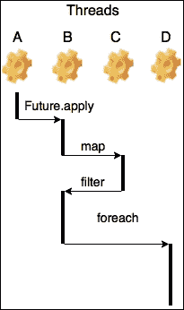
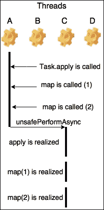

# 第六章。Scala 中的并发

在本章中，我们将从集合转向一个不同的主题：并发。能够利用硬件提供的所有 CPU 资源对于编写高性能软件至关重要。不幸的是，编写并发代码并不容易，因为很容易编写出不安全的程序。如果你来自 Java，你可能仍然会梦魇般地涉及`synchronized`块和锁！`java.util.concurrent`包提供了许多工具，使编写并发代码变得简单。然而，设计稳定可靠并发应用仍然是一个艰巨的挑战。在本章中，我们将探讨 Scala 标准库提供的工具，以利用并发。在简要介绍主要抽象`Future`之后，我们将研究其行为和应避免的使用陷阱。我们将通过探索由 Scalaz 库提供的名为`Task`的`Future`的替代方案来结束本章。在本章中，我们将探讨以下主题：

+   并发与并行

+   未来使用考虑

+   阻塞调用和回调

+   Scalaz Task

# 并行化回测策略

数据科学家们正在使用你为他们构建的数据分析工具进行研究交易策略。然而，他们遇到了瓶颈，因为回测策略变得越来越昂贵。随着他们构建了更复杂的策略，这些策略需要更多的历史数据，并采用更多有状态的算法，回测所需时间更长。又一次，你被召唤到 MVT，利用 Scala 和函数式范式来提供高性能软件。

数据科学家们逐步构建了一个回测工具，该工具允许团队通过回放历史数据来确定策略的表现。这是通过提供一个预设的策略来运行，一个用于测试的股票代码，以及回放历史数据的时间间隔来实现的。回测器加载市场数据并将策略应用于生成交易决策。一旦回测器完成历史数据的回放，它将总结并显示策略性能结果。回测器在将策略投入实际交易生产之前，被大量依赖以确定所提交易策略的有效性。

要开始熟悉回测器，你可以查看以下代码：

```java
  sealed trait Strategy 
  case class PnL(value: BigDecimal) extends AnyVal 
  case class BacktestPerformanceSummary(pnl: PnL) 
  case class Ticker(value: String) extends AnyVal 

  def backtest( 
    strategy: Strategy, 
    ticker: Ticker, 
    testInterval: Interval): BacktestPerformanceSummary = ??? 

```

在先前的数据分析仓库快照中，你可以看到驱动回测的主要方法。给定一个`Strategy`、`Ticker`和`Interval`，它可以生成`BacktestPerformanceSummary`。扫描仓库，你发现一个名为`CrazyIdeas.scala`的文件，显示 Dave 是唯一的提交作者。在这里，你可以看到回测器的示例调用：

```java
def lastMonths(months: Int): Interval = 
    new Interval(new DateTime().minusMonths(months), new DateTime()) 
backtest(Dave1, Ticker("AAPL"), lastMonths(3)) 
backtest(Dave1, Ticker("GOOG"), lastMonths(3)) 
backtest(Dave2, Ticker("AAPL"), lastMonths(3)) 
backtest(Dave2, Ticker("GOOG"), lastMonths(3)) 

```

使用回测工具可以给你一个可能的性能改进的线索。看起来当 Dave 有一个新想法时，他想要评估它在多个符号上的性能，并将其与其他策略进行比较。在其当前形式中，回测是顺序执行的。提高回测工具执行速度的一种方法是将所有回测运行的执行并行化。如果每个回测工具的调用都是并行化的，并且有额外的硬件资源，那么回测多个策略和符号将更快完成。为了理解如何并行化回测工具，我们首先需要深入研究异步编程的主题，然后看看 Scala 如何支持并发。

### 注意

在深入代码之前，我们需要丰富我们的词汇来讨论异步编程的特性。并发性和并行性经常被互换使用，但这两个术语之间存在一个重要的区别。并发涉及两个（或更多）任务，它们在重叠的时间段内启动和执行。两个任务都在进行中（即，它们正在运行），但在任何给定的时间点，可能只有一个任务正在执行实际工作。这是你在单核机器上编写并发代码的情况。一次只有一个任务可以进步，但多个任务可以并发进行。

并行性只有在两个任务真正同时运行时才存在。在双核机器上，你可以同时执行两个任务。从这个定义中，我们可以看出并行性取决于可用的硬件。这意味着并发性可以添加到程序中，但并行性超出了软件的控制范围。

为了更好地说明这些概念，可以考虑粉刷房间的例子。如果只有一个粉刷工，粉刷工可以在墙上刷第一层涂料，然后移动到下一面墙，再回到第一面墙刷第二层，然后完成第二面墙。粉刷工同时粉刷两面墙，但任何给定时间只能在一面墙上花费时间。如果有两个粉刷工在作业，他们可以各自专注于一面墙，并平行地粉刷它们。

## 探索 Future

Scala 中用于驱动并发编程的主要构造是 `Future`。位于 `scala.concurrent` 包中，`Future` 可以被视为一个可能尚未存在的值的容器。让我们通过一个简单的例子来说明其用法：

```java
scala> import scala.concurrent.Future 
import scala.concurrent.Future 

scala> import scala.concurrent.ExecutionContext 
import scala.concurrent.ExecutionContext 

scala> val context: ExecutionContext = scala.concurrent.ExecutionContext.global 
context: scala.concurrent.ExecutionContext = scala.concurrent.impl.ExecutionContextImpl@3fce8fd9 

scala> def example(){ 
  println("Starting the example") 
  Future{  
    println("Starting the Future") 
    Thread.sleep(1000)  // simulate computation 
    println("Done with the computation")   
 }(context) 

println("Ending example") 
} 

```

上述例子展示了一个简短的方法，创建一个 `Future` 值模拟了昂贵的计算，并打印了几行以便我们更容易理解应用程序的流程。当运行 `example` 时，我们看到以下输出：

```java
scala> example() 
Starting the example 
Ending example 
Starting the future 
// a pause 
Done with the computation 

```

我们可以看到，`Future` 在 `example` 方法结束之后执行。这是因为当创建 `Future` 时，它开始并发地执行其计算。你可能想知道，“在创建 `Future` 时使用的 `context` 对象是什么类型的 `ExecutionContext`？” 我们将在稍后深入探讨 `ExecutionContext`，但现在，我们将其视为负责 `Future` 执行的对象。我们导入 `scala.concurrent.ExecutionContext.global`，这是一个由标准库创建的默认对象，以便能够执行 `Future`。

`Future` 对象是一个有状态的对象。当计算正在进行时，它可能尚未完成；一旦计算完成，它就完成了。此外，一个完成的 `Future` 可以是计算成功时的成功状态，或者如果计算过程中抛出了异常，则可以是失败状态。

`Future` API 提供了组合 `Future` 实例和操作它们包含的结果的组合器：

```java
scala> import scala.concurrent.ExecutionContext.Implicits.global 
import scala.concurrent.ExecutionContext.Implicits.global 

scala> import scala.concurrent.Future 
import scala.concurrent.Future 

scala> Future(1).map(_ + 1).filter(_ % 2 == 0).foreach(println) 

2 

```

这个 Scala 控制台代码片段显示了构造一个包装常量整数值的 `Future` 数据类型。我们看到，包含在 `Future` 数据类型中的整数是通过类似于我们预期在 `Option` 和集合数据类型上找到的函数转换的。这些转换在先前的 `Future` 完成后应用，并返回一个新的 `Future`。

正如承诺的那样，我们现在来探讨 `ExecutionContext`。`ExecutionContext` 可以被视为 `Future` 背后的机制，它提供了运行时异步性。在前面的代码片段中，创建了一个 `Future` 来执行简单的加法和模除运算，而没有在调用位置显式提供 `ExecutionContext` 实例。相反，只提供了对 `global` 对象的导入。代码片段能够执行，因为 `global` 是一个隐式值，而 `map` 的签名接受一个隐式的 `ExecutionContext`。让我们看看 `map` 的以下签名，以加深我们的理解：

```java
def mapS(implicit executor: ExecutionContext): Future[S] 

```

从 `map` 的签名中，我们可以看到，与 `List` 上的 `map` 转换不同，`Future` 需要一个柯里化的、隐式的 `ExecutionContext` 参数。为了理解 `ExecutionContext` 如何提供运行时异步性，我们首先需要了解它的操作：

```java
trait ExecutionContext { 
  def execute(runnable: Runnable): Unit 
  def reportFailure(cause: Throwable): Unit 
  def prepare(): ExecutionContext = this 
} 

```

`execute` 是一个作用于 `java.lang.Runnable` 的副作用方法。对于那些熟悉 Java 并发的开发者，你很可能记得 `Runnable` 是一个常用的接口，允许线程和其他 `java.util.concurrent` 抽象并发执行代码。尽管我们还不清楚 `Future` 如何实现运行时异步性，但我们确实知道 `Future` 的执行和 `Runnable` 的创建之间存在联系。

我们接下来要回答的问题是，“我该如何创建一个 `ExecutionContext`？” 通过研究伴随对象，我们发现以下签名：

```java
def fromExecutorService(e: ExecutorService, reporter: Throwable => Unit): ExecutionContextExecutorService 
def fromExecutorService(e: ExecutorService): ExecutionContextExecutorService 
def fromExecutor(e: Executor, reporter: Throwable => Unit): ExecutionContextExecutor 
def fromExecutor(e: Executor): ExecutionContextExecutor 

```

标准库提供了方便的方法，可以从 `java.util.concurrent.Executor` 或 `java.util.concurrent.ExecutorService` 创建 `ExecutionContext`。

### 注意

如果你不太熟悉 `java.util.concurrent` 包提供的机制，并且你希望获得比 API 文档提供的更深入的处理，我们鼓励你阅读 Brian Goetz 的《Java 并发实践》（[`jcip.net/`](http://jcip.net/)）。尽管《Java 并发实践》是围绕 JDK 6 的发布编写的，但它包含了今天仍然适用的许多原则。阅读这本书将为你提供对 Scala 标准库使用的 JDK 提供的并发原语进行深入了解。

工厂方法的返回类型是 `ExecutionContext` 的一个更专业的版本。标准库为 `ExecutionContext` 定义了以下继承链：

```java
trait ExecutionContextExecutor extends ExecutionContext with java.util.concurrent.Executor 
trait ExecutionContextExecutorService extends ExecutionContextExecutor with java.util.concurrent.ExecutorService 

```

此外，在 `ExecutionContext` 伴随对象中，我们可以找到我们第一个示例中使用的隐式上下文，如下所示：

```java
def global: ExecutionContextExecutor = Implicits.global 

```

`Implicits.global` 的定义文档指出，这个 `ExecutionContext` 由一个线程池支持，其线程数等于可用的处理器数量。我们对 `ExecutionContext` 的深入研究展示了简单的 `Future` 示例是如何运行的。我们可以展示 `Future` 如何将其 `ExecutionContext` 应用到多个线程上执行：

```java
  Future(1).map(i => { 
    println(Thread.currentThread().getName) 
    i + 1 
  }).filter(i => { 
    println(Thread.currentThread().getName) 
    i % 2 == 0 
  }).foreach(println) 

```

我们扩展了原始片段以打印执行每个转换的线程名称。在多核机器上运行时，此片段的输出是可变的，取决于哪些线程获取了转换。以下是一个示例输出：

```java
ForkJoinPool-1-worker-3 
ForkJoinPool-1-worker-5 
2 

```

此示例表明一个 `worker-3` 线程执行了 `map` 转换，而另一个 `worker-5` 线程执行了 `filter` 转换。从我们简单的示例中，我们可以得出两个关于 `Future` 如何影响控制流的关键见解。首先，`Future` 是一种并发数据类型，使我们能够将程序的流程控制分解成多个逻辑处理线程。其次，我们的示例表明 `Future` 在创建时立即开始执行。这意味着转换立即在程序的另一个流程中应用。我们可以利用这些见解来提高 Dave 的疯狂想法的运行时性能。

## 未来与疯狂想法

我们将 `Future` 应用到 Dave 的回测集中以提高性能。我们相信存在改进性能的机会，因为 Dave 的笔记本电脑有四个 CPU 核心。这意味着通过向我们的程序添加并发性，我们将能够从运行时并行性中受益。我们的第一次尝试使用 for-表达式：

```java
implicit val ec = scala.concurrent.ExecutionContext.Implicits.global 
for { 
      firstDaveAapl <- Future(backtest(Dave1, Ticker("AAPL"), lastMonths(3))) 
      firstDaveGoog <- Future(backtest(Dave1, Ticker("GOOG"), lastMonths(3))) 
      secondDaveAapl <- Future(backtest(Dave2, Ticker("AAPL"), lastMonths(3))) 
      secondDaveGoog <- Future(backtest(Dave2, Ticker("GOOG"), lastMonths(3))) 
    } yield (firstDaveAapl, firstDaveGoog, secondDaveAapl, secondDaveGoog) 

```

每次回测调用都通过调用 `Future.apply` 创建一个 `Future` 实例进行封装。这个伴随对象方法使用按名参数来延迟对参数的评估，在这种情况下，是调用 `backtest`：

```java
def applyT(executor: ExecutionContext): Future[T] 

```

运行`CrazyIdeas.scala`的新版本后，你失望地看到运行时执行并没有得到改善。你迅速地检查了 Linux 机器上的 CPU 数量，如下所示：

```java
$ cat /proc/cpuinfo  | grep processor | wc -l 
8 

```

确认笔记本电脑上有八个核心后，你疑惑为什么执行时间与原始的串行执行时间相同。这里的解决方案是考虑 for-comprehension 是如何编译的。for-comprehension 等同于以下更简单的示例：

```java
Future(1).flatMap(f1 => Future(2).flatMap(f2 => Future(3).map(f3 => (f1, f2, f3)))) 

```

在这个 for-comprehension 的简化表示中，我们看到第二个`Future`是在第一个`Future`的`flatMap`转换中创建和评估的。任何应用于`Future`的转换（例如`flatMap`）都只有在提供给转换的值被计算后才会被调用。这意味着先前的示例中的`Future`和 for-comprehension 是顺序执行的。为了达到我们想要的并发性，我们必须修改`CrazyIdeas.scala`使其看起来如下：

```java
    val firstDaveAaplF = Future(backtest(Dave1, Ticker("AAPL"), 
      lastMonths(3))) 
    val firstDaveGoogF = Future(backtest(Dave1, Ticker("GOOG"), 
      lastMonths(3))) 
    val secondDaveAaplF = Future(backtest(Dave2, Ticker("AAPL"), 
      lastMonths(3))) 
    val secondDaveGoogF = Future(backtest(Dave2, Ticker("GOOG"), 
      lastMonths(3))) 
    for { 
      firstDaveAapl <- firstDaveAaplF 
      firstDaveGoog <- firstDaveGoogF 
      secondDaveAapl <- secondDaveAaplF 
      secondDaveGoog <- secondDaveGoogF 
    } yield (firstDaveAapl, firstDaveGoog, secondDaveAapl, secondDaveGoog) 

```

在这个代码片段中，并发启动了四个回测，并将结果转换为一个包含四个`BacktestPerformanceSummary`值的`Tuple4`的`Future`。眼见为实，在向 Dave 展示他的回测运行速度更快后，他兴奋地快速迭代新的回测想法。Dave 从不错过任何开玩笑的机会，他感叹道：“使用我所有的核心让我的笔记本电脑风扇转得飞快。不确定我是否喜欢这种噪音，但确实喜欢这种性能！”

## `Future`使用注意事项

在上一个示例中，我们通过研究如何将并发引入回测器来展示了`Future` API 的易用性。像任何强大的工具一样，你对`Future`的使用必须是有纪律的，以确保正确性和性能。本节评估了在使用`Future`添加并发到程序时常见的一些混淆和错误。我们将详细讨论执行副作用、阻塞执行、处理失败、选择合适的执行上下文以及性能考虑。

### 执行副作用

当使用`Future`编程时，重要的是要记住`Future`本质上是一个有副作用的构造。除非使用`success`或`failure`工厂方法将值提升到`Future`中，否则工作将被安排在另一个线程上执行（这是创建`Future`时使用的`ExecutionContext`的一部分）。更重要的是，一旦执行，`Future`就不能再次执行。考虑以下代码片段：

```java
scala> import scala.concurrent.Future 
import scala.concurrent.Future 

scala> import scala.concurrent.ExecutionContext.Implicits.global 
import scala.concurrent.ExecutionContext.Implicits.global 

scala> val f = Future{ println("FOO"); 40 + 2} 
FOO 
f: scala.concurrent.Future[Int] = scala.concurrent.impl.Promise$DefaultPromise@5575e0df 

scala> f.value 
res3: Option[scala.util.Try[Int]] = Some(Success(42)) 

```

`Future`被计算并按预期打印`FOO`。然后我们可以访问`Future`中包裹的值。注意，在访问值时，控制台上没有打印任何内容。一旦完成，`Future`仅仅是一个已实现值的包装器。如果你想再次执行计算，你需要创建一个新的`Future`实例。

### 注意

注意，前面的例子使用了`Future.value`来提取计算的输出。这样做是为了简化。在生产代码中，很少甚至从不应该使用这种方法。它的返回类型定义为`Option[Try[A]]`。`Option`用于表示已完成的`Future`带有`Some`，以及未实现的`Future`带有`None`。此外，记住，已实现的`Future`可以有两种状态：成功或失败。这就是内部`Try`的目的。像`Option.get`一样，几乎从不建议使用`Future.value`。要从`Future`中提取值，请参考下面描述的附加技术。

### 阻塞执行

当我们将并发性添加到回测器中时，我们编写了一个返回`Future[(BacktestPerformanceSummary, BacktestPerformanceSummary, BacktestPerformanceSummary, BacktestPerformanceSummary)]`的 for-comprehension，这可能会让你想知道如何访问`Future`中包裹的值。另一种提问方式是，“给定`Future[T]`，我如何返回`T`？”简短的回答是，“你不能！”使用多个`Future`编程需要从同步执行向异步执行转变思维方式。在异步模型编程时，目标是避免直接与`T`交互，因为这暗示了一个同步合约。

在实践中，有些情况下拥有`Future[T] => T`函数是有用的。例如，考虑回测器的片段。如果从片段中的代码通过定义一个扩展`App`的`object`来创建程序，程序将在回测完成之前终止。由于`ExecutionContext`全局中的线程是守护线程，JVM 在创建`Future`后立即终止。在这种情况下，我们需要一个同步机制来暂停执行，直到结果准备好。通过扩展`Awaitable`特质，`Future`能够提供这样的功能。`Await`模块公开了两个实现此目标的方法：

```java
def readyT: awaitable.type 
def resultT: T 

```

由于`Future`扩展了`Awaitable`，`Future`可以作为参数传递给任一方法。`ready`方法会暂停程序流程，直到`T`可用，并返回完成的`Future[T]`。在实践中，`ready`很少使用，因为在同步调用中返回`Future[T]`而不是`T`在概念上是奇怪的。你更有可能经常使用`result`，它提供了所需的转换，给定`Future[T]`返回`T`。例如，`CrazyIdeas.scala`可以被修改成以下样子：

```java
    val summariesF = for { 
      firstDaveAapl <- Future(backtest(Dave1, Ticker("AAPL"), lastMonths(3))) 
      firstDaveGoog <- Future(backtest(Dave1, Ticker("GOOG"), lastMonths(3))) 
      secondDaveAapl <- Future(backtest(Dave2, Ticker("AAPL"), lastMonths(3))) 
      secondDaveGoog <- Future(backtest(Dave2, Ticker("GOOG"), lastMonths(3))) 
    } yield (firstDaveAapl, firstDaveGoog, secondDaveAapl, secondDaveGoog) 

    Await.result(summariesF, scala.concurrent.duration.Duration(1, java.util.concurrent.TimeUnit.SECONDS)) 

```

在这个片段中，我们看到阻塞、同步调用 `Await.result` 返回 `Future[BacktestPerformanceSummary]` 的 `Tuple`。这个带有超时参数的阻塞调用是为了防御 `Future` 在一定时间内未计算的场景。使用阻塞调用检索回测结果意味着 JVM 只会在回测完成或超时到期后退出。当超时到期而回测未完成时，`result` 和 `ready` 抛出 `TimeoutException`。

阻塞程序执行可能会对你的程序性能产生负面影响，因此应谨慎使用。使用 `Await` 伴生对象上的方法可以使阻塞调用易于识别。由于 `ready` 和 `result` 在超时时抛出异常，而不是返回不同的数据类型，你必须格外小心地处理这种情况。你应该将任何涉及异步性的同步调用（要么不提供超时，要么不处理超时）视为错误。

异步编程需要一种心态转变，编写描述值出现时做什么的程序，而不是编写在执行操作之前需要值存在的程序。你应该对任何中断待计算值转换的 `Await` 使用持怀疑态度。一系列转换应该通过作用于 `Future[T]` 而不是 `T` 来组合。`Await` 的使用应限制在程序没有其他工作可做且需要转换结果的情况下，正如我们在回测器中看到的那样。

### 注意

由于标准库模型使用异常而不是不同的返回类型来处理超时，因此很难强制执行始终处理超时的要求。提高安全性的一个方法是通过编写返回 `Option[T]` 而不是 `T` 的实用方法来处理超时场景：

```java
object SafeAwait { 
  def resultT: Option[T] =

    Try(Await.result(awaitable, atMost)) match { 
      case Success(t) => Some(t) 
      case Failure(_: TimeoutException) => None 
      case Failure(e) => throw e 
    } 
}
```

使用这种方法，可以消除整个错误类别。当你遇到其他不安全的转换时，考虑定义返回编码预期错误的数据类型的方法，以避免意外地处理转换结果不当。你还想到了哪些不安全转换的例子？

### 处理失败

与 `Future` 一起工作需要纪律性地处理错误场景，以避免编写一组难以推理的转换。当一个异常在 `Future` 转换内部抛出时，它会在转换的计算线程中向上冒泡并中断下游的转换。考虑以下激励示例：

```java
Future("not-an-integer").map(_.toInt).map(i => { 
      println("Multiplying") 
      i * 2 
    }) 

```

你期望在第一次`map`转换之后发生什么？很明显，转换将失败，因为提供的输入无法转换为整数。在这种情况下，`Future`被视为失败的`Future`，并且在此示例中，对包装的`Int`值执行的下游转换将不会发生。在这个简单的例子中，很明显转换无法继续。想象一下，在一个更大的代码库中，操作比单个整数更复杂的数据，并且有多个命名空间和源文件中的失败场景。在现实世界的设置中，确定异步计算失败的位置更具挑战性。

`Future`提供了处理失败的功能。它提供了`recover`和`recoverWith`来继续下游转换。签名如下：

```java
def recoverU >: T(implicit executor: ExecutionContext): Future[U] 
def recoverWithU >: T(implicit executor: ExecutionContext): Future[U] 

```

这两种恢复方法的区别在于，提供给`recover`的偏函数返回`U`，而`recoverWith`返回`Future[U]`。在我们的上一个例子中，我们可以使用`recover`来提供一个默认值以继续转换，如下所示：

```java
Future("not-an-integer").map(_.toInt).recover { 
  case _: NumberFormatException => -2 
}.map(i => { 
  println("Multiplying") 
  i * 2 
}) 

```

运行此代码片段会产生以下输出：

```java
Multiplying 
Multiplication result = -4 

```

这种方法允许你在转换失败时继续转换管道，但它与`Await`上的方法具有相同的缺点。返回的`Future[T]`数据类型没有反映失败的可能性。使用恢复方法容易出错，因为无法知道是否处理了错误条件，除非阅读代码。

我们所研究的错误处理适用于处理计算过程中的失败。在一系列转换完成后，你可能会希望执行特殊的逻辑。想象一下，你正在构建一个提交交易订单到交易所的 Web 服务。如果订单已提交到交易所，则订单提交成功；否则，被视为失败的提交。由于订单提交涉及与外部系统（交易所）的通信，你使用`Future`来模拟这个动作。以下是处理订单提交的方法：

```java
  def submitOrder( 
    ec: ExecutionContext, 
    sendToExchange: ValidatedOrder => Future[OrderSubmitted], 
    updatePositions: OrderSubmitted => Future[AccountPositions], 
    o: RawOrder): Unit = { 
    implicit val iec = ec 

    (for { 
      vo <- ValidatedOrder.fromRawOrder(o).fold(
        Future.failedValidatedOrder))(Future.successful) 
      os <- sendToExchange(vo) 
      ap <- updatePositions(os) 
    } yield (os, ap)).onComplete { 
      case Success((os, ap)) => // Marshal order submission info to caller 
      case Failure(e) =>  // Marshal appropriate error response to caller 
    } 
  } 

```

`ExecutionContext`、提交订单的方式以及提交交易后更新客户交易位置的方式允许将客户提供的`RawOrder`提交到交易所。在第一个处理步骤中，`RawOrder`被转换为`ValidatedOrder`，然后提升到`Future`。`Future.failure`和`Future.successful`是方便地将计算值提升或包装到`Future`中的方式。值被提升到`Future`中，以便将整个步骤序列写成一个单一的 for-comprehension。

在完成所有处理步骤之后，会异步调用`onComplete`来处理请求处理的完成。你可以想象在这个上下文中，完成请求处理意味着创建一个响应的序列化版本并将其传输给调用者。之前，我们唯一可用的机制是在值计算后执行工作，那就是使用`Await`进行阻塞。`onComplete`是一个异步调用的回调，它注册了一个在值完成时将被调用的函数。如示例所示，`onComplete`支持处理成功和失败情况，这使得它成为一个通用的工具，用于处理`Future`转换的结果。除了`onComplete`之外，`Future`还提供了`onFailure`专门用于失败情况，以及`onSuccess`和`foreach`专门用于成功情况。

这些回调方法公开了一个返回`Unit`的方法签名。作为一个函数式程序员，你应该对这些方法持谨慎态度，因为它们具有副作用。`onComplete`调用应该只在计算绝对结束时发生，此时副作用不能再被延迟。在 Web 服务示例中，副作用是将响应传输给调用者。使用这些具有副作用的回调的另一个常见用例是处理横切关注点，例如应用程序度量。回到 Web 服务，这是在订单提交到交易所失败时增加错误计数器的一种方法：

```java
   (for { 
      vo <- ValidatedOrder.fromRawOrder(o).fold( 
        Future.failedValidatedOrder))(Future.successful) 
      os <- { 
        val f = sendToExchange(vo) 
        f.onFailure({ case e => incrementExchangeErrorCount() }) 
        f 
      } 
      ap <- updatePositions(os) 
    } yield (os, ap)) 

```

在这个片段中，当通过`onFailure`回调提交到交易所失败时，会执行副作用。在这个独立的例子中，跟踪副作用发生的位置很简单。然而，在一个更大的系统中，确定何时以及在哪里注册了回调可能是一个挑战。此外，从`Future` API 文档中，我们了解到回调执行是无序的，这意味着所有回调都必须独立处理。这就是为什么你必须有纪律地考虑何时以及在哪里应用这些副作用。

错误处理的另一种方法是使用可以编码错误的数据类型。我们已经在`Option`作为返回数据类型时看到了这种方法的应用。`Option`使得计算可能失败这一点很清楚，同时使用起来也很方便，因为它的转换（例如，`map`）操作在包装值上。不幸的是，`Option`不允许我们编码错误。在这种情况下，使用 Scalaz 库中的另一个工具——析取（disjunction）是有帮助的。析取在概念上类似于`Either`，可以用来表示两种可能类型之一。析取与`Either`的不同之处在于它的操作是右偏的。让我们通过一个简单的例子来说明这个想法：

```java
scalaz.\/.rightThrowable, Int.map(_ * 2) 

```

`\/` 是 Scalaz 用来表示析取的简写符号。在这个例子中，通过将一个整型字面量包裹起来创建了一个右析取。这个析取要么具有 `Throwable` 值，要么具有 `Int` 值，它与 `Either[Throwable, Int]` 类似。与 `Either` 不同，`map` 转换作用于析取的右侧。在这个例子中，`map` 接受一个 `Int` 值作为输入，因为析取的右侧是一个 `Int` 值。由于析取是右偏的，它很自然地适合表示失败和成功值。使用中缀表示法，通常使用 `Future` 来定义错误处理，形式为 `Future[Throwable \/ T]`。代替 `Throwable`，可以定义一个可能的错误类型 ADT 来使错误处理更加明确。这种方法是可取的，因为它强制处理失败情况，而不依赖于作者调用恢复方法。如果您想了解更多关于如何将析取作为错误处理工具的信息，请查看 Eugene Yokota 的优秀 Scalaz 教程 [`eed3si9n.com/learning-scalaz/Either.html`](http://eed3si9n.com/learning-scalaz/Either.html)。

## 通过执行器提交影响性能

由于 `Future` 提供了一个表达性强且易于使用的 API，在大型系统中执行计算时，通常会对它进行多次转换。回顾前一小节中提到的订单提交 web 服务，您可以想象多个应用层在 `Future` 上操作。一个生产就绪的 web 服务通常将多个层组合起来以服务单个请求。一个示例请求流程可能包含以下阶段：请求反序列化、授权、应用服务调用、数据库查找和/或第三方服务调用，以及将响应转换为 JSON 格式。如果在工作流程中的每个阶段都使用 `Future` 来建模，那么处理单个请求通常需要五个或更多的转换。

将您的软件系统分解成与前面示例类似的小责任区域是一种良好的工程实践，这有助于支持独立测试和改进可维护性。然而，当与 `Future` 一起工作时，这种软件设计方法会带来性能成本。正如我们通过示例使用所看到的那样，几乎所有的 `Future` 转换都需要提交工作到 `Executor`。在我们的示例工作流程中，转换的大多数阶段都很小。在这种情况下，提交工作到执行器的开销主导了计算的执行时间。如果订单提交 web 服务需要处理大量具有严格吞吐量和延迟要求的客户，那么专注于可测试性和可维护性的工程实践可能会导致性能不佳的软件。



如果你考虑前面的图示，你可以看到一个线程池正在使用四个线程来对一个`Future`应用转换。每个转换都会提交到池中，并且有可能会选择不同的线程来进行计算。这个图示展示了多个小的转换可能会因为`Executor`提交的开销而影响性能。

`Executor`提交的开销究竟有多大？这是编写基准测试以量化提交工作到`Executor`开销的动机问题。这个基准测试关注以两种方式对整数 N 次加 1。一种方法是在单个`Future`内执行加法操作，而第二种方法是用一个新的`Future`转换执行每个加法操作。后一种方法是一个代理，用于表示在更大的软件系统中使用多个`Future`转换的顺序提交请求处理阶段。执行整数加法是一个代理操作，因为它是一种极其低廉的计算，这意味着执行时间将由`Executor`提交主导。基准测试如下所示：

```java
  @Benchmark 
  def manyTransforms(state: TransformFutureState): Int = { 
    import scala.concurrent.ExecutionContext.Implicits._ 
    val init = Future(0) 
    val res = (1 until state.operations).foldLeft(init)
      ((f, _) => f.map(_ + 1)) 
    Await.result(res, Duration("5 minutes")) 
  } 

  @Benchmark 
  def oneTransform(state: TransformFutureState): Int = { 
    import scala.concurrent.ExecutionContext.Implicits._ 
    val res = Future { 
      (1 until state.operations).foldLeft(0)((acc, _) => acc + 1) 
    } 
    Await.result(res, Duration("5 minutes")) 
  } 

```

`TransformFutureState`允许对操作数量进行参数化。`manyTransforms`使用涉及提交工作到`Executor`的`map`转换来表示每个加法操作。`oneTransform`通过`Future.apply`使用单个`Executor`提交执行所有加法操作。在这个受控测试中，`Await.result`被用作阻塞机制以等待计算的完成。在具有五个转换和十个转换的具有两个核心的机器上运行此测试的结果可以在以下表格中看到：

| **基准测试** | **映射计数** | **吞吐量（每秒操作数）** | **错误率（吞吐量的百分比）** |
| --- | --- | --- | --- |
| `manyTransforms` | 5 | 463,614.88 | ± 1.10 |
| `oneTransform` | 5 | 412,675.70 | ± 0.81 |
| `manyTransforms` | 10 | 118,743.55 | ± 2.34 |
| `oneTransform` | 10 | 316,175.79 | ± 1.79 |

当两种场景都使用五个转换时，它们会产生可比较的结果，但当我们应用十个转换时，我们可以看到明显的差异。这个基准测试清楚地表明`Executor`提交可能会主导性能。尽管成本可能很高，但我们的建议是，在系统建模时不要一开始就考虑这个成本。根据我们的经验，重新设计一个良好建模的系统以改进性能比扩展或重新设计一个性能良好但建模不佳的系统要容易得多。因此，我们建议在尝试构建复杂系统的初始版本时，不要过分努力地分组`Executor`提交。

一旦你有一个良好的设计，第一步就是进行基准测试和性能分析，以确定`Executor`提交是否是瓶颈。如果你发现你的`Future`使用方式导致了性能瓶颈，那么你应该考虑几个行动方案。

开发成本最低的选项是用`Future.success`或`Future.failure`替换不必要的昂贵的`Future`创建。订单提交 Web 服务利用了这些工厂方法将值提升到`Future`中。由于值已经计算，这些工厂方法避免了向由提供的`ExecutionContext`引用的任务提交任何任务。当值已经计算时，用`Future.successful`或`Future.failure`替换`Future.apply`的使用可以节省成本。

从开发努力的角度来看，一个更昂贵的替代方案是对你的实现进行重构，以将`Future`转换组合在一起，类似于`manyTransforms`。这种策略涉及审查每个应用程序层，以确定单个层内的转换是否可以合并。如果可能的话，我们建议你避免跨应用程序层合并转换（例如，在请求反序列化或授权与应用程序服务处理之间），因为这会削弱你的模型并增加维护成本。

如果这些选项中的任何一个都不能产生可接受的性能，那么与产品所有者讨论使用硬件解决性能问题的选项可能是有价值的。由于你的系统设计没有受损，并且反映了稳健的工程实践，因此它很可能可以进行横向扩展或集群化。根据你的系统跟踪的状态，这个选项可能不需要额外的开发工作。也许产品所有者更重视一个易于维护和扩展的系统，而不是性能。如果是这样，给你的系统增加规模可能是一个可行的前进方式。

假设你无法通过购买方式摆脱性能挑战，那么还有三种额外的可能性。一个选择是调查`Future`的替代方案，名为`Task`。这个由 Scalaz 库提供的结构允许以更少的`Executor`提交来执行计算。这个选项需要重大的开发工作，因为需要在整个应用程序中将`Future`数据类型替换为`Task`。我们将在本章末尾探讨`Task`，并研究它可能提供的性能优势。

无论是使用`Task`还是不使用`Task`，审查你的应用程序模型以批判性地质疑是否在关键路径上执行了不必要的操作都是有用的。正如我们在 MVT 的报表基础设施和引入流处理中看到的那样，有时重新思考设计可以提高性能。像`Task`的引入一样，重新考虑你的系统架构是一个大规模的变更。最后的手段是合并应用程序层以支持`Future`转换的分组。我们建议不要采取这个选项，除非所有其他建议都失败了。这个选项会导致代码库更难以推理，因为关注点不再分离。短期内，你可能会获得性能上的好处，但根据我们的经验，这些好处在长期内被维护和扩展这样一个系统的成本所抵消。

# 处理阻塞调用和回调

如本章第一部分所述，`Future` API 提供了一种优雅的方式来编写并发程序。由于在`Future`上阻塞被认为是一种不好的做法，因此在整个代码库中广泛使用`Future`并不罕见。然而，你的系统可能不仅仅由你自己的代码组成。大多数现实世界的应用程序利用现有的库和第三方软件来避免重新实现一些常见问题的现有解决方案（如数据编码和解码、通过 HTTP 进行通信、数据库驱动程序等）。不幸的是，并非所有库都使用`Future` API，将它们优雅地集成到你的系统中可能成为一个挑战。在本节中，我们将检查你可能会遇到的一些常见陷阱，并提及可能的解决方案。

## `ExecutionContext`和阻塞调用

在开发回测器时，你注意到代码中的一个模块被用来从一个关系型数据库中加载一些历史买入订单。由于你开始重写应用程序以利用`Future`，该模块 API 是完全异步的：

```java
def findBuyOrders( 
 client: ClientId, 
 ticker: Ticker)(implicit ec: ExecutionContext): Future[List[Order]] = ??? 

```

然而，在分析应用程序后，你注意到这部分代码的性能相当差。你尝试增加数据库连接数，首先将其翻倍，然后将其增加到三倍，但都没有成功。为了理解问题的原因，你查看所有调用该方法的位置，并注意到以下模式：

```java
import scala.concurrent.ExecutionContext.Implicits.global 
findBuyOrders(clientId, tickerFoo)   

```

所有调用者都导入全局的`ExecutionContext`以隐式地由方法使用。默认线程池由`ForkJoinPool`支持，其大小基于机器上的可用核心数。因此，它是 CPU 密集型的，旨在处理非阻塞、CPU 密集型操作。这对于不执行阻塞调用的应用程序来说是一个不错的选择。然而，如果你的应用程序以异步方式（即在`Future`执行中）运行阻塞调用，依赖于默认的`ExecutionContext`很可能会迅速降低性能。

### 异步与非阻塞的比较

在继续之前，我们想要澄清本节中使用的一些术语。在并发的情况下，“非阻塞”可能是一个令人困惑的术语。当使用`Future`时，我们执行异步操作，这意味着我们开始一个计算过程，以便它可以与程序的流程一起进行。计算在后台执行，最终将产生一个结果。这种行为有时被称为非阻塞，意味着 API 调用立即返回。然而，阻塞和非阻塞通常指的是 I/O 操作及其执行方式，特别是执行操作的线程的使用方式。例如，将一系列字节写入本地文件可能是一个阻塞操作，因为调用`write`的线程将不得不等待（阻塞）直到 I/O 操作完成。当使用非阻塞构造，如`java.nio`包中提供的那样，可以执行不会阻塞线程的 I/O 操作。

可以实现一个具有以下行为的 API 组合：

| **API 特性** | **返回** | **会阻塞线程吗？** |
| --- | --- | --- |
| 同步/阻塞 | 计算结束时 | 是的，调用线程执行操作 |
| 异步/阻塞 | 立即 | 是的，这会阻塞来自专用池的线程 |
| 异步/非阻塞 | 立即 | 不，在执行阻塞操作时线程被释放 |

### 使用专用`ExecutionContext`来阻塞调用

显然，我们的问题是我们在全局使用`ExecutionContext`来执行阻塞调用。我们正在查询关系型数据库，大多数 JDBC 驱动程序都是实现为执行阻塞调用。池化线程调用驱动程序，并在等待查询和响应通过网络传输时阻塞，这使得它们无法被其他计算使用。一个选项是创建一个专门的`ExecutionContext`来执行`Future`，包括阻塞操作。这个`ExecutionContext`的大小是根据预期它们在执行计算时会阻塞来设定的：

```java
val context = ExecutionContext.fromExecutorService( 
  Executors.newFixedThreadPool(20) 
) 
findBuyOrders(clientId, tickerFoo)(context)   

```

第一个好处是我们有更多的线程可用，这意味着我们可以并发地发起更多查询。第二个好处是我们系统中执行的其他异步计算是在一个单独的池（例如，全局上下文）中完成的，并且它们将避免饥饿，因为没有线程被阻塞。

我们编写了一个简短的基准测试来评估我们新系统的性能。在这个例子中，我们使用`findBuyOrders`的模拟实现来模拟查询数据库：

```java
def findBuyOrders( 
 client: ClientId, 
 ticker: Ticker)(ec: ExecutionContext): Future[List[Order]] = Future { 
 Thread.sleep(100) 
 Order.staticList.filter(o => o.clientId == client  
   && o.ticker == ticker) 
}(ec) 

```

我们将`ExecutionContext`作为参数传递。我们的基准测试比较了一个依赖于默认`ExecutionContext`的应用程序和一个使用`ExecutionContext`（后者专门用于阻塞操作）的应用程序的吞吐量；后者初始化了二十倍更多的线程。结果如下：

| **基准测试** | **操作计数** | **吞吐量（每秒操作数）** | **错误率（吞吐量的百分比）** |
| --- | --- | --- | --- |
| `withDefaultContext` | 10 | 3.21 | ± 0.65 |
| `withDedicatedContext` | 10 | 9.34 | ± 1.00 |
| `withDefaultContext` | 1,000 | 0.04 | ± 2.56 |
| `withDedicatedContext` | 1,000 | 0.73 | ± 0.41 |

结果证实了我们的直觉。专用池比默认上下文大，这是为了预期线程在等待阻塞操作完成时被阻塞。由于有更多的线程可用，它能够并发地启动更多的阻塞操作，从而实现更好的吞吐量。创建一个专门的 `ExecutionContext` 是隔离阻塞操作并确保它们不会减慢 CPU 密集型计算的好方法。在设计你的专用线程池时，确保你理解底层资源（例如，连接、文件句柄等）的使用方式。例如，当处理关系型数据库时，我们知道一个连接一次只能用于执行一个查询。一个很好的经验法则是创建一个线程池，其线程数与你想与数据库服务器打开的连接数相同。如果连接数少于线程数，一些线程可能会等待连接而保持未使用。如果你有比线程更多的连接，相反的情况可能会发生，一些连接可能会保持未使用。

一个好的策略是依赖类型系统和编译器来确保你没有混淆不同的 `ExecutionContext` 实例。除非类型被区分，否则你可能会在执行阻塞操作时意外地使用 CPU 密集型上下文。你可以创建自己的 `DatabaseOperationsExecutionContext` 类型，它包装了一个 `ExecutionContext`，并在创建数据库访问模块时接受此类型。另一个想法是使用 Scalaz 提供的标记类型。参考 第三章，*释放 Scala 性能*，以复习标记类型。考虑以下示例：

```java
object DatabaseAccess { 

 sealed trait BlockingExecutionContextTag 

 type BlockingExecutionContext = ExecutionContext @@ BlockingExecutionContextTag 

 object BlockingExecutionContext { 
   def fromContext(ec: ExecutionContext): BlockingExecutionContext = 
     TagExecutionContext, BlockingExecutionContextTag 

  def withSize(size: Int): BlockingExecutionContext =  
 fromContext(ExecutionContext.fromExecutor(Executors.newFixedThreadPool(size))) 
} 
} 

class DatabaseAccess(ec: BlockingExecutionContext) { 
  // Implementation elided 
} 

```

使用标记类型为我们的 `ExecutionContext` 提供了额外的安全性。在连接应用程序时，在 `main` 方法中犯错是很常见的，并且可能会在创建模块时无意中使用错误的 `ExecutionContext`。

### 使用阻塞结构

标准库提供了一个 `blocking` 构造，可以用来指示在 `Future` 内部执行的阻塞操作。我们可以修改之前的示例，利用 `blocking` 而不是专门的 `ExecutionContext`：

```java
import scala.concurrent.ExecutionContext.Implicits.global 
def findBuyOrders( 
 client: ClientId, 
 ticket: Ticker): Future[List[Order]] = Future { 
   scala.concurrent.blocking{ 
     Thread.sleep(100) 
     Order.staticList.filter(o => o.clientId == client && o.ticker == ticker) 
   } 
} 

```

注意，在先前的实现中，我们使用默认的`ExecutionContext`来执行`Future`。`blocking`构造用于通知`ExecutionContext`一个计算正在阻塞。这允许`ExecutionContext`调整其执行策略。例如，默认的全局`ExecutionContext`在执行被`blocking`包装的计算时，会临时增加线程池中的线程数量。线程池中会创建一个专用线程来执行阻塞计算，确保其余的线程池仍然可用于 CPU 密集型计算。

应谨慎使用`blocking`。`blocking`构造仅用于通知`ExecutionContext`被包装的操作正在阻塞。实现特定行为或忽略通知是`ExecutionContext`的责任。唯一真正考虑并实现特殊行为的实现是默认的全局`ExecutionContext`。

## 使用 Promise 翻译回调

虽然`Future`是`scala.concurrent` API 的主要构造，但另一个有用的抽象是`Promise`。`Promise`是创建和完成`Future`的另一种方式。`Future`是一个只读容器，用于存储最终将被计算的结果。`Promise`是一个句柄，允许你显式设置`Future`中包含的值。`Promise`始终与一个`Future`相关联，并且这个`Future`是特定于`Promise`的。可以使用成功结果或异常（这将使`Future`失败）来完成`Promise`的`Future`。

让我们通过一个简短的例子来了解`Promise`是如何工作的：

```java
scala> val p = Promise[Int]  // this promise will provide an Int 
p: scala.concurrent.Promise[Int] = scala.concurrent.impl.Promise$DefaultPromise@d343a81 

scala> p.future.value 
res3: Option[scala.util.Try[Int]] = None 
// The future associated to this Promise is not yet completed 

scala> p.success(42) 
res4: p.type = scala.concurrent.impl.Promise$DefaultPromise@d343a81 

scala> p.future.value 
res5: Option[scala.util.Try[Int]] = Some(Success(42))  

```

`Promise`只能用于一次完成其关联的`Future`，无论是成功还是失败。尝试完成已经实现的`Promise`将抛出异常，除非你使用`trySuccess`、`tryFailure`或`tryComplete`。这三个方法将尝试完成与`Promise`链接的`Future`，如果`Future`已完成则返回`true`，如果之前已经完成则返回`false`。

在这一点上，你可能想知道在什么情况下你会真正利用`Promise`。特别是考虑到先前的例子，返回内部`Future`而不是依赖于`Promise`会简单一些吗？请记住，先前的代码片段旨在演示一个简单的流程，该流程说明了`Promise` API。然而，我们理解你的问题。在实践中，我们看到了两种常见的`Promise`使用场景。

### 从回调到基于 Future 的 API

第一个用例是将基于回调的 API 转换为基于`Future`的 API。想象一下，你需要与第三方产品集成，比如 MVT 最近通过购买使用许可证获得的专有数据库。这是一个非常好的产品，用于按时间戳和股票代码存储历史报价。它附带了一个客户端应用程序使用的库。不幸的是，这个库虽然完全异步和非阻塞，但却是基于回调的，如下所示：

```java
object DatabaseClient { 
  def findQuote(instant: Instant, ticker: Ticker,  
    f: (Quote) => Unit): Unit = ??? 

  def findAllQuotes(from: Instant, to: Instant, ticker: Ticker,
    f: (List[Quote]) => Unit, h: Exception => Unit): Unit = ??? 
} 

```

毫无疑问，客户端工作得很好；毕竟，MVT 为此支付了一大笔钱！然而，将其与自己的应用程序集成可能并不容易。你的程序严重依赖于`Future`。这就是`Promise`能帮到我们的地方，如下所示：

```java
object DatabaseAdapter { 

  def findQuote(instant: Instant, ticker: Ticker): Future[Quote] = { 
    val result = Promise[Quote] 

    DatabaseClient.findQuote(instant, ticker, { 
      q: Quote => 
        result.success(q) 
    }) 

    result.future 
  } 

  def findAllQuotes(from: Instant, to: Instant, ticker: Ticker): 
  Future[List[Quote]] = { 
    Val result = Promise[List[Quote]] 
    DatabaseClient.findQuote(from, to, ticker, {
      quotes: List[Quote] => result.success(quotes)
    }, {
      ex: Exception => result.failure(ex)
    } 
  } 

  result.future 
} 

```

多亏了`Promise`抽象，我们能够返回一个`Future`。我们只需在相应的回调中使用`success`和`failure`来调用专有客户端。这种用例在生产环境中很常见，当你需要与 Java 库集成时。尽管 Java 8 对 Java 并发包进行了重大改进，但大多数 Java 库仍然依赖于回调来实现异步行为。使用`Promise`，你可以在程序中充分利用现有的 Java 生态系统，同时不放弃 Scala 对并发编程的支持。

### 将 Future 与 Promise 结合

`Promise`也可以用来组合`Future`的实例。例如，让我们给`Future`添加一个超时功能：

```java
def runA: Future[A] = { 
  val res = Promise[A] 

  Future { 
    Thread.sleep(timeout.getMillis) 
     res.tryFailure(new Exception("Timed out") 
  }  

  f onComplete { 
  case r => res.tryCompleteWith(f) 
  } 

  res.future 
} 

```

我们的方法接受一个按名称传递的`Future`（即尚未开始执行执行的`Future`）以及要应用的超时值。在方法中，我们使用`Promise`作为结果的容器。我们启动一个内部的`Future`，在超时期间会阻塞，然后使用`Exception`失败`Promise`。我们还启动主要的`Future`并注册一个回调，以计算的结果完成`Promise`。这两个`Future`中的第一个终止的将有效地使用其结果完成`Promise`。请注意，在这个例子中，我们使用了`tryFailure`和`tryCompleteWith`。很可能这两个`Future`最终都会终止并尝试完成`Promise`。我们只对第一个完成的`Future`的结果感兴趣，但我们还希望避免在尝试完成已经实现的`Promise`时抛出`Exception`。

### 注意

之前的例子是一个超时的简单实现。它主要是一个原型，用于展示如何利用`Promise`来丰富`Future`并实现复杂的行为。一个更现实的实现可能需要使用`ScheduledExecutorService`。`ScheduledExecutorService`允许你在一定延迟后调度一个计算的执行。它允许我们调度对`tryFailure`的调用，而不需要通过`Thread.sleep`调用阻塞线程。我们选择保持这个例子简单，并没有引入新的类型，但我们鼓励你研究这种`ScheduledExecutorService`的实现。

在实践中，你可能会偶尔需要编写自己的自定义组合器 `Future`。如果你需要这样做，`Promise` 是你的工具箱中的一个有用的抽象。然而，`Future` 及其伴随对象已经提供了一系列内置的组合器和方法，你应该尽可能多地利用它们。

# 承担更多回测性能改进的任务

发现 `Future` 并采用异步思维有助于你更好地利用计算资源，更快地测试多个策略和股票代码。你通过将回测视为黑盒来提高性能。在不改变回测实现的情况下，可以轻松获得性能提升。将转换的逻辑序列识别为并发的候选策略是一个在考虑如何加快软件速度时可以应用的不错策略。

让我们将这个想法扩展到回测器内部更小的逻辑处理单元。回测针对某个股票代码在一段时间内进行策略测试。在与 Dave 交谈后，你发现 MVT 不会在夜间保持仓位。在交易日的结束时，MVT 交易系统通过确保所有股票仓位被清算来降低风险。这样做是为了防御市场关闭后价格波动的风险，公司无法通过交易来应对。由于仓位不在夜间持有，每个交易日可以独立于前一个交易日进行模拟。回到我们的异步思维模式，这个洞察意味着可以并行执行交易日模拟。

在使用 `Future` 进行实现之前，我们将分享一个名为 `Task` 的替代抽象，这是由 Scalaz 库提供的。`Task` 为我们提出的回测修改提供了有说服力的使用理由。我们将在你准备好接受任务的情况下介绍 `Task`！

## 介绍 Scalaz Task

Scalaz `Task` 提供了一种不同的方法来实现并发。尽管 `Task` 可以以模仿 `Future` 的方式使用，但这两个抽象之间存在着重要的概念差异。`Task` 允许对异步执行进行细粒度控制，这提供了性能优势。`Task` 还保持了引用透明性，这提供了更强的推理能力。引用透明性是表达式无副作用的属性。为了更好地理解这个原则，考虑以下简单的 `sum` 方法：

```java
def sum(x: Int, y: Int): Int = x + y 

```

想象一下，我们正在执行两个求和操作：

```java
sum(sum(2, 3), 4)  

```

由于 `sum` 是无副作用的，我们可以将其替换为以下结果：

```java
sum(5, 4) 

```

这个表达式将始终评估为 9，这满足了引用透明性。现在想象一下 `sum` 实现中的一个转折：

```java
class SumService(updateDatabase: () => Unit) { 
  def sum(x: Int, y: Int): Int = { 
    updateDatabase() 
    x + y 
  } 
} 

```

现在，`sum` 包含一个写入数据库的副作用，这破坏了引用透明性。我们不能再用值 9 替换 `sum(2, 3)`，因为这样数据库就不会更新了。引用透明性是函数式编程范式核心的概念，因为它提供了强大的推理保证。Haskell 维基提供了额外的评论和值得回顾的示例，请参阅 [`wiki.haskell.org/Referential_transparency`](https://wiki.haskell.org/Referential_transparency)。

让我们看看常见的 `Task` API 使用方法，以更好地理解 `Task` 的工作原理。

### 创建和执行 Task

`Task` 伴生对象提供的方法是访问 API 的主要入口点，以及创建 `Task` 实例的最佳方式。`Task.apply` 是第一个需要检查的方法。它接受一个返回 `A` 实例的计算（即 `A` 类型的按名参数）和一个隐式的 `ExecutorService` 来运行计算。与使用 `ExecutionContext` 作为线程池抽象的 `Future` 不同，`Task` 使用的是定义在 Java 标准库中的 `ExecutorService`：

```java
scala> val t = Task { 
     |   println("Starting task") 
     |   40 + 2 
     | } 
t: scalaz.concurrent.Task[Int] = scalaz.concurrent.Task@300555a9 

```

你可能首先注意到的是，尽管我们实例化了一个新的 `Task`，但屏幕上没有打印任何内容。这是比较 `Task` 和 `Future` 时的一个重要区别；虽然 `Future` 是急切评估的，但 `Task` 不会计算，直到你明确请求它：

```java
scala> t.unsafePerformSync 
Starting task 
res0: Int = 42 

```

上述示例调用 `unsafePerformSync` 实例方法来执行任务。我们可以看到 `println` 以及返回的结果 `42`。请注意，`unsafePerformSync` 是一个不安全的调用。如果计算抛出异常，异常将由 `unsafePerformSync` 重新抛出。为了避免这种副作用，调用 `unsafePerformSyncAttempt` 是首选的。`unsafePerformSyncAttempt` 实例捕获异常，并具有 `Throwable \/ A` 的返回类型，这允许你干净地处理失败情况。请注意，在创建任务 `t` 时，我们没有提供 `ExecutorService`。默认情况下，`apply` 创建一个将在 `DefaultExecutorService` 上运行的 `Task`，这是一个固定大小的线程池，其大小基于机器上可用的处理器数量，使用默认参数。`DefaultExecutorService` 与我们用 `Future` 探索的全局 `ExecutionContext` 类似。它是 CPU 密集型，大小基于机器上的可用核心数。我们也可以在创建时提供一个不同的 `ExecutorService`：

```java
scala> val es = Executors.newFixedThreadPool(4) 
es: java.util.concurrent.ExecutorService = java.util.concurrent.ThreadPoolExecutor@4c50cd8c[Running, pool size = 0, active threads = 0, queued tasks = 0, completed tasks = 0] 

scala> val t = Task { 
 println("Starting task on thread " + Thread.currentThread.getName) 
 40 + 2 
}(es) 
t: scalaz.concurrent.Task[Int] = scalaz.concurrent.Task@497db010 

scala> println("Calling run from " + Thread.currentThread.getName) 
Calling run from run-main-1 

scala> t.unsafePerformSync 
Starting task on thread pool-8-thread-2 
res2: Int = 42 

```

输出显示 `Task` 是在提供的 `ExecutorService` 上执行的，而不是在主线程上。

谈到 `Task` 执行，让我们进行一个小实验。我们将创建一个 `Task` 实例，并连续两次调用 `unsafePerformSync`：

```java
scala> val t = Task { 
     |   println("Starting task") 
     |   40 + 2 
     | } 
t: scalaz.concurrent.Task[Int] = scalaz.concurrent.Task@300555a9 

scala> t.unsafePerformSync 
Starting task 
res0: Int = 42 

scala> t.unsafePerformSync 
Starting task 
res1: Int = 42 

```

我们观察到每次调用`unsafePerformSync`后都会打印出“开始任务”。这表明每次我们调用`unsafePerformSync`时都会执行完整的计算。这与`Future`的另一个区别。当`Future`在计算后记住其结果时，`Task`每次我们调用`unsafePerformSync`都会执行其计算。换句话说，`Task`是引用透明的，因此比`Future`更接近函数式编程范式。

### 异步行为

与`Future`一样，异步使用`Task`是可能的（甚至推荐）。可以通过调用`unsafePerformAsync`来异步执行`Task`的实例。此方法接受一个类型为`(Throwable \/ A) => Unit`的回调，在计算结束时被调用。观察以下片段：

```java
def createAndRunTask(): Unit = { 
 val t = Task { 
   println("Computing the answer...") 
   Thread.sleep(2000) 
   40 + 2 
 } 

 t.unsafePerformAsync { 
   case \/-(answer) => println("The answer is " + answer) 
   case -\/(ex) => println("Failed to compute the answer: " + ex) 
 } 

 println("Waiting for the answer") 
} 

```

我们创建我们的`Task`，并添加一个`Thread.sleep`来模拟昂贵的计算。我们调用`unsafePerformAsync`并使用一个简单的回调来打印答案（如果计算失败，则为异常）。我们调用`createAndRunTask`并观察以下输出：

```java
scala> TaskExample.createAndRunTask() 
Waiting for the answer 

scala> Computing the answer... 
The answer is 42 

```

我们可以看到，我们的最后一个语句“等待答案”首先被打印出来。这是因为`unsafePerformAsync`立即返回。我们可以看到我们的计算中的语句，以及回调中打印的答案。这种方法是 Scala 的`Future`上定义的`onComplete`的粗略等价物。

`Task`的伴生对象还提供了一个有用的方法`async`。记得我们之前是如何使用`Promise`将基于回调的 API 转换为返回`Future`实例的 API 的吗？使用`Task`也可以实现相同的目标；也就是说，我们可以将基于回调的 API 转换为返回`Task`的更单调的 API，如下所示：

```java
object CallbackAPI { 
  def doCoolThingsA => Unit): Unit = ??? 
} 

def doCoolThingsToTaskA: Task[A] = 
 Task.async { f => 
   CallbackAPI.doCoolThingsA) 
 } 

```

在 REPL 中评估此方法会产生以下结果：

```java
> val t = doCoolThingsToTask(40+2) 
> t.map(res => res / 2).unsafePerformSync 
res2: Int = 21 

```

我们的`doCoolThingsToTask`方法使用`Task.async`从定义在`CallbackAPI`中的基于回调的 API 创建一个`Task`实例。`Task.async`甚至可以将 Scala 的`Future`转换为 Scalaz 的`Task`：

```java
def futureToTaskA(implicit ec: ExecutionContext): Task[A] = 
 Task.async { f => 
   future.onComplete { 
     case Success(res) => f(\/-(res)) 
     case Failure(ex) => f(-\/(ex)) 
   } 
 } 

```

注意，我们必须提供一个`ExecutionContext`才能在`Future`上调用`onComplete`。这是由于`Future`的急切评估。几乎所有在`Future`上定义的方法都会立即将计算提交到线程池。

### 注意

还可以将`Task`转换为`Future`：

```java
def taskToFutureA: Future[A] = { 
  val p = Promise[A]() 
  t.unsafePerformAsync { 
    case \/-(a) => p.success(a) 
    case -\/(ex) => p.failure(ex) 
  } 
  p.future 
}
```

### 执行模型

理解`Task`执行模型需要理解 Scalaz 的`Future`执行模型，因为`Task`组合了一个 Scalaz 的`Future`并添加了错误处理。这可以从`Task`的定义中看出：

```java
class Task+A 

```

在这个定义中，`Future`不是 Scala 标准库版本，而是 Scalaz 提供的替代版本。Scalaz 的`Future`将定义转换与执行策略解耦，为我们提供了对`Executor`提交的精细控制。Scalaz 的`Future`通过将自己定义为跳跃计算来实现这一点。跳跃是一种将计算描述为一系列离散块的技术，这些块使用恒定空间运行。要深入了解跳跃如何工作，我们建议阅读 Runar Bjarnason 的论文《无栈 Scala 与 Free Monads》，可在[`blog.higher-order.com/assets/trampolines.pdf`](http://blog.higher-order.com/assets/trampolines.pdf)找到。

`Task`基于 Scalaz 的`Future`，通过 Scalaz 的`\/`析取来提供错误处理。`Task`是对计算的描述。转换添加到最终将由线程池执行的计算的描述中。为了开始评估，必须显式启动`Task`。这种行为很有趣，因为当`Task`最终执行时，我们可以将计算执行限制在单个线程上。这提高了线程重用并减少了上下文切换。



在前面的图中，我们看到对`apply`和`map`的各种调用。这些调用仅仅是在修改要执行的任务的定义。只有在调用`unsafePerformAsync`时，计算才在不同的线程中实现。注意，所有转换都是由同一个线程应用的。

我们可以通过比较基于转换（例如，`map`和`flatMap`）的吞吐量和应用的转换数量来在短微基准测试中锻炼`Future`和`Task`的性能。基准测试的片段如下：

```java
@Benchmark 
def mapWithFuture(state: TaskFutureState): Int = { 
  implicit val ec = state.context 
  val init = Future(0) 
  val res = (1 until state.operations).foldLeft(init) 
    ((f, _) => f.map(_ + 1)) 
  Await.result(res, Duration("5 minutes")) 
} 

@Benchmark 
def mapWithTask(state: TaskFutureState): Int = { 
  val init = Task(0)(state.es) 
  val res = (1 until state.operations).foldLeft(init)
    ((t, _) => t.map(_ + 1)) 
  res.unsafePerformSync 
} 

```

两种场景运行类似的计算。我们创建一个包含 0 的初始`Future`或`Task`实例，然后应用几个连续的`map`操作来将 1 添加到累加器中。另外两种场景执行了相同的计算，但使用的是`flatMap`。`flatMap`的结果显示在下表中：

| **基准测试** | **操作计数** | **吞吐量（每秒操作数）** | **错误率（吞吐量的百分比）** |
| --- | --- | --- | --- |
| `flatMapWithFuture` | 5 | 41,602.33 | ± 0.69 |
| `flatMapWithTask` | 5 | 59,478.50 | ± 2.14 |
| `flatMapWithFuture` | 10 | 31,738.80 | ± 0.52 |
| `flatMapWithTask` | 10 | 43,811.15 | ± 0.47 |
| `flatMapWithFuture` | 100 | 4,390.11 | ± 1.91 |
| `flatMapWithTask` | 100 | 13,415.30 | ± 0.60 |

`map`操作的结果可以在下表中找到：

| **基准测试** | **操作计数** | **吞吐量（每秒操作数）** | **错误率（吞吐量的百分比）** |
| --- | --- | --- | --- |
| `mapWithFuture` | 5 | 45,710.02 | ± 1.30 |
| `mapWithTask` | 5 | 93,666.73 | ± 0.57 |
| `mapWithFuture` | 10 | 44,860.44 | ± 1.80 |
| `mapWithTask` | 10 | 91,932.14 | ± 0.88 |
| `mapWithFuture` | 100 | 19,974.24 | ± 0.55 |
| `mapWithTask` | 100 | 46,288.17 | ± 0.46 |

这个基准突出了由于`Task`的不同执行模型所带来的性能提升。即使对于少量转换，延迟评估的吞吐量也更好。

## 使用`Task`模拟交易日

借助于我们对`Task`的理解，我们现在拥有了添加单个回测执行并发性的必要知识。你可能还记得，我们从 Dave 那里了解到 MVT 在每个交易日结束时关闭其头寸。这个洞察力使我们能够独立地模拟每个交易日。让我们从以下模型开始，熟悉当前的实现：

```java
  case class PnL(value: BigDecimal) extends AnyVal 
  object PnL { 
    def merge(x: PnL, y: PnL): PnL = PnL(x.value + y.value) 
    val zero: PnL = PnL(0) 
  } 
  case class BacktestPerformanceSummary(pnl: PnL) 
  case class DecisionDelayMillis(value: Long) extends AnyVal 

```

利润和损失是每个模拟交易日的输出。`PnL`提供了一个方便的方法来合并两个`PnL`实例，这可以用来汇总多个交易日的模拟`PnL`。一旦所有交易日都进行了模拟，就创建一个`BacktestPerformanceSummary`来捕获模拟的利润和损失。对于我们在回测器上的工作，我们将使用`Thread.sleep`来模拟计算密集型工作，而不是实际决策策略。睡眠的长度由`DecisionDelayMillis`参数化。

我们展示了回测器的简化版本，展示了如何使用`DecisionDelayMillis`来模拟一个交易日，如下所示：

```java
  def originalBacktest( 
    testDays: List[MonthDay], 
    decisionDelay: DecisionDelayMillis): BacktestPerformanceSummary = 
    { 
    val pnls = for { 
      d <- testDays 
      _ = Thread.sleep(decisionDelay.value) 
    } yield PnL(10) 
    BacktestPerformanceSummary(pnls.reduceOption(PnL.merge).getOrElse(
      PnL.zero)) 
  } 

```

原始回测显示了如何以同步方式模拟一系列日期。为了确保可重复性，我们用固定的$10 利润和损失值代替动态值。这个回测忽略了应用股票行情和策略，以关注我们困境的核心：我们如何使用`Task`为回测添加并发性？

从我们的示例中，我们看到了`Task`通过向`ExecutorService`提交多个`Task`以及通过使用`unsafePerformAsync`运行`Task`以避免阻塞等待结果来引入并发性。作为第一步，让我们实现一个不引入并发性的回测`Task`版本：

```java
  def backtestWithoutConcurrency( 
    testDays: List[MonthDay], 
    decisionDelay: DecisionDelayMillis): Task[BacktestPerformanceSummary] = 
    { 
    val ts = for (d <- testDays) yield Task.delay { 
      Thread.sleep(decisionDelay.value) 
      PnL(10) 
    } 
    Task.gatherUnordered(ts).map(pnls => BacktestPerformanceSummary( 
      pnls.reduceOption(PnL.merge).getOrElse(PnL.zero))) 
  } 

```

这个实现将返回类型更改为`Task[BacktestPerformanceSummary]`。由于`Task`没有运行，因此在这个方法中保持了引用透明性。每个交易日都使用`Task.delay`进行模拟。`delay`是`Task.now`的惰性变体，它延迟评估提供的值。让我们查看以下签名以确认：

```java
def delayA: Task[A] 

```

如果我们用`Task.now`代替`Task.delay`，则睡眠（即模拟）将在运行`Task`之前生效。我们还看到了另一种新功能`Task.gatherUnordered`的使用。`gatherUnordered`在你希望进行以下转换时很有用：

```java
List[Task[A]] => Task[List[A]] 

```

虽然这里使用了`List`，但这种关系适用于任何`Seq`。`gatherUnordered`提供了一种方式，可以取一个`Task`集合，而不是操作一个包含底层类型集合的单个`Task`。让我们看看以下签名，以使我们的理解更加具体：

```java
def gatherUnorderedA: Task[List[A]] 

```

这个签名与之前我们定义的函数非常相似，只是增加了一个可选的布尔参数。当`exceptionCancels`设置为`true`时，任何挂起的`Task`将不会被评估。`gatherUnordered`允许我们将每个交易日的盈亏结果合并在一起，并返回一个包含`BacktestPerformanceSummary`的单个`Task`。Scala 的`Future`伴随对象提供了一个类似的方法，名为`sequence`，它对一系列`Future`执行相同的操作。

这是一个功能性的回测实现，但它并没有将并发添加到历史交易日的模拟中。在我们的下一个迭代中，我们利用了`Task` API 的新部分，`Task.fork`。让我们看看它是如何使用的，然后我们将解释它是如何工作的：

```java
  def backtestWithAllForked( 
    testDays: List[MonthDay], 
    decisionDelay: DecisionDelayMillis): Task[BacktestPerformanceSummary] = 
    { 
    val ts = for (d <- testDays) yield Task.fork { 
      Thread.sleep(decisionDelay.value) 
      Task.now(PnL(10)) 
    } 
    Task.gatherUnordered(ts).map(pnls => BacktestPerformanceSummary( 
      pnls.reduceOption(PnL.merge).getOrElse(PnL.zero))) 
  } 

```

这个实现以与之前相同的方式收集交易日的`PnL`，但这次它使用`Task.fork`和`Task.now`的组合来模拟交易日。让我们看看`Task.fork`的签名，以了解运行时行为是如何变化的：

```java
def forkA(implicit pool: ExecutorService = Strategy.DefaultExecutorService): Task[A] 

```

`fork`接受一个`Task`作为按名参数和一个隐式的`ExecutorService`，默认为 CPU 密集型执行器。签名显示`fork`将提供的`Task`提交到`pool`，以便将计算分叉到不同的线程。`fork`是使用`Task`显式控制并发的明确方式。从概念上讲，`fork`类似于任何涉及提交到执行器的`Future`转换（例如，`map`）。由于`fork`是惰性评估其参数的，因此可以使用`Task.now`将交易日的盈亏提升到`Task`。在这个实现中，代表每个交易日的`Task`被提交到执行器。如果我们假设正在回测 30 个交易日，并且使用的计算机有两个核心，那么这个实现允许每个核心模拟 15 个交易日，而不是单个核心模拟 30 天。

正如我们在早期的基准测试中看到的，向执行器提交大量的小型计算是昂贵的。通过使用`Task`的`fork`来显式控制并发，我们可以通过优化执行器提交的频率来提高我们的性能。在我们的第三次尝试中，我们利用了已知要模拟的交易日数量来控制执行器提交。现在的实现看起来如下：

```java
  def backtestWithBatchedForking( 
    testDays: List[MonthDay], 
    decisionDelay: DecisionDelayMillis): Task[BacktestPerformanceSummary] = 
    { 
    val ts = for (d <- testDays) yield Task.delay { 
      Thread.sleep(decisionDelay.value) 
      PnL(10) 
    } 
    Task.gatherUnordered(ts.sliding(30, 30).toList.map(xs => 
      Task.fork(Task.gatherUnordered(xs)))).map(pnls => 
      BacktestPerformanceSummary( 
        pnls.flatten.reduceOption(PnL.merge).getOrElse(PnL.zero))) 
  } 

```

此实现返回到使用`Task.delay`表示每个交易日模拟而不使用任何并发。与之前的实现相比，交易日模拟`Task`的列表被使用`sliding`分成 30 个块。每个 30 个`Task`的块被一个`Task.fork`调用来并发执行。这种方法允许我们平衡并发的收益和执行器提交的开销。

在这三个实现中，哪个性能最好？答案并不直接，因为它取决于模拟交易日的数量和模拟交易日的计算成本。为了更好地理解权衡，我们编写了一个微基准测试来测试这三个回测实现。我们展示了运行基准测试所需的状态，如下所示：

```java
  @State(Scope.Benchmark) 
  class BenchmarkState { 
    @Param(Array("1", "10")) 
    var decisionDelayMillis: Long = 0 
    @Param(Array("1", "12", "24" )) 
    var backtestIntervalMonths: Int = 0 

    var decisionDelay: DecisionDelayMillis = DecisionDelayMillis(-1) 
    var backtestDays: List[MonthDay] = Nil 

    @Setup 
    def setup(): Unit = { 
      decisionDelay = DecisionDelayMillis(decisionDelayMillis) 
      backtestDays = daysWithin(trailingMonths(backtestIntervalMonths)) 
    } 
  } 

```

此基准测试允许我们扫描不同的回测间隔和决策延迟组合。使用一个`daysWithin`方法（在代码片段中省略），将表示月份数量的计数转换为模拟交易日的列表。我们只显示一个基准测试的实现，因为其他两个是相同的，如下所示：

```java
@Benchmark 
def withBatchedForking(state: BenchmarkState): BacktestPerformanceSummary = 
  Backtest.backtestWithBatchedForking(state.backtestDays, 
  state.decisionDelay) 
    .unsafePerformSync 

```

为了准确测量完成`Task`计算所需的时间，我们使用阻塞的`unsafePerformSync`方法开始计算。这是一个罕见的例子，在没有超时的情况下进行阻塞调用是可以接受的。在这个受控测试中，我们确信所有调用都将返回。对于这个测试，我们扫描月份计数，将决策延迟固定在 1 毫秒。在具有四个核心的机器上运行此基准测试产生以下结果：

| **Benchmark** | **Months** | **Decision delay milliseconds** | **Throughput (ops per second)** | **Error as percentage of throughput** |
| --- | --- | --- | --- | --- |
| `withoutConcurrency` | 1 | 1 | 25.96 | ± 0.46 |
| `withAllForked` | 1 | 1 | 104.89 | ± 0.36 |
| `withBatchedForking` | 1 | 1 | 27.71 | ± 0.70 |
| `withoutConcurrency` | 12 | 1 | 1.96 | ± 0.41 |
| `withAllForked` | 12 | 1 | 7.25 | ± 0.22 |
| `withBatchedForking` | 12 | 1 | 8.60 | ± 0.49 |
| `withoutConcurrency` | 24 | 1 | 0.76 | ± 2.09 |
| `withAllForked` | 24 | 1 | 1.98 | ± 1.46 |
| `WithBatchedForking` | 24 | 1 | 4.32 | ± 0.88 |

这些结果使得在批处理的开销和收益之间的权衡更加清晰。随着月份的增加，批处理在 1 毫秒的计算延迟下是一个明显的胜利。考虑 24 个月回测且决策延迟为 1 毫秒的情况。假设每月 30 天，有 720 个交易日需要模拟。将这些交易日分成 30 个批次，就有 24 次`fork`调用而不是 720 次。将`Task`分割成批次的开销以及收集每个批次结果的成本，被更少的执行器提交的数量级所掩盖。我们对分叉的显式控制在这个场景中使得吞吐量翻倍。

随着月份的减少，创建`任务`批次的开销成为一个主导因素。在一个 12 个月的回测中，有 360 个交易日，产生 12 个批次。在这里，批处理相对于所有`任务`的分支操作提高了大约 20%的吞吐量。将 24 个月测试中的交易日数量减半，性能优势减少了超过一半。在最坏的情况下，当只有一个月需要模拟时，批处理策略未能充分利用机器上的所有核心。在这种情况下，只创建了一个批次，导致 CPU 资源利用率低下。

## 总结回测器

正如我们所看到的，这里有许多变量在发挥作用。考虑到计算成本、可用核心数、预期的`任务`执行者提交次数和批处理开销可能会很具挑战性。为了扩展我们的工作，我们可以研究一种更动态的批处理策略，该策略通过更小的回测间隔更好地利用 CPU 资源。使用这个基准，我们尝到了`任务`提供的额外工具的滋味，以及显式控制执行者提交如何影响吞吐量。

通过对回测器的工作，我们获得的见解也可以应用于更大规模的软件系统。我们专注于分析具有短 1 毫秒决策延迟的结果。随着执行每个`任务`的成本增加（例如，10 毫秒决策延迟），批处理带来的边际性能提升逐渐减少。这是因为执行者提交的成本被计算成本所掩盖。虽然 1 毫秒看起来是一小段时间，但在这一时间框架内可以完成大量计算。考虑到我们在早期努力中以及通过你的工作所进行的基准测试，你可以找到许多我们处理吞吐量高于每毫秒 1 次操作的例子。从这个思想实验中得出的结论是，大量用例符合短计算（即 1 毫秒）的定义，这意味着有大量机会通过谨慎使用`fork`来优化并发性。

### 注意

回测器是批处理的首选候选者，因为工作负载，即需要模拟的天数，在处理开始时是已知的。在流处理环境中，工作负载是未知的。例如，考虑接收实时事件的订单簿。如何在流处理环境中实现批处理？

我们希望提供的回测器能够提供一个有说明性的例子，让你对 `Task` 有一个感觉。`Task` 还提供了其他一些我们没有探索的工具。我们邀请你阅读 Scalaz 库中 `Task` 的文档。在由 Scalaz 贡献者 Rúnar Bjarnason 和 Paul Chiusano 撰写的《Scala 函数式编程》一书中，有一个出色的章节描述了 Scalaz `Task` 的简化版本实现。这是一个了解 API 设计的绝佳资源。

# 摘要

在本章中，我们发现了如何利用 Scala 标准库中的 `Future` 和 `Promise` 来掌握异步编程的力量。我们通过引入并发来提高运行时性能，从而提高了 MVT 回测的性能，并发现了如何使用 `Promise` 来扩展 `Future`。在这个过程中，我们还研究了 `Future` 的不足之处以及缓解这些不足的技术。我们还探索了 `Future` 的替代方案——Scalaz 的 `Task`，它提供了令人信服的性能优势，同时保持了引用透明性。利用本章所学，你可以充分利用多核硬件，使用 Scala 来扩展你的软件系统并提高吞吐量。在我们的最后一章，第七章，*针对性能进行架构设计*中，我们探索了一系列高级函数式编程技术和概念，以丰富你的函数式编程工具箱。
