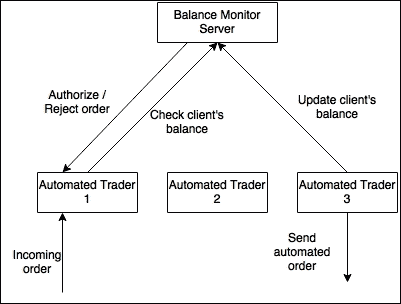
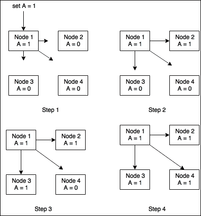
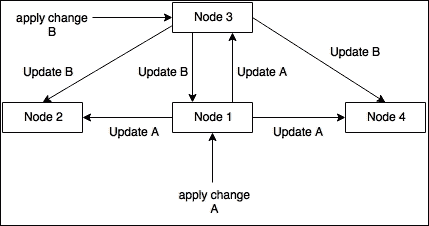
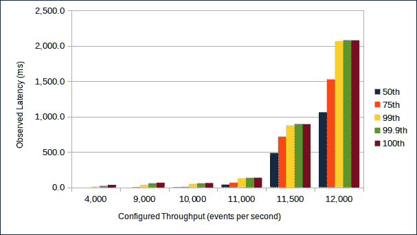

# 第七章. 为性能而架构

在探索 Scala 和各种编写高性能代码的技术方面，我们已经取得了长足的进步。在本章的最后，我们探讨了一些更开放的话题。最后的话题在很大程度上适用于 Scala 和 JVM 之外。我们深入研究了各种工具和实践，以提高应用程序的架构和设计。在本章中，我们探讨了以下主题：

+   无冲突复制数据类型（CRDTs）

+   队列的吞吐量和延迟影响

+   Free monad

# 分布式自动化交易员

多亏了我们的辛勤工作，MVT 正在蓬勃发展。销售部门正在签订合同，仿佛明天就是世界末日，销售铃声从日出响到日落。订单簿能够处理更多的订单，由于流量的增加，MVT 提供的另一产品出现了性能问题：自动化交易系统。自动化交易员从订单簿接收订单，并实时应用各种交易策略，代表客户自动下单。由于订单簿正在处理数量级的交易订单，自动化交易系统无法跟上，因此无法有效地应用其策略。最近，一些大客户由于算法决策失误和执行延迟高而损失了大量资金。工程团队需要解决这个性能问题。你的技术负责人 Alice 要求你找到解决方案，防止公司失去新获得的客户。

在上一章中，我们研究了并发，并利用了并发。我们学习了如何设计代码以利用多核硬件的强大功能。自动化交易器已经优化以运行并发代码并利用机器上的所有 CPU 资源。事实是，即使是几个核心，一台机器也只能处理这么多。为了扩展系统并跟上订单簿带来的流量，我们不得不开始实施分布式系统。

## 分布式架构的概览

分布式计算是一个丰富的主题，我们无法假装在一章中完全解决它。本节提供了一个简短且不完整的分布式计算描述。我们将尝试为您概述这个范式，并指出分布式系统的一些主要优势和挑战。

分布式计算背后的理念是设计一个涉及多个组件的系统，这些组件运行在不同的机器上，并通过彼此（例如，通过网络）进行通信以完成一个任务或提供一项服务。分布式系统可以涉及不同性质的组件，每个组件提供特定的服务并参与任务的实现。例如，可以将 Web 服务器部署来接收 HTTP 请求。为了处理请求，Web 服务器可能通过网络查询认证服务以验证凭证，并查询数据库服务器以存储和检索数据并完成请求。Web 服务器、认证服务和数据库共同构成了一个分布式系统。

分布式系统也可能涉及相同组件的多个实例。这些实例形成一个节点集群，并且可以用来在他们之间分配工作。这种拓扑结构允许系统通过向集群添加更多实例来扩展并支持更高的负载。例如，如果一个 Web 服务器能够每秒处理 20,000 个请求，那么可能可以通过运行三个相同的 Web 服务器集群来处理每秒 60,000 个请求（假设您的架构允许您的应用程序线性扩展）。分布式集群还有助于实现高可用性。如果一个节点崩溃，其他节点仍然可以运行并能够满足请求，同时崩溃的实例正在重新启动或恢复。因为没有单点故障，所以没有服务中断。

尽管分布式系统带来了诸多好处，但也伴随着其自身的缺点和挑战。组件之间的通信可能会出现故障和网络中断。应用程序需要实现重试机制和错误处理，并处理丢失的消息。另一个挑战是管理共享状态。例如，如果所有节点都使用单个数据库服务器来保存和检索信息，数据库必须实现某种形式的锁定机制来确保并发修改不会冲突。一旦集群节点数量足够大，数据库可能无法高效地为他们提供服务，并可能成为瓶颈。

现在您已经简要了解了分布式系统，我们将回到 MVT。团队决定将自动化交易转变为分布式应用程序，以便能够扩展平台。您被分配了设计系统的任务。是时候去白板前了。

## 首次尝试分布式自动化交易

您的第一个策略很简单。您计划部署几个自动化交易员的实例以形成一个节点集群。这些节点可以共享工作并处理进入订单的每个部分。集群前面的负载均衡器可以在节点之间均匀分配负载。这种新的架构有助于扩展自动化交易。然而，您面临着分布式系统的一个常见问题：节点必须共享一个公共状态才能运行。为了理解这个要求，我们探索自动化交易的一个功能。为了能够使用 MVT 的自动化交易系统，客户必须向 MVT 开设账户并为其提供足够的资金以覆盖他们的交易。这是 MVT 作为安全网执行其客户订单的一种方式，以免客户无法履行其交易的风险。为了确保自动化策略不会过度消费，自动化交易员跟踪每个客户的当前余额并在代表他们下单之前检查客户的余额。

您的计划包括部署几个自动化交易系统的实例。每个实例接收订单簿处理的部分订单，运行策略并代表客户下单。现在系统由几个并行运行的相同实例组成，每个实例都可以代表同一客户下单。为了能够执行余额验证，它们都需要知道所有客户的当前余额。客户余额成为一个需要在集群中同步的共享状态。为了解决这个问题，您设想部署一个作为独立组件的余额监控服务器，并持有每个客户余额的状态。当一个交易订单被自动化交易集群的节点接收时，该节点会查询余额监控服务器以验证客户的账户是否有足够的资金进行自动化交易。同样，当交易执行时，一个节点会指示余额监控服务器更新客户的余额。



上述图描述了您架构组件之间的各种交互。**自动化交易员 1**接收一个进入的交易并查询余额监控服务器以检查客户端是否有足够的资金进行交易。余额监控服务器要么授权要么拒绝订单。同时，**自动化交易员 3**发送一个之前由余额监控服务器批准的订单并更新客户端的余额。

### 注意

你可能已经发现了这个设计的缺陷。可能会遇到一个竞态条件，其中两个不同的自动化交易实例可能会验证同一客户的余额，从**余额监控服务器**接收授权，并行执行两笔交易并超过客户的账户限额。这类似于你在单台机器上运行的并发系统可能遇到的竞态条件。在实践中，这种风险很低，类似于 MVT 的公司可以接受这种风险。用于切断客户的限额通常设置得低于实际余额，以考虑到这种风险。设计一个处理这种情况的平台会增加系统的延迟，因为我们不得不在节点之间引入更多的剧烈同步。这是一个很好的例子，说明了商业和技术领域如何合作以优化解决方案。

在这个设计会议结束时，你走一小段路来清醒一下头脑，同时喝一瓶碳酸水。当你回到白板前，残酷的现实让你感到震惊。就像一个扁平的碳酸水瓶一样，你的想法已经消散了。你意识到，所有这些连接矩形的箭头实际上是在网络上传输的消息。目前，虽然单个自动化交易者依赖于其内部状态来执行策略和下订单，但这个新设计要求自动化交易者通过网络查询外部系统并等待答案。这个查询发生在关键路径上。这是分布式系统中的另一个常见问题：具有特定角色的组件需要相互通信以完成任务。这种通信是有成本的。它涉及到序列化、I/O 操作和网络传输。你与爱丽丝分享你的反思，她确认这是一个问题。自动化交易者必须尽可能保持内部延迟低，以便其决策具有相关性。经过简短讨论后，你们同意在关键路径上对自动化交易者执行远程调用将危害性能。你现在面临着一个任务，即实现一个由共享公共状态的组件组成但不通过关键路径相互通信的分布式系统。这就是我们可以开始讨论 CRDTs 的地方。

## 引入 CRDTs

**CRDT** 代表 **无冲突复杂数据类型**。CRDTs 由 Marc Shapiro 和 Nuno Preguiça 在他们的论文 *设计一个交换复杂数据类型* 中正式定义（参见 [`hal.inria.fr/inria-00177693/document`](https://hal.inria.fr/inria-00177693/document)）。CRDT 是一种专门设计的数据结构，旨在确保多个组件之间最终一致性，而无需同步。最终一致性是分布式系统中的一个知名概念，并不局限于 CRDTs。此模型保证最终，如果某个数据不再被修改，集群中的所有节点都将具有该数据的相同值。节点通过发送更新通知来保持其状态同步。与强一致性不同的是，在某个特定时间，一些节点可能看到稍微过时的状态，直到它们收到更新通知：



前面的图示展示了最终一致性的一个例子。集群中的所有节点都持有相同的数据块（A = 0）。节点 1 收到更新以将 A 的值设置为 1。在更新其内部状态后，它向集群的其他部分广播更新。消息在不同的时刻到达目标，这意味着直到我们达到第 4 步，A 的值根据节点而异。如果客户端在第 3 步查询节点 4 的 A 的值，他们将收到较旧的价值，因为更改尚未反映在节点 4 上。

最终一致性可能引发的问题之一是冲突的解决。想象一个简单的例子，集群中的节点共享一个整数数组的状态。以下表格描述了涉及更新该数组状态的连续事件序列：

| **即时** | **事件** | **状态变化** |
| --- | --- | --- |
| **T0** | 集群的初始化 | 节点 1 和 2 持有整数数组的相同值：`[1,2,3]` |
| **T1** | 节点 1 收到更新索引 1 的值的请求，从 2 更改为 4 | 节点 1 将其内部状态更新为 `[1,4,3]` 并向节点 2 发送更新消息 |
| **T2** | 节点 2 收到更新索引 1 的值的请求，从 2 更改为 5 | 节点 2 将其内部状态更新为 `[1,5,3]` 并向节点 1 发送更新消息 |
| **T3** | 节点 1 收到来自节点 2 的更新 | 节点 1 需要决定是否应该忽略或考虑更新消息 |

我们现在需要解决冲突。节点 1 在收到来自节点 2 的更新时是否应该更新其状态？如果节点 2 也这样做，我们将有两个节点持有不同的状态。其他节点呢？一些节点可能先收到来自节点 2 的广播，然后是来自节点 1 的，反之亦然。

存在多种策略来处理这个问题。一些协议使用时间戳或向量时钟来确定哪个更新是在时间上更晚执行的，应该具有优先权。其他协议简单地假设最后写入者获胜。这不是一个简单的问题，CRDTs 旨在完全避免冲突。实际上，CRDTs 被定义为使冲突在数学上成为不可能。要被定义为 CRDT，数据结构必须仅支持交换性更新。也就是说，无论更新操作应用的顺序如何，最终状态必须始终相同。这是无合并冲突的最终一致性的秘密。当系统使用 CRDTs 时，所有节点都可以相互发送更新消息，而不需要严格的同步。消息可以以任何顺序接收，所有局部状态最终都会收敛到相同的值。



在前面的图中，我们看到节点 3 和节点 1 接收到了两个不同的更改。它们将这个更新信息发送给所有其他节点。请注意，我们并不关心其他节点接收更新的顺序。由于更新是交换的，它们的顺序对每个节点最终计算出的最终状态没有影响。一旦所有节点都接收到了所有的更新广播，它们将保证持有相同的数据。

存在两种类型的 CRDT：

+   基于操作的

+   基于状态的

它们在这一点上是等效的，因为对于每个基于操作的 CRDT，总是可以定义一个基于状态的 CRDT，反之亦然。然而，它们的实现不同，在错误恢复和性能方面提供了不同的保证。我们定义每种类型并考虑其特性。作为一个例子，我们实现了最简单的 CRDT 版本：仅增加计数器。

### 基于状态的仅增加计数器

使用这个模型，当 CRDT 从客户端接收到要执行的操作时，它会相应地更新其状态，并向集群中的所有其他 CRDT 发送更新消息。这个更新消息包含 CRDT 的完整状态。当其他 CRDT 接收到这个消息时，它们将它们的状态与接收到的新的状态合并。这个合并操作必须保证最终状态始终相同。它必须是交换的、结合的和幂等的。让我们看看这个数据类型的一个可能的实现：

```java
case class CounterUpdate(i: Int) 
case class GCounterState(uid: Int, counter: Int) 

class StateBasedGCounter( 
 uid: Int, count: Int, otherCounters: Map[Int, Int]) { 

 def value: Int = count + otherCounters.values.sum 

 def update( 
   change: CounterUpdate): (StateBasedGCounter, GCounterState) = 
   (new StateBasedGCounter(uid, count + change.i, otherCounters), 
     GCounterState(uid, count)) 

 def merge(other: GCounterState): StateBasedGCounter = { 
   val newValue = other.counter max otherCounters.getOrElse(other.uid,0) 
   new StateBasedGCounter(uid, count, otherCounters.+(other.uid -> newValue) ) 
 } 
} 

```

客户端可以使用 `update` 方法来增加计数器的值。这会返回一个新的基于状态的计数器，包含更新的计数，并生成一个可以发送到集群中所有其他 CRDT 的 `CounterState` 对象。`merge` 用于处理这些 `CounterState` 消息，并将其他计数器的新状态与本地状态合并。计数器在集群中有一个唯一的 ID。内部状态由本地状态（即 `count`）和集群中所有其他计数器的状态组成。我们保持这些计数器在一个映射中，并在从不同的计数器接收状态信息时在 `merge` 方法中更新这个映射。合并是一个简单的操作。我们比较传入的值与我们映射中的值，并保留最大的一个。这是为了确保如果我们收到两个更新消息的顺序错误，我们不会用延迟的较旧更新消息覆盖最新的状态（即最大的数字）。

### 基于操作的仅增加计数器

基于操作的 CRDT 与基于状态的 CRDT 类似，不同之处在于更新消息只包含刚刚执行的操作的描述。这些 CRDT 不在更新消息中发送它们的完整状态，但它们仅仅是它们刚刚执行以更新自己状态的操作的副本。这确保了集群中的所有其他 CRDT 都执行相同的操作并保持它们的状态同步。更新消息可以按不同的顺序被集群的每个节点接收。为了保证所有节点的最终状态相同，更新必须是交换的。您可以在以下示例中看到这种数据结构：

```java
class OperationBasedCounter(count: Int) { 

 def value: Int = count 

 def update(change: CounterUpdate): (OperationBasedCounter, CounterUpdate) 
 = 
   new OperationBasedCounter(count + change.i) -> change 

 def merge(operation: CounterUpdate): OperationBasedCounter = 
   update(operation)._1 
} 

```

此实现比基于状态的示例更短。`update` 方法仍然返回计数器的更新实例以及应用过的 `CounterUpdate` 对象。对于基于操作的计数器，只需广播应用过的操作即可。这个更新通过其他实例的 `merge` 方法接收，以将相同的操作应用于它们自己的内部状态。请注意，`update` 和 `merge` 是等效的，`merge` 实际上是基于 `update` 实现的。在这个模型中，每个计数器不需要唯一的 ID。

基于操作的 CRDTs 使用可能更小的消息，因为它们只发送每个离散操作，而不是它们的完整内部状态。在我们的例子中，基于状态的更新包含两个整数，而基于操作的更新只有一个。较小的消息可以帮助减少带宽使用并提高系统的吞吐量。然而，它们对通信故障敏感。如果在传输过程中更新消息丢失并且没有到达节点，这个节点将无法与集群的其他部分保持同步，并且无法恢复。如果您决定使用基于操作的 CRDTs，您必须能够信任您的通信协议，并确信所有更新消息都到达了目的地并且得到了适当的处理。基于状态的 CRDTs 不受此问题的影响，因为它们总是在更新消息中发送整个状态。如果消息丢失并且没有到达节点，该节点将仅在收到下一个更新消息之前与集群不同步。通过实现节点的状态周期性广播，即使没有执行更新，也可以使此模型更加健壮。这将迫使所有节点定期发送其当前状态，并确保集群始终最终一致。

## CRDTs 和自动化交易员

根据我们系统的需求，CRDTs 似乎非常适合我们的实现。每个节点可以将每个客户的当前余额状态保存在内存中作为一个计数器，在下单时更新它，并将更新消息广播到系统的其余部分。这种广播可以在关键路径之外进行，我们不必担心处理冲突，因为这是 CRDTs 的设计目的。最终，所有节点都将内存中每个余额具有相同的值，并且它们将能够本地检查交易授权。余额监控服务器可以完全移除。

要将余额状态实现为 CRDT，我们需要一个比我们之前探索的更复杂的计数器。余额不能表示为只增加的计数器，因为偶尔订单会被取消，系统必须向客户的账户进行信用。计数器必须能够处理增加和减少操作。幸运的是，这样的计数器存在。让我们看看基于状态的计数器的一个简单实现：

```java
case class PNCounterState(incState: GCounterState, decState: GCounterState) 

class StateBasedPNCounter private( 
 incCounter: StateBasedGCounter, 
 decCounter: StateBasedGCounter) { 

 def value = incCounter.value - decCounter.value 

 def update(change: CounterUpdate): (StateBasedPNCounter, PNCounterState) = { 
   val (newIncCounter, newDecCounter, stateUpdate) = 
     change match { 
       case CounterUpdate(c) if c >= 0 => 
         val (iC, iState) = incCounter.update(change) 
         val dState = GCounterState(decCounter.uid, decCounter.value) 
         (iC, decCounter, PNCounterState(iState, dState)) 
       case CounterUpdate(c) if c < 0 => 
         val (dC, dState) = decCounter.update(change) 
         val iState = GCounterState(incCounter.uid, incCounter.value) 
         (incCounter, dC, PNCounterState(iState, dState)) 
     } 

   (new StateBasedPNCounter(newIncCounter, newDecCounter), stateUpdate) 
 } 

 def merge(other: PNCounterState): StateBasedPNCounter = 
   new StateBasedPNCounter( 
     incCounter.merge(other.incState), 
     decCounter.merge(other.decState) 
   ) 
} 

```

PN 计数器利用我们之前实现的只增加的计数器来提供减少功能。为了能够将计数器表示为基于状态的 CRDT，我们需要跟踪增加和减少操作的状态。这是必要的，以确保如果我们的更新消息以错误的顺序被其他节点接收，我们不会丢失信息。

### 小贴士

记住，只增加的计数器通过假设计数器的最高值必然是最新的来保证冲突解决。这个不变量对于 PN 计数器不成立。

这个实现展示了 CRDTs 的另一个有趣特性：简单和基本的结构可以组合起来创建更复杂和功能丰富的 CRDTs。我们是否应该继续演示基于操作的计数器的实现？结果证明，并且我们确信你之前已经注意到了，我们之前的只增计数器已经支持减操作。应用正或负的 delta 由基于操作的计数器处理。

## 当余额不足时

你已经完成了概念验证的实现，并打电话给 Alice 获取一些反馈。她花了几分钟研究你的新设计和你的代码。“看起来不错。别忘了同步账户黑名单。”她在说什么？“检查账户余额只是允许或阻止自动化交易的一个标准之一。客户的其他属性也需要考虑。今天，自动化交易员在后台运行信任算法，并为每位客户计算一个分数。如果分数低于某个阈值，账户将被列入黑名单直到交易日结束，并且所有自动化订单都将被拒绝。我喜欢你的设计，但你需要将这个黑名单纳入到新系统中。”面对这个新的挑战，你认为最好的解决方案是将黑名单也实现为 CRDT，前提是它适合你的当前设计。

### 一个新的 CRDT - 只增集合

一个 CRDT 被设计来处理我们的新用例。只增集合数据类型实现了一个只支持添加新元素而不重复的集合。我们可以将黑名单实现为只增集合。每个节点都可以运行自己的信任算法，并决定是否应该将客户端列入黑名单并拒绝当天剩余的自动化交易。在一天结束时，系统可以清除集合。以下是我们展示的一个基于状态的只增集合的可能实现：

```java
case class AddElementA 
case class GSetStateA 

class StateBasedGSetA { 

 def contains(a: A): Boolean = value.contains(a) 

 def update(a: AddElement[A]): (StateBasedGSet[A], GSetState[A]) = { 
   val newSet = new StateBasedGSet(value + a.a) 
   (newSet, GSetState(newSet.value)) 
 } 

 def merge(other: GSetState[A]): StateBasedGSet[A] = { 
   new StateBasedGSet(value ++ other.set) 
 } 

} 

```

我们的实现支持通过调用`update`方法添加元素。它返回一个带有更新集合的新`StateBasedGSet`实例，以及一个要广播到其他节点的`GSetState`实例。此更新包含计数器的整个状态，即内部集合。基于操作的实现是微不足道的，留给读者作为练习（代码库中提供了一个可能的解决方案）。类似于之前探索的增量-减量计数器，可以创建一个同时支持添加和删除元素的集合。但是有一个注意事项：由于添加和删除元素不是交换操作，必须优先考虑其中一个。在实践中，可以创建一个 2P 集合来支持添加和删除项目，但一旦删除，元素就不能再次添加。删除操作具有优先权，并保证操作是交换的，可以无冲突地处理。一个可能的实现是将两个仅增长的集合组合起来，一个用于添加元素，另一个用于删除它们。我们再次看到了简单 CRDT 的强大之处，这些 CRDT 可以组合起来创建更强大的数据类型。

# 免费交易策略性能改进

你盯着你的敏捷燃尽图，发现你将在明天冲刺结束时完成所有的故事点。你对本周提前交付功能感到兴奋，但你仍然想知道你是否还会与敏捷大师就估算进行另一场讨论。与其在估算上浪费精力，你不如将注意力转回到 Dave 提出的问题上。在最近的一次午餐中，Dave 谈到了公司的交易策略在基于过时信息做出交易决策时亏损。即使是几毫秒的差距也可能在极其有利可图的交易和亏损之间产生差异。他的话激起了你的兴趣，想知道你是否能提高 MVT 交易策略的性能。

MVT 的交易策略是订单簿的下游消费者。交易策略会监听最佳买入价和卖出价（BBO）的变化，以便确定何时提交买入或卖出订单。在午餐时，Dave 解释说，历史上跟踪 BBO 已被证明为给 MVT 的交易策略提供最多的信号。最佳买入价指的是最高价格的买入价，最佳卖出价指的是最低价格的卖出价。当 BBO 的任一侧因取消、执行或新的限价订单而发生变化时，则将 BBO 更新事件传输到下游交易策略。表示此事件的模型是`BboUpdated`，其外观如下：

```java
case class Bid(value: BigDecimal) extends AnyVal 
case class Offer(value: BigDecimal) extends AnyVal 
case class Ticker(value: String) extends AnyVal 
case class BboUpdated(ticker: Ticker, bid: Bid, offer: Offer) 

```

MVT 在其自己的 JVM 中部署每个交易策略，以确保失败不会影响其他正在运行的策略。部署后，每个交易策略为其交易的股票集合维护 BBO 订阅。

在花费了大量时间处理订单簿之后，你希望找到机会将你的函数式编程知识应用于提高性能。在与 Dave 共进午餐时，你发现“更好的性能”在交易策略开发中的含义与其他系统略有不同。你问 Dave，“如果你必须在延迟提升和吞吐量提升之间选择，你会选择哪一个？”Dave 带着讽刺的口气回答，“为什么我必须选择？我想要两者都要！”之后，他继续说，“延迟！每次交易策略使用旧的 BBO 更新做出决策时，我们都会损失金钱。事实上，如果我们能的话，我宁愿丢弃旧的 BBO 更新。我们只交易高量级的股票，所以我们几乎可以保证立即看到另一个 BBO 更新。”当你开始研究代码库时，你开始思考是否可以利用 Dave 的想法来提高交易策略的性能。

## 基准测试交易策略

回顾你在处理订单簿时学到的经验，你的第一步是进行基准测试。你选择 MVT 的一个生产交易策略，并将你为练习订单簿而编写的基准`FinalLatencyBenchmark`进行适配，以便将`BboUpdated`事件发送到交易策略。最初，基准测试主要关注显示 99^(th)百分位延迟以及更高。正如你所知，延迟是你性能调查中最重要的因素，因此你修改了基准测试，使其也发出中位数和 75^(th)百分位延迟。这将为你提供对交易策略性能延迟的更全面视角。

查看生产指标系统，你看到的是你想要基准测试的系统的时间序列交易量图表。它显示这是一个低量级的日子，每秒大约有 4,000 个 BBO 更新事件。你挖掘历史指标以找到过去几周中最高量级的一天。市场再次波动，所以最近的高量级一天可能是衡量高吞吐率的良好代理。大约两周前，有一个交易日，每秒 BBO 更新事件量持续达到 12,000。你计划从每秒 4,000 个事件的低端开始基准测试，逐步增加到每秒 12,000 个事件，以观察性能如何变化。

测试方法是在不同的吞吐量速率下测量等量事件的时间延迟，同时确保在每个吞吐量级别上进行彻底的测试。为了实现这一目标，你将 12,000 个事件每秒的较高吞吐量乘以 30 次试验，总共 360,000 个事件。在 4,000 个事件每秒的情况下，进行 90 次基准测试相当于 360,000 个事件。在模拟生产环境的测试环境中运行基准测试，得到以下表格中显示的结果。表格将每秒事件数缩写为 EPS：

| **百分位** | **4,000 EPS** | **12,000 EPS** |
| --- | --- | --- |
| 第 50 百分位（中位数） | 0.0 ms | 1,063.0 ms |
| 第 75 百分位 | 0.0 ms | 1,527.0 ms |
| 第 99 百分位 | 10.0 ms | 2,063.0 ms |
| 第 99.9 百分位 | 22.0 ms | 2,079.0 ms |
| 第 100 百分位（最大值） | 36.0 ms | 2,079.0 ms |

这些结果展示了性能的惊人对比。在每秒 4,000 个事件时，交易策略看起来表现良好。99%的事件在 10 毫秒内得到响应，并且我们观察到，直到 75 百分位，策略的响应延迟极小。这表明在低交易量日，这种交易策略能够快速做出信息决策，这对盈利性应该是有利的。不幸的是，在每秒 12,000 个事件时，性能是不可接受的。由于尚未查看代码，你怀疑是否可以通过在 4,000 和 12,000 事件每秒之间进行多次吞吐量扫描来发现性能的突然变化。你尝试在 4,000 和 12,000 事件每秒之间进行二分搜索，并得到以下结果：

| **百分位** | **9,000 EPS** | **10,000 EPS** | **11,000 EPS** | **11,500 EPS** |
| --- | --- | --- | --- | --- |
| 第 50 百分位（中位数） | 0.0 ms | 4.0 ms | 41.0 ms | 487.0 ms |
| 第 75 百分位 | 5.0 ms | 9.0 ms | 66.0 ms | 715.0 ms |
| 第 99 百分位 | 32.0 ms | 47.0 ms | 126.0 ms | 871.0 ms |
| 第 99.9 百分位 | 58.0 ms | 58.0 ms | 135.0 ms | 895.0 ms |
| 第 100 百分位（最大值） | 67.0 ms | 62.0 ms | 138.0 ms | 895.0 ms |

你选择每秒 9,000 个事件作为起始点，因为它可以均匀地分成总事件数 360,000 个。在这个吞吐量级别上，策略的轮廓在定性上更接近每秒 4,000 个事件的轮廓。由于在这个级别上结果看起来合理，你将吞吐量增加到 9,000 和 12,000 事件每秒之间的中间值，以达到下一个可以均匀分成 360,000 的事件数的级别。在每秒 10,000 个事件时，我们再次观察到与每秒 4,000 个事件轮廓相似的轮廓。中位数和 75 百分位延迟的明显增加表明策略的性能开始下降。接下来，你将吞吐量增加到中间值，即每秒 11,000 个事件。由于你不能运行 32.72 次试验，你将试验次数向上取整到 33 次，总共 363,000 个事件。这些结果在各个测量的百分位上比每秒 4,000 个事件的结果差大约一个数量级。诚然，这些是弱性能结果，但这个轮廓是否与每秒 12,000 个事件的轮廓相似？

你现在有点惊慌，因为每秒 11,000 个事件大约是每秒 12,000 个事件吞吐量的 90%。然而，结果并没有显示出接近 90%的相似性。如果交易策略线性下降，你预计会看到接近于在每秒 12,000 个事件时观察到的延迟的 90%。对这个性能配置文件不满意，你尝试了另一个吞吐量，每秒 11,500 个事件。在这个吞吐量级别上，你进行了 31 次基准测试，总共 356,500 个事件。通过将吞吐量增加大约 5%，观察到的中位延迟大约是原来的 11 倍，观察到的 99^(th)百分位延迟几乎是原来的 6 倍。这些结果清楚地表明，策略的运行时性能呈指数下降。为了更好地理解结果，你迅速制作了以下条形图：



这个条形图可视化了性能的指数衰减。有趣的是，我们观察到所有测量的延迟百分位数都遵循一致的衰减模式，进一步证实了该策略已耗尽其处理请求的能力的假设。在着手提高交易策略性能之前，你思考着，“我该如何限制延迟的指数增长？”

### 注意

与观察到所有测量延迟百分位数持续衰减的情况不同，想象一下中位数和 75^(th)百分位数在所有配置的吞吐量级别上保持定性上的恒定。这个配置文件是否表明了与我们在处理的场景相同的性能障碍类型？花点时间考虑一下什么可能导致这种分布出现。

## 无界队列的危险

基准测试揭示了一个关于性能调优的普遍真理：无界队列会杀死性能。在这里，我们使用“队列”这个术语广泛地指代一个等待队列，而不是专门关注队列数据结构。例如，这个基准测试在`List`中排队事件，以便在特定的时间点进行传输。在生产环境中，这个队列存在于多个层级。`BboUpdated`事件的发送者可能在应用层排队事件，随后，网络协议（例如，TCP）可能会使用它自己的队列集来管理向消费者传输。当事件的处理速度慢于产生速度时，系统会变得不稳定，因为工作积压总是不断增加。假设有无限的内存和零响应时间保证，应用程序可以继续处理不断增长的队列项。然而，在实践中，当系统无法通过增加其消费速率以匹配或超过生产速率来自我稳定时，系统最终会失控。系统的硬件资源是有限的，随着消费者落后，它将需要越来越多的内存来应对不断增长的工作积压。如果内存需求增加到了极端，会导致垃圾回收更加频繁，这反过来又会进一步减慢消费速度。这是一个循环问题，最终会耗尽内存资源，导致系统崩溃。

通过检查交易系统代码，你会发现交易系统中存在一个用于消息处理的队列。这个应用层队列是一个`LinkedBlockingQueue`，它将网络 I/O 线程与应用线程分开。在基准测试中，驱动基准测试的线程直接将事件添加到队列中，模拟了生产网络线程从外部世界接收事件的行为。将应用程序的逻辑部分组合在一起，分别放入单独的线程池中，以通过并行化处理工作来提高效率，这是一种常见的做法。

### 注意

当我们之前使用`Future`和`Task`探索并发时，我们间接地与队列一起工作。接收`Future`和`Task`提交的`ExecutorService`通过将任务入队到`BlockingQueue`来管理其工作负载。`Executors`中提供的工厂方法不允许调用者提供队列。如果你探索这些工厂方法的实现，你会发现创建的`BlockingQueue`的类型和大小。

在网络层和应用层之间添加缓冲通常对性能有益。队列可以使应用程序能够容忍来自生产者的暂时性消费减速和消息突发。然而，正如我们在基准测试中所看到的，缓冲是一把双刃剑。`LinkedBlockingQueue`的默认构造函数实际上是未限定的，设置了一个等于最大支持整数值的限制。当生产率持续高于消费率时，无限期地缓冲消息，交易系统的性能会下降到不可用的状态。

## 应用反向压力

如果我们选择将接收事件的队列限制在一个更小的限制，会发生什么？当生产率超过消费率并且队列达到容量时，一个选项是系统阻塞，直到队列中有空位。阻塞迫使事件生产停止，这描述了应用反向压力的策略。在这个上下文中，压力指的是待处理的事件队列。压力通过不断增加的资源使用（例如，内存）表现出来。通过采用阻塞进一步生产的策略，系统将压力反馈给生产者。任何存在于应用级消费者和生产者之间的队列最终也会达到容量，迫使生产者改变其生产率以继续传输事件。

为了实现这种反向压力策略，所有队列都必须限制在一个大小，以避免过度使用资源，并且在队列满时必须阻塞生产。使用 JDK 提供的`BlockingQueue`接口的实现，这很容易实现。例如，以下片段使用`LinkedBlockingQueue`展示了这种策略：

```java
val queue = new LinkedBlockingQueueMessage 
queue.put(m) 

```

在这个片段中，我们看到构建了一个容量限制为 1,000 条消息的`LinkedBlockingQueue`。根据对生产环境的了解，你感到舒适地保留最多 1,000 条消息在内存中，而不会耗尽内存资源。片段中的第二行演示了通过`put`方法进行阻塞操作来入队一个元素。

在应用反向压力时，队列大小的选择至关重要。为了说明原因，让我们假设我们测量了最大交易系统处理延迟为 0.5 毫秒，一旦从事件队列中消费了一条消息。在最坏的情况下，一个事件的总处理延迟等于 0.5 毫秒加上等待处理的等待时间。考虑以下场景：当新事件到达时，队列大小为 1,000，并且有 999 个事件已经排队。在最坏的情况下，新事件需要等待 499.5 毫秒，直到 999 个已经排队的其他事件被处理，再加上 0.5 毫秒来处理。配置队列大小为 1,000 产生了最大延迟 500 毫秒，这表明最大延迟与队列大小成正比。

一种更严谨的队列大小确定方法涉及考虑环境资源以及业务所能容忍的最大延迟。从与 Dave 的非正式讨论中，我们了解到，即使是几毫秒也可能决定交易策略的盈利能力。在我们有机会与他联系之前，让我们假设 10 毫秒是策略可以容忍的最大延迟，而不会造成重大的交易损失。使用这些信息，我们可以计算出确保 10 毫秒延迟限制得到遵守的队列大小。在先前的例子中，我们进行了以下最坏情况下的算术运算：

```java
maximum total processing latency = queue size * maximum processing time 

```

我们可以重新排列这个公式来求解队列大小，如下所示：

```java
queue size = maximum total processing latency / maximum processing time 

```

从这个算术中，我们代入已知值来计算队列大小，如下所示：

```java
queue size = 10ms / 0.5ms = 20 

```

算术表明，我们将队列大小限制为 20 个元素，以确保在最坏的情况下，一个事件可以在 10 毫秒内入队并处理。为了更深入地了解反压，我们鼓励您阅读马丁·汤普森在[`mechanical-sympathy.blogspot.com/2012/05/apply-back-pressure-when-overloaded.html`](http://mechanical-sympathy.blogspot.com/2012/05/apply-back-pressure-when-overloaded.html)上发表的以下博客文章。马丁是高性能软件开发方面的权威人士，这篇特定的博客文章是关于反压的宝贵学习资源。

## 应用负载控制策略

反压是一种策略，当消息生产者尊重以不同速率运行的消费者且不对慢速消费者进行惩罚时，这种策略效果很好。尤其是在处理第三方系统时，有时对生产者施加反压以迫使其减速可能不会得到良好的接受。在这些情况下，我们需要考虑额外的策略，以提高我们系统的容量，而无需对业务逻辑的算法进行改进。

### 注意

作者们在**实时竞价**（**RTB**）领域工作过，在这个领域，竞价系统参与拍卖，以竞标展示广告的机会。在这个行业中，对于无法应对配置的拍卖速率的竞价系统，容忍度很低。未能及时对高比例的拍卖做出竞价决定（无论是出价还是不出价），会导致竞价系统被罚入“小黑屋”。在“小黑屋”中，竞价系统会收到降低的拍卖速率。长时间留在“小黑屋”的竞价系统可能会被禁止参与任何拍卖，直到其性能改善。

让我们回顾一下我们在描述背压时考虑的场景，以激发我们的讨论。应用背压的前提是达到队列的容量。当队列满时，我们的第一种策略是阻止进一步的添加，直到有空间可用。我们可以调查的另一种选择是丢弃事件，因为系统已饱和。丢弃事件需要额外的领域知识来理解突然终止处理的意义。在交易系统领域，交易策略仅在收到出价或要约时才需要发送响应。当交易策略决定不进行出价或要约时，它不需要发送响应。对于交易系统领域，丢弃事件简单地意味着停止处理。在其他领域，例如实时竞价（RTB），丢弃事件意味着停止处理，并响应一条消息，表明不会在这个拍卖中放置出价。

此外，值得注意的是，每个事件都是最佳出价和要约的快照。与快照相反，想象一下，如果交易策略收到最佳出价和要约变化的离散事件，而不是`BboUpdated`。这与我们所探讨的基于状态与基于操作的 CRDT 操作类似。丢弃事件意味着在接收到后续事件之前只能获得部分信息。在这种情况下，与领域专家和产品所有者合作，确定在何种情况下以及多长时间内使用部分信息是可接受的，这是非常重要的。

在处理高性能系统时引入负载控制策略是思维方式的另一种转变。就像引入背压一样，这也是重新考虑在提高性能过程中所做假设的另一个机会。我们与 Dave 的午餐讨论为我们提供了一个可以应用的负载控制策略的深刻见解。Dave 表示，他认为潜在的`BboUpdated`事件对交易策略的盈利性弊大于利。我们可以挑战以下两个假设：

+   所有事件都必须被处理

+   正在处理的事件必须完成处理

我们可以挑战这些假设，因为 Dave 还指出 MVT 交易只涉及高成交量股票。如果丢弃 BBO 更新，Dave 有信心新的 BBO 更新一定会很快跟上来。让我们更深入地看看这些策略如何定义。

### 拒绝工作

拒绝工作并不是指拒绝冲刺任务，抱歉！在这个上下文中，当我们讨论工作时，这个术语指的是处理努力。在基准测试的交易系统中，当前的工作正在处理一个新的 `BboUpdated` 事件。尽管我们还没有深入研究代码，但我们知道从之前的基准测试工作中，有一个队列用于从网络接受 `BboUpdated` 事件以进行应用级处理。这个队列是进入应用程序的入口点，它代表了由于容量限制而拒绝事件的第一个应用级机会。

从我们之前的领域研究中，我们了解到拒绝请求，只需简单地将其丢弃在地板上，无需响应。交易策略只有在希望交易时才需要响应。这意味着拒绝工作的策略可以通过在队列达到容量时将请求丢弃在地板上来实现。

通过检查交易系统源代码，我们看到架构相当简单。在启动时，创建了一个 `LinkedBlockingQueue` 来缓冲 `BboUpdated` 事件，并启动了一个消费者线程从队列中消费。以下代码片段显示了此逻辑：

```java
val queue = new LinkedBlockingQueue(MessageSentTimestamp, BboUpdated) 
    val eventThread = new Thread(new Runnable { 
      def run(): Unit = while (true) { 
        Option(queue.poll(5, TimeUnit.SECONDS)) match { 
          case Some((ts, e)) => // process event 
          case None => // no event found 
        } 
      } 
    }) 
    eventThread.setDaemon(true) 
    eventThread.start() 

```

根据我们之前的工作，我们看到工作队列的大小设置为二十个元素，以确保最大处理延迟为 10 毫秒。队列实例化后，创建并启动了消费者线程。此代码片段省略了处理逻辑，但我们观察到这个线程的唯一目的是消费可用的事件。将工作添加到队列的逻辑很简单。此代码片段假设 `MessageSentTimestamp` 和 `BboUpdated` 事件分别在 `ts` 和 `e` 的名称中具有词法作用域：

```java
queue.put((ts, e)) 

```

我们对背压应用的探索表明，`put` 是一个阻塞调用。鉴于我们现在的意图是丢弃工作，`put` 已不再是可行的策略。相反，我们可以利用 `offer`。根据 API 文档，`offer` 返回一个 `boolean` 值，指示元素是否被添加到队列中。当队列满时，它返回 false。这正是我们希望强制执行的语义。我们可以相应地修改此代码片段：

```java
queue.offer((ts, e)) match { 
  case true => // event enqueued 
  case false => // event discarded 
} 

```

### 注意

前一个代码片段中的模式匹配为引入应用指标以进行内省和透明度提供了良好的切入点。例如，跟踪交易系统随时间丢弃的事件数量可能是一个有趣的业务指标。这些信息也可能对数据科学团队进行离线分析有用，以确定丢弃事件和盈利性之间的有趣模式。每当遇到状态变化时，都值得考虑是否应该记录指标或是否应该发出事件。花点时间考虑一下你应用程序中的状态变化。你是否让状态变化对非技术团队成员可内省？

以每秒 12,000 事件和 30 次试验进行基准测试，总共处理了 360,000 个事件，得到以下结果：

| **指标** | **队列大小 = 20 的每秒 12,000 EPS** |
| --- | --- |
| 50^(th)（中位数）延迟 | 0.0 毫秒 |
| 75^(th) 延迟 | 0.0 毫秒 |
| 99^(th) 延迟 | 3.0 毫秒 |
| 99.9^(th) 延迟 | 11.0 毫秒 |
| 100^(th)（最大）延迟 | 45.0 毫秒 |
| 平均延迟 | 0.1 毫秒 |
| 处理事件占总事件的比例 | 31.49% |

此表引入了两行来记录观察到的平均延迟和处理的 360,000 个事件中的百分比。这一行很重要，因为系统现在拒绝事件，这是以延迟改进为代价提高交易吞吐量的一个例子。与每秒 12,000 事件的第一次基准测试相比，延迟配置文件看起来非常好。最大延迟是我们的期望最大延迟的四倍。这表明我们的性能模型过于乐观。更高的最大延迟可以归因于不幸的垃圾回收暂停和错误估计实际处理延迟。即便如此，最大延迟比第一次基准测试观察到的最大延迟低两个数量级。我们还观察到，99.9% 的请求的延迟小于或等于 11 毫秒，这在我们声明的最大延迟目标内 10%。

虽然延迟配置文件看起来很好，但吞吐量却不能这么说。由于我们新的负载控制策略，只有大约 30% 的事件被处理。当事件被处理时，处理速度很快，但不幸的是，三分之二的事件被丢弃。从性能调整和负载控制策略中得到的另一个教训是，你可能会需要多次迭代才能正确调整策略，以在吞吐量与延迟之间取得适当的平衡。回顾基准测试的结果，你注意到平均观察到的延迟是 0.1 毫秒。作为下一步，你选择根据平均延迟校准队列大小。通过根据平均延迟进行调整，你暗示你愿意为了提高吞吐量而引入延迟。进行算术运算后，得到新的队列大小：

```java
queue size = maximum total processing latency / maximum processing time = 10ms / 0.1ms = 100 

```

在重新运行带有新队列大小的基准测试后，你观察到了以下结果：

| **指标** | **队列大小 = 100 的每秒 12,000 EPS** |
| --- | --- |
| 50^(th)（中位数）延迟 | 3.0 毫秒 |
| 75^(th) 延迟 | 5.0 毫秒 |
| 99^(th) 延迟 | 19.0 毫秒 |
| 99.9^(th) 延迟 | 43.0 毫秒 |
| 100^(th)（最大）延迟 | 163.0 毫秒 |
| 平均延迟 | 3.9 毫秒 |
| 处理事件占总事件的比例 | 92.69% |

如预期的那样，与队列大小为 20 的试验相比，延迟特征有所下降。除了最大延迟外，每个百分位数都至少经历了延迟的两倍增长。这个实验的好消息是尾部延迟没有经历指数增长。吞吐量图也发生了显著变化。我们观察到吞吐量增加了两倍以上，处理了所有事件的近 93%。平均延迟是之前记录的 0.1 毫秒平均延迟的 39 倍。为了比较目的，平均数反映了中位数和 75^(th)百分位数延迟的显著增加。

作为最后的测试，出于好奇，你尝试将吞吐量率加倍，同时保持队列大小为 100 个元素。交易系统会崩溃吗，它会处理所有请求，还是会做些不同的事情？运行基准测试产生了以下结果：

| **指标** | **24,000 EPS，队列大小 = 100** |
| --- | --- |
| 50^(th) (中位数)延迟 | 7.0 毫秒 |
| 75^(th)延迟 | 8.0 毫秒 |
| 99^(th)延迟 | 23.0 毫秒 |
| 99.9^(th)延迟 | 55.0 毫秒 |
| 100^(th) (最大)延迟 | 72.0 毫秒 |
| 平均延迟 | 8.4 毫秒 |
| 处理事件占总事件的比例 | 44.58% |

好消息是交易系统没有崩溃。它承受了接收是之前导致第二次延迟的两倍吞吐量的压力，其延迟特征与每秒 12,000 个事件的相同试验质量相似。这表明拒绝工作策略使交易系统对高量级的事件输入具有显著更高的鲁棒性。

在更高吞吐量下提高耐用性和可接受的延迟的权衡是降低吞吐量。这些实验揭示了限制队列大小的重要性，这是我们学习如何在应用背压的同时了解拒绝工作价值时学到的。在实施负载控制策略并仅调整队列大小后，我们能够产生显著不同的结果。肯定还有进一步分析和调整的空间。进一步的分析应涉及产品所有者，权衡吞吐量与延迟的权衡。重要的是要记住，尽管负载控制策略的实施依赖于对高度技术主题的了解，但其好处应以商业价值来衡量。

### 中断昂贵的处理

我们可以探索的第二个想法是在处理完成之前停止处理。这是一种强大的技术，可以确保处理周期不会浪费在已经过时的工作上。考虑一个从队列中取出并经过部分处理但在垃圾回收周期中断的请求。如果垃圾回收周期超过几毫秒，该事件现在已过时，可能会损害交易策略的盈利能力。更糟糕的是，队列中的后续事件现在也更可能过时。

为了解决这个不足，我们可以应用一种类似于通过在整个处理过程中施加延迟限制来拒绝工作的技术。通过携带一个表示处理开始时间的戳记，我们可以在不同的时间点评估计算的延迟。让我们考虑一个制造出的例子来说明这个想法。考虑以下处理流程，它在记录事件并更新指标后，为事件运行任意业务逻辑：

```java
def pipeline(ts: MessageSentTimestamp, e: Event): Unit = { 
    val enriched = enrichEvent(e) 
    journalEvent(enriched) 
    performPreTradeBalanceChecks(enriched) 
    runBusinessLogic(enriched) 
  } 
} 

```

为了避免处理潜伏事件，我们可能编写类似于以下逻辑的代码：

```java
def pipeline(ts: MessageSentTimestamp, e: Event): Unit = { 
    if (!hasEventProcessingExpiryExpired(ts)) { 
      val enriched = enrichEvent(e) 
      if (!hasEventProcessingExpiryExpired(ts)) journalEvent(enriched) 
      if (!hasEventProcessingExpiryExpired(ts)) performPreTradeBalanceChecks(enriched) 
      if (!hasEventProcessingExpiryExpired(ts)) runBusinessLogic(enriched) 
    } 
  } 
} 

```

在这个片段中，引入了一个`hasEventProcessingExpiryExpired`方法来分支处理，这是基于时间的。这个方法的实现被省略了，但你可以想象系统时间被查询并与已知和允许的处理持续时间（例如，5 ms）进行比较。虽然这种方法实现了我们中断潜伏事件处理的目标，但代码现在被多个关注点所杂乱。即使在这样一个简单的例子中，也变得更加难以追踪处理步骤的顺序。

这段代码的痛点在于业务逻辑与中断潜伏处理的横切关注点交织在一起。提高代码可读性的一个方法是将所完成工作的描述与如何执行这种描述分开。在函数式编程中有一个结构，称为自由单子，可以帮助我们做到这一点。让我们更深入地了解自由单子，看看我们如何使用它来提高交易策略的性能。

## 自由单子

在范畴论主题中，单子及其数学基础是密集的主题，值得专门探索。随着你的冲刺明天结束，你想要交付改进的交易策略性能，我们提供一个实践者的视角来展示你如何使用它们来解决现实世界的问题。为了展示将自由单子应用于我们问题的力量，我们首先展示最终结果，然后回溯以发展对自由单子如何工作的直觉。首先，让我们考虑交易策略从工作队列中选中`BboUpdated`事件后所需的处理步骤序列：

```java
    val enriched = enrichEvent(bboEvent) 
    journalEvent(enriched) 
    performPreTradeBalanceChecks(enriched) 
    val decision = strategy.makeTradingDecision(enriched) 
    decision.foreach(sendTradingDecision) 

```

在交易策略做出交易决策之前，有三个步骤发生。如果交易决策是提交一个出价或报价，决策将被发送到交易所。"strategy"是`TradingStrategy`特质的实现，其外观如下：

```java
trait TradingStrategy { 
  def makeTradingDecision(e: BboUpdated): Option[Either[Bid, Offer]] 
} 

```

接下来，让我们看看我们如何将这个处理序列转换为自由单子，并添加早期终止逻辑。

### 描述一个程序

为了构建我们新的交易策略管道版本，我们使用 Scalaz 提供的自由单子实现 `scalaz.Free`。我们使用自由单子结合领域特定语言 (DSL) 以简化构建的努力的结果如下所示：

```java
val pipeline = for { 
    enriched <- StartWith(enrichEvent) within (8 millis) orElse (e => 
      enrichmentFailure(e.ticker)) 
    _ <- Step(journalEvent(enriched)) within (9 millis) orElse 
      tradeAuthorizationFailure 
    _ <- Step(performPreTradeBalanceChecks(enriched)) within (10 millis) 
      orElse metricRecordingFailure 
    decision <- MakeTradingDecision(enriched) 
  } yield decision 

```

回想一下，我们第一次尝试实现短路逻辑涉及一系列的 if 语句。而不是 if 语句，基于自由单子的代码片段显示，处理管道现在可以被定义为 for-comprehension。这种方法消除了分支语句，使得理解正在发生的事情变得更加简单。在不看到 DSL 如何构建的情况下，你很可能已经推断出这个管道将做什么。例如，你很可能推断出如果 `journalEvent` 执行时间超过 10 毫秒，则处理将停止，并且不会调用 `performPreTradeBalanceChecks` 或 `MakeTradingDecision`。

管道构建只是故事的一半。在这个 for-comprehension 的实现背后，是自由单子。创建一个自由单子涉及两个部分：

+   构建程序描述

+   编写解释器以执行描述

for-comprehension 代表我们对程序的描述。它是对如何处理 `BboUpdated` 事件的描述，同时也定义了执行延迟约束。为了执行这个描述，我们必须构建一个解释器。

### 构建解释器

我们的解释器如下所示：

```java
  def runWithFoldInterpreter( 
    recordProcessingLatency: ProcessingLatencyMs => Unit, 
    strategy: TradingStrategy, 
    ts: MessageSentTimestamp, 
    e: BboUpdated): Unit = { 
    val (_, decision) = pipeline.free.foldRun( 
      PipelineState(ts, strategy, e)) { 
      case (state, StartProcessing(whenActive, whenExpired, limitMs)) => 
        state -> (hasProcessingTimeExpired(state.ts, limitMs) match { 
          case true => whenExpired(e) 
          case false => whenActive(e) 
        }) 
      case (state, Timed(whenActive, whenExpired, limitMs)) => 
        state -> (hasProcessingTimeExpired(state.ts, limitMs) match { 
          case true => whenExpired() 
          case false => whenActive() 
        }) 
      case (state, TradingDecision(runStrategy)) => 
        state -> runStrategy(state.strategy) 
    } 

    decision.fold(logFailure, { 
      case Some(order) => 
        sendTradingDecision(order) 
        recordProcessingLatency(ProcessingLatencyMs( 
          System.currentTimeMillis() - ts.value)) 
      case None => 
        recordProcessingLatency(ProcessingLatencyMs( 
          System.currentTimeMillis() - ts.value)) 
    }) 
  } 

```

`foldRun` 方法是 `Free` 提供的一个方法，用于执行我们编写的程序描述。类似于 `foldLeft` 的签名，`foldRun` 接受一个表示初始状态的值，一个接受当前状态的 curried 函数，以及来自我们的处理管道的下一个处理步骤。下一个处理步骤由一个名为 `Thunk` 的 ADT 表示，具有以下成员：

```java
sealed trait Thunk[A] 
case class TimedA => A, 
  whenExpired: () => A, 
  limit: LimitMs) extends Thunk[A] 
case class StartProcessingA extends Thunk[A] 
case class TradingDecisionA extends Thunk[A] 

```

`Thunk` 代数定义了可以转录到自由单子中的可能操作。我们之前展示的管道是通过组合 `Thunk` 成员的组合构建的。这个管道隐藏了 DSL 背后的构建，以消除冗余并提高可读性。以下表格将每个处理步骤映射到其关联的 `Thunk`：

| **步骤 DSL** | **Thunk** |
| --- | --- |
| `开始` | `开始处理` |
| `步骤` | `计时` |
| `做出交易决策` | `交易决策` |

回到柯里化的`foldRun`函数，我们看到解释器模式匹配以确定下一个处理步骤是哪个`Thunk`。这些模式匹配语句是解释器应用我们程序描述中描述的行为的方式。`StartProcessing`和`Timed`使用系统时间来确定根据提供的毫秒到期时间（`LimitMs`）执行哪个方法。`StartProcessing`和`TradingDecision`需要来自外部世界的状态来支持执行。对于`StartProcessing`，必须提供工作队列中的`BboUpdated`事件，而对于`TradingDecision`，必须提供一个`Strategy`以产生交易决策。

`foldRun`的返回值是一个累积状态的元组，该元组在片段中被丢弃，以及解释自由单子的返回值。由`pipeline`定义的`Thunk`序列的执行返回值是`\/[BboProcessingFailure, Option[Either[Bid,Offer]]]`。这个返回值是一个析取，以处理可能作为业务逻辑的一部分发生或因为处理到期时间已过期的失败场景。这些失败用类型为`BboProcessingFailure`的 ADT 表示。析取的右侧与`TradingStrategy`的返回类型匹配，表示完成`pipeline`中的所有步骤会产生一个交易决策。最后一步是对交易决策进行折叠，以记录当管道完成时的处理延迟（即返回了`\/-`），并条件性地向交易所发送订单。

在这个阶段，你应该已经形成的直觉是我们已经将我们希望发生的事情的描述与它如何发生的方式分离开来。自由单子允许我们通过首先创建我们程序的描述，然后其次构建一个解释器来执行由描述提供的指令来实现这一点。作为一个具体的例子，我们的`pipeline`程序描述并没有被如何实现早期终止的策略所拖累。相反，它只描述了处理序列中的某些步骤受到时间限制。提供给`foldRun`的解释器使用系统时间来强制执行这个限制。在构建了交易策略管道的运行版本之后，让我们再次进行基准测试，看看我们的变化产生了什么效果。

### 基准测试新的交易策略管道

使用新的交易策略管道以每秒 12,000 和 24,000 个事件运行基准测试，得到以下结果。结果列每行显示两个值。斜杠前的值是使用提供早期终止的新实现运行的结果。斜杠后的值是用于比较目的而复制的没有早期终止的运行结果：

| **指标** | **队列大小为 100 时的 12,000 EPS** | **队列大小为 100 时的 24,000 EPS** |
| --- | --- | --- |
| 第 50 百分位（中位数）延迟 | 1.0 ms / 3.0 ms | 6.0 ms / 7.0 ms |
| 75^(th) 延迟 | 3.0 ms / 5.0 ms | 7.0 ms / 8.0 ms |
| 99^(th) 延迟 | 7.0 ms / 19.0 ms | 8.0 ms / 23.0 ms |
| 99.9^(th) 延迟 | 10.0 ms / 44.0 ms | 16.0 ms / 55.0 ms |
| 100^(th) (最大)延迟 | 197.0 ms / 163.0 ms | 26.0 ms / 72.0 ms |
| 平均延迟 | 2.0 ms / 3.9 ms | 6.0 ms / 8.4 ms |
| 处理事件占总事件的比例 | 90.43% / 92.69% | 36.62% / 44.58% |

从延迟角度来看，提前终止似乎是一个明显的胜利。排除最大延迟，提前终止在每个百分位上产生了更低的延迟。例如，在每秒 12,000 个事件的情况下，所有请求中有一半在一三分之一的时间内处理完成，仅用了 1 毫秒，而与处理未中断时的中位数相比。在每秒 12,000 个事件的情况下，观察到的最大延迟增加，这可能是提前终止检查后的垃圾回收暂停的指示。我们可以对我们的实现进行两项可能的改进：

+   在执行`TradingStrategy`之前，调用`performPreTradeBalanceChecks`之前检查处理持续时间

+   在交易决策创建后检查处理持续时间

在这两种情况下，如果延迟超过阈值，处理可以被中断。很容易看出，由于我们的免费单子实现提供的明确关注点分离，这两个处理步骤需要关注以减少最大延迟。考虑一下，如果管道和提前终止逻辑交织在一起，推理执行会多么具有挑战性。

从吞吐量角度来看，我们在两次试验中都看到了吞吐量的下降。吞吐量下降是由于被丢弃的潜在事件引起的。在这里，我们再次看到了吞吐量和延迟之间的权衡。我们为了更好的延迟特性牺牲了吞吐量。可以说，这是一个值得的权衡，因为更高的吞吐量包括了过时的事件，这些事件更有可能产生交易损失。

### 一个任务解释器

我们到目前为止的努力已经显著改善了延迟特性，而牺牲了吞吐量。如果我们能够两者兼得会怎样？一个改善了延迟特性且具有更高吞吐量的特性将是理想的，但似乎难以实现。提高吞吐量的一个策略是引入并发。也许，我们可以使交易策略执行并发，以利用具有多个核心的硬件。在深入之前，你联系了你的同事 Gary，他帮助你发现了订单簿实现的血统。你与 Gary 再次确认 MVT 策略是线程安全的。他回应了一个点赞表情符号，这给了我们并行化交易策略执行的绿灯。

在我们迄今为止对自由单子的探索中，我们已经看到了程序描述与解释器之间的关系。程序描述，用`Thunk` ADT 表示，对解释器是无关的。这个陈述代表了自由单子的本质，由 Adam Warski 在他的优秀的自由单子博客文章中最好地表述，见[`softwaremill.com/free-monads/`](https://softwaremill.com/free-monads/)。在自由单子中，“自由”这个术语的语义是单子可以自由地以任何方式被解释。我们将通过演示我们可以将现有的解释器转换为一个`Task`解释器来看到这个想法在实践中的应用。为此，我们必须将`Thunk`映射到`Task`。Scalaz 提供了一个特性来表示这种映射，称为`NaturalTransformation`，其类型别名为`~>`。以下代码片段显示了如何通过`NaturalTransformation`将`Thunk`映射到`Task`：

```java
  private def thunkToTask(ps: PipelineState): Thunk ~> Task = 
    new (Thunk ~> Task) { 
    def applyB: Task[B] = t match { 
      case StartProcessing(whenActive, whenExpired, 
        limitMs) => Task.suspend( 
        hasProcessingTimeExpired(ps.ts, limitMs) match { 
          case true => Task.now(whenExpired(ps.event)) 
          case false => Task.now(whenActive(ps.event)) 
        }) 
      case Timed(whenActive, whenExpired, limitMs) => Task.suspend( 
        hasProcessingTimeExpired(ps.ts, limitMs) match { 
          case true => Task.now(whenExpired()) 
          case false => Task.now(whenActive()) 
        }) 
      case TradingDecision(runStrategy) => 
        Task.fork(Task.now(runStrategy(ps.strategy))) 
    } 
  } 

```

该特性定义了一种实现方法，该方法接受一个`Thunk`并返回一个`Task`。与我们在`foldRun`中的先前的解释器一样，解释器需要相同的状态来提供`BboUpdated`事件、`MessageSentTimestamp`和`TradingStrategy`。我们使用模式匹配来处理每个 ADT 成员的映射。注意`Task.suspend`的使用，它具有以下签名：

```java
def suspendA: Task[A] 

```

与`Task.now`不同，`suspend`将参数的评估推迟。这是必要的，因为解释器在调用`hasProcessingTimeExpired`时具有检查系统时钟的副作用。使用`suspend`将系统时钟的调用推迟到`Task`运行时，而不是在`Task`构造时执行。

第二个有趣的实现注意事项是当转换`TradingDecision`时使用`Task.fork`。这是将并发引入交易策略管道的介绍。随着我们的转换完成，接下来的步骤是运行解释器。幸运的是，`Free`提供了一个类似于`foldRun`的方法，它接受一个名为`foldMap`的`NaturalTransformation`。以下代码片段显示了如何使用`Task`执行现有的`Thunk`管道：

```java
pipeline.free.foldMap(thunkToTask(PipelineState(ts, strategy, event))) 
      .unsafePerformAsync { 
        case -\/(ex) => logException(ex) 
        case \/-(\/-(decision)) => 
          decision.foreach(sendTradingDecision) 
          recordProcessingLatency(ProcessingLatencyMs( 
            System.currentTimeMillis() - ts.value)) 
        case \/-(-\/(failure)) => logFailure(failure) 
      } 

```

调用`foldMap`应用转换，产生一个`Task`。该`Task`通过`unsafePerformAsync`异步执行。让我们用我们的新实现以每秒 24,000 个事件的速度运行基准测试，并将结果与`foldRun`解释器进行比较：

| **指标** | **队列大小为 100 时的 24,000 EPS** |
| --- | --- |
| 第 50 百分位（中位数）延迟 | 0.0 ms / 6.0 ms |
| 第 75 百分位延迟 | 0.0 ms / 7.0 ms |
| 第 99 百分位延迟 | 4.0 ms / 8.0 ms |
| 第 99.9 百分位延迟 | 13.0 ms / 16.0 ms |
| 第 100 百分位（最大值）延迟 | 178.0 ms / 26.0 ms |
| 平均延迟 | 0.13 ms / 6.0 ms |
| 处理的事件占总事件的比例 | 96.60 % / 36.62% |

在具有四个核心的计算机上运行`Task`解释器，在延迟和性能方面产生了实质性的差异。从吞吐量角度来看，几乎所有事件都可以被处理，与之前的 36%处理率形成对比。吞吐量的提升表明，通过使用`Task.fork`获得了额外的容量，这提供了运行时并行性。我们还观察到低百分位延迟的显著减少，这也可以归因于在多核机器上使用`Task.fork`。有趣的是，高百分位延迟仍然相当相似。正如我们之前指出的，这是因为我们仍然没有在处理管道的末尾防御潜在事件。从这个基准测试中得到的启示是，合理使用`Task`可以在提高延迟特性的同时，将吞吐量提高一倍。这是一个通过将交易策略视为黑盒，并且只改变系统与交易策略交互的方式所取得的令人兴奋的结果。

### 进一步探索免费单子

我们对免费单子的探索故意避免了深入探讨单子，而是专注于展示使用这种方法带来的实际结果。使用免费单子，我们向你展示了我们可以将程序的描述与其执行分离。这使我们能够干净地引入逻辑来中断潜在事件的处理。我们还通过编写`Task`解释器来向处理管道中添加并发性，而不会影响其构建。核心业务逻辑保持纯净，同时保留了优秀的运行时特性。在这里，我们看到了免费单子的显著特点。我们程序的描述是一个值，而解释器负责处理副作用。

在这个阶段，你可以看到应用这项技术的益处，但你仍然对背后的机制一无所知。对单子（monads）的全面探讨超出了我们探索的范围。通过研究与这些示例相关的源代码，以及探索其他学习资源，你将更深入地理解如何在你的系统中应用这项技术。我们建议深入阅读 Adam Warski 之前提到的博客文章，并回顾从另一个由 Ken Scrambler 构建的免费单子示例中链接的演示，该示例可在[`github.com/kenbot/free`](https://github.com/kenbot/free)找到。为了更深入地理解单子，我们鼓励你阅读 Paul Chiusano 和 Rúnar Bjarnason 的《Scala 函数式编程》。

# 摘要

在本章中，我们关注了在更语言无关的上下文中进行的高性能系统设计。我们介绍了分布式架构，并解释了它们如何帮助扩展平台。我们提出了一些这种范式涉及到的挑战，并专注于解决集群内部共享状态的问题。我们使用 CRDTs（冲突检测与修复类型）在集群的节点之间实现高效且性能良好的同步。使用这些数据类型，我们简化了我们的架构，并通过消除对存储共享状态的独立服务的需求来避免创建瓶颈。我们还通过避免在关键路径上进行远程调用，将延迟保持在较低水平。

在本章的第二部分，我们分析了队列如何影响延迟，以及我们如何应用负载控制策略来控制延迟。通过基准测试交易策略管道，我们发现应用背压和限制队列大小对于推理最大延迟的重要性。无界队列最终会导致灾难性的生产性能。队列研究的正式名称是数学的一个分支，称为排队论。排队论，就像单子一样，是一个值得更正式处理的话题。我们专注于使用经验观察来推动改进。研究排队论将为您提供更强的理论基础和构建系统性能模型的能力。

我们将拒绝工作的策略扩展到中断耗时过长的任务。在这样做的时候，我们探索了一种新的函数式编程技术，即自由单子。自由单子允许我们保持干净的业务逻辑，描述管道做什么，而不关注管道如何实现其目标。这种关注点的分离使我们能够在不复杂化管道描述的情况下向管道添加并发性。我们讨论的原则使您能够编写高吞吐量和低延迟的系统，当系统达到容量时，这些系统能够保持稳健，同时仍然强调函数式设计。
