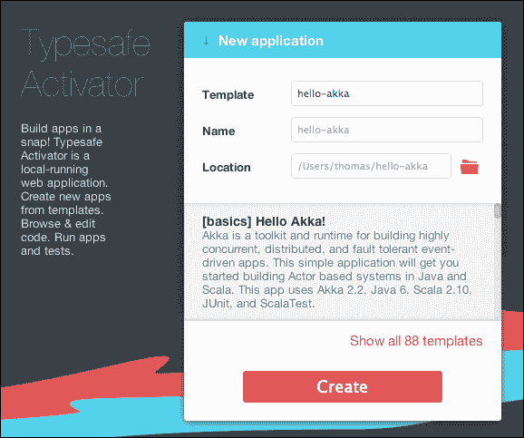
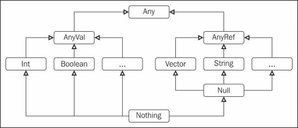

# 第一章. 在您的项目中交互式编程

离开一个成熟且稳定的语言，如 Java，需要一些相当充分的理由。在尝试了解 Scala 语法之前，我们先要明确 Scala 之所以吸引人的原因。

在本章中，我们将涵盖以下主题：

+   使用 Scala 进行 Java 项目的好处

+   通过交互式会话后的快速课程熟悉语言语法，包括案例类、集合操作，以及一些有用的功能，如选项、元组、映射、模式匹配和字符串插值

# 使用 Scala 进行 Java 项目的好处

我们在这里提出的出现顺序和重要性仅反映我们个人的经验，因为每个项目和程序员团队在优先级方面通常都有自己的议程。

## 更简洁、更易于表达

您应该采用 Scala 的最终原因是可读性：类似于普通英语的代码将使任何人（包括你自己）更容易理解、维护和重构它。Scala 的独特之处在于它统一了 Java 具有的面向对象方面，以便使代码模块化，并利用函数式语言的强大功能来简洁地表达转换。为了说明如何通过在语言中引入匿名函数（也称为**lambda**）来实现简洁性，请看以下代码行：

```java
List(1,2,3,4,5) filter (element => element < 4)
```

对于 Java 程序员来说，一开始可能会觉得这行代码看起来有些不自然，因为它不符合在类上调用方法签名的一般模式。之前代码可能的 Java 翻译如下：

```java
import java.util.*;

public class ListFilteringSample {

  public static void main(String[] args) {

    List<Integer> elements = Arrays.asList(1, 2, 3, 4, 5);

    List<Integer> filteredElements = new ArrayList<Integer>();

    for (Integer element : elements)
      if (element < 4) filteredElements.add(element);

    System.out.println("filteredElements:" + filteredElements);

  }
}
```

### 小贴士

**下载示例代码**

您可以从 Packt Publishing 的账户下载您购买的所有书籍的示例代码文件。[`www.packtpub.com`](http://www.packtpub.com)。如果您在其他地方购买了这本书，您可以访问[`www.packtpub.com/support`](http://www.packtpub.com/support)，并注册以直接将文件通过电子邮件发送给您。

我们首先创建一个包含五个整数的`List`，然后创建一个空的`List`，它将保存过滤的结果，然后遍历`List`中的元素，只保留符合`if`谓词（`element < 4`）的元素，最后打印出结果。即使这写起来很简单，但也需要几行代码，而 Scala 的代码可以像下面这样阅读：

“从给定的`List`中过滤每个元素，使得该元素小于`4`”。

代码变得非常简洁且易于表达，这使得程序员能够立即理解一个复杂或冗长的算法。

## 提高生产力

拥有一个执行大量类型检查并充当个人助手的编译器，据我们看来，这是相对于在运行时动态检查类型的语言的一个显著优势，而 Java 作为静态类型语言，可能是它最初如此受欢迎的主要原因之一。Scala 编译器也属于这一类，并且更进一步，它能够自动找出许多类型，通常可以减轻程序员在代码中明确指定这些类型的负担。此外，你 IDE 中的编译器可以提供即时反馈，因此提高了你的生产力。

## 自然地从 Java 进化而来

Scala 与 Java 无缝集成，这是一个非常吸引人的特性，可以避免重新发明轮子。你今天就可以在生产环境中开始运行 Scala。像 Twitter、LinkedIn 或 Foursquare（仅举几个例子）这样的大型企业已经在过去很多年里进行了大规模部署，最近还有像 Intel 或 Amazon 这样的巨头也加入了进来。Scala 编译成 Java 字节码，这意味着性能将相当。当你执行 Scala 程序时，你运行的大多数代码可能是 Java 代码，主要区别在于程序员看到的内容以及编译代码时的先进类型检查。

## 更适合异步和并发代码

为了实现更好的性能和处理更多的负载，现代 Java Web 开发框架和库现在正在解决与多核架构和与不可预测的外部系统集成相关的一些难题。Scala 使用不可变数据结构和函数式编程结构以及其对并行集合的支持，更有可能成功编写出表现正确的并发代码。此外，Scala 优越的类型系统和宏支持使得可以编写出安全异步结构，例如可组合的异步和异步语言扩展。

总结来说，Scala 是唯一一个拥有所有这些特性的语言。它是静态类型的，在 JVM 上运行，并且完全兼容 Java，既面向对象又函数式，而且不啰嗦，因此提高了生产力，减少了维护，因此更有趣。

如果你现在迫不及待地想要开始尝试之前简要描述的 Scala 的诱人特性，现在是打开浏览器、访问 Typesafe 页面 URL [`www.typesafe.com/platform/getstarted`](http://www.typesafe.com/platform/getstarted) 并下载 Typesafe Activator 的好时机。

本章剩余部分的目的是通过在交互式 shell 中输入命令，逐步介绍 Scala 的一些基本概念，并直接从编译器获得反馈。这种通过实验学习的方法应该像一股清新的空气，并且已经被证明是一种非常有效的学习语言语法和有用结构的方法。虽然 Scala 在洛桑联邦理工学院（EPFL）持续发展，但现在许多大公司和中小企业都在利用 Typesafe 平台的功能。

如同他们网站所述，Typesafe Activator 是“一个本地的网页和命令行工具，帮助开发者开始使用 Typesafe 平台”。我们将在后续的章节中更详细地介绍 Activator，但在此阶段，我们只需走最短的路来启动并运行，熟悉一些语言的语法。

现在，你应该能够将下载的 zip 压缩文件解压到你的系统中的任意目录。

在解压的存档中找到 activator 脚本，如果你正在运行 Windows，则右键单击它并选择 **打开**；如果你在 Linux/Mac 上，则在终端窗口中输入以下命令：

```java
> ./activator ui 

```

在这两种情况下，这将在浏览器窗口中启动 Activator UI。

在 Activator 的 HTML 页面的 **新应用程序** 部分中，点击 `[基础] Hello-Scala!` 模板。

注意以下截图中的 HTML 表单的 **位置** 字段。它指示了你的项目将被创建的位置：



目前，你不需要过多关注后台发生的事情，也不需要关注项目生成的结构。出于好奇，你可以点击 **代码视图 & 在 IDE 中打开** 选项卡，然后点击 **运行** 选项卡来执行这个 Hello World Scala 项目，它应该会打印出 **"Hello, world !"**。

启动一个终端窗口，并通过在命令行中输入以下命令导航到我们刚刚创建的 *hello-scala* 项目的根目录（假设我们的项目位于 `C:\Users\Thomas\hello-scala`）：

```java
> cd C:\Users\Thomas\hello-scala
C:\Users\Thomas\hello-scala> activator console

```

此命令将启动 Scala 解释器，也称为 Scala **REPL**（**读取-评估-打印-循环**），这是一个简单的交互式命令行工具。

# 通过 REPL 学习 Scala

作为 Java 开发者，REPL 可能对你来说是新的，因为 Java 语言没有这样的东西。它曾经指的是 Lisp 语言的交互式环境，而今天，许多编程语言如 JavaScript、Clojure、Ruby 和 Scala 都有等效的工具。它由一个命令行 shell 组成，你可以输入一个或多个表达式，而不是完整的文件，并通过评估结果立即获得反馈。REPL 是一个极好的工具，它帮助我们学习所有的 Scala 语法，因为它使用编译器的全部力量编译和执行你写的每个语句。在这样的交互式环境中，你会在你写的每一行代码上获得即时反馈。

如果你刚开始接触 Scala，我们建议你仔细跟随这个 REPL 会话，因为它会给你很多关于用 Scala 编程的有用知识。

让我们深入探讨 Java 和 Scala 之间的一些最明显的差异，以便熟悉 Scala 语法。

## 声明 val/var 变量

在 Java 中，你会通过先放类型，然后是名称，最后是可选值来声明一个新变量：

```java
String yourPast = "Good Java Programmer";
```

在 Scala 中，变量名和类型的声明顺序是颠倒的，类型出现在变量名之前。让我们将以下行输入到 REPL 中：

```java
scala> val yourPast : String = "Good Java Programmer"  [Hit Enter]
yourPast : String = "Good Java Programmer"

```

与 Java 相比，将变量、类型和名称的声明顺序颠倒可能看起来是一个奇怪的想法，如果你想让 Java 开发者尽可能容易地掌握 Scala 语法。然而，出于几个原因，这样做是有意义的：

+   在这种情况下，Scala 编译器能够自动推断类型。你可以（并且可能应该，为了简洁）通过输入等效但更短的代码行来省略这个类型：

    ```java
    scala> val yourPast = "Good Java Programmer"
    yourPast : String = "Good Java Programmer"

    ```

    这是最基本的**类型推断**的示例，你会看到 Scala 编译器会尽可能尝试推断类型。如果我们省略了这个可选的类型，但遵循 Java 语法，编译器所做的解析将更难实现。

+   在我们看来，了解变量名比了解其类型更重要，以便理解程序的流程（因此将其放在前面）；例如，如果你处理一个代表**社会保障号码**（**ssn**）的变量，我们认为术语 ssn 比知道它是否表示为字符串、整数或其他类型更有价值。

你可能注意到了声明前的`val`变量；这意味着我们明确地将变量声明为不可变的。我们可以尝试像以下代码片段中那样修改它：

```java
scala> yourPast = "Great Scala Programmer"
<console>:8: error: reassignment to val
 yourPast = "Great Scala Programmer"
 ^

```

上述代码不仅会清楚地解释出了什么问题，还会精确地指出解析器不同意的地方（注意`^`字符精确地显示了错误所在行）。

如果我们想创建一个可变变量，我们应该像以下代码片段中那样用`var`声明它：

```java
scala> var yourFuture = "Good Java Programmer"
yourFuture: String = "Good Java Programmer"
scala> yourFuture = "Great Scala Programmer"
yourFuture: String = "Great Scala Programmer"

```

总结来说，您不能更改`yourPast`，但您可以更改`yourFuture`！

在 Scala 中，行尾的分号是可选的；这是该语言的一个小而令人愉悦的特性。

让我们继续探讨一个重要的区别。在 Java 中，您有诸如`int`、`char`或`boolean`（总共八个）这样的原始类型，以及诸如`+`或`>`这样的操作符来操作数据。在 Scala 中，只有类和对象，这使得 Scala 在某些方面比 Java 更“面向对象”。例如，将以下值输入到 REPL 中：

```java
scala> 3
res1: Int = 3

```

默认情况下，编译器创建了一个名为`res1`的不可变`Int`（整数）变量（即结果 1），以防您稍后需要重用它。

现在，在 REPL 中输入以下行：

```java
scala> 3 + 2
res2: Int = 5

```

上述代码类似于操作符的使用（如在 Java 中），但实际上是调用名为`+`的方法，该方法在对象`3`上调用，输入参数为`2`，相当于稍微不太清晰的语句：

```java
scala> (3).+(2)
res3: Int = 5

```

通过删除指定括号的必要性，这里添加了语法糖（即设计来使事物更容易阅读或表达的语言）。这也意味着我们现在可以在自己定义的类型上实现类似的方法，以优雅地表达代码。例如，我们可以通过简单地声明`Money(10,"EUR") + Money(15,"USD")`来表达两种不同货币的`Money`对象的相加（注意，`Money`类型在默认的 Scala 库中不存在）。让我们在 REPL 中尝试这样做。

## 定义类

首先，我们可以定义一个新的名为`Money`的类，它有一个名为`amount`的构造函数参数，类型为`Int`，如下所示：

```java
scala> class Money(amount:Int)
defined class Money

```

### 注意

Scala 有一种特殊的语法来声明构造函数参数，这将在稍后更深入地探讨。

现在，我们可以创建一个`Money`实例，如下面的代码片段所示：

```java
scala> val notMuch = new Money(2)
notMuch : Money = Money@76eb235

```

您将得到一个带有其显示引用的对象。REPL 为您提供了**TAB 完成**功能，因此键入`notMuch.`然后按*Tab*键：

```java
scala> notMuch. [Tab]
asInstanceOf isInstanceOf toString

```

通过使用前面的自动完成，您将得到该类可用方法的建议，就像您在大多数 Java IDE 中会得到的那样。

如前所述，您可以通过调用构造函数来构建新的`Money`实例，但由于它不是一个字段，您无法访问`amount`变量。要将其作为`Money`类的字段，您必须在它前面添加一个`'val'`或`'var'`声明，如下面的代码片段所示：

```java
scala> class Money(val amount:Int)
defined class Money

```

这次，我们不会再次输入创建实例的行，而是将使用上箭头（显示先前表达式的快捷键：控制台的历史记录）并导航到它：

```java
scala> val notMuch = new Money(2)
notMuch : Money = Money@73cd15da

```

### 注意

在 REPL 中，您可以在任何时候按下*Tab*键，并提供自动完成功能。

在这个新实例上调用自动完成将显示以下内容：

```java
scala> notMuch. [Tab ]
amount asInstanceOf isInstanceOf toString

```

因此，我们可以简单地通过引用它来读取这个`amount`字段的`getter`值：

```java
scala> notMuch.amount
res4: Int = 2

```

同样，如果我们将金额声明为`var`变量而不是`val`，我们也将能够访问`setter`方法：

```java
scala> class Money(var amount:Int)
defined class Money
scala> val notMuch = new Money(2)
notMuch: Money = Money@6517ff0
scala> notMuch. [ Tab ]
amount   amount_=   asInstanceOf   isInstanceOf   toString

```

当我们使用以下代码片段时，将调用`setter`方法：

```java
scala> notMuch.amount=3
notMuch.amount: Int = 3

```

## 解释`case`类

作为 Java 开发者，我们习惯于 JavaBean 风格的领域类，这些类不仅包括具有 getter 和 setter 的字段，还包括构造函数以及`hashCode`、`equals`和`toString`方法，如下面的代码片段所示：

```java
public class Money {

    private Integer amount;
    private String currency;

    public Money(Integer amount, String currency) {

        this.amount = amount;
        this.currency = currency;

    }

    public Integer getAmount() {
        return amount;
    }

    public void setAmount(Integer amount) {
        this.amount = amount;
    }

    public String getCurrency() {
        return currency;
    }
    public void setCurrency(String currency) {
        this.currency = currency;
    }

    @Override
    public int hashCode() {
        int hash = 5;
        hash = 29 * hash + (this.amount != null ? this.amount.hashCode() : 0);
        hash = 29 * hash + (this.currency != null ? this.currency.hashCode() : 0);
        return hash;
    }

    @Override
    public boolean equals(Object obj) {

        if (obj == null) {
            return false;
        }

        if (getClass() != obj.getClass()) {
            return false;
        }

        final Money other = (Money) obj;
        return true;
    }

    @Override
    public String toString() {
        return "Money{" + "amount=" + amount + ", currency=" + currency + '}';

    }
}
```

在 Scala 中实现这一点非常简单，只需在类声明前添加`case`关键字即可：

```java
scala> case class Money(amount:Int=1, currency:String="USD")
defined class Money

```

我们刚刚定义了一个名为`Money`的类，它有两个不可变的字段`amount`和`currency`，并具有默认值。

不深入探讨`case`类的细节，我们可以说，除了传统 JavaBean 风格领域类的先前特性外，它们还具有强大的模式匹配机制。`case`关键字与 Java 中的`switch`语句类似，尽管它更加灵活，正如我们稍后将看到的。`case`类包含一些附加功能，其中之一是工厂方法来创建实例（无需使用`new`关键字来创建实例）。

默认情况下，Scala 类中声明的字段是公开的，与 Java 不同，Java 中的字段具有包私有作用域，定义在`private`和`protected`之间。我们可以将`case class Money(private val amount: Int, private val currency: String)`写成私有，或者使用`var`代替`val`来使字段可变。

创建`Money`实例的最简单方法非常直接：

```java
scala> val defaultAmount = Money()
defaultAmount: Money = Money(1,USD)
scala> val fifteenDollars = Money(15,"USD")
fifteenDollars: Money = Money(15,USD)
scala> val fifteenDollars = Money(15)
fifteenDollars: Money = Money(15,USD) 

```

在前面的实例声明中，由于只提供了一个参数而不是两个，编译器将其与第一个声明的字段匹配，即`amount`。由于值`15`与`amount`（即`Integer`）类型相同，编译器能够使用默认值`"USD"`作为货币填充实例。

与`amount`变量不同，仅使用货币参数调用`Money`构造函数将失败，如下面的语句所示：

```java
scala> val someEuros = Money("EUR")
<console>:9: error: type mismatch;
 found   : String("EUR")
 required: Int
 val someEuros = Money("EUR")
 ^

```

前面的代码无法工作，因为编译器无法猜测我们指的是哪个参数，因此尝试按声明顺序匹配它们。为了能够使用给定的`"EUR"`字符串的默认值`amount`，我们需要显式包含参数名称，如下面的代码片段所示：

```java
scala> val someEuros = Money(currency="EUR")
someEuros: Money = Money(1,EUR)

```

因此，我们还可以显式标记所有参数，这在参数很多时是推荐的，如下面的代码片段所示：

```java
scala> val twentyEuros = Money(amount=20,currency="EUR")
twentyEuros: Money = Money(20,EUR)

```

在构建实例时，还有一个非常有用的方法，即`copy`方法，它从原始实例创建一个新的实例，并最终替换给定的参数：

```java
scala> val tenEuros = twentyEuros.copy(10)
tenEuros: Money = Money(10,EUR)

```

我们可以使用具有显式命名参数的`copy`方法，如下所示：

```java
scala> val twentyDollars = twentyEuros.copy(currency="USD")
twentyDollars: Money = Money(20,USD)

```

当编写测试用例时，`copy`方法非常有用，特别是在初始化具有许多相似字段的模拟实例时。

让我们继续前进，通过创建我们的 `Money` 类的 `addition` 操作来继续。为了简单起见，我们暂时假设我们只处理相同货币的金额，即默认的 USD。

在 Java 中，我们可能会用以下签名和简单内容来添加这样的方法：

```java
public class Money {

    Integer amount;
    String currency;

    public Money(Integer amount, String currency) {
        this.amount = amount;
        this.currency = currency;
    }

    public Money add(Money other) {
        return new Money(this.amount +
        other.amount, this.currency);
    }
    ...
}
```

在 Scala 中，我们使用 `def` 关键字来定义类方法或函数。在 REPL 中，我们可以有多行表达式。以下 `case` 类声明，包含求和方法 `+` 的实现，是这种特性的一个示例：

```java
scala> case class Money(val amount:Int=1, val currency:String="USD"){
 |   def +(other: Money) : Money = Money(amount + other.amount)
 | }
defined class Money

```

注意，我们可以使用 `+` 作为方法名。我们还在签名声明中包含了返回类型 `Money`，这虽然是可选的，因为 Scala 的类型推断会推导出它，但明确包含它是公共方法（默认情况下，如果没有指定其他作用域，方法都是公共的）的良好文档实践。此外，在 Scala 中，由于方法末尾的 `return` 关键字是可选的，所以总是最后一个语句返回给方法的调用者。此外，通常认为省略 `return` 关键字是一个好的实践，因为它不是强制的。

现在，我们可以用以下简单的表达式来编写两个 `Money` 实例的相加操作：

```java
scala> Money(12) + Money(34)
res5: Money = Money(46,USD)

```

一旦我们开始操作对象的集合，事情就会变得有趣起来，Scala 的函数式编程部分在这方面非常有帮助。由于泛型是语言的一部分（从 Java 5 开始），Java 可以通过编写以下代码片段来遍历整数列表：

```java
List<Integer> numbers = new ArrayList<Integer>();
numbers.add(1);
numbers.add(2);
numbers.add(5);
for(Integer n: numbers) {
    System.out.println("Number "+n);
}
```

上述代码产生以下输出：

```java
Number 1
Number 2
Number 5

```

在 Scala 中，列表的声明可以写成如下形式：

```java
scala> val numbers = List(1,2,5)
numbers: List[Int] = List(1,2,5)

```

Scala 集合系统地区分不可变和可变集合，但通过默认构造不可变集合来鼓励不可变性。它们通过返回新集合而不是修改现有集合来模拟添加、更新或删除操作。

打印数字的一种方法是我们可以遵循 Java 的命令式编程风格，通过创建一个 `for` 循环来遍历集合：

```java
scala> for (n <- numbers) println("Number "+n)
Number 1
Number 2
Number 5

```

在 Scala 中编写代码的另一种方式（以及 JVM 上的许多其他语言，如 Groovy、JRuby 或 Jython）涉及更函数式的方法，使用 lambda 表达式（有时称为闭包）。简而言之，lambda 只是你可以传递作为参数的函数。这些函数接受输入参数（在我们的例子中，是 `n` 整数）并返回其主体中的最后一个语句/行。它们具有以下形式：

```java
functionName { input =>
                body
             }
```

一个典型的 lambda 示例，用于遍历我们之前定义的 `numbers` 列表中的元素，如下所示：

```java
scala> numbers.foreach { n:Int => 
 | println("Number "+n)
 | }
Number 1
Number 2
Number 5

```

在这种情况下，主体只包含一个语句（`println...`），因此返回 `Unit`，即一个空的结果，大致相当于 Java 中的 `void`，但 `void` 不返回任何内容。

在撰写本书时，Java 中的 lambda 表达式即将到来，并将很快作为 JDK8 发布的一部分被引入，采用类似 Scala 的风格。因此，一些函数式构造将很快对 Java 开发者可用。

应该可以以以下方式编写我们的小型示例：

```java
numbers.forEach(n -> { System.out.println("Numbers "+n);});
```

如我们之前所述，Scala 集合默认是不可变的。这对于在多处理器架构中处理它们时按预期行为非常重要。与 Java 相比，Scala 集合的一个独特特性是它们包括对并行运行操作的支持。

# 集合操作

在本节中，我们将展示如何在 Scala 中以简洁和表达性的方式表达集合操作。

## 转换包含原始类型的集合

REPL 是一个伟大的工具，可以尝试我们对集合元素可以应用的有力操作。让我们回到我们的解释器提示符：

```java
scala> val numbers = List(1,2,3,4,5,6)
numbers: List[Int] = List(1,2,3,4,5,6)
scala> val reversedList = numbers.reverse
reversedList: List[Int] = List(6,5,4,3,2,1)
scala> val onlyAFew = numbers drop 2 take 3
onlyAFew: List[Int] = List(3, 4, 5)

```

`drop`方法表示我们移除列表的前两个元素，而`take`方法表示我们只保留`drop`方法得到的结果中的前三个元素。

这个最后的命令有两个有趣的原因：

+   由于每个方法调用都会被评估为一个表达式，我们可以同时链式调用多个方法（这里，`take`是在`drop`的结果上调用的）。

+   如前所述，添加到 Scala 语法的语法糖使得我们可以用`numbers drop 2`来代替更传统的 Java 写法`numbers.drop(2)`。

在给定列表中编写元素的另一种方式是使用`::`方法，在 Scala 文档中通常被称为“cons 运算符”。这种替代语法看起来如下所示：

```java
scala> val numbers = 1 :: 2 :: 3 :: 4 :: 5 :: 6 :: Nil
numbers: List[Int] = List(1, 2, 3, 4, 5, 6)

```

如果你想知道为什么这个表达式的末尾有一个`Nil`值，这是因为 Scala 中有一个简单的规则，即如果一个方法的最后一个字符是`:`（即冒号），则该方法应用于其右侧而不是左侧（这样的方法称为右结合）。因此，`6 :: Nil`的评估在这种情况下并不等同于`6.::(Nil)`，而是`Nil.::(6)`。我们可以在 REPL 中展示如下：

```java
scala> val simpleList = Nil.::(6)
simpleList: List[Int] = List(6)

```

`5 :: 6 :: Nil`的评估是通过在之前看到的`simpleList`上应用`::`方法来完成的，该方法是`List(6)`：

```java
scala> val twoElementsList = List(6).::(5)
twoElementsList: List[Int] = List(5, 6)

```

在这种情况下，`5`被添加到`6`之前。重复此操作几次将得到最终的`List(1,2,3,4,5,6)`。

这种方便的表达列表的方式不仅适用于简单的值，如整数，而且可以应用于任何类型。此外，我们可以通过使用`:::`方法以类似的方式连接两个`List`实例：

```java
scala> val concatenatedList = simpleList ::: twoElementsList
concatenatedList: List[Int] = List(6, 5, 6)

```

我们甚至可以在同一个`List`中混合各种类型的元素，例如整数和布尔值，如下面的代码片段所示：

```java
scala> val things = List(0,1,true)
things: List[AnyVal] = List(0, 1, true) 

```

然而，正如你可能注意到的，编译器在那个情况下选择的`AnyVal`结果类型是整数和布尔值在它们的层次结构中遇到的第一个公共类型。例如，仅检索布尔元素（在列表中的索引为二）将返回`AnyVal`类型的元素，而不是布尔值：

```java
scala> things(2)
res6: AnyVal = true

```

现在，如果我们把一个`String`类型的元素也放入列表中，我们将得到一个不同的公共类型：

```java
scala> val things = List(0,1,true,"false")
things: List[Any] = List(0, 1, true, false)

```

这可以通过查看 Scala 类型的层次结构来直接可视化。表示原始类型（如`Int`、`Byte`、`Boolean`或`Char`）的类属于`scala.AnyVal`的值类型，而`String`、`Vector`、`List`或`Set`属于`scala.AnyRef`的引用类型，两者都是通用类型`Any`的子类，如下面的图所示：



Scala 类型的完整层次结构可以在官方 Scala 文档中找到，网址为[`docs.scala-lang.org/tutorials/tour/unified-types.html`](http://docs.scala-lang.org/tutorials/tour/unified-types.html)。

## 更复杂的对象集合

让我们操作比整数更复杂的对象。例如，我们可以创建一些我们之前创建的`Money`实例的集合，并实验它们：

```java
scala> val amounts = List(Money(10,"USD"),Money(2,"EUR"),Money(20,"GBP"),Money(75,"EUR"),Money(100,"USD"),Money(50,"USD"))
amounts: List[Money] = List(Money(10,USD), Money(2,EUR), Money(20,GBP), Money(75,EUR), Money(100,USD), Money(50,USD))
scala> val first = amounts.head
first: Money = Money(10,USD)
scala> val amountsWithoutFirst = amounts.tail
amountsWithoutFirst: List[Money] = List(Money(2,EUR), Money(20,GBP), Money(75,EUR), Money(100,USD), Money(50,USD))

```

### 过滤和分区

过滤集合中的元素是最常见的操作之一，可以写成以下形式：

```java
scala> val euros = amounts.filter(money => money.currency=="EUR")
euros: List[Money] = List(Money(2,EUR), Money(75,EUR))

```

传递给`filter`方法的参数是一个函数，它接受一个`Money`项作为输入并返回一个`Boolean`值（即谓词），这是评估`money.currency=="EUR"`的结果。

`filter`方法遍历集合项并对每个元素应用函数，只保留函数返回`True`的元素。Lambda 表达式也被称为**匿名函数**，因为我们可以为输入参数赋予任何我们想要的名称，例如，用`x`代替之前使用的`money`，仍然得到相同的输出：

```java
scala> val euros = amounts.filter(x => x.currency=="EUR")
euros: List[Money] = List(Money(2,EUR),Money(75,EUR))

```

写这个单行语句的一个稍微简短的方法是使用一个`_`符号，这是在阅读 Scala 代码时经常遇到的一个字符，对于 Java 开发者来说可能一开始看起来有些不自然。它简单地意味着“那个东西”，或者“当前元素”。它可以被视为过去用来填充纸质调查或护照登记表格的空白空间或间隙。其他处理匿名函数的语言保留其他关键字，例如 Groovy 中的`it`或 Python 中的`self`。之前的 lambda 示例可以用简短的下划线符号重写如下：

```java
scala> val euros = amounts.filter(_.currency=="EUR")
euros: List[Money] = List(Money(2,EUR),Money(75,EUR))

```

还存在一个`filterNot`方法，用于保留函数评估返回`False`的元素。此外，还有一个`partition`方法可以将`filter`和`filterNot`方法组合成一个单一调用，返回两个集合，一个评估为`True`，另一个为其补集，如下面的代码片段所示：

```java
scala> val allAmounts = amounts.partition(amt =>
 |   amt.currency=="EUR")
allAmounts: (List[Money], List[Money]) = (List(Money(2,EUR), Money(75,EUR)),List(Money(10,USD), Money(20,GBP), Money(100,USD), Money(50,USD)))

```

### 处理元组

注意到分区结果的返回类型，`(List[Money],List[Money])`。Scala 支持元组的概念。前面的括号表示法表示一个`Tuple`类型，它是 Scala 标准库的一部分，并且对于同时操作多个元素非常有用，而无需创建更复杂的类型来封装它们。在我们的例子中，`allAmounts`是一个包含两个`Money`列表的`Tuple2`对。要访问这两个集合中的任意一个，我们只需输入以下表达式：

```java
scala> val euros = allAmounts._1
euros: List[Money] = List(Money(2,EUR),Money(75,EUR))
scala> val everythingButEuros= allAmounts._2
everythingButEuros: List[Money] = List(Money(10,USD),Money(20,GBP),Money(100,USD),Money(50,USD))

```

要以一行代码的形式实现这一点，并且更加简洁和自然，可以使用不引用`._1`和`._2`的`partition`方法，如下代码片段所示：

```java
scala> val (euros,everythingButEuros) = amounts.partition(amt =>
 |   amt.currency=="EUR")
euros: List[Money] = List(Money(2,EUR), Money(75,EUR))
everythingButEuros: List[Money] = List(Money(10,USD), Money(20,GBP), Money(100,USD), Money(50,USD))

```

这次，作为结果，我们得到了两个变量，`euros`和`everythingButEuros`，我们可以分别重用它们：

```java
scala> euros
res2: List[Money] = List(Money(2,EUR), Money(75,EUR))

```

### 引入 Map

元组的另一种优雅用法与`Map`集合的定义有关，`Map`集合是 Scala 集合的一部分。类似于 Java，`Map`集合存储键值对。在 Java 中，一个简单的`HashMap`定义，用几行代码填充和检索`Map`集合的元素，可以写成如下：

```java
import java.util.HashMap;
import java.util.Map;

public class MapSample {
    public static void main(String[] args) {
        Map amounts = new HashMap<String,Integer>();
        amounts.put("USD", 10);
        amounts.put("EUR", 2);

        Integer euros = (Integer)amounts.get("EUR");
        Integer pounds = (Integer)amounts.get("GBP");

        System.out.println("Euros: "+euros);
        System.out.println("Pounds: "+pounds);
    }
}
```

由于没有将 GBP 货币的金额插入到`Map`集合中，运行此示例将为`Pounds`变量返回一个`null`值：

```java
Euros: 2
Pounds: null
```

在 Scala 中填充`Map`集合可以优雅地写成如下形式：

```java
scala> val wallet = Map( "USD" -> 10, "EUR" -> 2 )
wallet: scala.collection.immutable.Map[String,Int] = Map(USD -> 10, EUR -> 2)

```

`"USD" -> 10`表达式是一种方便的方式来指定键值对，在这种情况下，它与在 REPL 中直接定义的`Tuple2[String,Integer]`对象等价（REPL 可以直接推断类型）：

```java
scala> val tenDollars = "USD"-> 10
tenDollars : (String, Int) = (USD,10)
scala> val tenDollars = ("USD",10)
tenDollars : (String, Int) = (USD,10)

```

添加和检索元素的过程非常直接：

```java
scala> val updatedWallet = wallet + ("GBP" -> 20)
wallet: scala.collection.immutable.Map[String,Int] = Map(USD -> 10, EUR -> 2, GBP -> 20)
scala> val someEuros = wallet("EUR")
someEuros: Int = 2

```

然而，访问`Map`集合中未包含的元素将抛出异常，如下所示：

```java
scala> val somePounds = wallet("GBP")
java.util.NoSuchElementException: key not found: GBP  (followed by a full stacktrace)

```

### 引入 Option 构造

从上一节中引入的`Map`集合中安全地检索元素的一种方法是通过调用其`.get()`方法，这将返回一个类型为`Option`的对象，而 Java 目前还没有这个特性。基本上，`Option`类型将一个值封装到一个对象中，如果该值为 null，则返回`None`类型，否则返回`Some(value)`。让我们在 REPL 中输入以下内容：

```java
scala> val mayBeSomeEuros = wallet.get("EUR")
mayBeSomeEuros: Option[Int] = Some(2)
scala> val mayBeSomePounds = wallet.get("GBP")
mayBeSomePounds: Option[Int] = None

```

### 模式匹配的简要介绍

避免抛出异常使得将算法的流程作为一个评估表达式继续处理变得方便。这不仅给程序员提供了在无需检查值是否存在的情况下，对`Option`值进行复杂链式操作的自由，而且还使得可以通过**模式匹配**来处理两种不同的情形：

```java
scala> val status = mayBeSomeEuros match {
 |   case None => "Nothing of that currency"
 |   case Some(value) => "I have "+value+" Euros"
 | }
status: String = I have 2 Euros

```

模式匹配是 Scala 语言的一个基本且强大的特性。我们稍后会看到更多关于它的例子。

`filter`和`partition`方法只是列表上所谓的“高阶函数”的两个例子，因为它们操作的是集合类型的容器（如列表、集合等），而不是类型本身。

### `map`方法

在集合的方法中，不能忽视的是`map`方法（不要与`Map`对象混淆）。基本上，它将一个函数应用于集合的每个元素，但与`foreach`方法返回`Unit`不同，它返回一个类似容器类型的集合（例如，一个`List`将返回一个大小相同的`List`），其中包含通过函数转换每个元素的结果。以下是一个简单的示例代码片段：

```java
scala> List(1,2,3,4).map(x => x+1)
res6: List[Int] = List(2,3,4,5)

```

在 Scala 中，你可以如下定义独立的函数：

```java
scala> def increment = (x:Int) => x + 1
increment: Int => Int

```

我们已经声明了一个`increment`函数，它接受一个`Int`类型的输入值（用`x`表示）并返回另一个`Int`类型的值（`x+1`）。

之前的`List`转换可以稍微以不同的方式重写，如下面的代码片段所示：

```java
scala> List(1,2,3,4).map(increment)
res7: List[Int] = List(2,3,4,5)

```

通过一点语法糖，方法调用中的`.`符号以及函数参数上的括号可以省略以提高可读性，这导致以下简洁的一行代码：

```java
scala> List(1,2,3,4) map increment
res8: List[Int] = List(2, 3, 4, 5)

```

回到我们最初的`Money`金额列表，例如，我们可以将它们转换为字符串如下：

```java
scala> val printedAmounts =
 |   amounts map(m=> ""+  m.amount + " " + m.currency)
printedAmounts: List[String] = List(10 USD, 2 EUR, 20 GBP, 75 EUR, 100 USD, 50 USD)

```

### 看一下字符串插值

在 Java 中，使用`+`运算符连接字符串，就像我们在上一行所做的那样，是一个非常常见的操作。在 Scala 中，处理字符串表示的一种更优雅且高效的方法是名为**字符串插值**的功能。自 Scala 版本 2.10 起，新的语法涉及在字符串字面量前添加一个`s`字符，如下面的代码片段所示：

```java
scala> val many = 10000.2345
many: Double = 10000.2345
scala> val amount = s"$many euros"
amount: String = 10000.2345 euros 

```

作用域内的任何变量都可以被处理并嵌入到字符串中。使用`f`插值器而不是`s`可以更精确地进行格式化。在这种情况下，语法遵循与其他语言中`printf`方法相同的风格，例如，`%4d`表示四位数的格式化，`%12.2f`表示小数点前有十二位数字，后有两位数字的浮点数表示法：

```java
scala> val amount = f"$many%12.2f euros"
amount: String = "    10000.23 euros"

```

此外，字符串插值语法使我们能够嵌入表达式的完整评估，即执行计算的完整代码块。以下是一个示例，其中我们想显示`many`变量的值两次：

```java
scala> val amount = s"${many*2} euros"
amount: String = 20000.469 euros

```

上述代码块遵循与任何方法或函数评估相同的规则，这意味着该块中的最后一个语句是结果。尽管这里我们有一个非常简单的计算，但如果需要，也可以包含多行算法。

了解插值语法后，我们可以将之前的`amounts`重写如下：

```java
scala> val printedAmounts =
 |   amounts map(m=> s"${m.amount} ${m.currency}")
printedAmounts: List[String] = List(10 USD, 2 EUR, 20 GBP, 75 EUR, 100 USD, 50 USD)

```

### `groupBy`方法

另一个方便的操作是`groupBy`方法，它将一个集合转换为一个`Map`类型的集合：

```java
scala> val sortedAmounts = amounts groupBy(_.currency)
sortedAmounts: scala.collection.immutable.Map[String,List[Money]] = Map(EUR -> List(Money(2,EUR), Money(75,EUR)), GBP -> List(Money(20,GBP)), USD -> List(Money(10,USD), Money(100,USD), Money(50,USD)))

```

### `foldLeft`方法

我们在这里想介绍的最后一种方法是`foldLeft`方法，它将一些状态从一个元素传播到下一个元素。例如，为了对列表中的元素进行求和，你需要累积它们并跟踪从元素到元素的中间计数器：

```java
scala> val sumOfNumbers = numbers.foldLeft(0) { (total,element) =>
 |   total + element
 | }
sumOfNumbers: Int = 21

```

给定给`foldLeft`的第一个参数的值`0`是初始值（这意味着在应用函数的第一个`List`元素时`total=0`）。`(total,element)`表示一个`Tuple2`对。然而，请注意，对于求和，Scala API 提供了一个`sum`方法，因此最后的语句可以写成如下所示：

```java
scala> val sumOfNumbers = numbers.sum
sumOfNumbers: Int = 21

```

# 摘要

这章交互式章节介绍了对象和集合的一些常用操作，这只是为了展示 Scala 的一些表达性和强大的构造。

在下一章中，我们将越来越多地将 Scala 与现有的标准 Java Web 应用程序相结合。由于有这么多创建标准 Web 应用程序的方法，结合许多可用的框架和数据库技术，无论它们是否涉及 Spring、Hibernate、JPA、SQL 还是 NoSQL，我们将采取一些已建立的 JavaEE 教程的简单路径。
