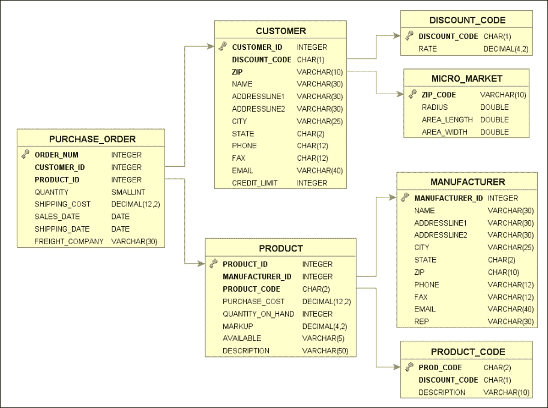
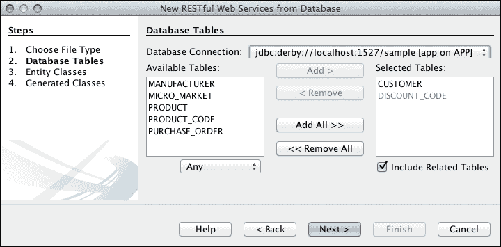
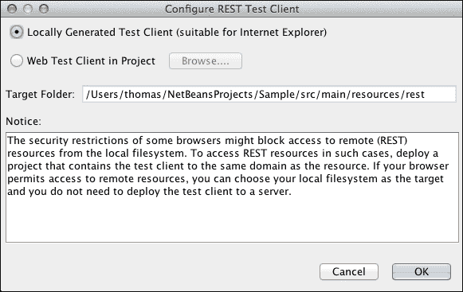
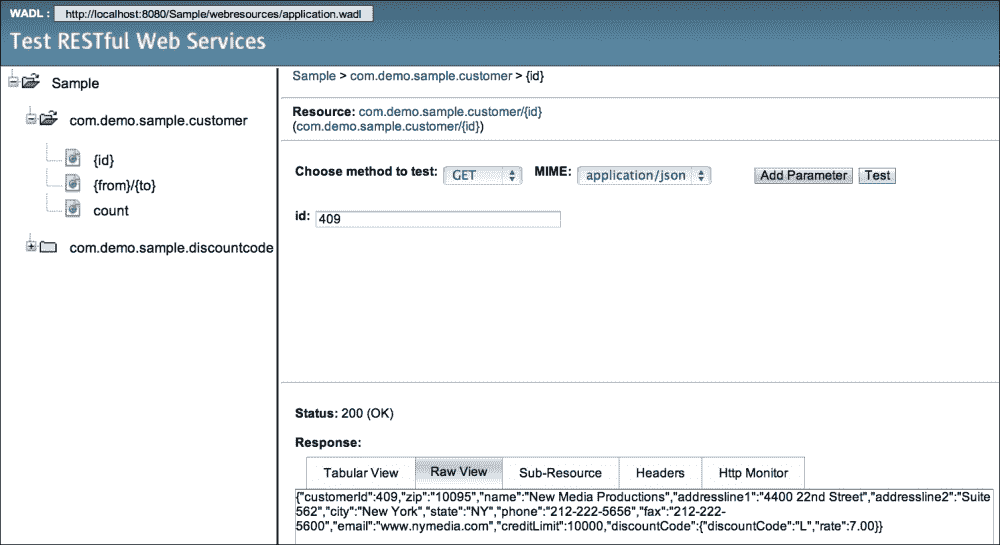

# 第二章. 代码集成

能够让 Java 和 Scala 在同一个代码库上协作是保证两种语言之间平稳过渡的先决条件。

在本章中，我们将快速创建一个小型的 Java Web 应用，我们将向您展示如何向其中添加 Scala 代码。然后，我们将介绍 Java 和 Scala 之间的一些最常见的集成点以及编程风格的不同之处，以便希望重构和扩展其 Java 应用的程序员可以根据一些指南进行操作。

为了避免在创建、理解和记录示例 Java 项目上花费太多时间，我们将使用 Oracle 的 NetBeans IDE 发行版中已经可用的小型数据库，并使用 IDE 的代码生成功能从中创建 JPA 持久层以及 REST API。

### 小贴士

**下载示例 Java 项目**

如果你迫不及待地想直接跳到本章的 Scala 代码集成功能，你可以跳过以下部分，并从 Packt 的网站[www.packtpub.com](http://www.packtpub.com)下载现成的 maven Java 项目。

# 从现有数据库创建 REST API

NetBeans IDE 附带示例数据库可以从[www.netbeans.org](http://www.netbeans.org)网站下载。只需点击该网站上的**下载**按钮，选择 IDE 的 JavaEE 版本。

一旦运行了安装向导，看到了**安装成功！**的消息，并且启动了 IDE（在我们的例子中是 8.0 版本），我们就可以在五分钟内创建一个功能齐全的 Web 应用了。第一次使用时，只需点击 NetBeans IDE 左上角来关闭启动屏幕，你应该能看到 IDE 左侧的三栏：**项目**、**文件**和**服务**。

## 示例数据库

我们参考的数据库可以通过点击 IDE 中的**服务**面板来查看。在**服务**标签页下的**数据库**菜单中，双击`jdbc:derby://localhost:1527/sample [app on APP] Database Connection`链接以连接到 1527 端口的示例数据库（Derby 数据库的默认端口）以及`APP`模式下的`app`用户。在`APP`模式下，你应该能找到包括`CUSTOMER`和`PRODUCT`在内的七个表。通过右键单击`CUSTOMER`表并选择**查看数据…**，你应该能够浏览表的内容。

以下图表展示了整个数据库模式，以便你可以可视化不同表之间的依赖关系或外键：



## 设置 Maven 项目

为了快速设置我们的示例 Java 项目，你可以直接从下载的代码中在你的 IDE 中导入它（并跳过创建 JPA 实体和 REST Web 服务），或者在你喜欢的 NetBeans IDE 上执行以下简单步骤：

1.  在 IDE 的 **项目** 选项卡中右键单击任何位置，选择 **新建项目…**，然后选择 **Maven** 类别和 **Web 应用程序** 项目类型。

1.  将 **项目名称** 输入为 `Sample`，将 **组 ID** 输入为 `com.demo`，然后点击 **Next >** 按钮。

1.  确保选择 **服务器** 容器进行部署（我们使用 NetBeans 分发中的默认 GlassFish 4.0）以及 **Java EE 7 Web** 作为 Java EE 版本。

1.  点击 **完成** 按钮，你应该能在 **项目** 选项卡下看到创建项目的结构。

## 创建 JPA 实体和 REST Web 服务

右键单击我们刚刚创建的 **Sample** 项目根目录，导航到 **新建** | **从数据库创建 RESTful Web 服务…**。从新打开的窗口中的下拉列表中选择 `derby sample` 数据库连接，应该会将数据库表显示在 **可用表** 部分中。仅标记 `CUSTOMER` 表，并选择 **Add>**，`CUSTOMER` 和 `DISCOUNT_CODE`（依赖于 `CUSTOMER`）应列在 **已选表** 中，如下截图所示：



点击 **下一步** 按钮，然后在下一页再次点击 **下一步**，最后点击 **完成** 将生成 `Customer` 和 `DiscountCode` 的持久化 JPA 实体以及服务外观类，`CustomerFacadeREST` 和 `DiscountCodeFacadeREST`。请注意，自 Java EE6 以来，`EntityManager` 类在每个服务类中实例化，这避免了需要生成在先前版本中生成的 JPA 控制器类。

### 小贴士

在 NetBeans 教程的 [www.netbeans.org](http://www.netbeans.org) 下有关于如何从数据库生成 RESTful Web 服务的更详细版本。

## 运行和测试项目

在我们开始将 Scala 代码引入我们的 Java 项目之前，我们可以在浏览器中启动我们的应用程序并测试 REST 调用。右键单击项目的 **Sample** 根节点，选择 **运行** 以部署应用程序。一旦控制台显示 GlassFish 服务器正在运行，并且浏览器中显示 **Hello World!** 消息以表明一切部署正确，右键单击项目根目录下的 `RESTful Web Services` 文件夹，并选择 **测试 RESTful Web 服务**。打开的对话框允许您选择是否将测试客户端作为同一项目的一部分生成或外部生成，如下截图所示：



选择 **本地生成的测试客户端（适用于 Internet Explorer）** 并点击 **确定**。

一旦部署完成，浏览器将显示一个测试页面，我们可以在这里调用`customer`和`discountcode`实体的 REST 方法。如果我们展开`com.demo.sample.customer`文件夹，将显示更多参数。点击`{id}`参数，在右侧面板中会出现一个输入字段，我们可以输入特定的客户`id`值。例如，我们可以输入`409`。在显示**MIME**类型的下拉列表中，选择**application/json**和`GET`作为测试方法，然后点击**测试**，如图所示：



页面的底部现在将显示 REST 查询的响应。它包括一个**状态：200（OK）**消息和一个**响应**内容，其中**原始视图**选项卡将显示响应体作为 JSON，如图所示。

### 在 Java 中添加单元测试

最后，我们可以通过从**项目**面板中选择`Customer.java`源文件，然后右键单击它并导航到**工具** | **创建测试**来为`Customer`类生成一个非常简单的单元测试。只需在对话框中单击**确定**按钮，并在需要的情况下允许安装**JUnit 4.xx**。生成的文件将出现在与测试类相同的 Java 包结构下的**测试包**中，在我们的例子中是`com.demo.sample.CustomerTest.java`，这是在 Java 中进行单元测试时的常见约定。右键单击`CustomerTest`类并选择**测试文件**将使所有测试方法在**JUnit**下运行，并且默认情况下每个测试方法末尾都有一个`fail`子句，因此会失败。现在，只需注释掉`testGetCustomerId`的`fail`语句并删除所有其他测试方法。然后，重新运行测试以在 IDE 中看到绿色的结果。或者，如果您已经在另一个 IDE 或纯文本编辑器中设置了 Maven 项目，您可以在文件系统中的项目根目录（`pom.xml`文件所在位置）中，在终端窗口中输入以下 Maven 命令，这可能是您熟悉的命令：

```java
> mvn test
-------------------------------------------------------
 T E S T S
-------------------------------------------------------
Running com.demo.sample.CustomerTest
getCustomerId
Tests run: 1, Failures: 0, Errors: 0, Skipped: 0, Time elapsed: 0.034 sec
Results :
Tests run: 1, Failures: 0, Errors: 0, Skipped: 0

```

# 在 Scala 中添加测试

目前，我们在小型 Maven 项目中只有 Java 代码。我们准备向相同的代码库中添加几行 Scala 代码，以展示这两种语言如何无缝交互。让我们创建一个`src/test/scala`目录，位于现有的`java/`目录旁边，我们将在这里放置以下新的`CustomerScalaTest.scala`类，这是一个与`src/test/java`下已有的测试类似的测试：

```java
package com.demo.sample

import org.junit._
import Assert._

class CustomerScalaTest {

  @Before
  def setUp: Unit = {
  }

  @After
  def tearDown: Unit = {
  }

  @Test
  def testGetCustomerId = {
    System.out.println("getCustomerId")
    val instance = new Customer()
    val expResult: Integer = null
    val result: Integer = instance.getCustomerId()
    assertEquals(expResult, result)
  }
}
```

如果我们再次运行测试，即再次输入`>mvn clean test`，该类将被忽略，因为它不是一个`.java`源文件。

# 在 Java Maven 项目中设置 Scala

为了能够开始编写 Scala 单元测试并将 Scala 代码编译到我们的 Java 项目中，我们需要在`pom.xml`文件中添加一些依赖项和 scala-maven-plugin。依赖项如下：

+   核心 scala-library 的依赖：

    ```java
    <dependency>
      <groupId>org.scala-lang</groupId>
      <artifactId>scala-library</artifactId>
      <version>2.10.0</version>
    </dependency>
    ```

+   scalatest（一个支持 JUnit 和其他风格的 Scala 测试框架；我们将在第四章中详细介绍）的依赖：

    ```java
    <dependency>
      <groupId>org.scalatest</groupId>
      <artifactId>scalatest_2.10</artifactId>
      <version>2.0/version>
      <scope>test</scope>
    </dependency>
    ```

+   在测试用例中使用 Java `Assert`语句的 JUnit 依赖：

    ```java
    <dependency>
      <groupId>junit</groupId>
      <artifactId>junit</artifactId>
      <version>4.11</version>
      <scope>test</scope>
    </dependency>
    ```

关于`scala-maven-plugin`，只需将以下 XML 块添加到`pom.xml`构建文件的`<plugins>`部分即可：

```java
<plugin>
  <groupId>net.alchim31.maven</groupId>
  <artifactId>scala-maven-plugin</artifactId>
  <executions>
    <execution>
      <id>scala-compile-first</id>
      <phase>process-resources</phase>
      <goals>
        <goal>add-source</goal>
        <goal>compile</goal>
      </goals>
    </execution>
    <execution>
      <id>scala-test-compile</id>
      <phase>process-test-resources</phase>
      <goals>
        <goal>testCompile</goal>
      </goals>
    </execution>
  </executions>
</plugin>
```

如果我们尝试重新运行测试，这次我们的新创建的 Scala 测试将被选中并执行，如下代码片段所示：

```java
> mvn clean test
-------------------------------------------------------
 T E S T S
-------------------------------------------------------
Running com.demo.sample.CustomerScalaTest
getCustomerId
Tests run: 1, Failures: 0, Errors: 0, Skipped: 0, Time elapsed: 0.035 sec
Running com.demo.sample.CustomerTest
getCustomerId
Tests run: 1, Failures: 0, Errors: 0, Skipped: 0, Time elapsed: 0.004 sec

Results :

Tests run: 2, Failures: 0, Errors: 0, Skipped: 0

```

关于`CustomerScalaTest.scala`类，有几个观察结果值得提及。如下：

+   文件顶部的包声明与 Java 中的包声明类似。然而，与 Java 不同，Scala 中不需要在 Scala 中有一个与文件系统目录路径相对应的包声明，尽管推荐这样做。

+   Scala 中的导入语句与 Java 类似，只是`*`通配符被下划线`_`替换。

    ### 小贴士

    你可能已经注意到，我们突然有了使用任何 Java 库的巨大能力，这意味着如果我们需要 Scala 中直接不可用的功能，我们永远都不会陷入困境，并且可以始终调用现有 Java 类中的方法。

在`pom.xml`构建文件中仅添加少量内容后，我们现在已经使一个常规 Java 项目对 Scala 有了认识，这意味着我们可以自由地添加 Scala 类并在其中调用任何 Java 库。这也意味着作为 Java 开发者，我们现在能够在项目有意义的情况下迁移或重构项目的小部分，随着我们越来越熟悉 Scala 结构，逐步改进我们的代码库。

这种处理现有 Maven 项目的方法只是进行操作的一种方式。在下一章中，我们将看到一些其他方法，这些方法涉及更激进的改变，包括 Scala 的**简单构建工具**（**SBT**），它是 Maven 构建的替代方案。

# Scala 和 Java 协作

回到 REPL，我们将进一步实验 Scala 和 Java 的混合使用，以探索一些常见的集成需求，特别是测试和操作我们在本章开头构建的 Java REST API。

作为对如何在第一章中介绍的*hello-scala*项目重启 REPL 的提醒，如果在此期间关闭了它，只需启动一个新的终端窗口，导航到*hello-scala*项目的根目录，并在命令提示符中输入以下命令：

```java
> ./activator console

```

## 在集合类型之间转换

让我们先比较 Java 和 Scala 的集合类，看看我们如何从一个转换到另一个。例如，Scala 的`List`（来自`scala.collection.immutable`包）与`java.util.List`不同，有时，从一种转换到另一种可能很有用。在 Java 中创建`java.util.List`的一个方便方法是使用`java.util.Arrays`实用方法`asList`，其确切签名是`public static<T> List<T> asList(T... a)`，其中`T`指的是泛型类型。让我们按照以下方式在 REPL 中导入它：

```java
scala> import java.util.Arrays
import java.util.Arrays

```

由于 JDK 类在类路径中，它们可以直接在 REPL 中访问，如下面的代码片段所示：

```java
scala> val javaList = Arrays.asList(1,2,3,4)
javaList: java.util.List[Int] = [1, 2, 3, 4]

```

现在我们已经实例化了一个整数 Java 列表，我们想要将其转换为 Scala 等价物，并需要使用以下命令行导入`JavaConverters`类：

```java
scala> import scala.collection.JavaConverters._
import scala.collection.JavaConverters._

```

在 Scaladoc（与 Javadoc 类似，用于记录 Scala API，可在[www.scala-lang.org/api/current/index.html](http://www.scala-lang.org/api/current/index.html)在线查看）中查看`JavaConverters`的文档，我们可以看到，例如，`java.util.List`的等价物是`scala.collection.mutable.Buffer`。因此，如果我们对`java.util.List`调用`asScala`方法，我们将得到确切的结果：

```java
scala> val scalaList = javaList.asScala
scalaList: scala.collection.mutable.Buffer[Int] = Buffer(1, 2, 3, 4)

```

现在，通过在`scalaList`上调用`asJava`方法，我们将得到原始的`java.util.List`集合：

```java
scala> val javaListAgain = scalaList.asJava
javaListAgain: java.util.List[Int] = [1, 2, 3, 4]

```

为了验证在将对象转换为目标类型并再次转换回来后我们是否得到了原始对象，可以使用`assert`语句，如下面的命令所示：

```java
scala> assert( javaList eq javaListAgain)
[no output]

```

如果`assert`没有输出，这意味着它评估为`True`；否则，我们会得到一个堆栈跟踪，显示为什么它们不相等。你可能想知道这个`assert`方法从哪里来；`assert`是`Predef`类的一个方法，这是一个 Scala 类，默认导入，包含常用类型的别名、断言（如我们使用的）以及控制台 I/O 和隐式转换的简单函数。

## JavaBean 风格的属性

为了确保与 Java 框架如 Hibernate 或 JMX 的兼容性，有时你可能在类的字段上需要 Java 风格的 getter 和 setter。例如，如果我们按照以下方式在 REPL 中声明一个`Company`类：

```java
scala> class Company(var name:String)
defined class Company

```

我们在第一章中看到，*在项目中交互式编程*，Scala 访问器方法来读取和修改`name`字段分别是`name`和`name_=`，如下所示：

```java
scala> val sun = new Company("Sun Microsystems")
sun: Company = Company@55385db5
scala> sun.name
res33: String = Sun Microsystems
scala> sun.name_=("Oracle")
[no output is returned]
scala> sun.name
res35: String = Oracle

```

要有 Java 风格的 getter 和 setter 的一个直接方法是使用`scala.beans.BeanProperty`注解字段，如下面的命令行所示：

```java
scala> import scala.beans.BeanProperty
import scala.beans.BeanProperty
scala> class Company(@BeanProperty var name:String)
defined class Company
scala> val sun = new Company("Sun Microsystems")
sun: Company = Company@42540cca
scala> sun.getName()
res36: String = Sun Microsystems
scala> sun.setName("Oracle")
[no output is returned]
scala> sun.name  (alternatively sun.getName)
res38: String = Oracle

```

## Scala 和 Java 面向对象

Scala 和 Java 类之间的互操作性使得用 Scala 类替换或扩展现有的 Java 类变得非常简单。编译 Scala 类产生的字节码与 Java 产生的非常相似。例如，让我们看一下我们之前生成的 `Customer` Java 类的简短版本：

```java
public class Customer {

    private Integer customerId;
    private String zip;

    public Customer(Integer customerId) {
        this.customerId = customerId;
    }

    public Customer(Integer customerId, String zip) {
        this.customerId = customerId;
        this.zip = zip;
    }
    public Integer getCustomerId() {
        return customerId;
    }

    public void setCustomerId(Integer customerId) {
        this.customerId = customerId;
    }

    public String getZip() {
        return zip;
    }

    public void setZip(String zip) {
        this.zip = zip;
    }
}
```

如果我们将它重构为一个具有类参数的 Scala 类并创建一个实例，在 REPL 中我们会得到以下内容：

```java
scala> class Customer ( var customerId: Int, var zip: String) {
 def getCustomerId() = customerId
 def setCustomerId(cust: Int): Unit = {
 customerId = cust
 }
 }
defined class Customer
scala> val customer = new Customer(1, "123 45")
customer: Customer = Customer@13425838
scala> customer.zip
res5: String = 123 45

```

然而，在这个定义中不存在只接受单个 `zip` 参数的构造函数：

```java
scala> val otherCustomer = new Customer("543 21")
<console>:8: error: not enough arguments for constructor Customer: (customerId: Int, zip: String)Customer.
Unspecified value parameter zip.
 val otherCustomer = new Customer("543 21")
 ^

```

为了完成我们对 Java 类的重构，我们需要一个额外的构造函数，如下所示：

```java
scala> class Customer ( var customerId: Int, var zip: String) {
 |   def this( zip: String) = this(0,zip)
 |   def getCustomerId() = customerId
 |   def setCustomerId(cust: Int): Unit = {
 |     customerId = cust
 |   }
 | }
defined class Customer
scala> val customer = new Customer("123 45")
customer: Customer = Customer@7944cdbd

```

这次，我们能够使用辅助构造函数创建一个实例，它遵循一些规则。具体如下：

+   任何辅助构造函数都必须立即调用另一个 `this(…)` 构造函数

+   主要构造函数必须在最后被调用，以确保所有参数都已初始化

## Scala 特质作为增强的 Java 接口

软件接口是使代码通过合同与其他外部软件系统交互的有用机制，将它的行为规范与其实现隔离开来。尽管 JVM 上的 Java 类只能扩展一个单一类，但它们可以通过实现多个接口拥有多个类型。然而，Java 接口是纯抽象的，即它们只包含常量、方法签名和嵌套类型，但没有方法体；例如，请参见以下代码片段：

```java
interface VIPCustomer {
  Integer discounts();
}
```

相比之下，Scala 特质更强大，因为它允许部分实现方法体，因此更可重用。可以使用特质将行为混合到类中。让我们在 REPL 中举一个例子：

```java
scala> class Customer(val name:String, val discountCode:String="N" ){
 |   def discounts() : List[Int] = List(5)
 |   override def toString() = "Applied discounts: " +
 |     discounts.mkString(" ","%, ","% ") 
 | }
defined class Customer

```

此类声明了两个字段，`name` 和 `discountCode`（初始化为 `"N"` 表示正常），以及两个方法，`discounts()` 和 `toString()`，其中 `discounts()` 将客户的折扣累加到整数列表（初始化为 `5` 百分比折扣）中，而 `toString()` 则显示它。

我们可以定义几个扩展我们刚刚创建的类的特质：

```java
scala> trait VIPCustomer extends Customer {
 |   override def discounts = super.discounts ::: List(10)
 | }
defined trait VIPCustomer

```

`VIPCustomer` 类是一个客户，可以获得额外的 `10` 百分比折扣，并将其附加到所有已提供的折扣列表中。第二个特质如下所示：

```java
scala> trait GoldCustomer extends Customer {
 |   override def discounts =
 |     if (discountCode.equals("H"))
 |       super.discounts ::: List(20)
 |     else super.discounts ::: List(15)
 }
defined trait GoldCustomer

```

`GoldCustomer` 类是一个客户，可以获得额外的 `15` 百分比折扣，或者如果她的评级，即 `discountCode` 是 `"H"`（高），则可以获得 `20` 百分比折扣。

现在我们编写一个 `Main` 类来展示在实例化 `Customer` 类时堆叠特质时的添加。我们使用 `with` 关键字将这些额外的行为混合到类中，如下所示：

```java
scala> object Main {
 |   def main(args: Array[String]) {
 |     val myDiscounts = new Customer("Thomas","H") with
 |       VIPCustomer with GoldCustomer
 |     println(myDiscounts)
 |   }
 | }
defined module Main

```

我们现在可以简单地执行主方法，并得到以下预期的结果：

```java
scala> Main.main(Array.empty)
Applied discounts:  5%, 10%, 20%

```

注意特质堆叠的顺序很重要。它们是从右到左相互调用的。因此，`GoldCustomer` 是第一个被调用的。

特性位于接口和抽象类之间。然而，你只能扩展一个抽象类，而可以扩展多个特性。

## 声明对象

Java 代码经常使用`static`关键字来引用单例方法和常量。Scala 不支持`static`标识符，而是用`object`概念代替`class`声明。如果你需要将 Java 代码重构为 Scala，只需使用`object`声明而不是`class`，你就可以得到单例实例，任务完成，额外的优势是这种 Scala 对象也可以扩展接口和特性。`object`的一个简单例子是我们之前在可堆叠特性使用中展示的`Main`程序声明，或者以下简单的`hello world`应用程序：

```java
scala> object Main {
 |   def main(args: Array[String]) {
 |     println("Hello Scala World !")
 |   }
 | }
defined module Main

```

除了对象的概念之外，Scala 还提供了伴生对象的概念，它由一个与同一包和文件中的同名类共存的伴生对象组成。这就是为什么它被称为**伴生**。

## 介绍伴生对象

伴生对象允许存储静态方法，并且从这一点出发，你可以完全访问类的成员，包括私有成员。例如，这是一个声明静态工厂方法的好地方，并且**案例类**重载了`apply`工厂方法，这样在创建案例类实例时就不需要使用`new`关键字：

```java
scala> case class Customer(val name:String)
defined class Customer
scala> val thomas = Customer("Thomas")
thomas: Customer = Customer(Thomas)

```

然而，如果你想使用，也可以使用`new`关键字，如下所示：

```java
scala> val thomas = new Customer("Thomas")
thomas: Customer = Customer(Thomas)

```

在底层，案例类被构建为一个常规类，其中包含其他东西，比如以下（虽然简化了）的伴生对象代码片段：

```java
object Customer {
  def apply()= new Customer("default name")
}
class Customer(name:String) {
…
}
```

## 处理异常

我们总结本节关于如何使用异常将代码从 Java 迁移到 Scala 的内容，这个概念在 Java 中无处不在。与 Java 非常相似，你可以编写`try { } catch { }`块来捕获可能失败的方法调用。在 Java 中，你会编写类似于以下代码片段的内容：

```java
package com.demo.sample;

public class ConversionSample {

  static Integer parse(String numberAsString) {
    Integer number = null;
    try {    
      number = Integer.parseInt(numberAsString);
    } catch (NumberFormatExceptionnfe) {
      System.err.println("Wrong format for "+numberAsString);
    } catch (Exception ex) {
      System.err.println("An unknown Error has occurred");
    }
    System.out.println("Parsed Number: "+number);
    return number;
  }
  public static void main(String[] args) {
    parse("2345");
    parse("23ab");
  }
}
```

上述代码产生以下输出：

```java
run:
Parsed Number: 2345
Wrong format for number 23ab
Parsed Number: null
BUILD SUCCESSFUL (total time: 0 seconds)

```

在 Scala 中，你可以直接将其翻译成等效的代码：

```java
scala> def parse(numberAsString: String) = 
 try {
 Integer.parseInt(numberAsString)
 } catch {
 case nfe: NumberFormatException =>
 println("Wrong format for number "+numberAsString)
 case e: Exception => println("Error when parsing number"+
 numberAsString)
 }
parse: (numberAsString:String)AnyVal
scala> parse("2345")
res10: AnyVal = "2345"
scala> parse("23ab")
Wrong format for number 23ab
res11: AnyVal = ()

```

然而，在这种情况下，编译器推断出的返回值不仅为空，而且类型错误，是`AnyVal`类型，这是`Int`值和异常返回值之间的通用类型。为了确保我们得到整数作为输出，我们需要从`catch`块中找到的所有可能情况中返回一个`Int`值：

```java
scala> def parse(numberAsString: String) = 
 try {
 Integer.parseInt(numberAsString)
 } catch {
 case nfe: NumberFormatException =>
 println("Wrong format for number "+numberAsString); -1
 case _: Throwable =>
 println("Error when parsing number "+numberAsString)
 -1
 }
parse: (numberAsString:String)Int

```

这次我们可以从解析调用中捕获正确的返回类型，如下所示：

```java
scala> val number = parse("23ab")
Wrong format for number 23ab
number: Int= -1

```

在所有情况下，我们返回一个`Int`值，失败时返回`-1`。这个解决方案仍然只能部分令人满意，因为调用者除非我们显示/记录它，否则并不真正知道失败的原因。更好的方法是使用例如`Either`类，它表示两种可能类型之一的值，其实例要么是`scala.util.Left`类型，要么是`scala.util.Right`类型。在这种情况下，我们可以使用`Left`部分来处理失败，使用`Right`部分来处理成功结果，如下面的代码片段所示：

```java
scala> case class Failure(val reason: String)
defined class Failure
scala> def parse(numberAsString: String) : Either[Failure,Int] = 
 try {
 val result = Integer.parseInt(numberAsString)
 Right(result)
 } catch {
 case _ : Throwable => Left(Failure("Error when parsing number"))
 }
parse: (numberAsString:String)Either[Failure,Int]
scala> val number = parse("23ab")
number: Either[Failure,Int] = Left(Failure(Error when parsing number))
scala> val number = parse("2345")
number: Either[Failure,Int] = Right(2345)

```

明确写出返回类型会导致这些类型的错误在编译时出错，因此强烈推荐这样做。

最后，无需过多细节，使用`scala.util.Try`类处理从`Either`派生的`try`和`catch`块还有另一种更合适的方法。它不是将异常处理为`Left`和`Right`，而是返回`Failure[Throwable]`或`Success[T]`，其中`T`是一个泛型类型。这种方法的优点是它可以在 for 推导式中使用（但我们还没有介绍它们，示例将在第五章中给出，*Play 框架入门*）。此外，`Try`在错误处理方面的语义比`Either`更好，因为它描述的是`Success`或`Failure`，而不是不那么有意义且更通用的术语`Left`和`Right`。

# Java 和 Scala 代码之间的风格差异

如果你打算将 Java 代码重构或重写为 Scala 代码，有一些风格差异是有用的，值得注意。显然，编程风格在很大程度上是一个品味问题；然而，Scala 社区普遍认可的一些指导原则可以帮助 Scala 的新手编写更易于阅读和更易于维护的代码。本节致力于展示一些最常见的差异。

在 Java 中编写算法遵循命令式风格，即一系列改变程序状态的语句序列。Scala 主要关注函数式编程，采用更声明式的编程方法，其中一切都是一个表达式而不是一个语句。让我们通过一个例子来说明这一点。

在 Java 中，你通常会找到以下代码片段：

```java
...
String customerLevel = null;
if(amountBought > 3000) {
    customerLevel = "Gold"; 
} else {
    customerLevel = "Silver";
}
...
```

Scala 的等效代码如下所示：

```java
scala> val amountBought = 5000
amountBought: Int = 5000
scala> val customerLevel =
 if (amountBought> 3000) "Gold" else "Silver"
customerLevel: String = Gold

```

注意，与 Java 语句不同，`if`现在被嵌入为结果评估表达式的一部分。

通常，将所有内容作为表达式（在这里是一个不可变表达式）评估的工作方式将使代码的重用和组合变得更加容易。

能够将一个表达式的结果链接到下一个表达式，将为您提供一种简洁的方式来表达相对复杂的转换，这在 Java 中可能需要更多的代码。

## 调整代码布局

函数式编程的意图是尽量减少状态行为，它通常由简短的 lambda 表达式组成，这样你就可以以一种优雅和简洁的方式可视化一个相当复杂的转换，在许多情况下甚至是一行代码。因此，Scala 的一般格式建议你只使用两个空格缩进，而不是 Java 代码中普遍接受的四个空格缩进，如下面的代码片段所示：

```java
scala> class Customer(
 val firstName: String, 
 val lastName: String,
 val age: Int,
 val address: String,
 val country: String,
 valhasAGoodRating: Boolean
 ) {

 override def toString() =
 s" $firstName $lastName"
 }
defined class Customer

```

如果你有很多构造函数/方法参数，按照前面所示对它们进行对齐可以使更改它们而不需要重新格式化整个缩进变得更容易。如果你想要重构具有更长名称的类，例如，将`Customer`改为`VeryImportantCustomer`，这将对你的版本控制系统（Git、subversion 等）产生更小、更精确的差异。

## 命名规范

在驼峰命名法中命名包、类、字段和方法通常遵循 Java 规范。请注意，你应该避免在变量名中使用下划线（例如`first_name`或`_first_name`），因为在 Scala 中下划线有特殊含义（在匿名函数中是`self`或`this`）。

然而，常量，很可能是用 Java 中的`private static final myConstant`声明的，在 Scala 中通常使用大驼峰命名法声明，如下面的封装对象所示：

```java
scala> object Constants {
 |   val MyNeverChangingAge = 20
 | }
defined module Constants

```

在 Java 中，为变量和方法选择一个有意义的名称始终是一个优先事项，通常建议使用较长的变量名来精确描述变量或方法所代表的内容。在 Scala 中，情况略有不同；有意义的名称当然是使代码更易读的好方法。然而，我们同时还在通过使用函数和 lambda 表达式来使行为转换简洁，如果能在一段简短的代码块中捕捉到整个功能，短变量名可以是一个优势。例如，在 Scala 中递增整数列表可以简单地表示如下：

```java
scala> val amounts = List(3,6,7,10) map ( x => x +1 )
amounts: List[Int] = List(4, 7, 8, 11)

```

虽然在 Java 中使用`x`作为变量名通常是不被推荐的，但在这里这并不重要，因为变量没有被重用，我们可以立即捕捉到它所做的转换。有许多短或长的替代 lambda 语法会产生相同的结果。所以，应该选择哪一个？以下是一些替代方案：

```java
scala> val amounts = List(3,6,7,10) map ( myCurrentAmount =>
 myCurrentAmount +1 )
amounts: List[Int] = List(4, 7, 8, 11)

```

在这种情况下，一个长的变量名将一个清晰简洁的一行代码分成两行，因此，使理解变得困难。如果像以下代码片段所示，我们在多行上开始表达逻辑，有意义的名称在这里更有意义。

```java
scala> val amounts = List(3,6,7,10) map { myCurrentAmount  =>
 val result = myCurrentAmount + 1
 println("Result: " + result)
 result
 }
Result: 4
Result: 7
Result: 8
Result: 11
amounts: List[Int] = List(4, 7, 8, 11)

```

有时，一个较短但仍具有表达力的名称是一个很好的折衷方案，向读者表明这是一个我们在 lambda 表达式中当前正在操作的数量，如下所示：

```java
scala> val amounts = List(3,6,7,10) map( amt => amt + 1 )
amounts: List[Int] = List(4, 7, 8, 11)

```

最后，对于这样一个简单的递增函数，所有这些语法中最简洁的语法，熟练的 Scala 程序员会这样写：

```java
scala> val amounts = List(3,6,7,10) map( _ + 1 )
amounts: List[Int] = List(4, 7, 8, 11)

```

在 Scala 中，下划线也用于以优雅但略显笨拙的方式表达更复杂的操作，如下面的使用`foldLeft`方法的求和操作（在上一章中已介绍）：

```java
scala> val sumOfAmounts = List(3,6,7,10).foldLeft(0)( _ + _ ) 
sumOfAmounts: Int = 26

```

我们不需要将`0`显式地作为求和的初始值，我们可以通过使用类似于`foldLeft`的`reduce`方法来使这个求和表达式更加优雅。然而，我们将集合的第一个元素作为初始值（在这里，`3`将是初始值），如下面的命令所示：

```java
scala> val sumOfAmounts = List(3,6,7,10) reduce ( _ + _ ) 
sumOfAmounts: Int = 26

```

就风格而言，熟练的 Scala 程序员阅读这段代码不会有任何问题。然而，如果状态累积操作比简单的`+`操作更复杂，那么按照以下命令更明确地编写它可能更明智：

```java
scala> val sumOfAmounts = 
 List(3,6,7,10) reduce ( (total,element) => total + element ) 
sumOfAmounts: Int = 26

```

# 摘要

在本章中，我们介绍了如何开始将 Scala 代码集成到 Java 代码库中，以及如何遵循一些风格指南将一些最常用的 Java 结构重构为 Scala。如果您想了解更多，可以在[`docs.scala-lang.org/style/`](http://docs.scala-lang.org/style/)找到一份更详尽的风格建议列表。

到目前为止，我们主要讨论了 Scala 语言和语法。在下一章中，我们将介绍补充它的工具，以及使我们的 Scala 编程既高效又愉快所必需的工具。
