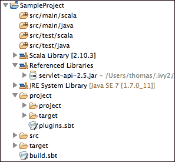
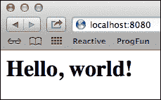
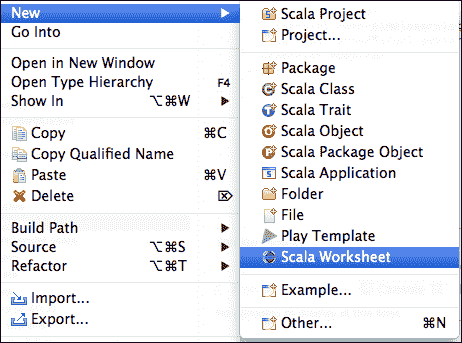
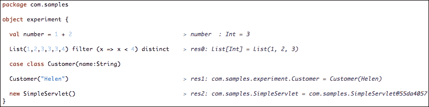
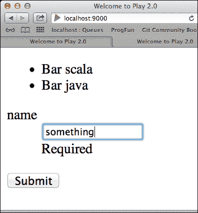
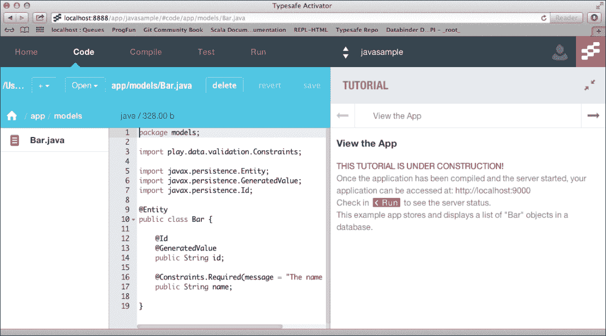

# 第三章。理解 Scala 生态系统

学习一门新语言也意味着熟悉一套新的框架和工具生态系统。好消息是，在 Scala 中，我们可以大量继承来自 Java 的非常丰富和成熟的工具和库集。在本章中，我们将介绍我们作为 Java 开发者已经熟悉的现有生态系统的重大新特性添加。

在本章中，我们将涵盖以下主题：

+   代码编辑环境——也称为 IDE

+   SBT——一个针对 Scala 的特定工具，用于构建、测试和执行代码

+   将实用工具作为插件集成到 SBT 中，以与 Java 生态系统集成

+   Scala Worksheets——一种新颖的交互式编程方法

+   使用 HTTP 和与外部基于 Web 的服务交互，包括介绍“for comprehensions”——一个有用的 Scala 构造

+   Typesafe Activator——一个方便的工具，可以快速启动项目

+   使用 Scala 进行脚本编写

# 继承 Java 集成开发环境（IDE）

Scala 支持所有三个主要的 Java 集成开发环境（IDE）：基于 Eclipse 的（包括所有不同版本的 Eclipse，Typesafe 自带的捆绑版本称为 Scala IDE，以及更多商业 IDE，如 SpringSourceSTS），IntelliJ IDEA 和 NetBeans。这意味着你可以像以前使用 Java 一样继续工作，例如，在 IDE 中运行 Scala JUnit 测试，直接调试或远程调试。在这些平台上扩展的 Scala 支持将为你提供非常有用的自动完成功能和编译器推断的各种类型的即时反馈。在第二章中，*代码集成*，我们主要使用 NetBeans，因为它有一个方便、小巧且现成的数据库和嵌入式工具，可以将此数据库逆向工程为 Java 的 RESTful API。由于 Eclipse 的使用目标受众更广，也是 Typesafe 提供支持的参考 IDE，因此我们将使用它作为以下章节的主要开发环境。

您可以从 [scala-ide.org](http://scala-ide.org) 网站下载并安装 Scala IDE for Eclipse，无论是支持 Scala 的捆绑版本还是 Scala 插件，都可以通过使用更新站点（就像您在 Java 中安装任何其他 Eclipse 插件到现有环境中所做的那样）。安装捆绑或插件版本的说明在此网站上解释得非常详细，所以我们不会花太多时间在这里重复这个过程。安装 IDEA 和 NetBeans 的说明分别可在 [`www.jetbrains.com/`](http://www.jetbrains.com/) 和 [`www.netbeans.org/`](http://www.netbeans.org/) 找到。

# 使用简单构建工具（SBT）进行构建

当处理 Scala 时，Java 生态系统的一个主要补充是 **Simple Build Tool**（**SBT**），这是一个用 Scala 编写的灵活的构建系统，它还驱动了我们在前几章中使用的 Typesafe Activator，以及我们将在本书后面部分介绍的 Play 框架。与 Java 环境中 Ant 和 Maven 使用的现有 XML 格式相比，SBT 构建定义是以 Scala 的形式编写的 **领域特定语言**（**DSL**），具有编译时检查的优势。正如我们将在本节中看到的那样，SBT 提供了许多额外的便利功能。除了基于 Ivy 的依赖管理能力以及支持 Maven 格式存储库之外，SBT 还提供增量编译和交互式外壳（即我们之前使用的 REPL）。它还支持持续测试和部署，并与许多 Scala 测试框架集成，使其成为 Scala 社区的实际构建工具。

## 开始使用 SBT

SBT 由一个单独的 `.jar` 存档以及一个非常小的启动脚本组成。因此，它可以在支持 JVM 的任何平台上安装和运行。安装说明可在 [`www.scala-sbt.org/`](http://www.scala-sbt.org/) 找到。

### 创建示例项目

一旦 SBT 被添加到你的路径中（在撰写本书时，我们使用了版本 0.13.0），在任何文件系统中创建一个名为 `SampleProject` 的目录，通过在终端窗口中输入以下命令：

```java
> cd <your_filesystem_dir> (e.g. /Users/Thomas/projects/)
> mkdir SampleProject
> cd SampleProject
> sbt
[info] Set current project to sampleproject
> set name := "SampleProject"
[info] Defining *:name
[info] ...
> session save

```

要结束 SBT 会话，请输入以下命令：

```java
> exit (or press CTRL-D)

```

这将在项目根目录下创建一个 `build.sbt` 文件。此文件收集有关项目的信息，即在 Java 世界中相当于 Maven 的 `.pom` 文件，但 `build.sbt` 编译成 Scala 而不是 XML。项目的整个文件结构将在稍后通过图表展示，一旦我们添加了一些库依赖项。

打开并编辑 `build.sbt` 以填写以下基本信息：

```java
name := "SampleProject"

version := "1.0"

scalaVersion := "2.10.3"
```

注意，每个陈述之间的额外空行很重要。`.sbt` 文件不是 Scala 程序；它们是一系列 Scala 表达式，其中空白行是这些表达式之间的分隔符。

在我们开始编写代码之前，我们将把我们的空项目导入到我们的 IDE 中。

### 在 Eclipse、IntelliJ IDEA 和 NetBeans 中导入项目

`sbteclipse` 插件可用于将纯 SBT 项目适配为 Eclipse 项目。你只需在 `project/` 目录下创建一个 `plugins.sbt` 文件，并将以下行输入到其中以导入 `sbteclipse` 插件：

```java
addSbtPlugin("com.typesafe.sbteclipse" % "sbteclipse-plugin" % "2.4.0")

```

之前给出的字符串是 SBT 中表达对 Maven 库依赖的一种方式；它相当于你通常会在 `pom` 文件中写入的内容：

```java
<groupId>com.typesafe.sbteclipse</groupId>
<artifactId>sbteclipse-plugin</artifactId>
<version>2.4.0</version>
```

你看，在 SBT 中下载库及其依赖项与使用 Maven 几乎相同；它们将从 Maven 仓库（Maven central 和一些其他常用仓库在 SBT 中默认引用；这就是为什么你不需要明确写出它们）中获取。

注意，最终你应该使用不同的版本号，因为这个插件随着时间的推移而演变。当前版本与插件文档一起在 [`github.com/typesafehub/sbteclipse`](https://github.com/typesafehub/sbteclipse) 中提供。

一旦 `SampleProject/project/plugins.sbt` 出现在你的项目中，你只需简单地执行以下命令即可生成一个 Eclipse 兼容的项目（仍然从项目的根目录开始）：

```java
> sbt eclipse
...
[info] Successfully created Eclipse project files for project(s):
[info] SampleProject

```

现在如果你还没有这样做，请启动你的 Eclipse IDE，然后选择 **文件** | **导入...**。导航到 **通用** | **将现有项目导入工作区**。浏览到你的项目根目录，就像在 Java 中做的那样，然后点击 **确定**。然后，点击 **完成** 以完成项目的导入，它将出现在 **项目资源管理器** 窗口中。

**IntelliJ** 也拥有其插件，可在 [`github.com/mpeltonen/sbt-idea`](https://github.com/mpeltonen/sbt-idea) 找到。

### 注意

注意，对于各种 IDE，有两个插件概念：**特定 IDE 的 SBT 插件**和**SBT 的 IDE 插件**。

sbteclipse、sbt-idea 和 nbsbt ([`github.com/dcaoyuan/nbscala/wiki/SbtIntegrationInNetBeans`](https://github.com/dcaoyuan/nbscala/wiki/SbtIntegrationInNetBeans)) 插件都是需要修改你的 `plugins.sbt` 文件的 SBT 插件。当你运行适当的 SBT 命令时，它们会生成用于 Eclipse、IntelliJ 或 NetBeans 的项目文件。当你更新你的 SBT 文件时，你可能需要重新运行插件以更新你的 IDE 配置。

然而，如果一个 IntelliJ 用户浏览可用的 IntelliJ 插件，那么他们将在那里看到一个不同的 Scala 插件（[`confluence.jetbrains.com/display/SCA/Scala+Plugin+for+IntelliJ+IDEA`](http://confluence.jetbrains.com/display/SCA/Scala+Plugin+for+IntelliJ+IDEA)）。这是一个 IntelliJ 的附加组件，而不是 SBT 的附加组件。它帮助 IntelliJ 自动配置其自身以适应 SBT 项目，无需修改你的 SBT 文件或额外的命令。这种方法在 IntelliJ 社区中可能更受欢迎。

如果你使用 Maven 和 Java 世界中的 Eclipse，那么这与 m2eclipse Eclipse 插件与 eclipse Maven 插件的故事大致相同。

与 Eclipse 类似，你应该在 `project/` 下的 `plugins.sbt` 文件中编辑，并将对 `sbt-idea` 插件的依赖项放置如下：

```java
addSbtPlugin("com.github.mpeltonen" % "sbt-idea" % "1.5.2")

```

创建 IntelliJ 兼容项目的命令如下：

```java
> sbt gen-idea

```

### 注意

值得注意的是，截至 IntelliJ IDEA 13，IDEA Scala 插件原生支持 SBT，无需外部插件即可工作。请参阅 IntelliJ 文档了解如何将 SBT 项目导入 IDE。

有时，插件的新版本尚未出现在默认的 Maven 存储库中。在这种情况下，您必须为 SBT 添加这样一个存储库，以便能够上传插件/库。您可以通过添加以下额外的行来完成此操作：

```java
resolvers += "Sonatype snapshots" at "http://oss.sonatype.org/content/repositories/snapshots/"

addSbtPlugin("com.github.mpeltonen" % "sbt-idea" % "1.6.0-SNAPSHOT")
```

自从 Scala 版本 2.10+以来，NetBeans 也有其插件：

```java
addSbtPlugin("org.netbeans.nbsbt" % "nbsbt-plugin" % "1.0.2")

```

该插件本身可以从 GitHub 存储库下载和构建，如下所示：

```java
> git clone git@github.com:dcaoyuan/nbsbt.git
> cd nbsbt
> sbt clean compile publish-local

```

`publish-local`命令将在您的文件系统上本地部署它。然后，使用以下命令创建您项目的文件：

```java
> sbt netbeans

```

我们将继续本章，采用 Eclipse 作为我们的 IDE，但大多数工具也应该在其他 IDE 下工作。此外，如果您需要与其他编辑器（如 ENSIME 和 Sublime Text）的额外集成，请浏览[`www.scala-sbt.org`](http://www.scala-sbt.org)的文档。

一旦项目被导入到 Eclipse 中，您会注意到文件结构与 Maven 项目相同；源文件有默认目录`src/main/scala`和`src/test/scala`，这与 Java 的结构也相同。

### 在 servlet 容器上运行的 Web 应用创建

在可用的 SBT 插件日益增长列表中，xsbt-web-plugin（可在[`github.com/JamesEarlDouglas/xsbt-web-plugin`](https://github.com/JamesEarlDouglas/xsbt-web-plugin)找到）是一个有用的插件，用于创建在 servlet 容器（如 Jetty）上运行的传统的 Web 应用。至于我们之前看到的插件，安装只需在`plugins.sbt`文件中添加一行，如下所示：

```java
addSbtPlugin("com.earldouglas" % "xsbt-web-plugin" % "0.4.2")

```

然后，将以下行添加到`build.sbt`文件中：

```java
seq(webSettings :_*)

```

我们还需要将 Jetty 包含在容器类路径中，如下所示：

```java
libraryDependencies += "org.mortbay.jetty" % "jetty" % "6.1.22" % "container"

```

整个最小`build.sbt`文件如下总结：

```java
name := "SampleProject"

organization := "com.samples"

version := "1.0"

scalaVersion := "2.10.3"

seq(webSettings :_*)

libraryDependencies += "org.mortbay.jetty" % "jetty" % "6.1.22" % "container"

libraryDependencies += "javax.servlet" % "servlet-api" % "2.5" % "provided"
```

由于我们已经更新了构建文件中的新依赖项，我们需要重新运行`sbteclipse`来更新项目的 Eclipse 文件。此操作可以通过从 SBT 命令提示符重新进入来实现：

```java
> eclipse

```

现在，让我们在 IDE 中用 Scala 编写一个微型的 servlet，以展示我们的简单示例逻辑，它模仿 Java 语法。在**包资源管理器**窗口中右键单击项目根目录，选择**刷新**以确保新依赖项被获取。项目的整个结构如下截图所示：



我们现在可以在`src/main/scala`（在一个新的`com.samples`包中）下开始编辑一个新的 Scala 文件，如下所示：

```java
package com.samples
import scala.xml.NodeSeq
import javax.servlet.http._

class SimpleServlet extends HttpServlet {
  override def doGet(request: HttpServletRequest, response: HttpServletResponse) {

    response.setContentType("text/html")
    response.setCharacterEncoding("UTF-8")

    val responseBody: NodeSeq =
      <html><body><h1>Hello, world!</h1></body></html>

    response.getWriter.write(responseBody.toString)
  }
}
```

最后，我们需要添加一个`web.xml`文件，就像我们在 Java 中通常所做的那样，以配置 servlet 部署（应放在`src/main/webapp/WEB-INF`目录下），如下所示：

```java
<?xml version="1.0" encoding="UTF-8"?>
<web-app

xsi:schemaLocation="http://java.sun.com/xml/ns/javaee http://java.sun.com/xml/ns/javaee/web-app_2_5.xsd"
version="2.5">
  <servlet>
    <servlet-name>simpleservlet</servlet-name>
    <servlet-class>com.samples.SimpleServlet</servlet-class>
  </servlet>
  <servlet-mapping>
    <servlet-name>simpleservlet</servlet-name>
    <url-pattern>/*</url-pattern>
  </servlet-mapping>
</web-app>
```

从项目根目录开始，在我们的命令提示符中，我们现在可以调用 `sbt` 来部署和执行我们在 Jetty 容器中的小示例，如下所示：

```java
> sbt
> container:start
2014-03-15 14:33:18.880:INFO::Logging to STDERR via org.mortbay.log.StdErrLog
[info] jetty-6.1.22
[info] NO JSP Support for /, did not find org.apache.jasper.servlet.JspServlet
[info] Started SelectChannelConnector@0.0.0.0:8080
[success] Total time: 20 s, completed Mar 15, 2014 2:33:19 PM
>

```

默认情况下，容器将在本地的 8080 端口上监听。

现在，你可以在网页浏览器中打开 `http://localhost:8080/` 并验证是否得到以下截图所示的 Hello, world! 消息：



你也可以从 SBT 运行 `package` 命令，这将组装一个 `.war` 归档并将其放置在 `target/scala-2.10/sampleproject_2.10-1.0.war` 下，如下所示：

```java
> package

```

## 使用 sbt-assembly 构建单个 .jar 归档

sbt-assembly 插件可以将你的项目代码及其依赖项收集到一个单独的 `.jar` 文件中，该文件可以发布到仓库或部署到其他环境中。

安装插件包括将 sbt-assembly 添加为 `project/assembly.sbt` 中的依赖项（从 SBT 0.13 开始），如下所示：

```java
addSbtPlugin("com.eed3si9n" % "sbt-assembly" % "0.11.2")

```

要在 SBT 中运行 assembly 命令，你只需在项目根目录下创建一个 `assembly.sbt` 文件，如下代码片段所示：

```java
import AssemblyKeys._ // put this at the top of the file

assemblySettings
// your assembly settings here
```

有关汇编设置的文档请参阅 [`github.com/sbt/sbt-assembly`](https://github.com/sbt/sbt-assembly)。它们允许你修改，例如，`jarName` 或 `outputPath` 变量，以及在汇编阶段跳过测试或显式设置主类，如果你希望创建可运行的 `.jar` 文件的话。

## 使用 Scalariform 格式化代码

自动代码格式化是一个有用的功能，不仅因为它能够将相同的格式化规则应用于由不同个人编写的代码，而且还使差异在源管理工具中更加一致。

Scala IDE for Eclipse 使用 Scalariform 作为其代码格式化工具，该工具也作为 sbt-plugin 插件提供，可以添加到 `plugins.sbt` 文件中，如下所示：

```java
addSbtPlugin("com.typesafe.sbt" % "sbt-scalariform" % "1.2.0")

```

一旦设置好，Scalariform 将在运行 SBT 中的 `compile` 或 `test:compile` 时自动格式化你的源代码。

在 Eclipse 中，格式化代码的方式与 Java 相同，即右键单击编辑器，然后导航到 **源** | **格式化**（或 *Ctrl* + *Shift* + *F*）。

# 尝试 Scala 工作表

在前面的章节中，我们曾将 REPL 作为交互式环境运行，以便在输入 Scala 语法时进行实验并获得即时反馈。这使我们能够非常快速地编写一些小算法，并得到正确的语法使事物工作。尽管 SBT 控制台为程序员提供了一个 `:replay` 命令来重新运行会话中已经编写的内容，但能够将我们的实验保存下来以供以后使用，作为我们项目的一部分，岂不是更好？这正是 **Scala 工作表** 的全部意义。

Scala 工作表是 Scala 对 Eclipse 支持的独特功能，它带来一个交互式环境，即在项目上下文中的 REPL。此功能现在也适用于 Scala 对 IntelliJ 的支持。

让我们去我们的 Eclipse 中的小型 servlet 示例中尝试一下。

要启动工作表，右键单击任何包或源文件，然后导航到**新建** | **Scala 工作表**（如果不在下拉列表中，导航到**其他...** | **Scala 向导** | **Scala 工作表**），如下面的截图所示：



例如，我们将选择当前的`com.samples`包。点击**下一步**并为你的工作表输入一个名称：`experiment`。

这将创建一个名为`experiment.sc`的文件，它保存在源代码中，但由于它不是一个`.scala`文件，因此它不会与我们的当前代码库冲突，也不会出现在部署的`.jar`归档中。

默认页面看起来像以下代码片段：

```java
packagecom.samples

object experiment {
  println("Welcome to the Scala worksheet")       > Welcome to the Scala worksheet
}
```

每个语句后面的`>`符号之后的内容是评估的结果，一旦你保存 Worksheet 文件，这些结果就会被（重新）评估。你可以尝试一些语句，例如，通过替换`println`语句为几行，如下所示：

```java
object experiment {

  val number = 1 + 2

  List(1,2,3,3,3,4) filter (x => x < 4) distinct

  case class Customer(name:String)

  Customer("Helen")

  new SimpleServlet() 
}
```

一旦你保存它（*Ctrl* + *S*），样式表将在右侧显示语句评估，如下面的截图所示：



# 使用 HTTP 进行工作

由于 Scala 可以导入和调用 Java 类，也可以扩展它们，因此 Scala 生态系统中的许多库只是建立在强大且成熟的 Java 库之上的一个薄层，要么提供额外的功能，要么通过添加一些语法糖来简化它们的用法。

这样的例子之一是 Scala 分发库（可在[`dispatch.databinder.net/Dispatch.html`](http://dispatch.databinder.net/Dispatch.html)找到），这是一个基于 Apache 强大 HttpClient 的 HTTP 交互的有用库。让我们在 REPL 中运行一个小型的分发会话。

由于分发是一个外部库；我们首先需要将其导入到我们的 SBT 项目中，以便能够在 REPL 控制台中使用它。将分发依赖项添加到`SampleProject`的`build.sbt`文件中，使其看起来像以下代码片段（确保在`build.sbt`中的语句之间有一个空白行）：

```java
name := "SampleProject"
…

libraryDependencies += "net.databinder.dispatch" %% "dispatch-core" % "0.11.0"
```

重新启动 REPL 以使库可用，并按以下方式将它们导入会话中：

```java
scala> import dispatch._, Defaults._
import dispatch._
import Defaults._

```

让我们向在线地理位置服务发送一个基本请求，其中 REST API 是一个简单的`GET`请求到`freegeoip.net/{format}/{ip_or_hostname}` URL，如下所示：

```java
scala> val request = url("http://freegeoip.net/xml/www.google.com")
request: dispatch.Req = Req(<function1>)

```

现在，我们将通过 HTTP 发送`GET`请求，并将响应作为字符串接收（将 XML 包装起来，这是我们要求的服务响应格式）：

```java
scala> val result = Http( request OK as.String)
result: dispatch.Future[String] = scala.concurrent.impl.Promise$DefaultPromise@22aeb07c

```

注意到解释器返回的`dispatch.Future[String]`的结果类型。之前版本的 dispatch 是同步的（并且仍然在`dispatch-classic`库名下可用），但最新版本，如我们正在使用的版本，处理现代开发实践，即异步。我们将在第八章中学习异步 Scala 代码，*现代应用程序的基本属性 – 异步和并发*，但与 Java 类似，`Future`充当一个不阻塞的计算占位符。这意味着我们可以在等待变量填充之前继续程序的流程，这在调用可能长时间运行的方法调用（如 REST 服务）时非常方便。然而，请注意，这里的`dispatch.Future`与 Java 标准库中的`java.util.concurrent.Future`是不同的实现。

要读取和显示我们的 HTTP 请求的结果，我们只需输入以下命令行：

```java
scala> val resultAsString = result()
resultAsString: String = 
"<?xml version="1.0" encoding="UTF-8"?>
 <Response>
 <Ip>74.125.225.114</Ip>
 <CountryCode>US</CountryCode>
 <CountryName>United States</CountryName>
 <RegionCode>CA</RegionCode>
 <RegionName>California</RegionName>
 <City>Mountain View</City>
 <ZipCode>94043</ZipCode>
 <Latitude>37.4192</Latitude>
 <Longitude>-122.0574</Longitude>
 <MetroCode>807</MetroCode>
 <AreaCode>650</AreaCode>
</Response>
"

```

在这里调用`result()`实际上是调用`result.apply()`方法的语法糖，这是一种在许多情况下使代码看起来优雅的便捷方式。

Dispatch 提供了许多处理请求和响应的方式，例如添加头和参数，以及将响应作为 XML 或 JSON 处理，分割成两个不同的处理器或处理流。为了展示这些行为，我们将以调用另一个在线服务为例，即**Groupon**服务。Groupon 是一个提供折扣券的服务，当你在各种类别中购买产品或服务（如假期、美容产品等）时，可以提供折扣券。Groupon API 可以查询以收集由城市或坐标（纬度和经度）确定的地理位置内的提供信息。

为了能够实验 API，在注册到[`www.groupon.com/pages/api`](http://www.groupon.com/pages/api) URL 后，你应该获得一个唯一的`client_id`密钥，该密钥用于验证你，并且每次调用 API 时都必须传递。让我们在 REPL 中演示这一点：

```java
scala> val grouponCitiesURL = url("http://api.groupon.com/v2/divisions.xml?client_id=<your own client_key>")
grouponCitiesURL: dispatch.Req = Req(<function1>)
scala> val citiesAsText = Http(grouponCitiesURL OK as.String)
citiesAsText: dispatch.Future[String] = scala.concurrent.impl.Promise$DefaultPromise@4ad28057
scala> citiesAsText()
res0: String = <response><divisions><division><id>abbotsford</id><name>Abbotsford</name><country>Canada</country><timezone>Pacific Time (US &amp; Canada)</timezone>...

```

REPL 限制了输出的数量以获得更好的可读性。而不是将响应作为字符串获取，让我们将其作为 XML 处理：

```java
scala> val citiesAsXML = Http(grouponCitiesURL OK as.xml.Elem)
citiesAsXML: dispatch.Future[scala.xml.Elem] = scala.concurrent.impl.Promise$DefaultPromise@27ac41a3
scala> citiesAsXML()
res1: scala.xml.Elem = <response><divisions><division><id>abbotsford</id><name>Abbotsford</name><country>Canada</country><timezone>Pacific Time (US &amp; Canada)</timezone>...

```

这次我们的结果是更结构化的，因为它被表示为一个 XML 树。我们可以通过应用一个`PrettyPrinter`对象来以更好的格式打印它，该对象将输出宽度限制在 90 个字符，缩进为 2：

```java
scala> def printer = new scala.xml.PrettyPrinter(90, 2)
printer: scala.xml.PrettyPrinter
scala> for (xml <- citiesAsXML)
 println(printer.format(xml))
scala> <response>
 <divisions>
 <division>
 <id>abbotsford</id>
 <name>Abbotsford</name>
 <country>Canada</country>
 <timezone>Pacific Time (US &amp; Canada)</timezone>
 <timezoneOffsetInSeconds>-25200</timezoneOffsetInSeconds>
 <timezoneIdentifier>America/Los_Angeles</timezoneIdentifier>
 <lat>49.0568</lat>
 <lng>-122.285</lng>
 ...
 </division>
 <division>
 <id>abilene</id>
 <name>Abilene, TX</name>
 <country>USA</country>
 <timezone>Central Time (US &amp; Canada)</timezone>...

```

从我们的 XML 结构中提取部分信息可以通过应用`map`转换，包括 XPath 表达式来实现。XPath 表达式对于在 XML 元素间导航以保留相关部分非常有用。我们可以逐步提取 XML 片段，并将它们作为`Lists`或`Seqs`（序列）等集合返回，如下面的代码片段所示：

```java
scala> val cityDivisions = citiesAsXML() map ( city => city \\ "division")
cityDivisions: scala.collection.immutable.Seq[scala.xml.NodeSeq] = List(NodeSeq(<division><id>abbotsford</id><name>Abbotsford</name><country>Canada</country>...
scala> val cityNames = 
 cityDivisions map ( div => (div \ "name").text)
cityNames: scala.collection.immutable.Seq[String] = List(AbbotsfordAbilene, TXAkron / CantonAlbany / Capital RegionAlbuquerqueAllentown...

```

这里，我们得到了一个城市名称序列，这些城市有优惠券可用。

## Scala 的 for comprehension

与在 Scala 中应用连续的 `map` 转换以提取 XML 不同，我们可以使用一个强大的结构，称为 `for comprehension` 或 `for expression`，它是迭代的银弹。与在 Java 中找到并用于迭代的 `for` 循环不同，`for comprehension` 返回一个结果。它们如下指定：

```java
for (sequence) yield expression
```

在上述代码中，`sequence` 可以包含以下组件：

+   **生成器**：它们驱动迭代，如下所示：

    ```java
    element <- collection
    ```

    就像 Java 循环一样，`element` 代表绑定到迭代当前元素的局部变量，而 `collection` 代表要迭代的集合。此外，第一个生成器（至少需要有一个）决定了结果类型。例如，如果输入集合是 `List` 或 `Vector`，则 `for comprehension` 将分别产生 `List` 或 `Vector`。

+   **过滤器**：它们控制迭代，如下所示：

    ```java
    if expression
    ```

    前面的表达式必须评估为布尔值。过滤器可以定义在生成器所在的同一行，也可以单独定义。

+   **定义**：它们是局部变量定义，如下所示：

    ```java
    variable = expression
    ```

    它们是中间值，可以有助于计算结果。

使用几个具体的例子，`for comprehension` 结构更容易可视化：

```java
scala> for {
 elem <- List(1,2,3,4,5)
 } yield "T" + elem
res3: List[String] = List(T1, T2, T3, T4, T5)

```

我们仅使用一个生成器就将 `List[Int]` 转换成了 `List[String]`。使用两个生成器的示例如下所示：

```java
scala> for {
 word <- List("Hello","Scala")
 char <- word
 } yield char.isLower
res4: List[Boolean] = List(false, true, true, true, true, false, true, true, true, true)

```

我们可以在任何生成器上添加过滤器。例如，如果我们只想保留每个单词的大写字母，我们可以这样写：

```java
scala> for {
 word <- List("Hello","Scala")
 char <- word if char.isUpper
 } yield char
res5: List[Char] = List(H, S)

```

在以下示例中，我们说明了如何添加局部变量定义：

```java
scala> for {
 word <- List("Hello","Scala")
 char <- word
 lowerChar = char.toLower
 } yield lowerChar
res6: List[Char] = List(h, e, l, l, o, s, c, a, l, a)

```

回到我们的 HTTP Groupon 服务，我们现在可以使用 `for comprehension` 提取城市名称，如下所示：

```java
scala> def extractCityNames(xml: scala.xml.Elem) = 
 for {
 elem <- xml \\ "division"
 name <- elem \ "name"
 } yield name.text
extractCityNames: (xml: scala.xml.Elem)scala.collection.immutable.Seq[String]
scala> val cityNames = extractCityNames(citiesAsXML())
cityNames: scala.collection.immutable.Seq[String] = List(Abbotsford, Abilene, TX, Akron / Canton, Albany / Capital Region, Albuquerque, Allentown / Reading, Amarillo, Anchorage...

```

为了能够查询 API 的第二部分以检索特定区域的特殊折扣优惠，我们还需要从查询的城市中获取经纬度信息。让我们通过返回一个包含三个元素的元组来完成这个操作，第一个元素是名称，第二个元素是纬度，第三个元素是经度：

```java
scala> def extractCityLocations(xml: scala.xml.Elem) = 
 for {
 elem<- xml \\ "division"
 name <- elem \ "name"
 latitude <- elem \ "lat"
 longitude <- elem \ "lng"
 } yield (name.text,latitude.text,longitude.text)
extractCityLocations: (xml: scala.xml.Elem)scala.collection.immutable.Seq[(String, String, String)]
scala> val cityLocations = extractCityLocations(citiesAsXML())
cityLocations: scala.collection.immutable.Seq[(String, String, String)] = List((Abbotsford,49.0568,-122.285), (Abilene, TX,32.4487,-99.7331), (Akron / Canton,41.0814,-81.519), (Albany / Capital Region,42.6526,-73.7562)...

```

在返回的城市列表中，我们可能现在只对其中一个感兴趣。让我们使用以下命令检索檀香山的地理位置：

```java
scala> val (honolulu,lat,lng) = cityLocations find (_._1 == "Honolulu") getOrElse("Honolulu","21","-157")
honolulu: String = Honolulu
lat: String = 21.3069
lng: String = -157.858

```

上述代码中的 `find` 方法接受一个谓词作为参数。由于其返回类型是 `Option` 值，我们可以通过调用 `getOrElse` 来检索其内容，在 `find` 方法不返回任何匹配项的情况下，我们可以在这里写入默认值。

可以使用模式匹配来表示另一种表示形式，这在 第一章 中简要描述，即 *在项目中交互式编程*，如下所示：

```java
scala> val honolulu =
 cityLocations find { case( city, _, _ ) => 
 city == "Honolulu"
 }
honolulu: Option[(String, String, String)] = Some((Honolulu,21.3069,-157.858))

```

模式匹配的常规语法通常在所有 `case` 选项之前使用 `match` 关键字，所以这里是一个简化的表示，其中 `match` 关键字是隐式的。下划线（`_`）以及 `case` 中给出的 `city` 变量在模式匹配中是通配符。我们本可以给这些下划线变量命名，但这是不必要的，因为我们没有在谓词中使用它们（即 `city == "Honolulu"`）。

现在让我们创建一个请求来查询所有匹配特定地理区域的交易：

```java
scala> val dealsByGeoArea =   url("http://api.groupon.com/v2/deals.xml?client_id=<your client_id>")
dealsByGeoArea: dispatch.Req = Req(<function1>)

```

处理数据作为元组的一个替代方案是定义案例类以方便和可重用地封装元素。因此，我们可以定义一个 `Deal` 类，并重写我们之前的 `for comprehension` 语句，返回 `Deal` 实例而不是元组：

```java
scala> case class Deal(title:String = "",dealUrl:String = "", tag:String = "")
defined class Deal

scala> def extractDeals(xml: scala.xml.Elem) = 
 for {
 deal <- xml \\ "deal"
 title = (deal \\ "title").text
 dealUrl = (deal \\ "dealUrl").text
 tag = (deal \\ "tag" \ "name").text
 } yield Deal(title, dealUrl, tag)
extractDeals: (xml: scala.xml.Elem)scala.collection.immutable.Seq[Deal]

```

正如我们之前用于检索城市一样，我们现在可以通过 HTTP GET 获取交易，这次解析特定城市的 XML，比如檀香山，知道它的纬度和经度，如下所示：

```java
scala> val dealsInHonolulu = 
 Http(dealsByGeoArea <<? Map("lat"->lat,"lng"->lng) OK as.xml.Elem)
dealsInHonolulu: dispatch.Future[scala.xml.Elem] = scala.concurrent.impl.Promise$DefaultPromise@a1f0cb1

```

`<<?` 操作符表示我们将 `GET` 方法的输入参数附加到 `dealsByGeoArea` 请求中。`Map` 对象包含这些参数。这相当于 HTTP GET 的常规表示，我们将输入参数作为键/值对放在 URL 中（即 `request_url?param1=value1;param2=value2`）。这与 `<<` 操作符形成对比，后者会指定一个 `POST` 请求。从 `dealsInHonolulu()` 服务调用产生的原始 XML 中创建一个结构化的 `Deal` 实例序列可以写成如下：

```java
scala> val deals = extractDeals(dealsInHonolulu())
deals: scala.collection.immutable.Seq[Deal] = List(Deal(Laundry Folding StylesExam with Posture Analysis and One or Three Adjustments at Cassandra Peterson Chiropractic (Up to 85% Off)One initial consultation, one exam, one posture analysis, and one adjustmentOne initial consultation, one exam, one posture analysis, and three adjustments,http://www.groupon.com/deals/cassandra-peterson-chiropractic,Beauty & Spas), Deal(Laundry Folding Styles1.5-Hour Whale-Watching Sunset Tour for an Adult or Child from Island Water Sports Hawaii (50% Off) A 1.5-hour whale watching sunset tour for one childA 1.5-hour whale watching sunset tour for one adult,http://www.groupon.com/deals/island-water-sports-hawaii-18,Arts and EntertainmentOutdoor Pursuits), Deal(Dog or Horse?$25 for Take-Home Teeth-Whit...

```

按类别对交易列表进行排序只是对集合应用 `groupBy` 方法的问题，如下所示：

```java
scala> val sortedDeals = deals groupBy(_.tag)
sortedDeals: scala.collection.immutable.Map[String,scala.collection.immutable.Seq[Deal]] = Map("" -> List(Deal(SkeleCopSix Bottles of 3 Wine Men 2009 Merlot with Shipping Included6 Bottles of Premium Red Wine,http://www.groupon.com/deals/gg-3-wine-men-2009-merlot-package,), Deal(Famous...

```

注意到 `groupBy` 方法是应用在集合上的 **MapReduce** 作业的 `Map` 部分的一个非常方便的方法，在我们的例子中，创建一个 `Map` 对象，其中键是 Groupon 交易的标签或类别，值是特定类别所属的交易列表。对 `Map` 对象的可能的小型 `Reduce` 操作可以包括使用 `mapValues` 方法来转换这个（键，值）存储的值，从而计算每个类别的交易数量：

```java
scala> val nbOfDealsPerTag = sortedDeals mapValues(_.size)
nbOfDealsPerTag: scala.collection.immutable.Map[String,Int] = Map("" -> 2, Arts and EntertainmentOutdoor Pursuits -> 1, Beauty & Spas ->3, Food & DrinkCandy Stores -> 1, ShoppingGifts & Giving -> 1, ShoppingFraming -> 1, EducationSpecialty Schools -> 1, Tickets -> 1, Services -> 1, TravelTravel AgenciesEurope, Asia, Africa, & Oceania -> 1)

```

我们刚才的例子只探索了我们可以用 HTTP 工具（如 dispatch）做什么的表面，更多内容可以在它们的文档中找到。与 REPL 的直接交互极大地增强了此类 API 的学习曲线。

处理 HTTP 交互的轻量级框架有很多优秀的替代方案，在派发的情况下，我们只看了客户端的事情。因此，可以通过 Unfiltered、Finagle、Scalatra 或 Spray 等框架构建轻量级 REST API（仅举几个例子）。Spray 目前正在重新设计，以成为 Play 框架（基于 Akka）的 HTTP 层；我们将在本书后面的章节中介绍这些技术。

# 利用 Typesafe Activator

为了能够在前面的章节中运行交互式编程会话，我们已经下载并安装了一个名为**Typesafe Activator**的工具。无论是作为命令行工具还是通过网页浏览器运行，激活器都允许我们从一个模板中创建和执行一个示例项目，在这种情况下，是一个最小的`hello-scala`项目。从中，我们访问了 SBT 控制台，它充当 REPL。

Typesafe Activator 可以被视为由 SBT 驱动的轻量级 IDE。它提供了许多项目模板，程序员可以将它们作为新开发项目的起点进行重用。

## 基于激活器模板创建应用程序

打开一个命令终端窗口，转到你提取激活器的目录，然后输入以下命令：

```java
> ./activator new
Enter an application name
>

```

你需要按照以下方式输入你新项目的名称：

```java
> javasample
Fetching the latest list of templates...
Enter a template name, or hit tab to see a list of possible templates
> [Hit TAB]
activator-akka-cassandra                  activator-akka-spray
activator-play-autosource-reactivemongo   activator-scalding
activator-spray-twitter                   akka-callcenter
akka-cluster-sharding-scalaakka-clustering
akka-distributed-workers     akka-distributed-workers-java
akka-java-spring                          akka-sample-camel-java
akka-sample-camel-scalaakka-sample-cluster-java
akka-sample-cluster-scalaakka-sample-fsm-java-lambda
akka-sample-fsm-scalaakka-sample-main-java
akka-sample-main-scalaakka-sample-multi-node-scala
akka-sample-persistence-java   akka-sample-persistence-scala
akka-sample-remote-java                   akka-sample-remote-scala
akka-scala-spring                         akka-supervision
angular-seed-play                         atomic-scala-examples
dart-akka-spray                           eventual
hello-akka                                hello-play
hello-play-backbone                       hello-play-java
hello-play-scala                          hello-sbt
hello-scala                               hello-scala-eclipse
hello-scaloid                             hello-slick
just-play-scalamacwire-activator
matthiasn-sse-chat-template               modern-web-template
play-akka-angular-websocket               play-angularjs-webapp-seed
play-cake                                 play-example-form
play-guice                                play-hbase
play-java-spring                          play-mongo-knockout
play-scalatest-subcut                     play-slick
play-slick-advanced                       play-spring-data-jpa
play-sqlite                               play-with-angular-requirejs
play-yeoman                               play2-crud-activator
reactive-maps                             reactive-stocks
realtime-search                           scala-phantom-types
scaldi-play-example                    scalikejdbc-activator-template
six-minute-apps                           slick-android-example
slick-codegen-customization-example       slick-codegen-example
slick-plainsql                            spray-actor-per-request
tcp-async                                 template-template
test-patterns-scala                       tweetmap-workshop

```

我们正在使用的 1.0.13 版本已经包含了 76 个模板，这些模板结合了不同的技术和框架，以创建一些有趣的演示项目，但这个列表正在迅速增长（从 1.0.0 版本到 1.0.13 版本，这两个版本之间只相隔几个月，从 38 个增加到 76 个）。

现在，让我们看看`play-java-spring`模板，这是一个 Java 项目样本，这样我们就可以熟悉其中包含的代码。因此，当提示输入要使用的模板名称时，输入其名称：

```java
> play-java-spring
OK, application "javasample" is being created using the "play-java-spring" template.

To run "javasample" from the command-line, run:
/Users/thomas/scala/activator-1.0.13/javasample/activator run

To run the test for "javasample" from the command-line, run:
/Users/thomas/scala/activator-1.0.13/javasample/activator test

To run the Activator UI for "javasample" from the command-line, run:
/Users/thomas/scala/activator-1.0.13/javasample/activator ui

```

激活器创建了一个 SBT 项目，这意味着你可以编辑`build.sbt`或`plugins.sbt`来添加依赖项、仓库（即，解析器）以及 SBT 插件。例如，我们可以重用之前在`plugins.sbt`中提到的`addSbtPlugin("com.typesafe.sbteclipse" % "sbteclipse-plugin" % "2.4.0")`行，以便能够创建 Eclipse 项目文件并将项目导入我们的 Scala IDE。

首先，让我们执行程序来看看它做了什么：

```java
> cd javasample
> ./activator run

```

由于示例基于 Play 框架（我们将在后面的章节中介绍），以下显示表明 Web 应用程序已部署在本地主机的 9000 端口：

```java
--- (Running the application from SBT, auto-reloading is enabled) ---
[info] play - Listening for HTTP on /0:0:0:0:0:0:0:0:9000
(Server started, use CTRL +D to stop and go back to the console...)

```

在本地主机 9000 上打开浏览器，以可视化示例的基本 Web 表单，并提交一些条目以存储在小型数据库中，如下面的截图所示：



这个 Web 应用程序从简单的 HTML 表单中获取输入，并通过 JPA 将`Bar`对象保存到小型数据库中。

要查看此模板中包含的代码，我们可以通过在命令窗口中首先按*Ctrl* + *D*来中断当前执行，然后输入以下命令：

```java
> ./activator ui

```

几秒钟后，浏览器页面应该会在`http://localhost:8888/app/javasample/`打开，显示专门针对此应用程序的激活器用户界面。点击**代码视图 & 在 IDE 中打开**项，通过在左侧面板上双击项目来导航到`app/models/Bar.java`文件，如下面的截图所示：



浏览器显示了一个 JPA 注解的实体，正如我们通常在 Eclipse IDE 中使用彩色和格式化的语法进行工作一样。右侧的面板为教程留出了空间，这是一个快速理解代码并开始修改它的宝贵功能。顶部菜单允许你在浏览器中编译、运行或测试应用程序。你可以打开其他一些源文件来识别代码的结构，尽管我们将在稍后详细介绍 Play Web 应用程序。

总结来说，Typesafe Activator 是一种只需几分钟就能让你开始使用的方法，并且非常灵活，因为你可以直接将 activator 项目作为 SBT 项目运行，因此，如果你愿意，有生成 IDE 特定文件以在 Eclipse、IDEA 或 NetBeans 中继续工作的可能性。

# REPL 作为脚本引擎

为了处理与用脚本语言编写的程序之间的互操作性，Java 社区流程定义了*JSR-223*，*JavaTM 平台脚本*，这是一个 Java 规范请求，使得在 Java 程序中执行用其他语言（如 Groovy、JavaScript、Ruby 或 Jython 等）编写的脚本成为可能。例如，我们可以编写一个嵌入基本 JavaScript 片段的 Java 程序，如下所示：

```java
package com.demo;
import javax.script.*;

public class JSR223Sample { 

  public static void main(String[] args) throws Exception {
    ScriptEngineManager manager = new ScriptEngineManager();
    ScriptEngine engine = manager.getEngineByName("JavaScript");

    // expose object as variable to script
    engine.put("n", 5);

    // evaluate a script string. 
    engine.eval("for(i=1; i<= n; i++) println(i)");
  }
}
```

我们将在 IDE 中获得以下输出：

```java
run:
1
2
3
4
5
BUILD SUCCESSFUL (total time: 0 seconds)

```

从 Scala 即将推出的 2.11 版本开始，这个非常方便的功能将允许你解释用 Scala 编写的脚本。以下是一个可以直接在 REPL 中运行的示例（摘自[scala-lang.org](http://scala-lang.org)文档）：

```java
scala> import javax.script.ScriptEngineManager
importjavax.script.ScriptEngineManager
scala> val engine = 
 new ScriptEngineManager().getEngineByName("scala")
engine: javax.script.ScriptEngine = scala.tools.nsc.interpreter.IMain@7debe95d
scala> engine.put("n", 5)
n: Object = 5
scala> engine.eval("1 to n.asInstanceOf[Int] foreachprintln")
1
2
3
4
5
res4: Object = null

```

引擎上下文可以将`n`变量绑定到整数值`5`，这可以在由`foreach` lambda 表达式组成的单行脚本中调用。在这种情况下，脚本只是一个副作用，不返回任何有趣的价值。

# 摘要

在本章中，我们介绍了一些 Java 和 Scala 生态系统之间的主要差异，并注意到，除了 SBT 和 REPL（在 Java 世界中找不到）之外，我们能够重用所有 Java 库、工具和框架。我们了解到，用于在 SBT 中加载依赖项的`group % artifact % version`格式与 Java 的 Maven 相同，实际上，SBT 默认情况下与大多数 Maven 仓库（例如 Maven Central）相似。因此，我们可以有信心，我们的大部分 Java 技能都是可重用的，并且至少在生态系统方面使过渡变得更容易。我们自愿省略了关于测试生态系统的讨论，因为这将是我们下一章的主要内容。
