# 第五章. Play 框架入门

本章开始了我们在 Scala 中进行 Web 开发的旅程。Web 开发已经成为一个选择架构和框架非常多的领域。找到合适的工具并不总是件简单的事，因为它涵盖了从传统的 Java EE 或 Spring 基础架构风格到更近期的类似 Ruby on Rails 的方法。大多数现有的解决方案仍然依赖于采用 servlet 容器模型，无论它们使用的是轻量级容器如 Jetty/Tomcat，还是支持 **EJBs**（**企业 JavaBeans**）如 JBoss、Glassfish、WebSphere 或 WebLogic。许多在线文章和会议演讲都试图比较一些替代方案，但随着这些框架的快速发展以及有时关注不同的方面（如前端与后端），编制一个公平准确的列表仍然很困难。在 Scala 世界中，创建 Web 应用的替代方案从轻量级框架如 Unfiltered、Spray 或 Scalatra 到功能齐全的解决方案如 Lift 或 Play 框架都有。

我们选择专注于 Play 框架，因为它包含了我们认为对可维护的现代软件开发至关重要的重要特性。Play 框架的一些优点包括：

+   Play 框架可扩展且稳健。它能够处理大量负载，因为它建立在完全异步模型之上，该模型基于能够处理多核架构的技术，如 Akka，这是一个用于构建并发和分布式应用的框架，我们将在第八章《现代应用的基本特性 – 异步性和并发性》中进行介绍。

+   通过提高易用性，推广**DRY**（即**不要重复自己**）原则，并利用 Scala 的表达性和简洁性，它为我们提供了增强的开发者生产力。除此之外，Play 的击中刷新工作流程，通过简单地刷新浏览器即可获得对所做更改的即时反馈，与 Java servlet 和 EJB 容器的较长的部署周期相比，这实际上提高了生产力。

+   它与基于 JVM 的现有基础设施遗产具有良好的集成。

+   它与现代客户端开发趋势具有良好的集成，这些趋势高度依赖于 JavaScript/CSS 及其周边生态系统，包括 AngularJS 或 WebJars 等框架。此外，Play 框架还支持**LESS**（即**更简洁的 CSS**）动态样式表语言以及 CoffeeScript，这是一种小型而优雅的语言，编译成 JavaScript，而无需任何额外的集成。

Play 框架版本 2.*x* 既有 Java 版本，也有 Scala 版本，这对于 Java 开发者来说是一个额外的优势，因为他们可能会更快地熟悉这些差异，并且在转向 Scala 之前可能已经对 Java 版本有了一些经验。

提供了几个选择，以快速开始使用 Play 框架并创建一个极简的 `helloworld` 项目。请注意，所有这些选择都是基于 SBT 创建项目的，正如我们在第三章理解 Scala 生态系统中简要提到的。

# 开始使用经典 Play 发行版

从 [`www.playframework.com/download`](http://www.playframework.com/download) 下载经典的 Play 发行版，并将 `.zip` 压缩包解压到您选择的目录中。将此目录添加到您的路径中（这样在文件系统上的任何位置运行 `play` 命令都会创建一个新的应用程序）。使用这种替代方案，您可以在终端窗口中输入以下命令：

```java
> play new <PROJECT_NAME>   (for example  play new playsample)

```

将显示以下输出：

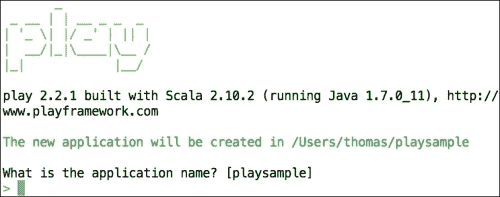

我们只需要按 *Enter* 键，因为我们已经在之前的命令中给出了项目名称。按 *Enter* 键后，将显示以下内容：

```java
Which template do you want to use for this new application? 
 1             - Create a simple Scala application
 2             - Create a simple Java application
> 1
OK, application playsample is created.

Have fun!

```

就这些；不到一分钟，我们已经有了一个完全工作的网络应用程序，现在我们可以执行它。由于这是一个 SBT 项目（其中 `sbt` 命令已被重命名为 `play`），我们可以直接导航到创建项目的根目录，并开始我们的 Play 会话，就像我们在处理一个 SBT 项目一样。这可以按照以下步骤进行：

```java
> cd playsample
> play run
[info] Loading project definition…
--- (Running the application from SBT, auto-reloading is enabled) ---

[info] play - Listening for HTTP on /0:0:0:0:0:0:0:0:9000

(Server started, use Ctrl+D to stop and go back to the console...)

```

注意，应用程序默认在端口 9000 上启动。如果您想使用不同的端口，可以输入以下命令代替：

```java
> play

```

这将带您进入 Play (SBT) 会话，然后您可以从那里选择要监听的端口。这可以按照以下步骤进行：

```java
[playsample] $ run 9095
[info] play - Listening for HTTP on /0:0:0:0:0:0:0:0:9095

```

另一个选择是在终端中输入 `> play "run 9095"`。

在 `http://localhost:9095/`（如果您使用的是默认端口则为 9000）启动浏览器，您应该在运行的门户上看到 **欢迎使用 Play** 页面：

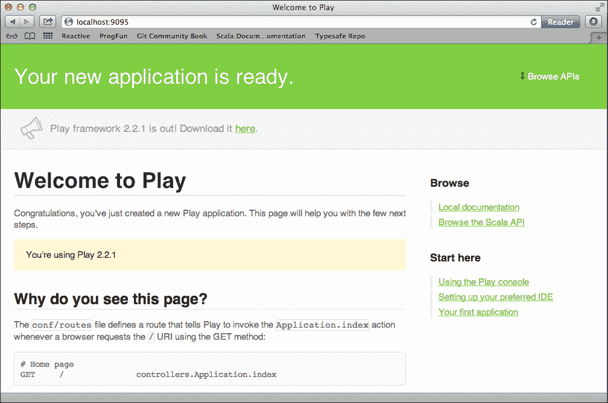

# 开始使用 Typesafe Activator

使用本书前面提到的基于 Activator 模板创建项目的方法，通过 Activator 开始 Play 项目的操作非常简单。只需转到 Typesafe Activator 安装目录，并输入以下命令：

```java
> ./activator ui

```

这将在浏览器窗口中启动 activator。最基础的 Scala Play 项目位于 `hello-play-scala` 模板中。一旦您选择了模板，请注意默认位置指示了项目将被创建的位置，然后点击 **创建**。

让我们从激活器浏览器视图或通过导航到创建的项目根目录并在命令提示符中输入以下命令，直接运行我们的示例项目：

```java
> ./activator run

```

一旦服务器在 9000 端口上监听，你可以在浏览器中打开`http://localhost:9000/` URL。编译只有在访问该 URL 时才会触发，因此应用程序显示可能需要几秒钟。你浏览器中出现的界面应该类似于以下截图：

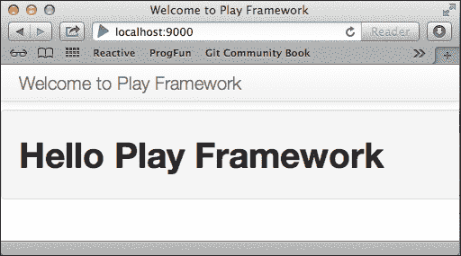

# Play 应用的架构

为了更好地理解如何构建 Play 应用程序，我们首先需要了解其一些架构方面。

## 可视化框架栈

在我们开始探索典型样本 Play 应用程序背后的代码之前，让我们通过几个图表来可视化框架的架构。首先，展示的是由 Play 组成的技术栈的整体图如下：

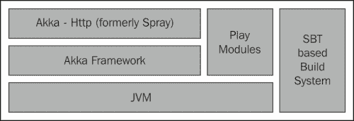

在 JVM 之上运行的是 Akka 框架，这是一个基于 actor 模型来管理并发操作的平台，我们将在第八章中详细讨论，即*现代应用程序的基本特性 – 异步和并发*。尽管如今大多数 Web 框架仍然依赖于如 Tomcat 或 JBoss 这样的 servlet 容器，但 Play 框架的新颖之处在于通过专注于在代码可以进行**热替换**时使应用程序无状态，从而避免遵循这一模型，即可以在运行时替换。尽管在商业环境中广泛使用和部署，但 servlet 容器存在额外的开销，例如每个请求一个线程的问题，这可能会在处理大量负载时限制可伸缩性。对于开发者来说，每次代码更改时避免重新部署部分或完整的`.ear`或`.war`存档所节省的时间可能是相当可观的。

在 Akka 之上，有一个基于 Spray（一个用于构建基于 REST/HTTP 的集成层的开源工具包，现称为 Akka-Http）的 REST/HTTP 集成层，它产生并消费可嵌入的 REST 服务。这使得 Play 与现代编写 Web 应用程序的方式相关，在这种方式中，后端和前端通过 HTTP REST 服务进行通信，交换主要是 JSON/XML 消息，这些消息可以被渲染为 HTML5，因此可以充分利用前端 JavaScript 框架的全部功能。

最后，为了能够与各种其他技术集成，例如基于关系型或 NoSQL 的数据库、安全框架、社交网络、基于云或大数据解决方案，[`www.playmodules.net`](http://www.playmodules.net)列出了大量 Play 插件和模块。

## 探索请求-响应生命周期

Play 遵循着众所周知的 MVC 模式，Web 请求的生命周期可以如下所示：

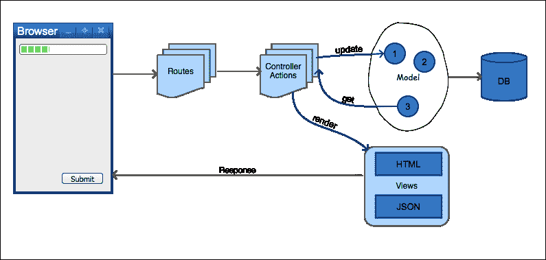

为了了解这个工作流程的各个步骤，我们将探索一个作为 Play 发行版一部分的示例`helloworld`应用程序。这个`helloworld`应用程序比我们之前通过 Typesafe Activator 或直接使用`> play new <project>`命令从头创建的项目示例要复杂一些，因此更有趣。

我们在这里考虑的`helloworld`应用程序可以在`<play 安装根目录>/samples/scala/helloworld`目录下找到（在撰写本文时，我们使用了 Play 2.2.1 发行版）。

对于任何已经包含`sbteclipse`插件的 Play 项目，我们可以在命令提示符中直接输入以下命令来生成 Eclipse 相关的文件（在项目根目录级别）：

```java
> play eclipse

```

注意，由于 Play 命令只是 SBT 顶层的一个薄层，我们可以重用相同的语法，即`> play eclipse`而不是`> sbt eclipse`。一旦这些被导入到 IDE 中，你可以在左侧的**包资源管理器**面板中看到 Play 应用程序的一般源布局，如下面的截图所示：

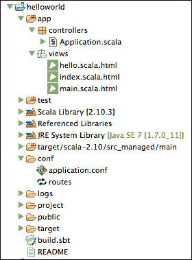

首先，让我们使用以下命令运行应用程序，看看它的样子：

```java
> play run

```

在`http://localhost:9000/`打开浏览器，你应该会看到一个类似于以下截图的小型网页表单：

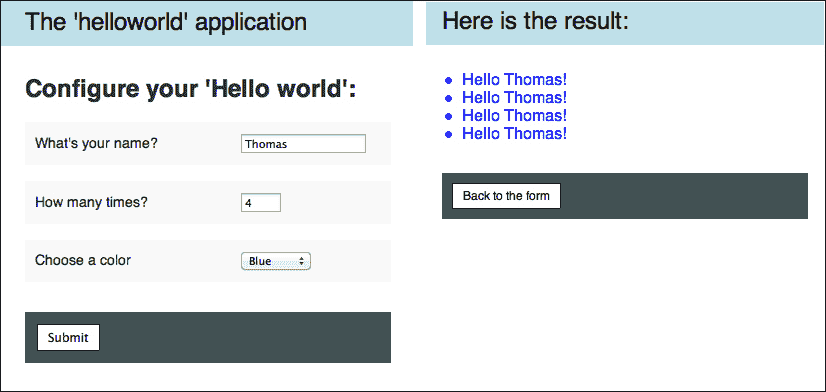

输入所需信息，然后点击**提交**以验证是否能够显示指定次数的您的名字。

请求流程的第一步出现在`conf/routes`文件中，如下所示：

```java
# Routes
# This file defines all application routes (Higher priority routes first)
# ~~~~

# Home page
GET    /              controllers.Application.index

# Hello action
GET    /hello         controllers.Application.sayHello

# Map static resources from the /public folder to the /assets URL path
GET    /assets/*file  controllers.Assets.at(path="/public", file)
```

这是我们可以定义 HTTP 请求 URL 与需要在 Play 服务器上处理请求的控制器代码之间映射的地方，如下所示：

```java
<REQUEST_TYPE(GET, POST...)> <URL_RELATIVE_PATH> <CONTROLLER_METHOD>

```

例如，在浏览器中访问`http://localhost:9000/hello` URL 与以下路由相匹配：

```java
GET  /  controllers.Application.index

```

不带任何参数的`index`方法将在`controller.Application.scala`类上被调用。

这种将 URL 路由到控制器的方式与在 JAX-RS 或 Spring MVC 中找到的标准 Java 方式不同，在那里每个控制器都被注解。我们认为，路由文件方法给我们提供了一个清晰的概述，即 API 支持什么，也就是文档，并且它使得 Play 应用程序默认就是 RESTful 的。

即使看起来 `routes` 文件是一个配置文件，它实际上也是编译过的，任何拼写错误或对不存在的控制器方法的引用都会很快被识别。将 `controllers.Application.index` 替换为 `controllers.Application.wrongmethod`，保存文件，然后在浏览器中点击重新加载按钮（*Ctrl* + *R*）。你应该会在浏览器中看到错误被很好地显示，如下面的屏幕截图所示：

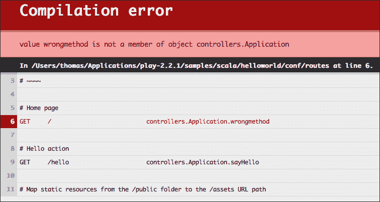

注意错误消息的精确性和文件中失败行的确切指出。这种在浏览器重新加载时显示错误消息的出色方式是许多使程序员更高效的功能之一。同样，即使路由文件中没有映射错误，访问开发中的未映射 URL（例如 `http://localhost:9000/hi`）也会显示错误以及 `routes` 文件的内容，以显示哪些 URL 可以调用。这可以在以下屏幕截图中看到：

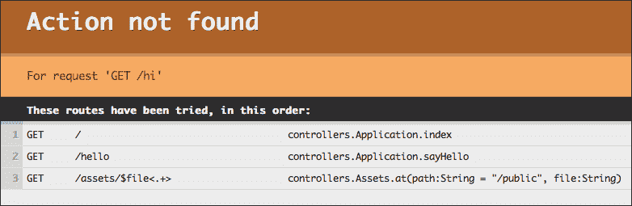

## 在控制器中处理请求

接下来，让我们看看接收并处理 `GET` 请求的 `Application` 类：

```java
object Application extends Controller {
  /**
   * Describes the hello form.
   */
  val helloForm = Form(
    tuple(
      "name" -> nonEmptyText,
      "repeat" -> number(min = 1, max = 100),
      "color" -> optional(text)
    )
  )

  // -- Actions
  /**
   * Home page
   */
  def index = Action {
    Ok(html.index(helloForm))
  }

  /**
   * Handles the form submission.
   */
  def sayHello = Action { implicit request =>
    helloForm.bindFromRequest.fold(
      formWithErrors => BadRequest(html.index(formWithErrors)),
      {case (name, repeat, color) => Ok(html.hello(name, repeat.toInt, color))}
    )
  }
}
```

`index` 方法执行 `Action` 块，这是一个函数（`Request[AnyContent] => Result`），它接受请求并返回一个 `Result` 对象。`Request` 类型的输入参数在这里的 `index` 方法中没有显示，因为它被隐式传递，并且在函数体中没有使用；如果我们想的话，可以写成 `def index = Action { implicit request =>`。单行 `Ok(html.index(helloForm))` 表示返回的结果应该有一个 HTTP 状态码等于 200，即 `Ok`，并且将 `html.index` 视图绑定到 `helloForm` 模型。

在这个小型示例中，模型由在文件中较早定义的 `Form` 对象组成。如下所示：

```java
val helloForm = Form(
  tuple(
    "name" -> nonEmptyText,
    "repeat" -> number(min = 1, max = 100),
    "color" -> optional(text)
  )
)
```

每个参数都描述为一个 `key -> value` 对，其中 `key` 是参数的名称，`value` 是应用于参数的函数的结果，该函数将生成一个 `play.api.data.Mapping` 对象。这种映射函数非常有用，可以执行对表单参数的验证。在这里，`Form` 参数被表示为一个元组对象，但我们可以创建更复杂的对象，例如案例类。Play 分发中的名为 *forms* 的示例项目包含了这种更高级处理验证方式的示例。在控制器中的 `sayHello` 方法中遇到的 `fold` 方法是一种累积验证错误的方法，以便能够一次性报告所有这些错误。让我们在填写表单时输入一些错误（例如，将 `name` 字段留空或在需要数字时输入字符）来验证错误是如何显示的。这可以在以下屏幕截图中看到：

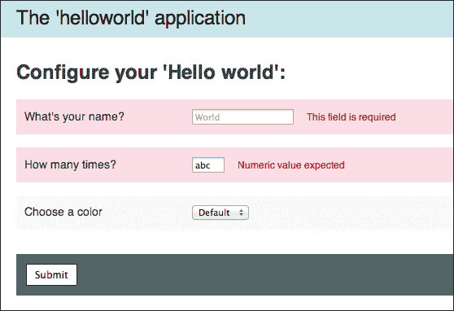

## 渲染视图

用于渲染视图的模板位于`views/index.scala.html`文件下。该模板如下所示：

```java
@(helloForm: Form[(String,Int,Option[String])])
@import helper._

@main(title = "The 'helloworld' application") {

    <h1>Configure your 'Hello world':</h1>

    @form(action = routes.Application.sayHello, args = 'id -> "helloform") {
        @inputText(
            field = helloForm("name"),
            args = '_label -> "What's your name?", 'placeholder -> "World"
        )

        @inputText(
            field = helloForm("repeat"),
            args = '_label -> "How many times?", 'size -> 3, 'placeholder -> 10
        )

        @select(
            field = helloForm("color"), 
            options = options(
                "" -> "Default",
                "red" -> "Red",
                "green" -> "Green",
                "blue" -> "Blue"
            ),
            args = '_label -> "Choose a color"
        )

        <p class="buttons">
            <input type="submit" id="submit">
        <p>
    }
}
```

Play 模板引擎的一个优点是它基于 Scala 语言本身。这是一个好消息，因为我们不需要学习任何新的模板语法；我们可以重用 Scala 结构，无需任何额外的集成。此外，模板被编译，以便我们每次犯错时都能在编译时得到错误提示；错误将以与路由或纯 Scala 控制器代码相同的方式显示在浏览器中。这种快速的反馈与使用 Java Web 开发中更传统的**JSPs**（JavaServer Pages）技术相比可以节省我们大量时间。

模板顶部的声明包含将在整个模板中填充的绑定变量。模板标记可以生成任何类型的输出，如 HTML5、XML 或纯文本。模板还可以包含其他模板。

在上一个示例中，`@main(title = "The 'helloworld' application'){ <block> ...}`语句指的是`main.scala.html`视图文件本身，如下所示：

```java
@(title: String)(content: Html)

<!DOCTYPE html>
<html>
    <head>
        <title>@title</title>
        <link rel="stylesheet" media="screen" href="@routes.Assets.at("stylesheets/main.css")">
        <link rel="shortcut icon" type="image/png" href="@routes.Assets.at("images/favicon.png")">
        <script src="img/@routes.Assets.at("javascripts/jquery-1.6.4.min.js")" type="text/javascript"></script>
    </head>
    <body>
        <header>
            <a href="@routes.Application.index">@title</a>
        </header>

        <section>
            @content
        </section>
    </body>
</html>
```

如您所见，此文件顶部定义的`@(title: String)(content: Html)`与上一个模板中的`(title = "The 'helloworld' application'){ <block of template with code> ...}`相匹配。这就是模板相互调用的方式。

`@`符号表示 Scala 代码后面直接跟一个变量名或要调用的方法，或者是一个括号内给出的完整代码块，即`@{ …code … }`。

在表单提交后，响应（`views/hello.scala.html`）模板包含一个`for`循环来显示`name`字段多次。如下所示：

```java
@(name: String, repeat: Int, color: Option[String])
@main("Here is the result:") {
    <ul style="color: @color.getOrElse("inherited")">
        @for(_ <- 1 to repeat) {
 <li>Hello @name!</li>
 }
    </ul>
    <p class="buttons">
        <a href="@routes.Application.index">Back to the form</a>
    </p>
}
```

# 与认证玩耍

在设计新的 Web 应用时，经常需要的功能之一涉及认证和授权。认证通常要求用户以用户名/密码的形式提供凭证以登录到应用程序。授权是系统确保用户只能执行其有权执行的操作的机制。在本节中，我们将通过扩展我们的`helloworld`示例，添加 Play 发行版中的安全功能，以展示 Scala 中特质的用法如何为传统问题提供优雅的解决方案。

让我们定义一个新的控制器，我们将称之为`Authentication`，它包含一些常用方法，如`login`用于获取登录页面，`authenticate`和`check`用于执行认证验证，以及`logout`用于返回登录页面。以下是实现方式：

```java
object Authentication extends Controller {

  val loginForm = Form(
    tuple(
      "email" -> text,
      "password" -> text
    ) verifying ("Invalid email or password", result => result match {
      case (email, password) => check(email, password)
    })
  )

  def check(username: String, password: String) = {
    (username == "thomas@home" && password == "1234")  
  }

  def login = Action { implicit request =>
    Ok(html.login(loginForm))
  }

  def authenticate = Action { implicit request =>
    loginForm.bindFromRequest.fold(
      formWithErrors => BadRequest(html.login(formWithErrors)),
      user => Redirect(routes.Application.index).withSession(Security.username -> user._1)
    )
  }

  def logout = Action {
    Redirect(routes.Authentication.login).withNewSession.flashing(
      "success" -> "You are now logged out."
    )
  }
}
```

与上一节中属于 `Application` 控制器的 `index` 方法类似，这里的 `login` 方法包括将一个表单（命名为 `loginForm`）绑定到一个视图（命名为 `html.login`，对应于文件 `views/login.scala.html`）。以下是一个简单的视图模板，它包含两个文本字段来捕获电子邮件/用户名和密码：

```java
@(form: Form[(String,String)])(implicit flash: Flash)

@main("Sign in") {

        @helper.form(routes.Authentication.authenticate) {

            @form.globalError.map { error =>
                <p class="error">
                    @error.message
                </p>
            }

            @flash.get("success").map { message =>
                <p class="success">
                    @message
                </p>
            }

            <p>
                <input type="email" name="email" placeholder="Email" id="email" value="@form("email").value">
            </p>
            <p>
                <input type="password" name="password" id="password" placeholder="Password">
            </p>
            <p>
                <button type="submit" id="loginbutton">Login</button>
            </p>

        }

        <p class="note">
            Try login as <em>thomas@@home</em> with <em>1234</em> as password.
        </p>

}
```

注意到 `thomas@@home` 用户名显示你可以通过输入两次来转义特殊的 `@` 字符。

现在我们有了处理带有待验证凭据提交的 HTML 登录页面的逻辑，但我们仍然缺少将常规方法调用封装到任何我们想要保护的控制器的缺失部分。此外，如果用户名（存储在我们的 `request.session` 对象中并从 cookie 中检索）不存在，此逻辑将重定向我们到登录页面。这可以用以下方式描述为特质：

```java
trait Secured {

  def username(request: RequestHeader) = request.session.get(Security.username)

  def onUnauthorized(request: RequestHeader) = Results.Redirect(routes.Authentication.login)

  def withAuth(f: => String => Request[AnyContent] => SimpleResult) = {
    Security.Authenticated(username, onUnauthorized) { user =>
      Action(request => f(user)(request))
    }
  }
}
```

我们可以将这个特质添加到同一个 `Authentication.scala` 控制器类中。`withAuth` 方法通过在它们周围应用 `Security.Authenticated` 方法来封装我们的 `Action` 调用。为了能够使用这个特质，我们只需要将其混合到我们的控制器类中，如下所示：

```java
object Application extends Controller with Secured {
  …
}
```

一旦特质成为我们控制器的一部分，我们可以用 `withAuth` 方法替换 `Action` 方法。例如，在调用 `index` 方法时，我们替换 `Action` 方法，如下所示：

```java
/**
 * Home page
 */
def index = withAuth { username => implicit request =>
  Ok(html.index(helloForm))
}
```

为了能够执行我们的新功能，我们不应该忘记将 `Authentication.scala` 控制器的额外方法添加到路由定义中（如果省略它们，编译器会标记出来）：

```java
# Authentication
GET    /login    controllers.Authentication.login
POST   /login    controllers.Authentication.authenticate
GET    /logout   controllers.Authentication.logout
```

让我们重新运行应用程序并调用 `http://localhost:9000/` 页面。我们应该被路由到 `login.html` 页面而不是 `index.html` 页面。这在上面的屏幕截图中有显示：

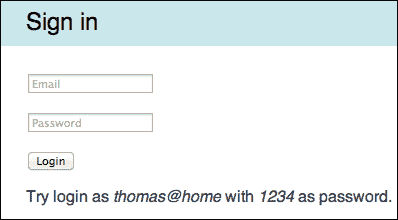

尝试使用错误和正确的电子邮件/密码组合进行登录，以验证认证是否已正确实现。

这个基本的认证机制只是展示了你如何轻松扩展 Play 中的应用程序。它演示了使用动作组合技术，这项技术也可以应用于许多其他方面——例如，记录或修改请求——并且是拦截器的一个很好的替代方案。

当然，如果你需要通过其他服务实现认证，你可以使用与 Play 兼容的外部模块；例如，基于 OAuth、OAuth2 或 OpenID 等标准的模块。SecureSocial 模块是一个很好的例子，可在 [`securesocial.ws`](http://securesocial.ws) 获取。

# 使用 Play 的实用技巧

我们将以几条有助于 Play 每日使用的建议来结束这一章。

## 使用 Play 进行调试

由于函数式编程的声明性特性和编译器的强大类型检查机制，在处理 Scala 代码时，调试应该发生的频率较低。然而，如果你需要在某种情况下调试一个 Play 应用程序，你不妨像在 Java 中一样运行一个远程调试会话。为了实现这一点，只需使用额外的调试命令启动你的 Play 应用程序：

```java
> play debug run

```

你应该在输出中看到一条额外的信息行，显示以下命令行：

```java
Listening for transport dt_socket at address: 9999

```

从这里，你可以在你的代码中添加断点，并通过导航到名为**运行** | **调试配置…**的菜单在 Eclipse 中启动远程调试配置。

右键单击**远程 Java 应用程序**并选择**新建**。只需确保你在**连接属性**表单中输入`端口：9999`，然后通过点击**调试**按钮开始调试。

## 处理版本控制

在维护代码时，可以忽略的典型文件位于以下位置，例如使用 GIT 等版本控制工具：

+   `logs`

+   `project/project`

+   `project/target`

+   `target`

+   `tmp`

+   `dist`

+   `.cache`

# 摘要

在本章中，我们介绍了 Play 框架，并涵盖了请求按照众所周知的 MVC 模式路由到控制器并通过视图渲染的典型示例。我们看到了在路由和模板的定义中使用 Scala 语法的用法给我们带来了编译时安全性的额外好处。这种帮助极大地提高了程序员的效率，并在重构时避免了拼写错误，使整个体验更加愉快。

我们还向一个`helloworld`应用程序示例添加了一些基本的 HTTP 身份验证。在下一章中，我们将解决持久性/ORM 的问题，这是任何 Web 应用程序中必不可少的部分，涉及到在后端使用数据库来存储和检索数据。我们将看到如何集成 Java 中使用的现有持久性标准，如 JPA，并介绍通过 Slick 框架的持久性的一种新颖但强大的方法。
