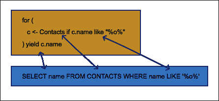
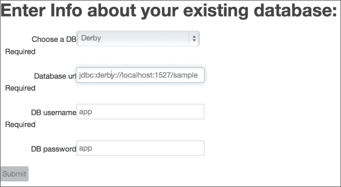
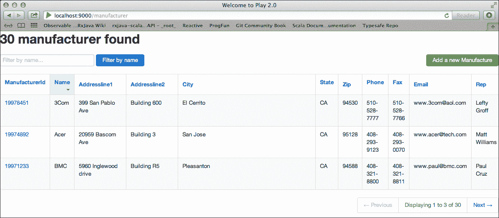
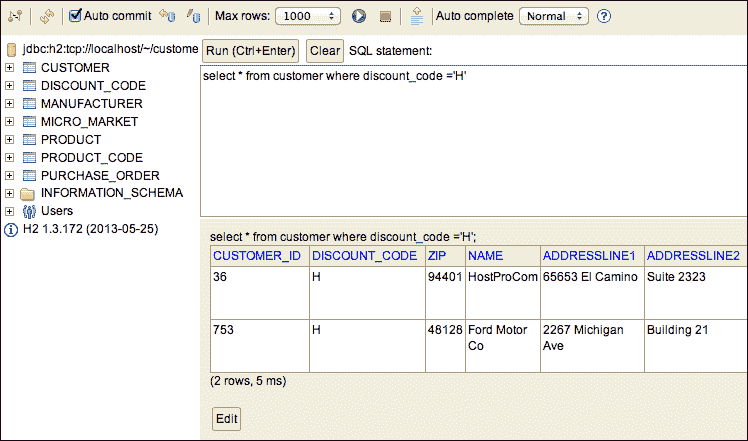

# 第六章. 数据库访问和 ORM 的未来

几乎任何 Web 应用程序都包含的一个基本组件是在持久化存储中存储和检索数据。无论是基于关系型还是 NoSQL，数据库通常占据最重要的位置，因为它持有应用程序数据。当一个技术栈成为遗留技术并需要重构或移植到新的技术栈时，数据库通常是起点，因为它持有领域知识。

在本章中，我们首先将研究如何集成和重用从 Java 继承的持久化框架，例如支持**Java 持久化 API**（**JPA**）的 Hibernate 和 EclipseLink 等，这些框架处理**对象关系映射**（**ORM**）。然后，我们将实验 Play 框架中默认的持久化框架 Anorm。最后，我们将介绍 Scala 的 ORM 替代方案和一种相当新颖的方法，它为更传统的基于 SQL 的查询添加了类型安全和组合，即 Slick 框架。我们将在 Play 网络开发环境中实验 Slick。我们还将涵盖从现有关系数据库生成类似 CRUD 的应用程序，这对于从遗留数据库开始时提高生产力非常有帮助。

# 集成现有的 ORM – Hibernate 和 JPA

如维基百科所定义：

> “在计算机软件中，对象关系映射（ORM，O/RM 和 O/R 映射）是一种编程技术，用于在面向对象编程语言中转换不兼容的类型系统中的数据”。

ORM 框架在 Java 中的广泛应用，如 Hibernate，主要归功于持久化和查询数据所需编写的代码的简单性和减少。

## 在 Scala 中提供 JPA

虽然 Scala 有其自己的现代数据持久化标准（即我们稍后将要介绍的 Slick），但在本节中，我们将通过构建一个使用 JPA 注解 Scala 类在关系数据库中持久化数据的 SBT 项目，来介绍 Scala 世界中 JPA（Java Persistence API，可在[`docs.oracle.com/javaee/6/tutorial/doc/bnbpz.html`](http://docs.oracle.com/javaee/6/tutorial/doc/bnbpz.html)中找到）的可能的集成。它源自[`www.brainoverload.nl/scala/105/jpa-with-scala`](http://www.brainoverload.nl/scala/105/jpa-with-scala)上的在线示例，这对于 Java 开发者来说应该特别有趣，因为它说明了如何在 Scala 项目中同时使用 Spring 框架进行依赖注入和 bean 配置。提醒一下，由 Rod Johnson 创建的 Spring 框架于 2002 年推出，作为一种提供控制反转（即依赖注入）的方式，依赖注入的流行度增加，现在成为一个包含 Java EE 7 许多方面的功能齐全的框架。有关 Spring 的更多信息可在[`projects.spring.io/spring-framework/`](http://projects.spring.io/spring-framework/)找到。

我们将连接到我们在第二章中介绍的现有 CustomerDB 示例数据库，以展示如何读取现有数据以及创建新的实体/表以持久化数据。

如我们在第三章中看到的，*理解 Scala 生态系统*，创建一个空的 Scala SBT 项目只需打开命令终端，创建一个用于放置项目的目录，然后按照以下方式运行 SBT：

```java
> mkdir sbtjpasample
> cd sbtjpasample
> sbt
> set name:="sbtjpasample"
> session save

```

我们可以导航到 SBT 创建的 `project/` 文件夹，并添加一个包含以下单行语句的 `plugins.sbt` 文件，以导入 `sbteclipse` 插件，这样我们就可以在 Eclipse IDE 下工作：

```java
addSbtPlugin("com.typesafe.sbteclipse" % "sbteclipse-plugin" % "2.4.0")

```

由于我们将使用 Hibernate 和 Spring 相关的类，我们需要将这些依赖项包含到我们的 `build.sbt` 构建文件中（以及连接到 `CustomerDB sample` 数据库的 derby-client 驱动程序），使其看起来像以下代码片段：

```java
name:="sbtjpasample"

scalaVersion:="2.10.3"

libraryDependencies ++= Seq(
   "junit" % "junit" % "4.11",
   "org.hibernate" % "hibernate-core" % "3.5.6-Final",
   "org.hibernate" % "hibernate-entitymanager" % "3.5.6-Final",
   "org.springframework" % "spring-core" % "4.0.0.RELEASE",
   "org.springframework" % "spring-context" % "4.0.0.RELEASE",
   "org.springframework" % "spring-beans" % "4.0.0.RELEASE",
   "org.springframework" % "spring-tx" % "4.0.0.RELEASE",
   "org.springframework" % "spring-jdbc" % "4.0.0.RELEASE",
   "org.springframework" % "spring-orm" % "4.0.0.RELEASE", 
   "org.slf4j" % "slf4j-simple" % "1.6.4",
   "org.apache.derby" % "derbyclient" % "10.8.1.2",
   "org.scalatest" % "scalatest_2.10" % "2.0.M7"
)
```

为了提醒使这些依赖项在 Eclipse 中可用，我们必须再次运行 `> sbt eclipse` 命令并刷新 IDE 中的项目。

现在，从项目的根目录进入 `> sbt eclipse` 并将项目导入 IDE。

现在，让我们添加几个领域实体（在新的包 `se.sfjd` 下），我们希望用基于 Java 的 JPA 注解来注解。在 `se.sfjd` 包中定义的 `Customer` 实体将（至少部分地）映射到现有的 `CUSTOMER` 数据库表：

```java
import javax.persistence._
import scala.reflect.BeanProperty

@Entity
@Table(name = "customer")
class Customer(n: String) {

    @Id
    @GeneratedValue(strategy = GenerationType.AUTO)
    @Column(name = "CUSTOMER_ID")
    @BeanProperty
    var id: Int = _

    @BeanProperty
    @Column(name = "NAME")
    var name: String = n

    def this() = this (null)

    override def toString = id + " = " + name
}
```

注意下划线 (_) 在声明 `var id: Int = _` 时代表默认值。默认值将根据变量的类型 `T` 设置，如 Scala 规范所定义：

+   如果 `T` 是 `Int` 或其子范围类型之一，则为 `0`。

+   如果 `T` 是 `Long`，则为 `0L`。

+   如果 `T` 是 `Float`，则为 `0.0f`。

+   如果 `T` 是 `Double`，则为 `0.0d`。

+   如果 `T` 是 `Boolean`，则为 `false`。

+   如果 `T` 是 `Unit`，则为 `()`。

+   对于所有其他类型的 `T`，都是 `null`。

`Language` 实体对应于我们想要持久化的新概念的添加，因此需要一个新的数据库表，如下所示：

```java
@Entity
@Table(name = "language")
class Language(l: String) {

    @Id
    @GeneratedValue(strategy = GenerationType.AUTO)
    @Column(name = "ID")
    @BeanProperty
    var id: Int = _

    @BeanProperty
    @Column(name = "NAME")
    var name: String = l

    def this() = this (null)

    override def toString = id + " = " + name
}
```

如我们在第二章中看到的，*代码集成*，`@BeanProperty` 注解是一种生成符合 Java 的 getter 和 setter 的方法，而 `this()` 方法是 Hibernate 需要的无参数构造函数。

接下来，控制器类或 **DAO** （**数据访问对象**）类捕获我们想要为 `Customer` 实体提供的操作，例如通过接口的形式提供 `save` 和 `find` 方法的 CRUD 功能，或者在这种情况下，一个 Scala 特质：

```java
trait CustomerDao {
    def save(customer: Customer): Unit
    def find(id: Int): Option[Customer]
    def getAll: List[Customer]
}
```

`CustomerDao` 类的实现依赖于我们作为 Java 开发者可能熟悉的 JPA 实体管理器的各种方法：

```java
import org.springframework.beans.factory.annotation._
import org.springframework.stereotype._
import org.springframework.transaction.annotation.{Propagation, Transactional}
import javax.persistence._
import scala.collection.JavaConversions._

@Repository("customerDao")
@Transactional(readOnly = false, propagation = Propagation.REQUIRED)
class CustomerDaoImpl extends CustomerDao {

    @Autowired
    var entityManager: EntityManager = _

    def save(customer: Customer):Unit = customer.id match{
        case 0 => entityManager.persist(customer)
        case _ => entityManager.merge(customer)
    }

    def find(id: Int): Option[Customer] = {
        Option(entityManager.find(classOf[Customer], id))
    }

    def getAll: List[Customer] = {
        entityManager.createQuery("FROM Customer", classOf[Customer]).getResultList.toList
    }
}
```

以类似的方式，我们可以定义一个 `Language` 特质及其实现，如下所示，并添加了一个 `getByName` 方法：

```java
trait LanguageDao {
    def save(language: Language): Unit
    def find(id: Int): Option[Language]
    def getAll: List[Language]
    def getByName(name : String): List[Language]
}

@Repository("languageDao")
@Transactional(readOnly = false, propagation = Propagation.REQUIRED)
class LanguageDaoImpl extends LanguageDao {

  @Autowired
  var entityManager: EntityManager = _

  def save(language: Language): Unit = language.id match {
    case 0 => entityManager.persist(language)
    case _ => entityManager.merge(language)
  }

  def find(id: Int): Option[Language] = {
    Option(entityManager.find(classOf[Language], id))
  }

  def getAll: List[Language] = {
    entityManager.createQuery("FROM Language", classOf[Language]).getResultList.toList
  }

  def getByName(name : String): List[Language] = {
    entityManager.createQuery("FROM Language WHERE name = :name", classOf[Language]).setParameter("name", name).getResultList.toList
  }
}
```

在我们可以执行项目之前，我们还需要遵循几个步骤：首先我们需要一个测试类，因此我们可以创建一个遵循 `ScalaTest` 语法（如我们之前在 第四章 中看到的）的 `CustomerTest` 类：

```java
import org.junit.runner.RunWith
import org.scalatest.junit.JUnitRunner
import org.scalatest.FunSuite
import org.springframework.context.support.
lassPathXmlApplicationContext

@RunWith(classOf[JUnitRunner])
class CustomerTest extends FunSuite {

  val ctx = new ClassPathXmlApplicationContext("application-context.xml")

  test("There are 13 Customers in the derby DB") {

    val customerDao = ctx.getBean(classOf[CustomerDao])
    val customers = customerDao.getAll
    assert(customers.size === 13)
    println(customerDao
      .find(3)
      .getOrElse("No customer found with id 3")) 
  }

  test("Persisting 3 new languages") {
    val languageDao = ctx.getBean(classOf[LanguageDao])
    languageDao.save(new Language("English"))
    languageDao.save(new Language("French"))
    languageDao.save(new Language("Swedish"))
    val languages = languageDao.getAll
    assert(languages.size === 3) 
    assert(languageDao.getByName("French").size ===1) 
  }
}
```

最后但同样重要的是，我们必须定义一些配置，包括一个 JPA 所需的 `META-INF/persistence.xml` 文件，我们可以将其放在 `src/main/resources/` 目录下，以及一个 Spring 的 `application-context.xml` 文件，其中所有豆类都已连接，并定义了数据库连接。`persistence.xml` 文件将看起来像以下这样：

```java
<?xml version="1.0" encoding="UTF-8"?>
<persistence version="2.0"  
    xsi:schemaLocation="http://java.sun.com/xml/ns/persistence http://java.sun.com/xml/ns/persistence/persistence_2_0.xsd">

    <persistence-unit name="JpaScala" transaction-type="RESOURCE_LOCAL">
        <provider>org.hibernate.ejb.HibernatePersistence</provider>
    </persistence-unit>
</persistence>
```

`application-context.xml` 文件，位于 `src/main/resources/` 目录下，内容较为详细，具体如下：

```java
<?xml version="1.0" encoding="UTF-8"?>
<beans 

       xsi:schemaLocation="
            http://www.springframework.org/schema/beans http://www.springframework.org/schema/beans/spring-beans.xsd
            http://www.springframework.org/schema/context http://www.springframework.org/schema/context/spring-context.xsd
            http://www.springframework.org/schema/tx http://www.springframework.org/schema/tx/spring-tx.xsd
        ">

    <tx:annotation-driven transaction-manager="transactionManager"/>

    <context:component-scan base-package="se.sfjd"/>

    <bean id="dataSource"
          class="org.springframework.jdbc.datasource.DriverManagerDataSource"
          p:driverClassName="org.apache.derby.jdbc.ClientDriver" p:url="jdbc:derby://localhost:1527/sample"
          p:username="app" p:password="app"/>

    <bean id="entityManagerFactory"
          class="org.springframework.orm.jpa.LocalContainerEntityManagerFactoryBean">
        <property name="persistenceUnitName" value="JpaScala"/>
        <property name="persistenceProviderClass" value="org.hibernate.ejb.HibernatePersistence"/>
        <property name="jpaDialect">
            <bean class="org.springframework.orm.jpa.vendor.HibernateJpaDialect"/>
        </property>

        <property name="dataSource" ref="dataSource"/>
        <property name="jpaPropertyMap">
            <map>
                <entry key="hibernate.dialect" value="org.hibernate.dialect.DerbyDialect"/>
                <entry key="hibernate.connection.charSet" value="UTF-8"/>
                <entry key="hibernate.hbm2ddl.auto" value="update"/>
                <entry key="hibernate.show.sql" value="true"/>
            </map>
        </property>
    </bean>

    <bean id="entityManager"
          class="org.springframework.orm.jpa.support.SharedEntityManagerBean">
        <property name="entityManagerFactory" ref="entityManagerFactory"/>
    </bean>

    <bean id="transactionManager" class="org.springframework.orm.jpa.JpaTransactionManager">
        <property name="entityManagerFactory" ref="entityManagerFactory"/>
        <property name="dataSource" ref="dataSource"/>
    </bean>
</beans>
```

在运行测试之前，我们需要确保数据库服务器正在运行；这已在 第二章 中解释，*代码集成*，当时使用 NetBeans IDE。

现在，我们可以通过右键单击 `CustomerTest` 类并导航到 **Debug As** | **Scala JUnit Test** 或从命令提示符中输入以下命令来执行示例：

```java
> sbt test
3 = Nano Apple
[info] CustomerTest:
[info] - There are 13 Customers in the derby DB
[info] - Persisting 3 new languages
[info] Passed: : Total 2, Failed 0, Errors 0, Passed 2, Skipped 0
[success] Total time: 3 s

```

# 在 Play 框架中处理持久化

Play 框架可以使用任何类型的 ORM 运行，无论是基于 Java 的 JPA 还是 Scala 特定的。该框架有相关的但独立的 Java 和 Scala 版本。如 Play 文档所述，Java 版本使用 Ebean 作为其 ORM，而 Scala 替代方案不使用 ORM，而是通过 JDBC 之上的 Scala 风格抽象层 Anorm 运行。

## 使用 Anorm 的简单示例

为了说明 Anorm 的用法，我们将创建一个小的 Play 示例，连接到之前章节中使用的 NetBeans 分发的现有 `CustomerDB` 数据库，并在 第二章 中介绍，*代码集成*。

最直接的方法是从终端窗口创建一个默认的 Play Scala 项目，输入以下命令：

```java
> play new anormsample

```

一旦创建并导入到 Eclipse 中（再次使用 `> play eclipse` 命令创建 Eclipse 相关文件；如需更多细节，请参阅 第五章, *Play 框架入门*），我们可以看到 Anorm 的依赖已经包含在 `built.sbt` 文件中。然而，我们需要将 `derby-client` 数据库驱动程序的依赖添加到该文件中，以便通过 jdbc 与数据库通信。依赖项可以按以下方式添加：

```java
libraryDependencies ++= Seq(
  jdbc,
  anorm,
  cache,
  "org.apache.derby" % "derbyclient" % "10.8.1.2"
)  
```

现在，我们可以定义一个 `Customer` case 类，它将代表数据库中的 `CUSTOMER` 表，并在其伴生对象中实现一些方法形式的行为，如下所示：

```java
package models

import play.api.db._
import play.api.Play.current
import anorm._
import anorm.SqlParser._
import scala.language.postfixOps

case class Customer(id: Pk[Int] = NotAssigned, name: String)

object Customer {
  /**
   * Retrieve a Customer from an id.
   */
  def findById(id: Int): Option[Customer] = {
    DB.withConnection { implicit connection =>
      println("Connection: "+connection)
      val query = SQL("SELECT * from app.customer WHERE customer_id = {custId}").on('custId -> id)
      query.as(Customer.simple.singleOpt)
    }
  }

  /**
   * Parse a Customer from a ResultSet
   */
  val simple = {
    get[Pk[Int]]("customer.customer_id") ~
    getString map {
      case id~name => Customer(id, name)
    }
  }
}
```

Anorm SQL 查询符合基于字符串的 SQL 语句，其中变量绑定到值。在这里，我们将 `customer_id` 列绑定到 `id` 输入参数。由于我们希望返回一个 `Option[Customer]` 来处理 SQL 查询没有返回任何结果的情况，我们首先需要解析 `ResultSet` 对象以创建一个 `Customer` 实例并调用 `singleOpt` 方法，这将确保我们将结果包装在一个 `Option` 中（它可以返回 `None` 而不是潜在的错误）。

`Application` 控制器如下所示：

```java
package controllers

import play.api._
import play.api.mvc._
import play.api.db._
import play.api.Play.current
import models._

object Application extends Controller {
  def index = Action {
    val inputId = 2  //  Hardcoded input id for the example
    val result = 
      DB.withConnection { implicit c =>
        Customer.findById(inputId) match {
          case Some(customer) => s"Found the customer: ${customer.name}"
          case None => "No customer was found."
      }
    }
    Ok(views.html.index(result))
  }
}
```

它只是将数据库查询包围在数据库连接中，并对 `Option[Customer]` 实体进行一些模式匹配，以显示查询的客户 `id` 是否找到的不同消息。

您可能在阅读 Scala 代码时注意到了关键字 `implicit`，例如在之前的代码示例中给出的 `implicit c` 参数。正如 Scala 文档中明确解释的那样：

> "具有隐含参数的方法可以像普通方法一样应用于参数。在这种情况下，隐含标签没有效果。然而，如果这样的方法遗漏了其隐含参数的参数，这些参数将被自动提供"。

在我们之前的例子中，我们可以省略这个隐含参数，因为我们没有在方法体中进一步使用数据库连接 `c` 变量。

使用 `inputId=2` 运行应用程序可以替换为 `inputId=3000;` 例如，以演示没有找到客户的情况。为了避免在视图中进行任何更改，我们重用了默认 `index.html` 页面的欢迎信息位置；因此，您将在浏览器的绿色页眉中看到结果。

此示例仅展示了 Anorm 的基本用法；它源自 Play 框架发行版样本中的更完整的 `computer-database` 示例。如果您需要深入了解 Anorm 框架，可以参考它。

# 替换 ORM

作为 Java 开发者，我们习惯于通过使用成熟且稳定的 JPA 框架，如 Hibernate 或 EclipseLink，来处理关系型数据库的持久化。尽管这些框架使用方便，并且隐藏了跨多个表检索或更新数据的许多复杂性，但对象关系映射仍然存在 **对象关系阻抗不匹配** 问题；在面向对象模型中，您通过对象之间的关系遍历对象，而在关系型数据库中，您将表的数据行连接起来，有时会导致数据检索效率低下且繁琐。（这进一步在维基百科页面中解释，[`en.wikipedia.org/wiki/Object-relational_impedance_mismatch`](http://en.wikipedia.org/wiki/Object-relational_impedance_mismatch)。）

相反，Typesafe 栈中的 `Slick` 框架提出通过函数式关系映射来解决数据到关系数据库的持久化问题，力求更自然地匹配。Slick 的额外好处包括以下两个方面：

+   **简洁性和类型安全**：Slick 不是通过在 Java 代码中用字符串表达 SQL 查询来运行 SQL 查询，而是使用纯 Scala 代码来表达查询。在 JPA 中，Criteria API 或如 **JPQL（Java Persistence Query Language**）或 **HQL（Hibernate Query Language**）之类的语言长期以来一直试图使基于字符串的查询具有更强的类型检查，但仍然难以理解并生成冗长的代码。使用 Slick，查询通过 Scala 的 `for comprehensions` 功能简洁地编写。SQL 查询的类型安全在 .Net 世界中通过流行的 LINQ 框架很久以前就已经引入。

+   **可组合和可重用查询**：Slick 采取的函数式方法使组合成为一种自然的行为，这是当考虑将纯 SQL 作为 ORM 的替代品时缺乏的特性。

# 了解 Slick

让我们通过代码示例来探索 Slick 框架的行为，看看我们如何可以增强和替换更传统的 ORM 解决方案。

我们可以研究的第一个例子是我们在第四章测试工具中分析的 `test-patterns-scala` activator 模板项目的一部分。项目中的 `scalatest/Test012.scala` 文件展示了 Slick 的典型用法如下：

```java
package scalatest

import org.scalatest._
import scala.slick.driver.H2Driver.simple._
import Database.threadLocalSession

object Contacts extends Table(Long, String) {
  def id = columnLong
  def name = columnString
  def gender = columnString
  def * = id ~ name
}

class Test12 extends FunSuite {
  val dbUrl = "jdbc:h2:mem:contacts"
  val dbDriver = "org.h2.Driver"

  test("Slick, H2, embedded") {
    Database.forURL(dbUrl, driver = dbDriver) withSession {
    Contacts.ddl.create
    Contacts.insertAll(
      (1, "Bob"),
      (2, "Tom"),
      (3, "Salley")
    )

    val nameQuery = 
      for( 
        c <- Contacts if c.name like "%o%"
      ) yield c.name 
    val names = nameQuery.list     
    names.foreach(println)
    assert(names === List("Bob","Tom"))
    }
  }
}
```

代码中最有趣的部分与 SQL 查询有关。不可变变量 `names` 包含对数据库的查询结果；而不是将 SQL 查询表达为 `String` 或通过 Java Criteria API，而是通过 `for comprehension` 使用纯 Scala 代码，如下面的截图所示：



与基于字符串的 SQL 查询不同，任何拼写错误或对不存在表或字段的引用都会立即由编译器指出。与 JPA Criteria API 生成的冗长且难以阅读的输出代码相比，更复杂的查询将以非常自然的方式转换为可读的 for 表达式。

此示例仅包含一个表，即 `Contacts`，我们通过扩展 `scala.slick.driver.H2Driver.simple.Table` 类来定义它。`CONTACTS` 数据库表包括三个列，一个作为 `Long` 数据类型定义的主键 `id`，以及两个其他类型为 `String` 的属性，分别是 `name` 和 `gender`。在 `Contacts` 对象中定义的 `*` 方法指定了一个默认投影，即我们通常感兴趣的所有列（或计算值）。表达式 `id ~ name`（使用 `~` 连接序列运算符）返回一个 `Projection2[Long, String]`，可以将其视为 Tuple2，但用于关系表示。默认投影 `(Int, String)` 导致简单查询的 `List[(Int, String)]`。

由于关系数据库中列的数据类型与 Scala 类型不同，因此需要映射（类似于处理 ORM 框架或纯 JDBC 访问时所需的映射）。如 Slick 文档所述，开箱即用的原始类型支持如下（根据每个数据库类型使用的数据库驱动程序，有一些限制）：

+   **数值类型**: `Byte`, `Short`, `Int`, `Long`, `BigDecimal`, `Float`, `Double`

+   **LOB 类型**: `java.sql.Blob`, `java.sql.Clob`, `Array[Byte]`

+   **日期类型**: `java.sql.Date`, `java.sql.Time`, `java.sql.Timestamp`

+   `Boolean`

+   `String`

+   `Unit`

+   `java.util.UUID`

定义领域实体之后，下一步是创建数据库，向其中插入一些测试数据，然后运行查询，就像我们使用任何其他持久化框架一样。

我们在 `Test12` 测试中运行的代码都被以下代码块包围：

```java
Database.forURL(dbUrl, driver = dbDriver) withSession {
  < code accessing the DB...>
}
```

`forURL` 方法指定了一个 JDBC 数据库连接，这通常包括一个对应于要使用的特定数据库的驱动程序类和一个由其 `host`、`port`、`database name` 以及可选的 `username/password` 定义的连接 URL。在示例中，使用了一个名为 `contacts` 的本地内存数据库（H2），因此连接 URL 是 `jdbc:h2:mem:contacts`，这与我们在 Java 中编写的方式完全相同。请注意，Slick 的 `Database` 实例仅封装了创建连接的“如何做”，实际的连接仅在 `withSession` 调用中创建。

`Contacts.ddl.create` 语句将创建数据库模式，而 `insertAll` 方法将使用包含其主键 `id` 和 `name` 的三行数据填充 `Contacts` 表。

我们可以通过在 `test-patterns-scala` 项目的根目录下的终端窗口中输入以下命令来单独执行此测试，以验证它是否按预期运行：

```java
> ./activator
> test-only scalatest.Test12
Bob
Tom
[info] Test12:
[info] - Slick, H2, embedded (606 milliseconds)
[info] ScalaTest
[info] Run completed in 768 milliseconds.
[info] Total number of tests run: 1
[info] Suites: completed 1, aborted 0
[info] Tests: succeeded 1, failed 0, canceled 0, ignored 0, pending 0
[info] All tests passed.
[info] Passed: Total 1, Failed 0, Errors 0, Passed 1
[success] Total time: 1 s, completed Dec 7, 2013 1:43:28 PM

```

目前，`test-patterns-scala` 项目包含对 SLF4J 日志框架的 `slf4j-nop` 实现的依赖，该实现禁用了所有日志。由于可视化 Scala `for comprehension` 语句产生的确切 SQL 语句可能很有用，让我们将 `sl4j-nop` 替换为 logback 实现。在你的 `build.sbt` 构建文件中，将 `"org.slf4j" % "slf4j-nop" % "1.6.4"` 这一行替换为对 logback 的引用，例如 `"ch.qos.logback" % "logback-classic" % "0.9.28" % "test"`。

现在，如果你重新运行测试，你可能会看到比实际需要的更多日志信息。因此，我们可以在项目中添加一个 `logback.xml` 文件（在 `src/test/resources/` 文件夹中），如下所示：

```java
<?xml version="1.0" encoding="UTF-8"?>
<configuration>

    <appender name="STDOUT" class="ch.qos.logback.core.ConsoleAppender">
        <encoder>
            <pattern>%d{HH:mm:ss.SSS} [%thread] %-5level %logger{36} - %msg%n</pattern>
        </encoder>
    </appender>

    <root level="debug">
        <appender-ref ref="STDOUT" />
    </root>

    <logger name="scala.slick.compiler"	level="${log.qcomp:-warn}" />
    <logger name="scala.slick.compiler.QueryCompiler" level="${log.qcomp.phases:-inherited}" />

…
    <logger name="scala.slick.compiler.CodeGen"                   level="${log.qcomp.codeGen:-inherited}" />
    <logger name="scala.slick.compiler.InsertCompiler"            level="${log.qcomp.insertCompiler:-inherited}" />
    <logger name="scala.slick.jdbc.JdbcBackend.statement"         level="${log.session:-info}" />

    <logger name="scala.slick.ast.Node$"                          level="${log.qcomp.assignTypes:-inherited}" />
    <logger name="scala.slick.memory.HeapBackend$"                level="${log.heap:-inherited}" />
    <logger name="scala.slick.memory.QueryInterpreter"            level="${log.interpreter:-inherited}" />
</configuration>
```

这次，如果我们只启用 `"scala.slick.jdbc.JdbcBackend.statement"` 日志记录器，测试的输出将显示所有 SQL 查询，类似于以下输出：

```java
> test-only scalatest.Test12
19:00:37.470 [ScalaTest-running-Test12] DEBUG scala.slick.session.BaseSession - Preparing statement: create table "CONTACTS" ("CONTACT_ID" BIGINT NOT NULL PRIMARY KEY,"CONTACT_NAME" VARCHAR NOT NULL)
19:00:37.484 [ScalaTest-running-Test12] DEBUG scala.slick.session.BaseSession - Preparing statement: INSERT INTO "CONTACTS" ("CONTACT_ID","CONTACT_NAME") VALUES (?,?)
19:00:37.589 [ScalaTest-running-Test12] DEBUG scala.slick.session.BaseSession - Preparing statement: select x2."CONTACT_NAME" from "CONTACTS" x2 where x2."CONTACT_NAME" like '%o%'
Bob
Tom
[info] Test12:
[info] - Slick, H2, embedded (833 milliseconds)
[info] ScalaTest
[info] Run completed in 952 milliseconds.
[info] Total number of tests run: 1
[info] Suites: completed 1, aborted 0
[info] Tests: succeeded 1, failed 0, canceled 0, ignored 0, pending 0
[info] All tests passed.
[info] Passed: Total 1, Failed 0, Errors 0, Passed 1
[success] Total time: 1 s, completed Dec 10, 2013 7:00:37 PM
> 
```

最后，为了验证是否已强制执行数据库模式验证，让我们尝试修改插入数据的一个键，以便我们有重复的键，如下面的代码行所示：

```java
Contacts.insertAll(
      (1, "Bob"),
      (2, "Tom"),
      (2, "Salley")
    )
```

如果我们再次运行测试，它将失败，并显示类似于以下的消息：

```java
[info] Test12:
[info] - Slick, H2, embedded *** FAILED *** (566 milliseconds)
[info]   org.h2.jdbc.JdbcBatchUpdateException: Unique index or primary key violation: "PRIMARY_KEY_C ON PUBLIC.CONTACTS(CONTACT_ID)"; SQL statement:
[info] INSERT INTO "CONTACTS" ("CONTACT_ID","CONTACT_NAME") VALUES (?,?) [23505-166]…

```

# 搭建 Play 应用程序

在本节中，我们将通过从关系型数据库自动创建一个具有基本 CRUD 功能的完整 Play 应用程序来进一步实验 Slick 和 Play，包括模型、视图、控制器，以及测试数据和配置文件，如 Play 路由。

任何需要连接到数据库的 Web 应用程序通常至少需要在后端实现大部分 CRUD 功能。此外，能够生成默认的前端可以避免你从头开始制作。特别是，由 HTML5 视图组成的 Play 前端具有高度的复用性，因为大多数列、字段、按钮和表单的显示都可以在 HTML 编辑器中进行有限的复制粘贴重新排列。

让我们将这种逆向工程应用于我们在第二章中已经介绍过的 NetBeans 分发的示例客户数据库，*代码集成*。

Play 应用的生成分为两个步骤：

1.  创建一个常规的 Play 项目。

1.  使用名为 `playcrud` 的外部工具，它本身是一个 Play 应用程序，并将生成所有必需的 MVC 和配置文件，这些文件位于新的 Play 项目结构之上。

这种两步走的方法更有保证，生成的应用程序将遵循 Play 分发的最新变化，特别是关于 Play 每个新版本带来的外观和感觉的变化。

要开始使用 `playcrud` 工具，请在所选目录的命令行中克隆项目（假设已安装 GIT，如果没有，请访问 [`git-scm.com/`](http://git-scm.com/)）： 

```java
> git clone https://github.com/ThomasAlexandre/playcrud

```

这将创建一个名为 `playcrud` 的目录，项目内容是一个常规的 Play 应用程序，包括生成 Eclipse 项目的插件。因此，我们可以运行以下命令：

```java
> cd playcrud
> play eclipse

```

然后，将项目导入到 Eclipse 中以更好地可视化其组成。应用程序由位于 `samplecrud\app\controllers` 的 `Application.scala` 文件中的一个控制器组成，以及位于 `samplecrud\app\views` 下的 `index.scala.html` 中的相应视图。在 `samplecrud\conf` 下的 `routes` 文件中只定义了两个路由：

```java
# Home page
GET    /    controllers.Application.index

# CRUD action
GET    /crud    controllers.Application.generateAll
```

第一条路由将在浏览器中显示一个表单，我们可以输入有关数据库的信息，从而创建一个 Play 应用程序。通过查看其模板，这个表单相当容易理解：

```java
@(dbForm: Form[(String,String,String,String)])
@import helper._
@main(title = "The 'CRUD generator' application") {
    <h1>Enter Info about your existing database:</h1>
    @form(action = routes.Application.generateAll, args = 'id -> "dbform") {

        @select(
            field = dbForm("driver"), 
            options = options(
                "com.mysql.jdbc.Driver" -> "MySQL",
                "org.postgresql.Driver" -> "PostgreSQL",
                "org.h2.Driver" -> "H2",
                "org.apache.derby.jdbc.ClientDriver" -> "Derby"
            ),
            args = '_label -> "Choose a DB"
        )

        @inputText(
            field = dbForm("dburl"),
            args = '_label -> "Database url", 'placeholder -> "jdbc:mysql://localhost:3306/slick"
        )

        @inputText(
            field = dbForm("username"),
            args = '_label -> "DB username", 'size -> 10, 'placeholder -> "root"
        )

        @inputText(
            field = dbForm("password"),
            args = '_label -> "DB password", 'size -> 10, 'placeholder -> "root"
        )
        <p class="buttons">
            <input type="submit" id="submit">
        <p>
    }
} 
```

第二个是在提交表单后执行一次的 `generateAll` 动作，该动作将创建执行新创建的 Play 应用程序所需的所有文件。

为了能够在正确的位置生成所有文件，我们只需要编辑一个名为 `baseDirectory` 的配置属性，目前位于 `utilities/` 文件夹中的 `Config.scala` 文件。该属性指定了我们想要生成的 Play 应用程序的根目录。在我们编辑它之前，我们可以生成一个空白 Play 项目，`baseDirectory` 变量将引用它：

```java
> cd ~/projects/internal (or any location of your choice)
> play new samplecrud
…
What is the application name? [samplecrud]
> [ENTER]
Which template do you want to use for this new application? 
 1             - Create a simple Scala application
 2             - Create a simple Java application
> [Press 1]
Just to verify we have our blank Play application correctly created we can launch it with:
> cd samplecrud
> play run

```

现在，在网页浏览器中打开 `http://localhost:9000` URL。

现在我们有了我们的 `baseDirectory` (`~/projects/internal/samplecrud`)，我们可以将其添加到 `Config.scala` 文件中。其他关于数据库的属性只是默认值；我们在这里不需要编辑它们，因为我们将在运行 `playcrud` 应用程序时填写 HTML 表单时指定它们。

在一个新的终端窗口中，让我们通过输入以下命令来执行 `playcrud` 应用程序：

```java
> cd <LOCATION_OF_PLAYCRUD_PROJECT_ROOT>
> play "run 9020" (or any other port than 9000)

```

这里，我们需要选择一个不同于 `9000` 的端口，因为它已被空白应用程序占用。

现在，将您的网络浏览器指向 `playcrud` URL，`http://localhost:9020/`。您应该会看到一个 HTML 表单，您可以在其中编辑源数据库的属性以进行 CRUD 生成，如下面的截图所示（此数据库将只进行读取）：



提交表单很可能会在终端控制台中生成一些日志输出，一旦生成完成，浏览器将被重定向到端口 `9000` 以显示新生成的 CRUD 应用程序。由于这是我们第一次生成应用程序，它将失败，因为生成的应用程序的 `build.sbt` 文件已更新，需要重新加载一些新依赖项。

为了解决这个问题，通过按下 *Ctrl* + *D* 来中断当前运行的 Play 应用程序。一旦它停止，只需重新启动它：

```java
> play run

```

如果一切顺利，你应该能够访问 `http://localhost:9000` 并看到从数据库生成的实体对应的可点击控制器列表，包括 `Product`、`Manufacturer` 和 `Purchase Order`。

让我们打开其中一个，例如制造商视图，如下截图所示：



结果屏幕显示了 CRUD 功能的`READ`部分，通过显示数据库中所有制造商行的列表。分页功能默认设置为`3`，这就是为什么一次只能看到 30 个制造商中的三个，但可以通过点击**上一页**和**下一页**按钮导航到其他页面。这个默认页面大小可以在每个单独的控制器中编辑（查找`pageSize` val 声明），或者可以在代码生成之前修改控制器模板，以一次性更新所有控制器。此外，HTML 表格的标题是可点击的，可以根据每个特定的列对元素进行排序。

点击**添加新制造商**按钮将调用一个新屏幕，其中包含一个用于在数据库中创建新条目的表单。

## 导入测试数据

生成的应用默认使用 H2 内存数据库运行，启动时会填充一些测试数据。在生成过程中，我们使用 DBUnit 的功能将源数据库的内容导出到一个 XML 文件中，DBUnit 是一个基于 JUnit 的 Java 框架。当测试中涉及足够多的数据库数据，而你又想避免通过生成包含从真实数据库中提取的一些数据的 XML 样本文件来模拟所有内容时，DBUnit 非常有用。导出的测试数据存储在`samplecrud\test\`目录下的`testdata.xml`文件中。当运行生成的应用程序时，该文件将由 DBUnit 在`Global.scala`的`onStart`方法中加载，在创建数据库模式之后。

为了能够将数据持久化到真实的数据库中，从而避免每次重启时都导入 XML 文件，我们可以将内存中的数据替换为磁盘上的真实数据库。例如，我们可以将位于`samplecrud\conf`目录下的`application.conf`文件中的数据库驱动属性替换为以下几行：

```java
db.default.driver=org.h2.Driver
db.default.url="jdbc:h2:tcp://localhost/~/customerdb"
db.default.user=sa
db.default.password=""
```

重启 play 应用后，新的数据库将被构建：

```java
> play run

```

在浏览器中访问`http://localhost:9000` URL 这次将在磁盘上创建数据库模式并填充测试数据。由于数据库在重启之间是持久化的，从现在开始我们必须在`Global.scala`中注释掉`ddl.create`语句以及引用`testdata.xml`的 DBUnit 导入的行。

## 在 H2browser 中可视化数据库

Play 的一个方便功能是，你可以直接从 SBT 访问`h2-browser`来在你的浏览器中可视化数据库内容。即使你使用的是除了 H2 之外的大多数数据库，这也是正确的。打开一个终端窗口并导航到生成的项目根目录：

```java
> play
> h2-browser

```

通过填写以下截图所示的连接属性来连接到数据库：


假设点击显示在上一张截图中的**测试连接**按钮后显示**测试成功**，我们可以可视化并发送 SQL 查询到`customerdb`数据库，如下一张截图所示：



## 探索应用生成的代码背后的内容

源数据库中的每个表都会生成一些工件：

+   一个`模型`，一个`控制器`，以及几个`视图`类

+   在`conf.routes`文件中插入了一组`route`条目，如下所示为`PURCHASE_ORDER`表：

    ```java
    # PurchaseOrder
    # 
    # PurchaseOrder list (look at the default values for pagination parameters)

    GET     /purchaseorder               controllers.PurchaseOrderController.list(p:Int ?= 0, s:Int ?= 2, f ?= "")
    # Add purchaseorder
    GET     /purchaseorder/new           controllers.PurchaseOrderController.create
    POST    /purchaseorder               controllers.PurchaseOrderController.save
    # Edit existing purchaseorder
    GET     /purchaseorder/:pk           controllers.PurchaseOrderController.edit(pk:Int)
    POST    /purchaseorder/:pk           controllers.PurchaseOrderController.update(pk:Int)

    # Delete purchaseorder
    POST    /purchaseorder/:pk/delete    controllers.PurchaseOrderController.delete(pk:Int)
    ```

模型由域实体组成，每个实体都通过 Slick 定义，结合一个表示行的 case 类和一个特定驱动程序的`slick.driver.H2Driver.simple.Table`行。我们本可以避免使用 case 类，直接编写涉及列的元组，就像我们在早期的`Test12`示例中看到的`test-patterns-scala`激活器模板一样，但将列封装在 case 类中对于后续的模式匹配和视图中的使用来说更方便。代表`PurchaseOrder`实体的模型类生成如下：

```java
package models

case class PurchaseOrderRow(orderNum : Option[Int], customerId : Int, productId : Int, quantity : Option[Int], shippingCost : Option[Int], salesDate : Option[Date], shippingDate : Option[Date], freightCompany : Option[String])

// Definition of the PurchaseOrder table
object PurchaseOrder extends TablePurchaseOrderRow {

  def orderNum = columnInt 
  def customerId = columnInt  
  def productId = columnInt   
  def quantity = column[Option[Int]]("QUANTITY") 
  def shippingCost = column[Option[Int]]("SHIPPING_COST") 
  def salesDate = column[Option[Date]]("SALES_DATE")  
  def shippingDate = column[Option[Date]]("SHIPPING_DATE") 
  def freightCompany = column[Option[String]]("FREIGHT_COMPANY") 

  def * = orderNum.? ~ customerId ~ productId ~ quantity ~ shippingCost ~ salesDate ~ shippingDate ~ freightCompany <> (PurchaseOrderRow.apply _, PurchaseOrderRow.unapply _)

  def findAll(filter: String = "%") = {
    for {
      entity <- PurchaseOrder
      // if (entity.name like ("%" + filter))
    } yield entity
  }

  def findByPK(pk: Int) =
     for (
       entity <- PurchaseOrder if entity.orderNum === pk
     ) yield entity
     ...
```

`PurchaseOrder`实体的完整代码以及相应的`PurchaseOrderController`类的 CRUD 方法定义可以在 Packt Publishing 网站上下载，也可以通过在本节中解释的执行`scaffolding playcrud` GitHub 项目在`CustomerDB`样本数据库上重现。

最后，为特定实体生成视图的模板收集在同一个名为`views.<entity_name>/`的目录下，并包括三个文件，分别是`list.scala.html`、`createForm.scala.html`和`editForm.scala.html`，分别用于`READ`、`CREATE`和`UPDATE`操作。它们嵌入了一种混合的纯 HTML5 标记和最小 Scala 代码，用于遍历和显示来自控制器查询的元素。注意在视图中添加了一个特定的`play.api.mvc.Flash`隐式对象：Play 的这个有用特性使得在生成的视图中显示一些信息成为可能，以通知用户执行操作的结果。您可以在控制器中看到，我们通过`Home.flashing {... }`语句引用它，其中根据操作的成功或失败显示各种信息。

## playcrud 工具的限制

在当前实验性的`playcrud`工具版本中，发现了一些限制，如下所述：

+   `playcrud` 项目并不总是与所有 JDBC 数据库完美兼容，特别是由于某些数据库的映射是定制的。然而，只需进行少量更改，它就足够灵活，可以适应新的映射。此外，它允许通过指定需要生成的外部文件中的表来生成部分数据库。为了启用此功能，我们只需在我们的 `playcrud` 项目的 `conf/` 目录下添加一个文件，命名为 `tables`，并写入我们想要包含的表的名称（文件中的每一行一个表名，不区分大小写）。例如，考虑一个包含以下代码的 `tables` 文件：

    ```java
    product
    purchaseorder
    manufacturer
    ```

    此代码只为这三个表创建 MVC 类和 HTML 视图。

+   如果特定数据库数据类型的映射没有被 `playcrud` 处理，你将在浏览器窗口中得到一个编译错误，这很可能会提到缺少的数据类型。处理映射的 `playcrud` 代码中的位置是 `utilities/DBUtil.scala` 类。`playcrud` 的后续版本应该使这些配置对每种数据库类型更加灵活，并将它们放在外部文件中，但到目前为止，它们是嵌入在代码中的。

+   可用的代码生成是在两个已经存在的样本的基础上灵感和构建的，一个是 Play 框架分发的名为 `computer-database` 的样本（它展示了一个 CRUD 应用，但使用 Anorm 作为持久层，这是一个基于 SQL 的持久层框架，是 Play 的默认选项），另一个是 Typesafe 的 Slick 团队完成的 Slick 使用示例（带有 `Suppliers` 的 `Coffee` 数据库，展示了多对一关系）。如果你希望以不同的方式生成代码，所有模板都可以在 `views/` 目录下找到。其中一些主要包含静态数据，例如基于 `build.scala.txt` 模板生成 `build.sbt`。

+   在商业应用中，遇到具有超过 22 列的数据库表并不罕见。由于我们将这些列封装到案例类中，而 Scala 2.10 有一个限制，限制了超过 22 个元素的案例类的创建，因此目前无法生成超过该大小的 Slick 映射。希望从 Scala 2.11 开始，这个限制应该会被取消。

# 摘要

在本章中，我们介绍了处理关系型数据库持久化的几种方法。我们首先通过一个 Scala 与基于传统 JPA 的 ORM 持久化集成的例子进行了说明。该例子还展示了 Spring 框架与 Scala 代码库之间的集成。然后，我们介绍了 Anorm，这是 Play 框架中默认的持久化框架，它依赖于直接 SQL 查询。由于 ORM 的一些局限性，主要与可扩展性和性能相关，以及纯 SQL 查询在类型安全和可组合性方面的局限性，我们转向采用 Slick 框架，这是一种独特的持久化方法，旨在以更函数式的方式在关系型数据库中持久化数据。最后，我们考虑了通过从现有数据库生成具有基本 CRUD 功能的全功能 Play Web 应用程序，作为快速将 Slick 集成到 Play 中的方法。Slick 的未来版本从 2.0 开始增强了对代码生成的支持，并力求通过使用 Scala 宏使编写数据库查询的语法更加可读。

在下一章中，我们将探讨如何在使用 Scala 集成外部系统时使用 Scala，特别是通过 Web 服务和 REST API，支持 JSON 和 XML 等数据格式。
