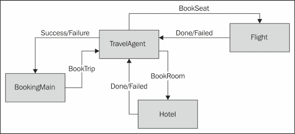
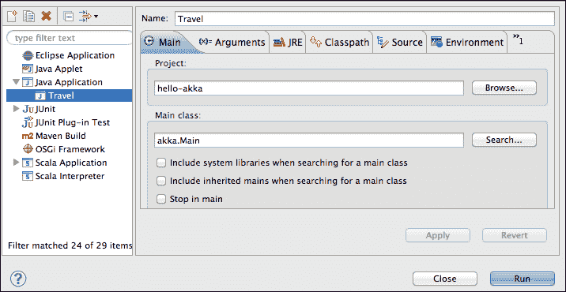
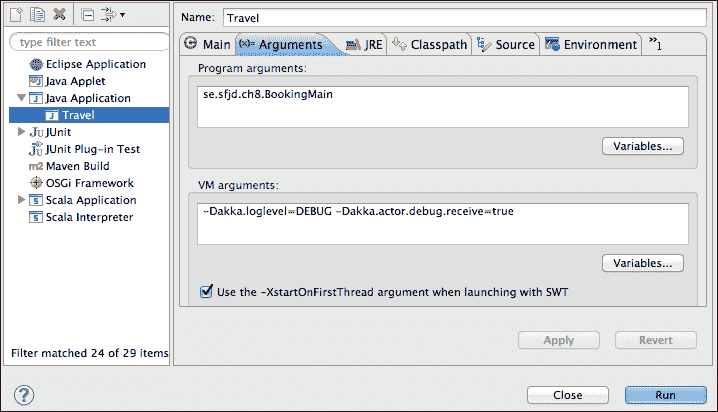
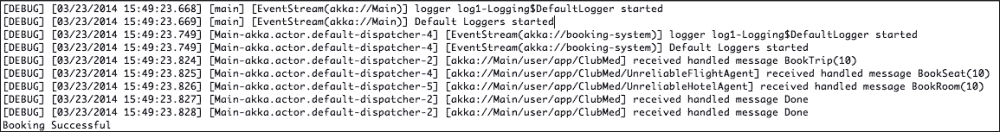

# 第八章.现代应用程序的基本属性 - 异步和并发

可用性和性能是两个经常用来描述大多数商业软件背后需求的词汇。随着处理的信息量随着社交网络的兴起和在线服务的复杂性增加而不断增长，Web 服务器现在越来越多地面临沉重的负载和更高的并发请求数量。在本章中，我们将通过涵盖以下主题来探讨不同的方法，以实现更好的性能和可伸缩性：

+   Async 库，一种简化异步代码的新方法，包括 Web 服务组合的示例

+   Akka，一个基于 actor 范例简化构建并发、分布式和容错应用的工具包和运行时环境

# 并发的支柱

并发和异步是大多数编程语言用来增强响应时间和可伸缩性的技术，Java 也不例外。异步方法调用是一种技术，调用者对可能耗时的计算不需要等待响应，而是在计算进行的同时继续执行其他代码。一旦运行完成，调用者将被通知，无论是成功的结果还是失败的消息。

在 Java 中处理异步代码的传统方式主要是通过注册回调函数，即当任务完成时被调用的占位符。当处理异步代码时，由于执行顺序不是确定的，即执行顺序没有保证，因此复杂性往往会增加。因此，并发执行代码更难测试，因为连续调用可能不会产生相同的结果。此外，由于回调函数不可组合（这意味着它们不能以灵活的方式链式组合），将多个异步计算混合在一起以实现更高级的场景可能会变得很繁琐，从而导致在项目规模增加时出现的“回调地狱”问题（复杂性如此之高，以至于难以维护和保证代码的正确执行）。

当代码在多个核心上执行时，也会遇到并发问题。最近的硬件架构现在将多个核心嵌入到同一台机器中，作为在晶体管的最小物理尺寸达到极限时继续实现更好性能的一种方式。

处理并发代码的另一个后果是，当尝试访问相同资源时，多个执行线程可能会发生冲突。程序中的可变状态，如果没有保护共享访问，有更高的风险出现错误。确保并发代码正确执行通常需要付出增加复杂性的代价。例如，Java 线程同步机制，如使用锁，导致了难以理解和维护的解决方案。

Scala 追求不可变性的函数式方法是迈向更易并发处理的第一步。**Scala 改进流程**（**SIP**），在 Scala 中可以看作是 Java JSR 流程的等价物，已经提出了一项关于 *SIP-14-Futures and Promises* 的提案。这些概念并不新颖，因为它们在编写并发代码时已经被许多其他语言使用过，但新的提案试图合并 Scala 中 Futures 的各种实现。

### 注意

Futures 和 Promises 是通过它们可以检索异步执行结果的某些对象。要了解更多信息，请访问[`en.wikipedia.org/wiki/Futures_and_promises`](http://en.wikipedia.org/wiki/Futures_and_promises)。

如 *SIP-14-Futures and Promises* 所述：

> Futures 提供了一种很好的方式来推理并行执行多个操作——以高效和非阻塞的方式进行。

从这个提案中，创建了一个实现，现在它是许多处理并发和异步代码的 Scala 库的基础。

# Async 库 – SIP-22-Async

在第七章 *使用集成和 Web 服务* 中，我们简要地看到了如何调用返回`Future`对象的异步 Web 服务。Async 的目标是通过提供一些强大的结构来简化异步代码，特别是处理多个异步代码块，特别是组合多个这样的块。它只包含两个结构：

+   `async { <expression> }`：在这个结构中，`<expression>`是异步执行的代码。

+   `await { <expression returning a Future> }`：这个结构包含在一个`async`块中。它暂停包含的`async`块的执行，直到参数`Future`完成。

`async`/`await`机制的一个有趣特点是它是完全非阻塞的。尽管理解`async`/`await`的工作原理并非必需，但两个方法`async[]`和`await[]`的确切签名如下供参考：

```java
def asyncT : Future[T]
def awaitT:T
```

`T`代表任意类型（如`Int`或`String`）或容器类型（如`List`或`Map`），这是我们描述 Scala 中泛型类型的方式。尽管我们不会过多地介绍泛型编程，这在其他书籍如*Programming in Scala*、*Artima*由*Martin Odersky*、*Lex Spoon*和*Bill Venners*中已经广泛描述，但了解它们存在并且是 Scala 语言核心部分是很重要的。

为了更好地理解 Async 是什么，我们将使用 REPL 中可以运行的示例。通过运行命令`> play new ch8samples`创建一个新的`Play`项目，并当然选择 Scala 作为项目使用的语言。一旦项目创建完成，通过在`build.sbt`文件中添加一行来将 Async 库作为依赖项添加，现在文件看起来如下所示：

```java
name := "ch8samples"

version := "1.0-SNAPSHOT"

libraryDependencies ++= Seq(
 jdbc,
 anorm,
 cache,
 "org.scala-lang.modules" %% "scala-async" % "0.9.0"
) 

play.Project.playScalaSettings

```

我们可以在终端窗口中运行 REPL 控制台，就像往常一样，通过在项目的根目录中输入以下命令：

```java
> play console

```

首先，我们需要执行一些导入，如下面的命令行所示：

```java
scala> import scala.async.Async.{async, await}
import scala.async.Async.{async, await}
scala> import scala.concurrent.ExecutionContext.Implicits.global
import scala.concurrent.ExecutionContext.Implicits.global

```

类似地，对于线程池，需要一个执行上下文来处理异步计算应该如何以及何时执行。

第二，我们可以通过将计算封装在一个`async`块中来指定异步计算：

```java
scala> val computation = async { 3 * 2 }
computation: scala.concurrent.Future[Int] = scala.concurrent.impl.Promise$DefaultPromise@545c484c
scala> computation.value
res0: Option[scala.util.Try[Int]] = Some(Success(6))

```

如您所见，结果类型是`Option[scala.util.Try[Int]]`，回顾一下第二章中关于`Try`类的简要讨论，*代码集成*。我们了解到它基于一个可以取`Success`或`Failure`值的`Either`类，分别对应于`Either`类的`Left`和`Right`值。

在我们的例子中，计算非常迅速，并得到了成功值`6`。

让我们进行一个耗时较长的计算（例如，10 秒钟），如下面的命令行所示：

```java
scala> val longComputation = async { Thread.sleep(10000); 3*2 }
longComputation: scala.concurrent.Future[Int] = scala.concurrent.impl.Promise$DefaultPromise@7b5ab834

```

此外，在这 10 秒钟内，我们访问其结果值：

```java
scala> longComputation.value
res1: Option[scala.util.Try[Int]] = None

```

我们将得到`None`的答案，这正是我们预期的，因为计算尚未完成。

如果我们等待 10 秒钟并再次执行相同的查询，我们将得到我们的结果：

```java
scala> longComputation.value
res2: Option[scala.util.Try[Int]] = Some(Success(6))

```

注意，一旦 Future 完成并赋予了一个值，它就不能被修改。

另一种获取结果的方法是在 Future 完成时得到通知或执行一些代码。我们可以在重新运行我们的计算后立即调用`onComplete`方法，如下所示：

```java
scala> val longComputation = async { Thread.sleep(10000); 3*2 }
longComputation: scala.concurrent.Future[Int] = scala.concurrent.impl.Promise$DefaultPromise@1c6b985a
scala> longComputation.onComplete(println)
scala>   (no immediate result)

```

换句话说，在计算未完成时，我们可以继续执行其他语句：

```java
scala> val hello = "Hello"

```

最终，当 10 秒钟的时间过去后，我们将在屏幕上看到值`6`：

```java
scala> Success(6)

```

到目前为止，我们已经看到`async`方法与`future`方法的表现相同，后者是`scala.concurrent`包的一部分；因此，我们可以直接用`future`替换`async`。

优先选择的方式是结合使用`async`和`await`。`await`方法接受一个`Future`对象作为输入参数。它将`async`块剩余部分包装在一个闭包中，并在等待的`Future`对象（我们作为参数传递的那个）完成时将其作为回调传递。尽管`await`会等待被调用的`Future`对象直到其完成，但整个`async`/`await`执行是非阻塞的，这意味着我们可以以完全非阻塞的方式组合`Future`对象。

让我们通过组合两个计算来举例说明，其中一个的计算输入依赖于另一个的计算输出。一个典型的例子是调用两个网络服务来查询天气预报服务：一个返回我们的当前地理位置，另一个需要我们的位置（坐标或城市名称）。以下命令行解释了调用过程：

```java
scala> import play.api.libs.json._
import play.api.libs.json._
scala> import play.api.libs.ws._
import play.api.libs.ws._
scala> import play.api.libs.functional.syntax._
import play.api.libs.functional.syntax._
scala> import scala.util.{Success, Failure}
import scala.util.{Success, Failure}
scala> val locationURL = "http://freegeoip.net/xml/www.aftonbladet.se"
locationURL: String = http://freegeoip.net/xml/www.aftonbladet.se
scala> val futureLocation = WS.url(locationURL).get().map { response => 
 (response.xml \ "City").text
 }
futureLocation: scala.concurrent.Future[String] = scala.concurrent.impl.Promise$DefaultPromise@6039c183

```

等待几秒钟以确保网络服务`Future`完成，然后按*Enter*；你会看到以下结果：

```java
scala> val location = futureLocation.value
location: Option[scala.util.Try[String]] = Some(Success(Stockholm))

```

第一个服务返回我们提取的仅包含`City`元素的 XML 文本。

现在，让我们尝试从[`openweathermap.org`](http://openweathermap.org)网站获取第二个服务，这是一个用于测试通用网络服务代码的有用资源。以下网络服务调用返回特定位置的天气作为 JSON 消息（我们将在这里使用硬编码的`Paris`城市来单独实验这个服务，而不组合两个服务）：

```java
scala> val weatherURL = "http://api.openweathermap.org/data/2.5/weather?q="
weatherURL: String = http://api.openweathermap.org/data/2.5/weather?q=
scala> val futureWeather = WS.url(weatherURL+"Paris").get().map{ response => 
 response.json
 }
futureWeather: scala.concurrent.Future[play.api.libs.json.JsValue] = scala.concurrent.impl.Promise$DefaultPromise@4dd5dc9f

```

等待几秒钟以确保网络服务`Future`完成，然后输入以下语句：

```java
scala> val weather = futureWeather.value
weather: Option[scala.util.Try[play.api.libs.json.JsValue]] = Some(Success({"coord":{"lon":2.35,"lat":48.85},"sys":{"message":0.0052,"country":"FR","sunrise":1389166933,"sunset":1389197566},"weather":[{"id":803,"main":"Clouds","description":"broken clouds","icon":"04n"}],"base":"cmc stations","main":{"temp":284.36,"pressure":1013,"temp_min":284.15,"temp_max":284.82,"humidity":86},"wind":{"speed":5.37,"deg":193},"clouds":{"all":80},"dt":1389221871,"id":2988507,"name":"Paris","cod":200}))

```

## 组合网络服务

我们现在可以使用`async`/`await`组合两个服务。

让我们一次性在 REPL 中复制粘贴以下行。为此，我们可以使用 REPL 的方便的`:paste`命令，如下所示：

```java
scala> :paste
// Entering paste mode (ctrl-D to finish)

val futureLocation = 
 WS.url(locationURL).get().map(resp => (resp.xml \ "City").text)
val futureWeather2 = async {
 await(WS.url(weatherURL+await(futureLocation)).get()).body 
}
futureWeather2.onComplete(println)

// once the block is copied from somewhere using ctrl-C/ctrl-D, press ctrl-D

// Exiting paste mode, now interpreting.
futureLocation: scala.concurrent.Future[String] = scala.concurrent.impl.Promise$DefaultPromise@1e111066
futureWeather2: scala.concurrent.Future[String] = scala.concurrent.impl.Promise$DefaultPromise@724ba7f5
scala> Success({"coord":{"lon":18.06,"lat":59.33},"sys":{"message":0.0251,"country":"SE","sunrise":1395808197,"sunset":1395854197},"weather":[{"id":800,"main":"Clear","description":"Sky is Clear","icon":"01d"}],"base":"cmc stations","main":{"temp":277.29,"pressure":1028,"humidity":69,"temp_min":276.15,"temp_max":278.15},"wind":{"speed":5.1,"deg":60},"rain":{"3h":0},"clouds":{"all":0},"dt":1395852600,"id":2673730,"name":"Stockholm","cod":200})

```

这段代码中发生的情况是，`await`构造确保了位置城市对天气服务可用。

## 不使用`await`组合服务

如果我们在定义`futureWeather2`变量时没有在`futureLocation`网络服务调用周围放置`await`方法，我们会得到不同的答案。这是因为在这种情况下，包含位置服务答案的`Future`对象在查询天气服务时还没有填充。你可以通过一次性复制粘贴以下三个语句来验证这种行为（假设`locationURL`变量仍然有效，它是在介绍位置服务时创建的）：

```java
scala> :paste
// Entering paste mode (ctrl-D to finish)

val futureLocation = 
 WS.url(locationURL).get().map(resp => (resp.xml \ "City").text)
val futureWeather2 = async {
 await(WS.url(weatherURL + futureLocation).get()).body 
}
futureWeather2.onComplete(println)

// once the block is copied from somewhere using ctrl-C/ctrl-D, press ctrl-D
// Exiting paste mode, now interpreting.
futureLocation: scala.concurrent.Future[String] = scala.concurrent.impl.Promise$DefaultPromise@705a7c28
futureWeather2: scala.concurrent.Future[String] = scala.concurrent.impl.Promise$DefaultPromise@448d5fb8
scala> Success({"message":"Error: Not found city","cod":"404"}
)

```

这次，输出显示城市没有正确输入到天气服务中。

# 开始使用 Akka

**Akka**是一个工具包，用于简化编写并发和分布式应用程序，这些任务可能非常复杂，正如我们在本章开头所描述的。由于 Akka 既有大量书籍的详细文档，也有广泛的在线文档，我们的目标主要是进行技术实验。我们将看到如何优雅地编写 Scala 代码来解决那些如果以更传统的线程同步或其他语言（如 Java）编写可能会出错且难以理解的问题。Akka 是用 Scala 编写的，但同时也提供了 Java 和 Scala 的 API。

## 理解 Actor 模型

Akka 依赖于 Actor 范式来创建并发应用程序。Actor 模型早在卡尔·休伊特（Carl Hewitt）、彼得·毕晓普（Peter Bishop）和理查德·斯蒂格（Richard Steiger）撰写的原始论文《为人工智能提供一个通用的模块化 Actor 形式主义》（*A Universal Modular Actor Formalism for Artificial Intelligence*），发表于 1973 年的 IJCAI 会议上就已经被介绍。Erlang 是使用这种计算模型而闻名的一种语言，并且实现了非常好的可扩展性和可靠性指标（著名的九九可用性）。

不深入细节，我们可以这样说，Actor 模型是一个基于消息传递而不是方法调用的模型。每个计算单元，称为**actor**，封装了自己的行为，并通过异步不可变消息与其他 actor 进行通信。由于 actor 的足迹与线程相比非常小，并且状态不共享，因此非常适合编写并发和分布式应用程序。

在 Typesafe activator 模板的宝库中，有许多与 Akka 相关的项目可供选择。让我们深入探讨其中几个，以更好地理解如何使用 Akka actors 编写程序。首先，我们可以查看`hello-akka`项目，以了解如何运行一个简单的 actor。

如果你还没有安装 Typesafe activator，请按照第三章中的说明，即《理解 Scala 生态系统》，来创建与`hello-akka`模板相关的示例项目。一旦导入到 Eclipse 中，我们就可以开始查看`Scala src`目录默认包中的主类`HelloAkkaScala.scala`。

它从以下几行开始（省略了导入部分）：

```java
case object Greet
case class WhoToGreet(who: String)
case class Greeting(message: String)

class Greeter extends Actor {
  var greeting = ""

  def receive = {
    case WhoToGreet(who) => greeting = s"hello, $who"
    case Greet           => sender ! Greeting(greeting) 
    // Send the current greeting back to the sender
  }
}
```

如你所见，定义一个 actor 包括扩展`Actor`特质，并且只需要实现抽象的`receive`方法。这个方法代表了 actor 在接收到消息时的行为。它不需要处理所有类型的消息，这就是为什么它是一个部分函数。

声明的可变变量`greeting`表明你可以在 actor 中安全地添加一些可变状态，因为`receive`方法的处理是单线程的。

将演员之间发送的不可变消息建模为案例类很方便，`Greeter`演员使用两个消息，`Greet`和`WhoToGreet(who:String)`。每当`Greeter`演员收到`WhoToGreet(who)`消息时，它只是更新其状态但不回复任何内容。相比之下，当这个相同的演员收到`Greet`消息时，它使用保存的状态来回答发送消息的演员。`!`方法也称为`tell`（顺便说一下，这是 Akka Java API 中使用的名称）并代表向演员发送消息，其签名是`actor ! message`。

此外，请注意`sender`变量的存在，它是作为`Actor`特质的一部分隐式提供的，因为演员回复发送者的模式很常见。然而，我们也可以在包含接收者地址的`Greet`消息中添加一个`ActorRef`参数，即声明一个`case Greet(someone:ActorRef)`类并实现`Greet`的处理，如下所示：

```java
def receive = {
  ...
  case Greet(someone) => someone ! Greeting(greeting)
}
```

`HelloAkkaScala`对象定义了主程序，如下面的代码片段所示：

```java
object HelloAkkaScala extends App {

  // Create the 'helloakka' actor system
  val system = ActorSystem("helloakka")

  // Create the 'greeter' actor
  val greeter = system.actorOf(Props[Greeter], "greeter")

  // Create an "actor-in-a-box"
  val inbox = Inbox.create(system)

  // Tell the 'greeter' to change its 'greeting' message
  greeter.tell(WhoToGreet("akka"), ActorRef.noSender)

  // Ask the 'greeter for the latest 'greeting'
  // Reply should go to the "actor-in-a-box"
  inbox.send(greeter, Greet)

  // Wait 5 seconds for the reply with the 'greeting' message
  val Greeting(message1) = inbox.receive(5.seconds)
  println(s"Greeting: $message1")

  // Change the greeting and ask for it again
  greeter.tell(WhoToGreet("typesafe"), ActorRef.noSender)
  inbox.send(greeter, Greet)
  val Greeting(message2) = inbox.receive(5.seconds)
  println(s"Greeting: $message2")
  val greetPrinter = system.actorOf(Props[GreetPrinter])
  // after zero seconds, send a Greet message every second to the greeter with a sender of the greetPrinter
  system.scheduler.schedule(0.seconds, 1.second, greeter, Greet)(system.dispatcher, greetPrinter)
}
```

运行演员的系统需要一个运行时环境；这就是`system`变量所声明的。创建一个演员包括使用配置参数以及可选名称调用`system.actorOf`方法。此方法返回一个`ActorRef`（演员引用）对象，即演员地址，即消息可以发送的地方。`ActorRef`对象是对演员的不可变和可序列化句柄，它可能位于本地主机上或同一`ActorSystem`对象内。由于演员只能以异步方式通过消息进行通信，每个演员都有一个邮箱，如果演员不能像消息到达那样快速处理它们，消息可以排队。

主程序剩余部分基本上以`Greet`或`WhoToGreet`消息的形式向`Greeter`演员发送订单。这些消息从一个也期望得到回答的`Inbox`对象发送。这个`Inbox`对象也被称为“actor-in-a-box”，是编写将与其他演员通信的代码的便捷方式。最后，最后一个演员`greetPrinter`每秒重复向`Greeter`演员发送`Greet`消息（由环境安排）。

您可以通过运行命令`> ./activator run`并在选择`[2] HelloAkkaScala`程序来在项目中执行示例代码。您应该看到如下代码所示的内容：

```java
Multiple main classes detected, select one to run:

 [1] HelloAkkaJava
 [2] HelloAkkaScala

Enter number: 2

[info] Running HelloAkkaScala 
Greeting: hello, akka
Greeting: hello, typesafe
hello, typesafe
hello, typesafe
hello, typesafe
… [press CTRL-C to interrupt]
```

## 行为切换

演员在处理下一个消息之前可以切换其行为。为了说明这一点，让我们考虑一个需要为顾客预订航班座位和酒店房间的旅行代理演员的例子。旅行代理负责确保预订是事务性的，也就是说，只有当交通和住宿都预订成功时，它才是成功的，这如下面的图所示：



由于将关于演员的消息声明在其伴随对象中是一种公认的最佳实践，因此我们将以下方式表达`Flight`演员：

```java
package se.sfjd.ch8

import akka.actor.Actor
import akka.event.LoggingReceive

object Flight {
  case class BookSeat(number:Int) {
    require(number > 0)
  }
  case object Done
  case object Failed
}
class Flight extends Actor {
  import Flight._
  var seatsLeft = 50
  def receive = LoggingReceive {
    case BookSeat(nb) if nb <= seatsLeft =>
      seatsLeft -= nb
      sender ! Done
    case _ => sender ! Failed
  }
}
```

注意在`BookSeat`消息声明中找到的`require`断言。这个方法属于`Predef`，这是一个包含许多默认导入的有用功能的全局对象。它通过检查方法的前置和后置条件来实现一些*基于契约的设计*风格的规范。`Flight`演员的`receive`方法只处理一种类型的消息，即`BookSeat(n:Int)`，这意味着只要航班还有足够的座位，就可以预订*n*个座位。如果还有足够的座位，`Flight`演员将更新其状态，并回复一个`Done`消息给发送者；否则回复`Failed`。

注意围绕处理演员消息的代码块的`LoggingReceive`类。它是`akka.event`包的一部分，是一种方便记录到达此块的信息的方式。我们将在稍后执行示例代码时看到这些消息的样子。

以类似的方式，可以编写一个负责为*n*人预订房间的`Hotel`演员，如下所示：

```java
object Hotel {
  case class BookRoom(number:Int) {
    require(number > 0)
  }
  case object Done
  case object Failed
}

class Hotel extends Actor {
  import Hotel._
  var roomsLeft = 15
  def receive = LoggingReceive {
    case BookRoom(nb) if nb <= roomsLeft =>
      roomsLeft -= nb
      sender ! Done
    case _ => sender ! Failed
  }
}
```

旅行代理演员是即将切换其行为的演员。一旦它向预订飞机座位和酒店房间的人数发送了订单，它将依次改变状态，并期待回答。由于发送给`Flight`和`Hotel`的消息是异步的，即非阻塞的，所以我们不知道哪个回答会先回来。此外，回答可能根本不会回来，因为此时没有保证消息已经送达或正确处理。`TravelAgent`演员的代码如下所示：

```java
object TravelAgent {
  case class BookTrip(transport: ActorRef, accomodation: ActorRef, nbOfPersons: Int)
  case object Done
  case object Failed
}
class TravelAgent extends Actor {
  import TravelAgent._

  def receive = LoggingReceive {
    case BookTrip(flightAgent, hotelAgent, persons) =>
      flightAgent ! Flight.BookSeat(persons)
      hotelAgent ! Hotel.BookRoom(persons)
      context.become(awaitTransportOrAccomodation(flightAgent, hotelAgent,sender))
  }

  def awaitTransportOrAccomodation(transport: ActorRef, accomodation: ActorRef, customer:ActorRef): Receive = LoggingReceive {
    case Flight.Done =>
      context.become(awaitAccomodation(customer))
    case Hotel.Done =>
      context.become(awaitTransport(customer))
    case Flight.Failed | Hotel.Failed =>
      customer ! Failed
      context.stop(self) 
  }

  def awaitTransport(customer: ActorRef): Receive = LoggingReceive {
    case Flight.Done =>
      customer ! Done
      context.stop(self)
    case Flight.Failed => 
      customer ! Failed
      context.stop(self)
  }

  def awaitAccomodation(customer: ActorRef): Receive = LoggingReceive {
    case Hotel.Done =>
      customer ! Done
      context.stop(self)
    case Hotel.Failed =>
      customer ! Failed
      context.stop(self)
  }
}
```

调用`context.become(<new behavior method>)`切换演员的行为。在这个简单的旅行代理案例中，行为将切换到可以分别从`Flight`和`Hotel`演员接收到的预期消息，顺序不限。如果从`Flight`或`Hotel`演员那里收到成功的回答，`TravelAgent`演员将切换其行为，只期待剩余的回答。

现在，我们只需要一个主程序来创建我们的初始演员，并与`TravelAgent`演员进行通信，如下所示：

```java
package se.sfjd.ch8

import akka.actor.Actor
import akka.actor.Props
import akka.event.LoggingReceive

class BookingMain extends Actor {
  val flight = context.actorOf(Props[Flight], "Stockholm-Nassau")
  val hotel = context.actorOf(Props[Hotel], "Atlantis")
  val travelAgent = context.actorOf(Props[TravelAgent], "ClubMed")
  travelAgent ! TravelAgent.BookTrip(flight,hotel,10)

  def receive = LoggingReceive {
      case TravelAgent.Done =>
        println("Booking Successful")
        context.stop(self)
      case TravelAgent.Failed =>
        println("Booking Failed")
        context.stop(self)
  }
}
```

一旦在 Eclipse 中编写了涉及用例的四个演员类，可以通过运行 Eclipse 配置来运行程序。导航到**运行** | **运行配置…**并编辑一个新的**Java 应用程序配置**窗口，知道要运行的主类是 Akka 运行时的`akka.Main`类，如图下所示：



我们想要运行的实际主程序作为参数传递。为此，编辑同一窗口的**参数**选项卡，如图下所示：



要使 `LoggingReceive` 对象产生的调试消息生效，你需要添加之前截图中所指定的 VM 参数。点击 **运行** 按钮将在 Akka 运行时环境中执行 `BookingMain` 类，并显示以下消息流：



如果你想测试一个替代场景，例如，在预订酒店时看到预订失败，只需在 `travelAgent ! TravelAgent.BookTrip(flight,hotel,20)` 中输入更多的人数，即 `20`，而不是 `10`。

## 监督角色以处理失败

在并发运行角色的应用程序中，有时可能会抛出异常，这些异常最终会导致角色死亡。由于其他角色仍在运行，可能很难注意到部分失败。在传统的架构中，其中对象在其它对象上调用方法，调用者是接收异常的一方。由于它通常在等待响应时阻塞，因此它也是负责处理失败的一方。与角色不同，由于所有消息都是异步处理的，不知道在收到答案之前需要多长时间（如果有的话），因此关于发送消息的上下文通常不再存在以处理失败；因此，对异常的反应可能更困难。无论如何，必须对失败的角色采取一些措施，以便应用程序能够正常工作。

这就是为什么 Akka 通过提供支持来监控并最终重启一个或一组依赖角色，而拥抱“让它崩溃”的哲学。由于角色通常由其他角色创建，它们可以被组织成层次结构，其中角色的父级也是其管理者。因此，处理部分失败包括定义一些策略，根据情况同时重启部分角色层次结构。

如果我们回到我们的小型旅行预订应用程序，我们可以重构 `TravelAgent` 角色使其成为 `Flight` 和 `Hotel` 预订角色的管理者。因此，我们可以在 `TravelAgent` 类中声明以下管理者策略：

```java
override val supervisorStrategy = OneForOneStrategy(loggingEnabled = false) {
    case _: Flight.FlightBookingException =>
      log.warning("Flight Service Failed. Restarting")
      Restart
    case _: Hotel.HotelBookingException =>
      log.warning("Hotel Service Failed. Restarting")
      Restart
    case e =>
      log.error("Unexpected failure", e.getMessage)
      Stop
  }
```

两种可能的策略是 `OneForOneStrategy` 和 `AllForOneStrategy`。在前一种情况下，管理者的每个子角色将分别处理，而在第二种情况下，给定管理者的所有子角色将同时处理。

`Flight` 伴生对象现在包含了一个反映失败情况的消息，如下面的代码所示：

```java
object Flight {
  case class BookSeat(number:Int) {
    require(number > 0)
  }
  case object Done
  case object Failed
  class FlightBookingException extends Exception("Unavailable Flight Booking Service")
}
```

为了模拟在预订航班座位时可能会失败的情况，我们可以在处理 `Flight` 角色的 `receive` 方法时引入以下方法调用，如下面的代码片段所示：

```java
class Flight extends Actor {
  import Flight._
  var seatsLeft = 50
  def receive = LoggingReceive {
    case BookSeat(nb) if nb <= seatsLeft =>
      unreliable()
      seatsLeft -= nb
      sender ! Done
    case _ => sender ! Failed
  }

private def unreliable(): Unit =
    // the service is only working 75 percent of the time
    if (ThreadLocalRandom.current().nextDouble() < 0.25)
      throw new FlightBookingException
}
```

使用`Run`配置重新启动预订场景将在某些时候显示失败消息，如下所示：

```java
…
[WARN] [01/24/2014 00:23:50.098] [Main-akka.actor.default-dispatcher-3] [akka://Main/user/app/ClubMed] Flight Service Failed. Restarting
…

```

对于想要更深入探讨监督主题的读者，有一个完整且一致的示例，称为`akka-supervision`，它是激活器模板的一部分。它演示了算术表达式的计算，以便表示总计算子部分的节点可能会失败并重新启动。

## 测试演员系统

由于它们的非确定性本质，与传统的单线程架构相比，在测试并发系统时需要特别注意。演员系统也不例外；消息的发送和接收是异步的，程序流程可以遵循多条路径。幸运的是，Akka 在`akka-testkit`模块中提供了大量的支持，用于处理测试。

在第四章*测试工具*中，我们已经通过查看`test-patterns-scala`激活器模板项目，涉及了`scalatest`框架的许多示例。它包含了一个关于通过`testkit`模块测试 Akka 演员的基本用例。您可以重新导入此模板项目到 Eclipse 中，或者如果它仍在 IDE 中，也可以直接打开它。以下测试中的`GeoActor`对象的语法应该看起来很熟悉，因为它使用与我们在第三章*理解 Scala 生态系统*中看到的方式相同的调度库：

```java
package scalatest

import akka.actor.ActorSystem
import akka.actor.Actor
import akka.actor.Props
import akka.testkit.TestKit
import org.scalatest.WordSpecLike
import org.scalatest.matchers.MustMatchers
import org.scalatest.BeforeAndAfterAll
import akka.testkit.ImplicitSender

//http://doc.akka.io/docs/akka/snapshot/scala/testing.html
object Setup {
  class EchoActor extends Actor {
    def receive = {
      case x => sender ! x
    }
  }

  case class Address(street: String,
                      city: String,
                      state: String,
                      zip: String)
//see https://developers.google.com/maps/documentation/geocoding/#Limits
class GeoActor extends Actor {
  def receive = {
    case Address(street,city,state,zip) => {
      import dispatch._, Defaults._
      val svc = url(s"http://maps.googleapis.com/maps/api/geocode/xml?address=${street},${city},${state},${zip}&sensor=true".replace(" ","+"))
      val response = Http(svc OK as.xml.Elem)
      val lat = (for {
        elem <- response() \\ "geometry" \ "location" \ "lat"
      } yield elem.text).head
      val lng = (for {
        elem <- response() \\ "geometry" \ "location" \ "lng"
      } yield elem.text).head
      sender ! s"${lat},${lng}"
    }
    case _ => sender ! "none"
  }
 }
}
```

在测试用例的主流程中，我们混合了`ImplicitSender`特质，然后调用`expectMsg`方法：

```java
class Test09(asys: ActorSystem) extends TestKit(asys) with ImplicitSender with WordSpecLike with MustMatchers with BeforeAndAfterAll {
  import Setup._
  def this() = this(ActorSystem("Setup"))

  override def afterAll {
    TestKit.shutdownActorSystem(system)
  }

  "An Echo actor" must {
    "return messages" in {
      val echo = system.actorOf(Props[EchoActor])
      echo ! "hello world"
      expectMsg("hello world")
    }
  }

  "Geo actor" must {
    "send back lat,lon" in {
      val geo = system.actorOf(Props[GeoActor])
      geo ! Address("27 South Park Avenue","San Francisco","CA","94107")
      expectMsg("37.7822991,-122.3930776")
      }
    }
  }
```

`expectMsg()`方法的作用是一个带有持续时间参数的断言，因此它不会永远等待回复。相反，如果指定的时间已经过去，它还没有收到它等待的答案，它将抛出一个异常。

## 进一步探索 Akka

除了演员消息和监督的有用功能外，Akka 还包括对许多其他更高级功能的支持。其中以下是一些：

+   它通过`DeathWatch` API 监控演员的生命周期。

+   它在失败后持久化演员状态以进行恢复。

+   它与演员进行远程通信，即在分布式环境中以透明的方式与演员通信。

+   它在分布式环境中进行集群处理以处理失败。集群功能的示例也作为`akka-clustering`激活器模板提供。

这些特性超出了本书的范围，但在 Akka 网站上进行了广泛记录，并可在 [`akka.io/docs/`](http://akka.io/docs/) 获取。

# 摘要

在本章中，我们首先学习了如何使用 Async 工具包处理异步 Scala 代码，该工具包简化了使用 Futures 和 Promises 编写非阻塞代码。然后，我们通过介绍基于演员范式的 Akka 框架转向了并发主题。

并发和分布式系统是一个如此庞大的主题，我们只介绍了演员系统的一些基本使用场景。我们了解到，由于演员的行为和状态被封装，演员系统易于推理。此外，Akka 中的监督和集群支持使得处理故障和分布非常稳健。本章涵盖的材料只是 Akka 工具箱所能实现的一瞥；Akka 项目的非常详尽和精心编写的文档将指导你创建可扩展和分布式应用。编程异步、并发和分布式系统通常是一项复杂的任务，而演员模型使其更加易于管理。

由于 Akka 也是 `Play` 框架的基础，我们将在下一章继续使用它。我们将使用 `Play` 构建响应式网络应用，以展示如何创建需要处理数据流并将信息推送到浏览器的现代应用。
