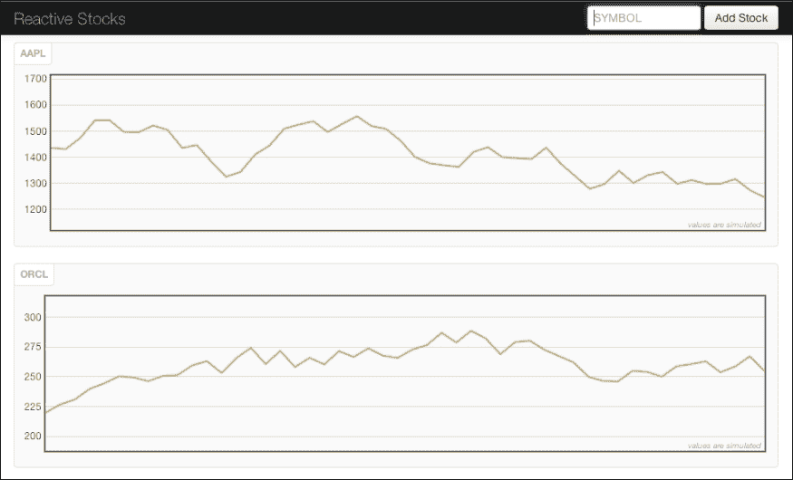
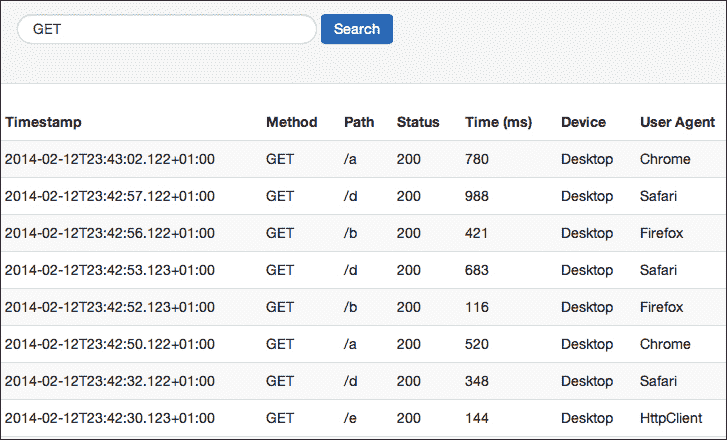
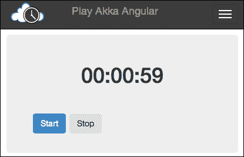
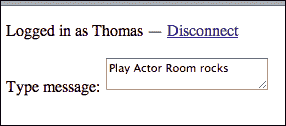
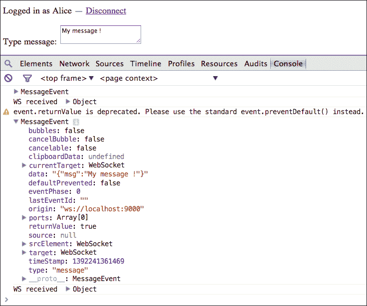
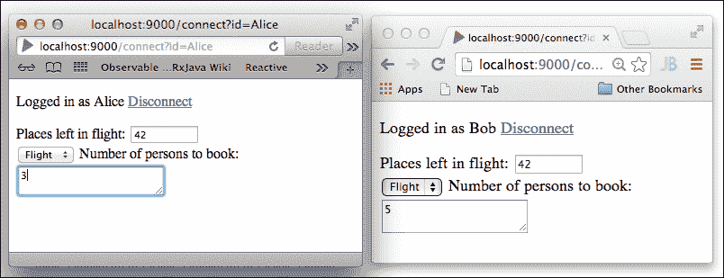

# 第九章：构建响应式 Web 应用程序

现代 Web 应用程序越来越需要我们从静态 Web 内容转向更动态的范式，其中大量的集成在后台进行，用户交互越来越复杂。同时，提供的在线服务需要适应不断变化的企业需求，并扩展到弹性负载，即处理高峰时段的流量。最后，除了提供的服务外，Web 应用程序现在倾向于收集有关用户交互的额外信息，以更好地理解客户行为。在本章中，我们将探讨以下主题：

+   理解使应用程序成为响应式的因素

+   介绍 Play 框架中使用 *Iteratees* 模式处理流

+   编写包括 Web Sockets 在内的响应式应用程序

# 描述响应式应用程序

Web 使用的传统拉模型，现在需要由双向通信来补充。这包括推送模型，其中用户，例如，接收异步和长时间运行服务的确认或只是接收各种类型的通知。

最近创建的响应式宣言，可在 [`www.reactivemanifesto.org`](http://www.reactivemanifesto.org) 查阅，旨在以技术无关的方式总结表征响应式应用程序的标准：

+   **响应用户事件**：消息传递架构，不浪费等待资源的时间

+   **响应用户负载**：通过避免对共享资源的竞争来关注可伸缩性

+   **响应用户失败**：构建具有在所有级别恢复能力的弹性系统

+   **响应用户操作**：无论负载如何，都要遵守响应时间保证

在不深入探讨你被鼓励阅读的宣言细节的情况下，我们可以直接看到，之前章节中 Akka 所使用的消息驱动架构的概念，与这种响应式模型非常契合。在接下来的章节中，我们将关注在 Play 框架之上构建此类 Web 应用程序的示例。

# 响应式处理流

当你在 Web 应用程序中需要消费和转换数据流时，例如监控股票更新或服务上的日志活动，你需要机制来操作可以从服务器推送到浏览器的数据块，例如使用 Comet ([`en.wikipedia.org/wiki/Comet_(programming)`](http://en.wikipedia.org/wiki/Comet_(programming))) 或 WebSocket ([`en.wikipedia.org/wiki/WebSocket`](http://en.wikipedia.org/wiki/WebSocket)) 技术。Play 框架中可用的 `Iteratee` 模式就是这样一种机制。它最初是从 Haskell 函数式语言中借用的。

## 理解 Play 中的 Iteratees

`Iteratee` 构造旨在提供一种可组合且非阻塞的方式来处理由其对应者 `Enumerator` 产生的流。

让我们启动一个 Scala REPL 来更详细地探索`Iteratee`/`Enumerator`结构。为了创建一个新的 play 项目，就像我们之前多次做的那样，特别是在第五章，*Play 框架入门*中，使用以下命令：

```java
> play new ch9samples (then choose Scala as language)
> cd ch9samples
> play console

```

首先，我们将提醒自己如何在类似 Java 这样的命令式语言中完成迭代。以下用 Scala 编写的语句描述了在迭代的每一步更新可变变量`total`的使用：

```java
scala> val numbers = List(1,4,7,8,10,20)
numbers: List[Int] = List(1, 4, 7, 8, 10, 20)
scala> var total = 0
total: Int = 0
scala> var iterator = numbers.iterator
iterator: Iterator[Int] = non-empty iterator
scala> while (iterator.hasNext) {
 total += iterator.next
 }
scala> total
res2: Int = 50

```

### 提示

如[`mandubian.com/2012/08/27/understanding-play2-iteratees-for-normal-humans/`](http://mandubian.com/2012/08/27/understanding-play2-iteratees-for-normal-humans/)博客文章中所述，在迭代时，我们需要注意以下事项：

+   迭代的状态（是否有更多元素要跟随，或者是否已完成）？

+   一个上下文（这里指总累加器）

+   一个更新上下文（即总+=iterator.next）的动作

我们在第一章，*在项目中交互式编程*中看到，我们可以通过使用以下方式的`foldLeft` Scala 结构以简洁和更函数式的方式实现相同的操作：

```java
scala> List(1,4,7,8,10,20).foldLeft(0){ (total,elem) =>
 total + elem } 
res3: Int = 50

```

`foldLeft`结构是一个强大的结构，它应用于 Scala 集合，如`Lists`。如果我们想处理其他形式的输入，如文件、网络、数据库连接或由 Akka actor 产生的流等，那么`Enumerator/Iteratee`就派上用场。`Enumerator`结构可以看作是数据的生产者（类似于之前的`List`），而`Iteratee`则是该数据的消费者，处理迭代的每个步骤。先前的涉及`List`上的`foldLeft`方法的例子可以用`Enumerator/Iteratee`结构重写。由于`iteratee`库已经在 Play 中可用，可以直接使用以下命令导入：

```java
scala> import play.api.libs.iteratee._
import play.api.libs.iteratee._
scala> import play.api.libs.concurrent.Execution.Implicits._
import play.api.libs.concurrent.Execution.Implicits._

```

在导入*iteratee*库和全局执行上下文，以便`iteratee`变量可以工作之后，我们可以定义我们的第一个`Enumerator`如下：

```java
scala> val enumerator = Enumerator(1,4,7,8,10,20)
enumerator: play.api.libs.iteratee.Enumerator[Int] = play.api.libs.iteratee.Enumerator$$anon$19@27a21c85...

```

以下定义的`iteratee`变量表示在从`enumerator`接受输入的同时要执行的计算步骤：

```java
scala> val iteratee = Iteratee.fold(0){ (total, elem:Int) => total + elem }
iteratee: play.api.libs.iteratee.Iteratee[Int,Int] = play.api.libs.iteratee.ContIteratee@e07a406

```

将`enumerator`结构和`iteratee`结构结合起来，就是调用`enumerator`的`run`方法，该方法接受`iteratee`作为参数：

```java
scala> val result = enumerator.run(iteratee)
result: scala.concurrent.Future[Int] = scala.concurrent.impl.Promise$DefaultPromise@78b5282b

```

由于我们有一个异步计算，我们得到一个`result`作为`Future`，一旦完成，我们可以显示它，如下所示：

```java
scala> result onComplete println
scala> Success(50)

```

之前提到的`enumerator`对象是一个整数枚举器。我们可以创建多种不同类型的数据生成器，例如字符串或双精度值。以下代码展示了这一点：

```java
scala> val stringEnumerator = Enumerator("one","two","four")
stringEnumerator: play.api.libs.iteratee.Enumerator[String] = play.api.libs.iteratee.Enumerator$$anon$19@1ca7d367
scala> val doubleEnumerator = Enumerator(1.03,2.34,4)
doubleEnumerator: play.api.libs.iteratee.Enumerator[Double] = play.api.libs.iteratee.Enumerator$$anon$19@a8e29a5

```

为了说明从文件创建枚举器的过程，让我们在当前项目的根目录中添加一个名为 `samplefile.txt` 的小文本文件，其中包含以下三行文本：

```java
Alice
Bob
Charlie
```

您可以在保留原始控制台窗口中的 REPL 运行的同时，在单独的控制台窗口中创建此文件。否则，您将不得不重新运行导入语句。以下命令显示了从文件创建 `Enumerator` 的示例：

```java
scala> import java.io.File
import java.io.File
scala> val fileEnumerator: Enumerator[Array[Byte]] = Enumerator.fromFile(new File("./samplefile.txt"))
fileEnumerator: play.api.libs.iteratee.Enumerator[Array[Byte]] = play.api.libs.iteratee.Enumerator$$anon$4@33500f2

```

`Enumerator` 还包含一些有用的方法。例如，每次包含当前时间的 `Promise` 对象超时（每 500 毫秒）时，都会生成一个事件流。

```java
scala> val dateGenerator: Enumerator[String] = Enumerator.generateM(
 play.api.libs.concurrent.Promise.timeout(
 Some("current time %s".format((new java.util.Date()))),
 500
 )) 

```

以更通用的方式，我们可以这样说，`Enumerator[E]`（读取类型 E 的枚举器）产生三种可能的类型 E 的数据块：

+   `Input[E]`: 它是类型 E 的一块数据，例如，`Input[LogData]` 是一块 `LogData`

+   `Input.Empty`：这意味着枚举器为空，例如，一个流式传输空文件的 `Enumerator`

+   `Input.EOF`：这意味着枚举器已到达其末尾，例如，一个构建文件流并到达文件末尾的 `Enumerator`

除了用于在 `Iteratee` 上运行 `run` 方法外，您还可以直接调用构造函数，即枚举器的 `apply` 方法。注意在以下两个命令中，根据您如何组合 `enumerator`/`iteratee`，您会得到不同的结果类型：

```java
scala> val result = enumerator.run(iteratee)
result: scala.concurrent.Future[Int] = scala.concurrent.impl.Promise$DefaultPromise@1837220f
scala> val result2=enumerator(iteratee)
result2: scala.concurrent.Future[play.api.libs.iteratee.Iteratee[Int,Int]] = scala.concurrent.impl.Promise$DefaultPromise@5261b67f

```

这个最后的 `Future` 结果包含一个 `Iteratee[Int,Int]`，即 `Iteratee[数据块中包含的类型, 迭代的结果]`。

```java
scala> val enumerator = Enumerator(1,4,7,8,10,20)
enumerator: play.api.libs.iteratee.Enumerator[Int] = play.api.libs.iteratee.Enumerator$$anon$19@7e666ce4

```

以下 `Iteratee` 消费来自 `enumerator` 流的所有块，并将它们作为 `List` 集合返回：

```java
scala> val chunksIteratee = Iteratee.getChunks[Int]
chunksIteratee: play.api.libs.iteratee.Iteratee[Int,List[Int]] = play.api.libs.iteratee.ContIteratee@53af8d86
scala> val list = enumerator.run(chunksIteratee)
list: scala.concurrent.Future[List[Int]] = scala.concurrent.impl.Promise$DefaultPromise@66e1b41c
scala> list onComplete println
scala> Success(List(1, 4, 7, 8, 10, 20))

```

我们迄今为止看到的 `Iteratee` 示例几乎完全使用 `fold` 方法，就像 Scala 集合中的 `foldLeft` 和 `foldRight` 方法一样。让我们尝试构建一个更复杂的 `Iteratee`：例如，从枚举器流中选择包含字母 `E` 的单词。这可以通过以下代码完成：

```java
scala> def wordsWithE: Iteratee[String,List[String]] = {
 def step(total:List[String])(input:Input[String]): Iteratee[String,List[String]] = input match {
 case Input.EOF | Input.Empty => Done(total,Input.EOF)
 case Input.El(elem) =>
 if(elem.contains("E")) Cont[String,List[String]](i=> step(elem::total)(i))
 else Cont[String,List[String]](i=> step(total)(i))
 }
 Cont[String,List[String]](i=> step(List[String]())(i))
}
wordsWithE: play.api.libs.iteratee.Iteratee[String,List[String]]

```

`step` 递归函数使用一个 `total` 累加变量，即在每个递归步骤中保持一些状态的上下文。这是一个包含所有我们感兴趣的结果的字符串列表。`step` 函数的第二个参数是每个步骤中从 `enumerator` 流中出现的新的数据块。这个数据块与可能的状态相匹配；如果流为空或者我们已经到达其末尾，我们以 `Done` 状态返回累积的结果。否则，我们处理传入的元素。如果元素验证 `if` 条件，那么我们将其添加到累加器中，并在递归的下一个步骤中作为 `Cont`（继续）状态调用下一个步骤。否则，我们只是调用下一个步骤而不保存元素。

最后，最后一步通过在流的第一元素上调用 `step` 函数并使用空累加器来启动递归。将这个新定义的 `Iteratee` 应用到一个简单的 `Enumerator` 上看起来像以下命令：

```java
scala> val output = Enumerator("ONE","TWO","THREE") run wordsWithE
output: scala.concurrent.Future[List[String]] = scala.concurrent.impl.Promise$DefaultPromise@50e0cc83
scala> output onComplete println
scala> Success(List(THREE, ONE))

```

对传入字符串进行的每个计算步骤要么将该字符串追加到总累加器中，要么忽略它，这取决于它是否匹配 `if` 条件。在这个例子中，它只是简单地检查单词中是否至少包含一个 `E`。

## 将 `Enumerator` 与 `Enumeratee` 适配

可能会发生这样的情况，`Iteratee` 消费的数据与 `Enumerator` 产生的输入不匹配。`Enumeratee` 的作用是作为位于 `Enumerator` 和 `Iteratee` 之间的适配器，在将数据馈送到 `Iteratee` 之前对传入的数据进行转换。

作为从 `Enumerator` 到另一个 `Enumerator` 的简单转换的例子，我们可以定义一个将输入类型 `String` 转换为 `Int` 的 `Enumeratee`，如下面的命令所示：

```java
scala> val summingIteratee = Iteratee.fold(0){ (total, elem:Int) => total + elem }
summingIteratee: play.api.libs.iteratee.Iteratee[Int,Int] = play.api.libs.iteratee.ContIteratee@196fad1a
scala> Enumerator("2","5","7") through Enumeratee.map(x => x.toInt) run summingIteratee
res5: scala.concurrent.Future[Int] = scala.concurrent.impl.Promise$DefaultPromise@5ec418a8
scala> res5 onComplete println
scala> Success(14)

```

`Enumeratee` 提供的转换可以在其 `map` 方法中声明。

适配 `Enumerator` 还可能包括将输入数据转换成不同的格式，而不改变其类型。考虑到我们之前定义的 `wordsWithE`，我们可以应用一个 `Enumeratee`，将所有输入数据转换为大写，这样 `Iteratee` 消费数据流的结果就会与没有 `Enumeratee` 时获得的结果不同。以下代码说明了这种行为：

```java
scala> val enumerator = Enumerator("ONE","Two","Three")
scala> enumerator run wordsWithE onComplete println
scala> Success(List(ONE))
scala> enumerator through Enumeratee.map(x=>x.toUpperCase) run wordsWithE onComplete println
scala> Success(List(THREE, ONE))

```

总结一下，`Enumerator` 是数据流的生成者，`Iteratee` 是该数据流的消费者，而 `Enumeratee` 是两者之间的适配器。*Iteratee* 模式已经与 Play 框架集成，作为在 Web 应用中反应式处理数据流的一种方式。在下一节中，我们将通过使用 WebSocket 在客户端和服务器之间双向通信，以这种方式构建 Web 应用。

# 在 Play 中实验 WebSocket 和 Iteratees

除了在查询服务时在浏览器中显示 HTML 的传统拉模型之外，大多数网络浏览器现在还支持通过 WebSocket 进行双向通信，这样服务器就可以在用户查询之前推送数据。一旦客户端和服务器之间建立了套接字，通信就可以保持开放，以便进行进一步交互，这与 HTTP 协议不同。现代 Web 应用越来越多地使用这个功能来从流中反应式地推送数据。

作为提醒，**WebSocket** 是一种在单个 TCP 连接上提供双向通信的协议，与 HTTP（无论是请求还是响应）的传统单向、无状态通信相反。让我们看看 Play 在这个领域提供的支持，并通过一个简短的示例演示如何建立 Play 服务器和客户端浏览器之间的 WebSocket 通信。

由于我们在本章开头已经创建了一个 `ch9samples` Play 项目来在 REPL 中实验 `Iteratees`，我们可以直接重用它。我们将首先打开默认可用的微小的 `controllers/Application.scala` 服务器端类。我们可以在其中添加一个新的 `connect` 方法来创建 WebSocket 交互。在一个常规的 Play 控制器中，一个方法通常会使用一个 `Action` 类，正如我们之前所看到的。在这个例子中，我们使用 `WebSocket` 类代替，如下所示：

```java
package controllers

import play.api._
import play.api.mvc._
import play.api.libs.iteratee._
import scala.concurrent.ExecutionContext.Implicits.global

object Application extends Controller {

  def index = Action {
    Ok(views.html.index("Your new application is ready."))
  }

  def connect =  WebSocket.using[String] { request =>

 // Concurrent.broadcast returns (Enumerator, Concurrent.Channel)
 val (out,channel) = Concurrent.broadcast[String]

 // log message to stdout and send response back to client
 val in = Iteratee.foreach[String] { msg =>
 println(msg)
 //the channel will push to the Enumerator
 channel push("RESPONSE: " + msg)
 }
 (in,out)
 }
}
```

在前面代码中看到的服务器端控制器中，`in` 变量包含处理来自客户端的消息的逻辑，并且它将产生一个 `Enumerator` 来组装一些将被推送到每个客户端的响应数据。

在客户端，`views/main.scala.html` 视图是我们将要添加 WebSocket 支持的地方，作为 JavaScript 脚本的一部分，其作用是打开一个 WebSocket 并对传入的消息做出反应。如下所示：

```java
@(title: String)(content: Html)

<!DOCTYPE html>

<html>
    <head>
        <title>@title</title>
        <link rel="stylesheet" media="screen" href="@routes.Assets.at("stylesheets/main.css")">
        <link rel="shortcut icon" type="image/png" href="@routes.Assets.at("images/favicon.png")">
        <script src="img/@routes.Assets.at("javascripts/jquery-1.9.0.min.js")" type="text/javascript"></script>

        <script type="text/javascript">
    function WebSocketTest() {
      if ("WebSocket" in window) {
         alert("WebSocket is supported by your Browser!");
         // Let us open a web socket
         var ws = new WebSocket("ws://localhost:9000/connect");
         ws.onopen = function() {
            // Web Socket is connected, send data
                 var msg = "Hello Websocket!"
            ws.send(msg);
            alert("Message is sent..."+msg);
         };
         ws.onmessage = function (evt) { 
            var received_msg = evt.data;
            alert("Message is received..."+received_msg);
         };
         ws.onclose = function() { 
            // websocket is closed.
            alert("Connection is closed..."); 
         };
      }
      else {
         // The browser doesn't support WebSocket
         alert("WebSocket NOT supported by your Browser!");
      }
    }
    </script>
  </head>
    <body>
        <div id="sse">
            <a href="javascript:WebSocketTest()">Run WebSocket</a>
           </div>
    </body>
</html>
```

现在我们已经拥有了两端，剩下的唯一步骤是为控制器的 `connect` 方法定义一个路由。编辑 `conf/routes` 文件，使其看起来如下所示：

```java
# Routes
# This file defines all application routes (Higher priority routes first)
# ~~~~

# Home page
GET  /      controllers.Application.index
GET  /connect    controllers.Application.connect

# Map static resources from the /public folder to the /assets URL path
GET  /assets/*file  controllers.Assets.at(path="/public", file)
```

现在，我们已经准备好通过从命令提示符启动 Play 服务器来尝试演示：

```java
> play run

```

在 `http://localhost:9000/`（最好是支持 WebSocket 的浏览器）中打开浏览器并点击 **运行 WebSocket** 链接，首先应该确认浏览器确实支持 WebSocket。点击 **确定** 几次后，首先会显示已经发送了一条消息，然后显示通过从服务器接收消息实现了往返。你也应该在 Play 服务器提示符上看到 `要发送的消息` 日志消息。

# 从激活器模板中学习

基于迭代器的反应性应用程序列表正在不断增长，这些应用程序已经被打包并作为激活器模板部署。在撰写本书时，我们已经确定了超过五个模板，你可以查看其中的一些。它们通常将 WebSocket 与 Akka 用于通信和消息处理混合在一起，在客户端，使用 Angular.js 等 JavaScript 框架来提供简单的 HTML 渲染。

由于 Typesafe 激活器模板 HTML 页面允许你选择标签来根据某些关键词过滤项目，你可以通过选择反应性复选框来检查适当的项目。

## 反应性股票

这个示例是基于 Play 的 Java 版本的项目。它以图形方式演示了股票价值的实时更新（为了简单起见，这些股票价值是随机生成的）。它包含 Java 和 Scala 代码。为每个股票符号实例化一个 Akka `StockActor` 演员，其作用是维护一个所有关注该股票的用户列表。一些附加功能通过查询 Twitter API 来检索所有匹配特定符号的推文（例如，[`twitter-search-proxy.herokuapp.com/search/tweets?q=appl`](http://twitter-search-proxy.herokuapp.com/search/tweets?q=appl)）。然后，这些知识可以被处理以计算一个情感指数，这有助于决定是否购买这只股票。以下截图展示了应用程序运行后的图形界面：



## 响应式实时搜索

为了展示 ElasticSearch 和 Typesafe 堆栈的响应式特性之间的集成，通过 Play iteratees 和 Akka，这个示例展示了如何将日志事件推送到浏览器。提醒一下，ElasticSearch ([`www.elasticsearch.org`](http://www.elasticsearch.org)) 是一个基于 Apache Lucene ([`lucene.apache.org`](https://lucene.apache.org)) 全文搜索引擎的成熟技术，是一个分布式实时搜索和分析引擎。

它特别提供了一个**过滤**功能，当新内容与搜索条件匹配时，它会通知您的应用程序（而不是需要轮询搜索引擎以定期检查新更新）。

为了模拟内容，一个 Akka `LogEntryProducerActor` 演员负责在每次接收到一个 `Tick` 消息时生成随机的日志条目。这些消息由充当搜索协调器的 `MainSearchActor` 演员定期产生。最后，一个 `ElasticSearchActor` 演员通过与嵌入的 ElasticSearch 服务器（`EmbeddedESServer`）交互来实现过滤功能，该服务器是从 Play 的 `Global` 类启动的。由于一旦知道了搜索条件，只需要单向通信，所以示例使用 **服务器端事件**（**SSE**）而不是通过 WebSocket 将信息推送到浏览器。

关于模板及其所有代码的更多信息可在 [`github.com/DrewEaster/realtime-search`](https://github.com/DrewEaster/realtime-search) 找到。特别是，搜索时需要输入的查询语法被定义为 Lucene 语法，并在 [`lucene.apache.org/core/4_3_1/queryparser/org/apache/lucene/queryparser/classic/package-summary.html#package_description`](http://lucene.apache.org/core/4_3_1/queryparser/org/apache/lucene/queryparser/classic/package-summary.html#package_description) 中指定。

如果我们通过安装和运行激活器模板（从模板项目的根目录使用`> activator run`命令）来执行此示例，我们可以在`localhost:9000`打开浏览器，并将`GET`作为搜索条件输入。几秒钟后，应该会逐渐显示一些浏览器输出，如下截图所示：



## The Play-Akka-Angular-WebSocket template

作为将信息主动推送到浏览器的另一个示例，此示例通过调度一个演员来更新客户端上的时钟。这个演员的作用是通过使用 Play 的`WebSocket.async[JsValue]`方法调用，通过 WebSocket 连接发送 JSON 格式的事件。在客户端使用 Angular.js JavaScript 框架，一旦开始运行，GUI 看起来如下截图所示：



展示反应式应用程序的激活器模板的数量正在增长。此外，您还可以不时查看新模板，而无需每次都升级激活器的版本。

# Playing with Actor Room

在上一节中，我们看到了许多使用`Enumerators`/`Iteratees`来反应式地发送和接收消息的项目，它们具有不同的复杂度级别。`Iteratees`功能强大，但有时使用它们可能会导致难以理解的代码片段。可在[`github.com/mandubian/play-actor-room`](https://github.com/mandubian/play-actor-room)找到的 Play Actor Room 项目，通过抽象这部分内容，让程序员只关注领域逻辑（例如处理传入的消息和组装传出消息），提出减少设置`Iteratees`的一些复杂性。该项目始于观察许多应用程序需要相同的功能，这可以看作是一个服务器`Room`（例如，持有状态，并在分布式客户端之间充当中间人）。这个房间的角色是监听来自已连接客户端的传入消息，在处理这些消息后广播接收到的消息，或者仅向单个客户端进行单播通信。这是应用程序如何对用户/事件做出反应的一个很好的说明。因此，像多用户聊天这样的典型应用程序编写起来非常直接，它们是给出的两个示例之一。让我们实验一下 actor room 支持的最低级使用，一个名为`simplest`的示例。

要在您的磁盘上的某个位置克隆项目，只需输入以下命令：

```java
> git clone https://github.com/mandubian/play-actor-room

```

首先，我们可以查看应用程序运行后的样子：

```java
> cd play-actor-room/samples/simplest
> play run

```

在默认的 Play 端口（`http://localhost:9000/`）打开浏览器将显示一个简单的**登录**小部件，如下截图所示。输入您的名字进行登录，在提供的文本区域中输入消息，然后按*Enter*键。



在你启动 actor room 应用程序的控制台窗口中，你现在应该能看到接收来自客户端浏览器消息的 actor 打印的日志信息。信息如下所示：

```java
[info] play - Application started (Dev)
[info] play - Starting application default Akka system.
[debug] application - Connected Member with ID:Thomas
[info] application - received Play Actor Room rocks

```

在打开几个浏览器窗口并使用不同的名字登录后，你可以在控制台中看到所有击中服务器房间的消息。实际上，actor room 会将接收到的消息广播回所有连接的浏览器，尽管目前视图中还没有处理这些消息的功能。

然而，你可以打开一个浏览器的控制台来查看广播消息的显示，如下面的截图所示：



此外，从第三个窗口调用`http://localhost:9000/list/` URL 将返回当前连接的客户端列表。

一旦我们将项目导入到 Eclipse 中（输入`> play eclipse`命令）并打开包含接收`Actor`类实现的控制器，就可以观察到这个基本应用的一些有趣特性。

作为服务器角色的`Receiver`角色是由一个监督`Actor`创建的。它处理 JSON 格式的消息。接收`Actor`的所有默认逻辑，也就是我们处理客户端消息时需要关注的唯一代码，如下所示：

```java
class Receiver extends Actor {
  def receive = {
    case Received(from, js: JsValue) =>
      (js \ "msg").asOpt[String] match {
        case None => play.Logger.error("couldn't msg in websocket event")
        case Some(s) =>
          play.Logger.info(s"received $s")
          context.parent ! Broadcast(from, Json.obj("msg" -> s))
      }
  }
}
```

注意，将服务器响应广播到所有客户端是由`context.parent`引用的监督角色完成的。在之前的逻辑中，`Broadcast`消息还包括发起者`from` `ActorRef`引用。

作为对默认房间行为的小修改以适应新的业务需求，例如，我们可以重用我们在第八章，*现代应用程序的基本属性 – 异步和并发*中创建的`TravelAgent`、`Flight`和`Hotel`角色。我们希望为每个用户提供预订航班的能力，并且（在任何时候）监控还有多少座位可用。为此，我们可以使用一个稍微大一点的 JSON 消息作为服务器和客户端之间的交换格式。

Scala 2.10 版本附带的一个有用的增强是字符串插值的理念。我们已经在整本书中使用了这个特性，并在第一章，*在项目中交互式编程*中介绍了它。同样，JSON 插值作为 Play 对 JSON 支持的扩展也被创建。我们可以重用 JSON 插值，例如，进行一些优雅的模式匹配。只需将以下扩展依赖项添加到`Build.scala`文件中：

```java
val appDependencies = Seq(
    "org.mandubian" %% "play-actor-room" % "0.1",
    "play-json-zipper" %% "play-json-zipper" % "1.0",
    "com.typesafe.play" %% "play-json"           % "2.2.0"
  )
```

一旦部署，JSON 模式匹配功能将处理来自浏览器客户端到`Receiver`角色的 JSON 消息，如下所示

```java
case Received(from, js: JsValue) =>
      js match {
        case json"""{
          "booking":"flight",
          "numberOfPersons":$v1
        }""" =>  play.Logger.info(s"received $v1")
        …
```

让我们添加一个`Flight` actor 来跟踪可用座位数。在位于`app/`源目录下的新包`actors`中，我们可以添加一个类似于以下内容的`Flight.scala`类：

```java
package actors

import akka.actor.Actor
import akka.event.LoggingReceive

object Flight {
  case class BookSeat(number:Int) {
    require(number > 0)
  }
  case object GetSeatsLeft
  case object Done
  case object Failed
}
class Flight extends Actor {
  import Flight._

  def book(seats:Int):Receive = LoggingReceive {
    case BookSeat(nb) if nb <= seats =>
      context.become(book(seats-nb))
      sender ! Done
    case GetSeatsLeft => sender ! seats
    case _ => sender ! Failed
  }

  def receive = book(50) // Initial number of available seats
}
```

与我们在第八章中创建可变状态变量`var seatsLeft`的做法不同，*现代应用程序的基本属性 – 异步和并发*，我们将这种状态变化封装为每次接收`BookSeat`消息时切换上下文时传递的参数。这种方式是避免持有可变变量的推荐最佳实践。我们添加了一个`GetSeatsLeft`消息，以便能够查询当前状态值，在这种情况下，状态会发送回`sender` actor。

在客户端，我们可以修改`index.scala.html`视图来向我们的应用程序添加几个简单的小部件。特别是，我们可以添加一个占位符来显示航班剩余的座位数。这是服务器室 actor 将推送到所有连接浏览器的信息。以下是一个此类视图的示例：

```java
@(connected: Option[String] = None)

@main(connected) {

  @connected.map { id =>
    <p class="pull-right">
     Logged in as @id
       <a href="@routes.Application.index()">Disconnect</a>
    </p>
    <div>Places left in flight: <input size="10" id="placesLeft"></input></div>

    <div>
      <select id ="booking">
        <option value="flight">Flight</option>
        <option value="hotel">Hotel</option>
      </select>
      Number of persons to book:
      <textarea id ="numberOfPersons" ></textarea>
    </div>

    <script type="text/javascript" charset="utf-8" src="img/@routes.Application.websocketJs(id)"></script>
  }.getOrElse {
    <form action="@routes.Application.connect(None)" class="pull-right">
      <input id="username" name="id" class="input-small" type="text" placeholder="Username">
        <button class="btn" type="submit">Sign in</button>
    </form>
  }
}
```

我们还需要稍微修改处理客户端浏览器和服务器之间通过 WebSocket 通信的小型 JavaScript 片段，以便它能够处理新的 JSON 格式。修改后的`websocket.scala.js`文件如下所示：

```java
@(id: String)(implicit r: RequestHeader)

$(function() {

  var WS = window['MozWebSocket'] ? MozWebSocket : WebSocket;
  var wsSocket = new WS("@routes.Application.websocket(id).webSocketURL()");
  var sendMessage = function() {
    wsSocket.send(JSON.stringify(
       {
         "booking":$("#booking").val(),
         "numberOfPersons":$("#numberOfPersons").val()
       }
    ))
    $("#numberOfPersons").val('');
  }

  var receiveEvent = function(event) {
    console.log(event);
    var data = JSON.parse(event.data);
    // Handle errors
    if(data.error) {
      console.log("WS Error ", data.error);
      wsSocket.close();
      // TODO manage error
      return;
    } else {
      console.log("WS received ", data);
      // TODO manage display
      $("#placesLeft").val(data.placesLeft);
    }
  }

  var handleReturnKey = function(e) {
    if(e.charCode == 13 || e.keyCode == 13) {
      e.preventDefault();
      sendMessage();
    }
  }

  $("#numberOfPersons").keypress(handleReturnKey);

  wsSocket.onmessage = receiveEvent;

})
```

最后，在服务器部分的`Application.scala`文件中，我们可以扩展`Receiver` actor 以处理传入的 JSON 消息，并联系`Flight` actor 来更新和读取其当前状态值，如下所示：

```java
[…imports from the original actor room sample…]
import play.api.libs.json._
import play.api.libs.functional.syntax._
import play.api.libs.json.extensions._

import actors._

object Receiver {
  val flightBookingActor = Akka.system.actorOf(Props[Flight],"flight")
}
class Receiver extends Actor {
  import Receiver.flightBookingActor

  def receive = LoggingReceive {
    case x:Int => 
      play.Logger.info(s"Received number of seats left: $x")
      val placesLeft:String = if (x<0) "Fully Booked" else x.toString
      context.parent ! Broadcast("flight", Json.obj("placesLeft" -> placesLeft))  
    case Received(from, js: JsValue) =>
      js match {
        case json"""{
          "booking":"flight",
          "numberOfPersons":$v1
        }""" => 
          play.Logger.info(s"received $v1")
          val nbOfPersons = v1.as[String]
          flightBookingActor ! Flight.BookSeat(nbOfPersons.toInt)
          val placesCount = flightBookingActor ! Flight.GetSeatsLeft           
        case _ => play.Logger.info(s"no match found")
      }
  }
}
```

现在我们已经准备好了所有组件，让我们在几个浏览器中运行示例。请注意，我们已经向`Receiver`和`Flight` actor 添加了`LoggingReceive`调用，以便在执行服务器代码时获得详细的日志输出。在命令提示符中，您可以输入以下命令以启动带有激活日志输出的 Play 应用程序：

```java
> play
> run -Dakka.loglevel=DEBUG -Dakka.actor.debug.receive=true

```

在 URL `http://localhost/9000`上打开两个浏览器窗口（可能使用两个不同的浏览器）。完成登录步骤；例如，使用**Alice**和**Bob**作为名称，分别从两个浏览器连接到 actor 室。

从任一窗口输入您想要预订的座位数将更新两个窗口中全局剩余座位数，如下面的截图所示：



服务器的控制台输出应显示如下日志信息：

```java
[info] play - Starting application default Akka system.
[debug] application - Connected Member with ID:Alice
[debug] application - Connected Member with ID:Bob
… 
Received(Bob,{"booking":"flight","numberOfPersons":"5"})
… 
Received(Alice,{"booking":"flight","numberOfPersons":"3"})
…
[info] application - Received number of seats left: 42
[DEBUG] [02/15/2014 22:51:01.226] [application-akka.actor.default-dispatcher-7] [akka://application/user/flight] received handled message GetSeatsLeft
[DEBUG] [02/15/2014 22:51:01.226] [application-akka.actor.default-dispatcher-6] [akka://application/user/$a/Alice-receiver] received handled message 42

```

输入的座位数大于剩余座位数时，计数器不会更新，最终会收到来自`Flight` actor 的`Fail`消息。

# 摘要

在本章中，我们尝试了 Play 框架支持的*迭代器*模式来处理流式数据。然后，我们结合 WebSockets 和 Akka 编写了一个小型、反应式的 Web 应用程序。

本章中我们讨论和处理的反应式 Web 应用程序的示例只是构建对事件做出反应且对失败和负载具有弹性的应用程序无限可能性的一个缩影。随着 Web 应用程序的复杂性增加，这种架构应该会越来越受欢迎和被采用。

在我们看来，能够以异步方式实时处理流是一个巨大的竞争优势，如果这个功能是以可管理和可维护的方式构建的。这正是 Play 框架与 Akka 结合所展示的目标。

在本书的下一章和最后一章中，我们将考虑一些我们认为 Scala 可以提供额外、方便帮助的领域。
