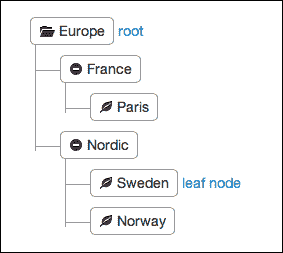
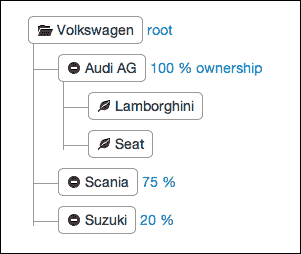
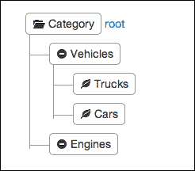
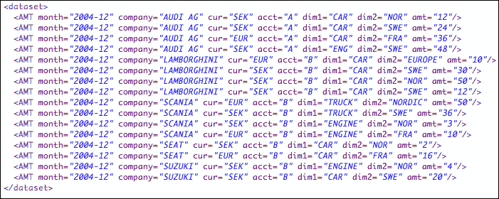
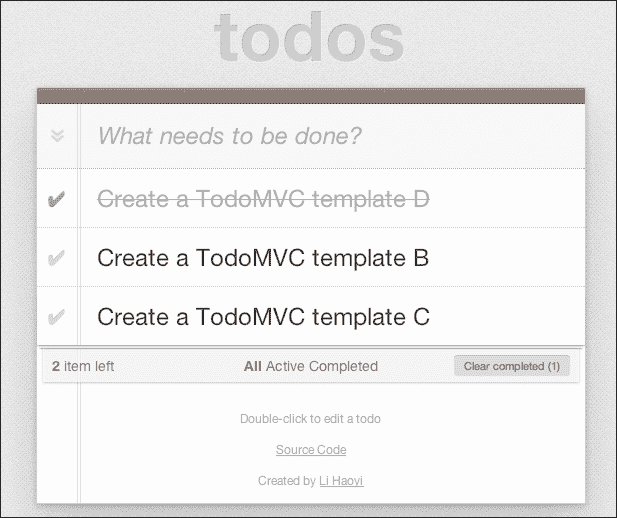

# 第十章. Scala 小技巧

在前面的章节中，我们已经介绍了一些技术和工具包，当它们结合在一起时，为在 Scala 中构建现代和可扩展的响应式 Web 应用提供了极大的机会。Scala 现在庆祝了 10 年的存在，拥有活跃的社区和大型企业的支持，这导致了不断探索触及语言和生态系统的创新思想。

在最后一章中，我们提出探讨一些我们发现了一些令人兴奋的正在进行中的项目或技术领域，以及我们认为 Scala 可以提供优雅的解决方案，既高效又有趣。我们将涵盖以下方面：

+   通过 MongoDB 进行 NoSQL 数据库访问

+   介绍领域特定语言（DSLs）以及特别是一瞥解析组合器

+   Scala.js—在客户端将 Scala 编译成 JavaScript

# 探索 MongoDB

随着过去几年需要处理和存储的信息量急剧增加，许多 IT 企业一直在寻找替代传统关系型数据库来存储和查询数据的方法。**不仅 SQL**（**NoSQL**）数据库运动作为一种以更高效或更灵活的数据存储为代价来交换数据一致性和结构的方式而受到欢迎。MongoDB（[www.mongodb.org](http://www.mongodb.org)）是一种数据库产品，旨在以 JSON 等格式存储文档，并且没有严格的数据库模式。除了构建用于访问和查询 MongoDB 数据库的 Java 驱动程序外，我们还将发现如何使用 Casbah Scala 工具包（[`github.com/mongodb/casbah`](https://github.com/mongodb/casbah)）通过 DSL 方便地访问和查询此类数据库。

## 进入 Casbah

要开始使用 Casbah 进行实验，唯一的要求是将它的`.jar`库依赖项添加到 SBT 或 Play 项目中。在你的磁盘上的一个新目录中，从终端窗口输入`> play new ch10samples`，并将 Casbah 依赖项添加到项目根目录下的`build.sbt`文件中。此依赖项通过添加以下代码添加（注意，在编写此章节时，所提供的 Casbah 版本是当时可用的最新版本，但很快将可用为最终版本 2.7.0）：

```java
name := "ch10samples"

version := "1.0-SNAPSHOT"

libraryDependencies ++= Seq(
  jdbc,
  anorm,
  cache,
  "org.mongodb" %% "casbah" % "2.7.0-RC1"
)     

play.Project.playScalaSettings
```

如果你正在使用 SBT 项目而不是 Play，你也可以添加默认的 SLF4J 日志实现，如下面的代码片段所示，否则默认使用的是无操作实现：

```java
libraryDependencies += "org.slf4j" % "slf4j-simple" % "1.7.6"
```

如同往常，启动 REPL 可以通过输入`> play`命令后跟`> console`命令或直接`> play console`来完成：

```java
scala> import com.mongodb.casbah.Imports._
import com.mongodb.casbah.Imports._

```

在进行一些导入之后，我们使用以下代码连接到端口`27017`上的 MongoDB 数据库：

```java
scala> val mongoClient = MongoClient("localhost", 27017)
mongoClient: com.mongodb.casbah.MongoClient = com.mongodb.casbah.MongoClient@6fd10428
scala> val db = mongoClient("test")
db: com.mongodb.casbah.MongoDB = test
scala> val coll = db("test")
coll: com.mongodb.casbah.MongoCollection = test

```

到目前为止，这些语句都是在没有直接接触数据库的情况下执行的。从现在开始，在检索任何内容之前，我们需要确保有一个运行的 MongoDB 进程。如果尚未运行，请启动`mongod`守护进程（下载说明可在[`www.mongodb.org/downloads`](https://www.mongodb.org/downloads)找到），然后输入以下命令以获取存储的集合名称：

```java
scala> db.collectionNames
res0: scala.collection.mutable.Set[String] = Set()

```

我们显然得到了一个空集作为结果，因为我们还没有存储任何文档。让我们创建几个条目：

```java
scala> val sales  = MongoDBObject("title" -> "sales","amount"->50)
sales: com.mongodb.casbah.commons.Imports.DBObject = { "title" : "sales" , "amount" : 50}
scala> val sweden  = MongoDBObject("country" -> "Sweden")
sweden: com.mongodb.casbah.commons.Imports.DBObject = { "country" : "Sweden"}

```

创建的项目尚未添加到数据库中，使用以下命令中的`insert`命令：

```java
scala> coll.insert(sales)
res1: com.mongodb.casbah.TypeImports.WriteResult = { "serverUsed" : "localhost:27017" , "n" : 0 , "connectionId" : 7 , "err" :  null  , "ok" : 1.0}
scala> coll.insert(sweden)
res2: com.mongodb.casbah.TypeImports.WriteResult = { "serverUsed" : "localhost:27017" , "n" : 0 , "connectionId" : 7 , "err" :  null  , "ok" : 1.0}
scala> coll.count()
res3: Int = 2

```

使用`find`方法检索`coll`集合的元素：

```java
scala> val documents = coll.find() foreach println 
{ "_id" : { "$oid" : "530fd91d03645ab9c17d9012"} , "title" : "sales" , "amount" : 50}
{ "_id" : { "$oid" : "530fd92703645ab9c17d9013"} , "country" : "Sweden"}
documents: Unit = ()

```

注意，由于我们在将文档插入集合时没有提供任何主键，每个文档都创建了一个主键。如果你确切知道你要找的对象，并提供给它作为参数，你也可以检索单个文档。为此，可以使用`findOne`方法，如下面的命令行所示：

```java
scala> val searchedCountry  = MongoDBObject("country" -> "Sweden")
searchedCountry: com.mongodb.casbah.commons.Imports.DBObject = { "country" : "Sweden"}
scala> val result = coll.findOne(searchedCountry)
result: Option[coll.T] = Some({ "_id" : { "$oid" : "530fd92703645ab9c17d9013"} , "country" : "Sweden"})

```

由于可能并不总是存在匹配的元素，`findOne`方法返回`Option`，在前一个例子中结果是`Some(value)`，与以下空结果形成对比：

```java
scala> val emptyResult = coll.findOne(MongoDBObject("country" -> "France"))
emptyResult: Option[coll.T] = None

```

删除元素是通过`remove`方法完成的，它可以像`findOne`方法一样使用：

```java
scala> val result = coll.remove(searchedCountry)
result: com.mongodb.casbah.TypeImports.WriteResult = { "serverUsed" : "localhost:27017" , "n" : 1 , "connectionId" : 9 , "err" :  null  , "ok" : 1.0}
scala> val countryNoMore = coll.findOne(searchedCountry)
countryNoMore: Option[coll.T] = None

```

最后，更新文档可以按照以下方式完成：

```java
scala> sales
res3: com.mongodb.casbah.commons.Imports.DBObject = { "title" : "sales" , "amount" : 50}
scala> val newSales = MongoDBObject("title" -> "sales","amount"->100)
newSales: com.mongodb.casbah.commons.Imports.DBObject = { "title" : "sales" , "amount" : 100
scala> val result = coll.update(sales,newSales)
result: com.mongodb.casbah.TypeImports.WriteResult = { "serverUsed" : "localhost:27017" , "updatedExisting" : true , "n" : 1 , "connectionId" : 9 , "err" :  null  , "ok" : 1.0}
scala> coll.find foreach println
{ "_id" : { "$oid" : "530fd91d03645ab9c17d9012"} , "title" : "sales" , "amount" : 100}

```

我们可以看到，主键"530fd91d03645ab9c17d9012"仍然是我们在最初将`sales`文档插入数据库时拥有的，这表明`update`操作不是删除然后插入一个全新的元素。

同时更新多个文档也是支持的，我们参考[`mongodb.github.io/casbah/guide/index.html`](http://mongodb.github.io/casbah/guide/index.html)中的文档以获取更多操作信息。

## 应用 MapReduce 转换

在 MongoDB 等文档型数据库的众多优秀特性中，还有运行 MapReduce 函数的可能性。**MapReduce**是一种方法，其中将查询或任务分解成更小的作业块，然后汇总这些块的结果。为了说明基于文档的方法有时与传统的关系型数据库相比可能更有用，让我们以一个小型的财务合并为例。在这个领域，为一个大公司全球范围内汇总和计算销售额可能需要处理多个正交维度。例如，销售额可以从每个子公司收集，每个子公司都有自己的地理位置、时间间隔、货币和特定类别，每个维度都遵循一些如图所示的树状结构：



地理位置可能是使用货币的决定性因素，并且应该进行转换以确保数值的一致性。在这方面，用于生成全球报告的货币通常遵循公司所有权树的根。以下是一个公司树结构的示例：



类似地，各种销售类别可能定义另一个层次结构，如下一个图所示：



报告的销售数据可能非常详细或已经累积，因此在不同层次的结构中报告。由于大型公司通常由各种所有权的较小群体组成，这些群体的所有权程度也在不断变化，因此整合工作需要根据所有这些参数聚合和计算数据。

对于许多以关系数据库表示的数据仓库解决方案，领域模型的核心可以是一个包含事实的大表，这些事实指的是前一个图中表示的各个维度。例如，本例的一些示例输入数据可以由以下销售数据（即金额）列表组成，作为 XML 行：



以下结构展示了如何在 JSON 中表示树结构：

```java
{
  "title" : "root",
  "children" : [
    {
      "title" : "node 1",
      "children" : [
        {
          "title" : "node 1.1",
          "children" : [
            ...
          ]
        },
        {
          "title" : "node 1.2",
          "children" : [
            ...
          ]
        }
      ]
    },
    {
      "title" : "node 2",
      "children" : [
        ...
      ]
    }
  ]
}
```

以下是一个包含按地理位置划分的销售数据的 JSON 文档示例：

```java
{
  "title" : "sales",
  "regions" : [
    {
      "title" : "nordic",
      "regions" : [
        {
          "title" : "norway",
          "amount" : 150
        },
        {
          "title" : "sweden",
          "amount" : 200
        }
      ]
    },
    {
      "title" : "france",
      "amount" : 400
    }
  ]
}
```

通过存储来自大型公司各个子公司的文档，例如 JSON，我们可以通过数据库已经支持的 MapReduce 转换来整合数据。此外，Casbah 利用 MongoDB 的聚合框架([`mongodb.github.io/casbah/guide/aggregation.html`](http://mongodb.github.io/casbah/guide/aggregation.html))，以便能够在不使用 MapReduce 的情况下聚合值。

以 MongoDB 为例，我们只需提及 ReactiveMongo 项目([www.reactivemongo.org](http://www.reactivemongo.org))，该项目是一个 MongoDB 的响应式异步非阻塞驱动程序。由于它使用了我们在第九章中介绍的 Iteratee 模式，即《构建响应式 Web 应用》，结合一个流友好框架，如 Play，可以产生许多有趣且可扩展的演示，如它们网站上所列。

# 探索大数据的表面

在最近的数据和服务分析成就和趋势中，大数据运动占据了一席之地。特别是，Hadoop 框架建立了一种某种临时的标准“用于在计算机集群中使用简单的编程模型跨集群分布式处理大型数据集”。除了用于高吞吐量访问数据的优化分布式文件系统 HDFS 之外，Hadoop 还提供了 MapReduce 功能，用于并行处理大型数据集。由于设置和运行 Hadoop 并不总是被认为是一项简单任务，因此已经开发了一些其他框架，作为在 Hadoop 之上简化 Hadoop 作业定义的手段。在 Java 中，Cascading 框架是在 Hadoop 之上的一层，它提供了一个方便的 API，以促进 MapReduce 作业的创建。在 Scala 中，Scalding 框架已经开发出来，通过利用简洁和表达性强的 Scala 语法来进一步增强 Cascading API，正如我们可以通过查看`activator-scalding` Typesafe activator 模板所观察到的。该模板提供的示例代码演示了一个单词计数应用程序，即 Hadoop MapReduce 作业的`hello-world`项目。

作为 MapReduce 工作的提醒，可以考虑阅读 Google 的原始论文，可在[`static.googleusercontent.com/media/research.google.com/en//archive/mapreduce-osdi04.pdf`](http://static.googleusercontent.com/media/research.google.com/en//archive/mapreduce-osdi04.pdf)找到。

我们可以用以下两个步骤来表示计数单词的工作：

+   将文件中的行拆分为单个单词，并为每个单词创建一个键值对，其中键是`String`类型的单词，值是常数`1`

+   通过将具有相同键（即相同的单词）的元素分组到列表中，并通过求和值来减少列表，我们达到了我们的目标

如果你在一个终端窗口中运行`> activator ui`命令，就像我们在第三章中已经多次做的那样，创建`activator-scalding`模板项目，你可以验证 scalding 中单词计数指定的简洁性。不要忘记运行`> activator eclipse`命令以便将项目导入到 Eclipse IDE 中：

```java
class WordCount(args : Args) extends Job(args) {

  // Tokenize into words by by splitting on non-characters. This
  // is imperfect, as it splits hyphenated words, possessives
  // ("John's"), etc.
  val tokenizerRegex = """\W+"""

  // Read the file specified by the --input argument and process
  // each line by trimming the leading and trailing whitespace,
  // converting to lower case,then tokenizing into words.
  // The first argument list to flatMap specifies that we pass the
  // 'line field to the anonymous function on each call and each
  // word in the returned collection of words is given the name
  // 'word. Note that TextLine automatically associates the name
  // 'line with each line of text. It also tracks the line number
  // and names that field 'offset. Here, we're dropping the
  // offset.

  TextLine(args("input"))
    .read
    .flatMap('line -> 'word) {
      line : String => line.trim.toLowerCase.split(tokenizerRegex) 
    }

  // At this point we have a stream of words in the pipeline. To
  // count occurrences of the same word, we need to group the
  // words together. The groupBy operation does this. The first
  // argument list to groupBy specifies the fields to group over
  // as the key. In this case, we only use the 'word field. 
  // The anonymous function is passed an object of type
  // com.twitter.scalding.GroupBuilder. All we need to do is
  // compute the size of the group and we give it an optional
  // name, 'count.
    .groupBy('word){ group => group.size('count) }

  // In many data flows, we would need to project out just the
  // 'word and 'count, since we don't care about them any more,
  // but groupBy has already eliminated everything but 'word and
  // 'count. Hence, we'll just write them out as tab-delimited
  // values.
    .write(Tsv(args("output")))
}
```

大部分代码确实是注释，这意味着整个算法非常接近人们会用伪代码做的描述。

如果你对大数据感兴趣，Scala 无疑填补了一个空白，并且已经有一些项目和框架正在处理大量数据流和类似 Hadoop 的工作，正在推动极限。其中，我们可以提到 Spark ([`spark.apache.org`](http://spark.apache.org)) 以及 Twitter 的开源项目 SummingBird ([`github.com/twitter/summingbird`](https://github.com/twitter/summingbird)) 和 Algebird ([`github.com/twitter/algebird`](https://github.com/twitter/algebird))。

# 在 Scala 中介绍 DSLs

**领域特定语言**（DSL）通常通过应用于一个小而特定的领域来简化与系统的交互。它们可以通过提供简化的 API 与系统通信来针对程序员；或者它们可能涉及所谓的“业务用户”，这些用户可能对领域有足够的了解以创建一些脚本，但他们不是程序员，可能难以处理通用编程语言。一般来说，存在两种类型的领域特定语言：

+   内部领域特定语言

+   外部领域特定语言（DSL）

## 观察内部领域特定语言（DSL）

内部领域特定语言使用宿主语言（例如，Scala），通过添加一些语法糖、技巧和语言的特殊结构来获得简化的使用方式。Debasish Ghosh 所著的《DSLs in Action》一书通过使用语言的特征（如中缀表示法和隐式转换）说明了 Scala 内部领域特定语言的构建。

他给出了以下领域特定语言使用示例，表示用清晰英语表达的可执行程序：`200 discount bonds IBM for_client NOMURA on NYSE at 72.ccy(USD)`。幕后发生了许多转换，但业务用户得到了一个非常干净的语法。

这种领域特定语言的优势在于，由于宿主语言是通用目的的（例如 Scala），你可以确信你可以用它们表达任何事物。这意味着有时你可能被迫使用不太干净的语法，但你清楚你手头有 Scala 编译器的全部功能。因此，你将始终成功产生一个实现你想要逻辑的领域特定语言脚本或程序。

然而，编译器的全部功能也可能是在许多情况下你想要避免的，在这些情况下，你希望给你的业务用户提供仅执行少数特定操作的可能性。为此，你可以实现外部领域特定语言。这包括许多额外的关注点，包括受限的语法（例如，在某些情况下你无法避免括号）和复杂的错误信息。

## 通过解析组合器处理外部领域特定语言

外部领域特定语言代表了一种语法完全由你决定的领域语言。这意味着你可以按照自己的意愿精确地表达事物，并且可以限制你的业务用户只能使用特定的单词或含义。这种灵活性伴随着需要付出更多的工作来实现它，因为你需要定义一个语法（通常是**巴科斯-诺尔范式**（BNF）），即定义所有成功解析意义或脚本的规则。在 Java 中，编写外部领域特定语言的任务可能很繁琐，通常涉及到 ANTLR 外部框架。

在 Scala 中，解析组合器是一个与 BNF 语法定义非常接近的概念，并且在编写外部领域特定语言时可以提供非常简洁和优雅的代码。

一旦你熟悉了处理语法定义的一些特定运算符，你就会发现，如果你的语言不是太复杂，编写外部领域特定语言（DSL）相当直接。关于涉及解析器组合器的所有符号和运算符的详细信息，可以在[`bitwalker.github.io/blog/2013/08/10/learn-by-example-scala-parser-combinators/`](http://bitwalker.github.io/blog/2013/08/10/learn-by-example-scala-parser-combinators/)找到。

以下实验性代码演示了在财务合并领域的一个小型领域特定语言（DSL），其中特定的货币账户作为预定义公式的部分被操作。以下代码片段末尾给出的主方法反映了一个公式；例如，你可能将公式（`3*#ACCOUNT1#`）解析为一个面向对象的结构，该结构能够计算给定账户内容乘以三的结果：

```java
package parsercombinator

import scala.util.parsing.combinator._
import java.text.SimpleDateFormat
import java.util.Date

object FormulaCalculator {

  abstract class Node

  case class Transaction(amount: Int)
  case class Account(name:String) extends Node {
    var transactions: Iterable[Transaction] = List.empty
  }

  def addNewTransaction(startingBalance: Int, t: Transaction) = startingBalance + t.amount
  def balance(account: Account) = account.transactions.foldLeft(0)(addNewTransaction)

  case class NumberOfPeriods (value: Int) extends Node {
    override def toString = value.toString
  }
  case class RelativePeriod (value:String) extends Node {
    override def toString = value
  }
  case class Variable(name : String) extends Node
  case class Number(value : Double) extends Node
  case class UnaryOp(operator : String, arg : Node) extends Node
  case class BinaryOp(operator : String, left : Node, right : Node) extends Node
  case class Function(name:String,arguments:List[Node]) extends Node {
    override def toString =
      name+arguments.mkString("(",",",")")
  }…
```

从公式解析中产生的对象被定义为**案例类**。因此，继续编写代码：

```java
…
  def evaluate(e : Node) : Double = {
    e match {
      case Number(x) => x
      case UnaryOp("-", x) => -(evaluate(x))
      case BinaryOp("+", x1, x2) => (evaluate(x1) + evaluate(x2))
      case BinaryOp("-", x1, x2) => (evaluate(x1) - evaluate(x2))
      case BinaryOp("*", x1, x2) => (evaluate(x1) * evaluate(x2))
      case BinaryOp("/", x1, x2) => (evaluate(x1) / evaluate(x2))
    }
  }

  object FormulaParser extends JavaTokenParsers {        

    val identifier: Parser[String] = ident
    val relative_period: Parser[RelativePeriod] = """([N|P|\+|\-][0-9]+|CURRENT)""".r ^^ RelativePeriod
    val number_of_periods: Parser[NumberOfPeriods] = """\d+""".r ^^ (i => NumberOfPeriods(i.toInt))
    val account_name: Parser[String] = """[A-Za-z0-9_]+""".r

    def account: Parser[Account] = "#" ~> account_name <~ "#" ^^ { Account(_) }

    def function: Parser[Function] =
      identifier~"("~account~","~relative_period~","~number_of_periods~")" ^^ {
        case f~"("~acc~","~rp~","~nbp~")" => Function(f,List(acc,rp,nbp))
      } |
      identifier~"("~account~","~relative_period~")" ^^ {
        case f~"("~acc~","~rp~")" => Function(f,List(acc,rp))
      }

      def node: Parser[Node] =
        (term ~ "+" ~ term) ^^ { case lhs~plus~rhs => BinaryOp("+", lhs, rhs) } |
        (term ~ "-" ~ term) ^^ { case lhs~minus~rhs => BinaryOp("-", lhs, rhs) } |
        term

      def term: Parser[Node] =
        (factor ~ "*" ~ factor) ^^ { case lhs~times~rhs => BinaryOp("*", lhs, rhs) } |
        (factor ~ "/" ~ factor) ^^ { case lhs~div~rhs => BinaryOp("/", lhs, rhs) } |
        (factor ~ "^" ~ factor) ^^ { case lhs~exp~rhs => BinaryOp("^", lhs, rhs) } |
        factor

      def factor : Parser[Node] =
        "(" ~> node <~ ")" |
        floatingPointNumber ^^ {x => Number(x.toFloat) } |
        account |
        function

      def parse(text : String) =
            parseAll(node, text)        
    }

    // Parses 3 formula that make computations on accounts
    def main(args: Array[String]) {

        val formulaList = List("3*#ACCOUNT1#","#ACCOUNT1#- #ACCOUNT2#","AVERAGE_UNDER_PERIOD(#ACCOUNT4#,+1,12)")

        formulaList.foreach { formula =>
            val unspacedFormula = formula.replaceAll("[ ]+","")
            println(s"Parsing of $formula gives result:\n ${FormulaParser.parse(unspacedFormula)}")
        }
    }
}
```

如果我们通过在`FormulaCalculator`类上右键单击并将鼠标移动到**运行方式** | **Scala 应用程序**来执行这个解析器组合器代码，我们应该在 Eclipse 控制台中获得以下输出：

```java
Parsing of 3*#ACCOUNT1# gives result:
 [1.13] parsed: BinaryOp(*,Number(3.0),Account(ACCOUNT1))
Parsing of #ACCOUNT1#- #ACCOUNT2# gives result:
 [1.22] parsed: BinaryOp(-,Account(ACCOUNT1),Account(ACCOUNT2))
Parsing of AVERAGE_UNDER_PERIOD(#ACCOUNT4#,+1,12) gives result:
 [1.39] parsed: AVERAGE_UNDER_PERIOD(Account(ACCOUNT4),+1,12)

```

此输出表明，三个公式已正确解析并转换为类。最终的评估在这个练习中被省略，但可以通过在两个账户上定义一些实际交易来设置。

# 介绍 Scala.js

由于 Java 拥有强大的 JVM，可以在任何地方运行服务器端代码，因此 Java 成为了一个引人注目的选择。而 JavaScript 由于其灵活性、轻量级的运行时嵌入环境以及浏览器中已经可用的工具集日益增长，正逐渐成为客户端的主导选择。尽管 JavaScript 非常流行，但作为一个动态语言，它并不提供像 Java 或 Scala 这样的语言所提供的类型安全。实验性的但快速增长的 Scala.js 项目旨在将 Scala 编译成 JavaScript，在我看来，对于那些想要从 Scala 类型系统的强大功能中受益的人来说，这是一个非常好的替代方案。

设置一个展示 Scala.js 使用的项目只需几分钟，并在可用的示例“入门”项目中进行了说明，该项目的网址为[`github.com/sjrd/scala-js-example-app`](https://github.com/sjrd/scala-js-example-app)。

示例包括一个包含一个`playground <div>`元素的简单 HTML 页面，如下面的 HTML 代码所示：

```java
<!DOCTYPE html>
<html>
<head>
  <title>Example Scala.js application</title>
  <meta http-equiv="Content-Type" content="text/html; charset=UTF-8"/>
</head>
<body>

<h1>Example Scala.js application - development version</h1>

<p>After having compiled and packaged properly the code for the application
(using `sbt packageJS`), you should see "It works" here below.
See README.md for detailed explanations.</p>

<div id="playground">
</div>

<script type="text/javascript" src="img/example-extdeps.js"></script>
<script type="text/javascript" src="img/example-intdeps.js"></script>
<script type="text/javascript" src="img/example.js"></script>

</body>
</html>
```

`div`元素将被动态填充为：

```java
<p>
  <strong>It works!</strong>
</p>
```

实现这一点的 Scala 代码片段（编译成 JavaScript）在下面的`main`方法中给出：

```java
package example

import scala.scalajs.js
import js.Dynamic.{ global => g }

object ScalaJSExample {
  def main(): Unit = {
    val paragraph = g.document.createElement("p")
    paragraph.innerHTML = "<strong>It works!</strong>"
    g.document.getElementById("playground").appendChild(paragraph)
  }

  /** Computes the square of an integer.
   *  This demonstrates unit testing.
   */
  def square(x: Int): Int = x*x
}
```

一旦我们通过`js.Dynamic.global`对象获得了 HTML 页面的 DOM 访问权限，这个简单的 Scala `main`方法就构建了一个新的段落节点并将其添加到现有的`"playground"`节点中。

额外的 `square` 方法被用来展示针对 Jasmine JavaScript 测试框架编写的单元测试。

`main` 方法的执行是由添加到 `js/startup.js` 文件中的一行触发的：

```java
ScalaJS.modules.example_ScalaJSExample().main();
```

Scala.js 默认生成的代码可能相当大，因为依赖于 Scala 库。Scala.js 通过 Google 的 closure compiler 提供了一种优化方法，可以减小大小并优化针对生产环境的目标 JavaScript 代码执行。

现在下一步是什么？嗯，我们可以将感兴趣的读者推荐给一些我们认为与这本书相关的更多有趣项目：

+   一个名为 `play-with-scalajs-example` 的项目，可在 [`github.com/vmunier/play-with-scalajs-example`](https://github.com/vmunier/play-with-scalajs-example) 找到，它处理了 Scala.js 和 Play 框架的简单集成示例，我们在前面的章节中已经介绍过。

+   Scala.js 的一个非常有趣且更高级的使用是 `TodoMVC`，这是 `workbench-example-app` 项目的一部分，可在 [`github.com/lihaoyi/workbench-example-app/`](https://github.com/lihaoyi/workbench-example-app/) 找到。它演示了一个用于创建待办事项列表的示例网络应用，这是一个指定用于比较在不同语言中完成的不同实现的参考应用，但它采用了创新的方法，即除了用 Scala 编译成 JavaScript 外，还具有响应式特性。到结果响应式网络应用的直接链接可在 [`lihaoyi.github.io/workbench-example-app/todo.html`](http://lihaoyi.github.io/workbench-example-app/todo.html) 找到，并在浏览器中渲染，如下面的截图所示：



在 Scala.js 的主页 [`www.scala-js.org/`](http://www.scala-js.org/) 上已经列出了许多关于 Scala.js 的项目。由于 Scala.js 正在迅速成熟，应该很快会有更多项目可用。

# 最后的提示

下面的章节列出了几个你可能在使用 REPL 时觉得有用的最终提示和技巧。

## 在 REPL 中复制和粘贴

作为提醒，这个特性是在 第八章 中引入的，*现代应用程序的基本属性 – 异步和并发*，它使得在 REPL 中一次性执行整个代码片段变得容易。例如，以下命令行说明了 REPL 中的复制粘贴功能如何帮助轻松执行代码：

```java
scala> :paste
// Entering paste mode (ctrl-D to finish)

[Copy a code block from somewhere with ctrl-C/ctrl-V]

 case class Person(name:String)

 val me = Person("Thomas")
 val you = Person("Current Reader")

 val we = List(you,me).map(_.name).reduceLeft(_+" & "+_)
 val status = s"$we have fun with Scala"

[Once you are done with pasting the code block, press ctrl-D]

// Exiting paste mode, now interpreting.

defined class Person
me: Person = Person(Thomas)
you: Person = Person(Current Reader)
we: String = Current Reader & Thomas
status: String = Current Reader & Thomas have fun with Scala

```

## 在 REPL 中计时代码执行

在本书中，REPL 一直是一个非常有用的工具，用于发现和实验 Scala 的各种功能。与第三章中介绍的 Scala 工作表理解 Scala 生态系统一起，它们通过提供持续反馈来提高我们的生产力，从而使我们的开发更加敏捷。有时，测量 REPL 中执行语句或代码片段所需的时间是很方便的。这就是我们提供实现这一目标的一种方法的原因。

首先，我们定义一个名为`using`的`help`函数，它接受两个参数，第一个是类型为`A`的`param`参数，第二个是函数参数`f`，它将参数的类型从`A`转换为`B`：

```java
scala> def usingA <: {def close(): Unit},B(f: A=>B): B =
 try { f(param) } finally { param.close() }
using: A <: AnyRef{def close(): Unit}, B(f: A => B)B

```

`using`的作用是调用`f(param)`函数，将其包裹在`try {} finally{}`块中。由于这个函数背后的想法是在 I/O 资源（如`FileWriter`或`PrintWriter`）上应用它，我们想要保证无论发生什么情况都能关闭资源。这就是为什么你在`finally`块中看到`param.close`调用。这意味着`param`参数不能只是任何类型`A`；它必须具有额外的要求，即有一个`close`方法。这正是泛型`using`方法定义开始处所声明的（即`[A <: {def close(): Unit}, B]`）；`param`参数应该是`A`的子类型，它包含一个具有给定签名的函数。

通常，处理泛型类型超出了本书的范围，你不需要真正理解前面的定义就能从`using`函数中受益。然而，这个例子说明了在 Scala 中使用泛型类型可以多么强大。Scala 的类型系统非常强大，编译器在编写泛型代码时会给你很大的帮助，这与 Java 中泛型的使用不同。

现在，让我们将`using`函数包含到一个`appendToFile`函数中，该函数将负责记录我们在 REPL 中编写的代码的评估：

```java
scala> def appendToFile(fileName:String, textData:String) =
 using (new java.io.FileWriter(fileName, true)){
 fileWriter => using (new java.io.PrintWriter(fileWriter)) {
 printWriter => printWriter.println(textData)
 }
 }
appendToFile: (fileName: String, textData: String)Unit

```

最后，以下`timeAndLogged`函数被声明为将 REPL 中输入的代码片段包裹在日志记录和计时功能中：

```java
scala> def timedAndLoggedT: T = {
 val start = System.nanoTime
 try {
 val result = body
 appendToFile("/tmp/repl.log",result.toString)
 result
 }
 finally println(" "+(System.nanoTime - start) + " nanos elapsed. ")
}
timedAndLogged: TT

```

直到 Scala 2.10.0，你可以使用 REPL 强大模式的`:wrap`方法（通过 REPL 中的`> :power`命令访问）来执行所有控制台语句，而无需进一步涉及`timedAndLogged`函数。`:wrap`功能最近已被从 Scala 版本中移除，因此你将不得不显式地将你想要计时或记录的代码包裹在`timedAndLogged`方法中，因此，你不需要涉及 REPL 的强大模式。

例如，你可以执行以下命令：

```java
scala> timedAndLogged{ val input = 2014 ; println(input) ; Thread.sleep(2000) ; input }

2014
 2004778000 nanos elapsed. 
res0: Int = 2014

```

我们在`timedAndLogged`函数中指定的`/tmp/repl.log`文件当然应该包含已记录的结果，即`2014`。

# 摘要

现在我们已经到达这本书的结尾，我们想强调在 Scala 之旅中我们接触到的许多主题和概念的关键方面。

Scala 语言的简洁和表达性语法应该使你的代码不仅更易于阅读，而且对你和其他开发者来说也更易于维护。你不必放弃 Java 生态系统中非常庞大和成熟的任何库，因为所有 API 都可以在 Scala 中直接重用。此外，你还可以从许多额外的优秀 Scala 特定库中受益。我们的建议是从你非常熟悉的领域取一段 Java 代码，也许是因为你最初就编写过它一两次。然后，尝试将其转换为 Scala 代码，并重构它以去除样板代码，使其更具函数式风格。

Play 框架不仅仅是一个 Web 框架；它打破了遵循 servlet 和 EJB 容器的传统长周期开发方法，每次重新部署都可能花费大量时间。此外，它建立在坚固和可扩展的技术之上，如 Akka，这应该让你对未来高负载和约束可用性要求感到自信。最后，我们使用它的个人经验非常愉快，因为背后的 Scala 编译器在出错时，大多数情况下都能给出非常清晰的反馈，从模板和路由规范到问题所在。由于 Play 和 Akka 都公开了 Java API，它们可以使你的过渡更容易。

我们相信，网络开发的未来是响应式的，处理大量数据流，正如它已经在许多领域发生，例如涉及内容分发和实时金融/分析服务的社交媒体网站。

我们只是触及了 Scala 所能做到的一小部分。随着你深入探索个别技术，你会发现新的特性和无限的可能性。我们的建议是一步一步地寻找可实现的目标。例如，首先熟悉 Scala 集合，特别是它们可以帮助你更好地掌握 Java 的 lambda 表达式和函数式编程，然后使用模式匹配、特质、for 推导式编写代码，然后转向更高级的主题，如隐式类型、泛型等。

最后，作为灵感，已经有大量的开源项目是用 Scala 完成的，关于我们涵盖的各个主题的许多书籍，许多由非常活跃的 Scala 社区贡献的论坛，以及来自用户组和国际会议（如 Scaladays [www.scaladays.org](http://www.scaladays.org)）、Scala eXchange [www.skillsmatter.com/conferences/1948-scala-exchange-2014](http://www.skillsmatter.com/conferences/1948-scala-exchange-2014)、NEScala [www.nescala.org](http://www.nescala.org)、Jfokus [www.jfokus.se](http://www.jfokus.se)、Scala.io [www.scala.io](http://www.scala.io)、flatMap [www.flatmap.no](http://www.flatmap.no)、Ping [www.ping-conf.com](http://www.ping-conf.com) 和 Scalapeño [www.scalapeno.underscore.co.il](http://www.scalapeno.underscore.co.il) 等会议的数年极有价值的在线视频，仅举几个例子。Scala 活动的整个日历网站可在 [`www.scala2014.org`](http://www.scala2014.org) 查找。

有了这个想法，我希望你们对这本书的喜爱足以继续探索 Scala，编写出色的代码，并像我们一样享受乐趣！
