# 编写你的第一个程序

2001 年，Martin Odersky 开始设计 Scala 语言——他花了三年时间发布了第一个公开版本。这个名字来源于 Scalable language。之所以选择这个名字，是因为 Scala 被设计成随着用户需求的增长而发展——你可以使用 Scala 编写小脚本，也可以用它开发大型企业级应用。

Scala 自那时起一直在不断进化，其受欢迎程度也在不断增长。作为一种通用语言，它被广泛应用于金融、电信、零售和媒体等多个行业。在分布式可扩展系统和大数据处理方面，Scala 尤其引人注目。许多领先的开源软件项目都是用 Scala 开发的，例如 Apache Spark、Apache Kafka、Finagle（由 Twitter 开发）和 Akka。许多公司都在生产中使用 Scala，例如摩根士丹利、巴克莱斯、Twitter、LinkedIn、卫报和索尼。

Scala 不是 Java 的扩展，但它与 Java 完全兼容。你可以从 Scala 调用 Java 代码，也可以从 Java 调用 Scala 代码。还有一个编译器可以将 Scala 代码编译成 JavaScript，我们将在本书的后续章节中探讨。因此，你可以在浏览器中运行 Scala 代码。

Scala 是面向对象和函数式编程范式的混合体，并且是静态类型的。因此，它可以作为从面向对象或命令式背景的人逐渐过渡到函数式编程的桥梁。

在本章中，我们将涵盖以下主题：

+   设置你的环境

+   使用基本功能

+   运行 Scala 控制台

+   使用 Scala 控制台和工作表

+   创建我的第一个项目

# 设置你的环境

首先，我们需要设置我们的工作环境。在本节中，我们将获取所有工具和库，然后在你的计算机上安装和配置它们。

Scala 程序被编译成 Java 字节码，这是一种可以由**Java 虚拟机**（**JVM**）执行的汇编语言。因此，你需要在你的计算机上安装 Java 编译器和 JVM。**Java 开发工具包**（**JDK**）提供了这两个组件以及其他工具。

你可以使用简单的文本编辑器在 Scala 中开发，并使用 Scala 的**简单构建工具**（**SBT**）编译你的程序。然而，这不会是一个愉快或高效的经验。大多数专业的 Scala 开发者使用**集成开发环境**（**IDE**），它提供了许多有用的功能，如语法高亮、自动完成、代码导航、与 SBT 集成等。Scala 最广泛使用的 IDE 是来自 JetBrains 的 IntelliJ Idea，这是我们将在本书中安装和使用的 IDE。其他选项包括 Eclipse 的 Scala IDE 和 ENSIME。ENSIME 是一个开源项目，为流行的文本编辑器（如 Emacs、Vim、Atom、Sublime 和 VSC）带来了类似 IDE 的功能。

# 安装 Java SDK

我们将安装 Oracle JDK，它包括 JVM 和 Java 编译器。在许多 Linux 发行版中，开源的 OpenJDK 已经预安装。OpenJDK 与 Oracle JDK 完全兼容，因此如果您已经有了它，您不需要安装任何其他东西来遵循这本书。

您可能已经在计算机上安装了 Java SDK。我们将检查这是否属实。如果您使用 Windows，请打开 DOS 命令提示符。如果您使用 macOS 或 Linux，请打开终端。在提示符后，输入以下内容：

```java
javac -version
```

如果你已经安装了 JDK，将打印出已安装编译器的版本：

```java
javac 1.8.0_112
```

如果已安装的版本大于或等于 1.8.0_112，您可以跳过 JDK 安装。我们将使用的 Scala 版本与 JDK 版本 1.8 或 1.9 兼容。

如果没有，请打开以下网址，下载您平台上的 SDK，并按照提供的安装说明进行操作：[`www.oracle.com/technetwork/java/javase/downloads/jdk8-downloads-2133151.html`](http://www.oracle.com/technetwork/java/javase/downloads/jdk8-downloads-2133151.html)。

# 安装 IntelliJ IDEA

前往 [`www.jetbrains.com/idea/download.`](https://www.jetbrains.com/idea/download) 下载您平台上的社区版。终极版提供更多功能，但在这本书中我们不会使用它们。

以下是在安装 IntelliJ IDEA 时的步骤：

1.  运行 IntelliJ Idea。

1.  选择“不导入设置”选项：

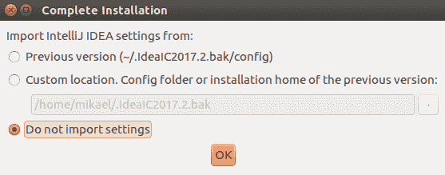

1.  选择 UI 主题。我个人更喜欢 Dracula，因为深色背景在笔记本电脑上可以节省电池，并且对眼睛更温和：

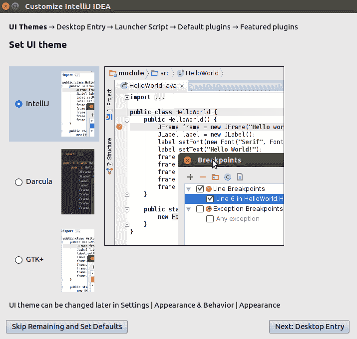

1.  通过勾选提供的选项来创建桌面条目：

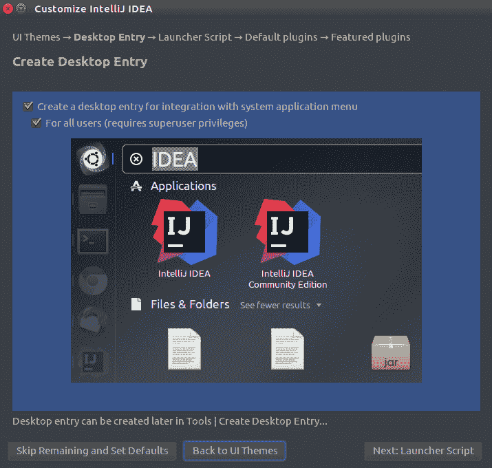

1.  在“创建启动器脚本”对话框窗口中，勾选创建脚本...复选框。这将允许您从命令行打开 IntelliJ 中的文件：

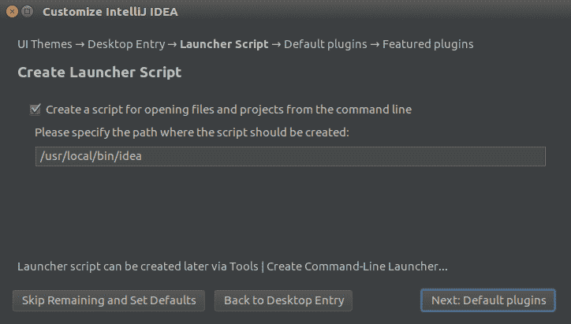

1.  自定义插件。对于每个组件，点击“自定义...”或“全部禁用”。我们不需要大多数插件。您只能选择以下选项：

+   构建工具：全部禁用。

+   版本控制：仅保留 Git 和 GitHub。

+   测试工具：全部禁用。

+   Swing：禁用。

+   Android：禁用。

+   其他工具：全部禁用并保留字节码查看器、终端和 YAML。

+   插件开发：禁用。

您可以在以下截图中看到上述插件：


1.  安装特色插件——还为您推荐了一些额外的插件，例如 Scala 插件和用于学习 IntelliJ 基本功能的工具。

1.  如下截图所示，点击安装按钮为 Scala 和 IDE 功能训练师，然后通过点击“开始使用 IntelliJ IDEA”继续：

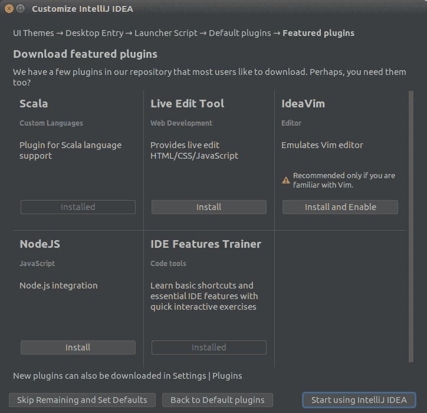

如果你已经是 Vim 爱好者，你可以安装 IdeaVim。否则，我建议你避免使用它。我个人每天都在使用它，但花了一些时间才习惯。

1.  点击创建新项目 | Scala | sbt：


1.  填写以下详细信息，如以下截图所示：

+   名称：`scala_fundamentals`。

+   JDK：点击新建，然后选择 Oracle JDK 的安装目录。

+   sbt：选择版本 1.0.4，勾选源代码。

+   Scala：选择最新版本 2.12.x，例如 2.12.4（IntelliJ 列出了所有可能的版本，并将下载你选择的版本），勾选源代码。

+   点击完成。

这将取决于你的互联网连接速度所需的时间：

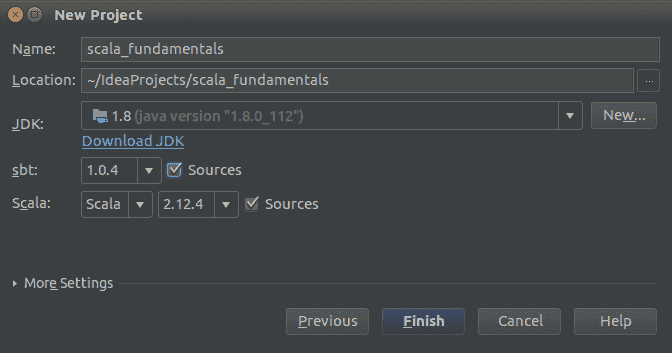

1.  你应该看到以下项目结构：

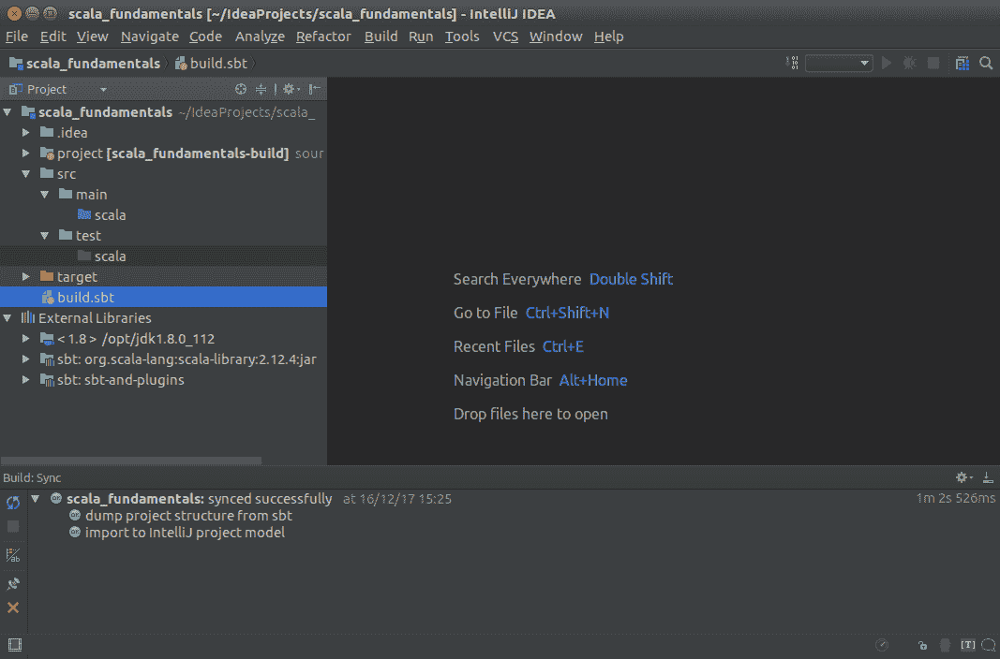

# 使用基本功能

在本节以及本书的其余部分，我们将突出显示一些关键的快捷键（*斜体*）。我强烈建议你使用并记住这些快捷键。它们可以节省大量的时间，并帮助你专注于当前的任务。如果你记不住一个快捷键，你可以使用所有快捷键之母，即*Ctrl* + *Shift* + *A*（Windows/Linux）或*cmd* + *shift* + *A*（macOS），然后输入你正在寻找的操作名称。

如果你第一次使用 IntelliJ，我发现显示所有工具按钮很有用。转到视图菜单，勾选工具栏和工具按钮。

# SBT 同步

现在，让我们看看我们的构建配置。**SBT**（简称**Simple Build Tool**）是 Scala 社区中的*事实上的*构建工具。双击`build.sbt`：

```java
name := 'scala_fundamentals"

version := "0.1"

scalaVersion := "2.12.4"
```

此文件描述了 SBT 将如何编译、测试和部署我们的项目。目前，它相当简单。

需要记住的一个重要事情是，IntelliJ 管理自己的文件集来定义项目结构。它们位于你的项目`.idea`目录中。

每次你更改`build.sbt`时，IntelliJ 都必须解释这些更改并将其翻译。

例如，如果我将 Scala 版本更改为`2.12.3`并保存（*Ctrl* + *S* 或 *cmd + S*），IntelliJ 将建议同步更改或启用自动导入：

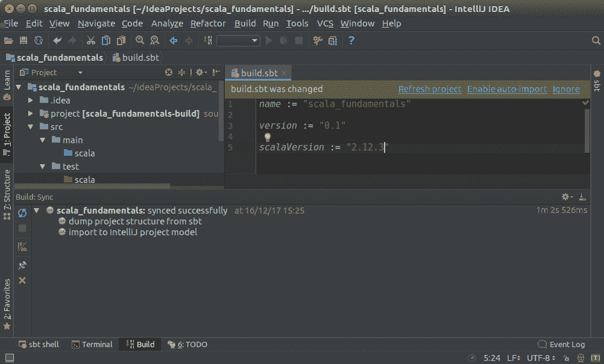

在一个小型项目中，使用自动导入是可以的，但在大型项目中，可能会有些烦人。同步可能需要时间，并且可能会过于频繁地启动。

因此，当你使用 IntelliJ 在 Scala 中编程时，你有两种编译项目的方式：

+   如果你使用 SBT，那么你将只使用 IntelliJ 作为高级文本编辑器

+   IntelliJ

理论上，你可以混合搭配：开始使用 SBT，然后继续使用 IntelliJ 或反之亦然。然而，我强烈不建议这样做，因为你可能会遇到一些意外的编译错误。当你想切换到某个工具时，最好先清理所有编译文件。

我们将在本书的后面进一步介绍 SBT，但到目前为止，我们只将使用 IntelliJ 自带的构建。

# 构建

项目已创建并准备好构建。构建过程执行以下操作：

+   编译源路径和测试路径中存在的源文件

+   复制输出路径中需要的任何资源文件

+   在消息工具窗口中报告任何错误/警告

有两种方式可以构建项目：

+   如果你想要增量构建你的项目，请转到构建 | 构建项目 (*Ctrl* + *F9* 或 *cmd + F9*)

+   如果你想要删除所有文件并重新构建一切，请转到构建 | 重新构建所有

由于我们还没有源代码，构建过程很快，消息工具窗口中不应出现错误。

# 运行 Scala 控制台

在 IntelliJ 中，每次你想运行某些内容时：一个程序、一个单元测试、一个外部工具，都需要有一个运行配置：一个运行配置设置了运行可执行文件所需的类路径、参数和环境变量。

我们第一次想要运行 Scala 控制台时，需要创建一个运行配置：

1.  转到运行 | 编辑配置。点击绿色+按钮，选择 Scala 控制台。你应该看到以下屏幕：

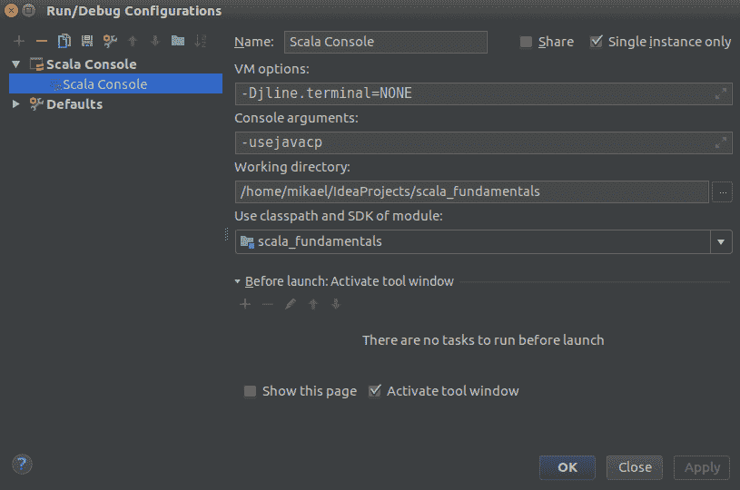

1.  进行以下更改并点击确定：

+   名称：`Scala Console`。

+   选择仅单实例复选框 - 我们很少需要同时运行两个控制台。

+   在发射前，点击构建，然后点击移除按钮。这样，即使你的代码无法编译，你也能快速运行控制台。

+   随后，点击确定。

1.  在顶部工具栏上，你应该看到 IntelliJ 创建了一个新的 Scala 控制台运行配置：


1.  点击绿色箭头以运行控制台。你应该在屏幕底部的运行窗口中看到以下内容：我们现在可以在 Scala 提示符后输入我们的第一个 Scala 表达式：

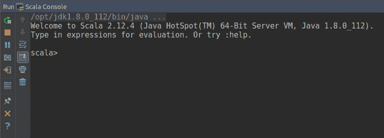

# 使用 Scala 控制台和工作表

到目前为止，所有必要的工具和库都应该已经安装。让我们通过在不同的环境中进行实验来开始玩 Scala 的基础。尝试 Scala 最简单的方法是使用 Scala 控制台。随后，我们将介绍 Scala 工作表，它允许你将输入的所有指令保存在一个文件中。

# 使用 Scala 控制台

Scala 控制台，也称为 Scala **REPL**（代表**读取-评估-打印-循环**），允许你执行代码片段，而无需事先编译。这是一个非常方便的工具，用于实验语言或当你想探索库的功能时。

在控制台中，在`scala>`提示符后输入`1+1`并按*Ctrl* + *Enter*或*cmd + Enter*：

```java
scala> 1+1
```

控制台显示评估结果，如下所示：

```java
res0: Int = 2
```

这里发生了什么？REPL 编译了表达式`1+1`，并自动将其赋值给名为`res0`的变量。这个变量的类型是`Int`，其值是`2`。

# 声明变量

在 Scala 中，可以使用`val`或`var`声明变量。`val`是**不可变的**，这意味着你永远不能改变它的值。`var`是**可变的**。声明变量的类型不是强制性的。如果你没有声明它，Scala 会为你**推断**它。

让我们定义一些不可变变量：

在所有以下代码示例中，你只需要输入 Scala 命令提示符后面的代码，然后按*Ctrl* + *Enter*或*cmd + return*来评估。我们将在提示符下方显示评估结果，就像它出现在你的屏幕上一样。

```java
scala> val x = 1 + 1
x: Int = 2

scala> val y: Int = 1 + 1
y: Int = 2
```

在这两种情况下，变量的类型都是`Int`。编译器推断出`x`的类型是`Int`。`y`的类型通过变量名后的`: Int`显式指定。

我们可以定义一个可变变量并按以下方式修改它：

```java
scala> var x = 1
x: Int = 1

scala> x = 2
x: Int = 2
```

在大多数情况下使用`val`是一个好习惯。每当我看到声明了`val`，我就知道其内容将不会随后的改变。这有助于对程序进行推理，尤其是在多线程运行时。你可以在多个线程之间共享不可变变量，而不必担心某个线程可能会在某个时刻看到不同的值。每当你在 Scala 程序中看到`var`时，它应该让你皱眉：**程序员应该有很好的理由使用可变变量，并且应该进行文档记录**。

如果我们尝试修改一个`val`，编译器将抛出一个错误信息：

```java
scala> val y = 1
y: Int = 1

scala> y = 2
<console>:12: error: reassignment to val
       y = 2
         ^
```

这是一件好事：编译器帮助我们确保没有任何代码片段可以修改一个`val`。

# 类型

在前面的示例中，我们看到了 Scala 表达式有**类型**。例如，**值**`1`是`Int`类型，表达式`1+1`也是`Int`类型。类型是数据的分类，提供有限或无限值的集合。给定类型的表达式可以取其提供的任何值。

下面是 Scala 中可用的一些类型的示例：

+   `Int`提供有限值的集合，这些值是介于-2³¹和 2³¹-1 之间的所有整数。

+   `Boolean`提供有限值的集合：`true`和`false`。

+   `Double`提供有限值的集合：所有 64 位和 IEEE-754 浮点数。

+   `String`提供无限值的集合：所有任意长度的字符序列。例如，`"Hello World"`或`"Scala is great !"`。

类型决定了可以对数据进行哪些操作。例如，你可以使用`+`运算符与类型为`Int`或`String`的两个表达式一起使用，但不能与类型为`Boolean`的表达式一起使用：

```java
scala> val str = "Hello" + "World"
str: String = HelloWorld

scala> val i = 1 + 1
i: Int = 2

scala> val b = true + false
<console>:11: error: type mismatch;
 found   : Boolean(false)
```

当我们尝试对一个不支持该操作的类型使用操作时，Scala 编译器会报类型不匹配错误。

Scala 的重要特性之一是它是一种静态类型语言。这意味着变量或表达式的类型在编译时是已知的。编译器还会检查你是否调用了不适用于此类型的操作或函数。这极大地减少了在 **运行时**（程序运行时）可能出现的错误数量。

如我们之前所见，表达式的类型可以通过冒号 `:` 后跟类型名称来显式指定，或者在许多情况下，编译器可以自动推断出来。

如果你不习惯使用静态类型语言，你可能会对与编译器斗争以使其接受你的代码感到沮丧，但你会逐渐习惯于你遇到的错误类型以及如何解决它们。你很快会发现，编译器不是一个阻止你运行代码的敌人；它更像是一个好朋友，它会指出你犯的逻辑错误，并给你一些如何解决的提示。

来自动态类型语言，如 Python，或来自不那么强静态类型语言，如 Java 或 C++ 的人，往往会惊讶地发现，一个编译过的 Scala 程序在第一次运行时出现错误的概率要低得多。

IntelliJ 可以自动将推断的类型添加到你的定义中。

例如，在 Scala 控制台中输入 `val a = 3`，然后将光标移到 `a` 的开头。你应该看到一个灯泡图标。当你点击它时，你会看到一个提示 *为值定义添加类型注解*。点击它，IntelliJ 将在 `a` 后面添加 `: Int`。

你的定义将变为 `val a: Int = 3`。

# 声明和调用函数

Scala 函数可以接受从 *0* 到 *n* 个 **参数** 并返回一个值。每个参数的类型必须声明。返回值的类型是可选的，因为 Scala 编译器在未指定时可以推断出来。然而，始终指定返回类型是一种良好的做法，因为它使代码更易于阅读：

```java
scala> def presentation(name: String, age: Int): String = 
  "Hello, my name is " + name + ". I am " + age + " years old."
presentation: (name: String, age: Int)String

scala> presentation(name = "Bob", age = 25)
res1: String = Hello, my name is Bob. I am 25 years old.

scala> presentation(age = 25, name = "Bob")

res2: String = Hello, my name is Bob. I am 25 years old.
```

我们可以通过按正确的顺序传递参数来调用函数，但也可以命名参数并以任何顺序传递它们。当一些参数具有相同的类型，或者函数接受许多参数时，命名参数是一种良好的做法。这可以避免传递错误的参数并提高可读性。

# 副作用

当一个函数或表达式修改某些状态或对外部世界有某些作用时，我们称它具有副作用。例如，将字符串打印到控制台、写入文件和修改 `var` 都是副作用。

在 Scala 中，所有表达式都有一个类型。执行副作用（side effect）的语句类型为 `Unit`。`Unit` 类型提供的唯一值是 `()`：

```java
scala> val x = println("hello")
hello
x: Unit = ()

scala> def printName(name: String): Unit = println(name)
printName: (name: String)Unit

scala> val y = {
  var a = 1
  a = a+1
}
y: Unit = ()

scala> val z = ()
z: Unit = ()
```

纯函数是一个结果只依赖于其参数，并且没有可观察副作用的函数。Scala 允许你混合副作用代码和纯代码，但将副作用代码推到应用程序的边界是一个好的实践。我们将在第三章 *确保引用透明性* 部分中更详细地讨论这一点，*处理错误*。

良好的实践：当一个没有参数的函数有副作用时，你应该声明它，并用空括号 `()` 调用它。这会通知用户你的函数有副作用。相反，没有参数的纯函数不应该有空括号，也不应该用空括号调用。IntelliJ 帮助你保持一致性：如果你用 `()` 调用一个无参数函数，或者如果你在调用声明为 `()` 的函数时省略了 `()`，它将显示警告。

这里有一个带有副作用的方法调用的例子，其中我们必须使用空括号，以及一个纯函数的例子：

```java
scala> def helloWorld(): Unit = println("Hello world")
helloWorld: ()Unit

scala> helloWorld()
Hello world

scala> def helloWorldPure: String = "Hello world"
helloWorldPure: String

scala> val x = helloWorldPure
x: String = Hello world
```

# 如果...否则表达式

在 Scala 中，`if (condition) ifExpr else if ifExpr2 else elseExpr` 是一个表达式，并且具有类型。如果所有子表达式都具有类型 `A`，则 `if ... else` 表达式的类型也将是 `A`：

```java
scala> def agePeriod(age: Int): String = {
  if (age >= 65)
    "elderly"
  else if (age >= 40 && age < 65)
    "middle aged"
  else if (age >= 18 && age < 40)
    "young adult"
  else
    "child"
}
agePeriod: (age: Int)String

```

如果子表达式有不同的类型，编译器将推断一个公共超类型，或者如果它是一个数值类型，则将其类型扩展：

```java
scala> val ifElseWiden = if (true) 2: Int else 2.0: Double
ifElseWiden: Double = 2.0

scala> val ifElseSupertype = if (true) 2 else "2"
ifElseSupertype: Any = 2
```

在前面代码中第一个表达式中，第一个子表达式是 `Int` 类型，第二个是 `Double` 类型。`ifElseWiden` 的类型被扩展为 `Double`。

在第二个表达式中，`ifElseSupertype` 的类型是 `Any`，这是 `Int` 和 `String` 的公共超类型。

没有 `else` 的 `if` 等价于 `if (condition) ifExpr else ()`。最好总是指定 `else` 表达式，否则 `if`/`else` 表达式的类型可能不是我们所期望的：

```java
scala> val ifWithoutElse = if (true) 2
ifWithoutElse: AnyVal = 2

scala> val ifWithoutElseExpanded = if (true) 2: Int else (): Unit
ifWithoutElseExpanded: AnyVal = 2

scala> def sideEffectingFunction(): Unit = if (true) println("hello world")
sideEffectingFunction: ()Unit
```

在前面的代码中，`Int` 和 `Unit` 之间的公共超类型是 `AnyVal`。这可能会让人有些惊讶。在大多数情况下，你可能会想要避免这种情况。

# 类

我们之前提到，所有 Scala 表达式都有类型。`class` 是一种可以创建特定类型对象的模板。当我们想要获得某种类型的值时，我们可以使用 `new` 后跟类名来 **实例化** 一个新的 **对象**：

```java
scala> class Robot
defined class Robot

scala> val nao = new Robot
nao: Robot = Robot@78318ac2
```

对象的实例化在 JVM 中分配了一部分 **堆** 内存。在先前的例子中，值 `nao` 实际上是新 `Robot` 对象内容所保持的堆内存部分的 **引用**。你可以观察到，当 Scala 控制台打印变量 `nao` 时，它输出了类的名称，后面跟着 `@78318ac2`。这个十六进制数实际上是对象在堆中存储的内存地址。

`eq` 运算符可以用来检查两个引用是否相等。如果它们相等，这意味着它们指向相同的内存部分：

```java
scala> val naoBis = nao
naoBis: Robot = Robot@78318ac2

scala> nao eq naoBis
res0: Boolean = true

scala> val johnny5 = new Robot
johnny5: Robot = Robot@6b64bf61

scala> nao eq johnny5
res1: Boolean = false
```

一个类可以有零个或多个**成员**。一个成员可以是：

+   一个**属性**，也称为**字段**。它是一个变量，其内容对类的每个实例都是唯一的。

+   一个**方法**。这是一个可以读取和/或写入实例属性的函数。它可以有额外的参数。

这里是一个定义了一些成员的类：

```java
scala> class Rectangle(width: Int, height: Int) {
  val area: Int = width * height
  def scale(factor: Int): Rectangle = new Rectangle(width * factor, height * factor)
}
defined class Rectangle
```

在括号 `()` 内声明的属性有些特殊：它们是**构造函数参数**，这意味着在实例化类的新对象时必须指定它们的值。其他成员必须在花括号 `{}` 内定义。在我们的例子中，我们定义了四个成员：

+   两个构造函数参数属性：`width` 和 `height`。

+   一个属性，`area`。它的值是在使用其他属性创建实例时定义的。

+   一个名为 `scale` 的方法，它使用属性来创建类 `Rectangle` 的新实例。

你可以通过使用**后缀**表示法 `myInstance.member` 来调用类的一个实例的成员。让我们创建我们类的一些实例并尝试调用这些成员：

```java
scala> val square = new Rectangle(2, 2)
square: Rectangle = Rectangle@2af9a5ef

scala> square.area
res0: Int = 4

scala> val square2 = square.scale(2)
square2: Rectangle = Rectangle@8d29719

scala> square2.area
res1: Int = 16

scala> square.width
<console>:13: error: value width is not a member of Rectangle
       square.width
```

我们可以调用 `area` 和 `scale` 成员，但不能调用 `width`。为什么？

这是因为，默认情况下，构造函数参数不可从外部访问。它们是实例的私有属性，只能从其他成员中访问。如果你想使构造函数参数可访问，你需要用 `val` 前缀：

```java
scala> class Rectangle(val width: Int, val height: Int) {
  val area: Int = width * height
  def scale(factor: Int): Rectangle = new Rectangle(width * factor, height * factor)
}
defined class Rectangle

scala> val rect = new Rectangle(3, 2)
rect: Rectangle = Rectangle@3dbb7bb

scala> rect.width
res3: Int = 3

scala> rect.height
res4: Int = 2
```

这次，我们可以访问构造函数参数。请注意，你可以使用 `var` 而不是 `val` 来声明属性。这将使你的属性可修改。然而，在函数式编程中，我们避免修改变量。类中的 `var` 属性在特定情况下应该谨慎使用。经验丰富的 Scala 程序员会在代码审查中立即标记它，并且其使用应该在代码注释中得到合理说明。

如果你需要修改一个属性，最好是返回一个带有修改后属性的新类实例，就像我们在前面的 `Rectangle.scale` 方法中所做的那样。

你可能会担心所有这些新对象会消耗太多内存。幸运的是，JVM 有一个称为**垃圾回收器**的机制。它会自动释放那些没有任何变量引用的对象所占用的内存。

# 使用工作表

IntelliJ 提供了另一个方便的工具来实验语言：Scala 工作表。

前往文件 | 新建 | Scala 工作表。将其命名为 `worksheet.sc`。然后你可以在屏幕的左侧输入一些代码。右上角的红/绿指示器会显示你输入的代码是否有效。一旦编译成功，结果就会出现在右侧：

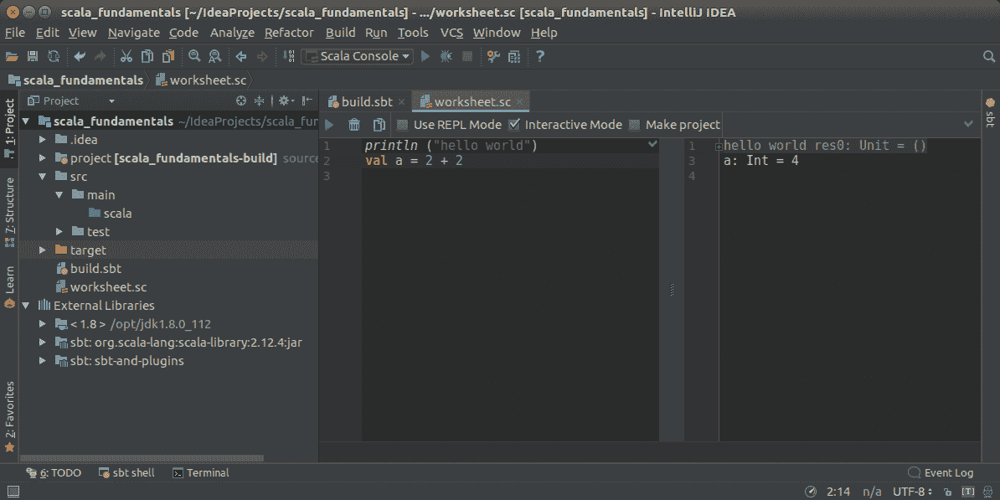

你会注意到，直到整个工作表编译完成之前，没有任何东西会被评估。

# 类继承

Scala 类是可扩展的。你可以扩展一个现有的类来继承其所有成员。如果`B`扩展了`A`，我们可以说`B`是`A`的**子类**，是`B`的**派生**，或者是`B`的**特殊化**。`A`是`B`的**超类**或`B`的**泛化**。

让我们通过一个例子看看它是如何工作的。在工作表中输入以下代码：

```java
class Shape(val x: Int, val y: Int) {
  val isAtOrigin: Boolean = x == 0 && y == 0
}

class Rectangle(x: Int, y: Int, val width: Int, val height: Int)
  extends Shape(x, y)

class Square(x: Int, y: Int, width: Int)
  extends Rectangle(x, y, width, width)

class Circle(x: Int, y: Int, val radius: Int)
  extends Shape(x, y)

val rect = new Rectangle(x = 0, y = 3, width = 3, height = 2)
rect.x
rect.y
rect.isAtOrigin
rect.width
rect.height
```

`Rectangle`和`Circle`类是`Shape`的子类。它们继承了`Shape`的所有成员：`x`、`y`和`isAtOrigin`。这意味着当我实例化一个新的`Rectangle`时，我可以调用在`Rectangle`中声明的成员，例如`width`和`height`，我也可以调用在`Shape`中声明的成员。

当声明一个子类时，你需要传递超类的构造函数参数，就像你正在实例化它一样。由于`Shape`声明了两个构造函数参数，`x`和`y`，我们必须在声明`extends Shape(x, y)`中传递它们。在这个声明中，`x`和`y`本身是`Rectangle`的构造函数参数。我们只是将这些参数向上传递了链。

注意，在子类中，构造函数参数`x`和`y`没有声明为`val`。如果我们用`val`声明它们，它们将被提升为公开可用的属性。问题是`Shape`也有`x`和`y`作为公开属性。在这种情况下，编译器会引发编译错误以突出显示冲突。

# 子类赋值

考虑两个类，`A`和`B`，其中`B extends A`。

当你声明一个类型为`A`的变量时，你可以将它赋值给`B`的一个实例，使用`val a: A = new B`。

另一方面，如果你声明一个类型为`B`的变量，你不能将它赋值给`A`的一个实例。

这里是一个使用前面描述的相同`Shape`和`Rectangle`定义的例子：

```java
val shape: Shape = new Rectangle(x = 0, y = 3, width = 3, height = 2)
val rectangle: Rectangle = new Shape(x = 0, y = 3)
```

第一行可以编译，因为`Rectangle`**是**一个`Shape`。

第二行无法编译，因为不是所有形状都是矩形。

# 覆盖方法

当你派生一个类时，你可以覆盖超类的成员以提供不同的实现。以下是一个你可以重新输入到新工作表中的例子：

```java
class Shape(val x: Int, val y: Int) {
  def description: String = s"Shape at (" + x + "," + y + ")"
}

class Rectangle(x: Int, y: Int, val width: Int, val height: Int)
  extends Shape(x, y) {
  override def description: String = {
    super.description + s" - Rectangle " + width + " * " + height
  }
}

val rect = new Rectangle(x = 0, y = 3, width = 3, height = 2)
rect.description
```

当你运行工作表时，它会在右侧评估并打印以下`description`：

```java
res0: String = Shape at (0,3) - Rectangle 3 * 2
```

我们在`Shape`类上定义了一个名为`description`的方法，它返回一个 String。当我们调用`rect.description`时，调用的是在`Rectangle`类中定义的方法，因为`Rectangle`用不同的实现覆盖了`description`方法。

`Rectangle`类中`description`的实现引用了`super.description`。`super`是一个关键字，它让你可以使用超类的成员，而不考虑任何覆盖。在我们的情况下，这是必要的，这样我们才能使用`super`引用，否则`description`会陷入无限循环中调用自己！

另一方面，关键字`this`允许你调用同一类的成员。将`Rectangle`修改为添加以下方法：

```java
class Rectangle(x: Int, y: Int, val width: Int, val height: Int)
  extends Shape(x, y) {
  override def description: String = {
    super.description + s" - Rectangle " + width + " * " + height
  }

  def descThis: String = this.description
  def descSuper: String = super.description
}

val rect = new Rectangle(x = 0, y = 3, width = 3, height = 2)
rect.description
rect.descThis
rect.descSuper
```

当评估工作表时，它打印以下字符串：

```java
res0: String = Shape at (0,3) - Rectangle 3 * 2
res1: String = Shape at (0,3) - Rectangle 3 * 2
res2: String = Shape at (0,3)
```

`this.description`的调用使用了在`Rectangle`类中声明的`description`定义，而`super.description`的调用使用了在`Shape`类中声明的`description`定义。

# 抽象类

抽象类是一个可以有多个抽象成员的类。一个**抽象成员**只定义了一个属性或方法的签名，而不提供任何实现。你不能实例化一个抽象类：你必须创建一个子类来实现所有抽象成员。

将工作表中的`Shape`和`Rectangle`的定义替换如下：

```java
abstract class Shape(val x: Int, val y: Int) {
  val area: Double
  def description: String
}

class Rectangle(x: Int, y: Int, val width: Int, val height: Int)
  extends Shape(x, y) {

  val area: Double = width * height

  def description: String =
    "Rectangle " + width + " * " + height
}
```

我们现在的类`Shape`现在是抽象的。我们不能再直接实例化一个`Shape`类了：我们必须创建一个`Rectangle`或`Shape`的其他子类的实例。`Shape`定义了两个具体成员，`x`和`y`，以及两个抽象成员，`area`和`description`。子类`Rectangle`实现了这两个抽象成员。

当实现抽象成员时，你可以使用前缀`override`，但这不是必要的。我建议**不要**添加它，以保持代码更简洁。此外，如果你随后在超类中实现了抽象方法，编译器将帮助你找到所有已实现该方法的子类。如果它们使用`override`，则不会这样做。

# 特性

特性类似于抽象类：它可以声明多个抽象或具体成员，并且可以被扩展。它不能被实例化。区别在于一个给定的类只能扩展一个抽象类，然而，它可以**混合**多个特性。此外，特性不能有构造函数参数。

例如，我们可以声明几个特性，每个特性声明不同的抽象方法，并将它们全部混合到`Rectangle`类中：

```java
trait Description {
  def description: String
}

trait Coordinates extends Description {
  def x: Int
  def y: Int

  def description: String =
    "Coordinates (" + x + ", " + y + ")"
}

trait Area {
  def area: Double
}

class Rectangle(val x: Int,
                val y: Int,
                val width: Int,
                val height: Int)
  extends Coordinates with Description with Area {

  val area: Double = width * height

  override def description: String =
    super.description + " - Rectangle " + width + " * " + height
}

val rect = new Rectangle(x = 0, y = 3, width = 3, height = 2)
rect.description
```

当评估`rect.description`时，打印以下字符串：

```java
res0: String = Coordinates (0, 3) - Rectangle 3 * 2
```

类`Rectangle`混合了特性`Coordinates`、`Description`和`Area`。我们需要在`trait`或`class`之前使用关键字`extends`，并在所有后续特性中使用关键字`with`。

注意，`Coordinates`特性也混合了`Description`特性，并提供了默认实现。正如我们在有`Shape`类时所做的，我们在`Rectangle`中覆盖了这个实现，我们仍然可以调用`super.description`来引用`trait Coordinates`中`description`的实现。

另一个有趣的观点是，你可以使用`val`来实现一个抽象方法——在`trait Area`中，我们定义了`def area: Double`，并在`Rectangle`中使用`val area: Double`实现了它。使用`def`定义抽象成员是一个好习惯。这样，特性的实现者可以决定是否使用方法或变量来定义它。

# Scala 类层次结构

所有 Scala 类型都扩展了一个名为`Any`的内建类型。这个类型是所有 Scala 类型层次结构的根。它有两个直接子类型：

+   `AnyVal` 是所有值类型的根类。这些类型在 JVM 中表示为原始类型。

+   `AnyRef` 是所有对象类型的根类。它是 `java.lang.Object` 类的别名。

+   类型 `AnyVal` 的变量直接包含值，而类型 `AnyRef` 的变量包含存储在内存中某个位置的对象的地址。

以下图表显示了该层次结构的部分视图：

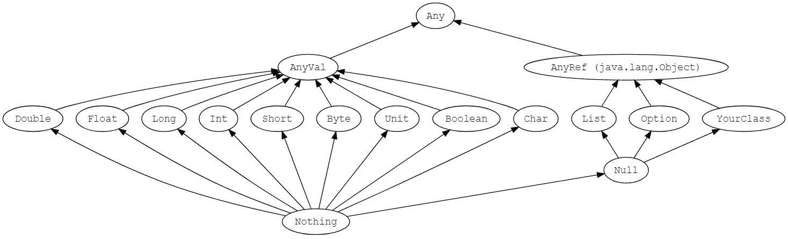

当您定义一个新类时，它会间接扩展 `AnyRef`。由于这是一个 `java.lang.Object` 的别名，因此您的类继承了 `Object` 中实现的所有默认方法。它最重要的方法如下：

+   `def toString: String` 返回对象的字符串表示形式。当您使用 `println` 打印对象时，会调用此方法。默认实现返回类的名称后跟对象在内存中的地址。

+   `def equals(obj: Object): Boolean` 如果对象等于另一个对象，则返回 `true`，否则返回 `false`。当您使用 `==` 比较两个对象时，会调用此方法。默认实现仅比较对象的引用，因此与 `eq` 等价。幸运的是，Java 和 Scala SDK 中的大多数类都重写了此方法以提供良好的比较。例如，`java.lang.String` 类重写了 `equals` 方法以逐字符比较字符串的内容。因此，当您使用 `==` 比较两个字符串时，如果字符串相同，即使它们存储在内存中的不同位置，结果也将是 `true`。

+   `def hashCode: Int` 在您将对象放入 `Set` 或将其用作 `Map` 中的键时被调用。默认实现基于对象的地址。如果您想使 `Set` 或 `Map` 中的数据分布更好，从而提高这些集合的性能，您可以重写此方法。但是，如果您这样做，您必须确保 `hashCode` 与 `equals` 一致：如果两个对象相等，它们的 `hashCodes` 也必须相等。

为所有类重写这些方法将会非常繁琐。幸运的是，Scala 提供了一个特殊的构造，称为 `case class`，它会自动为我们重写这些方法。

# 情况类

在 Scala 中，我们使用情况类定义大多数数据结构。`case class` 具有一到多个不可变属性，并且与标准类相比提供了几个内置函数。

将以下内容输入到工作表中：

```java
case class Person(name: String, age: Int)
val mikaelNew = new Person("Mikael", 41)
// 'new' is optional
val mikael = Person("Mikael", 41)
// == compares values, not references
mikael == mikaelNew
// == is exactly the same as .equals
mikael.equals(mikaelNew)

val name = mikael.name

// a case class is immutable. The line below does not compile:
//mikael.name = "Nicolas"
// you need to create a new instance using copy
val nicolas = mikael.copy(name = "Nicolas")
```

在前面的代码中，`//` 后面的文本是一个注释，解释了前面的语句。

当您将类声明为 `case class` 时，Scala 编译器会自动生成默认构造函数、`equals` 和 `hashCode` 方法、`copy` 构造函数以及每个属性的访问器。

这里是我们拥有的工作表的截图。您可以在右侧看到评估结果：

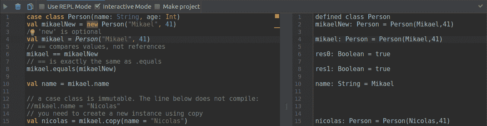

# 伴随对象

一个类可以有一个伴随对象。它必须在与类相同的文件中声明，使用关键字 `object` 后跟伴随对象的名称。伴随对象是一个**单例** - 在 JVM 中只有一个此对象的实例。它有自己的类型，不是伴随类的实例。

此对象定义了与伴随类紧密相关的静态函数或值。如果你熟悉 Java，它替换了关键字 `static`：在 Scala 中，类的所有静态成员都在伴随对象中声明。

伴随对象中的某些函数具有特殊含义。名为 `apply` 的函数是类的构造函数。当我们调用它们时，可以省略 `apply` 名称：

```java
case class City(name: String, urbanArea: Int)
object City {
  val London = City("London", 1738)
  val Lausanne = City("Lausanne", 41)
}

case class Person(firstName: String, lastName: String, city: City)
object Person {
  def apply(fullName: String, city: City): Person = {
    val splitted = fullName.split(" ")
    new Person(firstName = splitted(0), lastName = splitted(1), city = city)
  }
}

// Uses the default apply method
val m1 = Person("Mikael", "Valot", City.London)
// Call apply with fullName
val m2 = Person("Mikael Valot", City.London)
// We can omit 'apply'
val n = Person.apply("Nicolas Jorand", City.Lausanne)
```

在前面的代码中，我们为 `City` 类定义了一个伴随对象，它定义了一些**常量**。常量的约定是将第一个字母大写。

`Person` 类的伴随对象定义了一个额外的 `apply` 函数，它充当构造函数。其实现调用方法 `split(" ")`，该方法将用空格分隔的字符串分割成字符串数组。它允许我们使用单个字符串来构造 `Person` 实例，其中第一个名字和姓氏由空格分隔。然后我们演示了我们可以调用随 case 类提供的默认 `apply` 函数，或者我们实现的那个。

# 创建我的第一个项目

如你所知，你已经掌握了在 REPL 和表格中运行代码的基础，现在是时候创建你的第一个“Hello World”项目了。在本节中，我们将过滤一组人员并将他们的姓名和年龄打印到控制台。

# 创建项目

重复你在 *安装 IntelliJ* 部分中完成的相同步骤来创建一个新项目。以下是你必须完成的任务摘要：

1.  运行 IntelliJ 并选择创建新项目

1.  选择 Scala 和 sbt

1.  输入项目的名称，例如 `Examples`

1.  如果选定的目录不存在，IntelliJ 会询问你是否想要创建它 - 选择“确定”

一旦你接受将创建目录，IntelliJ 就会下载所有必要的依赖项并构建项目结构。请耐心等待，因为这可能需要一段时间，尤其是如果你没有良好的互联网连接。

一切下载完毕后，你的 IDE 应该处于以下状态：

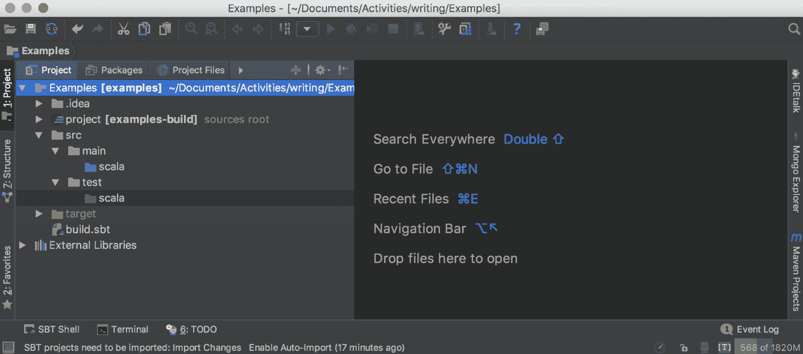

注意文件夹结构。源代码位于 `src/main/scala` 目录下，测试代码位于 `src/test/scala` 目录下。如果你之前使用过 Maven，这种结构应该很熟悉。

# 创建 Main 对象

到这里了！让我们创建我们的第一个应用程序。首先，创建程序的入口点。如果你来自 Java，它相当于定义 `public static void main(String[] args)`。

右键单击 `src/main/scala` 文件夹，然后选择 New | Scala Class。将类名命名为 `Main`，将类型设置为 `Object`：

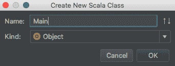

我们已经创建了第一个对象。这个对象是一个单例。在 JVM 中只能有一个实例。在 Java 中的等效物是一个具有静态方法的静态类。

我们希望将其用作程序的主要入口点。Scala 提供了一个方便的名为 `App` 的类，需要对其进行扩展。让我们用这个类扩展我们的 `Main` 对象：

```java
object Main extends App {

}
```

`App` 超类定义了一个静态的 `main` 方法，它将执行您在 `Main` 对象内部定义的所有代码。就这样——我们创建了第一个版本，它什么也不做！

我们现在可以在 IntelliJ 中运行程序。如下所示，点击对象定义区域中的小绿色三角形：

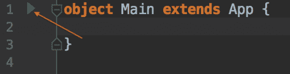

程序被编译并执行，如下面的截图所示：

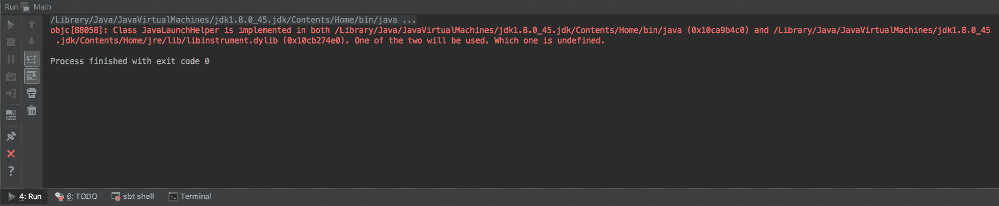

这并不引人注目，但让我们来改进它。为了养成正确的习惯，我们将使用**TDD**技术来进一步进行。

# 编写第一个单元测试

TDD 是一种非常强大的技术，可以编写高效、模块化和安全的程序。它非常简单，玩这个游戏只有三条规则：

1.  除非是为了使失败的单元测试通过，否则不允许编写任何生产代码。

1.  您不允许编写比足以失败的单元测试更多的代码，编译失败也是失败。

1.  您不允许编写比通过一个失败的单元测试所需的生产代码更多的代码。

在这里可以查看 Bob Uncle 的完整文章：[`butunclebob.com/ArticleS.UncleBob.TheThreeRulesOfTdd`](http://butunclebob.com/ArticleS.UncleBob.TheThreeRulesOfTdd)。

Scala 中有多个测试框架，但我们选择了 ScalaTest ([`www.scalatest.org/`](http://www.scalatest.org/))，因为它简单。

为了在项目中添加 ScalaTest 库，请按照以下步骤操作：

1.  编辑 `build.sbt` 文件。

1.  添加一个新的仓库解析器以搜索 Scala 库。

1.  添加 ScalaTest 库：

```java
name := "Examples"
version := "0.1"
scalaVersion := "2.12.4"
resolvers += "Artima Maven Repository" at "http://repo.artima.com/releases"
libraryDependencies += "org.scalatest" %% "scalatest" % "3.0.4" % "test"
```

注意屏幕顶部的信息栏。它告诉您文件已更改，并要求进行多项选择。由于这是一个小型项目，您可以选择**启用自动导入**。

1.  通过右键单击 `test/scala` 文件夹并创建一个新类来创建测试类。将其命名为 `MainSpec`。

ScalaTest 提供了多种定义测试的方法——完整的列表可以在官方网站上找到 ([`www.scalatest.org/at_a_glance/WordSpec`](http://www.scalatest.org/at_a_glance/WordSpec))。我们将使用 `WordSpec` 风格，因为它相当具体，提供了层次结构，并且在大型 Scala 项目中常用。

您的 `MainSpec` 应该扩展 `WordSpec` 类和 `Matchers` 类，如下所示：

```java
class MainSpec extends WordSpec with Matchers {

}
```

`Matchers`类提供了`should`这个关键字来在测试中执行比较。

`WordSpec`和`Matchers`被红色下划线标注，这意味着类没有被解析。要使其解析，将光标移至类上，并按键盘上的*Alt* + *Enter*。如果你位于`WordSpec`这个词上，应该会出现一个弹出窗口。这是正常的，因为不同包中存在多个名为`WordSpec`的类：

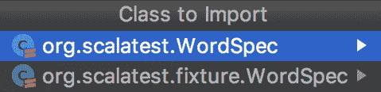

选择第一个选项，IntelliJ 会自动在代码顶部添加导入。在`Matchers`类中，只要你输入*Alt* + *Enter*，就会直接添加导入。

最终的代码应该如下所示：

```java
import org.scalatest.{WordSpec, Matchers}

class MainSpec extends WordSpec with Matchers {

}
```

我们的课程框架现在为我们的第一个测试做好了准备。我们想要创建`Person`类并测试其构造函数。

让我们用简单的句子解释我们想要测试的内容。用以下代码完成测试类：

```java
class MainSpec extends WordSpec with Matchers {
  "A Person" should {
    "be instantiated with a age and name" in {
      val john = Person(firstName = "John", lastName =  "Smith", 42)
      john.firstName should be("John")
      john.lastName should be("Smith")
      john.age should be(42)
    }
  }
}
```

IntelliJ 抱怨它无法解析符号`Person`、`name`、`surname`和`age`。这是预期的，因为`Person`类不存在。让我们在`src/main/scala`文件夹中创建它。右键单击文件夹，创建一个名为`Person`的新类。

在类的情况下，通过添加`case`关键字并使用`name`、`surname`和`age`定义构造函数来转换它：

```java
case class Person(firstName: String, lastName: String, age: Int)
```

如果你回到`MainSpec.scala`文件，你会注意到类现在编译时没有任何错误和警告。代码窗口右上角的绿色勾号()确认了这一点。

通过右键单击`MainSpec.scala`文件并选择`Run 'MainSpec'`或使用键盘快捷键*Ctrl* + *Shift* + *F10*或*Ctrl + Shift + R*来运行测试：

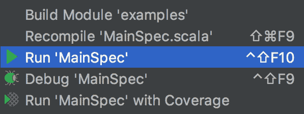

`MainSpec`中的测试运行，结果出现在运行窗口中：

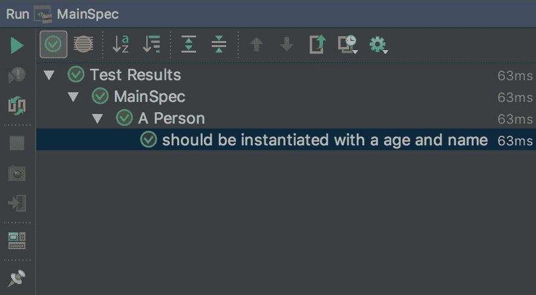

# 实现另一个功能

现在，我们想要通过说明他的/她的姓名和年龄来有一个关于这个人的良好表示。测试应该看起来像以下这样：

```java
"Get a human readable representation of the person" in {
  val paul = Person(firstName = "Paul", lastName = "Smith", age = 24)
  paul.description should be("Paul Smith is 24 years old")
}
```

再次运行测试。我们将得到一个编译错误：

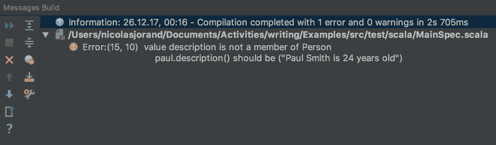

这是预期的，因为`Person`类中不存在这个函数。要实现它，在`MainSpec.scala`类中的`description()`错误上设置光标，按*Alt* + *Enter*，并选择创建方法描述。

IntelliJ 为你生成方法并设置实现为`???`。将`???`替换为预期的代码：

```java
def description = s"$firstName $lastName is $age ${if (age <= 1) "year"                    else "years"} old"
```

通过这样做，我们定义了一个不接受任何参数并返回表示 `Person` 的字符串的方法。为了简化代码，我们使用 **字符串插值** 来构建字符串。要使用字符串插值，只需在第一个引号前加上 `s`。在引号内，您可以使用通配符 `$`，这样我们就可以使用外部变量，并在美元符号后使用括号来输入比变量名更多的代码。

执行测试，结果应该是绿色的：

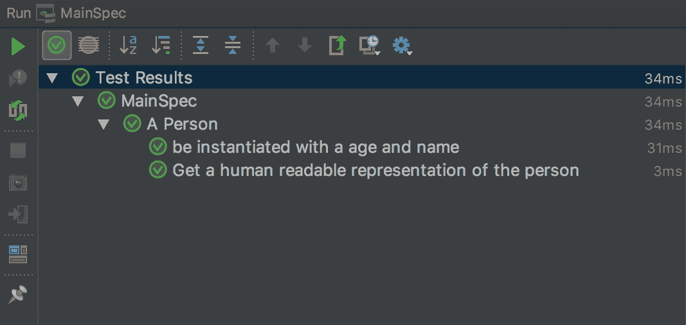

下一步是编写一个实用函数，给定一个人员列表，只返回成年人。

对于测试，定义了两个情况：

```java
"The Person companion object" should {
  val (akira, peter, nick) = (
    Person(firstName = "Akira", lastName = "Sakura", age = 12),
    Person(firstName = "Peter", lastName = "Müller", age = 34),
    Person(firstName = "Nick", lastName = "Tagart", age = 52)
  )
  "return a list of adult person" in {
    val ref = List(akira, peter, nick)
    Person.filterAdult(ref) should be(List(peter, nick))
  }
  "return an empty list if no adult in the list" in {
    val ref = List(akira)
    Person.filterAdult(ref) should be(List.empty[Person])
  }
}
```

在这里，我们使用元组定义了三个变量。这是一种方便定义多个变量的方式。变量的作用域由包围的括号限制。

使用 IntelliJ 通过 *Alt* + *Enter* 快捷键创建 `filterAdult` 函数。IDE 会理解该函数应该位于 `Person` 伴生对象中，并为您生成它。

如果您没有使用命名参数并希望使用它们，IntelliJ 可以帮助您：当光标在括号后时，按 *Alt* + *Enter* 并选择 "使用命名参数 ...".

我们使用 Scala 的 `for` **推导** 功能来实现此方法：

```java
object Person {
  def filterAdult(persons: List[Person]) : List[Person] = {
    for {
      person <- persons
      if (person.age >= 18)
    } yield (person)
  }
}
```

定义方法的返回类型是一个好习惯，特别是当这个方法作为公共 API 公开时。

`for` 推导仅用于演示目的。我们可以使用 `List` 上的 `filter` 方法来简化它。`filter` 是 Scala 集合 API 的一部分，并且适用于许多类型的集合：

```java
def filterAdult(persons: List[Person]) : List[Person] = {
  persons.filter(_.age >= 18)
}
```

# 实现 Main 方法

现在我们所有的测试都是绿色的，我们可以实现 `main` 方法。实现变得非常简单，因为所有代码已经在测试中：

```java
object Main extends App {
  val persons = List(
    Person(firstName = "Akira", lastName = "Sakura", age = 12),
    Person(firstName = "Peter", lastName = "Müller", age = 34),
    Person(firstName = "Nick", lastName = "Tagart", age = 52))

  val adults = Person.filterAdult(persons)
  val descriptions = adults.map(p => p.description).mkString("\n\t")
  println(s"The adults are \n\t$descriptions")
}
```

第一件事是定义一个 `Person` 列表，这样 `Person.filterAdult()` 就可以用来移除所有人，而不是成年人。`adults` 变量是一个 `Person` 列表，但我想将这个 `Person` 列表转换为描述 `Person` 的列表。为了执行此操作，使用集合的 `map` 函数。`map` 函数通过在参数中应用函数来转换列表中的每个元素。

`map()` 函数内的符号定义了一个匿名函数，该函数以 `p` 作为参数。函数体是 `p.description`。这种符号在函数接受另一个函数作为参数时常用。

一旦我们有了描述列表，我们使用 `mkString()` 函数创建一个字符串。它使用特殊字符 `\n\t` 连接列表的所有元素，其中 `\n` 分别是换行符，`\t` 是制表符。

最后，我们执行副作用，即控制台打印。要在控制台打印，使用 `println` 别名。它是 `System.out.println` 的语法糖。

# 摘要

我们已经完成了第一章，现在你应该有了自己开始项目的必备基础知识。我们涵盖了在 Scala 中使用 IDE 进行编码的安装，以及专用构建工具 SBT 的基本用法。展示了探索 Scala 的三种方法，包括 REPL 来测试简单的 Scala 特性，IntelliJ 工作表来在小环境中进行实验，最后是一个真实的项目。

为了编写我们的第一个项目，我们使用了 ScalaTest 和 TDD 方法，以确保我们从一开始就有良好的代码质量。

在下一章中，我们将编写一个完整的程序。这是一个财务应用程序，允许用户估算他们何时可以退休。我们将继续使用 TDD 技术，并进一步探索 Scala 语言、其开发工具包以及最佳实践。
