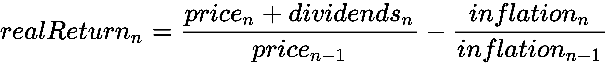
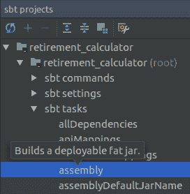

# 开发退休计算器

在本章中，我们将将第一章节中看到的 Scala 语言特性付诸实践。我们还将介绍 Scala 语言和 SDK 的其他元素，以开发退休计算器的模型和逻辑。这个计算器将帮助人们计算出需要存多少钱以及存多久才能有一个舒适的退休生活。

我们将使用**测试驱动开发**（**TDD**）技术来开发不同的功能。我鼓励你在查看解决方案之前先尝试自己编写函数的主体。此外，最好是重新输入代码而不是复制粘贴。这样你会记得更牢，并且会有一种使用 IntelliJ 的自动完成和编辑器的感受。不要过度使用*Ctrl* + 空格键的自动完成功能。你不仅会打字更快，还会发现给定类中可用的函数。

你将获得使用 Scala 语言构建更复杂应用程序的坚实基础。

在本章中，我们将涵盖以下主题：

+   计算未来资本

+   计算何时可以退休

+   使用市场汇率

+   打包应用程序

# 项目概述

使用一些参数，例如你的净收入、你的开支、你的初始资本等，我们将创建函数来计算以下内容：

+   退休时的未来资本

+   退休多年后的资本

+   你需要存多少钱才能退休

我们将首先使用固定利率进行这些计算。之后，我们将从 `.tsv` 文件中加载市场数据，然后重构之前的函数以模拟投资期间可能发生的情况。

# 计算未来资本

在规划退休时，你需要知道的第一件事是在你选择的退休日期可以获得的资本量。现在，我们将假设你以恒定的速率每月投资你的储蓄。为了简化问题，我们将忽略通货膨胀的影响，因此计算出的资本将是今天的货币，利率将计算为*实际利率* = *名义利率* - *通货膨胀率*。

我们故意在本章的其余部分不提及任何货币。你可以认为金额是以美元（USD）、欧元（EUR）或任何其他货币计算的。只要所有金额都使用相同的货币表示，结果就不会改变。

# 编写积累阶段的单元测试

我们需要一个与 Excel 中的 `FV` 函数行为相似的函数：它根据恒定的利率计算投资的未来价值。由于我们遵循 TDD 方法，首先要做的事情是创建一个失败的测试：

1.  创建一个名为 `retirement_calculator` 的新 Scala 项目。遵循第一章中“编写你的第一个程序”的相同说明。

1.  右键单击 `src/main/scala` 目录并选择 New | Package。将其命名为 `retcalc`。

1.  右键单击新包，选择 New | Scala class。将其命名为`RetCalcSpec`。

1.  输入以下代码：

```java
package retcalc

import org.scalactic.{Equality, TolerantNumerics, TypeCheckedTripleEquals}
import org.scalatest.{Matchers, WordSpec}

class RetCalcSpec extends WordSpec with Matchers with TypeCheckedTripleEquals {

  implicit val doubleEquality: Equality[Double] = 
    TolerantNumerics.tolerantDoubleEquality(0.0001)

  "RetCalc.futureCapital" should {
    "calculate the amount of savings I will have in n months" in {
      val actual = RetCalc.futureCapital(
        interestRate = 0.04 / 12, nbOfMonths = 25 * 12, 
        netIncome = 3000, currentExpenses = 2000, 
        initialCapital = 10000)
      val expected = 541267.1990
      actual should ===(expected)
  }
}
```

如第一章中所述，在*创建我的第一个项目*部分，我们使用了`WordSpec` ScalaTest 风格。我们还使用了一个方便的功能，称为`TypeCheckedTripleEquals`。它提供了一个强大的断言`should ===`，确保在编译时等式的两边具有相同的类型。默认的 ScalaTest 断言`should`在运行时验证类型相等性。我们鼓励您始终使用`should ===`，因为它在重构代码时可以节省大量时间。

此外，它让我们在比较双精度值时可以使用一定程度的容差。考虑以下声明：

```java
implicit val doubleEquality: Equality[Double] =
  TolerantNumerics.tolerantDoubleEquality(0.0001)
```

如果`double1`和`double2`之间的绝对差异小于`0.0001`，它将允许`double1 should === (double2)`断言通过。这允许我们只指定小数点后第四位的预期值。它还避免了遇到浮点计算问题。例如，在 Scala 控制台中输入以下代码：

```java
scala> val double1 = 0.01 -0.001 + 0.001
double1: Double = 0.010000000000000002

scala> double1 == 0.01
res2: Boolean = false
```

这可能有点令人惊讶，但这在任何将浮点数编码为二进制的语言中都是一个众所周知的问题。我们本可以使用`BigDecimal`而不是`Double`来避免这类问题，但就我们的目的而言，我们不需要`BigDecimal`提供的额外精度，而且`BigDecimal`的计算速度要慢得多。

测试的主体相当直接；我们调用一个函数并期望得到一个值。由于我们首先编写了测试，我们必须在编写生产代码之前确定预期的结果。对于非平凡的计算，我通常使用 Excel 或 LibreOffice。对于这个函数，预期的值可以通过使用公式`=-FV(0.04/12,25*12,1000,10000,0)`获得。我们假设用户每月将其收入与支出的全部差额存入。因此，`FV`函数中的 PMT 参数是`1,000 = netIncome - currentExpenses`。

现在我们有一个失败的测试，但它无法编译，因为`RetCalc`对象及其`futureCapital`函数尚不存在。在`src/main/scala`中的新包`retcalc`中创建一个`RetCalc`对象，然后在单元测试中选择红色的`futureCapital`调用，按*Alt* + *Enter*生成函数体。填写参数的名称和类型。你应该在`RetCalc.scala`中得到以下代码：

```java
package retcalc

object RetCalc {
  def futureCapital(interestRate: Double, nbOfMonths: Int, netIncome:     
  Int, currentExpenses: Int, initialCapital: Double): Double = ???
}
```

打开`RetCalcSpec`，按*Ctrl* + *Shift* + *R*来编译和运行它。一切都应该编译，测试应该失败。

# 实现未来资本

现在我们有一个失败的测试，所以是时候通过编写生产代码让它通过了。如果我们使用`initialCapital = 10,000`和`monthlySavings = 1,000`，我们需要执行的计算可以分解如下：

+   对于第`0`个月，在没有任何储蓄之前，我们有`capital0 = initialCapital = 10,000`。

+   对于第一个月，我们的初始资本产生了一些利息。我们还额外存入了 1,000 元。因此，我们有 `capital1 = capital0 *(1 + monthlyInterestRate) + 1,000`

+   对于第二个月，我们有 `capital2 = capital1 *(1 + monthlyInterestRate) + 1,000`

存在一种数学公式可以从参数计算 `capitalN`，但在这里我们不会使用它。这个公式在固定利率下工作得很好，但我们在本章后面将使用可变利率。

这里是函数的主体：

```java
def futureCapital(interestRate: Double, nbOfMonths: Int, netIncome: Int, currentExpenses: Int, initialCapital: Double): Double = {
  val monthlySavings = netIncome - currentExpenses

  def nextCapital(accumulated: Double, month: Int): Double =
    accumulated * (1 + interestRate) + monthlySavings

  (0 until nbOfMonths).foldLeft(initialCapital)(nextCapital)
}
```

我们首先使用 `0 to nbOfMonths` 生成一个整数集合，然后使用 `foldLeft` 遍历它。`foldLeft` 是 Scala 集合库中最强大的函数之一。`collections` 库中的许多其他函数可以通过使用 `foldLeft` 来实现，例如 `reverse`、`last`、`contains`、`sum` 等。

在 Scala SDK 中，`foldLeft` 的签名如下：

```java
def foldLeftB(op: (B, A) => B): B
```

你可以通过将鼠标悬停在 IntelliJ 中的定义上并使用 cmd + left-click 来查看其定义。这引入了一些新的语法：

+   `[B]` 表示该函数有一个名为 `B` 的 **类型参数**。当我们调用函数时，编译器会根据 `z: B` 参数的类型自动推断 `B` 是什么。在我们的代码中，`z` 参数是 `initialCapital`，类型为 `Double`。因此，我们在 `futureCapital` 中对 `foldLeft` 的调用将表现得好像函数是用 `B = Double` 定义的：

`def foldLeft(z: Double)(op: (Double, A) => Double): Double`.

+   该函数有两个参数列表。Scala 允许你拥有多个参数列表。每个列表可以有一个或多个参数。这不会改变函数的行为；这只是分离每个参数列表关注点的一种方式。

+   `op: (B, A) => B` 表示 `op` 必须是一个有两个参数类型为 `B` 和 `A` 并返回类型为 `B` 的函数。由于 `foldLeft` 是一个接受另一个函数作为参数的函数，我们说 `foldLeft` 是一个 **高阶函数**。

如果我们考虑一个 `coll` 集合，`foldLeft` 的工作方式如下：

1.  它创建一个 `var acc = z` 累加器，然后调用 `op` 函数：

`acc = op(acc, coll(0))`

1.  它继续对集合的每个元素调用 `op`。

`acc = op(acc, coll(i))`

1.  它在遍历完集合的所有元素后返回 `acc`。

在我们的 `futureCapital` 函数中，我们传递 `op = nextCapital`。`foldLeft` 将遍历从 `1` 到 `nbOfMonths` 的所有 `Int`，每次使用前一个资本计算资本。注意，目前我们不在 `nextCapital` 中使用 `month` 参数。尽管如此，我们必须声明它，因为 `foldLeft` 中的 `op` 函数必须有两个参数。

你现在可以再次运行 `RetCalcSpec` 单元测试。它应该通过。

# 重构生产代码

在 TDD 方法中，一旦我们有了通过测试的代码，重构代码是很常见的。如果我们的测试覆盖率良好，我们不应该害怕更改代码，因为任何错误都应该由失败的测试标记出来。这被称为**红-绿-重构**循环。

使用以下代码更改`futureCapital`的主体：

```java
def futureCapital(interestRate: Double, nbOfMonths: Int, netIncome: Int, currentExpenses: Int, initialCapital: Double): Double = {
  val monthlySavings = netIncome - currentExpenses
  (0 until nbOfMonths).foldLeft(initialCapital)(
    (accumulated, _) => accumulated * (1 + interestRate) + 
     monthlySavings)
}
```

在这里，我们在`foldLeft`调用中内联了`nextCapital`函数。在 Scala 中，我们可以使用以下语法定义一个**匿名函数**：

```java
(param1, param2, ..., paramN) => function body.
```

我们之前看到，`nextCapital`中的`month`参数没有被使用。在匿名函数中，将任何未使用的参数命名为`_`是一个好的实践。名为`_`的参数不能在函数体中使用。如果你尝试将`_`字符替换为其他名称，IntelliJ 会将其下划线。如果你将鼠标悬停在其上，你会看到一个弹出窗口，显示“声明从未使用”。然后你可以按*Alt* + *Enter*键并选择删除未使用的元素，以自动将其更改回`_`。

# 编写减值阶段的测试

现在你已经知道你退休时可以期待多少资本。结果是你可以重用相同的`futureCapital`函数，来计算为你继承人留下的资本。

在`RetCalcSpec`中添加以下测试，在之前的单元测试下方，并运行它。它应该通过：

```java
"RetCalc.futureCapital" should {
  "calculate how much savings will be left after having taken a pension 
    for n months" in {
    val actual = RetCalc.futureCapital(
      interestRate = 0.04/12, nbOfMonths = 40 * 12,
      netIncome = 0, currentExpenses = 2000, initialCapital = 
      541267.1990)
    val expected = 309867.53176
    actual should ===(expected)
  }
}
```

因此，如果你在退休后活 40 年，每个月支出相同的金额，并且没有其他收入，你仍然会为你的继承人留下相当可观的资本。如果剩余的资本为负，这意味着你在退休期间某个时候可能会用完钱，这是我们想要避免的结果。

你可以随意从 Scala 控制台调用该函数并尝试更接近你个人情况的值。尝试不同的利率值，观察如果利率低，你最终可能会得到负资本。

注意，在生产系统中，你肯定会添加更多的单元测试来覆盖一些其他边缘情况，并确保函数不会崩溃。由于我们将在第三章“处理错误”中介绍错误处理，我们可以假设`futureCapital`的测试覆盖率现在已经足够好了。

# 模拟退休计划

现在我们知道了如何计算退休和死亡时的资本，将这两个调用合并到一个函数中会很有用。这个函数将一次性模拟退休计划。

# 编写失败的单元测试

这里是你需要添加到`RetCalcSpec`中的单元测试：

```java
"RetCalc.simulatePlan" should {
  "calculate the capital at retirement and the capital after death" in {
    val (capitalAtRetirement, capitalAfterDeath) = 
    RetCalc.simulatePlan(
      interestRate = 0.04 / 12,
      nbOfMonthsSaving = 25 * 12, nbOfMonthsInRetirement = 40 * 12,
      netIncome = 3000, currentExpenses = 2000,
      initialCapital = 10000)
    capitalAtRetirement should === (541267.1990)
    capitalAfterDeath should === (309867.5316)
  }
}
```

选择调用`simulatePlan`，然后按*Alt* + *Enter*键让 IntelliJ 在`RetCalc`中为你创建函数。它应该具有以下签名：

```java
def simulatePlan(interestRate: Double,
                 nbOfMonthsSavings: Int, nbOfMonthsInRetirement: Int,
                 netIncome: Int, currentExpenses: Int, initialCapital: 
                 Double) : (Double, Double) = ???
```

现在用 cmd + *F9* 编译项目，并运行 `RetCalcSpec`。它应该会失败，因为 `simulatePlan` 函数必须返回两个值。最简单的建模返回类型的方法是使用 `Tuple2`。在 Scala 中，元组是一个不可变的数据结构，可以包含不同类型的多个对象。元组中包含的对象数量是固定的。它与没有特定属性名称的案例类类似。在类型理论中，我们说元组或案例类是 **积类型**。

# 操作元组

在 Scala 控制台中输入以下内容，以熟悉元组。你可以自由地尝试不同类型和大小的元组：

```java
scala> val tuple3 = (1, "hello", 2.0)
tuple3: (Int, String, Double) = (1,hello,2.0)

scala> tuple3._1
res1: Int = 1

scala> tuple3._2
res2: String = hello

scala> val (a, b, c) = tuple3

a: Int = 1
b: String = hello
c: Double = 2.0
```

你可以创建长度最多为 22 的元组，并使用 `_1`、`_2` 等来访问它们的元素。你还可以一次性为元组的每个元素声明多个变量。

# 实现 `simulatePlan`

`simulatePlan` 的实现方法很简单；我们用不同的参数两次调用 `futureCapital`：

```java
def simulatePlan(interestRate: Double,
                 nbOfMonthsSaving: Int, nbOfMonthsInRetirement: Int,
                 netIncome: Int, currentExpenses: Int, initialCapital: 
                  Double) : (Double, Double) = {
  val capitalAtRetirement = futureCapital(
    interestRate = interestRate, nbOfMonths = nbOfMonthsSaving,
    netIncome = netIncome, currentExpenses = currentExpenses,
    initialCapital = initialCapital)

  val capitalAfterDeath = futureCapital(
    interestRate = interestRate, nbOfMonths = nbOfMonthsInRetirement,
    netIncome = 0, currentExpenses = currentExpenses,
    initialCapital = capitalAtRetirement)

  (capitalAtRetirement, capitalAfterDeath)
}
```

再次运行 `RetCalcSpec`，这次应该能通过了。你可以随意在 Scala 控制台中用不同的值调用 `simulatePlan` 进行实验。

# 计算何时可以退休

如果你尝试从 Scala 控制台调用 `simulatePlan`，你可能尝试了不同的 `nbOfMonths` 值，并观察了退休和去世后的资本结果。有一个函数可以找到最佳的 `nbOfMonths`，这样你就有足够的资本在退休期间永远不会耗尽。

# 编写针对 `nbOfMonthsSaving` 的失败测试

如同往常，让我们从一个新的单元测试开始，以明确我们从这个函数期望什么：

```java
"RetCalc.nbOfMonthsSaving" should {
  "calculate how long I need to save before I can retire" in {
    val actual = RetCalc.nbOfMonthsSaving(
      interestRate = 0.04 / 12, nbOfMonthsInRetirement = 40 * 12,
      netIncome = 3000, currentExpenses = 2000, initialCapital = 10000)
    val expected = 23 * 12 + 1
    actual should ===(expected)
  }
}
```

在这个测试中，预期的值可能有点难以确定。一种方法是在 Excel 中使用 `NPM` 函数。或者，你可以在 Scala 控制台中多次调用 `simulatePlan`，并逐渐增加 `nbOfMonthsSaving` 以找到最佳值。

# 编写函数体

在函数式编程中，我们避免修改变量。在命令式语言中，你通常会通过使用 `while` 循环来实现 `nbOfMonthsSaving`。在 Scala 中也可以这样做，但更好的做法是只使用不可变变量。解决这个问题的方法之一是使用递归：

```java
def nbOfMonthsSaving(interestRate: Double, nbOfMonthsInRetirement: Int,
                     netIncome: Int, currentExpenses: Int, initialCapital: Double): Int = {
  def loop(months: Int): Int = {
    val (capitalAtRetirement, capitalAfterDeath) = simulatePlan(
      interestRate = interestRate,
      nbOfMonthsSaving = months, nbOfMonthsInRetirement = 
      nbOfMonthsInRetirement,
      netIncome = netIncome, currentExpenses = currentExpenses,
      initialCapital = initialCapital)

    val returnValue =
      if (capitalAfterDeath > 0.0)
        months
      else
        loop(months + 1)
    returnValue
  }
  loop(0)
}
```

我们在函数体内声明递归函数，因为它不打算在其他任何地方使用。`loop` 函数通过将 `months` 增加 `1` 直到计算出的 `capitalAfterDeath` 为正来递增 `months`。`loop` 函数在 `nbMonthsSaving` 的函数体内以 `months = 0` 初始化。请注意，IntelliJ 使用一种 `@` 符号突出显示 `loop` 函数是递归的。

现在，我们可以再次运行我们的单元测试，它应该会通过。然而，我们还没有完成。如果你永远无法达到满足条件 `capitalAfterDeath > 0.0` 的月份，会发生什么？让我们通过编写另一个测试来找出答案。

# 理解尾递归

在上一个测试下面添加以下测试：

```java
"RetCalc.nbOfMonthsSaving" should {
  "calculate how long I need to save before I can retire" in {...}

  "not crash if the resulting nbOfMonths is very high" in {
     val actual = RetCalc.nbOfMonthsSaving(
      interestRate = 0.01 / 12, nbOfMonthsInRetirement = 40 * 12,
      netIncome = 3000, currentExpenses = 2999, initialCapital = 0)
    val expected = 8280
    actual should ===(expected)
  }

  "not loop forever if I enter bad parameters" in pending
```

我们将在稍后实现`not loop forever`。编写悬而未决的测试是一个好习惯，当你想到你函数的新边缘情况或其他用例时立即编写。这有助于保持对最终目标的指向，并提供一些动力——一旦你通过了之前的测试，你就知道接下来需要编写什么测试。

运行测试，它将因`StackOverflowError`而失败。这是因为每次`loop`递归调用时，局部变量都会保存到 JVM 堆栈上。堆栈的大小相当小，正如我们所看到的，它很容易被填满。幸运的是，Scala 编译器中有一个机制可以自动将尾递归调用转换为`while`循环。我们说递归调用（`loop`函数内部的`loop`函数调用）是尾递归的，当它是函数的最后一个指令时。

我们可以轻松地将之前的代码更改为使其成为尾递归。选择`returnValue`，然后按 cmd + *O*将变量内联。`loop`函数的主体应该看起来像这样：

```java
@tailrec
def loop(months: Int): Int = {
  val (capitalAtRetirement, capitalAfterDeath) = simulatePlan(
    interestRate = interestRate,
    nbOfMonthsSaving = months, nbOfMonthsInRetirement = 
    nbOfMonthsInRetirement,
    netIncome = netIncome, currentExpenses = currentExpenses,
    initialCapital = initialCapital)

  if (capitalAfterDeath > 0.0)
    months
  else
    loop(months + 1)
```

IntelliJ 将编辑器边缘的小符号更改为突出显示我们的函数现在是尾递归。再次运行测试，它应该通过。在函数定义之前也放置一个注释`@tailrec`是一个好习惯。这告诉编译器它必须验证函数确实是尾递归。如果你注释了一个不是尾递归的`@tailrec`函数，编译器将引发错误。

当你知道递归调用的深度可以很高（超过 100）时，始终确保它是尾递归。

当你编写尾递归函数时，始终使用`@tailrec`进行注释，以便让编译器验证它。

# 确保终止

我们还没有完成，因为我们的函数可能会无限循环。想象一下，你总是花费比你赚的更多的钱。即使你活上一百万年，你也永远无法存足够的钱来退休！以下是一个突出显示这一点的单元测试：

```java
"RetCalc.nbOfMonthsSaving" should {
  "calculate how long I need to save before I can retire" in {...}

  "not crash if the resulting nbOfMonths is very high" in {...}

  "not loop forever if I enter bad parameters" in {
    val actual = RetCalc.nbOfMonthsSavingV2(
      interestRate = 0.04 / 12, nbOfMonthsInRetirement = 40 * 12,
      netIncome = 1000, currentExpenses = 2000, initialCapital = 10000)
    actual should === (Int.MaxValue)
  }
}
```

我们决定使用一个特殊的值`Int.MaxValue`来表示`nbOfMonths`是无限的。这看起来并不美观，但我们在下一章中将会看到如何使用`Option`或`Either`来更好地建模这一点。现在这已经足够好了。

为了使测试通过，我们只需要添加一个`if`语句：

```java
def nbOfMonthsSaving(interestRate: Double, nbOfMonthsInRetirement: Int,
                     netIncome: Int, currentExpenses: Int, initialCapital: Double): Int = {
  @tailrec
  def loop(nbOfMonthsSaving: Int): Int = {...}

  if (netIncome > currentExpenses)
    loop(0)
  else
    Int.MaxValue
}
```

# 使用市场利率

在我们的计算中，我们一直假设回报利率是恒定的，但现实情况更为复杂。使用市场数据中的实际利率来获得对我们退休计划的更多信心会更准确。为此，我们首先需要更改我们的代码，以便能够使用可变利率执行相同的计算。然后，我们将加载真实的市场数据，通过跟踪标准普尔 500 指数来模拟基金的定期投资。

# 定义代数数据类型

为了支持可变利率，我们需要更改接受`interestRate: Double`的所有函数的签名。我们需要一个可以表示恒定利率或一系列利率的类型，而不是一个双精度浮点数。

考虑两种类型`A`和`B`，我们之前看到了如何定义一个可以持有类型`A`和类型`B`的值的类型。这是一个产品类型，我们可以使用元组，例如`ab: (A, B)`，或者使用案例类，例如`case class MyProduct(a: A, b: B)`。

另一方面，可以持有`A`或`B`的类型是和类型，在 Scala 中，我们使用`sealed`特质继承来声明它：

```java
sealed trait Shape
case class Circle(diameter: Double) extends Shape
case class Rectangle(width: Double, height: Double) extends Shape
```

**代数数据类型**（**ADT**）是一种由和类型和积类型组成以定义数据结构的类型。在上面的代码中，我们定义了一个`Shape` ADT，它由一个和类型（`Shape`可以是`Circle`或`Rectangle`）和一个积类型`Rectangle`（`Rectangle`包含宽度和高度）组成。

`sealed`关键字表示特质的所有子类必须在同一个`.scala`文件中声明。如果你尝试在另一个文件中声明一个扩展`sealed`特质的类，编译器将拒绝它。这用于确保我们的继承树是完整的，并且正如我们稍后将会看到的，它在使用模式匹配时具有有趣的优点。

回到我们的问题，我们可以定义一个`Returns` ADT 如下。在`src/main/scala`中的`retcalc`包中创建一个新的 Scala 类：

```java
package retcalc

sealed trait Returns
case class FixedReturns(annualRate: Double) extends Returns
case class VariableReturns(returns: Vector[VariableReturn]) extends Returns
case class VariableReturn(monthId: String, monthlyRate: Double)
```

对于`VariableReturn`，我们保留月利率和一个标识符`monthId`，其形式为`*2017.02*`，代表 2017 年 2 月。我建议你在需要建模元素序列时使用`Vector`。`Vector`在追加/插入元素或通过索引访问元素时比`List`更快。

# 过滤特定期间的回报

当我们有一个跨越长期期的`VariableReturns`，例如，从 1900 年到 2017 年，使用较短的时间段来模拟如果较短时间段的历史回报，比如 50 年，被重复会发生什么，这可能是有趣的。

我们将在`VariableReturns`类中创建一个方法，该方法将仅保留特定期间内的回报。以下是`ReturnsSpec.scala`中的单元测试：

```java
"VariableReturns.fromUntil" should {
  "keep only a window of the returns" in {
    val variableReturns = VariableReturns(Vector.tabulate(12) { i =>
      val d = (i + 1).toDouble
      VariableReturn(f"2017.$d%02.0f", d)
    })

    variableReturns.fromUntil("2017.07", "2017.09").returns should ===
    (Vector(
      VariableReturn("2017.07", 7.0),
      VariableReturn("2017.08", 8.0)
    ))

    variableReturns.fromUntil("2017.10", "2018.01").returns should ===
    (Vector(
      VariableReturn("2017.10", 10.0),
      VariableReturn("2017.11", 11.0),
      VariableReturn("2017.12", 12.0)
    ))
  }
}
```

首先，我们使用`Vector.tabulate`函数生成一系列回报，并将它们分配给`variableReturns`。它生成 12 个元素，每个元素由一个匿名函数生成，该函数接受一个参数`i`，其值将从`0`到`11`。在调用`VariableReturn`构造函数时，对于`monthId`参数，我们使用`f`插值器生成形式为`2017.01`的字符串，当`d = 1`时，`2017.02`当`d = 2`时，依此类推。

我们指定的`fromUntil`函数将返回一个包含原始回报中特定窗口的`VariableReturns`类型。目前，我们假设传递给`fromUntil`的参数是有效的月份，它们存在于`variableReturns`中。理想情况下，我们应该添加单元测试来指定如果它们不存在会发生什么。

这里是`Returns.scala`中的实现：

```java
case class VariableReturns(returns: Vector[VariableReturn]) extends Returns {
  def fromUntil(monthIdFrom: String, monthIdUntil: String): 
    VariableReturns =
    VariableReturns(
      returns
        .dropWhile(_.monthId != monthIdFrom)
        .takeWhile(_.monthId != monthIdUntil))
}
```

我们使用高阶函数`dropWhile`来丢弃元素，直到我们达到条件`monthId == monthIdFrom`。然后，我们在得到的集合上调用`takeWhile`来保留所有元素，直到`monthId == monthIdUntil`。这将返回一个只包含从`monthIdFrom`开始到`monthIdUntil`之前的元素的集合。

运行`ReturnsSpec`，它应该通过。

# 模式匹配

现在我们有了表达变量回报的方法，我们需要将我们的`futureCapital`函数更改为接受`Returns`类型，而不是每月的利率类型`Double`。首先更改测试：

```java
"RetCalc.futureCapital" should {
    "calculate the amount of savings I will have in n months" in {
      // Excel =-FV(0.04/12,25*12,1000,10000,0)
      val actual = RetCalc.futureCapital(FixedReturns(0.04), 
        nbOfMonths = 25 * 12, netIncome = 3000, 
        currentExpenses = 2000, initialCapital = 10000).right.value
      val expected = 541267.1990
      actual should ===(expected)
    }

    "calculate how much savings will be left after having taken a 
     pension for n months" in {
      val actual = RetCalc.futureCapital(FixedReturns(0.04), 
        nbOfMonths = 40 * 12, netIncome = 0, currentExpenses = 2000, 
        initialCapital = 541267.198962).right.value
      val expected = 309867.5316
      actual should ===(expected)
    }
  }
```

然后，按照以下方式更改`RetCalc`中的`futureCapital`函数：

```java
def futureCapital(returns: Returns, nbOfMonths: Int, netIncome: Int, currentExpenses: Int,
                  initialCapital: Double): Double = {
  val monthlySavings = netIncome - currentExpenses
  (0 until nbOfMonths).foldLeft(initialCapital) {
    case (accumulated, month) =>
      accumulated * (1 + Returns.monthlyRate(returns, month)) + 
      monthlySavings
  }
}
```

在这里，我们不是只在公式中使用`interestRate`，而是引入了一个新的函数`Returns.monthlyRate`，我们现在必须创建它。由于我们遵循相当严格的 TDD 方法，我们首先创建其签名，然后编写单元测试，最后实现它。

在`Returns.scala`中编写函数签名：

```java
object Returns {
  def monthlyRate(returns: Returns, month: Int): Double = ???
}
```

在`src/test/scala`中的`retcalc`包中创建一个新的单元测试`ReturnsSpec`：

```java
class ReturnsSpec extends WordSpec with Matchers with TypeCheckedTripleEquals {

  implicit val doubleEquality: Equality[Double] =
    TolerantNumerics.tolerantDoubleEquality(0.0001)

  "Returns.monthlyRate" should {
    "return a fixed rate for a FixedReturn" in {
      Returns.monthlyRate(FixedReturns(0.04), 0) should ===(0.04 / 12)
      Returns.monthlyRate(FixedReturns(0.04), 10) should ===(0.04 / 12)
    }

    val variableReturns = VariableReturns(Vector(
      VariableReturn("2000.01", 0.1), 
      VariableReturn("2000.02", 0.2)))
    "return the nth rate for VariableReturn" in {
      Returns.monthlyRate(variableReturns, 0) should ===(0.1)
      Returns.monthlyRate(variableReturns, 1) should ===(0.2)
    }

    "roll over from the first rate if n > length" in {
      Returns.monthlyRate(variableReturns, 2) should ===(0.1)
      Returns.monthlyRate(variableReturns, 3) should ===(0.2)
      Returns.monthlyRate(variableReturns, 4) should ===(0.1)
    }
  }
```

这些测试充当我们`monthlyRate`函数的规范。对于`VariableRate`，`monthlyRate`必须返回返回的`Vector`中存储的第*n*个利率。如果*n*大于利率的数量，我们决定`monthlyRate`应该回到`Vector`的开始，就像我们的变量回报的历史会无限期地重复一样。我们在这里可以做出不同的选择，例如，我们可以取回报的镜像，或者如果我们到达了末尾，我们可以简单地返回一些错误。为了实现这种旋转，我们正在将月份值和向量的长度应用模运算（`*%*`在 Scala 中）。

实现引入了一个新的语法元素，称为**模式匹配**：

```java
def monthlyRate(returns: Returns, month: Int): Double = returns match {
  case FixedReturns(r) => r / 12
  case VariableReturns(rs) => rs(month % rs.length).monthlyRate
}
```

你现在可以运行`ReturnsSpec`，所有测试都应该通过。模式匹配允许你解构一个 ADT，并在匹配到某个模式时评估一些表达式。你还可以在过程中分配变量并在表达式中使用它们。在上面的例子中，`case FixedReturns(r) => r/12`可以解释为“如果变量`returns`是`FixedReturns`类型，将`r = returns.annualRate`赋值，并返回表达式`r/12`的结果”。

这是一个简单的例子，但你可以使用更复杂的模式。这个特性非常强大，通常可以替代很多`if`/`else`表达式。你可以在 Scala 控制台中尝试一些更复杂的模式：

```java
scala> Vector(1, 2, 3, 4) match {
  case head +: second +: tail => tail
}
res0: scala.collection.immutable.Vector[Int] = Vector(3, 4)

scala> Vector(1, 2, 3, 4) match {
  case head +: second +: tail => second
}

scala> ("0", 1, (2.0, 3.0)) match {
  case ("0", int, (d0, d1)) => d0 + d1
}
res2: Double = 5.0

scala> "hello" match {
  case "hello" | "world" => 1
  case "hello world" => 2
}
res3: Int = 1

scala> def present(p: Person): String = p match {
  case Person(name, age) if age < 18 => s"$name is a child"
  case p => s"${p.name} is an adult" 
}
present: (p: Person)String
```

对于你的值，全面匹配所有可能的模式是一种良好的实践。否则，如果没有模式与值匹配，Scala 将抛出一个运行时异常，这可能会导致你的程序崩溃。然而，当你使用`sealed`特质时，编译器会知道特质的所有可能类，如果你没有匹配所有情况，编译器将发出警告。

在`Returns.scala`中，尝试使用 cmd + */*注释掉这一行：

```java
  def monthlyRate(returns: Returns, month: Int): Double = returns match {
//    case FixedReturns(r) => r / 12
    case VariableReturns(rs) => rs(month % rs.length).monthlyRate
  }
```

使用 cmd + *F9*重新编译项目。编译器将警告你正在做错事：

```java
Warning:(27, 59) match may not be exhaustive.
It would fail on the following input: FixedReturns(_)
  def monthlyRate(returns: Returns, month: Int): Double = returns match {
```

如果你尝试移除`sealed`关键字并重新编译，编译器将不会发出任何警告。

我们现在对如何使用模式匹配有了很好的掌握。保留`sealed`关键字，撤销`monthlyRate`中的注释，并运行`ReturnsSpec`以确保一切恢复正常。

如果你来自面向对象的语言，你可能会想知道为什么我们没有使用在`FixedRate`和`VariableRate`中实现的具体方法的抽象方法来实现`monthlyRate`。这在 Scala 中是完全可行的，有些人可能更喜欢这种设计选择。

然而，作为功能编程风格的倡导者，我更喜欢在对象中使用纯函数：

+   它们更容易推理，因为整个调度逻辑都在一个地方。

+   它们可以轻松地移动到其他对象中，这有助于重构。

+   它们的范围更有限。在类方法中，你总是有类的所有属性在作用域内。在函数中，你只有函数的参数。这有助于单元测试和可读性，因为你知道函数只能使用其参数，而不能使用其他任何东西。此外，当类有可变属性时，它还可以避免副作用。

+   有时在面向对象的设计中，当一个方法操作两个对象`A`和`B`时，并不清楚该方法应该放在类`A`还是类`B`中。

# 重构 simulatePlan

由于我们更改了`futureCapital`的签名，我们也需要更改该函数的调用者。唯一的调用者是`simulatePlan`。在引入变量利率之前，实现很简单：我们只需要用相同的固定利率参数调用`futureCapital`进行积累和提款阶段。然而，随着变量利率的出现，我们必须确保提款阶段使用的利率是积累阶段利率之后的利率。

例如，假设你在 1950 年开始储蓄，并在 1975 年退休。在积累阶段，你需要使用 1950 年到 1975 年的回报，而在提款阶段，你必须使用 1975 年的回报。我们创建了一个新的单元测试来确保我们为这两个阶段使用了不同的回报：

```java
val params = RetCalcParams(
  nbOfMonthsInRetirement = 40 * 12,
  netIncome = 3000,
  currentExpenses = 2000,
  initialCapital = 10000)

"RetCalc.simulatePlan" should {
  "calculate the capital at retirement and the capital after death" in {
    val (capitalAtRetirement, capitalAfterDeath) = 
    RetCalc.simulatePlan(
      returns = FixedReturns(0.04), params, nbOfMonthsSavings = 25*12)

    capitalAtRetirement should === (541267.1990)
    capitalAfterDeath should === (309867.5316)
  }

  "use different returns for capitalisation and drawdown" in {
    val nbOfMonthsSavings = 25 * 12
    val returns = VariableReturns(
      Vector.tabulate(nbOfMonthsSavings + 
        params.nbOfMonthsInRetirement)(i =>
        if (i < nbOfMonthsSavings)
          VariableReturn(i.toString, 0.04 / 12)
        else
          VariableReturn(i.toString, 0.03 / 12)))
    val (capitalAtRetirement, capitalAfterDeath) =
      RetCalc.simulatePlan(returns, params, nbOfMonthsSavings)
    capitalAtRetirement should ===(541267.1990)
    capitalAfterDeath should ===(-57737.7227)
  }
}
```

由于 `simulatePlan` 除了 `returns` 参数外还有相当多的参数，我们决定将它们放入一个名为 `RetCalcParams` 的案例类中。这样，我们能够为不同的单元测试重用相同的参数。我们还将能够在 `nbMonthsSaving` 中重用它。如前所述，我们使用 `tabulate` 函数生成变量回报的值。

可以使用 Excel 通过 `-FV(0.04/12, 25*12, 1000, 10000)` 获取 `capitalAtRetirement` 的预期值。使用 `-FV(0.03/12, 40*12, -2000, 541267.20)` 可以获取 `capitalAfterDeath` 的预期值。

这里是 `RetCalc` 中的实现：

```java
case class RetCalcParams(nbOfMonthsInRetirement: Int,
                         netIncome: Int,
                         currentExpenses: Int,
                         initialCapital: Double)

object RetCalc {
  def simulatePlan(returns: Returns, params: RetCalcParams, 
  nbOfMonthsSavings: Int)
  : (Double, Double) = {
    import params._
    val capitalAtRetirement = futureCapital(
      returns = returns,
      nbOfMonths = nbOfMonthsSavings,
      netIncome = netIncome, currentExpenses = currentExpenses,
      initialCapital = initialCapital)

    val capitalAfterDeath = futureCapital(
      returns = OffsetReturns(returns, nbOfMonthsSavings),
      nbOfMonths = nbOfMonthsInRetirement,
      netIncome = 0, currentExpenses = currentExpenses,
      initialCapital = capitalAtRetirement)

    (capitalAtRetirement, capitalAfterDeath)
  }
```

第一行，`import params._`，将 `RetCalcParams` 的所有参数引入作用域。这样，你可以直接使用，例如，`netIncome`，而无需在前面加上 `params.netIncome`。在 Scala 中，你不仅可以从包中导入类，还可以从对象中导入函数或值。

在对 `futureCapital` 的第二次调用中，我们引入了一个新的子类 `OffsetReturns`，它将改变起始月份。我们需要在 `ReturnsSpec` 中为它编写一个新的单元测试：

```java
"Returns.monthlyReturn" should {
  "return a fixed rate for a FixedReturn" in {...}

  val variableReturns = VariableReturns(
    Vector(VariableReturn("2000.01", 0.1), VariableReturn("2000.02", 0.2)))

  "return the nth rate for VariableReturn" in {...}

  "return an error if n > length" in {...}

  "return the n+offset th rate for OffsetReturn" in {
      val returns = OffsetReturns(variableReturns, 1)
      Returns.monthlyRate(returns, 0).right.value should ===(0.2)
    }
}
```

并且在 `Returns.scala` 中的相应实现如下：

```java
sealed trait Returns
case class FixedReturns(annualRate: Double) extends Returns
case class VariableReturn(monthId: String, monthlyRate: Double)
case class OffsetReturns(orig: Returns, offset: Int) extends Returns

object Returns {
  def monthlyRate(returns: Returns, month: Int): Double = returns match {
    case FixedReturns(r) => r / 12
    case VariableReturns(rs) => rs(month % rs.length).monthlyRate
    case OffsetReturns(rs, offset) => monthlyRate(rs, month + offset)
  }
}
```

对于偏移回报，我们递归地调用 `monthlyRate` 并将偏移量加到请求的月份。

现在，你可以使用 cmd + *F9* 编译所有内容，并重新运行单元测试。它们都应该通过。

# 加载市场数据

为了计算跟踪 S & P 500 的基金中我们投资的实际月回报率，我们将加载一个包含 S & P 500 价格和股息的制表符分隔文件，以及另一个包含消费者价格指数的文件。这将使我们能够计算一个扣除通货膨胀的实际回报率。

# 使用列选择模式编写单元测试

首先，将 `sp500_2017.tsv` 从 [`github.com/PacktPublishing/Scala-Programming-Projects/blob/master/Chapter02/retirement-calculator/src/main/resources/sp500.tsv`](https://github.com/PacktPublishing/Scala-Programming-Projects/blob/master/Chapter02/retirement-calculator/src/main/resources/sp500.tsv) 复制到 `src/test/resources`。然后，在 `retcalc` 包中创建一个新的单元测试 `EquityDataSpec`。如果你重新输入这个例子，尝试使用列选择模式 (*Alt* + *Shift* + *Insert*)。将 `.tsv` 文件的内容复制到测试中，然后使用 *Shift* + *Down* 13 次选择第一列，并输入 `EquityData("`。最后，使用箭头键、删除、逗号等编辑其余的行：

```java
package retcalc

import org.scalatest.{Matchers, WordSpec}

class EquityDataSpec extends WordSpec with Matchers {
  "EquityData.fromResource" should {
    "load market data from a tsv file" in {
      val data = EquityData.fromResource("sp500_2017.tsv")
      data should ===(Vector(
        EquityData("2016.09", 2157.69, 45.03),
        EquityData("2016.10", 2143.02, 45.25),
        EquityData("2016.11", 2164.99, 45.48),
        EquityData("2016.12", 2246.63, 45.7),
        EquityData("2017.01", 2275.12, 45.93),
        EquityData("2017.02", 2329.91, 46.15),
        EquityData("2017.03", 2366.82, 46.38),
        EquityData("2017.04", 2359.31, 46.66),
        EquityData("2017.05", 2395.35, 46.94),
        EquityData("2017.06", 2433.99, 47.22),
        EquityData("2017.07", 2454.10, 47.54),
        EquityData("2017.08", 2456.22, 47.85),
        EquityData("2017.09", 2492.84, 48.17)
      ))
    }
  }

  "EquityData.monthlyDividend" should {
    "return a monthly dividend" in {
      EquityData("2016.09", 2157.69, 45.03).monthlyDividend should === 
      (45.03 / 12)
    }
  }
}
```

`sp500_2017.tsv` 的前几行看起来像这样：

```java
month   SP500  dividend
2016.09    2157.69    45.03
2016.10    2143.02    45.25
2016.11    2164.99    45.48
```

# 使用 Source 加载文件

我们的实现必须删除包含标题的第一行，然后对于每一行，分割并创建一个新的 `EquityData` 实例：

```java
package retcalc

import scala.io.Source

case class EquityData(monthId: String, value: Double, annualDividend: Double) {
  val monthlyDividend: Double = annualDividend / 12
}

object EquityData {
  def fromResource(resource: String): Vector[EquityData] =
    Source.fromResource(resource).getLines().drop(1).map { line =>
      val fields = line.split("\t")
      EquityData(
        monthId = fields(0), 
        value = fields(1).toDouble, 
        annualDividend = fields(2).toDouble)
    }.toVector
}
```

这段代码相当紧凑，你可能会失去对中间调用返回的类型的感觉。在 IntelliJ 中，你可以选择代码的一部分并按 *Alt* + *=* 来显示表达式的推断类型。

我们首先使用 `scala.io.Source.fromResource` 加载 `.tsv` 文件。它接受位于 `resource` 文件夹中的文件名，并返回一个 `Source` 对象。它可以在 `src/test/resources` 或 `src/main/resources` 中。当你运行测试时，这两个文件夹都会被搜索。如果你运行生产代码，只有 `src/main/resources` 中的文件可访问。

`getLines` 返回 `Iterator[String]`。**迭代器**是一个允许你遍历一系列元素的**可变**数据结构。它提供了许多与其他集合共有的函数。在这里，我们丢弃包含标题的第一行，并使用传递给 `map` 的匿名函数转换每一行。

匿名函数接受 `line` 类型的字符串，使用 `split` 将其转换为 `Array[String]`，并实例化一个新的 `EquityData` 对象。

最后，我们使用 `.toVector` 将结果 `Iterator[EquityData]` 转换为 `Vector[EquityData]`。这一步非常重要：我们将可变、不安全的迭代器转换为不可变、安全的 `Vector`。公共函数通常不应接受或返回可变数据结构：

+   这使得代码更难推理，因为你必须记住可变结构的状态。

+   程序的行为将根据函数调用的顺序/重复次数而有所不同。在迭代器的情况下，它只能迭代一次。如果你需要再次迭代，你将不会得到任何数据：

```java
scala> val iterator = (1 to 3).iterator
iterator: Iterator[Int] = non-empty iterator

scala> iterator foreach println
1
2
3

scala> iterator foreach println

scala> 
```

# 加载通货膨胀数据

现在我们能够加载一些股权数据，我们需要加载通货膨胀数据，以便能够计算通货膨胀调整后的回报。这与加载股权数据非常相似。

首先，将 `cpi_2017.tsv` 从 [`github.com/PacktPublishing/Scala-Programming-Projects/blob/master/Chapter02/retirement-calculator/src/main/resources/cpi.tsv`](https://github.com/PacktPublishing/Scala-Programming-Projects/blob/master/Chapter02/retirement-calculator/src/main/resources/cpi.tsv) 复制到 `src/test/resources`。然后，在 `retcalc` 包中创建一个新的单元测试，名为 `InflationDataSpec`：

```java
package retcalc

import org.scalatest.{Matchers, WordSpec}

class InflationDataSpec extends WordSpec with Matchers {
  "InflationData.fromResource" should {
    "load CPI data from a tsv file" in {
      val data = InflationData.fromResource("cpi_2017.tsv")
      data should ===(Vector(
        InflationData("2016.09", 241.428),
        InflationData("2016.10", 241.729),
        InflationData("2016.11", 241.353),
        InflationData("2016.12", 241.432),
        InflationData("2017.01", 242.839),
        InflationData("2017.02", 243.603),
        InflationData("2017.03", 243.801),
        InflationData("2017.04", 244.524),
        InflationData("2017.05", 244.733),
        InflationData("2017.06", 244.955),
        InflationData("2017.07", 244.786),
        InflationData("2017.08", 245.519),
        InflationData("2017.09", 246.819)
      ))
    }
  }
}
```

然后，创建相应的 `InflationData` 类和伴生对象：

```java
package retcalc

import scala.io.Source

case class InflationData(monthId: String, value: Double)

object InflationData {
  def fromResource(resource: String): Vector[InflationData] =
    Source.fromResource(resource).getLines().drop(1).map { line =>
      val fields = line.split("\t")
      InflationData(monthId = fields(0), value = fields(1).toDouble)
    }.toVector
}
```

# 计算实际回报

对于给定的月份，*n*，实际回报是 *return*[n] 减去 *inflationRate*[n]，因此以下公式：



我们将在 `Returns` 中创建一个新的函数，使用 `Vector[EquityData]` 和 `Vector[InflationData]` 创建 `VariableReturns`。将以下单元测试添加到 `ReturnsSpec`：

```java
"Returns.fromEquityAndInflationData" should {
  "compute real total returns from equity and inflation data" in {
    val equities = Vector(
      EquityData("2117.01", 100.0, 10.0),
      EquityData("2117.02", 101.0, 12.0),
      EquityData("2117.03", 102.0, 12.0))

    val inflations = Vector(
      InflationData("2117.01", 100.0),
      InflationData("2117.02", 102.0),
      InflationData("2117.03", 102.0))

    val returns = Returns.fromEquityAndInflationData(equities, 
    inflations)
    returns should ===(VariableReturns(Vector(
      VariableReturn("2117.02", (101.0 + 12.0 / 12) / 100.0 - 102.0 / 
      100.0),
      VariableReturn("2117.03", (102.0 + 12.0 / 12) / 101.0 - 102.0 / 
      102.0))))
  }
}
```

我们创建了两个小的 `Vector` 实例 `EquityData` 和 `InflationData`，并使用前面的公式计算期望值。

这是 `Returns.scala` 中 `fromEquityAndInflationData` 的实现：

```java
object Returns {
  def fromEquityAndInflationData(equities: Vector[EquityData],
    inflations: Vector[InflationData]):
      VariableReturns = {
        VariableReturns(equities.zip(inflations).sliding(2).collect {
          case (prevEquity, prevInflation) +: (equity, inflation) +:
            Vector() =>
            val inflationRate = inflation.value / prevInflation.value
            val totalReturn =
            (equity.value + equity.monthlyDividend) / prevEquity.value
            val realTotalReturn = totalReturn - inflationRate

            VariableReturn(equity.monthId, realTotalReturn)
          }.toVector)
}
```

首先，我们使用 `zip` 将两个 `Vectors` 合并，创建一个元组集合，`(EquityData, InflationData)`。这个操作就像我们正在拉链一件夹克一样将我们的两个集合结合在一起。在 Scala 控制台中玩弄是一个好习惯，以了解它的工作方式：

```java
scala> Vector(1,2).zip(Vector("a", "b", "c"))
res0: scala.collection.immutable.Vector[(Int, String)] = Vector((1,a), (2,b))
```

注意，结果 `Vector` 的大小是两个参数中的最小值。最后一个元素 `"c"` 被丢失，因为没有东西可以与它进行压缩！

这是一个良好的开始，因为我们现在可以迭代一个可以给我们 *price^n*、*dividends^n* 和 *inflation^n* 的集合。但为了计算我们的公式，我们还需要 *n-1* 的先前数据。为此，我们使用 `sliding(2)`。我鼓励你阅读有关滑动的文档。让我们在控制台上试一试：

```java
scala> val it = Vector(1, 2, 3, 4).sliding(2)
it: Iterator[scala.collection.immutable.Vector[Int]] = non-empty iterator

scala> it.toVector
res0: Vector[scala.collection.immutable.Vector[Int]] = 
Vector(Vector(1, 2), Vector(2, 3), Vector(3, 4))

scala> Vector(1).sliding(2).toVector
res12: Vector[scala.collection.immutable.Vector[Int]] = Vector(Vector(1))
```

`sliding(p)` 创建一个 `Iterator`，它将产生大小为 `p` 的集合。每个集合将包含一个新的迭代元素和所有之前的 `p-1` 个元素。请注意，如果集合的大小 *n* 低于 `p`，则产生的集合大小将为 *n*。

接下来，我们使用 `collect` 迭代滑动集合。`collect` 与 `map` 类似：它允许你转换集合的元素，但增加了过滤的能力。基本上，每次你想对集合进行 `filter` 和 `map` 操作时，你都可以使用 `collect`。过滤是通过模式匹配来执行的。任何不匹配任何模式的东西都会被过滤掉：

```java
scala> val v = Vector(1, 2, 3)
v: scala.collection.immutable.Vector[Int] = Vector(1, 2, 3)

scala> v.filter(i => i != 2).map(_ + 1)
res15: scala.collection.immutable.Vector[Int] = Vector(2, 4)

scala> v.collect { case i if i != 2 => i + 1 }
res16: scala.collection.immutable.Vector[Int] = Vector(2, 4)
```

注意，在前面的代码中，我们使用了 `map(_ + 1)` 而不是 `map(i => i + 1)`。这是一个匿名函数的简写表示。每次你在匿名函数中使用参数一次时，你可以用 `_` 替换它。

最后，我们使用以下方法对压缩和滑动元素进行模式匹配：

```java
case (prevEquity, prevInflation) +: (equity, inflation) +: Vector() =>
```

如果我们传递大小为 `0` 或 `1` 的股票或通货膨胀参数，这将有助于过滤掉大小为 `0` 或 `1` 的滑动元素。在这本书中，我们不会为这种边缘情况编写单元测试，但我鼓励你作为练习这样做。

函数的其余部分很简单：我们使用匹配的变量来计算公式并创建一个新的 `VariableReturn` 实例。结果迭代器被转换为 `Vector`，然后我们使用它实例化一个 `VariableReturns` 案例类。

# 打包应用程序

我们现在已经实现了一些有用的构建块，现在是时候创建一个可执行文件，以便最终用户可以使用他们自己的参数使用我们的计算器。

# 创建 App 对象

我们将围绕 `RetCalc.simulatePlan` 构建一个简单的可执行文件。它将接受由空格分隔的参数列表，并在控制台上打印结果。

我们将要编写的测试将集成多个组件，并使用完整的市场数据集。因此，它不再是一个单元测试；它是一个集成测试。出于这个原因，我们在其后面加上 IT 而不是 Spec。

首先，将 `sp500.tsv` 和 `cpi.tsv` 从 [`github.com/PacktPublishing/Scala-Programming-Projects/blob/master/Chapter02/retirement-calculator/src/main/resources/sp500.tsv`](https://github.com/PacktPublishing/Scala-Programming-Projects/blob/master/Chapter02/retirement-calculator/src/main/resources/sp500.tsv) 和 [`github.com/PacktPublishing/Scala-Programming-Projects/blob/master/Chapter02/retirement-calculator/src/main/resources/cpi.tsv`](https://github.com/PacktPublishing/Scala-Programming-Projects/blob/master/Chapter02/retirement-calculator/src/main/resources/cpi.tsv) 复制到 `src/main/resources`，然后在 `src/test/scala` 中创建一个新的单元测试，名为 `SimulatePlanIT`：

```java
package retcalc

import org.scalactic.TypeCheckedTripleEquals
import org.scalatest.{Matchers, WordSpec}

class SimulatePlanAppIT extends WordSpec with Matchers with TypeCheckedTripleEquals {
  "SimulatePlanApp.strMain" should {
    "simulate a retirement plan using market returns" in {
      val actualResult = SimulatePlanApp.strMain(
        Array("1997.09,2017.09", "25", "40", "3000", "2000", "10000"))

      val expectedResult =
        s"""
          |Capital after 25 years of savings:    499923
          |Capital after 40 years in retirement: 586435
        """.stripMargin
      actualResult should === (expectedResult)
    }
  }
}
```

我们调用一个名为 `strMain` 的函数，它将返回一个字符串而不是将其打印到控制台。这样，我们可以断言打印到控制台的内容。为了保持简单，我们假设参数以特定的顺序传递。我们将在下一章开发一个更用户友好的界面。参数如下：

1.  我们将在变量返回值中使用的时期，以逗号分隔

1.  储蓄的年数

1.  退休的年数

1.  收入

1.  支出

1.  初始资本

预期值是我们使用三引号定义的字符串。在 Scala 中，三引号包围的字符串允许你输入特殊字符，如引号或换行符。在保持良好缩进的同时输入多行字符串非常方便。`|` 字符允许你标记每行的开始，而 `.stripMargin` 函数则移除了 `|` 前面的空白以及 `|` 本身。在 IntelliJ 中，当你输入 `"""` 并按 *Enter* 键时，它会自动在关闭三引号后添加 `|` 和 `.stripMargin`。

实现调用我们之前实现的不同函数。注意，IntelliJ 可以使用 *Ctrl* + 空格键自动补全文件名，例如，在 `EquityData.fromResource("Create a new object SimulatePlanApp in the package retcalc` 之后：

```java
package retcalc

object SimulatePlanApp extends App {
  println(strMain(args))

  def strMain(args: Array[String]): String = {
    val (from +: until +: Nil) = args(0).split(",").toList
    val nbOfYearsSaving = args(1).toInt
    val nbOfYearsInRetirement = args(2).toInt

    val allReturns = Returns.fromEquityAndInflationData(
      equities = EquityData.fromResource("sp500.tsv"),
      inflations = InflationData.fromResource("cpi.tsv"))
    val (capitalAtRetirement, capitalAfterDeath) = 
    RetCalc.simulatePlan(
      returns = allReturns.fromUntil(from, until),
      params = RetCalcParams(
        nbOfMonthsInRetirement = nbOfYearsInRetirement * 12,
        netIncome = args(3).toInt,
        currentExpenses = args(4).toInt,
        initialCapital = args(5).toInt),
      nbOfMonthsSavings = nbOfYearsSaving * 12)

    s"""
       |Capital after $nbOfYearsSaving years of savings:    
    ${capitalAtRetirement.round}
       |Capital after $nbOfYearsInRetirement years in retirement: 
    ${capitalAfterDeath.round}
        """.stripMargin
  }
}
```

当我们运行可执行文件时，唯一执行的代码将是 `println(strMain(args))`。将此代码保持尽可能短是一个好习惯，因为它不受任何测试的覆盖。我们的 `strMain` 函数是受覆盖的，所以我们相当确信不会有任何意外的行为来自单个 `println`。`args` 是一个包含传递给可执行文件的所有参数的 `Array[String]`。

`strMain` 的第一行使用 `List` 的模式匹配来分配 `from` 和 `until`。只有当拆分的第一个参数，在我们的测试中为 `"1997.09,2017.09"`，是一个包含两个元素的 `List` 时，变量才会被分配。

然后，我们从 `.tsv` 文件中加载股票和通货膨胀数据。它们包含从 1900.01 到 2017.09 的数据。然后我们调用 `Returns.fromEquityAndInflationData` 来计算实际回报。

在将收益分配给`allReturns`之后，我们用正确的参数调用`simulatePlan`。使用`from`和`until`对收益进行特定时期的过滤。最后，我们使用字符串插值和三引号返回`String`。

这个实现是第一个草稿，相当脆弱。如果我们没有给我们的可执行文件传递足够的参数，它确实会因`ArrayIndexOutOfBoundsException`而崩溃，或者如果某些字符串无法转换为`Int`或`Double`，则会因`NumberFormatException`而崩溃。我们将在下一章中看到我们如何优雅地处理这些错误情况，但到目前为止，只要我们给它提供正确的参数，我们的计算器就能完成工作。

您现在可以运行`SimulatePlanIT`，它应该通过。

由于我们构建了一个应用程序，我们也可以这样运行它。将光标移至`SimulatePlanApp`，然后按*Ctrl* + *Shift* + *R*。应用程序应该运行并崩溃，因为我们在可执行文件中没有传递任何参数。点击`SimulatePlanApp`的启动器（位于构建菜单下方），然后点击编辑配置。在程序参数中输入以下内容：

```java
1997.09,2017.09 25 40 3000 2000 10000
```

然后，点击确定，再次运行`SimulatePlanApp`。它应该打印出我们在单元测试中拥有的相同内容。您可以尝试用不同的参数调用应用程序，并观察产生的计算资本。

# 打包应用程序

到目前为止一切顺利，但如果我们想将这个应用程序发送给鲍勃叔叔，以便他也能为退休做准备呢？要求他下载 IntelliJ 或 SBT 并不方便。我们将把我们的应用程序打包成一个`.jar`文件，这样我们就可以通过单个命令来运行它。

SBT 提供了一个打包任务，可以创建一个`.jar`文件，但这个文件不会包含依赖项。为了打包我们自己的类以及来自依赖库的类，我们将使用`sbt-assembly`插件。创建一个名为`project/assembly.sbt`的新文件，包含以下内容：

```java
addSbtPlugin("com.eed3si9n" % "sbt-assembly" % "0.14.6")
```

然后，编辑`build.sbt`以定义我们的主类名称：

```java
name := "retirement_calculator"

version := "0.1"

scalaVersion := "2.12.4"

libraryDependencies += "org.scalatest" %% "scalatest" % "3.0.4" % "test"

mainClass in Compile := Some("retcalc.SimulatePlanApp")
```

点击右上角的 SBT 标签，然后点击刷新按钮。然后，展开项目并双击 assembly 任务：



打包任务将编译所有类，运行所有测试，如果它们都通过，则打包一个胖 JAR。您应该在 SBT 控制台底部看到类似的输出：

```java
[info] Checking every *.class/*.jar file's SHA-1.
[info] Merging files...
[warn] Merging 'META-INF/MANIFEST.MF' with strategy 'discard'
[warn] Strategy 'discard' was applied to a file
[info] SHA-1: 7b7710bf370159c549a11754bf66302a76c209b2
[info] Packaging /home/mikael/projects/scala_fundamentals/retirement_calculator/target/scala-2.12/retirement_calculator-assembly-0.1.jar ...
[info] Done packaging.
[success] Total time: 11 s, completed 14-Jan-2018 12:23:39
```

将`.jar`文件的路径复制到您的剪贴板。现在，您可以使用 Unix 终端或 Windows 命令提示符来运行应用程序，如下所示：

```java
$ java -jar <path to your .jar file> 1997.09,2017.09 25 40 3000 2000 10000

Capital after 25 years of savings: 499923
Capital after 40 years in retirement: 586435
```

现在尝试不同的参数更容易了。有趣的是，有些时期比其他时期更有利可图：

```java
$ java -jar <path to your .jar file> 2000.01,2010.01 25 40 3000 2000 10000

Capital after 25 years of savings:    225209
Capital after 40 years in retirement: -510074

$ java -jar <path to your .jar file> 1950.01,1960.01 25 40 3000 2000 10000

Capital after 25 years of savings:    4505196
Capital after 40 years in retirement: 2077953853
```

# 摘要

我们已经介绍了如何从头到尾创建一个 Scala 小项目，包括打包。我们在整个过程中使用了 TDD，以确保我们的代码设计良好且健壮。当我们重构代码时，这给了我们信心：只要所有测试都通过，我们就知道我们的代码仍然有效。我们使用不可变数据结构来模拟我们的领域，并使用没有副作用的功能函数来处理它们。

我们使用了大多数项目中都会用到的语言的基本特性，你现在应该熟悉了足够的构建块来实现各种各样的项目。

作为进一步的练习，你可以通过添加一个或多个这些特性来增强这个计算器：

+   为函数 `RetCalc.nbOfMonthsSaving` 创建一个应用程序，该函数计算你退休前需要存多久。

+   创建一个名为 `RetCalc.annualizedTotalReturn` 的函数，该函数计算一系列回报的几何平均值。有关更多详细信息，请参阅[`www.investopedia.com/terms/a/annualized-total-return.asp`](https://www.investopedia.com/terms/a/annualized-total-return.asp)[ ](https://www.investopedia.com/terms/a/annualized-total-return.asp)。

+   创建一个名为 `monthlyPension` 的函数，该函数计算如果你每个月存入一定金额，在给定月份后你将获得多少退休金。

+   结合其他收入来源。也许在几年后，你将获得国家养老金，或者你可能得到遗产。

+   加载不同的指数，例如 STOXX 欧洲 600、MSCI 世界指数等。

+   大多数人不会将所有储蓄投资于股市，而是明智地通过债券进行多元化，即通常 60%的股票，40%的债券。你可以在 `Returns.scala` 中添加一个新函数来计算混合投资组合的回报。

+   我们观察到有些时期的回报率远高于其他时期。由于预测未来很困难，你可以使用不同的时期运行多个模拟，并计算成功的概率。

在下一章中，我们将通过以功能方式处理错误来进一步改进我们的计算器。
