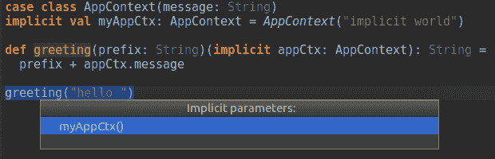
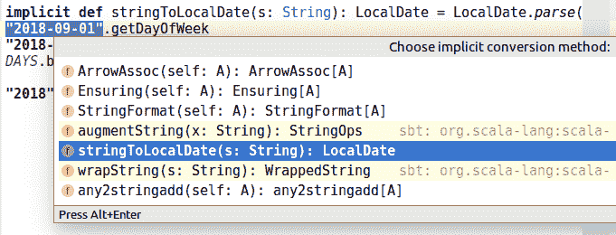

# 第四章：高级特性

在本章中，我们将探讨 Scala 的更高级特性。与任何编程语言一样，一些高级构造在实际应用中可能很少使用，或者可能会使代码变得难以理解。

我们将致力于解释我们在实际项目中遇到并部署到生产环境中的特性。有些特性在库或 SDK 中使用得更多，但在典型项目中使用得较少，但理解它们对于有效地使用库来说很重要。

由于这些特性种类繁多，覆盖范围广泛，我们发现使用专门的代码示例来解释它们比使用完整的项目更容易。因此，如果你已经熟悉这些概念中的某些，可以直接跳转到本章的任何部分。

在本章中，我们将涵盖以下主题：

+   严格性和懒性，以及它们对性能的影响

+   协变性和逆变

+   柯里化和部分应用函数

+   隐式使用

# 项目设置

本章的所有示例都已提交到以下 Git 仓库：

+   [`github.com/PacktPublishing/Scala-Programming-Projects`](https://github.com/PacktPublishing/Scala-Programming-Projects)

如果你想要运行本章中的代码示例，你需要克隆这个仓库并将项目导入 IntelliJ。每个部分都有一个相应的 Scala 工作表文件——例如，下一节的示例在`lazyness.sc`文件中。

练习的答案已经包含在这些工作表中，因此在你尝试做练习之前完全阅读它们对你来说可能更有利。

# 严格性和懒性

Scala 的默认评估策略是严格的。这意味着如果你不做任何特殊处理，任何变量声明或函数调用中的参数都会立即被评估。严格评估策略的反面是懒评估策略，这意味着只有在需要时才会进行评估。

# Strict val

以下是一个严格的变量声明：

```java
class StrictDemo {
  val strictVal = {
    println("Evaluating strictVal")
    "Hello"
  }
}
val strictDemo = new StrictDemo
//Evaluating strictVal
//strictDemo: StrictDemo = StrictDemo@32fac009
```

我们可以看到`println`被立即调用。这意味着赋值右侧的代码块在`StrictDemo`类被实例化时立即被评估。如果我们想延迟代码块的评估，我们必须使用`lazy`前缀。

# lazy val

当我们在`val`或`var`前使用`lazy`前缀（如下面的代码所示）时，它只会在需要时进行评估：

```java
class LazyDemo {
  lazy val lazyVal = {
    println("Evaluating lazyVal")
    "Hello"
  }
}
val lazyDemo = new LazyDemo
//lazyDemo: LazyDemo = LazyDemo@13ca84d5
```

当我们实例化类时，赋值右侧的代码块不会被评估。它只在我们使用变量时才会被评估，如下面的代码所示：

```java
lazyDemo.lazyVal + " World"
//Evaluating lazyVal
//res0: String = Hello World
```

这种机制允许你延迟计算密集型操作的评估。例如，你可以用它来快速启动应用程序，并且只有在第一个用户需要时才运行初始化代码。Scala 保证即使有多个线程同时尝试使用该变量，评估也只会执行一次。

你可以有`lazy`值的链，这些值只有在链的最后一个元素需要时才会被评估，如下面的代码所示：

```java
class LazyChain {
  lazy val val1 = {
    println("Evaluating val1")
    "Hello"
  }
  lazy val val2 = {
    println("Evaluating val2")
    val1 + " lazy"
  }  
  lazy val val3 = {
    println("Evaluating val3")
    val2 + " chain"
  }
}
val lazyChain = new LazyChain
// lazyChain: LazyChain = LazyChain@4ca51fa
```

当我们要求`val3`时，三个值将被评估，如下面的代码所示：

```java
lazyChain.val3
// Evaluating val3
// Evaluating val2
// Evaluating val1
// res1: String = Hello lazy chain
```

# 命名参数

我们可以更进一步，延迟函数参数的评估。命名参数就像一个不接受任何参数的函数。这样，它只有在函数体需要它时才会被评估。

假设你有一个应用程序，它从文件或数据库中加载其配置。你希望应用程序尽可能快地启动，因此你决定使用`lazy val`按需加载问候消息，如下面的代码所示：

```java
object AppConfig {
  lazy val greeting: String = {
    println("Loading greeting")
    "Hello "
  }
}
```

注意，为了简洁起见，我们在这里实际上没有加载任何内容——只是想象我们已经做了。

如果我们想在函数中使用问候变量但保持延迟其评估，我们可以使用命名参数：

```java
def greet(name: String, greeting: => String): String = {
  if (name == "Mikael")
    greeting + name
  else
    s"I don't know you $name"
}
greet("Bob", AppConfig.greeting)
// res2: String = I don't know you Bob
greet("Mikael", AppConfig.greeting)
// Loading greeting
// res3: String = Hello Mikael
```

当我们第一次用`"Bob"`调用`greet`时，`AppConfig.greeting`短语不会被评估，因为函数体不需要它。它只在我们用`"Mikael"`调用`greet`时才会被评估。

在某些情况下，使用命名参数可以增强程序的性能，因为如果不需要，可以跳过昂贵操作的评估。

# 懒数据结构

这里是一个调用`Vector`严格方法的函数定义：

```java
def evenPlusOne(xs: Vector[Int]): Vector[Int] =
  xs.filter { x => println(s"filter $x"); x % 2 == 0 }
    .map    { x => println(s"map $x");    x + 1      }

evenPlusOne(Vector(0, 1, 2))
```

它在控制台上打印以下内容：

```java
filter 0
filter 1
filter 2
map 0
map 2
res4: Vector[Int] = Vector(1, 3)
```

我们可以看到`Vector`被迭代了两次：一次用于`filter`，一次用于`map`。但是，如果`evenPlusOne`函数只迭代一次，它将更快。做到这一点的一种方法是将实现方式改变并使用`collect`。另一种方法是使用非严格的`withFilter`方法，如下面的代码所示：

```java
def lazyEvenPlusOne(xs: Vector[Int]): Vector[Int] =
  xs.withFilter { x => println(s"filter $x"); x % 2 == 0 }
    .map        { x => println(s"map $x")   ; x + 1      }

lazyEvenPlusOne(Vector(0, 1, 2))
```

`withFilter`方法打印以下内容：

```java
filter 0
map 0
filter 1
filter 2
map 2
res5: Vector[Int] = Vector(1, 3)
```

这次，`Vector`只迭代了一次。每个元素都被过滤，然后逐个映射。这是因为`withFilter`是一个懒操作——它不会立即创建一个新的过滤`Vector`，而是创建一个新的`withFilter`对象，该对象将存储过滤器的谓词。这个 SDK 集合`withFilter`类型有一个特殊的`map`实现，它会在调用传递给`map`的函数之前调用过滤器的谓词。

只要只有一个`map`或`flatMap`操作，或者如果你通过另一个`withFilter`调用进一步细化`filter`，这种方法就会非常好。然而，如果你调用另一个`map`操作，集合将被迭代两次，如下面的代码所示：

```java
def lazyEvenPlusTwo(xs: Vector[Int]): Vector[Int] =
  xs.withFilter { x => println(s"filter $x"); x % 2 == 0 }
    .map        { x => println(s"map $x")   ; x + 1      }
    .map        { x => println(s"map2 $x")  ; x + 1      }

lazyEvenPlusTwo(Vector(0, 1, 2))
```

前面的代码打印以下内容：

```java
filter 0
map 0
filter 1
filter 2
map 2
map2 1
map2 3
res6: Vector[Int] = Vector(2, 4)
```

我们可以看到，对`map2`的调用是在最后进行的，这意味着我们对`Vector(1, 3)`进行了第二次迭代。我们需要一个更懒的数据结构，它不会在我们实际需要每个元素之前进行迭代。

在 Scala SDK 中，这种集合类型是`Stream`。如果我们将`Vector`替换为`Stream`在我们的`lazyEvenPlusTwo`函数中，那么我们就会得到期望的行为，如下面的代码所示：

```java
def lazyEvenPlusTwoStream(xs: Stream[Int]): Stream[Int] =
  xs.filter { x => println(s"filter $x")    ; x % 2 == 0 }
    .map        { x => println(s"map $x")   ; x + 1      }
    .map        { x => println(s"map2 $x")  ; x + 1      }

lazyEvenPlusTwoStream(Stream(0, 1, 2)).toVector
```

在调用我们的函数后，我们将结果 `Stream` 转换为 `Vector`。正是这个 `toVector` 调用将流中的元素具体化，并调用传递给 `filter` 和 `map` 的匿名函数。以下是在控制台上打印的代码：

```java
filter 0
map 0
map2 1
filter 1
filter 2
map 2
map2 3
res7: Vector[Int] = Vector(2, 4)
```

我们可以看到 `Stream` 只被迭代一次。对于每个元素，我们调用 `filter`，然后 `map` 和 `map2`。

但还有更多。由于 `Stream` 是惰性的，它可以用来表示无限集合。以下代码显示了如何获取所有正偶数的 `Stream`：

```java
val evenInts: Stream[Int] = 0 #:: 2 #:: evenInts.tail.map(_ + 2)
evenInts.take(10).toVector
// res8: Vector[Int] = Vector(0, 2, 4, 6, 8, 10, 12, 14, 16, 18)

```

我们使用 `Stream` 操作符 `#::`，它使用头部元素和尾部构建 `Stream`。它的工作方式与 `List` 操作符 `::` 相同，但以惰性的方式进行。以下步骤显示了它是如何工作的：

1.  我们构建 `Stream 0 #:: 2`，其头部为 `0`，尾部有一个元素，`2`。

1.  第三个元素将是 `(0 #:: 2).tail.map(_ + 2)`。在这个阶段，尾部只有 `Stream(2)`，因此第三个元素将是 `4`。

1.  第四个元素将是 `(0 #:: 2 #:: 4).tail.map(_ + 2)`。相同的过程会重复应用于所有后续元素。

由于我们的 `Stream` 是无限的，我们不能将其全部转换为 `Vector`，因为这会无限进行。我们只需用 `take(10)` 取前 10 个元素，然后将它们转换为 `Vector`。

# 协变性和反对称性

当 `F` 类型接受 `A` 类型的类型参数时，我们可以在参数声明前添加一个 `+` 或 `-` 符号来指示 `F` 在 `A` 上的 **变异性**：

+   `F[+A]` 使 `F` 在 `A` 上 **协变**。这意味着如果 `B <:< A`（其中 `B` 扩展 `A`），那么 `F[B] <:< F[A]`。

+   `F[-A]` 使 `F` 在 `A` 上 **反对称**。如果 `B <:< A`，那么 `F[A] <:< F[B]`。

+   `F[A]` 使 `F` 在 `A` 上 **不变**。如果 `B <:< A`，则 `F[A]` 和 `F[B]` 之间没有关系。

# InvariantDecoder

现在，我们将通过一个示例来探索这个变异性概念。让我们从一个简单的类层次结构开始，如下面的代码所示：

```java
trait Animal
case class Cat(name: String) extends Animal
case class Dog(name: String) extends Animal
```

使用这个层次结构，我可以声明一个 `Animal` 类型的变量，并将其分配给 `Cat` 或 `Dog` 类型的实例。以下代码可以编译：

```java
val animal1: Animal = Cat("Max")
val animal2: Animal = Dog("Dolly")
implicitly[Dog <:< Animal]
```

更一般地，如果 `B <:< A`，则赋值 `val a: A = b: B` 可以编译。

你可以用表达式 `implicitly[B <:< A]` 检查类型 `B` 是否扩展类型 `A`；如果它可以编译，那么 `B` 是 `A` 的子类型。

然后，我们定义一个只有一个 `decode` 方法的 `InvariantDecoder` 特质。没有 `+` 或 `-` 符号，因此 `InvariantDecoder` 在 `A` 上是 **不变的**，如下面的代码所示：

```java
trait InvariantDecoder[A] {
  def decode(s: String): Option[A]
}
```

然后，我们为 `Cat` 实现 `InvariantDecoder`，如下面的代码所示：

```java
object InvariantCatDecoder extends InvariantDecoder[Cat] {
  val CatRegex = """Cat\((\w+\))""".r
  def decode(s: String): Option[Cat] = s match {
    case CatRegex(name) => Some(Cat(name))
    case _ => None
  }
}

InvariantCatDecoder.decode("Cat(Max)")
// res0: Option[Cat] = Some(Cat(Max)))
```

当我们用匹配 `CatRegex` 正则表达式的字符串调用 `decode` 时，我们获得一个 `Cat` 实例包裹在 `Option` 实例中。

但如果我们声明一个 `InvariantDecoder[Animal]` 类型的变量呢？我们可以将我们的 `InvariantCatDecoder` 分配给它吗？让我们试试：

```java
val invariantAnimalDecoder: InvariantDecoder[Animal] = InvariantCatDecoder
```

上述代码无法编译，但编译器在这种情况下非常有帮助。以下是你将得到的错误：

```java
error: type mismatch;
  found   : InvariantCatDecoder.type
  required: InvariantDecoder[Animal]
     Note: Cat <: Animal (and InvariantCatDecoder.type <: 
     InvariantDecoder[Cat]), but trait InvariantDecoder is invariant in     
     type A.
     You may wish to define A as +A instead. (SLS 4.5)
        val invariantAnimalDecoder: InvariantDecoder[Animal] = 
        InvariantCatDecoder
                                                               ^
```

它告诉我们，如果我们想让这一行编译，我们必须使 `InvariantDecoder` 在类型 `A` 上协变。为此，我们必须在 `InvariantDecoder` 中的 `A` 参数前添加一个 `+` 符号。

# 协变解码器

让我们遵循编译器的建议，创建一个新的 `CovariantDecoder[+A]`，以及一个扩展它的 `CovariantCatDecoder` 实例，如下面的代码所示：

```java
trait CovariantDecoder[+A] {
  def decode(s: String): Option[A]
}
object CovariantCatDecoder extends CovariantDecoder[Cat] {
 (...)
}
```

我们没有展示 `CovariantCatDecoder` 中 `decode` 的实现；它与 `InvariantCatDecoder` 中的相同。有了这个协变参数，以下关系得到验证：

```java
implicitly[CovariantDecoder[Cat] <:< CovariantDecoder[Animal]]
```

这次，我们可以将 `CovariantCatDecoder` 赋值给 `CovariantDecoder[Animal]` 的一个实例，如下面的代码所示：

```java
val covariantAnimalDecoder: CovariantDecoder[Animal] = CovariantCatDecoder
covariantAnimalDecoder.decode("Cat(Ulysse)")
// res0: Option[Animal] = Some(Cat(Ulysse)))
```

当我们调用 `decode` 时，我们得到一个 `Option[Animal]`。

初看之下，拥有 `CovariantDecoder` 似乎是自然的——如果我的解码器可以产生 `Cat`，而 `Cat` 是 `Animal`，那么我的解码器也应该是一个 `Animal` 的解码器。另一方面，如果我有一个 `Decoder[Animal]` 的实例，我会期望它能够解码任何 `Animal`——不仅 `Cat`，还包括 `Dog` 实例——但这并不是我们之前 `covariantAnimalDecoder` 的情况。

这里没有对或错的设计；这只是口味的问题。一般来说，我建议你首先使用不变类型参数，如果你在使用它时遇到一些限制，你可以决定使它们协变或逆变。

获取 `Cat` 和 `Dog` 的完整协变实现如下：

```java
object CovariantCatAndDogDecoder extends CovariantDecoder[Animal] {
  val CatRegex = """Cat\((\w+\))""".r
  val DogRegex = """Dog\((\w+\))""".r
  def decode(s: String): Option[Animal] = s match {
    case CatRegex(name) => Some(Cat(name))
    case DogRegex(name) => Some(Dog(name))
    case _ => None
  }
}

val covariantCatsAndDogsDecoder = CovariantCatAndDogDecoder

covariantCatsAndDogsDecoder.decode("Cat(Garfield)")
// res4: Option[Animal] = Some(Cat(Garfield)))
covariantCatsAndDogsDecoder.decode("Dog(Aiko)")
// res5: Option[Animal] = Some(Dog(Aiko)))
```

# 逆变编码器

现在，我们想要模拟将字符串解码为对象的相反操作——将对象编码为字符串！我们通过在 `A` 类型参数前添加一个 `-` 符号使我们的 `Encoder` 逆变，如下面的代码所示：

```java
trait Encoder[-A] {
  def encode(a: A): String
}
```

以下代码是这个 `Encoder` 的一个实例：

```java
object AnimalEncoder extends Encoder[Animal] {
  def encode(a: Animal): String = a.toString
}
```

我们有 `Cat <:< Animal` 的关系，并且 `Encoder` 在其参数上是逆变的。这意味着 `Encoder[Animal] <:< Encoder[Cat]`，因此我可以将 `Encoder[Animal]` 赋值给类型为 `Encoder[Cat]` 的变量，如下面的代码所示：

```java
val catEncoder: Encoder[Cat] = AnimalEncoder
catEncoder.encode(Cat("Luna"))
// res1: String = Cat(Luna)
```

与协变解码器类似，编码器的逆变看起来很自然——如果我可以编码任何 `Animal`，我也可以编码 `Cat`。

然而，如果我们想要创建一个可以编码和解码的单个 `Codec` 特性，我们就会遇到麻烦。类型参数不能同时是协变和逆变。

使其工作的唯一方法是将类型参数设置为不变，如下面的实现所示：

```java
object CatAndDogCodec extends Codec[Animal] {
  val CatRegex = """Cat\((\w+\))""".r
  val DogRegex = """Dog\((\w+\))""".r

  override def encode(a: Animal) = a.toString

  override def decode(s: String): Option[Animal] = s match {
    case CatRegex(name) => Some(Cat(name))
    case DogRegex(name) => Some(Dog(name))
    case _ => None
  }
}
```

但让我们看看如果我们尝试使用协变会发生什么。编译器会返回以下错误：

```java
trait Codec[+A] {
  def encode(a: A): String
  def decode(s: String): Option[A]
}
 Error:(55, 15) covariant type A occurs in contravariant position in 
    type A of value a
    def encode(a: A): String
     ^
```

编译器对 `A` 类型处于逆变位置表示不满。这是因为函数中，参数总是处于逆变位置，而结果总是处于协变位置。例如，如果你打开 `scala.Function3`，你会看到以下声明：

```java
trait Function3[-T1, -T2, -T3, +R] extends AnyRef { self =>
```

这意味着以下两点：

+   如果你将类型参数声明为使用 `+A` 进行协变，那么 `A` 类型只能出现在方法的 **结果** 中

+   如果你将类型参数声明为使用 `-A` 进行逆变，那么 `A` 类型只能出现在方法的 **参数** 中

在我们的 `decode` 方法中，`A` 出现在结果中，因此它处于协变位置。这就是为什么我们可以通过在 `CovariantDecoder` 中使用 `+A` 来使解码器在 `A` 上协变。

相反，在我们的 `encode` 方法中，`A` 出现在参数中，因此它处于逆变位置。这就是为什么我们可以通过在 `Encoder` 中使用 `-A` 来使编码器在 `A` 上逆变。

实现我们的 `Codec` 的另一种方式是使用类型类。这在上文第五章，*类型类*中有所解释。

# 集合中的协变

SDK 中的大多数集合类型都是协变的。例如，如果你打开 `Vector` 类，你会看到以下内容：

```java
final class Vector[+A] (...)
```

这允许我们将 `Vector[B]` 赋值给 `Vector[A]` 类型的变量，前提是 `B <:< A` 类型，如下面的代码所示：

```java
val cats: Vector[Cat] = Vector(Cat("Max"))
val animals: Vector[Animal] = cats
```

现在有一点魔法：

```java
val catsAndDogs = cats :+ Dog("Medor")
// catsAndDogs: Vector[Product with Serializable with Animal] = 
// Vector(Cat(Max), Dog(Medor))
```

Scala 不仅允许我们将 `Dog` 添加到 `Vector[Cat]` 中，而且它还会自动推断新的集合类型为 `Vector[Product with Serializable with Animal]`。

我们之前看到，函数的参数处于逆变位置。因此，甚至不可能有一个 `:+(a: A)` 方法可以向 `Vector` 类添加元素，因为 `Vector` 在 `A` 上是协变的！但是有一个技巧。如果你查看 `Vector` 源代码中 `:+` 的定义，你会看到以下代码：

```java
override def :+B >: A, That(implicit bf: CanBuildFrom[Vector[A], B, That]): That
```

该方法接受一个受约束的 `B` 类型参数，要求 `B` 必须是 `A` 的超类型。在我们之前的例子中，`A` 类型是 `Cat`，我们的 `elem` 参数是 `Dog` 类型。Scala 编译器自动推断 `B` 类型为 `Dog` 和 `Cat` 的最接近的共同超类型，即 `Product with Serializable with Animal`。

如果我们将 `String` 添加到这个 `Vector` 中，结果类型将是 `Animal` 和 `String` 之间的下一个公共超类型，即 `Serializable`，如下面的代码所示：

```java
val serializables = catsAndDogs :+ "string"
// serializables: Vector[Serializable] = Vector(Cat(Max), Dog(Medor), 
// string)
val anys = serializables :+ 1
// anys: Vector[Any] = Vector(Cat(Max), Dog(Medor), string, 1)
```

然后，当我们向 `Vector` 类添加一个 `Int` 时，`Serializable` 和 `Int` 之间的下一个公共超类型是 `Any`。

如果你有一个具有协变 `MyClass[+A]` 类型参数的类，并且你需要实现一个具有 `A` 类型参数的方法，那么你可以使用 `B >: A` 类型参数来定义它，写作 `def myMethodB >: A = ...`。

# 柯里化和部分应用函数

“柯里化”这个名字是对数学家和逻辑学家 Haskell Curry 的致敬。柯里化的过程包括将接受多个参数的函数转换为一系列函数，每个函数只有一个参数。

# 函数值

在我们开始柯里化函数之前，我们需要理解函数和函数值的区别。

您已经熟悉函数——它们以关键字 `def` 开头，在括号 `()` 符号之间有一个或多个参数列表，可选地在冒号 `:` 后声明返回类型，并在等号 `=` 后有一个定义的函数体，如下面的示例所示：

```java
def multiply(x: Int, y: Int): Int = x * y
// multiply: multiply[](val x: Int,val y: Int) => Int
```

函数值（也称为函数字面量）类似于任何其他值，例如 `"hello": String`、`3: Int` 或 `true: Boolean`。与其他值一样，您可以将函数值作为参数传递给函数，或使用 `val` 关键字将其分配给变量。

您可以直接声明函数值，如下面的代码所示：

```java
val multiplyVal = (x: Int, y: Int) => x * y
// multiplyVal: (Int, Int) => Int = ...
```

或者，您可以通过在函数名称末尾添加一个 `_` 字符将函数转换为函数值，如下面的代码所示：

```java
val multiplyVal2 = multiply _
// multiplyVal2: (Int, Int) => Int = ...

```

当涉及到向函数应用参数时，无论是调用函数还是函数值，语法都是相同的，如下面的代码所示：

```java
multiply(2, 3)
multiplyVal(2, 3)
multiplyVal2(2, 3)
```

# 柯里化

柯里化函数是一个接受一个参数并返回另一个接受一个参数的函数的函数。您可以通过调用 `.curried` 方法将函数值转换为柯里化函数值，如下面的代码所示：

```java
val multiplyCurried = multiplyVal.curried
// multiplyCurried: Int => (Int => Int) = ...
```

`.curried` 的调用将函数值的类型从 `(Int, Int) => Int` 转换为 `Int => (Int => Int)`。`multiplyVal` 接受两个整数作为参数并返回一个整数。`multiplyCurried` 接受一个 `Int` 并返回一个接受 `Int` 并返回 `Int` 的函数。这两个函数值具有完全相同的功能——区别在于我们如何调用它们，如下面的代码所示：

```java
multiplyVal(2, 3)
// res3: Int = 6
multiplyCurried(2)
// res4: Int => Int = ...
multiplyCurried(2)(3)
// res5: Int = 6
```

当我们调用 `multiplyCurried(2)` 时，我们只应用了第一个参数，这返回了一个 `Int => Int` 函数。在这个阶段，函数还没有完全应用——它是一个**部分应用**函数。如果我们想要获得最终结果，我们必须通过调用 `multiplyCurried(2)(3)` 来应用第二个参数。

# 部分应用函数

在实践中，没有必要调用 `.curried` 来定义柯里化函数。您可以直接使用多个参数列表声明柯里化函数。以下是一个计算 `Item` 类折扣的柯里化函数示例：

```java
case class Item(description: String, price: Double)

def discount(percentage: Double)(item: Item): Item =
  item.copy(price = item.price * (1 - percentage / 100))
```

如果我们提供两个参数列表，我们可以**完全应用**函数，如下所示：

```java
discount(10)(Item("Monitor", 500))
// res6: Item = Item(Monitor,450.0)
```

但如果我们只提供第一个参数列表并添加一个 `_` 字符来表示我们想要一个函数值，我们也可以部分应用函数，如下面的代码所示：

```java
val discount10 = discount(10) _
// discount10: Item => Item = ...
discount10(Item("Monitor", 500))
// res7: Item = Item(Monitor,450.0)
```

`discount10` 函数值是一个部分应用函数，它接受 `Item` 并返回 `Item`。然后我们可以通过传递一个 `Item` 实例来调用它以完全应用它。

部分应用函数在需要将匿名函数传递给高阶函数（接受函数作为参数的函数）时特别有用，例如 `map` 或 `filter`，如下面的代码所示：

```java
val items = Vector(Item("Monitor", 500), Item("Laptop", 700))
items.map(discount(10))
// res8: Vector[Item] = Vector(Item(Monitor,450.0), Item(Laptop,630.0))

```

在这个例子中，`map` 函数期望一个 `Item => B` 类型的参数。我们传递了 `discount(10)` 参数，这是一个 `Item => Item` 类型的部分应用函数。多亏了部分应用函数，我们才能够在不定义新函数的情况下对一系列商品应用折扣。

# 隐式

如其名所示，Scala 关键字 `implicit` 可以用来隐式地向编译器添加一些额外的代码。例如，函数定义中的隐式参数允许你在调用函数时省略此参数。因此，你不必显式地传递此参数。

在本节中，我们将介绍 Scala 中不同类型的隐式：

+   隐式参数在函数定义中被声明

+   一个隐式值被作为参数传递给一个具有隐式参数的函数

+   隐式转换将一种类型转换为另一种类型

这是一个非常强大的功能，有时会感觉有点像魔法。在本节中，我们将看到它如何帮助编写更简洁的代码，以及如何使用它来在编译时验证一些约束。在下一章中，我们将使用它们来定义另一个强大的概念：类型类。

# 隐式参数

在函数定义中，最后一个参数列表可以被标记为 `implicit`。这样的函数可以不传递相应的参数就调用。当你省略隐式参数时，Scala 编译器将尝试在当前作用域中查找相同类型的隐式值，并将它们用作函数的参数。

下面是一个你可以将其输入到 Scala 工作表中的这个机制的说明：

```java
case class AppContext(message: String)
implicit val myAppCtx: AppContext = AppContext("implicit world")

def greeting(prefix: String)(implicit appCtx: AppContext): String =
  prefix + appCtx.message

greeting("hello ")
// res0: String = hello implicit world
```

我们首先声明一个新的 `AppContext` 类，并将这个类的新实例分配给一个 `implicit val`。`val myAppCtx` 可以像正常的 `val` 一样使用，但 `implicit` 关键字还向编译器指示这个 `val` 是隐式解析的候选者。

`greeting` 函数的定义在其最后一个参数列表上有 `implicit` 标记。当我们不传递 `appCtx` 参数调用它时，编译器会尝试解析这个隐式参数。这个隐式解析尝试在当前作用域中查找 `AppContext` 类型的隐式值。唯一具有这种类型的隐式值是 `myAppCtx`，因此这就是用于 `appCtx` 的参数。

注意，隐式解析是在编译时进行的。如果编译器无法解析隐式参数，它将引发错误。此外，如果当前作用域中有多个相同类型的隐式值，编译器将无法决定选择哪一个，并会因为模糊的隐式值而引发错误。

在一个大型代码库中，有时很难知道在给定的函数调用中选择了哪个隐式值。幸运的是，IntelliJ 可以显示给你。将光标置于 `greeting("hello ")` 行，然后转到视图 | 隐式参数，或者按住 *Ctrl* + *Shift* + *P*（Linux/Windows）或 *Meta* + *Shift +* *P*（macOS）。你应该会看到以下提示，如下面的截图所示：



你可以点击提示中显示的参数。IntelliJ 将跳转到隐式值的声明。

隐式参数列表的参数也可以显式传递。以下调用与上一个调用等价：

```java
greeting("hello ")(myAppCtx)
// res0: String = hello implicit world
```

当你显式传递隐式参数时，隐式解析机制不会启动。

隐式参数应该有一个实例非常少的类型。拥有一个类型为字符串的隐式参数是没有意义的；会有太多的候选者来解析它。这将使代码难以理解。

# 隐式参数使用

当你需要反复将相同的参数传递给许多函数时，隐式参数非常有用。这种情况在配置参数中经常发生。

# 传递超时

想象一下，你实现了一个名为 `PriceService` 的特质，它通过调用外部网站来获取产品的价格。你定义了它的接口如下：

```java
import cats.data.ValidatedNel
case class Timeout(millis: Int)

trait PriceService {
  def getPrice(productName: String)(implicit timeout: Timeout): 
  ValidatedNel[String, Double]
}
```

外部网站可能不会响应，因此我们的服务必须等待一段时间后才会放弃，这由参数 `timeout` 表示。正如我们在第三章中看到的，*处理错误*，如果获取价格时出现任何问题，服务将返回 `Invalid[NonEmptyList[String]]`，如果我们能够获取价格，则返回 `Valid[Double]`。

在一个大型应用程序中，你可以定义更多这样的服务。使用隐式参数允许你调用这些函数而无需每次都传递 `timeout` 参数。此外，如果你需要添加其他配置参数，你可以添加更多的隐式参数，而无需更改所有的函数调用。

当你想调用该服务时，你需要在你的作用域中拥有 `implicit val timeout: Timeout`。这为你提供了很大的灵活性，因为你完全控制在哪里定义这个 `timeout` 以及如何将其带到当前作用域。以下列出了一些选项：

+   你可以在 `object AppConfig { implicit val defaultTimeout: Timeout = ??? }` 单例中只定义一次，用于整个应用程序。在这个对象中，你可以将其值硬编码或从配置文件中读取。当你需要调用服务时，你只需要 `import AppConfig.defaultTimeout` 就可以将它带到当前作用域。

+   你可以为生产代码使用一个值，为测试代码使用另一个值。

+   你的应用程序的某一部分可以使用一个值，比如用于快速服务，而另一部分可以使用不同的值用于慢速服务。

# 传递应用程序上下文

如果你有很多其他配置参数需要传递给你的函数，将其放在一个`ApplicationContext`类中并在你的函数中声明这个类的隐式参数会更方便。额外的优势是，这个上下文不仅可以存储配置参数，还可以持有常用服务类的引用。这种机制可以有效地替代你可能使用过的 Java 依赖注入框架，如 Spring 或 Guice。

例如，假设我们有一个实现`DataService`特质的程序。它有两个方法可以从数据库加载和保存`Product`对象，如下面的代码所示：

```java
case class Product(name: String, price: Double)

trait DataService {
  def getProduct(name: String): ValidatedNel[String, Product]
  def saveProduct(product: Product): ValidatedNel[String, Unit]
}
```

我们通常会为这个特质实现两个版本：

+   另一个在生产代码中，它将交互一个真实的数据库。

+   一个在测试代码中，它将在测试期间将`Product`保存在内存中。这将使我们能够更快地运行测试，并使测试独立于任何外部系统。

我们可以定义一个`AppContext`类，如下所示：

```java
class AppContext(implicit val defaultTimeout: Timeout,
                 val priceService: PriceService,
                 val dataService: DataService)
```

这个上下文将针对生产代码和测试代码有不同的实现。这将让你在运行测试时无需连接到数据库或外部服务就能实现复杂的函数。例如，我们可以使用`implicit appContext`参数实现一个`updatePrice`函数：

```java
import cats.implicits._
def updatePrice(productName: String)(implicit appContext: AppContext)
: ValidatedNel[String, Double] = {
  import appContext._
  (dataService.getProduct(productName), 
  priceService.getPrice(productName)).tupled.andThen {
    case (product, newPrice) =>
      dataService.saveProduct(product.copy(price = newPrice)).map(_ =>
        newPrice
      )
  }
}
```

这个函数从数据库中加载一个产品，通过调用`priceService`获取其新价格，并使用更新后的价格保存产品。它将返回一个包含新价格的`Valid[Double]`，或者在服务出现错误时返回包含错误信息的`Invalid[NonEmptyList[String]]`。在为这个函数编写单元测试时，我们会传递`AppContext`，它包含`PriceService`和`DataService`的模拟实现。

# SDK 中的示例

**Scala 开发工具包**（**SDK**）在多个地方使用了隐式参数。我们将探讨一些作为更有经验的 Scala 开发者你可能会遇到的常见用法。

# breakOut

Scala 集合 API 上几个方法的定义，如`map`，有一个`CanBuildFrom`类型的隐式参数。这个类型用于构建与输入类型相同类型的集合。

例如，当你对一个`Vector`调用`map`时，返回类型仍然是一个`Vector`，如下面的 REPL 中运行的代码所示：

```java
val vec = Vector("hello", "world").map(s => s -> s.length)
// vec: scala.collection.immutable.Vector[(String, Int)] = 
// Vector((hello,5), (world,5))
```

当你在 IntelliJ 中将光标定位在`map`方法上并按下 cmd + left-click 时，你会看到`map`是在`TraversableLike`中声明的，如下所示：

```java
def mapB, That(implicit bf: CanBuildFrom[Repr, B, That]): That = {...}
```

`TraversableLike`特质是许多 Scala 集合（如`Vector`、`List`、`HashSet`等）的父特质。它实现了所有这些集合的共同方法。在这些方法中的许多方法，使用了`bf: CanBuildFrom`参数来构建与原始集合相同类型的集合。如果你跳转到`CanBuildFrom`的定义，你会看到它有三个类型参数，如下面的代码所示：

```java
trait CanBuildFrom[-From, -Elem, +To]
```

第一个参数`From`是原始集合的类型（`Vector`、`List`等）。第二个参数`Elem`是集合中元素的类型。第三个参数`To`是目标集合的类型。

回到我们的例子，这意味着当我们对`Vector`调用`.map`时，传递了一个隐式参数，其类型为`CanBuildFrom`。我们可以通过再次将光标定位在`map`方法上，并转到视图 | 隐式参数，或者按住 cmd + shift + P 来查看其声明位置。如果我们点击工具提示文本，就会跳转到`Vector.scala`中的这个定义，如下面的代码所示：

```java
object Vector extends IndexedSeqFactory[Vector] {
...
  implicit def canBuildFrom[A]: CanBuildFrom[Coll, A, Vector[A]] = ...
```

我们可以看到，`CanBuildFrom`中的`To`目标参数是`Vector[A]`类型。这解释了为什么在我们的例子中`vec`变量是`Vector[(String, Int)]`类型。

这个机制相当复杂，但除非你想实现自己的集合类型，否则你不需要详细了解。当你只是库的用户时，SDK 会很好地隐藏这些细节。

然而，有一件值得记住的事情是，你可以传递不同的`CanBuildFrom`参数来避免不必要的转换。例如，假设我们想要构建`Map[String, Int]`，其中键是一个字符串，值是该字符串的长度。回到我们的例子，最直接的方法是调用`.toMap`，如下面的代码所示：

```java
val vec = Vector("hello", "world").map(s => s -> s.length)
vec.toMap
// res0: scala.collection.immutable.Map[String,Int] = Map(hello -> 5,  world -> 5)
```

这种方法的缺点是它将两次遍历`Vector`类的元素：一次用于映射元素，一次用于构建`Map`。在小集合中，这并不是问题，但在大集合中，性能可能会受到影响。

幸运的是，我们可以在一次迭代中构建我们的`Map`。如果我们调用`map`时传递特殊的`breakOut`对象，`CanBuildFrom`的目标类型将是接收变量的类型，如下面的代码所示：

```java
import scala.collection.breakOut
val map: Map[String, Int] = Vector("hello", "world").map(s => s -> s.length)(breakOut)
// map: Map[String,Int] = Map(hello -> 5, world -> 5)
```

这个简单的技巧可以提高你应用程序的性能，而不会降低可读性。

集合转换操作，如`.toMap`、`toVector`等，通常可以移除。尝试在之前的转换中传递`breakOut`；这将节省一次迭代。

# 执行上下文

Scala SDK 中的`Future`类允许你异步运行计算。我们将在第六章中更详细地探讨这一点，*在线购物——持久化*，但在这个部分，我们将探讨它是如何使用隐式参数来提供执行上下文的。

打开一个 Scala 控制台并输入以下代码。它应该创建一个`Future`计算，当它执行时将打印当前线程的名称：

```java
scala> import scala.concurrent.Future
import scala.concurrent.Future
scala> Future(println(Thread.currentThread().getName))
```

由于我们在作用域内缺少隐式转换，你应该看到以下错误：

```java
<console>:13: error: Cannot find an implicit ExecutionContext. You might pass
an (implicit ec: ExecutionContext) parameter to your method
or import scala.concurrent.ExecutionContext.Implicits.global.
       Future(println(Thread.currentThread().getName))
```

编译器告诉我们，我们必须在作用域内有一个`implicit ExecutionContext`。`ExecutionContext`是一个可以异步执行一些计算的类，通常使用线程池。如编译器所建议，我们可以通过导入`scala.concurrent.ExecutionContext.Implicits.global`来使用默认的执行上下文，如下面的代码所示：

```java
scala> import scala.concurrent.ExecutionContext.Implicits.global
import scala.concurrent.ExecutionContext.Implicits.global
scala> import scala.concurrent.Future
import scala.concurrent.Future

scala> Future(println(Thread.currentThread().getName))scala-execution-context-global-11
res1: scala.concurrent.Future[Unit] = Future(Success(()))
```

在前面的代码片段中，`res1`的值可以是：

`res1: scala.concurrent.Future[Unit] = Future(<未完成>)`由于这是一个`Future`，我们不知道它何时完成；这取决于你的机器。

我们可以看到，用于执行我们的`println`语句的线程名称是`scala-execution-context-global-11`。如果我们想使用不同的线程池来运行我们的计算，我们可以声明一个新的`ExecutionContext`。重新启动 Scala 控制台并输入以下代码：

```java
scala> import scala.concurrent.Future
import scala.concurrent.Future

scala> import java.util.concurrent.Executors
import java.util.concurrent.Executors

scala> import scala.concurrent.{ExecutionContext, Future}
*i*mport scala.concurrent.{ExecutionContext, Future}

scala> implicit val myThreadPool: ExecutionContext = ExecutionContext.fromExecutor(Executors.newFixedThreadPool(2))
myThreadPool: scala.concurrent.ExecutionContext = scala.concurrent.impl.ExecutionContextImpl@7f3c0399

scala> Future(println(Thread.currentThread().getName))
pool-1-thread-1
res0: scala.concurrent.Future[Unit] = Future(<not completed>)
```

我们可以观察到，运行我们的代码所使用的线程现在来自不同的线程池。`Future`上的许多方法都有一个隐式的`ExecutionContext`参数。通过更改作用域内的隐式转换，你可以控制异步计算如何执行。

这在使用某些数据库驱动程序时特别有用——你通常会使用单独的线程池来查询数据库，每个数据库连接一个线程。另一方面，CPU 密集型计算可以使用默认的线程池，该线程池将初始化为你的机器上可用的 CPU 核心数。

# 隐式转换

隐式转换将源类型转换为目标类型。这允许你做以下操作：

+   将目标类型的方法用作在源类型上声明的方法

+   在接受目标类型的函数中将源类型作为参数传递

例如，我们可以使用以下代码将`String`类型视为`LocalDate`：

```java
import java.time.LocalDate

implicit def stringToLocalDate(s: String): LocalDate = LocalDate.parse(s)
```

注意，IntelliJ 在`implicit`关键字上突出显示了一个黄色的警告`高级语言功能：隐式转换`。

如果你想消除这个警告，可以将光标放在`implicit`关键字上，然后按*Alt* + *Enter*，并选择启用隐式转换。

在此声明之后，如果我们有一个可以解析为`LocalDate`的`String`对象，我们可以调用`LocalDate`上正常可用的任何方法，如下面的代码所示：

```java
"2018-09-01".getDayOfWeek
// res0: java.time.DayOfWeek = SATURDAY

"2018-09-01".getYear
// res1: Int = 2018
```

我们还可以使用普通字符串作为参数调用接受`LocalDate`的函数，如下面的代码所示：

```java
import java.time.temporal.ChronoUnit.DAYS
DAYS.between("2018-09-01", "2018-10-10")
// res2: Long = 39
```

这看起来有点像魔术，确实在阅读代码时不容易发现正在发生隐式转换。幸运的是，IntelliJ 可以帮助我们。

首先，你可能会注意到 `getDayOfWeek` 和 `getYear` 方法被下划线标注。这是为了表明该方法是在隐式转换的类型上定义的。

IntelliJ 还可以帮助我们找到隐式转换的定义位置。将光标放在其中一个字符串上，然后在 macOS 上按 `ctrl` + `+` + `Q`（或点击“导航”|“隐式转换”）。你应该会看到一个以下弹出窗口：



弹出窗口突出显示了应用的隐式转换函数。然后你可以点击它跳转到其声明。请注意，IntelliJ 还显示了来自 SDK 的其他一些可能的隐式转换。

这种转换为 `LocalDate` 可能看起来相当不错；然而，如果我们使用一个无法解析的字符串，代码将在运行时抛出异常，如下面的代码所示。正如我们在第三章“处理错误”中看到的，这最好避免：

```java
"2018".getMonth
// java.time.format.DateTimeParseException: Text '2018' could not be parsed at index 4
```

这个隐式转换的例子只是为了说明。

由于我们的转换可能会抛出异常，如果我们将其用于生产代码中，这将使代码变得不安全。然而，它对于编写更简洁的单元测试却很有用。

隐式转换非常强大，而大权在握也伴随着巨大的责任！不建议你从 SDK 的常见类型（如 `String`、`Int` 等）定义隐式转换到其他 SDK 类型。这可能会迅速使你的代码难以阅读。

# 隐式类

隐式转换通常用于向现有类型添加额外的方法。这被称为“pimp my library”模式。例如，如果我们想在 `Int` 类型上添加一个 `square` 方法，我们可以按照以下步骤进行。在 Scala 控制台中输入以下代码：

```java
scala>
class IntOps(val i: Int) extends AnyVal {
 def square: Int = i * i
}
scala> implicit def intToIntOps(i: Int): IntOps = new IntOps(i)
intToIntOps: (i: Int)IntOps
scala> 5.square
res0: Int = 25
```

`5` 被隐式转换为 `IntOps`，它提供了 `square` 方法。

注意 `IntOps` 扩展了 `AnyVal`。这种扩展使其成为一个**值类**。值类的优点是编译器将避免在我们调用 `square` 方法时分配新对象。生成的字节码将和直接在 `Int` 类中定义 `square` 一样高效。编译时的类型是 `IntOps`，但运行时的类型将是 `Int`。

值类的一个限制是它们必须在文件的顶层或对象内部定义。如果你尝试在一个 Scala 工作表中运行前面的代码，你将得到一个编译错误：“值类不能是另一个类的成员”。<q>这是 Scala 工作表评估方式的结果——工作表内的代码属于一个非静态对象。

当你想向无法更改的类添加新功能时，这种“pimp my library”模式非常有用，例如以下情况：

+   属于 SDK 或来自第三方库的类。

+   对于您自己的类，您可以使一些方法从服务器模块中访问，但不能从客户端模块中访问。

Scala 提供了一些语法糖来使这种模式更加简洁。我们可以用以下隐式类定义重写前面的代码：

```java
scala> 
implicit class IntOps(val i: Int) extends AnyVal {
  def square: Int = i * i
}

scala>5.square
res0: Int = 25
```

编译器将隐式类声明转换为类和隐式转换。这两种形式是等价的。

这种模式在 SDK 中很常见，尤其是在对来自 Java 开发工具包的类进行“增强”时。

例如，`java.lang.String`可以通过`scala.collection.immutable.StringOps`进行增强，如下面的代码所示：

```java
"abcd".reverse
val abcd: StringOps = Predef.augmentString("abcd")
abcd.reverse
```

在第一行，我们调用了`reverse`方法，这是一个来自`StringOps`的增强方法。通过下划线`reverse`方法，IntelliJ 会向您显示它不是在`java.lang.String`上定义的方法。如果您将光标移到第一个字符串`"abcd"`上，并按*Ctrl* + *Shift* + *Q*，您应该看到一个弹出窗口显示`"abcd"`被隐式转换为`StringOps`，使用的是`Predef.augmentString`。

在第 2 和第 3 行，我们向您展示如何显式地将我们的字符串转换为`StringOps`并调用相同的方法。这只是为了说明目的；在实际项目中，您只会依赖于隐式转换。

# 隐式是如何解决的？

到目前为止，我们已经在它们被使用的作用域中声明了隐式值和隐式转换。但我们也可以在其他文件中定义它们。

Scala 编译器有一套规则来查找隐式参数或隐式转换。编译器会按照以下步骤进行，并遵循以下规则：

1.  按照以下方式查看当前作用域：

+   **当前作用域中定义的隐式**：这些应该在同一个函数、类或对象中。这就是我们在上一节中定义它的方式。

+   **显式导入**：您可以在对象`myObj`中定义一个隐式值`implValue`，并通过语句`import myObj.implValue`将其引入当前作用域。

+   **通配符导入**：`import myObj._`。

1.  看一下关联的类型：

+   **源类型的伴生对象**：例如，在`Option`的伴生对象中，存在一个到`Iterable`的隐式转换。这允许您在`Option`实例上调用任何`Iterable`的方法。此外，如果函数期望一个`Iterable`参数，您也可以传递一个`Option`实例。

+   **参数类型的伴生对象**：例如，如果您调用`List(1, 2, 3).sorted`，`sorted`方法实际上接受一个`Ordering[Int]`类型的隐式参数。这个隐式值可以在`Ordering`的伴生对象中找到。

+   **参数类型参数的伴生对象**：当一个函数的参数有一个`A`类型参数，例如`Ordering[A]`时，会搜索`A`的伴生对象中的隐式值。以下是一个示例：

```java
case class Person(name: String, age: Int)
object Person {
  implicit val ordering: Ordering[Person] = Ordering.by(_.age)
}

List(Person("Omer", 40), Person("Bart", 10)).sorted
```

在这个例子中，`sorted` 方法期望一个隐式参数为 `Ordering[Person]` 类型，这个类型可以在 `Person` 类型参数的伴随对象中找到。

# 摘要

在本章中，我们涵盖了大量的内容。你学习了如何使用 `lazy` 变量来提高性能，并了解了协变和逆变。你还学习了如何使用柯里化技术部分应用函数，最后，我们探讨了在 Scala 中使用隐式的所有不同方式。一些概念，如柯里化，也用于其他函数式编程语言，如 Haskell。

在下一章中，我们将通过引入类型类来深入探讨类型理论。类型类是分组具有共同行为的相同类型的概念。
