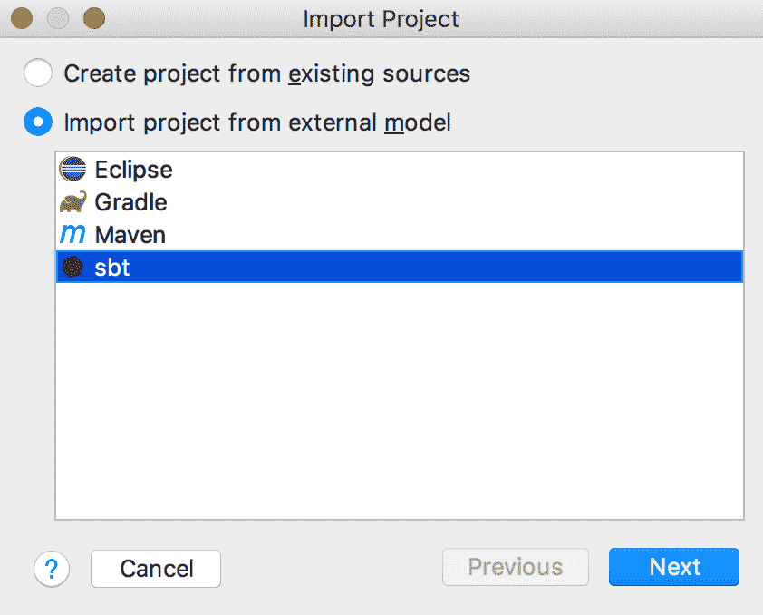
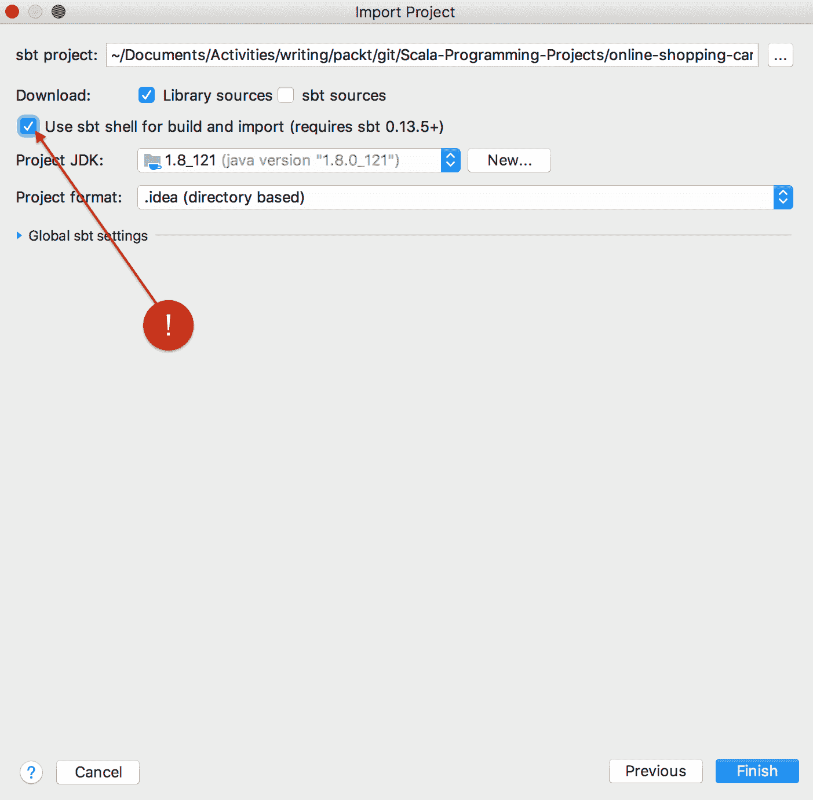
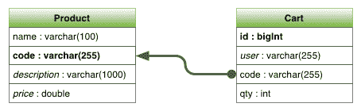
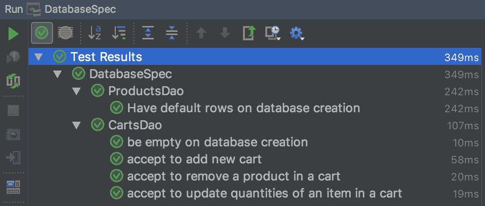
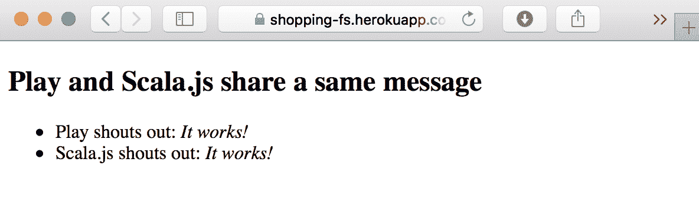

# 在线购物 - 持久性

在接下来的四章中，我们将使用 Scala 生态系统中最常见的库和框架来编写一个项目。

我们将从前端到数据库实现一个在线购物网站的购物车管理。

从数据库开始，我们将实现一个持久性层。这个层的责任是将购物车的内 容持久化到关系型数据库中。为此，我们将使用一个名为 Slick 的关系型持久化框架。

然后，我们将花费时间来定义一个访问数据库的 API，这个 API 将使用 RESTful Web 服务架构和 JSON 作为消息协议。API 将完全由生成的网站进行文档化和测试。

最后，我们将实现用户界面层。通过这个界面，用户可以将其产品添加到购物车中，移除产品，并更新购物车中特定产品的数量。Scala.js 被用来实现这个界面。

在本章中，我们将解释如何在关系型数据库中持久化数据。数据将是购物网站购物车的内 容。

如果我们想要构建一个能够接受大量同时连接的健壮网站，就需要特别小心，确保解决方案的所有层都能随着需求进行扩展。

在持久性层级别，一个关键点是不要过度使用系统资源，更确切地说，每次将数据写入数据库时不要过度使用线程。实际上，如果每个对数据库的请求都阻塞了一个线程，那么并发连接的限制将很快达到。

为了这个目的，我们将使用一个名为 Slick 的异步框架来执行数据库操作。

为了使用 Slick 框架，将需要介绍 Scala `Future`。`Future`是 Scala 中处理异步代码的基本工具之一。

由于我们很少在家托管网站，我们将使用名为 Heroku 的云服务提供商来部署这一层，以及稍后整个网站。这意味着购物车将从世界各地都可以访问。

在本章中，我们将涵盖以下主题：

+   创建项目

+   持久性

+   部署应用程序

+   Heroku 配置

# 创建项目

为了方便项目创建，我们提供了一个模板，该模板可以生成项目的骨架。为此，[Gitter8](http://www.foundweekends.org/giter8/)将帮助我们根据托管在 Git 中的模板生成完整的项目。

我们不会直接使用 Gitter8 的命令行。相反，我们将使用与 sbt 的集成来生成项目。

模板可以在 Github 上找到，地址为 [GitHub - scala-fundamentals/scala-play.g8: 用于在线购物的模板](https://github.com/scala-fundamentals/scala-play.g8.git)。这个模板是从 [`github.com/vmunier/play-scalajs.g8.`](https://github.com/vmunier/play-scalajs.g8.) 分支出来的。我们基本上将框架测试从 Specs2 更改为 ScalaTest，并添加了我们购物项目所需的全部依赖项。

要创建项目，请在您的控制台中输入以下内容：

```java
sbt new scala-fundamentals/scala-play.g8 --name=shopping --organization=io.fscala
```

这将创建一个包含我们项目所需的所有文件和文件夹的新文件夹。

您现在可以将此项目导入 IntelliJ，点击导入项目，在第一个对话框中选择 sbt：



点击下一步，在下一个对话框中，请勾选使用 sbt shell 进行构建和导入（需要 sbt 0.13.5+）选项，如下所示：



就这样，我们为实施做好了准备。

# 持久性

在在线购物项目的背景下，我们将创建一个简单的数据模型，只包含两个表——购物车和产品表。产品代表我们想要销售的商品。它有一个名称、一个代码、一个描述和一个价格。

购物车是客户即将购买的商品。它有一个 ID，任何新创建的购物车都会自动递增，还有一个用户，代表用户标识。为了本书的目的，我们将使用登录过程中发送的用户名。购物车还有一个数量和代码，代表与产品表的链接。

下面的图表示我们的模型：



为了本书的目的，我们将选择一个无需管理的数据库，速度快，占用空间小，并且可以快速顺利地部署的数据库。H2 数据库满足所有这些要求。

为了访问我们的数据，我们希望利用 Scala 语言在编译时静态检查我们的代码。Slick 库非常适合这项任务。

Slick 可以为多个数据库生成 SQL，并支持以下 RDBMS（以及相应的 JDBC 驱动程序版本）：

| 数据库 | JDBC 驱动程序 |
| --- | --- |
| SQLServer 2008, 2012, 2014 | jTDS - SQL Server and Sybase JDBC driver ([`sourceforge.net/projects/jtds/`](https://sourceforge.net/projects/jtds/)) and Microsoft JDBC Driver 6.0 for SQL Server ([`www.microsoft.com/en-gb/download/details.aspx?id=11774`](https://www.microsoft.com/en-gb/download/details.aspx?id=11774)) |
| Oracle 11g | [`www.oracle.com/technetwork/database/features/jdbc/index-091264.html`](http://www.oracle.com/technetwork/database/features/jdbc/index-091264.html) |
| DB2 10.5 | [`www-01.ibm.com/support/docview.wss?uid=swg21363866`](http://www-01.ibm.com/support/docview.wss?uid=swg21363866) |
| MySQL | `mysql-connector-java:5.1.23` ( [`dev.mysql.com/downloads/connector/j/`](https://dev.mysql.com/downloads/connector/j/)) |
| PostgreSQL | PostgreSQL JDBC Driver: `9.1-901.jdbc4` ([`jdbc.postgresql.org`](https://jdbc.postgresql.org)) |
| SQLite | `sqlite-jdbc:3.8.7` ([`bitbucket.org/xerial/sqlite-jdbc/downloads/`](https://bitbucket.org/xerial/sqlite-jdbc/downloads/)) |
| Derby/JavaDB | `derby:10.9.1.0` ([`db.apache.org/derby/derby_downloads.html`](https://db.apache.org/derby/derby_downloads.html)) |
| HSQLDB/HyperSQL | `hsqldb:2.2.8` ([`sourceforge.net/projects/hsqldb/`](https://sourceforge.net/projects/hsqldb/)) |
| H2 | `com.h2database.h2:1.4.187` ([`h2database.com/html/download.html`](http://h2database.com/html/download.html)) |

# 设置 Slick

我们需要设置 Slick 吗？在*Developing a full project*章节中生成的项目`build.sbt`文件中，请求的库在服务器部分设置。Slick 与 Play 集成良好，依赖项的完整列表如下：

```java
libraryDependencies ++= Seq(
  "com.typesafe.play" %% "play-slick" % "3.0.0",
  "com.typesafe.play" %% "play-slick-evolutions" % "3.0.0",
  "com.h2database" % "h2" % "1.4.196"
)
```

我们添加了 Slick 依赖项以及 Evolution 模块。Evolution 是一个简化模式管理的模块；我们稍后会回到这一点。

我们还不得不添加 JDBC 驱动；这是因为 Slick 并没有捆绑所有驱动。

# 设置数据库

数据库设置在`conf/application.conf`文件中完成。当需要数据库时，必须在文件中进行配置。Slick 提供了一个默认配置，名为`default`。对于新的数据库，将此名称替换为您的数据库名称。

我们将启用`evolution`并告诉它自动运行数据库创建和删除的脚本。

在我们的案例中，条目如下：

```java
# Default database configuration
slick.dbs.default.profile="slick.jdbc.H2Profile$"
slick.dbs.default.db.driver="org.h2.Driver"
slick.dbs.default.db.url="jdbc:h2:mem:shopping"

play.evolutions.enabled=true
play.evolutions.db.default.autoApply=true
```

完整的配置选项可以在 Play 框架文档中找到 ([`www.playframework.com/documentation/2.6.x/PlaySlick`](https://www.playframework.com/documentation/2.6.x/PlaySlick))。

# 数据库测试

在我们开始之前，我们应该检查`evolution`创建的数据库是否正确，并定义预期的行为。

# 产品测试

我们还应该验证在应用程序启动时是否插入了三个产品行。

创建一个名为`ProductDaoSpec`的测试类，它扩展了`PlaySpec`。现在，`PlaySpec`是 ScalaTest 在 Play 中的集成。`ProductDaoSpec`类还需要扩展`GuiceOneAppPerSuite`特质。这个特质向 ScalaTest 套件添加了`Application`对象的新实例：

```java
class ProductDaoSpec extends PlaySpec with ScalaFutures with GuiceOneAppPerSuite {
  "ProductDao" should {
    "Have default rows on database creation" in {
      val app2dao = Application.instanceCache[ProductDao]
      val dao: ProductDao = app2dao(app)

      val expected = Set(
        Product("PEPPER", "ALD2", "PEPPER is a robot moving with wheels 
        and with a screen as human interaction", 7000),
        Product("NAO", "ALD1", "NAO is an humanoid robot.", 3500),
        Product("BEOBOT", "BEO1", "Beobot is a multipurpose robot.", 
        159.0)
      )

      dao.all().futureValue should contain theSameElementsAs (expected)
    }
  }
}
```

Play 提供了一个辅助方法来在缓存中创建实例。正如你所见，`app2dao`可以创建`ProductDao`的实例，这是传递给`instanceCache`的类型参数。

`Set`上的匹配器不是严格的，它不考虑接收到的行的顺序。如果你想要更严格，ScalaTest 提供了`theSameElementsInOrderAs`匹配器，该匹配器检查集合中元素的顺序。

由于`dao.all()`函数返回`Future`，ScalaTest 提供了`.futureValue`辅助方法，以便在测试值之前等待`Future`完成。

# 购物车测试

那么，购物车呢？我们希望确保当应用程序运行时购物车为空，这样我们就可以向其中添加项目。

就像我们对产品所做的那样，我们将创建一个名为 `CartDaoSpec` 的类。测试看起来如下：

```java
class CartDaoSpec extends PlaySpec with ScalaFutures with GuiceOneAppPerSuite {

  "CartDao" should {
    val app2dao = Application.instanceCache[CartDao]

    "be empty on database creation" in {
      val dao: CartDao = app2dao(app)
      dao.all().futureValue shouldBe empty
    }

    "accept to add new cart" in {
      val dao: CartDao = app2dao(app)
      val user = "userAdd"

      val expected = Set(
        Cart(user, "ALD1", 1),
        Cart(user, "BEO1", 5)
      )
      val noise = Set(
        Cart("userNoise", "ALD2", 10)
      )
      val allCarts = expected ++ noise

      val insertFutures = allCarts.map(dao.insert)

      whenReady(Future.sequence(insertFutures)) { _ =>
        dao.cart4(user).futureValue should contain theSameElementsAs expected
        dao.all().futureValue.size should equal(allCarts.size)
      }
    }
  }
}
```

`数据库创建时为空` 测试确保在应用程序创建时没有购物车存在，而 `接受添加新购物车` 确保我们可以将产品插入到特定的购物车中；当读取购物车时，只返回该购物车的产品。这通过我们在 `user2` 的购物车中添加新产品而不是 `user1` 来测试。

为了保持一致性，我们希望在数据库中有一个约束，其中只有一个唯一的元组 `user` 和 `productCode`。如果没有唯一的配对，我们应该期望数据库抛出一个错误，表示购物车已存在：

```java
"error thrown when adding a cart with same user and productCode" in {
  val dao: CartDao = app2dao(app)
  val user = "userAdd"
  val expected = Set(
    Cart(user, "ALD1", 1),
    Cart(user, "BEO1", 5)
  )
  val noise = Set(
    Cart(user, "ALD1", 10)
  )
  val allCarts = expected ++ noise
  val insertFutures = allCarts.map(dao.insert)
  recoverToSucceededIf[org.h2.jdbc.JdbcSQLException]{
    Future.sequence(insertFutures)
  }
}
```

在 `expected.map(dao.insert(_)) ++ noise.map(dao.insert(_))` 中，我们通过添加预期的购物车插入和噪声购物车插入的 `Future` 来创建一个 `Future` 的 `Set`。

要测试是否抛出错误，ScalaTest 提供了 `recoverToSucceededIf[T]` 函数，该函数测试作为参数传递的 `Future` 是否抛出类型 `[T]` 的错误。

我们还希望测试是否可以从购物车中移除一个项目。

以下代码将执行此测试：

```java
"accept to remove a product from a cart" in {
  val dao: CartDao = app2dao(app)
  val user = "userRmv"
  val initial = Vector(
    Cart(user, "ALD1", 1),
    Cart(user, "BEO1", 5)
  )
  val expected = Vector(Cart(user, "ALD1", 1))

  whenReady(Future.sequence(initial.map(dao.insert(_)))) { _ =>
    dao.remove(ProductInCart(user, "BEO1")).futureValue
    dao.cart4(user).futureValue should contain theSameElementsAs 
      (expected)
  }
}
```

首先，我们添加一个包含两个产品的初始购物车，然后，我们从购物车中移除一个产品。注意，我们引入了一个新的类，名为 `ProductInCart`，它代表购物车中的一个产品。

为了完整，我们的 `CartDao` 应该接受更新购物车中的产品数量；这由以下代码表示：

```java
"accept to update quantities of an item in a cart" in {
  val dao: CartDao = app2dao(app)
  val user = "userUpd"
  val initial = Vector(Cart(user, "ALD1", 1))
  val expected = Vector(Cart(user, "ALD1", 5))

  whenReady(Future.sequence(initial.map(dao.insert(_)))) { _ =>
    dao.update(Cart(user, "ALD1", 5)).futureValue
    dao.cart4(user).futureValue should contain theSameElementsAs 
      (expected)
  }
}
```

在这个测试中，我们首先将 `userUpd` 的购物车设置为 `1` 单位的 `ALD1`，然后将其更新为 `5` 单位的 `ALD1`。

当然，因为没有实现，测试甚至无法编译；是时候创建数据库并实现 **数据访问对象** （**DAO**）了。在继续之前，请注意带有 `.futureValue` 的代码片段。这是解释 Futures 是什么的完美时机。

# Future

如您在测试代码中所见，`wsClient.url(testURL).get()` 返回 `Future`；更确切地说，它返回 `Response` 的 `Future` (`Future[Response]`)。

`Future` 代表一个异步执行的代码片段。代码在创建 `Future` 时开始执行，并不知道何时会完成执行。

到目前为止，一切顺利；但我们如何获取结果？

在我们回答这个问题之前，有一些重要的观点需要理解。编写异步代码的目的是什么？

我们将其写入以提高性能。确实，如果代码以并行方式运行，我们可以利用现代 CPU 上可用的多个核心。这一切都很好，但在我程序中，我不能并行化每一块代码。有些代码依赖于来自其他代码的值。

如果我能够以这种方式组合代码，一旦值完成评估，程序就继续使用该变量，那岂不是很好？这正是`Future`的目的。你可以将异步代码片段组合在一起；组合的结果是另一个`Future`，它可以与另一个`Future`组合，依此类推。

# 获取具体值

好的，我们可以组合 Future 以得到新的 Future，但到了某个时候，我们需要一个具体的值而不是`Future`。

当我们请求获取 REST 调用的响应时，我们从函数中收到`Future`。`Future`的特殊之处在于我们不知道它何时会完成，因此在我们的测试中我们需要等待直到我们得到`Future`的具体值。

要获取具体值，你可以等待`Future`完成或提供一个回调。让我们深入了解这两种情况。

# 等待 Future 完成

`Await.result`方法正在等待结果可用。我们可以给这个方法提供一个超时，这样它就不会永远阻塞。

签名如下：

```java
Await.result(awaitable: Awaitable[T], atMost: Duration)
```

第一个参数等待`Awaitable`（`Future`扩展了`Awaitable`），第二个是`Duration`。`Duration`是在抛出`TimeoutException`之前等待的时间。

这是在我们的测试中获取值的一种非常方便的方法。

如果你将`import scala.concurrent.duration._`添加到导入部分，你可以使用**领域特定语言**（**DSL**）用普通的英语表达持续时间，如下所示：

`1 second`

`2 minutes`

# 回调

另一种获取结果的方法是使用回调函数。在这种情况下，我们保持异步以获取值。语法如下：

```java
Import scala.concurrent.{Await, Future}
import scala.util.{Failure, Success}
import scala.concurrent.ExecutionContext.Implicits.global
import scala.concurrent.duration._

val f: Future[String] = Future {
  Thread.sleep(1000)
  “Finished”
}
f.onComplete {
  case Success(value) => println(value)
  case Failure(e) => e.printStackTrace()
}
```

首先，创建`Future`并将其分配给`f`；然后，我们处理成功情况，然后是失败情况。

# 组合 Future

你已经学会了如何从`Future`中获取具体值；现在你将学习如何组合多个 Future。

# 使用 for-comprehension

`Future`有一个`map`和`flatMap`方法。因此，正如我们在第三章中看到的，*处理错误*，对于`Either`，我们可以在`for`-comprehension 中使用`Future`。例如，我们可以定义三个 Future，如下所示：

```java
val f1 = Future {1}
val f2 = Future {2}
val f3 = Future {3}
```

这些 Future 只是成功返回一个整数。如果我们想将所有整数相加，我们可以编写以下代码：

```java
val res = for {
  v1 <- f1
  v2 <- f2
  v3 <- f3
  } yield (v1 + v2 + v3)
```

`res`变量将是`Future[Int]`；因此，我们可以调用`Await`来获取最终值：

```java
val response = Await.result(res, 1 second)
```

在我们的例子中，响应将是`6`。

你刚刚了解到在 `for`-comprehension 中，可以从 `Future` 中使用值，并且可以将这些值与其他值组合。但不仅如此；你还可以在内部添加一个 `if` 条件，作为过滤器。假设我们想要检查前一个例子中的三个数字相加是否大于五。如果是这样，那么它应该返回一个包含三个数字的元组；否则，它应该返回一个失败。我们可以首先定义一个函数，该函数接受一个未定义数量的参数并返回它们的 `sum`，如下所示：

```java
def sum(v: Int*) = v.sum
```

你可以通过在参数定义中的类型后添加 `*` 来定义多个参数；这被称为 **可变参数** 或 `varargs` 函数。

带有我们的过滤器的 `for`-comprehension 将如下所示：

```java
val minExpected = 5

val res = for {
  v1 <- f1
  v2 <- f2
  v3 <- f3
  if (sum(v1, v2, v3) > minExpected)
} yield (v1, v2, v3)
```

我们可以应用我们在上一节中学到的知识，并使用回调来获取值，如下所示：

```java
res.onComplete {
  case Success(result) => println(s"The result is $result")
  case Failure(e) => println("The sum is not big enough")
}
```

以下代码将在控制台打印出来：

```java
The result is (1,2,3)
```

然而，如果你将 `minExpected` 设置为 `7`，你应该得到以下结果：

```java
The sum is not big enough
```

事实上，`Future` 是一个失败；其表示如下：

```java
Future(Failure(java.util.NoSuchElementException: Future.filter predicate is not satisfied))
```

最后一件事——我确信你已经注意到了我们导入的第一段代码中的以下内容：

```java
import scala.concurrent.ExecutionContext.Implicits.global
```

这个奇怪的导入是什么？它是执行上下文，将在下一节中介绍。

# 执行上下文

当我们创建一个 `Future` 时，代码在 JVM 上异步执行，但执行该代码的是什么？实际上，执行并行代码的唯一方法就是使用线程。一个简单的方法可能会建议：每次我想执行新的代码片段时，我只需创建一个新的线程。然而，这真是一个糟糕的想法。首先，线程的数量受操作系统的限制；你不能创建你想要的那么多线程。其次，你可能会遇到线程饥饿（[`docs.oracle.com/javase/tutorial/essential/concurrency/starvelive.html`](https://docs.oracle.com/javase/tutorial/essential/concurrency/starvelive.html)）；这发生在你的 CPU 将所有时间都花在在线程之间切换上下文，而不是执行实际代码。

好吧，但你怎么管理线程的创建？这就是执行上下文的目的。你可以设置你希望管理的线程的策略。Scala 提供了一个默认策略，该策略创建并管理一个线程池；线程的数量由 JVM 可用的处理器数量自动定义。

因此，通过导入 `scala.concurrent.ExecutionContext.Implicits.global`，你只是在说你想使用默认策略来管理你的线程，这对于你的大部分代码来说应该是可以的。如果你，例如，正在创建从阻止调用的遗留软件获取数据的 `Future`，你可能需要定义自己的 `ExecutionContext`。

# 期货的汇总

`Future` 的基本操作是 `map` 和 `flatMap`。实际上，当我们使用 `for`-comprehension 时，底层编译器会将我们的循环转换为 `map` 和 `flatMap`。

在 Scala 中，未来（Futures）非常重要；我们只学到了未来的基础知识；足够理解这本书中的代码。让我们在这里停下来，回到我们的购物车。

# 数据库创建

在讨论未来（Futures）之前，我们正在编写测试来检查 `Cart` 和 `Product` 的行为。但是，由于类尚未定义，代码甚至无法编译。让我们开始创建数据库并实现 DAO。

我们可以使用 Evolution 在服务器第一次启动时自动创建数据库。

要这样做，我们需要在 `conf/evolutions/default/` 中添加一个名为 `1.sql` 的脚本，其中 `default` 是在 `configuration` 文件中使用的数据库名称。这是一个 SQL 文件，包含一些标签来处理应用程序启动和停止时数据库的创建和销毁。

我们将从创建产品表开始；脚本如下所示：

```java
# --- !Ups
CREATE TABLE IF NOT EXISTS PUBLIC.PRODUCTS (
  name VARCHAR(100) NOT NULL,
  code VARCHAR(255) NOT NULL,
  description VARCHAR(1000) NOT NULL,
  price INT NOT NULL,
  PRIMARY KEY(code)
);
```

在此脚本中，我们可以在数据库创建时添加一些默认数据；这些数据将用于我们之前定义的测试：

```java
INSERT INTO PUBLIC.PRODUCTS (name,code, description, price) VALUES ('NAO','ALD1','NAO is an humanoid robot.', 3500);
INSERT INTO PUBLIC.PRODUCTS (name,code, description, price) VALUES ('PEPER','ALD2','PEPPER is a robot moving with wheels and with a screen as human interaction',7000);
INSERT INTO PUBLIC.PRODUCTS (name,code, description, price) VALUES ('BEOBOT','BEO1','Beobot is a multipurpose robot.',159);
```

下一步是添加购物车表，如下所示：

```java
CREATE TABLE IF NOT EXISTS PUBLIC.CART (
  id BIGINT AUTO_INCREMENT,
  user VARCHAR(255) NOT NULL,
  code VARCHAR(255) NOT NULL,
  qty INT NOT NULL,
  PRIMARY KEY(id),
  CONSTRAINT UC_CART UNIQUE (user,code)
);
```

我们刚刚创建了表。请注意，我们在购物车表中添加了一个约束；我们希望有一个具有相同 `user` 和 `productCode` 的唯一行。

我们解释了如何进行表创建和数据插入，现在我们可以专注于何时以及如何执行此脚本。

在脚本中可以看到具有特殊意义的以下一行：

```java
# --- !Ups
```

这个说明告诉 Play Evolution 在应用程序启动时如何创建数据库。

我们还可以告诉 Play 在应用程序停止时如何清理数据库。说明如下：

```java
# --- !Downs
```

在我们的情况下，当应用程序退出时，我们只需删除表。实际上，由于我们的数据库在内存中，我们实际上并不需要删除表；这只是为了说明这一点：

```java
# --- !Downs
DROP TABLE PRODUCTS;
DROP TABLE CART;
```

您现在可以启动 Play 应用程序。一旦您浏览 `index.html`（`http://localhost:9000/index.html`），您会注意到 Play 正在请求执行脚本的权限。

点击“应用此脚本”现在！

如果脚本中出错，Play Evolution 将通知您错误，并在错误修复后提供一个“标记为已解决”按钮。

数据库现在已准备好被利用。让我们创建 Slick 架构和数据访问层。

# 数据访问对象（DAO）创建

要访问我们的数据库，我们需要为 Slick 定义架构以对数据库进行查询，并将所有内容包装在数据访问类中。

`ProductsDao` 类如下所示：

```java
class ProductsDao @Inject()(protected val dbConfigProvider: DatabaseConfigProvider)(implicit executionContext: ExecutionContext) extends HasDatabaseConfigProvider[JdbcProfile] {

  import profile.api._

  def all(): Future[Seq[Product]] = db.run(products.result)

  def insert(product: Product): Future[Unit] = db.run(products 
    insertOrUpdate product).map { _ => () }

  private class ProductsTable(tag: Tag) extends TableProduct {
    def name = columnString

    def code = columnString

    def description = columnString

    def price = columnDouble

    override def * = (name, code, description, price) <>     
    (Product.tupled, Product.unapply)
  }

  private val products = TableQuery[ProductsTable]
}
```

我们数据库的架构是通过一个名为 `ProductsTable` 的私有类来表达的。这个类是我们表的类型定义；每个列（`name`、`code` 和 `description`）都是通过使用 `column` 参数化方法定义的。数据库中列的名称由参数定义。

H2 默认是区分大小写的，并且它将所有列名转换为大写。如果你在`ProductTable`定义中更改列名的大小写，你会得到一个错误，表明该列不存在。你可以在 IntelliJ 中通过按*cmd* + *Shift* + *U*键来更改所选文本的大小写。

此模式与我们的对象模型之间的联系是通过扩展`Table`的参数化类型建立的。在我们的例子中，`Product`类如下所示：

```java
case class Product(name: String,
                   code : String,
                   description : String,
                   price: Double)
```

这个 case 类是在`models`包中的`Models.scala`文件中定义的。

另一个有趣的价值是`TableQuery[ProductsTable]`，赋值给`products`。这是一个用于对此表创建查询的对象；例如，要创建将产品添加到表中的查询，语法是`products += product`（其中`product`是一个新的`product`实例）。

要对数据库执行查询，你需要以下两个东西：

+   首先，你需要查询；这是通过`products`（由`TableQuery`宏生成的查询对象）构建的。你可以构建一个查询，如`products.result`来获取表的所有行，或者`products.filter(_.price > 10.0)`来获取价格高于`10.0`的所有产品。

+   其次，一旦你构建了查询，你需要执行它以获取一个具体化的值。这是通过使用在`HasDatabaseConfigProvider`类中定义的`db`变量来完成的。例如，要获取表的所有行，你可以使用`db.run(products.result)`。

对于`products`，我们只有查询所有产品并将新的`Product`添加到表中的可能性。这由`all()`和`insert(product: Product)`方法表示。在`insert`方法中，在执行查询后，我们通过使用`.map { _ => () }`来映射结果；这只是为了返回`Unit`以执行副作用。

你会注意到所有方法的返回类型都是`Future`；这意味着代码是由 Slick 完全异步执行的。

对于购物车，代码应该更加复杂；实际上，我们需要创建一个购物车，向其中添加产品，从购物车中移除产品，甚至更新产品的数量，如下所示：

```java
class CartsDao @Inject()(protected val dbConfigProvider: DatabaseConfigProvider)(implicit executionContext: ExecutionContext) extends HasDatabaseConfigProvider[JdbcProfile] {

  import profile.api._

  def cart4(usr : String): Future[Seq[Cart]] = 
    db.run(carts.filter(_.user === usr).result)

  def insert(cart: Cart): Future[_] = db.run(carts += cart)

  def remove(cart: ProductInCart): Future[Int] = 
    db.run(carts.filter(c => matchKey(c, cart)).delete)

  def update(cart: Cart): Future[Int] = {
    val q = for {
      c <- carts if matchKey(c, cart)
    } yield c.quantity
    db.run(q.update(cart.quantity))
  }

  private def matchKey(c: CartTable, cart: CartKey): Rep[Boolean] = {
    c.user === cart.user && c.productCode === cart.productCode
  }

  def all(): Future[Seq[Cart]] = db.run(carts.result)

  private class CartsTable(tag: Tag) extends TableCart {

    def user = columnString

    def productCode = columnString

    def quantity = columnInt

    override def * = 
      (user, productCode, quantity) <> (Cart.tupled, Cart.unapply)
  }

  private val carts = TableQuery[CartsTable]

}
```

我们的购物车模型由以下类定义：

```java
abstract class CartKey {
  def user: String
  def productCode: String
}

case class ProductInCart(user:String, productCode: String) extends CartKey

case class Cart(user:String, productCode: String, quantity: Int) extends CartKey
```

在查询中，运算符与 Scala 中使用的相同，只是对于等价运算，你需要使用`===`运算符。

我们可以花一点时间来讲解一下`update`方法。正如在*未来*部分所解释的，你可以使用`for`-comprehension 来构建你的查询。在我们的例子中，我们希望更新特定用户的购物车中某个产品的数量。我们使用`for`-comprehension 根据用户选择购物车，然后使用接收到的购物车数量作为参数来更新产品的数量。

# 运行测试

我们现在已经使用 Evolution 创建了数据库，配置了 Slick，并实现了数据访问对象以访问表。

让我们执行我们最初编写的测试；它们应该能编译，并且应该全部成功。

运行`DatabaseSpec`以确保，如下所示：



我们的数据持久层现在已准备好使用。我们可以将这一层部署到云上，以确保部署工作顺利。

# 部署应用程序

服务器在我们的本地主机上运行良好，因为这个应用没有做什么。这正是执行所有部署步骤的完美时机。随着每个新功能的加入，我们将部署它并熟悉这个过程。这样，我们可以逐步解决部署问题，而不是一次性解决所有问题，通常是在压力之下。

我们已经决定在 Heroku 上部署这个应用。

Heroku 是一个**平台即服务（PaaS**）平台，支持多种语言，包括 Scala。由于其简单性和多功能性，部署过程简单且流畅。

# 设置账户

首先要做的事情是在 Heroku 平台上创建一个账户。Heroku 提供了一个免费账户，非常适合我们的使用。

前往网站([`www.heroku.com/`](https://www.heroku.com/))并注册一个免费账户。您将收到来自 Heroku 的电子邮件以验证账户并设置密码。一旦您设置了密码，您将进入一个创建新应用的页面；这正是我们想要做的。

点击创建新应用按钮并选择一个应用名称。这个名称必须是唯一的，因为它将被用于在互联网上访问应用的 URL。我使用的是`shopping-fs`；请随意选择您想要的名称。名称应该是唯一的。如果不是，错误信息会告诉您更改名称。

选择离您位置最近的区域，然后点击创建应用按钮。应用的创建是瞬时的，您将被直接重定向到部署选项卡下的仪表板。

# 部署您的应用程序

在 Heroku 网站上的部署选项卡底部，您将看到部署应用的说明。首先要做的是安装 Heroku CLI；遵循此链接([`devcenter.heroku.com/articles/heroku-cli`](https://devcenter.heroku.com/articles/heroku-cli))并选择您的操作系统来安装 Heroku CLI。

一旦安装了 CLI，前往 IntelliJ 并点击窗口底部的终端标签。IntelliJ 会将终端的当前路径设置为当前项目的根路径。

在终端内部，使用以下命令登录 Heroku：

```java
heroku login
```

输入您的电子邮件地址和密码以登录。

如果你使用 macOS 并且使用 Keychain Access 生成和保存密码，由于某种原因，在注册时生成的密码没有保存在 Keychain 中。如果是这种情况，只需从 Heroku 仪表板注销，然后在登录表单上点击“忘记密码”。你会收到一封更改密码的电子邮件。在该页面上，你可以使用密码生成功能，Keychain 会记住它！

登录后，使用以下命令初始化 Git：

```java
git init
```

然后，你需要按照以下方式将 Heroku 引用添加到 Git 中：

```java
heroku git:remote -a shopping-fs
```

将`shopping-fs`替换为你之前选择的程序名称。

你应该在控制台看到以下输出：

```java
set git remote heroku to https://git.heroku.com/shopping-fs.git
```

让我们添加该文件并在本地 Git 中提交，如下所示：

```java
git add . git commit -am 'Initial commit'
```

最后一步是使用以下命令部署它：

```java
git push heroku master
```

部署是在 Heroku 服务器上执行的，服务器的日志会打印到你的本地控制台。

这个过程需要一点时间。最后，你应该在日志中看到以下内容：

```java
..........
remote: -----> Launching... remote: Released v4 remote:https://shopping-fs.herokuapp.com/ deployed to Heroku remote:
```

就这样；你的应用程序已经在服务器上编译、打包并执行。

让我们浏览[`shopping-fs.herokuapp.com/`](https://shopping-fs.herokuapp.com/)以确认。以下页面应该出现：



恭喜！你已经将你的应用程序部署到了互联网上。请注意，你的应用程序可以通过安全的 HTTP 协议免费访问，并具有有效的证书。

# Heroku 配置

Heroku 是如何知道如何执行应用程序的？

Heroku 通过读取位于项目根目录的名为`Procfile`的文件中的说明来知道如何执行应用程序；内容如下：

```java
web: server/target/universal/stage/bin/server -Dhttp.port=$PORT -Dconfig.file=server/conf/heroku.conf
```

行首的第一个指示是应用程序的类型。这可以是任何内容。`web`值是一个特殊类型，告诉 Heroku 这个进程只接收 HTTP 请求。

第二部分是可执行文件的路径。实际上，SBT 项目在构建过程中为我们创建了此可执行文件。

最后部分是 Play 应用程序的属性列表，即

+   `-Dhttp.port`，它使用 Heroku 变量`$PORT`设置要监听的端口

+   `-Dconfig.file`，它设置应用程序使用的配置文件路径。

# 摘要

在本章中，我们处理了持久化层。我们基于两个表，购物车和产品，创建了一个简单的模型。我们使用了一个名为 H2 的内存数据库。我们配置了一个名为 Slick 的框架，以异步方式从 H2 访问数据，并添加了一个脚本以创建表并在其上插入数据。我们了解了 Play Evolution 创建数据库所使用的机制。

已经编写了测试来定义购物车和产品对象的行为。由于数据查询是异步进行的，我们花了时间了解如何处理`Future`。最后，我们使用名为 Heroku 的云应用程序服务将这一层部署到云中。

在下一章中，我们将定义一个 RESTful API 来公开本章中持久化的数据。
