# 在线购物 - REST API

在本章中，我们将解释如何使用 Play 框架开发 REST API。**API**是**应用程序编程接口**的缩写。**REST**的缩写代表**表示性状态转移**。基本上，我们将为我们的应用程序提供一个接口，以便其他程序可以与之交互。REST 是一种架构模式，它将指导我们设计我们的 API。

通常，调用我们的 API 的程序将是一个在浏览器中运行的用户界面，我们将在下一章中实现它。它也可能是另一个后端应用程序，这可能来自另一个程序，等等。

在本章中，我们将涵盖以下主题：

+   REST 原则

+   实现具有持久性的 API

+   Swagger

+   在 Heroku 上部署

# REST API

REST API 的目标是从浏览器中的用户界面与购物车进行交互。主要交互如下：

+   创建购物车

+   在购物车中添加、删除和更新产品

我们将遵循 2000 年由 Roy Fielding 定义的 REST 架构原则来设计我们的 API。

可以在*Fielding 论文，第五章，表示性状态转移（REST）*中找到 REST API 的正式描述，[`www.ics.uci.edu/~fielding/pubs/dissertation/rest_arch_style.htm`](http://www.ics.uci.edu/~fielding/pubs/dissertation/rest_arch_style.htm)。

架构的主要原则如下：

+   它基于客户端-服务器架构，这意味着服务器可以为多个客户端提供服务。

+   它应该是无状态的——服务器不应该在客户端调用之间保持任何上下文。上下文应由客户端保持。服务器上处理所需的所有信息都应包含在发送的消息中。

+   由于服务器上没有保持上下文，因此可以在服务器级别缓存响应。

+   系统上的每个资源都应该具有唯一的标识。由于我们的资源是网络资源，我们为此目的使用**统一资源标识符（URI）**。

考虑到上述所有内容，让我们设计我们的 API。在第六章“在线购物——持久性”中，定义了两个表：

+   购物车

+   产品

直观地，在本章中，我们将保持这两个对象来设计我们的 API。

对于购物车，我们希望执行以下操作：

+   添加产品

+   删除产品

+   更新产品数量

+   获取购物车中的产品列表

对于产品，我们希望执行以下操作：

+   列出产品

+   添加产品

# 编写测试

首先，让我们编写测试。我们将为每个 API 调用创建一个测试，以覆盖所有情况。通过这样做，我们将为每个情况定义 URI。所有测试实现都将分组在一个测试类中；让我们称它为`APISpec`。

我们可以创建类并定义 API 的 URL；在这个时候，`APISpec`类应该如下所示：

```java
class APISpec extends PlaySpec with ScalaFutures with GuiceOneServerPerSuite {

  val baseURL = s"localhost:$port/v1"
  val productsURL = s"http://$baseURL/products"
  val addProductsURL = s"http://$baseURL/products/add"
  val productsInCartURL = s"http://$baseURL/cart/products"
  def deleteProductInCartURL(productID: String) = 
    s"http://$baseURL/cart/products/$productID"
  def actionProductInCartURL(productID: String, quantity: Int) = 
    s"http://$baseURL/cart/products/$productID/quantity/$quantity"

   "The API" should {
     val wsClient = app.injector.instanceOf[WSClient]
   }
}
```

与`DatabaseSpec`一样，我们扩展了 ScalaTest 集成类`PlaySpec`以及一个 Play 服务器`GuiceOneServerPerSuite`，并定义了所有所需的 URL。我们定义了`wsClient`值，这是一个来自 Play 的帮助器，用于定义一个 Web 服务客户端。

我们将从一个产品 API 的测试开始，更具体地说，是从产品列表开始。测试如下：

```java
   "list all the product" in {
     val response = Await.result(
                          wsClient.url(productsURL).get(),
                          1 seconds)
     response.status mustBe OK
   }
```

`WSClient`是一个方便的类，用于执行 REST 调用；我们只需要设置 URL 并调用 HTTP 方法。

让我们定义`添加产品`的情况，如下所示：

```java
"add a product" in {
  val newProduct =
"""
 {
      "name" : "NewOne",
      "code" : "New",
      "description" : "The brand new product",
      "price" : 100.0
 }
"""

     val posted = wsClient.url(addProductsURL).
                  post(newProduct).futureValue
        posted.status mustBe OK
}
```

首先，我们定义要插入的新产品。请注意，我们正在使用 JSON 格式的字符串表示新产品的形式。我们本来可以将其定义为对象，但这一点将在本章后面进行说明。为了向数据库添加内容，我们使用`HTTP POST`方法。

我们现在完成了产品部分。现在，我们需要添加新的测试，用于列出购物车中的所有产品、向购物车添加产品、从购物车中删除产品以及更新购物车中产品的数量。相应的单元测试如下：

```java
    "add a product in the cart" in {
      val productID = "ALD1"
      val quantity = 1
      val posted = wsClient.url(actionProductInCartURL(productID, 
                   quantity)).post("").futureValue
      posted.status mustBe OK
    }
    "delete a product from the cart" in {
      val productID = "ALD1"
      val quantity = 1
      val posted = wsClient.url(deleteProductInCartURL(productID))
                  .delete().futureValue
      posted.status mustBe OK
    }
    "update a product quantity in the cart" in {
      val productID = "ALD1"
      val quantity = 1
      val posted = wsClient.url(actionProductInCartURL(productID,                                
                   quantity))
        .post("").futureValue
      posted.status mustBe OK

      val newQuantity = 99
      val update = wsClient.url(actionProductInCartURL(productID,             
                   newQuantity)).put("").futureValue
      update.status mustBe OK
    }
```

我们已经为所有函数定义了基本测试。当我们运行`ApiSpec`时，所有测试都将因为错误`404 was not equal to 200`而失败。这是预期的，因为在 Play 中没有定义任何路由。

# 定义路由

我们在`config/routes`文件中定义了我们 API 的所有 URL。在这个文件中，我们定义了 URL 和代码之间的映射。在我们的例子中，文件如下所示：

```java
# Product API
GET    /v1/products                         W.listProduct
POST   /v1/products/add                     W.addProduct

# Cart API
GET    /v1/cart/products                    W.listCartProducts()
DELETE /v1/cart/products/:id                W.deleteCartProduct(id)
POST   /v1/cart/products/:id/quantity/:qty  W.addCartProduct(id,qty)
PUT    /v1/cart/products/:id/quantity/:qty  W.updateCartProduct(id,qty)
```

为了更清晰，我们将`controllers.WebServices`包压缩为`W`，以适应页面宽度。

对于每一行，如果它以`#`开头，则该行是注释；否则，第一列定义要执行的 HTTP 操作，后面跟着上下文 URL。最后，最后一列是带有参数（如果有）要调用的方法。

在 URL 级别，你可以使用通配符`:`来在路径中定义一个变量；这个变量可以在方法调用中使用。例如，`id`变量在`cart/products/:id`路径中定义，然后在`controllers.Cart.deleteProduct(id)`方法调用中使用。

我们现在已经定义了 Play 将要创建的路由；下一步是定义这个路由文件中定义的方法。

为了做到这一点，在`controllers`文件夹中创建一个名为`WebServices`的新文件。在这个文件中，实现如下：

```java
@Singleton
class WebServices  @Inject()(cc: ControllerComponents, productDao: ProductsDao) extends AbstractController(cc) {

  // *********** CART Controler ******** //
  def listCartProducts() = play.mvc.Results.TODO

  def deleteCartProduct(id: String) = play.mvc.Results.TODO

  def addCartProduct(id: String, quantity: String) =     
    play.mvc.Results.TODO

  def updateCartProduct(id: String, quantity: String) =   
    play.mvc.Results.TODO

  // *********** Product Controler ******** //
  def listProduct() = play.mvc.Results.TODO

  def addProduct() = play.mvc.Results.TODO

}
```

我们已经定义了所有方法，但不是编写所有实现的详细信息，我们将它设置为`play.mvc.Results.TODO`。在那个点上，我们可以尝试运行测试，以确保我们没有任何编译错误。

# 运行测试

在运行测试`APISpec`时，你不再应该遇到 404 错误。然而，现在测试应该会因为错误`501 was not equal to 200`而失败。

这是预期的。服务器现在可以找到我们 REST 调用的 URL 映射，但在我们的代码中，所有方法都是用`play.mvc.Results.TODO`实现的。这个特殊的返回值使服务器返回 HTTP 状态错误代码 501。

我们取得了什么成果？嗯，Play 正在为我们 API 的所有 URL 提供服务。对于每一个，它调用相关的方法，并返回一个错误代码而不是实际的实现！

# 检查 API

在这个阶段，引入外部工具来检查 API 可能很有趣。

的确，这些工具被广泛使用，可以使你的生活更轻松，特别是当你想向某人解释它或在不同的服务器上执行多个调用时。

这些工具如下：

+   **Paw**：这是一个付费工具，仅适用于 macOS。您可以在[`paw.cloud/`](https://paw.cloud/)查看它。

+   **邮差**：这是一个免费的多平台应用程序。邮差是一个谷歌 Chrome 扩展。您可以在[`chrome.google.com/webstore/detail/postman/fhbjgbiflinjbdggehcddcbncdddomop?hl=en`](https://chrome.google.com/webstore/detail/postman/fhbjgbiflinjbdggehcddcbncdddomop?hl=en)查看它。

一旦安装了这些工具之一，就在 IntelliJ 中启动项目，然后浏览到，例如，`http://localhost:9000/cart/products`。你应该会收到错误 501 Not Implemented：


观察 TODO 部分中的错误

所有的定义 URL 都将具有相同的行为。

这个工具的优势在于你可以看到请求和响应的所有细节。这对于理解带有所有头信息、URL 参数等的 HTTP 协议非常有用。

# 使用持久性实现 API

在这一章中，我们创建了没有实现的 API 路由。在前一章，第六章，“在线购物 – 持久性”中，我们创建了数据库以持久化购物车。现在是时候将 API 与持久性绑定在一起了。

# 完成产品测试

我们不仅想检查 HTTP 状态，还想检查返回的内容；例如，对于产品列表，我们想确保我们收到了所有默认产品：

```java
    "list all the products" in {
      val response = wsClient.url(productsURL).get().futureValue
      println(response.body)
      response.status mustBe OK
      response.body must include("PEPER")
      response.body must include("NAO")
      response.body must include("BEOBOT")
    }
```

在这个测试中，我们查看响应体并确保存在三个默认产品。

同样，为了检查“添加产品”功能，我们首先添加产品，然后调用产品列表：

```java
   "add a product" in {
      val newProduct =
        """
       {
            "name" : "NewOne",
            "code" : "New",
            "description" : "The brand new product",
            "price" : 100.0
       }
      """

      val posted = wsClient.url(addProductsURL).post(newProduct).
                   futureValue
      posted.status mustBe OK

      val response = wsClient.url(productsURL).get().futureValue
      println(response.body)
      response.body must include("NewOne")
    }
```

# 实现产品 API

所有测试都已准备就绪，因此让我们为所有方法实现 API。

# 产品列表

我们将要实现的第一种方法是产品列表。正如你从第六章，“在线购物 – 持久性”中记得的那样，我们在创建应用程序时创建了一个默认产品列表。因此，我们的第一个任务将是获取这些产品并将它们作为 JSON 对象发送回去。

由于我们已经编写了数据访问层，从数据库中提取数据相当简单。实际上，我们只需要从产品 DAO 实例调用 `all()` 方法，如下所示：

```java
def listProduct() = Action.async { request =>
  val futureProducts = productDao.all()
  for (
    products <- futureProducts
  ) yield (Ok(products.mkstring(",")))
}
```

`productDao.all()` 方法返回数据库中的所有产品作为 `Future[Seq[Product]]`。我们可以重复使用上一章学到的知识，并使用 `for` 理解从 `Future` 中提取 `products` 变量中的产品序列。

由于 `.mkstring(",")`，我们从 `products` 变量返回一个包含所有产品的字符串，产品之间用逗号分隔。

但我们还没有完成。我们提到过，我们希望返回这个产品序列的 JSON 表示形式。因此，我们需要某种机制将我们的案例类实例转换为 JSON。

我们可以改进代码并手动创建它，但有许多优秀的库可以帮助我们完成这项工作。最好使用其中之一，并减少样板代码。

# 使用 Circe 编码 JSON

有许多 Scala 库可以操作 JSON，那么我们为什么选择 Circe 呢？

Circe 是一个非常干净的 JSON 框架，性能良好，但我们真正选择它的原因是 Circe 提供了完整的文档，其中解释了所有用于处理 JSON 的原则。Circe 在底层使用 Cats，我们在第三章中使用了它，*处理错误*。Cats 是来自 Typelevel 的库。Typelevel 是一个对函数式编程新入门者非常友好的社区。它提供了大量的优秀文档；您可以在[`typelevel.org/`](https://typelevel.org/)查看。实际上，如果您想深入了解函数式编程，这个地方是开始的地方！Circe 的缺点是它的传递依赖项数量较多；因此，在服务器应用程序中使用它是可以的，但如果您想要更小的占用空间，它可能有点重。

为了将 Circe 与 Play 集成，我们可以使用 Jilen 在[`github.com/jilen`](https://github.com/jilen)完成的集成。我们已经将依赖项添加到模板中，但为了参考，以下需要在 `build.sbt` 中的 `libraryDependencies` 中添加：

```java
libraryDependencies += "com.dripower" %% "play-circe" % "2609.0"
```

然后，我们需要将 `Circe` 特质添加到我们的控制器中，如下所示：

```java
class WebServices @Inject()(cc: ControllerComponents, productDao: ProductsDao) extends AbstractController(cc) with Circe
```

我们将导入所需的类，如下所示：

```java
import play.api.libs.circe.Circe
import io.circe.generic.auto._
import io.circe.syntax._
```

我们几乎完成了；我们需要将 `.mkstring(",")` 替换为 `.asJson`。就这样！

最终的代码如下：

```java
def listProduct() = Action.async { request =>
  val futureProducts = productDao.all()
    for(
      products <- futureProducts
    ) yield (Ok(products.asJson))
}
```

现在，我们可以运行 `APISpec`；我们应该有您为 API 编写的第一个工作测试了！

# 动作定义

在前面的代码中，`for` 理解从数据库中检索产品并将它们转换为 JSON。我们已经熟悉这种语法，但 `Action.async` 和 `Ok()` 呢？

在 Play 中，所有的 `Action` 元素都是异步的。`Action` 的预期返回值是一个状态，它表示 HTTP 状态码（`OK() = 200 OK`，`Created() = 201 CREATED` 等）。

如您可能已经注意到的，`for`推导式的返回类型是包裹在`Future`中的状态。`Action.async`辅助函数允许我们从这个`Future`创建一个异步的`Action`。

# 添加产品

下一个要实现的方法是将产品添加到数据库中的能力。

如果你被启动新实现时 IntelliJ 显示的错误所烦恼，你可以添加一个虚拟返回状态。

首先，我们将返回一个虚拟状态以避免 IntelliJ 错误：

```java
def addProduct() = Action.async { request =>
  Future.successful(Ok)
}
```

然后，我们将完成实现，如下所示：

```java
  def addProduct() = Action.async { request =>
    val productOrNot = decode[Product]
    (request.body.asText.getOrElse(""))
    productOrNot match {
      case Right(product) => {
        val futureInsert = productDao.insert(product).recover {
          case e => {
            Logger.error("Error while writing in the database", e)
            InternalServerError("Cannot write in the database")
          }
        futureInsert.map(_ => Ok)
      }
      case Left(error) => {
        Logger.error("Error while adding a product",error)
        Future.successful(BadRequest)
      }
    }
  }
```

我们期望在请求体中作为 JSON 有效载荷接收新产品详情。因此，在第一行，我们将请求体作为文本获取；如果它未定义，我们将其替换为空字符串。

Circe 提供了一个名为`decode`的方法，它接受一个字符串作为参数并将其转换为对象。类型参数（在我们的例子中是`[Product]`）定义了目标对象的类。

这个`decode`方法返回一个`Either`实例。如果有错误，它将是`Left`，如果解码工作正常，它将是`Right`。我们可以对这个`Either`值进行模式匹配以返回`Ok`；或者在错误的情况下返回`BadRequest`状态。

当解码工作正常时，我们调用`productDao.insert`将新产品存储到数据库中。如果在插入过程中发生任何错误，`.recover`块将返回内部服务器错误。

# 完成购物车测试

我们首先想做的事情是测试客户购物车中的产品列表。但我们如何确保客户只能看到他们的购物车，而不是别人的？

# 登录

为了解决这个问题，我们将在 API 上添加一个`login`端点。这个端点将创建一个会话 cookie，并将会话 ID 存储在其中。这样，每次向服务器发送请求时，都会传递会话 ID。然后服务器将能够将一个会话 ID 与一个特定的客户关联起来。

# 单元测试

当客户端调用登录 URL 时，服务器响应一个`Set-Cookie`头。在这个头中，可以通过使用`PLAY_SESSION`键来获取加密的会话数据。

以下是对新`login`端点的单元测试：

```java
    "return a cookie when a user logins" in {
       val cookieFuture = wsClient.url(login).post("myID").map {
        response =>
          response.headers.get("Set-Cookie").map(
            header => header.head.split(";")
              .filter(_.startsWith("PLAY_SESSION")).head)
       }
      }
      val loginCookies = Await.result(cookieFuture, 1 seconds)
      val play_session_Key = loginCookies.get.split("=").head
      play_session_Key must equal("PLAY_SESSION")
    }
```

测试向`login`端点发送`POST`请求。目前，我们发送一个虚拟有效载荷`myID`，它代表一个用户标识符。一旦发布，我们将返回的响应映射以获取`Set-Cookie`头。这个`header`包含多个值，由分号分隔。我们不对其他值感兴趣；因此，我们需要处理这个`header`以获取只有以`PLAY_SESSION`键开始的元素。

我们将转换后的响应分配给一个值：`cookieFuture`。然后我们等待`Future`完成；然后，响应在`=`上分割，只保留键并检查。

你现在可以运行测试；它应该失败，显示 404 Not Found 错误。

# 实现

首先，我们需要将新端点添加到`routes`文件中，如下所示：

```java
# Login
POST    /v1/login    controllers.WebServices.login
```

使用这个新条目，Play 会对`POST`动作做出反应，并调用`Webservices`类的`login`方法。

这个`login`方法的实现如下：

```java
  def login() = Action { request =>
    request.body.asText match {
      case None => BadRequest
      case Some(user) => Ok.withSession("user" -> user)
    }
  }
```

如果存在具有用户名的主体，则返回`OK`状态，并带有新的会话 cookie。用户名被添加到 cookie 中，使用`user`键，可以在后续请求中检索。

再次运行`APISpec`；现在登录测试应该是绿色的。

# 传递 cookie

从现在起，每次我们与购物车交互时，都必须传递带有会话 ID 的 cookie 来绑定我们的用户与购物车。获取购物车产品列表的测试如下：

```java
    "list all the products in a cart" in {
      val loginCookies = 
      Await.result(wsClient.url(login).post("me").map(p => 
      p.headers.get("Set-Cookie").map(_.head.split(";").head)), 1     
      seconds)
      val play_session = loginCookies.get.split("=").tail.mkString("")

      val response = (wsClient.url(productsInCartURL).
      addCookies(DefaultWSCookie("PLAY_SESSION", 
        play_session)).get().futureValue
      println(response)
      response.status mustBe OK

      val listOfProduct = decode[Seq[Cart]](response.body)
      listOfProduct.right.get mustBe empty
    }
```

首先，我们调用`login`端点来构建会话 cookie；然后，在第二次调用中传递 cookie。为了检查购物车中的产品数量，我们使用 Circe 将 JSON 响应转换为购物车序列。

由于会话 cookie 必须被所有后续测试使用，我们可以将获取 cookie 的代码移动到`lazy val`中，如下所示：

```java
    lazy val defaultCookie = {
      val loginCookies = Await.result(wsClient.url(login).post("me")
        .map(p => p.headers.get("Set-Cookie").map(
          _.head.split(";").head)), 1 seconds)
      val play_session = loginCookies.get.split("=").tail.mkString("")

      DefaultWSCookie("PLAY_SESSION", play_session)
    } 
```

`lazy`关键字表示代码将在首次使用值时尽可能晚地评估。

然后，我们可以重构我们的测试以使用它，如下所示：

```java
    "list all the products in a cart" in {
       val response = wsClient.url(productsInCartURL)
        .addCookies(defaultCookie).get().futureValue
      response.status mustBe OK
      val listOfProduct = decode[Seq[Cart]](response.body)
      listOfProduct.right.get mustBe empty
    }
```

检查添加产品到购物车的操作，如下所示：

```java
"add a product in the cart" in {
      val productID = "ALD1"
      val quantity = 1
      val posted = wsClient.url(actionProductInCartURL(productID,   
        quantity)).addCookies(defaultCookie).post("").futureValue
      posted.status mustBe OK

      val response = wsClient.url(productsInCartURL)
        .addCookies(defaultCookie).get().futureValue
      println(response)
      response.status mustBe OK
      response.body must include("ALD1")
    }
```

我们必须能够从购物车中删除产品，如下所示：

```java
"delete a product from the cart" in {
      val productID = "ALD1"
      val posted = wsClient.url(deleteProductInCartURL(productID))
        .addCookies(defaultCookie).delete().futureValue
      posted.status mustBe OK

      val response = wsClient.url(productsInCartURL)
        .addCookies(defaultCookie).get().futureValue
      println(response)
      response.status mustBe OK
      response.body mustNot include("ALD1")
    }
```

最后一个测试是更新购物车中产品的数量，如下所示：

```java
"update a product quantity in the cart" in {
      val productID = "ALD1"
      val quantity = 1
      val posted = wsClient.url(actionProductInCartURL(productID, 
        quantity)).addCookies(defaultCookie).post("").futureValue
      posted.status mustBe OK

      val newQuantity = 99
      val update = wsClient.url(actionProductInCartURL(productID,     
        newQuantity)).addCookies(defaultCookie).put("").futureValue
      update.status mustBe OK

      val response = wsClient.url(productsInCartURL)
        .addCookies(defaultCookie).get().futureValue
      println(response)
      response.status mustBe OK
      response.body must include(productID)
      response.body must include(newQuantity.toString)
    }
```

由于测试现在已定义，让我们实现端点。

# 列出购物车中的产品

实现中似乎缺少了某些内容；实际上，在我们的`WebService`类中我们没有`cartDao`实例。

要添加它，只需将其作为新参数添加；由于所有参数都是注入的，Play 会自动为您完成。`WebService`类定义变为以下代码：

```java
class WebServices @Inject()(cc: ControllerComponents, productDao: ProductsDao, cartsDao: CartsDao) extends AbstractController(cc) with Circe {
```

获取所有产品的实现如下：

```java
def listCartProducts() = Action.async { request =>
  val userOption = request.session.get("user")
  userOption match {
    case Some(user) => {
      Logger.info(s"User '$user' is asking for the list of product in 
        the cart")
      val futureInsert = cartsDao.all(user)
      futureInsert.map(products => Ok(products.asJson)).recover {
        case e => {
          Logger.error("Error while writing in the database", e)
          InternalServerError("Cannot write in the database")
        }
      }
    }
      case None => Future.successful(Unauthorized)
   }

}
```

`addCartProduct`的实现如下：

```java
def addCartProduct(id: String, quantity: String) = 
  Action.async { request =>
    val user = request.session.get("user")
      user match {
        case Some(user) => {
          val futureInsert = cartsDao.insert(Cart(user, id, 
            quantity.toInt))
          futureInsert.map(_ => Ok).recover {
            case e => {
              Logger.error("Error while writing in the database", e)
              InternalServerError("Cannot write in the database")
          }
        }
        }
        case None => Future.successful(Unauthorized)
      }
    }
```

看起来，`addCartProduct`和`listCartProducts`的`.recover`部分函数中的代码是相同的；为了避免代码重复，我们可以提取如下：

```java
val recoverError: PartialFunction[Throwable, Result] = {
  case e: Throwable => {
    Logger.error("Error while writing in the database", e)
    InternalServerError("Cannot write in the database")
  }
}
```

我们可以重构产品列表并添加产品以使用新变量。删除产品动作如下：

```java
  def deleteCartProduct(id: String) = Action.async { request =>
    val userOption = request.session.get("user")
    userOption match {
      case Some(user) => {
        Logger.info(s"User '$user' is asking to delete the product 
          '$id' from the cart")
        val futureInsert = cartsDao.remove(ProductInCart(user, id))
        futureInsert.map(_ => Ok).recover(recoverError)
      }
      case None => Future.successful(Unauthorized)
    }
  }
```

最后，更新产品动作如下：

```java
def updateCartProduct(id: String, quantity: String) = Action.async {   
request =>
  val userOption = request.session.get("user")
  userOption match {
    case Some(user) => {
      Logger.info(s"User '$user' is updating the product'$id' in it 
                  is cart with a quantity of '$quantity")
      val futureInsert = cartsDao.update(Cart(user, id, 
                                         quantity.toInt))
      futureInsert.map(_ => Ok).recover(recoverError)
     }
    case None => Future.successful(Unauthorized)
  }
}
```

恭喜；现在所有测试都通过了！

# Swagger

一个 API 需要被文档化才能使用。确实，当你想使用 API 时，你不想事先阅读完整的手册。更好的是有一个自我解释和直观的 API。

为了帮助文档和测试部分，有一个有用的框架：Swagger。

Swagger 不仅有助于编写文档；它还允许你在阅读文档的同时直接测试 API。为了使用 Swagger UI 可视化文档，你必须首先声明一个规范文件，可以是 JSON 或 YAML 格式。这个规范文件定义了构成你的 API 的所有 URL 和数据模型。

使用 Swagger 有多种方式，如下所示：

+   您可以使用 Swagger 编辑器编写您 API 的规范，Swagger 将为您生成代码框架

+   您可以直接在 `route.conf` 文件中添加 Swagger 规范

+   您可以在代码中添加注解来生成 Swagger `specification` 文件

对于我们的项目，我们将通过在代码中使用注解来生成 Swagger `specification` 文件。

这样做的优点是所有相关的文档都将集中在一个地方。这使得保持文档与代码同步变得更容易，尤其是在代码重构时。许多 Swagger 选项可以通过添加注解进行配置。

# 安装 Swagger

安装已经完成，多亏了我们用来生成此项目的 Gitter8 模板，所以以下细节仅供参考。

我们使用的集成基于 `swagger-api/swagger-play` GitHub 仓库；请参考它以获取任何更新。我们必须在 `build.sbt` 文件中添加对库的引用。`libraryDependencies` 变量必须包含以下代码：

```java
"io.swagger" %% "swagger-play2" % "1.6.0"
```

然后，必须通过将以下内容添加到 `application.conf` 文件中来启用模块：

```java
play.modules.enabled += "play.modules.swagger.SwaggerModule"
```

从这里，我们可以在 `routes` 文件中添加以下路由来发布 JSON 定义：

```java
GET  /swagger.json  controllers.ApiHelpController.getResources
```

我们希望直接从我们的服务器提供 API 文档。为了做到这一点，我们需要在 `built.sbt` 文件中将 `swagger-ui` 依赖项添加到 `libraryDependencies`：

```java
"org.webjars" % "swagger-ui" % "3.10.0",
```

为了在 Play 中暴露 `swagger-ui`，需要更新 `routes` 文件，如下所示：

```java
GET  /docs/swagger-ui/*file controllers.Assets.at(path:String="/public/lib/swagger-ui", file:String)
```

Swagger UI 使用内联代码的 JavaScript。默认情况下，Play 的安全策略禁止内联代码。此外，我们希望允许来自本地主机和 Heroku（它将被部署的地方）的请求。因此，需要在 `application.conf` 文件中添加以下代码：

```java
play.filters.hosts {
  # Allow requests from heroku and the temporary domain and localhost:9000.
  allowed = ["shopping-fs.herokuapp.com", "localhost:9000"]
}
play.filters.headers.contentSecurityPolicy = "default-src * 'self' 'unsafe-inline' data:"

```

好的，管道安装已完成。现在是添加我们项目定义的时候了。

# 声明端点

现在我们项目中已经安装了 Swagger，我们需要提供一些关于我们 API 的信息。首先，我们需要将以下内容添加到 `application.conf` 文件中：

```java
api.version = "1.0.0"
swagger.api.info = {
  description : "API for the online shopping example",
  title : "Online Shopping"
}
```

然后，我们需要声明我们的控制器。为此，我们将向名为 `Application` 的控制器添加 `@Api` 注解：

```java
@Singleton
@Api(value = "Product and Cart API")
class WebServices @Inject()(cc: ControllerComponents, productDao: ProductsDao, cartsDao: CartsDao) extends AbstractController(cc) with Circe {
```

# 运行应用程序

到目前为止，我们可以运行 Play 来查看结果。

在 IntelliJ 的 sbt 命令行标签中输入 `run` 然后按 *Enter*，如下所示：

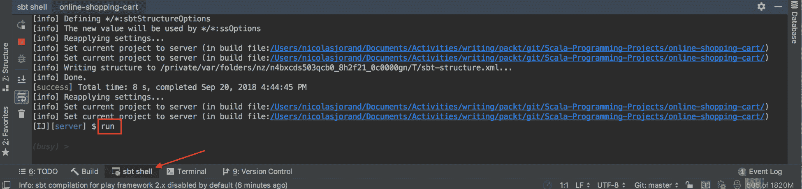

控制台应该打印：

```java
--- (Running the application, auto-reloading is enabled) ---
[info] p.c.s.AkkaHttpServer - Listening for HTTP on /0:0:0:0:0:0:0:0:9000
(Server started, use Enter to stop and go back to the console...)
```

现在，您可以安全地浏览 `http://localhost:9000/docs/swagger-ui/index.html?url=/v1/swagger.json`，Play 将编译所有文件，过一会儿，Swagger UI 将出现，如下所示：

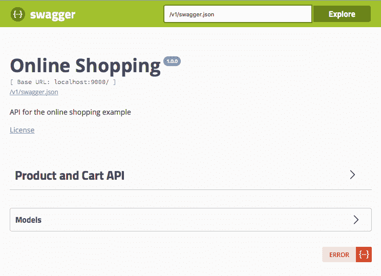

点击产品与购物车 API 链接。所有端点如下所示：

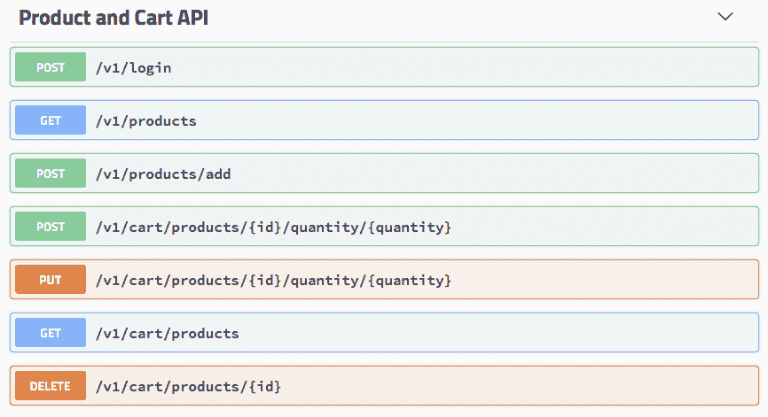

这看起来不错，但我们必须添加一些关于我们 API 的信息。例如，如果您点击 `login` 端点，就无法测试包含用户名的正文。

# 登录

要测试 `login` 端点，转到 `WebService` 类并在 `login` 定义之前添加以下注释：

```java
  @ApiOperation(value = "Login to the service", consumes = "text/plain")
  @ApiImplicitParams(Array(
    new ApiImplicitParam(
      value = "Create a session for this user",
      required = true,
      dataType = "java.lang.String", // complete path
      paramType = "body"
    )
  ))
  @ApiResponses(Array(new ApiResponse(code = 200, message = "login         success"), new ApiResponse(code = 400, message =
     "Invalid user name supplied")))
  def login() = Action { request =>
```

`ApiOperation` 对象添加了操作的描述并定义了发送到主体的内容类型。在这种情况下，我们不是发送 JSON，而只是一个纯字符串。`ApiImplicitParams` 对象定义了发送到服务器的主体。`ApiResponses` 对象通知用户响应中可能返回的可能状态。`login` 文档现在如下所示：

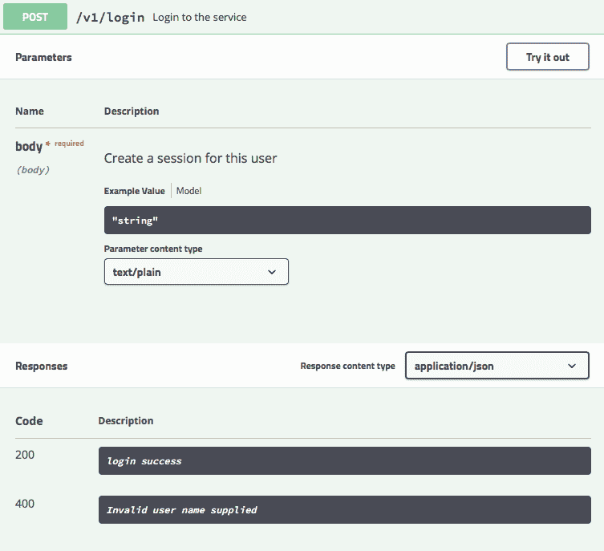

如果你点击 Try it out，你可以输入一个名称并通过点击 Execute 来提交：

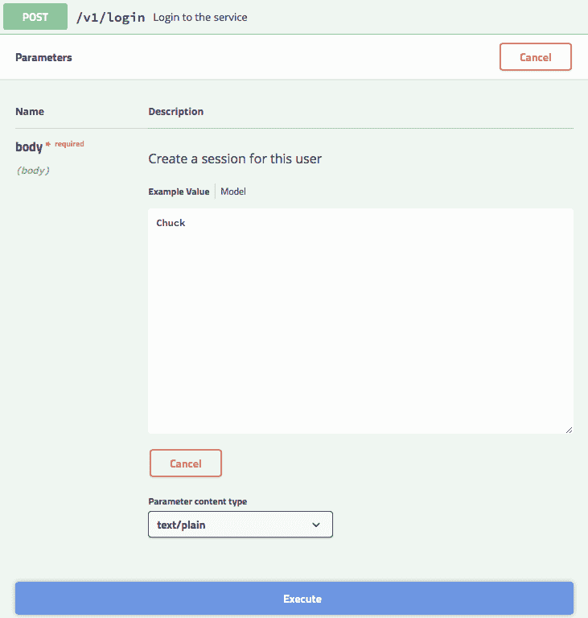

调用应该返回成功的状态码 200，如下所示：

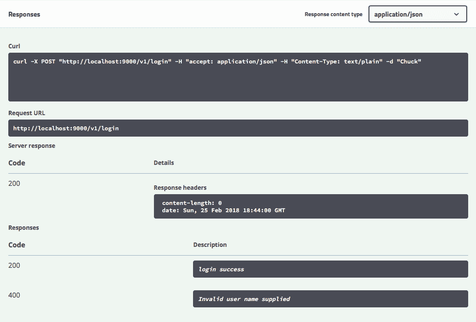

# 产品列表

现在，我们可以在产品列表上添加一些注释，如下所示：

```java
  @ApiOperation(value = "List all the products")
  @ApiResponses(Array(new ApiResponse(code = 200, message = "The list 
   of all the product")))
  def listProduct() = Action.async { request =>
```

当我们使用 Swagger 调用 `GET /v1/products` 时，执行结果是所有产品的 JSON 表示，如下所示：

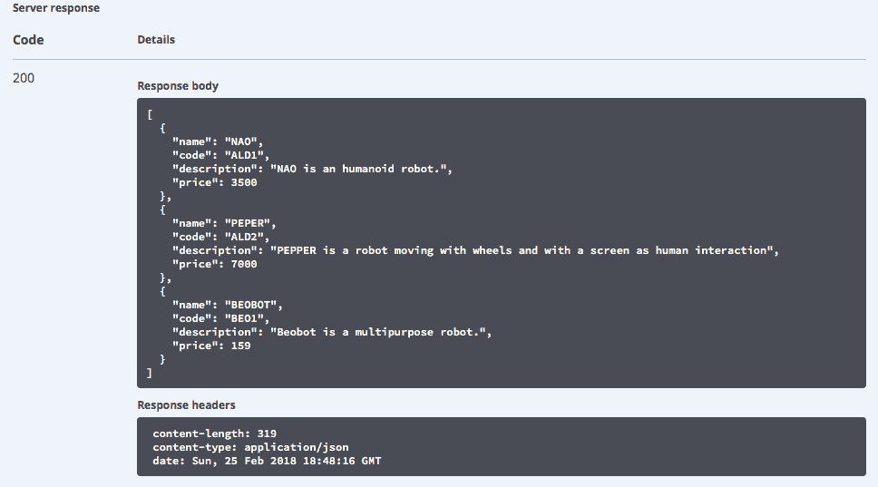

对于 `addProduct`，我们需要添加以下注释：

```java
@ApiOperation(value = "Add a product", consumes = "text/plain")
  @ApiImplicitParams(Array(
    new ApiImplicitParam(
      value = "The product to add",
      required = true,
      dataType = "models.Product", // complete path
      paramType = "body"
    )
  ))
  @ApiResponses(Array(new ApiResponse(code = 200, message = "Product 
    added"),
                      new ApiResponse(code = 400, message = "Invalid 
    body supplied"),
                      new ApiResponse(code = 500, message = "Internal 
    server error, database error")))
  def addProduct() = Action.async { request =>
```

多亏了 `dataType = "models.Product"` 声明，Swagger 中的模型部分显示了与 `Product` 案例类相对应的 JSON 模型：

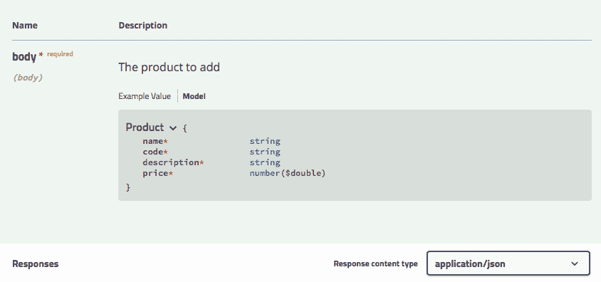

# 购物车端点

现在，让我们用购物车中的产品列表来记录购物车部分：

```java
  @ApiOperation(value = "List the product in the cart", consumes = 
    "text/plain")
  @ApiResponses(Array(new ApiResponse(code = 200, message = "Product 
    added"),
    new ApiResponse(code = 401, message = "unauthorized, please login 
    before to proceed"),
    new ApiResponse(code = 500, message = "Internal server error, 
    database error")))
  def listCartProducts() = Action.async { request =>
```

如果我们调用 `listCartProducts`，我们会收到一个空数组。为了测试它，用一些产品完成 `addCartProduct` 的声明，如下所示：

```java
  @ApiOperation(value = "Add a product in the cart", consumes = 
    "text/plain")
  @ApiResponses(Array(new ApiResponse(code = 200, message = "Product 
    added in the cart"),
    new ApiResponse(code = 400, message = "Cannot insert duplicates in 
    the database"),
    new ApiResponse(code = 401, message = "unauthorized, please login 
    before to proceed"),
    new ApiResponse(code = 500, message = "Internal server error, 
    database error")))
  def addCartProduct(
         @ApiParam(name = "id", value = "The product code", required = 
            true) id: String,
         @ApiParam(name = "quantity", value= "The quantity to add", 
            required = true) quantity: String) = Action.async { request 
            =>
```

在 Swagger 中，我们现在可以添加一个新的产品到购物车，如下所示：

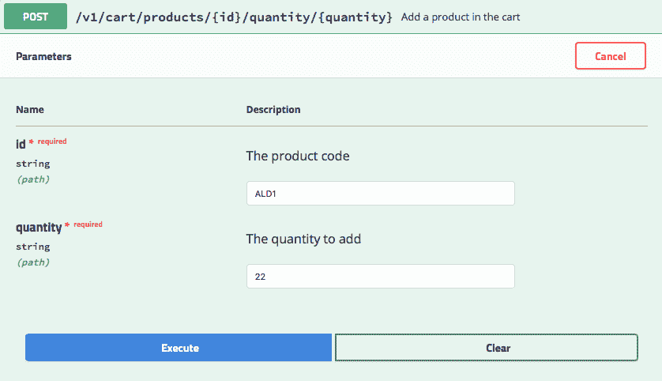

然后，产品列表将返回以下内容：

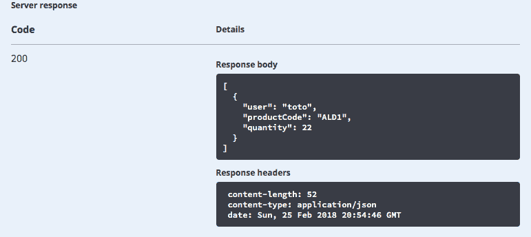

之后，我们可以尝试更新一个产品。向 `updateCartProduct` 添加以下注释：

```java
  @ApiOperation(value = "Update a product quantity in the cart", 
    consumes = "text/plain")
  @ApiResponses(Array(new ApiResponse(code = 200, message = "Product 
    added in the cart"),
    new ApiResponse(code = 401, message = "unauthorized, please login 
    before to proceed"),
    new ApiResponse(code = 500, message = "Internal server error, 
    database error")))
  def updateCartProduct(@ApiParam(name = "id", value = "The product 
    code", required = true, example = "ALD1") id: String, 
    @ApiParam(name = "quantity", value= "The quantity to update", 
    required = true) quantity: String) = Action.async { request =>

```

然后，使用 Swagger 更新数量，如下所示：

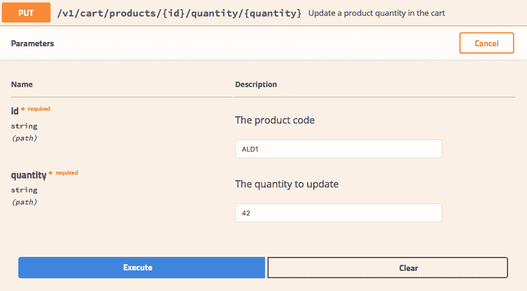

更新后，产品列表返回，如下所示：

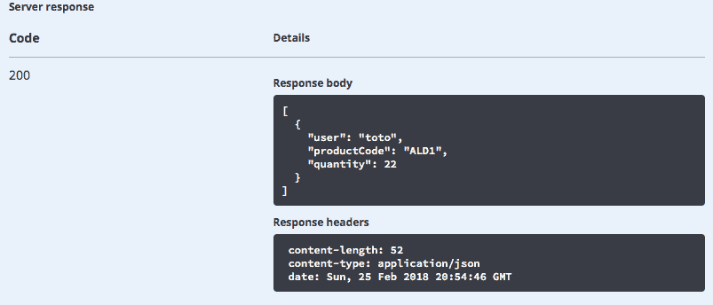

完美；最后要记录的操作是 `deleteCartProduct`:

```java
  @ApiOperation(value = "Delete a product from the cart", consumes = 
    "text/plain")
  @ApiResponses(Array(new ApiResponse(code = 200, message = "Product 
    delete from the cart"),
    new ApiResponse(code = 401, message = "unauthorized, please login 
    before to proceed"),
    new ApiResponse(code = 500, message = "Internal server error, 
    database error")))
  def deleteCartProduct(@ApiParam(name = "id", value = "The product 
    code", required = true) id: String) = Action.async { request =>
```

我们现在有了我们 API 的完整 Swagger 文档，用户可以直接从他们的浏览器中测试它。

# 在 Heroku 上部署

API 现在已经完成。我们可以将其部署到 Heroku，使其在互联网上可用。由于我们已经在上一章中设置了 Heroku，所以只需一个命令就可以完成部署。从项目根目录的命令行中，输入以下命令：

```java
git push heroku master
```

部署完成后，你可以浏览到 [`shopping-fs.herokuapp.com/docs/swagger-ui/index.html?url=/v1/swagger.json`](https://shopping-fs.herokuapp.com/docs/swagger-ui/index.html?url=/v1/swagger.json)。

恭喜！你现在可以在线测试 API 了。

# 摘要

在本章中，你学习了如何设计和实现一个 REST API，同时遵守 REST 架构原则。

我们创建了测试来从客户端的角度检查 API。我们通过使用上一章中编写的 DAO 实现了所有的方法。所有的调用都是异步的，因为我们使用了 `Future`，这保证了我们的服务器可以处理大量的并发请求。

你还学会了如何使用优秀的 Circe 库在 Scala 中进行 JSON 的编码和解码。最后，我们添加了一个 Web 界面来文档化和测试 API，使用了 Swagger。

在下一章中，我们将使用这个 API 来创建一个基于 Scala.js 的 Web 界面。
