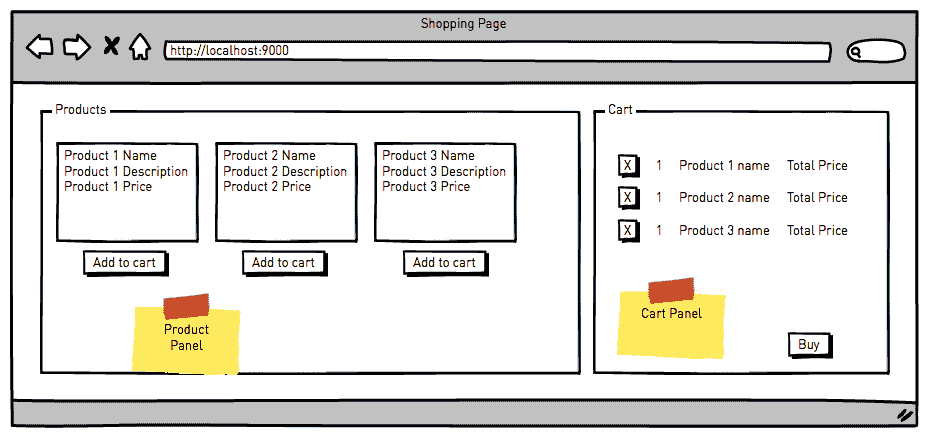
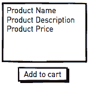
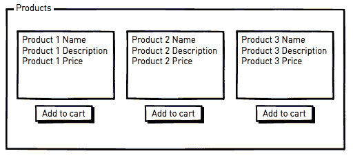
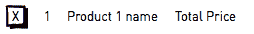
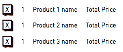
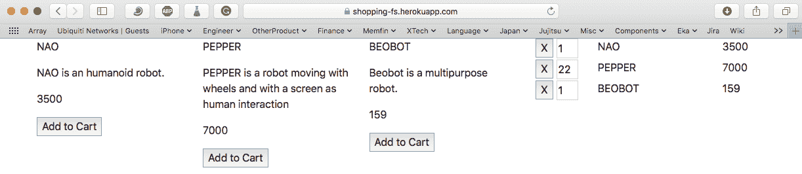
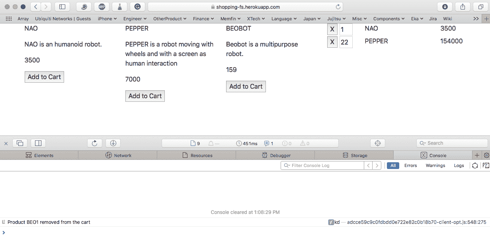
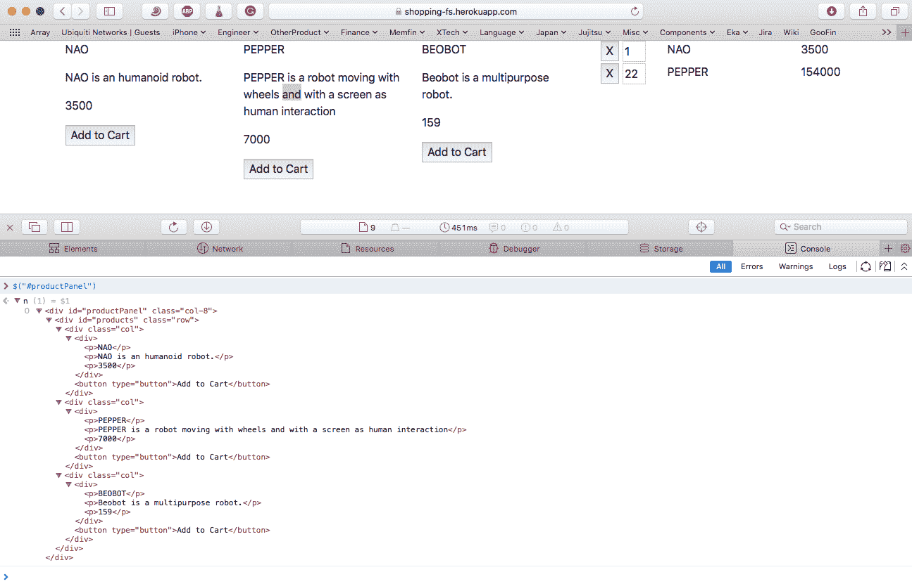
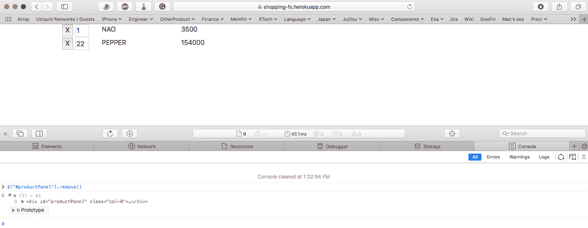
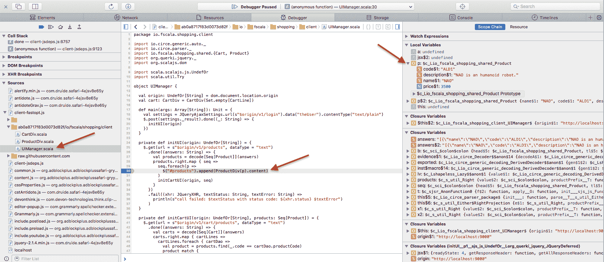

# 在线购物 - 用户界面

在本章中，我们将使用 Scala.js 来构建用户界面。在这个界面中，你可以选择产品添加到购物车，更新你希望购买的产品数量，如果需要，也可以从购物车中移除它们。

Scala.js 是由 Sébastien Doeraene 在 2013 年启动的项目。该项目已经成熟，提供了一种干净的方式来构建前端应用程序。实际上，你可以使用强类型系统来避免愚蠢的错误，但这不仅是为了强类型；用 Scala 编写的代码被编译成高度高效的 JavaScript。它可以与所有的 JavaScript 框架互操作。此外，代码可以在前端和后端开发者之间共享。这个特性简化了开发者之间的沟通，因为他们使用的是相同的概念和类。

由于其互操作性，Scala.js 有多种使用方式。你可以使用 HTML 模板并将其适配以与 Scala.js 互操作。例如，你可以购买优秀的 SmartAdmin ([`wrapbootstrap.com/theme/smartadmin-responsive-webapp-WB0573SK0`](https://wrapbootstrap.com/theme/smartadmin-responsive-webapp-WB0573SK0)) 模板（HTML5 版本）作为布局和所有组件/小部件的基础，然后使用 Scala.js 实现特定的行为。

另一种方法是从头开始构建 HTML 布局、CSS、组件和行为，使用 Scala.js 生态系统。这是本书中我们将选择的方法。为了生成 HTML 和 CSS，我们将使用 Li Haoyi ([`www.lihaoyi.com/`](http://www.lihaoyi.com/)) 的 ScalaTags ([`www.lihaoyi.com/scalatags/`](http://www.lihaoyi.com/scalatags/))。

本章将解释如何使用 Scala.js 开发动态 Web UI。

我们将涵盖以下主题：

+   定义布局

+   创建布局

+   构建布局

+   主布局

+   产品列表面板

+   购物车面板

+   介绍 UI 管理器

# 学习目标

本章的目标是将用户界面引入我们的项目，并与服务器交互以从其中获取数据。

更具体地说，我们将学习以下技能：

+   如何开发简单的 Web UI

+   如何应用样式

+   如何使用 Web 服务调用与服务器交互

+   如何在客户端调试 Scala 代码

# 设置

注意，当你开始使用模板时，此设置已经完成。以下步骤仅供参考：

1.  要启用 Scala.js 与 Play，你首先需要将以下代码添加到 `project/plugins.sbt`：

```java
addSbtPlugin("org.scala-js" % "sbt-scalajs" % "0.6.24")
addSbtPlugin("com.vmunier" % "sbt-web-scalajs" % "1.0.8-0.6")
```

1.  在 `build.sbt` 文件中，你需要在 `client` 变量中添加插件，通过以下代码实现：

```java
.enablePlugins(ScalaJSPlugin, ScalaJSWeb)
```

1.  你需要在客户端配置的 `libraryDependencies` 中添加 ScalaTags 依赖项，如下所示：

```java
"com.lihaoyi" %%% "scalatags" % "0.6.7"
```

# 定义布局

为了本书的目的，购物车被设计如下所示：



在左侧，一个面板列出了所有产品及其详细信息。下方有一个按钮可以将产品添加到购物车中。在右侧面板中，有一个已添加到购物车的所有产品的列表。在**购物车面板**中，可以通过点击数字并输入正确的数字来更改产品的数量。每一行都有一个按钮可以删除列表中的产品。

# 创建布局

使用`<html>`和`<body>`标签以及两个`div`容器（分别用于产品和购物车面板）来创建布局，使用了多种技术——更具体地说，是顶部布局——这些容器将使用名为 Twirl 的 Play 模板引擎构建。使用这个模板，`div`实例的产品和购物车内部的 HTML 将被 ScalaTags 填充。

让我们先创建主入口点。我们将其命名为`index.html`，并在服务器的`view`包中创建一个名为`index.scala.html`的文件来实现它。

内容如下：

```java
@(title: String)
<!DOCTYPE html>
<html>
    <head>
        <title>@title</title>
    </head>
    <body>
        <div class="container">
            <div class="row">
                <div id="productPanel" class="col-8">
                    <div id="products" class="row">
                    </div>
                </div>
                <div id="cartPanel" class="col-4">
                </div>
            </div>
        </div>

        @scalajs.html.scripts("client",
           routes.Assets.versioned(_).toString,
           name => getClass.getResource(s"/public/$name") != null)
    </body>
</html>
```

这个文件看起来像一个标准的 HTML 文件。实际上，这个文件是一个由服务器处理的模板。

第一行以一个`@`字符开始。它定义了调用者传递的输入参数，但谁在调用这个模板？是`Application`控制器中的`index()`函数在调用模板，实际上，模板是通过使用页面标题来调用的。

在以`@scalajs.html.scripts`开始的行中，我们正在使用由`sbt-web-scalajs`插件提供的辅助方法。此方法检索由`client` Scala.js 项目生成的所有脚本。

两个`div`实例将由代码设置；我们将在下一章中更详细地探讨这一点。

# 构建页面

我们将在主页上有两个主要部分：产品列表和购物车。

为了创建布局，我们可以使用基本的 HTML 标签，如`table`和`div`，但这对于我们这个任务来说相当繁琐。相反，让我们引入一个名为 Bootstrap 的框架（[`getbootstrap.com/`](https://getbootstrap.com/)）。

这个开源框架被广泛使用，并且非常成熟。它允许我们基于网格构建一个响应式网站，包含许多组件，如通知、菜单、徽章和工具提示。Bootstrap 需要 CSS 和一些 JavaScript 库才能工作。

目前，我们只需要通过在 HTML 头部添加链接来添加 Bootstrap CSS，如下所示：

```java
<head>
    <title>@title</title>
      <!-- Bootstrap CSS -->
    <link rel="stylesheet" 
    href="https://maxcdn.bootstrapcdn.com/bootstrap/4.0.0
    /css/bootstrap.min.css" integrity="sha384-        
    Gn5384xqQ1aoWXA+058RXPxPg6fy4IWvTNh0E263XmFcJlSAwiGgFAW
    /dAiS6JXm" crossorigin="anonymous">

</head>
```

# 主布局

在 Bootstrap 中，一个网格是由行组成的容器，每行有 12 列。一个`class`属性用于定义`div`的类型。

因此，在我们的情况下，我们希望产品列表占据屏幕的三分之二，购物车则占据剩余的`row`。

在我们的`index.scala.html`中的 body 结构如下：

```java
 <body>
        <div class="container">
            <div class="row">
                <div id="productPanel" class="col-8">
                    <div id="products" class="row"></div>
                </div>
                <div id="cartPanel" class="col-4"></div>
            </div>
        </div>

</body>
```

# 产品列表面板

为了结构化我们的 HTML 页面，我们将创建一个名为`productPanel`的面板。这个面板是所有产品详细信息的容器。

产品通过名称、描述和添加到购物车的按钮来定义，如下面的截图所示：



由于我们有多个产品，我们希望在`productPanel`中添加每个产品，并适应`productPanel`的总宽度，如下面的截图所示：



为了达到这个目标，我们可以在`productPanel`内部重新创建一个行，其中`products`形成行的列，如下面的代码所示：

```java
<div id="productPanel" class="col-8">
  <div id="products" class="row">
     <-- Added programatically -->
  </div>
</div>
```

好的，我们已经完成了主要布局。现在我们需要创建 HTML 产品的表示，作为一个`div`，包括其名称、描述、价格以及一个添加到购物车的按钮。

这看起来几乎和我们为数据库建模产品时所做的相同。如果我们可以重用服务器端创建的模型在客户端使用，那岂不是很好？因为我们使用 Scala.js，这是可能的；实际上，我们正在使用相同的语言。这就是我们所说的**同构****应用程序**。

我们所需要做的就是将模型代码从服务器项目移动到共享项目。使用 IntelliJ，只需将`Models.scala`文件从`server/app/models`拖到`shared/src/main/scala/io/fscala/shopping/shared`。这样做，我们就可以使用相同的模型来创建我们的产品表示。

在`client/src/main/scala/io/fscala/shopping`下创建一个名为`ProductDiv`的新类。这个类代表一个产品带有添加到购物车按钮的 HTML 内容。

`ProductDiv`类包含`Product`模型，如下所示：

```java
case class ProductDiv(product: Product) {
  def content: Div = div(`class` := "col")
                    (getProductDescription, getButton).render
  private def getProductDescription =
    div(
      p(product.name),
      p(product.description),
      p(product.price))

  private def getButton = button(
    `type` := "button",
    onclick := addToCart)("Add to Cart")

  private def addToCart = () => ???
}
```

主要方法是`content`方法。它创建产品描述和按钮。

`getProductDescription`方法创建一个 HTML`div`，并为每个属性创建一个段落。

`getButton()`方法创建一个 HTML 按钮，并使用`addToCart`函数处理`onclick`事件。现在我们不会查看`onclick`事件的实现细节。

# 购物车面板

购物车面板是购物车的表示。它为每个添加的产品有一条线，显示项目数量、项目类型名称、总价以及一个从购物车中移除它的按钮，如下面的截图所示：



我们希望在每次添加新产品到购物车时都添加一行，如下面的截图所示：



在这种情况下，我们不需要修改主要布局，因为我们打算将每一行表示为一个带有列的行。购物车中行的模型如下所示：

```java
case class CartLine(qty: Int, product: Product)
```

购物车的 HTML 内容如下所示：

```java
def content: Div = div(`class` := "row", id := s"cart-${product.code}-row")(
  div(`class` := "col-1")(getDeleteButton),
  div(`class` := "col-2")(getQuantityInput),
  div(`class` := "col-6")(getProductLabel),
  div(`class` := "col")(getPriceLabel)
).render
```

之前的代码是为有四个列的行。从购物车中删除按钮的代码（`getDeleteButton`）如下所示：

```java
private def getDeleteButton = button(
               `type` := "button",
               onclick := removeFromCart)("X").render
```

注意，你只需在`onclick`事件上添加方法名，就可以向组件发出的事件添加监听器。目前，我们不会实现这个动作，并将它留作未实现（`???`），如下面的代码所示：

```java
private def removeFromCart = () => ???
```

表示购物车中数量（`quantityInput`）的`input`文本字段编写如下：

```java
private def getQuantityInput = input(
              id := s"cart-${product.code}-qty",
              onchange := changeQty,
              value := qty.toString,
              `type` := "text",
              style := "width: 100%;").render
```

再次，在`onchange`事件上，我们调用以下定义的`changeQty`函数：

```java
private def changeQty = () => ???
```

产品名称（`getProductLabel`）编写如下：

```java
private def getProductLabel = label(product.name).render
```

最后，总价格被写入`getPriceLabel`，如下所示：

```java
private def getPriceLabel = label(product.price * qty).render
```

由于我们将有购物车中的行定义，我们可以定义购物车的`div`。

这个`div`应该提供所有行的 HTML 表示，并允许你添加购物车`line`。实现如下：

```java
case class CartDiv(lines: Set[CartLine]) {
  def content = lines.foldLeft(div.render) { (a, b) =>
    a.appendChild(b.content).render
    a
  }
  def addProduct(line: CartLine): CartDiv = {
    new CartDiv(this.lines + line)
  }
}
```

在创建时，`CartDiv`接收由`lines`值表示的行列表。

要获取 HTML 表示，调用`content`函数。在这个函数中，我们创建一个空的`div`，然后将每个`CartLine`追加到该`div`中。

这是通过使用`foldLeft`实现的。空`div`作为初始值被创建，然后对于每个`CartLine`，都会调用一个匿名函数，参数为`(a, b)`。`a`参数是前一个值（第一次迭代时的空`div`），而`b`参数是集合中的下一个`CartLine`。该方法体只是将`CartDiv`的内容追加到`div`中，并返回`div`以供下一次迭代。

我们添加了一个函数来将产品添加到`div`中（`addProduct()`）。我们本可以通过创建一个可变变量来持有`CartLine`列表，并在每次想要添加`CartLine`时更新它来实现这个方法，但这不符合函数式编程的精神。

相反，从函数调用中返回一个新的`CartDiv`，其中包含我们添加的`new CartLine`。

现在我们已经定义了产品`div`和购物车`div`，是时候构建这些`div`实例之间的交互了。

# 介绍 UI 管理器

在某个时候，我们需要有一个负责用户体验工作流程的类。例如，当用户点击“添加到购物车”按钮时，产品必须在服务器级别添加到购物车中，并且用户界面需要更新。

UI 管理器负责管理用户体验的工作流程，在需要时处理与服务器的所有通信，并用作启动 Scala.js 代码的入口点。这是当应用程序在浏览器中执行时，我们客户端应用程序的主要入口点。

为了与服务器通信，我们将使用 jQuery。这个 JavaScript 库被广泛使用，并在 JavaScript 世界中是一个参考。

这是 Scala.js 的一个优点之一。我们可以从 Scala 中使用现有的 JavaScript 库，如 jQuery。要使用现有的 JavaScript 库，我们只需要定义一个接口，在 Scala.js 中称为**facade**。facade 可以看作是重新定义 JavaScript 类型和 JavaScript 函数签名的接口。这意味着我们需要为所有我们想要使用的 JavaScript 库创建一个 facade。幸运的是，已经存在许多为最重要的 JavaScript 框架创建的 facade。可以在 Scala 网站上找到可用 facade 的列表（[`www.scala-js.org/libraries/facades.html`](https://www.scala-js.org/libraries/facades.html)）。

# 将 jQuery 添加到我们的项目中

要将 jQuery 及其 facade 添加到我们的项目中，我们需要添加 Scala facade 和 JavaScript 库。

对于 facade，将以下依赖项添加到`build.sbt`文件中的`libraryDependencies`变量中：

```java
"org.querki" %%% "jquery-facade" % "1.2"
```

要添加 JavaScript 库，将以下依赖项添加到`jsDependencies`变量中：

```java
jsDependencies += 
                "org.webjars" % "jquery" % "2.2.1" / "jquery.js" 
                minified "jquery.min.js"
```

这是我们在其中添加 WebJar 作为 JavaScript 库的第一个库。这个 WebJar 是一个将 JavaScript 库打包成 JAR 文件的仓库。

# 调用我们的 API

我们必须执行的第一步调用是登录到服务器。为了本书的目的，我们没有设计一个合适的登录页面。此外，登录本身也不是真正的登录，因为它接受任何用户！

每次我们浏览网站索引时，我们都会使用一个随机用户登录。

顺便问一下，我们的客户端应用程序的入口点是什么？

# 设置主方法

默认情况下，Scala.js 只创建一个包含所有依赖项的 JavaScript 库。要使其成为一个应用程序，你必须添加`build.sbt`文件的客户端配置，如下面的代码所示：

```java
scalaJSUseMainModuleInitializer := true
```

一旦定义，Scala.js 会寻找包含`main`方法的对象，就像一个正常的 JVM 应用程序一样。我们可以在`client/src/main/scala/io/fscala/shopping/client`文件夹中创建该对象。创建一个名为`UIManager.scala`的 Scala 文件。

在`main`函数中，我们希望登录到 API，并使用我们之前定义的`ProductDiv`和`CartDiv`初始化接口，如下面的代码所示：

```java
object UIManager {

  val origin: UndefOr[String] = dom.document.location.origin
  val cart: CartDiv = CartDiv(Set.empty[CartLine])
  val webSocket: WebSocket = getWebSocket
  val dummyUserName = s"user-${Random.nextInt(1000)}"
  def main(args: Array[String]): Unit = {
    val settings = JQueryAjaxSettings
                   .url(s"$origin/v1/login")
                   .data(dummyUserName)                                                                 
                   .contentType("text/plain")
    $.post(settings._result).done((_: String) => {
      initUI(origin)
    })
  }
}
```

我们在`UIManager`对象上定义了三个属性：

+   第一项是`origin`属性。该属性使用 Scala.js 的`dom`实用工具对象；我们将从其中获取`document.location.origin`。这代表服务器位置，包括协议、主机名和端口。在开发模式下，它看起来像`http://locahost:9000`。

+   第二个属性是`cart`，表示`CartDiv`。这是为了在管理器中保持对其的引用以供以后使用。在`main`函数中，我们使用硬编码的用户进行登录，一旦成功，我们初始化用户界面。

+   最后一个属性是`dummyUserName`，表示一个随机生成的用户名。这将简化代码，因为我们不会实现真正的登录过程。

注意我们如何从 Scala 使用 jQuery。这是外观模式的美丽之处——我们可以使用几乎与 JavaScript 相同的语法，但具有强 Scala 类型化的优势。

例如，要创建 `post` 调用的设置，我们可以使用 `JQueryAjaxSettings` 对象上的一个方法，而不是创建一个以字符串为键、任何内容为值的 `Map`。这样，它更不容易出错，我们可以利用 IDE 自动完成所有可能的属性。

`done` jQuery 函数的签名是 `Function` (`PlainObject` data, `String textStatus`, jqXHR)。你可以在 jQuery 网站上了解更多关于这些类型的信息：

+   [`api.jquery.com/Types/#Function`](http://api.jquery.com/Types/#Function)

+   [`api.jquery.com/Types/#PlainObject`](http://api.jquery.com/Types/#PlainObject)

+   [`api.jquery.com/Types/#String`](http://api.jquery.com/Types/#String)

+   [`api.jquery.com/Types/#jqXHR`](http://api.jquery.com/Types/#jqXHR)

这个函数接受三个参数，但因为我们只对第一个参数感兴趣，即 `data` 响应，我们可以忽略其他参数。这是 JavaScript 的一个特性。相应的外观模式的实现如下：

```java
def done(doneCallbacks: js.Function*): JQueryDeferred = js.native
```

函数使用可变参数，类型后面带有星号字符。这与 JavaScript 完美匹配，在 JavaScript 中参数不是强制的。

现在是时候查看基于从服务器传来的数据创建用户界面的过程了。

# 初始化用户界面

为了初始化用户界面，我们需要通过 Web 服务 API 从数据库中获取所有产品——包括用户的购物车（如果有）——并将其添加到布局中。这个代码看起来如下所示：

```java
private def initUI(origin: UndefOr[String]) = {
  $.get(url = s"$origin/v1/products", dataType = "text")
    .done((answers: String) => {
      val products = decode[Seq[Product]](answers)
      products.right.map { seq =>
        seq.foreach(p => 
          $("#products").append(ProductDiv(p).content)
        )
        initCartUI(origin, seq)
      }
    })
    .fail((xhr: JQueryXHR, textStatus: String, textError: String) =>
      println(s"call failed: $textStatus with status code: 
      ${xhr.status} $textError")
    )
}
```

不会令人惊讶的是，我们使用 jQuery 在 API 上执行 `GET` 方法。`dataType` 请求文本响应，这样我们就可以使用 Circe 解析响应并将其转换为 `Product` 序列。

但是，`decode[Seq[Product]]` 是否与我们在 第二章，“开发退休计算器”，REST API 中使用的相同代码，当时我们接收 JSON 并将其转换为类？

是的，我们正在使用相同的代码和相同的框架（Circe）来解码 JSON 并将类编码为 JSON！在服务器上运行的代码，编译为 JVM 字节码，与在客户端运行的代码，编译为 JavaScript 的代码相同。

一旦我们获取到产品列表，对于每一个产品，我们在 `products` 容器中添加 `ProductDiv`。再次，jQuery 被用来通过其 `id` 属性获取 HTML 元素。在这个阶段，jQuery 的知识比 Scala 语法更重要。

产品面板已设置。现在轮到购物车了。

`initCartUI()`函数负责创建表示购物车的 HTML 代码。用户的购物车从服务器获取。我们将其转换为`Cart`序列，并为每个序列，我们获取相应的产品以获取名称和价格。最后，我们将行追加到`CartDiv`中，如下面的代码所示：

```java
private def initCartUI(origin: UndefOr[String], products: Seq[Product]) = {
  $.get(url = s"$origin/v1/cart/products", dataType = "text")
    .done((answers: String) => {
      val carts = decode[Seq[Cart]](answers)
      carts.right.map { cartLines =>
        cartLines.foreach { cartDao =>
          val product = products.find(
                                _.code == cartDao.productCode)
          product match {
            case Some(p) =>
              val cartLine = CartLine(cartDao.quantity, p.name,  
              cartDao.productCode, p.price)
              val cartContent = UIManager.cart.addProduct(cartLine)
                                .content
              $("#cartPanel").append(cartContent)
            case None =>
              println(
                 s"product code ${cartDao.productCode} doesn't 
                   exists in the catalog")
          }
        }
      }
    })
    .fail((xhr: JQueryXHR, textStatus: String, textError: String) =>
      println(
        s"call failed: $textStatus with status code: 
          ${xhr.status} $textError")
    )
}
```

如果发生失败，我们只需在浏览器控制台中打印错误。

通过所有这些代码，我们的用户界面现在已初始化。我们现在可以实现对用户界面中未实现的操作。

# 实现 UI 操作

当应用程序启动时，用户界面是数据库中产品和用户购物车的表示。

在本章中，我们将实现添加产品到购物车、更新购买数量和从购物车中删除产品等操作。

# 添加产品到购物车

要将产品添加到购物车，我们必须点击产品面板上的“添加到购物车”按钮。我们需要再次编辑`ProductDiv`并实现`addToCart`方法。

如同我们在本章的“介绍 UI 管理器”部分所说，我们希望将用户界面操作委托给`UIManager`类，因此`addToCart`方法的实现如下：

```java
private def addToCart() = () => UIManager.addOneProduct(product)
```

事实上，我们正在请求`UIManager`将产品添加到购物车。`UIManager`构建一个表示购物车中产品的`div`，如果它已经在购物车中，则不会发生任何操作。

实现如下：

```java
def addOneProduct(product: Product): JQueryDeferred = {
  val quantity = 1
  def onDone = () => {
    val cartContent = cart.addProduct(CartLine(quantity, product)
                                     ).content
    $("#cartPanel").append(cartContent)
    println(s"Product $product added in the cart")
  }
  postInCart(product.code, quantity, onDone)
}
```

使用产品代码和初始数量一，调用`postInCart`方法在`Cart`表中创建一个新条目。一旦创建，就调用`onDone()`方法。此方法添加了在用户界面中可视化购物车行的 HTML 元素。

`postInCart`方法接收`productCode`、数量以及一旦网络服务调用成功要调用的方法，如下面的代码所示：

```java
private def postInCart(productCode: String, quantity: Int, onDone: () => Unit) = {
  val url = s"${UIManager.origin}/v1/cart/products/$productCode
  /quantity/$quantity"
  $.post(JQueryAjaxSettings.url(url)._result)
    .done(onDone)
    .fail(() => println("cannot add a product twice"))
}
```

如果网络服务调用失败，我们只需在浏览器控制台中打印错误，并且不会向用户界面添加任何内容。

# 从购物车中删除产品

当点击与购物车条目相关的 X 按钮时，触发从购物车中删除产品的操作。这是在`CartLine`类中的`removeFromCart()`方法中实现的。这与我们在上一节中使用的方法类似。代码如下：

```java
private def removeFromCart() = 
           () => UIManager.deleteProduct(product)
```

我们将操作委托给`UIManager`，实现如下：

```java
def deleteProduct(product: Product): JQueryDeferred = {
  def onDone = () => {
    val cartContent = $(s"#cart-${product.code}-row")
    cartContent.remove()
    println(s"Product ${product.code} removed from the cart")
  }

   deletefromCart(product.code, onDone)
}
```

这次，我们调用`deleteFromCart`方法并删除与相关 ID 关联的行。

网络服务调用的实现如下：

```java
private def deletefromCart(
                           productCode: String,
                           onDone: () => Unit) = {
  val url = s"${UIManager.origin}/v1/cart/products/$productCode"
  $.ajax(JQueryAjaxSettings.url(url).method("DELETE")._result)
    .done(onDone)
}
```

由于 jQuery 没有`delete()`方法，我们必须使用`ajax()`方法并设置 HTTP 方法。

# 更新数量

要更新购物车中产品的数量，使用 HTML 输入文本。一旦值改变，我们就使用新的值更新数据库。为此目的使用输入文本的`onchange()`事件。

毫不奇怪，在 `CartDiv` 中，正如我们之前所做的那样，我们将调用委托给 `UIManager`，如下代码所示：

```java
private def changeQty() = 
            () => UIManager.updateProduct(product)
```

`updateProduct` 的实现如下：

```java
def updateProduct(productCode: String): JQueryDeferred = {
  putInCart(product.code, quantity(product.code))
}
```

我们使用在 `inputText` 中设置的 `quantity` 调用网络服务。获取数量的方法是如下：

```java
 private def quantity(productCode: String) = Try {
   val inputText = $(s"#cart-$productCode-qty")
   if (inputText.length != 0) 
     Integer.parseInt(inputText.`val`().asInstanceOf[String]) 
   else 1
 }.getOrElse(1)
```

我们从 HTML 输入文本元素中获取数量。如果它存在，我们将其解析为整数。如果字段不存在或我们遇到解析错误（输入了字母），我们返回数量 `1`。

更新产品数量的网络服务调用如下：

```java
private def putInCart(productCode: String, updatedQuantity: Int) = {
  val url = 
    s"${UIManager.origin}/v1/cart/products/
    $productCode/quantity/$updatedQuantity"
    $.ajax(JQueryAjaxSettings.url(url).method("PUT")._result)
     .done()
}
```

到这里为止。我们已经完成了购物车用户界面的实现。

是时候部署它并检查它是否正常工作了。

# 部署用户界面

要在项目根目录的命令行中部署，请输入以下代码：

```java
git push heroku master
```

一旦部署成功，您可以通过浏览 [`shopping-fs.herokuapp.com/`](https://shopping-fs.herokuapp.com/docs/swagger-ui/index.html?url=/v1/swagger.json) 来查看。界面将显示如下截图所示：



您现在可以玩转界面。

# 调试界面

在开发过程中，我们不会在第一稿中写出正确的代码。作为人类，我们会犯错误，并且不会完美地记住我们使用的所有框架。

在本章中，我们希望提供一个调试代码的入口点。最明显的调试系统是在浏览器的控制台中打印。这是通过直接在 Scala 中使用 `println()` 来完成的，然后查看控制台显示的日志。

要查看控制台和其他调试工具，您必须在浏览器中启用开发者工具。我使用的是 Macintosh 上的 Safari，但如果您不想使用它，我推荐使用 Google Chrome；功能几乎相同。

在 Safari 中，通过点击菜单栏中的“显示开发”菜单旁边的复选框来启用开发者工具。

完成后，将出现一个新的“开发”菜单。打开此菜单并选择“显示 JavaScript 控制台”。在 Safari 窗口中将出现一个包含控制台的新部分。如果您点击删除购物车行按钮，控制台将打印出日志，如下截图所示：



您可以通过在控制台最后一行输入任何内容与 JavaScript 进行交互。

例如，如果您输入 `$("#productPanel")`，则产品 `div` 被选中，您可以检查它，如下截图所示：



网页的检查元素代码

您甚至可以运行测试。如果您输入 `$("#productPanel").remove()`，则 `div` 将从 `dom` 中移除，您的页面将看起来如下截图所示：



测试的检查元素代码

刷新页面以返回产品列表。你甚至可以从浏览器内部调试 Scala 代码。

你需要将项目置于开发模式，以便生成调试所需的必要文件（源映射文件）。

点击调试选项卡，在左侧面板的`Sources/client-fast-opt.js`下查找`UIManager.scala`，如下截图所示：



UIManager.scala 源代码

一旦选择`UIManager.scala`，你可以在中间面板上看到 Scala 源代码。点击第**30**行的侧边栏。当 UI 初始化并且产品`div`实例被附加时，将会设置一个断点。

如果你刷新页面，引擎将在该点停止，在右侧面板上，你将拥有所有变量，包括局部变量，例如`p`，代表此点要添加的产品。

点击继续脚本执行按钮，如下截图所示：


脚本将继续执行，直到集合中的下一个元素，并且右侧面板上的`p`变量将更新为下一个元素。

我刚刚触及了“开发”菜单所有可能性的表面。你可以有度量标准来控制页面元素加载和处理的耗时，以及检查和更改页面中的任何 HTML 元素。

更多信息，请参阅 Safari 的官方文档([`support.apple.com/en-in/guide/safari-developer/welcome/mac`](https://support.apple.com/en-in/guide/safari-developer/welcome/mac)[)](https://support.apple.com/en-in/guide/safari-developer/welcome/mac)和 Google Chrome([`developers.google.com/web/tools/chrome-devtools/`](https://developers.google.com/web/tools/chrome-devtools/))。

# 摘要

在本章中，我们学习了如何从头开始构建用户界面，首先创建界面的原型。

然后，我们实现了主要布局，用所有需要链接的文件表示应用程序的骨架，例如 CSS 文件和脚本。一旦布局准备就绪，我们就用 Scala 建模用户界面的不同 HTML 部分，例如产品面板和购物车面板。最后一步是创建导航系统和用户交互。为此，我们创建了一个 UI 管理器，负责所有交互。

作为旁注，我们的用户界面相当简单，没有太多交互。这就是我们选择手动编写 UI 管理器的原因。如果界面变得更加复杂，那么使用框架来管理它可能是有用的。在撰写本文时，React.js 和 Angular 是最受欢迎的两个框架。然而，请注意，框架的学习曲线可能很陡峭，并且可能会迅速过时。

另一种解决方案是使用 Akka.js，更具体地说，使用 FSM actor 来管理您的用户界面。毕竟，这是一个状态机，根据事件进行反应和行动。这将在下一章关于自动价格更新器的内容中展开。

我们还研究了浏览器提供的调试功能。到现在为止，您应该已经意识到了在编写完整解决方案的后端和前端时使用相同原则和代码的优势。

我们将在下一章中更进一步。我们将使我们的应用程序能够从外部来源获取数据，并使用 Akka/Akka.js 异步更新用户界面。
