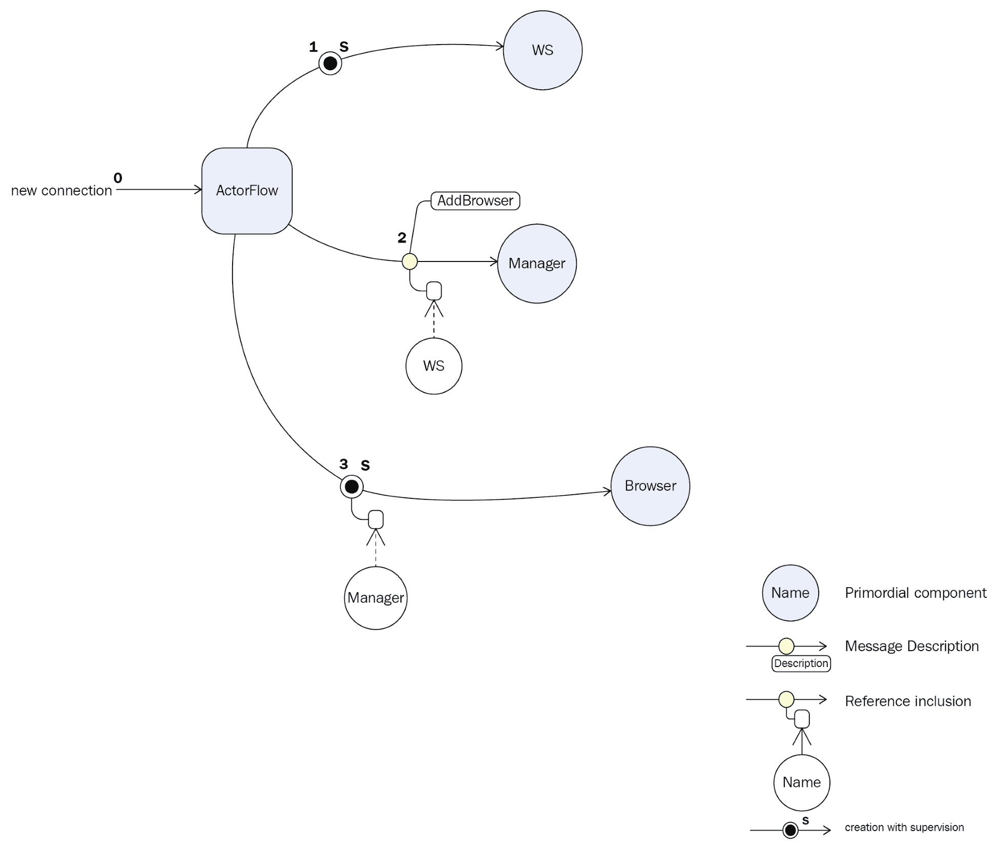
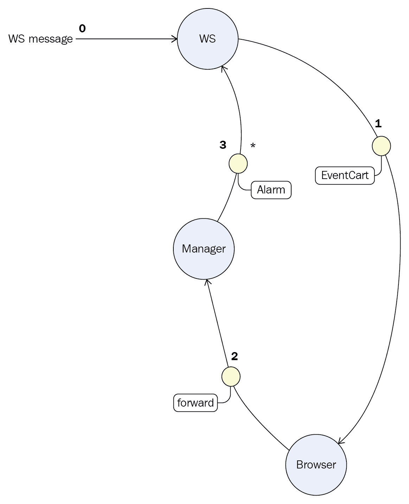
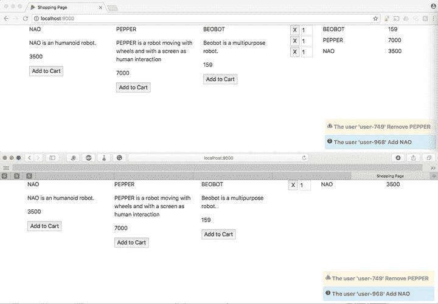

# 交互式浏览器

在本章中，我们将通过扩展我们的购物项目来介绍 actor 模型。扩展将包括一个通知，提供给所有连接到网站的人，关于谁正在将产品添加到/从购物车中移除。

事实上，每当有人对购物车进行操作时，都会向所有连接的浏览器广播一条消息，其中包括用户名、操作（添加或删除）和产品名称。

工作流程将如下。当有人连接到网站时，浏览器和服务器之间将打开一个 WebSocket；在服务器级别，在 Actor 内部将保留对该 WebSocket 的引用。

一旦对购物车执行操作，将包含用户名、操作和产品名称的消息将通过 WebSocket 发送到服务器；服务器将接收此消息，将其转换为警报消息，并广播给所有连接的浏览器。然后，每个浏览器将显示警报作为通知。一旦浏览器断开连接（或达到 WebSocket 超时），将从服务器中移除 WebSocket 引用。

如你所注意到的，在先前的流程中使用了 Actor 这个术语。Actor 模型的理论起源于 1973 年 ([`channel9.msdn.com/Shows/Going+Deep/Hewitt-Meijer-and-Szyperski-The-Actor-Model-everything-you-wanted-to-know-but-were-afraid-to-ask`](https://channel9.msdn.com/Shows/Going+Deep/Hewitt-Meijer-and-Szyperski-The-Actor-Model-everything-you-wanted-to-know-but-were-afraid-to-ask))，自那时起，已经创建了多个语言实现。

在这本书中，我们将使用 Akka 框架。它由 Jonas Bonér 在 2009 年编写，基于由 Philipp Haller 创建的 Scala Actor 实现。我们将通过介绍它来仅触及框架的表面。要解释框架的所有功能和可能的模式，需要整本书。

在本章中，我们将解释如何使用 WebSocket 在客户端和服务器之间进行通信。

在本章中，我们将涵盖以下主题：

+   Actor 模型

+   实现服务器端

+   实现客户端

本章的目标是使用 WebSocket 在浏览器和服务器之间建立异步通信，并使用 Actor 在服务器级别处理通信。你将学习以下内容：

+   如何在客户端和服务器之间创建异步通信

+   如何使用 Actor

# Actor

我们如何定义 Actor 这个术语？在我们的第一次尝试中，我们考虑使用线程模型、并发、调用栈、邮箱等来技术性地解释它。然后，我们意识到技术描述并不能反映基于 Actor 的解决方案的本质。

事实上，每次我们必须基于 Actors 设计解决方案时，我们都可以将 Actor 视为在公司工作的一个人；这个人有一个名字，也许有一个电子邮件地址（**Actor 引用**）。第一个重要的事实是，他并不孤单；他将与其他人互动（**消息传递**），从他的层级接收消息，并将其他消息传递给同事或下属（**监督者**）。

这个想象中的公司使用层次结构进行组织；一个监督者（**用户守护者**）正在检查其下属的健康状况，当出现问题时，如果监督者可以处理，他们将执行操作来修复它。如果错误无法管理，监督者将将其升级到自己的上级（**监督策略**），依此类推，直到达到总监（**根守护者**）。

与人类之间的沟通的另一个相似之处是，当你要求同事做某事而他们没有回答时。经过一段时间（一个**超时**），你可能会决定再次询问。如果你仍然没有收到回答，你可能会认为他们太忙了，然后询问其他人。所有这些协议都是异步执行的，并且基于你愿意等待多长时间（**延迟**）。

现在，有了这些概念在心中，技术上，我们可以将 Actor 定义为一个仅在一个线程上运行的轻量级进程单元，它依次处理消息；Actor 接收消息，处理它们，并根据消息可能改变其内部状态。然后，它向初始发送者或任何其他 Actor 发送另一条消息。

为了执行所有这些工作流程，Actor 需要以下内容：

+   一个参考，可以从同一房间（JVM）或远程访问

+   一个邮箱，用于排队等待接收的消息

+   一个状态，用于保存其私有状态

+   一个行为，根据接收到的消息和当前状态进行行动

+   一个子 Actor，因为每个 Actor 都可能是一个监督者

这本书的目的不是让你成为 Akka 框架的专家；相反，这本书应该为你提供基本知识，让你对基本概念感到舒适。你将学习到的概念将允许你构建一个应用程序，如果你愿意，还可以深入了解框架的其他组件。

作为参考，完整的 Akka 文档可以直接在 Akka 项目的网站上找到，网址为[`doc.akka.io/docs/akka/current/general/index.html`](https://doc.akka.io/docs/akka/current/general/index.html)。

让我们直接开始工作，看看如何在现实世界中实现这一点。

# 设置

为了设置我们的项目，我们需要 Akka 库，以便在服务器上创建 Actors，以及 Notify.js。Notify.js 是一个用于在浏览器上弹出通知的 JavaScript 库；我们选择这个库是因为它没有依赖其他框架。

要添加这个 JavaScript 库，只需将以下内容添加到`build.sbt`中的`client`变量的`jsDependencies`下：

```java
jsDependencies ++= Seq(
        ...,
  "org.webjars" % "notifyjs" % "0.4.2" / "notify.js")
```

上述代码是项目配置的代码。

# 实现服务器端

在服务器级别，我们需要在服务器和浏览器之间打开一个通信通道；一旦通信打开，我们需要实现消息接收并将它广播给所有已连接的浏览器，使用 Actor 来完成。

# 创建 WebSocket 路由

要创建路由，需要修改 `conf/routes` 文件，添加以下内容：

```java
GET /v1/cart/events controllers.WebSockets.cartEventWS 
```

注意，路由的配置方式与常规的 Web 服务调用相同；因此，对 `/v1/cart/events` 的 `GET` 调用被路由到 `controllers.WebSockets` 实例的 `cartEventWS` 方法。

接下来，我们需要在服务器模块的 `controllers` 包中创建 `WebSockets` 类，并添加 `cartEventsWS` 方法，如下所示：

```java
@Singleton
class WebSockets @Inject()(
  implicit actorSystem: ActorSystem,
  materializer: Materializer,
  cc: ControllerComponents) extends AbstractController(cc) {

  def cartEventWS = WebSocket.accept[String, String] { 
    implicit request 
  =>
        ActorFlow.actorRef { out =>
        // handle upstream
      }
    }
  }
}
```

代码行数不多，但在这个片段中发生了很多事情。

在类构造函数中，Google Guice（Play 中使用的依赖注入）将注入 `ActorSystem`。`ActorSystem` 是系统的根守护者；这是 Actor 层次结构中的顶级，对于每个 JVM 都是唯一的。

Play 在底层使用 Akka-stream；需要一个 materializer。首先，让我们解释这些新术语。Akka-stream 是 Akka 组件，用于优雅地处理流，这正是我们需要处理服务器和浏览器之间流的工具。Akka-stream 设计得很好；在流定义中有一个清晰的分离，例如数据应该从哪里获取，如何处理它以及应该移动到哪里，以及流运行时。为了定义流，有一个 **领域特定语言** (**DSL**) 可用，而 materializer 是流的运行时。这就是为什么我们需要在我们的代码中提供 `Materializer`。

上游是通过 `ActorFlow.actorRef { out => }` 创建的，其中 `out` 是代表浏览器的 Actor。这个函数应该返回一个处理来自浏览器的消息的 Actor。我们稍后会回到实现细节。

总结一下，到目前为止，我们的服务器在 `/v1/cart/events` 上打开了一个新的路由。在那个入口点，预期会有一个 WebSocket 连接，并且对于每个新的连接，都会启动一个新的通信流。

好吧，现在是时候编写通信处理代码了；但我们想做什么呢？

# 实现 BrowserManager

每次接受新的连接（代表新的浏览器）时，我们希望保留对该连接的引用，以便稍后可以向它发送事件。这个连接容器由一个 Actor 处理。这个 Actor 将需要一个包含已连接浏览器列表的内部状态；我们应该添加一个新的浏览器，并在它断开连接时移除它。

要创建一个 Actor，我们使用 Akka 的 `Props` 类，如下所示：

```java
val managerActor = actorSystem.actorOf(
  BrowserManagerActor.props(),
  "manager-actor")
```

这个 Actor 是从守护根 Actor 创建的；在我们的例子中，它被命名为`actorSystem`。从系统 Actor，我们调用`actorOf`方法；这个方法期望`Props`作为第一个参数，代表我们的 Actor 工厂，以及 Actor 的名称作为第二个参数。`BrowserManagerActor`由一个类和它的伴生对象组成。伴生对象用于创建 Actor 的实例，并且定义与该 Actor 相关的消息是一个好的实践，如下所示：

```java
object BrowserManagerActor {
  def props() = Props(new BrowserManagerActor())

  case class AddBrowser(browser: ActorRef)
}
```

我们定义了用于创建 Actor 实例的`props()`方法。这里没有什么特别的地方；工厂是在伴生对象上定义的，这是创建 Actor 的最佳模式。在这个类中，我们还定义了该 Actor 的特定消息；在这种情况下，我们只有一个，名为`AddBrowser`。

`BrowserManagerActor`类的实现如下：

```java
private class BrowserManagerActor() extends Actor with ActorLogging {

  val browsers: ListBuffer[ActorRef] = ListBuffer.empty[ActorRef]

  def receive: Receive = {

    case AddBrowser(b) =>
      context.watch(b)
      browsers +=b
      log.info("websocket {} added", b.path)

    case CartEvent(user, product, action) =>
      val messageText = s"The user '$user' ${action.toString} 
      ${product.name}"
      log.info("Sending alarm to all the browser with '{}' action: {}",
               messageText,
               action)
      browsers.foreach(_ ! Alarm(messageText, action).asJson.noSpaces)

    case Terminated(b) =>
      browsers -= b
      log.info("websocket {} removed", b.path)
  }
}
```

要成为 Actor，该类需要扩展`Actor`类；我们同样扩展了`ActorLogging`。这将为我们提供`log`对象，该对象可以用来记录有趣的信息。

如前所述，我们希望保留连接到服务器的浏览器列表。为此，我们使用`browsers`变量，其类型为`ListBuffer[ActorRef]`。

注意，我们正在使用一个可变集合来定义这个列表；在这个上下文中，这是完全可行的，因为这个列表只能被这个 Actor 访问，并且保证是线程安全的。

可以通过使用 Akka 框架的另一个组件来避免这个可变变量。这个组件被命名为**最终状态机**（**FSM**）。FSM 实现的全部细节超出了本书的范围。如果您感兴趣，完整的文档链接可以在[`doc.akka.io/docs/akka/current/fsm.html`](https://doc.akka.io/docs/akka/current/fsm.html)找到。

之前我们提到过，Actor 会接收消息；这就是`receive`方法的作用。它是一个部分函数，其签名是`Any -> Unit`。为了实现这个函数，我们定义了我们想要处理的案例；换句话说，我们定义了 Actor 要处理的消息。

我们的管理员 Actor 处理了三条消息，具体如下：

+   `case AddBrowser(b)`: 在这里，创建了一个新的连接，`b`代表浏览器 Actor。首先，通过执行`context.watch(b)`，我们请求 Akka 框架监视`b`Actor，并在它死亡时通过发送终止消息来通知我们。

+   `case CartEvent(user, product, action)`: 在这里，来自浏览器的消息，即`CartEvent`。我们希望通知所有连接的浏览器关于这个事件。这是通过向我们的浏览器列表中的所有浏览器发送警报消息来完成的。注意，我们使用 Circe 将消息转换为 JSON 格式。

+   `case Terminate(b)`: 接收这个消息是因为我们在监督浏览器 Actor。`b`Actor 死亡，我们唯一要做的就是将其从我们的浏览器列表中移除。

我们几乎完成了。有了这个 Actor，我们跟踪连接的浏览器，并在其中任何一个发出事件时发送警报。

但等等；有些东西看起来可疑。确实，我们从未向我们的管理者发送过 `AddBrowser` 和 `CartEvent` 消息。谁应该发送它们？答案在下一节。

# 处理 WebSocket

回到 `Websockets` 类，更具体地说，到 `cartEventWS` 方法，我们可以完成实现，如下所示：

```java
def cartEventWS = WebSocket.accept[String, String] { implicit request =>
      ActorFlow.actorRef{out =>
        Logger.info(s"Got a new websocket connection from 
        ${request.host}")
        managerActor ! BrowserManagerActor.AddBrowser(out)
        BrowserActor.props(managerActor)
      }
    }
```

在记录日志后，我们通过使用 `!` 命令（发音为 bang）将 `AddBrowser` 消息发送给管理者；这是一个语法糖，我们也可以使用 `.tell()` 方法。

`ActorFlow.actorRef` 需要使用 `ActorRef` 来处理 WebSocket 的上游；为此，我们通过使用 `BrowserActor` 伴生对象的 `props` 函数创建 `BrowserActor`，如下所示：

```java
object BrowserActor {
  def props(browserManager :ActorRef) = 
      Props(new BrowserActor(browserManager))
}
```

`BrowserActor` 引用管理者；实际上，管理者有责任向所有浏览器发送消息。`BrowserActor` 类的实现如下：

```java
class BrowserActor(browserManager: ActorRef) extends Actor with ActorLogging {
  def receive = {
    case msg: String =>
      log.info("Received JSON message: {}", msg)
      decodeCartEvent match {
        case Right(cartEvent) =>
          log.info("Got {} message", cartEvent)
          browserManager forward cartEvent
        case Left(error) => log.info("Unhandled message : {}", error)
      }
  }
}
```

此实现获取来自套接字的所有消息，使用 Circe 将它们转换为 `CartEvent`，并将它们转发给浏览器管理者。

请记住，消息流可能会变得更加复杂；这就是为什么创建一个 Actor 系统图表是一个好主意。

# Actors 的示意图

有时有必要使用图表来表示 Actor 流程。您的系统中 Actor 越多，整个工作流程就越难以想象，尤其是如果您有一段时间没有在代码上工作，然后又回到它。

下图是我们项目的示意图，说明了当新的浏览器连接时的工作流程：



使用这种图表，您可以清楚地了解谁在创建 Actors，也可以了解它们之间消息的顺序。

下图说明了从浏览器发送的消息：



注意，第三条消息的开始表明警报被发送到多个 WebSocket 实例。

对于 OmniGraffle 用户，您可以在 Diagramming Reactive Systems | Graffletopia ([`www.graffletopia.com/stencils/1540`](https://www.graffletopia.com/stencils/1540)) 找到创建这些图表的模板。

现在我们已经完成了对 Actors 的查看；我们缺少许多功能，但目标是提供足够的知识，让您了解这个美丽框架的基本知识。

服务器现在已完全实现，我们可以安全地移动到客户端。

# 实现客户端

在接下来的章节中，我们将查看客户端。在客户端，我们必须与服务器初始化 WebSocket 连接，当产品被添加或从购物车中移除时发送 `CartEvent`，并在其他浏览器更改购物车时显示警报。

首先，让我们使用 WebSocket 与服务器建立连接。

# 添加 WebSocket

要将 WebSocket 添加到客户端，我们将使用 `UIManager` 对象，它是客户端的入口点。在 Scala.js 中，`WebSocket` 是框架的一部分；编辑 `UIManager` 并将其添加到其中，如下所示：

```java
val webSocket: WebSocket = getWebSocket
```

创建 `WebSocket` 需要一些配置。我们将所有初始化封装到一个名为 `getWebSocket` 的函数中，如下所示：

```java
private def getWebSocket: WebSocket = {
  val ws = new WebSocket(getWebsocketUri(dom.document, 
  "v1/cart/events"))

  ws.onopen = { (event: Event) ⇒
    println(s"webSocket.onOpen '${event.`type`}'")
    event.preventDefault()
  }

  ws.onerror = { (event: Event) =>
    System.err.println(s"webSocket.onError '${event.getClass}'")
  }

  ws.onmessage = { (event: MessageEvent) =>
    println(s"[webSocket.onMessage] '${event.data.toString}'...")
    val msg = decodeAlarm
    msg match {
      case Right(alarm) =>
        println(s"[webSocket.onMessage]  Got alarm event : $alarm)")
        notify(alarm)
      case Left(e) =>
        println(s"[webSocket.onMessage] Got a unknown event : $msg)")
    }
  }

  ws.onclose = { (event: CloseEvent) ⇒
    println(s"webSocket.onClose '${event.`type`}'")
  }
  ws
}
```

要创建 `WebSocket`，我们首先需要给出服务器的 URL，然后处理套接字中发生的所有事件。要获取服务器的 URL，我们使用一个名为 `getWebsocketUri` 的实用函数：

```java
private def getWebsocketUri(document: Document, context: String): String = {
  val wsProtocol = 
    if (dom.document.location.protocol == "https:") 
      "wss"
    else
      "ws"
  s"$wsProtocol://${
    dom.document.location.host
  }/$context"
}
```

此函数只是检查协议，如果加密则将 `WebSocket` 协议定义为 `wss`，如果不加密则定义为 `ws`。然后，通过字符串插值构建完整的 URL。在生产环境中，我们通常使用 SSL，但在开发时我们不需要加密。

一旦定义了 URL，我们就定义所有套接字事件处理程序，如下所示：

+   `onopen`：当创建新的连接时，我们只是记录它并将事件标记为已取消，这样如果另一个处理程序收到它，它就不会被考虑。

+   `onerror`：只需在错误管道中记录错误。

+   `onmessage`：当接收到消息时，我们使用 Circe 对其进行解码并检查它是否是警报消息。如果是这种情况，我们调用 `notify(alarm)`，否则，我们只是记录我们收到了一个未知消息的事实。`notify(alarm)` 将在后面解释。

+   `onclose`：再次，我们只是记录此事件。

现在，我们已经定义了套接字，并且它已经准备好使用；如果运行此代码，当页面被浏览时，将立即创建与服务器的连接。但在那之前，我们需要定义通知系统。

# 通知用户

为了通知用户，我们选择了一个名为 Notify.js 的 JavaScript 库。Notify.js 是一个没有依赖项的 jQuery 插件，它有一个简单的接口。我们将只实现一个方法：`$.notify(string, options)`。

由于 Notify.js 是一个 jQuery 插件，我们需要使用此函数扩展 jQuery。

# 扩展 jQuery

使用 Scala.js 扩展 jQuery 是通过扩展著名的 jQuery `$` 符号来完成的。我们可以在 `io.fscala.shopping.client` 包中创建一个名为 `Notify.scala` 的文件，在客户端项目中。

在此文件中，我们可以首先使用以下代码定义扩展：

```java
@js.native
@JSGlobal("$")
object NotifyJS extends js.Object {
  def notify(msg: String, option: Options): String = js.native
}
```

定义了一个名为 `NotifyJS` 的对象，它扩展了名为 `js.Object` 的 Scala.js 对象。有必要通知编译器我们正在创建现有 JavaScript 库的包装器。

第一个注解是`@js.native`；这个注解告诉编译器实现完全是在 JavaScript 中完成的。第二个注解是`@JSGlobal("$")`；这是为了表达我们扩展的 API 是一个 JavaScript 类，并且这个类被命名为`$`。最后，我们需要定义我们想要调用的函数的签名，并使用`js.native`作为实现；编译器将再次在我们的代码和 JavaScript 实现之间建立桥梁。

函数的参数是`String`（对于第一个）和`Options`（对于第二个）。`Options`需要被定义，因为这是门面的一部分。

通过阅读 Notify.js 文档([`notifyjs.jpillora.com/`](https://notifyjs.jpillora.com/))，你可以看到有很多可用的选项，例如通知的位置和通知的动画。

从 Notify.js 文档中，我们可以获取所有选项的定义，如下所示：

```java
{
  // whether to hide the notification on click
  clickToHide: true,
  // whether to auto-hide the notification
  autoHide: true,
  // if autoHide, hide after milliseconds
  autoHideDelay: 5000,
  // show the arrow pointing at the element
  arrowShow: true,
  // arrow size in pixels
  arrowSize: 5,
  // position defines the notification position though uses the 
  defaults below
  position: '...',
  // default positions
  elementPosition: 'bottom left',
  globalPosition: 'top right',
  // default style
  style: 'bootstrap',
  // default class (string or [string])
  className: 'error',
  // show animation
  showAnimation: 'slideDown',
  // show animation duration
  showDuration: 400,
  // hide animation
  hideAnimation: 'slideUp',
  // hide animation duration
  hideDuration: 200,
  // padding between element and notification
  gap: 2
}
```

我们可以在 Scala 中创建一个`Options`类，如下所示：

```java
@ScalaJSDefined
trait Options extends js.Object {
  // whether to hide the notification on click
  var clickToHide: js.UndefOr[Boolean] = js.undefined
  // whether to auto-hide the notification
  var autoHide: js.UndefOr[Boolean] = js.undefined
  // if autoHide, hide after milliseconds
  var autoHideDelay: js.UndefOr[Int] = js.undefined
  // show the arrow pointing at the element
  var arrowShow: js.UndefOr[Boolean] = js.undefined
  // arrow size in pixels
  var arrowSize: js.UndefOr[Int] = js.undefined
  // position defines the notification position 
  // though uses the defaults below
  var position: js.UndefOr[String] = js.undefined
  // default positions
  var elementPosition: js.UndefOr[String] = js.undefined
  var globalPosition: js.UndefOr[String] = js.undefined
  // default style
  var style: js.UndefOr[String] = js.undefined
  // default class (string or [string])
  var className: js.UndefOr[String] = js.undefined
  // show animation
  var showAnimation: js.UndefOr[String] = js.undefined
  // show animation duration
  var showDuration: js.UndefOr[Int] = js.undefined
  // hide animation
  var hideAnimation: js.UndefOr[String] = js.undefined
  // hide animation duration
  var hideDuration: js.UndefOr[Int] = js.undefined
  // padding between element and notification
  var gap: js.UndefOr[Int] = js.undefined
}
```

`@ScalaJSDefined`注解告诉编译器这是一个在 Scala 中定义的类型，而不是在 JavaScript 中定义的。

然后，对于每个属性，我们在文档中检查类型候选者，并使用`js.UndefOr[Int]`来定义它；这种类型在`undefinedJavaScript`和 Scala 中的`Options`类型之间起到桥梁的作用。

现在我们已经为我们的门面定义了一切；我们可以使用这个门面并实现`UIManager`类中缺失的`notify(alarm)`函数，如下所示：

```java
private def notify(alarm: Alarm): Unit = {
  val notifyClass = if (alarm.action == Add) "info" else "warn"
  NotifyJS.notify(alarm.message, new Options {
    className = notifyClass
    globalPosition = "right bottom"
  })
}
```

首先，我们检查动作的类型以设置通知的类名，然后我们通过传递消息和通知的选项来使用`notify`原生调用。

我们已经完成了所有工作。现在，如果服务器正在运行，每次你在购物车中添加或删除产品时，都会向所有已连接的浏览器发送通知，如下面的截图所示：



带有购物车更新通知的购物页面

# 摘要

在本章中，你学习了如何在服务器和浏览器之间创建 WebSocket 通信。在服务器层面，我们保持了对所有已连接浏览器的引用，以便可以将事件分发给所有浏览器。系统的一个重要部分是在服务器层面定义的 actor 模型。我们了解到，一旦在异步系统之间有交互，actor 模型编程范式就足够了。

你了解到，当你的系统不断增长时，一个展示 Actors 之间交互的图示可能非常有用。当有人从一段时间后返回代码时，这一点尤其有用。由于我们不是调用方法，而是向`ActorRef`发送消息，所以在 IDE 中的导航并不容易，因此仅通过阅读代码很难理解流程。

一旦在这个框架中迈出了第一步，开发过程就会变得自然，并且接近现实世界的交互。

我们还介绍了 Akka。Akka 是一个完整的框架，分为不同的模块。我们强烈建议您访问 Akka 网站[`akka.io/`](https://akka.io/)进行一番探索。

在客户端，得益于 Scala.js，框架的集成只需几行代码即可完成；一旦在 Scala 中定义，我们就可以将后端系统中学到的所有知识应用到前端。这一点在我们需要在后端和前端之间共享代码时尤其正确。

这就结束了本章。到目前为止，你应该已经拥有了构建自己的客户端-服务器程序所需的所有信息。在接下来的章节中，我们将向您介绍如何使用 Scala 通过 Apache Spark、Kafka 和 Zeppelin 来处理和分析大量数据。
