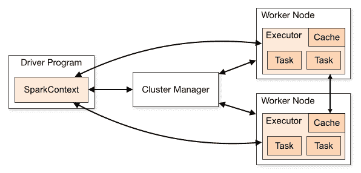

# 第十章：获取并持久化比特币市场数据

在本章中，我们将开发一个数据管道来获取、存储和稍后分析比特币交易数据。

在介绍 Apache Spark 之后，我们将看到如何调用 REST API 从加密货币交易所获取交易。加密货币交易所允许客户用数字货币（如比特币）兑换法定货币（如美元）。交易数据将使我们能够追踪在特定时间点的价格和数量。

然后我们将介绍 Parquet 格式。这是一种广泛用于大数据分析的列式数据格式。之后，我们将构建一个独立的应用程序，该应用程序将生成比特币/美元交易的历史记录，并将其保存为 Parquet 格式。在下一章中，我们将使用 Apache Zeppelin 进行交互式查询和分析数据。

我们将要处理的数据量不是很大，但如果数据量增加或我们需要存储更多货币或来自不同交易所的数据，所使用的工具和技术将是相同的。使用 Apache Spark 的好处是它可以水平扩展，你可以只是向你的集群添加更多机器来加速你的处理，而不需要更改你的代码。

使用 Spark 的另一个优点是它使得操作类似表格的数据结构以及从/到不同格式的加载和保存变得容易。即使数据量很小，这个优点仍然存在。

在本章中，我们将涵盖以下主题：

+   Apache Spark

+   调用加密货币交易所的 REST API

+   Parquet 格式和分区

完成本章学习后，我们将了解以下内容：

+   如何存储大量数据

+   如何使用 Spark Dataset API

+   如何使用 IO `Monad`控制副作用

# 设置项目

创建一个新的 SBT 项目。在 IntelliJ 中，转到**文件** | **新建** | **项目** | **Scala** | **sbt**。

然后编辑`build.sbt`并粘贴以下内容：

```java
name := "bitcoin-analyser"

version := "0.1"

scalaVersion := "2.11.11"
val sparkVersion = "2.3.1"

libraryDependencies ++= Seq(
  "org.lz4" % "lz4-java" % "1.4.0",
  "org.apache.spark" %% "spark-core" % sparkVersion % Provided,
  "org.apache.spark" %% "spark-core" % sparkVersion % Test classifier 
  "tests",
  "org.apache.spark" %% "spark-sql" % sparkVersion % Provided,
  "org.apache.spark" %% "spark-sql" % sparkVersion % Test classifier   "tests",
  "org.apache.spark" %% "spark-catalyst" % sparkVersion % Test     classifier "tests",
  "com.typesafe.scala-logging" %% "scala-logging" % "3.9.0",
  "org.scalatest" %% "scalatest" % "3.0.4" % "test",
  "org.typelevel" %% "cats-core" % "1.1.0",
  "org.typelevel" %% "cats-effect" % "1.0.0-RC2",
  "org.apache.spark" %% "spark-streaming" % sparkVersion % Provided,
  "org.apache.spark" %% "spark-sql-kafka-0-10" % sparkVersion % 
    Provided exclude ("net.jpountz.lz4", "lz4"),
  "com.pusher" % "pusher-java-client" % "1.8.0")

    scalacOptions += "-Ypartial-unification"

// Avoids SI-3623
target := file("/tmp/sbt/bitcoin-analyser")
```

我们使用 Scala 2.11，因为在写作的时候，Spark 没有为 Scala 2.12 提供其库。我们将使用以下内容：

+   `spark-core`和`spark-sql`用于读取交易并将它们保存到 Parquet。`Provided`配置将使 SBT 在将应用程序打包到 assembly JAR 文件时排除这些库。

+   ScalaTest 用于测试我们的代码。

+   `scala-logging`，这是一个方便且快速的日志库，它封装了 SLF4J。

+   使用`cats-core`和`cats-effects`来管理我们的 IO `Monad`副作用。

+   为下一章准备`spark-streaming`、`spark-sql-kafka`和`pusher`。

`cats`需要`-Ypartial-unification`编译器选项。

最后一行让 SBT 将类写入`/tmp`文件夹，以避免 Linux 加密主目录中的*文件名过长*错误。你可能不需要在你的平台上使用它。

如果你不想重新输入代码示例，你可以从 GitHub（[`github.com/PacktPublishing/Scala-Programming-Projects`](https://github.com/PacktPublishing/Scala-Programming-Projects)）检查完整的项目代码。

# 理解 Apache Spark

Spark 是一个开源框架，用于对大数据集进行数据分析。与其他使用内存处理的工具（如 R、Python 和 MathLab）不同，Spark 给你提供了扩展的可能性。而且，得益于其表达性和交互性，它还提高了开发者的生产力。

有整本书是专门介绍 Spark 的。它有大量的组件和许多需要探索的领域。在这本书中，我们旨在帮助你从基础知识开始。如果你想要探索文档，你应该会感到更加自在。

Spark 的目的是对集合进行数据分析。这个集合可以是内存中的，你可以使用多线程来运行你的分析，但如果你的集合变得太大，你将接近系统的内存限制。

Spark 通过创建一个对象来解决这个问题，该对象用于存储所有这些数据。Spark 不是将所有内容都保存在本地计算机的内存中，而是将数据分成多个集合，并在多台计算机上分布。这个对象被称为 **RDD**（即 **Resilient Distributed Dataset**）。RDD 保留了对所有分布式块的所有权。

# RDD、DataFrame 和 Dataset

Spark 的核心概念是 RDD。从用户的角度来看，对于给定的类型 `A`，`RDD[A]` 看起来与标准的 Scala 集合，如 `Vector[A]` 类似：它们都是 **不可变** 的，并且共享许多知名的方法，如 `map`、`reduce`、`filter` 和 `flatMap`。

然而，RDD 有一些独特的特性。它们如下：

+   **延迟加载**：当你调用一个 **转换** 函数，如 `map` 或 `filter` 时，并不会立即发生任何事情。函数调用只是被添加到一个存储在 RDD 类中的计算图中。这个计算图是在你随后调用一个 **行动** 函数，如 `collect` 或 `take` 时执行的。

+   **分布式**：RDD 中的数据被分割成几个分区，这些分区散布在集群中不同的 **executors** 上。一个 **task** 代表了一块数据以及必须对其应用的操作。

+   **容错性**：如果你在执行作业时，一个 executor 死亡，Spark 会自动将丢失的任务重新发送到另一个 executor。

给定两种类型，`A` 和 `B`，`RDD[A]` 和 `RDD[B]` 可以连接在一起以获得 `RDD[(A, B)]`。例如，考虑 `case class Household(id: Int, address: String)` 和 `case class ElectricityConsumption(houseHoldId: Int, kwh: Double)`。如果你想计算消耗超过 2 kWh 的家庭数量，你可以执行以下任何一个操作：

+   将 `RDD[HouseHold]` 与 `RDD[ElectricityConsumption]` 连接，然后对结果应用 `filter`。

+   首先对`RDD[ElectricityConsumption]`应用`filter`，然后将其与`RDD[HouseHold]`连接

结果将相同，但性能将不同；第二个算法将更快。如果 Spark 能为我们执行这种优化就好了？

# Spark SQL

答案是肯定的，该模块称为 Spark SQL。Spark SQL 位于 Spark Core 之上，允许操作结构化数据。与基本的 RDD API 不同，`DataFrame` API 为 Spark 引擎提供了更多信息。使用这些信息，它可以更改执行计划并优化它。

你还可以使用该模块执行 SQL 查询，就像使用关系数据库一样。这使得熟悉 SQL 的人能够轻松地在异构数据源上运行查询。例如，你可以将来自 CSV 文件的数据表与存储在 Hadoop 文件系统中的另一个 Parquet 文件中的数据表以及来自关系数据库的另一个数据表进行连接。

# Dataframe

Spark SQL 由三个主要 API 组成：

+   SQL 字面量语法

+   The `DataFrame` API

+   `DataSet`

`DataFrame`在概念上与关系数据库中的表相同。数据分布的方式与 RDD 相同。`DataFrame`有一个模式，但未指定类型。你可以从 RDD 创建`DataFrame`或手动构建它。一旦创建，`DataFrame`将包含一个模式，该模式维护每个列（字段）的名称和类型。

如果你然后想在 SQL 查询中使用`DataFrame`，你所需要做的就是使用`Dataframe.createTempView(viewName: String)`方法创建一个命名视图（相当于关系数据库中的表名）。在 SQL 查询中，`SELECT`语句中可用的字段将来自`DataFrame`的模式，而`FROM`语句中使用的表名将来自`viewName`。

# Dataset

作为 Scala 开发者，我们习惯于与类型和友好的编译器一起工作，编译器可以推断类型并告诉我们错误。`DataFrame` API 和 Spark SQL 的问题在于，你可以编写一个查询，如`Select lastname From people`，但在你的`DataFrame`中，你可能没有`lastname`列，而是有`surname`列。在这种情况下，你只能在运行时通过一个讨厌的异常来发现这个错误！

难道不好有一个编译错误吗？

这就是为什么 Spark 在 1.6 版本中引入了`Dataset`。`Dataset`试图统一 RDD 和`DataFrame` API。`Dataset`有一个类型参数，你可以使用匿名函数来操作数据，就像使用 RDD 或向量一样。

实际上，`DataFrame`实际上是一个`DataSet[Row]`的类型别名。这意味着你可以无缝地混合这两个 API，并在同一个查询中使用 Lambda 表达式后的过滤器，然后使用`DataFrame`操作符的另一个过滤器。

在接下来的章节中，我们只将使用`Dataset`，这是代码质量和性能之间一个好的折衷方案。

# 使用 Scala 控制台探索 Spark API

如果你还不熟悉 Spark，直接编写 Spark 作业可能会有些令人畏惧。为了使其更容易，我们首先将使用 Scala 控制台来探索 API。在 IntelliJ 中启动一个新的 Scala 控制台（*Ctrl* + *Shift* + *D*），并输入以下代码：

```java
import org.apache.spark.sql.SparkSession
val spark = SparkSession.builder().master("local[*]").getOrCreate()
import spark.implicits._
```

这将初始化一个新的 Spark 会话，并引入一些有用的隐式函数。主`"local[*]"`URL 意味着在运行作业时，我们将使用本地主机上可用的所有核心。

Spark 会话可用，可以接受新的作业。让我们用它来创建包含单个字符串的`Dataset`：

```java
import org.apache.spark.sql.Dataset

val dsString: Dataset[String] = Seq("1", "2", "3").toDS()
// dsString: org.apache.spark.sql.Dataset[String] = [value: string]
```

我们之前导入的隐式函数允许我们在`Seq`上使用`.toDS()`函数来生成`Dataset`。我们可以观察到，由 Scala 控制台调用的`.toString`方法是由`Dataset`的模式输出的——它有一个单列`value`，其类型为`string`。

然而，我们看不到`Dataset`的内容。这是因为`Dataset`是一个懒数据结构；它只存储一个计算图，直到我们调用其中一个操作方法才会进行评估。尽管如此，对于调试来说，能够评估`Dataset`并打印其内容是非常方便的。为此，我们需要调用`show`：

```java
dsString.show()
```

你应该看到以下输出：

```java
+-----+
|value|
+-----+
|    1|
|    2|
|    3|
+-----+
```

`show()`是一个**操作**；它将提交一个作业到 Spark 集群，在驱动程序中收集结果并打印它们。默认情况下，`show`限制行数为 20，并截断列。如果你想获取更多信息，可以带额外的参数调用它。

现在我们想将每个字符串转换为`Int`，以便获得`Dataset[Int]`。我们有两种方法可以实现这一点。

# 使用 map 转换行

在 Scala 控制台中输入以下内容：

```java
val dsInt = dsString.map(_.toInt)
// dsInt: org.apache.spark.sql.Dataset[Int] = [value: int]
dsInt.explain()
```

你应该看到类似以下的内容：

```java
== Physical Plan ==
*(1) SerializeFromObject [input[0, int, false] AS value#96]
+- *(1) MapElements <function1>, obj#95: int
   +- *(1) DeserializeToObject value#91.toString, obj#94: 
    java.lang.String
      +- LocalTableScan [value#91]
```

`explain()`方法显示了如果调用操作方法（如`show()`或`collect()`）将运行的执行计划。

从这个计划中，我们可以推断出调用`map`不是非常高效。实际上，Spark 将`Dataset`的行以二进制格式存储在 off-heap 中。每次调用`map`时，它都必须反序列化此格式，应用你的函数，并将结果以二进制格式序列化。

# 使用选择转换行

转换行的更高效方法是使用`select(cols: Column*)`：

```java
import org.apache.spark.sql.DataFrame
import org.apache.spark.sql.types.IntegerType

val df = ds.select($"value".cast(IntegerType))
// df: org.apache.spark.sql.DataFrame = [value: int]
val dsInt = df.as[Int]
// dsInt: org.apache.spark.sql.Dataset[Int] = [value: int]
```

我们之前导入的隐式函数允许我们使用`$"columnName"`记法从`String`生成一个`Column`对象。`$`符号后面的字符串必须引用`DataFrame`源中存在的列；否则，你会得到一个异常。

然后，我们调用`.cast`方法将每个`String`转换为`Int`。但是，在这个阶段，生成的`df`对象不是`Dataset[Int];`类型；它是`DataFrame`。`DataFrame`实际上是`Dataset[Row]`的类型别名，`Row`类似于键值对列表。`DataFrame`以无类型方式表示分布式数据。编译器不知道每列的类型或名称；它们只在运行时才知道。

为了获得`Dataset[Int]`，我们需要使用`.as[Int]`将元素的类型进行转换。如果`DataFrame`的元素无法转换为目标类型，这将导致运行时失败。

强制为你的`Dataset`元素指定特定类型；这将使你的程序更安全。你应该只在函数真正不知道运行时列的类型时暴露`DataFrame`；例如，如果你正在读取或写入任意文件。

让我们看看现在我们的`explain`计划是什么样的：

```java
dsInt.explain()
```

你应该看到这个：

```java
== Physical Plan ==
LocalTableScan [value#122]
```

这次我们可以看到没有额外的序列化/反序列化步骤。这个`Dataset`的评估将比我们使用`map`时更快。

练习：过滤`Dataset[Int]`的元素，只保留大于 2 的元素。首先使用`filter(func: Int => Boolean)`，然后使用`filter(condition: Column)`。比较两种实现的执行计划。

这个结论是，你应该尽可能优先选择使用`Column`参数的函数。它们可能在运行时失败，与类型安全的替代方案相比，因为它们可能引用你`Dataset`中不存在的列名。然而，它们更高效。

幸运的是，有一个名为**Frameless**的开源库，它可以让你以类型安全的方式使用这些高效的方法。如果你正在编写使用`Dataset`的大型程序，我建议你在这里查看：[`github.com/typelevel/frameless.`](https://github.com/typelevel/frameless)

# 执行模型

`Dataset`和 RDD 中可用的方法有两种：

+   **转换**：它们返回一个新的`Dataset` API，该 API 将在调用动作方法时应用转换。例如，`map`、`filter`、`join`和`flatMap`。

+   **动作**：它们触发 Spark 作业的执行，例如`collect`、`take`和`count`。

当一个**作业**由动作方法触发时，它被分成几个**阶段**。阶段是作业的一部分，可以在不跨集群的不同节点**洗牌**数据的情况下运行。它可以包括几个转换，如`map`和`filter`。但是，一旦一个转换，如`join`，需要移动数据（洗牌），就必须引入另一个阶段。

`Dataset`中的数据被分成几个**分区**。一个阶段（要执行的代码）与一个分区（阶段使用的数据）的组合是一个**任务**。当你在集群中拥有*nb of tasks* = *nb of cores*时，可以实现理想的并行性。当你需要优化一个作业时，重新分区你的数据以更好地匹配你拥有的核心数量可能会有所帮助。

当 Spark 开始执行一个作业时，**Driver**程序将任务分配给集群中的所有执行器：



以下图示描述如下：

+   驱动程序与调用动作方法的代码位于同一个 JVM 上

+   一个 executor 在集群的远程节点上的自己的 JVM 上运行。它可以使用多个核心并行执行多个任务。

Spark **master**在集群中协调多个**worker**节点。当你启动一个 Spark 应用程序时，你必须指定 master 的 URL。然后它会要求其 worker 生成专门用于应用程序任务的 executor 进程。在某个特定时间点，一个 worker 可以管理多个运行完全不同应用程序的 executor。

当您想要在不使用集群的情况下快速运行或测试应用程序时，您可以使用**本地**master。在这种特殊模式下，master、driver 和 executor 只使用一个 JVM。

# 实现交易批量生产者

在本节中，我们将首先讨论如何调用 REST API 以获取 BTC/USD 交易。然后我们将看到如何使用 Spark 将 JSON 有效负载反序列化为类型良好的分布式`Dataset`。

之后，我们将介绍 parquet 格式，并看看 Spark 如何使将我们的交易保存为此格式变得容易。

使用所有这些构建块，我们将以纯函数式方式使用**测试驱动开发**（**TDD**）技术来实现我们的程序。

# 调用 Bitstamp REST API

Bitstamp 是一个加密货币交易所，人们用它来用加密货币，如比特币，交换传统货币，如美元或欧元。Bitstamp 的一个好处是它提供了一个 REST API，可以用来获取有关最新交易的信息，如果您有账户，还可以用来发送订单。

您可以在此处了解更多信息：[`www.bitstamp.net/api/`](https://www.bitstamp.net/api/)

对于这个项目，我们唯一感兴趣的端点是获取交易所上最近发生的交易的最新交易。这将给我们一个关于在给定时间段内货币交换的价格和数量的指示。此端点可以通过以下 URL 调用：[`www.bitstamp.net/api/v2/transactions/btcusd/?time=hour`](https://www.bitstamp.net/api/v2/transactions/btcusd/?time=hour)

如果您将此 URL 粘贴到您喜欢的浏览器中，您应该会看到一个包含在过去一小时发生的所有 BTC（比特币）/USD（美元）交易的 JSON 数组。它看起来应该类似于以下内容：

```java
[
  {
    "date": "1534582650",
    "tid": "72519377",
    "price": "6488.27",
    "type": "1",
    "amount": "0.05000000"
  },
  {
    "date": "1534582645",
    "tid": "72519375",
    "price": "6488.27",
    "type": "1",
    "amount": "0.01263316"
  },
  ...
]
```

在前面的结果中，如果我们检查第一笔交易，我们可以看到以 6488.27 美元的价格出售了 0.05 个比特币（`"type": "1"`表示出售）。

有许多 Java 和 Scala 库可以调用 REST 端点，但为了保持简单，我们只是将使用 Scala 和 Java SDK 来调用端点。启动一个新的 Scala 控制台，并运行以下代码：

```java
import java.net.URL
import scala.io.Source

val transactions = Source.fromURL(new URL("https://www.bitstamp.net/api/v2/transactions/btcusd/?time=hour")).mkString
```

在`scala.io.Source`类的帮助下，我们可以以字符串形式获取 HTTP 响应。这是我们程序的第一个构建块。接下来我们需要做的是将 JSON 对象解析为 Scala 对象的集合，以便更容易地操作。

由于我们一次性将整个 HTTP 响应读入一个字符串，所以在驱动程序进程中需要有足够的内存来在堆中保持这个字符串。你可能认为使用 `InputStream` 来读取会更好，但不幸的是，使用 Spark Core 无法分割数据流。你必须使用 Spark Streaming 来完成这个操作。

# 解析 JSON 响应

我们观察到，当我们调用 Bitstamp 端点时，我们得到一个包含 JSON 数组的字符串，数组的每个元素都是一个表示交易的 JSON 对象。但将信息放在 Spark `Dataset` 中会更好。这样，我们将能够使用所有强大的 Spark 函数来存储、过滤或聚合数据。

# 单元测试 jsonToHttpTransaction

首先，我们可以从定义一个与我们的 JSON 有效负载中相同数据的 case class 开始。创建一个新的包，`coinyser`，然后在 `src/main/scala` 中创建一个类，`coinyser.HttpTransaction`：

```java
package coinyser

case class HttpTransaction(date: String,
                           tid: String,
                           price: String,
                           `type`: String,
                           amount: String)
```

在 Scala 中，如果你想使用已经定义为 Scala 关键字的变量名，你可以用反引号包围变量，例如这个例子中的 `type` 变量名：`` `type`: String ``。

这个类具有与 JSON 对象相同的属性名称和相同的类型（所有都是字符串）。第一步是实现一个函数，将 JSON 字符串转换为 `Dataset[HttpTransaction]`。为此，让我们在 `src/test/scala` 中创建一个新的测试类，`coinyser.BatchProducerSpec`：

```java
package coinyser

import org.apache.spark.sql._
import org.apache.spark.sql.test.SharedSparkSession
import org.scalatest.{Matchers, WordSpec}

class BatchProducerSpec extends WordSpec with Matchers with SharedSparkSession {
  val httpTransaction1 = 
    HttpTransaction("1532365695", "70683282", "7740.00", "0", 
    "0.10041719")
  val httpTransaction2 = 
    HttpTransaction("1532365693", "70683281", "7739.99", "0", 
    "0.00148564")

  "BatchProducer.jsonToHttpTransaction" should {
    "create a Dataset[HttpTransaction] from a Json string" in {
      val json =
        """[{"date": "1532365695", "tid": "70683282", "price": 
            "7740.00", "type": "0", "amount": "0.10041719"},
          |{"date": "1532365693", "tid": "70683281", "price": 
            "7739.99", "type": "0", "amount": 
            "0.00148564"}]""".stripMargin

      val ds: Dataset[HttpTransaction] = 
        BatchProducer.jsonToHttpTransactions(json)
      ds.collect() should contain theSameElementsAs 
        Seq(httpTransaction1, httpTransaction2)
    }
  }
}
```

我们的测试扩展了 `SharedSparkSession`。这个特质提供了一个隐式的 `SparkSession`，可以在多个测试之间共享。

首先，我们定义了一个包含两个交易的 JSON 数组字符串，这两个交易是从 Bitstamp 的端点提取出来的。我们定义了两个 `HttpTransaction` 实例，我们期望在测试之外的数据集中有这些实例，因为我们稍后将在另一个测试中重用它们。

在我们即将实现的 `jsonToHttpTransaction` 调用之后，我们获得了 `Dataset[HttpTransaction]`。然而，Spark 的 `Dataset` 是惰性的——在这个阶段，还没有进行任何处理。为了 *物化* `Dataset`，我们需要通过调用 `collect()` 来强制其评估。这里 `collect()` 的返回类型是 `Array[HttpTransaction]`，因此我们可以使用 ScalaTest 的断言，`contain theSameElementsAs`。

# 实现 jsonToHttpTransaction

创建 `coinyser.BatchProducer` 类并输入以下代码：

```java
package coinyser

import java.time.Instant
import java.util.concurrent.TimeUnit

import cats.Monad
import cats.effect.{IO, Timer}
import cats.implicits._
import org.apache.spark.sql.functions.{explode, from_json, lit}
import org.apache.spark.sql.types._
import org.apache.spark.sql.{Dataset, SaveMode, SparkSession}

import scala.concurrent.duration._
object BatchProducer {

  def jsonToHttpTransactions(json: String)(implicit spark: 
  SparkSession): Dataset[HttpTransaction] = {
    import spark.implicits._
    val ds: Dataset[String] = Seq(json).toDS()
    val txSchema: StructType = Seq.empty[HttpTransaction].schema
    val schema = ArrayType(txSchema)
    val arrayColumn = from_json($"value", schema)
    ds.select(explode(arrayColumn).alias("v"))
      .select("v.*")
      .as[HttpTransaction]
  }
}
```

一些导入将在以后使用。如果它们在 IntelliJ 中显示为未使用，请不要担心。让我们一步一步地解释这里发生的事情。我鼓励你在 Scala 控制台中运行每个步骤，并在每个 `Dataset` 转换后调用 `.show()`：

```java
def jsonToHttpTransactions(json: String)(implicit spark: SparkSession)
: Dataset[HttpTransaction] =
```

如单元测试中指定，我们函数的签名接受包含交易 JSON 数组的`String`，并返回`Dataset[HttpTransaction]`。由于我们需要生成`Dataset`，我们还需要传递一个`SparkSession`对象。在典型应用中，这个类只有一个实例，因此将其作为隐式参数传递是一个好习惯：

```java
import spark.implicits.
val ds: Dataset[String] = Seq(json).toDS()
```

第一步是从我们的 JSON 字符串生成`Dataset[String]`。这个`Dataset`将包含一个包含整个交易 JSON 数组的单行。为此，我们使用了在调用`import spark.implicits:`时提供的`.toDS()`方法。

```java
  val txSchema: StructType = Seq.empty[HttpTransaction].toDS().schema
  val schema = ArrayType(txSchema)
  val arrayColumn = from_json($"value".cast(StringType), schema)
```

在前一个章节中，我们已经看到使用接受`Column`作为参数的 Spark 函数更有效率。为了解析 JSON，我们使用了`from_jso`函数，该函数位于`org.apache.spark.sql.functions`包中。我们使用这个特定的签名：`def from_json(e: Column, schema: StructType): Column`：

+   第一个参数是我们想要解析的列。我们传递了`"value"`列，这是我们的单列`Dataset`的默认列名。

+   第二个参数是目标模式。`StructType`表示`Dataset`的结构——其列的名称、类型和顺序。传递给函数的模式必须与 JSON 字符串的名称和类型匹配。你可以手动创建一个模式，但为了简化操作，我们首先使用一个空的`Dataset[HttpTransaction]`创建`txSchema`。`txSchema`是单个交易的模式，但由于我们的 JSON 字符串包含一个交易数组，我们必须将`txSchema`封装在`ArrayType`中：

```java
ds.select(explode(arrayColumn).alias("v"))
   .select("v.*")
   .as[HttpTransaction]
```

如果我们只选择`arrayColumn`，我们会得到`Dataset[Seq[HttpTransaction]]`——一个包含集合的单行。但我们的目标是`Dataset[HttpTransaction]`——数组中的每个元素一行。

为了这个目的，我们使用了`explode`函数，它类似于向量的`flatten`。在`explode`之后，我们获得了多行，但在这一阶段，每一行只有一个包含所需列（`date`、`tid`和`price`）的`StructType`列。我们的交易数据实际上被封装在一个对象中。为了解包它，我们首先将这个`StructType`列重命名为`"v"`，然后调用`select("v.*")`。我们得到了包含`date`、`tid`和`price`列的`DataFrame`，这样我们就可以安全地将它们转换为`HttpTransaction`。

你可以运行单元测试；现在它应该可以通过。

# 单元测试 httpToDomainTransactions

现在我们已经拥有了所有必要的组件来获取交易并将它们放入`Dataset[HttpTransaction]`中。但将这些对象直接存储并对其进行分析并不是一个明智的选择，原因如下：

+   API 在未来可能会发生变化，但我们希望无论这些变化如何，都能保持相同的存储格式。

+   如我们在下一章中将要看到的，Bitstamp WebSocket API 用于接收实时交易使用的是不同的格式。

+   `HttpTransaction` 的所有属性都是 `String` 类型。如果属性有适当的类型，运行分析将更容易

由于这些原因，最好有一个代表交易的不同的类。让我们创建一个新的类，称为 `coinyser.Transaction`：

```java
package coinyser

import java.sql.{Date, Timestamp}
import java.time.ZoneOffset

case class Transaction(timestamp: Timestamp,
                       date: Date,
                       tid: Int,
                       price: Double,
                       sell: Boolean,
                       amount: Double)
```

它具有与 `HttpTransaction` 相同的属性，但类型更好。我们必须使用 `java.sql.Timestamp` 和 `java.sql.Date`，因为它们是 Spark 向外部公开的时间戳和日期的类型。我们还添加了一个 `date` 属性，它将包含交易的日期。信息已经包含在 `timestamp` 中，但这种反规范化将在我们想要过滤特定日期范围的交易时非常有用。

为了避免传递日期，我们可以在伴生对象中创建一个新的 `apply` 方法：

```java
object Transaction {
  def apply(timestamp: Timestamp,
            tid: Int,
            price: Double,
            sell: Boolean,
            amount: Double) =
    new Transaction(
      timestamp = timestamp,
      date = Date.valueOf(
        timestamp.toInstant.atOffset(ZoneOffset.UTC).toLocalDate),
      tid = tid,
      price = price,
      sell = sell,
      amount = amount)
}
```

现在我们可以为需要创建在现有 `BatchProducerSpec` 内部的 `httpToDomainTransactions` 新函数编写单元测试：

```java
  "BatchProducer.httpToDomainTransactions" should {
    "transform a Dataset[HttpTransaction] into a Dataset[Transaction]" 
    in {
      import testImplicits._
      val source: Dataset[HttpTransaction] = Seq(httpTransaction1, 
        httpTransaction2).toDS()
      val target: Dataset[Transaction] = 
        BatchProducer.httpToDomainTransactions(source)
      val transaction1 = Transaction(timestamp = new 
        Timestamp(1532365695000L), tid = 70683282, price = 7740.00, 
        sell = false, amount = 0.10041719)
      val transaction2 = Transaction(timestamp = new 
        Timestamp(1532365693000L), tid = 70683281, price = 7739.99, 
        sell = false, amount = 0.00148564)

      target.collect() should contain theSameElementsAs 
        Seq(transaction1, transaction2)
    }
```

测试相当直接。我们构建 `Dataset[HttpTransaction]`，调用 `httpToDomainTransactions` 函数，并确保结果包含预期的 `Transaction` 对象。

# 实现 `httpToDomainTransactions`

此实现使用 `select` 来避免额外的序列化/反序列化。在 `BatchProducer` 中添加以下函数：

```java
  def httpToDomainTransactions(ds: Dataset[HttpTransaction]): 
    Dataset[Transaction] = {
    import ds.sparkSession.implicits._
    ds.select(
      $"date".cast(LongType).cast(TimestampType).as("timestamp"),
      $"date".cast(LongType).cast(TimestampType).
       cast(DateType).as("date"),
      $"tid".cast(IntegerType),
      $"price".cast(DoubleType),
      $"type".cast(BooleanType).as("sell"),
      $"amount".cast(DoubleType))
      .as[Transaction]
  }
```

我们使用 `cast` 将字符串列转换为适当的类型。对于转换为 `TimeStampType`，我们必须首先将其转换为 `LongType`，而对于转换为 `DateType`，我们必须首先将其转换为 `TimestampType`。由于所有类型都与目标 `Transaction` 对象匹配，我们可以在最后调用 `.as[Transaction]` 以获得 `Dataset[Transaction]`。

你现在可以运行 `BatchProducerSpec` 并确保两个测试通过。

# 保存交易

现在我们已经有了从 Bitstamp API 获取过去 24 小时交易并生成 `Dataset` 内部有良好类型的交易对象的所需所有函数。接下来我们需要做的是将这些数据持久化到磁盘上。这样，一旦我们运行了我们的程序很多天，我们就能检索过去发生的交易。

# 介绍 Parquet 格式

Spark 支持多种不同的 `Datasets` 存储格式：CSV、Parquet、ORC、JSON 以及许多其他格式，例如 Avro，使用适当的库。

使用行格式，如 CSV、JSON 或 Avro，数据是按行保存的。使用列格式，如 Parquet 或 ORC，文件中的数据按列存储。

例如，我们可能有以下交易数据集：

```java
+-------------------+--------+-------+-----+-------+
|timestamp          |tid     |price  |sell |amount |
+-------------------+--------+-------+-----+-------+
|2018-08-02 07:22:34|       0|7657.58|true |0.1    |
|2018-08-02 07:22:47|       1|7663.85|false|0.2    |
|2018-08-02 07:23:09|       2|7663.85|false|0.3    |
+-------------------+--------+-------+-----+-------+
```

如果我们使用行格式，如 CSV、JSON 或 Avro，数据将按行保存。使用列格式，如 Parquet 或 ORC，文件中的数据按列存储。

```java
2018-08-02 07:22:34|0|7657.58|1|0.1;2018-08-02 07:22:47|1|7663.85|0|0.2;2018-08-02 07:23:09|2|7663.85|0|0.3  
```

相比之下，如果我们使用列式格式编写，文件将看起来像这样：

```java
2018-08-02 07:22:34|2018-08-02 07:22:47|2018-08-02 07:23:09;0|1|2;7657.58|7663.85|7663.85;true|false|false;0.1|0.2|0.3
```

使用列式数据格式在读取数据时提供几个性能优势，包括以下内容：

+   投影下推：当你需要选择几个列时，你不需要读取整个行。在前面的例子中，如果我只对交易的定价演变感兴趣，我可以只选择时间戳和价格，其余的数据将不会从磁盘读取。

+   谓词下推：当你只想检索具有特定值的列的行时，你可以通过扫描列数据快速找到这些行。在前面的例子中，如果我想检索在 07:22:00 到 07:22:30 之间发生的交易，列式存储将允许我通过只读取磁盘上的时间戳列来找到这些行。

+   更好的压缩：行格式可以在存储到磁盘之前进行压缩，但列式格式有更好的压缩率。数据确实更加均匀，因为连续的列值之间的差异小于连续的行值。

+   可分割的：当 Spark 集群运行一个读取或写入 Parquet 的作业时，作业的任务会分布到许多执行器上。每个执行器将并行地从/向其自己的文件集读取/写入行块。

所有这些优点使得列式格式特别适合运行分析查询。这就是为什么，在我们的项目中，我们将使用 Parquet 来存储交易数据。这个选择有点随意；ORC 也能同样好地工作。

在典型的 Spark 集群生产环境中，你必须将文件存储在 **分布式文件系统** 中。

集群中的每个节点确实必须能够访问数据中的任何一块。如果你的一个 Spark 节点崩溃了，你仍然希望能够访问它保存的数据。如果文件存储在本地文件系统中，你就无法做到这一点。通常，人们使用 **Hadoop** 文件系统或 **Amazon S3** 来存储他们的 parquet 文件。它们都提供了分布式、可靠的文件存储方式，并且具有良好的并行性特征。

在生产项目中，对不同格式的性能进行基准测试可能是有益的。根据你的数据形状和查询类型，一种格式可能比其他格式更适合。

# 在 Parquet 中写入交易

在 `BatchProducer` 中添加以下 `import` 和函数声明：

```java
import java.net.URI
def unsafeSave(transactions: Dataset[Transaction], path: URI): Unit = ???
```

让我们更详细地看看：

+   写入文件是一个副作用；这就是为什么我们在函数前加了 `unsafe` 前缀。作为函数式程序员，我们努力控制副作用，并且明确命名任何有副作用的函数是一种好习惯。我们将在下一节中看到如何使用 IO `Monad` 将这个副作用推送到我们应用程序的边界。

+   我们使用 `java.net.URI` 来传递文件将被写入的目录路径。这确保了我们传递给函数的路径确实是一个路径。像往常一样，我们尽量避免使用字符串作为参数，以使我们的代码更加健壮。

相应的测试实际上会写入文件系统；因此，它更像是集成测试而不是单元测试。因此，我们将创建一个新的测试，带有 `IT` 后缀，用于集成测试。

在 `src/test/scala` 中创建一个新的测试，名为 `coinyser.BatchProducerIT`：

```java
package coinyser

import java.sql.Timestamp

import cats.effect.{IO, Timer}
import org.apache.spark.sql.test.SharedSparkSession
import org.scalatest.{Matchers, WordSpec}

class BatchProducerIT extends WordSpec with Matchers with SharedSparkSession {

  import testImplicits._

  "BatchProducer.unsafeSave" should {
    "save a Dataset[Transaction] to parquet" in withTempDir { tmpDir =>
      val transaction1 = Transaction(timestamp = new 
        Timestamp(1532365695000L), tid = 70683282, price = 7740.00, 
        sell = false, amount = 0.10041719)
      val transaction2 = Transaction(timestamp = new 
        Timestamp(1532365693000L), tid = 70683281, price = 7739.99, 
        sell = false, amount = 0.00148564)
      val sourceDS = Seq(transaction1, transaction2).toDS()

      val uri = tmpDir.toURI
      BatchProducer.unsafeSave(sourceDS, uri)
      tmpDir.list() should contain("date=2018-07-23")
      val readDS = spark.read.parquet(uri.toString).as[Transaction]
          sourceDS.collect() should contain theSameElementsAs 
        readDS.collect()
    }
  }
}
```

我们使用来自 `SharedSparkSession` 的方便的 `withTempDir` 函数。它创建一个临时目录，并在测试完成后将其删除。然后，我们创建一个示例 `Dataset[Transaction]`，并调用我们想要测试的函数。

在写入数据集之后，我们断言目标路径包含一个名为 `date=2018-07-23` 的目录。我们确实希望使用 `date` 分区来组织我们的存储，以便更快地检索特定日期范围。

最后，当我们读取文件时，我们应该得到与原始 `Dataset` 中相同的元素。运行测试并确保它按预期失败。

现在我们有一个失败的测试，我们可以实现 `BatchProducer.unsafeSave`：

```java
  def unsafeSave(transactions: Dataset[Transaction], path: URI): Unit =
    transactions
      .write
      .mode(SaveMode.Append)
      .partitionBy("date")
      .parquet(path.toString)
```

首先，`transactions.write` 创建 `DataFrameWriter`。这是一个接口，它允许我们在调用最终操作方法（如 `parquet(path: String): Unit`）之前配置一些选项。

我们使用以下选项配置 `DataFrameWriter`：

+   `mode(SaveMode.Append)`：使用此选项，如果路径中已经保存了一些数据，则 `Dataset` 的内容将被追加到其中。当我们在常规间隔调用 `unsafeSave` 以获取新事务时，这将很有用。

+   `partitionBy("date")`：在存储的上下文中，分区是一个将在路径下创建的中间目录。它将有一个名称，例如 `date=2018-08-16`。分区是一种优化存储布局的好技术。这将使我们能够加快所有只需要特定日期范围数据的查询。

不要将存储分区（文件系统中的一个中间文件夹）与 Spark 分区（存储在集群节点上的数据块）混淆。

您现在可以运行集成测试；它应该通过。

存储分区的一个有趣特性是它进一步减少了文件大小。您可能会担心，通过存储时间戳和日期，我们会浪费一些存储空间来存储日期。但事实是，当日期是存储分区时，它根本不会存储在 Parquet 文件中。

为了说服自己，在单元测试中，在调用 `unsafeSave` 之后添加以下行：

```java
      spark.read.parquet(uri + "/date=2018-07-23").show()
```

然后再次运行单元测试。您应该在控制台看到以下内容：

```java
+-------------------+--------+-------+-----+----------+
|          timestamp|     tid|  price| sell|    amount|
+-------------------+--------+-------+-----+----------+
|2018-07-23 18:08:15|70683282| 7740.0|false|0.10041719|
|2018-07-23 18:08:13|70683281|7739.99|false|0.00148564|
+-------------------+--------+-------+-----+----------+
```

日期列缺失！这意味着 `date` 列根本未存储在 Parquet 文件中。在单元测试中，当我们从 URI 读取时，Spark 检测到该目录下有一个分区 `date=2018-07-23`，并为所有值添加了一个包含 `2018-07-23` 的 `date` 列。

如果您想添加一个所有行都具有相同值的列，最简单的方法是创建一个中间目录，`myColum=value`。

# 使用 IO 模态

我们之前提到，我们的函数`unsafeSave`有一个副作用，即写入文件。但是作为函数式程序员，我们尽量只编写没有副作用的纯函数。然而，在程序结束时，你仍然希望这个副作用发生；否则，就没有运行它的意义了！

解决这种困境的一种常见方法是使用参数化类型来封装副作用，以便异步运行它。`cats.effect`库中的`cats.effect.IO`类是一个很好的候选者（见[`typelevel.org/cats-effect/datatypes/io.html`](https://typelevel.org/cats-effect/datatypes/io.html)）。

这里有一个你可以在 Scala 控制台中尝试的示例：

```java
import cats.effect.IO

val io = IO{ println("Side effect!"); 1 }
// io: cats.effect.IO[Int] = …
io.unsafeRunSync()
// Side effect!
// res1: Int = 1
```

我们可以观察到，当我们声明`io`变量时，没有发生任何事情。此时，传递给`IO`构造函数的块仅被注册，将在以后执行。实际的执行只有在调用`unsafeRunSync()`时才会发生。我们的`io`变量是一个纯的、不可变的价值，因此保持了引用透明性。

`IO`是`Monad`，因此我们可以使用`map`、`flatMap`和`for`表达式来组合副作用：

```java
val program = for {
  a <- io
  b <- io
} yield a+b
// program: cats.effect.IO[Int]
program.unsafeRunSync()
// IO is run!
// IO is run!
// res2: Int = 2
```

我们可以多次重用`io`变量；它封装的副作用将在我们调用`unsafeRunSync()`时，在“世界末日”时按需运行多次 *。

如果我们使用了`scala.concurrent.Future`而不是`cats.effect.IO`，副作用将只运行一次。这是因为`Future`会记住结果。在某些情况下，`Future`的行为可能是可取的，但在某些其他情况下，你真的希望你的效果按照你在代码中定义的次数执行。`IO`的方法也避免了共享状态和内存泄漏。

`IO`值也可以并行运行。它们可以有效地替换`scala.concurrent.Future`：

```java
import cats.effect.IO
import cats.implicits._
import scala.concurrent.ExecutionContext.Implicits.global

val io = IO{ Thread.sleep(100); Thread.currentThread().getName }
val program = (io, io, io).parMapN((a, b, c) => s"$a\n$b\n$c")
program.unsafeRunSync()
// res2: String =
// ForkJoinPool-1-worker-5
// ForkJoinPool-1-worker-3
// ForkJoinPool-1-worker-1
```

`IO`块返回当前线程的名称作为字符串。我们使用`parMapN`创建一个`IO[String]`类型的程序，以表示我们想要并行执行元组中的`IO`值。`unsafeRunSync`的输出显示程序在三个不同的线程中执行。

回到我们的交易保存，我们使`unsafeSave`函数安全所需要做的全部事情就是将其包裹在`IO`中：

```java
  def save(transactions: Dataset[Transaction], path: URI): IO[Unit] =
    IO(unsafeSave(transactions, path))
```

或者，你可以内联`unsafeSave`并将集成测试改为调用`save`：

```java
      BatchProducer.save(sourceDS, uri).unsafeRunSync()
```

我们现在可以在控制副作用的同时保存事务，并保持我们的函数纯。

# 将所有这些放在一起

到目前为止，我们可以从 REST API 读取事务，将`Dataset[Transaction]`中的 JSON 有效负载进行转换，并将其保存到 parquet。现在是时候将这些部分组合在一起了。

Bitstamp API 允许我们获取过去 24 小时、过去一小时或过去一分钟发生的交易。在一天结束时，我们希望构建一个定期获取并保存新交易以进行长期分析的应用程序。这个应用程序是我们的 *批处理* 层，它不是为了获取实时交易。因此，获取过去一小时的交易就足够了。在下一章中，我们将构建一个 *速度* 层来处理实时交易。

我们的 `BatchProducer` 应用程序将按以下方式工作：

1.  在启动时，获取最后 24 小时的交易。将 `start` 设置为当前午夜 UTC 日期，将 `end` 设置为最后交易的戳记。

1.  过滤交易，仅保留 `start` 和 `end` 之间的交易，并将它们保存到 Parquet。

1.  等待 59 分钟。

1.  获取最后一个小时的交易。我们有一个一分钟的重叠，以确保我们不会错过任何交易。将 `start` 设置为 `end`，将 `end` 设置为最后交易的戳记。

1.  转到步骤 2。

为了实现这个算法，我们将编写一个 `processOneBatch` 函数，它包含步骤 2 到 4，然后我们将实现步骤 1 和无限循环。

# 测试 processOneBatch

我们的功能需要一些配置参数和隐式值。为了保持我们的签名整洁，我们将它们放在一个类中。创建一个新的类，`coinyser.AppContext`：

```java
class AppContext(val transactionStorePath: URI)
                (implicit val spark: SparkSession,
                 implicit val timer: Timer[IO])
```

`AppContext` 包含 Parquet 文件的目标位置、`SparkSession` 对象以及当需要调用 `IO.sleep` 时 `cats.effect` 所需的 `Timer[IO]` 对象。

然后在 `BatchProducer` 中声明 `processOneBach` 函数：

```java
def processOneBatch(fetchNextTransactions: IO[Dataset[Transaction]],
                    transactions: Dataset[Transaction],
                    saveStart: Instant,
                    saveEnd: Instant)(implicit appCtx: AppContext)
: IO[(Dataset[Transaction], Instant, Instant)] = ???
```

函数接受以下参数：

+   `fetchNextTransactions` 是一个 `IO` 操作，当运行时将返回过去一小时的交易。我们将其作为参数传递，以便在单元测试中模拟对 Bitstamp API 的调用。

+   `transactions` 是包含已读取的最后交易的 `Dataset`（我们的算法中的步骤 1 或 4）。

+   `saveStart` 和 `saveEnd` 是在保存 `transactions` 之前用于过滤的时间间隔。

+   `appCtx` 如前所述。

我们的功能将必须执行副作用；因此，它返回 `IO`。这个 `IO` 将包含一个元组，其中包含以下内容：

+   通过运行 `fetchNextTransactions` 获得的 `Dataset[Transaction]`。

+   下一个 `saveStart` 和下一个 `saveEnd`

现在我们已经很好地声明了我们的函数，我们可以为它编写一个集成测试。测试相当长；因此，我们将一点一点地描述它。在 `BatchProducerIT` 中创建一个新的集成测试：

```java
"BatchProducer.processOneBatch" should {
  "filter and save a batch of transaction, wait 59 mn, fetch the next 
    batch" in withTempDir { tmpDir =>
    implicit object FakeTimer extends Timer[IO] {
      private var clockRealTimeInMillis: Long =
        Instant.parse("2018-08-02T01:00:00Z").toEpochMilli

      def clockRealTime(unit: TimeUnit): IO[Long] =
        IO(unit.convert(clockRealTimeInMillis, TimeUnit.MILLISECONDS))

      def sleep(duration: FiniteDuration): IO[Unit] = IO {
        clockRealTimeInMillis = clockRealTimeInMillis + 
        duration.toMillis
      }

      def shift: IO[Unit] = ???
      def clockMonotonic(unit: TimeUnit): IO[Long] = ???
    }
    implicit val appContext: AppContext = new 
      AppContext(transactionStorePath = tmpDir.toURI)
```

我们首先定义 `FakeTimer`，它实现了 `Timer[IO]` 接口。这个计时器让我们模拟一个从 `2018-08-02T01:00:00Z` 开始的时钟。这样，我们就不必等待 59 分钟来运行我们的测试。实现使用 `var clockRealTimeInMillis`，它保持我们的假时钟的当前时间，并在调用 `sleep` 时更新它。

然后，我们使用临时目录和作用域内的隐式转换：`FakeTimer` 和 `SparkSession` 创建 `AppContext`。

测试的下一部分定义了一些交易：

```java
 implicit def toTimestamp(str: String): Timestamp = 
   Timestamp.from(Instant.parse(str))
 val tx1 = Transaction("2018-08-01T23:00:00Z", 1, 7657.58, true, 
    0.021762)
 val tx2 = Transaction("2018-08-02T01:00:00Z", 2, 7663.85, false, 
    0.01385517)
 val tx3 = Transaction("2018-08-02T01:58:30Z", 3, 7663.85, false, 
    0.03782426)
 val tx4 = Transaction("2018-08-02T01:58:59Z", 4, 7663.86, false, 
    0.15750809)
 val tx5 = Transaction("2018-08-02T02:30:00Z", 5, 7661.49, true, 0.1)

 val txs0 = Seq(tx1)
 val txs1 = Seq(tx2, tx3)
 val txs2 = Seq(tx3, tx4, tx5)
 val txs3 = Seq.empty[Transaction]
```

`implicit` 转换 `toTimestamp` 允许我们使用 `String` 而不是 `Timestamp` 来声明我们的交易对象。这使得测试更容易阅读。我们用它来声明五个 `Transaction` 对象，其时间戳围绕 `FakeTimer` 的初始时钟。

然后，我们声明了一系列模拟从 Bitstamp API 读取的内容的交易批次。实际上，我们无法从我们的集成测试中调用真实的 Bitstamp API；数据将是随机的，如果 API 不可用，我们的集成测试可能会失败：

+   `txs0` 是 `Seq[Transaction]`，它模拟我们在 01:00 读取的初始交易批次。如果你还记得 `BatchProducer` 算法，这个初始批次将包含最后 24 小时的交易。在我们的例子中，这个批次只包含 `tx1`，即使 `tx2` 的时间戳是 01:00。这是因为，在真实的 API 中，我们不会得到在完全相同时间发生的交易。总会有一些延迟。

+   `txs1` 是我们在 01:59 读取的交易批次。在这个批次中，我们考虑 API 延迟使我们错过了在 01:58:59 发生的 `tx4`。

+   `txs2` 是在 `txs1` 59 分钟后读取的批次，在 02:58。

+   `txs3` 是在 `txs2` 59 分钟后读取的批次，在 03:57。

下面的部分实际上调用了被测试的函数 `processOneBatch` 三次：

```java
val start0 = Instant.parse("2018-08-02T00:00:00Z")
val end0 = Instant.parse("2018-08-02T00:59:55Z")
val threeBatchesIO =
  for {
    tuple1 <- BatchProducer.processOneBatch(IO(txs1.toDS()), 
      txs0.toDS(), start0, end0) 
    (ds1, start1, end1) = tuple1

    tuple2 <- BatchProducer.processOneBatch(IO(txs2.toDS()), ds1, 
      start1, end1)
    (ds2, start2, end2) = tuple2

    _ <- BatchProducer.processOneBatch(IO(txs3.toDS()), ds2, start2, 
    end2)
  } yield (ds1, start1, end1, ds2, start2, end2)
val (ds1, start1, end1, ds2, start2, end2) =   
  threeBatchesIO.unsafeRunSync()
```

对于第一次调用，我们传递以下内容：

+   `txs0.toDS()` 表示初始的交易批次。这将涵盖最后 24 小时的交易。

+   `start0` = 00:00。在我们的算法中，我们选择将第一个批次从午夜开始。这样，我们就不会保存前一天的任何部分数据。

+   `end0` = 00:59:55。我们的时钟从 01:00 开始，但 API 总是会有一些延迟来使交易可见。我们估计这个延迟不会超过五秒。

+   `IO(txs1.toDS())` 表示下一个要获取的交易批次。它将在初始批次 59 分钟后获取。

后续调用传递了前一个调用的结果，以及获取下一个批次的 `IO` 值。

我们随后使用 `unsafeRunSync()` 运行这三个调用，并在 `ds1`、`start1`、`end1`、`ds2`、`start2` 和 `end2` 中获得前两个调用的结果。这使我们能够通过以下断言来验证结果：

```java
ds1.collect() should contain theSameElementsAs txs1
start1 should ===(end0)
end1 should ===(Instant.parse("2018-08-02T01:58:55Z"))

ds2.collect() should contain theSameElementsAs txs2
start2 should ===(end1)
end2 should ===(Instant.parse("2018-08-02T02:57:55Z"))

val lastClock = Instant.ofEpochMilli(
  FakeTimer.clockRealTime(TimeUnit.MILLISECONDS).unsafeRunSync())
lastClock should === (Instant.parse("2018-08-02T03:57:00Z"))
```

让我们详细看看前面的代码：

+   `ds1` 是通过运行 `IO(txs1.toDS())` 获得的批次。因此，它必须与 `txs1` 相同

+   `start1` 必须等于 `end0`——我们需要无缝地移动时间周期

+   `end1` 必须等于初始时钟 *(01:00) + 59 分钟 (等待时间) - 5 秒* (API 延迟)

+   `ds2`、`start2` 和 `end2` 遵循相同的逻辑

+   `lastClock` 必须等于初始时钟 *+ 3 * 59* 分钟

最后，我们可以断言正确的交易已保存到磁盘：

```java
val savedTransactions = spark.read.parquet(tmpDir.toString).as[Transaction].collect()
val expectedTxs = Seq(tx2, tx3, tx4, tx5)
savedTransactions should contain theSameElementsAs expectedTxs
```

该断言排除了`tx1`，因为前一天已经发生。它还验证了尽管我们的批次`txs1`和`txs2`有一些重叠，但我们的 Parquet 文件中没有重复的交易。

你可以编译并运行集成测试。它应该像预期的那样失败，抛出`NotImplementedError`异常。

# 实现 processOneBatch

下面是`BatchProducer.processOneBatch`的实现。正如通常情况一样，实现比测试要短得多：

```java
val WaitTime: FiniteDuration = 59.minute
val ApiLag: FiniteDuration = 5.seconds

def processOneBatch(fetchNextTransactions: IO[Dataset[Transaction]],
                    transactions: Dataset[Transaction],
                    saveStart: Instant,
                    saveEnd: Instant)(implicit appCtx: AppContext)
: IO[(Dataset[Transaction], Instant, Instant)] = {
  import appCtx._
  val transactionsToSave = filterTxs(transactions, saveStart, saveEnd)
  for {
    _ <- BatchProducer.save(transactionsToSave, 
    appCtx.transactionStorePath)
    _ <- IO.sleep(WaitTime)
    beforeRead <- currentInstant
    end = beforeRead.minusSeconds(ApiLag.toSeconds)
    nextTransactions <- fetchNextTransactions
  } yield (nextTransactions, saveEnd, end)
}
```

我们首先使用我们很快将要定义的`filterTxs`函数过滤交易。然后，使用`for` comprehension，我们链接几个`IO`值：

1.  使用我们之前实现的`save`函数保存过滤后的交易

1.  使用`import appCtx._`引入的作用域中的隐式`Timer`等待 59 分钟

1.  使用我们很快将要定义的`currentInstant`函数获取当前时间

1.  使用第一个参数获取下一批交易

下面是辅助函数`filterTxs`的实现：

```java
def filterTxs(transactions: Dataset[Transaction], 
              fromInstant: Instant, untilInstant: Instant): Dataset[Transaction] = {
  import transactions.sparkSession.implicits._
  transactions.filter(
    ($"timestamp" >= 
    lit(fromInstant.getEpochSecond).cast(TimestampType)) &&
      ($"timestamp" <     
    lit(untilInstant.getEpochSecond).cast(TimestampType)))
}
```

我们不需要传递隐式的`SparkSession`，因为它已经在交易`Dataset`中可用。我们只为`(fromInstant, untilInstant)`区间保留交易。排除结束时间，这样我们在`processOneBatch`循环时就不会有任何重叠。

下面是`currentInstant`的定义：

```java
def currentInstant(implicit timer: Timer[IO]): IO[Instant] =
  timer.clockRealTime(TimeUnit.SECONDS) map Instant.ofEpochSecond
```

我们使用`Timer`类来获取当前时间。正如我们在编写集成测试时看到的，这允许我们使用一个假的计时器来模拟时钟。

# 实现 processRepeatedly

我们现在可以开始实现我们的`BatchProducer`应用程序的算法，该算法将反复执行`processOneBatch`。我们不会为它编写集成测试，因为它只是组装了已经测试过的其他部分。理想情况下，在一个生产系统中，你应该编写一个端到端测试，该测试将启动应用程序并连接到一个假的 REST 服务器。

下面是`processRepeatedly`的实现：

```java
def processRepeatedly(initialJsonTxs: IO[Dataset[Transaction]], 
                      jsonTxs: IO[Dataset[Transaction]])
                     (implicit appContext: AppContext): IO[Unit] = {
  import appContext._

  for {
    beforeRead <- currentInstant
    firstEnd = beforeRead.minusSeconds(ApiLag.toSeconds)
    firstTxs <- initialJsonTxs
    firstStart = truncateInstant(firstEnd, 1.day)
    _ <- Monad[IO].tailRecM((firstTxs, firstStart, firstEnd)) {
      case (txs, start, instant) =>
        processOneBatch(jsonTxs, txs, start, instant).map(_.asLeft)
    }
  } yield ()
}
```

在函数的签名中，我们有以下内容：

+   参数`initialJsonTxs`，它是一个`IO`，将获取`Dataset`中最后 24 小时的交易

+   第二个参数`jsonTxs`，用于获取最后小时的交易

+   返回类型`IO[Unit]`，当我们在主应用程序中调用`unsafeRunSync`时将无限运行

函数的主体是一个`for` comprehension，按照以下方式链接`IO`值：

1.  我们首先计算`firstEnd` = 当前时间 - 5 秒。通过使用 5 秒的`ApiLag`，当我们使用`initialJsonTxs`获取交易时，我们确定我们将获取到`firstEnd`的所有交易。

1.  `firstStart`设置为当前天的午夜。对于初始批次，我们希望过滤掉前一天的交易。

1.  我们在`firstTxs`中获取了`Dataset[Transaction]`类型的最后 24 小时的交易。

1.  我们从 `Monad` 中调用 `tailRecM`。它调用块中的匿名函数，直到它返回 `Monad[Right[Unit]]`。但由于我们的函数总是返回 `Left`，它将无限循环。

# 实现 BatchProducerApp

最后，我们所需做的就是创建一个应用程序，该应用程序将使用正确的参数调用 `processRepeatedly`。

在 `src/main/scala` 中创建一个新的类 `coinyser.BatchProducerApp` 并输入以下内容：

```java
package coinyser

import java.io.{BufferedReader, InputStreamReader}
import java.net.{URI, URL}

import cats.effect.{ExitCode, IO, IOApp}
import coinyser.BatchProducer.{httpToDomainTransactions, jsonToHttpTransactions}
import com.typesafe.scalalogging.StrictLogging
import org.apache.spark.sql.{Dataset, SparkSession}

import scala.io.Source

class BatchProducerApp extends IOApp with StrictLogging {

  implicit val spark: SparkSession = 
  SparkSession.builder.master("local[*]").getOrCreate()
  implicit val appContext: AppContext = new AppContext(new 
    URI("./data/transactions"))

  def bitstampUrl(timeParam: String): URL =
    new URL("https://www.bitstamp.net/api/v2/transactions/btcusd?time=" 
    + timeParam)

  def transactionsIO(timeParam: String): IO[Dataset[Transaction]] = {
    val url = bitstampUrl(timeParam)
    val jsonIO = IO {
      logger.info(s"calling $url")
      Source.fromURL(url).mkString
    }
    jsonIO.map(json => 
    httpToDomainTransactions(jsonToHttpTransactions(json)))
  }

  val initialJsonTxs: IO[Dataset[Transaction]] = transactionsIO("day")
  val nextJsonTxs: IO[Dataset[Transaction]] = transactionsIO("hour")

  def run(args: List[String]): IO[ExitCode] =
    BatchProducer.processRepeatedly(initialJsonTxs, nextJsonTxs).map(_ 
    => ExitCode.Success)
}

object BatchProducerAppSpark extends BatchProducerApp
```

该类扩展了 `cats.effect.IOApp`。这是一个辅助特质，它将在 `run` 方法返回的 `IO` 上调用 `unsafeRunSync`。它还扩展了 `StrictLogging`。这个特质在作用域中引入了一个 `logger` 属性，我们将使用它来记录消息。我们的对象体定义了以下成员：

+   `spark` 是 `SparkSession`，用于操作数据集。主节点设置为 `local[*]`，这意味着 Spark 将使用本地主机上所有可用的核心来执行我们的作业。但是，正如我们将在下一节中看到的，当使用 Spark 集群时，这可以被覆盖。

+   `appContext` 需要保存我们的交易的路径。在这里，我们使用本地文件系统上的相对目录。在生产环境中，你通常会使用 S3 或 HDFS 位置。`AppContext` 还需要两个隐式参数：`SparkSession` 和 `Timer[IO]`。我们已定义了前者，后者由 `IOApp` 提供。

+   `bitstampUrl` 是一个函数，它返回用于检索过去一天或过去一小时发生的交易的 URL。

+   `transactionsIO` 通过调用 Bitstamp URL 获取交易。如本章开头所见，我们使用 `scala.io.Source` 从 HTTP 响应中创建一个字符串。然后，我们使用我们之前实现的两个函数 `jsonToHttpTransactions` 和 `httpToDomainTransactions` 将其转换为 `Dataset[Transaction]`。

+   `initialJsonTxs` 和 `nextJsonTxs` 是 IO 值，分别检索过去 24 小时的交易和过去一小时的交易。

+   `run` 实现了 `IOApp` 的唯一抽象方法。它生成 `IO[ExitCode]` 以作为应用程序运行。在这里，我们只是使用之前定义的 `vals` 调用 `processRepeatedly`。然后，我们必须映射以将单元结果转换为 `ExitCode.Success` 以进行类型检查。实际上，这个退出代码永远不会返回，因为 `processRepeatedly` 是无限循环的。

如果你现在尝试运行 `BatchProducerAppSpark`，你将得到关于 Spark 类的 `ClassNotFoundException`。这是因为我们在 `build.sbt` 中**，将一些库声明为 `% Provided`。正如我们将看到的，这种配置对于打包应用程序很有用，但到目前为止，它阻止我们轻松地测试我们的程序。

避免这种情况的技巧是在 `src/test/scala` 目录中创建另一个对象 `coinyser.BatchProducerAppIntelliJ`，它也扩展了 `BatchProducerApp` 类。IntelliJ 确实将所有提供的依赖项带到测试运行时类路径中：

```java
package coinyser

object BatchProducerAppIntelliJ extends BatchProducerApp
```

这就是为什么我们在 `BatchProducerApp.scala` 中定义了一个类和一个对象。我们可以有一个实现，它将用于 `spark-submit`，还有一个可以从 IntelliJ 中运行的实现。

现在运行 `BatchProducerAppIntelliJ` 应用程序。几秒钟后，你应该在控制台看到类似以下内容：

```java
(...)
18/09/02 22:29:08 INFO BatchProducerAppIntelliJ$: calling https://www.bitstamp.net/api/v2/transactions/btcusd?time=day
18/09/02 22:29:15 WARN TaskSetManager: Stage 0 contains a task of very large size (1225 KB). The maximum recommended task size is 100 KB.
18/09/02 22:29:15 INFO CodecPool: Got brand-new compressor [.snappy]
18/09/02 22:29:16 INFO FileOutputCommitter: Saved output of task 'attempt_20180902222915_0000_m_000000_0' to file:/home/mikael/projects/Scala-Programming-Projects/bitcoin-analyser/data/transactions/_temporary/0/task_20180902222915_0000_m_000000
```

从这一点开始，你应该在 `data/transactions/date=<当前日期>` 目录中有一个 Parquet 文件，其中包含从午夜开始当天发生的所有交易。如果你再等一个小时，你将得到另一个包含最后一个小时交易的 Parquet 文件。

如果你不想等一个小时来看到它发生，你可以每分钟获取一次交易：

+   将 `BatchProducerApp.nextJsonTxs` 改为 `jsonIO("?time=minute")`。

+   将 `BatchProducer.WaitTime` 改为 `45.seconds` 以实现 15 秒的重叠。

控制台中的 `WARN` 消息告诉我们 `"Stage 0 包含一个非常大的任务"`。这是因为包含 HTTP 响应的 `String` 被作为一个整体发送到单个 Spark 任务。如果我们有一个更大的有效负载（几百 MB），将其分割并写入文件将更节省内存。

在下一章中，我们将看到如何使用 Zeppelin 查询这些 Parquet 文件并绘制一些图表。但我们可以使用 Scala 控制台来检查它们。启动一个新的 Scala 控制台并输入以下内容：

```java
import org.apache.spark.sql.SparkSession
implicit val spark = SparkSession.builder.master("local[*]").getOrCreate()
val ds = spark.read.parquet("./data/transactions")
ds.show()
```

随意使用 Dataset API 进行实验。你可以尝试计算交易数量，对特定时间段进行过滤，并找到最高价格或数量。

# 使用 spark-submit 运行应用程序。

我们已经以独立方式运行了我们的应用程序，但当你想要处理大型数据集时，你需要使用 Spark 集群。本书的范围不包括解释如何设置 Spark 集群。如果你想设置一个，你可以参考 Spark 文档或使用云计算供应商提供的现成集群。

不论我们是在本地模式下运行 Spark 还是集群模式下运行，提交过程都是相同的。

# 安装 Apache Spark。

我们将安装 Spark 以在本地模式下运行它。此模式仅使用本地主机的 CPU 核心来运行作业。为此，从以下页面下载 Spark 2.3.1： [`spark.apache.org/downloads.html`](https://spark.apache.org/downloads.html)。

然后将其提取到某个文件夹中，例如，Linux 或 macOS 上的 `~/`，即你的主目录：

```java
tar xfvz spark-2.3.1-bin-hadoop2.7.tgz ~/
```

你可以尝试运行 `spark shell` 来验证安装是否正确：

```java
cd ~/spark-2.3.1-bin-hadoop2.7/bin
./spark-shell
```

几秒钟后，你应该看到一条欢迎消息，然后是 Scala 控制台中相同的 `scala>` 提示符：

```java
(...)
Spark context Web UI available at http://192.168.0.11:4040
Spark context available as 'sc' (master = local[*], app id = local-1536218093431).
Spark session available as 'spark'.
Welcome to
      ____              __
     / __/__  ___ _____/ /__
    _\ \/ _ \/ _ `/ __/  '_/
   /___/ .__/\_,_/_/ /_/\_\   version 2.3.1
      /_/

Using Scala version 2.11.8 (Java HotSpot(TM) 64-Bit Server VM, Java 1.8.0_112)
Type in expressions to have them evaluated.
Type :help for more information.

scala> 
```

Spark shell 实际上是一个连接到 Spark 集群的 Scala 控制台。在我们的例子中，它是一个 Spark 本地集群，正如您通过 `master = local[*]` 看到的。Spark-shell 提供了一个变量，`spark: SparkSession`，您可以使用它来操作数据集。它可能是一个方便的工具，但我通常更喜欢使用 IntelliJ 的控制台，并手动创建 `SparkSession`。IntelliJ 的控制台有语法高亮和更好的代码补全的优点。

# 打包装配 JAR 文件

为了使用 Spark 分发运行我们的应用程序，我们需要将编译好的类及其依赖项打包到一个 JAR 文件中。这就是我们所说的装配 JAR 或胖 JAR：如果有很多依赖项，其大小可能相当大。为此，我们必须修改我们的 SBT 构建文件。

首先，我们需要启用装配插件。在 `bitcoin-analyser/project` 文件夹中添加一个新文件，`assembly.sbt`**，并输入以下内容：

```java
addSbtPlugin("com.eed3si9n" % "sbt-assembly" % "0.14.7"
```

我们还需要排除所有 Spark 依赖项从我们的装配 JAR 中。没有必要保留它们，因为它们已经在 Spark 分发中存在。排除它们将节省空间和构建时间。为此，我们已经在 `build.sbt` 中将这些依赖项范围设置为 `% Provided`。这将确保依赖项在编译项目和运行测试时存在，但在构建装配 JAR 时被排除。

然后，我们必须在 `build.sbt` 的末尾添加一些配置选项：

```java
assemblyOption in assembly := (assemblyOption in   
  assembly).value.copy(includeScala = false)
test in assembly := {}
mainClass in assembly := Some("coinyser.BatchProducerAppSpark")
```

这里有一个简短的解释，说明每一行执行了什么操作：

+   第一行排除了所有 Scala 运行时 JAR 文件。

+   第二行告诉 SBT 在运行装配任务时跳过测试

+   最后一行声明了我们的主类。这个声明最终会出现在 `MANIFEST.MF` 文件中，并被 Spark 用于启动我们的程序。

我们的构建文件已准备好；我们可以运行装配任务。在 IntelliJ 中打开 SBT 控制台（*Ctrl* + *Shift* + *S*），在 `sbt>` 提示符后输入 `assembly`。这应该会编译项目并打包装配 JAR。您 SBT 控制台的输出应该如下所示：

```java
[IJ]sbt:bitcoin-analyser> assembly
[info] Strategy 'discard' was applied to 3 files (Run the task at debug level to see details)[info] Packaging /tmp/sbt/bitcoin-analyser/scala-2.11/bitcoin-analyser-assembly-0.1.jar 
...
[info] Done packaging.
```

装配 JAR 已准备好；我们可以将其提交给 Spark。

# 运行 spark-submit

使用控制台，转到 Spark 分发的 `bin` 文件夹，并使用装配 JAR 的路径运行 `spark-submit`：

```java
cd ~/spark-2.3.1-bin-hadoop2.7/bin
./spark-submit /tmp/sbt/bitcoin-analyser/scala-2.11/bitcoin-analyser-assembly-0.1.jar
```

`spark-submit` 有很多选项，允许您更改 Spark 主节点、执行器的数量、它们的内存需求等。您可以通过运行 `spark-submit -h` 来了解更多信息。提交我们的 JAR 后，您应该在控制台看到类似以下内容（我们只显示最重要的部分）：

```java
(...)
2018-09-07 07:55:27 INFO  SparkContext:54 - Running Spark version 2.3.1
2018-09-07 07:55:27 INFO  SparkContext:54 - Submitted application: coinyser.BatchProducerAppSpark
(...)
2018-09-07 07:55:28 INFO  Utils:54 - Successfully started service 'SparkUI' on port 4040.
(...)
2018-09-07 07:55:28 INFO  SparkContext:54 - Added JAR file:/tmp/sbt/bitcoin-analyser/scala-2.11/bitcoin-analyser-assembly-0.1.jar at spark://192.168.0.11:38371/jars/bitcoin-analyser-assembly-0.1.jar with timestamp 1536303328633
2018-09-07 07:55:28 INFO  Executor:54 - Starting executor ID driver on host localhost
(...)
2018-09-07 07:55:28 INFO  NettyBlockTransferService:54 - Server created on 192.168.0.11:37370
(...)
2018-09-07 07:55:29 INFO  BatchProducerApp$:23 - calling https://www.bitstamp.net/api/v2/transactions/btcusd?time=day
(...)
2018-09-07 07:55:37 INFO  SparkContext:54 - Starting job: parquet at BatchProducer.scala:115
(...)
2018-09-07 07:55:39 INFO  DAGScheduler:54 - Job 0 finished: parquet at BatchProducer.scala:115, took 2.163065 s
```

如果您使用的是远程集群，您将看到类似的输出：

+   行 `Submitted application`：告诉我们我们提交了哪个 `main` 类。这对应于我们在 SBT 文件中设置的 `mainClass` 设置。这可以通过 `spark-submit` 中的 `--class` 选项来覆盖。

+   几行之后，我们可以看到 Spark 在端口`4040`上启动了一个**SparkUI**网络服务器。使用您的网页浏览器，访问 URL `http://localhost:4040` 来探索这个 UI。它允许您查看运行作业的进度、它们的执行计划、使用的执行器数量、执行器的日志等信息。当您需要优化作业时，SparkUI 是一个宝贵的工具。

+   `添加 JAR 文件`: 在 Spark 可以运行我们的应用程序之前，它必须将 assembly JAR 分发到所有集群节点。为此，我们可以看到它启动了一个端口为`37370`的服务器。执行器随后会连接到该服务器以下载 JAR 文件。

+   `启动 Executor ID driver`: 驱动进程协调作业与执行器的执行。以下行显示它监听端口`37370`以接收执行器的更新。

+   `调用 https//`: 这对应于我们在代码中记录的内容，`logger.info(s"调用 $url")`。

+   `开始作业`: 我们的应用程序启动了一个 Spark 作业。`BatchProducer`中的第 115 行对应于`BatchProducer.save`中的`.parquet(path.toString)`指令。这个`parquet`方法确实是一个动作，因此会触发`Dataset`的评估。

+   `作业 0 完成`: 作业在几秒钟后完成。

从这一点开始，你应该已经保存了一个包含最后交易的`parquet`文件。如果您让应用程序继续运行 1 小时，您将看到它开始另一个作业来获取最后 1 小时的交易。

# 摘要

到目前为止，您应该更熟悉使用 Spark 的`Dataset` API。我们的小程序专注于获取 BCT/USD 交易，但它可以增强。例如，您可以获取并保存其他货币对，如 ETH/EUR 或 XRP/USD。使用不同的加密货币交易所。这将允许您比较不同交易所的价格，并可能制定套利策略。套利是在不同市场同时购买和出售资产以从价格不平衡中获利。您可以为传统货币对，如 EUR/USD，获取数据，或使用 Frameless 重构`Dataset`操作，使其更类型安全。请访问网站以获取进一步说明 [`github.com/typelevel/frameless.`](https://github.com/typelevel/frameless)

在下一章中，我们将利用保存的交易数据来执行一些分析查询。
