# 批量分析和流式分析

在上一章中，我们介绍了 Spark 并从[www.bitstamp.net](http://www.bitstamp.net)获取了 BTC/USD 交易数据。使用这些数据，我们现在可以对其进行一些分析。

首先，我们将使用名为 Apache Zeppelin 的笔记本工具查询这些数据。之后，我们将编写一个程序，从[`www.bitstamp.net/`](https://www.bitstamp.net/)接收实时交易并将它们发送到 Kafka 主题。

最后，我们将再次使用 Zeppelin 在到达 Kafka 主题的数据上运行一些流式分析查询。

在本章中，我们将涵盖以下主题：

+   Zeppelin 简介

+   使用 Zeppelin 分析交易

+   介绍 Apache Kafka

+   流式交易到 Kafka

+   Spark 流式简介

+   使用 Zeppelin 分析流式交易

# Zeppelin 简介

Apache Zeppelin 是一个开源软件，提供了一个网页界面来创建笔记本。

在笔记本中，您可以注入一些数据，执行代码片段以对数据进行分析，然后可视化。

Zeppelin 是一个协作工具；多个用户可以同时使用它。您可以共享笔记本并定义每个用户的角色。您通常会定义两个不同的角色：

+   作者，通常是开发者，可以编辑所有段落并创建表单。

+   最终用户对技术实现细节了解不多。他只想在表单中更改一些值，然后查看结果的影响。结果可以是表格或图表，并且可以导出为 CSV。

# 安装 Zeppelin

在安装 Zeppelin 之前，您需要在您的机器上安装 Java 和 Spark。

按照以下步骤安装 Zeppelin：

1.  从以下链接下载二进制文件：[`zeppelin.apache.org/download.html`](http://zeppelin.apache.org/download.html)。

1.  使用您喜欢的程序解压缩`.tgz`文件

就这样。Zeppelin 已安装并使用默认设置配置。下一步是启动它。

# 启动 Zeppelin

要启动 Zeppelin 守护进程，请在终端中运行以下命令：

+   Linux 和 macOS：

```java
 <downloadPath>/zeppelin-0.8.0-bin-all/bin/zeppelin-daemon.sh start
```

+   Windows：

```java
<downloadPath>/zeppelin-0.8.0-bin-all/bin/zepplin.cmd start
```

Zeppelin 现在正在运行，并准备好在[`localhost:8080`](http://localhost:8080)上接受请求。

在您最喜欢的浏览器中打开 URL。您应该看到这个页面：

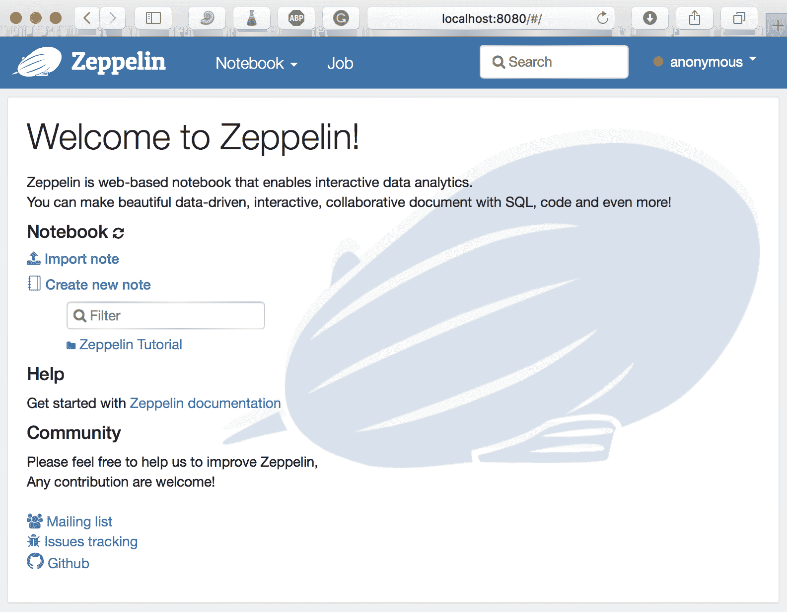

# 测试 Zeppelin

让我们创建一个新的笔记本来测试我们的安装是否正确。

从[`localhost:8080`](http://localhost:8080)主页，点击创建新笔记，并在弹出窗口中将`Demo`设置为名称：

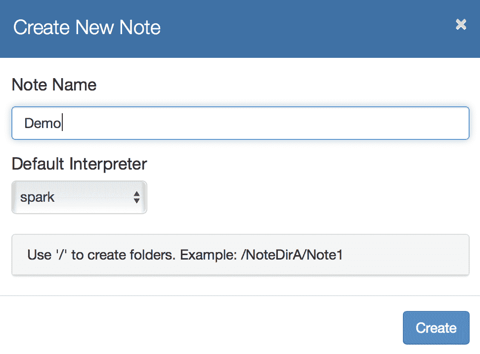

如窗口中所述，默认解释器将是 Spark，这正是我们想要的。现在点击创建。

您刚刚创建了您的第一个笔记本。您应该在浏览器中看到以下内容：

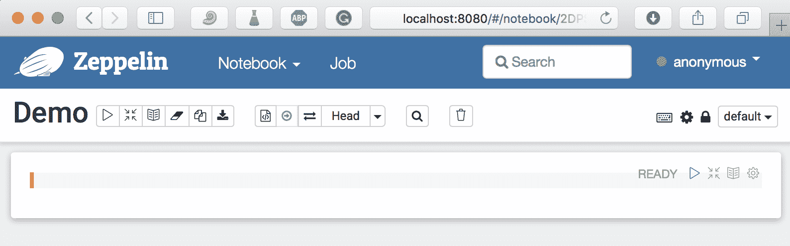

# 笔记本结构

笔记本是一个文档，在其中你可以添加**段落**。每个段落可以使用不同的**解释器**，它与特定的框架或语言交互。

在每个段落中，有两个部分：

+   上面一个是编辑器，你可以在这里输入一些源代码并运行它

+   下面一个是显示结果

如果，例如，你选择使用 Spark 解释器，段落中你写的所有代码都将被解释（就像在第一章，*编写你的第一个程序*中看到的 REPL 一样）。所有定义的变量都将保留在内存中，并与笔记本的所有其他段落共享。类似于 Scala REPL，当你执行它时，执行输出的输出以及定义的变量的类型将在结果部分打印出来。

Zeppelin 默认安装了 Spark、Python、Cassandra、Angular、HDFS、Groovy 和 JDBC 等解释器。

# 编写段落

好吧，我们的第一个笔记本是完全空的！我们可以重用第十章中使用的示例，*使用 Scala 控制台探索 Spark 的 API*部分中的*获取和持久化比特币市场数据*。如果你记得，我们是从字符串序列创建`Dataset`的。在笔记本中输入以下内容：

```java
val dsString = Seq("1", "2", "3").toDS()
dsString.show()
```

然后按`Shift`+`Enter`（或点击 UI 上的播放三角形）。

解释器运行后，你应该看到以下内容：

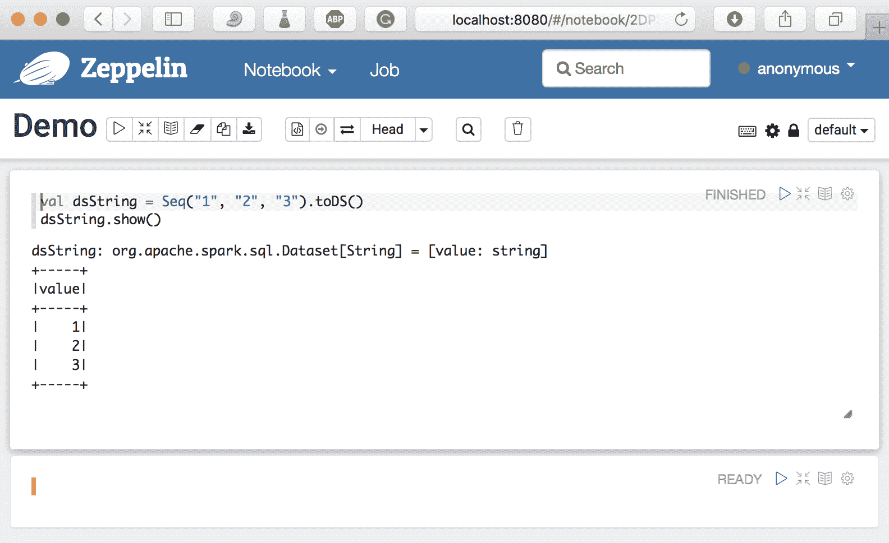

笔记本从序列创建数据集并在段落的输出部分打印出来。

注意，在前一章中，当我们从 Scala 控制台执行此代码时，我们必须创建`SparkSession`并添加一些导入。当我们使用 Zeppelin 中的 Spark 解释器时，所有隐式和导入都是自动完成的，并且`SparkSession`为我们创建。

`SparkSession`以变量名`spark`暴露。例如，你可以在一个段落中使用以下代码获取 Spark 版本：

```java
spark.version
```

执行段落后，你应该在结果部分看到打印的版本：

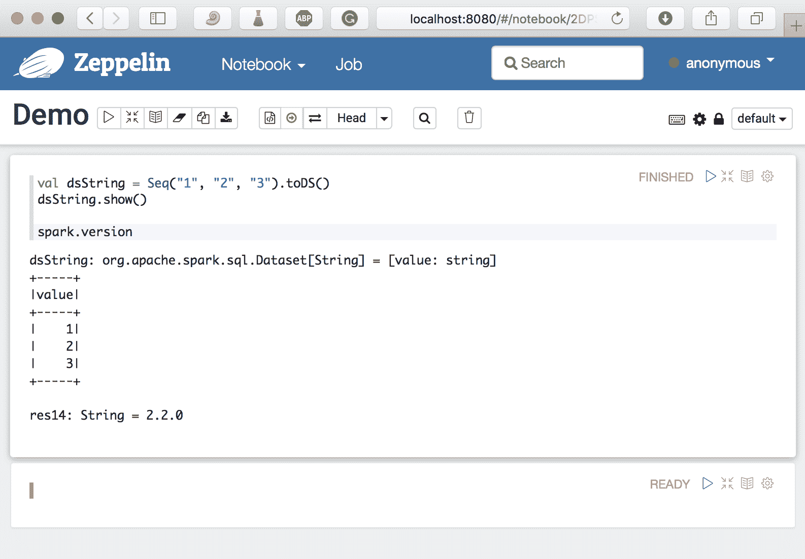

在那个时刻，我们测试了安装，并且它运行正常。

# 绘制图表

在本节中，我们将创建一个基本的`Dataset`并绘制其数据的图表。

在新段落中，添加以下内容：

```java
case class Demo(id: String, data: Int)
val data = List(
   Demo("a",1),
   Demo("a",2),
   Demo("b",8),
   Demo("c",4))
val dataDS = data.toDS()
dataDS.createOrReplaceTempView("demoView")
```

我们定义一个`Demo`类，具有`id`和`data`属性，然后我们创建一个不同的`Demo`对象列表，并将其转换为`Dataset`。

从`dataDS`数据集中，我们调用`.createOrReplaceTempView("demoView")`方法。这个函数将数据集注册为临时视图。有了这个视图定义，我们可以使用 SQL 查询这个数据集。我们可以通过添加一个新段落来尝试它，如下所示：

```java
%sql
select * from demoView
```

新创建的段落以`%sql`开头。这定义了我们使用的解释器。在我们的例子中，这是 Spark SQL 解释器。

查询选择了`demoView`中的所有列。在按下*Shift* + *Enter*之后，以下表格将会显示：

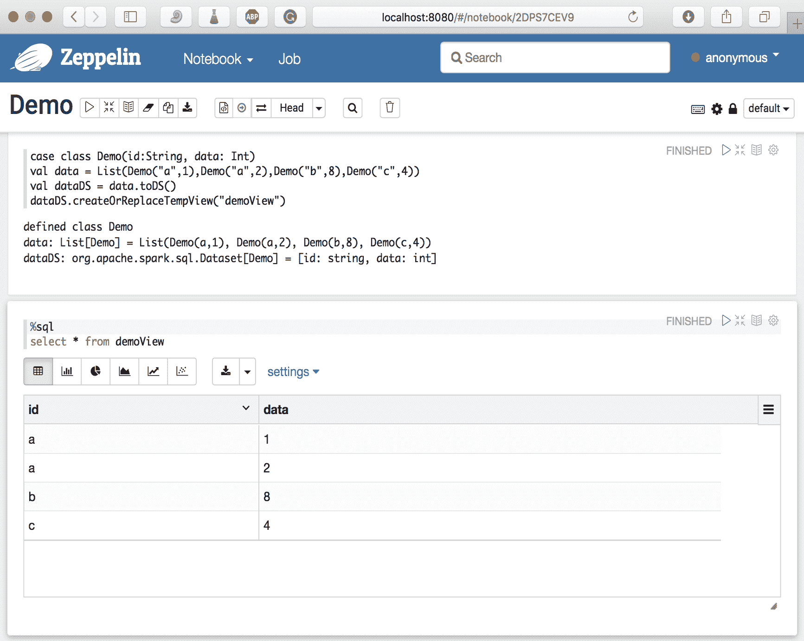

如您所见，SQL 解释器通过在段落的输出部分显示表格来显示查询的结果。

注意表格顶部的菜单。有多种方式来表示数据——柱状图、饼图、面积图、折线图和散点图。

点击柱状图。笔记本现在看起来是这样的：

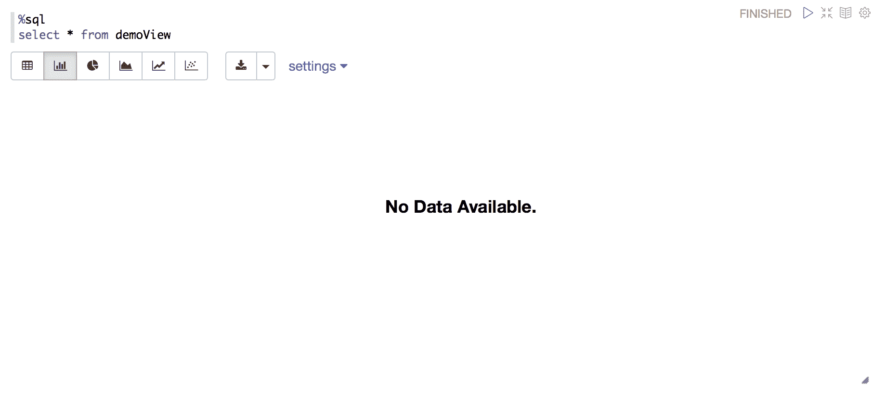

可能看起来有些奇怪，我们没有可用的数据。实际上，我们需要配置图表才能使其工作。点击设置，然后定义哪个列是值列，以及您想要对哪个列进行数据聚合。

将`id`标签拖到`groups`框中，将`data`拖到`values`框中。因为我们选择按 ID 分组，所以执行`data`的`SUM`。配置和更新的图表应该看起来像这样：

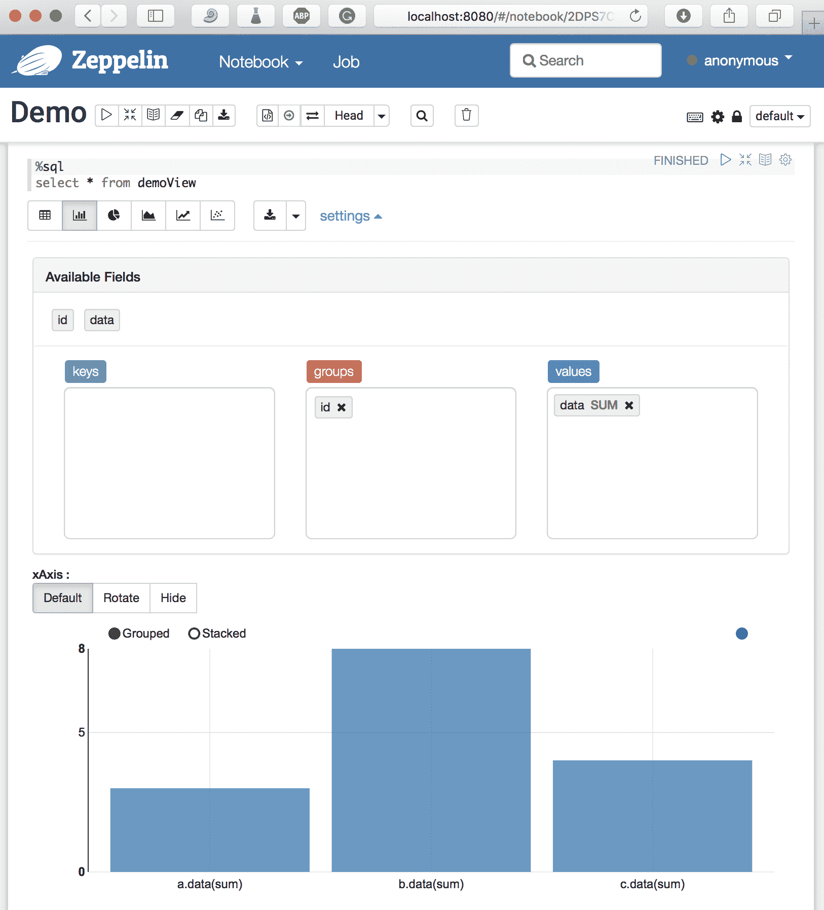

图表现在正确。所有`id` `a`的总和是`3`，`b` `id`的总和是`8`，`c` `id`的总和是`4`。

我们现在对 Zeppelin 足够熟悉，可以对我们上一章产生的比特币交易数据进行分析。

# 使用 Zeppelin 分析交易

在上一章中，我们编写了一个程序，将 BTC/USD 交易保存到 Parquet 文件中。在本节中，我们将使用 Zeppelin 和 Spark 读取这些文件并绘制一些图表。

如果您直接来到这一章，您首先需要设置`bitcoin-analyser`项目，如第十章中所述，*获取和持久化比特币市场数据*。

然后，您可以：

+   运行`BatchProducerAppIntelliJ`。这将保存项目目录下`data`文件夹中最后 24 小时的交易，然后每小时保存新的交易。

+   使用 GitHub 上提交的示例交易数据。您将需要检出此项目：[`github.com/PacktPublishing/Scala-Programming-Projects`](https://github.com/PacktPublishing/Scala-Programming-Projects)。

# 绘制我们的第一个图表

准备好这些 Parquet 文件后，在 Zeppelin 中创建一个新的笔记本，并将其命名为`Batch analytics`。然后在第一个单元格中输入以下内容：

```java
val transactions = spark.read.parquet("<rootProjectPath>/Scala-Programming-Projects/bitcoin-analyser/data/transactions")
z.show(transactions.sort($"timestamp"))
```

第一行从交易文件创建`DataFrame`。您需要将`parquet`函数中的绝对路径替换为您的 Parquet 文件路径。第二行使用特殊的`z`变量以表格形式显示`DataFrame`的内容。这个`z`变量在所有笔记本中自动提供。它的类型是`ZeppelinContext`，允许您与 Zeppelin 渲染器和解释器交互。

使用*Shift* + *Enter*执行单元格。您应该看到以下内容：

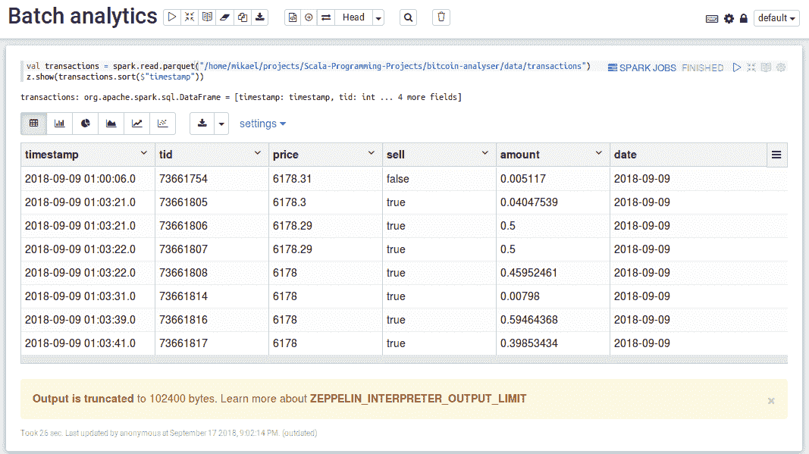

有一个警告信息说输出被截断。这是因为我们检索了太多的数据。如果我们尝试绘制一个图表，一些数据将会缺失。

解决这个问题的方法可以是更改 Zeppelin 的设置并增加限制。但如果我们这样做，浏览器将不得不在内存中保留大量数据，而且保存到磁盘上的笔记本文件也会很大。

一个更好的解决方案是对数据进行聚合。我们无法在图表上显示一天内发生的所有交易，但如果我们可以用`20 分钟`的时间窗口来聚合它们，这将减少要显示的数据点的数量。创建一个新的单元格，并输入以下代码：

```java
val group = transactions.groupBy(window($"timestamp", "20 minutes"))

val tmpAgg = group.agg(
  count("tid").as("count"), 
  avg("price").as("avgPrice"),
  stddev("price").as("stddevPrice"),
  last("price").as("lastPrice"),
  sum("amount").as("sumAmount"))

val aggregate = tmpAgg.select("window.start", "count", "avgPrice", "lastPrice", "stddevPrice", "sumAmount").sort("start").cache()

z.show(aggregate)
```

运行这个新单元格。你应该看到以下输出：

```java
group: org.apache.spark.sql.RelationalGroupedDataset = RelationalGroupedDataset: [grouping expressions: [window: struct<start: timestamp, end: timestamp>], value: [timestamp: timestamp, tid: int ... 4 more fields], type: GroupBy] 

tmpAgg: org.apache.spark.sql.DataFrame = [window: struct<start: timestamp, end: timestamp>, count: bigint ... 4 more fields] 

aggregate: org.apache.spark.sql.Dataset[org.apache.spark.sql.Row] = [start: timestamp, count: bigint ... 4 more fields]
```

这里是对前面代码的进一步描述：

+   首先，我们以`20 分钟`的时间窗口对交易进行分组。在输出中，你可以看到`group`的类型是`RelationalGroupedDataset`。这是一个中间类型，我们必须调用一个聚合方法来生成另一个`DataFrame`。

+   然后我们在`group`上调用`agg`方法一次性计算几个聚合。`agg`方法接受几个`Column`参数作为`vararg`。我们传递的`Column`对象是通过调用`org.apache.spark.sql.functions`对象的各种聚合函数获得的。每个列都被重命名，这样我们就可以在以后轻松地引用它。

+   结果变量`tmpAgg`是一个`DataFrame`，它有一个类型为`struct`的`window`列。`struct`嵌套了几个列。在我们的例子中，它有一个类型为`timestamp`的`start`列和`end`列。`tmpAgg`还包含所有包含聚合的列——`count`、`avgPrice`和`sumAmount`。

+   之后，我们只选择我们感兴趣的列，然后将结果`DataFrame`赋值给变量`aggregate`。注意，我们可以使用`“.”`符号来引用窗口列的嵌套列。在这里，我们选择除了`window.end`之外的所有行。然后我们按升序`start`时间对`DataFrame`进行`sort`，这样我们就可以将`start`作为我们未来图表的*x*轴。最后，我们`cache`这个`DataFrame`，这样 Spark 在创建其他具有不同图表的单元格时就不必重新处理它。

在输出下方，Zeppelin 显示了一个表格，但这次它没有给出任何警告。它能够加载所有数据而不会截断。因此，我们可以绘制一个图表：

+   点击折线图按钮

+   将“开始”列拖放到该部分

+   将`avgPrice`和`lastPrice`拖放到值部分

你应该看到类似这样的：

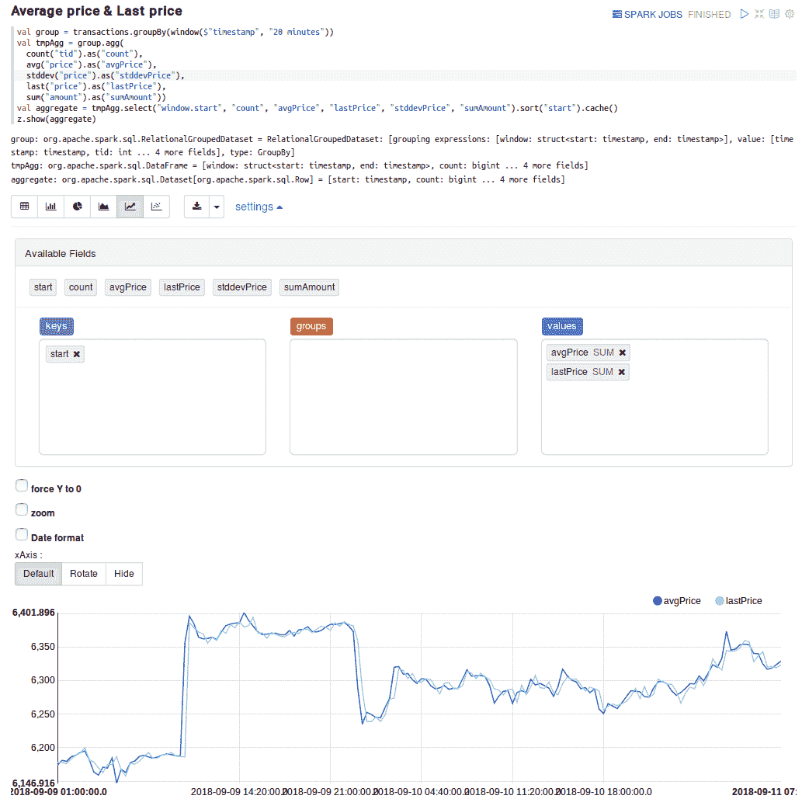

我们可以看到平均价格和最后价格在 20 分钟增量中的演变。

如果你在图表上悬停鼠标，Zeppelin 会显示对应数据点的信息：

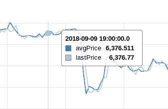

随意尝试不同类型的图表，为*y*轴设置不同的*值*。

# 绘制更多图表

由于我们的`aggregate DataFrame`在作用域内可用，我们可以创建新的单元格来绘制不同的图表。使用以下代码创建两个新的单元格：

```java
%spark
z.show(aggregate)
```

然后，在每个新的单元格上，点击折线图按钮并将`start`列拖到“键”部分。之后：

1.  在第一个图表中，将`sumAmount`拖放到“值”部分。该图表显示了交易量的演变。

1.  在第二个图表中，将`stddevPrice`拖放到“值”部分。该图表显示了标准差的演变。

1.  在两个单元格上点击“设置”以隐藏设置。

1.  在两个单元格上点击“隐藏编辑器”。

你应该得到类似这样的结果：

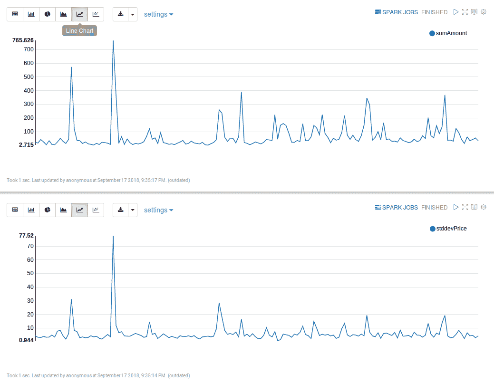

我们可以观察到在相同时间点出现峰值——当交易量激增时，标准差也会激增。这是因为许多大交易显著地移动了价格，从而增加了标准差。

你现在有了运行自己的分析的基本构建块。借助`Dataset` API 的力量，你可以使用`filter`钻取到特定时间段，然后在不同时间段内绘制移动平均线的演变。

我们笔记本的唯一问题是每小时只会得到新的交易。我们在上一章中编写的`BatchProducerApp`不会频繁产生交易，而且如果你每隔几秒就尝试调用 REST API，你将被 Bitstamp 服务器列入黑名单。获取实时交易的最佳方式是使用 WebSocket API。

为了解决这个问题，在下一节中，我们将构建一个名为`StreaminProducerApp`的应用程序，该应用程序将实时交易推送到 Kafka 主题。

# 介绍 Apache Kafka

在上一节“介绍 Lambda 架构”中，我们提到 Kafka 用于流处理。Apache Kafka 是一个高吞吐量的分布式消息系统。它允许解耦进入的数据和出去的数据。

这意味着多个系统（**生产者**）可以向 Kafka 发送消息。然后 Kafka 将这些消息发送给已注册的**消费者**。

Kafka 是分布式、弹性、容错的，并且具有非常低的延迟。Kafka 可以通过向系统中添加更多机器来水平扩展。它是用 Scala 和 Java 编写的。

Kafka 被广泛使用；Airbnb、Netflix、Uber 和 LinkedIn 都使用这项技术。

本章的目的不是让你成为 Kafka 的专家，而是让你熟悉这项技术的 fundamentals。到本章结束时，你将能够理解本章中开发的用例——在 Lambda 架构中流式传输比特币交易。

# 主题、分区和偏移量

为了处理生产者和消费者之间交换的消息，Kafka 定义了三个主要组件——主题、分区和偏移量。

**主题**将相同类型的消息分组用于流式传输。它有一个名称和分区数。你可以有任意多的主题。由于 Kafka 可以在多个节点上分布式部署，它需要一种方法将这些不同节点上的消息流（主题）分割成多个**分区**。每个分区包含发送到主题的消息的一部分。

Kafka 集群中的每个节点管理多个分区。一个特定的分区被分配给多个节点。这样，如果一个节点丢失，可以避免数据丢失，并允许更高的吞吐量。默认情况下，Kafka 使用消息的哈希码将其分配到分区。你可以为消息定义一个键来控制这种行为。

在分区中，消息的顺序是有保证的，一旦消息被写入，就不能更改。消息是**不可变的**。

一个主题可以被零个到多个**消费者**进程消费。Kafka 的一个关键特性是每个消费者可以以自己的速度消费流：一个生产者可以发送消息 120，而一个消费者正在处理消息 40，另一个消费者正在处理消息 100。

这种不对称性是通过将消息存储在磁盘上实现的。Kafka 将消息保留一定时间；默认设置是一周。

内部，Kafka 使用 ID 来跟踪消息，并使用序列号来生成这些 ID。它为每个分区维护一个唯一的序列号。这个序列号被称为**偏移量**。偏移量只对特定的分区有意义。

Kafka 集群中的每个节点运行一个称为**代理**的过程。每个代理管理一个或多个主题的分区。

让我们用一个例子来总结一下。我们可以定义一个名为`shapes`的主题，其分区数等于两个。该主题接收消息，如下面的图所示：

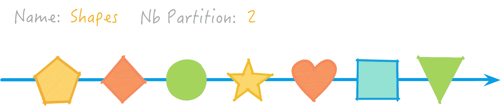

假设我们集群中有三个节点。代理、分区、偏移量和消息的表示如下：

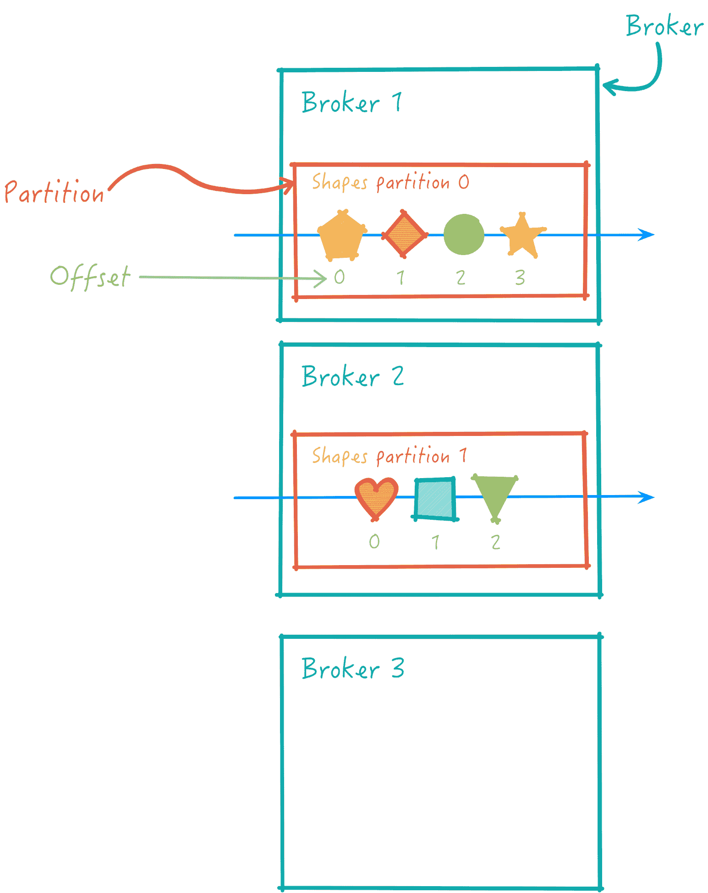

注意，因为我们只定义了两个分区，而我们有三台机器，所以其中一台机器将不会被使用。

当你定义分区时，另一个可用的选项是副本数。为了提高容错性，Kafka 在多个代理中复制数据，这样如果某个代理失败，可以从另一个代理检索数据。

现在，你应该对 Kafka 架构的基本原理更加熟悉了。我们现在将花一点时间讨论两个其他组件：生产者和消费者。

# 将数据生产到 Kafka

在 Kafka 中，将消息发送到主题的组件被称为**生产者**。生产者的责任是通过代理自动选择一个分区来写入消息。在发生故障的情况下，生产者应该自动恢复。

分区选择基于键。生产者将负责将所有具有相同键的消息发送到同一个分区。如果没有提供消息的键，生产者将使用轮询算法进行消息负载均衡。

你可以配置生产者以接收你想要的确认级别。有三个级别：

+   `acks=0`: 生产者发送数据后就会忘记它；不进行任何确认。没有保证，消息可能会丢失。

+   `acks=1`: 生产者等待第一个副本的确认。只要确认的代理没有崩溃，你可以确信不会丢失数据。

+   `acks=all`: 生产者等待所有副本的确认。你可以确信，即使一个代理崩溃，也不会丢失数据。

当然，如果你想要所有副本的确认，你可能会期望更长的延迟。第一个副本（`ack=1`）的确认是在安全性和延迟之间的一种良好折衷。

# 从 Kafka 消费数据

要从主题中读取消息，你需要运行一个**消费者**。与生产者一样，消费者将自动选择读取的代理，并在失败时恢复。

消费者从所有分区读取消息。在分区内部，它保证按它们产生的顺序接收消息。

# 消费者组

你可以在一个**消费者组**中为同一个主题拥有多个消费者。如果你在一个组中有相同数量的消费者和分区，每个消费者只会读取一个分区。这允许并行化消费。如果你有比分区更多的消费者，第一个消费者将获取分区，其余的消费者将处于等待模式。只有在读取分区的消费者失败时，它们才会进行消费。

到目前为止，我们只有一个消费者组正在读取分区。在一个典型的系统中，你会有许多消费者组。例如，在比特币交易的情况下，我们可能有一个消费者组读取消息以执行分析，另一个组用于显示所有交易的用户界面。这两种情况之间的延迟不同，我们不希望每个用例之间有依赖关系。为此目的，Kafka 使用了组的概念。

# 偏移量管理

另一个重要的概念是，当消费者读取一条消息时，它会自动通知 Kafka 已读取的偏移量。这样，如果消费者崩溃，Kafka 就知道最后读取的消息的偏移量。当消费者重新启动时，它可以发送下一条消息。至于生产者，我们可以决定何时提交偏移量。有三个选项：

+   至多一次；一旦收到消息，就提交偏移量。

+   至少一次；消息处理完成后提交偏移量。

+   精确一次；消息处理完成后提交偏移量，并且对生产者有额外的约束——在网络故障的情况下，生产者不得重发消息。生产者必须具有幂等性和事务性能力，这些能力在 Kafka 0.11 中引入。

最常用的选项是 *至少一次*。如果消息的处理失败，你可以重新处理它，但你可能会偶尔接收到相同的消息多次。在 *最多一次* 的情况下，如果在处理过程中出现任何问题，消息将会丢失。

好的，理论就到这里。我们已经了解了主题、分区、偏移量、消费者和生产者。最后缺失的知识点是一个简单的问题——我如何将我的生产者或消费者连接到 Kafka？

# 连接到 Kafka

在 *主题、分区和偏移量* 这一部分，我们介绍了代理的概念。代理部署在多台机器上，所有代理共同构成了我们所说的 Kafka 集群。

如果你想要连接到 Kafka 集群，你所需要知道的就是其中一个代理的地址。所有代理都知道集群的所有元数据——代理、分区和主题。内部，Kafka 使用一个名为 **Zookeeper** 的产品。这允许代理之间共享所有这些元数据。

# 将事务流式传输到 Kafka

在本节中，我们将编写一个程序来生成实时 BTC/USD 交易的流。我们的程序将：

1.  订阅 Bitstamp 的 WebSocket API 以获取 JSON 格式的交易流。

1.  对于流中进入的每个事务，它将：

    +   反序列化它

    +   转换为我们在上一章的 `BatchProducer` 中使用的相同的 `Transaction` case class

    +   序列化它

    +   将其发送到 Kafka 主题

在下一节中，我们将再次使用 Zeppelin 和 Spark Streaming 来查询流式传输到 Kafka 主题的数据。

# 使用 Pusher 订阅

前往 Bitstamp 的 WebSocket API 以获取实时交易：[`www.bitstamp.net/websocket/`](https://www.bitstamp.net/websocket/)。

你会看到这个 API 使用一个名为 Pusher channels 的工具进行实时 WebSocket 流式传输。API 文档提供了我们需要使用的 Pusher Key 来接收实时交易。

**Pusher** channels 是一个托管解决方案，用于使用发布/订阅模式发送消息流。你可以在他们的网站上了解更多信息：[`pusher.com/features`](https://pusher.com/features)。

让我们尝试使用 Pusher 接收一些实时的 BTC/USD 交易。打开项目 `bitcoin-analyser`，启动一个新的 Scala 控制台，并输入以下内容：

```java
import com.pusher.client.Pusher
import com.pusher.client.channel.SubscriptionEventListener

val pusher = new Pusher("de504dc5763aeef9ff52")
pusher.connect()
val channel = pusher.subscribe("live_trades")

channel.bind("trade", new SubscriptionEventListener() {
  override def onEvent(channel: String, event: String, data: String): 
    Unit = {
      println(s"Received event: $event with data: $data")
  }
})
```

让我们详细看看：

1.  在第一行，我们使用在 Bitstamp 文档中指定的密钥创建 Pusher 客户端。

1.  然后我们连接到远程 Pusher 服务器并订阅 `"live_trades"` 通道。我们获得一个 `channel` 类型的对象。

1.  最后，我们使用 `channel` 注册（绑定）一个回调函数，每当 `channel` 收到名为 `trade` 的新事件时，该函数将被调用。

几秒钟后，您应该会看到一些交易被打印出来：

```java
Received event: trade with data: {"amount": 0.001, "buy_order_id": 2165113017, "sell_order_id": 2165112803, "amount_str": "0.00100000", "price_str": "6433.53", "timestamp": "1537390248", "price": 6433.5299999999997, "type": 0, "id": 74263342}
Received event: trade with data: {"amount": 0.0089460000000000008, "buy_order_id": 2165113493, "sell_order_id": 2165113459, "amount_str": "0.00894600", "price_str": "6433.42", "timestamp": "1537390255", "price": 6433.4200000000001, "type": 0, "id": 74263344}
(...)
```

数据以 JSON 格式存储，其模式符合 Bitstamp 的 WebSocket 文档中定义的模式。

通过这几行代码，我们可以编写我们应用程序的第一个构建块。在 `src/main/scala` 中的 `coinyser` 包下创建一个新的对象，名为 `StreamingProducerApp`，内容如下：

```java
package coinyser

import java.sql.Timestamp
import java.text.SimpleDateFormat
import java.util.TimeZone

import cats.effect.IO
import com.fasterxml.jackson.databind.ObjectMapper
import com.fasterxml.jackson.module.scala.DefaultScalaModule
import com.pusher.client.Client
import com.pusher.client.channel.SubscriptionEventListener
import com.typesafe.scalalogging.StrictLogging

object StreamingProducer extends StrictLogging {

  def subscribe(pusher: Client)(onTradeReceived: String => Unit):   
   IO[Unit] =
      for {
        _ <- IO(pusher.connect())
        channel <- IO(pusher.subscribe("live_trades"))

        _ <- IO(channel.bind("trade", new SubscriptionEventListener() {
          override def onEvent(channel: String, event: String, data: 
            String): Unit = {
              logger.info(s"Received event: $event with data: $data")
                onTradeReceived(data)
           }
         }))
      } yield ()
}
```

我们的 `subscribe` 函数接受一个 `Pusher` 实例（类型为 `Client`）和一个回调函数 `onTradeReceived`，并返回 `IO[Unit]`。当 `IO` 运行时，它将在每次收到新的交易时调用 `onTradeReceived`。实现与我们在控制台中输入的几行代码类似。它基本上将每个副作用函数包装在 `IO` 中。

为了简洁性和可读性，我们没有公开此函数的单元测试细节。您可以在 GitHub 仓库中查看它。

为了编写测试，我们不得不创建一个实现 `Client` 接口几个方法的 `FakePusher` 类。

# 反序列化实时交易

当我们订阅实时交易时收到的 JSON 负载数据与我们在 REST 端点获取批量交易时拥有的数据略有不同。

在我们能够将其转换为与上一章中使用的相同的 `Transaction` case class 之前，我们需要将其反序列化为 case class。为此，首先在 `src/main/scala` 中创建一个新的 case class `coinyser.WebsocketTransaction`：

```java
package coinyser

case class WebsocketTransaction(amount: Double,
                                buy_order_id: Long,
                                sell_order_id: Long,
                                amount_str: String,
                                price_str: String,
                                timestamp: String,
                                price: Double,
                                `type`: Int,
                                id: Int)
```

属性的名称和类型与 JSON 属性相对应。

之后，我们可以为一个新的函数 `deserializeWebsocketTransaction` 编写单元测试。在 `src/test/scala` 中创建一个新的类 `coinyser.StreamingProducerSpec`：

```java
package coinyser

import java.sql.Timestamp
import coinyser.StreamingProducerSpec._
import org.scalactic.TypeCheckedTripleEquals
import org.scalatest.{Matchers, WordSpec}

class StreamingProducerSpec extends WordSpec with Matchers with TypeCheckedTripleEquals {
  "StreamingProducer.deserializeWebsocketTransaction" should {
    "deserialize a valid String to a WebsocketTransaction" in {
      val str =
        """{"amount": 0.045318270000000001, "buy_order_id": 1969499130,
          |"sell_order_id": 1969495276, "amount_str": "0.04531827",
          |"price_str": "6339.73", "timestamp": "1533797395",
          |"price": 6339.7299999999996, "type": 0, "id": 
          71826763}""".stripMargin
      StreamingProducer.deserializeWebsocketTransaction(str) should
        ===(SampleWebsocketTransaction)
    }
  }
}

object StreamingProducerSpec {
  val SampleWebsocketTransaction = WebsocketTransaction(
    amount = 0.04531827, buy_order_id = 1969499130, sell_order_id = 
    1969495276, amount_str = "0.04531827", price_str = "6339.73",     
    timestamp = "1533797395", price = 6339.73, `type` = 0, id =     
    71826763)
}
```

测试很简单——我们定义一个样本 JSON 字符串，调用 `test` 下的函数，并确保反序列化的对象 `SampleWebsocketTransaction` 包含相同的值。

现在我们需要实现这个函数。向 `StreamingProducer` 对象添加一个新的 `val mapper: ObjectMapper` 和一个新的函数 `deserializeWebsocketTransaction`：

```java
package coinyser

import java.sql.Timestamp
import java.text.SimpleDateFormat
import java.util.TimeZone

import cats.effect.IO
import com.fasterxml.jackson.databind.ObjectMapper
import com.fasterxml.jackson.module.scala.DefaultScalaModule
import com.pusher.client.Client
import com.pusher.client.channel.SubscriptionEventListener
import com.typesafe.scalalogging.StrictLogging

object StreamingProducer extends StrictLogging {

  def subscribe(pusher: Client)(onTradeReceived: String => Unit): 
  IO[Unit] =
    ...

  val mapper: ObjectMapper = {
    val m = new ObjectMapper()
    m.registerModule(DefaultScalaModule)
    val sdf = new SimpleDateFormat("yyyy-MM-dd HH:mm:ss")
    sdf.setTimeZone(TimeZone.getTimeZone("UTC"))
    m.setDateFormat(sdf)
  }

  def deserializeWebsocketTransaction(s: String): WebsocketTransaction 
   = {
        mapper.readValue(s, classOf[WebsocketTransaction])
  }
}
```

对于这个项目部分，我们使用 **Jackson** Java 库来反序列化/序列化 JSON 对象。这是 Spark 在从/向 JSON 读取/写入 dataframe 时在底层使用的库。因此，它无需添加任何更多依赖项即可使用。

我们定义一个常量 `mapper: ObjectMapper`，它是 Jackson 序列化/反序列化类的入口点。我们将其配置为以与 Spark 可以解析的格式写入时间戳。这将在我们使用 Spark 读取 Kafka 主题时变得必要。然后函数的实现调用 `readValue` 将 JSON 反序列化为 `WebsocketTransaction`。

# 转换为交易并序列化

我们能够监听实时交易并将它们反序列化为`WebsocketTransaction`类型的对象。下一步是：

+   将这些`WebsocketTransaction`对象转换为我们在上一章中定义的相同案例类`Transaction`。

+   将这些`Transaction`对象发送到 Kafka 主题。但为此，它们需要先进行序列化。最简单的方法是将它们序列化为 JSON。

如往常一样，我们首先编写测试。将以下测试添加到`StreamingProducerSpec`：

```java
class StreamingProducerSpec extends WordSpec with Matchers with TypeCheckedTripleEquals {

  "StreamingProducer.deserializeWebsocketTransaction" should {...}

  "StreamingProducer.convertTransaction" should {
    "convert a WebSocketTransaction to a Transaction" in {  
      StreamingProducer.convertWsTransaction
      (SampleWebsocketTransaction) should
        ===(SampleTransaction)
    }
  }

  "StreamingProducer.serializeTransaction" should {
    "serialize a Transaction to a String" in {
      StreamingProducer.serializeTransaction(SampleTransaction) should
        ===(SampleJsonTransaction)
    }
  }
}

object StreamingProducerSpec {
  val SampleWebsocketTransaction = WebsocketTransaction(...)

  val SampleTransaction = Transaction(
    timestamp = new Timestamp(1533797395000L), tid = 71826763,
    price = 6339.73, sell = false, amount = 0.04531827)

  val SampleJsonTransaction =
    """{"timestamp":"2018-08-09 06:49:55",
      |"date":"2018-08-09","tid":71826763,"price":6339.73,"sell":false,
      |"amount":0.04531827}""".stripMargin
}
```

`convertWsTransaction`的测试检查一旦转换，`SampleWebsocketTransaction`与`SampleTransaction`相同。

`serializeTransaction`的测试检查一旦序列化，`SampleTransaction`与`SampleJsonTransaction`相同。

这两个函数的实现很简单。在`StreamingProducer`中添加以下定义：

```java
object StreamingProducer extends StrictLogging {

  def subscribe(pusher: Client)(onTradeReceived: String => Unit): 
    IO[Unit] = ...

  val mapper: ObjectMapper = {...}

  def deserializeWebsocketTransaction(s: String): WebsocketTransaction 
   = {...}

  def convertWsTransaction(wsTx: WebsocketTransaction): Transaction =
    Transaction(
      timestamp = new Timestamp(wsTx.timestamp.toLong * 1000), tid = 
        wsTx.id, price = wsTx.price, sell = wsTx.`type` == 1, amount = 
        wsTx.amount)

  def serializeTransaction(tx: Transaction): String = 
    mapper.writeValueAsString(tx)
}
```

在`convertWsTransaction`中，我们必须将时间戳乘以 1,000 以获得毫秒时间。其他属性只是复制。

在`serializeTransaction`中，我们重用`mapper`对象将`Transaction`对象序列化为 JSON。

# 将所有这些放在一起

现在我们有了创建应用程序的所有构建块。创建一个新的对象`coinyser.StreamingProducerApp`，并输入以下代码：

```java
package coinyser

import cats.effect.{ExitCode, IO, IOApp}
import com.pusher.client.Pusher
import StreamingProducer._
import org.apache.kafka.clients.producer.{KafkaProducer, ProducerRecord}
import scala.collection.JavaConversions._

object StreamingProducerApp extends IOApp {
  val topic = "transactions"

  val pusher = new Pusher("de504dc5763aeef9ff52")

  val props = Map(
    "bootstrap.servers" -> "localhost:9092",
    "key.serializer" -> 
    "org.apache.kafka.common.serialization.IntegerSerializer",
    "value.serializer" -> 
    "org.apache.kafka.common.serialization.StringSerializer")

  def run(args: List[String]): IO[ExitCode] = {
    val kafkaProducer = new KafkaProducerInt, String

    subscribe(pusher) { wsTx =>
      val tx = convertWsTransaction(deserializeWebsocket
      Transaction(wsTx))
      val jsonTx = serializeTransaction(tx)
      kafkaProducer.send(new ProducerRecord(topic, tx.tid, jsonTx))
    }.flatMap(_ => IO.never)
  }
}
```

我们的对象扩展了`cats.IOApp`，因此我们必须实现一个返回`IO[ExitCode]`的`run`函数。

在`run`函数中，我们首先创建`KafkaProducer[Int, String]`。这个来自 Kafka 客户端库的 Java 类将允许我们向一个主题发送消息。第一个类型参数是消息键的类型。我们的消息键将是`Transaction`案例类中的`tid`属性，其类型为`Int`。第二个类型参数是消息本身的类型。在我们的例子中，我们使用`String`，因为我们打算将消息序列化为 JSON。如果存储空间是一个关注点，我们可以使用`Array[Byte]`和如 Avro 的二进制序列化格式。

传递给构造`KafkaProducer`的`props Map`包含与 Kafka 集群交互的各种配置选项。在我们的程序中，我们传递最小集的属性，并将其他属性保留为默认值，但还有许多更多的微调选项。您可以在以下位置了解更多信息：[`kafka.apache.org/documentation.html#producerconfigs`](http://kafka.apache.org/documentation.html#producerconfigs)。

然后我们调用我们之前实现的`StreamingProducer.subscribe`函数，并传递一个回调函数，每次我们收到新的交易时都会调用该函数。这个匿名函数将：

1.  将 JSON 反序列化为`WebsocketTransaction`。

1.  将`WebsocketTransaction`转换为`Transaction`。

1.  将`Transaction`序列化为 JSON。

1.  使用`kafkaProducer.send`将 JSON 交易发送到 Kafka 主题。为此，我们必须创建`ProducerRecord`，它包含主题名称、键和消息内容。

`subscribe` 函数返回 `IO[Unit]`。这将启动一个后台线程，并在我们运行它时立即完成。但我们不想立即停止主线程；我们需要让我们的程序永远运行。这就是为什么我们使用 `flatMap` 并返回 `IO.never`，这将使主线程运行直到我们杀死进程。

# 运行 StreamingProducerApp

在运行我们的应用程序之前，我们需要启动一个 Kafka 集群。为了简化，我们将在你的工作站上启动单个代理。如果你希望设置一个多节点集群，请参阅 Kafka 文档：

1.  从此 URL 下载 Kafka 0.10.2.2：[`www.apache.org/dyn/closer.cgi?path=/kafka/1.1.1/kafka_2.11-1.1.1.tgz`](https://www.apache.org/dyn/closer.cgi?path=/kafka/1.1.1/kafka_2.11-1.1.1.tgz)。我们使用 1.1.1 版本，因为我们写作时已经与 `spark-sql-kafka-0.10` 库进行了测试。你可以使用 Kafka 的较新版本，但无法保证旧的 Kafka 客户端总能与较新的代理通信。

1.  打开一个控制台，然后在你的喜欢的目录中解压缩包：

    `tar xfvz kafka*.tgz`.

1.  前往安装目录并启动 Zookeeper：

```java
cd kafka_2.11-1.1.1
bin/zookeeper-server-start.sh config/zookeeper.properties
```

你应该看到大量的日志输出。最后一行应该包含 `INFO binding to port 0.0.0.0/0.0.0.0:2181`。

1.  打开一个新的控制台，并启动 Kafka 服务器：

```java
cd kafka_2.11-1.1.1
bin/kafka-server-start.sh config/server.properties
```

你应该在最后一行看到一些日志。

1.  一旦 Kafka 启动，打开一个新的控制台并运行以下命令：

```java
cd kafka_2.11-1.1.1
bin/kafka-console-consumer.sh --bootstrap-server localhost:9092 --topic transactions –from-beginning
```

此命令启动一个控制台消费者，监听 `transactions` 主题。任何发送到此主题的消息都将打印在控制台上。这将允许我们测试我们的程序是否按预期工作。

1.  现在在 IntelliJ 中运行 `StreamingProducerApp`。几秒钟后，你应该在 IntelliJ 中得到类似以下的输出：

```java
18/09/22 17:30:41 INFO StreamingProducer$: Received event: trade with data: {"amount": 0.019958119999999999, "buy_order_id": 2180038294, "sell_order_id": 2180031836, "amount_str": "0.01995812", "price_str": "6673.66", "timestamp": "1537633840", "price": 6673.6599999999999, "type": 0, "id": 74611373}
```

我们的应用程序从 WebSocket API 接收了一些消息并将它们发送到 Kafka 主题 transactions。

1.  如果你然后回到启动控制台消费者的控制台，你应该看到新的 `Transaction` 序列化对象实时打印出来：

```java
{"timestamp":"2018-09-22 16:30:40","date":"2018-09-22","tid":74611373,"price":6673.66,"sell":false,"amount":0.01995812}
```

这表明我们的流式应用程序按预期工作。它监听 Pusher 通道以接收 BTC/USD 交易，并将接收到的所有内容发送到 Kafka 主题 `transactions`。现在我们已经有一些数据发送到 Kafka 主题，我们可以使用 Spark Streaming 来运行一些分析查询。

# 介绍 Spark Streaming

在 第十章 10，*获取和持久化比特币市场数据*，我们使用 Spark 以批处理模式保存交易。当你必须一次性对大量数据进行分析时，批处理模式是可行的。

但在某些情况下，你可能需要处理数据进入系统时的数据。例如，在一个交易系统中，你可能想分析经纪人完成的所有交易以检测欺诈交易。你可以在市场关闭后以批量模式执行此分析；但在这种情况下，你只能在事后采取行动。

Spark Streaming 允许你通过将输入数据划分为许多微批次来消费流式源（文件、套接字和 Kafka 主题）。每个微批次都是一个可以由**Spark 引擎**处理的 RDD。Spark 使用时间窗口来划分输入数据。因此，如果你定义了一个 10 秒的时间窗口，那么 Spark Streaming 将每 10 秒创建并处理一个新的 RDD：

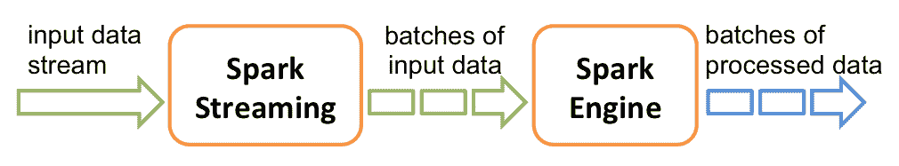

回到我们的欺诈检测系统，通过使用 Spark Streaming，我们可以在欺诈交易出现时立即检测到其模式，并在代理上采取行动以限制损害。

在上一章中，你了解到 Spark 提供了两个用于处理批量数据的 API——RDD 和`Dataset`。RDD 是原始和核心 API，而`Dataset`是较新的一个，它允许执行 SQL 查询并自动优化执行计划。同样，Spark Streaming 提供了两个 API 来处理数据流：

+   **离散流**（**DStream**）基本上是一系列连续的 RDD。DStream 中的每个 RDD 都包含一定时间间隔内的数据。你可以在这里了解更多信息：[`spark.apache.org/docs/latest/streaming-programming-guide.html`](https://spark.apache.org/docs/latest/streaming-programming-guide.html)。

+   **结构化流**是较新的。它允许你使用与 Dataset API 相同的方法。区别在于在`Dataset`中，你操作的是一个随着新输入数据到达而增长的未绑定表。你可以在这里了解更多信息：[`spark.apache.org/docs/latest/structured-streaming-programming-guide.html`](https://spark.apache.org/docs/latest/structured-streaming-programming-guide.html)。

在下一节中，我们将使用 Zeppelin 在之前在 Kafka 主题中产生的 BTC/USD 交易数据上运行一个 Spark 结构化流查询。

# 使用 Zeppelin 分析流式交易

到目前为止，如果你还没有这样做，你应该在你的机器上启动以下进程。如果你不确定如何启动它们，请参考前面的章节：

+   Zookeeper

+   Kafka 代理

+   `StreamingProducerApp`正在消费实时 BTC/USD 交易并将其推送到名为`transactions`的 Kafka 主题。

+   Apache Zeppelin

# 从 Kafka 读取交易

使用你的浏览器，创建一个名为`Streaming`的新 Zeppelin 笔记本，然后在第一个单元中输入以下代码：

```java
case class Transaction(timestamp: java.sql.Timestamp,
                       date: String,
                       tid: Int,
                       price: Double,
                       sell: Boolean,
                       amount: Double)
val schema = Seq.empty[Transaction].toDS().schema
```

执行单元格以定义`Transaction`类和变量`schema`。由于 Zeppelin 无法访问我们的 IntelliJ 项目`bitcoin-analyser`中的类，我们必须在 Zeppelin 中重新定义`Transaction`case 类。我们本可以打包一个`.jar`文件并将其添加到 Zeppelin 的依赖设置中，但由于我们只需要这个类，我们发现重新定义它更容易。`schema`变量是`DataType`类型。我们将在下一段中使用它来反序列化从 Kafka 主题中消费的 JSON 事务。

然后在下面创建一个新的单元格，并使用以下代码：

```java
val dfStream = {
  spark.readStream.format("kafka")
  .option("kafka.bootstrap.servers", "localhost:9092")
  .option("startingoffsets", "latest")
  .option("subscribe", "transactions")
  .load()
  .select(
    from_json(col("value").cast("string"), schema)
      .alias("v")).select("v.*").as[Transaction]
}
```

这创建了一个类型为`DataFrame`的新变量`dfStream`。为了创建这个，我们调用了：

+   在`spark: SparkSession`对象上的`readStream`方法。它返回一个`DataStreamReader`类型的对象，我们可以进一步配置它。

+   方法`format("kafka")`和`option("kafka.bootstrap.servers", "localhost:9092")`指定我们想要从 Kafka 读取数据，并指向端口`9092`上的本地主机代理。

+   `option("startingoffsets", "latest")`表示我们只想从最新偏移量处消费数据。其他选项是`"earliest"`，或一个 JSON 字符串，指定每个`TopicPartition`的起始偏移量。

+   `option("subscribe", "transaction")`指定我们想要监听主题`transactions`。这是我们`StreamingProducerApp`中使用的主题名称。

+   `load()`调用返回`DataFrame`。但在这一阶段，它只包含一个包含原始 JSON 的`value`列。

+   我们随后使用`from_json`函数和上一段中创建的`schema`对象反序列化 JSON。这返回一个类型为`struct`的单列。为了使所有列都在根级别，我们使用`alias("v")`重命名列，并使用`select("v.*")`选择其内部的所有列。

当你运行段落时，你会得到以下输出：

```java
dfStream: org.apache.spark.sql.DataFrame = [timestamp: timestamp, date: string ... 4 more fields]
```

到目前为止，我们有一个包含所有我们需要进一步分析的列的`DataFrame`，对吗？让我们尝试显示它。创建一个新的段落并运行以下代码：

```java
z.show(dfStream)
```

你应该看到以下错误：

```java
java.lang.RuntimeException: java.lang.reflect.InvocationTargetException at org.apache.zeppelin.spark.SparkZeppelinContext.showData(SparkZeppelinContext.java:112) at org.apache.zeppelin.interpreter.BaseZeppelinContext.show(BaseZeppelinContext.java:238) at org.apache.zeppelin.interpreter.BaseZeppelinContext.show(BaseZeppelinContext.java:224) ... 52 elided Caused by: java.lang.reflect.InvocationTargetException: org.apache.spark.sql.AnalysisException: Queries with streaming sources must be executed with writeStream.start();;
```

这里的问题是缺少一个写入步骤。尽管`DataFrame`类型与我们从`Batch`笔记本中获得的确切相同，但我们不能以完全相同的方式使用它。我们创建了一个可以消费和转换来自 Kafka 的消息的流式`DataFrame`，但它应该对这些消息做什么呢？

在 Spark 结构化流世界中，不能使用`show`、`collect`或`take`等操作方法。你必须告诉 Spark 它消费的数据应该写入哪里。

# 写入内存中的接收器

Spark 结构化流处理过程有三个类型的组件：

+   **输入源**通过在`DataStreamReader`上调用`format(source: String)`方法进行指定。这个源可以是文件、Kafka 主题、网络套接字或恒定速率。一旦通过`option`配置，调用`load()`将返回一个`DataFrame`。

+   **操作**是经典的`DataFrame`/`Dataset`转换，例如`map`、`filter`、`flatMap`和`reduce`。它们以`Dataset`作为输入，并返回另一个带有记录转换的转换后的`Dataset`。

+   **输出目标**会将转换后的数据写入。为了指定目标，我们首先需要通过在`Dataset`上调用`writeStream`方法来获取`DataStreamWriter`，然后进行配置。为此，我们必须在`DataStreamWriter`上调用`format(source: String)`方法。输出目标可以是文件、Kafka 主题或接受回调的`foreach`。为了调试目的，还有一个控制台目标和一个内存目标。

回到我们的流交易，我们在调用`z.show(dfStream)`后获得的错误表明我们缺少`DataFrame`的目标。为了解决这个问题，添加一个包含以下代码的新段落：

```java
val query = {
  dfStream
    .writeStream
    .format("memory")        
    .queryName("transactionsStream")
    .outputMode("append")
    .start()
}
```

这段代码为我们的`DataFrame`配置了一个内存目标。这个目标创建了一个名为`queryName("transactionsStream")`的内存 Spark 表。每当处理一个新的交易微批处理时，名为`transactionsStream`的表将被更新。

有几种写入流目标的方法，由`outputMode(outputMode: String)`指定：

+   `"append"`表示只有新行会被写入目标。

+   `"complete"`会在每次更新时写入所有行。

+   `"update"`将写入所有被更新的行。这在执行一些聚合操作时很有用；例如，计算消息数量。你希望每次有新行进入时，新的计数都会更新。

一旦我们的`DataStreamWriter`配置完成，我们调用`start()`方法。这将启动整个工作流程在后台运行。只有从这个点开始，数据才开始从 Kafka 主题中被消费并写入内存表。所有之前的操作都是懒加载的，只是配置工作流程。

现在运行这个段落，你将看到一个类似以下的输出：

```java
query: org.apache.spark.sql.streaming.StreamingQuery = org.apache.spark.sql.execution.streaming.StreamingQueryWrapper@3d9dc86a
```

这个`StreamingQuery`对象是后台运行中的流查询的句柄。你可以用它来监控流工作流程的进度，获取一些关于其执行计划的信息，或者完全`stop`它。请随意探索`StreamingQuery`的 API 并尝试调用其方法。

# 绘制散点图

由于我们有一个写入名为`transactionsStream`的内存表的运行中的`StreamingQuery`，我们可以使用以下段落显示这个表中的数据：

```java
z.show(spark.table("transactionsStream").sort("timestamp"))
```

运行这个段落，如果你有交易进入你的 Kafka 主题，你应该会看到一个类似以下的表格：

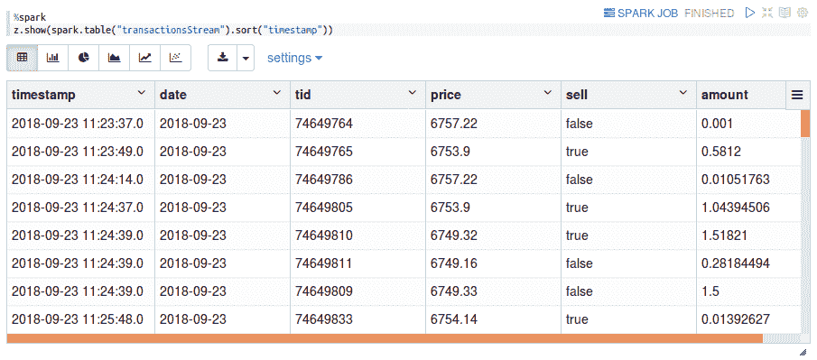

然后，你可以点击散点图按钮。如果你想绘制价格的变化，你可以将`timestamp`拖放到*x*轴上，将`price`拖放到*y*轴上。你应该看到类似这样的：

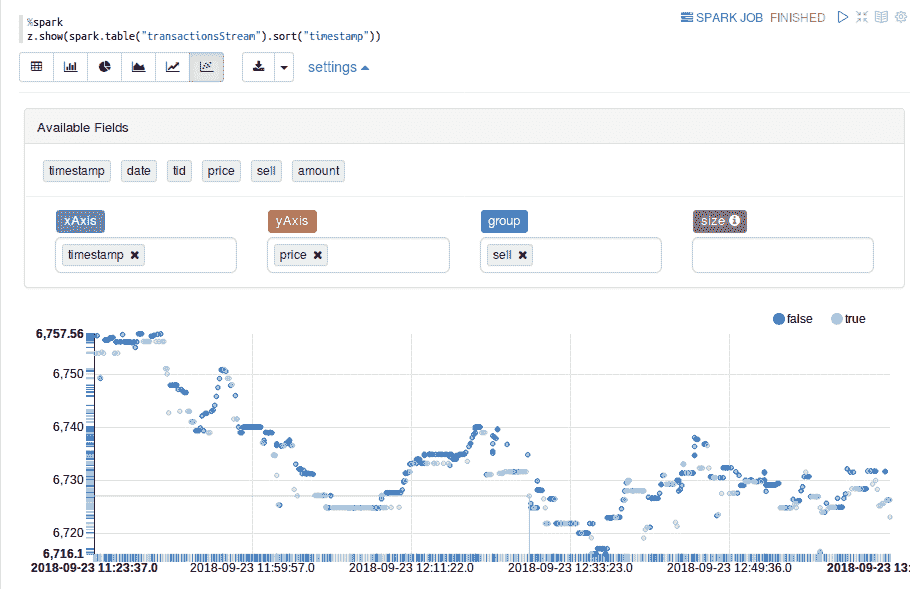

如果你想要用最新的交易刷新图表，你只需重新运行这个段落。

这看起来相当不错，但如果让查询运行一段时间，你可能会得到相当多的交易。最终，你将达到 Zeppelin 可以处理的极限，并且你会得到与*绘制第一个图表*部分相同的错误，`OUTPUT IS TRUNCATED`。

为了解决这个问题，我们必须使用时间窗口对交易进行分组，就像我们对从`parquet`读取的批交易所做的那样。

# 聚合流式交易

使用以下代码添加一个新的段落：

```java
val aggDfStream = { 
  dfStream
    .withWatermark("timestamp", "1 second")
    .groupBy(window($"timestamp", "10 seconds").as("window"))
    .agg(
      count($"tid").as("count"), 
      avg("price").as("avgPrice"),
      stddev("price").as("stddevPrice"),
      last("price").as("lastPrice"),
      sum("amount").as("sumAmount")
    )
    .select("window.start", "count", "avgPrice", "lastPrice", 
    "stddevPrice", "sumAmount")
}
```

这段代码与我们*绘制第一个图表*部分所写的是非常相似的。唯一的区别是调用了`withWatermark`，但其余的代码是相同的。这是使用 Spark 结构化流的一个主要好处——我们可以重用相同的代码来转换批数据集和流数据集。

当我们聚合流数据集时，水印是强制性的。简单来说，我们需要告诉 Spark 在丢弃之前它将等待多长时间以接收迟到数据，以及它应该使用哪个时间戳列来衡量两行之间的时间。

由于 Spark 是分布式的，它可以使用多个消费者潜在地消费 Kafka 主题，每个消费者消费主题的不同分区。这意味着 Spark Streaming 可以潜在地以乱序处理交易。在我们的案例中，我们只有一个 Kafka 代理，并且不期望有大量的交易；因此，我们使用一秒的低水印。水印是一个相当复杂的话题。你可以在 Spark 网站上找到更多信息：[`spark.apache.org/docs/2.3.1/structured-streaming-programming-guide.html#window-operations-on-event-time`](https://spark.apache.org/docs/2.3.1/structured-streaming-programming-guide.html#window-operations-on-event-time)。

一旦运行了这个新段落，你将得到一个新的 `Dataframe`，`aggDfStream`，它将在 10 秒的窗口内聚合交易。但在我们能够绘制这个聚合数据的图表之前，我们需要创建一个查询来连接一个内存中的接收器。使用以下代码创建一个新的段落：

```java
val aggQuery = {
  aggDfStream
    .writeStream
    .format("memory")
    .queryName("aggregateStream")
    .outputMode("append")
    .start()
}
```

这几乎与我们在*绘制散点图*部分所写的是一样的。我们只是用`aggDfStream`代替了`df`，并且输出表名现在称为`aggregateStream`。

最后，添加一个新的段落来显示`aggregateStream`表中的数据：

```java
z.show(spark.table("aggregateStream").sort("start")
```

你需要在运行`aggQuery`后至少等待 30 秒才能获取一些聚合的交易数据。稍等片刻，然后运行段落。之后，点击折线图按钮，然后将`start`列拖放到 keys 部分，将`avgPrice`拖放到 values 部分。你应该会看到一个看起来像这样的图表：

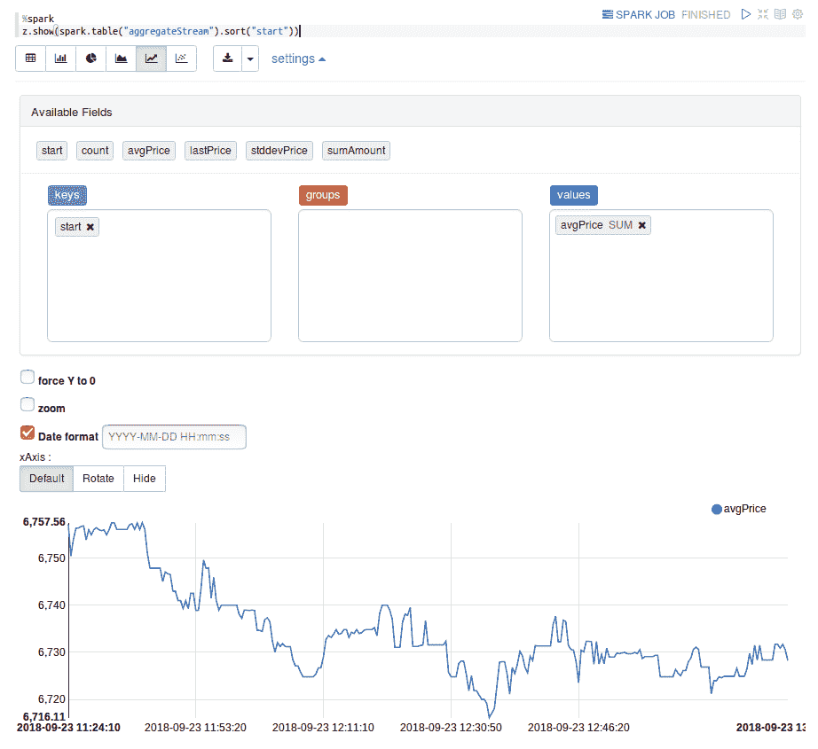

如果你 10 秒或更长时间后重新运行段落，你应该会看到它更新了新的交易数据。

结果表明，这个`aggregateStream``DataFrame`与我们之前在*绘制第一个图表*部分中创建的`aggregate``DataFrame`具有完全相同的列。它们之间的区别在于，`aggregate`是使用来自 Parquet 文件的历史批量数据构建的，而`aggregateStream`是使用来自 Kafka 的实时数据构建的。它们实际上是互补的——`aggregate`包含了过去几小时或几天的所有交易，而`aggregateStream`包含了从我们开始`aggQuery`的那个时间点以来的所有交易。如果你想绘制包含最新实时交易的所有数据的图表，你可以简单地使用两个 dataframes 的`union`，并适当过滤，以确保时间窗口不重复。

# 摘要

在本章中，你学习了如何使用 Zeppelin 查询 parquet 文件并显示一些图表。然后，你开发了一个小程序，从 WebSocket 流式传输事务数据到 Kafka 主题。最后，你使用 Zeppelin 中的 Spark Streaming 实时查询 Kafka 主题中的数据。

在所有这些构建块就绪的情况下，你拥有了分析比特币交易数据的所有工具。你可以让`BatchProducerApp`运行几天或几周以获取一些历史数据。借助 Zeppelin 和 Spark，你可以尝试检测模式并提出交易策略。最后，你可以使用 Spark Streaming 流程实时检测何时出现某些交易信号并自动执行交易。

我们只针对一个主题产生了流数据，但要添加其他主题，涵盖其他货币对，例如 BTC/EUR 或 BTC/ETH，将会非常简单。你也可以创建另一个程序，从另一个加密货币交易所获取数据。这将使你能够创建 Spark Streaming 查询，以检测套利机会（当产品在一个市场上的价格比另一个市场便宜时）。

本章中我们实现的基本模块也可以用于 Lambda 架构。Lambda 架构是一种数据处理架构，通过结合批处理和流式处理方法来处理大量数据。许多 Lambda 架构涉及批处理层和流式处理层拥有不同的代码库，但使用 Spark，这一负面因素可以大大减少。您可以在本网站上了解更多关于 Lambda 架构的信息：[`lambda-architecture.net/`](http://lambda-architecture.net/).

这完成了我们书籍的最后一章。我们希望您阅读它时能像我们写作它时一样享受。您将通过 Scala 的各种概念的细节而获得力量。Scala 是一种设计良好的语言，它本身不是终点，这是构建更多有趣概念的基础，比如类型理论，当然还有范畴论，我鼓励您的好奇心去寻找更多概念，以不断改进代码的可读性和质量。您还将能够将其应用于解决各种现实世界的问题。
