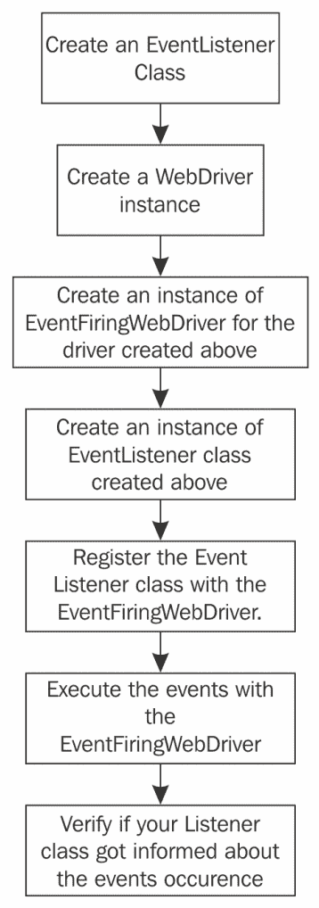

# 理解 WebDriver 事件

Selenium WebDriver 提供了一个 API 来跟踪使用 WebDriver 执行测试脚本时发生的各种事件。许多导航事件在 WebDriver 内部事件发生之前和之后被触发（例如在导航到 URL 之前和之后，以及浏览器后退导航之前和之后），这些事件可以被跟踪和捕获。为了抛出一个事件，WebDriver 提供了一个名为`EventFiringWebDriver`的类，为了捕获该事件，它为测试脚本开发者提供了一个名为`WebDriverEventListener`的接口。测试脚本开发者应该为其提供的接口重写方法提供自己的实现。在本章中，我们将探讨以下主题：

+   如何使用`EventFiringWebDriver`监听和处理各种浏览器导航事件

+   如何在测试脚本执行过程中监听和处理被触发的网页元素动作事件

+   向 WebDriver 添加额外的功能以捕获性能或可访问性测试

# 介绍`eventFiringWebDriver`和`eventListener`类

`EventFiringWebDriver`类是 WebDriver 的一个包装器，它赋予了驱动器触发事件的能力。另一方面，`EventListener`类等待监听`EventFiringWebDriver`，并处理所有被分派的事件。可能存在多个监听器等待从`EventFiringWebDriver`类接收事件触发。所有的事件监听器都应该注册到`EventFiringWebDriver`类以接收通知。

下面的流程图解释了在执行测试用例期间，如何捕获由`EventFiringWebDriver`引发的所有事件：



# 创建`EventListener`实例

`EventListener`类处理由`EventFiringWebDriver`类分派的所有事件。创建`EventListener`类有两种方式：

+   通过实现`WebDriverEventListener`接口。

+   通过扩展 WebDriver 库中提供的`AbstractWebDriverEventListener`类。

作为测试脚本开发者，选择哪种方式取决于你。

# 实现`WebDriverEventListener`

`WebDriverEventListener`接口声明了所有的事件方法。一旦`EventFiringWebDriver`类意识到发生了事件，它就会调用已注册的`WebDriverEventListener`方法。在这里，我们创建了一个名为`IAmTheEventListener`的类，并实现了`WebDriverEventListener`。现在我们需要为其中声明的方法提供实现。目前，在`WebDriverEventListener`中，有 15 个方法。我们将很快讨论每一个。确保 IDE 为我们提供了这些方法的占位符实现。我们创建的包含所有 15 个重写方法的是以下类（我们为其中几个方法提供了示例实现）：

```java
public class IAmTheEventListener implements WebDriverEventListener {
    @Override
    public void beforeAlertAccept(WebDriver webDriver) {
    }

    @Override
    public void afterAlertAccept(WebDriver webDriver) {

    }

    @Override
    public void afterAlertDismiss(WebDriver webDriver) {

    }

    @Override
    public void beforeAlertDismiss(WebDriver webDriver) {
    }

    @Override
    public void beforeNavigateTo(String url, WebDriver webDriver) {
        System.out.println("Before Navigate To " + url);
    }

    @Override
    public void afterNavigateTo(String s, WebDriver webDriver) {
        System.out.println("Before Navigate Back. Right now I'm at "
                + webDriver.getCurrentUrl());
    }

    @Override
    public void beforeNavigateBack(WebDriver webDriver) {
    }

    @Override
    public void afterNavigateBack(WebDriver webDriver) {
    }

    @Override
    public void beforeNavigateForward(WebDriver webDriver) {
    }

    @Override
    public void afterNavigateForward(WebDriver webDriver) {
    }

    @Override
    public void beforeNavigateRefresh(WebDriver webDriver)     {
    }

    @Override
    public void afterNavigateRefresh(WebDriver webDriver) {
    }

    @Override
    public void beforeFindBy(By by, WebElement webElement, WebDriver webDriver) {
    }

    @Override
    public void afterFindBy(By by, WebElement webElement, WebDriver webDriver) {
    }

    @Override
    public void beforeClickOn(WebElement webElement, WebDriver webDriver) {
    }

    @Override
    public void afterClickOn(WebElement webElement, WebDriver webDriver) {
    }

    @Override
    public void beforeChangeValueOf(WebElement webElement, WebDriver webDriver, CharSequence[] charSequences) {

    }

    @Override
    public void afterChangeValueOf(WebElement webElement, WebDriver webDriver, CharSequence[] charSequences) {

    }

    @Override
    public void beforeScript(String s, WebDriver webDriver)     {
    }

    @Override
    public void afterScript(String s, WebDriver webDriver)     {
    }

    @Override
    public void onException(Throwable throwable, WebDriver webDriver) {
    }
}
```

# 扩展`AbstractWebDriverEventListener`

创建监听器类的第二种方式是通过扩展 `AbstractWebDriverEventListener` 类。`AbstractWebDriverEventListener` 是一个实现了 `WebDriverEventListener` 的抽象类。尽管它并没有为 `WebDriverEventListener` 接口中的方法提供任何实现，但它创建了一个虚拟实现，这样您创建的监听器类就不必包含所有方法，只需包含您作为测试脚本开发者感兴趣的方法即可。以下是我们创建的一个扩展 `AbstractWebDriverEventListener` 并为其提供了一些方法实现的类。这样，我们就可以仅覆盖我们感兴趣的方法，而不是我们类中的所有方法：

```java
package com.example;

import org.openqa.selenium.WebDriver;
import    org.openqa.selenium.support.events.AbstractWebDriverEventListener;

public class IAmTheEventListener2 extends AbstractWebDriverEventListener {

    @Override
    public void beforeNavigateTo(String url, WebDriver driver) {
        System.out.println("Before Navigate To "+ url);
    }
    @Override
    public void beforeNavigateBack(WebDriver driver) {
        System.out.println("Before Navigate Back. Right now I'm at "
                + driver.getCurrentUrl());
    }
}
```

# 创建 WebDriver 实例

现在我们已经创建了一个监听所有生成事件的监听器类，是时候创建我们的测试脚本类，并让它调用 `IAmTheDriver.java`。在类创建后，我们在其中声明一个 ChromeDriver 实例：

```java
WebDriver driver = new ChromeDriver();
```

`ChromeDriver` 实例将是驱动所有驱动事件的底层驱动实例。这并不是什么新鲜事。下一节中解释的步骤是我们将这个驱动器实例化为 `EventFiringWebDriver`。

# 创建 EventFiringWebDriver 和 EventListener 实例

现在我们已经有了基本的驱动实例，在构造 `EventFiringWebDriver` 实例时将其作为参数传递。我们将使用这个驱动实例来执行所有进一步的用户操作。

现在，使用以下代码，实例化我们之前创建的 `EventListener`，即 `IAmTheEventListener.java` 或 `IAmTheEventListener2.java` 类。这将是一个将所有事件分发的类：

```java
EventFiringWebDriver eventFiringDriver = 
        new EventFiringWebDriver(driver);
IAmTheEventListener eventListener = 
        new IAmTheEventListener();
```

# 将 EventListener 注册到 EventFiringWebDriver

为了使 `EventListener` 能够通知事件执行，我们已经将其注册到 `EventFiringWebDriver` 类。现在 `EventFiringWebDriver` 类将知道在哪里发送通知。这是通过以下代码行完成的：`eventFiringDriver.register(eventListener);`

# 执行和验证事件

现在是测试脚本执行事件的时候了，比如导航事件。让我们首先导航到 Google，然后是 Facebook。我们将使用浏览器的后退导航回到 Google。测试脚本的完整代码如下：

```java
public class IAmTheDriver {
    public static void main(String... args){

        System.setProperty("webdriver.chrome.driver",
                "./src/test/resources/drivers/chromedriver");

        WebDriver driver = new ChromeDriver();

        try {
            EventFiringWebDriver eventFiringDriver = new
                    EventFiringWebDriver(driver);
            IAmTheEventListener eventListener = new IAmTheEventListener();
            eventFiringDriver.register(eventListener);
            eventFiringDriver.get("http://www.google.com");
            eventFiringDriver.get("http://www.facebook.com");
            eventFiringDriver.navigate().back();
        } finally {
            driver.close();
            driver.quit();
        }
    }
}
```

在前面的代码中，我们修改了我们的监听器类，以记录从 `AbstractWebDriverEventListener` 类继承的 `navigateTo` 和 `navigateBack` 事件的前后事件。修改后的方法如下：

```java
@Override
public void beforeNavigateTo(String url, WebDriver driver) {
    System.out.println("Before Navigate To: " + url
            + " and Current url is: " + driver.getCurrentUrl());
}

@Override
public void afterNavigateTo(String url, WebDriver driver) {
    System.out.println("After Navigate To: " + url
            + " and Current url is: " + driver.getCurrentUrl());
}

@Override
public void beforeNavigateBack(WebDriver driver) {
    System.out.println("Before Navigate Back. Right now I'm at " + driver.getCurrentUrl());
}

@Override
public void afterNavigateBack(WebDriver driver) {
    System.out.println("After Navigate Back. Right now I'm at " + driver.getCurrentUrl());
}
```

现在如果您执行测试脚本，输出将如下所示：

```java
Before Navigate To: http://www.google.com and Current url is: data:,
 After Navigate To: http://www.google.com and Current url is: https://www.google.com/?gws_rd=ssl
 Before Navigate To: http://www.facebook.com and Current url is: https://www.google.com/?gws_rd=ssl
 After Navigate To: http://www.facebook.com and Current url is: https://www.facebook.com/
 Before Navigate Back. Right now I'm at https://www.facebook.com/
 After Navigate Back. Right now I'm at https://www.google.com/?gws_rd=ssl
```

# 注册多个 EventListeners

我们可以使用 `EventFiringWebDriver` 注册多个监听器。一旦事件发生，所有注册的监听器都会收到通知。让我们修改我们的测试脚本以注册 `IAmTheListener.java` 和 `IAmTheListener2.java` 文件：

```java
public class RegisteringMultipleListeners {
    public static void main(String... args){

        System.setProperty("webdriver.chrome.driver",
                "./src/test/resources/drivers/chromedriver");

        WebDriver driver = new ChromeDriver();

        try {
            EventFiringWebDriver eventFiringDriver = new
                    EventFiringWebDriver(driver);
            IAmTheEventListener eventListener = new IAmTheEventListener();
            IAmTheEventListener2 eventListener2 = new
                    IAmTheEventListener2();
            eventFiringDriver.register(eventListener);
            eventFiringDriver.register(eventListener2);
            eventFiringDriver.get("http://www.google.com");
            eventFiringDriver.get("http://www.facebook.com");
            eventFiringDriver.navigate().back();
        } finally {
            driver.close();
            driver.quit();
        }
    }
}
```

稍微修改监听器以区分日志语句。现在如果您执行前一个代码，您将看到以下输出：

```java
Before Navigate To: http://www.google.com and Current url is: data:,
 Before Navigate To http://www.google.com
 After Navigate To: http://www.google.com and Current url is: https://www.google.com/?gws_rd=ssl
 Before Navigate To: http://www.facebook.com and Current url is: https://www.google.com/?gws_rd=ssl
 Before Navigate To http://www.facebook.com
 After Navigate To: http://www.facebook.com and Current url is: https://www.facebook.com/
 Before Navigate Back. Right now I'm at https://www.facebook.com/
 Before Navigate Back. Right now I'm at https://www.facebook.com/
 After Navigate Back. Right now I'm at https://www.google.com/?gws_rd=ssl
```

# 探索不同的 WebDriver 事件监听器

我们已经看到了一些在 `EventListeners` 中执行时被调用的方法，例如，在触发 `navigateTo` 事件时，会调用导航前后的方法。在这里，我们将看到 `WebDriverEventListener` 提供的所有方法。

# 监听 `WebElement` 值更改

当在 `WebElement` 上执行 `sendKeys()` 或 `clear()` 方法时，会触发此事件。与此事件相关联有两个方法：

```java
public void beforeChangeValueOf(WebElement element, WebDriver driver)
```

在 WebDriver 尝试更改 `WebElement` 的值之前，会调用前一个方法。作为参数，将 `WebElement` 本身传递给方法，以便在更改之前记录元素的值：

```java
public void afterChangeValueOf(WebElement element, WebDriver driver)
```

前一个方法是第二个与值更改事件相关联的方法，在驱动程序更改 `WebElement` 的值之后被调用。同样，`WebElement` 和 WebDriver 作为参数传递给该方法。如果在更改值时发生异常，则此方法不会被调用。

# 监听被点击的 `WebElement`

当 `WebElement` 被点击时，即通过执行 `webElement.click()` 触发此事件。在 `WebDriverEventListener` 实现中，有两种方法可以监听此事件：

```java
public void beforeClickOn(WebElement element, WebDriver driver)
```

当 WebDriver 即将点击特定的 `WebElement` 时，会调用前一个方法。将要点击的 `WebElement` 和执行点击操作的 WebDriver 作为参数传递给此方法，以便测试脚本开发者可以解释哪个驱动程序执行了点击操作，以及操作是在哪个元素上执行的：

```java
public void afterClickOn(WebElement element, WebDriver driver)
```

`EventFiringWebDriver` 类在点击操作在 `WebElement` 上执行后通知前一个方法。类似于 `beforeClickOn()` 方法，此方法也接收 `WebElement` 和 WebDriver 实例。如果在点击事件期间发生异常，则此方法不会被调用。

# 监听 `WebElement` 搜索事件

当 WebDriver 使用 `findElement()` 或 `findElements()` 在网页上搜索 `WebElement` 时，会触发此事件。同样，与此事件相关联有两个方法：

```java
public void beforeFindBy(By by, WebElement element, WebDriver driver)
```

在 WebDriver 开始在页面上搜索特定的 `WebElement` 之前，会调用前一个方法。作为参数，它发送定位机制，即要搜索的 `WebElement` 和执行搜索的 WebDriver 实例：

```java
public void afterFindBy(By by, WebElement element, WebDriver driver)
```

类似地，`EventFiringWebDriver` 类在搜索元素结束并且找到元素后调用前一个方法。如果在搜索过程中发生任何异常，则此方法不会被调用，并且会引发异常。

# 监听浏览器后退导航

正如我们之前看到的，当使用`driver.navigation().back()`方法时，浏览器后退导航事件会被触发。浏览器在其历史记录中后退一级。就像所有其他事件一样，此事件与两个方法相关联：

```java
public void beforeNavigateBack(WebDriver driver)
```

在浏览器历史记录回退之前，调用此方法。触发此事件的 WebDriver 作为参数传递给此方法：

```java
public void afterNavigateBack(WebDriver driver)
```

正如所有在`<<event>>`之后的`after`方法一样，前面的方法在导航回退动作被触发时调用。前面的两个方法将不受浏览器导航的影响而被调用；也就是说，如果浏览器没有任何历史记录，你调用此方法，浏览器不会带你到任何历史记录。但是，即使在那种情况下，由于事件被触发，这两个方法也会被调用。

# 监听浏览器前进导航

此事件与浏览器后退导航非常相似，只是这是浏览器前进导航，因此它使用`driver.navigate().forward()`。与此事件相关的两个方法是：

+   `public void afterNavigateForward(WebDriver driver)`

+   `public void beforeNavigateForward(WebDriver driver)`

正如浏览器后退导航一样，这些方法在浏览器是否前进一级的情况下都会被调用。

# 监听浏览器导航到事件

正如我们之前看到的，此事件在驱动程序执行`driver.get(url)`时发生。与此事件相关的方法定义如下：

+   `public void beforeNavigateTo(java.lang.String url, WebDriver driver)`

+   `public void afterNavigateTo(java.lang.String url, WebDriver driver)`

用于驱动程序导航的 URL 作为参数传递给前面的方法，以及触发事件的驱动程序。

# 监听脚本执行

当驱动程序执行 JavaScript 时，此事件被触发。与此事件相关的方法定义如下：

+   `public void beforeScript(java.lang.String script, WebDriver driver)`

+   `public void afterScript(java.lang.String script, WebDriver driver)`

前面的方法获取作为字符串执行的 JavaScript，以及执行它的 WebDriver 作为参数。如果在脚本执行过程中发生异常，则不会调用`afterScript()`方法。

# 监听异常

当 WebDriver 遇到异常时，此事件发生。例如，如果你尝试使用`findElement()`搜索一个 WebElement，而该元素在页面上不存在，则驱动程序会抛出异常（`NoSuchElementException`）。在此时刻，此事件被触发，以下方法会收到通知：

```java
public void onException(java.lang.Throwable throwable, WebDriver driver)
```

在所有的`after<<event>>`方法中，我们已经看到，如果驱动程序遇到任何异常，它们将不会被调用。在这种情况下，将调用`onException()`方法，并将可抛出对象和 WebDriver 对象作为参数传递给它。

# 使用 EventFiringWebDriver 注销事件监听器

现在，我们已经看到了触发的事件的不同类型，以及通知所有注册监听器的 `EventFiringWebDriver` 类。如果你在任何时候想让你的某个事件监听器停止监听 `EventFiringWebDriver`，你可以通过从该驱动器注销来实现。以下 API 从驱动器注销了一个事件监听器：

```java
public EventFiringWebDriver unregister(WebDriverEventListener eventListener)
```

该方法参数应该是想要退出接收事件通知的事件监听器。

# 执行可访问性测试

我们可以通过使用诸如 Google 的可访问性开发者工具（[`github.com/GoogleChrome/accessibility-developer-tools`](https://github.com/GoogleChrome/accessibility-developer-tools)）等工具来执行基本的可访问性检查。我们可以在网页中注入 `Google 可访问性测试库` 并执行 `可访问性审计`。这可以在每次调用 `afterNavigatTo()` 后自动执行。在下面的代码示例中，我们将注入 Google 可访问性开发者工具提供的 `axe_testing.js` 文件并执行审计，这将打印报告到控制台：

```java
public class IAmTheEventListener2 extends AbstractWebDriverEventListener {

    @Override
    public void beforeNavigateTo(String url, WebDriver driver) {
        System.out.println("Before Navigate To "+ url);
    }

    @Override
    public void beforeNavigateBack(WebDriver driver) {
        System.out.println("Before Navigate Back. Right now I'm at "
                + driver.getCurrentUrl());
    }

    @Override
    public void afterNavigateTo(String to, WebDriver driver) {
 try {
 JavascriptExecutor jsExecutor = (JavascriptExecutor) driver;
            URL url = new URL("https://raw.githubusercontent.com/GoogleChrome/" +
 "accessibility-developer-tools/stable/dist/js/axs_testing.js");
            String script = IOUtils.toString(url.openStream(), StandardCharsets.UTF_8);
            jsExecutor.executeScript(script);
            String report = (String) jsExecutor.executeScript("var results = axs.Audit.run();" +
 "return axs.Audit.createReport(results);");
            System.out.println("### Accessibility Report for " +  driver.getTitle() + "####");
            System.out.println(report);
            System.out.println("### END ####");

        } catch (MalformedURLException e) {
 e.printStackTrace();
        } catch (IOException e) {
 e.printStackTrace();
        }
 }
}
```

报告将按如下所示打印到控制台：

```java
### Accessibility Report for Google####
 *** Begin accessibility audit results ***
 An accessibility audit found
 Warnings:
 Warning: AX_FOCUS_01 (These elements are focusable but either invisible or obscured by another element) failed on the following element:
 #hplogo > DIV > .fOwUFe > A
 See https://github.com/GoogleChrome/accessibility-developer-tools/wiki/Audit-Rules#-ax_focus_01--these-elements-are-focusable-but-either-invisible-or-obscured-by-another-element for more information.
Warning: AX_TEXT_02 (Images should have an alt attribute) failed on the following element:
 #hplogo > DIV > .fOwUFe > A > .fJOQGe
 See https://github.com/GoogleChrome/accessibility-developer-tools/wiki/Audit-Rules#-ax_text_02--images-should-have-an-alt-attribute-unless-they-have-an-aria-role-of-presentation for more information.
...
 *** End accessibility audit results ***
 ### END ####
```

本报告包含了一组审计规则，用于检查常见的可访问性问题。

# 捕获页面性能指标

测量和优化客户端性能对于无缝的用户体验至关重要，这对于使用 AJAX 的 Web 2.0 应用程序来说尤其关键。

捕获关键信息，例如页面加载时间、元素渲染和 JavaScript 代码执行时间，将有助于识别性能缓慢的区域，并优化整体客户端性能。

**导航计时** 是一个 W3C 标准 JavaScript API，用于测量网络上的性能。该 API 提供了一种简单的方法，可以原生地获取页面导航和加载事件的准确和详细的计时统计信息。它在 Internet Explorer 9、Google Chrome、Firefox 和基于 WebKit 的浏览器上可用。

该 API 通过 `window.performance` 对象的时间接口属性使用 JavaScript 访问。我们将每次导航到页面时捕获页面加载时间。这可以通过在 `IAmTheEventListener2.java` 的 `afterNavigateTo()` 方法中使用 `JavaScriptExecutor` 调用 `window.performance` 来完成，如下面的代码片段所示：

```java
@Override
public void afterNavigateTo(String to, WebDriver driver) {
    try {

        JavascriptExecutor jsExecutor = (JavascriptExecutor) driver;

        // Get the Load Event End
        long loadEventEnd = (Long) jsExecutor.executeScript("return window.performance.timing.loadEventEnd;");
        // Get the Navigation Event Start
        long navigationStart = (Long) jsExecutor.executeScript("return window.performance.timing.navigationStart;");
        // Difference between Load Event End and Navigation Event Start is // Page Load Time
        System.out.println("Page Load Time is " + (loadEventEnd - navigationStart)/1000 + " seconds.");

    } catch (MalformedURLException e) {
        e.printStackTrace();
    } catch (IOException e) {
        e.printStackTrace();
    }
```

如前所述的代码中讨论的那样，`window.performance` 对象为我们提供了在 `Browser Window 对象` 中可用的性能指标。我们需要使用 JavaScript 来检索这个指标。在这里，我们正在收集 `loadEventEnd` 时间和 `navigationEventStart` 时间，并计算它们之间的差异，这将给我们页面加载时间。

# 摘要

在本章中，您学习了关于`EventFiringWebDriver`和`EventListeners`的知识，以及它们如何协同工作，通过帮助开发者调试在测试用例执行过程中的每一步发生的情况，使开发者的生活变得更轻松。您还学习了如何使用 WebDriver 事件在页面上执行不同类型的测试，例如可访问性和客户端性能检查。在下一章中，您将学习更多关于远程 WebDriver 的知识，用于在分布式和并行模式下运行远程机器上的测试，以进行跨浏览器测试。

# 问题

1.  您可以使用`WebDriverEventListener`接口来监听 WebDriver 事件——对还是错？

1.  您如何使用`WebDriverEventListener`在调用`sendKeys`方法之前自动清除输入字段？

1.  Selenium 支持可访问性测试——对还是错？

# 更多信息

您可以通过以下链接获取更多关于本章涵盖主题的信息：

+   在[`www.w3.org/TR/navigation-timing/`](https://www.w3.org/TR/navigation-timing/)上了解更多关于导航时间 API 的信息

+   在[`github.com/GoogleChrome/accessibility-developer-tools`](https://github.com/GoogleChrome/accessibility-developer-tools)上找到更多关于谷歌可访问性开发者工具的详细信息
