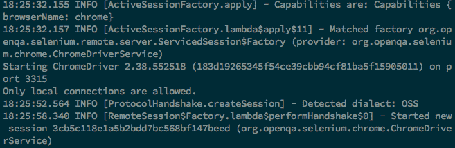

# 探索 RemoteWebDriver

到目前为止，我们已经创建了测试用例，并尝试在各个浏览器上执行它们。所有这些测试都是针对安装在测试用例所在本地机器上的浏览器执行的。这并不总是可能的。有很大可能性您可能正在使用 Mac 或 Linux，但想在 Windows 机器上的 IE 上执行测试。在本章中，我们将学习以下主题：

+   使用 `RemoteWebDriver` 在远程机器上执行测试用例

+   JSON 线协议的详细解释

# 介绍 RemoteWebDriver

`RemoteWebDriver`是`WebDriver`接口的实现类，测试脚本开发者可以使用它通过`Selenium 独立`服务器在远程机器上执行他们的测试脚本。`RemoteWebDriver`有两个部分：服务器和客户端。在我们开始使用它们之前，让我们回顾一下我们一直在做什么。

以下图表解释了我们到目前为止所做的工作：


使用 WebDriver 客户端库、Chrome 驱动程序（或 IE 驱动程序或 Firefox 的 Gecko 驱动程序）、Chrome 浏览器（或 IE 浏览器或 Firefox 浏览器）的测试脚本位于同一台机器上。浏览器正在加载网络应用程序，该应用程序可能位于远程服务器上，也可能不是；无论如何，这超出了我们讨论的范围。我们将讨论以下测试脚本执行的不同场景：


测试脚本位于本地机器上，而浏览器安装在远程机器上。在这种情况下，`RemoteWebDriver`就派上用场。如前所述，与`RemoteWebDriver`相关联有两个组件：服务器和客户端。让我们从`Selenium 独立服务器`开始。

# 理解 Selenium 独立服务器

`Selenium 独立服务器`是一个组件，它监听端口以接收来自`RemoteWebDriver`客户端的各种请求。一旦它收到请求，它将它们转发到以下任何一个：Chrome 驱动程序、IE 驱动程序或 Firefox 的 Gecko 驱动程序，具体取决于`RemoteWebDriver`客户端的请求。

# 下载 Selenium 独立服务器

让我们下载`Selenium 独立服务器`并开始运行它。您可以从[`www.seleniumhq.org/download/`](https://www.seleniumhq.org/download/)下载它，但出于我们的目的，让我们下载特定版本的它，因为我们正在使用 WebDriver 版本 3.12.0。此服务器 JAR 文件应下载到包含浏览器的远程机器上。同时，请确保远程机器上已安装 Java 运行时。

# 运行服务器

在远程机器上打开您的命令行工具，导航到您已下载 JAR 文件的目录。现在，要启动 Selenium 独立服务器，请执行以下命令：

```java
java -jar selenium-server-standalone-3.12.0.jar
```

以下截图显示了您应该在控制台中看到的内容：


现在服务器已经启动并正在监听 `<remote-machine-ip>:4444` 地址以接收来自 `RemoteWebDriver` 客户端的远程连接。之前看到的图像（*介绍* *RemoteWebDriver* 部分的第二张图像）将如下所示：


在远程机器上，Selenium Standalone Server 将在测试脚本和浏览器之间进行接口，如图所示。测试脚本将首先与 Selenium Standalone Server 建立连接，该服务器将把命令转发到远程机器上安装的浏览器。

# 理解 RemoteWebDriver 客户端

现在我们已经启动并运行了 Selenium Standalone 服务器，是时候我们创建 `RemoteWebDriver` 客户端了。幸运的是，我们不需要做太多来创建 `RemoteWebDriver` 客户端。它只是作为 `RemoteWebDriver` 客户端的语言绑定客户端库。`RemoteWebDriver` 将将测试脚本请求或命令转换为 JSON 负载，并通过 JSON 线协议将它们发送到 `RemoteWebDriver` 服务器。

当你在本地执行测试时，WebDriver 客户端库会直接与 Chrome Driver、IE Driver 或 Gecko Driver 通信。现在当你尝试远程执行测试时，WebDriver 客户端库会与 `Selenium Standalone Server` 通信，而服务器会根据测试脚本请求的 Chrome Driver、IE Driver 或 Gecko Driver（用于 Firefox）与浏览器进行通信，使用 `DesiredCapabilities` 类。我们将在下一节中探讨 `DesiredCapabilities` 类。

# 将现有测试脚本转换为使用 RemoteWebDriver 服务器

让我们以一个我们在本地执行的测试脚本为例；也就是说，测试脚本和浏览器在同一台机器上：

```java
@BeforeClass
public void setup() {

    System.setProperty("webdriver.chrome.driver",
            "./src/test/resources/drivers/chromedriver");
    driver = new ChromeDriver();

}
```

之前的测试脚本创建了一个 Chrome Driver 实例并启动了 Chrome 浏览器。现在，让我们尝试将此测试脚本转换为使用我们之前启动的 `Selenium Standalone Server`。在我们这样做之前，让我们看看 `RemoteWebDriver` 的构造函数，如下所示：

```java
RemoteWebDriver(java.net.URL remoteAddress, Capabilities desiredCapabilities)
```

构造函数的输入参数包括远程机器上运行的 `Selenium Standalone Server` 的地址（主机名或 IP）以及运行测试所需的需求能力（例如浏览器名称和/或操作系统）。我们将在稍后看到这些需求能力。

现在，让我们修改测试脚本以使用 `RemoteWebDriver`。将 `WebDriver driver = new ChromeDriver();` 替换为以下代码：

```java
@BeforeMethod
public void setup() throws MalformedURLException {

   DesiredCapabilities caps = new DesiredCapabilities();
    caps.setBrowserName("chrome");

    driver = new RemoteWebDriver(new URL("http://10.172.10.1:4444/wd/hub"), caps);
    driver.get("http://demo-store.seleniumacademy.com/"); 
}
```

我们已经创建了一个尝试连接到 `http://10.172.10.1:4444/wd/hub` 的 RemoteWebDriver 实例，其中 `Selenium Standalone Server` 正在运行并监听请求。完成此操作后，我们还需要指定测试用例应在哪个浏览器上执行。这可以通过使用 `DesiredCapabilities` 实例来完成。

对于这个例子，使用的 IP 是 10.172.10.1。然而，在您的案例中，它将是不同的。您需要获取 Selenium Standalone Server 运行的机器的 IP 地址，并替换本书中使用的示例 IP。

在运行测试之前，我们需要通过指定 ChromeDriver 的路径来重启 Selenium Standalone Server。

```java
java -jar -Dwebdriver.chrome.driver=chromedriver selenium-server-standalone-3.12.0.jar
```

使用`RemoteWebDriver`运行以下测试将启动 Chrome 浏览器并在其上执行您的测试用例。因此，修改后的测试用例将如下所示：

```java
public class SearchTest {

    WebDriver driver;

    @BeforeMethod
    public void setup() throws MalformedURLException {

        DesiredCapabilities caps = new DesiredCapabilities();
        caps.setBrowserName("chrome");

        driver = new RemoteWebDriver(new URL("http://10.172.10.1:4444/wd/hub"), caps);
        driver.get("http://demo-store.seleniumacademy.com/");

    }

    @Test
    public void searchProduct() {

        // find search box and enter search string
        WebElement searchBox = driver.findElement(By.name("q"));

        searchBox.sendKeys("Phones");

        WebElement searchButton =
                driver.findElement(By.className("search-button"));

        searchButton.click();

        assertThat(driver.getTitle())
                .isEqualTo("Search results for: 'Phones'");
    }

    @AfterMethod
    public void tearDown() {
        driver.quit();
    }
}

```

现在从您的本地机器执行此测试脚本，以在`RemoteWebDriver`客户端和`Selenium Standalone Server`之间建立连接。服务器将启动 Chrome 浏览器。以下是在服务器运行的控制台中将看到的输出：



它表示正在创建一个新的具有期望能力的会话。一旦建立会话，会话 ID 将被打印到控制台。在任何时候，您都可以通过导航到 Selenium 服务器运行的机器的宿主或 IP 地址`http://<hostnameOrIP>:4444/wd/hub`来查看所有与`Selenium Standalone Server`建立的会话。

Selenium Standalone Server 默认情况下监听端口号 4444。我们可以通过传递`-port`参数来更改默认端口。

它将给出服务器当前正在处理的会话的整个列表。以下是其截图：


这是一个非常基础的门户，允许测试脚本开发者查看服务器创建的所有会话，并对它执行一些基本操作，例如终止会话、会话截图、将脚本加载到会话中，以及查看会话的所有期望能力。以下截图显示了当前会话的所有默认期望能力。

您可以通过悬停在**能力**链接上查看弹出窗口，如下面的截图所示：


这些是服务器为本次会话隐式设置的默认期望能力。现在我们已经成功地在我们的测试脚本（在一台机器上使用`RemoteWebDriver`客户端）和另一台机器上的 Selenium Standalone Server 之间建立了连接。远程运行测试脚本的原始图示如下：


# 使用 RemoteWebDriver 进行 Firefox 测试

使用 Firefox 浏览器执行我们的测试脚本与使用 Chrome 浏览器类似，只是在`GeckoDriver`的启动方式上有一些变化。

让我们通过将用于 Chrome 浏览器的测试脚本更改为以下脚本，使用`"firefox"`来实现这一点：

```java
@BeforeMethod
public void setup() throws MalformedURLException {

    DesiredCapabilities caps = new DesiredCapabilities();
 caps.setBrowserName("firefox");
    caps.setCapability("marionette", true);

    driver = new RemoteWebDriver(new URL("http://10.172.10.1:4444/wd/hub"), caps);
    driver.get("http://demo-store.seleniumacademy.com/");

}
```

在尝试执行此代码之前，请重启`Selenium Standalone Server`以使用`GeckoDriver`：

```java
java -jar -Dwebdriver.gecko.driver=geckodriver selenium-server-standalone-3.12.0.jar
```

现在尝试执行前面的测试脚本，你应该看到 Firefox 浏览器被启动并执行你的测试命令。`Selenium Standalone Server`已启动`GeckoDriver`，与其建立了连接，并开始执行测试脚本命令。

# 使用 RemoteWebDriver 进行 Internet Explorer 测试

对于在 Internet Explorer 驱动程序上执行测试，步骤与我们使用 Chrome 和 Firefox 浏览器所做的是相似的。

让我们通过将用于 Chrome 或 Firefox 浏览器的测试脚本更改为以下脚本，使用`"internet explorer"`来查看这一点：

```java
@BeforeMethod
public void setup() throws MalformedURLException {

    DesiredCapabilities caps = new DesiredCapabilities();
 caps.setBrowserName("internet explorer"); 
    driver = new RemoteWebDriver(new URL("http://127.0.0.1:4444/wd/hub"), caps);
    driver.get("http://demo-store.seleniumacademy.com/");

}
```

在尝试执行此代码之前，请重新启动`Selenium Standalone Server`以使用`InternetExplorerDriver`：

```java
java -jar -Dwebdriver.ie.driver=InternetExplorerDriver.exe selenium-server-standalone-3.12.0.jar
```

现在尝试执行前面的测试脚本，你应该看到 Internet Explorer 浏览器被启动并执行你的测试命令。`Selenium Standalone Server`已启动`InternetExplorerDriver`，与其建立了连接，并开始执行测试脚本命令。

# 理解 JSON 线协议

在许多地方，我们提到 WebDriver 使用 JSON 线协议在客户端库和不同的驱动程序（即 Chrome Driver、IE Driver、Gecko Driver 等）实现之间进行通信。在本节中，我们将确切了解它是什么，以及客户端库应该实现哪些不同的 JSON API 来与驱动程序通信。

**JavaScript 对象表示法（JSON）**用于表示具有复杂数据结构的对象。它主要用于在 Web 服务器和客户端之间传输数据。它已成为各种基于 REST 的 Web 服务的行业标准，为 XML 提供了一种强大的替代方案。

一个示例 JSON 文件，保存为`.json`文件，将如下所示：

```java
{ 
   "firstname":"John",
   "lastname":"Doe",
   "address":{ 
      "streetnumber":"678",
      "street":"Victoria Street",
      "city":"Richmond",
      "state":"Victoria",
      "country":"Australia"
   } "phone":"+61470315430"
}
```

客户端可以将一个人的详细信息以先前的 JSON 格式发送到服务器，服务器可以解析它，然后创建一个用于其执行的人对象实例。稍后，服务器可以将响应以 JSON 格式发送回客户端，客户端可以使用这些数据创建一个类的对象。将对象数据转换为 JSON 格式以及将 JSON 格式数据转换为对象的过程分别称为**序列化**和**反序列化**，这在基于 REST 的 Web 服务中相当常见。

WebDriver 使用相同的方法在客户端库（语言绑定）和驱动程序之间进行通信，例如 Firefox Driver、IE Driver 和 Chrome Driver。同样，`RemoteWebDriver`客户端和`Selenium Standalone Server`使用 JSON 线协议相互通信。但是，所有这些驱动程序都在幕后使用它，隐藏了所有实现细节，使我们的生活变得更简单。以下是我们可以在网页上执行的各种操作的 API 列表：

```java
/status /session /sessions /session/:sessionId /session/:sessionId/timeouts /session/:sessionId/timeouts/async_script /session/:sessionId/timeouts/implicit_wait /session/:sessionId/window_handle /session/:sessionId/window_handles /session/:sessionId/url /session/:sessionId/forward /session/:sessionId/back /session/:sessionId/refresh /session/:sessionId/execute /session/:sessionId/execute_async /session/:sessionId/screenshot /session/:sessionId/ime/available_engines /session/:sessionId/ime/active_engine
. . .
. . . /session/:sessionId/touch/flick /session/:sessionId/touch/flick /session/:sessionId/location /session/:sessionId/local_storage /session/:sessionId/local_storage/key/:key /session/:sessionId/local_storage/size /session/:sessionId/session_storage /session/:sessionId/session_storage/key/:key /session/:sessionId/session_storage/size /session/:sessionId/log /session/:sessionId/log/types /session/:sessionId/application_cache/status
```

完整的文档可在[`code.google.com/p/selenium/wiki/JsonWireProtocol`](https://github.com/SeleniumHQ/selenium/wiki/JsonWireProtocol)找到。客户端库会将你的测试脚本命令转换为 JSON 格式，并发送请求到相应的 WebDriver API。WebDriver 将解析这些请求，并在网页上采取必要的行动。让我们以一个例子来看一下。假设你的测试脚本有如下代码：`driver.get("http://www.google.com");`。

客户端库将通过构建 JSON 有效载荷（JSON 文档）并将其发布到适当的 API 来将此转换为 JSON。在这种情况下，处理 `driver.get(URL)` 方法的 API 是 `/session/:sessionId/url`。

以下代码展示了在请求发送到驱动程序之前，客户端库层幕后发生的情况；请求被发送到运行在 10.172.10.1:4444 的 RemoteWebDriver 服务器：

```java
HttpClient httpClient = new DefaultHttpClient();
HttpPost postMethod = new HttpPost("http://10.172.10.1:4444/wd/hub/session/"+sessionId+"/url");
JSONObject jo=new JSONObject();
jo.put("url","http://www.google.com");
StringEntity input = new StringEntity(jo.toString());
input.setContentEncoding("UTF-8");
input.setContentEncoding(new BasicHeader(HTTP.CONTENT_TYPE, "application/json"));
postMethod.setEntity(input);
HttpResponse response = httpClient.execute(postMethod);
```

`Selenium Standalone Server` 将将该请求转发给驱动程序；驱动程序将在浏览器中加载的测试下，以先前格式执行到达的测试脚本命令。

以下图表显示了每个阶段的数据流：


上述图表显示了以下内容：

+   第一阶段是测试脚本和客户端库之间的通信。在它们之间流动的数据或命令是对驱动程序 `get()` 方法的调用：`driver.get("http://www.google.com");`。

+   客户端库在接收到上述命令后，会将其转换为 JSON 格式，并与 `Selenium Standalone Server` 进行通信。

+   接下来，`Selenium Standalone Server` 将 JSON 有效载荷请求转发给 Chrome Driver。

+   Chrome Driver 将与 Chrome 浏览器进行原生通信，然后浏览器将发送请求以加载所需的 URL。

# 摘要

在本章中，我们学习了 `RemoteWebDriver` 以及如何使用 `Selenium Standalone Server` 和 `RemoteWebDriver` 客户端在另一台机器上远程执行测试脚本。这使得 Selenium WebDriver 测试可以在具有不同浏览器和操作系统组合的远程机器上执行。我们还探讨了 JSON 通信协议以及客户端库如何在幕后发送和接收请求和响应。

在下一章中，我们将扩展 Selenium Standalone Server 和 RemoteWebDriver 的使用，以创建一个用于跨浏览器和分布式测试的 Selenium Grid。

# 问题

1.  使用 Selenium，我们可以在远程机器上执行测试——对还是错？

1.  用于在远程机器上运行测试的驱动程序类是哪一个？

1.  解释期望能力。

1.  在 Selenium 测试和 Selenium Standalone Server 之间使用的是哪种协议？

1.  Selenium Standalone Server 使用的是默认端口是什么？

# 更多信息

你可以查看以下链接以获取有关本章涵盖主题的更多信息：

+   Selenium WebDriver W3C 规范解释了 WebDriver 协议以及所有端点：[`www.w3.org/TR/webdriver/`](https://www.w3.org/TR/webdriver/)
