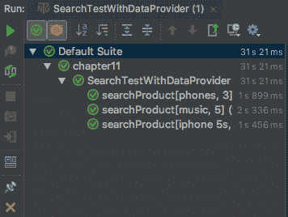
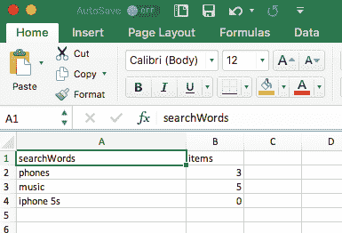

# 使用 TestNG 进行数据驱动测试

在本章中，我们将了解如何使用 TestNG 和 Selenium WebDriver 创建数据驱动测试。我们将探讨以下主题：

+   什么是数据驱动测试？

+   使用 TestNG 套件参数来参数化测试。

+   使用 TestNG 数据提供者进行数据驱动测试。

+   使用 CSV 和 Excel 文件格式来存储和读取测试数据。

# 数据驱动测试概述

通过采用数据驱动测试方法，我们可以通过使用来自外部数据源（而不是每次运行测试时都使用硬编码的值）的输入和预期值来驱动测试，从而使用单个测试验证不同的测试用例集或测试数据。这在当我们有类似的测试，这些测试由相同的步骤组成，但在输入数据、预期值或应用程序状态上有所不同时非常有用。以下是一个具有不同组合的登录测试用例集的示例：

| **描述** | **测试数据** | **预期输出** |
| --- | --- | --- |
| 测试有效的用户名和密码 | 一对有效的用户名和密码 | 用户应该以成功消息登录应用程序 |
| 测试无效的用户名和密码 | 一个无效的用户名和密码 | 应向用户显示登录错误 |
| 有效的用户名和无效的密码 | 一个有效的用户名和一个无效的密码 | 应向用户显示登录错误 |

我们可以创建一个单一的脚本，它可以处理测试数据和前表中所示的条件。通过使用数据驱动测试方法，我们通过使用来自外部源（如 CSV 或电子表格文件）的数据替换硬编码的测试数据，将测试数据与测试逻辑分离。这也帮助创建可重用的测试，这些测试可以与不同的数据集一起运行，这些数据集可以保留在测试之外。数据驱动测试还有助于提高测试覆盖率，因为我们可以在最小化需要编写和维护的测试代码量的同时处理多个测试条件。

数据驱动测试的好处如下：

+   我们可以在最小化需要编写和维护的测试代码量的同时获得更大的测试覆盖率

+   它使得创建和运行大量测试条件变得非常容易

+   测试数据可以在应用程序准备好测试之前设计和创建

+   数据表也可以用于手动测试

Selenium WebDriver 作为一种纯浏览器自动化 API，不提供内置功能来支持数据驱动测试。然而，我们可以通过使用测试框架（如 JUnit 或 TestNG）来添加对数据驱动测试的支持。在这本书中，我们使用 TestNG 作为我们的测试框架，我们将在以下章节中使用 TestNG 的参数化功能来创建数据驱动测试。

# 使用套件参数参数化测试

在*第一章*“介绍 WebDriver 和 WebElements”中，我们创建了一个搜索测试，该测试对正在测试的应用程序执行简单搜索。此测试搜索给定产品并验证标题。我们使用硬编码的值`phones`进行搜索，如下面的代码片段所示：

```java
 @Test
 public void searchProduct() {

        // find search box and enter search string
        WebElement searchBox = driver.findElement(By.name("q"));

        searchBox.sendKeys("Phones");

        WebElement searchButton =
                driver.findElement(By.className("search-button"));

        searchButton.click();

        assertThat(driver.getTitle())
                .isEqualTo("Search results for: 'Phones'");
    }
```

我们可以参数化这些值，并使用 TestNG 的套件参数功能将它们提供给测试方法。这将有助于从测试方法中移除硬编码的值，并将它们移动到 TestNG 套件文件中。参数化值可以在多个测试中使用。当我们需要更改这些值时，我们不必去每个测试并做出更改，而是可以简单地更改套件文件中的这些值。

现在，让我们看看从套件文件中使用 TestNG 参数的步骤。在*第一章*中，我们创建了一个`testng.xml`文件，该文件位于`src/test/resources/suites`文件夹中。让我们修改这个文件并添加参数声明，如下面的代码片段所示：

```java
<!DOCTYPE suite SYSTEM "http://testng.org/testng-1.0.dtd" >

<suite name="Chapter 1" verbose="1">
    <listeners>
        <listener class-name="com.vimalselvam.testng.listener.ExtentTestNgFormatter"/>
    </listeners>
    <test name="Search Test">
 <parameter name="searchWord" value="phones"/>
 <parameter name="items" value="3"/>
        <classes>
            <class name="com.example.SearchTest"/>
        </classes>
    </test>
</suite>
```

我们可以使用`<parameter>`标签在 TestNG 套件文件中添加参数。我们必须为参数提供`name`和`value`属性。在本例中，我们创建了两个参数：`searchWord`和`items`。这些参数存储搜索词和应用程序为该搜索词返回的预期项目数量。

现在，让我们修改测试以使用参数而不是硬编码的值。首先，我们需要在测试方法的`@Test`注解之前使用`@Parameters`注解。在`@Parameters`注解中，我们需要提供套件文件中声明的参数的确切名称和顺序。在本例中，我们将提供`searchWord`和`items`。我们还需要向测试方法添加参数以及所需的数据类型，以映射 XML 参数。在本例中，我们向`searchProduct()`测试方法添加了`String searchWord`和`int Items`参数。最后，我们需要在测试方法中将硬编码的值替换为参数，如下面的代码片段所示：

```java
@Parameters({"searchWord", "items"})
@Test
public void searchProduct(String searchWord, int items) {

    // find search box and enter search string
    WebElement searchBox = driver.findElement(By.name("q"));

    // use searchWord parameter value from XML suite file
 searchBox.sendKeys(searchWord);

    WebElement searchButton =
            driver.findElement(By.className("search-button"));

    searchButton.click();

    assertThat(driver.getTitle())
            .isEqualTo("Search results for: '" + searchWord  + "'");

    List<WebElement> searchItems = driver
            .findElements(By.xpath("//h2[@class='product-name']/a"));

    assertThat(searchItems.size())
 .isEqualTo(items);
}
```

我们必须通过 testng.xml 文件运行参数化测试，以便 TestNG 读取套件文件中定义的参数并将值传递给测试方法。

在执行过程中，TestNG 将使用 XML 套件文件中定义的参数，并使用`@Parameters`注解将这些参数映射到测试方法中的 Java 参数的相同顺序。它将通过在测试方法中添加的参数传递套件文件中的参数值。如果 XML 和`@Parameters`注解之间的参数数量不匹配，TestNG 将抛出异常。

在下一节中，我们将看到程序化参数化，它为我们提供了运行具有多行测试数据的测试的能力。

# 使用数据提供程序参数化测试

虽然套件参数对于简单的参数化很有用，但它们不足以创建具有多个测试数据值的数据驱动测试，并从外部文件（如属性文件、CSV、Excel 或数据库）中读取数据。在这种情况下，我们可以使用`Data Provider`来提供需要测试的值。`Data Provider`是在测试类中定义的一个方法，它返回一个对象数组的数组。此方法使用`@DataProvider`注解。

让我们修改前面的测试以使用`Data Provider`。现在，我们将使用由搜索返回的单个`searchWord`的三种组合以及预期的`items`计数。我们将在`@BeforeMethod`注解之前在`SearchTest`类中添加一个名为`provider()`的新方法，如下面的代码所示：

```java
public class SearchTest {

    WebDriver driver;

 @DataProvider(name = "searchWords")
 public Object[][] provider() {
 return new Object[][]{
 {"phones", 3},
                {"music", 5},
                {"iphone 5s", 0}
 };
    }

    @BeforeMethod
    public void setup() {
        ...
    }
    ...
}
```

当一个方法被`@DataProvider`注解时，它通过传递测试数据到测试用例而成为一个数据提供方法。除了`@DataProvider`注解之外，我们还需要为`data provider`提供一个名称。在这个例子中，我们将其命名为`searchWords`。

接下来，我们需要更新`searchTest()`测试方法以链接到`data provider`。这可以通过以下步骤完成：

1.  在`@Test`注解中提供`data provider`的名称

1.  向`searchProduct`方法添加两个参数`String searchWord`和`int items`

1.  使用方法参数替换硬编码的值：

```java
public class SearchTest {

    WebDriver driver;

    @DataProvider(name = "searchWords")
    public Object[][] provider() {
      ...
    }

    @BeforeMethod
    public void setup() {

        System.setProperty("webdriver.chrome.driver",
                "./src/test/resources/drivers/chromedriver");
        driver = new ChromeDriver();
        driver.get("http://demo-store.seleniumacademy.com/");

    }

    @Test(dataProvider = "searchWords")
    public void searchProduct(String searchWord, int items) {

        // find search box and enter search string
        WebElement searchBox = driver.findElement(By.name("q"));

        searchBox.sendKeys(searchWord);

        WebElement searchButton =
                driver.findElement(By.className("search-button"));

        searchButton.click();

        assertThat(driver.getTitle())
                .isEqualTo("Search results for: '" + searchWord + "'");

 List<WebElement> searchItems = driver
                .findElements(By.xpath("//h2[@class='product-name']/a"));

        assertThat(searchItems.size())
 .isEqualTo(items);
    }

    @AfterMethod
    public void tearDown() {
        driver.quit();
    }
}
```

`provider()`方法将成为数据提供方法，它返回由`searchWords`和预期的`items`计数组合的对象数组，TestNG 将传递数据行数组到测试方法。

TestNG 将执行四次测试，使用不同的测试组合。TestNG 在测试执行结束时还会生成一个格式良好的报告。以下是一个使用定义的值通过 TestNG 进行测试结果的示例。`searchProduct`测试执行了三次，如下面的截图所示：



# 从 CSV 文件读取数据

我们看到了一个简单的数据驱动测试 TestNG。测试数据被硬编码在测试脚本代码中。这可能会变得难以维护。建议我们将测试数据与测试脚本分开存储。通常，我们使用生产环境中的数据来进行测试。这些数据可以导出为 CSV 格式。我们可以在数据提供者方法中读取这些 CSV 文件，并将数据传递给测试，而不是硬编码的对象数组。

在这个例子中，我们将使用 OpenCSV 库来读取 CSV 文件。OpenCSV 是一个简单的 Java 库，用于在 Java 中读取 CSV 文件。您可以在[`opencsv.sourceforge.net/`](http://opencsv.sourceforge.net/)找到更多关于 OpenCSV 的详细信息。

首先，在`src/test/resources/data`文件夹中创建一个名为`data.csv`的 CSV 文件，并复制以下`searchWords`和`items`的组合：

```java
searchWord,items
phones,3
music,5
iphone 5s,0
```

接下来，我们需要将 OpenCSV 依赖项添加到 Maven pom.xml 文件中。对于此示例，我们将使用最新版本 3.4，如下面的代码片段所示：

```java
<dependency>
    <groupId>com.opencsv</groupId>
    <artifactId>opencsv</artifactId>
    <version>3.4</version>
</dependency>
```

最后，我们需要修改测试类中的 `provider()` 方法，以读取 CSV 文件的内容，并将其作为对象的数组返回，如下面的代码所示：

```java
public class SearchTest {

    WebDriver driver;

    @DataProvider(name = "searchWords")
 public Iterator<Object[]> provider() throws Exception {

 CSVReader reader = new CSVReader(
 new FileReader("./src/test/resources/data/data.csv")
 , ',', '\'', 1);

        List<Object[]> myEntries = new ArrayList<Object[]>();
        String[] nextLine;
        while ((nextLine = reader.readNext()) != null) {
 myEntries.add(nextLine);
        }
 reader.close();
        return myEntries.iterator();
    }

    @BeforeMethod
    public void setup() {

        System.setProperty("webdriver.chrome.driver",
                "./src/test/resources/drivers/chromedriver");
        driver = new ChromeDriver();
        driver.get("http://demo-store.seleniumacademy.com/");

    }

    @Test(dataProvider = "searchWords")
    public void searchProduct(String searchWord, String items) {

        // find search box and enter search string
        WebElement searchBox = driver.findElement(By.name("q"));

        searchBox.sendKeys(searchWord);

        WebElement searchButton =
                driver.findElement(By.className("search-button"));

        searchButton.click();

        assertThat(driver.getTitle())
                .isEqualTo("Search results for: '" + searchWord + "'");

        List<WebElement> searchItems = driver
                .findElements(By.xpath("//h2[@class='product-name']/a"));

        assertThat(searchItems.size())
                .isEqualTo(Integer.parseInt(items));
    }

    @AfterMethod
    public void tearDown() {
        driver.quit();
    }
}
```

在 `provide` 方法中，将使用 OpenCSV 库的 `CSVReader` 类来解析 CSV 文件。我们需要提供 CSV 文件的路径、分隔符字符和标题行号（在获取数据时会跳过），如下面的代码片段所示：

```java
@DataProvider(name = "searchWords")
public Iterator<Object[]> provider() throws Exception {

    CSVReader reader = new CSVReader(
            new FileReader("./src/test/resources/data/data.csv")
            , ',', '\'', 1);

    List<Object[]> myEntries = new ArrayList<Object[]>();
    String[] nextLine;
    while ((nextLine = reader.readNext()) != null) {
        myEntries.add(nextLine);
    }
    reader.close();
    return myEntries.iterator();
}
```

在前面的代码中，我们将读取 CSV 文件的每一行，将其复制到对象的数组中，并将其返回给测试方法。测试方法将对 CSV 文件中的每一行执行。

# 从 Excel 文件中读取数据

为了维护测试用例和测试数据，Microsoft Excel 是测试人员的首选工具。与 CSV 文件格式相比，Excel 提供了众多功能和一种结构化的方式来存储数据。测试人员可以轻松地在 Excel 电子表格中创建和维护测试数据表。

让我们在 `src/test/resources/data` 文件夹中创建一个名为 `data.xlsx` 的 Excel 电子表格，内容如下：



在本节中，我们将使用 Excel 电子表格作为数据源。我们将使用 Apache 基金会开发的 Apache POI API 来操作 Excel 电子表格。

让我们修改 `provider()` 方法，使用一个名为 `SpreadsheetData` 的辅助类来读取 Excel 文件的内容：

```java
@DataProvider(name = "searchWords")
public Object[][] provider() throws Exception {
    SpreadsheetData spreadsheetData = new SpreadsheetData();
    return spreadsheetData.getCellData("./src/test/resources/data/data.xlsx");
}
```

`SpreadsheetData` 类，这个类包含在本书的源代码包中。这个类支持旧版的 .xls 和较新的 .xlsx 格式：

```java
public class SpreadsheetData {
    public String[][] getCellData(String path) throws InvalidFormatException, IOException {
        FileInputStream stream = new FileInputStream(path);
        Workbook workbook = WorkbookFactory.create(stream);
        Sheet s = workbook.getSheetAt(0);
        int rowcount = s.getLastRowNum();
        int cellcount = s.getRow(0).getLastCellNum();
        String data[][] = new String[rowcount][cellcount];
        for (int rowCnt = 1; rowCnt <= rowcount; rowCnt++) {
            Row row = s.getRow(rowCnt);
            for (int colCnt = 0; colCnt < cellcount; colCnt++) {
                Cell cell = row.getCell(colCnt);
                try {
                    if (cell.getCellType() == cell.CELL_TYPE_STRING) {
                        data[rowCnt - 1][colCnt] = cell.getStringCellValue();
                    } else {
                        data[rowCnt - 1][colCnt] = String.valueOf(cell.getNumericCellValue());
                    }
                } catch (Exception e) {
                    e.printStackTrace();
                }
            }
        }
        return data;
    }
}
```

当测试执行时，`provider()` 方法将创建 `SpreadsheetData` 类的一个实例。`SpreadsheetData` 类将按行逐行读取 Excel 电子表格的内容到一个集合中，并将这个集合返回给 `provider()` 方法：

```java
InputStream spreadsheet = new FileInputStream("./src/test/resources/data/data.xlsx"); 
return new SpreadsheetData(spreadsheet).getData(); 
```

对于 `provider()` 方法返回的测试数据集合中的每一行，测试运行器将实例化测试用例类，将测试数据作为参数传递给测试类构造函数，然后执行测试类中的所有测试。

# 摘要

在本章中，我们学习了使用 TestNG 功能创建参数化和数据驱动测试的重要技术。这将帮助您以最小的编码努力和增加的测试覆盖率创建高度可维护和健壮的测试。我们还探讨了从 CSV 和 Excel 格式读取数据的方法。

# 问题

1.  解释数据驱动测试是什么。

1.  Selenium 支持数据驱动测试——对或错？

1.  TestNG 中创建数据驱动测试的两种方法是什么？

1.  解释 TestNG 中的 `DataProvider` 方法。

# 进一步信息

您可以查看以下链接以获取有关本章涵盖主题的更多信息：

+   在[`testng.org/doc/documentation-main.html#parameters`](https://testng.org/doc/documentation-main.html#parameters)了解更多关于 TestNG 数据驱动特性的信息

+   在[`poi.apache.org/`](https://poi.apache.org/)了解更多关于 Apache POI 库的信息
