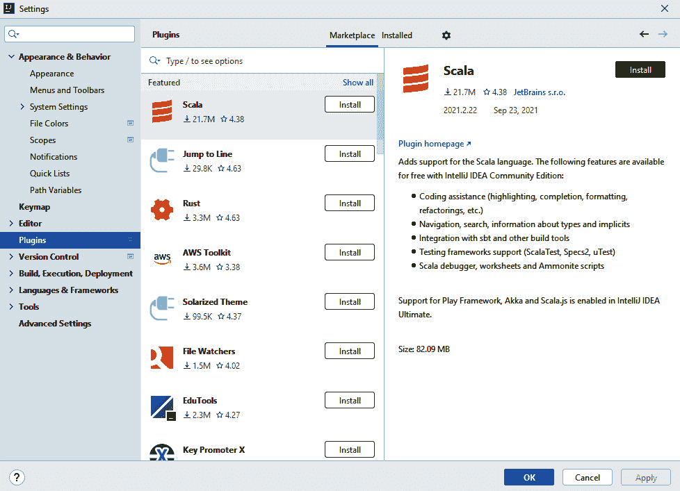
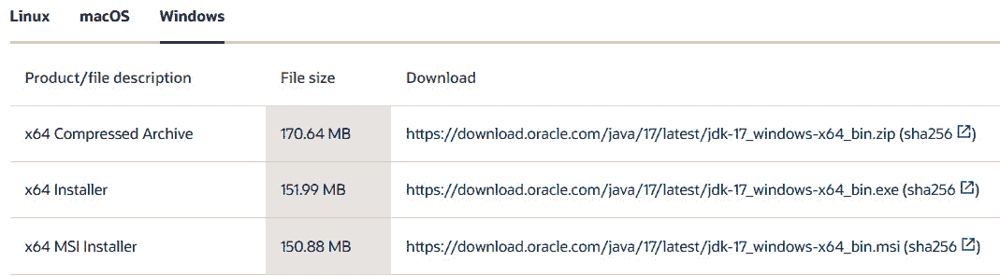
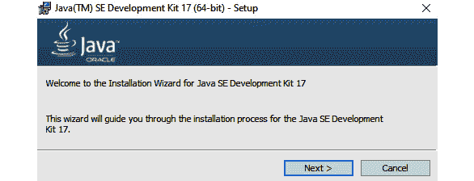
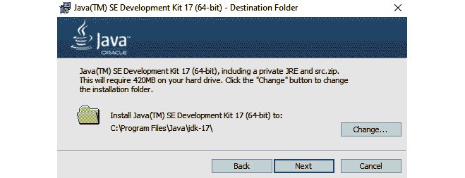
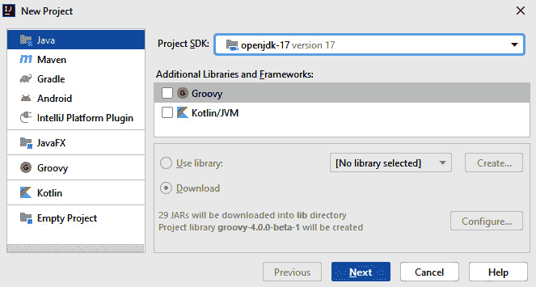
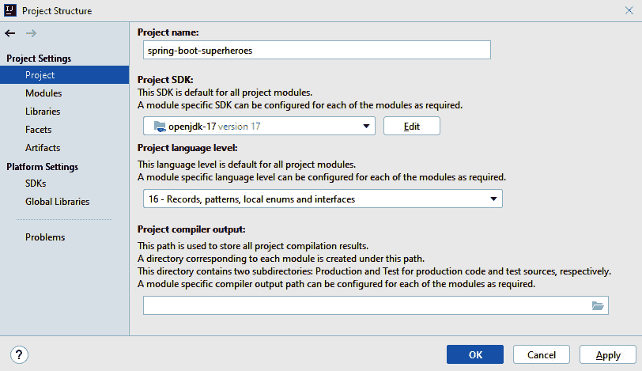
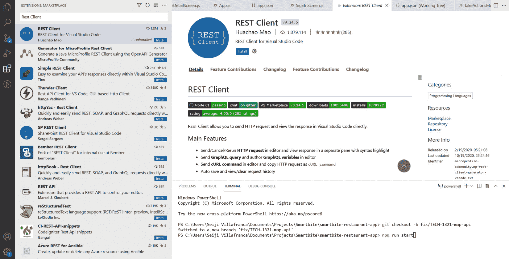
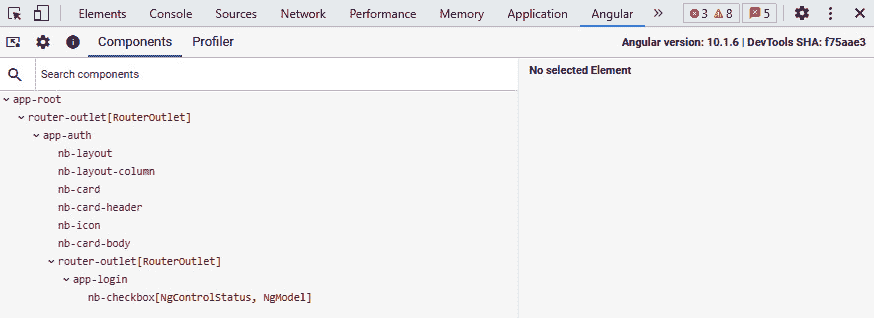

# 2

# 设置开发环境

在上一章中，您对 Spring Boot 进行了简要了解及其优势。我们还探讨了 Java 17 的最新特性。对于 Angular 也是如此；您对 Angular 有了一个概述，以及使用它开发前端应用程序的好处。

本章将指导您如何设置计算机的开发环境以开发您的全栈 Java 和 Angular 应用程序。我们将探讨不同的 IDE 和文本编辑器来编写代码，并确保在开始开发之前一切配置就绪。

从一开始就正确安装所有内容将帮助我们避免问题，并使我们能够不间断地编写代码。

本章将涵盖以下主题：

+   安装 VS Code 和 IntelliJ IDEA

+   安装 Java 17

+   安装 SDKMAN

+   使用 Java 17 设置 IntelliJ IDEA

+   安装 REST Client VS Code 或 JetBrains 和 Angular DevTools

+   安装 Git 版本控制

# 技术要求

以下是需要安装的软件链接：

+   **下载 VS Code（适用于 Windows、Mac 和 Linux）**: https://code.visualstudio.com/download

+   **IntelliJ IDEA for Windows**: https://www.jetbrains.com/idea/download/#section=windows

+   **IntelliJ IDEA for Mac**: https://www.jetbrains.com/idea/download/#section=mac

+   **IntelliJ IDEA for Linux**: https://www.jetbrains.com/idea/download/#section=linux

+   **下载 Java 17**: https://www.oracle.com/java/technologies/javase/jdk17-archive-downloads.html

+   **Angular DevTools**: https://chrome.google.com/webstore/detail/angular-devtools/ienfalfjdbdpebioblfackkekamfmbnh

+   **Node.js 和 Node Package Manager**: https://nodejs.org/en/

+   **PostgreSQL for Windows**: https://www.postgresql.org/download/windows/

+   **PostgreSQL for Mac**: https://www.postgresql.org/download/macosx/

+   **PostgreSQL for Linux**: https://www.postgresql.org/download/linux/

+   **Git 版本控制**: https://git-scm.com/

# 安装 VS Code 和 IntelliJ IDEA

本节将指导您安装和配置 VS Code 或 IntelliJ IDEA。我们将查看文本编辑器和 IDE 的功能以及您可以在开发过程中使用的插件。

## VS Code

从 https://code.visualstudio.com/download 下载 VS Code 安装程序。我们建议无论您的机器操作系统如何，都应安装 VS Code，因为 VS Code 轻量级但提供了许多用于 Angular 开发的插件。此外，VS Code 是 JavaScript 开发者最常用的文本编辑器。编辑器支持 TypeScript、代码格式化和代码导航，并提供了许多扩展，您可以在开发 Angular 应用程序时使用。以下是一些在开发过程中可以使用的有价值扩展：

+   **Code Spell Check**：这是一个用于检查我们源代码拼写的扩展，有助于我们避免因拼写错误引起的问题。

+   **Prettier**: 这是一个代码格式化工具，在每次保存后都会在我们的文件上应用适当的对齐和缩进。

+   **Angular 代码片段**: 这是对 Angular 开发者来说非常流行的扩展，因为它为 Angular、TypeScript 和 HTML 添加了代码片段，使用代码片段在开发过程中动态生成代码可以节省大量时间。

+   **Angular 文件**: 这是一个非常有价值的扩展，尤其是在你不太熟悉 Angular CLI 命令时；这个扩展将添加一个菜单，你可以在这里生成 Angular 组件、模块和服务，而无需使用 CLI。

+   **Angular2-Switcher**: 这个扩展允许我们使用快捷键在 Angular 文件之间导航。

+   **REST 客户端**: 这是 VS Code 中用于测试后端 API 的扩展。我们可以在 VS Code 中使用 REST 客户端发送请求，而无需使用第三方应用程序。

+   **JSON to TS**: 这个扩展非常有用，因为它可以自动将 JSON 对象转换为前端中的 TypeScript 模型。

+   **Angular 语言服务**: 这是 Angular 开发中必不可少的插件之一。该扩展提供了 **Angular 代码补全**、**Angular 诊断消息** 和 **转到定义** 功能，这些功能使开发更加高效。

这标志着 VS Code 的安装和配置完成。现在，您的 VS Code 文本编辑器已设置为适用于 Angular 开发。

## IntelliJ IDEA

这个 IDE 是使用 Java 开发应用程序时最受欢迎的 IDE 之一。IDE 提供了多项功能，使开发更加容易和快速。以下是由 IntelliJ IDEA 提供的工具列表：

+   **终端**: IntelliJ IDEA 内置了终端。我们可以根据所使用的开发语言在终端中执行任何命令。可以通过按下 *Alt* + *F12* 来访问终端。

+   **快速修复**: IntelliJ IDEA 会实时检测语法错误。有了这个功能，IntelliJ IDEA 还会为开发者提供快速修复建议，以便轻松纠正代码中的错误。当 IntelliJ IDEA 检测到错误时，可以通过一个小灯泡访问快速修复。

+   **IntelliSense**: IntelliSense 也被称为 **智能代码补全**。IntelliJ IDEA 分析代码片段，并显示建议以动态完成代码。

+   **高级重构**: IntelliJ IDEA 提供了广泛的重构选项。IDE 为开发者提供了自动重构代码的能力。重构也可以在重构菜单中访问。

+   **导航和搜索**: 这是 IntelliJ IDEA 最常用的功能之一，特别方便，尤其是在大型项目中。它帮助开发者找到并导航资源，并且可以搜索 IDE 中所有可用的控件。

+   **检测重复项**: 这有助于开发者找到代码中的重复项，并为开发者提供建议。

您应该前往 https://www.jetbrains.com/idea/download/ 下载安装程序。此外，您还可以下载社区版，这是 Visual Studio 的免费版本。

成功下载 IDE 后，运行安装程序，过程非常直接。它将在我们的终端中自动安装 IDE。在成功安装 IntelliJ IDEA 后，我们将安装插件/扩展，这将有助于我们整个开发过程。

要安装插件，请打开 IntelliJ IDEA 并按 *Ctrl* + *Alt* + *S*。这将打开 **设置** 窗口，然后你应该转到 **插件** 菜单以访问市场：



图 2.1 – IntelliJ IDEA 插件市场

它将列出我们可以为我们的开发添加的所有可用插件。我们将安装以下插件：

+   **Lombok**：一个扩展，提供注释，防止再次编写 getter 和 setter 方法；注释提供了一个功能齐全的构建器。

+   **Maven Helper**：一个用于 Maven 项目的工具，帮助分析冲突的依赖项。它可以以树状结构显示已安装的依赖项，并允许开发者检查它们之间的关系。

+   **Junit 5 Mockito 代码生成器**：一个扩展，帮助我们生成在编写测试时常用的样板代码。

+   **Eclipse 代码格式化工具**：一个将 Eclipse 代码格式化工具直接集成到 IntelliJ IDEA 中的工具。当开发者在使用 Eclipse 和 IntelliJ IDE 时，这个工具非常有用，可以解决标准代码风格的问题。

+   **Tabnine**：一个允许开发者根据一百万个 Java 程序完成代码行的工具。它有助于减少标准错误，并使开发者能够在人工智能的帮助下更快地编码。

+   在 IDE 中直接忽略 `.gitignore` 而不必逐个输入路径。

这标志着 IntelliJ IDEA 的安装和配置结束。您机器上的 IDE 已经设置完毕。

# 安装 Java 17

本节将解释 Java 17 是什么，并指导你在 Windows、macOS 和 Linux 上安装套件。

Java 17 是构建使用 Java 编程语言的应用程序和组件所需的 **Java 开发工具包**（**JDK**）。它是最新的 **长期支持**（**LTS**）版本，这意味着供应商（Oracle）将长期支持该版本，包括修复安全漏洞。

## Windows 安装

执行以下步骤在 Windows 上安装 Java 17：

1.  前往 https://www.oracle.com/java/technologies/downloads/#jdk17-windows：



图 2.2 – Java 17 安装程序

1.  根据您的操作系统选择安装程序，并点击链接下载：

下载成功后，打开安装程序，它将提示您一个逐步安装过程，您可以按照它进行操作。



图 2.3 – Java 17 安装设置

1.  点击 **下一步**，这将询问您在机器上放置 JDK 17 的位置。您可以选择您首选的路径来设置 JDK，但默认路径通常被使用。



图 2.4 – Java 17 安装目标文件夹

1.  现在，在安装成功后，这将在您的机器上自动安装 JDK 17。以下文件也将被复制到该位置：

    ```java
    "C:\Program Files\Common Files\Oracle\Java\javapath\java.exe"
    ```

    ```java
    "C:\Program Files\Common Files\Oracle\Java\javapath\javaw.exe"
    ```

    ```java
    "C:\Program Files\Common Files\Oracle\Java\javapath\javac.exe"
    ```

    ```java
    "C:\Program Files\Common Files\Oracle\Java\javapath\jshell.exe"
    ```

我们现在已经在 Windows 机器上成功安装了 Java 17。现在，我们将向您展示在 macOS 上安装 Java 17 的步骤。

## macOS 安装

在 macOS 中选择 Java 17 安装程序时有一些事情需要考虑。首先，我们需要知道 JDK 17 的安装包含表示 **功能**、**临时** 和 **更新** 版本的版本表示法。例如，如果您正在安装临时 1、更新 1 和补丁 1，那么安装程序名称将是以下格式：

+   **macOS x64 系统**：

`jdk-17.1.1.1_macos-x64_bin.dmg`

`jdk-17.1.1.1_macos-x64_bin.tar.gz`

+   **macOS aarch64 (64 位 ARM) 系统**：

`jdk-17\. 1.1.1_macos-aarch64_bin.dmg`

`jdk-17\. 1.1.1_macos-aarch64_bin.tar.gz`

执行以下步骤以在 macOS 上安装 Java 17：

1.  要下载安装程序，请访问 https://www.oracle.com/java/technologies/downloads/#jdk17-mac 并根据您的操作系统架构选择安装程序。您可以下载 `.dmg` 或 `tar.gz` 安装程序。

1.  双击 `.dmg` 文件以启动安装程序。一个 `.pkg` 文件。双击 `JDK 17\. pkg` 图标以启动安装。

1.  点击 **继续**，安装窗口将出现。点击 **安装** 后，将显示以下消息：**安装程序正在尝试安装新软件。输入您的密码以** **允许此操作**。

1.  接下来，输入您的管理员用户名和密码，然后点击 **安装软件以继续**，这将自动在您的机器上安装软件。

我们现在已经在 macOS 上成功安装了 Java 17。现在，我们将向您展示在 Linux 平台上安装 Java 17 的步骤。

## Linux 安装

当在 Linux 系统上安装 Java 17 时，我们还需要注意版本表示法，就像在 macOS 上选择安装程序时一样。版本格式表示 **功能**、**临时** 和 **更新** 版本。例如，如果我们正在下载临时 1、更新 1 和补丁 2，那么安装程序名称将是以下格式：

+   `jdk-17.1.1.2_linux-x64_bin.tar.gz`

+   `jdk-17.1.1.2_aarch64_bin.tar.gz`

您可以使用存档文件或 **Red Hat 软件包管理器** （**RPM**）在 Linux 平台上安装 JDK：

+   **存档文件 (.tar.gz)** 将在任何位置安装一个私有版本的 JDK，而不会影响其他 JDK 安装。该捆绑包适用于 Linux x86 和 Linux aarch64。

+   **RPM 软件包 (.rpm)** 将执行 JDK 的系统级安装，并要求用户具有 root 权限。

### Linux 平台的 64 位

要为 64 位 Linux 平台安装 JDK，tar.gz 存档文件，也称为**tarball**，可以从以下 URL 下载：https://www.oracle.com/java/technologies/downloads/#jdk17-linux。

我们看到的文件如下：

+   `jdk-17.interim.update.patch_linux-x64_bin.tar.gz`

+   `jdk-17.interim.update.patch_linux-aarch64_bin.tar.gz`

下载 tarball 文件成功后，接受许可协议，并将`.tar.gz`文件放置在您想要安装 JDK 的目录中。

解压文件，按照以下方式安装下载的 JDK：

```java
tar zxvf jdk-17.interim.update.patch_linux-x64_bin.tar.gz
```

或者使用以下代码：

```java
tar zxvf jdk-17.interim.update.patch_linux-aarch64_bin.tar.gz
```

安装 JDK 成功后，我们可以看到它现在安装在一个名为`jdk-17.interim.patch.update`的目录中。

### RPM 基于 Linux 平台的 64 位

我们可以使用 RPM 的二进制文件为 RPM 基于 Linux 平台安装 JDK，例如 Oracle 和 Red Hat。在安装 JDK 之前，我们必须首先确保我们有 root 权限。您可以通过运行`su`命令并输入超级密码来获得 root 权限。

RPM 文件可以从 https://www.oracle.com/java/technologies/downloads/#jdk17-linux 下载，我们得到以下文件：

+   `jdk-17.interim.update.patch_linux-x64_bin.rpm`

+   `jdk-17.interim.update.patch_linux-aarch64_bin.rpm`

使用以下命令安装包：

```java
rpm -ivh jdk-17.interim.update.patch_linux-x64_bin.rpm
```

或者使用以下命令：

```java
rpm -ivh jdk-17.interim.update.patch_linux-aarch64_bin.rpm
```

执行命令后，JDK 现在已成功安装在我们的机器上。然后，对于未来的版本升级，我们可以执行以下命令：

```java
rpm -Uvh jdk-17.interim.update.patch_linux-x64_bin.rpm
```

或者使用以下命令：

```java
rpm -Uvh jdk-17.interim.update.patch_linux-aarch64_bin.rpm
```

我们已经完成了在不同操作系统上安装和配置 JDK 17 的工作。在下一节中，我们将安装 SDKMAN。

# 安装 SDKMAN

本节将解释 SDKMAN 在开发 Java 应用程序中的目的。本节还将指导您在 Windows、macOS 和 Linux 上安装 SDKMAN。

**SDKMAN**（**软件开发工具包管理器**）是我们机器上管理 Java 并行版本的工具。我们可以在计算机上安装多个 Java 版本。您也可以使用 SDKMAN 直接安装 Java。它将自动安装最新稳定版本或您指定的版本。

SDKMAN 主要针对 Unix 操作系统创建，但它也支持其他操作系统的 Bash 和 ZSH 外壳。

## SDKMAN 功能

以下为 SDKMAN 的功能：

+   SDKMAN 使 Java 的安装变得更容易。我们只需执行想要安装的版本的命令，它就会完成所有工作。

+   SDKMAN 还支持 Java 开发包。它可以安装 JVM 的 SDK，例如**Groovy**和**Kotlin**。

+   SDKMAN 可以在所有 Unix 平台上运行：macOS、Cygwin、Solaris 和 Linux。

### SDKMAN 命令

要查看 SDKMAN 支持的所有 SDK，我们可以执行以下命令：

```java
sdk list
```

命令将列出我们可以在机器上下载的所有 SDK 和 Java 库管理器。

要安装特定 SDK，例如，我们想要安装 Java 的最新 SDK，请执行以下命令：

```java
sdk install java
```

如果我们想安装特定版本的 SDK，我们将在命令中指定版本，如下所示：

```java
sdk install java 15-open
```

当我们在计算机上安装多个版本时，要切换版本，我们将执行以下命令：

```java
sdk default java 15-open
```

## macOS 和 Linux 上的安装

在 macOS 和 Linux 上安装 SDKMAN 只需要几个命令。为了安装 SDKMAN，我们将执行以下命令：

```java
curl -s https://get.sdkman.io | bash
```

在遵循所有安装 SDKMAN 的说明后，打开一个新的终端并执行以下命令：

```java
source "$HOME/.sdkman/bin/sdkman-init.sh"
```

命令将在您的终端中成功安装管理器。要检查安装是否成功，我们可以执行以下命令：

```java
sdk version
```

这将显示您机器上安装的当前 SDKMAN 版本。

## Windows 上的安装

在 Windows 上安装 SDKMAN 需要几个步骤，因为 SDKMAN 需要 Bash 工具。在这种情况下，我们首先需要的是一个**Git Bash** **环境**（**MinGW**）：

1.  首先，我们将安装`7-Zip`，安装成功后，我们将在 Git Bash 环境中执行以下命令以创建符号链接，将`7-Zip`作为`zip`命令：

    ```java
    ln -s /c/Program\ Files/7-Zip/7z.exe /c/Program\ Files/Git/mingw64/bin/zip.exe
    ```

现在我们可以使用在 Linux 中使用的命令来安装 SDKMAN。

1.  要安装 SDKMAN，我们将执行以下命令：

    ```java
    export SDKMAN_DIR="/c/sdkman" && curl -s "https://get.sdkman.io" | bash
    ```

1.  安装后，重新启动 Git Bash 外壳以运行 SDKMAN 命令。我们可以执行以下命令以验证我们的安装是否成功：

    ```java
    sdk version
    ```

它将在我们的终端中提示已安装的 SDKMAN 当前版本。

我们已经完成了在不同操作系统上安装和配置 SDKMAN 的工作。在下一节中，我们将配置 IntelliJ IDEA 以使用已安装的 Java 17。

# 使用 Java 17 设置 IntelliJ IDEA

在前面的章节中，我们已经在我们的机器上安装了 IDE（IntelliJ IDEA）和 Java 17。现在，我们将指导您如何在新项目和现有项目中配置 Java 17。

## 在新项目中使用 Java 17

在我们的新 Java 项目中使用 Java 17，我们只需要以下几个步骤：

1.  打开您的 IntelliJ IDEA 终端并选择**文件** | **新建** | **新建项目**。



图 2.5 – 在 IntelliJ IDEA 中创建新项目

我们将看到前面的模式窗口，并选择我们需要开发的项目类型。我们还可以看到我们可以为我们的项目选择所需的 SDK 版本。

1.  我们将使用 Java 17，因此我们需要选择**OpenJDK-17**。

1.  点击**下一步**并配置您的项目名称和目录。这将使用所选的 SDK 版本设置您的 Java 应用程序。

我们现在已成功配置了我们的新项目，并使用 JDK 17。现在我们想要配置现有项目以使用 JDK 17。

## 在现有项目中使用 Java 17

在将我们的项目从旧版本升级到 Java 17 后，我们需要遵循几个步骤以确保我们的应用程序能够正常工作。首先，请记住，这个升级到 Java 17 的步骤只是升级的一般配置。它取决于项目的当前版本。此外，您的项目正在使用一些已经过时的代码和依赖项。

我们只需几个步骤就可以在我们的现有 Java 项目中使用 Java 17：

1.  打开您的 IntelliJ IDEA IDE 并打开您的现有项目。

1.  在菜单中选择 **文件** 并选择 **项目结构**。我们将看到一个模态窗口，我们可以在这里配置我们的 **项目设置**。



图 2.6 – IntelliJ IDEA 项目设置

1.  在 **项目 SDK** 字段下，我们将选择 **openjdk-17** 以在我们的项目中使用 Java 17。我们还可以选择 **项目语言级别** 以使用 Java 17 的一些新功能，例如 **密封类** 和 **switch 的模式匹配**。记住，在更改 **项目语言级别** 时，请确保在 **模块** 选项卡下的模块也设置了相同的级别。

现在我们已经用 Java 17 配置好了我们的项目。在下一节中，我们将安装 Java 和 Angular 开发中的一些有用工具，例如 REST 客户端和 Angular DevTools。

# 安装 REST 客户端 VS Code 或 JetBrains 和 Angular DevTools

在本节中，我们将指导您安装 **REST 客户端** 和 **Angular DevTools**。REST 客户端是 RESTful API 的一个重要工具。它是一个用于向您开发的 API 发送 HTTP 请求的工具，以调试代码在端点的流程以及其响应。有几种第三方平台用于 API 测试，例如 Postman，但 REST 客户端可以直接安装到您的 IDE 中。

另一方面，Angular DevTools 是一个用于 Angular 的 Chrome 扩展程序，它为 Angular 应用程序提供调试和性能分析功能。该扩展程序支持 **Angular 版本 9** 及更高版本，并且也支持 Ivy。

## 在 VS Code 中安装 REST 客户端

我们只需遵循以下步骤即可在 VS Code 中安装 REST 客户端：

1.  首先，打开 VS Code 编辑器并转到 **扩展** 选项卡。

1.  搜索 `REST 客户端`。

1.  选择由 **胡浩茂** 开发的 **REST 客户端** 并安装扩展。



图 2.7 – REST 客户端安装

安装完成后，我们可以通过在项目中创建 HTTP 文件并编写 HTTP 请求的端点来使用扩展。以下是一个使用 REST 客户端的示例格式：

```java
GET https://test.com/users/1 HTTP/1.1
###
GET https://test.com /blogs/1 HTTP/1.1
###
POST https://test.com/rate HTTP/1.1
content-type: application/json
{
    "name": "sample",
    "rate": 5:
}
```

我们现在已成功在 VS Code 中安装了 REST 客户端，并可以测试 RESTful API。现在，我们将向您展示如何安装 Angular DevTools，这对于调试 Angular 应用程序非常重要。

## 安装 Angular DevTools

Angular DevTools 是一个 Chrome 扩展。要安装扩展，你可以直接从[`chrome.google.com/webstore/detail/angular-devtools/ienfalfjdbdpebioblfackkekamfmbnh`](https://chrome.google.com/webstore/detail/angular-devtools/ienfalfjdbdpebioblfackkekamfmbnh)安装，并按照以下步骤操作：

1.  点击**添加到 Chrome**，我们就可以直接在我们的浏览器上使用 Angular DevTools。记住，我们只能在**开发模式**下运行的 Angular 应用程序中使用 Angular DevTools。

1.  在我们的开发者工具中，我们将看到添加了一个名为**Angular**的新标签页。

1.  运行你的 Angular 项目并选择**Angular**标签页。



图 2.8 – Angular DevTools 安装

Angular DevTools 将有两个标签页：**组件**标签页，它将显示你的应用程序结构，以及**分析器**标签页，用于识别应用程序性能和瓶颈。

我们已成功安装 Angular DevTools。最后但同样重要的是，我们将安装 Git 版本控制，这对于代码版本化和团队协作将非常有用。

# 安装 Git 版本控制

安装**Git**，一个分布式版本控制系统，将是我们在开发中需要的最后一件事。Git 对于开发者来说很重要，因为它用于保存项目不同版本和存储库的不同阶段。Git 还可以帮助你在代码中做了更改导致你的应用程序损坏且无法修复时，回滚存储库的最近工作版本。

访问 http://git-scm.com/，然后在屏幕上点击**下载**按钮以下载和安装 Git。

现在你已经从本节的最后部分学习了关于 Git 版本控制的内容，包括在哪里获取它、它做什么以及为什么它至关重要。让我们总结一下。

# 摘要

通过这些，我们已经到达了本章的结尾。让我们回顾一下你学到的宝贵内容。你学习了如何安装 VS Code、其特性以及我们可以在 Angular 开发中使用的必要扩展。

你还学习了如何安装 IntelliJ IDEA、其特性以及我们将在 Java 开发中使用的插件。你还学习了如何安装 Java 17 并将其配置为与 IntelliJ IDEA 中的新项目和现有项目一起使用。

SDKMAN 是一个开发工具包管理器，它使我们能够切换 JDK 版本并直接安装 Java 开发包。REST 客户端是一个用于测试 RESTful API 的工具，无需在我们的机器上下载任何第三方工具。

Angular DevTools 是一个为 Angular 提供的 Chrome 扩展，它为 Angular 应用程序提供调试和分析功能。最后但同样重要的是，Git 版本控制是一个创建代码历史记录的工具，你可以快速回滚或创建应用程序的新版本。

在下一章中，我们将重点关注 Spring Boot 及其特性。

# 第二部分：后端开发

本部分包含了一个开发 Java Spring Boot 2.5 应用程序的真实场景。以下章节包含在本部分中：

+   *第三章*, *进入 Spring Boot*

+   *第四章*, *设置数据库和 Spring Data JPA*

+   *第五章*, *使用 Spring 构建 API*

+   *第六章*, *使用 OpenAPI 规范记录 API*

+   *第七章*, *使用 JWT 添加 Spring Boot 安全*

+   *第八章*, *在 Spring Boot 中记录事件*

+   *第九章*, *在 Spring Boot 中编写测试*
