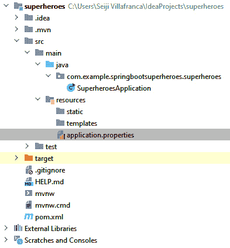
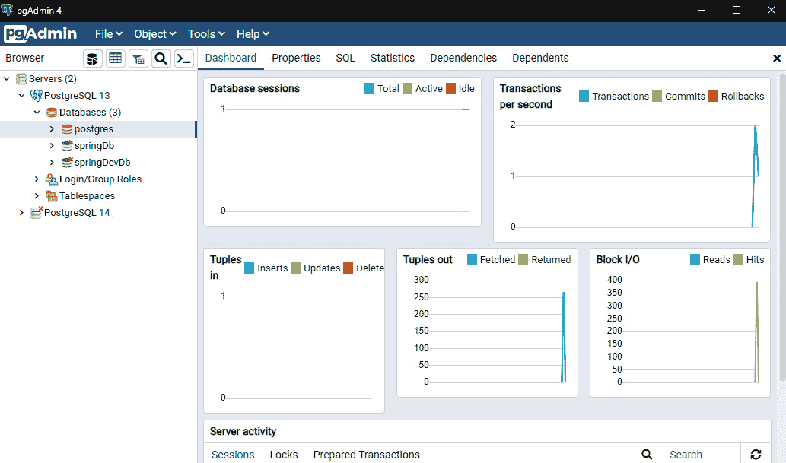
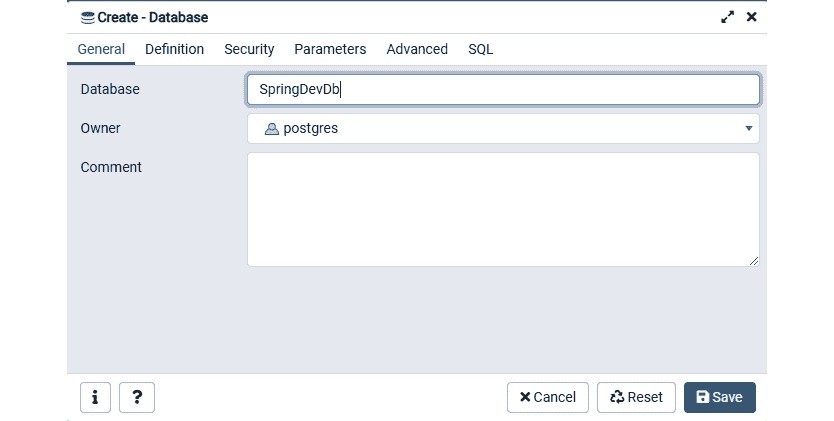
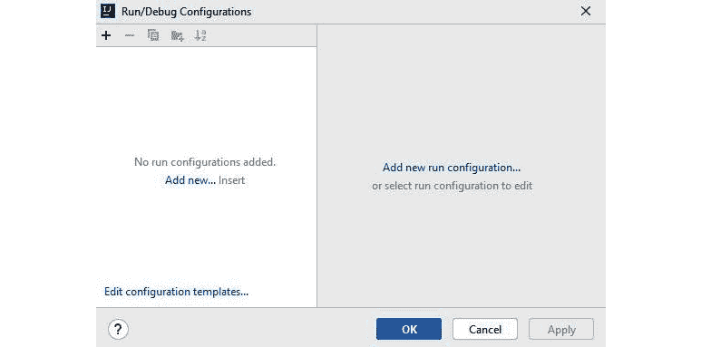
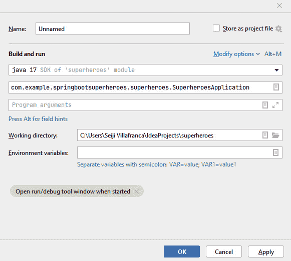
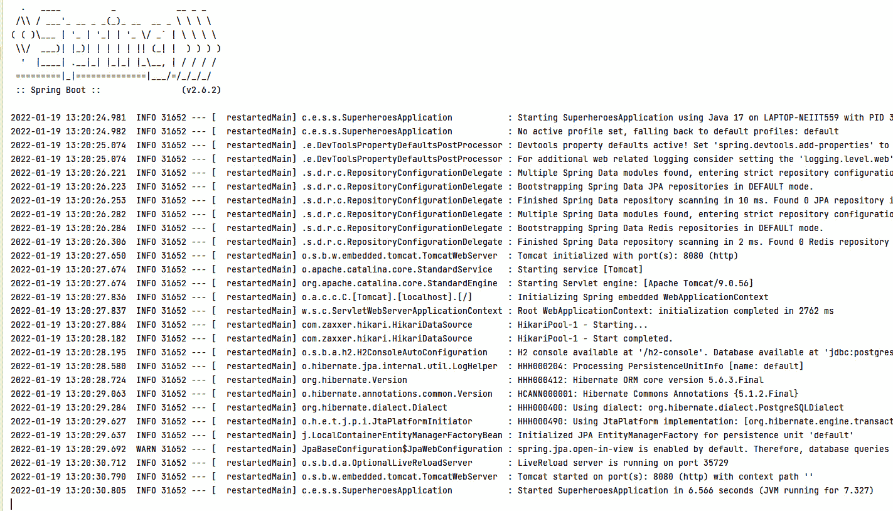
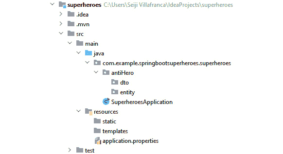
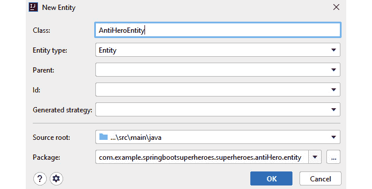

# 5

# 使用 Spring 构建 API

在上一章中，你学习了 PostgreSQL 的概念和优势，并使用安装程序或 Docker 容器在你的本地机器上设置了它。你知道如何在我们的项目中配置 **Spring Data Java 持久性 API**（**Spring Data JPA**），并使用其提供的存储库以更少的样板代码在我们的数据库上执行 **创建、读取、更新** 和 **删除**（**CRUD**）操作。最后，你还学会了如何使用 **Java 数据库连接**（**JDBC**）驱动程序和 Spring Data JPA 将你的应用程序与 PostgreSQL 连接。

本章将创建你的 Spring Boot **应用程序编程接口**（**API**）项目；我们将专注于编码，创建我们的模型，并添加控制器和服务来开发我们的端点。我们还将添加 **远程字典服务器**（**Redis**）进行缓存，以帮助提高我们的应用程序性能。

本章将涵盖以下主题：

+   启动服务器

+   添加模型

+   编写服务

+   添加控制器

+   添加 Redis 进行缓存

# 技术要求

本章没有技术要求。

本章完成版本的链接可以在以下位置找到：

[`github.com/PacktPublishing/Spring-Boot-and-Angular/tree/main/Chapter-05/superheroes`](https://github.com/PacktPublishing/Spring-Boot-and-Angular/tree/main/Chapter-05/superheroes)

# 启动服务器

在本节中，我们将尝试在我们的服务器上运行我们的 Spring Boot 应用程序，但首先，让我们回顾一下上一章：我们学习了如何配置 Spring Data JPA 并将我们的应用程序连接到我们的 PostgreSQL 数据库，并且——最重要的是——我们已经在我们的应用程序中安装了所有需要的依赖项。在运行 Spring Boot 应用程序之前，这些都是先决条件。

在以下示例中，我们将使用一个名为 `spring-boot-superheroes` 的应用程序。我们将使用 **Spring Initializr** 生成一个新的 Spring Boot 应用程序，并带有相同的依赖项。在整个开发我们的应用程序的过程中，我们还将向你展示编写 API 不同部分的几种方法，例如如何编写模型、服务和控制器。这些是目前在行业中使用的最常见方法。但首先，让我们继续运行我们的 Spring Boot 应用程序。

我们假设你已经生成了带有所需依赖项的 Spring Boot 应用程序。然而，如果你错过了这一部分或者不确定是否在你的生成项目中包含了所有依赖项，那么让我们再次列出我们在上一章中安装的所有依赖项，如下所示：

+   **Spring Data JPA**：用于内置数据存储相关实现的 Spring Data JPA 依赖项。

+   **PostgreSQL 驱动程序**：一个 JDBC 和 **响应式关系型数据库连接**（**R2DBC**）驱动程序，它将允许 Java 应用程序连接到 PostgreSQL 数据库。

+   **H2 数据库**：一个支持 JDBC API 和 R2DBC 访问的内存数据库；这通常用于单元测试。

如果你已成功初始化应用程序并添加了列出的依赖项，请打开你首选的 **集成开发环境**（**IDE**）；在下面的示例中，我们将使用 IntelliJ 进行 Spring Boot。然后，按照以下步骤操作：

1.  展开项目文件夹；我们将看到里面有几个文件夹，如下面的截图所示：



图 5.1 – Spring Boot 应用程序的项目结构

在前面的截图中，我们可以看到我们的 Spring Boot 应用程序中的文件和文件夹。我们可以在 `src/main/java` 下找到名为 `SuperHeroesApplication` 的主类。这个主类将用于在服务器上运行我们的应用程序。

`application.properties` 也是一个重要的文件，我们需要对其进行配置，因为这个文件放置了所有连接到我们数据库所必需的属性。

1.  打开 `application.properties` 文件，我们应该设置以下配置：

    ```java
    spring.main.allow-bean-definition-overriding=true
    ```

    ```java
    spring.datasource.url=jdbc:postgresql://localhost:5432/{{databasename}}
    ```

    ```java
    spring.datasource.username=postgres
    ```

    ```java
    spring.datasource.password=pass
    ```

    ```java
    spring.jpa.hibernate.ddl-auto=update
    ```

    ```java
    spring.jpa.show-sql=true
    ```

    ```java
    spring.jpa.properties.hibernate.dialect=org.hibernate.dialect.PostgreSQLDialect
    ```

    ```java
    spring.jpa.properties.hibernate.format_sql=true
    ```

此配置将允许我们连接到我们本地机器上的 **PostgreSQL 数据库**。请记住，数据库应该存在于我们的 PostgreSQL 服务器上；否则，我们的应用程序将无法成功运行。如果你还没有创建你的数据库，打开 **pgAdmin** 并输入你的主密码；在左侧面板中，展开 **服务器** 部分。

1.  你将看到你本地机器上的 PostgreSQL 实例。右键单击实例，选择 `postgres` 用户。这将现在访问我们服务器上的数据库，如下面的截图所示：



图 5.2 – 使用 pgAdmin 访问 PostgreSQL 服务器

1.  在成功访问服务器后，右键单击 **数据库**，选择 **创建**，然后点击 **数据库**；这将打开以下模态：



图 5.3 – 创建数据库

在前面的截图中，我们已将数据库命名为 `SpringDevDB` 并在 **所有者** 字段中设置了 `postgres` 用户值。点击 **保存**，我们的数据库现在已在服务器上设置好。

1.  我们 Spring Boot 应用程序现在已准备好在服务器上运行；在你的 IntelliJ IDE 中，点击面板右上角的 **添加配置**。这将打开一个模态，我们将在此配置我们的入口点以运行应用程序，如下面的截图所示：



图 5.4 – 为 Spring Boot 添加配置

1.  点击 `SuperheroesApplication`，这将自动填充程序参数为类的正确完全限定名称，如下面的截图所示：



图 5.5 – 应用程序的配置

点击 **应用**，然后点击 **确定**以保存配置更改。

1.  在 IDE 的右上角面板中选择创建的配置，通过点击绿色的播放图标来运行项目。应用程序将在默认端口 `8080` 上安装的 Tomcat 服务器上运行；我们也可以使用终端来检查 Spring Boot 项目是否已成功在服务器上启动。您可以在以下屏幕截图中看到正在运行的过程：



图 5.6 – Spring Boot 日志

在前面的屏幕截图中，我们可以看到我们的应用程序已成功启动；我们已连接到我们的 PostgreSQL 数据库，现在我们可以开始编写我们的代码。

我们将在下一节尝试创建我们的应用程序模型。

# 添加模型

在本节中，我们现在将编写我们的应用程序代码，我们将首先创建的是模型。简单来说，模型是应用程序的对象；模型将充当我们的实体，并定义数据库中的表。

一旦我们创建了模型并运行了应用程序，这将自动在数据库中生成表，这有助于注解，这一点将在整个示例中讨论。

## 使用 DTOs 和 Lombok 创建模型

我们将首先向您展示如何使用 Lombok 和 **数据传输对象**（**DTOs**）编写模型。首先，我们将讨论 DTOs。

### DTOs

DTOs 负责在进程之间传输数据以减少方法调用的数量。DTOs 是 **普通的 Java 对象**（**POJOs**），通常由数据访问器组成。

DTOs 对于创建我们实体的表示非常有用，以便为客户端提供视图，同时不影响模式和设计。让我们来看一个 DTOs 的用例示例。您可以看到如下：

```java
public class Blog {
private String id;
private String title;
private String description;
private String author;
public Blog(String title, String description,
            String author) {
   this.name = title;
   this.description = description
   this.author = author
}
```

在前面的代码中，我们创建了一个示例领域模型，它将代表我们数据库中的实体。有些情况下，我们可能不希望在发送数据到客户端时包含某些信息，这就是 DTOs 发挥作用的地方。我们将为用于获取和创建数据的博客模型创建两个 DTOs，如下所示：

```java
Public class BlogDTO {
     private String title;
     private String description;
}
```

在前面的示例 DTO 中，我们创建了一个 `BlogDTO` 类，它将用于检索数据；我们的目标是隐藏作者的名字，因此不将其作为字段包含在 DTO 中。代码如下所示：

```java
Public class BlogCreationDTO {
     private String title;
     private String description;
     private String author;
}
```

我们创建的下一个 DTO 是 `BlogCreationDTO`，它将创建一个新的博客。我们可以看到创建新博客所需的所有字段都已包含。

创建的 DTOs 将在以下章节中用于我们的控制器。

### Lombok

**Lombok** 是一个第三方库，用于通过注解减少样板代码。Lombok 允许我们避免重复的代码，尤其是在创建模型，如获取和设置方法时。

让我们比较一下没有使用 Lombok 的模型和使用 Lombok 的模型，如下所示：

```java
public class Blog {
     private String title;
     private String description;
     private String author;
     public Blog() {}
     public Blog(String title, String description,
                 String author) {
     super()
       this.name = title;
       this.description = description
       this.author = author
}
     public String getAuthor() {return author;}
     public void setAuthor(String author) {
     this.author = author; }
     public String getTitle() {return title;}
     public void setTitle(String title) {
     this.title = title; }
     public String getDescription() {return description;}
     public void setDescription(String description) {
     this.description = description; }
    @Override public String toString()
    {return "Blog ["
            + "author=" + author + ", title=" + title
            + ", " + " description =" + description + "]";
    }
}
```

在前面的代码示例中，我们没有使用 Lombok 创建了一个博客模型；我们可以看到我们已经为每个字段创建了一个 getter 和 setter 方法，我们还创建了带有和不带有参数的构造函数。这个例子中的代码仍然是可管理的。

尽管如此，如果我们的模型需要包含更多字段，我们需要为新的字段创建 setter 和 getter，在我们的模型内部创建更多样板代码，从而牺牲我们代码的可维护性。

类和注解应该如下所示：

```java
@Data
@AllArgsConstructor
@NoArgsConstructor
public class Blog {
     private String title;
     private String description;
     private String author;
}
```

在前面的屏幕截图中，我们使用了 Lombok 创建我们的博客模型，我们可以看到模型中已经省略了相当多的代码。`@Data`注解生成了 setter 和 getter 方法、`toString()`方法和带有必需参数的构造函数。

`@AllArgsConstructor`和`@NoArgsConstructor`负责生成带有所有和没有参数的构造函数。

使用 Lombok 的优势在之前的示例中已经很明显；它使代码更容易阅读和更少出错，促进了轻松的清理和维护，并提供了无力的日志记录和调试。

### 模型应用

现在我们已经了解了 DTO 和 Lombok 的重要性，让我们回到我们的 Spring Boot 应用程序。在`java`文件夹下，右键单击包并选择**包**。这将显示一个小窗口，允许您输入一个新包。

在这个例子中，我们将创建一个名为`antiHero`的新包。在完成新包后，我们将在`antiHero`下创建两个新的包，分别命名为`dto`和`entity`。您可以在下面的屏幕截图中看到这些包：



图 5.7 – 创建包后的项目结构

我们的项目结构现在应该看起来就像前面屏幕截图中所展示的那样。让我们首先创建我们的实体；右键单击我们创建的实体包，然后单击`AntiHeroEntity`并单击**确定**按钮。该过程在下面的屏幕截图中进行了说明：



图 5.8 – 创建实体

我们将在`entity`包下看到一个新生成的类，它将具有以下代码：

```java
package com.example.springbootsuperheroes.superheroes.antiHero.entity;
import javax. persistence.Entity;
import javax.persistence.Table;
@Entity
@Table(name = "anti_hero_entity")
public class AntiHeroEntity {
}
```

使用`@Entity`和`@Table`注解自动生成了一个实体，这些注解将用于将此模型识别为数据库中的对象。当前的代码将有一些问题，指出实体没有**主键**（**PK**）；在这种情况下，我们将向我们的模型添加以下内容：

+   `@Data`：Lombok 注解，将设置 getter 和 setter 方法、`toString()`方法和`@RequiredArgsConstructor`。

+   `@AllArgsConstructor`：用于生成具有所有字段作为参数的模型构造函数的 Lombok 注解。

+   `@NoArgsConstructor`：用于生成没有参数的模型构造函数的 Lombok 注解。

+   `@Id`：位于`javax.persistence.*`下，这将确定模型的 PK。

+   `@GeneratedValue`：用于主键，以确定将使用哪种生成类型。

+   `@NotNull`：位于`javax.validation.constraints`下，用于验证特定字段不能为 null。

应该通过将以下代码添加到`pom.xml`中来安装依赖项：

```java
<dependency>
   <groupId>org.springframework.boot</groupId>
   <artifactId>spring-boot-starter-validation</artifactId>
</dependency>
```

在将依赖项添加到`pom.xml`后，右键单击您的项目并选择**Maven** | **Reload project**以安装新的依赖项。

在成功添加 Lombok 注解、PK、验证和字段到我们的模型后，我们将得到以下代码：

```java
package com.example.springbootsuperheroes
.superheroes.antiHero.entity;
…
import java.text.SimpleDateFormat;
import java.util.Date;
import java.util.UUID;
import javax.persistence.*;
import javax.validation.constraints.NotNull;
import lombok.AllArgsConstructor;
import lombok.Data;
import lombok.NoArgsConstructor;
…
```

在添加所有前面的包之后，我们现在可以开始编写我们的类和注解，如下所示：

```java
@Data
@Entity
@Table
@AllArgsConstructor
@NoArgsConstructor
public class AntiHeroEntity {
    @Id
    @GeneratedValue(strategy = GenerationType.AUTO,
                    generator = "UUID")
    @Column(nullable = false, updatable = false)
    private UUID id;
    @NotNull(message = "First Name is required")
    private String firstName;
    private String lastName;
    private String house;
    private String knownAs;
    private String createdAt =
      new SimpleDateFormat("dd-MM-yyyy HH:mm:ss z")
            .format(new Date());
}
```

在前面的代码块中，我们可以看到我们添加了一个`UUID`类型的 PK；一旦我们将新的反英雄数据插入到我们的数据库中，它将自动生成。类型是通过`@GeneratedValue`注解定义的，其中我们还指明了策略将使用自动生成器。我们还添加了几个将用于存储反英雄信息的字段。

我们已经成功创建了我们的实体；现在，我们将为反英雄实体创建一个 DTO。右键单击`dto`包，选择`AntiHeroDto`。在成功创建 DTO 后，我们将以下代码放入其中：

```java
package com.example.superheroes.antiHero.dto;
import java.util.UUID;
import javax.validation.constraints.NotNull;
import lombok.Getter;
import lombok.Setter;
@Getter
@Setter
public class AntiHeroDto {
  private UUID id;
  @NotNull(message = "First Name is required")
  private String firstName;
  private String lastName;
  private String house;
  private String knownAs;
}
```

在前面的代码示例中，我们添加了只希望在将反英雄数据发送到客户端时显示的字段；在这种情况下，我们在我们的 DTO 中移除了`createdAt`字段。我们还添加了`@Getter`和`@Setter`注解来生成我们的 DTO 的 getter 和 setter 方法，最后，我们还添加了`@NotNull`验证来匹配我们的约束与实体。

我们已经使用 Lombok 在我们的应用程序中成功创建了 DTO 和模型。在下一节中，我们将使我们的服务负责 Spring Boot 应用程序的 CRUD 功能。

# 编写服务

在本节中，我们现在将编写我们的应用程序服务，但首先，让我们讨论 Spring Boot 中服务的主要目的。服务是我们放置所有业务逻辑的类；这是我们将在 JPA 仓库的帮助下编写我们的 CRUD 功能的地方。在这种情况下，我们不仅将创建我们的服务类，还将创建我们的 JPA 仓库。

## JPA 仓库

如*第四章*中所述，*设置数据库和 Spring Data JPA*，JPA 仓库是管理 Java 应用程序中关系数据的广泛使用的规范。它通过不实现读写操作来减少样板代码，从而帮助开发 Spring。

在 Spring Boot 中创建 JPA 仓库非常简单；话虽如此，JPA 库提供了如`CrudRepository`之类的类，我们可以用来扩展我们的类。让我们在我们的 Spring Boot 应用程序示例中创建一个。按照以下步骤进行：

1.  右键点击我们的 `antiHero` 包，选择 **New**，然后点击 **Package** 选项。

1.  创建一个名为 `repository` 的新包。

1.  在创建新包后，右键点击 `repository` 包，选择 **New**，然后点击 **Class** 选项。

1.  当小模态弹出时，切换到 `AntiHeroRepository`。以下代码将被生成：

    ```java
    package com.example.springbootsuperheroes.superheroes.antiHero.repository;
    ```

    ```java
    import com.example.springbootsuperheroes.superheroes.antiHero.entity.AntiHeroEntity;
    ```

    ```java
    import org.springframework.data.repository.CrudRepository;
    ```

    ```java
    import java.util.UUID;
    ```

    ```java
    public interface AntiHeroRepository {
    ```

    ```java
    }
    ```

我们已经创建了我们的接口，但这只是一个简单的接口。我们将通过 `CrudRepository` 类扩展我们的接口，将其转换为 JPA 仓库，如下所示：

```java
public interface AntiHeroRepository extends CrudRepository<AntiHeroEntity, UUID> {
}
```

`AntiHeroRepository`，因为我们已经通过 `CrudRepository<Type, ID>` 扩展了它，将具有以下功能的方法：

+   持久化、更新和删除博客实体之一。

+   通过主键（PK）查找一个或多个博客。

+   统计所有博客的数量。

+   验证单个博客是否存在。

我们已成功创建我们的 JPA 仓库；我们的下一步是进行服务。我们的目标是创建一个服务，该服务将能够获取整个列表，通过主键（PK）获取单个数据库，插入新数据，更新选定数据，以及删除数据。我们可以通过以下由 JPA 仓库提供的方法来实现这一点：

+   `findAll()`: 获取特定实体中的所有现有数据。

+   `findById(Id)`: 通过主键（PK）查找特定的数据库。

+   `save()`: 在表中插入新数据。

+   `save(data)`: 更新表中的现有数据。

+   `deleteById(id)`: 通过主键（PK）删除表中的特定数据。

现在我们已经成功识别出我们服务所需的方法，接下来创建我们的服务。右键点击 `antiHero` 包并创建一个名为 `service` 的新包；在创建新包后，在 `service` 包下创建一个名为 `AntiHeroService` 的新类，并将以下方法放在服务中：

```java
public class AntiHeroService {
    private final AntiHeroRepository repo;
    public Iterable<AntiHeroEntity> findAllAntiHeroes() {
        return repo.findAll();
    }
    public AntiHeroEntity findAntiHeroById(UUID id) {
        return findById(id);
    }
    public void removeAntiHeroById(UUID id) {
        repo.deleteById(id);
    }
    public AntiHeroEntity addAntiHero(
      AntiHeroEntity antiHero) {
        return repo.save(antiHero);
    }
    public void updateAntiHero(UUID id,
      AntiHeroEntity antiHero) {
        repo.save(antiHero);
    }
}
```

让我们讨论前面的代码；我们已向我们的服务添加了几个方法，这些方法在此处有更详细的解释：

+   `Iterable<AntiHeroEntity> findAllAntiHeroes()`: 此方法从 `AntiHeroRepository` 调用 `findAll()`，返回 `AntiHeroEntity` 的 `Iterable` 实例。

+   `AntiHeroEntity findAntiHeroById(UUID id)`: 此方法从 `AntiHeroRepository` 调用 `findById(id)`，根据 `Id` 值返回单个 `AntiHeroEntity` 实例。

+   `removeAntiHeroById(UUID id)`: 此方法从 `AntiHeroRepository` 调用 `deleteById(id)`，根据 `Id` 值删除单个 `AntiHeroEntity` 实例。

+   `void AntiHeroEntity addAntiHero(AntiHeroEntity antiHero)`: 此方法从 `AntiHeroRepository` 调用 `save()` 并在数据库中插入新的 `AntiHeroEntity` 实例。

+   `void updateAntiHero(UUID id, AntiHeroEntity antiHero)`: 此方法从 `AntiHeroRepository` 调用 `save(antiHero)`，在数据库中更新特定的 `AntiHeroEntity` 实例。

在成功添加我们的服务的方法之后，我们将向`AntiHeroService`添加`@AllArgsConstructor`和`@Service`注解。`@AllArgsConstructor`是 Lombok 的一个注解，它将生成一个需要每个字段一个参数的构造函数；在我们的例子中，这将生成以下代码：

```java
public AntiHeroService(AntiHeroRepository repo) {
  this.repo = repo;
}
```

现在，这将允许我们将`AntiHeroRepository`依赖项连接到我们的服务上。

另一方面，当我们希望 Spring 上下文根据其分类自动检测类时，`@Service`注解是功能性的。

我们现在已经成功创建了具有 CRUD 方法的服务，但如果在调用服务时出了问题怎么办？例如，我们传递的反英雄的**标识符**（**ID**）可能不存在。我们希望捕获错误并向用户返回一个可理解的消息。现在，我们将为我们的服务创建运行时异常处理。

### 运行时异常

**运行时异常**也被称为未检查异常。这些是编程错误，将在我们应用程序的当前执行中发生。这应该直接由开发者来预防。

这里列出了一些已知的运行时异常：

+   `IndexOutOfBoundsException`：当我们访问一个数组字符串或可迭代的索引超出范围时，会发生此异常，如下面的代码片段所示：

    ```java
    String[] array = new String[100];
    ```

    ```java
    String name = array[200]; // throws index out of bounds as array variable only has a length of 100
    ```

+   `IllegalArgumentException`：当方法被传递了一个非法参数时，会发生此异常，如下面的代码片段所示：

    ```java
    public class Hero {
    ```

    ```java
       int number;
    ```

    ```java
       public void givePositiveNumber(int number) {
    ```

    ```java
          if(number < 0)  throw new
    ```

    ```java
            IllegalArgumentException(
    ```

    ```java
              Integer.toString(number));
    ```

    ```java
          else { m = number; }
    ```

    ```java
       }
    ```

    ```java
       public static void main(String[] args) {
    ```

    ```java
          Hero h = new Hero();
    ```

    ```java
          // throws illegal argument exception as -1 is a
    ```

    ```java
          // negative number
    ```

    ```java
          h.givePositiveNumber(-1);
    ```

    ```java
    }
    ```

    ```java
       }
    ```

+   `NullPointerException`：当访问一个不指向任何对象或简单地为 null 的变量时，会发生此异常，如下面的代码片段所示：

    ```java
    public void doAction(ExampleObject obj) {   obj.doActionOnMethod();
    ```

    ```java
    }
    ```

    ```java
    // call doAction()
    ```

    ```java
    // throws null pointer exception as we are accessing a
    ```

    ```java
    // method on a null object
    ```

    ```java
    doAction(null)
    ```

这些只是我们在应用程序中使用的常见运行时异常；我们也可以使用`RunTimeException`类来创建运行时异常。在这个例子中，让我们创建一个`NotFoundException`运行时异常，我们将使用它来获取一个不存在的 ID。按照以下步骤进行：

1.  在`main`包下，创建一个名为`exception`的新包；在成功创建包之后，创建一个名为`NotFoundException`的类。我们将使用`RunTimeException`类扩展我们创建的类，并将添加以下代码：

    ```java
    public class NotFoundException extends RuntimeException {
    ```

    ```java
        public NotFoundException(String message) {
    ```

    ```java
            super(message);
    ```

    ```java
        }
    ```

    ```java
        public NotFoundException(String message,
    ```

    ```java
                                 Throwable cause) {
    ```

    ```java
            super(message, cause);
    ```

    ```java
        }
    ```

    ```java
        public NotFoundException(Throwable cause) {
    ```

    ```java
            super(cause);
    ```

    ```java
        }
    ```

    ```java
    }
    ```

在前面的代码片段中，我们已声明了几个带有不同参数的`NotFoundException`方法；在成功创建我们的自定义异常后，我们现在可以在我们的服务中使用它。

1.  返回到`AntiHeroService`，我们将添加以下方法：

    ```java
    private AntiHeroEntity findOrThrow(final UUID id) {
    ```

    ```java
        return repo
    ```

    ```java
                .findById(id)
    ```

    ```java
                .orElseThrow(
    ```

    ```java
                   () -> new NotFoundException("Anti-hero
    ```

    ```java
                         by id " + id + " was not found")
    ```

    ```java
                );
    ```

    ```java
    }
    ```

在前面的代码示例中，我们创建了一个名为`findOrThrow()`的新方法；这同样是在调用`findById()`方法。唯一的区别是它检查给定的 ID 是否存在于数据库中；否则，它将根据我们的代码抛出某些内容。在这种情况下，我们希望抛出一个`NotFoundException`运行时异常。

1.  在此之后，我们可以在`findAntiHeroById()`中使用它，通过将`findById()`替换为`findOrThrow()`方法，并将其添加到`updateAntiHero()`和`deleteAntiHero()`方法中，以在更新或删除之前检查数据是否存在。完成此操作的代码如下所示：

    ```java
    public AntiHeroEntity findAntiHeroById(UUID id) {
    ```

    ```java
      return findOrThrow(id);
    ```

    ```java
    }
    ```

    ```java
    public void updateAntiHero(UUID id,
    ```

    ```java
                               AntiHeroEntity antiHero) {
    ```

    ```java
      findOrThrow(id);
    ```

    ```java
      repo.save(antiHero);
    ```

    ```java
    }
    ```

我们现在已经成功创建了我们的应用程序服务。下一节将讨论如何在我们的代码中创建控制器和定义端点。

## 添加控制器

本节将讨论控制器在应用程序中的使用以及如何创建它们。**控制器**负责拦截传入的请求并将请求的有效负载转换为数据的内部结构；这也是我们将定义前端应用程序可访问的端点路径的地方。

在创建控制器时，我们将使用几个注解，如下所述：

+   `@RestController`：这是`@Controller`注解的专用形式；与使用`@Controller`注解相比，它已经包含了`@Controller`和`@ResponseBody`注解，不需要在每个方法上指定`@ResponseBody`注解。

+   `@RequestMapping`：这是一个用于将**超文本传输协议**（**HTTP**）请求映射到**表现层状态转移**（**REST**）控制器方法上的注解。它也是我们定义控制器基本路径的地方。

+   `@GetMapping`：这个注解将 HTTP `GET`请求映射到方法上；该注解是`@RequestMapping(method = RequestMethod.GET)`的快捷方式。

+   `@PutMapping`：这个注解将 HTTP `PUT`请求映射到方法上；该注解是`@RequestMapping(method = RequestMethod.PUT)`的快捷方式。

+   `@PostMapping`：这个注解将 HTTP `POST`请求映射到方法上；该注解是`@RequestMapping(method = RequestMethod.POST)`的快捷方式。

+   `@DeleteMapping`：这个注解将 HTTP `DELETE`请求映射到方法上；该注解是`@RequestMapping(method = RequestMethod.DELETE)`的快捷方式。

+   `@PathVariable`：这个注解用于获取端点参数的值。

+   `@Valid`：这个注解用于检查对象的合法性；它通常用于请求体上，以检查传递的请求是否是有效的对象。

我们已经成功确定了我们将用于我们控制器的注释。现在我们可以创建我们的控制器了。在`antiHero`包下，创建一个名为`controller`的新包，完成`controller`包后，创建一个名为`AntiHeroController`的新类。

在`AntiHeroController`类中，我们将使用`@AllArgsConstructor`、`@RestController`和`@RequestMapping`注释，如下所示：

```java
@AllArgsConstructor
@RestController
@RequestMapping("api/v1/anti-heroes")
public class AntiHeroController {
}
```

我们的控制器的配置现在已经完成；下一步是将我们的依赖项放入我们的控制器中。我们使用了`@AllArgsContructor`注解。我们不需要创建带有参数的构造方法；我们只需要定义依赖项。

首先，我们将确定包含所有 CRUD 逻辑的`AntiHeroService`类。下一个是`ModelMapper`；这很重要，因为我们需要在将实体用作响应时将其转换为 DTO，反之亦然，如果我们想从请求体中读取对象。`ModelMapper`将轻松地将实体的值映射到具有相同属性的 DTO 对象。

要安装依赖项，我们只需将以下代码添加到我们的`pom.xml`文件中：

```java
<!--Dto mapper-->
<dependency>
   <groupId>org.modelmapper</groupId>
   <artifactId>modelmapper</artifactId>
   <version>2.3.9</version>
</dependency>
```

在成功添加`ModelMapper`依赖项后，我们需要在配置中将我们的`ModelMapper`依赖项定义为 Bean，以便在应用程序中使用。为此，我们将在`main`包下创建一个新的名为`config`的包，并创建一个名为`ModelMapperConfig`的新类。创建新类后，我们将添加一个带有`@Bean`注解的新方法，并返回一个`ModelMapper`的新实例。代码如下所示：

```java
@Configuration
public class ModelMapperConfig {
  @Bean
  public ModelMapper modelMapper() {
    return new ModelMapper();
  }
}
```

我们的所有配置都已经完成，现在，我们可以将`AntiHeroService`和`ModelMapper`添加到我们的控制器中，如下所示：

```java
@AllArgsConstructor
@RestController
@RequestMapping("api/v1/anti-heroes")
public class AntiHeroController {
    private final AntiHeroService service;
     private final ModelMapper mapper;
}
```

我们现在已经有了带有所需依赖项的控制器。现在，让我们创建两个函数，将我们的实体转换为 DTO，或者反过来。正如之前提到的，我们将使用`ModelMapper`依赖项来创建这些方法，在这种情况下，我们将添加以下代码：

```java
private AntiHeroDto convertToDto(AntiHeroEntity entity) {
  return mapper.map(entity, AntiHeroDto.class);
}
private AntiHeroEntity convertToEntity(AntiHeroDto dto) {
  return mapper.map(dto, AntiHeroEntity.class);
}
```

我们在先前的代码示例中创建了两个函数。首先，我们创建了`convertToDto()`方法，它将给定的`AntiHeroEntity`实例转换为`AntiHeroDto`实例，我们使用了`ModelMapper`的`map()`方法来映射实体的值。第二个函数是`convertToEntity()`方法，它将 DTO 转换为实体。

现在，我们可以为我们的 CRUD 方法创建映射。让我们首先创建一个方法，该方法将根据`id`值返回一个特定的实体；我们将使用`@GetMapping`注解来标识这将使用`GET`请求，并将`/{id}`作为参数添加，表示我们可以将实体 ID 作为动态参数传递到端点中。

在创建方法时，我们将使用`@PathVariable`注解来获取端点中`/{id}`的值，并将其定义为`UUID`类型。最后，我们将在`AntiHeroService`下调用`service.findAntiHeroById()`函数，并将检索到的 ID 传递给数据库中的实体，我们将使用`convertToDto()`函数将其转换为 DTO。代码如下所示：

```java
@GetMapping("/{id}")
public AntiHeroDto getAntiHeroById(@PathVariable("id") UUID id) {
  return convertToDto(service.findAntiHeroById(id));
}
```

现在，为了创建`create`映射，我们将使用`@PostMapping`注解来标识这将使用`POST`请求，我们将使用`@RequestBody`注解来获取请求体中的对象，我们还可以使用`@Valid`注解来检查该对象是否是一个有效的实体。

在创建函数时，我们将调用`convertToEntity()`方法将对象转换为实体，并将调用`service.addAntiHero()`方法将转换后的实体插入到数据库中。代码如下所示：

```java
@PostMapping
public AntiHeroDto postAntiHero(@Valid @RequestBody AntiHeroDto antiHeroDto) {
  var entity = convertToEntity(antiHeroDto);
  var antiHero = service.addAntiHero(entity);
  return convertToDto(antiHero);
}
```

下一步我们需要创建的是`PUT`映射。我们将使用`@PutMapping`注解来标识这将使用`PUT`请求，这与我们创建`GET`映射的方式相同。我们将添加`/{id}`作为参数，并且我们还将使用`@RequestBody`注解来获取请求体中的对象，以及使用`@PathVariable`注解来获取参数中`id`的值。

在实现函数时，我们还将调用`convertToEntity()`方法，并调用`service.updateAntiHero(id, entity)`方法来使用 DTO 值更新特定实体。代码如下所示：

```java
@PutMapping("/{id}")
public void putAntiHero(
  @PathVariable("id") UUID id,
  @Valid @RequestBody AntiHeroDto antiHeroDto
) {
  if (!id.equals(antiHeroDto.getId())) throw new
    ResponseStatusException(
    HttpStatus.BAD_REQUEST,
    "id does not match."
  );
  var antiHeroEntity = convertToEntity(antiHeroDto);
  service.updateAntiHero(id, antiHeroEntity);
}
```

接下来，我们将创建`DELETE`映射。我们将使用`@DeleteMapping`注解来标识这将使用`DELETE`请求。我们还将添加`/{id}`作为参数来接收需要删除的实体的 ID，并添加`@PathVariable`注解来获取`id`的值。

要实现该方法，我们只需调用`service.removeAntiHeroById()`方法来删除数据库中的特定实体，如下所示：

```java
@DeleteMapping("/{id}")
public void deleteAntiHeroById(@PathVariable("id") UUID id) {
  service.removeAntiHeroById(id);
}
```

最后，我们需要创建一个方法，该方法将返回数据库中的所有实体。我们可以实现这一点的其中一种方法是通过使用`StreamSupport`将检索到的列表转换为流，并将每个对象转换为 DTO，但首先，我们将创建一个带有`@GetMapping`注解的返回`List<AntiHeroDto>`类型的方法。完成方法后，我们现在将调用`service.findAllAntiHeroes()`方法来获取数据库中的实体。由于这返回一个`Iterable`实例，我们将将其转换为流，并使用`Collectors.toList()`将其转换为列表。代码如下所示：

```java
  var antiHeroList = StreamSupport
    .stream(service.findAllAntiHeroes().spliterator(),
            false)
    .collect(Collectors.toList());
```

在成功检索并将数据转换为列表后，我们希望将每个对象转换为 DTO。我们可以通过将列表转换为流来实现这一点。调用`convertToDto()`方法并将其再次转换为列表，如下所示：

```java
  antiHeroList
    .stream()
    .map(this::convertToDto)
    .collect(Collectors.toList());
```

我们将在响应中返回转换后的列表，现在我们的方法将如下所示：

```java
@GetMapping
public List<AntiHeroDto> getAntiHeroes() {
  var antiHeroList = StreamSupport
    .stream(service.findAllAntiHeroes().spliterator(),
            false)
    .collect(Collectors.toList());
  return antiHeroList
    .stream()
    .map(this::convertToDto)
    .collect(Collectors.toList());
}
```

我们已经在控制器上成功创建了映射，我们的代码应该看起来像这样：

```java
@AllArgsConstructor
@RestController
@RequestMapping("api/v1/anti-heroes")
public class AntiHeroController {
    private final AntiHeroService service;
    private final ModelMapper mapper;
…
    public AntiHeroDto getAntiHeroById(
      @PathVariable("id") UUID id) {
        return convertToDto(service.findAntiHeroById(id));
    }
    @DeleteMapping("/{id}")
    public void deleteAntiHeroById(
      @PathVariable("id") UUID id) {
        service.removeAntiHeroById(id);
    }
    @PostMapping
    public AntiHeroDto postAntiHero(
       @Valid @RequestBody AntiHeroDto antiHeroDto) {
        var entity = convertToEntity(antiHeroDto);
        var antiHero = service.addAntiHero(entity);
…
        return mapper.map(dto, AntiHeroEntity.class);
    }
}
```

我们已经完成了我们的 Spring Boot 应用程序，我们创建了我们的模型和 DTO，它定义了我们的对象结构，我们构建了负责业务逻辑的服务，我们还创建了映射我们应用程序中 HTTP 请求的控制器，因此我们的端点将按预期工作。

尽管如此，我们可以在性能方面改进我们的后端，我们可以通过缓存机制来实现这一点。在下一节中，我们将讨论 Redis 的概念和应用。

# 添加 Redis 进行缓存

在本节中，我们现在将讨论 Redis，它可以提高我们 REST 应用程序的性能。Redis 是一个开源的内存键值数据存储，允许数据驻留在内存中以实现低延迟和更快的数据访问。与传统数据库相比，Redis 不需要磁盘访问，所有数据都缓存在内存中，这提供了更快的响应。

现在，它被广泛使用，尤其是在接收数百万请求的大型应用程序中。它与不同的数据结构兼容，如字符串、列表、集合、散列、位图和地理空间，并且与 **发布/订阅**（**Pub/Sub**）兼容，用于实时聊天应用程序。

## 安装 Redis 服务器

在我们的 Spring Boot 应用程序中使用 Redis 之前，我们需要在我们的终端中安装 Redis 服务器。让我们讨论如何在不同的操作系统上安装 Redis。

### macOS

在 macOS 系统中安装 Redis 非常简单；我们可以使用 Homebrew 来安装 Redis 并执行以下命令：

```java
brew install redis
```

在成功安装后，我们可以使用以下命令设置 Redis 服务器自动启动：

```java
brew services start redis
```

我们已经在 macOS 上成功安装并运行了我们的 Redis 服务器。

### Ubuntu Linux

对于在 Ubuntu OS 上安装 Redis，我们将执行以下命令：

```java
sudo apt-get install redis-server
```

这将自动在端口 `6739` 上安装并启动 Redis 服务器，并且我们已经成功在 Linux 上安装并运行了我们的 Redis 服务器。

### Windows

对于在 Windows 上安装 Redis，我们可以从以下链接安装不同版本：[`github.com/microsoftarchive/redis/releases`](https://github.com/microsoftarchive/redis/releases)，下载 `.zip` 或 `.msi` 文件，并将其解压到您选择的目录。运行 `Redis-server.exe` 文件以在端口 `6739` 上启动 Redis 服务器。

因此，我们已经成功在 Windows 上安装并运行了我们的 Redis 服务器。我们现在可以在我们的 Spring Boot 应用程序中使用 Redis。

## 在 Spring Boot 上配置 Redis

我们已经在本地机器上成功配置并启动了 Redis 服务器；我们的下一步是将在开发的 Spring Boot 项目中使用 Redis。我们现在将遵循以下步骤：

1.  我们需要做的第一件事是包含 Redis 依赖项；为了实现这一点，我们需要将以下代码添加到我们的 `pom.xml` 文件中：

    ```java
    <!-- Redis -->
    ```

    ```java
    <dependency>
    ```

    ```java
       <groupId>org.springframework.data</groupId>
    ```

    ```java
       <artifactId>spring-data-redis</artifactId>
    ```

    ```java
       <version>2.4.5</version>
    ```

    ```java
    </dependency>
    ```

    ```java
    <dependency>
    ```

    ```java
       <groupId>redis.clients</groupId>
    ```

    ```java
       <artifactId>jedis</artifactId>
    ```

    ```java
       <version>3.5.1</version>
    ```

    ```java
       <type>jar</type>
    ```

    ```java
    </dependency>
    ```

在成功添加 Redis 依赖项后，我们将添加我们的 `config` 包。

1.  创建一个名为 `RedisConfig` 的类。我们将使用 `@Configuration` 注解来标识这个类是否有 Bean 定义方法，这些方法将在应用程序执行时启动。我们还将向我们的类添加以下方法：

    ```java
    @Bean
    ```

    ```java
    JedisConnectionFactory jedisConnectionFactory() {
    ```

    ```java
      RedisStandaloneConfiguration
    ```

    ```java
        redisStandaloneConfiguration =
    ```

    ```java
          new RedisStandaloneConfiguration();
    ```

    ```java
      return new JedisConnectionFactory(
    ```

    ```java
        redisStandaloneConfiguration);
    ```

    ```java
    }
    ```

`jedisConnectionFactory()` 是用于识别 Redis 服务器连接属性的函数；由于我们没有指定连接属性，它使用默认值。

尽管如此，如果我们的 Redis 服务器托管在不同的服务器上，在不同的端口上，或者有用户名和密码，我们可以使用以下方法：

+   `redisStandaloneConfiguration.setHostName("host")`：这设置了 Redis 服务器运行的**统一资源定位符**（**URL**）的主机。

+   `redisStandaloneConfiguration.setPort("port")`：这设置了应用程序将连接的端口。

+   `redisStandaloneConfiguration.setUsername("username")`：这设置了 Redis 服务器的用户名。

+   `redisStandaloneConfiguration.setPassword("password")`：这设置了 Redis 服务器的密码。

下一步是使用连接工厂创建一个 Redis 模板；这用于 Redis 数据交互。它允许在 Redis 服务器中存储的对象和二进制数据之间自动序列化和反序列化。

1.  我们将创建一个方法，它也将使用`@Bean`注解；我们将创建一个新的 Redis 模板，并使用以下代码设置连接工厂：

    ```java
    RedisTemplate<UUID, Object> template = new RedisTemplate<>();
    ```

    ```java
    template.setConnectionFactory(jedisConnectionFactory());
    ```

在成功创建连接工厂的模板实例后，我们还可以根据数据结构定义序列化器。如果我们想使用默认的序列化器，即`JdkSerializationRedisSerializer`，我们只需返回一个模板实例。

1.  在以下代码片段中，我们为不同的数据结构使用了不同的序列化器：

    ```java
    @Bean
    ```

    ```java
      public RedisTemplate<UUID, Object> redisTemplate() {
    ```

    ```java
        RedisTemplate<UUID, Object> template =
    ```

    ```java
          new RedisTemplate<>();
    ```

    ```java
        template.setConnectionFactory(
    ```

    ```java
          jedisConnectionFactory());
    ```

    ```java
        template.setKeySerializer(
    ```

    ```java
          new StringRedisSerializer());
    ```

    ```java
        template.setHashKeySerializer(
    ```

    ```java
          new StringRedisSerializer());
    ```

    ```java
        template.setHashKeySerializer(
    ```

    ```java
          new JdkSerializationRedisSerializer());
    ```

    ```java
        template.setValueSerializer(
    ```

    ```java
          new JdkSerializationRedisSerializer());
    ```

    ```java
        template.setEnableTransactionSupport(true);
    ```

    ```java
        template.afterPropertiesSet();
    ```

    ```java
        return template;
    ```

    ```java
      }
    ```

    ```java
    }
    ```

1.  我们需要做的最后一件事是将`@RedishHash`注解添加到我们的实体上。这作为标记对象作为一个聚合根存储在 Redis 哈希中；在我们的例子中，我们将它在`AntiHeroEntity`上使用，如下所示：

    ```java
    @RedishHash("AntiHero")
    ```

    ```java
    public class AntiHeroEntity {
    ```

    ```java
    …
    ```

    ```java
    }
    ```

这样，我们就可以成功地在 Spring Boot 应用程序上使用 Redis 服务器来缓存数据，随着操作的执行。

# 摘要

通过这种方式，我们已经到达了本章的结尾。让我们回顾一下你学到的宝贵知识。你学会了如何使用 IntelliJ 在 Tomcat 服务器上启动 Spring Boot 应用程序。你还知道了如何通过创建实体、使用 Lombok 和 DTO、编写带有 CRUD 逻辑的服务以及使用 JPA 仓库、创建控制器（使用 HTTP 注解和`ModelMapper`将实体转换为 DTO，反之亦然）来逐步创建一个完整的 Spring Boot 应用程序。

最后，你也学会了如何配置 Redis 服务器并在 Spring Boot 应用程序中使用它。

你在这里学到的技能将使你的代码因为 Lombok 和 JPA 仓库而易于阅读和简洁。

在下一章中，我们将学习如何使用`springdoc-openapi`和 Swagger UI 为我们的 API 创建文档。
