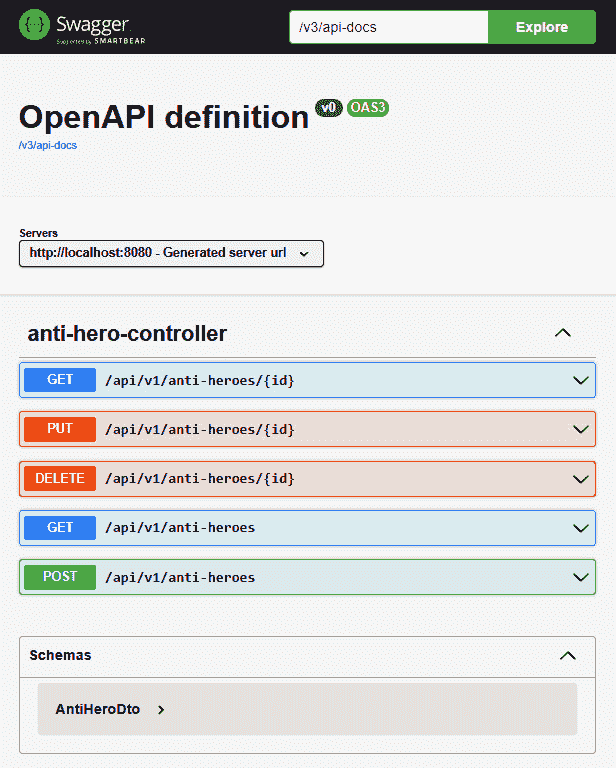
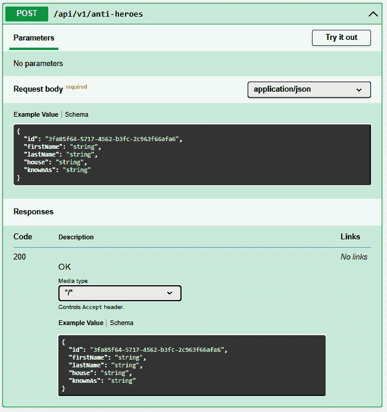
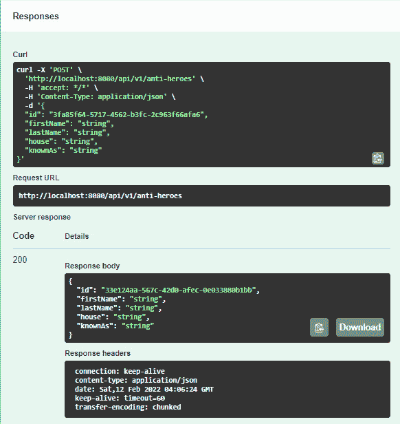
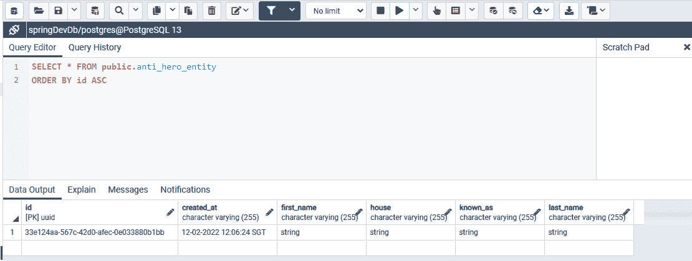
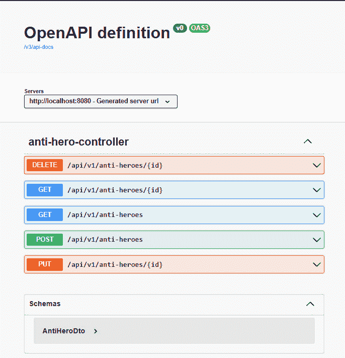
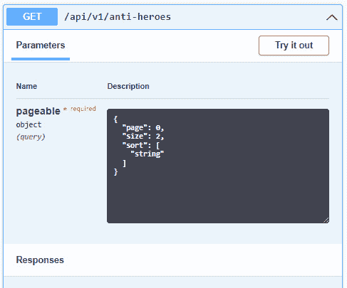

# 第六章：使用 OpenAPI 规范记录 API

在上一章中，我们学习了如何开发我们的 Spring Boot 应用程序。首先，我们使用 IntelliJ 配置了应用程序在服务器上运行。然后，我们开发了 REST 应用程序的不同部分，例如模型和实体，它们作为对象；服务，它们包含业务逻辑并调用 JPA 仓库在数据库中执行 CRUD 操作；以及控制器，它们定义了端点。我们还学习了如何应用 Redis，它为我们的 REST API 添加了缓存机制以改善性能。

本章将专注于创建我们的 Spring Boot 项目的文档。我们将专注于配置 `springdoc-openapi` 和 Swagger UI，并为我们开发的端点实时生成文档。

在本章中，我们将涵盖以下主题：

+   设置 `springdoc-openapi`

+   设置 Swagger UI

# 技术要求

以下链接将带您进入本章的完成版本：[`github.com/PacktPublishing/Spring-Boot-and-Angular/tree/main/Chapter-06/superheroes`](https://github.com/PacktPublishing/Spring-Boot-and-Angular/tree/main/Chapter-06/superheroes)。

# 设置 springdoc-openapi

在本节中，我们将配置我们的 Spring Boot 应用程序中的 `springdoc-openapi`。由于我们在上一章中开发了 REST API，接下来我们需要做的是为我们的端点创建文档。这是一个至关重要的部分，尤其是在开发行业中，因为它将告诉开发者可以实现哪些端点，所需的请求及其格式，以及调用端点时预期的响应体。这也减少了关于 API 集成的错误和冲突，因为可用的端点是透明的。然而，手动创建文档的主要缺点是它既繁琐又容易出错。这就是 `springdoc-openapi` 发挥作用的地方。

首先，让我们讨论一下 `springdoc-openapi` 是什么。`springdoc-openapi` 是一个库，它自动生成 Spring Boot 项目的 API 文档。这种自动化之所以可能，是因为该库使用注解、类结构和 Spring 配置来识别可用的 API。

`springdoc-openapi` 可以生成必要的文档，以 JSON/YAML 和 HTML API 的形式，可以通过我们应用程序上生成的新 URL 查看。它还支持几个框架和协议，包括以下内容：

+   `spring-boot`

+   JSR-303，特别是用于 `@NotNull`、`@Min`、`@Max` 和 `@Size`

+   `swagger-ui`

+   OAuth 2

现在，让我们讨论 `springdoc-openapi` 的属性和插件。

## springdoc-openapi 的属性

我们可以根据我们的偏好修改 `.springdoc-openapi` 的行为和设置。它有不同的属性，我们可以在 `application.properties` 文件下设置它们的值。

这里是 `springdoc-openapi` 中常用的一些属性：

+   `springdoc.swagger-ui.path`：默认值是 `/swagger-ui.html`。它定义了访问 HTML 文档的路径。

+   `springdoc.swagger-UI.enabled`：默认值是 `true`。它启用或禁用 `swagger-UI` 端点。

+   `springdoc.swagger-ui.configUrl`：默认值是 `/v3/api-docs/swagger-config`。这是一个检索外部配置文档的 URL。

+   `springdoc.swagger-ui.layout`：默认值是 `BaseLayout`。这是 Swagger UI 用于显示文档的最高级布局。

+   `springdoc.swagger-ui.tryItOutEnabled`：默认值是 `false`。它启用或禁用 **尝试使用** 部分，用户可以在其中测试端点。

+   `springdoc.swagger-ui.filter`：默认值是 `false`。它启用或禁用过滤并添加一个文本框来放置过滤条件。它可以是布尔值或字符串；这将作为过滤表达式。

+   `springdoc.swagger-ui.operationsSorter`：这将对 API 的操作列表进行排序。值可以是 `'alpha'`（按路径字母数字排序）、`'method'`（按 HTTP 方法排序）或一个将标识排序标准的函数。

+   `springdoc.swagger-ui.tagsSorter`：这将对 API 的操作列表进行排序。值可以是 `'alpha'`（按路径字母数字排序）或一个将标识排序标准的函数。

## springdoc-openapi 的插件

`springdoc-openapi` 还有一些插件，我们可以使用它们来生成文档。让我们看看。

### springdoc-openapi-maven-plugin

`springdoc-openapi-maven-plugin` 在构建时生成 JSON 和 YAML OpenAPI 描述。该插件也在集成阶段工作。要启用该插件，我们需要将以下声明添加到 `pom.xml` 文件的 `<plugin>` 部分：

```java
<plugin>
    <groupId>org.springframework.boot</groupId>
    <artifactId>spring-boot-maven-plugin</artifactId>
    <version>${spring-boot-maven-plugin.version}</version>
    <configuration>
       <jvmArguments>
         -Dspring.application.admin.enabled=true

       </jvmArguments>
    </configuration>
    <executions>
        <execution>
            <goals>
                <goal>start</goal>
                <goal>stop</goal>
            </goals>
        </execution>
    </executions>
</plugin>
```

我们刚刚添加了 `spring-boot-maven-plugin` 插件。复制前面的代码并将其粘贴到您的 `.pom` 文件中。

现在，让我们在 `spring-boot-maven-plugin` 插件代码块下方添加 `springdoc-openapi-maven-plugin` 的 1.4 版本：

```java
<plugin>
    <groupId>org.springdoc</groupId>
    <artifactId>springdoc-openapi-maven-plugin</artifactId>
    <version>1.4</version>
    <executions>
        <execution>
            <id>integration-test</id>
            <goals>
                <goal>generate</goal>
            </goals>
        </execution>
    </executions>
</plugin>
```

我们还可以通过指定以下属性来自定义 `openapi-maven-plugin` 的行为：

+   `attachArtifact`：默认值是 `false`。它将 API 文档部署到仓库。

+   `apiDocsUrl`：默认值是 `http://localhost:8080/v3/api-docs`。这是指向生成的 JSON 或 YAML 描述的本地 URL。

+   `outputDir`：默认值是 `project.build.directory`。这是生成 OpenAPI 描述的位置。

+   `outputFileName`：默认值是 `openapi.json`。这指定了生成 OpenAPI 描述时的文件名。

+   `skip`：如果设置为 `true`，则跳过执行。

+   `headers`：默认值是 `empty`。它指定了请求中要发送的头部列表。

以下代码示例显示了如何使用这些属性：

```java
<plugin>
 <groupId>org.springdoc</groupId>
 <artifactId>springdoc-openapi-maven-plugin</artifactId>
 <version>${version}</version>
 <executions>
  <execution>
   <id>integration-test</id>
   <goals>
    <goal>generate</goal>
   </goals>
  </execution>
 </executions>
 <configuration>
  <apiDocsUrl>
    http://localhost:8080/v3/api-docs</apiDocsUrl>
  <outputFileName>openapi.json</outputFileName>
  <outputDir>/home/springdoc/output-folder</outputDir>
  <skip>false</skip>
  <headers>
    <header1-key>header1-value</header1-key>
  </headers>
 </configuration>
</plugin>
```

在前面的 XML 代码示例中，我们添加了几个属性以应用 OpenAPI 的自定义配置。我们手动设置了输出文件名、目录和用于生成 API 文档的标题。

### springdoc-openapi-gradle-plugin

`springdoc-openapi-gradle-plugin` 从 Gradle 构建中为 Spring Boot 应用程序生成 OpenAPI 规范。要启用插件，我们必须在我们的 `plugins` 部分放置以下代码：

```java
plugins {
      id "org.springframework.boot" version "${version}"
      id "org.springdoc.openapi-gradle-plugin"
          version "${version}"
}
```

一旦添加了插件和依赖项，以下任务将被创建：

+   `generateOpenApiDocs`：将运行以生成 OpenAPI 文档的任务。`generateOpenApiDocs` 对应用程序的文档 URL 进行 REST 调用，以将 OpenAPI 文档存储为 JSON 格式。

+   `forkedSpringBootRun`：Spring Boot 应用程序使用此任务在后台运行

我们还可以通过指定以下属性来自定义 `openapi-graven-plugin` 的行为：

+   `apiDocsUrl`：可以下载 Open API 文档的 URL

+   `outputDir`：文档生成的目录

+   `outputFileName`：生成的输出文件名

+   `waitTimeInSeconds`：在调用 REST API 生成 OpenAPI 文档之前等待 Spring Boot 应用程序启动的秒数

+   `forkProperties`：运行您的 Spring Boot 应用程序所需的系统属性

+   `groupedApiMappings`：一组 URL，可以从这些 URL 下载 OpenAPI 文档

要使用这些属性，我们必须使用 `generateOpenApiDocs` 指定它们：

```java
openApi {
    apiDocsUrl.set("https://localhost:4000/api/docs")
    outputDir.set(file("$buildDir/docs"))
    outputFileName.set("swagger-test.json")
    waitTimeInSeconds.set310)
    forkProperties.set("-Dspring.profiles.active=special")
    groupedApiMappings.set(
      ["https://localhost:8000/v3/api-docs/group-1" to
       "swagger-group-1.json",
       "https://localhost:8000/v3/api-docs/group-2" to
       "swagger-group-2.json"])
}
```

通过这样，我们已经了解了在 OpenAPI 文档中我们可以使用的属性和插件。现在，让我们为我们的 Spring Boot 应用程序配置插件。

## 配置 springdoc-openapi

现在，我们将在我们的 Spring Boot 应用程序中安装和配置 `springdoc-openapi`。首先，我们必须将依赖项添加到我们之前创建的项目中。转到 `pom.xml` 文件，并添加以下 XML 代码：

```java
 <dependency>
      <groupId>org.springdoc</groupId>
 <artifactId>springdoc-openapi-ui</artifactId>         <version>1.6.4</version>
</dependency>
```

在成功安装 OpenAPI 依赖项后，我们可以运行我们的 Spring Boot 项目。一旦服务器启动，我们可以访问 `http://localhost:8080/v3/api-docs/` 来获取 JSON 格式的 OpenAPI 文档。您将看到所有端点和它们相关的 HTTP 请求都显示为 JSON 对象。以下是我们项目生成的 JSON 文档片段：

```java
{
  "servers": [
    {
      "url": "http://localhost:8080/",
      "description": "Generated server url"
    }
  ],
  "paths": {
    "/api/v1/anti-heroes/{id}": {
      "get": {
        "tags": [
          "anti-hero-controller"
        ],
        "operationId": "getAntiHeroById",
        "parameters": [
          {
            "name": "id",
            "in": "path",
            "required": true,
            "schema": {
              "type": "string",
              "format": "uuid"
            }
          }
        ],
        "responses": {
          "200": {
            "description": "OK",
            "content": {
              "*/*": {
                "schema": {
                  "$ref": "#/components/schemas/AntiHeroDto" …… // other created paths UPDATE DELETE and CREATE Inputs
```

在这里，我们可以看到生成的 JSON 对象显示了项目中的可用端点。它显示了操作 ID，这是方法的默认名称；它还指定了所需的参数类型和端点的可能响应。

我们已经使用了 OpenAPI 可以访问的默认 URL。我们可以通过应用程序的 `springdoc.api-docs.path property.properties` 文件来更改 URL。例如，我们将其设置为 `springdoc.api-docs.path=rest-docs`，这意味着我们现在可以通过 `http://localhost:8080/rest-docs/` 访问 JSON 文档。

我们也可以通过访问 `http://localhost:8080/v3/api-docs.yaml` 来获取文档的 YAML 版本。

通过这样，我们已经成功使用 `springdoc-openapi` 生成我们端点的文档。在下一节中，我们将学习如何配置、访问和使用 Swagger UI。

# 设置 Swagger UI

**Swagger UI** 是一个文档工具，它允许用户直接从浏览器中调用项目中可用的 API。这是一个更互动的工具，它使得 API 的使用更加详细和实用。Swagger UI 也是开源的，这使得更多的社区能够支持这个工具。

## 安装和使用 Swagger UI

Swagger UI 已经包含在 `springdoc-openapi-ui` 依赖项中。我们已经通过添加以下代码来包含 OpenAPI 扩展代码：

```java
<dependency>
      <groupId>org.springdoc</groupId>
      <artifactId>springdoc-openapi-ui</artifactId>
      <version>1.6.4</version>
</dependency>
```

OpenAPI 依赖项包括 Swagger UI 扩展；我们可以通过以下 URL 访问 UI：`http://localhost:8080/swagger-ui.html`。这将打开 Swagger UI 的 **OpenAPI** **定义** 页面：



图 6.1 – Swagger UI 的 OpenAPI 定义页面

在这里，我们可以看到我们的 Swagger UI 已经成功访问。我们在 Spring Boot 项目中创建的端点及其 HTTP 方法也显示出来。让我们讨论 Swagger UI 文档的不同部分。

在 Swagger UI 中，我们首先可以看到它包含文本输入，以及 `v3/api-docs`。这意味着我们使用 OpenAPI 库生成的 JSON 文档正在被 Swagger 用于获取可用的端点。

我们可以更改它并访问包含 OpenAPI 文档的 URL，该文档以 JSON 或 YAML 格式存在。接下来我们将看到的是我们项目中可用的端点列表。在先前的例子中，我们在 Swagger UI 中列出了我们开发的五个端点。这不是一个列表，因为 Swagger UI 工具是互动的，允许我们尝试可用的端点。

让我们看看以下示例：



图 6.2 – 对反英雄的 POST 请求

我们可以展开 `/api/v1/anti-heroes` 端点来在我们的数据库中创建一个新的反英雄对象，因为这是使用 `POST` HTTP 方法。我们需要在请求体中传递的对象的架构被指定。它定义了属性的名字和类型。在这种情况下，反英雄实体具有以下架构：

```java
{
  "id": "3fa85f64-5717-4562-b3fc-2c963f66afa6",
  "firstName": "string",
  "lastName": "string",
  "house": "string",
  "knownAs": "string"
}
```

在示例端点中也指定了可能的响应。可能的响应状态为 `200`，表示成功。它还将返回数据库中的新创建实体。

我们想测试端点并将一些示例数据插入到数据库中。为此，我们必须点击右上角的 **Try it out** 按钮，然后点击 **Execute** 按钮来调用端点。一旦 API 调用成功，我们将看到以下输出：



图 6.3 – POST 请求的响应

在这里，我们可以看到 API 成功返回，因为它返回了一个 **代码** 为 **200** 的新创建的数据库实体。

我们可以通过访问 `pgAdmin` 来检查我们的端点是否已成功将数据插入到我们的表中，如下面的截图所示：



图 6.4 – 验证是否已从 POST 请求中插入数据

在前面的例子中，我们可以看到我们的数据已经成功插入到我们的表中。现在，我们可以通过获取、更新或删除数据库中创建的数据来测试其他可用的端点。

我们已经成功导航通过 Swagger UI 工具并与之交互，但我们也可以通过使用属性来修改 Swagger UI，以符合我们的偏好和需求，就像我们可以对 OpenAPI 文档所做的那样。我们还可以修改 URL 以访问 Swagger UI；例如，我们可以在 `application.properties` 文件中放置 `springdoc.swagger-ui.path=/{custom-path}.html`。

我们还可以修改的其他行为是我们的端点的排序行为。我们可以根据 `alpha`（按字母数字顺序排列）或 `method`（按方法排列）来更改端点在列表中的排列方式，或者我们可以使用自定义函数来更改排序方法。为此，我们可以在 `application.properties` 文件中放置 `springdoc.swagger-ui.operationsSorter=(排序行为)`。

在这个例子中，我们将使用 `springdoc.swagger-ui.operationsSorter=method`。我们将看到以下输出：



图 6.5 – 按方法排列的端点

如我们所见，我们的端点现在按照 HTTP 方法排列。

## 在 Swagger UI 中显示分页信息

Swagger UI 也可以与使用分页的端点集成。我们可以指定页码、每页列表的大小和排序表达式。为了在 Swagger UI 中集成分页参数，我们需要添加 `springdoc-open-data-rest` 依赖项。

要添加库，我们必须将以下代码添加到我们的 `pom.xml` 文件中：

```java
<dependency>
   <groupId>org.springdoc</groupId>
   <artifactId>springdoc-openapi-data-rest</artifactId>
     <version>1.6.4</version>
</dependency>	
```

在成功添加库之后，让我们修改 `AntiHeroesController` 下的 `getAntiHeroes` 方法，以便我们有一个工作的分页功能：

```java
…. import org.springframework.data.domain.Pageable;
@GetMapping
public List<AntiHeroDto> getAntiHeroes(Pageable pageable) {
    int toSkip = pageable.getPageSize() *
                 pageable.getPageNumber();
    var antiHeroList = StreamSupport
            .stream(service.findAllAntiHeroes().spliterator(), false)
            .skip(toSkip).limit(pageable.getPageSize())
            .collect(Collectors.toList());
    return antiHeroList
            .stream()
            .map(this::convertToDto)
            .collect(Collectors.toList());
}
```

现在，让我们扩展使用 `GET` 方法的 `api/v1/anti-heroes`：



图 6.6 – 反英雄的 GET 方法

在这里，我们可以看到 **参数** 部分有一个 **pageable** 属性，并且我们可以指定我们想要检索的页面、每页的大小和排序表达式。现在，我们可以执行它以从数据库中检索数据。

# 摘要

有了这个，我们就到达了本章的结尾。让我们回顾一下你学到的宝贵知识。

首先，你学习了`springdoc-openapi`提供的功能和属性，以及如何配置和使用 OpenAPI 规范来生成我们 API 调用的 JSON 和 YAML 文档。你还学习了如何访问 Swagger UI，这是一个可以直接在浏览器中调用 API 的交互式文档工具。我们模拟了发送测试调用和修改某些行为，例如域名 URL 和排序顺序。这种为生成 API 文档的新知识在现实世界的应用中非常有用。开发者可以利用这些知识轻松地识别可消费的 API，以及它们的参数和对象响应。

在下一章中，我们将学习**跨源资源共享**（**CORS**）、Spring Security 以及**JSON Web Tokens**（**JWTs**）的概念。
