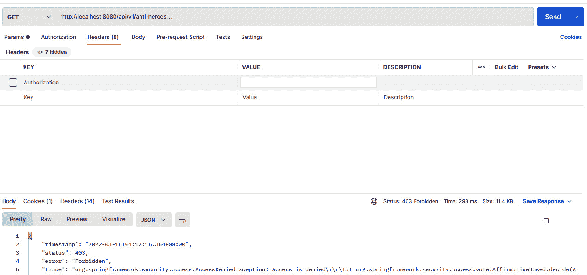
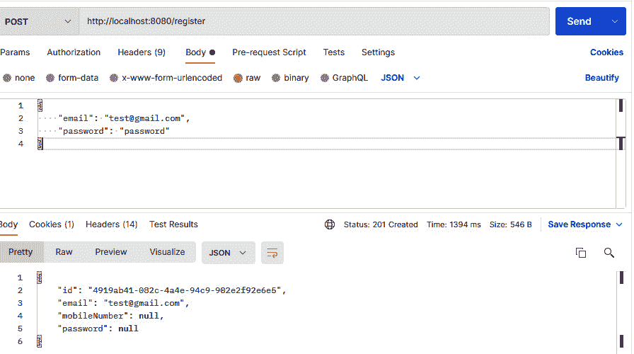
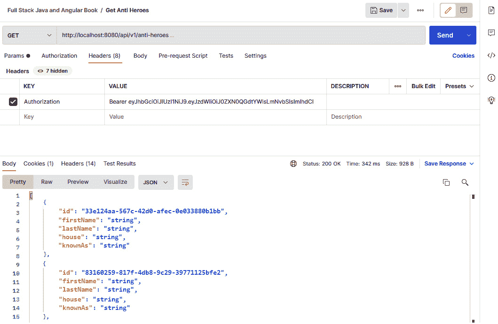

# 第七章：添加 Spring Boot 安全性与 JWT

在上一章中，我们主要学习了如何在 Spring Boot 项目中为创建的 API 生成自动化文档。我们学习了如何添加和使用 `springdoc-openapi` 的特性和属性，配置项目上的插件，以及访问生成的 JSON 和 YAML 文档。我们还学习了如何实现 Swagger UI，使我们的文档交互式，并允许我们在浏览器上直接测试端点。

本章现在将关注我们应用程序的安全方面。我们将讨论 **跨源资源共享**（**CORS**）的概念以及它如何保护我们的应用程序。我们还将讨论 Spring Boot 中 Spring Security 的特性和实现、**JSON Web Token**（**JWT**）的概念以及 **身份即服务**（**IDaaS**）。

在本章中，我们将涵盖以下主题：

+   理解 CORS

+   添加 CORS 策略

+   理解 Spring Security

+   Spring Boot 中的身份验证和授权

+   IDaaS

# 技术要求

本章代码的完成版本链接在此：[`github.com/PacktPublishing/Spring-Boot-and-Angular/tree/main/Chapter-07/superheroes`](https://github.com/PacktPublishing/Spring-Boot-and-Angular/tree/main/Chapter-07/superheroes)。

# 理解 CORS

当我们作为开发者创建应用程序时，可能已经多次遇到过 CORS 这个术语。然而，我们可能会提出诸如 CORS 是做什么的？或者在应用程序中实现 CORS 的优势是什么等问题。带着这些问题，在本节中，我们将深入探讨 CORS 的概念和特性，并了解它是如何用于保护我们的应用程序的。

CORS 是一种基于头部的机制，允许服务器定义一组允许访问应用程序资源的域、方案或端口。CORS 通常用于 REST API。不同的前端应用程序可以访问我们后端应用程序下的 API，尤其是在复杂的架构中。我们不希望我们的 API 被未知的应用程序访问，而 CORS 负责保护这部分。

让我们来看一个简单的跨源请求示例。假设我们有一个前端应用程序，其域为 `https://domain-one.com`，以及一个后端应用程序，其域为 [`domain-two.com`](https://domain-two.com)。我们可以看到我们的应用程序由不同的域提供服务，一旦前端应用程序向后端发送请求，这被视为跨源请求。

我们永远不应该忘记，浏览器默认会限制跨源请求，并且只有请求资源的源包含适当的 CORS 头部并且被后端应用程序允许时，才允许请求同源资源。这只是 CORS 的工作原理的一个简单示例。让我们更详细地了解一下 CORS 的概念。

## CORS 的工作原理

CORS 是一个基于头部的机制，这意味着实现跨源共享的第一步是添加新的 HTTP 头部，这些头部将描述允许访问资源的来源列表。这些头部可以被视为我们沟通的关键。HTTP 头部分为两类，如下所示：

+   请求头部

+   响应头部

### 请求头部

请求头部是客户端为了使用 CORS 机制所必需的头部。它们如下所示：

+   `Origin`：这表示请求客户端的来源或简单地表示前端应用程序的主机。

+   `Access-Control-Request-Method`：这个头部在预检请求中使用，用于指示用于发送请求的 HTTP 方法。

+   `Access-Control-Request-Headers`：这个头部在预检请求中使用，用于指示请求中使用的 HTTP 头部列表。

让我们看看使用请求头部的一个请求示例：

```java
curl -i -X OPTIONS localhost:8080/api/v1 \
-H 'Access-Control-Request-Method: GET' \
-H 'Access-Control-Request-Headers: Content-Type, Accept' \
-H 'Origin: http://localhost:4200
```

### 响应头部

响应头部是服务器随响应发送的头部。它们如下所示：

+   `Access-Control-Allow-Origin`：这是一个用于指定服务器上资源访问来源的头部。

+   `Access-Control-Expose-headers`：这个头部指示浏览器可以访问的头部。

+   `Access-Control-Max-Age`：这是一个指示预检请求过期信息的头部。

+   `Access-Control-Allow-Credentials`：这是一个指示当请求具有有效凭据时浏览器可以访问响应的头部。

+   `Access-Control-Allow-Headers`：这个头部指示在请求中允许使用的头部列表。

+   `Access-Control-Allow-Methods`：这是一个指示在服务器中允许使用的请求方法列表的头部。

让我们看看给定头部我们希望得到的响应示例：

```java
HTTP/1.1 204 No Content
Access-Control-Allow-Origin: *
Access-Control-Allow-Methods: GET,HEAD,PUT,PATCH,POST,DELETE
Vary: Access-Control-Request-Headers
Access-Control-Allow-Headers: Content-Type, Accept
Content-Length: 0
Date: Sun, 16 Nov 2022 3:41:08 GMT+8
Connection: keep-alive
```

这些是我们将使用以允许 CORS 机制的标准头部，但存在几种不同的场景，在这些场景中跨源共享是有效的。

#### 简单请求

这些请求不会触发 CORS 预检请求，并且由于没有初始请求，将直接发送到服务器进行验证。要考虑一个请求是简单的，它应该满足以下条件：

+   使用 `POST` 和 `GET` 方法。

+   包含可以手动设置的头部，例如 `Accept`、`Accept-Language`、`Content-Language` 和 `Content-Type`。

+   `Content-Type` 应该具有以下类型之一：`text/plain`、`multipart/form-data` 或 `application/x-www-form-urlencoded`。

+   请求中没有使用 `ReadableStream` 对象。

让我们看看一个简单请求的示例：

```java
GET /content/test-data/ HTTP/1.1
Host: example.host
User-Agent: Mozilla/5.0 (X11; Linux x86_64) AppleWebKit/537.36 (KHTML, like Gecko) Chrome/77.0.3865.90 Safari/537.36
Accept: text/html,application/xhtml+xml,application/xml;q=0.9,*/*;q=0.8
Accept-Language: en-us,en;q=0.5
Accept-Encoding: gzip,deflate
Connection: keep-alive
Origin: https://frontend.com
```

这个请求将在客户端和服务器之间执行一个简单的交换。作为响应，服务器返回带有 `Access-Control-Allow-Origin: *` 的头部，这意味着资源或端点可以被任何来源访问。

#### 预检请求

浏览器会发送一个测试或第一个 HTTP 请求，使用`OPTIONS`方法来验证请求是否被允许或安全。预请求总是发生在跨源请求上，因为预请求会检查是否允许或允许不同的源访问资源。

让我们看看一个预请求的例子：

```java
OPTIONS /content/test-data/ HTTP/1.1
Host: example.host
User-Agent: Mozilla/5.0 (X11; Linux x86_64) AppleWebKit/537.36 (KHTML, like Gecko) Chrome/77.0.3865.90 Safari/537.36
Accept: text/html,application/xhtml+xml,application/xml;q=0.9,*/*;q=0.8
Accept-Language: en-us,en;q=0.5
Accept-Encoding: gzip,deflate
Connection: keep-alive
Origin: https://frontend.com
Access-Control-Request-Method: POST
Access-Control-Request-Headers: X-PINGOTHER, Content-Type
```

之前的例子显示，预请求使用`OPTIONS`请求方法来执行预请求。`OPTIONS`方法用于从服务器获取更多信息，以确定实际请求是否被允许。

我们还可以看到`Access-Control-Request-Method`和`Access-Control-Request-Headers`被识别。这表示实际请求中要使用的请求头部和请求方法。

这是头部信息：

```java
HTTP/1.1 204 No Content
Date: Sun, 16 Nov 2022 3:41:08 GMT+8
Server: Apache/2
Access-Control-Allow-Origin: https://frontend.com
Access-Control-Allow-Methods: POST, GET, OPTIONS
Access-Control-Allow-Headers: X-PINGOTHER, Content-Type
Access-Control-Max-Age: 86400
Vary: Accept-Encoding, Origin
Keep-Alive: timeout=2, max=100
Connection: Keep-Alive
```

现在，在之前的例子中，这是一个预请求返回的示例响应。`Access-Control-Allow-Origin`表示只有指定域名（例如示例中的`https://frontend.com`）的资源访问是被允许的。`Access-Control-Allow-Methods`确认`POST`和`GET`是有效的请求方法。`Access-Control-Allow-Headers`确保`X-PINGOTHER`和`Content-Type`是实际请求中适当的头部。

我们已经学习了 CORS 的基本概念；现在，我们将在下一节中实现 Spring Boot 应用程序中的 CORS。

# 添加 CORS 策略

我们已经了解了 CORS 的工作原理及其对我们应用程序安全性的优势。现在，我们将在我们的 Spring Boot 项目中配置和实现一个 CORS 策略。

在我们的项目中配置 CORS 有几种方法。我们将逐一讨论。

## 每个方法的 CORS 应用

我们可以在单个端点上启用 CORS；这意味着我们可以为其他端点指定不同的允许源。让我们看看以下例子：

```java
@CrossOrigin
@GetMapping
public List<AntiHeroDto> getAntiHeroes(Pageable pageable) {
  ..code implementation
}
```

在我们的 Spring Boot 项目中，我们有`getAntiHeroes()`方法。为了在特定方法上启用 CORS，我们将使用`@CrossOrigin`注解。我们可以看到我们没有配置任何其他设置，并且这适用以下情况：

+   所有源都被允许。

+   允许的 HTTP 方法是配置给该方法的方法（在这个方法中，允许的 HTTP 方法是`GET`）。

+   预请求响应的时间被缓存了 30 分钟。

我们也可以通过添加`origin`、`methods`、`allowedHeaders`、`exposedHeaders`、`allowedCredentials`和`maxAge`的值来指定 CORS 策略的配置：

```java
@CrossOrigin(origin = "origin.example")
@GetMapping
public List<AntiHeroDto> getAntiHeroes(Pageable pageable) {
  ..code implementation
}
```

## 控制器级别的 CORS 应用

在之前的配置中，我们是在每个方法上添加 CORS。现在，我们将在控制器级别添加 CORS 策略。让我们看看以下例子：

```java
@CrossOrigin
@AllArgsConstructor
@RestController
@RequestMapping("api/v1/anti-heroes")
public class AntiHeroController {
.. methods
}
```

我们可以看到在类级别添加了`@CrossOrigin`。这意味着 CORS 策略将被添加到`AntiHeroController`下的所有方法。

## 控制器和方法的 CORS 应用

我们可以在我们的应用程序中同时应用控制器和方法级别的 CORS 应用。让我们看看以下示例：

```java
@CrossOrigin(allowedHeaders = "Content-type")
@AllArgsConstructor
@RestController
@RequestMapping("api/v1/anti-heroes")
public class AntiHeroController {
    private final AntiHeroService service;
    private final ModelMapper mapper;
    @CrossOrigin(origins = "http://localhost:4200")
    @GetMapping
    public List<AntiHeroDto> getAntiHeroes(Pageable   pageable) {
… code implementation
     }
```

在我们的示例中，我们可以看到我们在控制器和方法级别都应用了 `@CrossOrigin` 注解，`@CrossOrigin(allowedHeaders = "Content-type")` 将应用于 `AntiHeroController` 下的所有方法，而 `@CrossOrigin(origins = http://localhost:4200)` 仅应用于 `getAntiHeroes()` 方法，因此其他方法将允许所有来源。

## 全局 CORS 配置

我们可以实现的最后一种实现 CORS 策略的方法是使用 `CorsFilter`：

1.  第一步是为我们的 CORS 策略添加一个配置类。为此，请访问我们项目的 `config` 文件夹并创建一个名为 `CorsConfig` 的新类。我们将添加 `@Configuration` 注解以在应用程序启动时将此类识别为配置类，并且我们应该有以下的代码：

    ```java
    @Configuration
    ```

    ```java
    public class CorsConfig {
    ```

    ```java
    }
    ```

1.  下一步是创建我们的 `CorsFilter Bean`。我们将仅创建一个带有 `@Bean` 的新方法，该方法返回一个 `CorsFilter` 对象：

    ```java
    @Bean
    ```

    ```java
    CorsFilter corsFilter() {
    ```

    ```java
    CorsConfiguration corsConfiguration =
    ```

    ```java
      new CorsConfiguration();
    ```

    ```java
    }
    ```

1.  在 `corsFilter()` 方法下，我们将放置所有的 CORS 设置。我们将实例化一个 `CorsConfiguration` 对象，我们将通过调用几个方法来设置其属性。我们将使用的方法如下：

    +   `setAllowCredentials()` 方法指示浏览器是否应在跨源请求中发送诸如 cookies 之类的凭据。这意味着如果我们检索 cookies 和 **跨站请求伪造**（**CSRF**）令牌，我们希望将此选项设置为 `true`：

        ```java
        corsConfiguration.setAllowCredentials(true);
        ```

    +   `setAllowedOrigins()` 方法允许我们设置可以访问我们的端点的允许来源。这些是受信任的前端应用程序的域名。在以下示例中，我们已将 `http://localhost:4200` 设置为，这将是我们的前端应用程序的开发服务器：

        ```java
        corsConfiguration.setAllowedOrigins(Arrays.asList("http://localhost:4200"));
        ```

    +   `setAllowedHeaders()` 方法允许我们配置 HTTP 请求中允许的头列表。在前面的示例中，我们已设置了一些可以在请求中使用的头：

        ```java
        corsConfiguration.setAllowedHeaders(
        ```

        ```java
                Arrays.asList(
        ```

        ```java
                        "Origin",
        ```

        ```java
                        "Access-Control-Allow-Origin",
        ```

        ```java
                        "Content-Type",
        ```

        ```java
                        "Accept",
        ```

        ```java
                        "Authorization",
        ```

        ```java
                        "Origin, Accept",
        ```

        ```java
                        "X-Requested-With",
        ```

        ```java
                        "Access-Control-Request-Method",
        ```

        ```java
                        "Access-Control-Request-Headers"
        ```

        ```java
                )
        ```

        ```java
        );
        ```

    +   `setExposedHeaders()` 方法允许我们指定来自服务器的响应头列表。我们可以使用此方法通过安全措施限制响应中的头：

        ```java
        corsConfiguration.setExposedHeaders(
        ```

        ```java
                Arrays.asList(
        ```

        ```java
                        "Origin",
        ```

        ```java
                        "Content-Type",
        ```

        ```java
                        "Accept",
        ```

        ```java
                        "Authorization",
        ```

        ```java
                        "Access-Control-Allow-Origin",
        ```

        ```java
                        "Access-Control-Allow-Origin",
        ```

        ```java
                        "Access-Control-Allow-Credentials"
        ```

        ```java
                )
        ```

        ```java
        );
        ```

    +   `setAllowedMethods()` 方法将允许我们添加授权用于访问端点的 HTTP 请求方法。在以下示例中，我们已将 `GET`、`POST`、`PUT`、`DELETE` 和 `OPTIONS` 配置为允许的方法，因为我们只构建一个简单的 **创建、读取、更新和删除**（**CRUD**）应用程序：

        ```java
        corsConfiguration.setAllowedMethods(
        ```

        ```java
                Arrays.asList("GET", "POST", "PUT", "DELETE",
        ```

        ```java
                              "OPTIONS")
        ```

        ```java
        );
        ```

1.  我们需要做的最后一步是注册 CORS 配置。我们将实例化一个新的`urlBasedCorsConfigurarationSource()`，并使用`registerCorsConfiguration()`方法进行注册。第一个参数是`"/**"`，表示配置适用于应用程序中找到的所有方法，第二个参数是`corsConfiguration`，这是我们创建的配置：

    ```java
    var urlBasedCorsConfigurationSource =
    ```

    ```java
      new UrlBasedCorsConfigurationSource();
    ```

    ```java
    urlBasedCorsConfigurationSource.registerCorsConfiguration(
    ```

    ```java
            "/**",
    ```

    ```java
            corsConfiguration
    ```

    ```java
    );
    ```

    ```java
    return new CorsFilter(urlBasedCorsConfigurationSource);
    ```

1.  注册后，我们将使用配置源作为`CorsFilter`的参数，以下是成功配置 CORS 设置后我们的`corsFilter()`方法将如何看起来：

    ```java
    @Bean
    ```

    ```java
    CorsFilter corsFilter() {
    ```

    ```java
        CorsConfiguration corsConfiguration =
    ```

    ```java
          new CorsConfiguration();
    ```

    ```java
        corsConfiguration.setAllowCredentials(true);
    ```

    ```java
        corsConfiguration.setAllowedOrigins(
    ```

    ```java
          Arrays.asList("http://localhost:4200"));
    ```

    ```java
        corsConfiguration.setAllowedHeaders(
    ```

    ```java
          Arrays.asList("Origin",
    ```

    ```java
            "Access-Control-Allow-Origin",
    ```

    ```java
            "Content-Type","Accept","Authorization",
    ```

    ```java
            "Origin, Accept","X-Requested-With",
    ```

    ```java
            "Access-Control-Request-Method",
    ```

    ```java
            "Access-Control-Request-Headers"));
    ```

    ```java
        corsConfiguration.setExposedHeaders(
    ```

    ```java
          Arrays.asList( "Origin","Content-Type",
    ```

    ```java
          "Accept","Authorization",
    ```

    ```java
          "Access-Control-Allow-Origin",
    ```

    ```java
          "Access-Control-Allow-Origin",
    ```

    ```java
          "Access-Control-Allow-Credentials"));
    ```

    ```java
        corsConfiguration.setAllowedMethods(
    ```

    ```java
           Arrays.asList("GET", "POST", "PUT", "DELETE",
    ```

    ```java
                         "OPTIONS")
    ```

    ```java
        );
    ```

    ```java
        var urlBasedCorsConfigurationSource =
    ```

    ```java
          new UrlBasedCorsConfigurationSource();
    ```

    ```java
        urlBasedCorsConfigurationSource
    ```

    ```java
          .registerCorsConfiguration(
    ```

    ```java
                "/**",
    ```

    ```java
                corsConfiguration
    ```

    ```java
        );
    ```

    ```java
        return new CorsFilter(
    ```

    ```java
          urlBasedCorsConfigurationSource);
    ```

    ```java
    }
    ```

在启动我们的应用程序后，我们现在将 CORS 配置应用于我们项目中的所有方法。我们已经成功地在我们的应用程序中实现了 CORS 策略，但这只是我们保护应用程序的一部分。

在下一节中，我们将讨论 Spring Security 的概念以及如何在 Spring Boot 项目中实现它。

# 理解 Spring Security

**Spring Security** 是一个在 Spring Boot 应用程序中广泛使用的应用级安全框架。它是一个灵活的认证框架，为 Java 应用程序提供了大多数标准安全需求。Spring Security 因其允许开发人员即时与其他模块集成不同的授权和认证提供者而受到欢迎。

由于我们在应用程序中使用 Spring Security，我们不需要从头开始编写安全相关的任务，因为 Spring Security 在幕后提供了这些功能。

让我们进一步讨论 Spring Security 的概念。

## Spring Security 的特性

Spring Security 主要关注将认证和授权集成到应用程序中。为了比较这两个概念，**认证**指的是验证用户可以访问您的应用程序并识别用户是谁。这主要指的是登录页面本身。另一方面，**授权**用于更复杂的应用程序；这关系到特定用户可以在您的应用程序中执行的操作或动作。

授权可以通过集成角色来实现用户访问控制。Spring Security 还提供了不同的密码编码器——单向变换密码——如下所示：

+   `BCryptPasswordEncoder`

+   `Argon2PasswordEncoder`

+   `Pbkdf2PasswordEncoder`

+   `SCryptPasswordEncoder`

上述列表是最常用的密码编码器，当使用 Spring Security 时可以直接访问。它还提供了不同的功能，将帮助您满足安全需求，如下所示：

+   **轻量级目录访问协议**（**LDAP**）：一种在互联网协议上包含和访问分布式目录信息服务协议。

+   **记住我**：此功能提供了一种从单台机器记住用户的能力，以防止再次登录。

+   **单点登录**（**SSO**）：此功能允许用户使用单个账户访问多个应用程序，集中管理用户信息。

+   **软件本地化**：此功能使我们能够用我们喜欢的语言开发用户界面。

+   **HTTP 认证**：此功能提供授权。

+   **基本访问认证**：此功能提供基本的认证过程，请求需要用户名和密码。

+   **摘要访问认证**：此功能提供更安全的认证，在访问资源之前确认用户的身份。

+   **Web 表单认证**：将生成一个表单，可以直接从网页浏览器中验证用户凭据。

Spring Security 为应用程序提供了一系列功能。在这种情况下，Spring Security 的设计根据其功能被划分为独立的 **Java 归档**（**JAR**）文件，只需安装我们开发所需的部分。

以下是在 Spring Security 模块中包含的 JAR 文件列表：

+   `spring-security-core`：应用程序使用 Spring Security 的标准要求。`Spring-security-core` 包含核心认证类和接口。

+   `spring-security-web`：此 JAR 文件用于 Web 认证和基于 URL 的访问控制。它位于 `org.springframework.security.web` 下。

+   `spring-security-config`：此 JAR 文件用于实现 Spring Security 配置，使用 XML 和 Java。所有类和接口都位于 `org.springframework.security.config` 下。

+   `spring-security-ldap`：此 JAR 文件是我们在应用程序中实现 LDAP 所必需的。所有类和接口都位于 `org.springframework.security.ldap` 下。

+   `spring-security-oauth2-core`：此 JAR 文件用于实现 OAuth 2.0 授权框架和 OpenID Connect Core。类位于 `org.springframework.security.oauth2.core` 下。

+   `spring-security-oauth2-client`：此 JAR 文件提供 OAuth 登录和 OpenID 客户端支持。所有类和接口都位于 `org.springframework.security.oauth2.client` 下。

+   `spring-security-openid`：此 JAR 文件用于支持 OpenID Web 认证，以验证外部 OpenID 服务器上的用户。

+   `spring-security-test`：此 JAR 文件用于支持 Spring Security 应用程序的测试。

+   `spring-security-cas`：此 JAR 文件实现了与 CAS SSO 服务器的 Web 认证。所有类和接口都位于 `org.springframewok.security.cas` 下。

+   `spring-security-acl`：此 JAR 文件用于将安全集成到应用程序的域对象中。我们可以访问位于 `org.springframework.security.acls` 下的类和接口。

我们现在已了解了 Spring Security 提供的不同功能和模块。在下一节中，我们将学习如何在 Spring Boot 应用程序中使用 Spring Security 实现身份验证和授权。

# Spring Boot 中的身份验证和授权

我们已经在上一节中讨论了 Spring Security 的概念；现在，我们将学习如何将 Spring Security 集成到我们的 Spring Boot 应用程序中。随着我们继续到示例中，我们将使用 Spring Boot Security 的所有模块和功能。

身份验证和授权是我们实现应用程序安全时遇到的最常见概念。这是我们为使应用程序安全而应用的两个验证。

## 配置 Spring Boot 并实现身份验证

我们将首先在我们的应用程序中实现身份验证。我们首先需要将 Spring Boot Security 依赖项添加到我们的项目中。要添加依赖项，我们将在 `pom.xml` 中添加以下内容：

```java
<dependency>
   <groupId>org.springframework.boot</groupId>
   <artifactId>spring-boot-starter-security</artifactId>
</dependency>
```

重新加载项目以安装新的依赖项并运行服务器。让我们尝试访问 `localhost:8080` 以在浏览器中打开 Spring Boot 应用程序项目。正如我们所见，由于我们已安装 Spring Boot Security，现在已将登录页面应用于我们的项目：


图 7.1 – 从 Spring Boot Security 集成的登录页面

要为登录创建凭据，我们可以在 `application.properties` 文件下配置用户名和密码，通过放置以下设置：

```java
spring.security.user.name=admin
spring.security.user.password=test
```

在前面的示例中，我们已使用 `admin` 作为用户名，`test` 作为密码进行我们的 Spring Boot Security 登录，这将允许我们成功登录到我们的应用程序。

我们现在已成功为我们的项目设置了 Spring Boot Security，这会自动将身份验证应用于我们的端点。下一步我们需要做的是添加我们的安全配置；我们希望覆盖默认配置并为我们应用程序的其他端点实现一个定制的登录端点。

要开始配置，让我们首先在配置文件下创建一个名为 `SecurityConfig` 的新类。我们将使用 `WebSecurityConfigurerAdapter` 扩展我们的新 `SecurityConfig` 类。此适配器允许我们覆盖和自定义 `WebSecurity` 和 `HttpSecurity` 的配置，并在扩展类之后，我们将覆盖前两个方法：

```java
@Override
protected void configure(AuthenticationManagerBuilder auth) throws Exception {
    //We will place the customized userdetailsservice here in the following steps
}
@Bean(name = BeanIds.AUTHENTICATION_MANAGER)
@Override
public AuthenticationManager authenticationManagerBean() throws Exception {
    return super.authenticationManagerBean();
}
```

我们将在 `WebSecurityConfigurerAdapter` 上重写的第一个方法是 `configure(AuthenticationManagerBuilder auth)` 方法，它接受 `AuthenticationManagerBuilder`，用于构建 LDAP 认证、基于 JDBC 的认证、添加自定义的 `UserDetailsService` 以及添加 `AuthenticationProviders`。在这种情况下，我们将使用它来访问 `userDetailsServiceMethod()` 以自定义我们的认证。我们将在以下步骤中这样做，因为我们尚未创建我们的修改后的 `UseDetailsService`。

第二种方法是 `authenticationManagerBean()`；我们重写此方法以将 `AuthenticationManager` 作为我们的应用程序中的一个 bean 暴露出来，我们将在稍后的 `AuthenticateController` 中使用它。下一步是实现我们想要的 HTTP 请求的配置。为了实现这一点，我们将重写 `configure(HttpSecurity http)` 方法。

`HttpSecurity` 允许我们调用方法来实现对基于 Web 的安全请求的 HTTP 请求的配置。默认情况下，安全配置将应用于所有 HTTP 请求，但我们可以通过使用 `requestMatcher()` 方法仅设置特定的请求。`HttpSecurity` 与 Spring Security XML 配置相同。

让我们讨论 `HttpSecurity` 下的标准方法：

+   `csrf()`: 启用 **CSRF** 保护。默认情况下是启用的。

+   `disable()`: 禁用初始配置；在调用此方法后可以应用新版本。

+   `antMatcher("/**")`: 默认情况下，我们的配置将应用于所有 HTTP 请求。我们可以使用 `antMatcher()` 方法来指定我们想要应用配置的 URL 模式。

+   `antMatchers("/**")`: 与 `antMatcher()` 方法类似，但接受一个我们想要应用配置的模式列表。

+   `permitAll()`: 指定任何人都可以访问任何 URL 端点。

+   `anyRequest()`: 适用于任何类型的 HTTP 请求。

+   `authenticated()`: 指定任何已认证用户都可以访问任何 URL 端点。

+   `exceptionHandling()`: 异常处理配置。

+   `sessionManagement()`: 此方法通常用于管理一个用户可以有多少个活动会话；例如，我们配置 `sessionManagement().maximumSessions(1).expiredUrl("/login?expired")`，这表示当用户在另一个终端登录并尝试登录到另一个实例时，它将自动将其从另一个实例注销。

+   `sessionCreationPolicy()`: 允许我们为会话何时创建创建一个策略；可能的值有 `ALWAYS`、`IF_REQUIRED`、`NEVER` 和 `STATELESS`。

在我们的代码中，让我们为我们的安全配置一个基本配置。让我们将以下代码放在 `configure(HttpSecurity http)` 方法中：

```java
@Override
protected void configure(HttpSecurity http) throws Exception {
    http
        // first chain
        .csrf()
        .disable()
        // second chain
        .antMatcher("/**")
        .authorizeRequests()
        // third chain
        .antMatchers("/**")
        .permitAll()
        // fourth chain
        .and()
        .sessionManagement()
        .sessionCreationPolicy(
          SessionCreationPolicy.STATELESS);
}
```

在前面的配置示例中，我们已经为我们的应用程序实现了几个配置。你可以注意到，我们已经将方法分成了链。这是为了展示这些方法之间的关系。

第一个链，`.csrf().disable()`，禁用了 CSRF 保护的使用。这只是一个例子，不建议在构建应用程序时禁用 CSRF。

这可以通过在 `hasRole()` 方法中指定角色来修改，通过限制基于分配的角色来限制用户。第三个链 `.antMatchers("/**").permitAll()` 指示任何用户都可以访问所有 URL，最后，`sessionManagement().sessionCreationPolicy(SessionCreationPolicy.STATELESS)` 指示 Spring Security 不应该创建任何会话。

我们已经成功创建了 `SecurityConfig`，它包含了我们所有 Spring Security 的配置；我们的代码应该看起来像以下这样：

```java
@AllArgsConstructor
@Configuration
@EnableGlobalMethodSecurity(prePostEnabled = true)
public class SecurityConfig extends WebSecurityConfigurerAdapter {
     // removed some code for brevety
    @Override
    protected void configure(HttpSecurity http) throws
      Exception {
        http
                // first chain
                .csrf()
                .disable()
                // second chain
                .antMatcher("/**")
                .authorizeRequests()
                // third chain
                .antMatchers("/**")
                .permitAll()
                // fourth chain
                .and()
                .sessionManagement()
                .sessionCreationPolicy(
                  SessionCreationPolicy.STATELESS);
    }
}
```

现在，我们将继续下一步，创建我们用户实体的端点。

## 创建用户端点

当实现 CRUD 时，我们需要创建我们的用户端点。我们需要开发这些端点，以便它们将用于在我们数据库中注册新用户。在这个例子中，我们将重复讨论如何开发端点的步骤，如 *w*，*使用 OpenAPI 规范记录 API*，但我们还将为用户实体创建整个 CRUD 功能。

让我们创建一个新的用户包，并在用户包下创建控制器、数据、实体、仓库和服务包。

### 创建用户实体

让我们先创建用户实体，在实体包下创建一个名为 `UserEntity` 的新类，我们将放置以下代码：

```java
@Entity
@Data
@AllArgsConstructor
@NoArgsConstructor
public class UserEntity {
  @Id
  @GeneratedValue(strategy = GenerationType.AUTO,
                  generator = "UUID")
  @Column(nullable = false, updatable = false)
  private UUID id;
  @Column(unique = true)
  private String email;
  private String mobileNumber;
  private byte[] storedHash;
  private byte[] storedSalt;
  public UserEntity(String email, String mobileNumber) {
    this.email = email;
    this.mobileNumber = mobileNumber;
  }
}
```

在前面的例子中，我们已经为 `UserEntity` 分配了几个属性。我们用 `@Entity` 注解来表示这是一个 `storedHash` 和 `storedSalt` 属性。`storedHash` 和 `storedSalt` 将用于散列和验证用户的密码。

### 创建用户 DTO

在创建用户实体后，我们将在数据包下创建 `UserDto`，并将以下代码放置其中：

```java
@Data
@AllArgsConstructor
@NoArgsConstructor
public class UserDto {
  private UUID id;
  private String email;
  private String mobileNumber;
  private String password;
}
```

### 创建用户仓库

下一步我们需要做的是创建我们用户的仓库。在仓库包下，创建一个名为 `UserRepository` 的新类，我们将通过添加以下代码来使用 `JPARepository` 扩展这个类：

```java
@Repository
public interface UserRepository extends JpaRepository<UserEntity, UUID> {
  @Query(
    "" +
    "SELECT CASE WHEN COUNT(u) > 0 THEN " +
    "TRUE ELSE FALSE END " +
    "FROM UserEntity u " +
    "WHERE u.email = ?1"
  )
  Boolean selectExistsEmail(String email);
  UserEntity findByEmail(String email);
}
```

在前面的例子中，我们通过扩展 `UserRepository` 使用 `JPARepository` 赋予了我们的仓库所有 CRUD 功能。我们还创建了两个带有 `@Query` 注解的方法，用于检查电子邮件地址是否已存在。

### 创建用户服务

下一步是创建我们的用户服务，我们将在这里实现应用程序的业务逻辑。在服务包下，我们将在创建服务后创建一个名为`UserService`的新类。

我们将为构造函数添加`@AllArgsConstructor`以注入依赖项，并使用`@Service`注解让 Spring 知道这是一个服务层，我们还将在此注解和依赖注入之后将`ModelMapper`和`UserRepository`注入到我们的服务中。

我们可以创建两个方法，允许我们将实体转换为 DTO，反之亦然，具体代码如下：

```java
private UserDto convertToDto(UserEntity entity) {
  return mapper.map(entity, UserDto.class);
}
private UserEntity convertToEntity(UserDto dto) {
  return mapper.map(dto, UserEntity.class);
}
```

现在，我们将创建基本 CRUD 功能性的代码：

+   **获取所有用户**: 要获取所有用户，我们将放置以下代码：

    ```java
    public List<UserDto> findAllUsers() {
    ```

    ```java
      var userEntityList =
    ```

    ```java
        new ArrayList<>(repo.findAll());
    ```

    ```java
      return userEntityList
    ```

    ```java
        .stream()
    ```

    ```java
        .map(this::convertToDto)
    ```

    ```java
        .collect(Collectors.toList());
    ```

    ```java
    }
    ```

示例代码返回所有用户列表转换为 DTO。

+   **通过 ID 获取用户**: 要通过 ID 获取特定用户，我们将放置以下代码：

    ```java
    public UserDto findUserById(final UUID id) {
    ```

    ```java
      var user = repo
    ```

    ```java
        .findById(id)
    ```

    ```java
        .orElseThrow(
    ```

    ```java
          () -> new NotFoundException("User by id " + id +
    ```

    ```java
                                      " was not found")
    ```

    ```java
        );
    ```

    ```java
      return convertToDto(user);
    ```

    ```java
    }
    ```

此示例方法使用用户仓库的`findByID()`方法检索特定用户。

+   `createSalt()`方法，它将允许我们为用户的密码创建盐。

让我们把`createSalt()`方法的代码放进来：

```java
private byte[] createSalt() {
  var random = new SecureRandom();
  var salt = new byte[128];
  random.nextBytes(salt);
  return salt;
}
```

下一个方法是`createPasswordHash()`，它将允许我们哈希用户的密码。我们使用 SHA-512 哈希算法和提供的盐来创建该方法。以下是对`createPasswordHash()`实现的代码：

```java
private byte[] createPasswordHash(String password, byte[] salt)
  throws NoSuchAlgorithmException {
  var md = MessageDigest.getInstance("SHA-512");
  md.update(salt);
  return md.digest(
    password.getBytes(StandardCharsets.UTF_8));
}
```

最后一个方法是`createUser()`方法本身。我们首先检查是否提供了密码，然后使用我们创建的`selectExistsEmail()`方法检查电子邮件地址是否已存在。接下来，在所有验证都通过之后，使用`createSalt()`方法创建盐，并使用`createPasswordHash()`方法哈希密码。最后，将新用户保存到数据库中。以下是对`createUser()`实现的代码：

```java
public UserDto createUser(UserDto userDto, String password)
  throws NoSuchAlgorithmException {
  var user = convertToEntity(userDto);
  if (password.isBlank()) throw new
    IllegalArgumentException(
    "Password is required."
  );
  var existsEmail =
    repo.selectExistsEmail(user.getEmail());
  if (existsEmail) throw new   BadRequestException(
    "Email " + user.getEmail() + " taken"
  );
  byte[] salt = createSalt();
  byte[] hashedPassword =
    createPasswordHash(password, salt);
  user.setStoredSalt(salt);
  user.setStoredHash(hashedPassword);
  repo.save(user);
  return convertToDto(user);
}
```

+   `updateUser()`和`deleteUser()`。这是一个不同的方法，我们可以实现它，以赋予我们编辑用户详细信息或从数据库中删除用户的能力。

让我们看看以下代码实现：

```java
public void updateUser(UUID id, UserDto userDto, String password)
  throws NoSuchAlgorithmException {
  var user = findOrThrow(id);
  var userParam = convertToEntity(userDto);
  user.setEmail(userParam.getEmail());
  user.setMobileNumber(userParam.getMobileNumber());
  if (!password.isBlank()) {
    byte[] salt = createSalt();
    byte[] hashedPassword =
      createPasswordHash(password, salt);
    user.setStoredSalt(salt);
    user.setStoredHash(hashedPassword);
  }
  repo.save(user);
}
public void removeUserById(UUID id) {
  findOrThrow(id);
  repo.deleteById(id);
}
private UserEntity findOrThrow(final UUID id) {
  return repo
    .findById(id)
    .orElseThrow(
      () -> new NotFoundException("User by id " + id +
                                  " was not found")
    );
}
```

我们已经创建了用户实体所需的所有服务。现在，最后一步是创建我们的控制器。

### 创建用户控制器

用户最后的需要是创建控制器。我们将在注解的服务下创建`findAllUsers()`、`findUserById()`、`deleteUserById()`、`createUser()`和`putUser()`的方法，具体 HTTP 请求。

让我们看看以下代码实现：

```java
@AllArgsConstructor
@RestController
public class UserController {
  private final UserService userService;
  @GetMapping("/api/v1/users")
  public Iterable<UserDto> getUsers() {
    return userService.findAllUsers();
  }
  @GetMapping("/api/v1/users/{id}")
  public UserDto getUserById(@PathVariable("id") UUID id) {
    return userService.findUserById(id);
  }
  @DeleteMapping("/api/v1/users/{id}")
  @ResponseStatus(HttpStatus.NO_CONTENT)
  public void deleteUserById(@PathVariable("id") UUID id) {
    userService.removeUserById(id);
  }
  @PostMapping("/register")
  @ResponseStatus(HttpStatus.CREATED)
  public UserDto postUser(@Valid @RequestBody UserDto
                          userDto)
    throws NoSuchAlgorithmException {
    return userService.createUser(userDto,
                                  userDto.getPassword());
  }
  @PutMapping("/api/v1/users/{id}")
  public void putUser(
    @PathVariable("id") UUID id,
    @Valid @RequestBody UserDto userDto
  ) throws NoSuchAlgorithmException {
    userService.updateUser(id, userDto,
                           userDto.getPassword());
  }
```

我们已经成功创建了用户实体的端点；现在，我们可以使用`/register`端点来为有效的身份验证创建新用户。现在，我们将使用 JWT 创建登录端点。

## JWT

JWT 是一种安全的 URL 方法，用于数据通信。JWT 可以看作是一个包含大量信息的 JSON 对象的加密字符串。它包括一个额外的结构，由使用 JSON 格式的头部和负载组成。JWT 可以使用 **消息认证码**（**MAC**）进行加密或签名。JWT 通过组合头部和负载 JSON 创建，整个令牌是 Base64-URL 编码的。

### 何时使用 JWT

JWT 主要用于无法维护客户端状态的 RESTful Web 服务，因为 JWT 包含一些与用户相关的信息。它可以向服务器提供每个请求的状态信息。JWT 在需要客户端认证和授权的应用程序中被使用。

### JWT 示例

让我们看看以下 JWT 示例：

```java
eyJhbGciOiJIUzI1NiIsInR5cCI6IkpXVCJ9.eyJzdWIiOiIxMjM0NTY3ODkwIi wibmFtZSI6IlNlaWppIFZpbGxhZnJhbmNhIiwiaWF0IjoxNTE2MjM5MDIyfQ.uhmdFM4ROwnerVam-zdYojURqrgL7WQRBRj-P8kVv6s
```

给定示例中的 JWT 由三个部分组成——我们可以注意到它被一个点 (*.*) 字符分隔。第一个字符串是编码的头部，第二个字符串是编码的负载，最后一个字符串是 JWT 的签名。

下面的块是一个解码结构的示例：

```java
// Decoded header
{
  "alg": "HS256",
  "typ": "JWT"
}
// Decoded Payload
{
  "sub": "1234567890",
  "name": "Seiji Villafranca",
  "iat": 1516239022
}
// Signature
HMACSHA256(
  base64UrlEncode(header) + "." +
  base64UrlEncode(payload),
  secret-key
)
```

在前面的示例中，我们可以看到这三个部分都是 JSON 对象，头部包含用于签名 JWT 的算法，负载包含可以用来定义状态的信息，签名则编码了附加了密钥的头部和负载。

### JWT 实现

我们已经了解了 JWT 的概念和使用；现在，我们将在 Spring Boot 项目中实现 JWT 生成。我们希望创建一个认证端点，当提交有效凭证时，将返回有效的 JWT。

第一步是将 JWT 依赖项添加到我们的 Spring Boot 项目中。

让我们在 `pom.xml` 中添加以下 XML 代码：

```java
<dependency>
   <groupId>io.jsonwebtoken</groupId>
   <artifactId>jjwt-impl</artifactId>
   <version>0.11.2</version>
</dependency>
<dependency>
   <groupId>io.jsonwebtoken</groupId>
   <artifactId>jjwt-jackson</artifactId>
   <version>0.11.2</version>
</dependency>
```

接下来，我们需要在我们的项目包下创建一个名为 `jwt` 的包，创建完成后，再创建名为 `controllers`、`filters`、`models`、`services` 和 `util` 的包。我们将开始为我们的认证端点制作必要的模型。

#### 创建认证模型

我们需要为认证创建三个模型。第一个模型是用于请求的，下一个是用于响应的，最后是一个包含用户信息和实现 Spring Security 的 `UserDetails` 的模型。

对于请求模型，在 `models` 包下创建一个名为 `AuthenticationRequest` 的新类。模型的实现如下所示：

```java
@Data
@NoArgsConstructor
@AllArgsConstructor
public class AuthenticationRequest implements Serializable {
  private String email;
  private String password;
}
```

请求只需要电子邮件地址和密码，因为这些是我们需要验证的凭证。

然后，对于响应模型，创建一个名为 `AuthenticationResponse` 的新类；模型的实现如下所示：

```java
@Data
@NoArgsConstructor
@AllArgsConstructor
public class AuthenticationResponse implements Serializable {
  private String token;
}
```

响应模型只包含令牌；在凭证验证后，JWT 被返回。

最后，对于用户主体模型，创建一个名为 `UserPrincipal` 的新类；模型的实现如下所示：

```java
@AllArgsConstructor
public class UserPrincipal implements UserDetails {
  private final UserEntity userEntity;
  @Override
  public Collection<? extends GrantedAuthority>
    getAuthorities() {
    return null;
  }
  @Override
  public String getPassword() {
    return null;
  }
  @Override
  public String getUsername() {
    return this.userEntity.getEmail();
  }
  // Code removed for brevity. Please refer using the
  // GitHub repo.
  @Override
  public boolean isEnabled() {
    return false;
  }
}
```

使用主体模型实现 `UserDetails`，因为这将是我们用于 Spring Security 的自定义用户。我们已经覆盖了几个方法，例如 `getAuthorities()`，它检索用户的授权列表，`isAccountNonLocked()`，它检查用户是否被锁定，`isAccountNonExpired()`，它验证用户是否有效且尚未过期，以及 `isEnabled()`，它检查用户是否活跃。

#### 创建认证工具

我们需要创建我们的认证工具；工具将负责 JWT 的创建、验证和过期检查，以及信息的提取。我们将使用以下方法来验证我们的令牌。

我们将在 `util` 包下创建一个名为 `JwtUtil` 的类，并使用 `@Service` 注解来标注它。让我们从 `util` 所需的方法开始。

让我们创建创建有效令牌所需的前两个方法：

```java
private String createToken(Map<String, Object> claims, String subject) {
  Keys.
  return Jwts
    .builder()
    .setClaims(claims)
    .setSubject(subject)
    .setIssuedAt(new Date(System.currentTimeMillis()))
    .setExpiration(new Date(System.currentTimeMillis() +
                            1000 * 60 * 60 * 10))
          .signWith(SignatureAlgorithm.HS256, SECRET_KEY)
    .compact();
}
public String generateToken(UserDetails userDetails) {
  Map<String, Object> claims = new HashMap<>();
  return createToken(claims, userDetails.getUsername());
}
```

上述实现调用了 JWT 扩展的几个方法：

+   `builder()` 方法负责 JWT 的构建。

+   `setClaims()` 方法用于设置 JWT 的声明。

+   `setSubject()` 方法用于设置主题；在这种情况下，该值是用户的电子邮件地址。

+   `setIssuedAt()` 方法用于设置 JWT 创建的日期。

+   `setExpiration()` 方法用于设置 JWT 的过期日期。

+   `signWith()` 方法使用提供的密钥和算法对 JWT 进行签名。

下一个我们需要实现的方法是声明提取。我们将主要使用此方法来获取有用的信息，例如主题和令牌的过期时间。

让我们看看以下代码实现：

```java
public <T> T extractClaim(String token, Function<Claims, T> claimsResolver) {
  final Claims claims = extractAllClaims(token);
  return claimsResolver.apply(claims);
}
private Claims extractAllClaims(String token) {
  return Jwts
    .parserBuilder()
    .setSigningKey(SECRET_KEY)
     .build()
    .parseClaimsJws(token)
    .getBody();
}
```

`extractAllClaims()` 方法接收令牌并使用应用程序提供的密钥。我们已经调用了 `parseClaimsJWS()` 方法从 JWT 中提取声明。

现在，我们将创建提取和检查令牌是否过期以及使用我们创建的 `extractClaims()` 方法提取用户名的方法。

让我们看看以下代码实现：

```java
public Date extractExpiration(String token) {
  return extractClaim(token, Claims::getExpiration);
}
private Boolean isTokenExpired(String token) {
  return extractExpiration(token).before(new Date());
}
public String extractUsername(String token) {
  return extractClaim(token, Claims::getSubject);
}
```

我们已经使用了 `getExpiration` 和 `getSubject` 内置函数从声明中获取过期日期和主题。

最后，我们将创建一个方法来验证令牌尚未过期或有效用户正在使用该令牌。

让我们看看以下代码实现：

```java
public Boolean validateToken(String token,
                             UserDetails userDetails) {
  final String username = extractUsername(token);
  return (
    username.equals(userDetails.getUsername()) &&
      !isTokenExpired(token)
  );
}
```

#### 创建认证服务

现在，我们将创建我们的认证服务，因为我们知道服务负责我们应用程序的逻辑。我们将创建以下方法，这些方法将使用哈希验证密码是否正确，检查用户是否有有效的凭据，并提供一个将覆盖默认认证的方法。

第一步是在服务包下创建一个名为`ApplicationUserDetailsService`的新类，我们将使用 Spring Security 中的`UserDetailsService`来实现这个类。我们将重写`loadUserByUsername()`方法并执行以下代码：

```java
@Override
public UserDetails loadUserByUsername(String email)
  throws UsernameNotFoundException {
  return new UserPrincipal(
    userService.searchByEmail(email));
}
```

上一段代码调用了`searchByEmail()`方法，这是我们自定义的实现，用于检查用户是否存在，并且我们将返回一个`UserPrincipal`对象。

下一步是创建`verifyPasswordHash()`方法，用于验证用户的密码。

让我们看看以下代码实现：

```java
private Boolean verifyPasswordHash(
  String password,
  byte[] storedHash,
  byte[] storedSalt
) throws NoSuchAlgorithmException {
  // Code removed for brevety. Please refer to the GitHub
  // repo
  for (int i = 0; i < computedHash.length; i++) {
    if (computedHash[i] != storedHash[i]) return false;
  }
  // The above for loop is the same as below
  return MessageDigest.isEqual(computedHash, storedHash);
}
```

我们创建的方法接受密码、存储的盐和用户的哈希。我们首先检查`storedHash`的长度是否为 64，`storedSalt`的大小是否为 128，以验证它是否为 64 字节。我们将使用存储的盐和密码的消息摘要来获取计算出的哈希，最后，我们将检查密码是否匹配，通过查看计算出的哈希和存储的哈希是否相等。

我们需要实现的最后一个方法是`authenticate()`方法。这是我们的认证端点将调用的主要方法。

让我们看看以下代码实现：

```java
public UserEntity authenticate(String email, String password)
  throws NoSuchAlgorithmException {
  if (
    email.isEmpty() || password.isEmpty()
  ) throw new BadCredentialsException("Unauthorized");
  var userEntity = userService.searchByEmail(email);
  if (userEntity == null) throw new
      BadCredentialsException("Unauthorized");
  var verified = verifyPasswordHash(
    password,
    userEntity.getStoredHash(),
    userEntity.getStoredSalt()
  );
  if (!verified) throw new
      BadCredentialsException("Unauthorized");
  return userEntity;
}
```

该方法首先使用`searchByEmail()`方法检查用户是否存在，并使用我们创建的`verifyPasswordHash()`方法检查密码是否有效。

#### 创建认证控制器

现在，我们将创建我们的认证控制器。这将创建我们的登录的主要端点。第一步是在控制器包下创建一个名为`AuthenticateController`的新类，接下来，我们将实现`authenticate()`方法如下：

```java
@RestController
@AllArgsConstructor
class AuthenticateController {
  private final AuthenticationManager
    authenticationManager;
  private final JwtUtil jwtTokenUtil;
  private final ApplicationUserDetailsService
    userDetailsService;
  @RequestMapping(value = "/authenticate")
  @ResponseStatus(HttpStatus.CREATED)
  public AuthenticationResponse authenticate(
    @RequestBody AuthenticationRequest req
  ) throws Exception {
    UserEntity user;
    try {
      user = userDetailsService.authenticate(
        req.getEmail(), req.getPassword());
    } catch (BadCredentialsException e) {
      throw new Exception("Incorrect username or password",
                           e);
    }
```

然后，我们通过调用`userDetailsService`中的`loadUserByUsername`方法来获取用户详情，但不要忘记像这样传递用户的电子邮件地址：

```java
    var userDetails = userDetailsService.loadUserByUsername(user.getEmail());
    System.out.println(userDetails);
    var jwt = jwtTokenUtil.generateToken(userDetails);
    return new AuthenticationResponse(jwt);
  }
}
```

`authenticate()`方法接受一个`AuthenticationRequest`体，它需要一个电子邮件地址和密码。我们将使用之前创建的`service.authenticate()`来检查凭据是否有效。一旦确认，我们可以使用我们的工具中的`generateToken()`生成令牌，并返回一个`AuthenticationResponse`对象。

#### 创建认证过滤器

最后一步是我们需要完成的步骤是创建我们的认证过滤器。我们将使用过滤器来验证每个带有有效 JWT 的请求头部的 HTTP 请求。我们需要确保每个请求只调用一次过滤器。我们可以通过使用`OncePerRequestFilter`来实现这一点。我们将扩展我们的过滤器类，以确保过滤器只为特定请求执行一次。

现在，让我们创建我们的认证过滤器；首先，在`filters`包下创建一个名为`JwtRequestFilter`的类，然后我们将使用`OncePerRequestFilter`扩展这个类，然后我们将重写`doFilterInternal()`方法，该方法具有`HttpServletRequest`、`HttpServletResponse`和`FilterChain`参数。我们还将注入`ApplicationUserDetailsService`和`JwtUtil`以进行凭证和令牌验证。

我们编写的代码将如下所示：

```java
@AllArgsConstructor
@Component
public class JwtRequestFilter extends OncePerRequestFilter {
  private final ApplicationUserDetailsService
    userDetailsService;
  private final JwtUtil jwtUtil;
  @Override
  protected void doFilterInternal(
    HttpServletRequest request,
    HttpServletResponse response,
    FilterChain chain
  ) throws ServletException, IOException {
  }
}
```

现在，对于方法的实现，我们首先需要从请求头中提取 JWT。让我们实现以下代码：

```java
//JWT Extraction
final String authorizationHeader =
  request.getHeader("Authorization");
    String username = null;
    String token = null;
    if (
      authorizationHeader != null &&
        authorizationHeader.startsWith("Bearer ")
    ) {
      token = authorizationHeader.substring(7);
      username = jwtUtil.extractUsername(token);
    }
```

上述代码从头部通过带有*授权*键的 JWT 中检索，当检索到令牌时，我们将提取用户名以检查用户是否存在。

然后，下一步是使用检索到的用户名加载用户详情，并检查令牌是否有效且尚未过期。如果令牌有效，我们将从用户详情和授权用户列表中创建一个`UsernamePasswordAuthenticationToken`。

我们将在我们的安全上下文中设置新的已认证主体；让我们看一下以下代码实现：

```java
//JWT Extraction section
// JWT Validation and Creating the new
// UsernamePasswordAuthenticationToken
if (
      username != null &&
      SecurityContextHolder.getContext()
        .getAuthentication() == null
    ) {
      UserDetails userDetails =
        this.userDetailsService
         .loadUserByUsername(username);
      if (jwtUtil.validateToken(token, userDetails)) {
        var usernamePasswordAuthenticationToken =
          new UsernamePasswordAuthenticationToken(
          userDetails,
          null,
          userDetails.getAuthorities()
        );
        usernamePasswordAuthenticationToken.setDetails(
          new WebAuthenticationDetailsSource()
            .buildDetails(request)
        );
        SecurityContextHolder
          .getContext()
          .setAuthentication(
            usernamePasswordAuthenticationToken);
      }
    }
    chain.doFilter(request, response);
  }
```

我们已经成功为我们的请求创建了一个过滤器，并且我们的认证端点都已经配置好了。我们唯一需要做的是完成我们的配置。我们希望修改`UserDetailsService`以使用我们自定义的认证。

为了实现这一点，我们将回到我们的`SecurityConfig`文件，并在我们的`configure(AuthenticationManagerBuilder auth)`方法上放置以下代码实现：

```java
private final ApplicationUserDetailsService userDetailsService;
@Override
protected void configure(AuthenticationManagerBuilder auth) throws Exception {
    auth.userDetailsService(userDetailsService);
}
```

下一步，我们需要添加我们创建的过滤器；在`configure(HttpSecurity http)`方法下，我们将放置以下代码：

```java
private final JwtRequestFilter jwtFilter;
@Override
protected void configure(HttpSecurity http) throws Exception {
   …. Http security configurations
   http.addFilterBefore(jwtFilter,
     UsernamePasswordAuthenticationFilter.class);
}
```

现在我们已经完成了安全配置，我们的最后一步是为我们的反英雄端点添加认证。向反英雄端点发出请求时需要有效的 JWT。

为了实现这一点，我们将使用`@PreAuthorize("isAuthenticated()")`注解`AntiHeroController`来配置端点与认证过程：

```java
@PreAuthorize("isAuthenticated()")
public class AntiHeroController {
… methods
}
```

我们已经在我们的应用程序中成功实现了 Spring Security 和 JWT；让我们模拟创建的端点。

我们将向反英雄控制器发送一个 HTTP `GET`请求以获取所有反英雄的列表：



图 7.2 – 获取反英雄列表时 403 禁止

当我们向其中一个反英雄发送一个示例请求时，现在这将返回一个 403 错误，因为它需要我们请求头中的有效令牌。在这种情况下，我们需要使用`/register`端点创建一个新的用户：



图 7.3 – 用户注册

创建用户成功后，现在这是一个有效的凭证，我们可以使用`/authenticate`端点进行登录：


图 7.4 – 新凭证登录

我们可以在先前的例子中看到，我们的登录是成功的，并且`/authenticate`端点返回了一个有效的令牌。我们现在可以使用这个令牌在请求头中发送请求到反英雄端点：



图 7.5 – 反英雄端点成功返回列表

我们可以在先前的例子中看到，我们在授权头中使用了生成的令牌，并且收到了 200 响应并返回了反英雄列表。

我们现在已经成功地为我们的 Spring Boot 应用程序使用 Spring Security 创建了自定义的验证和授权。在下一节中，我们将讨论一个与安全相关的附加主题，称为 IDaaS。

# IDaaS

在前一节中，我们使用 Spring Security 创建了自定义的登录验证。我们利用了 Spring Security 的一些功能，并使用 JWT 来存储用户状态和验证凭证。然而，这个例子不足以作为我们应用程序实现验证的可靠和安全的方式。

现今的大型和企业级应用程序需要几个安全特性来防止可能出现的漏洞。这些特性可能包括架构和其他服务的实现，如单点登录和多因素认证（**MFA**）。这些特性可能难以处理，可能需要几个迭代来修改，从而导致更长的开发时间。这就是 IDaaS 发挥作用的地方。

IDaaS 是一种交付模式，允许用户从云端连接、验证和使用身份管理服务。IDaaS 有助于加快开发过程，因为所有验证和授权过程都在幕后提供。

它通常被大型和企业级应用程序使用，因为它提供了优势和特性。IDaaS 系统利用云计算的力量来处理**身份访问管理**（**IAM**），确保正确的用户访问资源。这对公司来说非常有帮助，因为它们不需要担心由于网络安全威胁的适应而变得非常繁重的安全和 IAM 责任。

## IDaaS 类型

市场上有多种类型的 IDaaS 可用；一些提供商只为客户端提供目录，其他提供包括单点登录和多因素认证（MFA）在内的多套功能，但我们将 IDaaS 分为两个类别：

+   基本 IDaaS

+   企业 IDaaS

### 基本 IDaaS

小型和中等企业通常使用基本的 IDaaS。它通常提供单点登录和多因素认证（MFA）以及一个云目录来存储凭证。

基本的 IDaaS 提供商还包含一个更直观的界面，使用户能够处理配置和管理任务。

### 企业 IDaaS

与基本的 IDaaS 相比，企业 IDaaS 更为复杂，并被大型和企业级业务所使用。这通常用于扩展组织的 IAM 基础设施，并为 Web、移动和 API 环境提供访问管理。

一个 IDaaS 应该具备以下五个要求：

+   **单点登录（SSO）**：使用单一认证让用户能够访问所有平台和应用程序

+   **多因素认证（MFA）**：增加安全层，要求用户出示两份有效的证据来证明其身份

+   **云目录**：提供一个云目录，其中可以存储数据和凭证

+   **访问安全**：基于策略的应用程序管理，用于提高安全性

+   **配置**：提供使用**跨域身份管理**（**SCIM**）系统自动在应用程序和服务提供商之间交换用户身份的能力

这些就是 IDaaS 所需的五个特性。

如果您想知道可以使用哪些 IDaaS 的示例，以下是一些服务提供商：

+   **谷歌云身份**：谷歌云身份为用户提供了一系列安全功能，以启用身份验证、访问管理和授权。它是一个具有多个安全功能的企业 IDaaS，例如 SSO、MFA、自动用户配置和上下文感知访问。

要了解更多关于谷歌云身份的信息，您可以访问[`cloud.google.com/identity`](https://cloud.google.com/identity).

+   **Okta 工作身份**：Okta 是市场上领先的 IDaaS 提供商之一。它也是一家企业级 IDaaS 提供商，拥有多个基本和高级功能，例如 SSO、MFA、通用目录、B2B 集成和 API 访问管理。

Okta 和 Auth0 于 2021 年联合起来，提供通用登录、无密码认证和机器到机器通信等身份平台和解决方案。

要了解更多关于 Auth0 和 Okta 的信息，您可以访问以下链接：[`auth0.com/`](https://auth0.com/) 和 [`www.okta.com/workforce-identity/`](https://www.okta.com/workforce-identity/).

+   **Azure Active Directory**：Azure Active Directory 也是一个企业级 IDaaS 解决方案，与其他提供商相同。它提供了一系列安全解决方案，具有多个功能，如身份治理、统一身份管理和无密码认证，并且最好的是有一个免费使用的入门级服务。

要了解更多关于 Azure Active Directory 的信息，您可以访问[`azure.microsoft.com/en-us/services/active-directory/`](https://azure.microsoft.com/en-us/services/active-directory/).

# 摘要

至此，我们已经到达了本章的结尾。让我们回顾一下你所学到的宝贵知识。你学习了 CORS 的概念和重要性，以及它是如何为访问资源提供安全性的。我们讨论了在 Spring Boot 应用中实现 CORS 的不同方法，这些方法包括在方法级别、控制器级别，以及两者的结合方式。

我们还学习了 Spring Security 的概念和特性，并讨论了在我们应用中实现自定义认证和授权的实现方法。最后，我们还了解了 IDaaS，这是一种允许用户从云端连接、认证和使用身份管理服务的交付模式。

在下一章中，我们将学习如何将事件记录器集成到我们的 Spring Boot 应用中。
