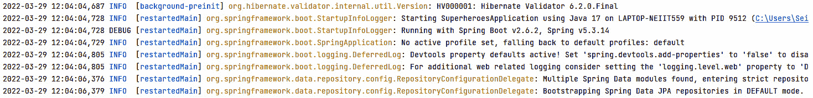
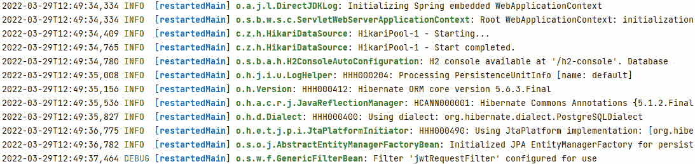

# 第八章：Spring Boot 中的日志事件

在上一章中，我们讨论了在确保我们的应用程序安全方面**跨源资源共享**（**CORS**）的想法、功能和实现。我们还学习了**JSON Web Tokens**（**JWTs**）以及如何通过创建认证端点来生成一个。

本章将重点介绍在 Spring Boot 应用程序中记录事件。我们将讨论用于记录和配置 Spring Boot 的流行包，它们在哪里保存，以及我们在开发应用程序时如何处理日志。

在本章中，我们将涵盖以下主题：

+   开始使用 SLF4J 和 Log4j2

+   设置 SLF4J 和 Log4j2

+   使用日志

# 技术要求

本章代码的最终版本可以在以下链接中查看：[`github.com/PacktPublishing/Spring-Boot-and-Angular/tree/main/Chapter-08/superheroes`](https://github.com/PacktPublishing/Spring-Boot-and-Angular/tree/main/Chapter-08/superheroes)。

# 开始使用 SLF4J 和 Log4j2

**日志记录**被认为是开发应用程序最重要的方面之一。其重要性往往被低估，更糟糕的是，我们忘记将其应用于我们的应用程序。

事件日志在大多数技术行业中都有应用，尤其是在提供企业应用程序的行业中。它按照既定标准应用，以防止复杂的调试，并使我们更容易理解所阅读的代码。一个编写良好且结构化的日志可以造福开发者，尤其是在维护或调试其他开发者的代码时。而不是全面搜索错误，记录将加速调试过程，提供有关错误发生的位置和原因以及我们的应用程序中发生的情况的信息。

随着语言和框架的改进，日志记录也得到了发展；在后端开发中，已经开发了几种日志框架，以提供更灵活的日志功能。我们将讨论的一些示例框架是 Java Spring Boot 的 SLF4J 和 Log4j2。在继续之前，让我们讨论日志框架的功能。

## 日志框架的功能

日志框架为我们提供了以下三个功能，以便在我们的应用程序中显示和捕获事件：

+   **日志记录器**：获取消息和元数据

+   **格式化器**：格式化从日志记录器检索到的消息

+   **处理器**：负责在调试控制台打印消息或将它们插入数据库供开发者使用

日志框架还会以不同的严重程度显示消息，使开发者能够快速识别发生了哪个事件。日志框架中的严重程度如下：

+   **FATAL**：级别 1；被认为是一个可能导致应用程序暂停或终止的关键问题

+   **ERROR**：应用程序中的运行时错误

+   **WARNING**：通常显示已弃用 API 的日志

+   **INFO**：显示应用程序运行时事件的日志

+   **DEBUG**：显示应用程序流程信息的日志

+   **TRACE**：显示应用程序流程的更详细信息

# 使用 SLF4J 进行日志记录

在 Java 中，与 Java 一起使用的流行日志框架之一是`java.util.logging`包，或 Java 自己的日志引擎 JUL，仅使用单个依赖项。这意味着我们可以根据需要从一种日志框架切换到另一种日志框架。

使用 SLF4J 有以下几个优点：

+   SLF4J 使我们能够在运行时或部署时从一种框架切换到另一种框架。

+   SLF4J 有一个迁移工具，允许我们将使用 Java 类库的现有项目从 Log4j 迁移到 SLF4J。

+   SLF4J 支持参数化日志记录消息，以绑定日志的动态值。

+   SLF4J 将应用程序与日志框架解耦。在开发我们的应用程序时，我们不需要担心使用的是哪种日志框架。

## SLF4J 的方法和类

SLF4J 提供了几个类和方法来显示具有严重级别的消息、分析执行时间，或者简单地返回日志记录器的实例。让我们讨论提供的方法和类。

### 日志记录器接口

日志记录器接口主要用于显示带有严重级别的消息或日志。这也是 SLF4J API 的入口点。

+   `void debug(String message)`: 在**DEBUG**级别记录消息

+   `void error(String message)`: 在**ERROR**级别记录消息

+   `void info(String message)`: 在**INFO**级别记录消息

+   `void trace(String message)`: 在**TRACE**级别记录消息

+   `void warn(String message)`: 在**WARN**级别记录消息

### LoggerFactory 类

`LoggerFactory`类是 SLF4J 的实用类，通常用于使用 JUL 和 Log4j 等框架创建日志记录器。

`Logger getLogger(String name)` 生成具有指定名称的日志记录器对象。以下示例使用了`getLogger()`方法：

```java
private static final org.SLF4J.Logger log = org.SLF4J.LoggerFactory.getLogger(LogClass.class);
```

### Profiler 类

`Profiler`类主要用于识别我们应用程序中特定任务的执行时间，也称为**穷人的剖析器**。

可以使用多种方法：

+   `void start(string name)` 创建一个新的具有特定名称的子级计时器，并停止之前创建的计时器。

+   `TimeInstrument stop()` 停止最近的子级和全局计时器，并将返回当前执行时间。

+   `void log()` 使用日志记录器记录当前时间仪器的详细信息。

+   `void print()` 打印当前时间仪器的详细信息。

## SLF4J 的功能

SLF4J 具有几个使日志在调试中更有用的功能。它提供了对参数化日志记录的支持，允许我们在消息中显示动态值。另一个功能是分析，它通常用于测量不同属性，如应用程序中特定任务的内存和执行时间。

让我们讨论每个功能的理念和实现。

### 参数化日志记录

要在 SLF4J 中实现参数化日志记录，我们将在消息中包含占位符 `{}`，其中我们想要传递值。

让我们看看以下示例：

```java
public class LoggerExample {
   public static void main(String[] args) {
      //Creating the Logger object
      Logger logger =
        LoggerFactory.getLogger(LoggerExample.class);
      String name = "seiji";
      //Logger using info level
      logger.info("Hello {}, here is your log", name);
   }
```

在前面的示例中，我们在消息中创建了一个参数来显示 `name` 变量的值。一旦我们执行应用程序，输出将如下所示：

```java
INFO: Hello seiji, here is your log
```

参数化日志记录还支持消息中的多个参数，如下例所示：

```java
public class LoggerExample {
   public static void main(String[] args) {
      //Creating the Logger object
      Logger logger =
      LoggerFactory.getLogger(LoggerExample.class);
      Integer x = 3;
      Integer y = 5;
      //Logging the information
      logger.info("The two numbers are {} and {}", x, y);
      logger.info("The sum of the two number is" + (x +
                   y));
   }
```

在前面的示例中，我们可以在单个日志中显示 `x` 和 `y` 变量。我们还可以在我们的消息中直接执行操作。输出将如下所示：

```java
INFO: The two numbers are 3 and 5
INFO: The sum of the two numbers is 8
```

### 性能分析

SLF4J 还提供了性能分析功能，用于测量应用程序中特定任务的内存使用、使用情况和执行时间。性能分析功能可以通过名为 `Profiler` 的类使用。

要在我们的代码中实现性能分析器，我们必须执行以下步骤：

1.  使用特定名称的 `Profiler`。一旦我们这样做，请记住我们已经启动了一个全局计时器。以下示例展示了如何创建一个新的 `Profiler`：

    ```java
    Profiler profiler = new Profiler("ExampleProfiler");
    ```

1.  `start()` 方法。请记住，启动子计时器将终止其他正在运行的计时器。以下示例展示了如何启动计时器：

    ```java
    profiler.start("Example1");
    ```

    ```java
    class.methodExample();
    ```

1.  `stop()` 方法用于停止运行中的计时器和全局计时器。这将同时返回时间仪器：

    ```java
    TimeInstrument tm = profiler.stop();
    ```

1.  `print()` 方法用于显示时间仪器的内容和信息。

现在我们已经了解了 SLF4J 的概念、功能和优势，我们将讨论一个名为 Log4j2 的框架。

# 使用 Log4j2 进行日志记录

**Log4j2** 是与 Java 一起使用的最常用的日志框架之一。由于 SLF4J 是日志框架的抽象，因此 Log4j2 可以与 SLF4J 一起使用。Log4j2 非常灵活，提供了不同的方式来存储日志信息以进行调试；它还支持异步日志记录，并以严重级别显示日志，以便快速识别消息的重要性。

让我们讨论 Log4j2 的以下功能：

+   Log4j2 日志记录器

+   Log4j2 Appenders

+   Log4j2 布局

+   Log4j2 标记

+   Log4j2 过滤器

## Log4j2 日志记录器

`LogRecord` 实例。这意味着记录器负责分发消息。要创建 Log4j2 日志记录器，我们只需要以下代码：

```java
Logger log = LogManager.getLogger(ExampleClass.class);
```

在创建新的 Logger 之后，我们现在可以使用它来调用几个方法，例如 `info()` 来分发消息。

## Log4j2 Appenders

**Appenders** 负责放置由 Logger 分发的日志。在 Log4j2 中，有多种 Appenders 帮助我们决定将日志存储在哪里。

这里是 Log4j2 可用的某些 Appenders：

+   `ConsoleAppender`：将日志写入控制台（`System.out` 或 `System.err`）。这是默认的 Appender。

+   `FileAppender`：使用 `FileManager` 将日志写入文件。

+   `JDBCAppender`：使用 JDBC 驱动程序将日志写入数据库。

+   `HTTPAppender`：将日志写入特定的 HTTP 端点。

+   `KafkaAppender`：将日志写入 Apache Kafka。

+   `AsyncAppender`: 封装另一个 Appender 并使用另一个线程来写入日志，使其异步日志记录。

+   `SyslogAppender`: 将日志写入 syslog 目的地。

您可以访问以下链接中的 Log4j2 文档，了解其他可用的 Appenders：https://logging.apache.org/log4j/2.x/manual/appenders.html。

## Log4j2 布局

Appender 使用**Layouts**来格式化 LogEvent 的输出。Log4j2 有多个布局可供选择来格式化我们的日志：

+   `%d{HH:mm: ss} %msg%n;` 模式将给出以下结果：

    ```java
    14:25:30 Example log message
    ```

+   **CSV**: 使用 CSV 格式生成日志的布局。

+   **HTML**: 用于生成 HTML 格式日志的布局。

+   **JSON**: 用于生成 JSON 格式日志的布局。

+   **XML**: 用于生成 XML 格式日志的布局。

+   **YAML**: 用于生成 YML 格式日志的布局。

+   **Syslog**: 用于生成与 syslog 兼容格式的日志的布局。

+   **Serialized**: 使用 Java 序列化将日志序列化为字节数组。

## Log4j2 标记

`IMPORTANT`标记，可以指示 Appender 需要将日志存储在不同的目的地。

让我们看看如何创建和使用标记的示例：

```java
public class Log4j2Marker {
    private static Logger LOGGER =
      LoggerFactory.getLogger(Log4j2Marker.class);
    private static final Marker IMPORTANT =
      MarkerFactory.getMarker("IMPORTANT");
    public static void main(String[] args) {
        LOGGER.info("Message without a marker");
        LOGGER.info(IMPORTANT,"Message with marker"
    }
}
```

在前面的示例中，我们可以使用`MarkerFactory.getLogger()`方法创建一个新的标记。要使用新的标记，我们可以将其应用于特定的记录器，以指示对重要事件的特定操作。

## Log4j2 过滤器

Log4j2 过滤器是用于显示记录器的另一个非常有价值的功能。这使我们能够根据给定的标准控制我们想要说或发布的日志事件。在执行过滤器时，我们可以将其设置为`ACCEPT`、`DENY`或`NEUTRAL`值。以下是我们可以使用来显示记录器的过滤器：

+   **Threshold**: 使用严重级别对日志事件应用过滤

+   **Time**: 对给定时间范围内的日志事件应用过滤

+   **Regex**: 根据给定的正则表达式模式过滤日志事件

+   **Marker**: 根据给定的标记过滤日志事件

+   **Composite**: 提供了一种机制来组合多个过滤器

+   **Dynamic Threshold**: 使用严重级别和包括附加属性对日志事件应用过滤

在下一节中，我们将配置我们项目中的日志框架。

# 设置 SLF4J 和 Log4j2

我们现在将在我们的 Spring Boot 应用程序中实现几个日志框架，包括**Logback**和**Log4j2**，请记住 SLF4J 已经包含在内。

## 配置 Logback

创建我们的 Spring Boot 应用程序后，`spring-boot-starter-logging`依赖项已经包含在内。我们需要采取的第一步是创建我们的 Logback 配置文件。

在我们的项目中，在`resources`文件夹下，我们将添加`logback-spring.xml`文件。这是我们放置 Logback 配置的地方。以下是一个示例配置：

```java
<?xml version="1.0" encoding="UTF-8"?>
<configuration>
    <property name="LOGS" value="./logs" />
    <!—Please refer to the logback-spring.xml of
       the GitHub repo. Thank you. -->
    <!-- LOG everything at INFO level -->
    <root level="info">
        <appender-ref ref="RollingFile" />
        <appender-ref ref="Console" />
    </root>
    <logger name="com.example" level="trace"
     additivity="false">
        <appender-ref ref="RollingFile" />
        <appender-ref ref="Console" />
    </logger>
</configuration>
```

在前面的 XML 中，定义了几个配置来格式化我们的日志事件。我们创建了两个 Appender – `Console`和`RollingFile`。配置这两个 Appender 标签将在 System.out 和文件输出中创建日志。

我们还使用了一种修改日志显示外观和格式的模式。在这个例子中，我们使用了`%black(%d{ISO8601}) %highlight(%-5level) [%blue(%t)] %yellow(%C{1.}): %msg%n%throwable`模式来在`System.Out`中显示日志。它以黑色显示日期，以高亮显示严重级别，以蓝色显示线程名称，以黄色显示类名称，并将消息分配给日志。

在成功配置 Logback 之后，我们可以运行应用程序并看到控制台中的日志：



图 8.1 – 使用 Logback 的日志事件

我们现在将使用 Log4j2 框架来处理我们的日志。

## 配置 Log4j2

我们还可以在我们的应用程序中使用不同的框架来处理日志事件。在这个例子中，我们将使用 Log4j2 来处理我们的日志：

1.  第一步是将`Log4j2`依赖项添加到我们的`pom.xml`文件中。为此，我们将添加以下代码：

    ```java
    <dependency>
    ```

    ```java
       <groupId>org.springframework.boot</groupId>
    ```

    ```java
       <artifactId>spring-boot-starter-Log4j2</artifactId>
    ```

    ```java
    </dependency>
    ```

1.  在成功添加依赖项后，我们必须在我们的 Spring Boot 应用程序中排除`spring-boot-starter-logging`依赖项，这样我们就可以覆盖 Logback 并使用 Log4j2 框架来处理日志事件。

要做到这一点，我们必须向`org.springframework.boot`组下的依赖项中添加以下 XML 代码：

```java
<exclusions>
   <exclusion>
      <groupId>org.springframework.boot</groupId>
      <artifactId>
        spring-boot-starter-logging</artifactId>
   </exclusion>
</exclusions>
```

1.  在包含`Log4j2`依赖项后，我们将向`resources`文件夹中添加一个名为`log4j2-spring.xml`的文件，并添加以下 XML 配置：

    ```java
    <?xml version="1.0" encoding="UTF-8"?>
    ```

    ```java
    <Configuration>
    ```

    ```java
        <!—Please refer to the log4j2-spring.xml  of the
    ```

    ```java
           GitHub repo. -->
    ```

    ```java
        <Loggers>
    ```

    ```java
            <Root level="info">
    ```

    ```java
                <AppenderRef ref="Console" />
    ```

    ```java
                <AppenderRef ref="RollingFile" />
    ```

    ```java
            </Root>
    ```

    ```java
            <Logger name="com.example"
    ```

    ```java
              level="trace"></Logger>
    ```

    ```java
        </Loggers>
    ```

    ```java
    </Configuration>
    ```

上述配置几乎与使用 Logback 实现的配置相同。我们还创建了两个 Appender – `Console`和`RollingFile`；唯一的显著区别是日志事件的模式。我们现在已成功配置 Log4j2。当我们运行应用程序时，我们将看到以下日志输出：



图 8.2 – 使用 Log4j2 的日志事件

使用 Log4j2 框架配置和修改我们的日志配置后，我们现在将使用它来将日志添加到我们的代码中。

# 使用日志

我们现在可以使用我们在 Spring Boot 应用程序中配置的日志框架来定义代码不同部分的日志。为此，我们必须首先创建一个新的日志记录器实例。

例如，当用户尝试获取所有反英雄的列表时创建一个日志。在`AntiHeroeController`中，我们将添加以下代码来创建一个新的日志记录器实例：

```java
private static final Logger LOGGER = LoggerFactory.getLogger(AntiHeroController.class);
```

我们还必须意识到`LoggerFactory`和`Logger`应该在 SLF4J 依赖项下。始终建议使用**SLF4J**，因为这是对日志框架的抽象，使得在它们之间切换更加容易。

在这种情况下，我们的导入应该是这样的：

```java
import org.slf4j.Logger;
import org.slf4j.LoggerFactory;
```

一旦我们创建了一个新的日志记录器实例，现在我们就可以在我们的方法中使用它了，例如，如果我们想在用户尝试获取反英雄列表时显示日志。

为了实现这一点，在 `getAntiHeroes()` 方法下，我们将添加以下代码：

```java
public List<AntiHeroDto> getAntiHeroes(Pageable pageable) {
    int toSkip = pageable.getPageSize() *
                 pageable.getPageNumber();
    //SLF4J
    LOGGER.info("Using SLF4J: Getting anti hero
                list - getAntiHeroes()");
    // Mapstruct is another dto mapper, but it's not
    // straightforward
    var antiHeroList = StreamSupport
              .stream(
                service.findAllAntiHeroes().spliterator(),
                false)
            .skip(toSkip).limit(pageable.getPageSize())
            .collect(Collectors.toList());
    return antiHeroList
            .stream()
            .map(this::convertToDto)
            .collect(Collectors.toList());
}
```

在前面的示例中，我们已经调用了 `info(String message)`。每次用户调用获取反英雄端点时，都会显示日志。我们还可以调用以下方法：

+   `trace()`：在 **TRACE** 级别显示日志事件

+   `debug()`: 在 **DEBUG** 级别显示日志事件

+   `warn()`: 在 **WARN** 级别显示日志事件

+   `error()`: 在 **ERROR** 级别显示日志事件

+   `getName()`: 获取日志记录器的名称

+   `isInfoEnabled()`: 检查日志记录器是否在 **INFO** 级别启用

+   `isDebugEnabled()`: 检查日志记录器是否在 **DEBUG** 级别启用

+   `isWarnEnabled()`: 检查日志记录器是否在 **WARN** 级别启用

+   `isErrorEnabled()`: 检查日志记录器是否在 **ERROR** 级别启用

## Lombok 中的注解

现在我们来看看 Lombok，我们 Spring Boot 应用程序中的一个库，如何帮助我们。Lombok 可以通过使用注解简化我们的代码，但它还提供了 SLF4J 和 Log4j2 的注解，如下所示：

+   `@log4j2`：这个注解将在我们的类中生成一个新的 Log4j2 实例。以下示例代码将被生成：

    ```java
    public class LogExample {
    ```

    ```java
           private static final org.SLF4J.Logger log =
    ```

    ```java
             org.SLF4J.LoggerFactory.getLogger(
    ```

    ```java
              LogExample.class);
    ```

    ```java
       }
    ```

+   `@slf4j`：这个注解将在我们的类中生成一个新的 SLF4J 实例。以下示例代码将被生成：

    ```java
    public class LogExample {
    ```

    ```java
      private static final org.SLF4J.Logger log =
    ```

    ```java
         org.SLF4J.LoggerFactory.getLogger(
    ```

    ```java
           LogExample.class);
    ```

    ```java
       }
    ```

+   建议使用 `slf4j` 注解，因为它允许切换日志框架。

一旦我们在类中使用了注解，我们就不需要创建新的实例，我们可以在方法中直接使用日志：

```java
//LOMBOK SLF4J
log.info("Using SLF4J Lombok: Getting anti-hero list - getAntiHeroes()");
```

# 摘要

本章已解释了日志记录器的概念和重要性，以及它们如何帮助开发者进行调试和维护应用程序。它介绍了 Log4j2，这是一个为 Spring Boot 提供多个功能的第三方框架，例如 **Appenders**、**Filters** 和 **Markers**，这些可以帮助开发者对日志事件进行分类和格式化。它还介绍了 SLF4J 的概念，SLF4J 是日志框架的抽象，允许我们在运行时或部署期间在不同的框架之间切换。

在下一章中，我们将学习如何在我们的 Spring Boot 应用程序中实现单元测试的概念和集成。
