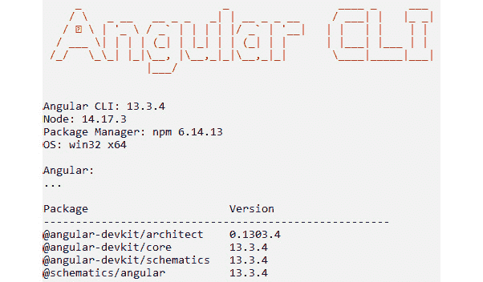
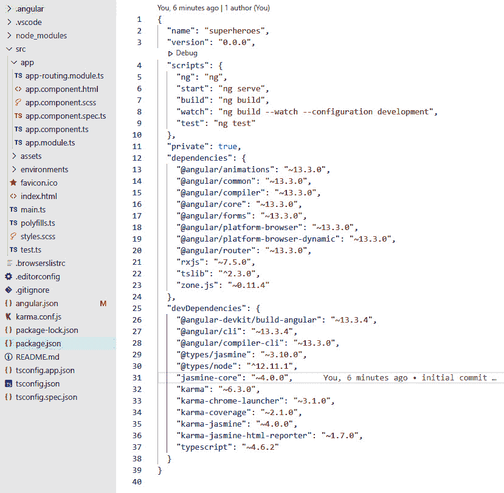
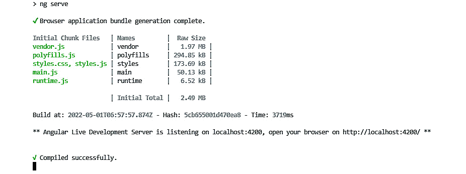
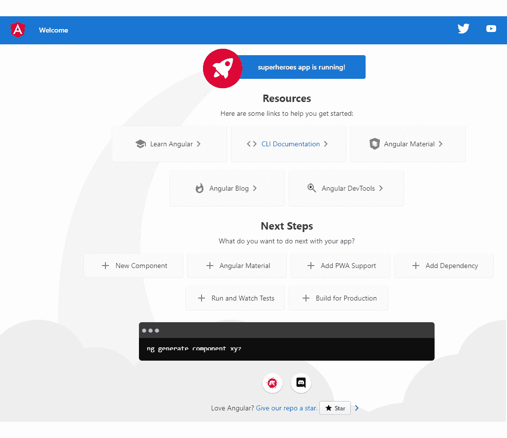
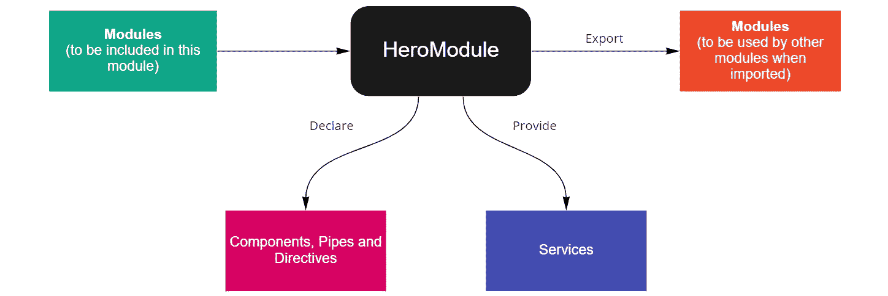
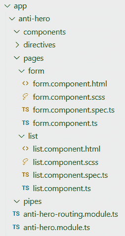
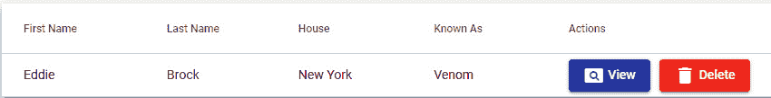
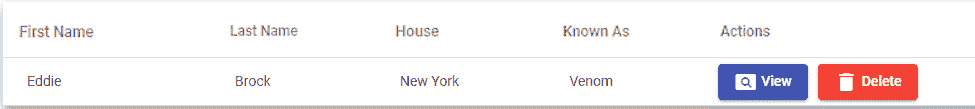
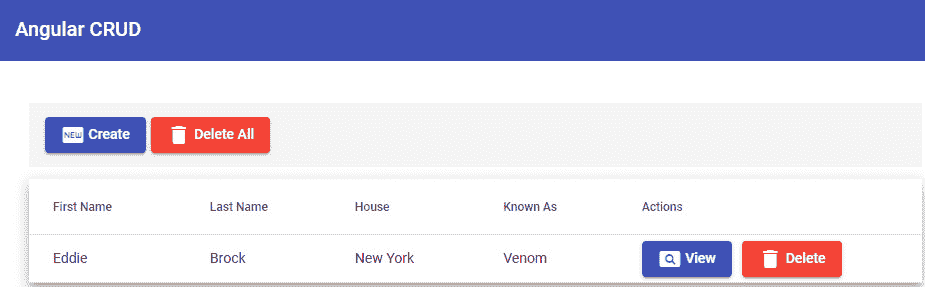

# 10

# 设置我们的 Angular 项目和架构

在上一章中，你学习了关于 **JUnit** 的概念，它是一个提供诸如固定值、测试套件和用于测试我们应用程序中方法的类等功能的测试框架。你还学习了与 JUnit 结合使用 **AssertJ** 的应用，它为我们单元测试中的对象断言提供了一种更灵活的方式，最后，你还了解了 Mockito 的重要性，它为我们提供了模拟对象和服务的能力，从而在单元测试中省略了数据库的使用。

在本章中，我们将开始使用 Angular 构建我们的前端应用程序；我们将探讨 Angular 的主要基础，例如组件、模块、指令和路由。我们还将指出组织我们的 Angular 项目的最佳实践。

在本章中，我们将涵盖以下主题：

+   组织特性和模块

+   结构化组件

+   添加 Angular material

# 技术要求

本章完成版本的链接在此：[`github.com/PacktPublishing/Spring-Boot-and-Angular/tree/main/Chapter-10/superheroes`](https://github.com/PacktPublishing/Spring-Boot-and-Angular/tree/main/Chapter-10/superheroes)。

# 组织特性和模块

在本节中，我们将讨论如何组织和结构化我们的 Angular 项目，使其优化且易于维护。由于 Angular 被认为是 **模型视图任意**（**MVW**）框架，Angular 开发者有自由选择在项目开发中实施他们选择的模式。这可能会令人困惑，因为当你从一个项目切换到另一个项目时，你会遇到不同的结构和标准。为了解决这个困境，我们将介绍业界常用的一种结构或某种典型的基准结构，你通常会在 Angular 项目中找到这种结构。

然而，在我们继续讨论主要主题之前，让我们首先讨论如何创建我们的 Angular 项目以及在我们编码 Angular 之前需要了解的基本概念。如果你已经熟悉 Angular，可以跳过这部分内容，直接进入 *组织文件夹结构* 部分。

## 生成 Angular 项目

我们可以使用名为 **Angular CLI** 的工具创建或设置我们的 Angular 项目的依赖项。我们可以通过使用一个负责下载依赖项并生成我们 Angular 项目运行所需文件的单一命令来构建项目。**Angular CLI** 是一个方便的工具，因为它还提供了几个命令，可以帮助我们在 Angular 中生成样板代码。

要安装 Angular CLI，我们应该确保我们的机器上已安装 Node.js，然后执行 `npm install -g @angular/cli` 命令。执行命令后，我们可以验证我们的 Angular CLI 是否已成功安装——我们将有一个新的全局 `ng` 命令，我们可以使用它来检查已安装 CLI 的版本。

要检查版本，我们将执行 `ng --version` 命令，并将得到以下输出：



图 10.1 – 安装的 Angular CLI 版本

在前面的输出中，我们可以看到在执行 `ng -- version` 命令后，显示了我们机器上安装的 Angular CLI 和 Node.js 的版本。目前，我们已安装 Angular CLI 版本 13，这意味着一旦我们搭建了一个 Angular 项目，它将使用 **版本 13**。

在成功安装 Angular CLI 之后，我们现在可以执行一些针对我们项目的命令。以下是一些我们可以在 Angular CLI 中使用的命令：

+   `ng new <project name> [options]`：创建或搭建新的 Angular 项目

+   `ng serve <project> [options]`：构建并托管您的 Angular 应用程序

+   `ng generate <schematic> [options]`：使用特定的图生成和修改文件

我们可以生成的某些图如下：

+   组件

+   模块

+   指令

+   守卫

+   `ng build<project> [options]`：将 Angular 应用程序编译到名为 `dist` 的输出目录，该目录将用于生产

+   `ng test <project> [options]`：在 Angular 项目中运行单元测试

这些只是 Angular CLI 中最常用的命令之一。对于完整的命令，您可以访问 Angular 的文档，网址为 https://angular.io/cli。

我们知道可以在 Angular CLI 中使用的命令。现在，让我们通过在期望的路径上执行 `ng new superheroes` 命令来生成我们的 Angular 项目。这将提出几个问题，例如“*您想要添加 Angular 路由吗？*”和“*您想使用哪种样式表格式？*”对于这些问题，我们可以选择 *是* 和 **Syntactically Awesome Style Sheet** (**SASS**)，因为我们需要路由和 SASS 来构建我们的应用程序。

在这一步之后，这将现在为名为 superheroes 的新 Angular 项目搭建框架，并负责配置 web pack、创建所需的设置以及下载项目的依赖项。搭建完成后，在 Visual Studio Code 或您偏好的任何 IDE 中打开 superheroes 项目。我们将看到 Angular 应用程序已配置并准备好在我们的本地服务器上运行。



图 10.2 – 搭建后的文件夹结构和安装的依赖项

要运行我们的项目，我们可以使用 *Ctrl* + *`* 快捷键打开 VS Code 终端，并执行 `ng serve` 命令。我们还可以使用 `package.json` 文件中定义的脚本。在这种情况下，我们可以执行 `npm run start` 来运行我们的应用程序。我们将在以下屏幕截图中的终端中看到 Angular 是否在我们的本地服务器上成功运行：



图 10.3 – 搭建后的文件夹结构和安装的依赖项

在成功运行我们的 Angular 应用程序后，现在我们可以使用浏览器中的默认 URL（`http://localhost:4200`）打开应用程序，我们将看到 Angular 项目的默认页面：



图 10.4 – Angular 默认页面

我们已成功配置并启动了本地的 Angular 应用程序。现在，让我们讨论我们将用于构建应用程序的概念。

## Angular 特性

Angular 框架是一个基于组件的框架，它允许我们开发可重用的组件，以促进代码的可重用性和可维护性。它提供了许多将使我们的前端开发更强大的功能。在本节中，我们将讨论 Angular 的基本特性和基础，这些是 Angular 的构建块；请注意，我们不会在这里讨论所有功能，因为我们更关注项目的组织。

要了解更多关于特性的信息，您可以访问 Angular 的官方文档：https://angular.io/start。

### 组件

`@Component` 装饰器，它分配了描述组件 HTML、CSS 和选择器的几种类型的元数据。

以下是为生成组件的命令：

```java
ng generate component <component-name>
ng g c <component-name>
```

以下是一个组件的代码示例：

```java
import { Component } from '@angular/core';
@Component({
  selector: 'app-root',
  templateUrl: './app.component.html',
  styleUrls: ['./app.component.scss']
})
export class AppComponent {
  title = 'superheroes';
}
```

组件有一个名为**数据绑定**的功能，它允许我们将数据传递到视图中。数据绑定可以用来向用户显示值、响应用户事件以及修改样式。Angular 绑定分为两组：

+   单向绑定

+   双向绑定

### 单向绑定

从名称可以推断出，数据在这里只单向流动。它可以是从组件到视图或相反。

在 Angular 中实现单向绑定有几种方法，其中两种最常见的方法是使用插值和属性绑定。

#### 插值

`{{}}`（双大括号）用于 HTML 代码中的表达式。

让我们看看以下示例代码：

```java
// app.component.ts
export class AppComponent {
  title = 'superheroes';
}
<!—app.component.html ->
<!-- INTERPOLATE TITLE -->
<span> Title:  {{title}} </span>
```

在前面的示例中，我们使用了插值来在视图中显示`title`变量的值。使用插值，我们还可以在模板表达式中使用运算符。

#### 属性绑定

`class`、`href`、`disabled` 和 `src`。

让我们看看以下示例代码，了解如何使用属性绑定：

```java
// app.component.ts
export class AppComponent {
  isDisabled = true;
}
<!—app.component.html ->
<button [disabled]="isDisabled">Can't be clicked</button>
```

在前面的示例中，我们将`isDisabled`变量绑定到按钮的禁用属性。由于我们将`isDisabled`的值设置为`true`，按钮将被禁用。

### 双向绑定

**双向绑定**是双向数据流。对模型所做的任何更改都将同时反映在视图中，并且任何涉及视图的修改都将更新到组件中。双向数据绑定有助于处理表单，因为我们希望模型在表单值更新后也更新，反之亦然。

要实现双向绑定，使用`ngModel`指令。

#### ngModel

`ngModel` 是一个在 Angular 中用于实现双向绑定的指令。这位于 `@angular/forms` 下的表单模块中。一旦 `ngModel` 绑定到输入字段或其他表单元素，它就会给该元素添加属性绑定和事件绑定。让我们看看下面的示例代码：

```java
// app.component.ts
export class AppComponent {
  model = 'seiji';
}
<!—app.component.html ->
<input [(ngModel)]="model"/>
```

在前面的示例代码中，我们使用 `ngModel` 指令将模型值绑定到一个输入元素上。这种语法也被称为 *盒子里的香蕉*，它用方括号和圆括号包围 `ngModel`。该指令将通过属性绑定将模型值与输入字段绑定，并通过利用 `ngModelChange` 来监听输入值的变化。

### 指令

**指令**是 Angular 的一个功能，帮助我们操作 **文档对象模型**（**DOM**）。我们可以修改 DOM 元素的布局、行为和视图。指令分为三个部分：**组件**是其中一种分类，其他两种是**属性**和**结构**指令。

#### 结构指令

**结构指令**是可以通过添加、更新或删除元素来修改 DOM 布局的指令，以下是一些 Angular 中的结构指令：

+   `*ngIf`：一个用于根据条件在 DOM 中添加或删除元素的指令：

    ```java
    <div *ngIf="condition">Will show if the condition is true</div>
    ```

+   `*ngFor`：一个用于从特定列表中迭代的项重复 HTML 元素的指令：

    ```java
    // this will display all the users for each row
    ```

    ```java
    <tr *ngFor="let user of users;">
    ```

    ```java
        <td>{{user.firstName }}</td>
    ```

    ```java
        <td>{{user.lastName}}</td>
    ```

    ```java
    </tr>
    ```

+   `*ngSwitch`：一个允许我们使用开关机制添加或删除 HTML 元素的指令。如果提供的表达式匹配，则将显示 HTML 元素：

    ```java
    //evaluates the hero variable and displays the name of the hero base on its value
    ```

    ```java
    <div [ngSwitch]="hero">
    ```

    ```java
       <div *ngSwitchCase="'Dr. Strange'">
    ```

    ```java
          Stephen Strange</div>
    ```

    ```java
       <div *ngSwitchCase="'Hawkeye'">Clint Barton</div>
    ```

    ```java
       <div *ngSwitchCase="'Hulk'">Bruce Banner</div>
    ```

    ```java
    </div>
    ```

#### 属性指令

**属性指令**是用于更改或修改元素外观或行为的指令。与结构指令相比，属性指令不能在 DOM 中添加或删除元素。

下面列出了一些 Angular 中的属性指令：

+   **ngClass**：一个用于向 HTML 元素添加 CSS 类或从其中删除它们的指令；这允许我们动态地更改元素的外观：

    ```java
    //adds an error class on the input element if the
    ```

    ```java
    //control value is invalid
    ```

    ```java
    <input type="text" [ngClass]="control.isInvalid ? 'error': ''" />
    ```

+   **ngStyle**：一个允许我们更改 HTML 元素样式的指令：

    ```java
    // the color of the element will base on the value of
    ```

    ```java
    // the color variable
    ```

    ```java
    <div [ngStyle]="{'color': color}"> Angular Framework </div>
    ```

### 模块

**模块**是 Angular 框架的一个基本特性。随着我们的应用程序变得更加复杂，它将包含大量的组件、指令和服务。这将影响应用程序代码库的可维护性。Angular 框架提供了一种组织和分组块的方法，称为模块。

Angular 框架中的模块帮助我们开发应用程序，促进关注点的分离。它们允许我们根据其功能对块进行分类和组织。Angular 也是使用模块构建的；`@angular/core` 框架是主要的 Angular 模块，它提供了 Angular 的核心功能和服务的实现。

#### 创建一个模块

我们将使用 `@NgModule` 装饰器来创建一个模块。它由几种类型的元数据组成，允许我们定义创建的模块中包含的组件、服务、管道和其他模块。

以下示例代码展示了模块可用的属性：

```java
@NgModule({
  declarations:[],
  imports:[],
  providers:[],
  exports: [],
  bootstrap:[],
  entrycomponents:[]
})
```

让我们接下来讨论每个属性的职能：

+   **声明**：这是我们将应用程序的组件、指令和管道放置的地方。记住，组件、指令和管道必须在单个模块中声明。

+   **提供者**：这是我们将服务放置的地方，以便它们可以用于依赖注入。

+   **导入**：这是我们将一个或多个其他模块放置到我们的应用程序中的地方。一旦我们导入一个特定的模块，导入模块中的所有组件、管道和指令都可以使用。

+   **导出**：这是我们将组件、指令和管道放置的地方，以便在导入后可供其他模块使用。

+   (`AppModule`)，因为根模块的职责是在应用程序启动时加载第一个视图。

+   **入口组件**：这是我们将应该在我们应用程序中动态加载的组件放置的地方。

以下图显示了 `NgModule` 在 Angular 应用程序中的工作方式：



图 10.5 – Angular 模块流程图

### 服务和依赖注入

**服务**也是 Angular 中的一个有价值的功能。这是可以在应用程序的不同组件中重用的代码。

服务的主要职责如下：

+   在不同的组件上重用逻辑

+   实现 API 通信和数据访问

+   提倡单一职责，因为它将组件的独立功能分离出来

要在应用程序中创建一个服务，我们将创建一个类并用 `@Injectable` 装饰器注解它。为了在应用程序的根级别注册该服务，我们将以下内容添加到我们的 `@Injectable` 装饰器中：

```java
@Injectable({
  providedIn: 'root',
 })
```

一旦我们在根中设置了 `providedIn` 元数据的值，这将创建一个在整个应用程序中共享的服务实例。另一方面，如果我们想在特定模块中提供该服务，我们将该服务放置在 `@NgModule` 的提供者元数据中：

```java
@NgModule({
    providers: [Service1]
})
```

现在我们已经讨论了 Angular 的一些基本特性，接下来我们将关注如何构建你的 Angular 应用程序结构。

## 创建 Angular 文件夹结构

Angular 框架被认为是一个 MVW 框架，这意味着有许多可能的方式来构建我们的应用程序。在这种情况下，我们将讨论一种最佳实践或最常用的结构，这可以帮助你的 Angular 应用程序具有可扩展性和可维护性。

在前面的部分中，我们了解到 Angular 块可以被分组和组织成模块；模块是构建我们的 Angular 应用程序的一个很好的起点。我们可以实施的第一步是根据其功能对模块进行分组和分类。下面是模块的分类。

### 根模块

`AppModule` 位于 `src/app` 文件夹下。

### 功能模块

**功能**模块是我们放置应用特定功能的模块。这意味着我们代码的大部分内容都在这个模块中。我们将在应该包含它们的模块下创建组件、管道和指令，我们还可以通过将具有路由的组件放在页面文件夹中来分离组件。

让我们看看一个名为 `AntiHeroModule` 的功能模块的示例文件夹结构：

```java
├── src
│   ├── app
│   │   ├── anti-hero
│   │   │   ├── components
│   │   │   │   ├── shared.component.ts
│   │   │   ├── directives
│   │   │   │   ├── first.directive.ts
│   │   │   │   ├── another.directive.ts
│   │   │   ├── pages
│   │   │   │   ├── form
│   │   │   │   │   ├── form.component.ts
│   │   │   │   ├── list
│   │   │   │   │   ├── list.component.ts
│   │   │   │   ├── anti-hero.component.ts
│   │   │   │   ├── anti-hero.component.html
│   │   │   │   ├── anti-hero.component.css
│   │   │   │   ├── index.ts
│   │   │   ├── pipes
│   │   │   │   ├── first.pipe.ts
│   │   │   ├── anti-hero.module.ts
│   │   │   ├── anti-hero.routing.module.ts
│   │   │   ├── index.ts
```

在这里的文件夹结构中，我们将我们的反英雄模块分成了几个部分。第一个文件夹是 `components` 文件夹，它包含在这个模块中共享的所有组件。这些也可以称为 **哑** 组件，我们将在下一节中讨论。

接下来的两个是 `directives` 和 `pipes` 文件夹，它们包含在 `AntiHeroModule` 中使用的指令和管道。最后，`pages` 文件夹包括 `AntiHeroModule` 中具有直接路由的组件。这些也可以称为 `index.ts` 文件，被称为桶文件，它将为导出组件、指令和管道提供一个集中位置。

### 共享模块

**共享**模块是一个在整个应用程序中使用和共享的模块；它由我们在应用程序的不同部分需要使用的组件、管道和指令组成。请记住，共享模块不应依赖于应用程序中的其他模块。

共享模块是在 `src/app/shared` 文件夹下创建的。

让我们看看我们应用程序中共享模块的示例文件夹结构：

```java
├── src
│   ├── app
│   │   ├── shared
│   │   │   ├── layout
│   │   │   │   ├── footer
│   │   │   │   │   ├── footer.component.ts
│   │   │   │   │   ├── footer.component.html
│   │   │   │   ├── header
│   │   │   │   │   ├── header.component.ts
│   │   │   │   │   ├── header.component.html
│   │   │   │   ├── layout.module.ts
│   │   │   ├── index.ts
```

在前面的文件夹结构中，我们可以看到我们创建了两个名为 `footer` 和 `navbar` 的组件；这些是在应用程序中最常见的共享组件之一。

### 核心模块

**核心**模块是一个在整个应用程序中共享服务的模块。这些是单例服务，应用程序中只有一个实例。通常，包含在核心模块中的服务是身份验证服务。

由于它应该只有一个实例，因此核心模块必须只导入到应用程序的根模块中。

我们可以向我们的核心模块添加以下代码以防止它被导入到其他模块中：

```java
@NgModule({})
export class CoreModule {
  constructor(@Optional() @SkipSelf() core:CoreModule ){
    if (core) {
        throw new Error("Core module should only be
                         imported to the Root Module")
    }
  }
}
```

在前面的代码示例中，我们向构造函数中添加了 `CoreModule` 参数，并使用 `@Optional` 和 `@SkipSelf` 装饰器——如果核心返回一个值表示 `CoreModule` 已经被导入到根模块中，这将抛出一个错误。

现在我们继续学习如何在 Angular 应用程序中实现结构。

## 实现结构

现在我们已经学习了我们的 Angular 应用程序的不同模块类别，让我们将这些文件夹结构应用到我们的超级英雄项目中。

我们的目标是创建一个具有简单**创建、读取、更新和删除**（**CRUD**）功能的前端应用程序，用于英雄和反英雄。

首先，我们将在`app`目录下创建共享特性和`core`文件夹，并在完成三个主要类别后，我们将为每个模块制作所需的块。

### 特性模块下的块

我们希望在特性模块下创建块；首先我们需要搭建的是`AntiHeroModule`。执行`ng g m anti-hero`命令以在`src/app`文件夹下生成模块。

现在，在反英雄文件夹下，我们将创建以下文件夹：

+   `components`：这将包含在这个模块中共享的组件。

+   `pipes`：这将包含反英雄模块使用的所有管道。

+   `directives`：这将包含反英雄模块将使用的所有指令。

+   `pages`：这将包含具有直接路由的组件。

在创建文件夹后，我们现在将制作反英雄模块的页面组件。我们将添加两个页面，第一个页面将用于显示反英雄列表，第二个页面将是一个表单，允许我们查看、创建或修改列表中选定的英雄。我们可以执行`ng g c anti-hero/pages/pages/form`和`ng g c anti-hero/pages/list`命令来创建这两个页面。这将创建两个新的组件，`form`和`list`，在`pages`文件夹下。

在成功创建页面组件后，我们还将为我们的反英雄模块添加一个路由模块。我们将执行`ng g m anti-hero/anti-hero-routing --flat`命令，并将以下代码放置在我们的路由模块中：

```java
import {NgModule} from "@angular/core";
import {RouterModule, Routes} from "@angular/router";
import {ListComponent} from "./pages/list/list.component";
import {FormComponent} from "./pages/form/form.component";
const routes: Routes = [
  {
    path: "",
    component: ListComponent,
  },
  {
    path: "form",
    component: FormComponent,
  },
];
@NgModule({
  declarations: [ListComponent, FormComponent],
  imports: [RouterModule.forChild(routes)],
  exports:[RouterModule]
})
export class AntiHeroRoutingModule {}
```

在前面的示例代码中，我们为我们的`form`和`list`页面定义了路由。这意味着页面组件将在我们的应用程序中拥有直接路由，并且我们也将`ListComponent`定义为该模块的基础路由。

在成功创建页面组件和定义路由后，我们希望我们的根模块（`AppModule`）有一个指向`AntiHeroModule`的路由。

为了实现这一点，我们将以下代码放置在`app-routing.module.ts`中：

```java
import { NgModule } from '@angular/core';
import { RouterModule, Routes } from '@angular/router';
const routes: Routes = [
  {
    path: "",
    redirectTo: "anti-heroes",
    pathMatch: "full",
  },
  {
    path: "anti-heroes",
    loadChildren: () =>
      import("./anti-hero/anti-hero.module").then((m) =>
             m.AntiHeroModule),
  }
];
@NgModule({
  imports: [RouterModule.forRoot(routes)],
})
export class AppRoutingModule { }
```

在前面的示例代码中，我们使用了懒加载来为`AntiHeroModule`创建一个路由。一旦我们访问`{baseUrl}/anti-heroes` URL，这将加载`AntiHeroModule`并重定向到基础路由，即`ListComponent`。我们还使用了`RouterModule.forRoot()`来导入路由，因为这是根模块。

在成功定义了`AppModule`的路由后，我们现在可以看到我们应用程序的当前结构：



图 10.6 – 创建反英雄特性后的文件夹结构

现在我们已经完成了 Angular 中的功能模块，我们只有`pages`文件夹。随着我们开发应用程序，我们将添加其他块，如组件和指令。下一步是创建共享模块。

### 共享模块下的块

现在，我们的下一个目标是创建共享模块下的块。我们将共享模块定义为在整个应用程序中共享的组件、指令和管道，并且它们不能依赖于其他模块。为了创建我们的共享模块，我们将执行`ng g m shared`命令。这将创建一个新的共享文件夹和该新共享文件夹中的一个模块文件。

现在在完成共享模块后，我们可以生成将在这个模块中分类的块。在我们的应用程序中，我们可以将`navbar`和`footer`作为共享组件包含在内，因为它们将在我们应用程序的每个部分中使用。

我们将执行`ng g c shared/layout/navbar`和`ng g c shared/layout/footer`命令来构建`navbar`和`footer`。我们可以看到`FooterComponent`和`NavbarComponent`被自动添加到`shared.module.ts`文件中，因为 Angular 检测到离组件最近的模块：

```java
@NgModule({
  declarations: [
    NavbarComponent,
    FooterComponent
  ],
  imports: [CommonModule]
})
export class SharedModule { }
```

记得在`NgModule`的`exports`元数据中添加`navbar`和`footer`组件，并且我们将导入不同的模块中的共享模块：

```java
@NgModule({
  declarations: [
    NavbarComponent,
    FooterComponent
  ],
  exports: [NavbarComponent, FooterComponent]
  imports: [CommonModule]
})
```

根据我们应用程序的需求，我们还可以通过执行`ng g c shared/directive/directive-name`和`ng g c shared/pipes/pipe-name`命令在共享文件夹下添加共享指令和管道。在成功创建块后，我们将有以下文件夹结构：


图 10.7 – 创建共享模块后的文件夹结构

我们还必须记住，共享模块不需要路由模块，因为在我们应用程序中没有需要路由的组件。

### 核心模块下的块

我们需要创建的最后一个模块是核心模块。核心模块是我们在整个应用程序中共享的服务，并且只有一个实例。一个总是进入核心模块的服务是认证服务。

在完成核心模块后，我们将执行`ng g m core;`命令来创建我们的共享模块。我们将通过运行`ng g s` `core/services/authenticate`命令来构建认证服务。

在成功创建认证服务后，我们将将其放在`core.module.ts`文件下，以便将服务包含在模块中。根据我们应用程序的需求，我们还可以通过添加一个`models`文件夹在核心模块下添加共享模型。现在，我们有以下文件夹结构：


图 10.8 – 创建共享模块后的文件夹结构

在我们通过应用程序的开发过程创建认证服务的具体内容时，我们将使用这个结构来构建项目的其他部分。现在，我们将讨论如何在 Angular 中构建我们的组件结构。

# 组件结构

我们已经通过根据其用途和功能对模块进行分类来构建我们的 Angular 应用程序结构，这将有利于代码的可重用性和可维护性。然而，仍然存在在特定模块下创建大量组件的可能性，这将进一步提高应用程序的可维护性。在本节中，我们将讨论在组件级别构建 Angular 架构的另一种策略。

## 智能与哑或展示组件

构建 Angular 应用程序最常见和推荐的**组件级别架构**是智能与哑组件架构。在上一节中，我们根据在应用程序中的使用方式将模块分为不同的类别。

这种架构也提供了相同的概念。我们将组件分为两种不同的类型——即，**智能组件**和**哑**或**展示组件**。

让我们讨论每种组件类型的特征。

### 智能组件

**智能组件**也被称为应用级组件或容器组件。这些组件的主要职责是与服务通信并从请求中获取数据。由于它们是智能的，它们包含获取应用程序数据所需的所有依赖项和订阅。

智能组件可以被认为是具有直接路由的应用程序页面组件，它们是包含哑组件的父组件。让我们看看以下创建智能组件的示例代码：

```java
@Component({
  selector: 'app-home',
  template: `
    <h2>User List</h2>
    <div>
        <table class="table">
            <tbody>
            <tr (click)="selectUser(user)" *ngFor="let user
             of users">
                <td> {{user.firstName}} </td>
                <td>
                    <span>{{user.lastName}}</span>
                </td>
            </tr>
            </tbody>
        </table>
    </div>
`,
  styleUrls: ['./home.component.css']
})
export class HomeComponent implements OnInit {
  users: User[] = [];
  constructor(private userService: UserService) {
  }
  ngOnInit() {
      this. userService.getUsers()
          .subscribe(users => this.users = users);
  }
  selectUser(user: User) {
     // action
  }
}
```

在前面的示例代码中，我们创建了一个名为 `HomeComponent` 的组件，该组件将在表格中显示用户列表。我们还注入了 `UserService` 以从 HTTP 请求中获取用户。我们知道这个组件将成功显示用户，但我们可以看到我们的模板很庞大，并且随着我们向该组件添加更多功能，它可能会变得过于复杂。

我们想要做的是省略仅用于展示目的的元素。在这种情况下，我们希望从我们的 `HomeComponent` 中移除表格，并将有以下的代码：

```java
@Component({
  selector: 'app-home',
  template: `
    <h2>User List</h2>
    <div>
       <!—we will place that dumb component here later-->
    </div>
`,
  styleUrls: ['./home.component.css']
})
export class HomeComponent implements OnInit {
  users: User[] = [];
  constructor(private userService: UserService) {
  }
  ngOnInit() {
      this. userService.getUsers()
          .subscribe(users => this.users = users);
  }
  selectUser(user: User) {
     // action
  }
}
```

在前面的重构代码中，我们移除了显示用户列表的表格。我们只希望智能组件处理依赖注入、订阅和操作。我们现在已经成功创建了我们的智能组件，下一步是创建展示组件。

### 哑或展示组件

**哑组件**，也称为展示组件，负责在应用程序中显示数据。它们不应该有依赖项和订阅，因为它们的唯一目的是在视图中展示数据。

让我们创建之前遗漏的表格作为哑组件：

```java
@Component({
  selector: 'users-list',
  template: `
        <table class="table">
            <tbody>
            <tr (click)="selectUser(user)" *ngFor="let user
             of users">
                <td> {{user.firstName}} </td>
                <td>
                    <span>{{user.lastName}}</span>
                </td>
            </tr>
            </tbody>
        </table>
  `,
  styleUrls: ['./users-list.component.css']
})
export class UsersListComponent {
  @Input()
  users: User[];
  @Output('user')
  userEmitter = new EventEmitter<User>();
   selectUser(user:User) {
        this.userEmitter.emit(user);
    }
}
```

在前面的示例代码中，我们为显示用户列表的表格创建了一个单独的组件。由于哑组件没有注入依赖项，该组件需要从智能组件接收数据。为了实现这一点，我们添加了一个 `@Input` 绑定属性来接收来自 `HomeComponent` 的用户列表；另一方面，我们还在智能组件中添加了一个 `@Output` 绑定属性，以便将操作冒泡到父组件或智能组件。

记住，哑组件不能有任何逻辑或操作；在这种情况下，我们将使用 `EventEmitter` 在父组件中传递事件，父组件将负责完成所需的步骤。在示例代码中，一旦点击行，我们就将用户传递给 `userEmitter`，`HomeComponent` 将检索它。

在成功创建 `UserListComponent` 之后，我们现在可以在 `HomeComponent` 中使用它，并且我们将得到以下代码：

```java
@Component({
  selector: 'app-home',
  template: `
    <h2>User List</h2>
    <div>
       <users-list users="users"
        (user)="selectUser($event)"/>
    </div>
`,
  styleUrls: ['./home.component.css']
})
export class HomeComponent implements OnInit {
  users: User[] = [];
  constructor(private userService: UserService) {
  }
  ngOnInit() {
      this. userService.getUsers()
          .subscribe(users => this.users = users);
  }
  selectUser(user: User) {
     // action
  }
}
```

在前面的示例代码中，我们可以看到我们使用了 `UsersListComponent` 作为 `HomeComponent` 的子组件。它接受 `HomeComponent` 检索到的用户列表，并在点击特定行时发出一个事件。有了这个，我们现在已经完成了对智能和哑组件概念的讨论。

现在让我们将架构应用到我们的应用程序中。

## 在项目中实现智能和哑组件

现在我们将在我们的 Angular 项目中实现智能和哑组件架构。我们将在 `AntiHeroModule` 下创建我们的组件。我们已经在 `pages` 文件夹中创建了我们的 `form` 和 `list` 组件。

我们将始终将我们的智能组件放在 `pages` 文件夹中，因为它们将是应用程序中的容器组件。下一步是创建我们的哑组件。我们将创建两个哑组件，即 `anti-hero-form` 和 `anti-hero-list` 组件。为了创建组件，执行 `ng g c anti-hero/components/anti-hero-form anti-hero/components anti-hero-list` 命令。在成功生成两个哑组件后，让我们放置以下代码。

对于 `AntiHeroListComponent`，我们将以下代码放入 `anti-hero-list.component.html` 文件中：

```java
<table>
    <thead>
        <th *ngFor="let item of headers">{{item.headerName}}</th>
    </thead>
    <tbody>
        <tr (click)="selectAntiHero(item)"
 *ngFor ="let item of antiHeroes">
           <ng-container *ngFor="let header of headers">
               <td>{{item[header.fieldName]}}</td>
           </ng-container>
        </tr>
    </tbody>
</table>
```

在前面的 HTML 代码中，我们创建了一个表格，其中标题和项绑定到 `antiHeroes` 变量。我们还绑定了标题和反英雄的关键值来动态显示值。

现在，让我们为接收和发出数据添加到我们的 `AntiHeroList` 组件中的属性：

anti-hero-list.component.ts

```java
export class AntiHeroListComponent implements OnInit {
  @Input() headers: Array<{headerName: string, fieldName:
    keyof AntiHero}> = [];
  @Input() antiHeroes: Array<AntiHero> = [];
  @Output() antiHero = new EventEmitter();
  constructor() { }
  ngOnInit(): void {
  }
  selectAntiHero(antiHero: AntiHero) {
    this.antiHero.emit(antiHero);
  }
}
```

现在，在反英雄组件的`TypeScript`文件中，我们定义了三个属性，这些属性是我们哑组件需要用于接收数据和向智能组件发射事件的。

第一个属性是`headers`属性，它具有`@Input`注解。这将获取一个包含`{headerName: string, fieldName: keyof AntiHero}`类型的数组，该数组将被迭代以显示列标题并显示反英雄项目每个字段的值。第二个属性是`antiHeroes`，它也具有`@Input`注解。这将接受要在每行显示的反英雄列表，最后是`antiHero`属性，它被注解为`@Output`。当用户点击单行时，这将向父组件发射所选的反英雄。

我们还在`anti-hero/models/anti-hero.interface.ts`中添加了一个名为`AntiHero`的接口，该接口将用于转换对象类型。

我们将为`interface`有以下代码：

```java
export interface AntiHero {
    firstName: string;
    lastName: string;
    house: string;
    kownAs: string;
}
```

在前面的代码示例中，我们创建了一个`AntiHero`接口，该接口将用作我们对象的蓝图。反英雄对象的属性与我们定义在 Spring 应用程序中相同的属性相同。

在为我们的对象创建接口之后，我们现在将在`AntiHeroModule`中声明和导入我们的组件和模块。

让我们看一下以下代码：

anti-hero.module.ts

```java
@NgModule({
  declarations: [
    AntiHeroListComponent,
    AntiHeroFormComponent,
    ListComponent,
    FormComponent
  ],
  imports: [
    CommonModule,
    AntiHeroRoutingModule,
  ]
})
export class AntiHeroModule { }
```

在我们的`anti-hero.module.ts`文件中，我们想要确保声明了我们的智能组件和哑组件；否则，在编译时将会有错误。我们还想要检查是否导入了`AntiHeroRoutingModule`以使用路由。

让我们现在添加额外的样式来改善我们应用程序的用户界面。让我们看一下以下代码：

anti-hero-list.component.scss

```java
table, th, td {
    border: 1px solid;
    border-collapse: collapse;
    border: 1px solid;
}
```

我们还在组件中添加了一些简单的 CSS 代码来美化我们的表格。现在，我们已经成功创建了`AntiHeroListComponent`。下一步是在`ListComponent`页面上使用这个展示组件。让我们看一下以下代码示例：

```java
export class ListComponent implements OnInit {
  // sample data of anti-hero
  antiHeroes: AntiHero[] = [
    {
      firstName: "Eddie",
      lastName: "Brock",
      house: "New York",
      kownAs: "Venom"
    }
  ]
  headers: {headerName: string, fieldName: keyof
            AntiHero}[] = [
    {headerName: "First Name", fieldName: "firstName"},
    {headerName: "Last Name", fieldName: "lastName"},
    {headerName: "House", fieldName: "house"},
    {headerName: "Known As", fieldName: "kownAs"},
  ]
  constructor() { }
  ngOnInit(): void {
  }
  selectAntiHero(antiHero: AntiHero) {}
}
```

在`ListComponent`的`TypeScript`文件中，我们创建了标题的定义以及一个反英雄列表的示例列表，用于显示反英雄列表。这将是临时的，因为我们只是想测试我们的展示组件是否成功显示了反英雄列表。我们还创建了`selectAntiHero()`函数，以便在选择了特定的反英雄后进行实现。

让我们现在为`AntiHeroList`定义输入和输出属性。让我们看一下以下代码：

list.component.html

```java
<!-- Dumb component anti hero list -->
<app-anti-hero-list [antiHeroes]="antiHeroes" [headers]="headers" (antiHero)="selectAntiHero($event)"></app-anti-hero-list>
```

现在，在`ListComponent`的 HTML 文件中，我们将`headers`和`antiHeroes`绑定到`app-anti-hero-list`的属性上。我们还使用了`selectAntiHero()`函数来捕获事件，一旦`antiHero`发射了动作。

在成功实现我们的展示组件后，我们可以运行应用程序并在浏览器中打开应用程序。我们应该看到以下结果：


图 10.9 – AntiHeroList 展示组件

我们可以在结果中看到，我们的展示组件已经成功显示了来自父组件的数据。对于表单组件，我们将在下一章中实现其功能，因为创建表单将是一个不同的主题。

现在，我们已经了解了智能和愚笨组件的概念、结构和实现。在下一节中，我们将使用一个 UI 框架来帮助我们改进 Angular 应用程序的界面。

# 添加 Angular Material

我们已经使用 **核心**、**功能**和 **共享** 架构在模块级别以及智能和愚笨架构在组件级别组织了我们的 Angular 应用程序。现在，我们准备通过为我们的组件添加样式来自定义和改进外观和 UI。我们都知道，从头开始编写 CSS 代码并开发基础样式对我们开发者来说又是一个挑战。这给我们带来了额外的努力，而不仅仅是关注代码的逻辑方面。这就是 Angular Material 拯救我们的时刻！

**Angular Material** 是由 Google 创建的一个库，它为 Angular 应用程序提供了一系列 UI 组件，例如表格、卡片、输入和日期选择器。这意味着我们不必从头开始为组件添加样式，因为来自材料库的组件列表已经准备好使用。

Angular Material 在其内部拥有广泛的增长组件。它提供了包含可用于 Angular 应用程序的组件的模块，这些组件可以导入到特定的应用程序模块中；组件是可重用的，并且易于根据其外观和感觉进行自定义，因为它们具有内置的我们可以使用的属性。

让我们在 Angular 项目中配置 Angular Material。

## 配置 Angular Material

在 Angular 项目中配置 Angular Material 很容易，因为它提供了一个脚本来安装 Angular Material 的所有依赖项。要安装 Angular Material，我们将执行以下命令：

```java
ng add @angular/material
```

执行命令后，它将询问一些问题，然后安装资源：

+   **选择预构建的主题名称或“自定义”以创建自定义主题**：Angular Material 提供预构建的主题，或者您可以配置您自己的自定义主题。

+   **设置全局 Angular Material 字体样式**：选择 **是** 将应用 Angular Material 的全局字体样式。

+   在我们的根模块中，有 `BrowserAnimationsModule`。当我们想要使用 Angular Material 的动画时，这是很重要的。

完成所有问题后，它将现在安装 Angular Material。这将为我们项目执行以下操作：

1.  将依赖项添加到 `package.json` (`@angular/material` 和 `@angular/cdk`)。

1.  将 `Roboto` 字体添加到 `index.html` 文件中：

    ```java
    <link href="https://fonts.googleapis.com/css2?family=Roboto:wght@300;400;500&display=swap" rel="stylesheet">
    ```

1.  将 Material Design 图标字体添加到 `index.html` 文件中：

    ```java
    <link href="https://fonts.googleapis.com/icon?family=Material+Icons" rel="stylesheet">
    ```

1.  添加以下 CSS 样式：

    +   将`html`和`body`的`height`设置为`100%`

    +   设置`Roboto`为默认字体

    +   从主体中移除边距：

        ```java
        html, body { height: 100%; }
        ```

        ```java
        body { margin: 0; font-family: Roboto, "Helvetica Neue", sans-serif; }
        ```

在我们的应用程序中成功安装 Angular Material 后，我们现在可以准备在应用程序中使用这些组件。

## 实现 Angular Material

我们现在将在我们的 Angular 项目中实现 Angular Material 组件。正如我们之前提到的，Angular Material 提供了一系列我们可以用于构建应用程序的组件。在这个示例项目中，我们只定义我们将要使用的组件。让我们列出我们将要实现的组件。

### 按钮组件

使用材料设计增强的本地`<button>`或`<a>`元素。

我们可以使用以下代码导入按钮组件：

```java
import {MatButtonModule} from '@angular/material/button';
```

下面是按钮组件的示例：

```java
<div class="example-button-row">
    <button mat-raised-button>Basic</button>
    <button mat-raised-button
      color="primary">Primary</button>
    <button mat-raised-button
      color="accent">Accent</button>
    <button mat-raised-button color="warn">Warn</button>
    <button mat-raised-button disabled>Disabled</button>
    <a mat-raised-button href="
      https://material.angular.io/target=" _blank>Link</a>
 </div>
```

在前面的**材料**按钮代码示例中，我们可以看到我们正在使用材料设计的内置指令来更改按钮的样式和外观。示例代码将产生以下输出：


图 10.10 – 材料按钮的示例输出

### 图标组件

此组件允许我们在应用程序中添加基于矢量的图标，并支持图标字体和 SVG 图标。

我们可以使用以下代码导入图标组件：

```java
import {MatIconModule} from '@angular/material/icon';
```

下面是图标组件的示例：

```java
<mat-icon color="primary">delete</mat-icon>
<mat-icon color="accent">fiber_new</mat-icon>
<mat-icon color="warn">pageview</mat-icon>
```

在前面的代码示例中，我们可以通过使用`mat-icon`组件来创建图标。它有几个输入属性，如颜色，允许我们自定义图标的颜色。示例代码将产生以下输出：


图 10.11 – 材料图标的示例输出

### 表格组件

此组件允许我们添加具有材料设计样式的数据表。材料表基于**CDK 数据表**的基础。有关如何实现 CDK 数据表的更多信息，请参阅 https://material.angular.io/cdk/table/overview 的文档。

我们可以使用以下代码导入表格组件：

```java
import {MatTableModule} from '@angular/material/table';
```

下面是表格组件的示例：

```java
<table mat-table [dataSource]="data" class="mat-elevation-z8">
  <!-- Position Column -->
  <ng-container matColumnDef="id">
    <th mat-header-cell *matHeaderCellDef> ID </th>
    <td mat-cell *matCellDef="let element">
     {{element.position}} </td>
  </ng-container>
  <!-- Name Column -->
  <ng-container matColumnDef="name">
    <th mat-header-cell *matHeaderCellDef> Name </th>
    <td mat-cell *matCellDef="let element">
      {{element.name}} </td>
  </ng-container>
  <tr mat-header-row *matHeaderRowDef="columns"></tr>
  <tr mat-row *matRowDef="let row; columns: columns;"></tr>
</table>c
```

在前面的示例中，我们可以看到表格使用了几个属性。第一个属性是`dataSource`属性，它将接受要显示的数据列表。下一个属性是`matColumnDef`，它定义了应包含在绑定到`matHeaderRowDef`属性的`columns`变量中的每个列的字段名。最后，`matHeaderCellDef`和`mattCelDef`属性显示了实际的列名和相关的值，如下面的屏幕截图所示：



图 10.12 – 材料表格的示例输出

### 工具栏组件

此组件允许我们添加具有材料设计样式的工具栏。这通常用作标题、标题和导航按钮的容器。

我们可以使用以下代码导入工具栏组件：

```java
import {MatToolbarModule} from '@angular/material/toolbar';
```

这里是工具栏组件的示例：

```java
  <p>
    <mat-toolbar color="primary">
      <button mat-icon-button class="example-icon"
        aria-label="Example icon-button with menu icon">
        <mat-icon>menu</mat-icon>
      </button>
      <span>Angular CRUD</span>
    </mat-toolbar>
  </p>
```

在前面的代码示例中，我们使用`mat-toolbar`组件创建了一个工具栏元素。`mat-toolbar`组件使用内容投影，允许我们自定义其内容。示例代码将产生以下输出：


图 10.13 – 材料工具栏的示例输出

### 表单字段组件

此组件允许我们将材料组件包装起来，以应用文本字段样式，如下划线、提示信息和浮动标签。以下组件可以在`<mat-form-field>`内部使用：

+   `input matNativeControl>`和`<textarea matNativeControl>`：可以通过添加`import {MatInputModule} from '@angular/material/input';`来使用

+   `<mat-select>`：可以通过添加`import {MatSelectModule} from '@angular/material/select';`来使用

+   `<mat-chip-list>`：可以通过添加`import {MatChipsModule} from '@angular/material/chips';`来使用

这里是一个表单字段组件的示例：

```java
<p>
  <mat-form-field appearance="legacy">
    <mat-label>Legacy form field</mat-label>
    <input matInput placeholder="Placeholder">
  </mat-form-field>
</p>
<p>
  <mat-form-field appearance="standard">
    <mat-label>Standard form field</mat-label>
    <input matInput placeholder="Placeholder">
  </mat-form-field>
</p>
<p>
  <mat-form-field appearance="fill">
    <mat-label>Fill form field</mat-label>
    <input matInput placeholder="Placeholder">
  </mat-form-field>
</p>
<p>
  <mat-form-field appearance="outline">
    <mat-label>Outline form field</mat-label>
    <input matInput placeholder="Placeholder">
  </mat-form-field>
</p>
```

在前面的代码示例中，我们使用`mat-form-field`组件创建了一个工具栏元素。`mat-form-field`组件应包含`mat-label`组件和一个带有`matInput`指令的输入元素。示例代码将产生以下输出：


图 10.14 – 材料表单字段的示例输出

有关 Angular Material 组件列表的更多信息，请参阅 https://material.angular.io/components 的文档。

现在我们已经列出了我们将在应用程序中使用的材料组件，让我们将材料设计应用到我们的组件上。

我们需要做的第一步是创建我们的材料模块。材料模块将被包含在共享模块中，这样我们就可以在整个应用程序中使用材料设计组件。要在我们的 Angular 应用程序中生成材料模块，我们将执行以下命令：`ng g m material`。在成功生成材料模块后，我们将添加 Angular Material 中必要的模块：

```java
@NgModule({
  imports: [
    CommonModule,
    MatToolbarModule,
    MatIconModule,
    MatButtonModule,
    MatTableModule,
    MatFormFieldModule,
    MatSelectModule,
    MatInputModule,
  ],
  exports: [
    MatToolbarModule,
    MatIconModule,
    MatButtonModule,
    MatTableModule,
    MatFormFieldModule,
    MatSelectModule,
    MatInputModule,
  ]
})
export class MaterialModule { }
```

我们可以在前面的示例中看到，我们也导出了材料模块，因为我们将在应用程序的不同模块中使用它们。

现在我们已经导入了我们应用程序所需的模块，让我们转换组件。

### 导航栏组件

**导航栏组件**位于共享模块下。我们将使用工具栏材料来创建我们的导航栏组件。为此，我们将放置以下代码：

```java
<p>
    <mat-toolbar color="primary">
      </button>
      <span>Angular CRUD</span>
    </mat-toolbar>
  </p>
```

在前面的示例中，我们使用了`mat-toolbar`元素来使用工具栏材料。我们还可以添加一个颜色属性来样式化工具栏，并在其中添加额外的元素。

我们还需要在`SharedModule`下导入`MaterialModule`，以便识别`MatToolbarModule`，它将输出以下内容：


图 10.15 – 实施 Material 后导航栏组件的外观

### 反英雄列表组件

此组件位于反英雄模块下。我们将使用表格材料来创建我们的列表组件。为了实现这一点，我们将以下代码放置在`anti-hero-list.component.html`：

```java
<table mat-table [dataSource]="antiHeroes" class="mat-elevation-z8">
    <!-- Data for columns -->
    <ng-container *ngFor="let item of headers"
     [matColumnDef]="item.fieldName">
      <th mat-header-cell *matHeaderCellDef>
        {{item.headerName}} </th>
      <td mat-cell *matCellDef="let element">
        {{element[item.fieldName]}} </td>
    </ng-container>
    <!-- Actions for specific item -->
    <ng-container matColumnDef="actions">
        <th mat-header-cell *matHeaderCellDef>
          Actions </th>
        <td mat-cell *matCellDef="let element">
            <button (click)="selectAntiHero(element, 0)"
              mat-raised-button color="primary">
                <mat-icon>pageview</mat-icon> View
            </button>
            &nbsp;
            <button (click)="selectAntiHero(element, 1)"
              mat-raised-button color="warn">
                <mat-icon>delete</mat-icon> Delete
            </button>
        </td>
    </ng-container>
    <tr mat-header-row *matHeaderRowDef="headerFields">
    </tr>
    <tr mat-row *matRowDef="let row; columns:
      headerFields"></tr>
  </table>
```

我们将此放置在`anti-hero-list.component.ts`：

```java
export class AntiHeroListComponent implements OnInit {
  @Input() headers: Array<{headerName: string, fieldName:
    keyof AntiHero}> = [];
  @Input() antiHeroes: Array<AntiHero> = [];
  @Output() antiHero = new EventEmitter<{antiHero:
    AntiHero, action :TableActions}>();
  headerFields: string[] = [];
  ngOnInit(): void {
    this.getHeaderFields();
  }
  getHeaderFields() {
    this.headerFields = this.headers.map((data) =>
      data.fieldName);
    this.headerFields.push("actions");
  }
  selectAntiHero(antiHero: AntiHero, action: TableActions) {
    this.antiHero.emit({antiHero, action});
  }
}
```

在前面的示例代码中，我们仍然在我们的应用程序中使用了相同的变量；`antiHeroes`变量，它保存反英雄列表，现在绑定到`dataSource`属性，我们还迭代了`headers`属性以显示列名及其相关值。最后，我们创建了一个名为`headerFields`的新变量，它包含要显示反英雄项值的`fieldName`。

我们还需要在`AntiHeroModule`下导入`MaterialModule`，以便它能够识别`MatTableModule`，它将产生以下输出：



图 10.16 – 实施 Material 后表格组件的外观

### 命令栏组件

我们将在反英雄模块下创建一个新的哑组件。我们将执行`ng g c anti-hero/components/anti-hero-command-bar`命令，并将以下代码放置在`anti-hero-command-bar.html`：

```java
<p>
    <mat-toolbar>
        <button mat-raised-button color="primary"
          (click)="emitAction(0)">
            <mat-icon>fiber_new</mat-icon> Create
        </button>
        &nbsp;
        <button  mat-raised-button color="warn"
          (click)="emitAction(0)">
            <mat-icon>delete</mat-icon> Delete All
        </button>
    </mat-toolbar>
  </p>
```

我们将此放置在`anti-hero-command-bar.ts`：

```java
export class AntiHeroCommandBarComponent implements OnInit {
  @Output() action = new EventEmitter<CommandBarActions>()
  constructor() { }
  ngOnInit(): void {
  }
  emitAction(action: CommandBarActions) {
    this.action.emit(action);
  }
}
```

在前面的示例代码中，我们同样使用了工具栏模块来创建我们的命令栏组件。由于这是一个哑组件，我们应只向其父组件发出动作，而不保留任何依赖。在成功创建命令栏后，我们将得到以下输出：


图 10.17 – 实施 Material 后命令栏组件的外观

现在，我们将通过在以下页面上放置组件来最终确定应用程序布局：

+   `app.component.html`：

    ```java
    <app-navbar></app-navbar>
    ```

    ```java
    <div class="container">
    ```

    ```java
        <router-outlet></router-outlet>
    ```

    ```java
    </div>
    ```

+   `list.component.html`：

    ```java
    <!—Dumb component command bar 
    ```

    ```java
    <app-anti-hero-command-bar>
    ```

    ```java
    </app-anti-hero-command-bar>—-- Dumb component anti hero list -->
    ```

    ```java
    <app-anti-hero-list [antiHeroe"]="antiHer"es" [header"]="head"rs"></app-anti-hero-list>
    ```

在成功实现前面的代码后，我们现在将拥有以下布局：



图 10.18 – 列表组件页面布局

我们现在已经使用 Material Design 创建了我们的反英雄页面组件。在接下来的章节中，我们将实现动作按钮和表单组件的功能。

# 摘要

有了这些，我们已经到达了本章的结尾。让我们回顾一下你所学到的宝贵知识；你学习了 Angular 的概念和基础知识，同时了解了如何使用 Angular CLI 搭建 Angular 项目以及创建组件、指令和模块。你还学到了一些组织 Angular 组件、模块以及 Angular 项目其他部分的最佳实践。这将对项目的可维护性非常有用，尤其是对于企业应用来说。

在下一章中，我们将学习如何在 Angular 中构建响应式表单、基本表单控件以及如何分组表单控件。我们还将实现 `FormBuilder` 并验证表单输入。
