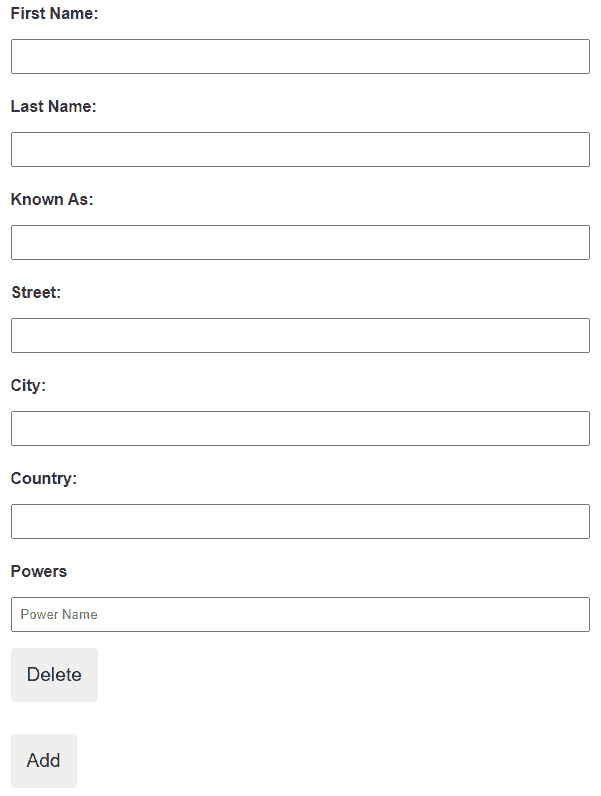
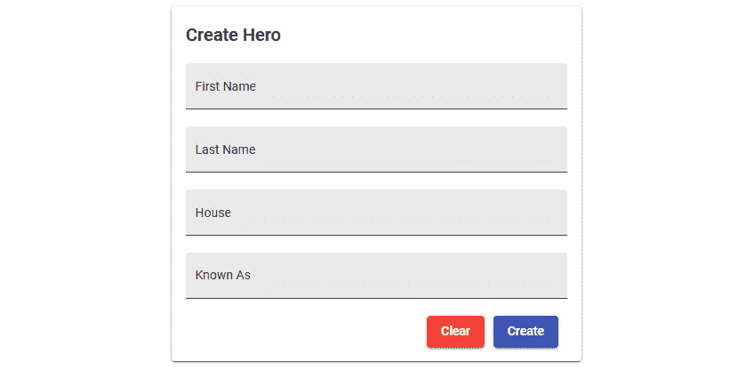

# 第十一章：构建 Reactive Forms

在上一章中，我们已经学习了如何在模块和组件级别上构建我们的 Angular 应用程序结构，这促进了代码的可维护性，尤其是在企业应用程序中。我们将模块组织为三个类别：核心模块、共享模块和功能模块。我们还把组件分为两类：智能组件和哑组件，这区分了那些检索数据并具有依赖关系的组件和仅用于展示目的的组件。

我们还讨论了如何配置和实现 Angular Material，这是一个提供现成组件和基础样式的 UI 库，用于我们的 Angular 应用程序。

在本章中，我们现在将开始学习如何使用 Angular 中的响应式表单来构建表单。我们将了解表单组、表单控件和表单数组，并在我们的表单中创建验证。

在本章中，我们将涵盖以下主题：

+   理解响应式表单

+   基本表单控件

+   表单控件的分组

+   使用 `FormBuilder` 服务生成控件

+   验证表单输入

# 技术要求

这里是本章完成版本的链接：

[`github.com/PacktPublishing/Spring-Boot-and-Angular/tree/main/Chapter-11`](https://github.com/PacktPublishing/Spring-Boot-and-Angular/tree/main/Chapter-11)

# 理解响应式表单

一旦我们创建了 Angular 应用程序，`@angular/forms` 包的优势之一。有两种可用的方式来构建表单。这些是 **模板驱动的表单** 和 **响应式表单**；它们各自拥有自己的表单扩展对开发者来说是有利的，因为这不需要在包下安装来创建表单。

同时，我们可以确保每个 Angular 应用程序使用单个库来构建表单。在本节中，我们将更多地关注如何在我们的应用程序中实现响应式表单，因为这是在 Angular 应用程序中开发表单时常用的方法，但在继续之前，让我们先讨论模板驱动方法的简介。

## 模板驱动的方案

如其名所示，模板驱动的表单是在模板（HTML）中声明和验证的表单。它使用 `ngForm` 指令，将 HTML 表单转换为模板驱动的表单，并创建一个顶级 `FormGroup`，而 `ngModel` 指令为表单元素创建一个 `FormControl`。

要使用模板驱动的表单，我们必须将 `FormsModule` 导入到我们想要使用模板驱动的表单的模块中。在下面的代码示例中，我们将 `FormsModule` 导入了 `app.module.ts` 文件：

```java
…
import { FormsModule } from '@angular/forms';
@NgModule({
  declarations: [
    AppComponent
  ],
  imports: [
    BrowserModule,
    AppRoutingModule,
    FormsModule
  ],
  providers: [],
  bootstrap: [AppComponent]
})
export class AppModule { }
```

我们必须记住导入 `FormsModule`，因为我们的应用程序将无法识别 `ngForm` 和 `ngModel` 指令。

### 创建模板驱动的表单

创建模板驱动的表单的第一步是创建一个 HTML 表单模板。让我们看一下以下代码示例，以了解如何进行此操作：

```java
<form>
  <p>
    <label for="email">Email </label>
    <input type="text" id="email" name="email">
  </p>
  <p>
    <label for="firstname">First Name</label>
    <input type="text" id="firstname" name="firstname">
  </p>
  <p>
    <label for="lastname">Last Name</label>
    <input type="text" id="lastname" name="lastname">
  </p>
  <button type="submit">Submit</button>
</form>
```

在前面的代码示例中，我们已经创建了我们的 HTML 表单模板，并添加了三个表单元素：电子邮件、名字和姓氏输入，这些将成为我们的表单控件。我们还将这些元素包含在一个`<form>`标签中。

在成功创建 HTML 表单模板后，此表单将自动转换为模板驱动的表单。我们不需要在`form`标签上添加`ngForm`指令，因为 Angular 会找到我们应用程序中的所有表单标签并将其转换为模板驱动的表单，尽管我们仍然可以使用`ngForm`指令将其分配给局部模板变量，以便我们访问`ngForm`指令的属性和方法。我们还可以使用该变量模板来提交我们的表单。让我们看一下以下代码示例：

```java
<form #userForm="ngForm">
```

现在，我们可以通过为每个输入添加`ngModel`指令将我们的元素转换为表单控件；这允许我们跟踪每个表单元素的值、验证状态和用户交互。让我们看一下以下添加了表单控件的代码示例：

```java
<form #userForm="ngForm">
  <p>
    <label for="firstname">First Name</label>
    <input type="text" name="firstname" ngModel>
  </p>
  <p>
    <label for="lastname">Last Name</label>
    <input type="text" name="lastname" ngModel>
  </p>
  <p>
    <label for="email">Email </label>
    <input type="text" id="email" name="email" ngModel>
  </p>
</form>
```

最后，我们将添加一个`ngSubmit`事件来提交表单组件的数据。我们将`ngSubmit`事件添加到`form`标签中，并在组件类中添加一个方法来接收数据。让我们看一下以下代码示例：

```java
<!—HTML template -- >
<form #userForm="ngForm" (ngSubmit)="onSubmit(userForm)">
<!—typescript file (Component class) -- >
onSubmit(contactForm) {
    console.log(userForm.value);
 }
```

在前面的代码示例中，一旦用户点击了`onSubmit()`方法，它将在我们的控制台中显示表单控件值作为一个 JSON 对象；这将现在允许我们使用表单值来发送数据并实现业务逻辑。

在成功实施所有步骤之后，我们现在将有一个模板驱动的表单的最终模板：

```java
<form #userForm="ngForm"(ngSubmit)="onSubmit(userForm)">>
  <p>
    <label for="firstname">First Name</label>
    <input type="text" name="firstname" ngModel>
  </p>
  <p>
    <label for="lastname">Last Name</label>
    <input type="text" name="lastname" ngModel>
  </p>
  <p>
    <label for="email">Email </label>
    <input type="text" id="email" name="email" ngModel>
  </p>
 <button type="submit">Submit</button>
</form>
```

### 何时使用模板驱动的表单

模板驱动的表单在 Angular 应用程序中非常灵活且易于实现。然而，这种方法有一些限制，可能会对可维护性产生影响；以下列出了使用模板驱动方法构建表单的最佳场景：

+   当从 AngularJS 迁移到 Angular2 时，使用模板驱动的表单更容易，因为两者都使用`ngModel`指令。

+   模板驱动的表单更适合于简单且小的表单，因为这些表单不需要复杂的验证，因为验证是在模板级别应用的。这可能会成为一个缺点，因为它将使得在更大的应用程序上同时维护验证变得困难。它对将验证应用于表单控件有一定的限制。

在上述第二种场景中，由于复杂表单可以用响应式表单更好地处理，特别是在实现验证方面，因此选择了响应式表单而不是模板驱动的表单。现在让我们了解响应式表单的概念。

## 响应式方法

响应式表单是构建 Angular 应用程序中表单的第二种方法；这是最常用的方法，因为它在处理复杂表单方面比模板驱动表单更有效。响应式表单也被称为**模型驱动表单**，在这种表单中，我们在组件类中定义表单的结构，而不是在模板中定义。

在我们将它绑定到我们的 HTML 表单之前，我们在类中定义了验证，这意味着逻辑和验证模式现在将从 HTML 模板中分离出来，并由组件的 TypeScript 部分维护。

### 使用响应式表单

我们使用响应式表单的第一步是导入 `ReactiveFormsModule`；这通常是在应用程序的根模块或共享模块中导入。`ReactiveFormsModule` 包含所有指令——例如 `formGroup` 和 `formControlName`——这些指令将允许我们实现响应式表单；这也可以在 `@angular/forms` 包下找到。

在成功导入 `ReactiveFormsModule` 之后，下一步是创建我们的 HTML 表单模板，并使用 `FormGroup`、`FormControl` 和 `FormArray` 创建一个模型。这些是响应式表单的三个构建块，我们将使用它们来绑定表单模板，并在此处更详细地说明：

+   `FormControl`：这代表表单内的单个表单元素；它存储表单元素的值，允许我们从每个输入中检索数据。

+   `FormArray`：这是一个表单控件的集合，允许我们动态添加和删除控件以接受来自表单的更多值。

+   `FormGroup`：这是一个表单控件的集合；它也可以包含另一个表单组或表单数组。

假设我们有一个 `HeroesComponent`，我们将在类组件中编写以下代码来创建一个 `FormGroup`：

```java
userForm = new FormGroup({})
```

在前面的代码示例中，我们已经实例化了一个新的 `FormGroup` 并将其分配给 `userForm` 变量；这只是一个表单组，我们还没有向模型中添加表单控件。要添加表单控件，我们将放置以下代码：

```java
userForm = new FormGroup({
  email: new FormControl(),
  firstName: new FormControl(),
  lastName: new FormControl(),
});
```

在前面的示例中，我们可以看到我们已经向 `FormGroup` 中添加了三个表单控件；现在我们可以将这些绑定到应用程序中的 HTML 表单模板，以捕获表单元素的值和状态。

现在让我们使用 `formGroup` 和 `formControlName` 指令创建一个 HTML 表单模板：

```java
<form [formGroup]="userForm" (ngSubmit)="onSubmit()">
   <p>
    <label for="email">Email </label>
    <input type="text" id="email" name="email"
      formControlName="email">
  </p>
  <p>
    <label for="firstname">First Name </label>
    <input type="text" id="firstname" name="firstName"
      formControlName="firstname">
  </p>
  <p>
    <label for="lastname">Last Name </label>
    <input type="text" id="lastname" name="lastname"
      formControlName="lastName">
  </p>
  <p>
    <button type="submit">Submit</button>
  </p>
</form>
```

在示例代码中，我们可以看到模板几乎与模板驱动表单相同。唯一的区别是我们使用 `formGroup` 和 `formControlName` 指令来绑定我们的表单。`formGroup` 指令用于绑定组件类中的 `userFrom` 表单组；另一方面，`formControlName` 指令用于绑定在 `userForm` 表单组中定义的表单控件的值和状态。最后，我们仍然使用 `ngSubmit` 事件在表单中的**提交**按钮被点击时调用一个方法。

我们现在已经在我们的应用程序中成功创建了一个响应式表单，但这仅涵盖了响应式表单的基本功能和概念。在本章的后续部分，我们将讨论表单控件和表单组的函数和功能。

# 基本表单控件

本节现在将讨论更多关于响应式表单中表单控件的概念。我们已经在上一节创建了一个表单控件的示例，但现在，我们将发现更多关于 Angular 中表单控件的功能和能力。

表单控件代表表单内的单个表单元素；它们存储表单元素的值，使我们能够检索每个输入的数据。这可以是 `input`、`textarea` 或任何接受值的元素。在 Angular 中，可以通过添加 `new FormControl('')` 代码来实例化表单控件；我们可以看到它接受一个参数，该参数定义了控件的值。这些值可以是 `null`，因为表单控件可以被重置。

表单控件就像 JSON 对象的属性，但与 JSON 相比，每个控件都有其方法，这些方法将帮助我们控制、修改和验证值。

接下来，让我们来看看表单控件的不同方法和功能。

## 表单控件方法

让我们来看看我们可以用于修改控件的不同的表单控件方法和它们的参数：

+   `setValue()`：设置控件新值的方法。

**参数**：

+   `value`：分配给表单控件的新的值。

+   `options`：一个对象，定义了控件在值变化时如何传播更改和发出事件。以下是我们可以设置在表单控件中的选项：

    +   `onlySelf`：当设置为 `true` 时，控件的变化不会影响其他控件。

    +   `emitEvent`：当设置为 `true` 或未提供时，当表单控件的状体和值更新时，会发出 `statusChanges` 和 `valueChanges` 可观察对象。

    +   `emitModelToViewChange`：当设置为 `true` 或未提供时，表单控件的变化将调用 `onChange` 事件来更新视图。

    +   `emitViewToModelChange`：当设置为 `true` 或未提供时，表单控件的变化将调用 `onModelChange` 事件来更新视图。

下面是使用 `setValue()` 方法的代码：

```java
setValue(value: TValue, options?: { onlySelf?: boolean; emitEvent?: boolean; emitModelToViewChange?: boolean; emitViewToModelChange?: boolean; }): void
```

+   `patchValue()`：修补控件的值。`patchValue` 方法的参数与 `setValue()` 方法相同。

下面是使用 `patchValue()` 方法的代码：

```java
patchValue(value: TValue, options?: { onlySelf?: boolean; emitEvent?: boolean; emitModelToViewChange?: boolean; emitViewToModelChange?: boolean; }): void
```

+   `getRawValue()`：检索表单控件的值。这通常用于禁用表单控件。

下面是使用 `getRawValue()` 方法的代码：

```java
getRawValue(): TValue
```

+   `reset()`：将表单控件重置为其默认值。它还将控件标记为原始的且未被修改的。

**参数**：

+   `formState`：定义控件的初始值和禁用状态。

+   `options`: 一个对象，定义了控件如何传播更改以及在值更改时发出事件。我们可以在表单控件中设置以下选项：

    +   `onlySelf`: 当设置为 `true` 时，控件的更改不会影响其他控件。

下面是使用 `reset()` 方法的代码示例：

```java
reset(formState?: TValue | FormControlState<TValue>, options?: { onlySelf?: boolean; emitEvent?: boolean; }): void
```

+   `registerOnChange()`: 注册一个监听器，一旦表单控件的值改变就发出事件。

**参数**：

+   `function`: 当值改变时被调用的方法，如下所示：

    ```java
    registerOnChange(fn: Function): void
    ```

+   `registerOnDisabledChange()`: 注册一个监听器，一旦控制器的 `isDisabled` 状态改变就发出事件。

**参数**：

+   `function`: 当禁用状态改变时被调用的方法，如下所示：

    ```java
    registerOnDisabledChange(fn: (isDisabled: boolean) => void): void
    ```

我们现在已经了解了可以在表单控件中使用的不同方法。现在，让我们看看一些不同用法的表单控件示例。

## 初始化表单控件

有几种方法可以初始化我们的表单控件。我们可以设置特定表单控件的值、禁用状态和验证器。让我们看看以下示例：

+   **使用初始值初始化表单控件**：

    ```java
    const control = new FormControl('Hero!'); console.log(control.value); // Hero
    ```

在前面的代码示例中，我们使用默认值 `Hero` 实例化了一个表单控件。我们可以通过访问从 `AbstractControl` 继承的 `value` 属性来访问该值。

+   **使用初始值和禁用状态初始化表单控件**：

    ```java
    const control = new FormControl({ value: 'Hero', disabled: true });
    ```

    ```java
    // get the status
    ```

    ```java
    console.log(control.value, control.status); //Hero,
    ```

    ```java
                                                //DISABLED
    ```

在前面的代码示例中，我们使用对象值实例化了一个表单控件。这初始化了表单控件的值和禁用状态。我们可以通过访问从 `AbstractControl` 继承的 `status` 属性来访问该值。

+   **使用初始值和内置验证器数组初始化表单控件**：

    ```java
    const control = new FormControl('', [Validators.email, Validators.required);
    ```

    ```java
    // get the status
    ```

    ```java
    console.log(control.status); // INVALID
    ```

在前面的代码示例中，我们使用一个空字符串值实例化了一个表单控件。使用验证器数组的第二个参数，这将返回一个无效状态，因为不应该有空值，而应该是一个有效的电子邮件格式。

## 重置表单控件

我们可以使用 `reset()` 方法重置表单控件的值和禁用状态。让我们看看以下不同用法的代码示例：

+   **将控制器重置到** **特定值**：

    ```java
    const control = new FormControl('Tony Stark')
    ```

    ```java
    console.log(control.value); // Tony Stark
    ```

    ```java
    control.reset('Iron Man');
    ```

    ```java
    console.log(control.value); // Iron Man
    ```

在前面的代码示例中，我们使用了一个参数的 `reset()` 方法。该参数允许我们将表单控件重置到特定值。

+   **重置控制器到** **初始值**：

    ```java
    const control = new FormControl('Tony Stark')
    ```

    ```java
    console.log(control.value); // Tony Stark
    ```

    ```java
    control.reset();
    ```

    ```java
    console.log(control.value); // Tony Stark
    ```

在前面的代码示例中，我们使用不带参数的 `reset()` 方法。这将使用初始值重置表单控件的值。

+   **使用值和禁用状态重置控制器**：

    ```java
    const control = new FormControl('Tony Stark'); console.log(control.value); // Tony Stark console.log(control.status); // VALID
    ```

    ```java
    control.reset({ value: 'Iron Man', disabled: true });
    ```

    ```java
    console.log(control.value); // Iron Man console.log(control.status); // DISABLED
    ```

在前面的代码示例中，我们在调用 `reset()` 方法时使用了一个对象参数，并指出了表单控件的值和禁用状态。在这种情况下，它将禁用控件并将状态更改为 `DISABLED`。

## 监听事件

在使用表单控件时，我们可以监听多个事件，例如值变化和状态变化。让我们看看以下代码示例，了解如何监听表单控件的事件：

+   **监听** **值变化**：

    ```java
    control = new FormControl('');
    ```

    ```java
    this.control.valueChanges.subscribe((data) => {
    ```

    ```java
          console.log(data); // Iron Man
    ```

    ```java
        });
    ```

    ```java
    this.control.setValue('Iron Man')
    ```

在前面的代码示例中，我们调用了具有 `Observable` 类型的 `valueChanges` 属性，我们可以订阅它来监听表单控件值的更改。在这种情况下，一旦我们设置了表单控件的值，`valueChanges` 属性将发出新的值。

+   **监听** **状态变化**：

    ```java
    control = new FormControl('');
    ```

    ```java
    this.control.statusChanges.subscribe((data) => {
    ```

    ```java
          console.log(data); // DISABLED
    ```

    ```java
        });
    ```

    ```java
    This.control.disable ()
    ```

在前面的代码示例中，我们调用了具有 `Observable` 类型的 `statusChanges` 属性，我们可以订阅它来监听表单控件状态的变化。在这种情况下，一旦我们禁用表单控件，这将发出新的状态，即 `DISABLED`。

我们已经学习了关于表单控件的功能和特性；现在，我们将讨论如何使用表单组和表单数组来分组表单控件。

# 分组表单控件

本节将讨论如何在我们的应用程序中分组表单控件。表单包含多个相关控件，因此有必要将它们分组以获得更好的结构。响应式表单提供了两种分组表单控件的方法，如下所示：

+   **表单组**：创建一个具有固定表单控件集合的表单。表单组还可以包含另一组表单组来处理复杂表单。

+   **表单数组**：创建一个具有动态表单控件的表单。它可以添加和删除表单控件，同时还可以包含其他表单数组来处理复杂表单。

## 创建表单组

表单组允许我们通过组来控制表单控件的值和状态。我们还可以通过其名称在表单组内部访问单个表单控件。要创建一个表单组，请按照以下步骤进行：

1.  假设我们有一个 `HeroComponent`；例如，第一步是从 `@angular/forms` 包中导入 `FormGroup` 和 `FormControl` 类，如下所示：

    ```java
    import { FormGroup, FormControl } from '@angular/forms';
    ```

1.  下一步是创建一个 `FormGroup` 实例。在这个例子中，我们想要创建一个新的表单组，包含 `firstName`、`lastName` 和 `knownAs` 表单控件：

    ```java
    export class HeroComponent {
    ```

    ```java
      heroForm = new FormGroup({
    ```

    ```java
          firstName: new FormControl(''),
    ```

    ```java
          lastName: new FormControl(''),
    ```

    ```java
          knownAs: new FormControl('')
    ```

    ```java
    });
    ```

    ```java
    }
    ```

在前面的代码示例中，我们创建了一个名为 `heroForm` 的新表单组。同时，我们在 `heroForm` 表单中添加了三个表单控件作为对象参数。

1.  下一步是将我们的表单组实例与视图中的表单元素绑定：

    ```java
    <form [formGroup]=" heroForm ">
    ```

    ```java
      <label for="first-name">First Name: </label>
    ```

    ```java
      <input id="first-name" type="text"
    ```

    ```java
        formControlName="firstName">
    ```

    ```java
      <label for="last-name">Last Name: </label>
    ```

    ```java
      <input id="last-name" type="text"
    ```

    ```java
        formControlName="lastName">
    ```

    ```java
      <label for="known-as">Known As: </label>
    ```

    ```java
      <input id="known-as" type="text"
    ```

    ```java
        formControlName="knownAs"> </form>
    ```

在前面的代码示例中，我们使用了 `formGroup` 指令将我们的 `heroForm` 表单绑定到表单元素上。我们还必须使用 `formControlName` 指令将每个表单控件与输入元素绑定。

1.  最后一步是获取整个表单组的值。我们将使用 `ngSubmit` 事件调用一个方法，并通过访问 `value` 属性来检索表单值，如下所示：

    ```java
    //hero.component.html
    ```

    ```java
    <form [formGroup]="heroForm" (ngSubmit)="onSubmit()">
    ```

    ```java
    //hero.component.ts
    ```

    ```java
    onSubmit() {
    ```

    ```java
    // Will display value of form group in a form of JSON
    ```

    ```java
     console.warn(this.heroForm.value);
    ```

    ```java
    }
    ```

我们已经创建并绑定了一个示例表单组，但这只是一个简单的表单组，引入了控件的线性结构。现在，让我们创建一个包含表单组的表单组。

## 创建嵌套表单组

表单组也可以包含另一个表单组，而不是包含控件列表。想象一个具有另一个 JSON 对象值的属性的 JSON 对象。这不能通过简单的线性表单控件来处理，我们必须创建另一组表单组来处理这种类型的对象。

让我们按照以下步骤开发嵌套表单组：

1.  我们将使用之前的表单示例；在这种情况下，我们希望在我们的表单中添加一个新的`address`属性，但不是将其作为一个新的表单控件实例，而是将其声明为一个新的表单组实例：

    ```java
    export class HeroComponent {
    ```

    ```java
     heroForm = new FormGroup({
    ```

    ```java
          firstName: new FormControl(''),
    ```

    ```java
    lastName: new FormControl(''),
    ```

    ```java
    knownAs: new FormControl('')
    ```

    ```java
    address: new FormGroup({
    ```

    ```java
        street: new FormControl('')
    ```

    ```java
        city: new FormControl('')
    ```

    ```java
        country: new FormControl('')
    ```

    ```java
    })
    ```

    ```java
    });
    ```

    ```java
    }
    ```

在前面的代码示例中，我们添加了一个`address`属性作为新的表单组实例。我们还在表单组内部添加了新的表单控件——即`street`、`city`和`country`。现在这被认为是一个嵌套的表单组。

1.  下一步是将嵌套表单组与视图中的表单元素绑定：

    ```java
      <div formGroupName="address">
    ```

    ```java
            <label for="street">Street: </label>
    ```

    ```java
            <input id="street" type="text"
    ```

    ```java
              formControlName="street">
    ```

    ```java
            <label for="city">City: </label>
    ```

    ```java
            <input id="city" type="text"
    ```

    ```java
              formControlName="city">
    ```

    ```java
            <label for="country">Country: </label>
    ```

    ```java
            <input id="country" type="text"
    ```

    ```java
              formControlName="country">
    ```

    ```java
        </div>
    ```

在前面的代码示例中，我们使用了`formGroupName`指令来绑定我们的地址表单组。请记住，这个元素应该位于`heroForm`表单组内部；我们还使用了`formControlName`指令来绑定嵌套表单组下的控件。现在，我们也可以再次使用`ngSubmit`事件，并调用`value`属性，就像在之前的示例中那样，以获取整个表单的值。

我们已经使用表单组创建了简单和复杂的表单。现在，让我们讨论另一种使用表单数组来分组控件的方法。

## 创建表单数组

表单数组很有用，特别是如果我们想在运行时添加或删除表单中的控件。这使我们能够在应用程序中拥有灵活的表单，同时处理更复杂的一组对象。要创建表单数组，让我们看看以下步骤：

1.  我们将使用之前的表单示例；在这种情况下，我们希望在我们的表单中添加一个新的`powers`属性，并将其声明为一个新的`FormArray`实例：

    ```java
    export class HeroComponent implements OnInit {
    ```

    ```java
     powerFormArray: FormArray;
    ```

    ```java
     constructor() {
    ```

    ```java
        this.powerFormArray=
    ```

    ```java
          this.heroForm.get("powers") as FormArray;
    ```

    ```java
     }
    ```

    ```java
    ngOnInit() {
    ```

    ```java
        heroForm = new FormGroup({
    ```

    ```java
            ... controls from previous example
    ```

    ```java
            powers: new FormArray([])
    ```

    ```java
       })
    ```

    ```java
     }
    ```

    ```java
    }
    ```

在前面的代码示例中，我们在`heroForm`表单组内部创建了一个新的`FormArray`实例。这个实例初始化时接受一个空数组，没有任何表单控件。我们还把这个表单数组的实例赋值给一个变量，以便我们在视图中访问这个数组。

1.  下一步是创建可以添加和删除表单数组中表单控件实例的方法：

    ```java
     addPower() {
    ```

    ```java
        (this.form.get("powers") as FormArray).push(new
    ```

    ```java
          FormControl());
    ```

    ```java
      }
    ```

    ```java
      deletePower(i: number) {
    ```

    ```java
        (this.form.get("powers") as
    ```

    ```java
          FormArray).removeAt(i);
    ```

    ```java
      }
    ```

在前面的代码示例中，我们创建了两个方法，我们将使用这些方法来处理表单数组。`addPower()`方法允许我们在力量表单数组中添加一个新的表单控件实例；这个方法通过名称获取表单数组的实例，并推送一个新的表单控件实例。

另一方面，`deletePower()`方法通过名称获取表单数组的实例，并使用`removeAt()`方法和要删除的控件索引来删除特定的表单控件。

1.  最后一步是将表单数组实例与视图中的表单元素绑定：

    ```java
    <ng-container formArrayName="powers">
    ```

    ```java
       <label for="tags">Tags</label>
    ```

    ```java
       <div class="input-group mb-3" *ngFor="let _ of
    ```

    ```java
         powerFormArray.controls; index as i">
    ```

    ```java
          <input type="text" class="form-control"
    ```

    ```java
             [formControlName]="i" placeholder="Power
    ```

    ```java
              Name">
    ```

    ```java
          <button (click)="deletePower(i)"
    ```

    ```java
            class="btn btn-danger"
    ```

    ```java
            type="button">Delete</button>
    ```

    ```java
    </div>
    ```

    ```java
          <button class="btn btn-info me-md-2"
    ```

    ```java
            type="button" (click)="addPower()">
    ```

    ```java
            Add</button>
    ```

    ```java
    </ng-container>
    ```

在前面的代码示例中，我们使用`formArrayName`指令将力量绑定到视图中的表单数组上。我们还使用了`ngFor`指令来迭代表单数组内的所有控件；我们还需要获取每个控件的索引，并将其传递给我们的`deletePower()`方法。

在成功创建表单数组后，我们现在将有一个表单的视图：



图 11.1 – 带有表单组和表单数组的英雄表单

我们已经成功使用表单组和表单数组创建了响应式表单。现在，我们将使用`FormBuilder`服务来简化我们应用程序中创建表单的语法。

# 使用`FormBuilder`服务生成控件

在上一节中，我们成功使用了表单组、表单数组和表单控件创建了响应式表单。然而，正如我们从语法中看到的，创建表单变得重复。我们总是在实例化新的表单控件、表单数组和表单组实例，这在较大的表单中并不理想。`FormBuilder`为这个问题提供了解决方案。

这是一个可以将它注入到我们的组件中以生成组、控件和数组而不需要实例化新对象的服务。要使用`FormBuilder`创建响应式表单，我们将遵循以下步骤：

1.  我们将使用`FormBuilder`将上一节的表单进行转换。第一步是从`@angular/forms`导入`FormBuilder`服务到我们的组件中：

    ```java
    import { FormBuilder } from '@angular/forms';
    ```

1.  下一步是将`FormBuilder`服务注入到我们的组件中：

    ```java
    export class HeroComponent implements OnInit {
    ```

    ```java
     powerFormArray: FormArray;
    ```

    ```java
    constructor(private fb: FormBuilder) {}
    ```

    ```java
    ... code implementation
    ```

    ```java
    }
    ```

1.  最后一步是使用`FormBuilder`服务的`FormBuilder`方法创建和生成控件：

    ```java
    export class HeroComponent implements OnInit {
    ```

    ```java
     heroForm = this.fb.group({
    ```

    ```java
          firstName: [''],
    ```

    ```java
         lastName: [''],
    ```

    ```java
         knownAs: [''],
    ```

    ```java
         address:  this.fb.group({
    ```

    ```java
            street: [''],
    ```

    ```java
            city: [''],
    ```

    ```java
            country: [''],
    ```

    ```java
        }),
    ```

    ```java
          powers: this.fb.array([])
    ```

    ```java
    });
    ```

    ```java
    constructor(private fb: FormBuilder) {}
    ```

    ```java
    ... code implementation
    ```

    ```java
    }
    ```

我们可以在前面的示例中看到，我们的表单结构与上一节中创建的表单相同。主要区别在于我们正在使用`FormBuilder`的方法来创建表单。我们使用了`group()`方法来生成表单组，`array()`方法来生成表单数组，以及一个空字符串值的数组来生成控件并设置其默认值。

此代码的输出将相同。`FormBuilder`方法主要用于使我们的响应式表单更加简洁和易读。现在，我们将讨论如何为我们的控件添加验证。

# 验证表单输入

在上一节中，我们已经创建并简化了我们的响应式表单，但我们要使我们的表单在接收数据时更加准确，同时为用户提供一个用户友好的体验，让他们能够轻松地知道每个控件的有效值。现在，我们将学习如何为我们的响应式表单添加验证。

在响应式表单中，我们直接将验证器作为参数添加到组件类中的表单控件，而不是在模板中作为属性添加。

## 内置验证器

Angular 提供了几个内置的验证函数，我们可以在我们的表单中直接使用。让我们看看其中的一些：

+   `static min(min: number)`—要求控件的值等于或大于给定的数字：

    ```java
    form = this.fb.group({
    ```

    ```java
      name: [10, [Validators.min(4)]]
    ```

    ```java
    });
    ```

    ```java
    console.log(this.form.status) // returns VALID
    ```

    ```java
    static max(max: number) – requires the value of the control to be equal to or less than the given number.
    ```

    ```java
    form = this.fb.group({
    ```

    ```java
      name: [3, [Validators.max (4)]]
    ```

    ```java
    });
    ```

    ```java
    console.log(this.form.status) // returns VALID
    ```

+   `static required(control: AbstractControl<any, any>)`—控件不得有非空值：

    ```java
    form = this.fb.group({
    ```

    ```java
      name: ['test value', [Validators.required]]
    ```

    ```java
    });
    ```

    ```java
    console.log(this.form.status) // returns VALID
    ```

+   `static requiredTrue(control: AbstractControl<any, any>)`—控件必须有一个值为`true`的值：

    ```java
    form = this.fb.group({
    ```

    ```java
      name: [true, [Validators.requiredTrue]]
    ```

    ```java
    });
    ```

    ```java
    console.log(this.form.status) // returns VALID
    ```

+   `static minLength(minLength: number)`—用于数组和字符串，这要求值的长度应等于或大于给定的数字：

    ```java
    form = this.fb.group({
    ```

    ```java
      name: ['test', [Validators.minLength (4)]]
    ```

    ```java
    });
    ```

    ```java
    console.log(this.form.status) // returns VALID
    ```

+   `static maxLength(maxLength: number)`—用于数组和字符串，这要求值的长度应等于或小于给定的数字：

    ```java
    form = this.fb.group({
    ```

    ```java
      name: ['test', [Validators.maxLength (4)]]
    ```

    ```java
    });
    ```

    ```java
    console.log(this.form.status) // returns VALID
    ```

## 自定义验证器

除了内置的验证器之外，我们还可以创建自定义验证器，这对于我们的表单需要更复杂的验证和检查是有帮助的。

让我们看看以下示例自定义验证器：

```java
import { AbstractControl, ValidationErrors, ValidatorFn } from "@angular/forms";
export function checkHasNumberValidator(): ValidatorFn {
    return (control: AbstractControl): ValidationErrors |
      null => {
      const error = /\d/.test(control.value);
      return error ? {hasNumbers: {value: control.value}} :
        null;
    };
}
```

在前面的代码示例中，我们创建了一个名为`checkHasNumberValidator()`的新验证器。这个验证器的主要用途是使包含数字的控件值无效。我们检索了分配了验证器的表单控件，然后我们测试了控件的值，如果正则表达式为`true`，则返回一个名为`hasNumbers`的自定义错误。

在成功创建自定义验证器之后，我们现在可以在我们的控件中使用它，如下所示：

```java
heroForm = this.fb.group({
     firstName: ['', [checkHasNumberValidator]],
     lastName: ['', [checkHasNumberValidator]],
     knownAs: [''],
     address:  this.fb.group({
        street: [''],
        city: [''],
        country: [''],
    }),
      powers: this.fb.array([])
});
```

在前面的示例代码中，我们希望我们的名字和姓氏字段仅限于字母。在这种情况下，我们将`checkHasNumberValidator`作为`firstName`和`lastName`控件的第二个参数使用。

让我们继续进行响应式表单的实现。

## 在我们的项目中实现响应式表单

现在，我们已经成功地学习了如何使用`FormBuilder`开发响应式表单，并且同时为我们的控件添加了验证。现在，我们将这些响应式表单实现到我们的项目中。

第一步是创建我们的表单组实例。在`anti-hero/components/anti-hero-form`文件下，我们将使用类组件中的`FormBuilder`服务创建我们的表单组，同时，我们将在我们的 HTML 模板中创建我们的表单元素。按照以下步骤进行：

1.  通过执行以下代码创建一个表单组实例：

    ```java
    export class AntiHeroFormComponent implements OnInit {
    ```

    ```java
      @Input() selectedId = "";
    ```

    ```java
      @Input() actionButtonLabel: string = 'Create';
    ```

    ```java
      form: FormGroup;
    ```

    ```java
      constructor(private fb: FormBuilder) {
    ```

    ```java
        this.form = this.fb.group({
    ```

    ```java
          id: [''],
    ```

    ```java
          firstName: [''],
    ```

    ```java
          lastName: [''],
    ```

    ```java
          house: [''],
    ```

    ```java
          knownAs: ['']
    ```

    ```java
        })
    ```

    ```java
       }
    ```

    ```java
    <! – Please refer to the anti-hero-form.component.ts file in the GitHub repo, Thank you ->
    ```

    ```java
    }
    ```

1.  然后，创建一个 HTML 模板，如下所示：

    ```java
    <! – Please refer to the anti-hero-form.component.html file in the GitHub repo, Thank you ->
    ```

在我们`component`类的实现代码中，我们首先创建了一个表单组对象。我们添加了几个类似于反英雄对象属性的控件。我们的目标是使用相同的表单来创建和更新反英雄的详细信息。在这种情况下，我们还向我们的类中添加了几个`Input()`绑定和方法，以帮助表单识别当前正在执行的操作：

+   `selectedId`: 这将接受反英雄的 ID，如果操作被更新。

+   `actionButtonLabel`: 这将根据正在执行的操作（`Create` 或 `Update`）而改变。

+   `checkAction()`: 如果 `selectedId` 有值，这将更改 `actionButtonLabel` 的值为 `"Update"`。

+   `patchDataValues()`: 这将用于修补表单控件中选定反英雄的值。

+   `emitAction()`: 将表单值和操作值发射到父组件。

+   `clear()`: 调用 `reset()` 方法来清理表单。

1.  下一步是在我们的表单页面组件中使用反英雄表单。在 `anti-hero/pages/form` 文件下，我们将把反英雄表单放入 HTML 模板中，同时检查当前路由是否包含所选反英雄的 ID 参数。以下是步骤：

    1.  将反英雄表单添加到 HTML 模板中：

    ```java
    <app-anti-hero-form [selectedId]="id"></app-anti-hero-form>
    ```

    1.  添加激活的路由以捕获 ID：

    ```java
    export class FormComponent implements OnInit {
    ```

    ```java
      id = "";
    ```

    ```java
      constructor(private router: ActivatedRoute) { }
    ```

    ```java
      ngOnInit(): void {
    ```

    ```java
        this.id = this.router.snapshot.params['id'];
    ```

    ```java
      }
    ```

    ```java
    }
    ```

1.  下一步现在是为我们的页面表单组件创建一个路由。在 `anti-hero-routing.module.ts` 文件中，我们将向我们的路由添加以下条目：

    ```java
      {
    ```

    ```java
        path: "form",
    ```

    ```java
        children: [
    ```

    ```java
          {
    ```

    ```java
            path: "",
    ```

    ```java
            component: FormComponent
    ```

    ```java
          },
    ```

    ```java
          {
    ```

    ```java
            path: ":id",
    ```

    ```java
            component: FormComponent
    ```

    ```java
          }
    ```

    ```java
        ]
    ```

    ```java
      },
    ```

在前面的代码示例中，我们创建了两个重定向到 `FormComponent` 的路由。第一个路由是用于 `create` 操作的，它有一个 `baseURL/anti-heroes/form` 路由，第二个路由是用于 `update` 操作的，它有一个 `baseURL/anti-heroes/form/:id` 路由。这意味着我们为两个操作使用了相同的组件，而 `id` 参数作为我们当前正在执行的操作的指示器。

1.  最后一步是为 `list` 组件添加导航。我们将添加几个方法，这些方法将调用导航方法，根据所选操作将我们重定向到表单组件，如下所示：

    +   `list.component.html`:

        ```java
        <!-- Dumb component command bar -->
        ```

        ```java
        <app-anti-hero-command-bar (action)="executeCommandBarAction($event)"></app-anti-hero-command-bar>
        ```

        ```java
        <!-- Dumb component anti hero list -->
        ```

        ```java
        <app-anti-hero-list [antiHeroes]="antiHeroes" list.component.ts:

        ```

        selectAntiHero(data: {antiHero: AntiHero, action: TableActions}) {

        ```java

        ```

        <! – 请参阅 GitHub 仓库中的 list.component.ts 文件，谢谢->

        ```java

        ```

        this.router.navigate(['anti-heroes', 'form',

        ```java

        ```

        data.antiHero.id]);

        ```java

        ```

        }

        ```java

        ```

        executeCommandBarAction(action: CommandBarActions) {

        ```java

        ```

        switch(action) {

        ```java

        ```

        case CommandBarActions.Create: {

        ```java

        ```

        this.router.navigate(["anti-heroes", "form"]);

        ```java

        ```

        return;

        ```java

        ```

        }

        ```java

        ```

        case CommandBarActions.DeleteAll: {

        ```java

        ```

        return;

        ```java

        ```

        }

        ```java

        ```

        default: ""

        ```java

        ```

        }

        ```java

        ```

        }

        ```java

        ```

完成所有步骤后，我们现在将得到以下表单输出：



图 11.2 – 创建反英雄的表单 UI

# 摘要

通过这一点，我们已经到达了本章的结尾；让我们回顾一下你所学到的宝贵内容。你已经了解了 Angular 反应式表单的概念和实现，我们实现了 `FormGroup`、`FormBuilder` 和 `formControlName` 指令来绑定输入值以捕获表单中的数据。我们还讨论了如何将表单控件分组以绑定嵌套属性，并在我们的反应式表单中创建表单数组。这主要适用于我们想要显示的某些对象具有数组值的情况。

同时，我们希望接受用户输入的一列条目。最后，我们还学习了如何实现表单控件的有效性验证来处理和验证用户输入，这将有益于用户体验并有助于避免意外错误。

在下一章中，我们将学习 Angular 应用程序中状态管理的概念和实现；我们将讨论 Redux 模式以及 **NgRx** 库的想法，从它们如何改进应用程序架构的角度进行讨论。
