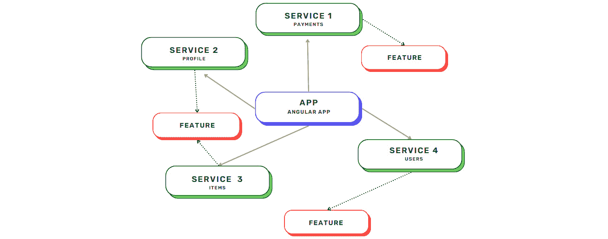
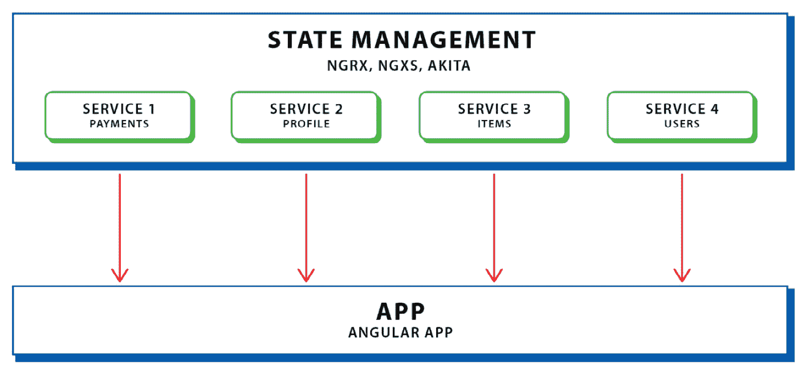
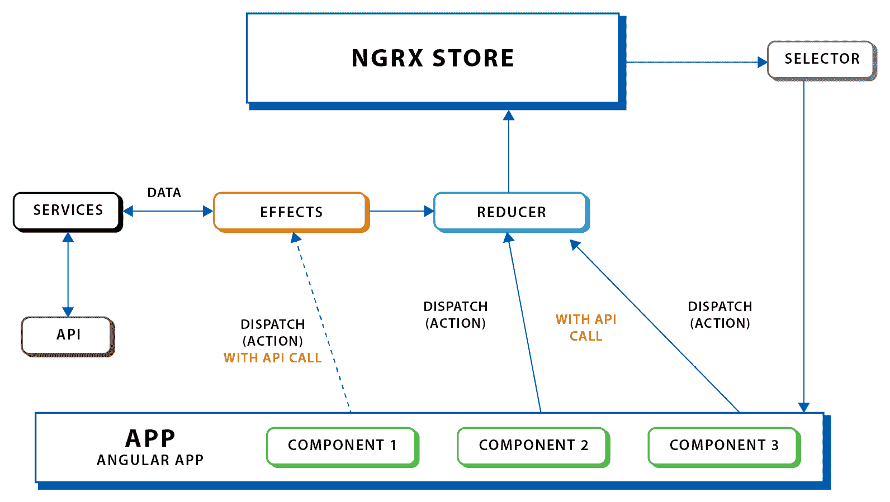
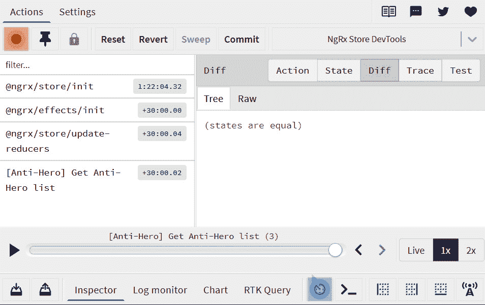

# 12

# 使用 NgRx 管理状态

在上一章中，我们学习了响应式表单的概念和特性。我们实现了 `FormGroup`、`FormBuilder` 和 `formControlName` 来绑定应用中表单元素中的输入值。我们还讨论了如何在响应式表单中分组表单控件以绑定嵌套属性并创建表单数组。

之后，我们学习了如何为表单控件实现验证以处理和验证用户输入。这将有益于用户体验，并帮助我们避免意外错误。

在本章中，我们将向我们的应用添加一个新的食谱，并学习如何实现状态管理，特别是 **NgRx**，以处理我们的 Angular 应用中的数据。

本章将涵盖以下主题：

+   理解在管理大型应用程序状态中的复杂性

+   状态管理和全局状态

+   开始使用并设置 NgRx

+   编写动作

+   编写效果

+   编写还原器

+   在组件中编写选择器并使用选择器分发

+   配置存储

# 技术要求

以下链接将带您到本章代码的完成版本：[`github.com/PacktPublishing/Spring-Boot-and-Angular/tree/main/Chapter-12/superheroes`](https://github.com/PacktPublishing/Spring-Boot-and-Angular/tree/main/Chapter-12/superheroes)。

# 理解在管理大型应用程序状态中的复杂性

前端应用程序中的数据管理非常重要，就像后端应用程序和数据库中的数据管理一样重要。随着我们向应用添加更多功能，我们知道我们 Angular 项目内部工作的组件、模块和服务数量也在增长。

这也意味着应用程序中的数据流正在增长并变得复杂。复杂的数据流可能导致难以维护的应用程序、不同组件中的不一致和分散的状态，以及导致复杂代码结构的嵌套输入和输出绑定。由于在 Angular 中管理数据时可能出现的这些问题，因此引入了称为 **状态管理** 的解决方案，作为维护前端应用程序数据的标准解决方案。

状态管理是一个扩展或库，主要用于管理和处理前端应用程序中的数据。它引入了一种模式，其中所有使用的数据都存储在一个大对象中，该对象充当整个应用程序的状态。这个概念也被称为 **单一事实来源**。在这种情况下，无论我们向应用中添加多少组件或服务，总有一个单一的对象，我们可以从中检索所需的数据。您可以把这个状态比作前端应用程序的数据库。

在进行状态管理之前，让我们比较一下无状态管理和有状态管理的数据流。

## 无状态管理的数据流

在 Angular 中，数据流始于服务。我们调用服务中的端点来检索和管理我们应用程序所需的数据。随着功能的增加，添加和调用的服务数量也会增加，导致数据流更加复杂。让我们看看没有状态管理的数据流图示：



图 12.1 – 没有状态管理的数据流

在先前的图形说明中，我们可以看到我们有四个不同的服务，它们负责管理不同类型的数据；每个功能都从这些服务中检索所需的数据。

如我们所见，由于功能在不同的源或服务中检索数据，检索是分散的。这导致多个数据流，并且随着需要更多服务和功能，它们可能会变得更大。

这也可能导致每个组件持有的数据不一致，因为数据源来自不同的服务，导致应用程序中出现一些意外的错误。现在，让我们看看有状态管理的数据流。

## 有状态管理的数据流

在先前的数据流中，我们看到数据流没有得到优化，这可能导致我们应用程序中出现几个问题，因为数据流的流向非常复杂。在我们实现 Angular 应用程序的状态管理时，我们将有以下数据流：



图 12.2 – 有状态管理的数据流

在先前的图形说明中，我们可以看到我们的应用程序中的所有服务都由状态管理处理。我们仍然使用服务从数据库中检索数据。这里的一个重要区别是，我们的功能现在是在状态中而不是直接在服务中访问所有检索到的数据。

这允许数据单向流动，并且所有在应用程序中使用的数据都有一个单一来源。采用这种方法，可以避免状态的不一致性、可能的错误和多次 API 调用。

有了这些，我们已经了解了在开发应用程序中状态管理的重要性，尤其是在开发企业级应用程序时。

现在，让我们讨论更多关于状态管理和全局状态的概念。

# 状态管理和全局状态

如前所述，状态管理是一个扩展或库，它允许我们以单向方式管理应用程序中的数据流。

这是因为全局状态，它将包含所有数据。为了理解状态管理是如何工作的，让我们讨论状态管理的各个构建块。

## 全局状态/存储

**全局状态**，也称为**store**，是状态管理中最关键的因素。全局状态的主要责任是存储所有通过 API 检索到的数据或简单地存储在应用程序中使用的所有数据。

这意味着 Angular 应用程序中的所有组件都将从全局状态中检索数据。将其视为 Angular 应用程序的数据库，但以 JSON 对象的形式，我们可以获取每个属性作为切片。

## Actions

`dispatch()`函数，它有助于识别应该执行哪些事件，例如修改状态或调用 API 检索数据。

动作只是简单的接口；`type`属性标识了发出的动作。这个简单的字符串只是动作的定义，我们可以为动作添加属性，以添加我们需要的 API 或状态中的数据。

让我们看看动作接口的一个例子：

```java
{
type: '[Blog] Add Blog',
title: string;
author: string;
content: string;
}
```

在前面的例子中，当创建一个新的博客时，会发出这个动作。当`title`、`author`和`content`作为附加元数据添加时，会调用这个动作，以便传递给 effect 或 reducer。

## Reducers

**Reducers**是状态管理的决策者。它们是决定基于动作类型处理哪些动作的那部分。Reducers 也是可以改变状态值的那部分。

Reducers 是纯函数，并同步处理状态转换；让我们看看一个 reducer 的例子：

```java
export const blogReducer = createReducer( initialState,
  on(BlogActions.addBlog, (state, {blog})=> ({ ...state,
    blogs: […state.blogs, blog]}))
);
```

在前面的例子中，我们为`addBlog()`动作创建了一个 reducer。这允许我们在发出`addBlog()`动作后，在博客的状态中添加一个新的博客对象。

我们将在本章的“编写 reducer”部分更详细地讨论 reducer。

## Selectors

**选择器**是允许我们从 store 中检索数据片段的纯函数。这是一个变化检测机制，当状态值发生变化时，它会比较状态的部分，并且只有在检测到变化时才发送状态。这是一种称为**记忆化**的实践。

选择器用于组件中获取 UI 中使用的数据。它返回一个 Observable，该 Observable 监听状态变化。

让我们看看一个选择器的例子：

```java
// selector for list of blogs
// blog.selector.ts
export const selectBlogList = (state: AppState) => state.blogs;
// blog component
// blog.component.ts
blogs$ = this.store.select<Array<Blog>(selectBlogList);
   this.blogs$.subscribe(data => {
      console.log(data) // list of blogs from the state;
    });
```

在前面的例子中，我们为博客切片创建了一个选择器，以及一个返回*blogs*元数据的函数，称为`selectBlogList()`。我们在`blog`组件中将此函数用作`select`函数的参数，通过订阅选择器来检索数据。订阅将在博客切片的值发生变化时发出。我们将在本章的下一节更详细地讨论选择器。

## Effects

副作用是`NgRx`库使用的特定元素；这是一个由`RxJs`驱动的副作用模型，它处理外部交互，如 API 调用、WebSocket 消息和时间相关事件。使用副作用，我们可以将我们的组件从与外部源交互中隔离出来，并减少它们的职责。让我们来看一个具有和没有副作用的应用程序的比较。

### 没有副作用的应用程序

以下是一个没有副作用的应用程序：

```java
export class BlogPageComponent {
  movies: Blog[];
  constructor(private blogService: MoviService) {}
  ngOnInit() {
    this.blogService
        .getAll()
        .subscribe(blogs => this.blogs = blogs);
  }
}
```

在前面的代码示例中，我们有一个具有多个职责的组件，如下所示：

+   管理博客的状态（组件有自己的博客状态）

+   使用博客服务调用外部 API 以获取博客列表

+   在组件内部修改博客的状态

这意味着每个具有服务依赖的组件也有其数据状态。现在，让我们来看一个具有副作用的应用程序示例。

### 具有副作用的应用程序

以下是一个具有副作用的应用程序：

```java
export class BlogsPageComponent {
  blogs$: Observable<Blog[]> = this.store.select(state =>
    state.blog);
  constructor(private store: Store<{ blogs: Blog[] }>) {}
  ngOnInit() {
    this.store.dispatch({ type: '[Blog Page] Load Blog'});
  }
}
```

在前面的代码示例中，我们可以看到我们的博客页面组件的代码已经减少，同时，其职责也更加简单。现在，组件的职责是分派一个动作，这将允许副作用识别需要调用哪个服务来检索数据。

让我们来看一个博客状态的示例副作用：

```java
@Injectable()
export class BlogEffects {
  loadBlogs$ = createEffect(() => this.actions$.pipe(
ofType('[Blog Page] Load Blog'),
  mergeMap(() => this.blogService
     .getAll().pipe(
       map(blogs => ({ type: '[Blogs API] Blogs Loaded
                      Success', payload: blogs })),
       catchError(() => EMPTY)
     ))
   )
);
  constructor(private actions$: Actions,
              private blogService: BlogService) {}
}
```

在前面的代码示例中，我们创建了一个名为`loadBlogs$`的新副作用。这个副作用负责从博客服务中调用`getAll()`方法来从外部端点检索博客列表。同时，它还负责分派一个新动作，将检索到的博客列表传递给 reducer 以修改存储。我们将在本章的下一节讨论如何编写副作用。

通过这样，我们已经看到了构成状态管理的所有构建块。让我们来看一个详细的可视化说明，展示在状态管理中数据是如何流动的：



图 12.3 – 使用 NgRx 状态管理时数据流的情况

在前面的图形说明中，我们可以看到我们的 UI 组件只有一个职责，那就是分派动作。如果动作需要调用 API，将调用副作用来通过服务调用 API，并在获取响应数据后，副作用还将分派一个动作来调用匹配动作类型的 reducer 以修改存储。

另一方面，如果从组件发送的动作将改变状态，它将不需要任何副作用，并调用匹配动作类型的 reducer。存储中的所有更改都将被 selectors 检测到，并发出最新的状态，用于 UI 组件。

通过这样，我们已经了解了围绕状态管理所需的概念以及数据如何与状态管理的构建块一起流动。在下一节中，我们将学习如何设置和配置 Angular 中最著名的状态管理库之一：**NgRx**。

# 开始使用并设置 NgRx

要使用 NgRx 状态管理，我们必须安装 `@ngrx/store` 库；这将包含所有允许我们配置存储和创建还原器和操作的函数。

要安装 `@ngrx/store` 库，我们必须执行以下命令：

```java
ng add @ngrx/store
```

此前命令将执行以下步骤：

1.  通过添加 `@ngrx/store` 到依赖项来更新 `package.json`。

1.  运行 `npm install` 来安装依赖项。

1.  通过将 `StoreModule.forRoot(reducers, {})` 添加到 `imports` 数组来更新 `src/app/app.module.ts`。

在执行此命令之前，请确保 `@ngrx/store` 的版本与您的 Angular 版本一致；在我们的项目中，我们的 Angular 版本是 `13.3.0` 版本，这意味着我们需要使用 `@ngrx/store` 的 13 版本。

也有可用的标志，允许我们使用自定义设置安装 `@ngrx/store`。以下是我们可以使用的标志列表：

+   `--path`：指定您想要导入 `StoreModule` 的模块的路径。

+   `--project`：在 `angular.json` 中定义的项目名称。

+   `--module`：包含您想要导入 `StoreModule` 的模块的文件名。

+   `--minimal`：如果设置为 `true`，则提供根状态管理的最小设置。它在模块中导入 `StoreModule.forRoot()` 并使用空对象。

+   `--statePath`：这是创建状态的位置。

+   `--stateInterface`：定义状态的接口。

## 将 NgRx 添加到我们的 Angular 项目中

现在，让我们将其添加到我们的 Angular 项目中。我们只想使用最小设置，因为我们将会逐步添加还原器和存储。在成功执行 `ng add @ngrx/store` 命令后，我们的项目中将会有以下更改：

```java
// app.module.ts
 imports: [
    … other modules
    StoreModule.forRoot({}, {}),
  ],
// package.json
"dependencies": {
     … other dependencies
    "@ngrx/store": "¹³.2.0",
  },
```

在前面的代码示例中，我们可以看到 `StoreModule.forRoot()` 已添加，但没有添加任何对象；这意味着我们最初导入存储时没有还原器。

通过这样，我们已经成功地在我们的 Angular 项目中安装了 `@ngrx/store`。现在，我们将安装另一个扩展来帮助我们调试状态。

## 安装 NgRx DevTools

NgRx DevTools 是一个非常有价值的扩展，它为存储提供了开发者工具和仪表。它允许我们检查状态值，实现时间旅行调试，并可视地表示我们存储中数据的先前和当前值。

我们必须执行以下命令来在我们的 Angular 项目中安装 NgRx DevTools：

```java
ng add @ngrx/store-devtools
```

在成功执行此命令后，我们的项目中将实施以下更改：

```java
// app.module.ts
imports: [
… other modules
// Instrumentation must be imported after importing
// StoreModule (config is optional)
StoreDevtoolsModule.instrument({
  maxAge: 25, // Retains last 25 states
  logOnly: environment.production, // Restrict extension to
                                   // log-only mode
  autoPause: true, // Pauses recording actions and state
                   // changes when the extension window is
                   //not open
}),
],
```

在前面的代码示例中，我们可以看到已添加了一个名为`StoreDevtoolsModule`的新模块；这将允许我们在本地运行我们的应用时使用 DevTools。

使用 DevTools 的下一步是将 Redux 扩展添加到我们的浏览器中。要添加此扩展，请访问以下链接之一以获取您相应浏览器的链接：

+   **Google** **Chrome**: [`chrome.google.com/webstore/detail/redux-devtools/lmhkpmbekcpmknklioeibfkpmmfibljd`](https://chrome.google.com/webstore/detail/redux-devtools/lmhkpmbekcpmknklioeibfkpmmfibljd)

+   **Mozilla** **Firefox**: [`addons.mozilla.org/en-US/firefox/addon/reduxdevtools/`](https://addons.mozilla.org/en-US/firefox/addon/reduxdevtools/)

在将此扩展添加到您首选的浏览器后，使用导入的`StoreDevToolModule`模块运行您的 Angular 项目将自动被此扩展检测到。它将提供一个查看状态的界面：



图 12.4 – Redux DevTools 扩展的界面

前面的截图显示我们的 Redux DevTools 扩展已被激活；一旦我们在浏览器标签中打开我们的 Angular 项目，我们将在编写代码时看到更多 Redux DevTools 的实际应用。

现在我们已经配置了我们的存储并在我们的应用中安装了 NgRx DevTools，我们就可以为我们的状态管理编写构建块了。

# 编写动作

状态管理的第一个构建块是我们将编写我们的动作。在编写动作时，我们可以遵循一些规则，以确保我们的应用中有良好的动作：

+   **前置**: 编写动作应该在开发功能之前进行。这让我们对应用中应实现的内容有一个概述。

+   **划分**: 我们应该始终根据事件源和相关数据对动作进行分类。

+   **众多**: 编写更多动作不是问题。动作越多，对应用流程的概述就越好。

+   **事件驱动**: 在分离事件描述及其处理方式时，捕获*事件*。

+   **描述性**: 始终使用类型元数据提供有意义的信息。这有助于调试状态。

让我们看看一个示例动作，该动作将设置我们状态中的博客列表：

```java
import { createAction, props } from '@ngrx/store';
export const setBlogList = createAction(
 '[Blog] Set Blog List',
  props<{ blogs: ReadonlyArray<Blog> }>(),
);
```

在前面的代码示例中，我们使用了`createAction()`函数来创建我们的动作。`createAction()`函数还返回一个返回动作接口对象的函数；在这种情况下，它将返回`"[Blog] Set blog list"`作为动作类型，以及博客数组作为附加属性。

要分发动作，我们将使用`dispatch()`函数，并将`setBlogList`作为参数：

```java
ngOnInit() {
     store.dispatch(setBlogList ({ blogs: this.blogs}));
}
```

## 在项目中实现动作

我们项目的首要目标是创建整个周期，从我们的 API 获取反英雄列表并将其放置在我们的存储中。第一步是获取我们需要的操作；让我们看看为这个功能应该创建的两个操作：

+   `getAntiHeroList`: 此操作将从我们 Spring 项目提供的外部 API 检索博客列表。

+   `setAntiHeroList`: 此操作将检索到的博客列表放置在我们的存储中。

现在我们已经确定了我们将创建的操作列表，在 `anti-heroes` 文件夹中，我们将创建一个 `state/anti-hero.actions.ts` 文件，我们将放置所有的操作。

让我们将以下代码放置在 `anti-hero.actions.ts` 文件中：

```java
import { createAction, props } from '@ngrx/store';
import { AntiHero } from '../models/anti-hero.interface';
export enum AntiHeroActions {
  GET_ANTI_HERO_LIST = '[Anti-Hero] Get Anti-Hero list',
  SET_ANTI_HERO_LIST = '[Anti-Hero] Set Anti-Hero list',
}
export const getAntiHeroList = createAction(
    AntiHeroActions.GET_ANTI_HERO_LIST,
);
export const setAntiHeroList = createAction(
  AntiHeroActions.SET_ANTI_HERO_LIST,
  props<{ antiHeroes: ReadonlyArray<AntiHero> }>(),
);
```

在前面的代码示例中，我们创建了两个用于获取和设置反英雄列表的操作。第一个操作 `getAntiHeroList` 有一个单一参数，即类型。这个不需要任何额外的属性，因为这个操作将只通过使用效果调用 API 来检索反英雄列表。

另一方面，第二个操作 `setAntiHeroList` 有两个参数：类型和一个额外的属性称为 `antiHero`。这将通过使用 reducer 设置存储中检索到的反英雄列表的值。

在我们的代码中将动作定义枚举也是一项非常好的实践，因为这将帮助我们避免在使用定义的其他部分应用程序时出现打字错误。

通过这样，我们已经成功创建了所需的反英雄列表功能操作。现在，我们将讨论如何编写将用于调用 API 和检索反英雄列表的效果。

# 编写一个效果

在前面的部分中，我们成功创建了我们的操作。现在，我们将制作负责调用我们的外部 API 的效果。

效果不包括在 `@ngrx/store` 库中；我们将安装一个单独的库，这将允许我们使用效果函数。

要在我们的应用程序中安装效果，我们必须执行以下命令：

```java
ng add @ngrx/effects
```

前面的命令将执行以下步骤：

1.  使用 `@ngrx/effects` 依赖项更新 `package.json` 文件。

1.  运行 `npm install` 以安装添加的依赖项。

1.  将 `EffectsModule.forRoot()` 添加到您的 `app.module.ts` 文件的 `imports` 数组中。

有一些标志可供使用，允许我们使用自定义安装 `@ngrx/effects`；以下是我们可以使用标志的列表：

+   `--path`: 指定您想要导入 `EffectsModule` 的模块的路径。

+   `--project`: 在 `angular.json` 中定义的项目名称。

+   `--skipTests`: 当设置为 `false` 时，这将创建一个测试文件。

+   `--module`: 包含您想要导入 `EffectsModule` 的模块的文件名。

+   `--minimal`: 如果设置为 `true`，则提供根效果的最低设置。它在模块中导入 `EffectsModule.forRoot()` 并使用空对象。

+   `--group`: 在 `effects` 文件夹内对 `effects` 文件进行分组。

在成功将效果依赖添加到我们的应用程序后，我们可以创建我们的效果。在`anti-heroes/state`文件夹下，我们必须创建一个名为`anti-hero.effects.ts`的新文件。我们需要做的第一件事是创建一个带有`@Injectable`注解的类：

```java
@Injectable()
export class AntiHeroEffects {
  constructor(
    private actions$: Actions,
    private antiHeroService: AntiHeroService,
    private router: Router
  ) {}
}
```

在前面的代码示例中，我们可以看到效果也是服务类，并且可以被其他服务注入；我们已经将以下服务注入到`AntiHeroEffects`中：

+   `Actions`: 来自`@ngrx/effects`的服务，它返回一个我们可以分配类型的可观察对象。这将作为动作分发时的标识符。

+   `AntiHeroService`: 我们创建的服务，其中包含我们反英雄的外部 API，位于`anti-hero/services/anti-hero.service.ts`。

+   `Router`: 用于 API 调用后进行重定向。

在创建我们的`AntiHeroEffect`类并注入我们的服务后，我们可以开始制作我们的效果。我们首先需要考虑的是我们需要什么类型的效果来获取反英雄，因为我们有`GET_ANTI_HERO_LIST`和`SET_ANTI_HERO_LIST`动作。

我们应该创建一个类型为`GET_ANTI_HERO_LIST`的效果，并且可以调用`AntiHeroService`中的`getAntiHeroes()`函数。

要创建这个 API，我们可以编写以下代码：

```java
import { Actions, createEffect, ofType } from '@ngrx/effects';
getAntiHeroes$ = createEffect(() => {
    return this.actions$.pipe(
        ofType(AntiHeroActions.GET_ANTI_HERO_LIST),
        mergeMap(() => this.antiHeroService.getAntiHeroes()
        )
    }, {dispatch: true}
  );
```

在前面的代码示例中，我们使用了`createEffect()`函数来创建我们的效果；这返回一个有两个参数的动作：

+   `ofType(AntiHeroActions.GET_ANTI_HERO_LIST)`: 第一个参数使用`ofType`操作符，它定义了效果的动作类型。这意味着如果`GET_ANTI_HERO_LIST`动作被分发，这个效果将被调用。

+   `mergeMap(() => this.antiHeroService.getAntiHeroes()`: 第二个参数使用`mergeMap`操作符，这将允许我们调用`getAntiHeroes()`函数来调用端点。

因此，我们有了针对`GET_ANTI_HERO_LIST`动作的效果，但这还不完整。在获取到反英雄列表后，我们希望分发另一个动作来设置我们状态中的反英雄列表。为此，我们可以使用以下代码：

```java
  mergeMap(() => this.antiHeroService.getAntiHeroes()
          .pipe(
            map(antiHeroes => ({ type: AntiHeroActions.SET_ANTI_HERO_LIST, antiHeroes })),
            catchError(() => EMPTY)
          ));
```

在前面的代码中，我们向`mergeMap`操作符添加了一个管道；这调用一个返回`({ type: AntiHeroActions.SET_ANTI_HERO_LIST, antiHeroes })`的`map`操作符。这将分发另一个类型为`SET_ANTI_HERO_LIST`的动作，并从 API 获取的反英雄列表中包含额外的`antiHeroes`对象。

我们获取反英雄列表的效果已经完成。最后一步是将`AntiHeroEffects`添加到我们的`effects`模块中。正如我们可能记得的，我们的`anti-heroes`模块是懒加载的，这意味着我们不会将`AntiHeroEffects`添加到`app.module.ts`文件中的`EffectsModule.forRoot([])`；否则，我们需要在`anti-hero.module.ts`文件的导入中添加`EffectsModule.forFeature([AntiHeroEffects])`。这意味着这个`effects`类只在这个模块中使用。

通过这样，我们已经成功配置并创建了我们的效果以用于反英雄列表功能。在下一节中，我们将编写将修改我们状态的 reducer。

# 编写 reducer

NgRx 状态是不可变对象；我们不能通过直接赋值来修改它们的值，我们唯一能改变它们状态的方式是通过 reducer。

Reducer 有不同的部分需要我们实现，如下所示：

+   定义状态属性的接口或类型

+   由初始状态和当前动作组成的参数

+   处理基于派发动作的状态变化的函数列表

我们将在`anti-heroes/state/anti-hero.reducers.ts`文件下创建这些 reducer 部分。

## 状态接口

状态接口定义了状态的结构；这包含属性或状态的切片。在我们的应用中，我们需要一个属性来保存反英雄列表。

为了实现接口，我们可以使用以下代码：

```java
export interface AntiHeroState {
    antiHeroes: ReadonlyArray<AntiHero>;
}
```

## 初始状态

我们需要实现的下一个部分是初始状态；这定义了状态切片的初始值。在我们的反英雄状态中，我们将`antiHeroes`切片设置为空数组。

为了实现这一点，我们可以使用以下代码：

```java
export const initialState: AntiHeroState = {
    antiHeroes: []
}
```

## Reducer 函数

在创建我们的初始状态后，我们可以实现我们的 reducer 函数；这将持有根据派发动作的类型将被调用的函数列表。

为了实现 reducer 函数，我们可以使用以下代码：

```java
export const antiHeroReducer = createReducer(
  initialState,
  on(setAntiHeroList, (state, { antiHeroes }) => { return {...state, antiHeroes}}),
  );
```

在前面的代码示例中，我们可以看到我们使用了`@ngrx/store`库中的`createReducer()`函数；这将包含所有将修改我们反英雄状态的函数。第一个参数是我们的初始状态，而第二个参数是在派发`SET_ANTI_HERO_LIST`动作时被调用的函数。

这意味着我们之前创建的效果在 API 成功检索到反英雄列表后会调用一次这个函数；这个函数包含两个参数——一个持有当前状态，另一个持有从 API 获取的反英雄对象列表。为了使用检索到的列表修改`antiHeroes`状态，我们返回了`{…state, antiHeroes}`。

现在我们已经完成了我们状态的 reducer 编写，最后一步是在 store 中注册我们的 reducer。我们将应用与效果相同的规则；由于我们的反英雄模块是懒加载的，我们将在`anti-hero.module.ts`文件中注册我们的反英雄 reducer，通过添加`StoreModule.forFeature('antiHeroState,' antiHeroReducer)`。第一个参数是我们反英雄状态的关键，而第二个是`createReducer()`函数返回的函数。

通过这样，我们已经成功创建并注册了我们的 reducer 以用于反英雄列表功能。现在，让我们讨论 NgRx 选择器以获取状态以及如何在组件中派发动作。

# 编写选择器、使用选择器以及在组件中分发它

在上一节中，我们成功实现了可以修改我们状态值的 reducers。这意味着我们的状态包含有价值的数据，我们可以从 Angular 组件中获取这些数据；我们可以使用选择器来完成这个任务。

选择器是纯函数，它允许我们检索状态切片；我们可以使用几个辅助函数，如`createSelector()`和`createFeatureSelector()`，来为我们的存储创建选择器。

## 选择根状态

在选择根状态时，我们将使用纯函数来创建我们的选择器。让我们看看一个选择器选择根状态下的博客列表（`AppState`）的示例：

```java
// blogs.selectors.ts
export const selectBlogs = (state: AppState) => state.blogs
```

在前面的代码示例中，我们只创建了一个返回`blogs`切片的函数；当我们需要在项目的根状态下选择切片时，这是可行的。为了在我们的组件中使用创建的选择器，我们可以使用以下代码：

```java
//blogs.page.ts
blogs$ = this.store.select(selectBlogs())
constructor(private store: Store<AppState>,){
   this.blogs$.subscribe((data) => {
      this.blogs = data;
    });
}
```

在前面的代码示例中，我们从`@ngrx/store`库中注入了`Store`。`Store`提供了一个`select`函数，它接受选择器作为参数，并返回一个返回由选择器定义的状态切片的观察者。

在这种情况下，我们已经从`select(selectBlogs())`函数订阅了`blogs$`观察者，以检索包含博客列表的`blogs`切片。

## 选择功能状态

在选择功能状态时，我们将使用`createSelector()`和`createFeatureSelector()`函数来创建选择器。让我们看看一个选择器选择功能状态下的博客列表（`BlogState`）的示例：

```java
// blogs.selectors.ts
import { createSelector, createFeatureSelector } from '@ngrx/store';
export const selectBlogsState = createFeatureSelector<BlogsState>('blogsState')
export const selectBlogs = () => createSelector
    selectBlogsState,
    (state: BlogsState) => state.blogs
)
```

在前面的代码示例中，第一步是创建一个将返回整个`BlogState`的功能选择器。在这里，我们使用了`createFeatureSelector()`和状态的关键字来识别我们想要选择的功能状态。

第二步是创建博客切片的主要选择器；`createSelector()`有两个参数，第一个是`BlogState`功能选择器，第二个是一个函数，其中从功能选择器返回的`BlogState`是参数。返回的值是博客切片。

## 在我们的项目中实现选择器

到目前为止，我们已经学习了如何使用`createFeatureSelector()`和`createSelector()`函数创建选择器。现在，让我们在我们的项目中实现它们。首先，我们需要确定状态或切片。第一个需要选择器的切片是位于`AnitHeroState`下的博客切片。记住，`AntiHeroState`不是我们的根状态；这意味着我们将为以下状态有一个功能选择器。

我们需要的第二个选择器是`antiHeroes`切片的选择器，它包含从 API 检索到的反英雄数组。最后，我们想要的第三个选择器将需要根据`id`参数从列表中选择特定的`antiHero`数据。

要创建所有这些选择器，请将以下代码放置在 `anti-hero/state/anti-hero.selectors.ts` 文件中：

```java
// select the AntiHeroState
export const selectAntiHeroState = createFeatureSelector<AntiHeroState>('antiHeroState')
// selecting all antiheroes
export const selectAntiHeroes = () => createSelector(
    selectAntiHeroState,
    (state: AntiHeroState) => state.antiHeroes
)
// selecting an antihero base on id
export const selectAntiHero = (id: string) => createSelector(
    selectAntiHeroState,
    (state: AntiHeroState) => state.antiHeroes.find(d =>
      d.id === id)
)
```

在成功创建所有选择器之后，我们可以通过在 `anti-hero/pages/list.component.ts` 文件中添加以下代码来使用 `on`：

```java
antiHeroes$ = this.store.select(selectAntiHeroes());
constructor(
    private router: Router,
    private store: Store<AppState>,
    ) { }
  ngOnInit(): void {
    this.assignAntiHeroes();
  }
  assignAntiHeroes() {
    this.antiHeroes$.subscribe((data) => {
      this.antiHeroes = data;
    });
  }
```

在前面的代码示例中，我们使用了 `selectAntiHeroes()` 选择器从状态中获取反英雄数组。`antiHeroes$` 是一个 Observable，它返回一旦订阅就返回 `antiHero` 切片的当前状态。

最后，我们必须获取反英雄列表功能。我们可以通过在列表组件的 `ngOnInit()` 钩子中分发 `GET_ANTI_HERO_LIST` 动作来实现这一点。这将调用我们之前创建的效果，该效果调用获取反英雄列表的端点：

```java
  ngOnInit(): void {
this. store.dispatch({type:   AntiHeroActions.GET_ANTI_HERO_LIST});
    this.assignAntiHeroes();
  }
```

通过这样，我们已经成功为组件创建了选择器以从状态中检索数据。在下一节中，我们将讨论我们可以为存储实现的可用配置。

# 配置存储

在前面的章节中，我们创建了 NgRx 的所有构建块，以完成应用程序的完整功能存储。在本节中，我们将学习如何使用运行时检查来配置 NgRx 存储。

## 运行时检查

运行时检查用于配置 NgRx 存储，以便开发者遵循 NgRx 和 Redux 的核心概念和最佳实践。这对新手开发者非常有用；它们会根据激活的运行时检查显示有关开发的错误。

`@ngrx/store` 提供了六个内置的运行时检查：

+   `strictStateImmutability`: 检查状态是否未被修改（默认：*开启*）

+   `strictActionImmutability`: 检查动作是否未被修改（默认：*开启*）

+   `strictStateSerializability`: 检查状态是否可序列化（默认：*开启*）

+   `strictActionSerializability`: 检查动作是否可序列化（默认：*关闭*）

+   `strictActionWithinNgZone`: 检查动作是否在 NgZone 内分发（默认：*关闭*）

+   `strictActionTypeUniqueness`: 检查注册的动作类型是否唯一（默认：*关闭*）

要更改运行时检查的默认配置，我们将使用根存储配置对象的 `runtimeChecks` 属性。每个运行时检查的值可以通过 `true` 来激活检查或通过 `false` 来停用检查：

```java
@NgModule({
imports: [
  StoreModule.forRoot(reducers, {
            runtimeChecks: {
                  strictStateImmutability: true,
                  strictActionImmutability: true,
                  strictStateSerializability: true,
                  strictActionSerializability: true,
                  strictActionWithinNgZone: true,
                  strictActionTypeUniqueness: true,
                         },
         }),
       ],
})
```

### strictStateImmutability

这是 NgRx 的第一条规则。它默认激活，运行时检查会验证开发者是否修改了状态对象。

**此规则的** **违规示例**:

```java
export const reducer = createReducer(initialState, on(addBlog, (state, { blog }) => ({
// Violation 1: we assign a new value to loading
state.loading = false,
 // Violation 2: `push` modifies the array
 // state.blogs.push(blog) })) );
```

**此违规的** **修复方法**:

```java
export const reducer = createReducer( initialState, on(addBlog, (state, { blog }) =>
// Fix: We are returning the state as a whole object with
// the new values
  ({ ...state,
   loading: false,
   blogs: [...state.blogs, blog],
})) );
```

### strictActionImmutability

此运行时检查类似于 `strictStateImmutability`，但针对动作。此运行时检查验证开发者是否修改了动作。此检查默认激活。

**此规则的** **违规示例**:

```java
export const reducer = createReducer(initialState, on(addBlog, (state, { blog }) => ({
// Violation: it's not allowed to modify an action
blog.id = uniqueID();
return { ...state, blogs: [...state.blogs, blog]
} })) );
```

**此违规的** **修复方法**:

```java
//blog.actions.ts
export const addBlog = createAction( '[Blog List] Add Blog',
// Fix: we will return the object in the action with the
// new value
(description: string) =>
({ id: uniqueID(), description }) );
//blog.reducer.ts
export const reducer = createReducer(
initialState,
on(addBlog, (state, { blog }) => ({
...state,
blogs: [...state.blogs, blog],
})) );
```

### strictStateSerializability

此运行时检查验证放置在状态中的值是否可序列化。这对于持久化状态以便将来重新激活至关重要。此检查默认不激活。

**此规则** **的违规示例**:

```java
export const reducer = createReducer(
initialState,
on(addBlog, (state, { blog }) => ({
...state,
blogs: [...state.blogs, blog],
// Violation: a Date type is not a serializable value.
createdOn: new Date()
})) );
```

**针对** **此违规** **的修复**:

```java
export const reducer = createReducer(
initialState,
on(addBlog, (state, { blog }) => ({
...state,
blogs: [...state.blogs, blog],
// Fix: We should convert the date into a JSON Object.
createdOn: new Date().toJSON()
})) );
```

### strictActionSerializability

此运行时检查类似于`strictStateSerializability`，但针对动作。它检查状态是否可序列化。这是通过 Redux DevTools 进行错误调试完成的。

**此规则** **的违规示例**:

```java
const createBlog = createAction(
'[Blog List] Add Blog,
blog => ({ blog,
// Violation, a function is not serializable
logBlog: () => { console.log(blog); }, }));
```

**针对** **此违规** **的修复**:

```java
const createBlog = createAction(
'[Blog List] Add Blog,
// Fix: we should use props to receive parameters
 props<{blog: Blog}>()
);
```

### strictActionWithinNgZone

此运行时检查验证动作是否由`NgZone`内的异步任务分发。此检查默认不激活。

**此规则** **的违规示例**:

```java
// Callback outside NgZone
// Violation: the createBlog actions is invoked outside the
// ngZone
callbackOutsideNgZone() {
        this.store.dispatch(createBlog ());
}
```

**针对** **此违规** **的修复**:

```java
import { NgZone } from '@angular/core';
constructor(private ngZone: NgZone){}
 // use run() function to call the dispatch inside the
 // NgZone
function callbackOutsideNgZone(){
  this.ngZone.run(
    () => {  this.store.dispatch(createBlog());
  }
}
```

### strictActionTypeUniqueness

此运行时检查防止开发者在 NgZone 中注册相同的动作类型超过一次。此检查默认不激活。

**此规则** **的违规示例**:

```java
//Violation: two actions have the same type
export const addBlog = createAction('[Blog] Add Blog'); export const modifyBlog = createAction('[Blog] Add Blog');
```

**针对** **此违规** **的修复**:

```java
//Violation: two actions have the same type
export const addBlog = createAction('[Blog] Add Blog'); export const modifyBlog = createAction('[Blog] Modify Blog');
```

# 摘要

有了这些，我们已经到达了本章的结尾。让我们回顾一下你在应用状态管理概念和重要性方面学到的宝贵知识。

存储库作为单一的真实来源，提供单向数据流以防止不一致和错误处理订阅。

你还学习了如何使用自定义配置参数安装和配置 NgRx 存储库和 NgRx DevTools 库。最后，你了解了围绕状态管理的概念以及如何编写 NgRx 的不同块，例如动作、还原器、效果和选择器。

在下一章中，我们将通过使用 NgRx 的构建块来完成我们应用程序的 CRUD 功能。我们将通过动作、效果和还原器添加、删除和更新项目。
