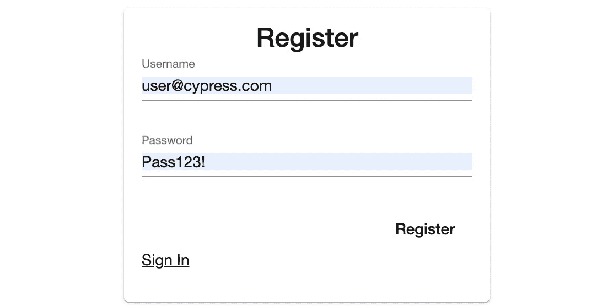

# 15

# 在 Angular 中编写测试

在上一章中，我们学习了如何通过添加用户身份验证、检索用户信息和保护路由来保护 Angular 应用程序。

如果我告诉你，在前端编写测试可以很有趣和令人兴奋，你会怎么想？本章将向你展示 Cypress E2E（端到端测试）的开发者体验有多好。为什么前端开发者喜欢 Cypress 框架？

本章将教你如何编写基本的 Cypress 测试和模拟 HTTP 请求进行测试。

在本章中，我们将涵盖以下主题：

+   开始使用 Cypress

+   编写简单的 Cypress 测试

+   模拟 HTTP 响应和拦截 HTTP 请求

# 技术要求

以下链接将带你去本章的完成版本：[`github.com/PacktPublishing/Spring-Boot-and-Angular/tree/main/Chapter-15/superheroes`](https://github.com/PacktPublishing/Spring-Boot-and-Angular/tree/main/Chapter-15/superheroes)。

# 开始使用 Cypress

在本节中，你将了解 Cypress 是什么以及如何开始使用它。

Cypress 是一个用于测试 Web 应用的端到端无框架。你可以在 HTML 标签中编写测试 ID，并断言这些 HTML 标签是否以你预期的方式渲染。

让我们定义一下 **端到端** 的含义。端到端意味着用户在登录你的 Web 应用程序并完成登录、注册、结账、查看个人资料、登出、填写表格等任务后如何使用你的应用程序。

例如，你可以在不同的示例案例或场景中测试或检查你的 Web 应用程序的 UI：

+   登陆页面的价值主张句子中包含单词 *sale*

+   你网站某个部分的部件计数是你预期的

+   在点击 **清除** 按钮后，结账页面上的购物车中的项目将被清除

+   当 Web 应用程序的 URL 是 `domain.com/login` 时，会出现登录表单

这些场景是关于在 Web 应用程序中要测试的内容的示例。Cypress 是一个测试框架，你可以编写和运行测试，这些测试的设置和配置不需要花费太多时间。

现在，让我们看看如何安装 Cypress。

## 安装

要开始使用 Cypress，我们必须通过运行以下命令从 npm 仓库安装它：

```java
npm i-D cypress @testing-library/cypress
```

前面的 `npm` 命令将在 `dev` 依赖包中安装 Cypress 和 `cypress` 测试库。`@testing-library` 是一组在 Web 开发中常用的测试工具，它使得开发者的生活更加轻松。

在下一节中，我们将学习我们必须添加到 `package.json` 文件的 `npm` 脚本中，以便我们可以在本章后面运行测试。

### npm 脚本

为了让我们以后更容易运行 Cypress 测试，给我们的 `package.json` 文件添加一个新的 npm 脚本是一个好主意，以帮助我们轻松运行命令。在 `package.json` 文件的 `scripts` 块中插入以下键值对：

```java
"test": "npx cypress open"
```

上述键值对帮助你通过在终端中运行`npm run test`命令来运行测试。在终端中运行完整的堆栈应用程序以及`npm run test`命令以启动 Cypress。

将会打开一个交互式浏览器应用程序，你可以在其中运行你的测试。*图 15.1* 展示了在运行`npm run test`命令后，Cypress 仪表板上的欢迎信息。在这里，我们将使用**端到端测试**，所以点击该框继续：


图 15.1 – Cypress 仪表板

*图 15.2* 展示了将自动添加到你的 Angular 应用程序目录中的文件夹和文件。这些对于任何使用 Cypress 的 Web 应用程序都是必需的。由于我们正在使用 TypeScript，我们将添加更多内容，但我们将在稍后进行。现在，只需点击**继续**按钮；你将被带到以下屏幕：


图 15.2 – 配置文件

*图 15.3* 展示了你可以选择不同的浏览器来运行你的端到端测试。你可以选择 Chrome、Microsoft Edge 和 Firefox。我们在这里停止，因为我们还没有编写任何测试，我们还需要帮助 Cypress 学习 TypeScript。在终端中按*Ctrl* + *C*停止 Cypress 运行：


图 15.3 – 选择浏览器

*图 15.4* 展示了生成的`cypress`文件夹，其中包含它们内部的额外文件夹，以及用于编辑 Cypress 一些默认行为的`cypress.config.ts`文件。我们稍后会讨论`cypress.config.ts`文件：


图 15.4 – Cypress 文件夹和文件

### Cypress 的 TypeScript

为了帮助 Cypress 理解 TypeScript，我们必须将`tsconfig.json`文件添加到`cypress`文件夹的根目录。创建一个新文件并命名为`tsconfig.json`；然后，写入以下配置：

```java
{
    "extends": "../tsconfig.json",
    "compilerOptions": {
        "types":["cypress", "@testing-library/cypress"],
        "isolatedModules": false,
        "allowJs": true,
        "experimentalDecorators": true,
        "skipLibCheck": true
    },
    "include": [
        "./**/*.ts",
    ],
    "exclude": []
}
```

上述代码继承了我们 Angular 应用程序根目录下的`tsconfig.json`文件。然后，我们将`cypress`和`@testing-library/cypress`添加到`tsconfig.json`文件中，这将帮助 Cypress 理解 Cypress 目录中的任何 TypeScript 文件。数组显示我们正在将这些 TypeScript 文件包含在目录的任何级别。

现在我们已经为 TypeScript 设置了 Cypress，让我们更新 Angular 应用程序中的`cypress.config.ts`文件。

## 更新 Cypress 配置文件

什么是 Cypress 配置文件？`cypress.config.ts`文件用于存储任何特定于 Cypress 的配置，例如环境、超时、文件夹/文件、屏幕截图、视频、下载、浏览器、视口等。

你通过提供任何你想要添加的可选配置来修改 Cypress 的默认行为。因此，使用以下代码更新`cypress.config.ts`文件：

```java
import { defineConfig } from "cypress";
export default defineConfig({
  e2e: {
    setupNodeEvents(on, config) {
      // implement node event listeners here
    },
    baseUrl: "http://localhost:4200",
    video: false,
  },
});
```

上述代码配置了 Cypress 的基本 URL，其中 Angular 运行。还有一个配置用于禁用端到端测试录制视频。我们只使用 `baseUrl` 和 Cypress 配置的视频属性。

在下一节中，我们将开始编写一些简单的 Cypress 测试，以帮助您在编写测试时建立信心，并了解在 Cypress 中编写测试有多容易。

# 编写 Cypress 测试

在本节中，我们将开始编写简单的 Cypress 测试，以了解使用 Cypress 编写测试有多有趣且容易。我们将通过在身份验证表单中的 HTML 标签中添加一个测试属性来开始测试。我们将编辑 `auth-form.component.html` 文件来编写 `test-id` 属性。以下是 `auth-form.component.html` 行中发生的变化：

```java
<mat-card-title data-cy="auth-title">{{title}}</mat-card-title>
```

您可以看到我们在前面的代码中添加的属性。`data-cy` 是一个测试 ID 属性，Cypress 将使用它来定位我们想要测试的 HTML 元素。

现在我们已经添加了第一个测试 ID，让我们转到 `cypress` 目录内的 `e2e` 文件夹并创建一个新文件。文件名需要包含 *.cy*。将新文件命名为 `anti-heroes.cy.ts`，然后添加以下代码：

```java
/// <reference types="cypress"/>
describe("Anti Heroes Page", () => {
  // basic test
  it("should display login page", () => {
    cy.visit("/");
    cy.url().should("include", "/login");
    cy.get("[data-cy=auth-title]").should("contain",
                                          "Login");
  });
});
```

上述代码提供了我们测试的第一份描述。首先，我们添加了对 Cypress 类型的引用，以便使用 TypeScript 获取额外的工具。

然后，我们有 `describe` 函数，它用于分组测试。`describe` 函数有两个参数。第一个参数是一个字符串，它传递给 `describe` 函数将使用的名称。第二个参数是一个回调函数，它将包含 `describe` 函数下的所有测试。

`it` 函数也接受一个字符串作为测试的名称和一个回调函数，用于测试的详细信息。第一个 `it` 函数测试如果用户访问 Angular 应用 URL 的根域名，认证用户是否可以看到登录页面。

`cy` 是一个对象，您可以在其中链接不同类型的命令。我们使用 `visit` 命令，它允许我们编写在运行测试时将用于导航到 `localhost:4200` 的 URL。`cy.url` 断言可以在登录子页面上找到 URL。我们还通过 `data-cy= "auth-title"` 属性测试 `mat-card-title`，在这个测试中包含单词 *登录*。

如您所见，第一个测试很容易编写。编写测试的设置也很简单。但在我们运行第一个测试之前，让我们为我们的测试创建一个用户：



图 15.5 – 用于端到端测试的用户（Angular 应用登录页面）

在 **图 15.5** 中，我们正在为我们的端到端测试创建一个用户。`user@cypress.com` 用户名只是一个虚构的电子邮件地址，您不需要使用它。您可以使用任何您想要的电子邮件地址。我们将使用 `user@cypress.com` 用户登录我们的应用，并像真实用户一样使用我们的应用程序。

现在，转到你的终端并运行 `npm run test` 命令来运行 Angular 的 E2E 测试。转到 Cypress 控板中的 **Specs** 部分，以找到 **E2E specs** 列表：


图 15.6 – E2E specs

*图 15**.6* 展示了用于测试的 **E2E specs** 文件列表。这里只有一个 spec 文件；这是我们之前创建的那个。

点击 **anti-heroes** spec 运行我们创建的测试，查看它是否通过或失败：


图 15.7 – 通过的测试

*图 15**.7* 显示了我们测试中编写的两个断言都通过了。这意味着登录子页面是在用户在根域名页面上着陆后未认证用户被重定向到的位置。通过的测试还告诉我们，用户看到的表单标题是 *登录* 而不是 *注册*。

如果你将 `should("contain", "Login");` 改为 `should("contain", "Register");`，测试将失败，这表明测试是准确的，并且它不仅仅是通过我们写在测试中的任何内容。

这样，我们就完成了使用 Cypress 编写的简单 E2E 测试，并看到我们的测试通过了。在下一节中，我们将模拟 Angular 应用程序发送的 HTTP 响应和拦截 HTTP 请求，这样我们就不需要后端应用程序来运行这些测试了。

# 模拟 HTTP 响应和拦截 HTTP 请求

**模拟测试**可以帮助我们隔离并专注于测试，而不是外部依赖或行为的状态。在本节中，我们将模拟服务器的 HTTP 响应并拦截 Angular 应用程序的 HTTP 请求进行测试。我们将拦截 HTTP 请求，以便向 Angular 发送模拟响应，而不污染我们的开发数据库。

我们将首先向 `cypress` 目录的根目录添加一个新文件。将文件命名为 `global.d.ts`。`global.d.ts` 文件，也称为 **全局库**，提供了一种方法，使接口和类型在我们的 TypeScript 代码中全局可用。

在创建 `global.d.ts` 文件后，在其内部写入以下代码：

```java
/// <reference types="cypress"/>
declare namespace Cypress {
    interface Chainable {
        getCommand(url: string, responseBody: Array<any>):
          Chainable<any>;
        deleteCommand(url: string): Chainable<any>;
        postCommand(url: string, requestBody: any):
          Chainable<any>;
    }
}
```

上述代码允许我们使用自定义链式命令，这样我们每次在写入 *cy* 后都会获得 IntelliSense。

现在我们已经添加了 `global.d.ts`，让我们安装一个可以生成唯一通用 ID（也称为 **UUID**）的库，并将其用作我们创建的模拟对象的临时 ID，以响应 Angular 的 HTTP 请求。

以下 `npm` 命令将安装一个名为 `uuid` 的 `npm` 库，帮助我们生成所需的 UUID：

```java
npm i uuid
```

我们还需要安装的 `uuid` 库的类型：

```java
npm i -D @types/uuid
```

之前的 `npm` 命令将安装 `uuid` TypeScript 类型。

现在，我们需要一个文件来存放我们的 Cypress 测试中的 fixtures。**fixture** 是一个对象或数组固定状态，用作运行测试的基线：

1.  前往您的应用程序中`cypress`目录下的`fixtures`文件夹。创建两个 JSON 文件，并将它们命名为`anti-heroes.json`和`user.json`。

1.  将文件内容从[`github.com/PacktPublishing/Spring-Boot-and-Angular/blob/main/Chapter-15/superheroes/cypress/fixtures/anti-heroes.json`](https://github.com/PacktPublishing/Spring-Boot-and-Angular/blob/main/Chapter-15/superheroes/cypress/fixtures/anti-heroes.json)复制并粘贴到`anti-heroes.json`文件中。

1.  接下来，将文件内容从[`github.com/PacktPublishing/Spring-Boot-and-Angular/blob/main/Chapter-15/superheroes/cypress/fixtures/user.json`](https://github.com/PacktPublishing/Spring-Boot-and-Angular/blob/main/Chapter-15/superheroes/cypress/fixtures/user.json)复制并粘贴到`user.json`文件中。

上述 JSON 对象是我们将要使用的对象。我们将使用这些作为响应体发送模拟响应。

1.  现在，让我们更新`cypress`目录下`support`文件夹中的`commands.ts`文件。使用以下代码：

    ```java
    // @ts-check
    ```

    ```java
    ///<reference path="../global.d.ts" />
    ```

    ```java
    /// <reference types="cypress"/>
    ```

    ```java
    import { v4 as uuidv4 } from "uuid";
    ```

    ```java
    Cypress.Commands.add("getCommand", (url: string, responseBody: Array<any>) => {
    ```

    ```java
        cy.intercept("GET", url, {
    ```

    ```java
            statusCode: 200,
    ```

    ```java
            body: responseBody,
    ```

    ```java
        });
    ```

    ```java
    });
    ```

    ```java
    Cypress.Commands.add("deleteCommand", (url: string) => {
    ```

    ```java
        cy.intercept("DELETE", url, {
    ```

    ```java
            statusCode: 200,
    ```

    ```java
        });
    ```

    ```java
    });
    ```

    ```java
    Cypress.Commands.add("postCommand", (url: string, requestBody: any) => {
    ```

    ```java
        requestBody.id = uuidv4();
    ```

    ```java
        cy.intercept("POST", url, {
    ```

    ```java
            statusCode: 201,
    ```

    ```java
            body: requestBody,
    ```

    ```java
        });
    ```

    ```java
    });
    ```

上述代码实现了我们在`global.d.ts`文件中编写的自定义链式命令。`getCommand`、`deleteCommand`和`postCommand`需要作为字符串的 URL 来拦截任何 HTTP 请求。自定义链式命令需要一个状态，这将是一个固定值。

1.  现在，让我们在`anti-heroes.cy.ts`中编写更多的测试。但首先，我们必须为我们将要编写的测试添加更多的测试 ID。

前往`auth-form.component.html`并使用以下代码更新代码：

```java
<mat-card>
    <mat-card-title
      data-cy="auth-title">{{title}}</mat-card-title>
    <mat-card-content>
        <form [formGroup]="form"
          (ngSubmit)="submit()">
        <p *ngIf="error" class="error">
            {{ error }}
        </p>
        <p>
            <mat-form-field>
            <input type="text"
              matInput placeholder="Username"
              formControlName="email"
              data-cy="email">
            </mat-form-field>
        </p>
        <p>
            <mat-form-field>
            <input type="password"
              matInput placeholder="Password"
              formControlName="password"
              data-cy="password">
            </mat-form-field>
        </p>
        <div class="button">
            <button type="submit"
              mat-button data-cy="submit-login">
              {{title}}</button>
        </div>
        <p *ngIf="title == 'Login'" class="link"
          [routerLink]="['register']"
          routerLinkActive="router-link-active">
          Create account</p>
        <p *ngIf="title == 'Register'"
          class="link" [routerLink]="['']"
          routerLinkActive="router-link-active">
          Sign In</p>
        </form>
    </mat-card-content>
</mat-card>
```

上述代码包含四个`data-cy`属性，这些属性将用作目标选择器。您可以在`mat-card-title`、输入和`button`元素中找到`data-cy`选择器。

1.  下一个要更新的文件将是`navbar.component.html`。使用以下代码更新文件：

    ```java
    <p>
    ```

    ```java
      <mat-toolbar color="primary">
    ```

    ```java
        <span data-cy="logo">Angular CRUD</span>
    ```

    ```java
      </mat-toolbar>
    ```

    ```java
    </p>
    ```

上述代码包含一个`data-cy`属性，您可以在`span`元素中找到它。

1.  接下来，我们需要更新`anti-hero-list-component.html`文件：

    ```java
    <table mat-table [dataSource]="antiHeroes" class="mat-elevation-z8">
    ```

    ```java
        <!-- Data for columns -->
    ```

    ```java
        <ng-container *ngFor="let item of headers"
    ```

    ```java
          [matColumnDef]="item.fieldName">
    ```

    ```java
          <th mat-header-cell *matHeaderCellDef>
    ```

    ```java
           {{item.headerName}} </th>
    ```

    ```java
          <td mat-cell *matCellDef="let element"
    ```

    ```java
            data-cy="row"> {{element[item.fieldName]}}
    ```

    ```java
          </td>
    ```

    ```java
        </ng-container>
    ```

    ```java
        <!-- Actions for specific item -->
    ```

    ```java
        <ng-container matColumnDef="actions">
    ```

    ```java
            <th mat-header-cell *matHeaderCellDef>
    ```

    ```java
              Actions </th>
    ```

    ```java
            <td mat-cell *matCellDef="let element">
    ```

    ```java
                <button (click)="selectAntiHero(element,
    ```

    ```java
                  0)" mat-raised-button color="primary"
    ```

    ```java
                  data-cy="view">
    ```

    ```java
                    <mat-icon>pageview</mat-icon> View
    ```

    ```java
                </button>
    ```

    ```java
                &nbsp;
    ```

    ```java
                <button (click)="selectAntiHero(element,
    ```

    ```java
                  1)" mat-raised-button color="warn"
    ```

    ```java
                  data-cy="delete">
    ```

    ```java
                    <mat-icon>delete</mat-icon> Delete
    ```

    ```java
                </button>
    ```

    ```java
            </td>
    ```

    ```java
        </ng-container>
    ```

    ```java
        <tr mat-header-row
    ```

    ```java
          *matHeaderRowDef="headerFields"></tr>
    ```

    ```java
        <tr mat-row *matRowDef="let row;
    ```

    ```java
          columns: headerFields"></tr>
    ```

    ```java
      </table>
    ```

上述代码包含三个`data-cy`属性，您可以在`td`元素和两个`button`元素中找到它们。

1.  接下来，我们必须使用以下代码编辑`anti-hero-command-bar.component.html`文件：

    ```java
    <p>
    ```

    ```java
      <mat-toolbar>
    ```

    ```java
        <button mat-raised-button color="primary"
    ```

    ```java
          (click)="emitAction(0)"data-cy="create">
    ```

    ```java
          <mat-icon>fiber_new</mat-icon> Create
    ```

    ```java
        </button>
    ```

    ```java
        &nbsp;
    ```

    ```java
        <button mat-raised-button color="warn"
    ```

    ```java
          (click)="emitAction(1)"data-cy="delete-all">
    ```

    ```java
          <mat-icon>delete</mat-icon> Delete All
    ```

    ```java
        </button>
    ```

    ```java
        <button mat-button color="danger"
    ```

    ```java
          (click)="logOut()" data-cy="logout">
    ```

    ```java
          <mat-icon>logout</mat-icon> logout
    ```

    ```java
        </button>
    ```

    ```java
      </mat-toolbar>
    ```

    ```java
    </p>
    ```

上述代码包含三个选择器，您可以在`button`元素中找到它们。

1.  最后一个要更新的文件是`anti-hero-form.component.html`：

    ```java
    <mat-card class="form-card">
    ```

    ```java
      <h2>{{ selectedAntiHero ? "Update/View Hero" :
    ```

    ```java
        "Create Hero" }}</h2>
    ```

    ```java
      <form class="anti-hero-form" [formGroup]="form">
    ```

    ```java
        <mat-form-field class="example-full-width"
    ```

    ```java
          appearance="fill"><mat-label>
    ```

    ```java
          First Name</mat-label>
    ```

    ```java
          <input matInput formControlName="firstName"
    ```

    ```java
            placeholder="Ex. Tony" data-cy="firstName"/>
    ```

    ```java
        </mat-form-field><mat-form-field
    ```

    ```java
          class="example-full-width" appearance="fill">
    ```

    ```java
          <mat-label>Last Name</mat-label>
    ```

    ```java
          <input matInput formControlName="lastName"
    ```

    ```java
            placeholder="Ex. Stark" data-cy="lastName"/>
    ```

    ```java
        </mat-form-field>
    ```

    ```java
        <mat-form-field class="example-full-width"
    ```

    ```java
          appearance="fill"><mat-label>House</mat-label>
    ```

    ```java
          <input matInput formControlName="house"
    ```

    ```java
            placeholder="Ex. California" data-cy="house"/>
    ```

    ```java
            </mat-form-field><mat-form-field
    ```

    ```java
            class="example-full-width" appearance="fill">
    ```

    ```java
            <mat-label>Known As</mat-label>
    ```

    ```java
          <input matInput formControlName="knownAs"
    ```

    ```java
            placeholder="Ex. Iron Man" data-cy="knownAs"
    ```

    ```java
            /></mat-form-field><div class="button-group">
    ```

    ```java
          <button mat-raised-button color="primary"
    ```

    ```java
           (click)="emitAction()" data-cy="action"
    ```

    ```java
          >{{ actionButtonLabel }}</button>
    ```

    ```java
          &nbsp;
    ```

    ```java
          <button mat-raised-button color="warn"
    ```

    ```java
            (click)="clear()">Clear</button>
    ```

    ```java
        </div>
    ```

    ```java
      </form>
    ```

    ```java
    </mat-card>
    ```

上述代码包含五个输入，您可以在`input`元素和`button`元素中找到它们。

通过这样，我们已经为稍后将要测试的 HTML 元素添加了必要的测试 ID 属性。当我们开始在`anti-heroes.cy.ts`文件中编写测试时，我们需要提到的`data-cy`测试 ID。

1.  现在，让我们开始在`anti-heroes.cy.ts`中编写测试。以下是新代码：

    ```java
    /// <reference types="cypress"/>
    ```

    ```java
    describe("Login Page", () => {
    ```

    ```java
      beforeEach(() => {
    ```

    ```java
        cy.fixture("anti-heroes").then(function (data) {
    ```

    ```java
          /* register custom commands. */
    ```

    ```java
          cy.getCommand("/api/v1/anti-heroes", data);
    ```

    ```java
          cy.deleteCommand("/api/v1/anti-heroes/*");
    ```

    ```java
        });
    ```

    ```java
        cy.visit("/");
    ```

    ```java
        cy.fixture("user").then((data: { email: string;
    ```

    ```java
          password: string }) => {
    ```

    ```java
          cy.get("[data-cy=email]").type(data.email);
    ```

    ```java
          cy.get("[data-cy=password]")
    ```

    ```java
            .type(data.password);
    ```

    ```java
          cy.get("[data-cy=submit-login]").click();
    ```

    ```java
        });
    ```

    ```java
      });
    ```

    ```java
      afterEach(() => {
    ```

    ```java
        cy.get("[data-cy=logout]").click();
    ```

    ```java
      });
    ```

    ```java
      it.skip("should display login page", () => {
    ```

    ```java
        cy.visit("/");
    ```

    ```java
        cy.url().should("include", "/login");
    ```

    ```java
        cy.get("[data-cy=auth-title]").should("contain",
    ```

    ```java
          "Login");
    ```

    ```java
      });
    ```

    ```java
    });
    ```

上述代码展示了一个包含两个其他函数的`describe`函数。

`describe`函数内部的第一个函数被称为`beforeEach`，它在每次测试开始运行时都会运行。`beforeEach`函数保持其状态并在测试中使用它。这个函数适用于测试必须执行与其他测试相同精确操作的场景——例如，访问特定的 URL、登录以及使用自定义链式命令（如`getCommand`和`deleteCommand`）拦截 HTTP 调用。

`describe`函数内部的第二个函数被称为`afterEach`。每次测试结束时都会运行`afterEach`函数。这个函数适合在测试中进行清理或注销用户。`beforeEach`和`afterEach`函数节省了我们大量的重复代码。

1.  现在，让我们向`anti-heroes.cy.ts`文件添加一些测试。复制以下代码并将其放在我们编写的第一个测试下面：

    ```java
    it("should display logo", () => { cy.get("[data-cy=logo]")
    ```

    ```java
    .should("contain", "Angular CRUD");
    ```

    ```java
    });
    ```

    ```java
    it("should render anti-heroes", () => {
    ```

    ```java
      cy.fixture("anti-heroes").then(function (data) {
    ```

    ```java
        cy.get("[data-cy=row]").should("have.length", 24);
    ```

    ```java
      });
    ```

    ```java
    });
    ```

    ```java
    it("should remove a card after clicking a delete button", () => { const index = 1;
    ```

    ```java
      cy.get("[data-cy=delete]").eq(index).click();
    ```

    ```java
      cy.get("[data-cy=row]").should("have.length", 20);
    ```

    ```java
    });
    ```

    ```java
    it("should add a new hero", () => { const firstName = "Bucky";
    ```

    ```java
      const lastName = "Barnes";
    ```

    ```java
      const house = "Marvel";
    ```

    ```java
      const knownAs = "The Winter Soldier";
    ```

    ```java
      cy.get("[data-cy=create]").click();
    ```

    ```java
      cy.get("[data-cy=firstName]").type(firstName);
    ```

    ```java
      cy.get("[data-cy=lastName]").type(lastName);
    ```

    ```java
      cy.get("[data-cy=house]").type(house);
    ```

    ```java
      cy.get("[data-cy=knownAs]").type(knownAs);
    ```

    ```java
      cy.postCommand("/api/v1/anti-heroes", {
    ```

    ```java
        firstName,lastName,house,knownAs,});
    ```

    ```java
      cy.get("[data-cy=action]").click();
    ```

    ```java
      cy.fixture("anti-heroes").then(function (data) {
    ```

    ```java
        cy.get("[data-cy=row]").should("have.length", 24);
    ```

    ```java
      });
    ```

上述代码显示了我们将要用于 Cypress 的测试。你可以看到`fixture`需要一个字符串，即 JSON 文件的名称。`fixture`中的数据是匿名函数的参数。

我们断言`24`是因为我们为每个使用`data-cy="row"`的对象有四个元素，这是我们构建用户界面上的 HTML 元素的方式。`anti-heroes.json`文件中也有六个对象。

新增的测试展示了我们如何使用`eq`关键字和索引号从渲染的 UI 列表或数组中选择特定的对象。

新增的测试还展示了如何通过调用`click`和`type`函数将文本写入输入字段。然后，你可以使用`postCommand`自定义链式命令来拦截 HTTP POST 请求。

1.  最后，在运行测试之前，通过调用`skip`来让 Cypress 跳过我们之前编写的简单测试，如下所示：

    ```java
    it.skip("should display login page", () => {
    ```

上述代码将简单的测试从**运行**改为**不运行**。

`anti-heroes.cy.ts`规范文件的完整代码可以在[`github.com/PacktPublishing/Spring-Boot-and-Angular/blob/main/Chapter-15/superheroes/cypress/e2e/anti-heroes.cy.ts`](https://github.com/PacktPublishing/Spring-Boot-and-Angular/blob/main/Chapter-15/superheroes/cypress/e2e/anti-heroes.cy.ts)找到。

现在，我们可以运行`anti-heroes.cs.ts`规范文件，看看是否一切都会通过，如下面的图所示：


图 15.8 – 通过的测试

*图 15**.8* 显示了跳过了**显示登录页面**的测试，而其他测试都通过了。

你可以像这样看到`beforeEach`函数内部的操作：


图 15.9 – BEFORE EACH DOM 快照

*图 15**.9* 显示了`beforeEach`函数所采取的步骤。这些步骤是 Web 应用的 DOM 快照。

让我们也检查`anti-heroes.cy.ts`规范文件的测试主体。你应该看到以下信息：


图 15.10 – 测试主体 DOM 快照

*图 15.10* 展示了在测试主体中采取的步骤。这些是你写在`anti-heroes.cy.ts`文件中的操作。

我们还可以看到`afterEach`函数内部发生了什么。你应该能看到以下输出：


图 15.11 – 每次 DOM 快照之后

*图 15.11* 展示了`afterEach`函数内部的步骤。在这里，你可以看到`afterEach`函数进行了注销并将用户重定向到应用程序的登录页面。

这就是编写 Cypress 测试的方法。现在，让我们总结一下本章所涵盖的内容。

# 摘要

通过这些，你已经到达了本章的结尾。首先，你学习了 Cypress 是什么，以及如何轻松地设置和编写端到端测试。你还学习了如何拦截 HTTP 请求和模拟 HTTP 响应。

在下一章中，你将学习如何将前端和后端应用程序打包成一个单一的可执行 JAR 文件。

# 第四部分：部署

本部分演示了将后端和前端应用程序以现代方式交付的方法。本部分涵盖了以下章节：

+   *第十六章*，*使用 Maven 打包后端和前端*

+   *第十七章*，*部署 Spring Boot 和 Angular 应用程序*
