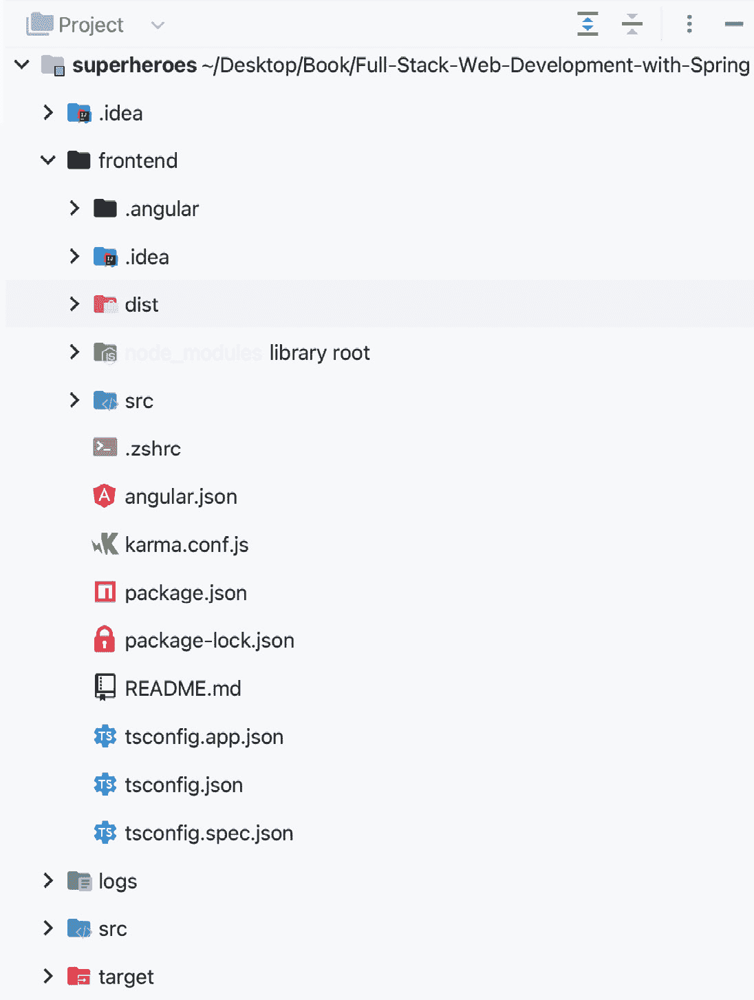
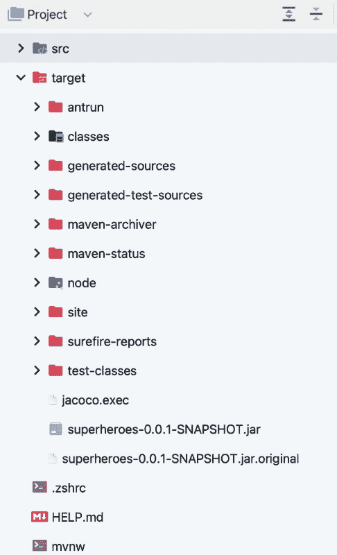
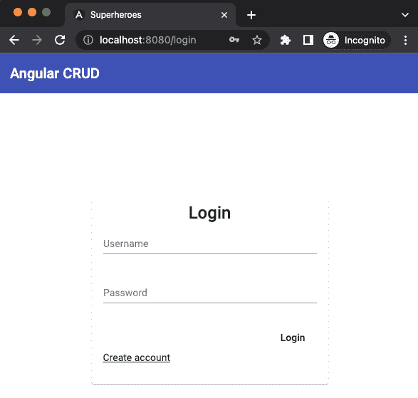

# 16

# 使用 Maven 打包后端和前端

在上一章中，我们学习了 Cypress 是什么以及它的好处。我们还学习了如何编写 Cypress 端到端测试以及如何运行它们。最后，我们学习了如何拦截 HTTP 请求来模拟响应。

本章将教会您如何结合您的 Angular 和 Spring Boot 应用程序，然后在您的本地机器上运行它们。

在本章中，我们将涵盖以下主题：

+   前端-maven-plugin 是什么？

+   向 Spring Boot 和 Angular 集成添加配置

+   打包 Spring Boot

+   运行 JAR 文件

# 技术要求

以下链接将带您到本章代码的完成版本：[`github.com/PacktPublishing/Spring-Boot-and-Angular/tree/main/Chapter-16/superheroes`](https://github.com/PacktPublishing/Spring-Boot-and-Angular/tree/main/Chapter-16/superheroes)。

# 前端-maven-plugin 是什么？

好的——在我回答 `frontend-maven-plugin` 是什么的问题之前，让我们看看我们如何打包我们的应用程序。我们可以构建 Spring Boot 以生成 JAR 文件，并创建 Angular 的生产构建。

但如果我们能创建一个包含 Angular 生产构建的 Spring Boot JAR 文件会怎样？将前端和后端放入单个 JAR 文件的方法将为我们提供一种更简单的方式来部署应用程序到测试和生产环境。

这将允许我们管理 API 和前端应用程序的单一路径。为此，我们需要一个名为 `frontend-maven-plugin` 的 Maven 插件（[`github.com/eirslett/frontend-maven-plugin`](https://github.com/eirslett/frontend-maven-plugin)），它将帮助我们创建一个包含我们的后端和前端的 JAR 文件。

一些要求确保我们的后端和前端可以协同工作。在下一节中，我们将了解我们后端和前端需要哪些配置。

# 向 Spring Boot 和 Angular 集成添加配置

在本节中，我们将向 Spring Boot 应用程序和 Angular 应用程序中编写一些配置，以确保 Spring Boot 可以在生产环境中运行，并且 Angular 可以渲染 Web 应用程序的用户界面。

首先，让我们把 Angular 应用程序移动到我们的 Spring Boot 应用程序的目录中。

## 将 Angular 应用程序添加到 Spring Boot 项目中

在本节中，我们将把 Angular 应用程序移动到 Spring Boot 项目中。通过这样做，Spring Boot 项目内部将包含一个 Angular 项目。

首先，在 Spring Boot 项目中创建一个名为 `frontend` 的新文件夹。将 Angular 应用程序的文件和文件夹移动到 `frontend` 文件夹中，如下所示：



图 16.1 – Spring Boot 项目中的前端文件夹

*图 16.1* 展示了 Spring Boot 项目内部 `frontend` 文件夹中的所有 Angular 文件和文件夹。

你可以随意命名 `frontend` 文件夹，只要将 `frontend` 文件夹的路径映射到 `fileset` 属性的 `workingDirectory` 属性，这是 Apache Maven AntRun 插件的功能，它允许你在 Maven 中运行 Ant 任务。

让我们使用两个 Maven 插件，`frontend-maven-plugin` 和 `maven-antrun-plugin`，我们将在下一节中需要它们。

## 使用 frontend-maven-plugin

在本节中，我们将使用 `frontend-maven-plugin`，它将本地安装 npm 和 Node.js。它还将在 `frontend` 文件夹中运行 `npm build` 命令，并复制 `npm build` 生成的构建文件。

那么，让我们开始吧：

1.  前往你的 `pom.xml` 文件，并在你的 Maven `pom` 文件中的构建插件之一插入以下代码：

    ```java
    <plugin>
    ```

    ```java
       <groupId>com.github.eirslett</groupId>
    ```

    ```java
       <artifactId>frontend-maven-plugin</artifactId>
    ```

    ```java
       <version>1.12.1</version>
    ```

    ```java
       <configuration>
    ```

    ```java
          <workingDirectory>frontend</workingDirectory>
    ```

    ```java
          <installDirectory>target</installDirectory>
    ```

    ```java
       </configuration>
    ```

    ```java
    …
    ```

    ```java
    // See full code on https://github.com/PacktPublishing/Spring-Boot-and-Angular/tree/main/Chapter-16/superheroes
    ```

    ```java
    <plugin>
    ```

前面的标记显示，在构建 Spring Boot 应用程序时，插件将在 `frontend` 工作目录中安装 `Node.js v16.17.0` 和 `npm CLI 8.19.1`。它还将执行 `npm install` 命令以下载 Angular 应用程序的所有依赖包。

在执行所有必要的安装后，插件将执行下一个操作是 `npm run build` 命令，这将创建 Angular 应用程序的生产构建。

1.  接下来，我们必须使用以下代码编辑 Angular 应用程序的 `package.json` 文件中的 `npm build` 脚本：

    ```java
    "build": "ng build --configuration production",
    ```

上述代码告诉 Angular，`npm run build` 是用于生产构建。

1.  我们还必须在 Angular 的环境文件夹中的 `environment.prod.ts` 文件中进行编辑。将代码更改为以下内容：

    ```java
    export const environment = {
    ```

    ```java
      production: true,
    ```

    ```java
      apiURL: "http://localhost:8080/api/v1",
    ```

    ```java
      authURL: "http://localhost:8080"
    ```

    ```java
    };
    ```

`apiURL` 和 `authURL` 只是临时的。我们将更改它们，并在应用程序的实际部署中使用真实的 API URL 和认证 URL 属性。我们需要添加前面的代码，因为我们正在我们的应用程序中使用 `apiURL` 和 `authURL` 进行开发，但我们缺少生产环境的值。

当应用程序为生产环境构建时，Angular 应用程序将收集 `environment.prod.ts` 中的值，而不是使用 `environment.ts` 文件。

现在，让我们了解 `maven-antrun-plugin` 并再次配置我们的 `.pom` 文件。

## 使用 maven-antrun-plugin

本节将在 Spring Boot 应用程序中使用 `maven-antrun-plugin`。打开你的 `pom.xml` 文件，并在标记的 `build` 块中的一个插件中插入以下代码。将其放在 `frontend-maven-plugin` 标记下方：

```java
<plugin>
   <artifactId>maven-antrun-plugin</artifactId>
   <executions>
      <execution>
         <phase>generate-resources</phase>
         <configuration>
            <target>
               <copy todir="${
                 project.build.directory}/classes/public">
                  <fileset dir="${project.basedir}/
                    frontend/dist/superheroes"/>
               </copy>
            </target>
         </configuration>
         <goals>
            <goal>run</goal>
         </goals>
      </execution>
   </executions>
</plugin>
```

在这里，`maven-antrun-plugin` 是一个配置，它将 `"${project.basedir}/frontend/dist/superheroes"` 路径下的文件和文件夹复制并粘贴到在运行任务之前的 `todir="${project.build.directory}/classes/public"` 路径。这将复制前端应用程序并将其放在 Spring Boot JAR 文件的根目录中。

现在，让我们配置我们的应用程序的 Spring MVC 配置。

## 实现 WebMvcConfigurer

在本节中，我们将通过添加配置文件将 Spring Boot 应用程序作为 Angular 应用程序的宿主。为此，我们必须将配置类添加到我们的 Spring Boot 应用程序的配置目录中，并将其命名为 `MvcConfig`。

在创建 `MvcConfig` 类之后，将 `WebMvcConfigurer` 接口添加到文件中，如下所示：

```java
@Configuration
public class MvcConfig implements WebMvcConfigurer {
    @Override
    public void addResourceHandlers(ResourceHandlerRegistry
      registry) {
… //See full code on https://github.com/PacktPublishing/Spring-Boot-and-Angular/tree/main/Chapter-16/superheroes
    }
}
```

上述代码也可以在本书的 GitHub 仓库中找到。

`MvcConfig` 类实现了 `WebMvcConfigurer` 并重写了 `addResourceHandlers` 方法。

将 `"/**"` 参数传递给 `addResourceHandler`，如下所示：

```java
addResourceHandler("/**")
```

这将使配置影响所有项目路由。这部分属于应用程序的外部 URI。

然后，将外部 URI 路径映射到资源所在的目录，如下所示：

```java
addResourceLocations("classpath:/public/")
```

最后，添加 `new ClassPathResource("/public/index.html")`。这将重定向那些未由 Spring Boot 应用程序处理的请求，这些请求原本要发送到 Angular 应用程序或前端应用程序。

我们即将将两个应用程序打包成一个。我们将在下一节中学习如何做到这一点。

# 打包 Spring Boot

在本节中，我们将打包 Spring Boot 应用程序和 Angular 应用程序。想法是将这两个应用程序结合起来，给您提供一个单一的 JAR 文件进行部署。让我们学习如何做到这一点。

在我们完成所有配置之后，现在只需按照相同的顺序运行以下 Maven 命令：

```java
mvn clean
mvn package
```

`mvn clean` 命令通过删除目标目录来清理 Maven 项目，而 `mvn package` 命令则构建 Maven 项目并创建一个可执行的 JAR 文件。

这两个 Maven 命令就足以创建一个包含 Spring Boot 和 Angular 打包的执行 JAR 文件；请参阅 *图 16.2*：



图 16.2 – 包含 JAR 文件的目标文件夹

由于我们已经完成了配置 Angular 和 Spring Boot 应用程序的所有艰苦工作，因此打包应用程序很简单。

现在，我们有了 JAR 文件。在下一节中，我们将使用 Java 命令运行 JAR 文件，以查看一切是否正常。

# 运行 JAR 文件

在本节中，我们将运行我们打包的 JAR 文件，并查看 Angular 应用程序是否与 Spring Boot 应用程序通信。请按照以下步骤操作：

1.  要运行应用程序，您可以使用 `java` 命令：

    ```java
    java -jar superheroes-0.0.1-SNAPSHOT.jar
    ```

上述 Java CLI 命令将运行一个可执行的 JAR 文件。在 CLI 中，您将看到 Tomcat 服务器已在端口 `8080` 上启动。

1.  访问 `http://localhost:8080`；您将被重定向到 `http://localhost:8080/login`，其中包含一个登录表单。*图 16.3* 展示了这个登录表单：



图 16.3 – 登录表单

1.  尝试登录并导航到反派角色页面，在那里您可以使用表单创建新的英雄或反派：


图 16.4 – 反派角色表单

*图 16**.4* 显示，从登录到使用 CRUD 操作，反英雄表型上的所有功能都在正常工作。

有了这些，我们已经完成了 Spring Boot 和 Angular 应用程序的打包。现在，让我们总结一下我们学到了什么。

# 摘要

在本章中，你了解到`frontend-maven-plugin`和`antrun-maven-plugin`插件可以帮助你将你的 Web 客户端和 Spring Boot 应用程序打包成一个可执行的 JAR 文件，从而使部署变得简单。你还学习了如何在本地机器上运行 JAR 文件，这有助于你为部署准备应用程序。

在下一章中，你将学习如何使用 GitHub Actions 为部署准备应用程序。你还将学习如何使用 Heroku 为应用程序创建数据库实例，然后将应用程序部署到 Heroku。
