# 17

# 部署 Spring Boot 和 Angular 应用程序

在上一章中，我们学习了 `frontend-maven-plugin` 的作用以及我们用它来做什么。然后，我们学习了在 Spring Boot 应用程序内运行 Angular 应用程序所需的配置。之后，我们学习了如何将两个应用程序打包成一个文件。最后，我们学习了如何使用 Angular 运行 Spring Boot 应用程序。

本章将向您介绍 GitHub Actions 的基础知识、Heroku 的基础知识以及如何使用 Heroku 部署应用程序。

在本章中，我们将涵盖以下主题：

+   理解 GitHub Actions

+   GitHub Actions 的组件

+   设置 Heroku

+   创建 CI 工作流程或管道

# 技术要求

以下链接将带您到本章的完成版本：[`github.com/PacktPublishing/Spring-Boot-and-Angular/tree/main/Chapter-17/superheroes`](https://github.com/PacktPublishing/Spring-Boot-and-Angular/tree/main/Chapter-17/superheroes)。

# 理解 GitHub Actions

让我们从定义 **GitHub Actions** 开始。这个平台为开发者和运维人员提供工作流程自动化，以及 **持续集成和持续交付**（**CI/CD**）。每当有人创建拉取请求、创建问题、成为贡献者、合并拉取请求等时，它都可以使用脚本运行一系列操作。简而言之，在您的 GitHub 工作流程中存在多个事件，您可以使用这些事件来运行一组特定的操作或脚本。

现在，让我们回顾一下 GitHub Actions 的组件。

# GitHub Actions 的组件

现在我们已经了解了 GitHub Actions 是什么，让我们看看 GitHub Actions 的组件，这些组件有助于我们在事件触发时进行 DevOps 和运行工作流程。

这里是 GitHub Actions 的组件：

+   `.github/workflows`，可以手动运行作业、自动触发事件或通过设置计划来实现。

+   `pull_request`、`push` 和 `schedule`。然而，根据您的需求，其他事件也可能很有用。

+   **作业**：作业是工作流程中一系列步骤（脚本或操作）的集合。特定的作业在整个步骤中在同一个运行器上执行。

+   **操作**：操作执行当前任务或您需要的任何内容，例如检出您的存储库、构建您的应用程序、测试您的应用程序、扫描您的代码以查找任何漏洞或部署您的应用程序。

+   **运行器**：运行器只是服务器。在 GitHub Actions 中，您可以选择 Ubuntu Linux、Microsoft Windows 或 macOS 运行器。然而，您并不局限于这三种操作系统。您还可以拥有自托管的运行器。

这些是我们将在 *创建 CI 工作流程或管道* 部分中使用的 GitHub Actions 组件。但在那之前，我们将设置 Heroku，在那里我们将部署我们的全栈应用程序。

# 设置 Heroku

在本节中，我们将使用 Heroku。它是一个 **平台即服务**（**PaaS**）提供程序，允许我们在云中构建和运行应用程序。让我们学习如何设置 Heroku 和我们的应用程序。

## 创建 GitHub 和 Heroku 账户

在本节中，我们将为 GitHub 和 Heroku 创建账户。

首先，我们必须通过访问[`github.com/`](https://github.com/)来创建一个 GitHub 账户。我们将将其用作我们项目的仓库。

然后，我们必须通过访问[`www.heroku.com/`](https://www.heroku.com/)来创建一个 Heroku 账户。这是我们部署应用和创建数据库实例的地方。

## 在 Heroku 创建新应用

在 Heroku 登录后，点击页面右上角的**新建**按钮，然后点击**创建新应用**按钮来创建一个不带管道的应用：


图 17.1 – 创建新应用

*图 17.1*是您创建全栈应用新应用的地方。您可以给应用起任何名字，并选择一个区域，但不要添加管道。

接下来，我们将为我们的全栈应用添加一个数据库。

## 添加 Postgres 数据库

现在，让我们添加一个 Postgres 数据库：

1.  前往**资源**标签页并点击**查找更多插件**按钮：

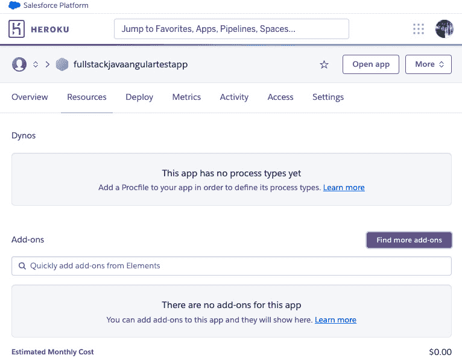

图 17.2 – 查找更多插件

*图 17.2*显示了您可以找到**查找更多插件**按钮的位置。这是您可以找到 Heroku 插件以及用于开发、扩展和运行您应用程序的各种工具和服务的位置。一个例子可以在*图 17.3*中看到：


图 17.3 – Heroku Postgres

*图 17.3*显示了 Heroku Postgres 插件，这是一个基于 PostgreSQL 的**数据库即服务**（**DaaS**）提供。点击它，安装它，然后选择免费计划并将 Heroku Postgres 插件配置到您之前创建的全栈应用中。然后，点击**提交订单表单**按钮。

1.  返回您应用的**资源**标签页。您应该能看到 Heroku Postgres 插件。点击**Heroku Postgres**中的 Heroku 部分；将打开一个新标签页。

我们几乎完成了数据库的添加。我们只需要添加一个数据剪辑，这将使我们能够为数据库创建 SQL 查询。

1.  现在点击**创建数据剪辑**按钮。然后，添加以下 SQL 查询：

    ```java
    set transaction read write;
    ```

    ```java
    CREATE EXTENSION IF NOT EXISTS "uuid-ossp";
    ```

    ```java
    CREATE TABLE user_entity
    ```

    ```java
    (
    ```

    ```java
        id  uuid PRIMARY KEY DEFAULT uuid_generate_v4(),
    ```

    ```java
        username VARCHAR(50) UNIQUE  NOT NULL,
    ```

    ```java
        password VARCHAR(50)         NOT NULL,
    ```

    ```java
        email    VARCHAR(255) UNIQUE NOT NULL
    ```

    ```java
    );
    ```

    ```java
    CREATE TABLE anti_hero_entity
    ```

    ```java
    (
    ```

    ```java
        id  uuid PRIMARY KEY DEFAULT uuid_generate_v4(),
    ```

    ```java
        firstName VARCHAR(50) UNIQUE NOT NULL,
    ```

    ```java
        lastName  VARCHAR(50) UNIQUE NOT NULL,
    ```

    ```java
        house     VARCHAR(50) NULL,
    ```

    ```java
        knownAs   VARCHAR(50) NULL,
    ```

    ```java
        createdAt TIMESTAMP NULL
    ```

    ```java
    );
    ```

1.  一旦将这些 SQL 查询添加到编辑器中，点击**保存并运行**。

这样，数据库就创建完成了。现在，让我们创建一个`system.properties`文件，在那里我们可以声明 Java 运行时版本和 Maven 版本。

## 添加系统属性

在本节中，我们将创建一个文件，该文件将使用`system.properties`指定 Java 版本和 Maven 版本。

进入 Spring Boot 应用的根目录，创建一个名为`system.properties`的文件。然后，添加以下配置：

```java
java.runtime.version=17.0.1
maven.version=3.6.2
```

前面的两个配置将在 Heroku 全栈应用部署部分使用。

在下一节中，我们将获取我们应用的域名 URL 并将其添加到配置变量中。

## 添加配置变量

在本节中，我们将向 Heroku 添加配置变量。在我们的仓库中，我们将向 Heroku 的 `config vars` 部分添加 `CLIENT_URL` 以及前端应用程序的 `environment.prod.ts` 文件。按照以下步骤操作：

1.  第一步是获取应用程序的域名，这可以通过前往 **设置** 选项卡来实现：

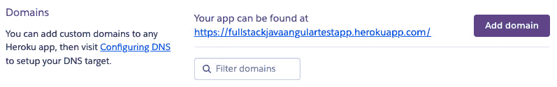

图 17.4 – 应用程序 URL

*图 17.4* 展示了应用程序将渲染的应用程序 URL。

1.  复制你全栈应用程序的 URL 并前往 **设置** 选项卡的 **配置变量** 区域。点击 **显示配置变量** 按钮：


图 17.5 – 显示配置变量

1.  将 `CLIENT_URL` 作为 **键** 添加，并将应用程序的 URL 作为 **值** 添加：

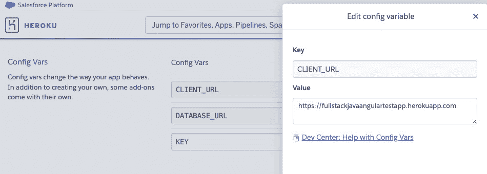

图 17.6 – 编辑配置变量

*图 17.6* 展示了添加环境变量或配置变量后的表单。

不要忘记给你的 JWT 密钥添加一个值。然而，请注意你的开发和生产环境应该不同。

1.  现在，打开 `environment.prod.ts` 文件并添加以下代码：

    ```java
    export const environment = {
    ```

    ```java
      production: true,
    ```

    ```java
    // your Spring API URL
    ```

    ```java
      apiURL: "https://full stack
    ```

    ```java
               javaangulartestapp.herokuapp.com/api/v1",
    ```

    ```java
    // your heroku URL
    ```

    ```java
      authURL: "https://full stack
    ```

    ```java
                javaangulartestapp.herokuapp.com"
    ```

    ```java
    };
    ```

上述代码将替换 Angular 应用程序在生产中的 `apiURL` 和 `authURL` 的先前 `localhost:8080` 地址。

接下来，我们需要将全栈应用程序仓库发布到 GitHub，因为我们将通过 GitHub 源控制来部署应用程序。

## Heroku 的手动部署

在本节中，我们将检查部署后应用程序是否会无任何问题地运行。按照以下步骤操作：

1.  为了做到这一点，前往 Heroku 控制台中应用程序的 **部署** 选项卡：

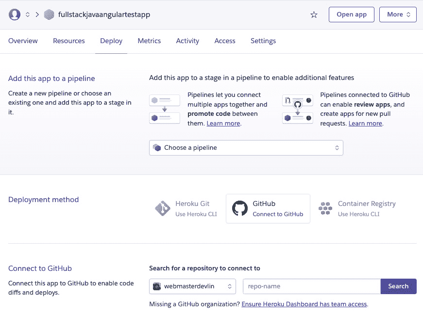

图 17.7 – 部署应用程序

*图 17.7* 展示了如何通过 Heroku 控制台手动部署应用程序。使用 GitHub 作为部署方法，然后搜索你的仓库。

1.  在选择你的全栈应用程序的仓库后，前往页面底部，在那里你会找到 **手动部署** 部分。然后，点击 **部署分支** 按钮以开始部署并在 Heroku 上运行应用程序：

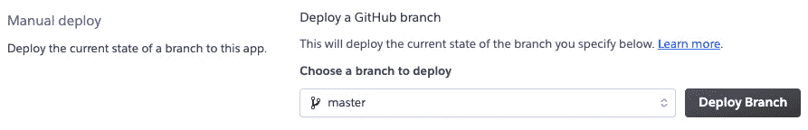

图 17.8 – 手动部署

*图 17.8* 展示了 Heroku 的 **手动部署** 部分。

1.  为了检查一切是否正常工作，等待部署完成，然后前往应用程序的 URL。

1.  注册一个新用户并尝试登录。确保你打开浏览器中的 **网络** 选项卡；你会看到请求是通过应用程序的 URL 发送的。请注意，服务器的响应具有 **状态码** 为 **200** 或 **201**：

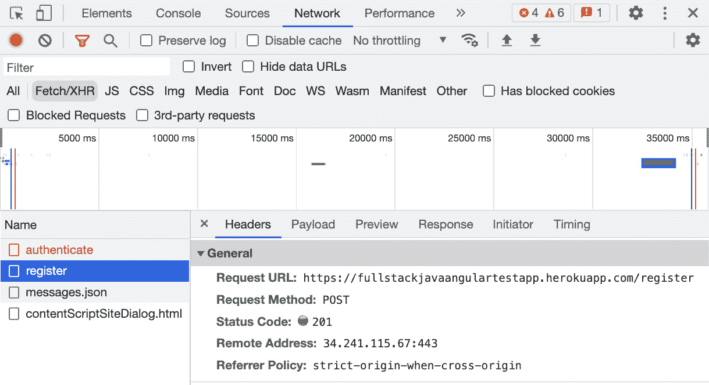

图 17.9 – Google Chrome 的网络选项卡

*图 17.9*显示了开发者工具中 Google Chrome 的**网络**标签。在这里，您可以看到**注册**请求返回**状态码 201**。Angular、Spring Boot 和 Heroku Postgres 数据库运行得非常好。

现在我们已经手动部署了我们的全栈应用，让我们使用 GitHub Actions 中的工作流程创建一个自动部署。

# 创建 CI 工作流程或管道

在本节中，我们将通过使用 GitHub Actions 中的工作流程来自动化我们的全栈应用部署。请按照以下步骤操作：

1.  前往您项目的 GitHub 仓库，然后点击**发布 Java 包**并选择 Maven 工作流程：

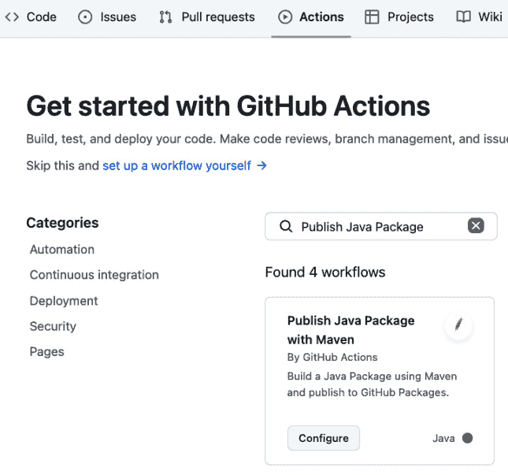

图 17.10 – 选择工作流程

*图 17.10*显示了构建 Maven 项目的 Maven 工作流程的基本和现成配置。

1.  通过替换以下 YAML 配置来编辑编辑器中的 YAML 文件内容：

    ```java
    name: CICD
    ```

    ```java
    on:
    ```

    ```java
      push:
    ```

    ```java
        branches:
    ```

    ```java
          - master
    ```

    ```java
    jobs:
    ```

    ```java
      test:
    ```

    ```java
        name: Build and Test
    ```

    ```java
        runs-on: ubuntu-latest
    ```

    ```java
        steps:
    ```

    ```java
          - uses: actions/checkout@v2
    ```

    ```java
          - name: Set up JDK 17
    ```

    ```java
            uses: actions/setup-java@v2
    ```

    ```java
            with:
    ```

    ```java
              java-version: '17.0.*'
    ```

    ```java
              distribution: 'temurin'
    ```

    ```java
              cache: maven
    ```

    ```java
          - name: test with Maven
    ```

    ```java
            run: mvn test
    ```

    ```java
      deploy:
    ```

    ```java
        name: Deploy to Heroku
    ```

    ```java
        runs-on: ubuntu-latest
    ```

    ```java
        needs: test
    ```

    ```java
        steps:
    ```

    ```java
          - uses: actions/checkout@v2
    ```

    ```java
            # This is the action
    ```

    ```java
          - uses: akhileshns/heroku-deploy@v3.12.12
    ```

    ```java
            with:
    ```

    ```java
              heroku_api_key: ${{secrets.HEROKU_API_KEY}}
    ```

    ```java
              heroku_app_name: "appname" #Must be unique
    ```

    ```java
                                         #in Heroku
    ```

    ```java
              heroku_email: "email"
    ```

上述代码是我们全栈应用 CI/CD 的工作流程。它被称为`CICD`，因为这就是这个工作流程的目的。

工作流程有一个事件，`push`，如果 master 分支有推送操作，将导致工作流程运行。

工作流程还有两个作业：`test`和`deploy`。`test`作业的步骤是检出代码，使用 Java 17 构建应用程序并运行测试。另一方面，`deploy`作业的步骤是检出代码并使用需要 Heroku API 密钥、应用程序名称和 Heroku 账户电子邮件的 Heroku 部署操作。

1.  对于 Heroku API 密钥，您需要前往 Heroku 仪表板您个人资料的**账户设置**菜单：


图 17.11 – 账户设置

*图 17.11*显示了在 Heroku 仪表板我的个人资料下的**账户设置**菜单。

1.  点击**账户设置**，然后转到**API 密钥**并生成一个 API 密钥：


图 17.12 – API 密钥

*图 17.12*显示了您可以在其中生成 Heroku API 密钥的位置。

复制 Heroku API 密钥，因为您需要为 GitHub Actions 创建一个新的动作密钥。

1.  要这样做，请前往您应用的 GitHub 仓库，并为**设置**标签打开一个新的浏览器标签页，以免丢失您的流程配置。

1.  然后，在文本区域中添加 API 密钥并将其命名为`HEROKU_API_KEY`。这是您将在工作流程的`deploy`作业中使用的关键：

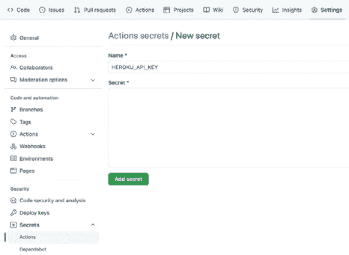

图 17.13 – 动作密钥表单

*图 17.13*显示了您可以在其中添加新的动作密钥以防止敏感值被复制或被任何人读取的位置。

1.  一旦您添加了新的密钥，请返回您的浏览器标签页，在那里您开始编辑您的流程。然后，提交您正在编辑的文件：

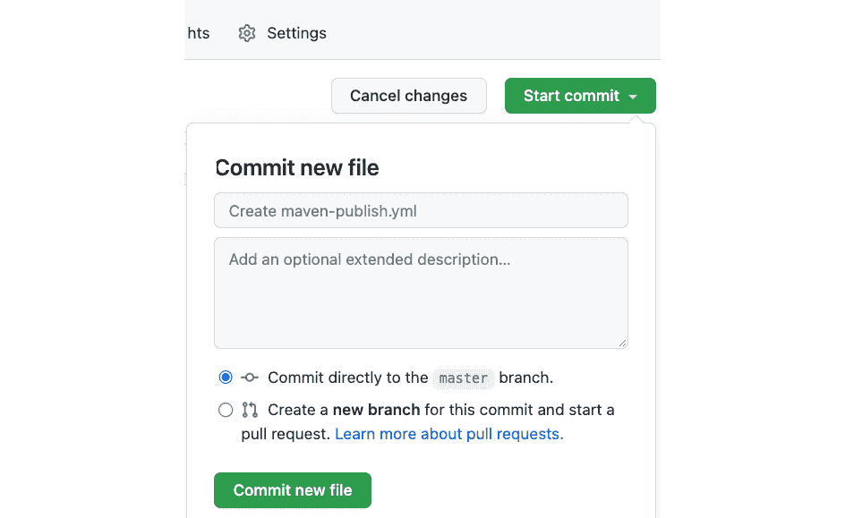

图 17.14 – 提交工作流程

*图 17.14* 展示了 `git pull` 后它将出现在你的本地机器上。

1.  在你提交到工作流后，`CICD` 将启动。你可以通过转到 **动作** 选项卡来查看 CI/CD 工作流的进度：

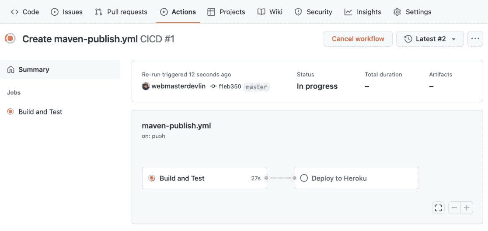

图 17.15 – 工作流状态

*图 17.15* 展示了 CI/CD 工作流的当前状态。你可以看到它正在运行 **构建和测试** 作业。

1.  你也可以通过点击左侧侧边栏菜单中的职位名称来查看特定工作的进展情况：

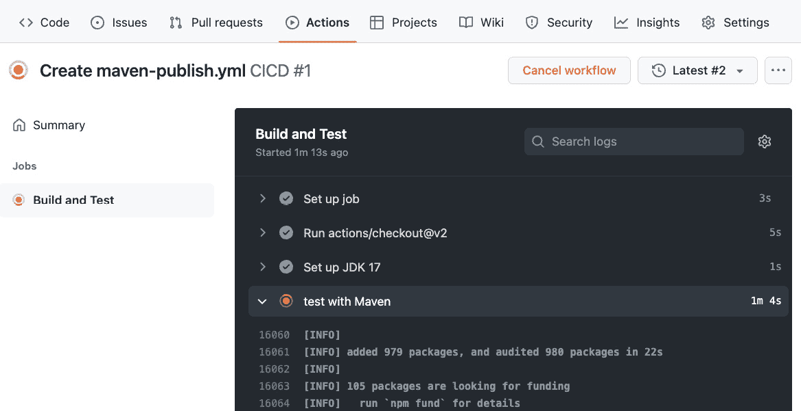

图 17.16 – 步骤和动作状态

*图 17.16* 展示了 **构建和测试** 作业中每个步骤的输出日志。你还可以使用 GitHub Actions 的这部分来调试导致作业和动作失败的错误。

1.  在运行了你创建的 CI/CD 工作流中的所有作业后，你将看到工作流旁边有一个绿色的勾选图标，这意味着工作流已经通过，一切正常：

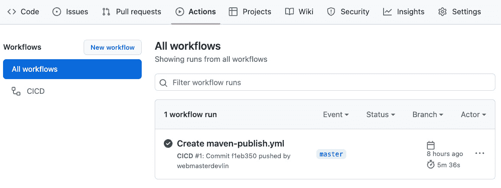

图 17.17 – 步骤和动作状态

*图 17.17* 展示了你的仓库 **动作** 选项卡上的一个通过状态的 GitHub 工作流。

1.  最后，为了检查部署自动化是否已将我们的应用程序部署到 Heroku 云中，我们必须回到 Heroku 的概览仪表板并查找最新的活动：

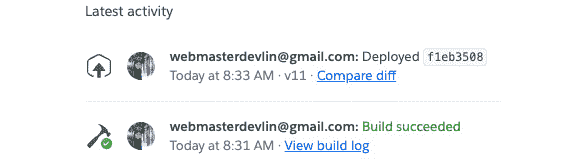

图 17.18 – 在 Heroku 账户的最新活动区域中构建成功

*图 17.18* 展示了由 GitHub Actions 触发的构建成功。你可以看到应用程序正在正常运行。

有了这些，我们已经成功使用 GitHub Actions 自动化了我们的 CI/CD 工作流。现在，让我们总结一下在这一章中学到的内容。

# 摘要

有了这些，我们已经到达了这本书的最后一章；让我们回顾一下你在这一章中学到的宝贵知识。

首先，你了解到 GitHub Actions 可以轻松自动化所有软件工作流并执行 CI/CD。你可以在 GitHub 上直接构建、测试和部署你的代码。你还了解到 Heroku 是一个 PaaS，它允许你完全在云端构建、运行和操作应用程序。Heroku Postgres 是 Heroku 直接提供的托管 SQL 数据库服务，你可以将其用于你的应用程序。

所以，你已经走到了这一步。感谢你完成这本书；我为你的热情和对学习新工具和事物的热情感到自豪。只要你项目的需求与你在本书中学到的问题和解决方案相匹配，你就可以将在这里学到的知识应用到项目中。

这门课程教你如何作为一个高级开发者构建 Spring Boot 2 应用程序和 Angular 13 应用程序，为公司、客户和客户带来价值。

作为下一步的建议，我推荐你购买一本关于独立 Spring Boot 2 或 Spring Boot 3 的新 Packt 书籍，或者一本 Angular 书籍，以巩固从这本书中学到的知识。

代表 Packt 团队和编辑们，我们祝愿你在职业生涯和生活的各个阶段都一切顺利。
