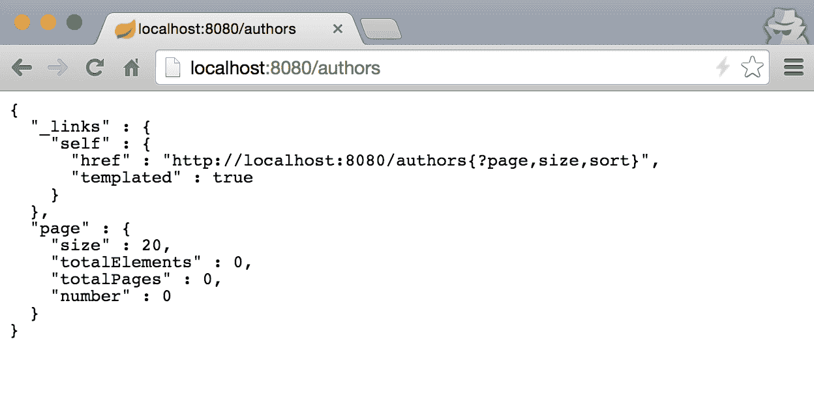
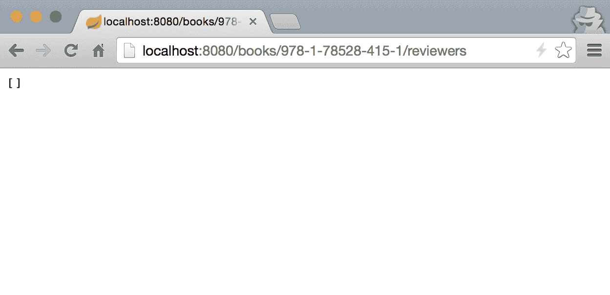

# 配置 Web 应用程序

在上一章中，我们学习了如何创建一个起始应用程序模板，添加一些基本功能，并设置数据库连接。在这一章中，我们将继续演进我们的 BookPub 应用程序，并为其提供一个网络存在。

在这一章中，我们将学习以下主题：

+   创建基本的 RESTful 应用程序

+   创建 Spring Data REST 服务

+   配置自定义 Servlet 过滤器

+   配置自定义拦截器

+   配置自定义 HttpMessageConverters

+   配置自定义属性编辑器

+   配置自定义类型格式化程序

# 创建基本的 RESTful 应用程序

虽然命令行应用程序确实有其位置和用途，但今天的大多数应用程序开发都是围绕网络、REST 和数据处理服务进行的。让我们从通过提供基于网络的 API 来增强我们的`BookPub`应用程序开始，以便获取图书目录的访问权限。

我们将从上一章结束的地方开始，因此应该已经有一个包含实体对象和定义了仓库服务以及配置了数据库连接的应用程序骨架。

# 如何做...

1.  我们首先需要做的是在`build.gradle`中添加一个新的依赖项，使用`spring-boot-starter-web`启动器来获取所有必要的基于网络的库。以下代码片段将展示其外观：

```java
dependencies { 
  compile("org.springframework.boot:spring-boot-starter-data-jpa") 
  compile("org.springframework.boot:spring-boot-starter-jdbc") 
  compile("org.springframework.boot:spring-boot-starter-web") 
  runtime("com.h2database:h2") 
  runtime("mysql:mysql-connector-java")
  testCompile("org.springframework.boot:spring-boot-starter-test") 
} 
```

1.  接下来，我们需要创建一个 Spring 控制器，用于处理我们应用程序中目录数据的 Web 请求。让我们首先创建一个新的包结构来存放我们的控制器，以便我们的代码根据其适当的目的进行分组。从我们的项目根目录开始，在`src/main/java/com/example/bookpub`目录中创建一个名为`controllers`的包文件夹。

1.  由于我们将公开图书数据，让我们在我们的新创建的包中创建一个名为`BookController`的控制器类文件，其内容如下：

```java
@RestController 
@RequestMapping("/books") 
public class BookController { 
  @Autowired 
  private BookRepository bookRepository; 

  @RequestMapping(value = "", method = RequestMethod.GET) 
  public Iterable<Book> getAllBooks() { 
    return bookRepository.findAll(); 
  } 

  @RequestMapping(value = "/{isbn}", method =  
    RequestMethod.GET) 
  public Book getBook(@PathVariable String isbn) { 
    return bookRepository.findBookByIsbn(isbn); 
  } 
} 
```

1.  通过运行`./gradlew clean bootRun`来启动应用程序。

1.  应用程序启动后，打开浏览器并转到`http://localhost:8080/books`，你应该会看到一个响应：`[]`。

# 它是如何工作的...

将服务暴露给 Web 请求的关键是`@RestController`注解。这是另一个元注解或便利注解的例子，正如 Spring 文档有时所指出的，我们在之前的食谱中已经见过。在`@RestController`中定义了两个注解：`@Controller`和`@ResponseBody`。因此，我们同样可以像以下这样注解`BookController`：

```java
@Controller 
@ResponseBody 
@RequestMapping("/books") 
public class BookController {...} 
```

让我们看一下前面代码片段中的以下注解：

+   `@Controller`：这是一个 Spring stereotypes 注解，类似于`@Bean`和`@Repository`，它将注解的类声明为 MVC

+   `@ResponseBody`：这是一个 Spring MVC 注解，表示来自 web 映射方法的响应构成了整个 HTTP 响应体负载的内容，这对于 RESTful 应用程序来说是典型的。

+   `@RequestMapping`：这是一个 Spring MVC 注解，表示对 `/books/*` URL 的请求将被路由到这个控制器。

# 创建 Spring Data REST 服务

在前面的例子中，我们通过 REST 控制器将 `BookRepository` 接口作为前端，以便通过 Web RESTful API 暴露其后的数据。虽然这确实是一种快速简单的方法来使数据可访问，但它确实需要我们手动创建控制器并定义所有期望的操作的映射。为了最小化样板代码，Spring 提供了一种更方便的方法：`spring-boot-starter-data-rest`。这允许我们只需在存储库接口上添加一个注解，Spring 就会完成其余的工作，将其暴露到 Web 上。

我们将继续进行到上一个菜谱结束的地方，因此实体模型和 `BookRepository` 接口应该已经存在。

# 如何做到这一点...

1.  我们将首先在我们的 `build.gradle` 文件中添加另一个依赖项，以便添加 `spring-boot-starter-data-rest` 仓库：

```java
dependencies { 
  ... 
  compile("org.springframework.boot:spring-boot-starter-data-rest") 
  ... 
} 
```

1.  现在，让我们在项目根目录下的 `src/main/java/com/example/bookpub/repository` 目录中创建一个新的接口来定义 `AuthorRepository`，内容如下：

```java
@RepositoryRestResource 
public interface AuthorRepository extends  
  PagingAndSortingRepository<Author, Long> { 
}
```

1.  既然我们已经开始了——考虑到代码量如此之少——让我们创建剩余实体模型 `PublisherRepository` 和 `ReviewerRepository` 的存储库接口，将这些文件放置在与 `AuthorRepository` 相同的包目录中，内容如下：

```java
@RepositoryRestResource 
public interface PublisherRepository extends  
  PagingAndSortingRepository<Publisher, Long> { 
} 
```

否则，你可以使用以下代码代替前面的代码：

```java
@RepositoryRestResource 
public interface ReviewerRepository extends  
  PagingAndSortingRepository<Reviewer, Long> { 
} 
```

1.  通过运行 `./gradlew clean bootRun` 启动应用程序

1.  应用程序启动后，打开浏览器并转到 `http://localhost:8080/authors`，你应该看到以下响应：

# 它是如何工作的...

如浏览器视图所示，我们将获得比我们编写书籍控制器时多得多的信息。这在一定程度上是因为我们扩展的不是 `CrudRepository` 接口，而是一个 `PagingAndSortingRepository` 接口，而 `PagingAndSortingRepository` 又是 `CrudRepository` 的扩展。我们决定这样做的原因是为了获得 `PagingAndSortingRepository` 提供的额外好处。这将添加额外的功能，以便使用分页检索实体，并能够对它们进行排序。

`@RepositoryRestResource` 注解虽然不是必需的，但它为我们提供了更精细地控制将存储库作为 Web 数据服务暴露的能力。例如，如果我们想将 URL `path` 或 `rel` 值更改为 `writers` 而不是 `authors`，我们可以调整注解如下：

```java
@RepositoryRestResource(collectionResourceRel = "writers", path = "writers") 
```

由于我们在构建依赖中包含了`spring-boot-starter-data-rest`，我们还将获得`spring-hateoas`库的支持，它为我们提供了很好的 ALPS 元数据，例如`_links`对象。这在构建 API 驱动的 UI 时非常有帮助，可以从元数据中推断导航能力并适当地展示它们。

# 配置自定义 servlet 过滤器

在实际的 Web 应用程序中，我们几乎总是需要添加门面或包装器来处理服务请求，记录它们，过滤掉 XSS 中的恶意字符，执行身份验证等等。默认情况下，Spring Boot 自动添加了`OrderedCharacterEncodingFilter`和`HiddenHttpMethodFilter`，但我们总是可以添加更多。让我们看看 Spring Boot 是如何帮助我们完成这个任务的。

在 Spring Boot、Spring Web、Spring MVC 和其他各种组合中，已经存在大量的不同 servlet 过滤器，我们只需要在配置中定义它们作为 bean 即可。假设我们的应用程序将在负载均衡器代理后面运行，并且我们希望将用户使用的实际请求 IP 翻译成代理 IP，而不是应用程序实例接收请求时使用的代理 IP。幸运的是，Apache Tomcat 8 已经为我们提供了一个实现：`RemoteIpFilter`。我们唯一需要做的就是将其添加到我们的过滤器链中。

# 如何去做...

1.  将配置分离并分组到不同的类中，以便更清晰地了解正在配置的内容是个好主意。因此，让我们在项目根目录下的`src/main/java/com/example/bookpub`目录中创建一个名为`WebConfiguration`的单独配置类，其内容如下：

```java
@Configuration 
public class WebConfiguration { 
    @Bean 
    public RemoteIpFilter remoteIpFilter() { 
        return new RemoteIpFilter(); 
    } 
} 
```

1.  通过运行`./gradlew clean bootRun`来启动应用程序。

1.  在启动日志中，我们应该看到以下行，表明我们的过滤器已被添加：

```java
...FilterRegistrationBean : Mapping filter: 'remoteIpFilter' to: [/*]
```

# 它是如何工作的...

这个功能背后的魔法实际上非常简单。让我们从单独的配置类开始，逐步到过滤器 bean 检测。

如果我们查看主类`BookPubApplication`，我们会看到它被注解了`@SpringBootApplication`，这反过来又是一个便利的元注解，它声明了`@ComponentScan`等。我们已经在之前的菜谱中详细讨论了这一点。`@ComponentScan`的存在指示 Spring Boot 将`WebConfiguration`检测为一个`@Configuration`类，并将其定义添加到上下文中。因此，我们在`WebConfiguration`中声明的任何内容都相当于直接在`BookPubApplication`中放置它。

`@BeanpublicRemoteIpFilterremoteIpFilter() {...}`声明只是为`RemoteIpFilter`类创建了一个 Spring Bean。当 Spring Boot 检测到所有`javax.servlet.Filter`的 Bean 时，它会自动将它们添加到过滤器链中。因此，如果我们想添加更多过滤器，我们只需要将它们声明为`@Bean`配置。例如，对于更高级的过滤器配置，如果我们想使特定的过滤器仅应用于特定的 URL 模式，我们可以创建一个`FilterRegistrationBean`类型的`@Bean`配置，并使用它来配置精确的设置。

为了使支持这个用例更容易，Spring Boot 为我们提供了配置属性，可以在使用 Tomcat servlet 容器时替代手动配置`RemoteIpFilter` Bean。使用`server.use-forward-headers=true`来指示 Spring Boot 需要自动配置对代理头部的支持，以提供适当的请求混淆。对于 Tomcat，还可以使用`server.tomcat.remote_ip_header=x-forwarded-for`和`server.tomcat.protocol_header=x-forwarded-proto`属性来配置应使用哪些特定的头部名称来检索值。

# 配置自定义拦截器

虽然 servlet 过滤器是 Servlet API 的一部分，并且除了在过滤器链中自动添加之外与 Spring 无关 --Spring MVC 为我们提供了另一种封装网络请求的方式：`HandlerInterceptor`。根据文档，`HandlerInterceptor`就像一个过滤器。它不是在嵌套链中封装请求，而是在不同的阶段提供切割点，例如在请求被处理之前，在请求被处理后，在视图渲染之前，以及在请求完全完成后。它不会让我们改变请求的任何内容，但如果拦截器逻辑决定这样做，它可以通过抛出异常或返回 false 来停止执行。

与使用过滤器类似，Spring MVC 自带了许多预制的`HandlerInterceptors`。常用的有`LocaleChangeInterceptor`和`ThemeChangeInterceptor`；但当然还有其他提供很大价值的拦截器。所以，让我们将`LocaleChangeInterceptor`添加到我们的应用程序中，以便了解它是如何实现的。

# 如何操作...

尽管你可能认为，在看过之前的食谱后，添加拦截器并不像只是声明为一个 Bean 那样简单。我们实际上需要通过`WebMvcConfigurer`或覆盖`WebMvcConfigurationSupport`来实现。让我们看看以下步骤：

1.  让我们增强我们的`WebConfiguration`类以实现`WebMvcConfigurer`：

```java
public class WebConfiguration implements WebMvcConfigurer {...} 
```

1.  现在，我们将添加一个`LocaleChangeInterceptor`的`@Bean`声明：

```java
@Bean 
public LocaleChangeInterceptor localeChangeInterceptor() { 
  return new LocaleChangeInterceptor(); 
} 
```

1.  这实际上会创建拦截器 Spring 豆，但不会将其添加到请求处理链中。为了实现这一点，我们需要重写 `addInterceptors` 方法并将我们的拦截器添加到提供的注册表中：

```java
@Override 
public void addInterceptors(InterceptorRegistry registry) { 
  registry.addInterceptor(localeChangeInterceptor()); 
} 
```

1.  通过运行 `./gradlew clean bootRun` 来启动应用程序

1.  在浏览器中，访问 `http://localhost:8080/books?locale=foo`

1.  现在，如果你查看控制台日志，你会看到一堆堆栈跟踪错误，基本上是以下内容：

```java
Caused by: java.lang.UnsupportedOperationException: Cannot change HTTP accept header - use a different locale resolution strategy
```

虽然错误不是因为我们输入了一个无效的区域设置，而是因为默认的区域设置解析策略不允许重置浏览器请求的区域设置，但我们得到错误的事实表明我们的拦截器正在工作。

# 它是如何工作的...

当涉及到配置 Spring MVC 内部组件时，仅仅定义一系列豆类并不简单，至少不是总是这样。这是因为需要提供更精细的 MVC 组件到请求的映射。为了使事情变得简单，Spring 在 `WebMvcConfigurer` 接口为我们提供了一系列默认方法，我们可以扩展并覆盖我们需要的设置。

在配置拦截器的情况下，我们正在重写 `addInterceptors(InterceptorRegistry registry)` 方法。这是一个典型的回调方法，我们被提供一个注册表以便注册尽可能多的额外拦截器。在 MVC 自动配置阶段，Spring Boot，就像在过滤器的情况下，检测 `WebMvcConfigurer` 的实例，并依次调用它们的所有回调方法。这意味着如果我们想要进行一些逻辑上的分离，我们可以有多个 `WebMvcConfigurer` 类的实现。

# 配置自定义 HttpMessageConverters

当我们构建我们的 RESTful 网络数据服务时，我们定义了控制器、存储库，并在它们上放置了一些注解；但我们没有在任何地方进行从 Java 实体豆到 HTTP 数据流输出的对象转换。然而，在幕后，Spring Boot 自动配置了 `HttpMessageConverters`，以便将我们的实体豆转换为 JSON 表示形式，并使用 `Jackson` 库将其写入 HTTP 响应。当有多个转换器可用时，最适用的转换器会根据消息对象类和请求的内容类型被选中。

`HttpMessageConverters`的目的在于将各种对象类型转换为它们对应的 HTTP 输出格式。转换器可以支持多种数据类型或多种输出格式，或者两者的组合。例如，`MappingJackson2HttpMessageConverter`可以将任何 Java 对象转换为`application/json`，而`ProtobufHttpMessageConverter`只能操作`com.google.protobuf.Message`的实例，但可以将它们写入为`application/json`、`application/xml`、`text/plain`或`application/x-protobuf`。`HttpMessageConverters`不仅支持写入 HTTP 流，还可以将 HTTP 请求转换为适当的 Java 对象。

# 如何实现...

我们可以通过多种方式来配置转换器。这完全取决于你更喜欢哪种方式，或者你想要达到多少控制程度。

1.  让我们在以下方式中将`ByteArrayHttpMessageConverter`作为`@Bean`添加到我们的`WebConfiguration`类中：

```java
@Bean 
public  
  ByteArrayHttpMessageConverter  
    byteArrayHttpMessageConverter() { 
  return new ByteArrayHttpMessageConverter(); 
} 
```

1.  实现这一目标的另一种方法是覆盖`WebConfiguration`类中的`configureMessageConverters`方法，该类扩展了`WebMvcConfigurerAdapter`，并定义如下方法：

```java
@Override 
public void configureMessageConverters
            (List<HttpMessageConverter<?>> converters) { 
  converters.add(new ByteArrayHttpMessageConverter()); 
}
```

1.  如果你想要有更多的控制，我们可以以以下方式覆盖`extendMessageConverters`方法：

```java
@Override 
public void extendMessageConverters
            (List<HttpMessageConverter<?>> converters) { 
  converters.clear(); 
  converters.add(new ByteArrayHttpMessageConverter()); 
} 
```

# 它是如何工作的...

如你所见，Spring 为我们提供了多种实现相同功能的方式，这完全取决于我们的偏好或特定实现的细节。

我们已经介绍了三种向应用程序添加`HttpMessageConverter`的不同方法。那么，它们之间有什么区别呢？

将`HttpMessageConverter`声明为`@Bean`是向应用程序添加自定义转换器最快、最简单的方式。这与我们在早期示例中添加 servlet 过滤器的方式类似。如果 Spring 检测到`HttpMessageConverter`类型的 bean，它将自动将其添加到列表中。如果没有实现`WebMvcConfigurer`的`WebConfiguration`类，这将是首选的方法。

当应用程序需要定义更精确的设置控制，如拦截器、映射等时，最好使用`WebMvcConfigurer`实现来配置这些设置，因为覆盖`configureMessageConverters`方法并将我们的转换器添加到列表中将更加一致。由于可能有多个`WebMvcConfigurers`实例，这些实例可能是由我们添加的，也可能是通过各种 Spring Boot 启动器的自动配置设置添加的，因此无法保证我们的方法会以任何特定的顺序被调用。

如果我们需要做更彻底的事情，比如从列表中移除所有其他转换器或清除重复的转换器，这就是覆盖 `extendMessageConverters` 发挥作用的地方。该方法在所有 `WebMvcConfigurers` 调用 `configureMessageConverters` 之后被调用，并且转换器列表已经完全填充。当然，完全有可能其他 `WebMvcConfigurer` 实例也会覆盖 `extendMessageConverters`；但这种情况的可能性非常低，因此你有很大的机会产生期望的影响。

# 配置自定义的 `PropertyEditors`

在前面的示例中，我们学习了如何配置 HTTP 请求和响应数据的转换器。还有其他类型的转换发生，尤其是在动态将参数转换为各种对象时，例如字符串转换为日期或整数。

当我们在控制器中声明一个映射方法时，Spring 允许我们自由定义方法签名，使用我们所需的精确对象类型。这是通过使用 `PropertyEditor` 实现来实现的。`PropertyEditor` 是 JDK 部分定义的一个默认概念，旨在允许将文本值转换为给定类型。它最初是为了构建 Java Swing / **抽象窗口工具包** (**AWT**) GUI 而设计的，后来证明非常适合 Spring 将网络参数转换为方法参数类型的需求。

Spring MVC 已经为大多数常见类型提供了大量的 `PropertyEditor` 实现，例如布尔值、货币和类。假设我们想要创建一个合适的 `Isbn` 类对象，并在我们的控制器中使用它而不是一个普通的字符串。

# 如何操作...

1.  首先，我们需要从我们的 `WebConfiguration` 类中移除 `extendMessageConverters` 方法，因为 `converters.clear()` 调用会破坏渲染，因为我们移除了所有支持的类型转换器

1.  在我们的项目根目录下的 `src/main/java/com/example/bookpub` 目录下创建一个名为 `model` 的新包

1.  接下来，我们在项目根目录下创建一个名为 `Isbn` 的新类，位于我们刚刚创建的包目录中，内容如下：

```java
package com.example.bookpub.model; 

import org.springframework.util.Assert; 

public class Isbn { 
    private String eanPrefix; 
    private String registrationGroup; 
    private String registrant; 
    private String publication; 
    private String checkDigit; 

    public Isbn(String eanPrefix, String registrationGroup, 
                String registrant, String publication,  
                String checkDigit) { 

        this.eanPrefix = eanPrefix; 
        this.registrationGroup = registrationGroup; 
        this.registrant = registrant; 
        this.publication = publication; 
        this.checkDigit = checkDigit; 
    } 

    public String getEanPrefix() { 
        return eanPrefix; 
    } 

    public void setEanPrefix(String eanPrefix) { 
        this.eanPrefix = eanPrefix; 
    } 

    public String getRegistrationGroup() { 
        return registrationGroup; 
    } 

    public void setRegistrationGroup
                (String registrationGroup)  { 
        this.registrationGroup = registrationGroup; 
    } 

    public String getRegistrant() { 
        return registrant; 
    } 

    public void setRegistrant(String registrant) { 
        this.registrant = registrant; 
    } 

    public String getPublication() { 
        return publication; 
    } 

    public void setPublication(String publication) { 
        this.publication = publication; 
    } 

    public String getCheckDigit() { 
        return checkDigit; 
    } 

    public void setCheckDigit(String checkDigit) { 
        this.checkDigit = checkDigit; 
    } 

    public static Isbn parseFrom(String isbn) { 
        Assert.notNull(isbn); 
        String[] parts = isbn.split("-"); 
        Assert.state(parts.length == 5); 
        Assert.noNullElements(parts); 
        return new Isbn(parts[0], parts[1], parts[2],  
            parts[3], parts[4]); 
    } 

    @Override
    public String toString() {
        return eanPrefix + '-'
            + registrationGroup + '-'
            + registrant + '-'
            + publication + '-'
            + checkDigit;
     } 
} 
```

1.  在我们的项目根目录下的 `src/main/java/com/example/bookpub` 目录下创建一个名为 `editors` 的新包

1.  在我们的项目根目录下创建一个名为 `IsbnEditor` 的新类，位于我们刚刚创建的包目录中，内容如下：

```java
package com.example.bookpub.editors;

import org.springframework.util.StringUtils;
import com.example.bookpub.model.Isbn;

import java.beans.PropertyEditorSupport;

public class IsbnEditor extends PropertyEditorSupport {
    @Override
    public void setAsText(String text) {
        if (text == null) {
            setValue(null);
        }
        else {
            String value = text.trim();
            if (!StringUtils.isEmpty(value)) {
                setValue(Isbn.parseFrom(value));
            } else {
                setValue(null);
            }
        }
    }

    @Override
    public String getAsText() {
        Object value = getValue();
        return (value != null ? value.toString() : "");
    }
}
```

1.  接下来，我们将向 `BookController` 添加一个名为 `initBinder` 的方法，在其中我们将使用以下内容配置 `IsbnEditor` 方法：

```java
@InitBinder 
public void initBinder(WebDataBinder binder) { 
  binder.registerCustomEditor(Isbn.class, new  
    IsbnEditor()); 
} 
```

1.  我们在 `BookController` 中的 `getBook` 方法也将改变，以便接受 `Isbn` 对象，如下所示：

```java
@RequestMapping(value = "/{isbn}", method =  
  RequestMethod.GET) 
public Book getBook(@PathVariable Isbn isbn) {  
    return bookRepository.findBookByIsbn(isbn.toString()); 
} 
```

1.  通过运行 `./gradlew clean bootRun` 启动应用程序

1.  在浏览器中，访问 `http://localhost:8080/books/978-1-78528-415-1`

1.  虽然我们不会观察到任何明显的变化，但`IsbnEditor`确实在运行，它从`{isbn}`参数创建一个`Isbn`类对象。

# 它是如何工作的...

Spring 自动配置了大量默认编辑器；但对于自定义类型，我们必须为每个 Web 请求显式实例化新的编辑器。这是在控制器中通过一个带有`@InitBinder`注解的方法完成的。这个注解会被扫描，所有检测到的方法都应该接受`WebDataBinder`作为参数。`WebDataBinder`还为我们提供了注册所需数量的自定义编辑器的能力，以便正确绑定控制器方法。

非常重要的是要知道`PropertyEditor`不是线程安全的！因此，我们必须为每个 Web 请求创建我们自定义编辑器的新实例，并将它们注册到`WebDataBinder`。

如果需要新的`PropertyEditor`，最好通过扩展`PropertyEditorSupport`并覆盖所需的方法以自定义实现来创建一个。

# 配置自定义类型格式化器

主要是因为其状态性和缺乏线程安全性，从版本 3 开始，Spring 添加了一个`Formatter`接口来替代`PropertyEditor`。这些格式化器旨在提供类似的功能，但以完全线程安全的方式，并专注于非常具体的任务，即解析对象类型的字符串表示并将其转换为对象。

假设我们希望我们的应用程序有一个格式化器，它可以将书籍的 ISBN 号码从字符串形式转换为书籍实体对象。这样，我们就可以在请求 URL 签名只包含 ISBN 号码或数据库 ID 时，使用`Book`作为参数定义控制器请求方法。

# 如何做到这一点...

1.  首先，让我们在项目根目录`src/main/java/com/example/bookpub`目录中创建一个新的包，名为`formatters`

1.  接下来，我们将创建一个名为`BookFormatter`的`Formatter`实现，位于我们新创建的项目根目录的包目录中，内容如下：

```java
public class BookFormatter implements Formatter<Book> { 
  private BookRepository repository; 
  public BookFormatter(BookRepository repository) { 
    this.repository= repository; 
  } 
  @Override 
  public Book parse(String bookIdentifier, Locale locale) 
       throws ParseException {      
    Book book = repository.findBookByIsbn(bookIdentifier);      
    return book != null ? book : 
         repository.findById(Long.valueOf(bookIdentifier))
           .get(); 
    } 
  @Override 
  public String print(Book book, Locale locale) { 
    return book.getIsbn(); 
  } 
} 
```

1.  现在我们有了我们的格式化器，我们将通过覆盖`WebConfiguration`类中的`addFormatters(FormatterRegistry registry)`方法将其添加到注册表中：

```java
@Autowired  
private BookRepository bookRepository; 
@Override 
public void addFormatters(FormatterRegistry registry) { 
  registry.addFormatter(new BookFormatter(bookRepository)); 
} 
```

1.  最后，让我们向位于项目根目录`src/main/java/com/example/bookpub/controllers`目录中的`BookController`类添加一个新的请求方法，该方法将显示给定 ISBN 号码的书籍的审稿人：

```java
@RequestMapping(value = "/{isbn}/reviewers", method = 
    RequestMethod.GET)
public List<Reviewer> getReviewers(@PathVariable("isbn") 
    Book book) { 
  return book.getReviewers(); 
}
```

1.  为了让我们有一些数据来操作，让我们手动（目前）通过向`StartupRunner`类添加两个额外的自动装配的仓库来手动填充我们的数据库，以添加一些测试数据：

```java
@Autowired 
private AuthorRepository authorRepository; 
@Autowired 
private PublisherRepository publisherRepository; 
```

1.  以下代码片段是为`StartupRunner`的`run(...)`方法准备的：

```java
Author author = new Author("Alex", "Antonov"); 
author = authorRepository.save(author); 
Publisher publisher = new Publisher("Packt"); 
publisher = publisherRepository.save(publisher); 
Book book = new Book("978-1-78528-415-1",  
    "Spring Boot Recipes", author, publisher); 
bookRepository.save(book); 
```

1.  通过运行`./gradlew clean bootRun`启动应用程序

1.  在浏览器中打开 `http://localhost:8080/books/978-1-78528-415-1/reviewers`，你应该能看到以下结果！

# 它是如何工作的...

格式化工具旨在提供与 `PropertyEditors` 相似的功能。通过在重写的 `addFormatters` 方法中将我们的格式化工具注册到 `FormatterRegistry`，我们指示 Spring 使用我们的格式化工具将书籍的文本表示转换为实体对象，并反向转换。由于格式化工具是无状态的，我们不需要在控制器中对每个调用进行注册；我们只需做一次，这将确保 Spring 在每个网络请求中使用它。

还记得，如果你想定义一个常见类型的转换，例如 String 或 Boolean，例如修剪文本，最好通过控制器中的 `InitBinder` 下的 `PropertyEditors` 来做这件事，因为这种改变可能不是全局需要的，而只是需要特定功能。

你可能已经注意到，我们还自动将 `BookRepository` 注入到 `WebConfiguration` 类中，因为这是创建 `BookFormatter` 所必需的。这是 Spring 的一个酷特性——它允许我们组合配置类，并使它们同时依赖于其他豆类。正如我们指出的，为了创建 `WebConfiguration` 类，我们需要 `BookRepository`，Spring 确保首先创建 `BookRepository`，然后在创建 `WebConfiguration` 类时自动将其注入为依赖项。`WebConfiguration` 实例化后，它将根据配置指令进行处理。

剩余添加的功能应该已经熟悉，因为我们已经在之前的菜谱中介绍了它们。我们将在第五章 应用测试中详细探讨如何自动用模式和数据填充数据库，我们还将讨论应用测试。
