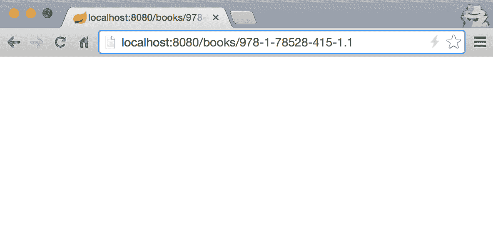
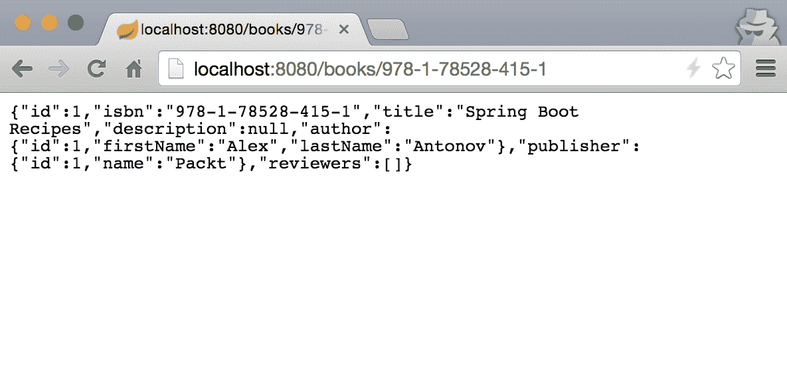
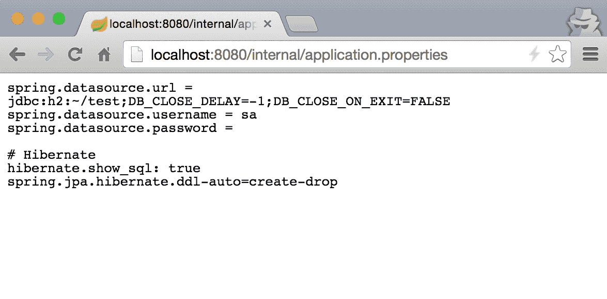
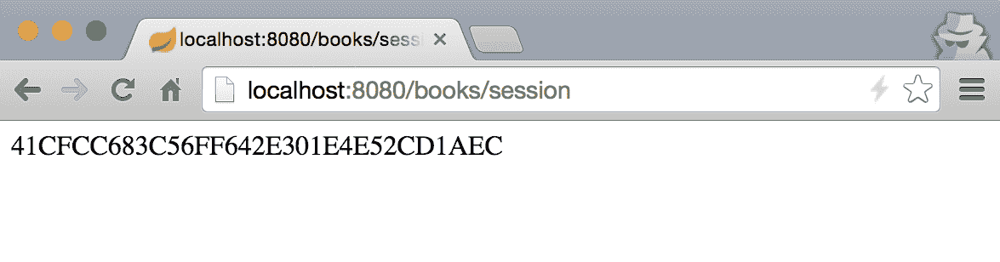
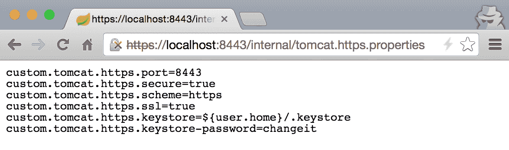

# 第三章：调整 Web 框架行为

在本章中，我们将学习以下主题：

+   配置路由匹配模式

+   配置自定义静态路径映射

+   通过 ServletWebServerFactory 调整 Tomcat

+   选择嵌入式 servlet 容器

+   添加自定义连接器

# 简介

在第二章 *配置 Web 应用程序* 中，我们探讨了如何在 Spring Boot 中使用自定义过滤器、拦截器等配置 Web 应用程序。我们将继续深入了解通过行为调整、配置自定义路由规则和模式、添加额外的静态资产路径、添加和修改 servlet 容器连接器以及其他属性（如启用 SSL）来增强我们的 Web 应用程序。

# 配置路由匹配模式

当我们构建 Web 应用程序时，并不总是默认的即插即用的映射配置适用。有时，我们希望创建包含点（`.`）等字符的 RESTful URL，Spring 将其视为分隔符定义格式，如`path.xml`；或者我们可能不想识别尾随斜杠等。方便的是，Spring 提供了一种轻松实现此功能的方法。

在第二章 *配置 Web 应用程序* 中，我们介绍了`WebConfiguration`类，它继承自`WebMvcConfigurerAdapter`。这种扩展允许我们覆盖旨在添加过滤器、格式化程序等的方法。它还具有可以覆盖的方法，例如配置路径匹配等。

让我们假设 ISBN 格式确实允许使用点来分隔书号和修订版，其模式看起来像`[isbn-number].[revision]`。

# 如何操作...

我们将配置应用程序不使用`.*`后缀模式匹配，并在解析参数时不要删除点后面的值。让我们执行以下步骤：

1.  让我们在`WebConfiguration`类中添加必要的配置，内容如下：

```java
@Override 
public void 
  configurePathMatch(PathMatchConfigurer configurer) { 
    configurer.setUseSuffixPatternMatch(false). 
      setUseTrailingSlashMatch(true); 
} 
```

1.  通过运行`./gradlew clean bootRun`启动应用程序。

1.  让我们在浏览器中打开`http://localhost:8080/books/978-1-78528-415-1.1`以查看以下结果：



1.  如果我们输入正确的 ISBN，我们将看到不同的结果，如下所示：



# 它是如何工作的...

让我们详细看看我们做了什么。`configurePathMatch(PathMatchConfigurer configurer)`方法使我们能够设置自己的行为，以便 Spring 能够根据我们的需求将请求 URL 路径与控制器参数匹配：

+   `configurer.setUseSuffixPatternMatch(false)`: 这个方法表示我们不希望使用 `.*` 后缀，因此会移除最后一个点后面的尾随字符。这意味着 Spring 将整个 `978-1-78528-415-1.1` ISBN 解析为 `{isbn}` 参数用于 `BookController`。因此，`http://localhost:8080/books/978-1-78528-415-1.1` 和 `http://localhost:8080/books/978-1-78528-415-1` 将成为不同的 URL。

+   `configurer.setUseTrailingSlashMatch(true)`: 这个方法表示我们想要将 URL 末尾的 `/` 符号用作匹配，就像它不存在一样。这实际上使得 `http://localhost:8080/books/978-1-78528-415-1` 与 `http://localhost:8080/books/978-1-78528-415-1/` 相同。

如果你想要进一步配置路径匹配的方式，你可以提供自己的 `PathMatcher` 和 `UrlPathHelper` 实现，但这些通常只在最极端和定制化的情况下需要，并且通常不推荐这样做。

# 配置自定义静态路径映射

在前面的配方中，我们探讨了如何调整 URL 路径映射以请求并将它们转换为控制器方法。也可以控制我们的 Web 应用程序如何处理静态资源和存在于文件系统或打包在可部署归档中的文件。

假设我们想要通过我们应用程序的静态 Web URL `http://localhost:8080/internal/application.properties` 暴露我们的内部 `application.properties` 文件。为了开始这个过程，请按照下一节中的步骤进行操作。

# 如何做到这一点...

1.  让我们在 `WebConfiguration` 类中添加一个新的方法 `addResourceHandlers`，内容如下：

```java
@Override 
public void addResourceHandlers(ResourceHandlerRegistry registry) { 
    registry.addResourceHandler("/internal/**")
            .addResourceLocations("classpath:/"); 
}
```

1.  通过运行 `./gradlew clean bootRun` 启动应用程序

1.  让我们在浏览器中打开 `http://localhost:8080/internal/application.properties` 来查看以下结果：



# 它是如何工作的...

我们重写的方法 `addResourceHandlers(ResourceHandlerRegistry registry)` 是来自 `WebMvcConfigurer` 的另一种配置方法，它赋予我们定义自定义映射以静态资源 URL 并连接到文件系统或应用程序类路径上的资源的能力。在我们的例子中，我们定义了一个映射，将所有通过 `/internal` URL 访问的内容映射到我们应用程序的 `classpath:/` 路径上（对于生产环境，你可能不想将整个类路径作为静态资源暴露！）。

因此，让我们详细看看我们做了什么，如下所示：

+   `registry.addResourceHandler("/internal/**")` 方法向注册表中添加一个资源处理器来处理我们的静态资源，并返回 `ResourceHandlerRegistration` 给我们，这可以用来进一步以链式方式配置映射。`/internal/**` 是一个路径模式，它将使用 `PathMatcher` 来与请求 URL 进行匹配。我们在前面的示例中已经看到了如何配置 `PathMatcher`，但默认情况下使用的是 `AntPathMatcher` 实现。我们可以配置多个 URL 模式以匹配特定的资源位置。

+   在新创建的 `ResourceHandlerRegistration` 实例上调用 `addResourceLocations("classpath:/")` 方法，它定义了资源应该从哪些目录加载。这些应该是有效的文件系统或类路径目录，并且可以输入多个。如果提供了多个位置，它们将按照输入的顺序进行检查。

我们还可以使用 `setCachePeriod(Integer cachePeriod)` 方法为给定的资源配置一个缓存间隔。

# 通过 ServletWebServerFactory 调优 Tomcat

Spring Boot 通过在 `application.properties` 中简单地设置值来公开许多服务器属性，可以用来配置诸如 PORT、SSL 等事物。然而，如果我们需要进行更复杂的调优，Spring Boot 提供了一个 `ServletWebServerFactory` 接口，可以用来程序化地定义我们的配置。

尽管会话超时可以通过在 `application.properties` 中设置 `server.session.timeout` 属性为所需的秒数来轻松配置，但我们将使用 `ServletWebServerFactory` 来演示如何进行配置。

# 如何做到...

1.  假设我们想让会话持续一分钟。为了实现这一点，我们将在 `WebConfiguration` 类中添加一个 `ServletWebServerFactory` bean，内容如下：

```java
@Bean
public ServletWebServerFactory servletContainer() {    
  TomcatServletWebServerFactory tomcat = 
         new TomcatServletWebServerFactory();
  tomcat.getSession().setTimeout(Duration.ofMinutes(1));
  return tomcat;
}
```

1.  仅为了演示目的，我们将从请求中获取会话以强制其创建。为此，我们将在 `BookController` 类中添加一个新的请求映射，内容如下：

```java
@RequestMapping(value = "/session", method = 
   RequestMethod.GET) 
public String getSessionId(HttpServletRequest request) { 
  return request.getSession().getId(); 
} 
```

1.  通过运行 `./gradlew clean bootRun` 来启动应用程序。

1.  让我们在浏览器中打开 `http://localhost:8080/books/session` 来查看以下结果：



如果我们等待超过一分钟然后重新加载这个页面，会话 ID 将会变为另一个。

# 它是如何工作的...

`ServletWebServerFactory` 接口定义了 `WebServer getWebServer(ServletContextInitializer... initializers)` 方法。Spring Boot 默认提供了 `TomcatServletWebServerFactory`、`JettyServletWebServerFactory` 和 `UndertowServletWebServerFactory` 应用服务器的具体工厂实现。由于我们在示例中使用 Tomcat，我们将使用提供的 `TomcatServletWebServerFactory` 类来配置会话的行为。

在应用程序启动期间，Spring Boot 自动配置检测到工厂的存在，并调用 `getWebServer(...)` 方法，传递一个 `ServletContextInitializer` bean 集合的引用。通常，这些初始化器是由 Spring Boot 内部创建和管理的，但我们可以始终创建一些自定义的 `ServletContextInitializer` bean 来添加应在应用程序服务器启动生命周期中执行的自定义行为。

# 选择嵌入式 servlet 容器

如果我们决定要使用 Jetty 作为我们的 servlet 容器，我们需要在我们的 `build` 文件中添加一个 Jetty starter。

# 如何操作...

1.  由于 Tomcat 已经是 Spring Boot 的传递依赖项，我们需要通过在 `build.gradle` 中添加以下内容来从我们的 `build` 依赖项树中排除它：

```java
configurations { 
  compile.exclude module: "spring-boot-starter-tomcat" 
}
```

1.  我们还需要在我们的 `build` 依赖项中添加一个对 Jetty 的 `compile` 依赖项：

```java
compile("org.springframework.boot:spring-boot-starter-jetty")
```

1.  为了修复编译错误，我们需要从我们的 `WebConfiguration` 类中移除 Tomcat 的 `RemoteIpFilter` 的 bean 声明，因为已经移除了 Tomcat 依赖。

1.  通过运行 `./gradlew clean bootRun` 启动应用程序

1.  如果我们现在查看控制台日志，我们会看到我们的应用程序正在 Jetty 中运行：

```java
2017-12-16 --- o.eclipse.jetty.server.AbstractConnector 
 : Started ServerConnector...
2017-12-16 ---.o.s.b.web.embedded.jetty.JettyWebServer
 : Jetty started on port(s) 8080 (http/1.1)...
```

# 它是如何工作的...

这之所以能工作，是因为 Spring Boot 的自动配置魔法。我们必须从 `build` 文件中移除 Tomcat 依赖，以防止 Tomcat 和 Jetty 之间的依赖冲突。Spring Boot 对类路径中的类进行条件扫描，并根据其检测到的结果确定将使用哪个 servlet 容器。

如果我们查看 `ServletWebServerFactoryAutoConfiguration` 类，我们会看到以下检查此条件的代码：

```java
/** 
 * Nested configuration if Jetty is being used. 
 */ 
@Configuration 
@ConditionalOnClass({ Servlet.class, Server.class, Loader.class}) 
@ConditionalOnMissingBean(value = ServletWebServerFactory.class,  
                           search = SearchStrategy.CURRENT) 
public static class EmbeddedJetty { 

  @Bean 
  public JettyServletWebServerFactory 
       JettyServletWebServerFactory() {
           return new JettyServletWebServerFactory();
  } 

}
```

`@ConditionalOnClass` 注解告诉 Spring Boot，如果 Jetty 的类（即 `org.eclipse.jetty.server.Server` 和 `org.eclipse.jetty.util.Loader`）存在于类路径中，则仅使用 `EmbeddedJetty` 配置。

# 添加自定义连接器

在企业应用程序开发和部署中，另一个非常常见的场景是使用两个独立的 HTTP 端口连接器来运行应用程序：一个用于 HTTP，另一个用于 HTTPS

# 准备工作

我们将首先回到使用 Tomcat；因此，对于这个配方，我们将撤销在先前的示例中实现的更改。

为了创建 HTTPS 连接器，我们需要一些东西；但最重要的是，我们需要生成用于加密和解密与浏览器 SSL 通信的证书密钥库。

如果你使用 Unix 或 macOS，你可以通过运行以下命令来实现：

```java
    $JAVA_HOME/bin/keytool -genkey -alias tomcat -keyalg RSA
```

在 Windows 上，可以通过以下命令实现：

```java
    "%JAVA_HOME%binkeytool" -genkey -alias tomcat -keyalg RSA  
```

在创建密钥库的过程中，你应该输入适合你的信息，包括密码、名称等。为了本书的目的，我们将使用默认密码：`changeit`。一旦执行完成，一个新创建的密钥库文件将出现在你的主目录下，名称为：`keystore`。

你可以在 [`tomcat.apache.org/tomcat-8.0-doc/ssl-howto.html#Prepare_the_Certificate_Keystore`](https://tomcat.apache.org/tomcat-8.0-doc/ssl-howto.html#Prepare_the_Certificate_Keystore) 找到有关准备证书密钥库的更多信息。

# 如何做到这一点...

在密钥库创建完成后，我们需要创建一个单独的 `properties` 文件来存储我们的 HTTPS 连接器的配置，例如端口。之后，我们将创建一个配置属性绑定对象，并使用它来配置我们的新连接器。执行以下步骤：

1.  首先，我们将从项目的根目录在 `src/main/resources` 目录下创建一个名为 `tomcat.https.properties` 的新属性文件，内容如下：

```java
custom.tomcat.https.port=8443 
custom.tomcat.https.secure=true 
custom.tomcat.https.scheme=https 
custom.tomcat.https.ssl=true 
custom.tomcat.https.keystore=${user.home}/.keystore 
custom.tomcat.https.keystore-password=changeit 
```

1.  接下来，我们将在 `WebConfiguration` 类中创建一个名为 `TomcatSslConnectorProperties` 的嵌套静态类，内容如下：

```java
@ConfigurationProperties(prefix = "custom.tomcat.https") 
public static class TomcatSslConnectorProperties { 
  private Integer port; 
  private Boolean ssl = true; 
  private Boolean secure = true; 
  private String scheme = "https"; 
  private File keystore; 
  private String keystorePassword; 
  //Skipping getters and setters to save space, but we do need them 

  public void configureConnector(Connector connector) { 
    if (port != null) 
      connector.setPort(port); 
    if (secure != null) 
      connector.setSecure(secure); 
    if (scheme != null) 
      connector.setScheme(scheme); 
    if (ssl!= null) 
      connector.setProperty("SSLEnabled", ssl.toString()); 
    if (keystore!= null &&keystore.exists()) { 
      connector.setProperty("keystoreFile", 
         keystore.getAbsolutePath());      
      connector.setProperty("keystorePassword", 
         keystorePassword); 
    } 
  } 
}
```

1.  现在，我们需要将新创建的 `tomcat.http.properties` 文件添加为 Spring Boot 属性源，并启用 `TomcatSslConnectorProperties` 的绑定。这可以通过在 `WebConfiguration` 类的类声明之前添加以下代码来完成：

```java
@Configuration 
@PropertySource("classpath:/tomcat.https.properties") 
@EnableConfigurationProperties(WebConfiguration.TomcatSslConnectorProperties.class) 
public class WebConfiguration extends WebMvcConfigurerAdapter {...}
```

1.  最后，我们需要修改一个 `ServletWebServerFactory` Spring bean，我们将添加我们的 HTTPS 连接器。我们将通过在 `WebConfiguration` 类中更改以下代码来实现这一点：

```java
@Bean
public ServletWebServerFactory servletContainer
            (TomcatSslConnectorProperties properties) {
    TomcatServletWebServerFactory tomcat = 
        new TomcatServletWebServerFactory();
    tomcat.addAdditionalTomcatConnectors
        (createSslConnector(properties));
    tomcat.getSession().setTimeout(Duration.ofMinutes(1));
    return tomcat;
}
private Connector createSslConnector
            (TomcatSslConnectorProperties properties) { 
    Connector connector = new Connector(); 
    properties.configureConnector(connector); 
    return connector; 
} 
```

1.  通过运行 `./gradlew clean bootRun` 来启动应用程序。

1.  让我们在浏览器中打开 `https://localhost:8443/internal/tomcat.https.properties` 来查看以下结果：



# 它是如何工作的...

在这个菜谱中，我们做了一些事情；让我们一次分解一个更改。

第一个更改，忽略创建密钥库的需要，是创建 `tomcat.https.properties` 和 `TomcatSslConnectorProperties` 对象以将它们绑定到。在此之前，我们已经处理了在配置我们的数据源时对 `application.properties` 中各种设置的更改。然而，当时我们不需要创建任何绑定对象，因为 Spring Boot 已经定义了它们。

如我们之前所学的，Spring Boot 已经公开了许多属性来配置应用程序设置，包括 `server` 部分的一整套设置。这些值绑定到一个内部 Spring Boot 类：`ServerProperties`

常见应用程序属性的完整列表可以在 Spring Boot 参考文档中找到，网址为 [`docs.spring.io/spring-boot/docs/current/reference/html/common-application-properties.html`](http://docs.spring.io/spring-boot/docs/current/reference/html/common-application-properties.html)。

我们添加的功能只是简单地模仿 Spring Boot，并创建我们自己的配置组，其背后有一个绑定对象。我们没有使用已经存在的 `server.tomcat.` 前缀，而是选择 `custom.tomcat`，主要是因为我们需要将我们的配置值与默认值分开。由于我们正在添加第二个连接器，我们希望默认配置属性和我们的自定义属性之间有一个清晰的分离。

`@ConfigurationProperties(prefix = "custom.tomcat.https")` 方法是我们 `TomcatSslConnectorProperties` 对象的一个重要注解。它告诉 Spring Boot 自动将带有 `custom.tomcat.https` 前缀的属性绑定到 `TomcatSslConnectorProperties` 中声明的字段。为了使绑定发生——除了在类中定义字段之外——定义 getter 和 setter 也是非常重要的。还值得一提的是，在绑定过程中，Spring 会自动尝试将属性值转换为适当的数据类型。例如，`custom.tomcat.https.keystore` 的值会自动绑定到一个私有的文件密钥库字段对象。

我们之前学到的转换器也将用于将数据转换为自定义定义的数据类型的过程中。

下一步是告诉 Spring Boot 将 `tomcat.https.properties` 中定义的属性包含在属性列表中。这是通过在 `WebConfiguration` 类中的 `@Configuration` 旁边添加 `@PropertySource("classpath:/tomcat.https.properties")` 来实现的。

在值导入后，我们需要告诉 Spring Boot 自动为我们创建一个 `TomcatSslConnectorProperties` 实例。这是通过在 `@Configuration` 旁边添加以下注解来完成的：

```java
@EnableConfigurationProperties(WebConfiguration.TomcatSslConnectorProperties.class)
```

这将指导 Spring Boot 自动创建一个类型为 `TomcatSslConnectorProperties` 的 bean，并将其与指定的 `classpath:/tomcat.https.properties` 文件中的值绑定。这个 bean 可以后来用于在不同的地方进行自动装配，例如当我们创建一个 `ServletWebServerFactory` bean 时。

在设置并完成所有属性支持后，我们将继续编写实际代码来创建第二个连接器。`ServletWebServerFactory` bean 的创建为 Spring Boot 提供了一个工厂，用于创建 `WebServer`。我们添加到 `TomcatSslConnectorProperties` 中的方便的 `configureConnector(Connector connector)` 方法，为我们提供了一个很好的地方来封装和整合所有配置新创建的 `Connector` 实例所需的设置。
