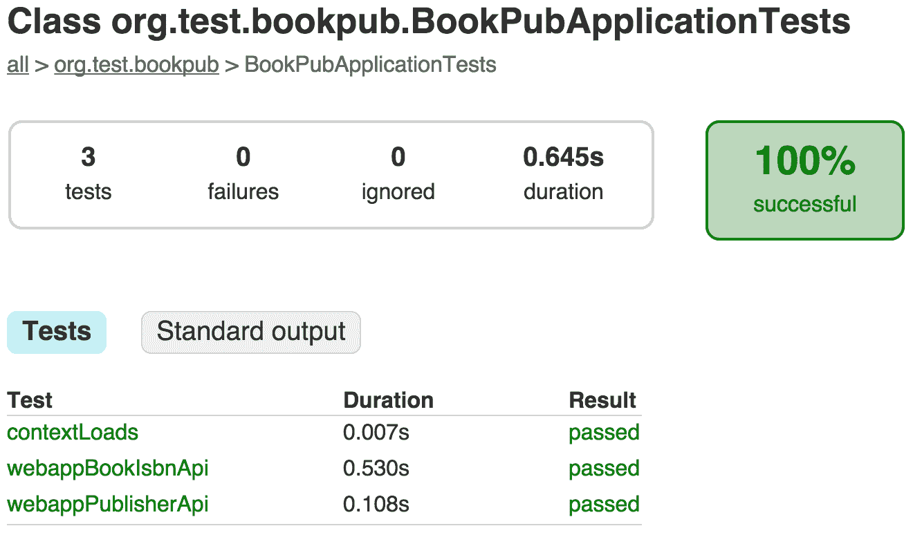

# 第五章：应用程序测试

在本章中，我们将涵盖以下主题：

+   为 MVC 控制器创建测试

+   配置数据库模式并填充数据

+   使用内存数据库创建测试

+   使用模拟对象创建测试

+   创建 JPA 组件测试

+   创建 WebMvc 组件测试

+   使用 Cucumber 编写测试

+   使用 Spock 编写测试

# 简介

在前面的章节中，我们做了大量的编码工作。我们从零开始创建了一个新的 Spring Boot 应用程序，向其中添加了一个 MVC 组件和一些数据库服务，对应用程序的行为进行了一些调整，甚至编写了我们自己的 Spring Boot starter。现在是时候迈出下一步，了解 Spring Boot 在测试所有这些代码时提供了哪些工具和功能，以及它与其他流行测试框架的集成情况如何。

我们将了解如何使用 Spring JUnit 集成创建单元测试。接下来，我们将探索设置数据库并使用测试数据对其进行测试的选项。然后，我们将查看 **行为驱动开发**（**BDD**）工具 Cucumber 和 Spock，了解它们如何与 Spring Boot 集成。

# 为 MVC 控制器创建测试

在前面的章节中，我们在逐步创建我们的应用程序方面取得了很大的进展，但我们如何知道它实际上确实做了我们想要它做的事情？更重要的是，我们如何确保六个月后，甚至一年后，它仍然会继续做我们最初期望它做的事情？这个问题最好的答案就是创建一系列测试，最好是自动化的，对我们的代码运行一系列断言。这确保了在给定的特定输入下，我们始终获得相同和预期的输出。测试给我们带来了急需的安心，我们的应用程序不仅代码优雅、外观美观，而且性能可靠，尽可能无错误。

在 第四章 *编写自定义 Spring Boot Starter* 中，我们停止了我们的 Web 应用程序安装了自定义编写的 Spring Boot starter。现在我们将创建一些基本的测试来测试我们的 Web 应用程序，并确保所有控制器都公开了预期的 RESTful URL，我们可以依赖这些 URL 作为服务 API。这种测试类型略高于通常所说的 **单元测试**，因为它测试了整个 Web 应用程序，需要应用程序上下文完全初始化，并且所有 bean 都应该连接在一起才能工作。这种测试有时被称为 **集成** 或 **服务测试**。

# 如何做...

1.  Spring Boot 通过在项目根目录的 `src/test/java/com/example/bookpub` 目录中创建一个占位符测试文件，名为 `BookPubApplicationTests.java`，来启动我们的项目，其内容如下：

```java
@RunWith(SpringRunner.class) 
@SpringApplicationConfiguration(classes = 
   BookPubApplication.class) 
public class BookPubApplicationTests { 
  @Test 
  public void contextLoads() { 
  } 
} 
```

1.  在 `build.gradle` 中，我们还添加了对 `spring-boot-starter-test` 的测试依赖项，如下所示：

```java
testCompile("org.springframework.boot:spring-boot-starter-test") 
```

1.  我们将继续扩展基本模板测试，包含以下代码：

```java
import static org.hamcrest.Matchers.containsString;
import static org.junit.Assert.assertEquals;
import static org.junit.Assert.assertNotNull;
import static org.springframework.test.web.servlet.setup.MockMvcBuilders.webAppContextSetup;
import static org.springframework.test.web.servlet.request.MockMvcRequestBuilders.get;
import static org.springframework.test.web.servlet.result.MockMvcResultMatchers.content;
import static org.springframework.test.web.servlet.result.MockMvcResultMatchers.jsonPath;
import static org.springframework.test.web.servlet.result.MockMvcResultMatchers.status;

@RunWith(SpringRunner.class)
@SpringBootTest(webEnvironment = SpringBootTest.WebEnvironment.RANDOM_PORT)
public class BookPubApplicationTests {
   @Autowired
   private WebApplicationContext context; 
   @Autowired
   private TestRestTemplate restTemplate;
   @Autowired
   private BookRepository repository;

   @LocalServerPort
   private int port;

   private MockMvc mockMvc; 

   @Before
   public void setupMockMvc() {
       mockMvc = webAppContextSetup(context).build();
   }

   @Test
   public void contextLoads() {
       assertEquals(1, repository.count());
   }

   @Test
   public void webappBookIsbnApi() {
       Book book =
         restTemplate.getForObject("http://localhost:" +
           port + "/books/978-1-78528-415-1", Book.class);
       assertNotNull(book);
       assertEquals("Packt", book.getPublisher().getName());
   }

   @Test
   public void webappPublisherApi() throws Exception {
       mockMvc.perform(get("/publishers/1")).
               andExpect(status().isOk()).andExpect(content().
                  contentType(MediaType.parseMediaType
                    ("application/hal+json;charset=UTF-8"))).
               andExpect(content().
                            string(containsString("Packt"))).
               andExpect(jsonPath("$.name").value("Packt"));
   }
} 
```

1.  通过运行`./gradlew clean test`来执行测试。

1.  通过查看控制台输出，我们可以知道我们的测试已经成功运行，但我们实际上并没有看到很多信息，除了以下几行（为了简洁而截断）：

```java
:compileJava
:compileTestJava
:testClasses
:test
2016-10-13 21:40:44.694  INFO 25739 --- [       Thread-4] ationConfigEmbeddedWebApplicationContext : Closing org.springframework.boot.context.embedded.AnnotationConfigEmbeddedWebApplicationContext@206f4aa6: startup date [Mon Apr 13 21:40:36 CDT 2015]; root of context hierarchy
2016-10-13 21:40:44.704  INFO 25739 --- [       Thread-4] j.LocalContainerEntityManagerFactoryBean : Closing JPA EntityManagerFactory for persistence unit 'default'
2016-10-13 21:40:44.705  INFO 25739 --- [       Thread-4] org.hibernate.tool.hbm2ddl.SchemaExport  : HHH000227: Running hbm2ddl schema export
2016-10-13 21:40:44.780  INFO 25739 --- [       Thread-4] org.hibernate.tool.hbm2ddl.SchemaExport  : HHH000230: Schema export complete

BUILD SUCCESSFUL
Total time: 24.635 secs
```

1.  通过查看 Gradle 生成的 HTML 报告可以获得更好的洞察力，这些报告可以在浏览器中打开，并位于`build/reports/tests/index.html`，如下截图所示：

1.  点击`com.example.bookpub.BookPubApplicationTests`将带我们到单个测试用例分解，显示每个测试的状态以及执行所需的时间，如下截图所示：

1.  好奇心更强的人也可以点击标准输出按钮，以便在测试执行期间查看生成的运行时应用程序日志。

# 它是如何工作的...

现在我们已经创建了第一个测试，让我们详细检查代码。

我们将首先查看为`BookPubApplicationTests`类声明的以下注解：

+   `@RunWith(SpringRunner.class)`: 这是一个标准的 JUnit 注解，我们可以配置它以使用`SpringRunner`，为标准的 JUnit 测试提供引导 Spring Boot 框架的功能。

+   `@SpringBootTest(webEnvironment=SpringBootTest.WebEnvironment.RANDOM_PORT)`: 这是一个标记类为 Spring Boot 测试的注解。它将使用 Spring Boot 框架来配置测试类实例，提供适当的配置、自动装配等。`webEnvironment=SpringBootTest.WebEnvironment.RANDOM_PORT`属性意味着当前测试将使用一个真实、运行的服务实例，并需要完整的上下文初始化和应用启动，就像真实的一样。`RANDOM_PORT`值用于告诉 Spring Boot 在随机选择的 HTTP 端口上启动 Tomcat 服务器，我们稍后将通过声明`@LocalServerPortprivate int port;`值字段来获取这个端口。当在 Jenkins 或其他任何 CI 服务器上运行测试时，这种选择随机 HTTP 端口的能力非常方便，因为在并行运行多个作业时可能会遇到端口冲突。

魔法类注解消失后，让我们看看类本身的内容。由于这是一个 Spring Boot 测试，我们可以在执行期间将 Spring 管理的任何对象声明为`@Autowired`，或者使用`@Value`注解将其设置为特定的环境值。在我们的测试中，我们自动装配了`WebApplicationContext`和`BookRepository`对象，以及一个`TestRestTemplate`实例，我们将在执行标准的 JUnit `@Test`注解测试用例时使用它。

在第一个测试用例`contextLoads()`中，我们将断言我们已经建立了`BookRepository`连接，并且它包含一个书籍条目。

我们的第二个测试将确保我们的 Web 应用程序能够响应一个通过`ISBN`查找`Book`的 RESTful URL - `"/books/{isbn}"`。为此测试，我们将使用`TestRestTemplate`的实例，并在随机选择的端口上对运行实例进行 RESTful 调用。Spring Boot 提供了`port`字段的值。

在`webappBookIsbnApi`测试中，我们使用了一个完整的 URL，其起始部分为`"http://localhost:" + port`，如果`TestRestTemplate`被 Spring Boot 自动装配和注入，技术上是不需要的。在这种情况下，可以使用一个相对 URL，看起来像`Book book = restTemplate.getForObject("/books/978-1-78528-415-1", Book.class);`，并且`TestRestTemplate`将自动确定运行中的测试服务器实例的端口号。

或者，我们可以通过`MockMvc`对象执行相同类型的测试。这是由 Spring Test 框架提供的，允许我们在不通过`RestTemplate`进行基于客户端的测试的情况下执行 MVC 测试，而是完全在服务器端进行，控制器请求是从与测试应用程序相同的上下文中执行的。

为了使用`MockMvc`，我们将使用`MockMvcBuilders`实用工具，通过`@Autowired WebApplicationContext`构建一个实例。我们将在设置方法中这样做，这样我们就不必在每个测试中明确执行它。

如果我们使用`WebEnvironment.MOCK`而不是`RANDOM_PORT`来注释我们的测试，Spring Boot 也可以自动创建一个`MockMvc`实例。这种配置将只使测试在模拟上下文中运行，而不会启动任何真实服务器。我们的示例展示了如何在同一个测试类中结合使用真实服务器实例和`MockMVC`。

`MockMvc`为我们提供了一套非常广泛的功能，以便对与网络请求相关的几乎所有事物执行断言。它被设计成以方法链的形式使用，允许我们将各种测试链接在一起，形成一个良好、连续的逻辑链：

+   `perform(get(...))`：此方法设置网络请求。在我们的特定情况下，我们执行一个 GET 请求，但`MockMvcRequestBuilders`类为我们提供了所有常见方法调用的静态辅助函数。

+   `andExpect(...)`: 这个方法可以被多次调用，每次调用都代表对`perform(...)`调用结果的某个条件的评估。这个调用的参数是`ResultMatcher`接口的任何实现，以及由`MockMvcResultMatchers`静态实用类提供的许多内置实现。这实际上打开了进行无限多种不同检查的可能性，例如验证响应状态、内容类型、会话中存储的值、闪存作用域、验证重定向、渲染模型的内 容或头信息，等等。我们将使用第三方`json-path`附加库（作为`spring-boot-test`依赖自动引入）来测试 JSON 响应数据，以确保它包含正确的元素，并且位于正确的树结构中。`andExpect(jsonPath("$.name").value("Packt"))`验证了在 JSON 文档的根处有一个值为`Packt`的`name`元素。

要了解更多关于 MockMvc 中可用的各种可能性，您可以参考[`github.com/spring-projects/spring-mvc-showcase/tree/master/src/test/java/org/springframework/samples/mvc`](https://github.com/spring-projects/spring-mvc-showcase/tree/master/src/test/java/org/springframework/samples/mvc)。

# 配置数据库模式和填充数据

在本书的早期部分，在第二章“配置 Web 应用程序”中，我们在`StartupRunner`的`run(...)`方法中手动添加了一些数据库条目。虽然这样做可以快速简单地启动某些内容，但从长远来看，这并不是一个好主意，尤其是当你处理大量数据时。将数据库的准备、更改和其他配置与运行应用程序的其余代码分离，即使是在设置测试用例时，也是一种良好的实践。幸运的是，Spring 为我们提供了支持，使这项任务变得相当简单和直接。

我们将继续使用之前配方中留下的应用程序状态。Spring 为我们提供了几种定义如何在数据库中填充结构和数据的方法。第一种方法依赖于 Hibernate 自动创建表结构，通过从我们定义的`@Entity`对象推断，并使用`import.sql`文件来填充数据。第二种方法是通过使用普通的 Spring JDBC 功能，这依赖于包含数据库表定义的`schema.sql`文件和包含数据的相应`data.sql`文件。

# 如何做到这一点...

1.  首先，我们将移除在第二章“配置 Web 应用程序”中创建的程序化数据库填充。所以，让我们从`StartupRunner`的`run(...)`方法中注释掉以下代码：

```java
Author author = new Author("Alex", "Antonov"); 
author = authorRepository.save(author); 
Publisher publisher = new Publisher("Packt"); 
publisher = publisherRepository.save(publisher); 
Book book = new Book("978-1-78528-415-1", "Spring Boot Recipes", author, publisher); 
bookRepository.save(book); 
```

1.  如果我们运行测试，如果缺少 `test.h2.db` 文件，它们可能会失败，因为它们期望数据在数据库中。我们将通过在项目根目录的 `src/main/resources` 目录下创建以下内容的 Hibernate `import.sql` 文件来填充数据库：

```java
INSERT INTO author (id, first_name, last_name) VALUES (1, 'Alex', 'Antonov') 
INSERT INTO publisher (id, name) VALUES (1, 'Packt') 
INSERT INTO book (isbn, title, author_id, publisher_id) VALUES ('978-1-78528-415-1', 'Spring Boot Recipes', 1, 1) 
```

1.  通过再次运行 `./gradlew clean test` 来执行测试，它们神奇地启动并通过了。

1.  另一种方法是使用 Spring JDBC 对 `schema.sql` 和 `data.sql` 的支持。让我们将新创建的 `import.sql` 文件重命名为 `data.sql`，并在同一目录下创建一个包含以下内容的 `schema.sql` 文件：

```java
-- Create syntax for TABLE 'author' 
DROP TABLE IF EXISTS `author`; 
CREATE TABLE `author` ( 
  `id` bigint(20) NOT NULL AUTO_INCREMENT, 
  `first_name` varchar(255) DEFAULT NULL, 
  `last_name` varchar(255) DEFAULT NULL, 
  PRIMARY KEY (`id`) 
); 
-- Create syntax for TABLE 'publisher' 
DROP TABLE IF EXISTS `publisher`; 
CREATE TABLE `publisher` ( 
  `id` bigint(20) NOT NULL AUTO_INCREMENT, 
  `name` varchar(255) DEFAULT NULL, 
  PRIMARY KEY (`id`) 
); 
-- Create syntax for TABLE 'reviewer' 
DROP TABLE IF EXISTS `reviewer`; 
CREATE TABLE `reviewer` ( 
  `id` bigint(20) NOT NULL AUTO_INCREMENT, 
  `first_name` varchar(255) DEFAULT NULL, 
  `last_name` varchar(255) DEFAULT NULL, 
  PRIMARY KEY (`id`) 
); 
-- Create syntax for TABLE 'book' 
DROP TABLE IF EXISTS `book`; 
CREATE TABLE `book` ( 
  `id` bigint(20) NOT NULL AUTO_INCREMENT, 
  `description` varchar(255) DEFAULT NULL, 
  `isbn` varchar(255) DEFAULT NULL, 
  `title` varchar(255) DEFAULT NULL, 
  `author_id` bigint(20) DEFAULT NULL, 
  `publisher_id` bigint(20) DEFAULT NULL, 
  PRIMARY KEY (`id`), 
  CONSTRAINT `FK_publisher` FOREIGN KEY (`publisher_id`) REFERENCES `publisher` (`id`), 
  CONSTRAINT `FK_author` FOREIGN KEY (`author_id`) REFERENCES `author` (`id`) 
); 
-- Create syntax for TABLE 'book_reviewers' 
DROP TABLE IF EXISTS `book_reviewers`; 
CREATE TABLE `book_reviewers` ( 
  `book_id` bigint(20) NOT NULL, 
  `reviewers_id` bigint(20) NOT NULL, 
  CONSTRAINT `FK_book` FOREIGN KEY (`book_id`) REFERENCES `book` (`id`), 
  CONSTRAINT `FK_reviewer` FOREIGN KEY (`reviewers_id`) REFERENCES `reviewer` (`id`) 
); 
```

1.  由于我们现在正在手动创建数据库模式，我们需要告诉 Hibernate 映射器不要从实体中自动推导出一个，并用它来填充数据库。因此，让我们在项目根目录的 `src/main/resources` 目录下的 `application.properties` 文件中设置 `spring.jpa.hibernate.ddl-auto=none` 属性。

1.  通过运行 `./gradlew clean test` 来执行测试，它们应该会通过。

# 它是如何工作的...

在这个配方中，我们实际上探索了两种实现相同目标的方法，这在 Spring 生态系统中是很常见的。根据使用的组件不同，无论是纯 Spring JDBC、Spring JPA 与 Hibernate，还是 Flyway 或 Liquibase 迁移，填充和初始化数据库的方法会有所不同，但最终结果基本上是相同的。

Flyway 和 Liquibase 都是提供增量数据库迁移功能的框架。当一个人想要以程序化、可描述的方式维护数据库变化的增量日志，并能够快速将数据库置于特定版本所需的状态时，这非常有用。虽然这些框架在提供此类支持的方法上有所不同，但它们的目的相似。更详细的信息可以在它们各自的网站上获得，[`flywaydb.org`](http://flywaydb.org) 和 [`www.liquibase.org`](http://www.liquibase.org)。

在前面的例子中，我们探讨了两种不同的填充和初始化数据库的方法。

# 使用 Spring JPA 和 Hibernate 初始化数据库

在这种方法中，大部分工作实际上是由 `Hibernate` 库完成的，我们只是设置了适当的配置并创建了 Hibernate 进行工作所需的常规预期文件：

+   `spring.jpa.hibernate.ddl-auto=create-drop`设置指示 Hibernate 使用`@Entity`模型，并根据其结构自动推断数据库模式。在应用程序启动时，将使用计算出的模式预初始化数据库表结构；当应用程序关闭时，它将被全部销毁。即使在应用程序被强制终止或突然崩溃的情况下，在启动时，如果检测到现有表，它们将被删除并从头开始重新创建。因此，对于生产环境来说，依赖这种方式可能不是一个好主意。

如果没有明确配置`spring.jpa.hibernate.ddl-auto`属性，Spring Boot 默认使用 create-drop 为嵌入式数据库，如 H2，因此请小心并适当设置它。

+   Hibernate 期望`import.sql`文件位于类路径的根目录中。该文件用于在应用程序启动时执行声明的 SQL 语句。虽然文件中可以放入任何有效的 SQL 语句，但建议您放入数据导入语句，如`INSERT`或`UPDATE`，并避免对表结构进行修改，因为模式定义已经由 Hibernate 处理。

# 使用 Spring JDBC 初始化数据库

如果应用程序不使用 JPA，或者您不想明确依赖 Hibernate 功能，只要存在`spring-boot-starter-jdbc`依赖项，Spring 就提供了另一种设置数据库的方法。因此，让我们看看我们是如何让它工作的，如下所示列表所示：

+   `spring.jpa.hibernate.ddl-auto=none`设置告诉 Hibernate，如果 Hibernate 依赖项也存在（如我们案例中所示），不要对数据库进行任何自动处理。在生产环境中，这是一个好的实践，因为您可能不希望意外地清除所有数据库表。那将是一场灾难，这是肯定的！

+   预期`schema.sql`文件存在于类路径的根目录中。Spring 会在每次应用程序启动时，在数据库创建模式时执行该文件。然而，与 Hibernate 不同，它不会自动删除任何现有的表，因此在使用`DROP TABLE IF EXISTS`删除现有表并在创建新表之前是一个好主意，或者如果您只想在表不存在时创建新表，可以将`CREATE TABLE IF NOT EXISTS`作为表创建 SQL 的一部分。这使得声明数据库结构演变逻辑更加灵活，因此在生产环境中使用也更加安全。

+   预期`data.sql`文件存在于类路径的根目录中。该文件用于执行数据填充 SQL，因此所有`INSERT INTO`语句都应放在这里。

由于这是一个 Spring 原生功能，我们还将获得定义模式和数据文件的能力，不仅限于全局，还可以根据特定的数据库平台。例如，我们可以有一组文件，我们可以用于 Oracle，`schema-oracle.sql`，以及另一组用于 MySQL，`schema-mysql.sql`。同样适用于`data.sql`变体；然而，它们不必按平台定义，因此虽然你可能有一些特定平台的模式文件，但可能有一个共享的数据文件。如果你想覆盖 Spring Boot 自动推断的值，可以显式设置`spring.datasource.platform`配置值。

如果有人想覆盖`schema.sql`和`data.sql`的默认名称，Spring Boot 提供了配置属性，我们可以使用这些属性来控制`spring.datasource.schema`和`spring.datasource.data`。

# 使用内存数据库创建测试

在之前的菜谱中，我们探讨了如何设置我们的数据库，使其包含所需的表并填充所需的数据。当涉及到测试时，一个典型的挑战是如何正确且可预测地设置环境，以便在执行测试时，我们可以安全地以确定性的方式断言行为。在一个连接到数据库的应用程序中，确保数据库包含一个确定性的数据集，以便可以对断言进行评估，这一点非常重要。对于一个详尽的测试套件，根据测试来刷新或更改该数据集也是必要的。幸运的是，Spring 提供了一些很好的功能，可以帮助你完成这项任务。

我们将从我们在之前的菜谱中留下的`BookPub`应用程序的状态开始。在这个阶段，我们有一个定义所有表的`schema.sql`文件，我们还需要一个数据库，其中包含在`data.sql`中定义的一些起始数据。在这个菜谱中，我们将扩展我们的测试，以使用针对特定测试套件定制的特定数据固定文件。

# 如何做到这一点...

1.  我们的第一步是在项目的根目录下的`src/test`目录中创建一个名为`resources`的目录。

1.  在这个目录中，我们将开始放置我们的固定 SQL 数据文件。让我们在资源目录中创建一个名为`test-data.sql`的新文件，内容如下：

```java
INSERT INTO author (id, first_name, last_name) VALUES (2, 'Greg', 'Turnquist') 
INSERT INTO book (isbn, title, author_id, publisher_id) VALUES ('978-1-78439-302-1', 'Learning Spring Boot', 2, 1) 
```

1.  现在，我们需要一种方法在测试运行时加载此文件。我们将按照以下方式修改我们的`BookPubApplicationTests`类：

```java
public class BookPubApplicationTests { 
   ... 
   @Autowired 
   private BookRepository repository; 
   @Autowired 
   private RestTemplate restTemplate; 
   @Autowired 
   private DataSource ds; 
   @LocalServerPort 
   private int port; 

   private MockMvc mockMvc; 
   private static boolean loadDataFixtures = true; 

   @Before 
   public void setupMockMvc() { 
      ... 
   } 

   @Before 
   public void loadDataFixtures() { 
      if (loadDataFixtures) { 
         ResourceDatabasePopulator populator = 
           new ResourceDatabasePopulator(
               context.getResource("classpath:/test-data.sql")); 
         DatabasePopulatorUtils.execute(populator, ds); 
         loadDataFixtures = false; 
      } 
   } 

   @Test 
   public void contextLoads() { 
      assertEquals(2, repository.count()); 
   } 

   @Test 
   public void webappBookIsbnApi() { 
      ... 
   } 

   @Test 
   public void webappPublisherApi() throws Exception { 
      ... 
   } 
} 
```

1.  通过运行`./gradlew clean test`来执行测试，尽管我们向数据库中添加了另一本书及其作者，但测试应该继续通过。

1.  我们也可以使用之前菜谱中学到的填充数据库的方法。由于测试代码有自己的`resources`目录，我们可以在其中添加另一个`data.sql`文件，Spring Boot 将会使用这两个文件来填充数据库。让我们继续在项目根目录下的`src/test/resources`目录中创建一个名为`data.sql`的文件，并包含以下内容：

```java
INSERT INTO author (id, first_name, last_name) VALUES (3, 'William', 'Shakespeare') 
INSERT INTO publisher (id, name) VALUES (2, 'Classical Books') 
INSERT INTO book (isbn, title, author_id, publisher_id) VALUES ('978-1-23456-789-1', 'Romeo and Juliet', 3, 2) 
```

由于 Spring Boot 收集了类路径中所有数据文件的出现，因此可以将数据文件放在 JAR 文件或不同的物理位置中，最终它们都会位于类路径的根目录。同样重要的是要记住，这些脚本的加载顺序不是确定的，如果你依赖于某些参照性 ID，最好使用选择来获取它们，而不是做出假设。

1.  由于我们向数据库中添加了另一本书，现在我们有三本了，我们应该在我们的`contextLoads()`测试方法中修复断言：

```java
assertEquals(3, repository.count()); 
```

1.  通过运行`./gradlew clean test`来执行测试，它们应该继续通过。

1.  可以公平地说，当运行单元测试时，内存数据库可能比持久性数据库更适合这个角色。让我们在项目根目录下的`src/test/resources`目录中创建一个专门的`application.properties`文件配置实例，并包含以下内容：

```java
spring.datasource.url = jdbc:h2:mem:testdb;DB_CLOSE_DELAY=-1;DB_CLOSE_ON_EXIT=FALSE
spring.jpa.hibernate.ddl-auto=update
```

需要注意的是，Spring Boot 只从类路径中加载一个`application.properties`文件。当我们创建了一个新的`application.properties`文件在`src/test/resources`中时，之前的`src/main/resources`中的那个就不再被加载，因此其中定义的所有属性都没有合并到环境中。因此，你应该配置所有需要的属性值。在我们的例子中，我们必须重新定义`spring.jpa.hibernate.dll-auto`属性，尽管它已经在`src/main/resources/application.properties`位置中声明过了。

1.  通过运行`./gradlew clean test`来执行测试，测试应该继续通过。

# 它是如何工作的...

在这个菜谱中，我们依赖于 Spring 提供的初始化和填充数据库的功能，以便用所需的数据填充数据库，以便运行测试并对它们进行断言。然而，我们还想能够使用一些只与特定测试套件相关的数据。为此，我们转向了`ResourceDatabasePopulator`和`DatabasePopulatorUtils`类，在测试执行之前插入所需的数据。这些正是 Spring 内部用来处理`schema.sql`和`data.sql`文件的相同类，但现在，我们明确地定义了我们想要执行的脚本文件。

因此，让我们一步一步地分解我们所做的工作，如下所示：

+   我们创建了一个名为`loadDataFixtures()`的设置方法，并用`@Before`注解标注它，以告诉 JUnit 在每次测试之前运行它。

+   在这个方法中，我们获取了`classpath:/test-data.sql`数据文件的资源句柄，该文件位于我们的应用程序类路径中，我们在这里存储测试数据并对其执行`@Autowired DataSource ds`。

+   由于 Spring 只能在类的实例中自动注入依赖项，并且`@Before`注解的设置方法会为每个测试执行，因此我们必须稍微发挥一点创意，以避免每次测试而不是每次测试套件/类执行时重复填充我们的数据库。为了实现这一点，我们创建了一个`static boolean loadDataFixtures`变量，它为`BookPubApplicationTests`类的每个实例保留其状态，从而确保我们只执行一次`DatabasePopulatorUtils`。变量必须是静态的，因为每次测试方法在类中运行时都会创建一个新的测试类实例；在实例级别上拥有`boolean`标志将无法达到目的。

或者，我们也可以使用`@Sql`注解代替`loadDataFixtures()`方法，并将我们的`BookPubApplicationTests`类标记为`@Transactional`，以确保在运行每个测试方法之前填充`test-data.sql`文件。然后我们可以将数据库回滚到执行前的状态。

这使得测试设置变得稍微简单一些，事务部分允许测试在数据库中修改数据，而不必担心竞争条件，但缺点是每次测试之前都会执行 SQL 填充，这会增加一些额外的延迟。

要使这个功能工作，我们需要移除`loadDataFixtures()`方法，并将以下注解添加到`BookPubApplicationTests`类中：

```java
@Transactional
@Sql(scripts = "classpath:/test-data.sql")
```

+   为了最后的润色，我们决定有一个单独的`application.properties`文件用于测试目的。我们将它添加到我们的`src/test/resources`类路径中，使用内存数据库的测试配置，而不是使用基于文件的持久配置。

+   与`application.properties`不同，其中只能从类路径加载一个文件，Spring 支持多个配置文件，这些配置文件将被合并。因此，我们不必声明一个完全独立的`application.properties`文件，我们可以创建一个`application-test.properties`文件，并在运行测试时设置一个活动配置文件为测试。

# 使用模拟对象创建测试

在前面的配方中，我们使用数据固定文件来填充内存数据库，以便在可预测和静态的数据集上运行我们的测试。虽然这使得测试一致且可预测，但我们仍然需要为创建数据库、用数据填充它以及初始化所有 JPA 和连接组件付费，这可以被视为测试的一个过度步骤。幸运的是，Spring Boot 提供了内部支持，能够模拟 bean 并将它们作为组件注入测试中，以便在测试设置和作为应用程序上下文中的依赖项进一步使用。

让我们来看看如何使用 Mockito 的力量，这样我们就不需要完全依赖数据库了。我们将学习如何优雅地使用 Mockito 框架和一些`@MockBean`注解的巧妙性来模拟`Repository`实例对象。

# 如何做到...

1.  首先，我们将在项目根目录下的`src/test/java/com/example/bookpub`目录中创建一个新的`MockPublisherRepositoryTests`测试类，内容如下：

```java
import static org.assertj.core.api.Assertions.assertThat;
import static org.mockito.BDDMockito.given;
import static org.mockito.BDDMockito.reset; 

@RunWith(SpringRunner.class) 
@SpringBootTest(webEnvironment = SpringBootTest.WebEnvironment.NONE) 
public class MockPublisherRepositoryTests { 
    @MockBean 
    private PublisherRepository repository; 

    @Before 
    public void setupPublisherRepositoryMock() { 
        given(repository.count()).willReturn(5L); 
    } 

    @Test 
    public void publishersExist() { 
        assertThat(repository.count()).isEqualTo(5L); 
    } 

    @After 
    public void resetPublisherRepositoryMock() { 
        reset(repository); 
    } 
} 
```

1.  通过运行`./gradlew clean test`来执行测试，并且测试应该通过

# 它是如何工作的...

这里发生了一些神奇的事情。让我们从我们放入`MockPublisherRepositoryTests`类的注解开始：

+   `@SpringBootTest`注解的`webEnvironment`属性被替换为`WebEnvironment.NONE`。这是为了通知 Spring Boot 我们不想为这个测试初始化一个完整的应用程序 Web 服务器，因为我们只会与仓库对象进行交互，而不会调用控制器或使用 WebMvc 堆栈的任何部分。我们这样做是为了节省测试启动时间，如果有人好奇想看看差异，只需简单地将它切换回`WebEnvironment.RANDOM_PORT`值并重新运行测试，就会显示时间几乎翻倍。（在我的 MacBook Pro 上，它从 5 秒增加到近 9 秒。）

在检查了应用程序的更改之后，现在让我们看看我们在`MockPublisherRepositoryTests`类本身中做了什么：

+   `@MockBean`注解指示 Spring 这个依赖项不是一个真实实例，而是一个由 Mockito 框架支持的`mock`对象。这有一个有趣的效果，它实际上用模拟实例替换了上下文中的`PublisherRepository`bean 实例，所以，在上下文中，所有对`PublisherRepository`的依赖都连接到模拟版本，而不是真实的、数据库支持的版本。

现在我们已经知道了`PublisherRepository`的模拟实例是如何被注入到我们的测试中的，让我们来看看新创建的测试设置方法。其中两个特别感兴趣的方法是`setupPublisherRepositoryMock()`和`resetPublisherRepositoryMock()`。它们被描述如下：

+   `setupPublisherRepositoryMock()`方法被`@Before`注解标记，这告诉 JUnit 在运行类中的每个`@Test`方法之前执行此方法。我们将使用 Mockito 框架来配置我们模拟实例的行为。我们这样配置它，当调用`repository.count()`方法时，它将返回`5`作为结果。Mockito、JUnit 和 Hamcrest 库为我们提供了许多方便的 DLS-like 方法，我们可以使用这些方法以类似英语的、易于阅读的风格定义这样的规则。

+   `resetPublisherRepositoryMock()`方法被`@After`注解标记，这告诉 JUnit 在每个`@Test`方法运行后执行此方法。在每个测试结束时，我们需要重置 mock 的行为，因此我们将使用`reset(...)`方法调用来清除所有设置，并使 mock 为下一个测试做好准备，这个测试可以用于另一个测试套件。

理想情况下，在测试运行结束时没有必要重置`mock`对象，因为每个测试类都会启动自己的上下文，所以测试类之间不会共享 mock 的实例。通常认为，创建多个较小的测试而不是一个大的测试是一个好的实践。然而，有些情况下，当 mock 对象由容器注入管理时，重置 mock 是有必要的，因此我认为这一点值得提及。关于使用`reset(...)`的最佳实践，请参阅[`github.com/mockito/mockito/wiki/FAQ#can-i-reset-a-mock`](https://github.com/mockito/mockito/wiki/FAQ#can-i-reset-a-mock)。

# 创建一个 JPA 组件测试

我们之前的多数测试示例都需要启动整个应用程序并配置所有 bean 才能执行。虽然这对我们这个代码量很少的简单应用程序来说不是大问题，但对于一些更大、更复杂的面向企业的服务来说，可能是一个昂贵且耗时的过程。考虑到良好的测试覆盖率的关键方面之一是低执行时间，我们可能希望避免启动整个应用程序来测试单个组件，或者像 Spring Boot 所说的那样，测试一个“切片”。

在这个菜谱中，我们将尝试创建一个类似于我们之前的`PublisherRepository`测试的测试，但不需要启动整个容器和初始化所有 bean。方便的是，Spring Boot 为我们提供了`@DataJpaTest`注解，我们可以将其放在我们的测试类上，它将自动配置所有必要的 JPA 功能组件，但不是整个上下文。因此，像控制器、服务之类的 bean 将会缺失。这个测试非常适合快速测试实体领域对象的绑定有效性，以确保字段名、关联等配置正确。

# 如何实现...

1.  让我们在项目根目录下的`src/test/java/com/example/bookpub`目录中创建一个新的`JpaAuthorRepositoryTests`测试类，其内容如下：

```java
import static org.assertj.core.api.Assertions.assertThat; 

@RunWith(SpringRunner.class) 
@DataJpaTest 
public class JpaAuthorRepositoryTests { 
    @Autowired 
    private TestEntityManager mgr; 

    @Autowired 
    private AuthorRepository repository; 

    @Test 
    public void testAuthorEntityBinding() { 
        Long id = mgr.persistAndGetId(createAuthor(),  
                                      Long.class); 

        Author author = repository.findById(id).get(); 

        assertThat(author.getFirstName()). 
                   isEqualTo("Mark"); 
        assertThat(author.getLastName()). 
                   isEqualTo("Twain"); 
    } 

    private Author createAuthor() { 
        return new Author("Mark", "Twain"); 
    } 
} 
```

1.  通过运行`./gradlew clean test`来执行测试，并且测试应该继续通过

# 它是如何工作的...

与我们之前的测试相比，关键的区别在于缺少 `@SpringBootTest` 注解，它已被 `@DataJpaTest` 注解所取代。测试类本身的明显简单性得益于 `@DataJpaTest` 注解承担了大部分的声明和负载，以配置测试环境。如果我们查看注解定义，我们会看到无数不同的内部注解配置了所有必要的组件。其中重要的是 `@AutoConfigure*` 注解，如 `@AutoConfigureDataJpa` 或 `@AutoConfigureTestDatabase`。这些注解本质上指导 Spring Boot 在引导测试时导入必要的组件配置。例如，在 `@DataJpaTest` 中，只有 `Cache`、`DataJpa`、`TestDatabase` 和 `TestEntityManager` 组件会被配置并可用，这显著减少了测试的足迹，无论是从内存角度还是启动和执行时间。然后，具体的配置类将从我们之前看到的 `META-INF/spring.factories` 描述符中加载，这些描述符由各种工件提供。

在初始化了正确的组件后，我们可以利用一些预配置的豆（beans），例如 `TestEntityManager`，它赋予我们与测试数据库实例交互的能力，预先初始化其内容所需的状态，并操作测试数据。这保证了在每个测试套件执行完毕后，我们将为下一个套件获得一个干净的起点，无需显式清理。这使得编写测试更加容易，无需担心执行顺序和测试套件之间潜在的变化越界，避免因意外的不一致状态而使测试结果不一致。

# 创建一个 WebMvc 组件测试

`*Test` 切片集合中的另一个是 `@WebMvcTest`，它允许我们为应用程序的 WebMvc 部分创建测试，快速测试控制器、过滤器等，同时提供使用 `@MockBean` 配置必要依赖项的能力，如服务、数据存储库等。

这是 Spring Boot 测试框架提供的另一个非常有用的测试切片，我们将在这个配方中探讨其使用方法，看看我们如何为我们的 `BookController` 文件创建一个 Mvc 层测试，使用预定义的数据集模拟 `BookRepository` 服务，并确保返回的 JSON 文档是我们根据该数据预期的那样。

# 如何做...

1.  首先，我们将在项目根目录下的 `src/test/java/com/example/bookpub` 目录中创建一个新的 `WebMvcBookControllerTests` 测试类，内容如下：

```java
import static org.hamcrest.Matchers.containsString; 
import static org.mockito.BDDMockito.given; 
import static org.springframework.test.web.servlet.request.MockMvcRequestBuilders.get; 
import static org.springframework.test.web.servlet.result.MockMvcResultMatchers.content; 
import static org.springframework.test.web.servlet.result.MockMvcResultMatchers.jsonPath; 
import static org.springframework.test.web.servlet.result.MockMvcResultMatchers.status; 

@RunWith(SpringRunner.class) 
@WebMvcTest 
public class WebMvcBookControllerTests { 
    @Autowired 
    private MockMvc mockMvc; 

    @MockBean
    private BookRepository repository;

    // The 2 repositories below are needed to 
    //successfully initialize StartupRunner
    @MockBean
    private AuthorRepository authorRepository;
    @MockBean
    private PublisherRepository publisherRepository; 

    @Test 
    public void webappBookApi() throws Exception { 
        given(repository.findBookByIsbn("978-1-78528-415-1")) 
             .willReturn(new Book("978-1-78528-415-1", 
                                  "Spring Boot Recipes", 
                                  new Author("Alex", "Antonov"), 
                                  new Publisher("Packt"))); 

        mockMvc.perform(get("/books/978-1-78528-415-1")). 
                andExpect(status().isOk()). 
                andExpect(content().
                          contentType(MediaType.parseMediaType
                          ("application/json;charset=UTF-8"))). 
                andExpect(content().
                          string(containsString("Spring Boot Recipes"))). 
                andExpect(jsonPath("$.isbn").
                                  value("978-1-78528-415-1")); 
    } 
} 
```

1.  通过运行 `./gradlew clean test` 来执行测试，并且测试应该继续通过

# 它是如何工作的...

`@WebMvcTest`的功能与我们之前在配方中看到的`@DataJpaTest`注解非常相似。真正的区别仅仅在于测试引导过程中初始化的一组组件。与`@DataJpaTest`不同，这次没有为我们提供数据库组件，而是我们得到了`WebMvc`和`MockMvc`配置，这些配置为初始化控制器、过滤器、拦截器等提供了所有必要的基石。因此，我们必须将`AuthorRepository`和`PublisherRepository`作为模拟豆子添加到我们的测试代码中，否则测试将无法启动，因为 Spring Boot 将无法满足`StartupRunner`类对这两个存储库的豆依赖。

解决这个问题的另一个方案可能是从`StartupRunner`类中移除对这两个存储库的依赖，因为我们已经在本章的“配置数据库模式和填充它”配方中注释掉了使用它们的代码。如果那不可能，我想展示如何处理你拥有其他类中的 bean 依赖的情况，这些类与测试没有直接关系，但在初始化和执行期间会导致启动失败。

如我们所见，与我们的先前的配方测试不同，那次我们没有使用任何 bean 模拟，因为它是测试一个没有进一步依赖的底层组件，这次我们需要提供一个`BookRepository`模拟，它被我们的`BookController`类使用，我们正在测试其功能。

我们已经看到如何在`MockPublisherRepositoryTests`类中使用`@Before`注解预先配置模拟对象，所以这次我们在`webappBookApi`测试方法中直接进行配置，这与我们将要学习使用 Spock 框架编写测试时看到的风格相似。

在`given(...)`调用内部，我们预先配置了`BookRepository`模拟对象的行为，指示它在`findBookByIsbn`方法被调用并传入参数`"978-1-78528-415-1"`时返回一个特定的`Book`实例。

我们下一次调用`mockMvc.perform`并传入`/books/978-1-78528-415-1`将触发`BookController`的`getBook`方法的调用，该方法委托预先连接的模拟实例`bookRepository`，并使用我们预先配置的`Book`对象实例来运行验证逻辑。

从日志中可以看出，我们只能看到 WebMvc 层已经引导。没有初始化数据库或其他组件，这导致了运行时的显著节省，仅用 3 秒，而之前的完整应用程序引导测试需要 9 秒。

# 使用 Cucumber 编写测试

单元测试已经很长时间是软件开发生命周期的一个预期部分，几乎没有人会想象编写没有单元测试的代码。测试的艺术并不停滞不前，测试哲学的进步甚至将单元测试的概念进一步扩展，引入了诸如服务测试、集成测试，最后是被称为 BDD 的测试，它建议创建描述应用程序行为的测试套件，而不必深入到代码较低层次的实现细节。这样一个在 Ruby 世界首先获得大量流行，后来扩展到包括 Java 在内的其他语言的框架是 Cucumber BDD。

为了本菜谱的目的，我们将继续使用之前的示例，通过添加 Cucumber-JVM 实现来增强测试套件，这将为我们提供原始 Ruby Cucumber 框架的 Java 版本，并创建一些测试来展示与 Spring Boot 应用程序的能力和集成点。

这个菜谱绝不是为了涵盖 Cucumber 测试框架提供的所有功能，它主要关注 Cucumber 和 Spring Boot 的集成点。要了解更多关于 Cucumber-JVM 的信息，您可以访问[`cukes.info/docs#cucumber-implementations`](https://cukes.info/docs#cucumber-implementations)或[`github.com/cucumber/cucumber-jvm`](https://github.com/cucumber/cucumber-jvm)以获取详细信息。

# 如何做到这一点...

1.  我们需要做的第一件事是将 Cucumber 库的必要依赖项添加到我们的`build.gradle`文件中，如下所示：

```java
dependencies { 
    compile("org.springframework.boot:spring-boot-starter-data-jpa") 
    compile("org.springframework.boot:spring-boot-starter-jdbc") 
    compile("org.springframework.boot:spring-boot-starter-web") 
    compile("org.springframework.boot:spring-boot-starter-data-rest") 
    compile project(":db-count-starter") 
    runtime("com.h2database:h2") 
    runtime("mysql:mysql-connector-java") 
    testCompile("org.springframework.boot:spring-boot-starter-test") 
    testCompile("info.cukes:cucumber-spring:1.2.5") 
    testCompile("info.cukes:cucumber-java8:1.2.5") 
    testCompile("info.cukes:cucumber-junit:1.2.5") 
} 
```

1.  接下来，我们需要创建一个测试驱动类来运行 Cucumber 测试。让我们在我们的项目根目录的`src/test/java/com/example/bookpub`目录下创建一个名为`RunCukeTests.java`的文件，并包含以下内容：

```java
@RunWith(Cucumber.class) 
@CucumberOptions(plugin={"pretty", "html:build/reports/cucumber"},   
                 glue = {"cucumber.api.spring",           
                         "classpath:com.example.bookpub"},  
                 monochrome = true) 
public class RunCukeTests { 
} 
```

1.  驱动类创建完成后，我们就准备好开始编写 Cucumber 所说的步骤定义了。我将在本菜谱的*如何工作...*部分简要介绍这些内容。现在，让我们在我们的项目根目录的`src/test/java/com/example/bookpub`目录下创建一个名为`RepositoryStepdefs.java`的文件，并包含以下内容：

```java
@WebAppConfiguration 
@ContextConfiguration(classes = BookPubApplication.class, 
                  loader = SpringBootContextLoader.class)  
public class RepositoryStepdefs { 
    @Autowired 
    private WebApplicationContext context; 
    @Autowired 
    private DataSource ds; 
    @Autowired 
    private BookRepository bookRepository; 

    private Book loadedBook; 

    @Given("^([^\"]*) fixture is loaded$") 
    public void data_fixture_is_loaded(String fixtureName)
      throws Throwable { 
        ResourceDatabasePopulator populator 
          = new ResourceDatabasePopulator
                (context.getResource("classpath:/" + fixtureName + ".sql")); 
        DatabasePopulatorUtils.execute(populator, ds); 
    } 

    @Given("^(\d+) books available in the catalogue$") 
    public void books_available_in_the_catalogue(int bookCount)    
      throws Throwable { 
        assertEquals(bookCount, bookRepository.count()); 
    } 

    @When("^searching for book by isbn ([\d-]+)$") 
    public void searching_for_book_by_isbn(String isbn) 
      throws Throwable { 
        loadedBook = bookRepository.findBookByIsbn(isbn); 
        assertNotNull(loadedBook); 
        assertEquals(isbn, loadedBook.getIsbn()); 
    } 

    @Then("^book title will be ([^"]*)$") 
    public void book_title_will_be(String bookTitle) 
      throws Throwable { 
        assertNotNull(loadedBook); 
        assertEquals(bookTitle, loadedBook.getTitle()); 
    } 
} 
```

1.  现在，我们需要在项目根目录的`src/test/resources/com/example/bookpub`目录下创建一个名为`repositories.feature`的相应测试功能定义文件，内容如下：

```java
@txn 
Feature: Finding a book by ISBN 
  Background: Preload DB Mock Data 
    Given packt-books fixture is loaded 

  Scenario: Load one book 
    Given 3 books available in the catalogue 
    When searching for book by isbn 978-1-78398-478-7 
    Then book title will be Orchestrating Docker 
```

1.  最后，我们将在项目根目录的`src/test/resources`目录下创建一个名为`packt-books.sql`的更多数据 SQL 文件，内容如下：

```java
INSERT INTO author (id, first_name, last_name) VALUES (5, 'Shrikrishna', 'Holla') 
INSERT INTO book (isbn, title, author_id, publisher_id) VALUES ('978-1-78398-478-7', 'Orchestrating Docker', 5, 1) 
```

1.  通过运行`./gradlew clean test`来执行测试，测试应该会通过。

1.  随着 Cucumber 的添加，我们也在 JUnit 报告和 Cucumber 特定的报告 HTML 文件中获得了测试结果。如果我们打开浏览器中的`build/reports/tests/index.html`并点击“类”按钮，我们将在表中看到我们的场景，如下面的截图所示！[](img/2f667267-e14b-457e-9ecc-f67e44bbc81e.png)

1.  选择场景：点击一个书籍链接将带我们到详细报告页面，如下面的截图所示！[](img/eb744c2f-eb47-4d40-a585-809d15dfc6c8.png)

1.  如我们所见，描述比我们在原始基于 JUnit 的测试用例中看到的类和方法名称更友好。

1.  Cucumber 还会生成自己的报告，可以通过在浏览器中打开`build/reports/cucumber/index.html`来查看。

1.  作为一种行为驱动测试框架，特征文件不仅允许我们定义单个条件，还可以声明整个场景概述，这使得定义多个类似数据的断言更容易。让我们在项目根目录的`src/test/resources/com/example/bookpub`目录中创建另一个名为`restful.feature`的特征文件，其内容如下：

```java
@txn 
Feature: Finding a book via REST API 
  Background: 
    Given packt-books fixture is loaded 

  Scenario Outline: Using RESTful API to lookup books by ISBN 
    Given catalogue with books 
    When requesting url /books/<isbn> 
    Then status code will be 200 
    And response content contains <title> 

    Examples: 
      |isbn             |title               | 
      |978-1-78398-478-7|Orchestrating Docker| 
      |978-1-78528-415-1|Spring Boot Recipes | 
```

1.  我们还将在项目根目录的`src/test/java/com/example/bookpub`目录中创建一个相应的`RestfulStepdefs.java`文件，其内容如下：

```java
import cucumber.api.java.Before; 
import cucumber.api.java.en.Given; 
import cucumber.api.java.en.Then; 
import cucumber.api.java.en.When; 

import static org.hamcrest.CoreMatchers.containsString; 
import static org.junit.Assert.assertTrue; 
import static org.junit.Assert.assertNotNull; 
import static org.springframework.test.web.servlet.request.MockMvcRequestBuilders.get; 
import static org.springframework.test.web.servlet.result.MockMvcResultMatchers.status; 
import static org.springframework.test.web.servlet.result.MockMvcResultMatchers.content; 

@WebAppConfiguration 
@ContextConfiguration(classes = BookPubApplication.class, loader = SpringBootContextLoader.class)  
public class RestfulStepdefs { 
  @Autowired 
  private WebApplicationContext context; 
  @Autowired 
  private BookRepository bookRepository; 

  private MockMvc mockMvc; 
  private ResultActions result; 

  @Before 
  public void setup() throws IOException { 
    mockMvc = 
       MockMvcBuilders.webAppContextSetup(context).build(); 
  } 

  @Given("^catalogue with books$") 
  public void catalogue_with_books() { 
    assertTrue(bookRepository.count() > 0); 
  } 

  @When("^requesting url ([^"]*)$") 
  public void requesting_url(String url) throws Exception { 
    result = mockMvc.perform(get(url)); 
  } 

  @Then("^status code will be ([\d]*)$") 
  public void status_code_will_be(int code) throws 
     Throwable { 
    assertNotNull(result); 
    result.andExpect(status().is(code)); 
  } 

  @Then("^response content contains ([^"]*)$") 
  public void response_content_contains(String content) 
     throws Throwable { 

    assertNotNull(result);     
    result.andExpect( 
      content().string(containsString(content)) 
    ); 
  } 
} 
```

1.  通过运行`./gradlew clean test`来执行测试，并且测试应该继续通过。

# 它是如何工作的...

如果你看了所有这些代码并跟随着，但没有完全理解到底发生了什么，这里将详细说明我们所做的一切。

让我们从对**步骤定义**的快速概述开始。由于 Cucumber 框架使用**Gherkin**特征文档文件来描述要测试的业务规则，这些规则以类似英语的句子陈述形式表示，因此这些规则需要被转换成可执行代码。这就是步骤定义类的工作。定义的特征场景中的每个步骤都需要与步骤定义类中的一个方法相匹配，以便执行它。这种匹配是通过在方法上方的步骤注释中声明正则表达式来完成的。正则表达式包含 Cucumber 使用的匹配组，以便提取方法参数并将它们传递给执行方法。

在`RepositoryStepdefs`中，我们可以在以下方法中看到这一点：

```java
@Given("^([^\"]*) fixture is loaded$") 
public void data_fixture_is_loaded(String fixtureName) {...} 
```

`@Given` 注解包含匹配 `Given packt-books fixture is loaded` 文本的正则表达式，该文本从 `repositories.feature` 文件加载，并从模式中提取 `packt-books` 文本，然后将其作为 `fixtureName` 参数传递给方法。`@When` 和 `@Then` 注解按照完全相同的原则工作。因此，实际上 Cucumber 框架所做的就是将特性文件中的类似英语的规则与执行方法的匹配模式相匹配，并将规则的部分作为参数传递给匹配的方法。

更多关于 Gherkin 及其使用方法的信息可以在 [`cukes.info/docs/reference#gherkin`](https://cukes.info/docs/reference#gherkin) 找到。

在解释了 Cucumber 的基本概述后，让我们将注意力转向测试如何与 Spring Boot 集成以及如何进行配置。

所有这些都始于驱动程序工具类，在我们的案例中是 `RunCukeTests`。这个类本身不包含任何测试，但它有两个重要的注解来连接这些元素，`@RunWith(Cucumber.class)` 和 `@CucumberOptions`：

+   `@RunWith(Cucumber.class)`: 这是一个 JUnit 注解，表示 JUnit 运行器应该使用 Cucumber 特性文件来执行测试。

`@CucumberOptions`: 这为 Cucumber 提供了额外的配置：

+   `plugin={"pretty", "html:build/reports/cucumber"}`: 这告诉 Cucumber 在 `build/reports/cucumber` 目录中以 HTML 格式生成其报告。

+   `glue = {"cucumber.api.spring", "classpath:com.example.bookpub"}`: 这是一个非常重要的设置，因为它告诉 Cucumber 在测试执行期间要加载哪些包以及从哪里加载它们。`cucumber.api.spring` 包需要存在，以便利用 `cucumber-spring` 集成库，而 `com.example.bookpub` 包是我们步骤定义实现类的位置。

+   `monochrome = true`: 这告诉 Cucumber 在与 JUnit 集成时不要使用 ANSI 颜色打印输出，因为这在保存的控制台输出文件中看起来不会正确。

选项的完整列表可以在 [`cukes.info/docs/reference/jvm#list-all-options`](https://cukes.info/docs/reference/jvm#list-all-options) 找到。

现在让我们看看 `RepositoryStepdefs` 类。它在类级别开始于以下注解：

+   `@WebAppConfiguration` 指示 Spring 该类需要初始化 `WebApplicationContext`，并在执行过程中用于测试目的。

+   `@ContextConfiguration(classes = BookPubApplication.class` 和 `loader = SpringBootContextLoader.class)` 指示 Spring 使用 `BookPubApplication` 类作为 Spring 应用程序上下文的配置，以及使用 Spring Boot 中的 `SpringBootContextLoader` 类来引导测试工具。

需要注意的是，这些注释必须与所有步骤定义类匹配，否则只有其中一个类会被`@ContextConfiguration`注释标注，以便将 Spring 对 Cucumber 测试的支持连接起来。

由于`cucumber-spring`集成不了解 Spring Boot，只知道 Spring，所以我们不能使用`@SpringBootTest`元注释。我们必须求助于仅使用 Spring 的注释来将事物连接起来。幸运的是，我们不必经历许多繁琐的过程，只需通过传递所需的配置类和加载器来声明`SpringBootTest`封装的确切注释即可。

一旦放置了适当的注释，Spring 和 Spring Boot 将接管并提供与我们的步骤定义类依赖项自动装配相同的便利性。

Cucumber 测试的一个有趣特性是为每次执行**场景**创建一个新的步骤定义类实例。尽管方法命名空间是全局的——这意味着我们可以使用在不同步骤定义类中声明的各种方法——但它们操作的是它们中定义的状态，并且不是直接共享的。然而，在另一个步骤定义实例中`@Autowire`另一个步骤定义的实例是可能的，并依赖于公共方法或字段来访问和修改数据。

由于每个场景都会创建一个新的实例，定义类是具有状态的，并且依赖于内部变量在断言之间的转换中保持状态。例如，在`@When`标注的方法中，设置特定的状态，而在`@Then`标注的方法中，对该状态的断言集将被评估。在我们的`RepositoryStepdefs`类示例中，我们将在其`searching_for_book_by_isbn(...)`方法中内部设置`loadedBook`类变量的状态，稍后它将被用于在`book_title_will_be(...)`方法中断言，以验证书籍标题的匹配。因此，如果我们在我们特征文件中混合来自不同定义类的规则，内部状态将无法在多个类之间访问。

当与 Spring 集成时，可以使用模拟对象的注入——正如我们在之前的示例中在`MockPublisherRepositoryTests`中看到的——并且可以使用共享的`@Given`标注方法来设置特定测试的模拟行为。然后我们可以使用相同的依赖实例并将其注入到另一个定义类中，以便用于评估`@Then`标注的断言方法。

另一种方法是我们在第二个定义类中看到的，即`RestfulStepdefs`，其中我们注入了`BookRepository`。然而，在`restful.feature`中，我们将使用`Given packt-books fixture is loaded`行为声明，这相当于从`RepositoryStepdefs`类调用`data_fixture_is_loaded`方法，该类共享相同的注入`BookRepository`对象实例，将其中的`packt-books.sql`数据插入其中。

如果我们需要在`RestfulStepdefs`类内部访问`RepositoryStepdefs`实例中的`loadedBook`字段值，我们可以在`RestfulStepdefs`内部声明`@Autowired RepositoryStepdefs`字段，并将`loadedBook`字段设置为`public`而不是`private`，以便使其对外部世界可访问。

Cucumber 和 Spring 集成的另一个巧妙功能是在特性文件中使用`@txn`注解。这告诉 Spring 在事务包装器中执行测试，在测试执行之间重置数据库，并保证每个测试都有一个干净的数据库状态。

由于所有步骤定义类之间的全局方法命名空间和定义特性文件的测试行为，我们可以利用 Spring 注入的力量，以便重用测试模型并为所有测试提供一个共同的设置逻辑。这使得测试的行为类似于我们的应用程序在实际生产环境中的功能。

# 使用 Spock 编写测试

另一个同样受欢迎的测试框架是 Spock，它是由 Peter Niederwieser 用 Groovy 编写的。作为一个基于 Groovy 的框架，它非常适合为大多数基于 JVM 的语言创建测试套件，尤其是 Java 和 Groovy 本身。Groovy 的动态语言特性使得在 Groovy 语言中编写优雅、高效和表达性的规范变得非常合适，无需翻译。这是通过 Cucumber 和 Gherkin 库实现的。基于 JUnit 之上，并通过 JUnit 的`@RunWith`功能与之集成，就像 Cucumber 做的那样，它是对传统单元测试的一个简单增强，并且与所有现有工具配合良好，这些工具内置了对 JUnit 的支持或集成。

在这个菜谱中，我们将从上一个菜谱留下的地方开始，并使用几个基于 Spock 的测试来增强我们的测试集合。在这些测试中，我们将看到如何使用 Spring 依赖注入和测试工具来设置 MockMVC。这些将被 Spock 测试规范用来验证我们的数据存储服务将返回预期的数据。

# 如何做到这一点...

1.  为了将 Spock 测试添加到我们的应用程序中，我们首先需要修改我们的`build.gradle`文件。由于 Spock 测试是用 Groovy 编写的，所以首先要做的是在我们的`build.gradle`文件中添加一个`groovy`插件，如下所示：

```java
apply plugin: 'java' 
apply plugin: 'eclipse' 
apply plugin: 'groovy' 
apply plugin: 'spring-boot' 
```

1.  我们还需要将必要的 Spock 框架依赖项添加到`build.gradle`依赖项块中：

```java
dependencies { 
  ... 
  testCompile('org.spockframework:spock-core:1.1-groovy-2.4-rc-2') 
  testCompile('org.spockframework:spock-spring:1.1-groovy-2.4-rc-2') 
  ... 
} 
```

1.  由于测试将使用 Groovy 编写，我们需要为文件创建一个新的源目录。让我们在项目根目录中创建`src/test/groovy/com/example/bookpub`目录。

1.  现在我们已经准备好编写我们的第一个测试了。在项目根目录下的`src/test/groovy/com/example/bookpub`目录中创建一个名为`SpockBookRepositorySpecification.groovy`的文件，并包含以下内容：

```java
package com.example.bookpub;

import com.example.bookpub.entity.Author;
import com.example.bookpub.entity.Book
import com.example.bookpub.entity.Publisher
import com.example.bookpub.repository.BookRepository
import com.example.bookpub.repository.PublisherRepository
import org.mockito.Mockito
import org.springframework.beans.factory.annotation.Autowired
import org.springframework.boot.test.autoconfigure.web.servlet.AutoConfigureMockMvc
import org.springframework.boot.test.context.SpringBootTest
import org.springframework.boot.test.mock.mockito.MockBean
import org.springframework.jdbc.datasource.init.DatabasePopulatorUtils
import org.springframework.jdbc.datasource.init.ResourceDatabasePopulator
import org.springframework.test.web.servlet.MockMvc
import org.springframework.transaction.annotation.Transactional
import org.springframework.web.context.ConfigurableWebApplicationContext
import spock.lang.Specification

import javax.sql.DataSource

import static org.hamcrest.CoreMatchers.containsString
import static org.springframework.test.web.servlet.request.MockMvcRequestBuilders.get
import static org.springframework.test.web.servlet.result.MockMvcResultMatchers.content
import static org.springframework.test.web.servlet.result.MockMvcResultMatchers.status; 

@SpringBootTest 
@AutoConfigureMockMvc 
class SpockBookRepositorySpecification extends Specification { 
  @Autowired 
  private ConfigurableWebApplicationContext context 

  @Autowired 
  private DataSource ds; 

  @Autowired 
  private BookRepository repository; 

  @Autowired 
  private MockMvc mockMvc; 

  void setup() { 
    ResourceDatabasePopulator populator = 
       new ResourceDatabasePopulator(
         context.getResource("classpath:/packt-books.sql")); 
    DatabasePopulatorUtils.execute(populator, ds); 
  } 

  @Transactional 
  def "Test RESTful GET"() { 
    when: 
      def result = mockMvc.perform(get("/books/${isbn}")); 

    then: 
      result.andExpect(status().isOk()) 
      result.andExpect( 
        content().string(containsString(title)) 
      ); 

    where: 
      isbn               | title 
      "978-1-78398-478-7"|"Orchestrating Docker" 
      "978-1-78528-415-1"|"Spring Boot Recipes" 
  } 

  @Transactional 
  def "Insert another book"() { 
    setup: 
      def existingBook =  
        repository.findBookByIsbn("978-1-78528-415-1") 
      def newBook = new Book("978-1-12345-678-9",
         "Some Future Book", existingBook.getAuthor(), 
         existingBook.getPublisher() 
      ) 

    expect: 
      repository.count() == 3 

    when: 
      def savedBook = repository.save(newBook) 

    then: 
      repository.count() == 4 
      savedBook.id > -1 
  } 
} 
```

1.  通过运行`./gradlew clean test`来执行测试，并且测试应该通过。

1.  由于 Spock 与 JUnit 集成，我们可以看到 Spock 测试的执行报告与我们的其他测试套件一起。如果我们打开浏览器中的`build/reports/tests/index.html`并点击“类”按钮，我们将在表中看到我们的规范，如下面的截图所示：


1.  选择`com.example.bookpub.SpockBookRespositorySpecification`链接将带我们到详细报告页面，如下所示：


1.  接下来，我们将进一步扩展我们的测试，并探索数据库仓库的模拟功能。让我们以`PublisherRepository`作为我们的模拟候选，并将其连接到`BookController`类以提供`getBooksByPublisher`功能。让我们将以下内容添加到项目根目录下的`src/main/java/com/example/bookpub/controllers`目录中的`BookController`类中：

```java
@Autowired 
private PublisherRepository publisherRepository; 

@RequestMapping(value = "/publisher/{id}", method = RequestMethod.GET) 
public List<Book> getBooksByPublisher(@PathVariable("id") Long id) { 
    Optional<Publisher> publisher =
        publisherRepository.findById(id);
    Assert.notNull(publisher);
    Assert.isTrue(publisher.isPresent());
    return publisher.get().getBooks(); 
} 
```

1.  让我们将以下内容添加到项目根目录下的`src/main/java/com/example/bookpub/entity`目录中的`Publisher`类中：

```java
@OneToMany(mappedBy = "publisher") 
@JsonBackReference 
private List<Book> books; 

```

1.  最后，让我们将获取器和设置器添加到`Publisher`实体类中的书籍属性：

```java
public List<Book> getBooks() { 
    return books; 
} 

public void setBooks(List<Book> books) { 
    this.books = books; 
} 
```

1.  在完成所有代码添加后，我们准备向项目根目录下的`src/test/groovy/com/example/bookpub`目录中的`SpockBookRepositorySpecification.groovy`文件添加另一个测试，内容如下：

```java
... 
class SpockBookRepositorySpecification extends Specification { 
    ... 
    @MockBean 
    private PublisherRepository publisherRepository 

    @Transactional 
    def "Test RESTful GET books by publisher"() { 
        setup: 
          Publisher publisher =  
                    new Publisher("Strange Books") 
          publisher.setId(999) 
          Book book = new Book("978-1-98765-432-1", 
                "Mystery Book", 
                new Author("John", "Doe"), 
                publisher) 
          publisher.setBooks([book]) 
          Mockito.when(publisherRepository.count()). 
                thenReturn(1L)                    
          Mockito.when(publisherRepository.findById(1L)). 
                thenReturn(Optional.of(publisher)) 

        when: 
          def result =  
            mockMvc.perform(get("/books/publisher/1")) 

        then: 
          result.andExpect(status().isOk()) 
          result.andExpect(content(). 
                string(containsString("Strange Books"))) 

        cleanup: 
          Mockito.reset(publisherRepository) 
    } 
} 
```

1.  通过运行`./gradlew clean test`来执行测试，并且测试应该继续通过。

# 它是如何工作的...

如您从本示例中看到的，编写测试可以像被测试的生产代码本身一样详细和复杂。让我们检查我们为了将 Spock 测试集成到我们的 Spring Boot 应用程序中而采取的步骤。

我们首先添加了一个 Groovy 插件，以便使我们的构建对 Groovy 友好，我们还添加了所需的 Spock 库依赖项`spock-core`和`spock-spring`，这两者都是使 Spock 与 Spring 的依赖注入和上下文一起工作所必需的。

下一步是创建 `SpockBookRepositorySpecification` Spock 规范，它扩展了 Spock 的规范抽象基类。扩展 `Specification` 类非常重要，因为这是 JUnit 知道我们的类是需要执行测试类的方式。如果我们查看 `Specification` 源代码，我们会看到 `@RunWith(Sputnik.class)` 注解，就像我们在 Cucumber 菜谱中使用的那样。除了 JUnit 引导之外，`Specification` 类还为我们提供了许多有用的方法和模拟支持。

关于 Spock 提供的详细功能，你可以参考可用的 Spock 文档，网址为 [`spockframework.github.io/spock/docs/current/index.html`](http://spockframework.org/spock/docs/current/index.html)。

值得注意的是，我们为 `SpockBookRepositorySpecification` 类使用了与我们的基于 Spring Boot 的测试相同的注解，如下面的代码所示：

```java
@SpringBootTest
@AutoConfigureMockMvc 
```

我们之所以必须添加 `@AutoConfigureMockMvc` 而不是仅仅使用 `@SpringBootTest`，是为了添加功能，允许我们使用 `@Autowire MockMvc` 实例，而不是必须自己创建它。常规的 `@SpringBootTest` 并不会自动创建和配置 `MockMvc` 对象的实例，因此我们可能需要手动创建，就像我们在 `BookPubApplicationTests` 中所做的那样，或者添加 `@AutoConfigureMockMvc` 注解，这是在 `@WebMvcTest` 内部使用的，让 Spring 为我们处理它。好消息是我们可以始终使用与 Spring Boot 相同的注解组合，并直接注解我们的类，这正是我们所做的。

与 Cucumber 不同，Spock 将测试的所有方面结合在一个 `Specification` 类中，将其划分为多个块，如下所示：

+   `setup`: 这个块用于配置特定的测试，包括变量设置、数据填充、构建模拟对象等。

+   `expect`: 这个块是 Spock 定义的一个刺激块，设计用来包含简单的表达式，断言状态或条件。除了评估条件之外，我们只能在这个块中定义变量，不允许做其他任何事情。

+   `when`: 这个块是另一种刺激类型块，它总是与 `then` 一起使用。它可以包含任何任意代码，并设计用来定义我们试图测试的行为。

+   `then`: 这个块是一个响应类型块。它与 `expect` 类似，只能包含条件、异常检查、变量定义和对象交互，例如特定方法被调用的次数等。

关于交互测试的更多信息可以在 Spock 的网站上找到，网址为 [`spockframework.github.io/spock/docs/current/interaction_based_testing.html`](http://spockframework.org/spock/docs/1.0/interaction_based_testing.html)。

+   `cleanup`：这个块用于清理环境的状态，并可能撤销作为单个测试执行部分所做的任何更改。在我们的配方中，这是我们重置`PublisherRepository`模拟对象的地方。

Spock 还为我们提供了基于实例的`setup()`和`cleanup()`方法，这些方法可以用来定义适用于规范中所有测试的通用设置和清理行为。

如果我们看看我们的`setup()`方法，这就是我们可以配置数据库以测试数据填充的地方。一个有趣且重要的细微差别是，`setup()`方法在每次测试方法之前执行，而不是每个类执行一次。在做诸如填充数据库之类的事情时，这一点很重要，以避免在不适当的回滚下多次重新插入相同的数据。

帮助我们实现这一点的就是测试方法的`@Transactional`注解。就像 Cucumber 功能文件中的`@txn`标签一样，这个注解指示 Spock 以事务作用域执行注解方法及其相应的`setup()`和`cleanup()`执行，这些执行在特定测试方法完成后会被回滚。我们依赖于这种行为来为每个测试获得一个干净的数据库状态，这样我们就不需要在每次运行每个测试时在`setup()`方法的执行中插入重复的数据。

大多数人可能都在想，为什么我们不得不在我们的`Publisher`实体类中添加`@JsonBackReference`注解。答案与 Jackson JSON 解析器及其处理循环依赖的方式有关。在我们的模型中，我们有一本书属于一个出版社，每个出版社有多本书。当我们用`Books`模拟创建`Publisher`类并将一个出版社实例分配给一本书——后来这本书被放入出版社的书籍集合中——我们就创建了一个循环引用。在执行`BookController.getBooksByPublisher(...)`方法期间，Jackson 渲染器在尝试将对象模型写入 JSON 时可能会抛出`StackOverflowError`。通过在`Publisher`上添加这个注解，我们告诉 Jackson 对象是如何相互引用的，因此，Jackson 现在正确地处理它，从而避免了循环引用循环的情况。

最后需要记住的重要一点是 Spring Boot 如何处理和加工被`@RepositoryRestResource`注解的仓库接口。与被我们用普通的`@Repository`注解注解的`BookRepository`接口不同，我们后来明确将其声明为`BookController`类的自动装配依赖项，我们没有为其他仓库接口（如`PublisherRepository`等）创建显式的控制器来处理 RESTful 请求。这些接口会被 Spring Boot 扫描，并自动包装成映射的端点，捕获请求并将调用委托给后端的`SimpleJpaRepository`代理。由于这种设置，我们只能为这些被明确注入为 bean 依赖项的对象（例如我们的`BookRepository`示例）使用模拟对象替换方法。好消息是，在这些情况下，我们并没有明确期望 bean 进行连接，只是使用一些注解来为 Spring Boot 提供接口的元数据以执行其魔法，我们可以依赖 Spring Boot 正确地完成这项工作。我们知道它已经测试了其背后的所有功能，所以我们不需要测试它们。为了测试实际的仓库和实体功能，我们可以使用`@DataJpaTest`注解来进行特定的 JPA 切片测试。
