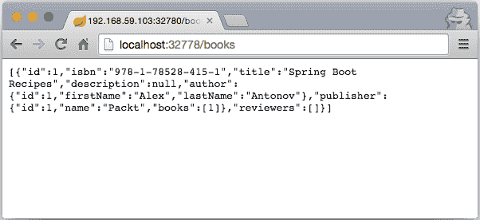
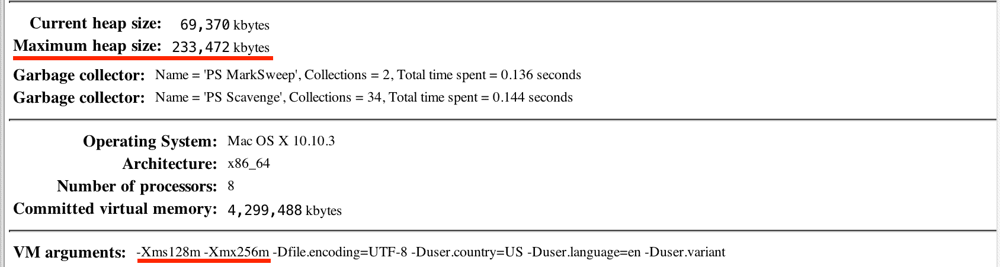
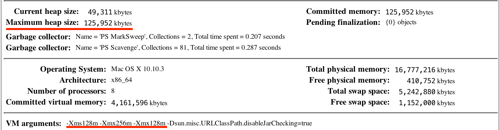

# 第六章：应用程序打包和部署

在本章中，我们将涵盖以下主题：

+   创建 Spring Boot 可执行 JAR 文件

+   创建 Docker 镜像

+   构建自执行二进制文件

+   Spring Boot 环境配置、层次结构和优先级

+   使用 EnvironmentPostProcessor 向环境中添加自定义 PropertySource

+   使用属性文件外部化环境配置

+   使用环境变量外部化环境配置

+   使用 Java 系统属性外部化环境配置

+   使用 JSON 外部化环境配置

+   设置 Consul

+   使用 Consul 和 envconsul 外部化环境配置

# 简介

一个应用程序如果没有被使用，那还有什么意义？在当今这个时代——当 DevOps 成为软件开发的方式，当云成为王者，当构建微服务被认为是应该做的事情时——很多注意力都集中在应用程序如何在指定的环境中打包、分发和部署。

十二要素应用方法在定义现代 **软件即服务** (**SaaS**) 应用程序应该如何构建和部署方面发挥了关键作用。其中一个关键原则是将环境配置定义与应用程序和存储分离。十二要素应用方法还倾向于依赖项的隔离和捆绑、开发与生产一致性、以及应用程序部署的简便性和可丢弃性，以及其他方面。

十二要素应用方法可以在 [`12factor.net/`](http://12factor.net/) 找到。

DevOps 模型还鼓励我们对自己的应用程序拥有完整的所有权，从编写和测试代码到构建和部署。如果我们想要承担这种所有权，我们需要确保维护和运营成本不会过高，并且不会占用我们开发新功能的主要任务太多时间。这可以通过拥有干净、定义良好且隔离的部署工件来实现，这些工件是自包含的、自执行的，并且可以在任何环境中部署而无需重新构建。

以下食谱将指导我们完成所有必要的步骤，以实现低努力度的部署和维护，同时保持代码的干净和优雅。

# 创建 Spring Boot 可执行 JAR 文件

Spring Boot 的魔力如果没有提供一种优雅的方式来打包整个应用程序，包括所有依赖项、资源等，在一个复合的可执行 JAR 文件中，那就不会完整。JAR 文件创建后，只需运行 `java -jar <name>.jar` 命令即可简单地启动。

我们将继续使用前几章中构建的应用程序代码，并添加必要的功能以打包它。让我们继续看看如何创建 Spring Boot Uber JAR。

Uber JAR 通常被称为一个封装在单个复合 JAR 文件中的应用程序包，该文件内部包含一个`/lib`目录，其中包含所有依赖的内部 JAR，以及可选的包含可执行文件的`/bin`目录。

# 如何做...

1.  让我们从第五章，“应用测试”，进入代码目录，并执行`./gradlew clean build`

1.  在构建了 Uber JAR 之后，让我们通过执行`java -jar build/libs/ch6-0.0.1-SNAPSHOT.jar`来启动应用程序

1.  这将导致我们的应用程序在以下控制台输出的 JAR 文件中运行：

```java
      .   ____          _            __ _ _
    /\ / ___'_ __ _ _(_)_ __  __ _ 
    ( ( )___ | '_ | '_| | '_ / _` | 
     \/  ___)| |_)| | | | | || (_| |  ) ) ) )
      '  |____| .__|_| |_|_| |___, | / / / /
     =========|_|==============|___/=/_/_/_/
     :: Spring Boot ::  (v2.0.0.BUILD-SNAPSHOT)
    ...
    (The rest is omitted for conciseness)
    ...
    2017-12-17 INFO: Registering beans for JMX exposure on startup
    2017-12-17 INFO: Tomcat started on port(s): 8080 (http) 8443  
    (https)
    2017-12-17 INFO: Welcome to the Book Catalog System!
    2017-12-17 INFO: BookRepository has 1 entries
    2017-12-17 INFO: ReviewerRepository has 0 entries
    2017-12-17 INFO: PublisherRepository has 1 entries
    2017-12-17 INFO: AuthorRepository has 1 entries
    2017-12-17 INFO: Started BookPubApplication in 12.156 seconds (JVM 
    running for 12.877)
    2017-12-17 INFO: Number of books: 1

```

# 它是如何工作的...

如你所见，获取打包的可执行 JAR 文件相当简单。所有的魔法代码都已经编码并提供给我们，作为 Spring Boot Gradle 插件的组成部分。插件的添加增加了许多任务，允许我们打包 Spring Boot 应用程序，运行它，并构建 JAR、TAR、WAR 文件等。例如，我们一直在本书中使用到的`bootRun`任务，是由 Spring Boot Gradle 插件提供的。我们可以通过执行`./gradlew tasks`来查看可用的 Gradle 任务列表。当我们运行此命令时，我们将得到以下输出：

```java
    ------------------------------------------------------------
    All tasks runnable from root project
    ------------------------------------------------------------

    Application tasks
    -----------------
    bootRun - Run the project with support for auto-detecting main 
    class and reloading static resources
    run - Runs this project as a JVM application

    Build tasks
    -----------
    assemble - Assembles the outputs of this project.
    bootJar - Assembles an executable jar archive containing the main 
    classes and their dependencies.
    build - Assembles and tests this project.
    buildDependents - Assembles and tests this project and all projects 
    that depend on it.
    buildNeeded - Assembles and tests this project and all projects it 
    depends on.
    classes - Assembles classes 'main'.
    clean - Deletes the build directory.
    jar - Assembles a jar archive containing the main classes.
    testClasses - Assembles classes 'test'.

    Build Setup tasks
    -----------------
    init - Initializes a new Gradle build. [incubating]

    Distribution tasks
    ------------------
    assembleBootDist - Assembles the boot distributions
    assembleDist - Assembles the main distributions
    bootDistTar - Bundles the project as a distribution.
    bootDistZip - Bundles the project as a distribution.
    distTar - Bundles the project as a distribution.
    distZip - Bundles the project as a distribution.
    installBootDist - Installs the project as a distribution as-is.
    installDist - Installs the project as a distribution as-is.      
```

上述输出并不完整；我已经排除了非相关任务组，如 IDE、文档等，但你将在控制台上看到它们。在任务列表中，我们将看到`bootRun`、`bootJar`和其他任务。这些任务是由 Spring Boot Gradle 插件添加的，执行它们会将所需的 Spring Boot 步骤添加到构建管道中。如果你执行`./gradlew tasks --all`，你将看到实际的任务依赖关系，这将不仅打印出可见的任务，还包括依赖的内部任务和任务依赖关系。例如，当我们运行`build`任务时，以下所有依赖任务也被执行了：

```java
    build - Assembles and tests this project. [assemble, check]
    assemble - Assembles the outputs of this project. [bootJar, 
    distTar, distZip, jar]

```

你可以看到，`build`任务会执行`assemble`任务，然后它会调用`bootJar`，实际上 Uber JAR 的创建就在这里进行。

插件还提供了一些非常实用的配置选项。虽然我不会详细介绍所有这些选项，但我将提到两个我认为非常有用的选项：

```java
bootJar { 
  classifier = 'exec' 
  baseName = 'bookpub' 
} 
```

此配置允许我们指定可执行 JAR 文件的`classifier`以及 JAR 的`baseName`，这样常规 JAR 中只包含应用程序代码，而可执行 JAR 则带有`classifier`名称，例如`bookpub-0.0.1-SNAPSHOT-exec.jar`。

另一个有用的配置选项允许我们指定哪些依赖 JAR 需要解包，因为出于某种原因，它们不能作为嵌套内部 JAR 包含在内。当你需要某些内容在系统`Classloader`中可用时，例如通过启动系统属性设置自定义的`SecurityManager`，这会非常有用：

```java
bootJar { 
  requiresUnpack = '**/some-jar-name-*.jar' 
} 
```

在这个例子中，当应用程序启动时，`some-jar-name-1.0.3.jar` 依赖项的内容将被解压缩到文件系统上的一个临时文件夹中。

# 创建 Docker 镜像

Docker，Docker，Docker！我在我参加的所有会议和科技聚会上越来越频繁地听到这个短语。Docker 的到来受到了社区的欢迎，它立刻成为了热门。Docker 生态系统正在迅速扩张，许多其他公司提供服务、支持和补充框架，如 **Apache Mesos**、Amazon Elastic Beanstalk、ECS 和 Kubernetes，仅举几例。甚至微软也在他们的 Azure 云服务中提供 Docker 支持，并与 Docker 合作将 Docker 带到 Windows 操作系统。

Docker 极其受欢迎的原因在于其能够以自包含容器形式打包和部署应用程序。这些容器比传统的完整虚拟机更轻量。可以在单个操作系统实例上运行多个容器，因此与传统的虚拟机相比，可以在相同的硬件上部署更多的应用程序。

在这个菜谱中，我们将探讨如何将我们的 Spring Boot 应用程序打包成 Docker 镜像，以及如何部署和运行它。

在您的开发机器上构建 Docker 镜像并运行它是可行的，但这并不像能够与世界分享那样有趣。您需要将其发布到某个地方以便部署，尤其是如果您打算在亚马逊或其他类似云环境中使用它。幸运的是，Docker 不仅为我们提供了容器解决方案，还提供了位于 [`hub.docker.com`](https://hub.docker.com) 的仓库服务 Docker Hub，我们可以在那里创建仓库并发布我们的 Docker 镜像。所以把它想象成 Docker 的 Maven Central。

# 如何做到这一点...

1.  第一步是在 Docker Hub 上创建账户，这样我们就可以发布我们的镜像。访问 [`hub.docker.com`](https://hub.docker.com) 并创建账户。如果您有 GitHub 账户，您也可以使用它登录。

1.  一旦您拥有账户，我们需要创建一个名为 `springbootcookbook` 的仓库。

1.  创建了账户后，现在是构建镜像的时候了。为此，我们将使用 Gradle Docker 插件之一。我们将首先更改 `build.gradle` 以修改 `buildscript` 块，进行以下更改：

```java
buildscript { 
  dependencies { 
    classpath("org.springframework.boot:spring-boot-gradle- 
      plugin:${springBootVersion}") 
    classpath("se.transmode.gradle:gradle-docker:1.2") 
  } 
} 
```

1.  我们还需要通过在 `build.gradle` 文件中添加 `apply plugin: 'docker'` 指令来应用此插件。

1.  我们还需要明确地将 `application` 插件添加到 `build.gradle` 中，因为它不再由 Spring Boot Gradle 插件自动包含。

1.  将 `apply plugin: 'application'` 添加到 `build.gradle` 文件中的插件列表中。

1.  最后，我们还需要将以下 Docker 配置添加到 `build.gradle` 文件中：

```java
task distDocker(type: Docker,  
                overwrite: true,  
                dependsOn: bootDistTar) { 
    group = 'docker' 
    description = "Packs the project's JVM application
    as a Docker image." 

    inputs.files project.bootDistTar 
    def installDir = "/" + project.bootDistTar.archiveName  
                         - ".${project.bootDistTar.extension}" 

    doFirst { 
        tag "ch6" 
        push false 
        exposePort 8080 
        exposePort 8443 
        addFile file("${System.properties['user.home']}
        /.keystore"), "/root/" 
        applicationName = project.applicationName 
        addFile project.bootDistTar.outputs.files.singleFile 

        entryPoint = ["$installDir/bin/${project.applicationName}"] 
    } 
} 
```

1.  假设您已经在您的机器上安装了 Docker，我们可以通过执行 `./gradlew clean distDocker` 来创建镜像。

1.  关于 Docker 安装说明，请访问位于 [`docs.docker.com/installation/#installation`](https://docs.docker.com/installation/#installation) 的教程。如果一切顺利，您应该会看到以下输出：

```java
> Task :distDocker
Sending build context to Docker daemon  68.22MB
  Step 1/6 : FROM aglover/java8-pier
   ---> 3f3822d3ece5
  Step 2/6 : EXPOSE 8080
   ---> Using cache
   ---> 73717aaca6f3
  Step 3/6 : EXPOSE 8443
   ---> Using cache
   ---> 6ef3c0fc3d2a
  Step 4/6 : ADD .keystore /root/
   ---> Using cache
   ---> 6efebb5a868b
  Step 5/6 : ADD ch6-boot-0.0.1-SNAPSHOT.tar /
   ---> Using cache
   ---> 0634eace4952
  Step 6/6 : ENTRYPOINT /ch6-boot-0.0.1-SNAPSHOT/bin/ch6
   ---> Using cache
   ---> 39a853b7ddbb
  Successfully built 39a853b7ddbb
  Successfully tagged ch6:0.0.1-SNAPSHOT

  BUILD SUCCESSFUL
  Total time: 1 mins 0.009 secs. 
```

1.  我们也可以执行以下 Docker 镜像命令，以便查看新创建的镜像：

```java
$ docker images
REPOSITORY           TAG                IMAGE ID         CREATED             VIRTUAL  SIZE
ch6                  0.0.1-SNAPSHOT     39a853b7ddbb     17 minutes ago      1.04 GB
aglover/java8-pier   latest             69f4574a230e     11 months ago       1.01 GB
```

1.  成功构建了镜像后，我们现在可以通过执行以下命令在 Docker 中启动它：

```java
docker run -d -P ch6:0.0.1-SNAPSHOT.  
```

1.  容器启动后，我们可以通过 `docker ps` 命令查询 Docker 仓库的端口绑定，以便我们可以访问我们服务的 HTTP 端点。这可以通过 `docker ps` 命令完成。如果容器运行成功，我们应该看到以下结果（名称和端口可能会有所不同）：

```java
    CONTAINER ID        IMAGE               COMMAND               
    CREATED             STATUS              PORTS                                                  
    NAMES
    37b37e411b9e        ch6:latest         "/ch6-boot-0.0.1-S..." 
    10 minutes ago      Up 10 minutes       0.0.0.0:32778-
    >8080/tcp,      0.0.0.0:32779->8443/tcp   drunk_carson

```

1.  从这个输出中，我们可以看出内部端口 `8080` 的端口映射已经设置为 `32778`（您的端口在每次运行时可能会有所不同）。让我们在浏览器中打开 `http://localhost:32778/books`，以查看我们的应用程序的实际运行情况，如下面的截图所示：



如果您使用 macOS X 和 `boot2docker`，那么您将不会在本地运行 Docker 容器。在这种情况下，您将使用 `boot2docker ip` 而不是本地主机来连接到应用程序。有关如何使 `boot2docker` 集成更简单的更多提示，请访问 [`viget.com/extend/how-to-use-docker-on-os-x-the-missing-guide`](http://viget.com/extend/how-to-use-docker-on-os-x-the-missing-guide)。还可以使用由 Ian Sinnott 慷慨提供的漂亮的 Docker 外壳，它将自动启动 boot2docker 并处理环境变量。要获取包装器，请访问 [`gist.github.com/iansinnott/0a0c212260386bdbfafb`](https://gist.github.com/iansinnott/0a0c212260386bdbfafb)。

# 它是如何工作的...

在前面的例子中，我们看到了如何轻松地将我们的 `build` 包在 Docker 容器中。Gradle-Docker 插件负责创建 `Dockerfile`、构建镜像和发布的大部分工作；我们只需要给它一些指令，说明我们希望镜像如何构建。因为 Spring Boot Gradle 插件使用 `boot` 分发，所以 Gradle-Docker 插件不知道它需要使用一个 bootified TAR 归档。为了帮助解决这个问题，我们覆盖了 `distDocker` 任务。让我们详细检查这些指令：

+   `group` 和 `description` 属性仅有助于在执行 `./gradlew tasks` 命令时正确显示任务。

+   `inputs.files project.bootDistTar` 指令非常重要。这是指导 `distDocker` 任务使用 Spring Boot 分发创建的 TAR 归档，而不是通用的归档。

+   `def installDir = "/" + project.bootDistTar.archiveName - ".${project.bootDistTar.extension}"` 指令正在创建一个变量，包含解压缩的工件将被放置在 Docker 容器内的目录。

+   `exposePort` 指令告诉插件向 Dockerfile 添加一个 `EXPOSE <port>` 指令，这样当我们的容器启动时，它将通过端口映射将这些内部端口暴露给外部。我们在运行 `docker ps` 命令时看到了这种映射。

+   `addFile` 指令告诉插件向 Dockerfile 添加一个 `ADD <src> <dest>` 指令，这样在构建容器时，我们将从容器镜像中的文件系统复制源文件系统中的文件。在我们的例子中，我们需要复制 `.keystore` 证书文件，这是我们之前在配置 HTTPS 连接器时设置的，我们在 `tomcat.https.properties` 中指示它从 `${user.home}/.keystore` 加载。现在，我们需要它在 `/root/` 目录中，因为在容器中，我们的应用程序将在 root 用户下执行。（这可以通过更多的配置来更改。）

Gradle-Docker 插件默认使用项目名称作为镜像名称。项目名称反过来由 Gradle 从项目的目录名称推断，除非配置了显式的属性值。由于代码示例是关于 第六章，“应用程序打包和部署”，项目目录被命名为 `ch6`，因此镜像名称。项目名称可以通过在 `gradle.properties` 中添加 `name='some_project_name'` 来显式配置。

如果你查看生成的 Dockerfile，它可以在项目的根目录下的 `build/docker/` 目录中找到，你会看到以下两个指令：

```java
ADD ch6-boot-0.0.1-SNAPSHOT.tar / 
ENTRYPOINT ["/ch6-boot-0.0.1-SNAPSHOT/bin/ch6"] 
```

`ADD` 指令添加了由 `bootDistTar` 任务生成的 TAR 应用程序存档，其中包含我们的应用程序作为 tarball 打包。我们甚至可以通过执行 `tar tvf build/distributions/ch6-boot-0.0.1-SNAPSHOT.tar` 来查看生成的 tarball 的内容。在构建容器的过程中，TAR 文件的内容将被提取到容器中的 `/` 目录，并随后用于启动应用程序。

接着是 `ENTRYPOINT` 指令。这告诉 Docker 在容器启动后执行 `/ch6-boot-0.0.1-SNAPSHOT/bin/ch6`，这是我们作为 tarball 内容的一部分看到的，从而自动启动我们的应用程序。

Dockerfile 的第一行，即 `FROM aglover/java8-pier`，是使用 `aglover/java8-pier` 镜像的指令，该镜像包含安装了 Java 8 的 Ubuntu OS，作为我们容器的基镜像，我们将在此镜像上安装我们的应用程序。这个镜像来自 Docker Hub 仓库，并且插件会自动使用它，但可以通过配置设置来更改，如果需要的话。

如果你已在 Docker Hub 上创建了账户，我们还可以将创建的 Docker 镜像发布到注册库。作为公平警告，生成的镜像大小可能达到数百兆字节，因此上传可能需要一些时间。要发布此镜像，我们需要将标签更改为 `tag "<docker hub username>/<docker hub repository name>"` 并在 `build.gradle` 中的 `distDocker` 任务定义中添加 `push true` 设置：

```java
task distDocker(type: Docker,  
                overwrite: true,  
                dependsOn: bootDistTar) { 
    ... 
    doFirst { 
        tag "<docker hub username>/<docker hub repository name>" 
        push true 
        ... 
    } 
} 
```

`tag` 属性设置创建的镜像标签，默认情况下，插件假定它位于 Docker Hub 仓库中。如果 `push` 配置设置为 `true`（正如我们的情况一样），它将在这里发布。

要查看所有 Gradle-Docker 插件配置选项的完整列表，请查看 [`github.com/Transmode/gradle-docker`](https://github.com/Transmode/gradle-docker) GitHub 项目页面。

当启动 Docker 镜像时，我们使用 `-d` 和 `-P` 命令行参数。它们的使用如下：

+   `-d`：此参数表示希望以分离模式运行容器，其中进程在后台启动

+   `-P`：此参数指示 Docker 将所有内部公开的端口发布到外部，以便我们可以访问它们

要详细了解所有可能的命令行选项，请参阅 [`docs.docker.com/reference/commandline/cli/`](https://docs.docker.com/engine/reference/commandline/cli/)。

# 构建自执行二进制文件

自 Spring Boot 版本 1.3 以来，Gradle 和 Maven 插件支持生成真正的可执行二进制文件的功能。这些看起来像普通的 JAR 文件，但它们的 JAR 内容与包含命令构建逻辑的启动脚本融合在一起，能够无需显式执行 `java -jar file.jar` 命令即可自我启动。这种功能非常有用，因为它允许轻松配置 Linux 自动启动服务，如 `init.d` 或 `systemd`，以及 macOS X 上的 `launchd`。

# 准备工作

对于这个配方，我们将使用现有的应用程序构建。我们将检查自启动的可执行 JAR 文件是如何创建的，以及如何修改默认的启动脚本以添加对自定义 JVM 启动参数的支持，例如 `-D` 启动系统属性、JVM 内存、垃圾回收和其他设置。

对于这个配方，请确保 `build.gradle` 正在使用 Spring Boot 版本 2.0.0 或更高版本。如果不是，请在 `buildscript` 配置块中更改以下设置：

```java
ext { 
  springBootVersion = '2.0.0.BUILD-SNAPSHOT' 
} 
```

应在 `db-counter-starter/build.gradle` 文件中执行相同的 Spring Boot 版本升级。

# 如何操作...

1.  构建默认的自执行 JAR 文件非常简单；实际上，一旦我们执行 `./gradlew clean bootJar` 命令，它就会自动完成。

1.  我们可以通过简单地调用 `./build/libs/bookpub-0.0.1-SNAPSHOT.jar` 来启动创建的应用程序。

1.  在企业环境中，我们很少对默认的 JVM 启动参数感到满意，因为我们经常需要调整内存设置、GC 配置，甚至传递启动系统属性，以确保我们使用的是所需的 XML 解析器版本或类加载器或安全管理器的专有实现。为了满足这些需求，我们将修改默认的 `launch.script` 文件以添加对 JVM 选项的支持。让我们首先从项目的根目录中复制默认的 `launch.script` 文件到 [`github.com/spring-projects/spring-boot/blob/master/spring-boot-project/spring-boot-tools/spring-boot-loader-tools/src/main/resources/org/springframework/boot/loader/tools/launch.script`](https://github.com/spring-projects/spring-boot/blob/master/spring-boot-project/spring-boot-tools/spring-boot-loader-tools/src/main/resources/org/springframework/boot/loader/tools/launch.script) Spring Boot GitHub 仓库。

`launch.script` 文件仅在 Linux 和 OS X 环境中得到支持。如果您想为 Windows 创建可执行的 JAR 文件，您需要提供自己的 `launch.script` 文件，该文件针对 Windows 壳命令执行进行了定制。好消息是，这仅是所需的一项特殊事项；本食谱中的所有说明和概念在 Windows 上也能正常工作，前提是使用符合规范的 `launch.script` 模板。

1.  我们将修改复制的 `launch.script` 文件，并在 *第 142 行* 标记上方添加以下内容（这里只显示脚本的相关部分，以便压缩空间）：

```java
...
# Find Java
if [[ -n "$JAVA_HOME" ]] &amp;&amp; [[ -x "$JAVA_HOME/bin/java" ]]; then
javaexe="$JAVA_HOME/bin/java"
elif type -p java 2>&amp;1> /dev/null; then
javaexe=java
elif [[ -x "/usr/bin/java" ]]; then
javaexe="/usr/bin/java"
else
echo "Unable to find Java"
exit 1
fi
# Configure JVM Options
jvmopts="{{jvm_options:}}"
arguments=(-Dsun.misc.URLClassPath.disableJarChecking=true $jvmopts $JAVA_OPTS -jar $jarfile $RUN_ARGS "$@")
# Action functions
start() {
...
```

1.  在放置了自定义的 `launch.script` 文件后，我们需要在我们的 `build.gradle` 文件中添加选项设置，内容如下：

```java
applicationDefaultJvmArgs = [ 
    "-Xms128m", 
    "-Xmx256m" 
] 

bootJar { 
    classifier = 'exec' 
    baseName = 'bookpub' 
    launchScript { 
        script = file('launch.script') 
        properties 'jvm_options' : applicationDefaultJvmArgs.join(' ') 
    } 
} 
```

1.  现在，我们已经准备好启动我们的应用程序。首先，让我们使用 `./gradlew clean bootRun` 命令，然后查看 JConsole 的 VM 概述选项卡，我们会看到我们的参数确实已经传递给了 JVM，如下所示：

1.  我们还可以通过运行 `./gradlew clean bootJar` 命令来构建自启动的可执行 JAR 文件，然后执行 `./build/libs/bookpub-0.0.1-SNAPSHOT-exec.jar` 以启动我们的应用程序。我们应该在 JConsole 中看到类似的结果。

1.  或者，我们也可以使用 `JAVA_OPTS` 环境变量来覆盖一些 JVM 参数。比如说，我们想将最小堆内存大小更改为 128 兆字节。我们可以使用 `JAVA_OPTS=-Xmx128m ./build/libs/bookpub-0.0.1-SNAPSHOT-exec.jar` 命令来启动我们的应用程序，并在 JConsole 中看到以下效果：



# 它是如何工作的...

通过对 `launch.script` 的小幅定制，我们能够创建一个自执行的部署应用程序，打包为一个自包含的 JAR 文件，除了其他一切之外，还可以配置为使用各种操作系统特定的自动启动框架启动。

Spring Boot Gradle 和 Maven 插件为我们提供了大量的参数自定义选项，甚至可以在 `launch.script` 中嵌入类似 mustache 的模板占位符，这些占位符可以在构建时替换为值。我们已经利用了这一功能，通过 `launchScript{properties}` 配置设置将我们的 JVM 参数注入到文件中。

在我们自定义的 `launch.script` 版本中，我们添加了 `jvmopts="{{jvm_options:}}"` 行，该行将在构建和打包时替换为 `jvm_options` 参数的值。此参数在我们的 `build.gradle` 文件中声明为 `launchScript.properties` 参数 `: launchScript{properties 'jvm_options' : applicationDefaultJvmArgs.join(' ')}` 的值。

JVM 参数可以硬编码，但保持我们的应用程序使用 `bootRun` 任务启动的方式和从自执行 JAR 启动时启动的方式之间的一致性要好得多。为了实现这一点，我们将使用为 `bootRun` 执行目的定义的相同的 `applicationDefaultJvmArgs` 参数集合，只是将所有不同的参数折叠成一行文本，由空格分隔。使用这种方法，我们只需要定义一次 JVM 参数，并在两种执行模式中使用它们。

重要的是要注意，这种重用也适用于使用 Gradle 的 `application` 插件以及 Spring Boot Gradle 的 `bootDistZip` 和 `bootDistTar` 定义的 `distZip` 和 `distTar` 任务构建的应用程序分发。

我们可以通过启动我们的自执行 JAR 文件而不是默认情况下由 `distTar` 任务生成的 TAR 文件内容来修改构建以创建 Docker 镜像。为此，我们需要使用以下代码更改我们的 `distDocker` 配置块：

```java
task distDocker(type: Docker, overwrite: true, 
                dependsOn: bootJar) { 
  ... 
  inputs.files project.bootJar 
  doFirst { 
    ... 
    addFile file("${System.properties['user.home']}/.keystore"), 
       "/root/" 
    applicationName = project.applicationName 
    addFile project.bootJar.outputs.files.singleFile 

    def executableName = "/" + 
       project.bootJar.outputs.files.singleFile.name 
    entryPoint = ["$executableName"] 
  } 
} 
```

这将使我们的 `distDocker` 任务将可执行 JAR 文件放入 Docker 镜像中，而不是 TAR 存档。

# Spring Boot 环境配置、层次结构和优先级

在之前的几个配方中，我们探讨了如何以各种方式打包我们的应用程序以及如何部署它。下一步合乎逻辑的步骤是需要配置应用程序，以便提供一些行为控制以及一些特定环境的配置值，这些值可能会并且很可能会根据环境的不同而不同。

这种环境配置差异的常见例子是数据库设置。我们当然不希望在我们的开发机器上运行的应用程序连接到生产环境数据库。也存在我们希望应用程序以不同的模式运行或使用不同的配置文件集的情况，正如 Spring 所称呼的那样。一个例子可能是以实时或模拟模式运行应用程序。

对于这个食谱，我们将从代码库的先前状态开始，添加对不同配置配置文件的支持，并检查如何将属性值用作其他属性中的占位符。

# 如何做到...

1.  我们首先通过更改位于项目根目录`src/main/java/org/test/bookpub`目录中的`BookPubApplication.java`文件中`schedulerRunner(...)`方法的定义，向`schedulerRunner`的`@Bean`创建中添加一个`@Profile`注解，内容如下：

```java
@Bean 
@Profile("logger") 
public StartupRunner schedulerRunner() { 
    return new StartupRunner(); 
} 
```

1.  通过运行`./gradlew clean bootRun`来启动应用程序。

1.  一旦应用程序启动，我们就不再应该看到来自`StartupRunner`类的先前日志输出，它看起来像这样：

```java
2017-12-17 --- org.test.bookpub.StartupRunner : Number of books: 1
```

1.  现在，让我们通过运行`./gradlew clean bootJar`来构建应用程序，并通过运行`./build/libs/bookpub-0.0.1-SNAPSHOT-exec.jar --spring.profiles.active=logger`来启动它；我们将再次看到日志输出行出现。

1.  由配置选择器启用的另一个功能是能够添加特定配置文件的属性文件。让我们在项目根目录`src/main/resources`目录下创建一个名为`application-inmemorydb.properties`的文件，内容如下：

```java
spring.datasource.url = jdbc:h2:mem:testdb;DB_CLOSE_DELAY=-1;DB_CLOSE_ON_EXIT=FALSE 
```

1.  让我们通过运行`./gradlew clean bootJar`来构建应用程序，并通过运行`./build/libs/bookpub-0.0.1-SNAPSHOT-exec.jar --spring.profiles.active=logger,inmemorydb`来启动它，这将使用`inmemorydb`配置文件配置来使用内存数据库而不是基于文件的数据库。

# 它是如何工作的...

在这个食谱中，我们尝试了使用配置文件并根据活动配置文件应用额外的配置设置。配置文件首次在 Spring Framework 3.2 中引入，用于根据活动配置文件有条件地配置上下文中的 bean。在 Spring Boot 中，这个功能得到了进一步的扩展，允许配置分离。

通过在我们的 `StartupRunner@Bean` 创建方法上放置一个 `@Profile("logger")` 注解，Spring 将被指示仅在日志记录器配置文件被激活时创建该 Bean。通常，这是通过在应用程序启动期间通过命令行传递 `--spring.profiles.active` 选项来完成的。在测试中，另一种实现方式是在 `Test` 类上使用 `@ActiveProfiles("profile")` 注解，但这不支持正常应用程序的执行。也可以否定配置文件，例如 `@Profile("!production")`。当使用此类注解（`!` 标记否定）时，只有在没有活动生产配置文件的情况下才会创建 Bean。

在启动过程中，Spring Boot 将通过命令行传递的所有选项视为应用程序属性，因此启动过程中传递的任何内容最终都会成为可以使用的属性值。这种相同的机制不仅适用于新属性，还可以用作覆盖现有属性的方法。让我们设想一个场景，即我们已经在 `application.properties` 文件中定义了一个活动配置文件，如下所示：`spring.profiles.active=basic`。通过命令行传递 `--spring.profiles.active=logger` 选项，我们将替换活动配置文件从 `basic` 更改为 `logger`。如果我们想包含一些配置文件而不管活动配置如何，Spring Boot 提供了一个 `spring.profiles.include` 选项来配置。以这种方式设置的任何配置文件都将被添加到活动配置文件列表中。

由于这些选项不过是常规的 Spring Boot 应用程序属性，它们都遵循相同的覆盖优先级层次结构。选项概述如下：

+   **命令行参数**：这些值覆盖列表中的所有其他属性源，你可以始终确信通过 `--property.name=value` 传递的内容将优先于其他方式。

+   **JNDI 属性**：它们在优先级顺序中排在下一级。如果你使用的是提供数据的应用程序容器，并且通过 JNDI `java:comp/env` 命名空间提供数据，这些值将覆盖下面所有其他设置。

+   **Java 系统属性**：这些值是另一种将属性传递给应用程序的方式，无论是通过 `-Dproperty=name` 命令行参数还是通过在代码中调用 `System.setProperty(...)`。它们提供了另一种替换现有属性的方法。来自 `System.getProperty(...)` 的任何内容都将覆盖列表中的其他内容。

+   **操作系统环境变量**：无论是来自 Windows、Linux、OS X 还是任何其他操作系统，它们都是指定配置的常见方式，特别是对于位置和值。最著名的一个是`JAVA_HOME`，它通常用来指示 JVM 在文件系统中的位置。如果前面的设置都不存在，将使用`ENV`变量而不是以下提到的变量来为属性值：

由于操作系统环境变量通常不支持点（`.`）或破折号（`-`），Spring Boot 提供了一个自动重映射机制，在属性评估期间将下划线（`_`）替换为点（`.`）；它还处理大小写转换。因此，`JAVA_HOME`与`java.home`同义。

+   `random.*`：这为原始类型的随机值提供了特殊支持，可以用作配置属性中的占位符。例如，我们可以定义一个名为`some.number=${random.int}`的属性，其中`${random.int}`将被某个随机整数值替换。对于文本值，同样适用于`${random.value}`，对于长整型则适用于`${random.long}`。

+   `application-{profile}.properties`：它们是特定配置文件的文件，只有当相应的配置文件被激活时才会应用。

+   `application.properties`：它们是主要属性文件，包含基本/默认应用程序配置。与特定配置文件类似，这些值可以从以下位置加载，其中最高优先级高于较低条目：

    +   `file:config/`：这是位于当前目录中的`/config`目录：

    +   `file:`：这是当前目录

    +   `classpath:/config`：这是类路径中的一个`/config`包

    +   `classpath:`：这是类路径的根

+   **使用@PropertySource 注解的@Configuration 类**：这些是在代码中使用注解配置的任何内联属性源。我们在第三章的“添加自定义连接器”配方中看到了这样的用法，*Web 框架行为调整*。它们在优先级链中非常低，并且只由默认属性 precede。

+   **默认属性**：它们通过调用`SpringApplication.setDefaultProperties(...)`进行配置，很少使用，因为它感觉非常像在代码中硬编码值而不是在外部配置文件中外部化它们。

# 使用 EnvironmentPostProcessor 向环境添加自定义 PropertySource

在企业已经使用特定配置系统的情况下，无论是自定义编写还是现成的，Spring Boot 为我们提供了一个通过创建自定义`PropertySource`实现来将此集成到应用程序中的功能。

# 如何做到这一点...

让我们假设我们有一个现有的配置设置，它使用流行的 Apache Commons Configuration 框架，并将配置数据存储在 XML 文件中：

1.  为了模拟我们假设的现有配置系统，将以下内容添加到`build.gradle`文件的依赖部分：

```java
dependencies { 
  ... 
  compile project(':db-count-starter') 
  compile("commons-configuration:commons-
     configuration:1.10") 
  compile("commons-codec:commons-codec:1.6") 
  compile("commons-jxpath:commons-jxpath:1.3") 
  compile("commons-collections:commons-collections:3.2.1") 
  runtime("com.h2database:h2") 
  ... 
} 
```

1.  接下来，在项目根目录下的`src/main/resources`目录中创建一个简单的配置文件`commons-config.xml`，内容如下：

```java
<?xml version="1.0" encoding="ISO-8859-1" ?> 
<config> 
  <book> 
    <counter> 
      <delay>1000</delay> 
      <rate>${book.counter.delay}0</rate> 
    </counter> 
  </book> 
</config> 
```

1.  然后，我们将在项目根目录下的`src/main/java/org/test/bookpub`目录中创建一个名为`ApacheCommonsConfigurationPropertySource.java`的`PropertySource`实现文件，内容如下：

```java
public class ApacheCommonsConfigurationPropertySource 
   extends EnumerablePropertySource<XMLConfiguration> { 
  private static final Log logger = LogFactory.getLog(
   ApacheCommonsConfigurationPropertySource.class); 

  public static final String 
     COMMONS_CONFIG_PROPERTY_SOURCE_NAME = "commonsConfig"; 

  public ApacheCommonsConfigurationPropertySource(
     String name, XMLConfiguration source) { 
    super(name, source); 
  } 

  @Override 
  public String[] getPropertyNames() { 
    ArrayList<String> keys = 
       Lists.newArrayList(this.source.getKeys()); 
    return keys.toArray(new String[keys.size()]); 
  } 

  @Override 
  public Object getProperty(String name) { 
    return this.source.getString(name); 
  } 

  public static void addToEnvironment(
     ConfigurableEnvironment environment, XMLConfiguration 
       xmlConfiguration) { 
    environment.getPropertySources().addAfter(
      StandardEnvironment.
        SYSTEM_ENVIRONMENT_PROPERTY_SOURCE_NAME, new 
          ApacheCommonsConfigurationPropertySource( 
           COMMONS_CONFIG_PROPERTY_SOURCE_NAME, 
             xmlConfiguration)); 
    logger.trace("ApacheCommonsConfigurationPropertySource 
      add to Environment"); 
  } 
} 
```

1.  现在，我们将创建`EnvironmentPostProcessor`实现类，以便在项目根目录下的`src/main/java/org/test/bookpub`目录中启动我们的名为`ApacheCommonsConfigurationEnvironmentPostProcessor.java`的`PropertySource`，内容如下：

```java
package com.example.bookpub;

import org.apache.commons.configuration.ConfigurationException;
import org.apache.commons.configuration.XMLConfiguration;
import org.springframework.boot.SpringApplication;
import org.springframework.boot.env.EnvironmentPostProcessor;
import org.springframework.core.env.ConfigurableEnvironment;

public class ApacheCommonsConfigurationEnvironmentPostProcessor  
       implements EnvironmentPostProcessor {

    @Override
    public void postProcessEnvironment( 
                   ConfigurableEnvironment environment,  
                   SpringApplication application) {
        try {
            ApacheCommonsConfigurationPropertySource 
               .addToEnvironment(environment,
                    new XMLConfiguration("commons- 
                                         config.xml"));
        } catch (ConfigurationException e) {
            throw new RuntimeException("Unable to load commons-config.xml", e);
        }
    }
} 
```

1.  最后，我们需要在项目根目录下的`src/main/resources`目录中创建一个名为`META-INF`的新目录，并在其中创建一个名为`spring.factories`的文件，内容如下：

```java
# Environment Post Processors
org.springframework.boot.env.EnvironmentPostProcessor=\
com.example.bookpub.ApacheCommonsConfigurationEnvironmentPostProcessor 
```

1.  设置完成后，我们现在可以开始在应用中使用我们的新属性了。让我们更改位于项目根目录下的`src/main/java/org/test/bookpub`目录中的`StartupRunner`类的`@Scheduled`注解的配置，如下所示：

```java
@Scheduled(initialDelayString = "${book.counter.delay}", 
   fixedRateString = "${book.counter.rate}") 
```

1.  通过运行`./gradlew clean bootJar`来构建应用，并通过`./build/libs/bookpub-0.0.1-SNAPSHOT-exec.jar --spring.profiles.active=logger`来启动它，以确保我们的`StartupRunner`类仍然每十秒记录一次书籍数量，正如预期的那样。

# 它是如何工作的...

在这个菜谱中，我们探讨了如何添加我们自己的自定义`PropertySource`，这使我们能够连接 Spring Boot 环境中的现有系统。让我们看看这些组件是如何协同工作的内部机制。

在上一节中，我们学习了不同的配置定义是如何堆叠的，以及用于将它们叠加在一起的规则。这将帮助我们更好地理解使用自定义`PropertySource`实现桥接 Apache Commons Configuration 的工作原理。（这不应与`@PropertySource`注解混淆！）

在第四章《编写自定义 Spring Boot 启动器》中，我们学习了`spring.factories`的使用，因此我们已经知道这个文件的作用是在应用启动时自动包含应该被 Spring Boot 集成的类。这次的不同之处在于，我们不是配置`EnableAutoConfiguration`设置，而是配置`SpringApplicationRunListener`设置。

我们创建了以下两个类来满足我们的需求：

+   `ApacheCommonsConfigurationPropertySource`：这是`EnumerablePropertySource`基类的扩展，它为您提供了内部功能，以便通过`getProperty(String name)`实现将 XMLConfiguration 从 Apache Commons Configuration 桥接到 Spring Boot 的世界，通过提供转换来获取特定属性值，以及通过`getPropertyNames()`实现获取所有支持的属性名称列表。在您处理的情况中，如果不知道或计算完整的属性名称列表非常昂贵，您可以直接扩展`PropertySource`抽象类，而不是使用`EnumerablePropertySource`。

+   `ApacheCommonsConfigurationEnvironmentPostProcessor`：这是`EnvironmentPostProcessor`接口的实现，由 Spring Boot 在应用程序启动时实例化，并在初始环境初始化完成后、应用程序上下文启动之前接收通知回调。此类在`spring.factories`中配置，并由 Spring Boot 自动创建。

在我们的后处理器中，我们实现了`postProcessEnvironment(ConfigurableEnvironment environment, SpringApplication application)`方法，这使我们能够访问`ConfigurableEnvironment`实例。当此回调被调用时，我们将获得一个已经填充了前面层次结构中所有属性的`环境实例`。然而，我们将有机会在任何位置注入我们自己的`PropertySource`实现，我们将在`ApacheCommonsConfigurationPropertySource.addToEnvironment(...)`方法中成功实现这一点。

在我们的情况下，我们将选择在优先级顺序中将我们的源代码插入到`systemEnvironment`下方，但如果需要的话，我们可以将此顺序更改为我们想要的最高优先级。但请务必小心，不要将其放置得过高，以至于无法通过命令行参数、系统属性或环境变量覆盖您的属性。

# 使用属性文件外部化环境配置

上一节食谱教给我们有关应用程序属性以及它们是如何提供的。正如本章开头所提到的，在应用程序部署期间，几乎不可避免地会有一些属性值与环境相关。它们可以是数据库配置、服务拓扑，甚至是简单的功能配置，其中某些功能可能在开发中已启用，但尚未准备好投入生产。

在本食谱中，我们将学习如何使用外部存储的属性文件进行特定环境的配置，这些文件可能位于本地文件系统或互联网上的任何地方。

在这个菜谱中，我们将使用与上一个菜谱中相同的配置，使用相同的应用程序。我们将使用它来实验使用存储在本地文件系统中的外部配置属性以及来自互联网 URL（如 GitHub 或任何其他）的属性。

# 如何做到这一点...

1.  让我们先添加一些代码来记录我们特定配置属性的值，这样我们就可以轻松地看到它在执行不同操作时的变化。在项目根目录下的`src/main/java/org/test/bookpub`目录中的`BookPubApplication`类中添加一个`@Bean`方法，内容如下：

```java
@Bean 
public CommandLineRunner configValuePrinter(
   @Value("${my.config.value:}") String configValue) { 
  return args -> LogFactory.getLog(getClass()).
     info("Value of my.config.value property is: " + 
       configValue); 
} 
```

1.  通过运行`./gradlew clean bootJar`来构建应用程序，并通过运行`./build/libs/bookpub-0.0.1-SNAPSHOT-exec.jar --spring.profiles.active=logger`来启动它，以便查看以下日志输出：

```java
    2017-12-17 --- ication$$EnhancerBySpringCGLIB$$b123df6a : Value of 
    my.config.value property is:

```

1.  值为空，正如我们所预期的。接下来，我们将在主目录中创建一个名为`external.properties`的文件，内容如下：

```java
my.config.value=From Home Directory Config

```

1.  让我们通过执行`./build/libs/bookpub-0.0.1-SNAPSHOT-exec.jar --spring.profiles.active=logger --spring.config.location=file:/home/<username>/external.properties`来运行我们的应用程序，以便在日志中看到以下输出：

```java
2017-12-17 --- ication$$EnhancerBySpringCGLIB$$b123df6a : Value of my.config.value property is: From Home Directory Config

```

对于 macOS 用户，主目录可以在`/Users/<username>`文件夹中找到。

1.  我们还可以将文件作为 HTTP 资源加载，而不是从本地文件系统加载。因此，将名为`external.properties`的文件放置在 Web 上的某个位置，其中包含`my.config.value=From HTTP Config`的内容。它甚至可以检查 GitHub 或 BitBucket 存储库，只要它不需要任何身份验证即可访问。

1.  让我们通过执行`./build/libs/bookpub-0.0.1-SNAPSHOT-exec.jar --spring.profiles.active=logger --spring.config.location=http://<your file location path>/external.properties`来运行我们的应用程序，以便在日志中看到以下输出：

```java
2017-12-17 --- ication$$EnhancerBySpringCGLIB$$b123df6a : Value of my.config.value property is: From HTTP Config

```

# 它是如何工作的...

在深入探讨外部配置设置的细节之前，让我们快速看一下添加的代码，以便在日志中打印属性值。关注的元素是`@Value`注解，它可以用于类字段或方法参数；它还指示 Spring 自动将注解变量注入到注解中定义的值。如果值位于以美元符号为前缀的括号中（`${ }`），Spring 将用相应的应用程序属性值替换它，如果没有提供默认值，则通过在冒号（`:`）之后添加文本数据来添加默认值。

在我们的案例中，我们将其定义为`@Value("${my.config.value:}")String configValue`，除非存在名为`my.config.value`的应用程序属性，否则将默认值空字符串分配给`configValue`方法参数。这种结构非常方便，消除了显式连接环境对象实例以从中获取特定属性值的需要，同时在测试期间简化了代码，减少了需要模拟的对象。

支持指定应用程序属性配置文件的位置，旨在支持动态的多种环境拓扑，尤其是在云环境中。这种情况通常发生在编译后的应用程序被打包成不同的云镜像，这些镜像旨在不同的环境中使用，并且由 Packer、Vagrant 等部署工具特别组装时。

在这种情况下，在制作镜像时将配置文件放入镜像文件系统中是很常见的，具体取决于它旨在哪个环境。Spring Boot 提供了一个非常方便的功能，可以通过命令行参数指定配置属性文件的位置，该文件应添加到应用程序配置包中。

使用`--spring.config.location`启动选项，我们可以指定一个或多个文件的位置，然后可以通过逗号（`,`）与默认值分开，以添加到默认值中。文件指定可以是本地文件系统中的文件、类路径或远程 URL。位置将由`DefaultResourceLoader`类解析，或者如果通过`SpringApplication`构造函数或 setter 配置，则由`SpringApplication`实例提供的实现解析。

如果位置包含目录，名称应以`/`结尾，以便 Spring Boot 知道它应在这些目录中查找`application.properties`文件。

如果您想更改文件的默认名称，Spring Boot 也提供了这个功能。只需将`--spring.config.name`选项设置为所需的任何文件名。

重要的是要记住，无论是否存在`--spring.config.location`设置，默认的搜索路径`classpath:,classpath:/config,file:,file:config/`都将始终使用。这样，您始终可以保留`application.properties`中的默认配置，只需通过启动设置覆盖您需要的部分。

# 使用环境变量外部化环境配置

在之前的菜谱中，我们多次提到，可以通过使用操作系统环境变量来传递和覆盖 Spring Boot 应用程序的配置值。操作系统依赖于这些变量来存储有关各种事物的信息。我们可能需要设置`JAVA_HOME`或`PATH`几次，这些都是环境变量的例子。如果一个人使用像 Heroku 或 Amazon AWS 这样的 PaaS 系统部署他们的应用程序，那么 OS 环境变量也是一个非常重要的特性。在这些环境中，数据库访问凭证和各种 API 令牌等配置值都是通过环境变量提供的。

它们的力量来自于完全外部化简单键值对配置的能力，无需依赖于将属性或某些其他文件放置在特定位置，也不需要在应用程序代码库中硬编码。这些变量对特定的操作系统也是不可知的，可以在 Java 程序中以相同的方式使用，即`System.getenv()`，无论程序在哪个操作系统上运行。

在这个菜谱中，我们将探讨如何利用这种力量将配置属性传递给我们的 Spring Boot 应用程序。我们将继续使用之前菜谱中的代码库，并尝试几种不同的启动应用程序和使用操作系统环境变量来更改某些属性配置值的方法。

# 如何做到这一点...

1.  在之前的菜谱中，我们添加了一个名为`my.config.value`的配置属性。让我们通过运行`./gradlew clean bootJar`来构建应用程序，并通过运行`MY_CONFIG_VALUE="From ENV Config" ./build/libs/bookpub-0.0.1-SNAPSHOT-exec.jar --spring.profiles.active=logger`来启动它，以便在日志中看到以下输出：

```java
    2017-12-17 --- ication$$EnhancerBySpringCGLIB$$b123df6a : Value of 
    my.config.value property is: From ENV Config
```

1.  如果我们想在运行应用程序时通过 Gradle 的`bootRun`任务使用环境变量，命令行将是`MY_CONFIG_VALUE="From ENV Config" ./gradlew clean bootRun`，并且应该产生与前面步骤相同的输出。

1.  足够方便的是，我们甚至可以混合和匹配配置的设置方式。我们可以使用环境变量来配置`spring.config.location`属性，并使用它来加载外部属性文件中的其他属性值，就像我们在之前的菜谱中所做的那样。让我们通过执行`SPRING_CONFIG_LOCATION=file:/home/<username>/external.properties ./gradlew bootRun`来启动我们的应用程序。我们应该在日志中看到以下内容：

```java
2017-12-17 --- ication$$EnhancerBySpringCGLIB$$b123df6a : Value of 
my.config.value property is: From Home Directory Config

```

虽然使用环境变量非常方便，但如果这些变量的数量变得太多，它确实会有维护开销。为了帮助解决这个问题，将`SPRING_CONFIG_LOCATION`变量设置为配置特定环境属性文件的位置是一种很好的做法，通常是通过从 URL 位置加载它们。

# 它是如何工作的...

如你在环境配置层次结构部分所学，Spring Boot 提供了多种提供配置属性的方式。这些方式中的每一种都通过适当的`PropertySource`实现来管理。当我们实现`ApacheCommonsConfigurationPropertySource`时，我们探讨了如何创建自定义的`PropertySource`实现。Spring Boot 已经为我们提供了一个`SystemEnvironmentPropertySource`实现，我们可以直接使用。这个实现甚至会被自动注册到环境接口的默认实现中：`SystemEnvironment`。

由于`SystemEnvironment`实现为众多不同的`PropertySource`实现提供了一个组合外观，因此覆盖操作是无缝进行的，这仅仅是因为`SystemEnvironmentPropertySource`类在列表中的位置高于`application.properties`文件。

你应该注意的一个重要方面是，使用`ALL_CAPS`和下划线（`_`）来分隔单词，而不是使用传统的点（`.`）分隔的`all.lower.cased`格式来命名 Spring Boot 中的配置属性。这是由于某些操作系统的特性，尤其是 Linux 和 OS X，它们禁止在名称中使用点（`.`），而鼓励使用`ALL_CAPS`下划线分隔的表示法。

在不希望使用环境变量来指定或覆盖配置属性的情况下，Spring 为我们提供了一个`-Dspring.getenv.ignore`系统属性，可以将其设置为 true，以防止使用环境变量。如果你在日志中看到由于你的代码在某些应用程序服务器或特定的安全策略配置中运行而导致的错误或异常，你可能希望将此设置更改为 true，因为这些配置可能不允许访问环境变量。

# 使用 Java 系统属性外部化环境配置

尽管环境变量在罕见情况下可能会出现或错过，但古老的 Java 系统属性始终可以信赖它们会为你提供支持。除了使用以双横线（`--`）为前缀的属性名称表示的环境变量和命令行参数之外，Spring Boot 还为你提供了使用纯 Java 系统属性来设置或覆盖配置属性的能力。

这在许多情况下都很有用，尤其是如果你的应用程序在一个容器中运行，该容器在启动时通过系统属性设置某些值，而你想要访问这些值，或者如果属性值不是通过命令行`-D`参数设置，而是在某个库中通过代码和调用`System.setProperty(...)`来设置，尤其是如果属性值是从某种静态方法内部访问时。虽然这些情况可能很少见，但只要有一个情况，就足以让你费尽心思尝试将这个值整合到你的应用程序中。

在这个菜谱中，我们将使用与之前相同的应用程序可执行文件，唯一的区别是我们使用 Java 系统属性而不是命令行参数或环境变量来在运行时设置我们的配置属性。

# 如何做到这一点...

1.  让我们通过设置`my.config.value`配置属性来继续我们的实验。通过运行`./gradlew clean bootJar`来构建应用程序，并通过运行`java -Dmy.config.value="From System Config" -jar ./build/libs/bookpub-0.0.1-SNAPSHOT-exec.jar`来启动它，以便在日志中看到以下内容：

```java
2017-12-17 --- ication$$EnhancerBySpringCGLIB$$b123df6a : Value of my.config.value property is: From System Config

```

1.  如果我们想在运行应用程序时使用 Gradle 的`bootRun`任务设置 Java 系统属性，我们需要将此添加到`build.gradle`文件中的`applicationDefaultJvmArgs`配置。让我们将`-Dmy.config.value=Gradle`添加到这个列表中，并通过运行`./gradlew clean bootRun`来启动应用程序。我们应该在日志中看到以下内容：

```java
2017-12-17 --- ication$$EnhancerBySpringCGLIB$$b123df6a : Value of my.config.value property is: Gradle

```

1.  由于我们将`applicationDefaultJvmArgs`设置与`launch.script`共享，通过运行`./gradlew clean bootJar`重新构建应用程序，并通过运行`./build/libs/bookpub-0.0.1-SNAPSHOT-exec.jar`来启动它，应该会在日志中产生与前面步骤相同的输出。

# 它是如何工作的...

你可能已经猜到了，Java 系统属性是通过与用于环境变量的类似机制消耗的，而且你的猜测是正确的。唯一的真正区别是`PropertySource`的实现。这次，`StandardEnvironment`使用了更通用的`MapPropertySource`实现。

你可能也注意到了，需要使用`java -Dmy.config.value="From System Config" -jar ./build/libs/bookpub-0.0.1-SNAPSHOT-exec.jar`命令来启动我们的应用程序，而不是简单地调用自执行打包 JAR。这是因为，与环境变量和命令行参数不同，Java 系统属性必须在所有其他内容之前设置在 Java 可执行文件上。

我们确实通过在我们的`build.gradle`文件中有效地硬编码值来绕过了这个需求，这结合了我们为`launch.script`所做的增强，使我们能够将`my.config.value`属性嵌入到自执行 jar 的命令行中，以及使用 Gradle 的`bootRun`任务。

使用此方法配置属性的风险是它将始终覆盖我们在配置的高层设置的值，例如`application.properties`和其他配置。除非你明确构造 Java 可执行命令行并且不使用打包 JAR 的自启动功能，否则最好不要使用 Java 系统属性，而是考虑使用命令行参数或环境变量。

# 使用 JSON 外部化环境配置

我们已经查看了许多不同的方法来外部添加或覆盖特定属性的值，无论是通过使用环境变量、系统属性还是命令行参数。所有这些选项都为我们提供了大量的灵活性，但除了外部属性文件外，都限制于一次设置一个属性。当涉及到使用属性文件时，其语法并不完全适合表示嵌套的层次数据结构，可能会有些棘手。为了避免这种情况，Spring Boot 为我们提供了一种能力，也可以外部传递包含整个配置设置层次结构的 JSON 编码内容。

在这个配方中，我们将使用与之前相同的应用程序可执行文件，唯一的区别是使用外部 JSON 内容在运行时设置我们的配置属性。

# 如何操作...

1.  让我们通过设置`my.config.value`配置属性来继续我们的实验。通过运行`./gradlew clean bootJar`来构建应用程序，并通过运行`java -jar ./build/libs/bookpub-0.0.1-SNAPSHOT-exec.jar --spring.application.json={"my":{"config":{"value":"From external JSON"}}}`来启动它，以便在日志中看到以下内容：

```java
2017-12-17 --- ication$$EnhancerBySpringCGLIB$$b123df6a : Value of my.config.value property is: From external JSON

```

1.  如果我们想要能够使用 Java 系统属性设置内容，我们可以使用`-Dspring.application.json`代替，将相同的 JSON 内容作为值分配。

1.  或者，我们也可以依赖`SPRING_APPLICATION_JSON`环境变量以下述方式传递相同的 JSON 内容：

```java
SPRING_APPLICATION_JSON={"my":{"config":{"value":"From external JSON"}}} java -jar ./build/libs/bookpub-0.0.1-SNAPSHOT-exec.jar --spring.profiles.active=logger 
```

# 它是如何工作的...

就像我们所查看的每一种其他配置方法一样，JSON 内容是由一个专门的`EnvironmentPostProcessor`实现消费的。唯一的区别是将 JSON 树扁平化为一个平面属性映射，以匹配点分隔的属性命名风格。在我们的例子中，`my->config->value`嵌套映射被转换为一个只有一个键的平面映射，键为`my.config.value`，值为`From external JSON`。

JSON 内容的设置可以来自任何在加载时从环境中可用的属性源，它包含一个名为`spring.application.json`的键，其值为有效的 JSON 内容，并且不仅限于通过环境变量设置或使用`SPRING_APPLICATION_JSON`名称或 Java 系统属性设置。

这种功能可以非常方便地批量提供外部定义的环境特定配置。最佳做法是通过在机器实例上使用机器/镜像配置工具（如 Chef、Puppet、Ansible、Packer 等）设置`SPRING_APPLICATION_JSON`环境变量来实现。这使您能够在外部存储整个配置层次结构在一个 JSON 文件中，然后在配置时间只需设置一个环境变量，就可以在特定的机器上简单地提供正确的内容。所有在该机器上运行的应用程序在启动时将自动消费它。

# 配置 Consul

到目前为止，我们所做的所有配置都与本地数据集相关联。在真实的大型企业环境中，情况并不总是如此，并且经常有在大量实例或机器上做出配置更改的愿望。

有许多工具可以帮助您完成这项任务，在这个菜谱中，我们将探讨其中一个，我认为它在众多工具中脱颖而出，它能够使用分布式数据存储干净优雅地配置启动应用程序的环境变量。这个工具的名称是**Consul**。它是 Hashicorp 的开源产品，旨在发现和配置大型分布式基础设施中的服务。

在这个菜谱中，我们将探讨如何安装和配置 Consul，并实验一些它提供的关键功能。这将为我们下一个菜谱提供必要的熟悉度，在那里我们将使用 Consul 来提供启动我们的应用程序所需的配置值。

# 如何操作...

1.  前往[`consul.io/downloads.html`](https://consul.io/downloads.html)下载适合您所使用的操作系统的相应存档。Consul 支持 Windows、OS X 和 Linux，因此它应该适用于大多数读者。

如果您是 OS X 用户，您可以通过运行`brew install caskroom/cask/brew-cask`然后运行`brew cask install consul`来使用 Homebrew 安装 Consul。

1.  安装完成后，我们应该能够运行`consul --version`并看到以下输出：

```java
Consul v1.0.1
Protocol 2 spoken by default, understands 2 to 3 (agent will automatically use protocol >2 when speaking to compatible agents) 
```

1.  在 Consul 成功安装后，我们应该能够通过运行`consul agent -server -bootstrap-expect 1 -data-dir /tmp/consul`命令来启动它，我们的终端窗口将显示以下内容：

```java
==> WARNING: BootstrapExpect Mode is specified as 1; this is the same as Bootstrap mode.
==> WARNING: Bootstrap mode enabled! Do not enable unless necessary
==> WARNING: It is highly recommended to set GOMAXPROCS higher than 1
==> Starting Consul agent...
==> Starting Consul agent RPC...
==> Consul agent running!
 Node name: <your machine name>'
 Datacenter: 'dc1'
 Server: true (bootstrap: true)
       Client Addr: 127.0.0.1 (HTTP: 8500, HTTPS: -1, DNS: 8600, RPC: 8400)
      Cluster Addr: 192.168.1.227 (LAN: 8301, WAN: 8302)
    Gossip encrypt: false, RPC-TLS: false, TLS-Incoming: false
             Atlas: <disabled>

==> Log data will now stream in as it occurs:

 2017/12/17 20:34:43 [INFO] serf: EventMemberJoin: <your machine name> 192.168.1.227
    2017/12/17 20:34:43 [INFO] serf: EventMemberJoin: <your machine name>.dc1 192.168.1.227
 2017/12/17 20:34:43 [INFO] raft: Node at 192.168.1.227:8300 [Follower] entering Follower state
 2017/12/17 20:34:43 [INFO] consul: adding server <your machine name> (Addr: 192.168.1.227:8300) (DC: dc1)
 2017/12/17 20:34:43 [INFO] consul: adding server <your machine name>.dc1 (Addr: 192.168.1.227:8300) (DC: dc1)
 2017/12/17 20:34:43 [ERR] agent: failed to sync remote state: No cluster leader
 2017/12/17 20:34:45 [WARN] raft: Heartbeat timeout reached, starting election
 2017/12/17 20:34:45 [INFO] raft: Node at 192.168.1.227:8300 [Candidate] entering Candidate state
 2017/12/17 20:34:45 [INFO] raft: Election won. Tally: 1
 2017/12/17 20:34:45 [INFO] raft: Node at 192.168.1.227:8300 [Leader] entering Leader state
 2017/12/17 20:34:45 [INFO] consul: cluster leadership acquired
 2017/12/17 20:34:45 [INFO] consul: New leader elected: <your machine name>
 2017/12/17 20:34:45 [INFO] raft: Disabling EnableSingleNode (bootstrap)
 2017/12/17 20:34:45 [INFO] consul: member '<your machine name>' joined, marking health alive
 2017/12/17 20:34:47 [INFO] agent: Synced service 'consul'

```

1.  当 Consul 服务运行时，我们可以通过运行`consul members`命令来验证它包含一个成员，并应该看到以下结果：

```java
Node                 Address        Status  Type    Build  Protocol  DC
<your_machine_name> 2.168.1.227:8301 alive  server   0.5.2     2    dc1

```

1.  虽然 Consul 也可以提供服务发现、健康检查、分布式锁等功能，但我们将重点关注键值服务，因为这是我们将在下一个菜谱中用于提供配置的服务。所以，让我们通过执行`curl -X PUT -d 'From Consul Config' http://localhost:8500/v1/kv/bookpub/my/config/value`命令将`From Consul Config`值放入键值存储。

如果您使用 Windows，您可以从[`curl.haxx.se/download.html`](http://curl.haxx.se/download.html)获取 curl。

1.  我们也可以通过运行`curl http://localhost:8500/v1/kv/bookpub/my/config/value`命令来检索数据，并应该看到以下输出：

```java
        [{"CreateIndex":20,"ModifyIndex":20,"LockIndex":0,"Key":"bookpub/my/config/value","Flags":0,"Value":"RnJvbSBDb25zdWwgQ29uZmln"}]

```

1.  我们可以通过运行`curl -X DELETE http://localhost:8500/v1/kv/bookpub/my/config/value`命令来删除此值。

1.  为了修改现有值并将其更改为其他内容，请执行`curl -X PUT -d 'newval' http://localhost:8500/v1/kv/bookpub/my/config/value?cas=20`命令。

# 如何工作...

关于 Consul 如何工作以及其键/值服务的所有可能选项的详细解释将需要一本书，所以在这里我们只看看基本的部分。强烈建议您阅读 Consul 的文档[`consul.io/intro/getting-started/services.html`](https://consul.io/intro/getting-started/services.html)。

在*第 3 步*中，我们以服务器模式启动了 Consul 代理。它作为主主节点，在实际部署中，运行在各个实例上的本地代理将使用服务器节点来连接并检索数据。为了我们的测试目的，我们将只使用这个服务器节点，就像它是一个本地代理一样。

启动时显示的信息告诉我们，我们的节点已作为服务器节点启动，在`8500`端口上建立 HTTP 服务，以及 DNS 和 RPC 服务，如果这是人们选择连接的方式。我们还可以看到集群中只有一个节点，那就是我们的节点，我们作为被选出的领导者运行在健康状态。

由于我们将通过 cURL 使用方便的 RESTful HTTP API，我们所有的请求都将使用 localhost 的`8500`端口。作为一个 RESTful API，它完全遵循 CRUD 动词术语，为了插入数据，我们将使用`/v1/kv`端点的`PUT`方法来设置`bookpub/my/config/value`键。

获取数据甚至更加简单：我们只需向相同的`/v1/kv`服务发送一个使用所需键的`GET`请求。对于`DELETE`也是如此，唯一的区别是方法名称。

更新操作需要在 URL 中提供更多信息，即`cas`参数。此参数的值应该是所需键的`ModifyIndex`，这可以从`GET`请求中获得。在我们的例子中，它的值为 20。

# 使用 Consul 和 envconsul 外部化环境配置

在之前的菜谱中，我们已经安装了 Consul 服务，并对其键/值功能进行了实验，以了解我们如何操作其中的数据，以便将 Consul 集成到我们的应用程序中，并使数据提取过程从应用程序的角度来看无缝且非侵入性。

由于我们不希望我们的应用程序了解任何关于 Consul 的信息，并且必须显式地连接到它，尽管存在这种可能性，我们将使用另一个实用程序，这个实用程序也是由 Hashicorp 创建的，开源的，称为**envconsul**。它将为我们连接到 Consul 服务，提取指定的配置键/值树，并在启动我们的应用程序的同时将其作为环境变量暴露出来。很酷，对吧？

# 准备工作

在我们启动之前，在之前的菜谱中创建的应用程序，我们需要安装 envconsul 实用程序。

从[`github.com/hashicorp/envconsul/releases`](https://github.com/hashicorp/envconsul/releases)下载您相应操作系统的二进制文件，并将其提取到您选择的任何目录中，尽管将其放在 PATH 中某个位置会更好。

一旦从下载的存档中提取了 envconsul，我们就可以开始使用它来配置我们的应用程序了。

# 如何做...

1.  如果您还没有将`my/config/value`键的值添加到 Consul 中，让我们通过运行`curl -X PUT -d 'From Consul Config' http://localhost:8500/v1/kv/bookpub/my/config/value`来添加它。

1.  第一步是确保 envconsul 可以连接到 Consul 服务器，并且根据我们的配置密钥提取正确数据。让我们通过运行`envconsul --once --sanitize --upcase --prefix bookpub env`命令来执行一个简单的测试。我们应该在输出中看到以下内容：

```java
    ...
    TERM=xterm-256color
    SHELL=/bin/bash
    LANG=en_US.UTF-8
    HOME=/Users/<your_user_name>
    ...
    MY_CONFIG_VALUE=From Consul Config
```

1.  在我们验证 envconsul 返回正确数据给我们之后，我们将使用它通过运行`envconsul --once --sanitize --upcase --prefix bookpub ./gradlew clean bootRun`来启动我们的`BookPub`应用程序。一旦应用程序启动，我们应该在日志中看到以下输出：

```java
2017-12-17 --- ication$$EnhancerBySpringCGLIB$$b123df6a : Value of my.config.value property is: From Consul Config

```

1.  我们也可以通过运行`./gradlew clean bootJar`来构建自启动的可执行 JAR 文件，然后通过运行`envconsul --once --sanitize --upcase --prefix bookpub ./build/libs/bookpub-0.0.1-SNAPSHOT-exec.jar`来启动它，以确保我们在日志中看到与前一步骤相同的输出。如果你看到的是`Gradle`而不是`From Consul Config`，请确保`build.gradle`中的`applicationDefaultJvmArgs`配置中没有包含`-Dmy.config.value=Gradle`。

1.  envconsul 的另一个神奇能力不仅可以将配置键值导出为环境变量，还可以监视任何更改，并在 Consul 中的值更改时重新启动应用程序。让我们通过运行`envconsul --sanitize --upcase --prefix bookpub ./build/libs/bookpub-0.0.1-SNAPSHOT-exec.jar`来启动我们的应用程序，我们应该在日志中看到以下值：

```java
2017-12-17 --- ication$$EnhancerBySpringCGLIB$$b123df6a : Value of my.config.value property is: From Consul Config

```

1.  我们现在将使用 consul 命令获取我们键的当前`ModifyIndex`，并在另一个终端窗口中执行`curl http://localhost:8500/v1/kv/bookpub/my/config/value`，获取`ModifyIndex`值，并使用它来执行`curl -X PUT -d 'From UpdatedConsul Config' http://localhost:8500/v1/kv/bookpub/my/config/value?cas=<ModifyIndex Value>`。我们应该看到我们的运行应用程序神奇地重新启动，并且我们的新更新值在日志的末尾显示：

```java
2017-12-17 --- ication$$EnhancerBySpringCGLIB$$b123df6a : Value of my.config.value property is: From UpdatedConsul Config

```

# 它是如何工作的...

我们刚才做的事情很酷，对吧？让我们更详细地检查幕后发生的魔法。我们将从分析命令行并解释每个参数控制选项的作用开始。

我们第一次执行的命令行是 `envconsul --once --sanitize --upcase --prefix bookpub ./gradlew clean bootRun`，让我们看看我们到底做了什么，如下所示：

+   首先，人们可能会注意到没有关于我们应该连接到哪个 Consul 节点的指示。这是因为有一个隐含的理解或假设，即你已经在本地 `localhost:8500` 上运行了一个 Consul 代理。如果这不是出于任何原因的情况，你总是可以通过在命令行中添加 `--consul localhost:8500` 参数来显式指定要连接的 Consul 实例。

+   `--prefix` 选项指定了要查找不同值的起始配置密钥段。当我们向 Consul 添加密钥时，我们使用了以下密钥：`bookpub/my/config/value`。通过指定 `--prefix bookpub` 选项，我们告诉 envconsul 移除密钥中的 `bookpub` 部分，并使用 `bookpub` 中的所有内部树元素来构建环境变量。因此，`my/config/value` 成为环境变量。

+   `--sanitize` 选项告诉 envconsul 将所有无效字符替换为下划线 (`_`)。所以，如果我们只使用 `--sanitize`，我们最终会得到 `my_config_value` 作为环境变量。

+   `--upcase` 选项，正如你可能已经猜到的，将环境变量密钥更改为全部大写字母，因此当与 `--sanitize` 选项结合使用时，`my/config/value` 密钥被转换为 `MY_CONFIG_VALUE` 环境变量。

+   `--once` 选项表示我们只想将密钥一次外部化为环境变量，并且不想持续监控 Consul 集群中的变化。如果我们的前缀树中的某个密钥改变了其值，我们将重新外部化密钥作为环境变量并重新启动应用程序。

最后这个选项 `--once` 提供了一些非常有用的功能选择。如果你只对通过使用 Consul 共享配置来启动你的应用程序感兴趣，那么密钥将被设置为环境变量，应用程序将被启动，envconsul 将认为其任务已完成。然而，如果你希望监控 Consul 集群中密钥/值的变化，并在变化发生后重新启动应用程序以反映新的变化，那么请移除 `--once` 选项，envconsul 将在变化发生后重新启动应用程序。

这种行为对于诸如数据库连接配置的几乎即时更改等事情非常有用和方便。想象一下，你需要快速从一台数据库切换到另一台，并且你的 JDBC URL 通过 Consul 进行配置。你所需要做的只是推送一个新的 JDBC URL 值，envconsul 将几乎立即检测到这种变化并重新启动应用程序，告诉它连接到新的数据库节点。

目前，此功能通过向运行中的应用程序进程发送传统的 SIGTERM 信号来实现，告诉它终止，一旦进程退出，重新启动应用程序。这不一定总是期望的行为，特别是如果应用程序启动并能够处理流量需要一些时间的话。你不想你的整个 Web 应用程序集群被关闭，即使只是几分钟。

为了更好地处理这种情况，envconsul 被增强以能够发送一系列标准信号，这些信号可以通过新添加的`--kill-signal`选项进行配置。使用此选项，我们可以在检测到键/值变化后，指定任何 SIGHUP、SIGTERM、SIGINT、SIGQUIT、SIGUSR1 或 SIGUSR2 信号来代替默认的 SIGTERM，发送给运行中的应用程序进程。

由于大多数行为都非常特定于特定的操作系统和在其上运行的 JVM，Java 中的进程信号处理并不清晰和直接。列表中的某些信号无论如何都会终止应用程序，或者在 SIGQUIT 的情况下，JVM 会将核心转储打印到标准输出。然而，根据操作系统，我们可以配置 JVM 来让我们使用 SIGUSR1 和 SIGUSR2 而不是对这些信号本身进行操作，但不幸的是，这个主题超出了本书的范围。

这里有一个如何处理**信号处理程序**的示例：[`github.com/spotify/daemon-java`](https://github.com/spotify/daemon-java)，或者查看 Oracle Java 文档中的[`docs.oracle.com/javase/8/docs/technotes/guides/troubleshoot/signals.html`](https://docs.oracle.com/javase/8/docs/technotes/guides/troubleshoot/signals.html)以获取详细说明。
