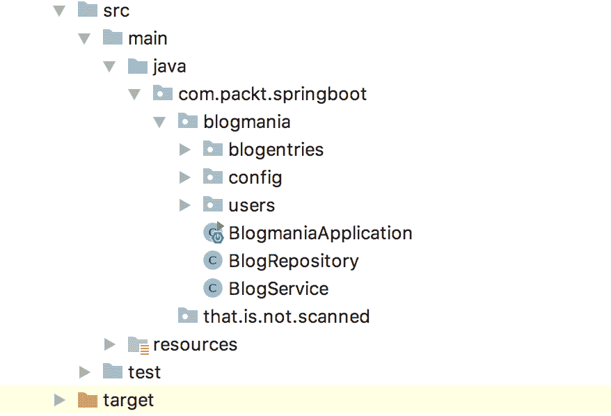
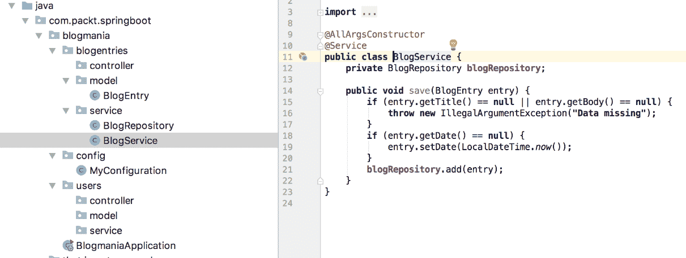
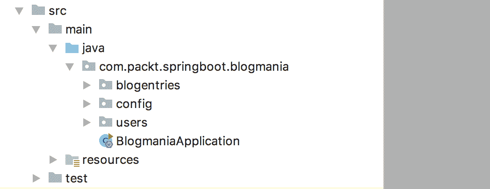
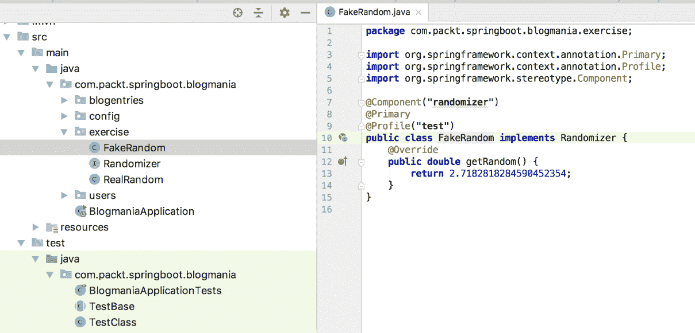
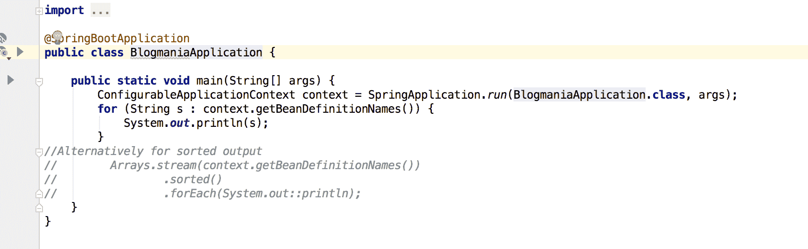
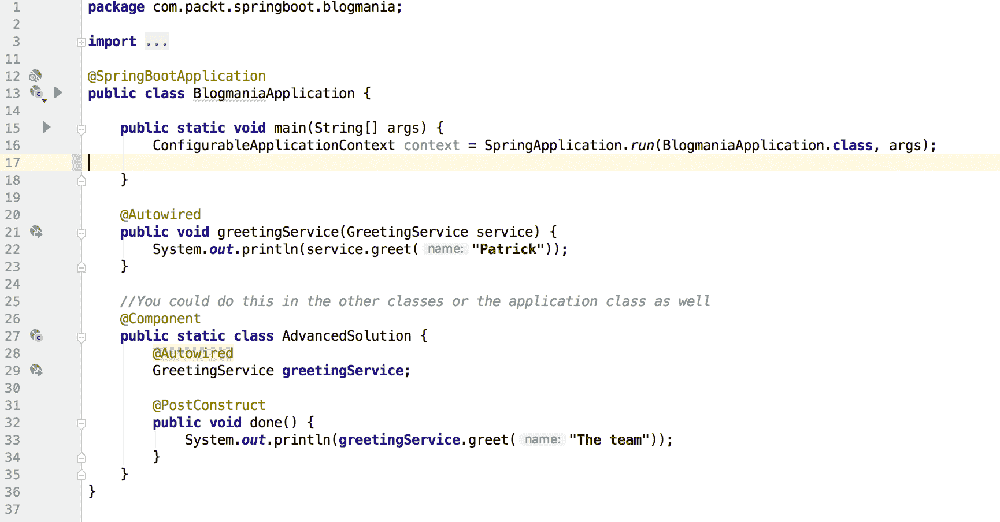

# 构建 Spring 应用程序

在本章中，你将学习如何与 Spring Beans 交互以及如何配置你的 Spring 上下文。这是每个 Spring 应用程序构建的基础。

在上一章中，你学习了如何创建 Spring Boot 项目，介绍了基本构建块和应用程序上下文。最后，你看到了如何利用 Lombok 来让你摆脱重复创建或编写相同代码的烦恼。

到本章结束时，你将能够：

+   组织 Spring Beans 之间的依赖关系

+   创建配置类以手动定义 Beans

+   组织配置属性

+   创建强类型属性类

# Spring 中的依赖注入

在本节中，你将看到 Spring Beans 如何相互依赖以提供功能。Spring 容器使用上下文中的 Beans 将依赖项注入到其他管理实例中。这使得你可以编写简洁的类，只需表达它们的依赖项，Spring 负责其余部分。

存在一个单例，它使用`HashMap`和专用工厂来创建和连接实例。此外，还有基类可以检查类并利用某种单例来查找其他实例。

**面向切面编程**（用于拦截缺失的依赖项），`classpath`扫描（用于查找可用依赖项和注入点），以及控制反转（以控制应用程序生命周期）。

# 自动装配

依赖注入，这是一种引入控制反转以解决依赖项的模式的 Spring 中的术语，称为**自动装配**。当 Bean-A 获得对 Bean-B 的注入引用时，它就是**自动装配**的。自动装配仅适用于 Spring Beans，因此两者都需要被**Spring 应用程序上下文**所知晓。

看看下面的示例代码：

```java
@Repository
public class ExampleBean {
   @Autowired
   private DataSource dataSource;
...
}
```

此示例代码定义了一个需要 JDBC 数据源来查询数据库的 Bean。正如你所见，字段不需要是公共的——甚至可以是私有的。Spring 通过使用反射来实现这一点，这是 Java 的一个标准特性。它允许你创建具有非常有限的公共接口的类，这使得用代码传达类的意图变得更容易。

你可能知道 JavaEE 注解，如`@Inject`。`@Autowired`是 Spring 中的对应注解。Spring 旨在对开发者友好，所以`@Inject`在 Spring 应用程序中也适用。然而，参数不同，所以如果没有特殊需要使用 JavaEE 版本，你应该坚持使用普通的 Spring 注解。

# 注入类型

在 Spring 中，你有几种方法可以访问上下文中的 Beans。你已经看到了**字段注入**，它被用来自动装配`DataSource`，但还有更多方法可以注入 Beans。

你可以在以下方面使用自动装配：

+   字段

+   属性

+   配置方法

+   构造函数

当 Spring 完全解析了一个 Bean 的依赖关系后，它会寻找一个注解了 `PostConstruct` 的方法并执行它。在那里，您可以执行一些最终的初始化，这将利用所有定义的依赖项。

# 字段注入

字段注入是获取另一个 Bean 的最简单方式。只需在字段上注解 `@Autowired`，Bean 创建后实例就会存在。

`TestBase` 和 `TestClass` 位于 [`bit.ly/2RSCHrf`](https://bit.ly/2RSCHrf)，在 `blogmaniaexercise-solution` 项目文件夹中。当您启动测试时，您会看到 `MyConfiguration` 的实例信息被打印了两次，尽管其中一个是在抽象基类中定义的。这有助于在基类中分组共享功能。

前往 [`bit.ly/2Mp9kcZ`](https://bit.ly/2Mp9kcZ) 访问 `TestBase.java` 文件的代码。前往 [`bit.ly/2CNj6WG`](https://bit.ly/2CNj6WG) 访问 `TestClass.java` 文件的代码。

# 属性注入

您也可以为设置器添加 `@Autowired`。这将触发所谓的 **配置方法** 机制。Spring 会在构造函数调用后，依赖项可用时调用该方法。

属性通常意味着您有一个遵循 Java Bean 标准的字段。例如，一个名为 `foo` 的 String 类型的属性将具有 `setFoo(String …)` 和 String `getFoo()` 方法。也存在只读和只写属性，其中之一可能缺失。`boolean` 字段有一个以 `is` 开头的 Getter，所以在这种情况下 `isFoo()` 将是正确的名称。

# 配置方法注入

Spring 能够在实例创建后、构造函数执行后调用一个方法。该方法可以有任何数量的参数，这些参数应可由 Spring 上下文中的 Bean 解析。该方法应返回 void；名称是任意的，方法不必是公共的。

您可以有多个这样的方法，并且它们将以未定义的顺序执行。

如您所见，这完全涵盖了属性注入。

# 构造函数注入

构造函数注入是 Spring 框架团队首选的注入 Bean 的方式。您只需创建一个带有所有必需 Bean 参数的构造函数，然后根据需要将这些值分配给您的字段。您也可能对提供的依赖项做些其他事情，例如调用它上的方法来获取一些数据，例如。因此，如果您在构造函数完成后不需要存储值，则不需要将其存储在某个地方。如果您有多个具有参数的构造函数，则需要通过添加 `@Autowired` 注解来指定其中一个构造函数。否则，这可以省略。

如你所回忆，我们使用 Project Lombok 来避免不必要的代码。这也可以在这里使用。只需将`@AllArgsConstructor`或`@RequiredArgsConstructor`添加到你的类中，Spring 将自动使用这个生成的构造函数。你不需要自己创建一个，甚至不需要在任何地方添加`@Autowired`。

# 循环依赖

当你有两个或更多 Spring Bean 形成依赖循环时，如果你在所有地方都使用构造函数注入，Spring 可能会在创建 Spring 上下文时遇到问题。

示例依赖关系：

Bean-A => Bean-B => Bean-C => Bean-A

当所有 Bean 都使用构造函数注入时，Spring 没有机会解决这个问题，因为实例不能在没有其他实例的情况下实例化。

有一些方法可以解决这个问题，但首先你应该重新考虑这真的是正确的解决方案；大多数循环依赖都是设计不良的症状。如果无法解决这个问题，你可以通过以下方式配置 Spring 来解决这个问题：

+   创建动态代理：

    1.  为了做到这一点，你需要至少更改其中一个构造函数（它不能由 Lombok 生成）。

    1.  然后，你可以通过在类型上添加`@Lazy`来标记构造函数参数，这告诉 Spring 在构建 Spring 上下文时创建类时不需要这个依赖。

    1.  当第一次访问时，Spring 会在从上下文中获取的真实实例前面创建一个代理实例，该实例作为门面工作。

+   对于第一个类使用字段/配置方法注入：当你使用这些注入风格时，Spring 可以在满足其他依赖关系之前延迟解析 Bean。你可以在 Spring 在启动时打印出的错误信息中看到第一个类。

要将依赖标记为“`懒加载`”，你只需在类型前或后放置`@Lazy 注解`。

看一下以下示例代码：

```java
public BlogRepository(@Lazy List<BlogEntry> db) {...
```

# 限定 Bean

如果你有多于一个相同类型的 Bean，那么 Spring 将无法检测出应该分配哪个实例。在这种情况下，应用程序将拒绝启动并显示一个错误信息，解释出了什么问题。

默认情况下，Spring 会尝试将参数/字段的名称与相应类型的 Bean 的名称匹配，但如果你需要一个特定的 Bean 且名称不匹配，你只需添加一个注解来手动解决。

例如，你可以使用以下代码从上下文中获取`myDate` Bean：

```java
@Qualifier("theDate")
private LocalDateTime contextStartTime;
```

如果需要，你可以直接访问应用程序上下文并从那里通过类型或名称获取 Bean。你可以实现`ApplicationContextAware`接口，Spring 将为你提供应用程序上下文的引用。这应该只在极少数情况下使用，因为在大多数情况下，“静态绑定”应该足够了。

# Bean 作用域

到目前为止，你已经看到了如何定义 Spring Bean，你也看到了通常在应用程序启动时创建一个实例。但还有其他用例，这种选择并不合适。

要指定作用域，只需将`@Scope`注解添加到 Bean 定义中：

```java
@Repository @Scope(SCOPE_SINGLETON)
public class BlogRepository {
```

Bean 的默认作用域是`singleton`，这意味着容器中有一个 Bean 的实例，并且这个实例是由 Spring 上下文返回的。作用域引用本身只是一个字符串。

第二个标准作用域是`prototype`，每次从上下文中请求具有该名称的 Bean 时都会返回一个新的实例。因此，如果你使用原型作用域定义了 Bean-A，而 Bean-C 和 Bean-D 都有一个自动装配的字段为 Bean-A，那么它们都将获得自己的实例。当 Bean 具有某种不应与其他 Bean 共享的状态时，这很有用，例如缓存等。

还有一些其他作用域，如`request`和`session`，这些是 Spring WebMVC 特有的，将在后面介绍。你甚至可以定义自己的作用域，但这是一个高级章节，我们不会在本书中介绍。

Spring 在几个地方提供了作用域的静态常量。常规作用域在`ConfigurableBeanFactory`类中定义，而特定于 Web 应用程序的作用域在`WebApplicationContext`中定义。

# 配置类

你已经看到了如何通过注解类定义来声明 Spring Bean。这是最常见的用例，但有时在创建 Bean 的过程中需要更多的控制。这就是配置类发挥作用的地方。它们基本上是具有 Bean 工厂方法的类。这可以用来创建代码库外定义的类的 Bean，例如，根据某些配置值返回接口的特定实现。

配置类也是 Spring Bean，因此你可以在其中使用自动装配的依赖项，但应避免构造函数注入。

这就是配置类的样子：

```java
@Configuration
public class MyConfiguration {
   @Bean
   public Date theDate(){
      return new Date();
   }
…
}
```

本节提供的源代码中的`MyConfiguration`类包含更多具有相应 JavaDoc 的 Bean。

配置类的默认行为是从 Spring 上下文中返回正确的实例。因此，当你在一个配置类中自动装配并调用一个带有`@Bean`注解的方法时，该方法可能不会执行，而是返回 Spring 上下文的结果。即使在同一个配置中调用`@Bean`方法也是如此。将配置类作为“常规”Bean 的依赖项在技术上可行，但并不常见。大多数项目使用专门的 Factory Bean 来处理单个类型或一组类型。

# 利用 Bean 依赖关系

目标是利用 Bean 依赖关系将数据传递到仓库。

完成步骤如下：

1.  打开 IDE 和本节的`BlogMania`应用程序([`bit.ly/2QpUDd1`](https://bit.ly/2QpUDd1))。

1.  将`BlogService`和`BlogRepository`移动到`com.packt.springboot.blogmania.blogentries.service`包中。

看看下面的截图：



右键单击 blogentries 包，并从那里创建新的包。然后，将类拖放到包中。

您现在已经创建了自己的 Spring Bean，并在业务场景中使用它来解决任务并将数据保存在内存中。请查看下面的输出截图，如下所示：



前往 [`bit.ly/2OeUPtQ`](https://bit.ly/2OeUPtQ) 访问 `BlogmaniaApplicationTests.java` 文件的代码。

# Spring Boot 应用程序的配置

在上一节中，您了解了如何连接 Spring Beans 以及可以使用哪种机制来实现这一点。

当您编写应用程序时，您将遇到需要可配置性的应用程序方面。如果您使用数据库，您将拥有不同的数据库配置；也许某些功能是启用或禁用的，或者类似的情况。

在 Spring Boot 应用程序中，您不需要自己处理这个问题。Spring Boot 有一个非常复杂的系统，可以轻松地配置您的应用程序，即使在复杂场景下也是如此。

在本节中，您将创建针对不同环境的配置文件，并使用属性和 **YAML**（**YAML 不是标记语言**）文件配置应用程序。您还将看到属性搜索顺序的实际操作，您可以使用它以多种方式配置您的 Spring Beans。

# 配置文件

Spring 应用程序有一个简单的机制来告诉您的应用程序它在不同的环境或模式下运行。应用程序有“活动配置文件”，它可以影响应用程序的配置或行为。配置文件是一系列单词的有序列表。这些单词中的每一个都是一个配置文件。如果没有给出任何内容，则默认为默认配置文件。

例如，您可以使用额外的命令行参数 `--spring.profiles.active=peter`,`dev`,`postgres` 来启动应用程序。如您所见，每个配置文件之间由逗号分隔。

这意味着配置文件 `peter`、`dev` 和 `postgres` 都是激活的。在接下来的幻灯片中，您将看到您可以使用这些配置文件做什么。

# 条件 Beans

当您需要在配置文件激活时启用或禁用某些 Beans 时，您可以在 Bean 定义中使用一个简单的注解。这可以是配置类、注解的类定义或 `@Bean` 注解的方法。

为了做到这一点，您只需要在类或方法定义中添加 `@Profile` 注解。以下代码片段是从 `MyConfiguration` 类中复制的（[`bit.ly/2oYUl05`](https://bit.ly/2oYUl05)），并配置了 `theConfiguredDate` Bean，这是一个在开发模式下的固定时间点（可能是用于测试）以及当未设置开发配置文件时的当前日期和时间。由于我们不能有两个方法具有相同的名称，我们使用了 `@Bean` 注解的一个特性来用 `theConfiguredDate` 覆盖 Bean 的默认名称：

```java
@Profile("dev")
@Bean("theConfiguredDate")
public Instant theConfiguredFixedDate(){
   return Instant.ofEpochMilli(1527854742);
}

@Profile("!dev")
@Bean
public Instant theConfiguredDate(){
   return Instant.now();
}
```

`@Profile` 注解也可以接受一个配置文件列表，在这种情况下，任何足够的给定配置文件都可以触发 Bean 的创建。这意味着配置文件是以隐式的 `or`（或）方式评估的，而不是 `and`（与）方式。

**示例**

```java
@Profile("dev", "profile2", "profile3")
```

在 Bean 定义上还有一个 `@Primary` 注解，可以用来标记一个 Bean 作为给定类型的默认 Bean。当有多个 Bean 匹配该类型时使用。要选择其他 Bean 中的一个，你需要添加带有正确 Bean 名称的 `@Qualifier` 注解。

# 利用条件 Bean 进行各种实现

目标是利用条件 Spring Bean，这可以用来在例如不同实现之间切换（或选择）。在开始之前，请重用现有项目。前往 [`bit.ly/2oYUl05`](https://bit.ly/2oYUl05) 访问 blogmania 目录的代码。

完成的步骤如下：

1.  创建一个名为 **Randomizer** 的接口，其中包含一个返回 double 类型且没有参数的方法。

查看以下截图：



1.  创建一个实现，使用 `Random` 类的 `nextDouble()` 方法返回一个随机数，并将其作为一个 Bean。

1.  创建一个始终返回，例如，`3` 的实现。使其成为在测试配置文件活动时激活的 Bean。它应该替换或覆盖其他 Bean。

你已经看到了如何覆盖测试中的 Bean，这有助于你编写简洁和可靠的测试。 查看下面的输出截图，如下所示：



前往 [`bit.ly/2x8v1s5`](https://bit.ly/2x8v1s5) 访问 `BlogmaniaApplication.java` 文件的代码。

# Spring 配置文件

Spring Boot 应用程序默认由 Spring Initializr 创建，在资源文件夹中有一个空的 `application.properties` 文件。这是默认配置文件。你可以在属性文件格式中写入所有默认配置，我们将在稍后更详细地介绍。

在 `application.properties` 文件旁边，你可以放置更多基于活动配置文件加载的配置文件。

你可以在那里创建一个 `application-dev.properties` 文件，并且它只有在 dev 配置文件活动时才会被加载。我们将在专门的章节中很快介绍属性值应用的顺序。

# 属性文件

属性文件在 Java 生态系统中非常常见，甚至比现在普遍不喜欢的 XML 文件还要古老。

格式很简单：

+   值以 `Key=value` 的形式存储，其中键通常由小写点分隔的单词组成，而 `=` 后的值可能包含空格。多行值需要在下一行的末尾加上一个 `\` 以表示行继续。

+   注释行以 `#` 开头，并被解析器忽略。

+   你可以有空白行。

使用基于配置文件的机制，你可以设置或覆盖值。

一个示例配置看起来像这样：

```java
spring.datasource.driverClassName=com.mysql.jdbc.Driver
spring.datasource.url=jdbc:mysql://localhost/test
server.port=9000
```

属性文件应该始终使用 ISO-8859-1 编码，否则你可能会得到奇怪的结果。在测试中可能工作，但当你启动应用程序或反之亦然时可能会出错。

# YAML 文件

**YAML**（YAML Ain't Markup Language）文件是创建 Spring Boot 配置文件的另一种语法。

格式基本上由以下定义：

+   值以`key: value`的形式存储。

+   YAML 支持`子键`，这些子键只是简单地缩进。同一级别的键会组合在一起，直到下一个键的缩进更少。

+   列表通过使用一个子组来支持，其中每一行都以短横线开头。

+   注释以`#`开头。

属性示例在 YAML 中看起来像这样：

```java
spring.datasource:
driverClassName: com.mysql.jdbc.Driver
   url: jdbc:mysql://localhost/test
server.port: 9000
```

你可以看到点号仍然作为组分隔符使用，但如果你有多个具有相同父组的键，你可以使用这个较短的版本。这对于 Spring 配置值的深层键结构来说特别方便。

# 多配置文件 YAML 文件

使用 YAML 文件，你可以使用一种特殊格式来定义仅在给定配置文件中激活的值。

要这样做，你使用三个短横线后跟`spring.profile`键以及此块应该激活的配置文件。在这里，你甚至可以使用否定语法来设置当配置文件未设置时的值：

```java
server:
   port: 9001
my.value: dev

---
spring:
   profiles: dev
my.value: dev

---
spring:
   profiles: production
server:
   port: 0
```

这种高级机制在 YAML 标准中指定，但某些 YAML 验证器可能会将其标记为不再有效的 YAML 文件。解析器在短横线处截断 YAML 文件，并在内部将它们作为不同的（虚拟）文件处理。如果你在源代码上有静态代码检查器，它们可能会对此语法提出异议。

**代码检查器**是一个检查文件中的语法错误或常见错误的程序。许多文件类型和编程语言都有可用的代码检查器。

# 外部配置位置

我们讨论的文件位于类路径中，但你可能需要一些主机或环境特定的配置，你不想将其提交到版本控制中。例如，如果你的安全部门不高兴，当生产数据库凭据托管在广泛可访问的 Git 仓库中时。

Spring 文档列出了 17 种不同的设置或覆盖配置值的方法。为了简洁起见，我们将省略一些高级方法，但如果你想查看所有方法，请访问[`docs.spring.io/spring-boot/docs/current/reference/html/boot-features-external-config.html`](https://docs.spring.io/spring-boot/docs/current/reference/html/boot-features-external-config.html)。

当 Spring 查找配置值时，它会搜索这个列表以找到该值。一旦找到值，搜索就会停止。

默认情况下，以下位于 JAR 文件之外的文件将在当前工作目录中搜索：

+   命令行参数

+   来自 `SPRING_APPLICATION_JSON` 的属性（嵌入在环境变量或系统属性中的内联 JSON）

+   Java 系统属性（使用 `-Dmy.config.key=value` 设置）

+   操作系统环境变量（通常与 Docker 容器一起使用）

+   在你打包的 JAR 文件外的特定配置文件的应用程序属性（`application-{profile}.properties` 和 `YAML` 变体）

+   包含在你 JAR 文件内的特定配置文件的应用属性（`application-{profile}.properties` 和 `YAML` 变体）

+   在你打包的 JAR 文件外的应用程序属性（`application.properties` 和 `YAML` 变体）

+   包含在你 JAR 文件内的应用程序属性（`application.properties` 和 `YAML` 变体）

+   在你的 `@Configuration` 类上的 `@PropertySource` 注解（用于加载额外的属性文件，但不包括 YAML！）

意外地是，通过 `@PropertySource` 加载的文件是最后被评估的，但其余的部分非常合理，并允许你将默认值打包到你的应用程序中，并覆盖在主机或容器上运行的特定实例。

# 配置文件中的占位符

在配置文件中，你可以使用一个非常简单的变量替换机制，该机制在所有配置值加载时被评估，因此即使替换引用的是同一文件中定义的值，它仍然可以被覆盖，例如，由配置文件或系统属性。该机制适用于属性和 YAML 文件：

```java
server.port: 9000
spring:
   application:
         name: MyApplication
info:
   description: ${spring.application.name} is so nice
```

这将设置应用程序的描述为 `spring.application.name` 设置的内容加上一些很棒的东西。语法看起来很像 **SpEL**（**Spring 表达式语言**），但它仅限于简单的变量替换。SpEL 将很快被简要介绍。

# 访问环境值

我们已经看到了许多定义配置值的方法，但我们还没有使用它们。Spring 提供了多种访问这些值的方式。最老的方式是让 Spring 自动装配一个具有 `Environment` 类型的实例到你的 Bean 中。这提供了使用代码访问配置值的方法。

查看下面的示例代码：（来自 `BlogService.java` 的摘录）：

```java
@Autowired
public void init(Environment env) {
   log.info("my.config.value={}",
           env.getProperty("my.config.value",
                   Integer.class, 42));
}
```

`log.info(...)` 是由 Project Lombok 的 `@Slf4j` 注解提供的，它为你创建了一个静态的配置了名为 `log` 的类的日志记录器。

# 注解字段

直接使用 Environment 实例有点繁琐，因此 Spring 开发者创建了一个名为 `@Value` 的另一个注解，它能够从环境中访问数据并将其分配给一个字段。该字段可以是任何开箱即用的类型，如原始类型或其他默认的 Java 类，或者你可以提供一个 `ConversionService` 或 `PropertyEditors`，这些是 Spring 用于将数据转换为字符串以及从字符串转换回数据的机制。能够创建自己的转换器超出了本书的范围。

查看下面的示例代码：（来自 `BlogService.java` 的摘录）：

```java
@Value("${my.config.feature.flag:false}")
boolean featureFlag;
```

这使用键`my.config.feature.flag`加载值并将其转换为`boolean`值。当配置键未设置时，默认值为 false。因此，语法是`@Value("${KEY:DEFAULT}")`，其中包含默认值，以及没有默认值的`@Value("${KEY}")`。默认值是配置文件中期望的默认值的字符串表示形式。

列表是使用方括号和逗号分隔的值设置的，例如`[1,3,5,7,9]`，这是一个奇数整数的列表。

# Spring 表达式语言

**Spring 表达式语言**（**SpEL**）与 2006 年为 Java 服务器页面（JSP）创建的统一 EL 类似。它支持查询和操作 Spring 上下文。你可以将其视为一种轻量级脚本语言。如果你的代码使用了`SpelExpressionParser`，则可以使用 SpEL。

SpEL 非常强大，其中一些特别有用的特性如下：

+   文字表达式

+   访问 Spring Bean 方法和属性

+   布尔运算

+   调用静态方法

+   过滤集合

让我们看看一个示例，该示例在`blogService` Spring Bean 上调用`getTimeMessage()`方法。结果字符串随后将被转换为大写：

```java
@Value("#{blogService.timeMessage.toUpperCase()}")
String message;
```

`getTimeMessage()`方法符合 Bean 标准，将`timeMessage`属性表示为只读。这允许我们省略 get 前缀。

# 配置属性类

随着你的应用程序的增长，你也将拥有越来越多的配置选项。使用`@Value`注解，你可以访问这些选项，但将它们散布在应用程序的各个地方可能会导致大量的重复，甚至可能产生工作，例如当类型、键或默认值更改时。然后，你必须更新所有出现的地方，这并不是首选的。

为了使 IDE 支持属性，你需要添加这个依赖项：

```java
<dependency>
  <groupId>org.springframework.boot</groupId>
  <artifactId>spring-boot-configuration-processor</artifactId>
  <optional>true</optional>
</dependency>
```

现在，你可以使用`@ConfigurationProperties`注解创建一个配置属性类。该类本身应该有属性来存储数据，如果你愿意，可以在这里定义默认值：

```java
@Data
@ConfigurationProperties("blogmania")
public class MyProperties {
   String message;
   int myInt=4;
   SubProperties subs = new SubProperties();

   @Data
   public static class SubProperties{
       boolean iLikePizza=true;
   }
}
```

要创建 getter 和 setter，我们使用 Lombok。正如你所见，你也可以有深度嵌套的类来存储和分离你的数据。`@ConfigurationProperties`注解应该有一个参数，它是属性的前缀路径。有了这个，你就有如下属性：

```java
blogmania.message
blogmania.my-int
blogmania.subs.i-like-pizza
```

为了使这生效，你必须做两件事。首先，你必须在一个配置类定义中注册带有`@ConfigurationProperties`注解的类，如下所示：

```java
@EnableConfigurationProperties({MyProperties.class})
```

通过在`@ConfigurationProperties`旁边添加`@Component`或将一个带有`@Bean`注解的方法添加到配置类中，使配置类成为一个 Bean。

你可能已经注意到，`iLikePizza` 属性现在在配置文件中是 **kebab-case** 格式。这样做的原因是，这是推荐编写属性的方式。Spring 支持 `ConfigurationProperty` 类的宽松绑定，因此你也可以使用 **camelCase** 或 **snake_case**，但这是不推荐的，因为在某些情况下，这可能会导致问题。

# 活动：检查自动装配和配置

**目标**

为了练习自动装配和应用配置，创建几个类。

**场景**

你应该重复使用之前小节中使用的项目，并在 IDE 中打开它。这是一个简化版的常见任务，其中你从配置中读取内容并将其应用于输入。

你将创建一个问候服务，该服务使用配置的后缀和提供的输入来创建问候，例如 Packt 向世界问候。

**完成步骤**

1.  创建一个类来读取后缀的配置值。

请查看以下截图：



1.  创建问候服务。

1.  在服务中注入所需的类。

1.  创建一个公共方法来创建问候。

1.  在 Application 类中，添加一个执行问候方法并打印结果的 config 方法。

**结果**

默认消息应该是 INPUT+ 向世界问候（INPUT 是问候方法中输入的问候者的名字），但位置（**世界**）应该是可定制的，因此你也应该能够创建，例如，INPUT+ 向柏林问候。位置应该使用 `GreetingProperties` 读取。要触发此代码，请使用 Application 类，在此处自动装配服务，并使用示例数据执行它。

请查看下面的输出截图：



要参考详细步骤，请参阅本书末尾的 *解决方案* 部分，第 250 页。

# 摘要

在本章中，你看到了如何将 Spring Beans 注入其他 Beans，以及如何在注入器无法唯一标识的情况下帮助 Spring。你还看到了如何使用配置文件和配置文件配置你的应用程序。

在下一章中，我们最终将开始探讨我们可以测试 Spring Boot 应用程序的方法。
