# 第四章：MVC 模式

今天，我们将学习如何在 Spring 中构建一个基于 Web 的应用程序，该应用程序使用网页与用户交互。作为一个例子，我们将使用一个简单的博客应用程序。为此，我们首先将查看模型-视图-控制器（MVC）设计模式以及我们如何从中受益。

MVC 设计模式是一个非常常用的应用程序设计模型。该模型将应用程序分解为三个相互关联的部分。这样做是为了减少创建具有用户界面的面向对象应用程序所需的时间。该模型允许不同模型、视图和控制器之间的解耦，从而促进代码的重用和应用程序不同部分的并行开发。

到本章结束时，你将能够：

+   定义模型-视图-控制器（MVC）模式及其优点

+   解释模型、视图和控制器的作用

+   区分基于请求和基于组件的 MVC

+   构建你的第一个真实生活 Spring Web MVC 应用程序

# 介绍 MVC 模式

当使用 **用户界面**（**UI**）构建 Web 应用程序时，如果涉及多个开发者，开发可能会变得繁琐。此外，如果太多关注点混合在代码的某些部分，维护也可能变得困难。

一个名为 MVC 的设计模式解决了这个问题。通过分离渲染和操作应用程序数据的关注点，它允许团队中的多个程序员并行地工作在不同的应用程序方面。当一位开发者专注于视图时，另一位开发者能够实现业务逻辑。

还有模式可以解决常见的软件开发问题。在 Erich Gamma、Richard Helm、Ralph Johnson 和 John Vlissides 所著的《设计模式：可复用面向对象软件元素》一书中，介绍了一套流行的这些模式。

如果你感兴趣 MVC 模式的历史，你仍然可以在 Trygve M H Reenskaug 的页面上找到 MVC 模式的原始描述：[`heim.ifi.uio.no/~trygver/themes/mvc/mvc-index.html`](https://heim.ifi.uio.no/~trygver/themes/mvc/mvc-index.html)。此外，原始的 MVC 报告可在 [`folk.uio.no/trygver/2007/MVC_Originals.pdf`](http://folk.uio.no/trygver/2007/MVC_Originals.pdf) 找到。

# MVC 组件

定义了以下三个组件：

+   **模型**：应用程序状态或数据。

+   **视图**：渲染应用程序数据。

+   **控制器**：在模型、视图和外部世界之间进行调解。

# 比较模型、视图和控制器

请看以下表格，它突出了主要概念：


# 交互

现在我们已经学习了 MVC 组件，让我们看看它们是如何相互作用的：

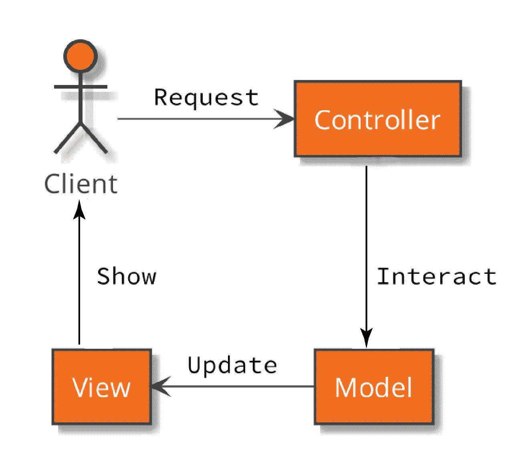

典型的交互包括以下步骤：

+   客户端向控制器发送请求。

+   控制器操作模型。

+   模型更新视图。

+   视图被渲染并发送到客户端。

这些步骤说明了关注点的分离，因为每个组件都有一个非常明确的任务要完成。

MVC 使用另一种设计模式，称为**观察者模式**。它描述了主题（模型）如何更新多个观察者（视图或其部分）关于已进行的更改。

如果你想了解更多关于观察者模式的信息，你可以在我们之前提到的书中找到更多信息，即《设计模式：可重用面向对象软件元素》，另一个好的起点是关于此模式的条目[`springframework.guru/gang-of-four-designpatterns/observer-pattern/`](https://springframework.guru/gang-of-four-designpatterns/observer-pattern/)。

# MVC 模式的优势和劣势

MVC 模式的优势包括以下内容：

+   **同时开发**：接口定义良好，并利用具有不同技能的开发者。

+   **高内聚**：将属于一起的代码分组，有助于维护、改进和重构。

+   **多个视图**：为不同的媒体实现单独的视图，并保持业务逻辑的单个实现。

+   **松散耦合**：组件之间共享的知识量很小，并且更改可以限制在实现的孤立部分。

MVC 模式的劣势包括以下内容：

+   **导航源代码**：源代码可能会变得非常分散。

+   **多种实现**：开发者必须跟踪多种实现。

+   **理解模式**：开发者必须理解该模式。

# 基于请求与基于组件的 MVC 对比

有不同的方法来实现 MVC 模式。

在基于请求的 MVC 方法中，开发者必须自己处理传入的请求。这意味着数据必须手动转换和验证。

另一方面，在基于组件的 MVC 应用程序中，框架将负责处理并构建与视图渲染的部分相似的组件：

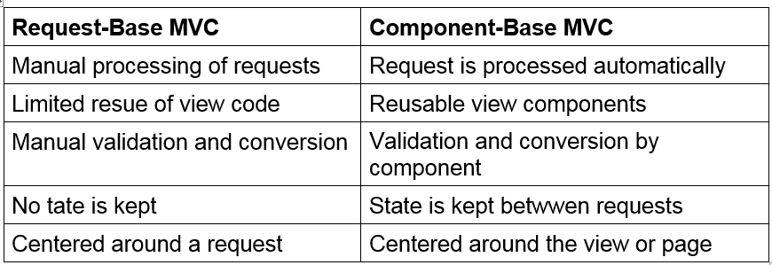

虽然基于请求的 MVC 架构需要大量的样板代码，但它让你对整个过程和输出有很好的控制。当你对视图有非常复杂的要求时，这种方法可能是正确的选择。

另一方面，基于请求的方法引入了更多的复杂性，而基于组件的方法增加了开发者对组件定制的负担。

# Spring Web MVC 基础知识

现在我们已经了解了模型-视图-控制器模式，我们将现在看看 Spring Web MVC 如何利用这个模式来启用 Web 应用程序的开发。

当我们谈论 Web 应用时，我们通常是指视图在浏览器中渲染。但在深入细节之前，我们将简要讨论两种不同的前端实现方式。

# Single-Page Applications Versus Multi-Page Applications

实现 Web 应用的客户端（也称为“前端”）有不同方式。今天最常用的架构是**单页应用（SPA**）。请求只更改视图的部分。

相比之下，**多页应用（MPA**）为每个请求渲染一个新的页面。

在 MPA 中，视图的 HTML 在服务器上渲染，然后发送回浏览器。用户的每个操作都会导致向服务器发出请求，服务器会响应另一个完整页面或视图。

# 单页应用（SPA）与多页应用（MPA）

看一下以下表格，它突出了主要概念：

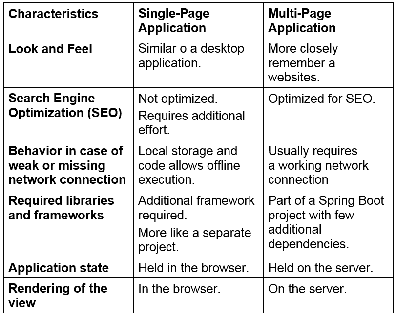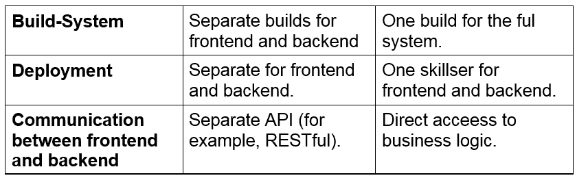

在本章中，我们将关注如何构建多页应用。接下来，你将了解如何设计和实现一个可以构建 SPA 后端 API 的架构。

# Java Servlet API

我们现在将揭示 Java Servlet API，它为 Java 生态系统中的任何类型的 Web 应用奠定了重要基础。

根据知识水平，你可以选择专注于这个子节或继续到下一个节。

Java Servlet API 是一种旨在处理针对所谓容器发出的 HTTP 请求的架构。它是在 Java Community Process（JCP）下开发的，目前可用版本为 4.0。

遵循此规范的流行容器包括 Apache Tomcat 和 Jetty。

# Servlet API 组件

以下块图显示了各种组件之间的典型关系：

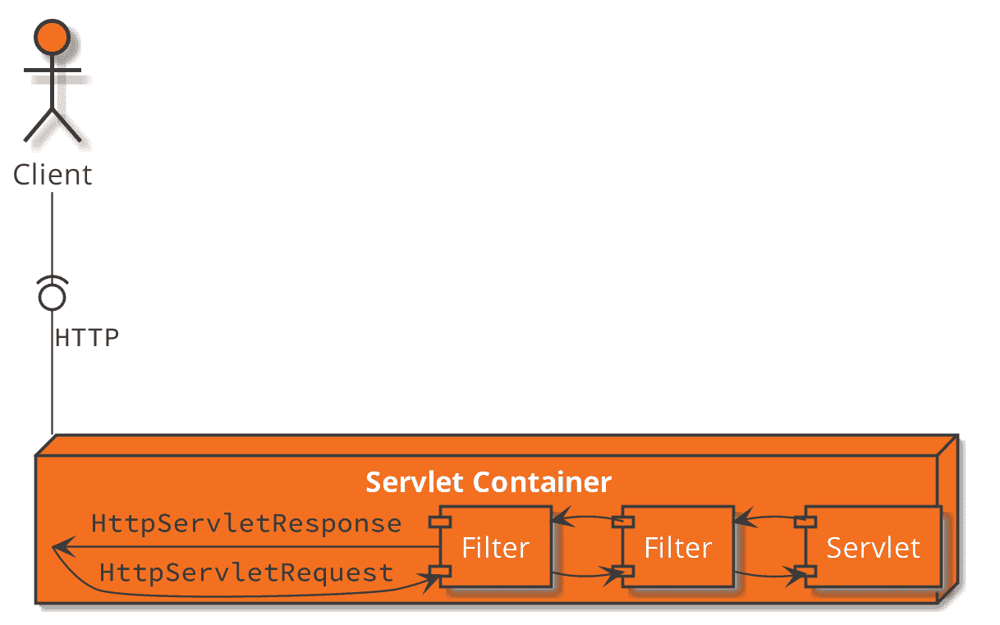

看一下以下表格，它突出了主要概念：

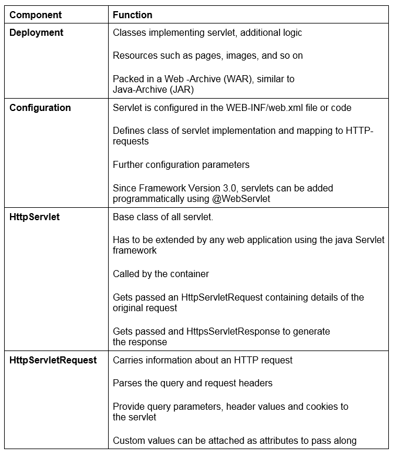

# Spring Web MVC

正如我们一直在查看构建和了解一个工作 Web 应用所需的所有基本模式和技术的，我们现在将看看所有这些如何应用于 Spring Boot 应用。

Spring Boot 使用“启动依赖”来为应用添加各种功能和能力。在我们的案例中，我们想要实现一个需要 Web 服务器来运行的网络应用。我们还需要支持 MVC 模式。Spring 框架包括构建基于 MVC 设计模式的丰富和现代 Web 应用所需的所有内容。

要利用这些功能，只需在我们的 Maven `pom.xml`文件中包含 spring-boot-starter-web 依赖项即可。

# 利用 Spring Web MVC 启动器

目标是使用 Spring Web MVC 启动器在网页上显示输出。完成步骤如下：

1.  打开一个 CMD 窗口并导航到[`bit.ly/2DmTaQA`](https://bit.ly/2DmTaQA)。

1.  确保你的`JAVA_HOME`路径设置正确，并使用`mvnw spring-boot:run`命令启动项目。

看一下下面的截图：

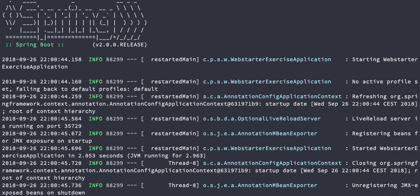

注意应用程序在启动后立即停止。

1.  使用浏览器导航到`http://localhost:8080/hello.html`。

看一下下面的截图：

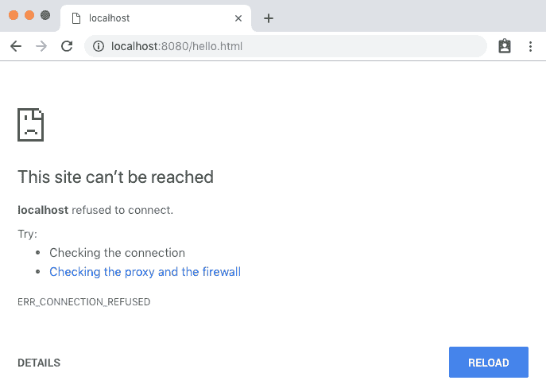

浏览器无法连接到服务器，因此显示了一个错误页面。

1.  将以下依赖项添加到你的`pom.xml`文件中：

```java
<dependency>
    <groupId>org.springframework.boot</groupId>
    <artifactId>spring-boot-starter-web</artifactId>
</dependency>
```

1.  再次启动项目。

1.  导航到`http://localhost:8080/hello.html`以查看问候页面。

1.  按下 Ctrl+C 停止程序。你可以安全地忽略这里的错误消息。

你已使用 Spring Web MVC Starter 获得了预期的问候页面。

看一下下面的输出截图：

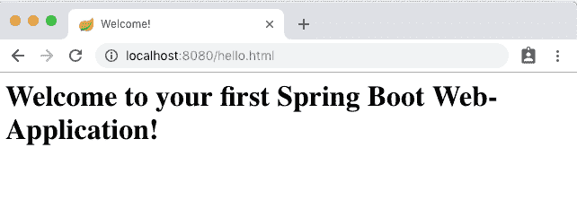

前往[`bit.ly/2OfiTwW`](https://bit.ly/2OfiTwW)访问`WebstarterExerciseApplication.java`文件的代码。

# 嵌入式 Web 服务器

感谢 Spring Boot 的自动配置功能，你只需要在你的 Maven 构建文件中添加 spring-boot-starter-web 依赖项。默认情况下，这将向你的构建添加一个嵌入式的 Apache Tomcat 服务器。它还将构建一个可执行的 JAR 文件，该文件将启动服务器并将你的应用程序部署到它上面。

如果你希望使用不同的 Web 服务器，你可以选择排除 spring-boot-starter-tomcat 依赖项，并添加以下依赖项之一：

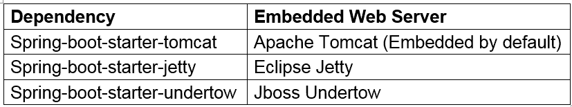

# Spring DispatcherServlet

Spring Web MVC 通过提供一个名为`DispatcherServlet`的 servlet 来处理传入请求。它也被称为**前端控制器**，因为它是处理传入请求并将它们分派到其他控制器实现的第一部分控制器。

默认情况下，`DispatcherServlet`将对以`/`开头的每个请求进行调用。你可以通过在`application.properties`文件中设置`server.servlet.contextPath`属性来更改这个所谓的上下文路径：

`server.servlet.contextPath=/my-app`

在前面的示例中，`DispatcherServlet`以及你的应用程序将只响应以`/my-app`开头的 URL。

# DispatcherServlet 交互

以下块图显示了各种组件之间的典型关系：

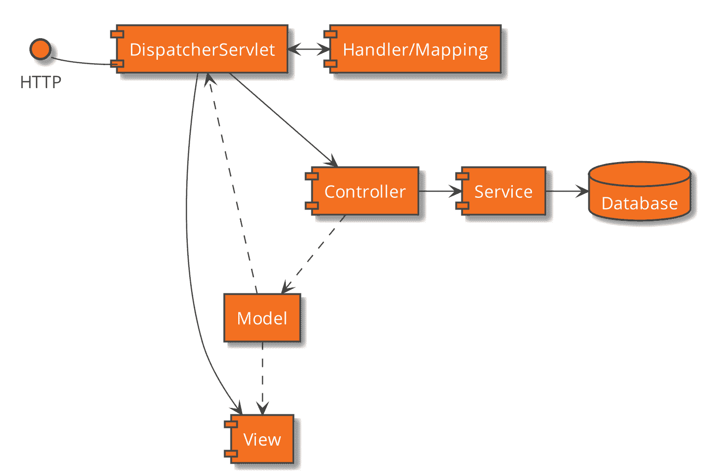

当处理传入请求时，`DispatcherServlet`做所有繁重的工作：

+   根据请求 URI 确定要调用的控制器。为此，它使用一个能够检索控制器的`HandlerMapping`。

+   调用控制器方法，可选地传递模型

+   当控制器完成时，它返回一个视图的名称

+   根据控制器返回的名称确定视图

+   解析视图

+   将视图渲染回客户端，传递要渲染的模型

这是对传入请求发生的事情的非常简单的看法。我们将在查看这些组件的一些内容时进一步详细介绍。

# 控制器作为组件

虽然`DispatcherServlet`是应用程序的前端控制器，响应每个传入请求，但业务逻辑在其自己的方法中实现。

正如我们在上一节中讨论的那样，`HandlerMapper`用于映射请求。

默认情况下，安装了一个`RequestMappingHandlerMapping`，它查找在带有`@Controller`注解的 Spring 组件中注有`@RequestMapping`的方法。我们将在后面的章节中了解更多关于此类映射的内容。

# 使用 HTML 和资源提供静态视图

每个 Web 应用程序都将需要某种类型的静态视图或资源。以“关于”页面为例。然而，由于您无法将模型中的数据嵌入此类页面，您可能不会对它们有太多用途。另一方面，您将需要提供一些静态资源，例如 CSS 文件、JavaScript 或图像。Spring Web MVC 能够提供放置在名为`static`的文件夹中的此类内容。如果您使用的是 Maven 或 Gradle 等构建工具，正如我们所做的那样，完整路径将从项目根目录的`/src/main/resources/static`。

# 通过 WebJars 添加客户端 Web 库

除了使用静态文件夹提供静态资源外，还有一种称为 WebJars 的机制。

**WebJar**是一种打包为 Java-Archive 的客户端 Web 库。这些库的例子包括用于网页常见 JavaScript 任务的 JQuery，或者**Bootstrap**，一个用于构建响应式 Web 设计的库。它可以通过使用 Maven 等构建工具轻松下载和部署作为依赖项。此外，传递依赖项也将自动下载和提供。

WebJar 存档的内容结构是标准化的，包括文件夹结构和需要存在的某些文件。

如果类路径上存在 WebJar，Spring Boot 将配置您的应用程序将 HTTP 请求映射到`/webjars`到`/META-INF/resources/webjars`文件夹。

如果您在类路径中包含多个 WebJars，它们都将位于相同的`/webjars URI`下。

例如，您可以通过在`pom.xml`文件中添加以下依赖项来包含 Bootstrap 的 WebJar：

```java
<dependency>
    <groupId>org.webjars</groupId>
    <artifactId>bootstrap</artifactId>
    <version>4.0.0-2</version>
</dependency>
```

要访问此库的主要 CSS 文件，请在您的 HTML 文件中包含以下行：

```java
<link rel='stylesheet' href='/webjars/bootstrap/4.0.0-2/css/
bootstrap.min.css'>
```

如您所见，该库通过其名称（bootstrap）在`/webjars`文件夹下引用。之后，添加版本号，然后是所需资源的路径，这取决于库。

如果您不想将库版本添加到 URI 中，您可以将`webjar-locator`依赖项添加到您的`pom.xml`文件中：

```java
<dependency>
    <groupId>org.webjars</groupId>
    <artifactId>webjars-locator-core</artifactId>
</dependency>
```

在此依赖项就绪后，您可以将 HTML 文件中的链接标签更改为以下内容：

```java
<link rel='stylesheet' href='/webjars/bootstrap/css/bootstrap.min.
css'>
```

请注意，在添加 webjars-locator 后，`/static`文件夹中静态文件的映射将不再工作。

如果你想了解更多关于 WebJar 标准的信息，请访问[`www.webjars.org`](http://www.webjars.org)，以找到包括搜索引擎和代码片段生成器在内的库的详尽列表。此外，该网站上还有关于该标准和其应用的更多文档信息。

# 使用 Bootstrap 进行样式设计

目标是使用 Bootstrap 和 WebJar 来设计页面样式。完成步骤如下：

1.  前往[`bit.ly/2z8QQd6`](https://bit.ly/2z8QQd6)[.]，获取文件夹位置。

1.  使用`mvnw spring-boot:run`启动应用程序。

1.  将浏览器导航到`http://localhost:8080/hello.html`。

注意页面是无样式的。

1.  将浏览器导航到`http://localhost:8080/webjars/bootstrap/4.0.0-2/css/bootstrap.css`。

浏览器将显示一个错误页面，因为资源缺失（**errorCode=404**）。

1.  添加以下依赖项以包含 Bootstrap WebJar：

```java
<dependency>
    <groupId>org.webjars</groupId>
    <artifactId>bootstrap</artifactId>
    <version>4.0.0-2</version>
</dependency>
```

1.  重新启动应用程序。

1.  再次将浏览器导航到`http://localhost:8080/welcome.html`。

页面现在已应用了一些样式。

1.  将浏览器导航到`http://localhost:8080/webjars/bootstrap/4.0.0-2/css/bootstrap.css`。

取代错误页面，你现在应该看到一些 CSS 样式。

你会注意到你现在已经使用 Bootstrap 和 WebJar 为网页添加了样式。

前往[`bit.ly/2Obb4Il`](https://bit.ly/2Obb4Il)访问`WebstarterExerciseApplication.java`文件的代码。

# 模板引擎的转换

以下块图显示了各种组件之间的典型关系：

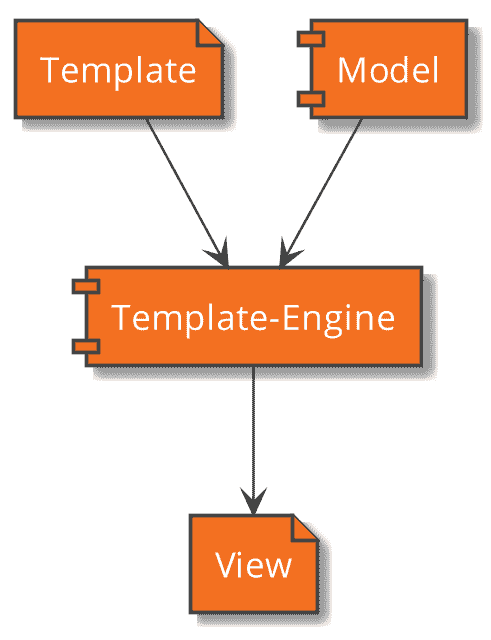

在 Web 应用程序中，我们期望视图被渲染为 HTML 页面。由于 MVC 模式鼓励我们将模型与视图分离，因此必须有一个实体将我们的模型数据转换成最终的表示形式。

这就是模板引擎发挥作用的地方。正如其名所示，模板引擎将接受一个包含 HTML 和来自模型的占位符数据的模板。然后，它将渲染最终发送给客户端的 HTML。

# Thymeleaf 代码片段

以下块图显示了各种组件之间的典型关系：

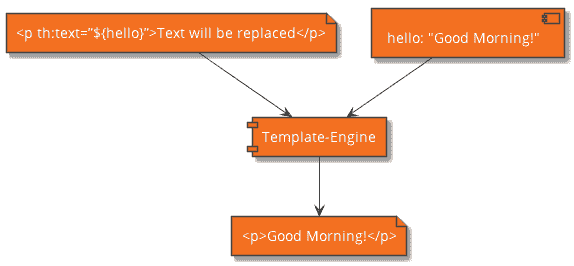

例如，想象以下代码片段：

```java
<p th:text="${hello}">Text will be replaced</p>
```

如果我们的模型中包含一个名为 hello 的属性，其内容为 Good Morning!，模板引擎将渲染以下 HTML 代码：

```java
<p>Good Morning!</p>
```

与其他框架一样，Spring Boot 提供了一个简单的方法将模板引擎添加到你的应用程序中。

# 模型数据传递

正如我们所见，一个名为`model`的元素被用来在控制器和视图之间传递数据。Spring Web MVC 自动在这些组件之间传递模型，并提供了许多访问和绑定属性的机制。此外，许多基本任务，如转换和验证，都由框架完成。

模型绑定到当前请求，并由 `org.springframework.ui.Model` 类的实例表示。任何对象都可以绑定到模型。在注解请求处理器时，还可以将模型的单个属性绑定到方法参数。

当我们在 Web 页面上显示动态信息时，我们将看到如何在 *第五章：使用 Web 页面显示信息* 中使用模型。

# Spring Web MVC 控制器

现在我们将看看 Spring Web MVC 包含了哪些内容，使我们能够实现应用程序的控制器。该框架处理传入的请求，因此我们可以专注于业务逻辑。

# `@RequestMapping` 注解

我们已经看到 `DispatcherServlet` 使用 `HandlerMapping` 来确定如何处理传入的请求。

默认情况下，Spring Web MVC 将安装并使用 `RequestMappingHandlerMapping`，这允许我们使用注解来确定要使用哪个控制器和方法。

以下块图显示了各种组件之间的典型关系：

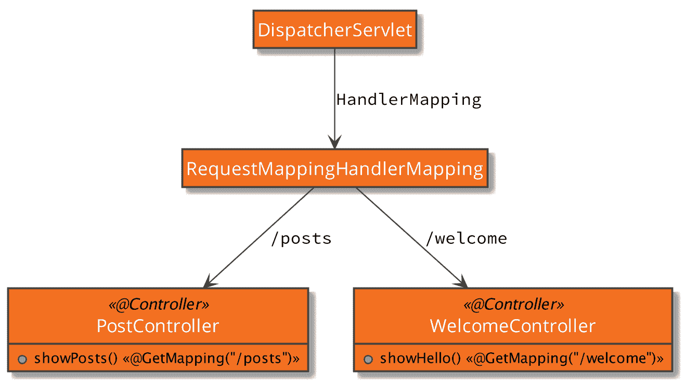

任何组件都将检查 `@RequestMapping` 注解。如果存在此注解，将根据路径属性创建映射。此外，方法注解指定映射的 HTTP 方法。为了更明显地表明给定的 Bean 旨在作为控制器，可以使用特殊的 `@Controller` 注解在类上。

自 Spring 4.3 以来，为每个 HTTP 方法都提供了便利注解。这些注解被称为 `@GetMapping`、`@PostMapping` 等。

如果 `@RequestMapping` 注解位于类级别，它将用作所有标注了 `@RequestMapping` 或任何方法特定注解的方法的前缀：

```java
@Controller
@RequestMapping("/posts")
public class RequestMappingPostController {
    @RequestMapping(path = "/newest", method = RequestMethod.GET)
    // […]
    //     public String addPost(@RequestBody Post post) {
        // This method will be mapped to
        // POST requests with the path /posts
    }
}
```

访问 [`bit.ly/2MsHOvc`](https://bit.ly/2MsHOvc) 以获取 `@RequestMapping` 注解示例的完整代码。

# 处理方法额外的注解和参数

可以应用于处理方法的额外注解。我们将在这里查看最重要的参数。

# `@RequestParam`

发送到应用程序的请求可以包含查询中的任意数量的参数。这些参数通过问号（`?`）与路径分隔。这些参数会自动解析，并且可以通过使用 `@RequestParam` 注解将它们传递给处理方法。如果需要，值将被转换：

```java
@GetMapping("/form")
public String setupForm(@RequestParam("formId") int formId) {
  // When requesting /form?formId=1
  // formId will get the value 1
}
```

# `@RequestHeader`

`@RequestHeader` 注解允许你将一个或多个 HTTP 头注入到方法参数中。这是通过在方法参数上标注 `@RequestHeader` 来实现的：

```java
Host                     localhost:8080
Accept                   text/html,application/
xhtml+xml,application/xml;q=0.9
Accept-Language          fr,en-gb;q=0.7,en;q=0.3
Accept-Encoding          gzip,deflate
Accept-Charset           ISO-8859-1,utf-8;q=0.7,*;q=0.7
Keep-Alive               300
@GetMapping("/form")
public String setupForm(@RequestHeader("Keep-Alive") long
keepAlive) {
  // keepAlive will get the value 300
}
```

# `@CookieValue`

此注解允许你检索 cookie 的内容：

```java
JSESSIONID=2388923038849

@GetMapping("/form")
public String setupForm(@CookieValue("JSESSIONID") String
jSessionId) {
  // jSessionId will get the value 2388923038849
}
```

# `@PathVariable`

有可能使用 URL 路径的一部分作为参数传递给处理方法。这可以通过使用`@PathVariable`注解来实现。如果需要，值将被转换：

```java
@GetMapping("/form/{id}")
public String setupForm(@PathVariable long id) {
  // When requesting /form/1
  // formId will get the value 1
}
```

# @ModelAttribute

当在请求处理方法的一个参数上使用`@ModelAttribute`注解时，您可以注入一个绑定到模型的属性。

我们将在未来的章节中详细介绍如何使用此模型：

```java
@PostMapping("/posts")
public String addPost(@ModelAttribute("post") Post post) {
  // post will get the model attribute named post
}
```

# @RequestBody

有时，您需要访问请求的主体。通过将`@RequestBody`与一个方法参数结合使用，您可以注入请求主体。Spring 框架将尝试将主体转换为给定的类型。如果您指定了一个字符串，您将能够访问原始主体：

```java
@PostMapping("/posts")
public String addPost(@RequestBody Post post) {
  // post will get the content of the body that is deserialized
  // into an object of type Post
}
```

# @ResponseBody

通常，请求处理方法将返回要渲染的视图的名称。如果您想返回渲染后的响应体，您可以给方法添加`@ResponseBody`注解。在这种情况下，返回的值将被发送作为响应。如果返回值的类型不是字符串，它将在发送之前被转换：

```java
@GetMapping("/welcome")
@ResponseBody
public String showWelcomeMessage() {
  return "<html><head></head><body>Hello</body></html>";
}
```

# 额外内容 - 配置 Web MVC 的属性

Spring Boot 最大的优势之一是其使用预定义值进行自动配置。然而，在某些情况下，您需要更改配置的部分。例如，servlet 容器默认将监听 8080 端口。这将允许您在同一台机器上安装一个 HTTP 服务器。如果您不需要专用的 Web 服务器，并希望您的应用程序监听 80 端口，您可以通过在`application.properties`文件中设置`server.port=80`来配置 Spring Boot 嵌入的 Web 容器。

下表列出了您可以更改以满足您需求的常见配置属性：

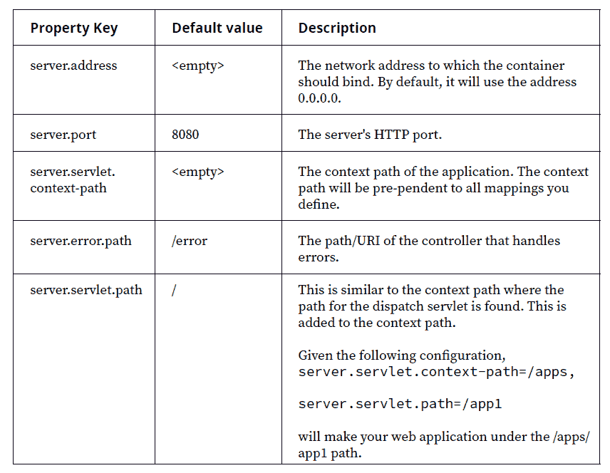

您可以在 Spring 文档中找到所有可用配置属性的详尽列表，网址为[`docs.spring.io/spring-boot/docs/current/reference/htmlsingle/#common-application-properties`](https://docs.spring.io/spring-boot/docs/current/reference/htmlsingle/#common-application-properties)。

# 过滤器

我们在关于 Servlet API 的先前部分学习了过滤器。过滤器被组织成链，并在实际 servlet 被调用之前由容器调用。最后，它们可以以相反的顺序处理响应。

Spring Boot 使安装过滤器变得非常简单。在 Spring Boot 中，通常有多种方法可以实现这一点。首先，您必须实现一个实现`javax.servlet.filter`接口的 Bean。您不需要在`web.xml`中添加配置，任何实现过滤器接口的 Spring Bean 都将自动安装。

看看以下代码：

```java
@WebFilter
@Component
@Slf4j
public class LogFilter implements Filter {
    @Override
    public void init(FilterConfig filterConfig) throws
ServletException {
    }

// […]

    @Override
    public void destroy() {
    }
}
```

前往[`bit.ly/2xeD5b4`](https://bit.ly/2xeD5b4)访问 Filter 代码示例的完整代码。

# 配置 Spring Web MVC

编写和配置 Web 应用程序始终是一项综合任务。幸运的是，Spring Boot 再次承担了繁重的工作。但在许多情况下，您需要修改或更重要的是扩展配置。这包括额外的映射和安全配置。

所有可用的配置方法都由 `WebMvcConfigurer` 接口提供。通常，配置方法会传递一个配置器对象，然后可以使用该对象来修改某个方面。

在 Spring 框架的先前版本中，您必须实现一个扩展抽象类 `WebConfigurerAdapter` 的 Bean。适配器类负责提供默认实现，这样您就可以专注于您想要定制的那些方法。

自从版本 5 以来，这不再需要。相反，现在您可以为只想覆盖的方法提供 `WebMvcConfigurer` 接口的实现：

```java
@Configuration
public class WebMVConfig implements WebMvcConfigurer {
    public void addViewControllers(
                       ViewControllerRegistry registry) {
        registry.addViewController("/")
                .setViewName("index");
   }
}
```

# 活动：创建您的第一个 Web MVC 控制器

**目标**

要设置一个 Spring Web MVC 项目，添加一个静态欢迎页面，并创建一个指向视图的控制器。

**场景**

您需要设置一个显示静态欢迎页面的 Web 应用程序。

**完成步骤**

1.  访问 [`start.spring.io`](https://start.spring.io) 并在以下屏幕上输入所需的依赖项：

    组：`com.packt.springboot`

    工件：`blogmania`

看看这个截图：


1.  下载包含初始项目文件的 ZIP 文件。

1.  将下载的文件解压到项目文件夹中。

1.  添加 Bootstrap Webjars 存档的依赖项。

1.  创建 `welcome.html` 文件。

1.  添加一个控制器以渲染视图。

1.  现在通过 Maven 命令启动应用程序。

1.  使用您的浏览器导航到 `http://localhost:8080` 以查看输出。

**结果**

生成的 Spring Web MVC 项目和帖子在网页上可见。

看看这个截图：

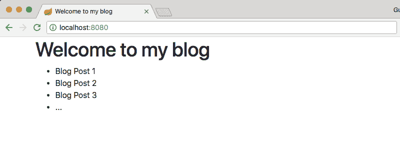

访问 [`bit.ly/2QpmQR9`](https://bit.ly/2QpmQR9) 以访问 `BlogManiaApplicationTests.java` 文件的代码。要参考详细步骤，请参阅本书末尾的 *解决方案* 部分的第 252 页。

# 摘要

在本章中，我们学习了关于模型-视图-控制器（MVC）模式的内容。它将 Web 应用程序的主要关注点分为模型、视图和控制器。

我们区分了基于请求和基于组件的 MVC，它们在框架如何处理传入请求方面有所不同，要么负责转换、验证等，要么让开发者处理这些方面，从而产生不同的代码重用性。

最后，我们实现了我们的第一个 Spring Web MVC 应用程序，以处理传入的请求并显示简单的页面输出。

在下一章中，我们将应用 MVC 模式到 Spring Boot。
