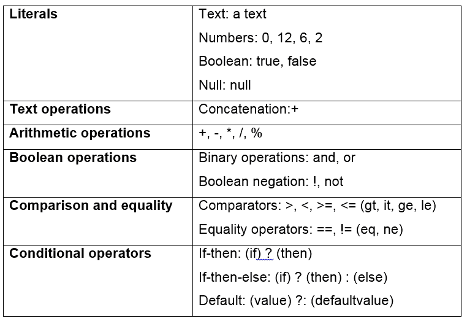
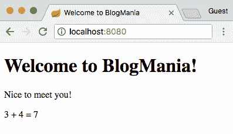
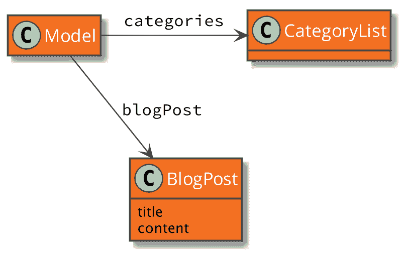
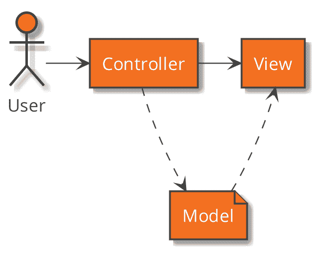
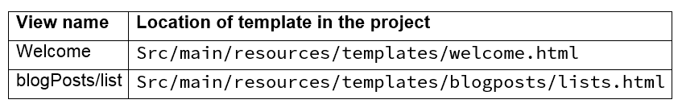
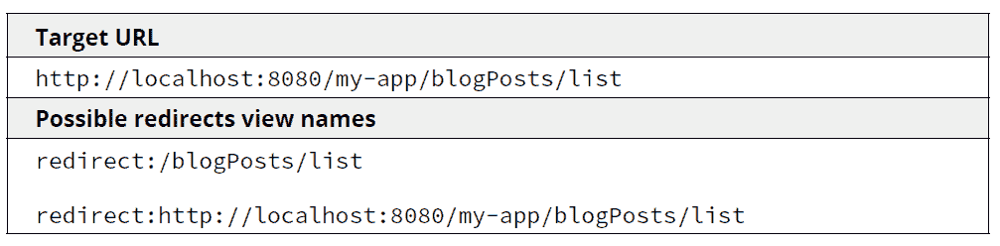
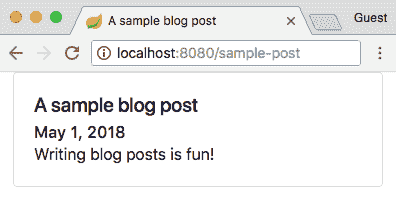
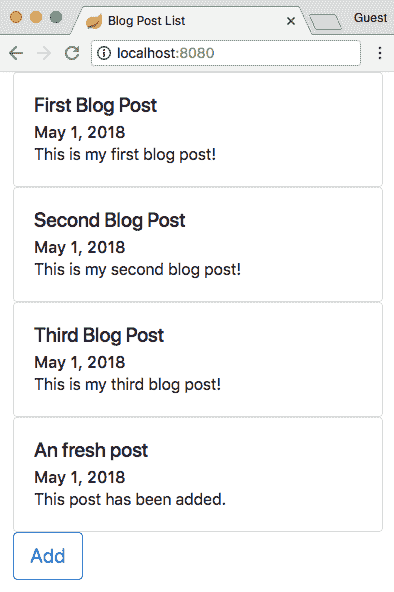
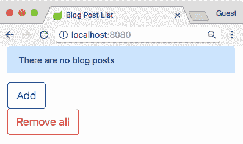

# 第五章：使用网页显示信息

在本章中，我们将学习模板引擎以及它们如何在 Spring Boot 2 中集成和使用。之后，我们将介绍 Thymeleaf，这是一个非常常用的模板引擎，它被用来构建显示动态数据的网页。

应用程序。

模板引擎是一个组合框架，它允许我们集成动态信息和构建块，使开发者能够独立创建页面片段。这些片段在应用程序运行或页面渲染时被组装在一起。Spring 与 Thymeleaf、Groovy Templates、Freemarker 和 Mustache 等模板引擎很好地集成。然而，我们将专注于 Thymeleaf，因为它被广泛使用，并允许我们舒适地处理用于 Web 应用程序的 HTML 页面。

到本章结束时，你将能够：

+   识别 Thymeleaf 模板引擎的工作原理

+   解释模板的基本语法

+   定义最重要的元素

+   解释如何遍历列表并条件性地显示页面的一部分

+   使用 Thymeleaf 构建网页以显示应用程序的动态数据

# 使用 Thymeleaf 进行 HTML 模板化

我们已经在上一章中讨论了模板引擎。现在我们将更详细地了解它们是如何工作的。

**Thymeleaf** 是一个服务器端模板引擎，它因 Spring Web MVC 应用程序而变得非常流行。它目前处于第三个主要版本。但 Thymeleaf 的应用范围远超常规的 Web 应用程序。它还被用来生成其他格式，如 PDF 或 XML。甚至可以将模板引擎集成到应用程序中，使其不仅被开发者使用，还可以被应用程序的最终用户使用。

Thymeleaf 之所以特别，在于它能够编写自然的 HTML 模板，这些模板可以在网页浏览器中显示，而无需运行应用程序。这允许在设计应用程序的用户界面时拥有非常短的开发周期。但缺点是，你可能必须添加一些额外的 HTML 属性，仅为了在设计时显示模板。然而，你可以决定何时需要这些额外的属性，何时可以省略它们。

其他流行的模板引擎是**Java 服务器页面**（**JSP**）和**FreeMarker**。然而，这些替代品在没有运行引擎的情况下，无法轻松地进行模板开发。

网页浏览器使用 HTML 来渲染页面。它主要由角括号内的标签组成（例如 `<div>`）。每个标签都有一个开始标签和一个结束标签（`<div>...</div>`）。标签还可以包含额外的属性（例如 `div class="important">`，其中 class 是属性）。

# 模板引擎

以下图表显示了各种组件之间典型的关系：


在 Thymeleaf 的情况下，模板是用常规的 XML、XHTML 或 HTML5 文件编写的。这些文件可以在浏览器中预览，无需运行模板引擎。为了让 Thymeleaf 执行其工作，你需要在 HTML 中添加特殊属性，这些标签通常以 `th` 开头：

```java
<p th:text="${welcome}">This will be replaced!</p>
```

# 将 Thymeleaf 集成到 Spring Boot 应用程序中

要在 Spring Boot 应用程序中集成 Thymeleaf，你需要在你的 Maven `pom.xml` 文件中添加以下依赖项：

```java
<dependency>
    <groupId>org.springframework.boot</groupId>
    <artifactId>spring-boot-starter-thymeleaf</artifactId>
</dependency>
```

这将在你的项目中包含 Thymeleaf 版本 3。由于 Spring Boot 正在为你处理配置，它期望模板位于 `src/main/resources/templates` 文件夹中。当你从控制器方法返回视图名称时，Spring 会在这个文件夹中查找一个具有视图名称和 .html 扩展名的文件。例如，名为 welcome 的视图应位于 `src/main/resources/templates/welcome.html` 文件中。

# 一个基本的 Thymeleaf 模板

以下代码展示了一个简单的 Thymeleaf 模板：

```java
<!DOCTYPE html>
<html >

  <head>
    <title>Welcome to BlogMania</title>
  </head>

  <body>
    <p th:text="${welcome}">This will be replaced!</p>
  </body>
</html>
```

文件的第二部分是使其成为模板的部分：

```java
<html >
```

这定义了 Thymeleaf 的命名空间，并允许使用 `th:` 作为前缀来标记特定于 Thymeleaf 的属性。

你可以在模板中找到许多这些属性、指令和表达式。它们允许你输出模型的内容，有条件地显示视图的部分，遍历列表或执行函数。

# 外部化文本

在某些情况下，你可能希望在模板外有文本。这被称为 **外部化文本片段**。你使用 Java 属性文件来存储这些片段。在 Spring Boot 应用程序的情况下，你在 `src/main/resources` 文件夹中创建一个名为 `messages.properties` 的文件。

由于这是一个常规的属性文件，你将文本作为属性添加：

```java
welcome.title=Welcome to BlogMania!
```

在 Thymeleaf 模板中，你通过使用 `#{...}` 表达式插入文本：

```java
<h2 th:text="#{welcome.title}">Welcome to BlogMania!</h2>
```

你可以在代码仓库中找到完整的示例。

在外部化字符串中包含占位符或参数是可能的。当页面渲染时，这些消息的部分将被模型属性或其他动态值替换。有关此功能的更多信息，请参阅 Thymeleaf 文档中的[`www.thymeleaf.org/doc/tutorials/3.0/usingthymeleaf.html#messages`](https://www.thymeleaf.org/doc/tutorials/3.0/usingthymeleaf.html#messages)。

# 创建上下文感知的 URL

Java Servlet 规范包括所谓的 **servlet 上下文**。当配置后，servlet 上下文是 URI 的一部分，它将被添加到每个映射的前面。例如，当将 servlet 上下文设置为 `/blogmania` 时，映射 `/blogposts` 将变为 `/blogmania/blogposts`。

在 Spring Boot 中，你在 `application.properties` 文件中设置上下文路径：

`server.servlet.contextPath=/blogmania`

# Thymeleaf 模板中的语句

除了包含外部化文本或创建 URL 的表达式之外，Thymeleaf 还提供了许多其他语句和表达式。它们可以用于任何以之前定义的命名空间 `th:` 为前缀的 Thymeleaf 属性。

以下表格列出了几个最有趣的声明：



以下是一个结合了此表中许多声明的示例：

```java
'User is of kind ' + (${user.isEditor()} ? 'Editor' : (${user.
kind} ?: 'Unknown'))
```

# 使用 Thymeleaf 进行引导和模板化

目标是实现 Thymeleaf 的引导并首次接触 Thymeleaf 模板化。完成步骤如下：

1.  在 [`bit.ly/2Og1oMZ`](https://bit.ly/2Og1oMZ) 中打开项目文件夹。

1.  使用 `mvnw spring-boot:run` 命令启动应用程序。

1.  将浏览器导航到 `http://localhost:8080` 以查看包含标题的页面。

1.  在您的 IDE 或文本编辑器中，将以下行添加到文件中：`src/main/resources/templates/welcome.html<p th:text="#{welcome.message}">信息如下！</p>`。

1.  在文件中添加另一行：

    `3 + 4 = <span th:text="3 + 4">计算结果</span>`。

1.  停止应用程序并使用之前的命令重新启动它。

1.  重新加载页面以查看以下输出：



通过本节，您已在 Thymeleaf 中实现了引导和模板化过程。

前往 [`bit.ly/2Og1oMZ`](https://bit.ly/2Og1oMZ) 访问 `exercise-first-thymeleaf/` 文件夹。

前往 [`bit.ly/2CP8dnd`](https://bit.ly/2CP8dnd) 访问 `ExternalizedTextApplicationTests.java` 文件的代码。

# 使用模型和数据绑定显示数据

**数据绑定**处理将来自两个不同数据源的信息绑定在一起，并保持它们同步。数据模型实例使用所需的方法从服务器设置或检索数据，并反映两个数据源之间的更改。

# Spring Web MVC 如何处理模型

我们刚刚查看的 Thymeleaf 引擎负责处理 MVC 模式的视图部分。模型是此模式的另一个方面，由 Spring MVC 框架处理。这包括创建和初始化模型属性，并在视图和控制器之间传递它。这与例如 Java Server Faces 不同，在 Java Server Faces 中没有单独的模型，但渲染视图的组件必须访问会话或请求的属性。

模型本身由一个或多个**命名属性**组成。在 Spring MVC 应用程序中常用的一种类是 `org.springframework.ui.Model` 类。它类似于一个映射，这意味着它是您将属性与其名称关联的地方。名称随后用于在渲染视图时引用模型中的属性。

例如，可能有一个名为 `blogPost` 的属性引用一个 `BlogPost` 类的实例，该实例本身包含有关应通过视图显示的帖子的信息：



# 模型-视图交互

以下图表显示了各种组件之间的典型关系：



# 将模型作为参数传递给处理方法

要将任意对象添加到模型中，你可以在处理方法中声明一个类型为 `org.springframework.ui.Model` 的方法参数。当 Spring MVC 处理请求时，将创建一个实例并将其提供给方法。

看看以下代码片段，它来自你可以在代码文件中找到的类 [`bit.ly/2OkI7ci`](https://bit.ly/2OkI7ci)[:](https://bit.ly/2OkI7ci)

```java
@GetMapping("/blogposts")
public String renderBlogPostList(Model model) {
    List<BlogPost> blogPosts =
                   blogPostService.findAllBlogPosts();
    model.addAttribute("blogPosts", blogPosts);
    return "blogposts/list";
}
```

`@GetMapping` 注解将此方法映射到 `/blogpost` URL。

将 `org.springframework.ui.Model` 类的实例作为参数传递给方法。

所有博客文章都是使用 `findAllBlogPosts()` 方法检索的。

将博客文章列表添加到模型中，并与其名称 `blogPosts` 关联。

返回要渲染的视图的名称。在这种情况下，视图名为 `blogposts/list`。

使用 `@ModelAttribute` 将模型属性作为方法参数传递。

在某些情况下，你可能只需要在处理方法中几个模型属性。在这种情况下，Spring 允许你使用包含属性名称的 `@ModelAttribute` 注解来注解方法的参数。然后 Spring 将尝试从模型中获取具有给定名称的现有属性。如果找不到属性，它将被创建。

每当属性初始化并添加到模型中时，相同的实例将在整个请求的其余部分中对该名称可访问。这意味着在渲染视图时，属性也存在于模板内部：

```java
@GetMapping("/blogposts/new")
public String initNewBlogPost(
              @ModelAttribute("blogPost") BlogPost blogPost
) {
    blogPost.setPublicationDate(LocalDateTime.now());
    return "blogposts/edit";
}
```

在这个示例中，Spring 确保一个名为 `blogPost` 的属性与模型相关联，然后将 `blogPost` 传递给处理方法，在那里它将被操作。最后，渲染名为 `blogposts/edit` 的视图。

# 从控制器方法返回模型属性

将属性绑定到模型的一种方法是通过从控制器方法返回它们。任何类型的对象都可以返回。然而，其中一些具有特殊含义，并将被适当处理。

当返回 `java.util.Map` 或 `org.springframework.ui.Model` 的实例时，它们的所有属性都将添加到现有模型中。

任何非 String 类型的任意对象都将添加到模型中。名称由返回类型的名称或（如果存在）`@ModelAttribute` 注解中给出的名称确定。

# 使用 @ModelAttribute 初始化模型属性

在控制器类中，任何带有 `@ModelAttribute` 注解的方法都在同一控制器中的实际请求处理方法之前调用。它可以访问作为参数传入的模型实例，返回前面描述的模型属性，甚至结合这两种方法。

查看以下代码示例：

```java
@ModelAttribute
public void addDefaultAttributes(Model model) {
    int allPostsCount = blogPostService.numberOfBlogPosts();
    model.addAttribute("allPostsCount", allPostsCount);
}
```

此方法将为控制器类处理的任何请求添加 `numBlogPosts()` 方法报告的所有帖子的数量。

如果需要访问此类值，您甚至可以使用 `@PathParam` 和类似的指令。例如，这可以用于查询数据库。

使用注解参数允许您仅获取在其他地方可能已初始化的某些属性。它还使处理方法能够清楚地表达其目的。最后，控制器方法不需要与整个模型纠缠。

有一个注解方法允许您使用通常用于所有视图且与当前要执行的任务无关的属性初始化模型。这表达了关注点分离的原则。

# Spring 框架如何选择视图

Spring 提供了多种渲染模型信息的方法。我们将特别查看 HTML 页面。

Thymeleaf 模板引擎使用视图名称来确定它应该使用哪个模板。

Thymeleaf 使用视图名称在 `src/main/resources/templates` 文件夹中搜索模板文件。文件名必须与视图名称完全相同，前面加上 `.html` 扩展名。

以下表格列出了一些示例：



# 通过返回其名称选择视图模板

查看以下代码示例：

```java
@GetMapping("/blogposts/new")
public String initNewBlogPost(
@ModelAttribute("blogPost") BlogPost blogPost
) {
blogPost.setPublicationDate(LocalDateTime.now());
return "blogposts/edit";
}
```

此示例将渲染位于 `src/main/resources/templates/blogPosts/list.html` 文件中的模板。

# 直接渲染视图而不是重定向到 URL

要重定向到 URL，您需要在处理方法返回的视图名称前加上 `redirect:` 前缀。这可以是相对于 servlet 上下文的 URL 或绝对 URL。模型中的任何属性都将作为查询参数添加到 URL 中。

这里有一个例子：



另一种重定向的方法是返回一个包含要重定向到的 URL 的 `org.springframework.web.servlet.view.RedirectView` 实例。这允许我们将额外的属性传递给重定向后执行的处理方法。

另一种类型的属性，称为**闪存属性**，在重定向后也将可用。

看看以下从仓库中基本 Thymeleaf 源代码的 `BlogPostController` 中提取的示例：

```java
@GetMapping("/blogposts/random")
public RedirectView displayRandomBlogPost(RedirectAttributes
attributes) {
    attributes.addFlashAttribute("flashMessage", "Enjoy this
post");
    attributes.addAttribute("extraMessage", "This message appears
in the query");
    BlogPost blogPost = blogPostService.randomBlogPost();
    return new RedirectView("/blogposts/" + blogPost.getSlug(),
true);
}
```

在 `RedirectView` 实例的构造函数中，指定重定向的 URL。第二个参数告诉 Spring 相对于当前应用程序的上下文路径进行重定向。在此处理方法返回后，客户端将被重定向到类似 `/blogPosts/slug-of-random-post?extraMessage=extraMessage=This+message+appears+in+the+query` 的 URL。处理此请求的方法能够访问 `flashMessage`：

```java
<html lang="en"
      >
<head>
    <title th:text="${blogPost.title}">Blog Post Title</title>
</head>
<body>
  <div th:text="${param.extraMessage}">The extraMessage
parameter</div>
  <div th:text="${flashMessage}">The flashMessage attribute</div>
</body>
</html>
```

相比之下，请求参数可以发送到任何应用程序或网站，因为它是编码在 URL 中的。

# 同时选择视图并返回模型

通过返回 `org.springframework.web.servlet.ModelAndView` 的实例，可以同时指定视图名称、添加模型属性或设置 HTTP 响应状态。

在本章代码库提供的 `BlogPostController` 中可以找到一个示例：

```java
@GetMapping("/blogpost/{slug}")
public ModelAndView displayBlogPostBySlug(@PathVariable String
slug)
    throws BlogPostNotFoundException {
    BlogPost blogPost = blogPostService.findBlogPostBySlug(slug)
            .orElseThrow(() -> new BlogPostNotFoundException("Blog
post with slug " + slug + " could not be found"));

    return new ModelAndView("/blogposts/details", "blogPost",
blogPost);
}
```

此方法返回以下信息：

视图名称 `/blogposts/details`。

一个名为 `blogPost` 的模型属性，包含实际的博客文章。

# 在 Thymeleaf 模板中处理模型

一旦处理方法提供了模型和视图名称，框架将同时传递这两个名称给 Thymeleaf 模板引擎。模型中添加的所有内容都将通过其属性名称在模板中可用。

# 将模型数据绑定到 Thymeleaf 模板

在 Thymeleaf 通过添加命名空间启用后，可以使用指令添加动态内容。这将通过使用 `th` 前缀来实现。例如，假设您已向模型添加了一个名为 `message` 的属性：

```java
<h1 th:text="${message}">This will be replaced!</h1>
```

而不是显示文本 `This will be replaced!`，将显示名为 `message` 的模型属性的内容。

要访问模型属性，使用 `${...}` 来引用模型中的属性。

# 添加动态数据

目标是在网页上显示动态数据。完成步骤如下：

1.  在您的 IDE 中打开 `exercise-basic-thymeleaf` 项目。

1.  打开 `BlogPostController` 类。

1.  添加以下方法，该方法将简单的博客文章添加到模型中：

```java
@GetMapping("/sample-post")
public ModelAndView displaySampleBlogPost() {
    BlogPost blogPost = new BlogPost();
    blogPost.setTitle("A sample blog post");
    blogPost.setPublicationDate(LocalDateTime.now());

    blogPost.setContent("Writing blog posts is fun!");

    return new ModelAndView("blogposts/details",
"blogPost", blogPost);
}
```

1.  打开 `src/main/resources/templates/blogposts/details.html` 文件

1.  在此标记的位置添加以下代码：

```java
<!-- Insert details view here -->
<div class="card">
    <div class="card-body">
        <h5 class="card-title" th:text="${blogPost.
title}">Title</h5>
        <h6 class="card-subtitle" th:text="${#temporals.
format(blogPost.publicationDate, 'MMMM d,
YYYY')}">Publication Date</h6>
        <p class="card-text" th:text="${blogPost.
content}">Main Content</p>
    </div>
</div>
```

1.  导航您的浏览器到 `http://localhost:8080/sample-post`。

您应该看到博客文章的详细信息：



通过这个子部分，您已经使用了动态数据并将其作为网页上的输出显示。

前往 [`bit.ly/2OcOLSH`](https://bit.ly/2OcOLSH) 访问 `exercise-basic-thymeleaf/` 文件夹。

前往 [`bit.ly/2MtdW1X`](https://bit.ly/2MtdW1X) 访问 `BasicThymeleafApplication.java` 文件的代码。

# 遍历和显示列表中的项目

当您想要显示项目列表时，您需要一种遍历该列表的方法。Thymeleaf 可以使用 `th:each` 指令遍历列表，例如数组或 Java 集合：

```java
<div th:each="currentBlogPost : ${blogPosts}">
    <h2 class="blog-post-title"
        th:text="${currentBlogPost.title}">Title</h2>
    <p th:text="${currentBlogPost.content}">
        Main Content</p>
</div>
```

这是您在 [`bit.ly/2Rqpkyn`](https://bit.ly/2Rqpkyn) 文件中找到的内容的简化版本。

此代码片段将为集合中具有 `blogPosts` 属性名的每个博客文章创建一个 `<div>`。在此 `<div>` 元素内部，可以通过使用名称 `currentBlogPost` 访问当前的博客文章对象。如您所见，标题和内容是通过 `th:text` 属性插入的。

# 处理列表

目标是在博客文章中显示列表。完成步骤如下：

1.  从前一节中打开 `src/main/resources/templates/index.html` 欢迎页面文件。

1.  在标记为 `<div>` 的位置添加以下代码：

```java
<!-- Insert list here -->
<div th:each="currentBlogPost : ${blogPosts}" class="card">
    <div class="card-body">
        <h5 class="card-title" th:text="${currentBlogPost.
title}">Title</h5>
        <h6 class="card-subtitle" th:text="${#temporals.
format(currentBlogPost.publicationDate, 'MMMM d,
YYYY')}">Publication Date</h6>
        <p class="card-text" th:text="${currentBlogPost.
content}">Main Content</p>
    </div>
</div>
```

1.  打开终端并转到 `exercise-basic-thymeleaf` 文件夹。

1.  输入 `mvnw spring-boot:run` 以启动应用程序。

1.  将您的浏览器导航到 `http://localhost:8080` 以查看列表的实际效果。

1.  点击“添加”按钮，以便列表应显示一个新条目：



在您通过遍历项目列表在网站上显示多个博客文章之后。

前一节子部分说明了使用 Thymeleaf 内置函数格式化时间属性（如用于博客文章发布日期的 `LocalDateTime`）的用法。

`th:text="${#temporals.format(currentBlogPost.publicationDate, 'MMMM d, YYYY')}"` 表达式从当前博客文章中获取发布日期并将其格式化为给定的模式。首先打印月份，然后是月份中的日期，接着是冒号和年份（2018 年 1 月 1 日）。

# 使用条件显示视图的一部分

除了遍历列表之外，Thymeleaf 还允许您根据状态模型属性隐藏或显示模板的某些部分。您还可以评估包含逻辑运算或方法调用的表达式。

为了有条件地显示页面元素，Thymeleaf 提供了 `th:if` 指令：

```java
<div th:if="${#lists.isEmpty(blogPosts)}">
    There are no blog posts
</div>
```

这是您在 [`bit.ly/2CRBV9A`](https://bit.ly/2CRBV9A) 文件中找到的内容的简化版本。

在这种情况下，当名为 `blogPosts` 的模型属性为空时，不会显示任何博客文章。

# 有条件地显示文本

目标是根据某些条件在屏幕上显示文本。完成步骤如下：

1.  从前一节中打开欢迎页面。

1.  在标记为 `<div>` 的位置的上面的列表上方添加以下代码：

```java
<!-- Insert conditional here -->
<div th:if="${#lists.isEmpty(blogPosts)}" class="alert
alert-primary">
    There are no blog posts
</div>
```

1.  打开终端并转到 `exercise-basic-thymeleaf` 文件夹。

1.  输入 `mvnw spring-boot:run` 以启动应用程序。

1.  将您的浏览器导航到 `http://localhost:8080` 以查看列表的实际效果。

1.  点击“删除所有”按钮以清除博客文章列表：



在本节中，您根据应用条件在网站上显示了文本数据。

您已经看到了多种向模型添加属性的方法。模型属性可以是任何通过名称引用的任意对象。名称是在将其添加到模型时由开发者定义的。这可以是单独的或映射处理方法。

# 活动：显示博客文章的详细信息

**目标**

实现处理方法和相应的视图模板。

**场景**

blogmania 应用程序已设置。有一个方法可以通过 slug 属性从内部存储检索博客文章。现在您想添加一个视图，当用户输入 `/blogposts/{slug}` URI 时显示博客文章。

**完成步骤**

1.  创建一个注解类并注入`BlogPostService`。

1.  向`BlogPostController`添加处理方法，并使用路径变量 slug 查找博客文章。当找不到博客文章时抛出异常。

1.  从`BlogPostService`检索博客文章。

1.  从所需方法返回实例。将视图名称设置为 blogpost 并添加从服务返回的博客文章。

1.  创建一个视图模板文件。

1.  使用 maven 命令启动应用程序。

1.  打开`http://localhost:8080/blogposts/my-first-post` URL 以查看输出屏幕：


**结果**

最终的处理方法和相应的视图模板在网页上可见。

前往[`bit.ly/2NGgDS4`](https://bit.ly/2NGgDS4)访问`BasicThymeleafApplication.java`文件的代码。要参考详细步骤，请参阅本书末尾第 254 页的“解决方案”部分。

# 摘要

在本章中，我们学习了关于 Thymeleaf 模板引擎的内容。我们探讨了如何将所需的依赖项添加到我们的项目中，以及编写视图模板的基本语法。

我们接着探讨了 Spring MVC 如何处理模型以及如何向其添加属性。添加和访问属性类似于 Java Map。

最后，我们探讨了 Thymeleaf 用于插入模型数据、遍历列表和条件显示页面部分的表达式和控制语句。

在本章中，我们学习了如何在视图中显示从控制器作为模型属性提供的已提供信息。在下一章中，我们将探讨如何将视图的输入传递给控制器。
