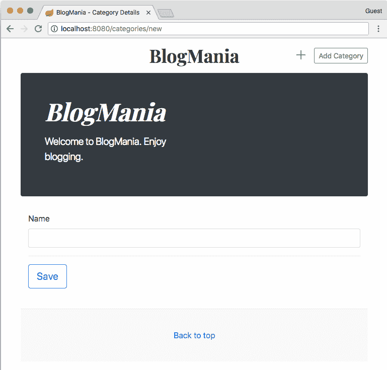

# 第六章：在视图和控制器之间传递数据

在本章中，我们将学习创建 HTML 表单以获取数据。一旦获取数据，我们将检查它。最后，我们将检查用于存储数据的字段类型。

HTML 表单或 Web 表单是一个旨在从网页收集数据以便存储或发送到服务器进行处理的文档。这些表单使用不同类型的元素，如复选框、单选按钮和文本字段，以接受各种类型的数值或文本数据。它们还可以包括按钮等交互式元素。

到本章结束时，你将能够：

+   创建 HTML 表单以获取用户输入

+   在你的 Spring 控制器中解释用户输入

+   检查表单中输入的数据

+   解释在浏览器中输入信息的不同类型的字段

# 表单处理

当使用 Web 应用程序时，通常有方法可以输入数据。例如，一个地址簿应用程序会允许用户将联系信息输入到表单中，并将输入存储在数据库中。输入到表单中的数据通常由相互关联的信息片段组成。例如，你可以想到个人信息、地址或银行账户。HTML 提供了一个名为表单的构造，以便允许更新或输入数据。

# HTML 表单

下面的摘录显示了一个非常简单的 HTML 表单：

```java
<html>
  <head>
    <title>Simple Form Page
    </title>
  </head>
  <body>
    <form method="post">
      <p>Please enter your given name:
        <input type="text" name="givenname"/>
      </p>
      <p>
        <input type="Submit" value="Send"/>
     </p>
   </form>
  </body>
</html>
```

# 处理 POST 数据

当数据输入到网页时，必须以某种方式将其传输到服务器进行进一步处理。为此，用于浏览器和服务器之间通信的 HTTP 协议实现了一个方法来完成这项任务。

当表单提交时，浏览器将生成一个所谓的请求，其中包含所有输入数据作为请求正文中的键值对。

例如，如果`title`的值为 My First Blog Post，而`content`设置为`Hello World`，则请求包含以下正文：

```java
title=My+First+Blog+Post&content=Hello+World
```

# 创建表单模板

由于我们正在使用 Thymeleaf 来渲染 HTML 页面，我们需要一种方法在视图渲染时显示模型中的数据。另一方面，提交的值必须成为控制器处理的模型的一部分。

# 简单输入字段

假设你想要求一个博客文章的给定标题。在这种情况下，你将定义你的输入字段如下，这是文件中摘录的一部分，文件位于[`bit.ly/2D6fkpQ`](https://bit.ly/2D6fkpQ)：

```java
<input type="text"
       id="title"
       name="title"
       th:value="${title}">
```

这将设置名为 title 的模型属性为输入字段的值。提交时，也将传递一个名为 title 的请求参数到控制器。

在这种情况下，你使用`th:value`或`th:text`，具体取决于你使用的输入字段类型。例如，`<input>`字段期望值存在于值属性中，而`<textarea>`需要预定义的值作为其内容。

控制器现在能够作为请求参数访问提交的值：

```java
@PostMapping("create")
public void createFromRequestParam(
    @RequestParam String title) {
    log.info("The title is " + title);
}
```

将`required = false`添加到参数引用中，可以避免在请求中缺少参数时抛出错误。

您可以在[`bit.ly/2Fx6rbI`](https://bit.ly/2Fx6rbI)文件中找到完整类的源代码。

由于您必须手动添加大量属性并多次重复字段名称，因此这是一个非常繁琐且容易出错的办法。

幸运的是，有一种更简单的方法可以在控制器和视图之间双向传递模型或其属性，我们很快就会看到。

# 实现 Thymeleaf 表单语法

目标是在网站上实现 Thymeleaf 表单语法。

完成步骤如下：

1.  打开位于[`bit.ly/2p38GIR`](https://bit.ly/2p38GIR)的项目。

1.  打开`BlogPostController`类，并插入以下处理方法：

```java
@PostMapping("create-multiple-values")
public ModelAndView createBlogPostFromMultipleValues(
  @RequestParam(name = "title")
  String title,
  @RequestParam(name = "slug")
  String slug,
  @RequestParam(name = "content")
  String content,
  @RequestParam(name = "visible", defaultValue = "visible")
  boolean visible) {
  BlogPost createdBlogPost = createBlogPost(title,
                                            slug,
                                            content,
                                            visible);
  return new ModelAndView(
               "blogposts/show",
               "blogPost",
               createdBlogPost);
}
```

1.  打开`src/main/resource/templates/form-multiple-values.html`文件，并插入以下表单定义：

```java
<form action="#" th:action="@{/blogposts/create-multiple
values}" method="post">
  <div class="form-group">
    <label for="title">Title</label>
    <input type="text"
           // […]
  <button type="submit" class="btn btn-primary">Submit</
button>
</form>
```

访问[`bit.ly/2xec8E6`](https://bit.ly/2xec8E6)以访问表单定义代码示例的完整代码。

1.  使用`mvnw spring-boot:run`命令启动应用程序。

1.  使用您的浏览器打开 URL `http://localhost:8080/blogposts/new-multiple-values`以查看以下输出：


1.  现在，输入详细信息并点击提交。

1.  您现在应该看到以下页面，总结您输入的值：


通过这种方式，您已经在网站上利用了 Thymeleaf 表单语法来指示博客文章的状态。

访问[`bit.ly/2x6VwPp`](https://bit.ly/2x6VwPp)以访问`formmultiple-values.html`文件的代码。

访问[`bit.ly/2CPfkfp`](https://bit.ly/2CPfkfp)以访问`FormhandlingIntroApplication.java`文件的代码。

访问[`bit.ly/2p38GIR`](https://bit.ly/2p38GIR)以访问`form-handling/`文件夹。

# 表单后端 Bean

在使用网页操作数据的 Web 应用程序中，您想通过使用可以在视图和控制器之间传递的对象或表单后端 Bean 来紧密耦合信息。这种类型的 Bean 提供了获取器和设置器来访问表单中每个字段的值。在 Spring MVC 中，这种类型的对象被称为**命令**。

以下代码片段显示了一个示例命令类，它支持表单以显示和修改博客文章。请注意 Project Lombok 的使用，以避免构造函数、获取器和设置器的样板代码：

```java
@Data
public class BlogPost {
    private LocalDateTime publicationDate;
    private String slug;
    private String title;
    private String content;
}
```

如您所注意到的，这看起来像是一个常规的 Java Bean；事实上，Java Bean 和 Spring MVC 命令类之间没有区别。

# 为编辑填充表单 Bean

在之前，我们曾将模型的单个值绑定到表单的字段。当表单 Bean 有很多属性时，为每个字段重复模型属性名称可能会变得相当繁琐。

由于从表单后端 Bean 访问值是一个非常常见的任务，Thymeleaf 在`<form>`标签中提供了`th:object`属性来指定将在整个表单中访问的命令对象：

```java
<form action="#" th:action="@{/blogposts/create}"
th:object="${blogPostCommand}" method="post">
  <input type="text" id="title" th:field="*{title}">
  <input type="text" id="slug" th:field="*{slug}">
  <button type="submit">Submit</button>
</form>
```

在为表单设置对象之后，Thymeleaf 表达式`*{...}`允许你访问该对象的字段，而无需反复引用模型属性。

请注意，在使用此属性时存在限制。必须使用变量表达式`(${...})`指定模型属性名称，而不进行任何属性导航。这意味着`${blogPostCommand}`是完全可以接受的，而`${pageData.blogPostCommand}`会导致错误。此外，表单内不允许有其他`th:object`属性。

# 从表单数据处理开始

目标是使用表单数据处理来创建一个带有后端 Bean 的博客文章。完成步骤如下：

1.  打开位于[`bit.ly/2p38GIR`](https://bit.ly/2p38GIR)的项目。

1.  打开`CreateBlogPostCommand`类，并按以下方式完成类：

```java
@Data
public class CreateBlogPostCommand {
    private String title;
    private String slug;
    private String content;
    private boolean visible;
}
```

1.  打开`BlogPostController`类，并插入以下处理方法：

```java
@GetMapping("new-backing-bean")
public ModelAndView renderFormViewForBackingBean() {
    CreateBlogPostCommand createBlogPostCommand =
        new CreateBlogPostCommand();
    createBlogPostCommand.setTitle("Default Title");

    return new ModelAndView("blogposts/form-backing-bean",
                            "createBlogPostCommand",
                            createBlogPostCommand);
}

} @PostMapping("create-backing-bean")
public ModelAndView createBlogPostFromBackingBean(@
ModelAttribute
   CreateBlogPostCommand createBlogPostCommand) {
    BlogPost createdBlogPost = createBlogPost(
             createBlogPostCommand.getTitle(),
             createBlogPostCommand.getSlug(),
             createBlogPostCommand.getContent(),
             createBlogPostCommand.isVisible());

    return new ModelAndView("blogposts/show",
                            "blogPost",
                            createdBlogPost);
}
```

1.  打开`src/main/resource/templates/form-backing-bean.html`文件，并插入以下表单定义：

```java
<form action="#" th:action="@{/blogposts/create-backing-
bean}" th:object="${createBlogPostCommand}" method="post">
  <div class="form-group">
    <label for="title">Title</label>
    <input type="text"
           class="form-control"
            // […]
    </div>
   <button type="submit" class="btn btn-primary">Submit</
button>
</form>
```

前往[`bit.ly/2NJ5IqO`](https://bit.ly/2NJ5IqO)以访问表单定义代码示例的完整代码。

1.  通过使用`mvnw spring-boot:run`命令启动应用程序。

1.  使用你的浏览器打开 URL `http://localhost:8080/blogposts/new-backing-bean` 来查看输出：


1.  现在输入详细信息并点击提交。

1.  查看以下截图，总结你输入的值：


使用这种方式，你已经利用表单数据处理创建了一个带有后端 Bean 的博客文章。

前往[`bit.ly/2D3aziP`](https://bit.ly/2D3aziP)以访问`FormhandlingIntroApplication.java`示例的完整代码。

前往[`bit.ly/2p38GIR`](https://bit.ly/2p38GIR)以访问`form-handling/`文件夹。

# Bean 验证

当涉及到获取数据时，通常会有关于值有效性的约束。这可能是一个技术约束（它必须是一个数字）或业务约束（21 岁或以上）。对于这种验证，有一个名为 Bean Validation 的框架，适用于 Java 等 JVM 语言。

如果你想了解更多关于 Java Bean 验证框架的信息，你可以访问项目的首页

[`beanvalidation.org/`](http://beanvalidation.org/)，这是一个非常好的起点。

覆盖 Bean Validation 框架超出了本书的范围。然而，基本概念是使用注解定义 Java Bean 中属性的约束。然后使用验证器执行实际的验证。

以下代码片段展示了可以验证的 Java Bean 的示例：

```java
@Data
@NoArgsConstructor
public class CreateValidatedBlogPostCommand {
    @NotBlank
    @Size(max = 140)
    // title is not allowed to be empty
    // or longer than 140 characters
    private String title;

    @Size(min = 3, max = 60)
    // slug must be between 3 and 60 characters long
    private String slug;

    @NotBlank
    // content must not be empty
    private String content;

    private boolean visible;
}
```

除了将注解应用于模型类之外，验证模型几乎不需要做任何事情。大部分繁重的工作，如配置验证框架和调用验证器实现，都是由 Spring 完成的。为了最终执行实际的验证，在控制器方法中使用`@Validated`注解：

```java
@PostMapping("create-validated-bean")
public String createBlogPostFromValidatedBean(
        @Validated @ModelAttribute CreateValidatedBlogPostCommand
createValidatedBlogPostCommand,
        BindingResult bindingResult,
        Model model) {
    if (bindingResult.hasErrors()) {
        return "blogposts/form-validated-bean";
    }
    //...
    return "blogposts/show";
}
```

与 Spring Boot 采用的大多数框架一样，您可以使用 Spring 注解（`@Validated`）或原始项目的注解（`@Valid`）。

除了`@Validated`注解外，此代码还展示了`BindingResult`类的使用，该类也作为参数传递。`bindingResult`参数用于确定在先前的请求中是否有任何验证约束被违反。在先前的示例中，如果发生验证错误，将渲染另一个视图，而不是数据输入正确的情况。通常，在这些情况下将使用包含原始表单的视图。

通常，将`BindingResult`添加到控制器方法中是可选的。然而，如果它缺失或没有紧跟在要验证的模型属性之后，将显示一个通用的错误页面。原因是 Spring MVC 确定控制器方法无法处理验证错误，因此转向通用错误处理器以处理不良请求。

# 将验证消息添加到模板中

当用户输入无效信息时，通知用户这一点是一个好的做法。通常，这是通过显示应用程序期望的额外信息来完成的。甚至可以修改受影响值的输入字段的样式，例如将其变为红色。

对于这种情况，Thymeleaf 提供了多种工具来显示这些类型的错误。以下列出了一些名为 title 的模型属性或字段的示例：


如果违反了约束并且应该显示消息，Bean Validation 框架提供了一个默认的错误消息。

# 利用 Spring 的验证功能

目标是使用 Spring 和 Thymeleaf 验证数据。完成步骤如下：

1.  打开位于[`bit.ly/2p38GIR`](https://bit.ly/2p38GIR)的项目。

1.  打开`CreateValidatedBlogPostCommand`类，并按以下方式完成该类：

```java
@Data
public class CreateValidatedBlogPostCommand {
    @NotBlank
    @Size(max = 140)
    private String title;
    @Size(min = 3, max = 60, message = "{slug.size}")
    private String slug;
    @NotBlank
    private String content;
    private boolean visible;
}
```

1.  打开`BlogPostController`类，并插入以下处理方法：

```java
@GetMapping("new-validated-bean")
public ModelAndView renderFormViewForValidatedBean() {
  CreateValidatedBlogPostCommand
    createValidatedBlogPostCommand =
      new CreateValidatedBlogPostCommand();
createValidatedBlogPostCommand.setTitle("Default Title");

return new ModelAndView("blogposts/form-validated-bean",
                        "createValidatedBlogPostCommand",
                        createValidatedBlogPostCommand);
}

@PostMapping("create-validated-bean")
public String createBlogPostFromValidatedBean(
          @Validated @ModelAttribute
          CreateValidatedBlogPostCommand
            createValidatedBlogPostCommand,
          BindingResult bindingResult,
          Model model) {
  if (bindingResult.hasErrors()) {
    return "blogposts/form-validated-bean";
  }

  BlogPost createdBlogPost =
             createBlogPost(
               createValidatedBlogPostCommand.getTitle(),
               createValidatedBlogPostCommand.getSlug(),
               createValidatedBlogPostCommand.getContent(),
               createValidatedBlogPostCommand.isVisible());

 model.addAttribute("blogPost", createdBlogPost);
 return "blogposts/show";
}
```

1.  打开`src/main/resource/templates/form-validated-bean.html`文件，并插入以下表单：

```java
<form action="#"
      th:action="@{/blogposts/create-validated-bean}"
      th:object="${createValidatedBlogPostCommand}"
      // […]
    </div>
  </div>
  <button type="submit"
          class="btn btn-primary">Submit</button>
</form>
```

前往[`bit.ly/2Ofv2Su`](https://bit.ly/2Ofv2Su)以访问表单的代码。

1.  使用`mvnw spring-boot:run`命令启动应用程序。

1.  使用您的浏览器打开 URL `http://localhost:8080/blogposts/new-validated-bean`以获取以下输出页面：


1.  现在输入详细信息并点击提交。

1.  您现在应该看到以下页面，总结您输入的值：


通过这种方式，您已经利用了 Spring 的内置验证功能来测试数据。

前往[`bit.ly/2p4Sgjo`](https://bit.ly/2p4Sgjo)访问`FormhandlingIntroApplication.java`文件的完整代码。

# 自定义验证消息

默认情况下，Bean 验证框架为最常见的验证约束违规提供了消息。然而，在许多情况下，您可能想要自定义这些消息或提供多语言的消息。

每个验证注解还包括一个消息属性，可以用来设置自定义消息。这可以通过直接编码到源代码中的静态消息来完成。

例如，`@Size(min = 3, max = 60, message = "The size is incorrect")`将显示消息。如果相应的字段不满足此要求，则大小不正确。

与将消息添加到应用程序的源代码相比，将文本外部化是一种更好的做法。为了实现这一点，首先需要在`src/main/resources`文件夹中创建一个`ValidationMessages.properties`文件。一旦创建，消息就会添加到这个文件中，并使用一个唯一的消息键。遵循命名约定是个好主意。以下是一个消息属性的示例：

```java
slug.size=Size has to be between 3 and 60!
```

在注释中，可以通过将键放在花括号中来引用此消息：

```java
@Size(min = 3, max = 60, message = "{slug.size}")
private String slug;
```

验证框架将自动从`ValidationMessages.properties`文件中获取消息。

# 为验证器设置新的默认消息

另一种自定义验证错误消息的方法是为验证器提供一个新的默认错误消息。这也在`ValidationMessages.properties`文件中完成。在这种情况下，使用全类名后跟.message 作为属性键：

`javax.validation.constraints.NotBlank.message=This field must not`

`be blank!`

在这种情况下，所有使用`@NotBlank`注解注解的属性在违反规则的情况下将使用提供的信息，前提是没有使用注解的消息属性设置隐式消息。

# 为 Bean 属性设置消息

设置自定义消息的第三种方式是在模型中指定属性的名称。与 Validation Framework 提供的先前机制相比，这一机制由 Spring MVC 处理。

这次，消息存储在`src/main/resources/messages.properties`文件中。以下示例演示了如何构建属性键：

```java
NotBlank.createValidatedBlogPostCommand.title=The title must not
be blank!
```

首先，使用用于验证的注解名称（例如，`@NotBlank`）。然后是模型属性名称（在这种情况下，它是`createValidatedBlogPostCommand`）。最后，将模型类中属性的路径附加到后面（标题属性）。

在前面的例子中，如果`createValidatedBlogPostCommand`模型属性的标题属性为空，则会显示消息“标题不能为空！”。对于任何其他带有`@NotBlank`注解的字段，消息将根据之前描述的机制确定。

# 为消息提供翻译

可以应用于消息的最终改进是在多种语言中提供自定义验证消息。

除了默认属性文件外，具有相同名称的`messages.properties`和`ValidationMessages.properties`文件后面跟着语言代码。例如，`messages_de.properties`和`ValidationMessages_de.properties`将提供所有自定义消息的德语翻译。

# 修改验证消息

目标是修改和翻译验证消息。

1.  打开位于[`bit.ly/2p38GIR`](https://bit.ly/2p38GIR)的项目。

1.  打开`src/main/resources/messages.properties`文件并添加以下行：

```java
NotBlank.createValidatedBlogPostCommand.title=The title
must not be blank!
```

1.  打开`src/main/resources/messages_de.properties`文件并添加以下行：

```java
NotBlank.createValidatedBlogPostCommand.title=Der Titel
darf nicht leer sein!
```

1.  使用`mvnw spring-boot:run`命令启动应用程序。

1.  使用您的浏览器打开 URL `http://localhost:8080/blogposts/new-validated-bean`。

1.  清除标题字段并提交表单以查看输出：


通过这种方式，您已自定义了验证消息，并为另一种语言提供了翻译。

前往[`bit.ly/2p4Sgjo`](https://bit.ly/2p4Sgjo)访问`FormhandlingIntroApplication.java`文件的完整代码。

# 表单输入类型和值绑定

在查看数据如何在视图和控制器之间传递之后，本节将使我们能够使用 HTML 模板引擎 Thymeleaf 中的不同类型的输入字段。这些字段的值需要绑定到控制器要处理的模型属性。

使用 HTML 表单的一个重要方面是文本、数字或其他类型值之间没有区别。然而，Java 基于强类型系统，需要显式类型。因此，值必须从或转换为文本表示。这项任务由可用的转换器类完成，这些类适用于最常见的 Java 类型，如数字、枚举或布尔值。Spring 将自动找到适当的转换器实现，以将值从或转换为文本表示。

更多关于类型转换以及如何实现自定义转换器的信息可以在 Spring 框架文档中找到，具体位置为[`docs.spring.io/spring/docs/current/spring-frameworkreference/core.html#core-convert`](https://docs.spring.io/spring/docs/current/spring-frameworkreference/core.html#core-convert)。

在本章的剩余部分，我们将专注于在 Spring MVC Web 应用程序中使用 Thymeleaf 收集用户输入的常用表单元素。

你可以在配套的仓库中找到所有示例代码，具体位置为[`bit.ly/2QIcXxv`](https://bit.ly/2QIcXxv)。你可以通过运行`mvnw spring-boot:run`或使用 IDE 来启动应用程序。

# 输入文本或数字的元素（文本、隐藏、密码）

下表列出了输入字段最常见的使用案例：


`.../src/main/resources/templates/inputform.html`文件展示了在 Thymeleaf 中如何使用`<input>`标签。需要注意的是，根据你需要如何引用模型属性，重要的属性是`th:value`或`th:field`：

```java
<div>
    <label for="textValue">Text Value:</label>
    <input type="text" id="textValue" th:field="*{textValue}">
</div>
<div>
    <label for="numberValue">Number Value</label>
    <input type="number" id="numberValue"
th:field="*{numberValue}">
</div>
<div>
    <label for="passwordValue">Password Value</label>
    <input type="password" id="passwordValue"
th:field="*{passwordValue}">
</div>
<div>
    <label for="hiddenValue">Hidden Value</label>
    <input type="hidden" id="hiddenValue"
th:field="*{hiddenValue}">
</div>
```

输入字段的类型远不止这里讨论的这些。然而，将要传输的值总是某种文本表示。关于这些类型及其使用的完整列表，可以在[`developer.mozilla.org/en/docs/Web/HTML/Element/Input`](https://developer.mozilla.org/en/docs/Web/HTML/Element/Input)或[`html.spec.whatwg.org/multipage/forms.html`](https://html.spec.whatwg.org/multipage/forms.html)的 Mozilla 开发者文档（MDN）中找到。

# 输入选择元素（复选框、单选按钮）

我们现在将讨论的另一组输入字段是那些通过旋转、选择或取消选择来选择单个选项，或者从选项列表中选择一个元素的输入字段。

**复选框**：通常在启用或禁用选项时使用布尔值。

**单选按钮**：通常在从选项列表中选择一个值时使用纯文本或数字。

当涉及到单选按钮元素时，所有属于同一组的输入字段都应该引用我们模型的相同字段或属性。因此，每个输入元素都将附加相同的`th:field`属性：

```java
<input type="radio"
       id="radioVal1"
       value="Radio Value 1"
       th:field="*{radioValue}">
<label for="radioVal1">Radio Value1</label>
<input type="radio"
       id="radioVal2"
       value="Radio Value 2"
       th:field="*{radioValue}">
<label for="radioVal2">Radio Value 2</label>
```

在`.../src/main/resources/templates/inputform.html`文件的前一个示例中，你可以看到两个单选字段都引用了名为`radioValue`的字段。由于 Thymeleaf 将处理字段命名，因此可以省略 HTML 的 name 属性。

编写长列表的单选选项可能会变得相当复杂。因此，Thymeleaf 提供了一套工具来简化这项任务：

```java
<div
  th:each="dynamicRadioOption : ${dynamicRadioOptions}">
     <input type="radio"
            th:field="*{dynamicRadioValue}"
            th:value="${dynamicRadioOption}"/>
     <label th:for="${#ids.prev('dynamicRadioValue')}"
            th:text="#{${'radioValue.' + dynamicRadioOption}}">
       Value
  </label>
</div>
```

在这个例子中，取自同一文件，模型属性`dynamicRadioOptions`提供了一个选项列表。对于这个列表的每个元素，都会生成一个单选类型的输入字段和一个标签。

注意 Thymeleaf `#ids.prev()` 函数的使用，它指的是前一个输入字段的 ID。

# 用户交互的输入元素（提交）

最后也许是最重要的输入元素是提交类型的输入元素。它渲染一个按钮，该按钮将提交它所在的表单：


```java
<input type="submit" value="Submit">
```

# 选择（单选，多选）

在 HTML 表单中使用的另一个重要输入元素是 `<select>` 元素。它允许您通过显示下拉列表或内联列表来获取用户输入：

```java
<div>
  <label th:for="${#ids.next('singleSelectValue')}">
    Single Select Value</label>
  <select th:field="*{singleSelectValue}">
    <option th:each="selectOption : ${allSelectOptions}"
            th:value="${selectOption}"
            th:text="#{${'selectOption.' + selectOption}}">
      selectOption
   </option>
  </select>
</div>
```

前面的示例将渲染一个下拉菜单，而下面的示例，我们只添加了大小属性，渲染一个内联列表：

```java
<div>
  <label th:for="${#ids.next('singleListValue')}">
    Single List Value
  </label>
  <select th:field="*{singleListValue}" size="5">
    <option th:each="selectOption : ${allSelectOptions}"
            th:value="${selectOption}"
            th:text="#{${'selectOption.' + selectOption}}">
      selectOption
    </option>
  </select>
</div>
```

这两个示例都可以在 `.../src/main/resources/templates/selectform.html` 文件中找到。

此示例还演示了确定元素 ID 的另一种方法。在这种情况下，`${#ids.next()}` 函数将返回下一个字段元素的 ID。

`<select>` 标签将具有与 `<input>` 元素相同类型的值。这意味着模型属性将被转换为或从其文本表示形式转换。如果需要，将执行转换。如前例所示，选项的渲染类似于单选输入元素。

# 选择多个值

以下代码片段说明了如何允许从列表中选择多个值：

```java
<div>
  <label th:for="${#ids.next('multipleListValue')}">
    Single List Value
  </label>
    <select th:field="*{multipleListValue}"
            size="5"
            multiple="multiple">
        <option th:each="selectOption : ${allSelectOptions}"
                th:value="${selectOption}"
                th:text="#{${'selectOption.' + selectOption}}">
          selectOption
        </option>
    </select>
</div>
```

这个示例可以在与之前示例相同的文件中找到。

# 文本区域（常规，不安全内容）

最后要查看的元素是 `<textarea>` 元素。它用于输入长文本。其用法与常规文本 `<input>` 字段没有太大区别。要将模型值绑定到 `textarea` 元素，使用相同的 `th:value` 或 `th:field` 属性，就像之前一样：

```java
<textarea th:field="*{textareaValue}"
          th:rows="${textareaRows}"
          cols="40"></textarea>
```

此示例可以在 `.../src/main/resources/templates/textareaform.html` 文件中找到。

重要的是要注意，Thymeleaf 还提供了 `textarea` 的行和列属性的属性。如前例所示，行数由名为 `textareaRows` 的模型属性提供。

在使用 `textarea` 可以最好地展示收集文本输入的一个方面，但无论何时允许自由文本输入，这一点都很重要。

# 安全/不安全文本

为了防止代码注入，用于将文本渲染到页面上的 `th:text` 属性将编码任何文本，使其在 HTML 页面中可见。例如，如果值包含文本 `<input>`，它将被编码并输出为 `&lt;input&gt;`，以确保正确显示。然而，可能存在需要显示未修改值的用例。在这种情况下，您使用 `th:utext` 属性，它告诉 Thymeleaf 输出内容而不进行任何修改。

如果你使用`th:utext`显示用户生成的内容，你将容易受到**XSS**（跨站脚本攻击）的影响，所以请确保你只使用它来生成或以其他方式清理的 HTML 内容。

以下代码片段来自`.../src/main/resources/templates/textareadisplay.html`文件，展示了这一概念：

```java
<div>
    <span th:text="*{safeTextValue}">safeTextValue</span>
</div>
<h2>Text Area for Unsafe Text</h2>
<div>
    <span th:utext="*{unsafeTextValue}">unsafeTextValue</span>
</div>
```

# 利用 Thymeleaf 中的复选框

目标是添加复选框并在 Thymeleaf 中条件性地显示内容。完成步骤如下：

1.  打开位于[`bit.ly/2QIcXxv`](https://bit.ly/2QIcXxv)的项目。

1.  打开`BlogPost`类并添加以下属性：

```java
private boolean slugVisible;
```

1.  打开`BlogPostController`类，并用以下实现替换现有的`initBlogPost()`方法：

```java
private BlogPost initBlogPost() {
    BlogPost blogPost = new BlogPost();
    blogPost.setSlugVisible(true);

    return blogPost;
}
```

1.  打开`src/main/resources/templates/blogpostform.html`文件，并在标记的位置插入以下代码：

```java
<div class="form-group">
  <label for="title">Slug <input type="checkbox"
                                 id="slugVisible"

th:field="*{slugVisible}"></label>
  <input type="text"
         th:if="*{slugVisible}"
         class="form-control"
         id="slug"
         th:field="*{slug}"
         placeholder="Blog Post Slug">
</div>
```

1.  启动应用程序，并在浏览器中打开`http://localhost:8080`：


1.  现在禁用**Slug**标签后面的复选框，并点击提交，你将看到以下表单：


通过这种方式，你可以根据应用程序状态显示或隐藏表单的部分。

前往[`bit.ly/2p6hIol`](https://bit.ly/2p6hIol)访问`InputTypesAndValueBindingApplication.java`文件的代码。

# 活动：创建一个输入新博客文章类别的页面

**目标**

为了实现类别和博客文章的模型视图控制器，并扩展博客文章以选择一个类别。

**场景**

Blogmania 应用程序能够显示和捕获博客文章。现在，你想要向现有应用程序添加设置类别的能力。

**完成步骤**

1.  打开位于[`bit.ly/2Ft1iBQ`](https://bit.ly/2Ft1iBQ)的项目。

1.  从包文件夹中打开空的类别模型类。

1.  向模型类添加一个名为`name`的字符串类型属性，并使用 Lombok 注解生成数据类的所有方法。

1.  在与类别类相同的包中打开控制器类。

1.  添加一个类型为`list<Category>`的字段，用于存储所有可用的类别。

1.  添加一个方法来初始化一个新的空类别并将其作为属性添加到模型中。

1.  为`/categories`添加一个带有 POST 请求映射的方法。

1.  实现当前空的方法以返回所有类别的列表。

1.  打开将包含类别表单的文件。

1.  添加一个输入类别名称的表单。

1.  打开用于编辑博客文章的表单文件。

1.  向表单中添加一个下拉字段以生成所有选项。

1.  启动应用程序，并在浏览器中打开`http://localhost:8080`以查看输出。

    看看以下截图：


1.  现在点击添加类别：



1.  输入类别标题并点击保存。

1.  添加尽可能多的类别。

1.  现在点击右上角的加号（+）：


1.  输入一个博客文章并查看分类列表。

1.  点击保存后，所选分类应出现在博客文章标题下方：


**结果**

实现了分类的模型视图和控制器，并将博客文章扩展为选择一个分类。

前往[`bit.ly/2MwgE6Q`](https://bit.ly/2MwgE6Q)访问`BlogmaniaApplication.java`文件的完整代码。要参考详细步骤，请参阅本书末尾的*解决方案*部分，第 255 页。

# 摘要

在本章中，我们探讨了如何使用 HTTP 请求将数据从浏览器发送到 Web 应用。之后，我们讨论了多个参数的使用与表单后端 Bean 之间的区别。接着，我们发现了如何验证 Beans 以及自定义默认错误信息。然后，我们讨论了各种表单输入字段，如文本输入、下拉菜单和复选框。完成本章后，你现在能够基于 Spring Boot、Spring Web MVC 和 Thymeleaf 模板引擎构建 Web 应用。

在下一章中，我们将探讨 RESTful API，与 HTML 视图和表单不同，这些 API 旨在服务或机器之间的通信。
