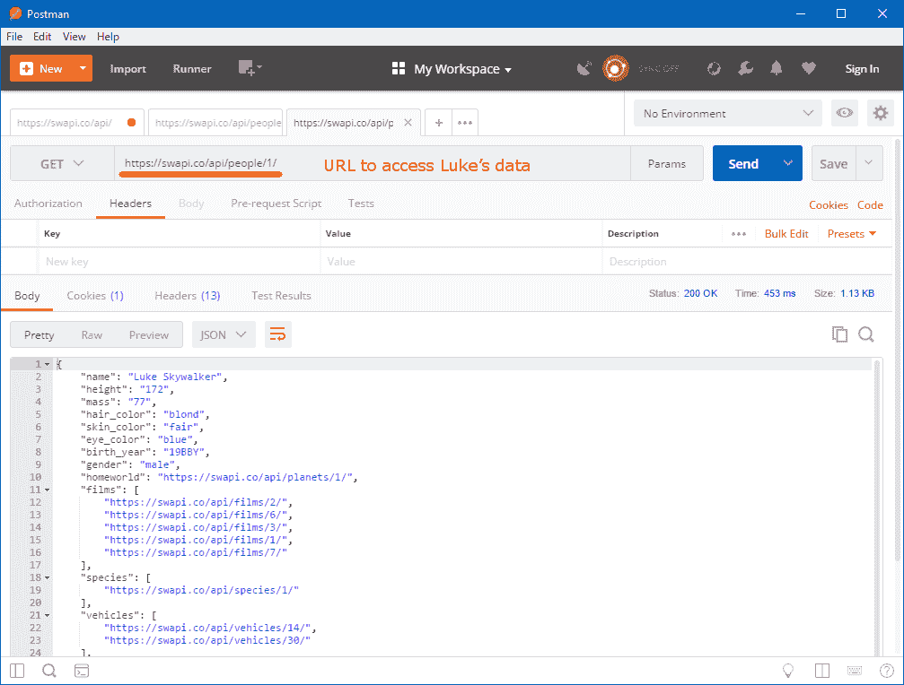

# RESTful APIs

在本章中，我们将学习 REST 的基础知识以及如何使用 Postman 和 Spring 访问和编写 REST API。最后，我们将构建一个具有 REST 接口的应用程序。

Postman 是一个通过构建请求和读取响应与 HTTP API 交互的图形界面应用程序。

到本章结束时，你将能够：

+   解释 REST 的基本原理

+   使用 Postman 访问公共和个人 REST API

+   使用 Spring 编写 REST API

+   基于 blogmania 应用程序构建具有 REST 接口的应用程序

# 什么是 RESTful API？

**应用程序编程接口**（**API**）是面向机器（或其他软件产品）而不是人的软件的访问点。最近它成了一种流行语，尽管这个概念已经存在了几十年。

API，尤其是（和最近）REST API，是通信服务的骨干。它们是现代分布式云应用程序工作的基础。它们也是现代浏览器用户界面与其后端服务通信的方式。

对于通信服务，存在不同的 API 风格。你能想到哪些？以下是一些例子：

+   RPC

+   SOAP

+   REST

# REST – 正式定义

缩写 **REST** 代表 **REpresentational State Transfer**。这个术语是在 Roy Fielding 的具有影响力的作品《*Architectural Styles and the Design of Network-Based Software Architectures*》（加州大学欧文分校，2000 年）中提出的。由于这是他的博士论文，实际上很少有人真正阅读过它，而且它远远超出了 Spring Boot 书籍的范围。

Fielding 的原始作品可在网上查看：[`www.ics.uci.edu/~fielding/pubs/dissertation/rest_arch_style.htm`](https://www.ics.uci.edu/~fielding/pubs/dissertation/rest_arch_style.htm)

供您参考。

为了获得更实际的观点，类似于本书中我们将要采取的方法，你可以访问 [`searchmicroservices.techtarget.com/definition/REST-representational-state-transfer`](https://searchmicroservices.techtarget.com/definition/REST-representational-state-transfer)。

# RESTful API – 实践者定义

对于程序员来说，一套稍微宽松的规则就足够日常工作了。另一方面，我们在 REST 架构允许不同选择的地方使用一些固定的默认值：

+   使用所有动词的 HTTP 调用——RESTful API 中的调用是通过众所周知的 HTTP 协议完成的。这使我们能够使用所有网络基础设施，如负载均衡器或缓存。除了 GET 和 POST 调用外，RESTful API 还使用 `PUT` 和 `DELETE`。

+   在 URL 或头信息中传递选项——通常将真实数据放在请求体中，但只有影响搜索或响应请求表示的选项会放在 URL 参数或甚至 HTTP 头中。

+   响应状态作为 HTTP 状态码——HTTP 提供了广泛的各种响应码。在 WWW 上，你通常只看到 200（OK）和 404（未找到），但有一些代码表示请求格式不正确或创建了新的实体。

+   请求和响应有效载荷以 JSON 格式——JSON 现在是事实上的标准。当然，这排除了像图像这样的二进制数据，它们以原样传输。

# 在 Postman 中展示 Yes/No API

当第一次启动 Postman 时，你必须通过两个对话框：第一个提示你注册，但有一个链接可以带你去应用而无需注册。第二个创建一个查询集合，Postman 至少需要一个这样的集合，即使你根本不打算保存你的查询。

一旦进入主窗口，将[`yesno.wtf/api`](https://yesno.wtf/api)输入到 URL 字段中。在这个字段前面有一个 HTTP 方法的下拉菜单；保持它为 GET。按下 Enter 键（或发送按钮）后，请求将被执行，你可以看到响应状态（应该是 200 OK）和以 JSON 格式显示的响应体。

响应体包含一个名为`answer`的字段，其值为是或否。为了好玩，你可以点击并跟随链接到图片：


# REST 指导原则

现在你已经看到了 REST 调用的实际操作，让我们更详细地回顾一下一个好的 REST API 应该遵循的一些指导原则。

网络浏览器可以导航到任何类型的网站。就像这样，REST 客户端应该能够导航到 REST API。（当然，在实践中，这受限于机器的智能。）这意味着，理想情况下，你需要的只是一个 API 的起点，然后所有导航都只遵循先前响应中嵌入的链接。这个原则被称为**超文本**或**超媒体**——是的，**HTML**（**超文本标记语言**）和**HTTP**（**超文本传输协议**）中的`HT`部分都是这个意思。

第二个原则是正确使用 HTTP 动词。它们有很多，其中一些相当技术性，只与协议本身有关，而另一些则用于非常特殊的目的。

# REST 资源示例

看一下以下表格，它突出了主要方法：


第三个原则是使用资源而不是远程过程调用。当涉及到端点的命名时，这一点变得非常明显：端点不是动词（毕竟，HTTP 动词就是为此而设计的），而是名词。

为了可视化资源的生命周期，请看以下图表：


# 利用 SWAPI

目标是查看一个良好的 REST API 在实际中的应用。我们将探索或测试一个现有的 API。不幸的是，一开始，这将是一个只读 API，所以我们只会看到 GET 请求。我们在这里使用的 API 是**SWAPI**，**星球大战 API**。这是一个允许你浏览星球大战宇宙中的行星、宇宙飞船、车辆、人物、电影和物种的 REST API。这个 API 是公开的，不受访问控制。

在开始之前，你应该打开 Postman。如果你的 Postman 应用是新安装的，你可以告诉它你不想在第一次提示时注册。在第二次，你必须创建一个集合（任何名字都可以，尽管**默认**可能是一个不错的选择）。你会看到主窗口。根据窗口的大小，请求历史可能显示或不显示。

完成步骤如下：

1.  前往 SWAPI 的入口 URL：[`swapi.co/api/`](https://swapi.co/api/).

1.  你会看到一个指向其他资源的链接集合：一个用于人物的资源，一个用于行星的资源，等等。跟随人物的资源。

在*步骤 2*中，你得到的不只是一个人物的答案，因为你访问了一个集合资源。这里有两点需要注意：首先，它不是一个包含所有人物的列表，而只有前十个，还有一个链接指向下一个十个（如果适用，你可能会得到一个指向前十个的链接）。其次，每个条目都有一个指向自身的链接，而不仅仅是一个可以用来构造这种链接的 ID。

1.  点击 Luke 的链接。

然而，*步骤 3*的结果是一个单独的条目：一个以 ID 结尾的资源：



1.  在响应的**头部**区域查看，找到**Content-Type**头部以确认服务器发送了 JSON：


在“Body”区域，你可以选择查看服务器的原始答案，而不是 Postman 向我们展示的格式化版本。

1.  现在，做一些研究：Luke 的家乡在哪里？

你可能会发现 Luke 的家乡是塔图因，但这里要注意的重要事情是，你可以像在浏览器中的传统网页上一样跟随链接和探索数据。

本章的所有源代码，包括一些可以导入到 Postman 中的 JSON 格式的 Postman 集合，可以在配套的 GitHub 仓库中找到：[`bit.ly/2QxGni4`](https://bit.ly/2QxGni4)。

看一下下面的 Postman 截图：


# Spring 中的 REST 控制器

既然我们已经回顾了 REST API 是什么，你可能想知道如何使用 Spring 来操作它们。你会发现你已经知道大部分你需要的东西了。关键是 Spring 提供的那些小增强功能。

# 什么使 REST 控制器与众不同？

你在前面的章节中已经看到了许多控制器函数。Spring 在控制器函数的签名方面非常灵活，无论是它们接受的参数还是返回的结果；但在大多数情况下，这种控制器函数的返回值并不是实际发送到浏览器的响应，而是一个视图名称，然后这个名称会被解析为静态内容或由模板引擎渲染的视图。

对于 REST 控制器来说，这有所不同——我们希望返回数据。我们可以直接这样做，或者使用隐式映射器，正如你将要看到的。你已经在 *第四章：MVC 模式，在处理器的附加注解和参数*] 中看到了。

*方法* 部分如何从控制器返回数据而不是视图名称——控制器需要使用 `@ResponseBody` 注解。

实际上，这就是你需要了解的关于 REST 控制器的一切。

本节的其余部分将向你展示如何实现我们之前介绍的所有 REST 指导原则。这些高级元素并非 REST 特有的，有时在正常的 Spring MVC 上下文中也可能很有用，但它们对于实现 REST 控制器是必不可少的。

# “响应体”详细说明

在本节中，我们将通过逐步展示代码片段来介绍主要概念。更完整的代码，作为前一章博客应用的扩展（将在稍后提供）。

让我们考虑以下代码片段，这是一个完整的 Spring 控制器类（仅缺少导入部分）：

```java
@Controller
public class HelloWorldController {

  @RequestMapping("/api/greeting/string")
  @ResponseBody
  public String string() {
    return "Greeting";
  }
}
```

记住，`@Controller` 注解也将这个类标记为 Spring 组件，它将在 `classpath` 扫描中找到。`@RequestMapping` 注解将一个方法标记为映射到特定路径的方法，这里以它的参数给出。最后，`@ResponseBody` 注解让 Spring 返回方法的返回值的实际数据，而不是使用视图名称进行映射。

现在，结果会是什么？你实际上可以在你的网络浏览器或 Postman 中跟随那个链接，但为了这份文档，我们将使用一种类似于网络上的 HTTP 通信的符号，只是省略了一些细节。如果你感兴趣，你可以通过使用 telnet 自己查看这些内容，但通常这非常方便地展示了客户端的请求和服务器端的响应：

```java
GET /api/greeting HTTP/1.1
Content-Length: 8
Content-Type: text/plain;charset=UTF-8
Greeting
```

正如你所见，我们方法返回的字符串值也是服务器发送出的数据。Spring 自动填充了一些响应头——它将 Content-Length 设置为 `8`（这是以字节为单位的），并将响应的 Content-Type（也称为 MIME 类型或媒体类型）设置为 UTF-8 编码的纯文本。（在许多情况下，编码是一个误命名的 charset。）

当然，输出文本而不是 HTML 是好的，但如今 REST 控制器中数据交换的标准格式是 JSON，所以让我们让控制器返回这个格式。

# 手动返回 JSON

让我们首先尝试直接的方法。看看以下代码：

```java
@Controller
public class HelloWorldController {

  @RequestMapping("/api/greeting/fakeJson")
  @ResponseBody
  public String fakeJson() {
    return "{\"message\":\"Hello world\"}";
  }
}
```

这里唯一改变的是返回的字符串。它现在包含 JSON，其中包含用于在 Java 字符串中编码必要双引号的反斜杠日志。因此，请求的结果如下：

```java
GET /api/greeting HTTP/1.1
Content-Length: 25
Content-Type: text/plain;charset=UTF-8
{"message":"Hello world"}
```

这里有一些可以批评的地方。首先，JSON 的编写很繁琐。Java 使得这一点非常困难，因为嵌入的双引号需要转义。JSON 可能是一个相对容易的格式，但仍然，尤其是对于比这里返回的大得多的数据结构，手动创建它是容易出错的。

其次，更重要的是，内容类型仍然设置为纯文本！一些客户端可能无论如何都会忽略内容类型（Content-Type）头，并期望返回 JSON，这些客户端将能够与我们的有缺陷的服务器一起工作。然而，行为良好的客户端将不会将其识别为 JSON。他们可能会将其接受为文本（尽管是奇怪的文本）或者完全拒绝它。

例如，Postman 会尊重内容类型（Content-Type）头。默认情况下，它将显示对控制器调用的输出为纯文本。然而，你可以手动选择 JSON，从而覆盖检测到的内容类型。

在罕见的情况下，这可能是为了满足某些接口要求而快速修补的一种方法，但肯定我们可以做得更好！

# 手动 JSON，正确的内容类型

前面代码的主要问题在于它为我们打算的 HTTP 响应创建了一个不正确的响应：

```java
@Controller
public class HelloWorldController {

  @RequestMapping(path = "/api/greeting/manualJson",
                  produces = "application/json")
  @ResponseBody
  public String manualJson() {
    return "{\"message\":\"Hello world\"}";
  }
}
```

在这段代码中发生变化的只有 `@RequestMapping` 行。我们添加了一个第二个参数来生成注解，然后它给出了内容类型 HTTP 头的值。实际上，它不是字面意义上的头，正如你一会儿会看到的；此外，重复这样的值可能会导致微妙的错误，你将在稍后看到更好的替代方案。路径参数与之前我们只有一个参数时使用的隐式值参数相同。

这个控制器的结果有了很大的改进：

```java
GET /api/greeting HTTP/1.1
Content-Length: 25
Content-Type: application/json;charset=UTF-8
{"message":"Hello world"}
```

在这里我们得到了相同的内容长度，实际上相同的有效载荷，但内容类型（Content-Type）头现在指向了 JSON，正如我们想要的！注意 Spring 是如何自动添加编码的。现在，Postman 默认会将其显示为 JSON。

再次，我们将通过 Postman 访问 REST 资源进行演示，但这次访问的是我们自己的应用程序而不是互联网上的东西：

+   使用 GitHub 上提供的 "rest-intro" 项目，并在其中启动 `RestIntroApplication` 类：导航到该类，然后按 *Ctrl-Shift-F10* 或点击编辑器侧边栏中的任何绿色三角形。

+   启动 Postman。你应该导入 GitHub 上可用的 Postman 集合，这样你就可以轻松地使用预定义的查询。 "REST-Intro" 集合包含了这里需要的请求。执行查询 `greeting/string`、`greeting/fakeJson` 和 `greeting/manualJson`：

+   显示**主体**和**标题**窗格。第一个查询将返回一个合适的字符串，第二个返回一个混合体（看起来像 JSON 的字符串），第三个将返回一个合适的 JSON。

+   另一个缺点是：手动编写的 JSON 可能不是我们想要的。虽然在这些玩具示例中稍微复杂一些，但以下章节将向你展示如何在现实生活中处理 JSON。

# 将数据映射到 JSON

为了总结本节关于简单 REST 控制器的内容，这两个方法将返回合适的 JSON，但你不会在下面的代码中看到任何东西：

```java
@Controller
public class HelloWorldController {

  /** Produce JSON from a map as return value. Can also be nested.
*/
  @RequestMapping("/api/greeting/mapJson")
  @ResponseBody
  public Map<String, Object> mapJson() {
    Map<String, Object> result = new HashMap<>();
    result.put("message", "Hello from map");
    return result;
  }

  /** The data wrapper that maps to JSON */
  @Data
  @AllArgsConstructor
  static class Message {
    private String message;
  }

  /** Produce JSON from an object as return value. */
  @RequestMapping("/api/greeting/objectJson")
  @ResponseBody
  public Message objectJson() {
    return new Message("Hello from object");
  }
}
```

哇！这很简单。

这两种变体产生的是完全相同的结果（除了文本本身）。这也与前面的代码相同，只是对于非字符串返回值，Spring 不会自动添加 Content-Length 头。这有点不幸，但鉴于大多数客户端很少使用它，通常是可以接受的。

这里发生了什么？当发现一个复杂的返回类型时，Spring 会在应用上下文中查找`HttpMessageConverter` bean 并将其处理任务转交给它。一个在 Java 对象和 JSON 之间转换的非常好的库是*FasterXML*的*Jackson*（你可以在[`github.com/FasterXML/jackson`](https://github.com/FasterXML/jackson)找到项目主页）。Spring 自带一个特定的`HttpMessageConverter`实现，称为`MappingJackson2HttpMessageConverter`，它使用 Jackson 来完成这项工作。

使用这个实现，你什么都不用做。我们用于这个 Spring MVC 项目的`spring-boot-starter-web`依赖项已经依赖于`spring-boot-starter-json`，而它反过来又依赖于 Jackson。现在，Spring 的魔法开始发挥作用：当启动时在 Java `classpath`中找到 Jackson，那么所有必要的 Beans 都会自动创建。这样，返回 JSON 就自然而然地成功了！

剩下的唯一问题是，你更愿意为所有不同类型的 JSON 有效负载创建专门的 Java 类，还是更愿意选择（嵌套）映射。一个是更类型安全的；另一个更灵活；选择权在你。在这本书中，我们更倾向于使用 Project Lombok 创建的 Java 部分，这是在*第一章：Spring 项目和框架*中引入的。

# Spring 中的 REST 控制器

总结一下，请记住，大多数提到的注解不仅可以放在方法上，还可以放在类级别。其语义是，这些注解适用于类中的所有方法，

一些注解作为所有方法的默认值。如果它们没有被方法覆盖，它们就有效。一个例子是`@RequestBody`，它将类中所有也注解为映射到 REST 端点的所有方法转换为方法。

一些注解是可添加的。`@RequestMapping` 注解就是其中之一。它不会将每个方法转换为端点，但它为所有也是端点的方法提供了一个公共路径前缀。在极端情况下，如果这些方法仅在产生的 MIME 类型或 HTTP 方法上有所不同，则它们不需要指定任何路径。

`@Controller` 和类级别的 `@RequestBody` 注解的组合对于 REST 控制器来说非常常见且非常有用，因此有一个专门的注解专门用于这种情况，它并不令人意外地被称为 `@RestController`。这本书将使用这个注解。

# 实现 REST 端点

目标是通过返回 JSON 实现你的第一个 REST 端点。你有一个现有的应用程序需要另一个端点。项目已经完全设置，因此添加一个类就足够了。在开始之前，请打开 IntelliJ 中的 rest-intro 项目，并确保你可以启动 `RestIntroApplication`。完成步骤如下：

1.  添加一个新类——你可以称它为 `DateTimeController`。

1.  使用 `@RestController` 注解它。使用 IntelliJ 的自动完成或 *Ctrl+Space* 完成注解并添加导入。

1.  添加一个名为 `DateTime` 的新内部静态类，其中包含一些字符串字段，如日期和时间。添加适当的获取器和构造函数。Lombok 在这里将非常有帮助。

1.  添加一个返回新数据类实例的新方法。它不需要任何参数。

1.  使用 `@GetMapping` 注解方法，使其响应某些路径，例如 `/api/datetime`。

1.  提取当前时间和日期，将它们放入一个新的 `DateTime` 实例中，并返回该实例。你可以使用以下代码片段：

```java
ZonedDateTime now = ZonedDateTime.now();
String date = now.format(DateTimeFormatter.ISO_LOCAL_DATE);
String time = now.format(DateTimeFormatter.ISO_LOCAL_TIME);
```

1.  重新运行程序，并使用 Postman 访问您的新资源。

答案当然将取决于你的本地时间和日期，但它将是 JSON（application/json）格式，大致如下：

**{"date":"1989-11-09","time":"19:01:30.123","zone":"Central European Time (CET)","zoneId":"Europe/Berlin","zoneOffset":"+01:00"}**

你可以通过访问 [`bit.ly/2qABGIY`](https://bit.ly/2qABGIY) 并进入 GitHub 仓库，找到返回时区的一个可能的解决方案。走

到 [`bit.ly/2xaeSlT`](https://bit.ly/2xaeSlT) 访问 `RestIntroApplicationTests.java` 文件的完整代码。

# 内容类型

我们已经在前面的响应中看到了内容类型。

所有内容都有某种类型（或多种，混合）。人类擅长通过观察内容本身来阅读和理解内容，但计算机如果事先被告知预期内容，则工作效果最佳。为此目的，并且最初作为互联网邮件标准的扩展，RFC 2046 规定了媒体类型（以前称为 MIME 类型）。一组协议的媒体类型由 IANA 协调。

请参考以下资源以获取标准：

RFC 2046: [`tools.ietf.org/html/rfc2046`](https://tools.ietf.org/html/rfc2046).

IANA: [`www.iana.org/assignments/media-types/mediatypes.xhtml`](http://www.iana.org/assignments/media-types/mediatypes.xhtml)。

在 Web 应用程序上下文中最有趣的内容类型如下：

+   当将 HTML 页面返回到浏览器时使用 text/html

+   text/css、text/javascript 和 image/jpeg 用于网页中链接的内容

+   text/plain 作为纯文本的回退

+   默认格式为 application/x-www-form-urlencoded，其中浏览器将表单中输入的数据发送到浏览器

+   AJAX 调用使用 application/json

HTTP 协议有两个处理内容类型的标题：

+   在 *request* 中使用 `Accept` 来指定接受的结果。这可以是一个接受类型的列表 (

+   或者标题可以重复），并且它可以包含通配符和权重来指定偏好。

    此标题有如 Accept-Charset 和 Accept-Language 等伴随者，它们不太重要，这意味着您通常不会关心它们。

+   在 *response* 中使用 `Content-Type` 来指定实际的结果是什么。此标题具有与 Accept 标题相似的伴随者。

# 生成不同的内容类型

您已经看到，当您从控制器返回不同内容时，产生的内容类型可能会改变，并且您也可以手动影响内容类型。

REST 的重要原则之一是我们充分利用 HTTP 协议，使用正确的 HTTP 方法（或动词），同时也将内容协商和缓存留给协议和中间节点。因此，如果您需要在两种不同格式中具有相同的逻辑资源，则不应有两个名为 `/api/customers.json` 和 `/api/customers.xml` 的资源。

顺便说一句，Spring 允许这样做，如果您这样配置它，但这里故意不展示。它曾是旧版本的默认设置，但现在已弃用。

以下代码似乎指定了同一资源两次：

```java
@RestController
@RequestMapping(path = "/api/greeting")
public class ContentTypeController {

  @Data
  @AllArgsConstructor
  private static class SimpleMessage {
    private String message;
  }

  /** GET a greeting as text/plain content-type */
  @GetMapping(produces = MediaType.TEXT_PLAIN_VALUE)
  public String greetText() {
    return "Hello with plain text";
  }

  /** GET a greeting as application/json content-type */
  @GetMapping(produces = MediaType.APPLICATION_JSON_VALUE)
  public SimpleMessage greetJson() {
    return new SimpleMessage("Hello with JSON");
  }
}
```

注意资源路径仅在类级别指定。这两个函数仅提供 GET 端点，并且它们确实不同——其中一个返回一个将被发送到客户端的纯文本字符串，而另一个返回一个将被映射器转换为 JSON 的复杂对象。您已经看到了 produces 选项；它仍然是 String 类型，但这次我们使用 `MediaType` 类中的预定义常量来避免重复。

这两个端点将对不同的请求做出反应：

```java
GET /api/greeting HTTP/1.1
Accept: text/plain

Content-Type: text/plain;charset=UTF-8

Hello with plain text

GET /api/greeting HTTP/1.1
Accept: application/json

Content-Type: application/json;charset=UTF-8

{"message":"Hello with JSON"}
```

两个请求都指向同一资源，但具有不同的 Accept 标题。如您所见，Spring 默认添加了字符集，在这种情况下是 UTF-8，到响应中。这样，客户端就能理解响应体的编码。目前，如果未提供 Accept 标题，Spring 控制器将返回 JSON，但您不应依赖于这种行为。

所需的只是不同的产品选项。Spring 会忽略方法名称，它们的不同只是为了避免名称冲突，并且也是为了记录我们的意图。

内容协商以及后续将请求分派到我们的函数之一是由`DispatcherServlet`完成的，您已经在*第四章：MVC 模式*中听说过。如果没有方法可以提供请求的（或**接受的**）`Content-Type`，则向客户端发出 HTTP 状态**406 不可接受**。

# 对 Rest-intro 应用程序响应 XML

目标是展示对 rest-intro 应用程序响应 XML。完成步骤如下：

1.  在 rest-intro 项目中启动`RestIntroApplication`。

1.  使用 Postman 调用资源，并展示它们确实分别返回文本和 JSON。

您可以使用提供的 Postman 集合**Content-Types**进行操作。此外，尝试请求 XML：Postman 将显示 HTTP 响应状态**406 不可接受**。这是预期的，因为我们没有提供该表示形式的端点。

注意，在默认设置下，应用程序的日志对此相当安静。此外，注意您还可以请求许多其他不受支持的类型，但如果您请求 text/html，那么除了 406 状态码之外，您实际上还会得到一些显示错误的 HTML，您也可以在**预览**窗格中查看它。

1.  现在，向资源添加返回 XML 的能力！您需要向`ContentTypeController`添加一个新方法，这基本上是`greetJson()`的副本：

```java
@GetMapping(produces = MediaType.APPLICATION_XML_VALUE)
public SimpleMessage greetXml() {
  return new SimpleMessage("Hello with XML");
}
```

如果您以调试日志运行应用程序，您会看到当您请求 XML 时，Spring 会尝试使用这个新方法，但后来失败了，因为没有消息转换器。要添加一个，我们只需要在类路径上添加 Jackson XML，其余的将自动连接。将以下依赖项添加到 POM 中：

```java
<dependency>
     <groupId>com.fasterxml.jackson.dataformat</groupId>
     <artifactId>jackson-dataformat-xml</artifactId>
</dependency>
```

1.  现在，运行应用程序并展示我们也响应 XML。

与您所知的 JSON 数据结构类似，答案现在将是这样的：

```java
<SimpleMessage>
    <message>Hello with XML</message>
</SimpleMessage>
```

前往[`bit.ly/2Abj4Vb`](https://bit.ly/2Abj4Vb)访问`RestIntroApplication.java`文件的完整代码。

# 工作辅助

您也可以仅仅向现有的`greetJson()`方法添加第二种媒体类型，但当然，包含的文本将是相同的。不过，通常情况下，您不希望在请求不同的`Content-Type`时发送不同的数据。您只想发送不同的表示形式。

您可以向处理程序方法添加任意多的媒体类型。

您也可以选择完全不添加任何媒体类型，因为 Spring 会尝试找到可以生成请求的`Content-Type`的最佳匹配处理程序方法。

# 消费不同的内容类型

JSON 是目前 REST 服务中最常见的数据交换格式。然而，它曾经是 XML。接受不同格式的灵活性可能意味着更多的客户端能够连接到您的服务。

另一个需要考虑的事情是，Web 应用程序只能借助 JavaScript 发送 JSON。然而，简单的 HTML 表单也可以发出 POST 请求，但不能发送 JSON。默认格式具有 `Content-Type application/x-www-form-urlencoded`，这基本上是一系列键/值对。如果我们的服务器可以接受这种格式，它可以对表单操作做出反应（你在这个章节的早期已经看到了）。这种格式在其他上下文中可能甚至更可取，因为它不需要预检请求。

关于跨源资源共享的讨论，请参阅 [`developer.mozilla.org/en-US/docs/Web/HTTP/CORS`](https://developer.mozilla.org/en-US/docs/Web/HTTP/CORS)。特别是要注意，“简单请求”不需要预检，这是一个客户端会发出以确定允许方法的额外请求。这样的简单请求可能只有 `Content-Type of application/xwww-form-urlencoded`，而不是 JSON。避免预检请求可能会在延迟较高的网络上显著加快客户端应用程序的速度。

让我们通过代码来看一下：

```java
@RestController
@RequestMapping(path = "/api/greeting")
public class ContentTypeController {
  @Data
  // […]
@RequestBody SpecificMessage input) {
    return new SpecificMessage(input.addressee,
            "Re: " + input.message);
  }
}
```

访问完整代码，请前往 [`bit.ly/2pVBBz7`](https://bit.ly/2pVBBz7)。

映射使用与之前相同的端点，但现在使用 POST 方法，这使得分发成为可能。调用这些方法的结果如下：

```java
POST /api/greeting HTTP/1.1
Content-Type: application/x-www-form-urlencoded

addressee=Peter

{"addressee":"Peter","message":"Hello Peter"}

POST /api/greeting HTTP/1.1
Content-Type: application/json

{
    "addressee": "Paul",
    "message": "Answer me"
}

{"addressee":"Paul","message":"Re: Answer me"}
```

这（几乎）与在映射注解上放置 consumes 选项一样简单。然而，由于历史原因，表单值与 JSON 的处理方式略有不同。对于 JSON 和其他具有映射器（例如 XML）的格式，我们在 Java 方法的形式参数上使用 `@RequestBody` 注解。这很好地说明了实际参数的值应从请求体中获取。

对于表单编码，每个预期的表单值都单独传递给一个带有 `@RequestParameter` 注解的参数（如果没有覆盖，则通过形式参数的名称映射）。请注意，这与我们用于提取 URL 参数的相同注解。实际上，一个没有在映射上设置 consumes 选项但具有 `@RequestParameter` 注解的方法将能够从请求体的表单编码值和 URL 参数中获取值。

对于 GET 请求，携带请求体是不可移植的。HTTP 规范不要求对 GET 进行处理，并且中间代理和客户端可能会在发送时删除体。因此，GET 映射不能消费任何内容。

向 GET 请求传递值的唯一可靠方式是通过 URL 参数，例如 `/api/greeting?addressee=John`。这是通过使用 `@RequestParam` 注解来完成的，在代码中看起来与接受 POST 表单相同。

# HTTP 状态码和重要头信息

到目前为止，我们只关心响应体（以及内容类型，因为它与之紧密相关）。然而，HTTP 还有两个非常重要的渠道将信息传达回客户端：这些就是状态码和一系列进一步的 HTTP 标头。

每个响应都伴随着一个状态码。这是一个快速判断查询成功与否的方法，甚至在查看内容之前。状态码分为五类，在我们这个环境中重要的是以下这些：

+   2xx 范围：一切顺利。

+   4xx 范围：请求有误。

+   5xx 范围：服务器出现了不是客户端责任的问题。

对于返回码的完整列表，请参考外部资源，如 RFC 7231。当然，没有必要使用它们全部，但明智地选择可以增强你 API 的意义。

你已经看到了一些状态码，我们将在整本书中看到更多：


标头太多，甚至无法触及表面，但这里你会看到以下内容：

+   Content-Type

+   位置（使用 201 代码（见前表）或 3xx 代码）指向实际位置。

+   允许（使用 405 代码（见前表）和`OPTION`请求）列出允许的请求方法。

+   Cache-Control 和 ETag（以及其他）用于控制内容应该如何缓存以及何时更新缓存中的值。

+   最后，以 X-…开头的标头通常用于各种特定于应用程序的目的。

你可以在[`tools.ietf.org/html/rfc7231`](https://tools.ietf.org/html/rfc7231)了解更多关于 RFC 7231 的信息。

简而言之，HTTP 状态码如下：

+   1XX – 等一下

+   2XX – 这里是

+   3XX – 去别处看看

+   4XX – 你搞砸了

+   5XX – 我搞砸了

# 声明式状态码

控制响应状态码的最简单方法就是简单地使用`@ResponseStatus`注解声明它：

```java
@RestController
@RequestMapping(path = "/api/motd")
public class MotdController {
  @PutMapping
  @ResponseStatus(HttpStatus.NO_CONTENT)
  public void storeMotd(@RequestBody Message message) {
     // set the message of the day
     // …
  }
}
```

从 PUT 请求中返回没有有用的信息，因此该方法返回 void 并带有返回**204 No Content**的注释。

这是最容易的情况，特别有助于你开始。当你的需求增长时，你可能需要更精细的控制，并必须程序化地影响响应。

# 程序化状态码

如果状态码始终相同，无条件地设置它有什么意义呢？大多数时候，返回值以某种方式依赖于输入或整个系统的状态。如果是这种情况，我们只能在检查了一些条件之后才能决定发送哪个答案。

关键是利用响应实体，即包装返回数据和 HTTP 响应所有元数据的数据对象。因此，Spring 提供了一个参数化类型 `ResponseEntity<T>`，其中 T 是我们想要以 JSON 格式发送的数据。这个类提供了一系列静态函数，每个函数都创建一个响应实体构建器，逐步添加更多信息。

考虑以下代码片段：

```java
@RestController
@RequestMapping("/api/mottos")
public class MottoController {

// […]
      motto.add(message);
      return ResponseEntity.ok()
              .body(new Message("Accepted #" + motto.size()));
    }
  }
}
```

前往 [`bit.ly/2xeqODe`](https://bit.ly/2xeqODe) 访问本节完整的代码。

资源 `/api/mottos` 是一个 REST 集合资源。使用 POST，可以将新消息发布到格言列表中。我们不希望格言重复出现，因此该方法检查唯一性，并有两个不同的路径来创建返回值。

如果格言已经存在，将使用 `ResponseEntity` 类的 `static status()` 方法创建一个新的构建器（实际上称为 `BodyBuilder`，这个名字可能会让你微微一笑，尽管它完全合理）。它只接受一个参数，即所需响应状态。为了实际构建具有空体的响应，调用 `build()`。

否则，使用 `ok()` 方法创建构建器；这是一个非常常见状态码的快捷方式，也可以使用 `status()`。这次，还发送了正确类型的正文。`body()` 函数最多只能使用一次，并将立即构建结果。

`uniqueAppend()` 方法返回类型为 `ResponseEntity<Message>`。但如果你仔细观察，这几乎像是作弊，因为消息只在一组两个分支中的一个被发送。碰巧的是，空体与每个泛型类型都是兼容的。

Spring 在接受处理映射函数的签名方面非常灵活（请转到 Spring 文档中的 [`docs.spring.io/spring/docs/current/spring-framework-reference/web.html#mvc-ann-methods`](https://docs.spring.io/spring/docs/current/spring-framework-reference/web.html#mvc-ann-methods) 以验证这一说法）。分发是在运行时完成的。

在这里我们遇到了 Java 的限制。我们不能从同一个函数中返回消息或特定的错误对象，同时保持在类型系统中。你将看到一种绕过这个限制的方法（适用于大多数错误处理应用）。如果你确实必须从一个方法中返回不同的类型，你可以将其声明为返回 `ResponseEntity<?>`（静态代码检查器可能会批评这种做法）或甚至 `Object`。你将失去编译器的类型检查，所以请确保编写适当的单元测试。

# 全局错误处理

每个方法中的错误处理可能非常相似且重复。对于所有方法来说，这通常是相同的。它也可能隐藏了方法的主要意图。

这些跨领域关注点通常由方面（aspects）来处理，Spring 使用了相当多的这些方面。然而，在这里，全局错误处理是通过不同的机制提供的，这被称为**异常处理器**。

一个用`@ExceptionHandler`注解的方法可以处理同一控制器（或，使用`@ControllerAdvice`，更全局地，这将在稍后解释）内的多个处理器映射的异常。

# JavaScript 评估器

让我们实现一个控制器，它有多个可能的问题原因，并且在不使业务逻辑混乱的情况下实现它：

```java
@RestController
public class JavaScriptController {
  @Value
  private static class Message {
    private String message;
  }

   // […]
    Object eval = javaScript.eval(expression);
    return new Message("Evaluation of " + expression +
          " yields " + eval);
  }
}
```

前往[`bit.ly/2x9HZWM`](https://bit.ly/2x9HZWM)访问本节完整的代码。

控制器接受一个 JavaScript 表达式作为参数，并将结果作为 JSON 封装的消息返回。在将参数直接输入内置的 JavaScript 解释器之前，它包含一些参数检查。请注意，由于安全影响，你不想在受保护的环境之外做这件事，但作为一个例子，这是可以的。

现在，可能会出什么问题呢？

一方面是我们自己抛出的`IllegalArgumentException`，另一方面是 Nashorn 可能抛出的已检查的`ScriptException`和另一个未检查的`ParserException`。我们现在实施的错误处理只将一个异常替换为一个更具有信息量的异常。异常将逃逸出我们的处理器映射。Spring 将如何处理这个问题？答案是，默认情况下，它将生成一个相当有用的错误对象和一个响应状态码为**500 内部服务器错误**。

这并不完全令人满意，因为错误实际上是在客户端，我们应该正确地向客户端发出信号。为了处理这两个异常，我们在类中添加了两个错误处理器：

```java
@RestController
public class JavaScriptController {
  // handle the explicitly thrown runtime exception
  @ExceptionHandler(IllegalArgumentException.class)
  @ResponseStatus(HttpStatus.BAD_REQUEST)
  public String handleArgument(IllegalArgumentException e) {
    return e.getMessage();
  }

  // handle the parser's exceptions
  @ExceptionHandler({ParserException.class, ScriptException.
class})
  @ResponseStatus(HttpStatus.NOT_ACCEPTABLE)
  public String handleParse(Exception e) {
    return e.getMessage();
  }
}
```

`handleArgument()`方法处理`IllegalArgumentException`，而`handleParse()`处理两个 Nashorn 异常。异常参数完全是可选的，可以具有任何兼容类型。再次强调，签名非常灵活，我们可以选择返回一个`ResponseEntity<>`以获取一个专门的错误对象。

# 同时建议多个控制器

**建议**（Advices），在 Spring MVC 中，是声明处理器函数某些方面的方法。Spring 中有三种这样的建议，其中两种超出了这本入门书的范围（但你已经在第四章中简要地看到了第二种）：

+   `@InitBinder` — 用于配置从原始参数到自定义域对象的自动转换。

+   `@ModelAttribute` — 用于控制控制器模型中的常见属性（如数据）。

+   `@ExceptionHandler` — 用于将抛出的异常转换为适当的响应。

所有这些都是在它们被定义的控制器范围内。

有时，我们希望采用更全局的方法。为此，我们需要定义一个带有 `@ControllerAdvice` 注解的 Spring Bean。当我们不需要在异常处理器上进行视图解析，而是需要在响应体上进行消息转换时，我们可以在适当的位置放置 `@ResponseBody`，或者简单地在建议类上使用 `@RestControllerAdvice` 注解。

默认情况下，此类控制器建议注解对所有控制器都是全局的。为了缩小范围，有几种选项可以限制注解的范围到某些包，甚至到特定的注解。一个非常有用的例子如下：

```java
// Target all controllers annotated with @RestController
@RestControllerAdvice(annotations = RestController.class)
public class AdviceForAllRestControllers {
   // …
}
```

# 控制头部

为了使响应更加完美，我们可能想要控制响应头部。我们从 `ResponseEntity` 中的静态函数获得的构建器实际上是 `HeaderBuilder` 的扩展，因此我们可以用它来构建头部和正文。

在最基本的形式中，我们可以使用此构建器上的 `header()` 方法。对于一些常见的头部，存在专门的函数。看看以下示例：

```java
// good GET answer that controls how long the client shall cache
return ResponseEntity.ok()
          .cacheControl(CacheControl.maxAge(1, TimeUnit.HOURS))
          .eTag(Integer.toHexString(message.hashCode()))
          .body(message);
// good POST answer that contains Location header
return ResponseEntity
          .created(URI.create("/api/mottos/" + motto.size()))
          .header("X-Copyright", "Packt 2018")
          .build();
```

GET 请求可以从缓存中受益很大。为了使其工作，服务器需要知道缓存值的时长。或者，有时客户端也可能在请求中发送一些数据，服务器可以根据这些数据确定内容在此期间是否已更改。不深入细节，前面的代码添加了 Cache-Control 和 ETag 头部。

与规范性的 RFC 相比，当您想了解更多关于 HTTP 的信息时，您可能想阅读 Mozilla 开发网络上的优秀文档（例如，关于 ETag 的 [`developer.mozilla.org/en-US/docs/Web/HTTP/Headers/ETag`](https://developer.mozilla.org/en-US/docs/Web/HTTP/Headers/ETag)）。

如前所述，在向列表资源发送请求时，新实体将分配一个新的 ID，客户端无法知道。为了将此信息传达给客户端，我们设置 Location 头部，其中包含指向新创建实体的 URL。Spring 通过 `created()` 函数的参数支持这一点。

最后，作为一个例子，我们设置了 X-Copyright 头部。以 X-… 开头的头部没有标准化，可以用于特定应用程序的目的。

# 返回不同的状态码

代码审查要求您不要抛出可以轻松避免的异常，因此您应该修改 `retrieveById()` 的代码以检查其参数。（这是一个虚构的场景，其中您在控制器中找到的风格相当可接受，但仍然是一个品味问题。）

目标是使用不同的策略来返回不同的状态码。正如我们在开始之前所做的那样，打开 rest-intro 项目。导航到 `MottoController` 并注意，实际上它比脚本中之前展示的更有用：它还有一个使用 `@ExceptionHandler` 返回 **404 Not Found** 消息的 GET 实现方式。完成步骤如下：

1.  将`retrieveById()`的返回值更改为`ResponseEntity<Message>`。

1.  添加一个条件来检查 ID 是否在接受的索引范围内（使用`id < 1 || id > motto.size()`）。

1.  对于超出范围的用例，返回一个带有 HTTP 状态**404 Not Found**的`ResponseEntity`。

1.  对于在范围内的用例，返回一个带有 HTTP 状态 200 OK 和正确格言的`ResponseEntity`。

1.  最后，您可以移除现在多余的`@ExceptionHandler`。

1.  使用 Postman 检查端点是否仍然以相同的方式反应。

程序观察到的行为没有改变，但我们正在使用一种替代方式来实现结果。

您可以使用`ResponseEntity.ok()`来创建响应实体构建器，然后添加正文，或者直接将正文放入`ok()`调用中作为快捷方式。

您可以使用`ResponseEntity.notFound()`或`ResponseEntity.status(HttpStatus.NOT_FOUND)`来创建响应实体构建器。然而，虽然第二个选择返回一个适当的`BodyBuilder`，但第一个选择只返回一个`HeaderBuilder`。这意味着您不能添加正文。Spring 决定这样做是不幸的。前往[`bit.ly/2CZSx0S`](https://bit.ly/2CZSx0S)访问`MottoController.java`文件的完整代码。您必须首先使用例如`mottos #1`的 POST 请求，否则任何请求都会返回**404**，因为列表为空。

您可以在 GitHub 仓库中找到一个可能的解决方案，或者您可以看到这里显示的摘录：

```java
@Data
@NoArgsConstructor
@AllArgsConstructor
private static class Message {
    private String message;
}

@GetMapping("/{id}")
public ResponseEntity<Message> retrieveById(
            @PathVariable int id) {
    if (id < 1 || id > motto.size()) {
        return ResponseEntity.notFound().build();
    } else {
        return ResponseEntity.ok(motto.get(id - 1));
    }
}
```

# 使用 Spring Boot 的超媒体

超媒体是超文本的扩展，允许处理声音和视频。它是 REST 的关键方面，因为它能够创建将客户端和服务器解耦的服务，从而允许它们独立开发。

# HATEOAS 简介

想象一下有人给你提供了一个网站的链接。通常，这是一个指向网站顶级页面的链接，甚至是唯一的页面；通常，您只有这个链接。当您查看页面时，您开始阅读和探索——您跟随链接到其他页面，继续阅读，并跟随其他链接。您只需通过跟随链接就可以发现整个网站。

REST API 难道不应该是一样的吗？通过遵循嵌入在答案中的链接，它可以被完全发现，所以您需要的只是起始 URL。

这通常被称为**超媒体**或**超文本**。它是 Fielding 原始工作中主要 REST 原则的一部分，同时也是许多 REST API 中最常违反的性质。然而，它不仅仅是一个学术提议；有一些 API 非常遵循这个原则。记得本章的开头，当我们从单个条目链接中发现 SWAPI 星球大战 API 吗？

这个原则被称为**超媒体作为应用状态引擎**，或者称为难以驾驭且难以发音的缩写**HATEOAS**。正确使用时，它为服务器和客户端提供了更多的灵活性。

考虑以下用例：

一篇博客条目有一个作者。你如何在 REST 响应中表示这一点？我们可以简单地嵌入作者，但会失去反向关系。我们可以返回作者的 ID，但客户端如何知道使用哪个 URL 来使用这个 ID？最后，我们可以直接返回一个指向作者的链接，解决这两个问题。

+   REST 响应可能包含针对客户端不同区域的多个链接。这提供了一个单一的入口点，并结合基于位置的负载均衡。

+   当更改端点时，我们会失去向后兼容性。然而，如果客户端不应该访问我们应用程序中埋藏的任意 URL，而是遵循链接，我们只需更改入口点的链接列表。

实现原则目标有许多方法。主要挑战是生成所有链接，尤其是在允许维护软件的方式下。Spring HATEOAS 子项目简化了 HATEOAS 资源创建和消费的过程，并为链接创建提供了便捷的功能。在这本书中，我们只会触及表面，并添加一个链接回到实体本身。

考虑 `ContentTypeController` 和其端点 `/api/greeting`，它可以为 URL 中请求的人生成问候语。

当使用 `/api/greeting?addressee=John` 查询端点时，答案是以下内容：

```java
{
  "addressee": "John",
  "message": "Hello John"
}
```

收件人在请求中给出，我们也可以在消息中看到它。现在，为什么我们要返回收件人？为了使重新创建我们用来获取资源的链接更容易。然而，这意味着我们必须使用我们对 API 的了解从参数中构造 URL。让我们将其转换为以下答案：

```java
{
  "message": "Hello John",
  "_links": {
    "self": {
      "href": "http://localhost:8080/api/greeting?addressee=John"
    }
  }
}
```

这次，我们有一个与数据一起存储的原始链接引用。

# 使用 Spring HATEOAS 扩展应用程序

在 Spring HATEOAS 中，具有通过 URL 链接链接到其他对象的数据对象被称为资源（这个术语有许多过载的含义）。将你的数据转换为这种资源的一种方法是通过让它扩展 `ResourceSupport` 类。这个类提供了必要的映射到 JSON 以及一个 `add()` 方法来添加链接。假设消息是这样的对象，可以这样创建一个指向自身的链接：

```java
message.add(
    linkTo(methodOn(ContentTypeController.class)
        .greetFromPath(addressee))
    .withSelfRel());
```

这需要一些解释。`linkTo()` 和 `methodOn()` 都是 `ControllerLinkBuilder` 中的静态辅助函数。

外部表达式 `linkTo(…).withSelfRel()` 将创建链接本身，并给它一个名为 self 的关系。除了显示的 JSON 链接样式之外，还存在其他链接样式。例如，你可能见过带有 `rel` 属性的 HTML 锚点。

内部表达式类似于在模拟框架中可以看到的内容。看起来是对实际控制器函数的调用实际上是对代理对象的调用。这种和相当多的反射魔法的效果是，Spring HATEOAS 能够评估引用方法上存在的注解。

# 创建 HATEOAS 资源

现在您已经开始构建您的 REST API，并面临使其符合 HATEOAS 要求的需求。您继续使用 Spring HATEOAS 来增强 API。目标是创建一个展示自身链接的 HATEOAS 资源。

在开始之前，打开 `hateoas-intro` 项目。这是 rest-intro 项目的简化版本。只剩下 `ContentTypeController` 和一个处理方法。完成步骤如下：

1.  您需要在一个 POM 中添加一个额外的依赖项。通常情况下，不需要指定版本，因为 Spring Boot 父 POM 已经包含了版本：

```java
<dependency>
   <groupId>org.springframework.boot</groupId>
   <artifactId>spring-boot-starter-hateoas</artifactId>
</dependency>
```

1.  在 `ContentTypeController` 中，使 `Message` 类继承 Spring 的 `ResourceSupport`。删除不再需要的 `addressee` 字段。

1.  修复 `greetFromPath()` 方法中的代码，并引入一个变量 `message` 而不是立即返回构造函数调用的结果。（您可以使用快捷键 *Ctrl-Alt-V* 提取变量。）

1.  现在，在返回消息之前，添加您已经看到的代码片段中的链接：

```java
message.add(linkTo(methodOn(ContentTypeController.class)
    .greetFromPath(addressee)).withSelfRel());
```

1.  现在应用已完成，请在 Postman 中测试该应用。

生成的 JSON 现在包含一个 `additional _links` 字段，其中包含对资源的引用：

```java
{
    "message": "Hello John",
    "_links": {
        "self": {
            "href": "http://localhost:8080/api/
greeting?addressee=John"
        }
    }
}
```

参考放置在 [`bit.ly/2PHxyoD`](https://bit.ly/2PHxyoD) 的完整代码。

前往 [`bit.ly/2MsadRU`](https://bit.ly/2MsadRU) 访问 `HateoasIntroApplicationTests.java` 文件的完整代码。您甚至可以在 `exercises/hateoas-intro-after` 文件夹中找到解决方案。

# 活动：将博客文章列表作为 REST 资源创建

**先决条件**

我们在这个活动上构建的是我们在前几章中构建的 `blogmania` 应用程序。它已经有一个面向人类的前端。您可以在 [`bit.ly/2OxaeoF`](https://bit.ly/2OxaeoF) 找到源代码。它与我们在上一个活动中留下的代码相同，因此您可以重用该项目或创建一个新的项目，根据您的意愿。 

**目标**

创建一个当前博客文章列表，该列表将作为 REST 资源，可通过 Postman 进行查询。

**场景**

您已经有一个面向人类的工作应用，现在需要为它添加另一个接口，使其适合其他程序作为客户端。您决定采用 RESTful 方式来实现。

**完成步骤**

1.  拿 `blogmania` 应用程序并找到 `BlogPostController`。

1.  编写一个 REST 控制器，在 URL `/api/blogposts` 下提供一个所有文章的列表。

1.  为每个方法添加完整路径。

1.  在类中添加一个或两个依赖项。

1.  添加一个映射函数，通过 REST 获取所有博客文章。

1.  启动应用程序，并使用 Postman 访问 `localhost:8080/api/blogposts`。我们这样做是为了查看作为 JSON 列表返回的博客文章列表：


**结果**

当前博客文章的列表将作为 REST 资源，可通过 Postman 进行查询。

前往[`bit.ly/2xezb1A`](https://bit.ly/2xezb1A)访问`BlogPostController.java`文件的代码。前往[`bit.ly/2NFjris`](https://bit.ly/2NFjris)访问`BlogPostRestController.java`文件的代码。

前往[`bit.ly/2QrByao`](https://bit.ly/2QrByao)访问`activity/`文件夹。要参考详细步骤，请参阅本书末尾第 260 页的“解决方案”部分。

# 摘要

本章直接基于前几章的概念构建，扩展了你对 Spring MVC 控制器不同响应的掌握。这足够灵活，可以返回任何类型的数据，但特别适合于提供 REST API。你已经学习了 REST 原则以及如何使用 Spring 来实现这些原则。这包括返回最合适的 HTTP 状态码和多种有用的 HTTP 头信息。

目前，任何人都可以在我们的博客应用中发布文章。我们需要限制这种访问，因此我们将注意力转向下一章的安全问题。
