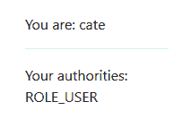

# Web 应用程序安全

在本章中，你将了解 Web 应用程序中安全性的重要性。我们将调查程序员在添加安全措施时的责任。最后，我们将扩展 blogmania 应用程序的功能。

到本章结束时，你将能够：

+   认识到 Web 应用程序中安全性的价值

+   确定程序员在 Web 应用程序安全中的作用

+   评估 Spring 在哪些领域提供安全解决方案

+   通过访问控制扩展 blogmania 应用程序

# 保护你的 Web 应用程序

在软件开发中，安全性至关重要。这不仅适用于在线银行或你的个人健康数据——甚至适用于非常简单的应用程序。为什么会这样呢？

想象一下，你的 Web 应用程序迄今为止取得了巨大的成功。许多人正在使用它，有些人可能在其中存储他们的数据。然后，灾难降临：通过你软件中的一个漏洞，攻击者能够劫持运行你应用程序的机器，并滥用该机器进行一些邪恶的目的。或者，结果发现人们可以阅读所有用户的日记条目。这可能会给你带来高昂的费用；这可能会破坏客户对你软件的信任！

此外，其他与安全相关的问题，如 Ashley Madison 约会网站客户数据的泄露、数百万信用卡数据的盗窃，甚至计算机病毒，可能成为值得讨论的相关章节。

设计和操作安全的软件必须从一开始就是一个主要目标。有许多安全方面很难在之后添加。让我们看看一些可能的威胁。

# 软件安全威胁

软件安全面临着许多威胁。整个部分很容易填满一本书。在本章中，我们只能希望获得一个广泛的概述。我们将探讨的威胁可以粗略地分为以下几类：

+   解释不受信任的数据

+   允许外国客户端访问

+   允许访问非自身拥有的资源

+   日志记录和监控不足

Web 应用程序安全信息的一个很好的来源是**OWASP**（**开放 Web 应用程序安全项目**）。请特别注意他们列出的**“十大最关键 Web 应用程序安全风险”**：[`www.owasp.org/index.php/Category:OWASP_Top_Ten_Project`](https://www.owasp.org/index.php/Category:OWASP_Top_Ten_Project)

# 解释不受信任的数据

每当应用程序从另一个应用程序接收数据时，都会有一个问题，即是否信任这些数据。有时，在一个封闭系统中，信任他人是处理数据的正确方式，但在大多数情况下，需要谨慎行事。

谨慎行事。

这是一个故意很宽泛的分类。OWASP 列出了许多可以包含在内的子问题。在这里的一般建议是仔细检查数据。没有任何一种库能够帮助解决这个问题。为了让你了解一些可能的问题，让我们看看一个非详尽的列表。

# 注入

**注入**意味着允许用户将他们的代码注入到你的代码中。这很少是一个好主意，通常也不是故意的。两个非常突出的代表是**XSS**（使用 JavaScript 的**跨站脚本**）和 SQL 注入。通常，客户端的一些文本被接受，例如，在一个网页表单的简单文本字段中，并且随后未经进一步处理就被使用。现在，想象一下表单中输入的文本如下：

```java
<script>alert('Hello World')</script>
```

如果这段文本被简单地嵌入到你的网页中，文本将不会显示，而是执行这段 JavaScript！为了避免这种情况，你可以非常保守地接受内容，或者在每个输出中转义文本。前者更简单，但可能对用户造成问题；如果你不允许小于号（<），那么用户就不能使用它，即使是合法的文本。后者要求你在每个地方转义文本；例如，在 Thymeleaf 中使用`<th:text>`，正如我们在*第五章：使用网页显示信息*中学到的。

SQL 注入是另一种问题攻击，尤其是对于过去使用字符串连接来创建 SQL 的老代码来说。解决办法相当简单：为你的查询使用占位符。当我们讨论数据库时，我们将在*第九章：使用数据库持久化数据*中看到更多这方面的内容。

# 不安全的反序列化

**不安全的反序列化**最近已成为一个真正的问题。场景是某些数据打算在服务之间（非人类客户端）传递。有许多格式可以将这些数据放在线上。在前一章中，你已经学习了 JSON 作为这样的格式之一，但两种广泛使用的格式是 XML 和 Java 二进制序列化。

现在，XML 是一个非常灵活的格式。然而，强大的力量伴随着巨大的责任。在不受信任的环境中，**实体**功能最令人烦恼，建议使用不扩展实体的库，或者在解析之前以某种方式清理 XML。

Java 序列化在反序列化过程中对传入数据的操作很敏感。许多流行的库都包含针对这种攻击的修复。我们所能做的就是确保始终使用最新的软件。

Java 序列化和反序列化在 JMS 和 RMI 中广泛使用。它们使用内置机制工作；你可能之前见过可序列化接口。这是一种将内存中的对象转换为二进制表示，通过网络传输，并将二进制表示转换回另一侧对象的不错方法。然而，如果发送者创建了一个被操纵的字节流，另一侧的反序列化程序可能会被诱骗执行意外的操作。

# 允许外部客户端访问

允许访问意味着授予 Web 应用程序中每个客户端的访问权限。这是 HTTP 工作方式的结果，通常对于操作是必需的。一个后果是，来自外部站点的 JavaScript 可能能够访问我们服务器上的资源。这通常不是我们想要的。

一种可能的攻击被称为**CSRF**，或**跨站请求伪造**。在其最简单的形式中，想象一个恶意网站伪装成你的银行网站，甚至模仿布局。在你输入凭证后，恶意网站可以保存它们以备后用，同时登录你的真实银行网站。你甚至都不会注意到！Spring Security 提供帮助以避免 CSRF 攻击，我们将在稍后看到如何做到这一点。

浏览器通过实现**同源策略**（**SOP**）来避免许多这些问题。然而，这是一个相当严格的政策，可能会阻止您自己控制的多个服务器之间合法的资源共享。**跨源资源共享**（**CORS**）是为了绕过 SOP 而采取的一种方法。我们将在稍后与 Spring Security 的支持一起配置 CORS。

就像与 HTTP 和网页相关的事情一样，Mozilla 开发者网络是获取更多关于 SOP、CORS 和 CRSF 信息的优秀资源：[`developer.mozilla.org/en-US/docs/Web/Security/Same-origin_policy`](https://developer.mozilla.org/en-US/docs/Web/Security/Same-origin_policy)。

# 允许访问非自己拥有的资源

用户可能能够访问他不应该访问的东西。例如，普通用户应该只能看到他自己的私人信息，而不是他人的，而且他不应该能够访问管理界面。访问控制的关键是通过使用**认证**和**授权**。Spring 安全提供了很好的支持，实际上这是本章的主要内容。请看以下表格：


# 日志和监控不足

这本身不是一种威胁，而是未能检测到运行时的问题。设置防火墙；这更多的是操作部门的任务，而不是软件开发者的任务。适当的日志和监控可以检测攻击的开始，并允许快速采取对策。

# 认证和授权

认证和授权这两个术语经常被混淆，但了解它们的准确含义及其区别非常有帮助。

这里的最终目标是确定坐在显示器前的人是否被允许执行某个任务。首先，我们必须确认这个人的身份，然后我们才能检查这个人是否有必要的权限。

# 认证

认证是确认客户端身份的过程。用户有多种可能的认证方式。

Spring Security 将为我们管理经典的登录变体，我们将在下一节中转向这一点。它还支持许多不同的分布式登录，例如`OAuth`和`OAuth2`，但这本书的范围之外。

用户名密码认证需要解决以下挑战：

+   我们需要某种类型的用户数据库。这可以是一个内存中的硬编码列表，或者它可以从外部数据库系统中获取。

+   除了用户名外，我们还需要存储密码，但要以安全的方式。普遍的观点是根本不保存密码，而是保存一个不可逆的哈希值。在我们数据库不幸泄露的情况下，攻击者将无法获取密码；这很重要，因为用户往往在不同的地方使用相同的（或类似的）密码。

在 Web 应用中，我们还需要考虑认证是如何从浏览器发送到服务器的。一个非常重要的方面是原始密码必须通过网络（至少一次）传输，因此我们必须确保我们正在使用一个安全的通道（通过 HTTPS 进行通信）。

# 授权

在我们确认了用户的身份之后，我们必须检查他允许做什么。这被称为授权，意味着用户被授权做某事。

在 Web 应用中，处理两个不同的方面很重要。想象一个为每个用户都有一个私有区域和行政界面的 Web 应用。很明显，我们必须防止非特权用户访问行政界面。这可以通过限制应用程序中可访问的路径并**授予访问权限**到相关路径来实现。你将看到如何使用 Spring Security 的`WebSecurityConfigurerAdapter`来完成这一点。

然而，有些 URL 对所有用户都是可访问的，但需要显示不同的内容。你不想让其他人看到你的私人数据！某些资源可能会根据用户的不同而有所不同：一篇文章可能对普通用户限制为 1,000 个字符，但对高级用户限制为 4,000 个字符。

为了处理这个问题，你需要为用户分配访问权限，换句话说，**授予权限**。一个这样的模型是为用户分配角色（例如`USER`或`ADMIN`）并限制对某些角色的资源访问。如果你需要非常细粒度的控制，你也可以使用更强大（但遗憾的是，更难处理）的**访问控制列表**（**ACLs**）。然而，只有在最复杂的场景中，你才需要手动检查这一点。Spring Security 为你提供了一些简单的注解来限制 Spring Bean 中的方法访问。

# 检查婴儿步安全（1）

目标是分析未加密和加密的 Web 应用之间的差异。假设你想看到应用在未加密和加密版本中并排展示，以便进行比较。

在开始之前，你需要加载并启动位于 [`bit.ly/2REovBW`](https://bit.ly/2REovBW) 的 Security-Intro 应用程序。启动应用程序。在浏览器中打开主页，并在 Postman 中对 `/api/messages.json` 进行 REST 调用，以查看它们都很容易访问。（如果你需要，你还可以在章节文件夹中找到 Postman 的配置）。完成步骤如下：

1.  定位到 POM 并在其 `<dependencies>` 部分添加以下依赖项：

```java
<dependency>
  <groupId>org.springframework.boot</groupId>
  <artifactId>spring-boot-starter-security</artifactId>
</dependency>
```

1.  让 IntelliJ 重新导入 POM 并重新启动应用程序。

1.  导航到网页版本并再次进行 REST 调用。

你将观察到以下两点：

+   网页版本现在显示登录页面。

查看以下截图：


+   REST 调用导致 **401 未授权**。

前往 [`bit.ly/2ylvMzt`](https://bit.ly/2ylvMzt) 访问 `SecurityIntroApplicationTests.java` 文件的完整代码。

# Spring Security

在简要概述了安全的不同方面之后，让我们再次转向 Spring，并看看它是如何解决之前提到的一些问题的。请注意，许多安全问题实际上源于应用程序的错误行为，而不仅仅是使用库就能解决的。

最后两点将只简要介绍，因为关于它们没有太多可说的。因此，本节的大部分内容将关于身份验证和授权。

即使我们小心翼翼地区分这两个词，由于一个的效果只有通过另一个才能显现，因此这些概念无法孤立地展示。让我们首先将 Spring Security 添加到项目中，并观察其效果。

Spring Security 是 Spring 平台的一个子项目，就像 Spring Web MVC 一样，它在*第四章*：*MVC 模式*中介绍过。它有自己的发布周期。当使用 Spring Boot 时，你不必关心这一点，因为 Spring Boot 依赖关系管理将解析为经过测试和验证的版本。只有在极少数情况下，你可能需要手动包含所需的依赖关系并指定它们的版本号。

# 自动配置 Spring Security 的魔法

将 Spring Security 添加到 Spring Boot 项目中非常简单。它附带一个默认配置，非常安全，绝对不适合任何实际用途。你所要做的就是添加相应的启动 POM：

```java
<dependency>
  <groupId>org.springframework.boot</groupId>
  <artifactId>spring-boot-starter-security</artifactId>
</dependency>
```

启动 POM 对所有必要的工件有传递依赖。现在，在启动时，Spring Boot 应用程序将打印出如下一行：

```java
Using generated security password: f76defbe-62d2-4711-9189-
aa8926ad03eb
```

任何资源，无论是通过网页浏览器还是 REST 客户端访问，都将受到保护。

# 紧密的安全默认设置

在幕后发生了很多事情。以下列表并不完全详尽，但它包含了你通常需要知道的所有信息：

+   安装了安全过滤器链

+   处理所有请求

+   一些回退用户存储库和登录页面

魔法是 Spring Boot 的一部分，它将为使用 Spring Security 创建所有必要的 Beans。这就是您已经了解的自动配置功能，它可以在类路径上找到必要的类时立即创建 Beans，并启动构造后设置例程来连接它们。

首先，它安装了一个 servlet 过滤器（如*第四章：MVC 模式*）中所述）。这个过滤器拦截每个请求并添加必要的安全性。这是一个类型为`DelegatingFilterProxyRegistrationBean`、名称为`springSecurityFilterChain`的 Spring Bean。正如名称所暗示的，这些不是简单的过滤器，而是过滤器链，每个过滤器都增加了一部分功能。这些链是自动构建的。

默认情况下，过滤器被配置为通过相同的级别保护所有请求。有一个值得注意的例外：当你尝试访问应用程序的 Web 部分时，你会遇到的登录页面。

应用程序的用户存储库保存在内存中，实际上系统中只有一个用户。它的名字是**user**，密码在应用程序启动时随机选择；它以 UUID 的形式存在。这是安全的，但在实践中有点难以操作。选择这个默认设置是为了确保添加依赖项实际上会有所不同，并迫使用户选择自己的配置，而不是让系统像以前一样不安全。

这些措施的结果对于 REST 和 Web 版本相当不同，所以我们将逐一查看。

# 使用基本认证保护 REST

在将 Spring Security 引入项目后，访问 REST 资源开始导致**401 未授权**。这是当没有提供身份验证手段时安全过滤器将产生的结果。如果您在疑惑，是的，您**没有权限**访问此资源，但这主要是因为您无法**认证**自己到系统中。

除了响应之外，服务器还发送了一个头信息，`WWW-Authenticate: Basic realm="Realm"`，以告诉客户端如何处理这种情况。答案告诉我们应该使用一个称为**基本认证**的程序，并使用**域**域进行认证。

基本认证方案是认证的最简单形式。它不需要 cookies 或服务器上的存储。客户端在每次请求的授权头中发送凭据。密码没有被散列或加密，只是 Base64 编码；因此，建议使用安全连接。

可以使用一个域来使用不同的凭据访问服务器的不同区域。这很少使用；大多数服务器只有一个域。

对于**REST 客户端**，这是一种简单而有效的方法进行认证。Postman 允许你轻松设置凭据，命令行工具（如**cURL**）也是如此。客户端和服务器都不需要存储任何令牌，因此整个过程是无状态的。

对于**网络浏览器**，此方案可行，但不够舒适。浏览器会向用户显示一个对话框来输入凭据，但这属于浏览器，并且不会与网页的外观和感觉相匹配。此外，没有再次注销的方法。

基本认证要求对每个请求验证密码。现代密码散列故意设计得较慢，以提高安全性。因此，建议即使对于 REST 调用，也用一些短期凭证（如会话）来交换密码。

# 在会话中保护网页浏览

在项目引入 Spring Security 之后，访问受保护的网页开始返回带有位置头的**302 Found**状态码，浏览器将我们重定向到指定的页面。我们看到的非常基本的登录表单是 Spring Security 内置的回退。在那里输入凭据会将它们 POST 到另一个内置端点，然后检查凭据并将它们添加到会话中。为了在后续请求中识别这个会话，会设置一个名为 JSESSIONID 的 cookie。

会话由所有 servlet 容器（如 Tomcat）支持，是一个为返回用户存储一些临时数据的地方。在今天的环境中，会话主要用于识别用户，没有更多用途。如果没有中央会话存储，存储真实数据可能会在可扩展性方面带来问题。

此方案更灵活：网页可以使用自己的登录表单或将登录表单嵌入到着陆页中。此外，用户可以注销。然而，它需要在服务器和客户端都存储会话及其标识符，因此不是 100%无状态的。

# 检查逐步安全（2）

目标是利用受保护的 Web 应用。假设你有一个受保护的 Web 应用并想登录。在开始之前，从上一个子节开始（或重新启动）应用程序，并导航到`http://localhost:8080/`。

1.  复制密码，它以 UUID 格式呈现。

在 IntelliJ 的日志视图中，有一行（因为周围有空行而突出）以使用生成的安全密码开头。

1.  在浏览器中，输入`用户名`作为用户名，并复制`密码`作为密码。

你现在已登录，可以查看主页。（如果你在中间忘记重新加载表单，第一次登录可能会失败。在这种情况下，只需再次尝试即可。）

1.  在 Postman 中，在**授权**面板中，从下拉菜单中选择基本认证，或从 Postman 收藏中加载已认证的版本。

1.  然后，像之前一样输入凭据。

    +   当你点击预览请求时，可以在**头部**面板中显示头部信息。

    +   当你发送请求时，数据将再次以以下截图所示的方式返回：


您可以看到数据被返回，因为已正确设置了授权头。

# 明确配置

这一次内容很多。为了自定义行为，让我们首先手动重现 Spring Security 的默认配置。如果我们的需求不同，那么将很明显需要更改什么。为此，我们需要以下内容：

+   一个处理安全方面的配置类

+   包含 HTTP 安全的代码

+   一个登录表单和一个映射函数来显示它

+   一个具有虚拟用户的用户仓库

# 安全配置入口点

在 Spring Boot 中配置 Spring Security 的推荐方法是扩展`WebSecurityConfigurerAdapter`类，它提供了插件点以访问各种方面。让我们看看：

```java
@Configuration
@EnableWebSecurity
public class SecurityConfiguration
            extends WebSecurityConfigurerAdapter {

}
```

如您所见，我们还将此类标记为 Spring Boot 的`@Configuration`类，并通过使用`@EnableWebSecurity`启用安全方案。

您可能会想知道，如果启用安全是默认的，为什么`@EnableWebSecurity`是必要的。您是对的——它不是。尽管如此，通常还是要明确指出。

如果出于某种原因，您想禁用 Spring Boot 的所有自动安全配置，即使您的项目中包含了 Spring Security，您也必须在主应用程序类中显式禁用它，使用`@SpringBootApplication(exclude = SecurityAutoConfiguration.class)`。

# 添加硬编码的用户

要管理认证源，我们使用`AuthenticationManagerBuilder`，它是`configure()`方法的一个参数。我们将从**内存**认证开始，也就是说，用户列表不是来自外部源，而是预先加载的。请看以下代码示例：

```java
public class SecurityConfiguration … {
  @Override
  public void configure(AuthenticationManagerBuilder auth)
                        throws Exception {
    auth.inMemoryAuthentication()
        .withUser(User.withDefaultPasswordEncoder()
                      .username("user")
                      .password("password")
                      .roles("USER"));
  }
}
```

注入构建器 auth 为我们提供了与 IDE 中的自动补全功能相协调的函数。`inMemoryAuthentication()`创建**内存**存储，而`withUser()`则将一个用户添加到系统中，使用与之前相同的名称，但密码稍容易一些，以便进行试验。

密码是明确给出的。因此，它在代码中以明文形式存在。这不是一个安全的配置，并且仅在数据库不存在的情况下用于启动。

现在密码被设置为比不断变化的 UUID 更容易记住的东西。此用户具有 USER 角色；这用于授权资源，正如我们很快将看到的。

当您现在启动应用程序时，它仍然会打印出一个生成的密码。这**不是**现在使用的用户和密码。这仅仅意味着`UserDetailsServiceAutoConfiguration`仍然创建了一个`UserDetailsService` Bean，然而这个 Bean 却是未使用的。稍后我们将用我们自己的实现替换这个 Bean。

# 使用基本认证锁定路径

为了锁定并允许访问 HTTP 资源（网页或 API 端点），我们使用一个 `HttpSecurity` 对象，它是作为另一个 `configure()` 方法的参数获得的（它被一些其他较少使用的配置对象重载）。首先，我们希望将所有 URL 锁定给具有 `USER` 角色的用户，就像我们的预定义用户一样：

```java
public class SecurityConfiguration … {
  @Override
  protected void configure(HttpSecurity http)
                           throws Exception {
    http.authorizeRequests()
        .antMatchers("/**").hasRole("USER")
        .and()
        .httpBasic().realmName("blogmania");
  }
}
```

使用 `authorizeRequests()`，我们引入了路径匹配器部分。`antMatchers()` 是一个函数，它接受任意数量的 Ant 风格的路径，最后，`hasRole()` 指定了用户条件。在这种情况下，路径具有特定的角色。

Apache Ant ([`ant.apache.org/`](https://ant.apache.org/)) 是一个广泛流行的 Java 构建系统，是 Maven 和 Gradle 的前身。它引入了一种指定路径、子路径和文件的方式，这与 shell 中星号的使用不同。它既简单又非常灵活；这里的模式 "/**" 表示“从根开始，匹配所有内容。”

Spring Security 中的角色是简单的 Java 字符串。如果你拼写错误，可能会造成麻烦，因此，对于实际应用，你应该创建一个枚举并使用其字符串值。

我们现在已经锁定了一切，但没有实际认证的手段。这可以通过简单的 `httpBasic()` 调用来添加。

我们的应用程序现在使用基本认证进行了保护并可以访问。

# 添加登录

现在保护应用程序的基本认证工作得很好，但用户体验较差。用户期望一个**登录表单**是应用程序的一部分，并且可能还有注销的手段。我们现在将添加以下细节：

+   登录表单

+   默认：GET /login

+   可以有任意多个

+   用户名 & 密码

+   一个神秘的自定义 `_csrf` 字段

+   发送到登录控制器

+   默认：`POST /login`

Spring 所需的最小登录表单如下：

```java
<form action="/login" method="POST">
   <input name="username" value="" type="text">
   <input name="password" type="password">
   <input name="submit" value="Login" type="submit">
   <input name="_csrf" value="246a60ad-3059-4e4b-9409
49eddd66efdb" type="hidden">
</form>
```

除了神秘的自定义 `_csrf` 字段，它将在下一节中解释，这是一个非常基本的表单，只有两个参数（用户名和密码），它将被 `POST` 到 `/login` URL。

我们可以拥有任意数量的这些表单（例如，将它们嵌入到其他页面中），只要它们将输入 POST 到正确的接收器。然而，许多应用程序还有一个额外的独立登录页面。如果用户尝试查看他们无法访问的页面，他们将被重定向到这个页面。

这可能是因为他们的会话已过期，或者他们可能在第一次尝试时输入了错误的密码。然后页面将被添加一个 `?error` 参数调用。在 Thymeleaf 模板中，我们可以评估它。考虑以下 Thymeleaf HTML：

```java
<form th:action="@{/login}" method="post">
   <label for="username">Username</label>
   <input type="text" id="username" name="username">
   <label for="password">Password</label>
    <input type="password" id="password" name="password">
    <button type="submit">Log in</button>
    <div th:if="${loginError}" class="alert alert-primary"
role="alert">
       <p class="error">Wrong user or password</p>
   </div>
</form>
```

包含错误消息的第一个 `<div>` 只会在 `loginError` 设置时显示。完整的文件（包括更多标记以改进表示）可以在 `login.html` 文件中找到，与其他章节的所有代码一起，在 [`bit.ly/2DGVgvE`](https://bit.ly/2DGVgvE)。

我们刚刚创建的登录页面尚未映射，因此我们需要在某个控制器类中添加此方法，如下所示：

```java
@GetMapping("/login")
public String login(Model model,
                    @RequestParam Optional<String> error) {
   if (error.isPresent()) {
       log.info("Incorrect login, warning the user");
       model.addAttribute("loginError", "true");
   }
   return "login";
}
```

如您所见，如果没有添加一些错误处理，这个方法将是微不足道的。默认情况下，如果发生错误，Spring 将使用`/login?error`调用登录页面，因此我们评估这个可选参数并将一个属性放入模型中；这个属性用于在表单中显示错误消息。您可以在`HomePageController`类中找到这个源代码，在源代码分发中。

剩下的就是告诉 Spring Security 实际使用我们的登录页面。为此，我们需要将基于表单的身份验证添加到 HTTP 安全中。另外，还需要考虑登录表单本身必须对所有用户开放，否则将无法登录。完整的配置方法如下所示：

```java
public class SecurityConfiguration … {
  @Override
  protected void configure(HttpSecurity http)
                           throws Exception {
    http.authorizeRequests()
        .antMatchers("/css/**", "/webjars/**", "/login").
permitAll()
        .antMatchers("/**").hasRole("USER")
        .and()
        .formLogin().loginPage("/login")
        .and()
        .httpBasic().realmName("securityintro");
  }
}
```

如果不允许未经身份验证的用户访问登录页面及其所有所需资源，无论是 CSS、JavaScript 还是图像，将导致应用程序无法正常工作。浏览器将会有无限次的重定向，希望浏览器会在某个时刻中断这些重定向。

第一条新行允许所有客户端访问一系列新的 Ant 模式。除了登录页面本身，我们还授予了对用于更美观显示的静态资源的访问权限。

另一条新行配置了一个表单登录，除了现有的基本身份验证登录外，还指定了我们使用的路径作为登录页面。（实际上这是默认设置，但在这里明确指出更好。）

# 添加注销功能

用户需要从应用程序中注销，无论是出于安全原因还是为了以其他用户身份登录。这可以通过安全介绍应用程序（`index.html`）中的以下片段轻松完成：

```java
<form th:action="@{/logout}" method="post">
   <button type="submit">Log out</button>
</form>
```

这段代码的要点是我们需要向`/logout` URL 发出 POST 请求，这是此处的可配置默认值。

# 探索网络安全

考虑到您有一个已经配置了网络安全的 Web 应用程序。您希望更改可以自由访问的页面，以及只能通过身份验证访问的页面。您应该尽量避免陷阱。这里的目的是探索使用`HttpSecurity`对象的效果。

在开始之前，从文件夹中加载并启动 Blogmania 应用程序[`bit.ly/2PmyyPF`](https://bit.ly/2PmyyPF)。请注意，您必须登录才能访问它，因为您会被立即重定向到登录页面。登录后，您可以进入起始页面。您可以再次注销。

1.  在`SecurityConfiguration`类中，找到`configure(HttpSecurity http)`方法。

1.  首先，尝试通过移除看起来（可疑地）允许任何人进入的条目来加强安全性。现在主体应该如下所示：

```java
http.authorizeRequests()
    .antMatchers("/**").hasRole("USER")
    .and()
    .formLogin().loginPage("/login")
    .and()
    .httpBasic().realmName("blogmania");
```

1.  启动应用程序并重新加载。

这根本不起作用。如果你打开了浏览器的开发者工具，你会看到它一直在重定向，直到它决定打破循环。发生了什么？哦，我们禁止了对登录页面的访问！

看看下面的截图：


1.  尝试相反的操作。重新添加该行（使用`撤销`），然后，移除对特定角色的要求。

1.  通过按*Ctrl + 空格键*，IntelliJ 会显示所有可能的完整列表。只需选择允许所有，结果如下所示：

```java
http.authorizeRequests()
    .antMatchers("/css/**", "/webjars/**", "/login").
permitAll()
    .antMatchers("/**").permitAll()
    .and()
    .formLogin().loginPage("/login")
    .and()
    .httpBasic().realmName("blogmania");
```

1.  启动应用程序并重新加载。

注意，现在，你可以不登录就查看所有页面。你仍然可以导航到`/login`并执行登录。然而，将不会有任何明显的区别。（幕后只有区别。）

# 方法级安全

在我们之前的配置中，我们使用了 Web 安全；也就是说，我们将安全配置应用于 URL。由于 Spring Security 的可插拔架构不仅限于 Web 应用程序，因此必须存在另一种控制访问的方法：**方法级安全**。

尽管方法级安全可以在 XML 中配置，但它更广为人知的是基于注解的安全。这是因为它的广泛应用伴随着 Spring 的`@Secured`注解。如今，有三组不同的注解，我们首先来看看最容易使用的注解。

# 允许的角色

第一个注解来自 JSR-250 ([`jcp.org/en/jsr/detail?id=250`](https://jcp.org/en/jsr/detail?id=250))，称为`@RolesAllowed`。它使用起来非常简单，如下所示：

```java
@RolesAllowed("USER")
public void performForRole() {
   log.info("Only called when authorized as USER");
}
```

这个注解接受一个角色（或角色列表）的名称，并将对`performSecure`方法的调用限制为具有 USER 角色的认证用户。如果调用该方法且不满足 USER 角色的约束，将抛出一个运行时异常`AccessDeniedException`。

# 启用@RolesAllowed

Spring Security 默认没有启用方法级安全。你必须在一个配置类中修改它，最好是你的安全配置，如下所示：

```java
@Configuration
@EnableWebSecurity
@EnableGlobalMethodSecurity(jsr250Enabled = true)
public class SecurityConfiguration
        extends WebSecurityConfigurerAdapter {
    …
}
```

这个注解是最简单的，但也是使用注解进行访问控制的最有限形式。如果你的需求超出了`@RolesAllowed`的能力，Spring Security 提供了一些额外的安全特性。

# 保护控制器

你可以使用注解来保护 Spring Bean 中的所有公共方法。所以，假设我们控制了 Spring MVC 控制器中映射方法的访问，这与使用`HttpSecurity`配置有什么不同？

实际上，并没有。这主要是一个风格问题。看看下面的表格：


# 原始的@Secured 方法

Spring Security 用于方法级安全性的原始注解称为`@Secured`。必须使用`@EnableGlobalMethodSecurity (securedEnabled = true)`启用它才能使用。注解的参数传递给`AccessDecisionManager`以做出最终决定。你可以允许所有经过身份验证的权限访问，或者只是允许具有给定角色的权限访问，如下所示：

```java
@Secured("IS_AUTHENTICATED_ANONYMOUSLY")
public void performSecureWithAny() {
   log.info("Only called when anonymous");
}
@Secured("ROLE_USER")
public void performSecureWithRole() {
   log.info("Only called when authorized as USER");
}
```

你可能会遇到这个注解，但你应该避免在新代码中使用它，因为它不如`@RolesAllowed`简单，也不如`@PreAuthorize`和其他注解强大，我们将在下一节中看到。

你可能会在一些材料中找到关于 Spring 安全中角色和权限之间差异的讨论。你可能会发现所有角色名称都应该以前缀`ROLE_`（可以配置）开始的规则。

通常，你今天不必担心这个问题，直到你需要在你应用程序中进行细粒度访问控制。如果 Spring Security 发现没有前缀的角色名称，它将自动在所有上下文中添加它们——完全在后台。如果一个用户有 USER 角色，那么以下所有角色都将允许访问：

```java
@RolesAllowed("USER")
@RolesAllowed("ROLE_USER")
@Secured("ROLE_USER")
@PreAuthorize("hasRole('USER')")
@PreAuthorize("hasRole('ROLE_USER')")
@PreAuthorize("hasAuthority('ROLE_USER')")
```

这里的两个例外是 `@Secured("USER")` 因为这个注解使用了一种非常特殊的语法，以及 `@PreAuthorize("hasAuthority('USER')")` 因为 Spring 自动从角色创建的所有权限都有前缀。

# 基于表达式的安全

方法级安全最强大的方法是使用允许基于`SpEL`访问的预注解和后注解。要启用此组注解，必须将`prePostEnabled`选项设置为以下内容：

```java
@EnableGlobalMethodSecurity(prePostEnabled = true)
public class SecurityConfiguration … {
    …
}
```

这将同时启用以下四个注解：

```java
@PreAuthorize
@PostAuthorize
@PreFilter
@PostFilter
```

这些名字确实很贴切。每个注解都接受一个`SpEL`表达式。这可以是任意复杂的。其中存在一定的危险——你必须确保你实际上对注解的效果进行了单元测试，就像你会对正常的 Java 代码进行测试一样。经验表明，这往往会被遗忘，因为测试注解要复杂一些。

# 简单表达式

第一个注解是`@PreAuthorize`，它具有非常简单的语义：如果`SpEL`表达式评估为真，则允许访问该方法，否则拒绝。它可以被视为`@RolesAllowed`的一个更强大的版本，如下例所示：

```java
@PreAuthorize
@PostAuthorize
@PreFilter
@PostFilter
@PreAuthorize("hasRole('USER')")
public void readMyArticles() {
   log.info("Only called when authorized as USER");
}
```

到目前为止，这仅仅更加冗长；让我们看看一个稍微好一点的例子：

```java
@PreAuthorize("hasAnyRole('USER', 'GUEST')")
public void readPublicArticles() {
   log.info("Only called when authorized as USER or GUEST");
}
```

# 强大的表达式

当表达式访问它们所保护的方法的参数时，真正的力量才开始显现。例如，假设我们已经从数据库中检索了一条记录，然后，在处理链的更下游，我们想在服务中将其删除，如下所示：

```java
@PreAuthorize("#blogPost.author.name == authentication.name")
public void deletePost(BlogPost blogPost) {
   log.info("Only called when actually the author of the post");
}
```

这是一个 Spring Security 给我们提供的新工具，功能非常强大。

确保在基于用户提供的数据进行权限检查时，你的代码不会被欺骗。在这个例子中，在比较用户的名字之前，从数据库中读取作者的名字是至关重要的。

实际上想要在事后授权的情况要少见得多，可能依赖于返回值。使用内置的`returnObject`表达式，我们可以在`@PostAuthorize`注解中的`SpEL`表达式中访问返回值。

基于表达式的访问控制也可以与`HttpSecurity`一起使用，而不是这个注解。你真的应该使用

使用你最喜欢的 IDE 的自动完成功能来探索指定限制的所有不同方式，但作为一个起点，这个链式方法被称为`access()`。

我们在这里只能触及表面。请参阅基于表达式的安全性的文档，链接为[`docs.spring.io/spring-security/site/docs/current/reference/htmlsingle/#el-access`](https://docs.spring.io/spring-security/site/docs/current/reference/htmlsingle/#el-access)。

# 超越访问 – 过滤

`@PreFilter`和`@PostFilter`注解使 Spring 能够分别过滤输入参数和返回值。过滤是通过`SpEL`实现的。考虑以下示例：

```java
@PreFilter("filterObject.content.length() < 240 or
hasRole('ADMIN')")
@PostFilter("filterObject.author.name == authentication.name")
public List<BlogPost> saveAndReturnAll(List<BlogPost> posts) {
   …
}
```

此方法本应接受一系列博客文章，保存它们，然后返回所有博客文章，包括新旧文章。然而，注解对此施加了两个限制。

+   只有长度小于 240 个字符的博客文章允许，除非你有管理员权限。

+   只有你的博客文章会被返回，除了管理员，他们可以获取所有文章。

过滤只适用于集合。集合必须是可变的。在评估期间，表达式`filterObject`指的是正在审查的列表元素。这个特性超出了访问控制，我们应该仔细考虑这部分业务逻辑是否更适合在 Java 代码中处理。

总结一下，请看以下表格：


# 测试安全方面

记得上一章中的`performForRole()`方法吗？我们如何确保注解能以我们期望的方式限制访问？

要测试 Spring Security，我们需要在我们的 POM 中添加一个额外的依赖项，如下所示：

```java
<dependency>
   <groupId>org.springframework.security</groupId>
   <artifactId>spring-security-test</artifactId>
   <scope>test</scope>
</dependency>
```

与往常一样，版本已经被 Spring Boot 锁定。现在，测试相当简单（假设包含要测试方法的服务的名称为`SecuredService`）：

```java
@RunWith(SpringRunner.class)
@SpringBootTest
public class SecuredServiceTest {
   @Autowired
   private SecuredService securedService;

   @Test
   @WithMockUser
   public void accessWithUserRole() {
       securedService.performForRole();
   }
   @Test
   @WithAnonymousUser
   public void accessWithoutAnyRole() {
       try {
           securedService.performForRole();
           fail();
       } catch (AccessDeniedException e) {
           // succeed
       }
   }
}
```

整个测试中唯一的新事物是 Spring Security 测试注解`@WithMockUser`和`@WithAnonymousUser`。后者可以测试未经授权的访问；前者提供了一个默认名为`user`且具有`USER`角色的可配置用户。

对于许多配置，这已经足够了。对于更复杂的访问方案，还有高级测试注解，例如`@WithUserDetails`，甚至`@WithSecurityContext`。

# 安全上下文

有时，你需要关于当前登录用户的信息，而不仅仅是允许或拒绝访问。这些信息存储在安全上下文中（该类实际上是`SecurityContext`）。现在的问题是，如何获取这个上下文。

安全上下文默认由 Spring Security 通过线程局部变量维护。要访问它，我们调用持有对象的静态方法，如下所示：

```java
Object principal = SecurityContextHolder.getContext()
            .getAuthentication().getPrincipal();
String username = principal instanceof UserDetails
       ? ((UserDetails) principal).getUsername()
       : principal.toString();
```

这些行尝试找到当前登录用户的名称。这段代码可能需要一些解释。

+   `SecurityContextHolder.getContext()`将返回当前活动的安全上下文。

+   这个上下文实际上只包含一件事：当前的认证，我们通过`getAuthentication()`获取它。

+   这个认证对象包含一些详细信息，例如凭证和授予的权限，以及主体，它是用户的一个表示。

下面的代码非常具有防御性——主体只有 Object 类型，因为 Spring Security 在这里非常灵活。然而，大多数时候，主体是`UserDetails`的一个实现，我们可以从中提取用户名。

你可以在示例应用程序的`HomePageController`的`homePage()`方法中找到一个安全上下文的应用。我们将在下一节中更详细地查看`UserDetails`和授予的权限。

# 真实用户仓库

我们到目前为止所使用的内存认证实际上是一个非常可行的实现。关键点是初始如何加载用户，因为我们像之前那样硬编码它们是不安全的。

然而，在许多情况下，我们可能希望使用另一种实现。我们只需提供一个 Spring Security 的`UserDetailsService`接口的实现。表面上看起来很简单，但实际上将其应用到应用程序中可能有些复杂。让我们看看一个接受所有用户名均为小写的用户实现的例子：

```java
@Slf4j
@RequiredArgsConstructor
public class LowercaseUserDetailsService
        implements UserDetailsService {
  private final PasswordEncoder passwordEncoder;

  @Override
  public UserDetails loadUserByUsername(String username) {
    if (username == null || username.trim().isEmpty() ||
            !username.toLowerCase().equals(username)) {
      log.info("Reject {}, accept only lowercase", username);
      throw new UsernameNotFoundException("Accept only
lowercase");
    }
      String password = passwordEncoder.encode("password");
      log.info("Accepting {} / {}", username, password);
      return new User(username, password,
              singleton(new SimpleGrantedAuthority("ROLE_USER")));
    }
}
```

需要注意的主要一点是我们只需要实现一个方法：`loadByUsername()`。需要注意的是，这个例行程序实际上并不执行认证，而是一个查找用户并返回相应详情的 DAO，包括编码后的密码。实际的检查在其他地方进行。正如相应的 JavaDoc 中所述，此方法不得返回 null，并且当用户根本不存在时，应抛出`UsernameNotFoundException`。

Spring 对用户的所在地没有任何假设。在我们的示例中，我们动态生成用户，以表明没有任何限制。在现实世界中，我们更愿意查询我们的数据库来填充`UserDetails`对象。

这里返回的`UserDetails`对象就是我们之前看到的，作为安全上下文中的主体。如果我们只有一个`UserDetails`对象的来源，这是非常正常的，那么我们可以盲目地将主体转换为它。

然而，当我们正在通过未认证的代码移动时，主体不是我们的`UserDetails`之一。它是一个值为`anonymousUser`的字符串。让我们暂时跳过密码行，如下所示：

```java
return new User(username, password,
       singleton(new SimpleGrantedAuthority("ROLE_USER")));
```

`loadByUsername()`方法应该返回`UserDetails`，这是一个接口，并且该接口需要向 Spring Security 系统提供一个`GrantedAuthority`列表，另一个接口。这非常灵活，但为了帮助我们，有两个这些接口的标准实现，对于许多目的来说都是足够的：`User`和`SimpleGrantedAuthority`。我们利用这两个实现来构建一个新的用户，该用户具有之前给出的用户名，并为每个`USER`分配一个单一的角色。

是的，这就是你需要区分角色和权限的地方。权限是一个更通用的概念，而角色是这些的一个简单子情况。一个名为`ROLE_USER`的权限将被解释为 USER 角色。

# 密码编码器

密码绝对不能以明文形式存储。相反，你需要以不可逆的格式存储它们在你的数据库中，通常称为**哈希**。在一个正常的`UserDetailsService`中，我们不需要担心这一点，只需将数据库中的哈希密码传递给 Spring Security，以检查用户给出的密码。

在我们的例子中，我们需要使用与 Spring Security 将用于检查相同的哈希函数来哈希明文密码`password`，如下所示：

`String password = passwordEncoder.encode("password");`

我们使用全局密码编码器，它被自动注入到我们的服务中，来编码密码。在一个更复杂的应用中，这样的行会出现在不同的地方——就在用户输入了新密码之后，以及我们将它放入数据库之前。

# 连接起来

在我们的`SecurityConfiguration`类中，我们现在将用以下三个代码片段替换认证管理器构建配置方法：

```java
@Override
public void configure(AuthenticationManagerBuilder auth)
        throws Exception {
   auth.userDetailsService(userDetailsService())
       .passwordEncoder(passwordEncoder());
}

@Bean
@Override
public UserDetailsService userDetailsService() {
   return new LowercaseUserDetailsService(passwordEncoder());
}

@Bean
public PasswordEncoder passwordEncoder() {
   return PasswordEncoderFactories.
createDelegatingPasswordEncoder();
}
```

代码现在几乎是自我解释的。我们用我们自己的实现替换了内存中的认证。需要注意的是，我们应该使用`@Bean`方法来创建服务，而不是用`@Service`注解它；这样我们就可以覆盖`WebSecurityConfigurerAdapter`中已经存在的方法。

我们可以从广泛的密码编码器中选择，但最灵活的是默认提供的委托密码编码器。它将始终使用一个非常强大、标准的算法来编码密码（默认情况下，现在通常是`BCrypt`），但它可以检查许多其他更旧的算法。当你想要迁移到新算法时，这将非常有帮助。

加密后的密码将包含算法，看起来像 `{bcrypt}$2a$10$2.eeR1LFYuJjicT.SyTEpEgX7mgJvH902rS`，以便 Spring Security 委派到适当的密码编码器。数据库中的一个古老条目可能是 `{MD5}{3A1yJJ/pQ5zMYv77050bccaccda0e573339a`，并要求用户更改密码以迁移到 `BCrypt`。

# 实际仓库

在实际应用中，用户从哪里来？非常常见的情况是已经存在一个用户数据库，一个简单的方法是让我们的用户实现 `UserDetails` 接口。在安全介绍应用中，这是 `Author` 类。

Spring Security 默认提供了两个 `UserDetailsService` 的实现。这两个实现甚至实现了 `UserDetailsManager`，以便创建新用户和更改现有用户。您已经看到了这两个之一：`InMemoryUserDetailsManager` 将所有可能的用户存储在内存中。对于有限数量的用户，这是高效的。为了填充用户，我们可能在启动时从文件中读取它们。

另一种实现是 `JdbcUserDetailsManager`，它通过 JDBC 提供数据库访问。数据库访问将在下一章中介绍，但为了使用这个类，唯一的前提是在数据库中创建所需的表。此实现提供的用户属于之前提到的 `User` 类。该类既不包含全名也不包含电子邮件地址，这可能会使其对许多应用不太合适。

# 跨站请求伪造 (CSRF)

为了结束本章，让我们简要讨论两个重要的四字母缩写词，CSRF 和 CORS。

**跨站请求伪造**是指网站 A 向网站 B 发送请求，但让用户认为正在发生其他事情。HTTP 的无状态特性意味着网站 B 无法确定调用是从哪里发起的。浏览器会将所有必要的 Cookie 添加到请求中，因此如果用户当前在网站 B 上登录，可能在另一个标签页中，那么网站 A 就可以操纵数据。

防止此类攻击的关键是要求在所有操纵数据的请求中发送同步令牌；也就是说，`POST`、`PUT` 和 `DELETE`。此令牌通常作为隐藏字段发送到浏览器，并且必须在请求中存在。攻击网站通常无法访问该令牌。

如果您只接受来自受信任来源的调用，则可以禁用 CSRF 保护。这个决定不应轻率做出。

我们需要做什么来使用这个功能？如果我们依赖于表单和 Spring Security 对 Thymeleaf（以及 JSP 和其他模板引擎）的支持，几乎不需要做什么。我们在 Thymeleaf 模板中创建的每个表单都将有一个额外的隐藏字段，称为`_csrf`，在调用接受时将被检查。如果你回到登录表单的解释，你会看到这个字段。当在`<form>`标签上使用`th:action`属性时，表单会被 Thymeleaf 扩展。

如果你使用 REST 调用，你无法在 JSON 中传递另一个参数，并且你一开始就不会有一个表单来给客户端提供 CSRF 令牌。在这种情况下，我们需要另一个配置，如下所示：

```java
@Override
protected void configure(HttpSecurity http) throws Exception {
  http
    .csrf()
      .csrfTokenRepository(
              CookieCsrfTokenRepository.withHttpOnlyFalse());
}
```

现在，Spring Security 将发送一个**XSRF-TOKEN**cookie，我们可以使用这个 cookie 来在请求中发送一个**X-XSRF-TOKEN**头部。我们不会在本书中探讨这个稍微高级的技术。

# 跨源资源共享（Cross-Origin Resource Sharing, CORS）

**跨源资源共享（CORS**）是处理今天浏览器 SOP（同源策略，Same-Origin Policy）的一种方式。Spring 提供了两种不同的方式来实现相同的目标。我们不会深入细节，但我们会查看 Spring 文档中的两个示例配置。

第一个来自 Spring MVC 支持，如下所示：

```java
@Bean
public WebMvcConfigurer corsConfigurer() {
  return new WebMvcConfigurer() {
    @Override
    public void addCorsMappings(CorsRegistry registry) {
      registry.addMapping("/greeting-javaconfig")
      .allowedOrigins("http://localhost:9000");
    }
  };
}
```

这将放宽 SOP（标准操作程序）以允许从`localhost:port 9000`访问`/greeting-javaconfig`。此配置还支持基于注解的配置。当你没有 Spring Security 时，这就是配置 CORS 的方式。

然而，如果你有 Spring Security，那么安全和 CORS 必须协同工作，并且有必要扩展安全配置，如下所示：

```java
@Override
protected void configure(HttpSecurity http) throws Exception {
    http.cors() …
}
```

现在，如果 Spring MVC 在`classpath`上，并且没有提供`CorsConfigurationSource`，Spring Security 将使用之前定义的 Spring MVC 提供的 CORS 配置。相反，你可以决定使用以下代码来配置 CORS：

```java
@Bean
CorsConfigurationSource corsConfigurationSource() {
  CorsConfiguration configuration = new CorsConfiguration();
  configuration.setAllowedOrigins(
          Arrays.asList("http://localhost:9000"));
  configuration.setAllowedMethods(
          Arrays.asList("GET","POST"));
  UrlBasedCorsConfigurationSource source =
          new UrlBasedCorsConfigurationSource();
  source.registerCorsConfiguration("/**", configuration);
  return source;
}
```

# 活动：探索安全注解

**先决条件**

从源存档加载并启动安全介绍应用程序。这是一个短消息服务，它具有一些可能有些牵强的功能，但它们使得在不使用真实应用程序的开销的情况下演示 Spring Security 的一些功能变得更容易。即使作为匿名用户，你也可以查看`所有`页面。

**目标**

探索安全注解对方法的影响。

**场景**

你有一个配置了网络安全的 Web 应用程序。然而，你不想仅仅依赖于 URL，而是直接通过注解来保护代码。

**完成步骤**

1.  导航到 HomePageController 以找到`homePage()`方法，并添加一个注解来限制对具有`USER`角色的用户的访问。

1.  重新启动应用程序并在浏览器中打开页面。

注意我们立即被重定向到登录页面。使用任何预定义的用户登录；例如，`peter/quinn`或`cate/sakai`。

1.  注意索引页面已更改以反映你的用户：

    看看以下显示名称和分配角色的截图：



1.  尝试注销。

1.  找到`ShortMessageService`及其`findAll()`方法。添加一个注释来限制显示文章。

1.  重新启动应用程序并在浏览器中打开页面。

**结果**

登录后，你将只能看到自己的文章。再次从*步骤 1*中移除`@RolesAllowed`注释，并重新启动。然后你将能够查看自己的文章。

你现在可以看到完整的注释在行动中的样子：当注销（在 Spring Security 中，这被称为匿名认证）时，你可以看到所有文章，但当你登录时，你只能看到自己的。（诚然，这不是最直接的行为。）

你是否注意到注释映射函数与我们在`HttpSecurity`对象上的先前配置具有相同的效果？你甚至可以尝试锁定那里的路径，而不是使用注释。（它已经在代码中，但被注释掉了。）前往[`bit.ly/2x8Fyoa`](https://bit.ly/2x8Fyoa)访问`HomePageController.java`文件的完整代码。

要参考详细步骤，请参阅本书末尾的*解决方案*部分，第 261 页。

# 摘要

在本章中，我们探讨了安全的许多方面，特别是作为软件开发者，你应该将其列入议程的方面。Spring Security 项目在 Spring MVC 部分提供了紧密集成，这允许你锁定 URL 和 Spring Beans，这限制了某些方法的访问。你学习了如何将不同的部分连接起来；如何配置身份验证（例如在表单中）将用户加载到系统中（包括他们的访问权限和密码）；以及如何让他们访问系统的某些部分。

我们现在限制博客狂热应用只能由已知用户撰写新文章。然而，博客文章仍然只保存在内存中。我们需要一种方法来持久化它们，因此我们将注意力转向本书的下一章（也是最后一章）中的数据库。
