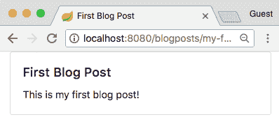
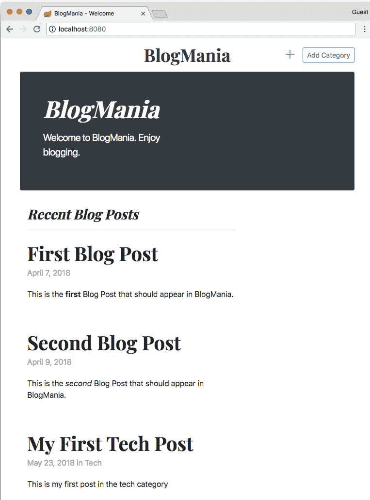
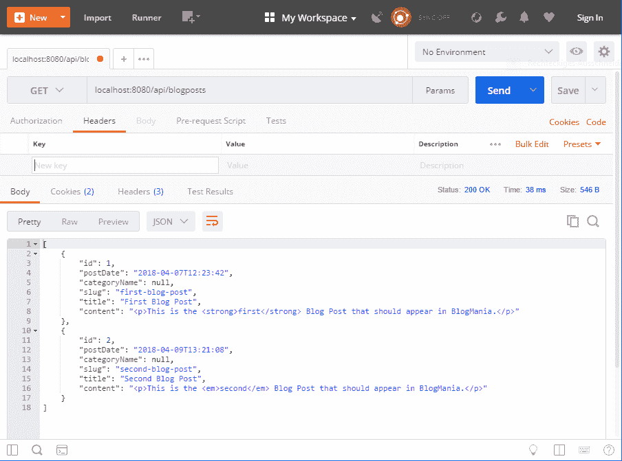
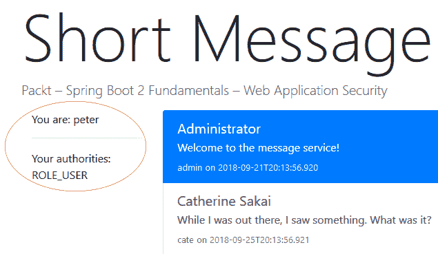

# 第十章：解决方案

本节包含每个章节末尾活动的解答。

# 第一章：Spring 项目和框架

以下是本章的解决方案。

# 活动：Lombok 实战

**完成步骤**

1.  在包含 `Application` 类的包中创建一个 `BeanData` 类：

    +   添加一个名为 `Bean` 的私有 final String 字段。

    +   添加一个名为 `BeanClass` 的私有 final String 字段。

    +   在类中插入 `@Data` 和 `@RequiredArgs` 注解。

        看一下下面的截图：


1.  填充数据结构：

    +   打开你之前用 Beans 的循环增强的主应用程序文件。

    +   为 `BeanData` 实例添加一个列表。

    +   用每个 Bean 的对应数据填充列表。

你可以使用 `getBean` 方法通过 Bean 名称从上下文中获取 Bean，例如。

1.  打印 `BeanData` 列表内容：

    +   在 Bean 列表填充完毕后，在之后立即添加另一个循环，该循环遍历 `BeanData` 列表。

    +   使用 `System.out.println` 通过生成的 `Getters` 输出 Bean 的名称和类。

# 第二章：构建 Spring 应用程序

以下是本章的解决方案。

# 活动：自动装配和配置

**完成步骤**

1.  创建一个名为 `ConfigurationProperty` 的类 `GreetingProperties`，用于读取后缀的配置值，并将属性值添加到配置文件中。

1.  创建问候服务

1.  在服务中注入该类

1.  创建一个公共方法，该方法使用问候者的名字作为参数来创建问候语。

1.  在 `Application` 类中添加一个配置方法，该方法执行问候方法并打印结果

1.  高级：

    +   在 `Application` 类中添加一个自动装配的字段

    +   当使用不同的机制设置 `Application` 类的依赖项时执行问候方法。

# 第三章：测试 Spring 应用程序

以下是本章的解决方案。

# 活动：编写集成测试

**完成步骤**

1.  为 `BlogService` 类创建一个新的集成测试类。

1.  为 `BlogService` 的 `retrievePagedBlogEntries` 方法创建各种测试。

1.  创建一个快乐路径测试（使用简单的测试数据，一切按预期工作）。

1.  为有趣的参数组合创建测试（例如，使用你期望的行为的值，如 0、-1 等）。

1.  修复服务代码以使其符合你的预期。

高级：创建不同类型的测试，查看它们并分析其优缺点。（省略你在 *步骤 2* 中创建的类型）

+   不使用 mockito 的单元测试

+   使用 mockito 的单元测试

+   无任何模拟的集成测试

+   使用 `MockBeans` 进行集成测试

+   使用 `SpyBeans` 进行集成测试

前往 [`bit.ly/2MqhUZ4`](https://bit.ly/2MqhUZ4) 访问 `BlogService` 测试文件的代码。

# 第四章：MVC 模式

以下是本章的解决方案。

# 活动：创建你的第一个 Web MVC 控制器

**完成步骤**

1.  前往[`start.spring.io`](https://start.spring.io)并输入以下值：

    组：`com.packt.springboot`

    工件：`blogmania`

1.  在“搜索依赖项”字段中输入以下依赖项，每个依赖项后按回车键：

    Web, Thymeleaf, Devtools

1.  您应该看到以下屏幕：


1.  点击生成项目以下载包含初始项目文件的 ZIP 文件。

1.  现在解压下载的文件，该文件名为`blog.zip`，到您的项目文件夹中。

1.  在`pom.xml`文件的`<dependencies>`部分添加对 Bootstrap webjars 存档的依赖项。

前往[`bit.ly/2QoVEBX`](https://bit.ly/2QoVEBX)访问`pom.xml`文件的代码。

1.  在`src/main/resource/templates`文件夹中创建一个名为`welcome.html`的文件。

前往[`bit.ly/2x6w90k`](https://bit.ly/2x6w90k)访问`welcome.html`文件的代码。

1.  添加一个控制器来渲染视图。在名为`com.packt.springboot.blogmania.controller`的包中创建`WelcomeController`类。

前往[`bit.ly/2OhxZlo`](https://bit.ly/2OhxZlo)访问`WelcomeController.java`文件的代码。

1.  现在通过 Maven 启动应用程序：

```java
mvnw spring-boot:run
```

1.  使用浏览器导航到`http://localhost:8080`：


# 第五章：使用网页显示信息

以下是该章节的解决方案。

# 活动：显示博客文章的详细信息

**完成步骤**

1.  创建一个带有`@Controller`注解的类。将类命名为`BlogPostController`。按照您在上一章中学到的知识注入`BlogPostService`。

1.  向`BlogPostController`添加一个名为`displayBlogPostBySlug()`的处理方法，该方法从查询中获取要检索的文章的 slug。设置映射为"`/{slug}`"，并使用路径变量 slug 查找博客文章。当找不到具有给定 slug 的博客文章时，抛出`BlogPostNotFoundException`。

1.  使用`findBySlug()`方法从`BlogPostService`检索博客文章。

1.  从`displayBlogPostBySlug()`方法返回一个`ModelAndView`实例。设置视图名为**blogpost**，并将从`BlogPostService`返回的博客文章作为名为`blogPost`的属性添加到模型中。

前往[`bit.ly/2xaKvfc`](https://bit.ly/2xaKvfc)访问`BlogPostController.java`文件的代码。

1.  在`src/main/resources/templates/blogposts/details.html`创建一个视图模板文件。您可以使用样本目录中的`empty.html`文件作为页面布局代码。

前往[`bit.ly/2Qrh4OL`](https://bit.ly/2Qrh4OL)访问`details.html`文件的代码。

1.  使用`mvnw spring-boot:run`命令启动应用程序

1.  打开 URL `http://localhost:8080/blogposts/my-first-post`

1.  获得以下输出屏幕：



# 第六章：在视图和控制器之间传递数据

以下是该章节的解决方案。

# 活动：创建一个页面以输入新的博客文章

**完成步骤**

1.  打开位于[`bit.ly/2Ft1iBQ`](https://bit.ly/2Ft1iBQ)的项目。

1.  打开位于`package com.packt.springboot.blogmania.category`中的尚为空的模型类`Category`。

前往[`bit.ly/2xadDDh`](https://bit.ly/2xadDDh)访问`Category.java`文件的完整代码。

1.  在模型类中添加一个名为`name`的字符串类型的属性，并使用 Lombok 注解生成数据类的所有方法。

1.  打开与类别类位于同一包中的控制器类`CategoryController`。你将找到一个空的 Spring 控制器。

前往[`bit.ly/2x6YMKG`](https://bit.ly/2x6YMKG)访问`CategoryController.java`文件的完整代码。

1.  添加一个名为`allCategories`的字段，类型为`List<Category>`，将包含所有可用的类别。别忘了初始化列表（使用`ArrayList<>`）。

1.  添加一个名为`renderCategoryForm()`的方法以初始化一个新的空类别并将其添加到模型中作为名为`category`的属性。此方法应映射到带有 URI "`/categories/new`"的 GET 请求。渲染名为"`/categories/form`"的视图。

1.  为"`/categories`"添加一个`addCategory()`方法，用于处理 POST 请求映射。

    此方法将接收一个类别作为参数并将其添加到所有类别的列表中。返回视图名称为"`redirect:/`"。

1.  实现目前为空的`retrieveAllCategories()`方法以返回所有类别的列表。你可能想要返回列表的副本以防止客户端更改原始列表。

1.  打开包含类别表单的文件`src/main/resources/categories/form.html`。

前往[`bit.ly/2NHbtFw`](https://bit.ly/2NHbtFw)访问`form.html`文件的完整代码。

1.  添加一个表单以输入类别名称。在表单中使用`@{/categories}`动作。请随意使用 Bootstrap 来美化输入元素。

1.  打开包含表单以编辑博客文章的文件`src/main/resources/blogposts/form.html`。

前往[`bit.ly/2NHbtFw`](https://bit.ly/2NHbtFw)访问`form.html`文件的完整代码。

1.  在表单中添加一个下拉字段，使用`th:field="*{categoryName}"`生成所有选项，这些选项使用模型中名为`categories`的属性中可用的所有类别列表。

1.  启动应用程序并在浏览器中打开`http://localhost:8080`。


1.  现在点击添加类别。


1.  输入类别标题并点击保存。

1.  添加尽可能多的类别。

1.  现在点击右上角的加号（+）。


1.  输入一个博客文章并查看类别列表。

1.  点击保存后，所选类别应出现在博客文章标题下方。



# 第七章：RESTful API

以下为本章节的解决方案。

# 活动：创建一个作为 REST 资源的博客文章列表

**完成步骤**

1.  以 blogmania 应用程序为例，找到`BlogPostController`。在这里，你可以看到单个博客文章是如何为 Web 前端交付的。另一个控制器`HomePageController`将所有文章添加到模型中。这两个可以作为下一步的示例。

1.  编写另一个控制器，这次是一个 REST 控制器，它提供 URL `/api/blogposts`下所有文章的列表。为此，创建一个新的类（最好在 blogpost 包中），命名为`BlogPostRestController`，并使其成为一个 Spring REST 控制器。

1.  虽然你可以为每个方法添加完整的路径，但我们知道`/api/blogposts`对于这个控制器中可能出现的所有方法都将相同，所以请在类级别添加这个路径。

1.  这个类需要一个或两个依赖项——将它们添加到类中。

1.  添加一个映射函数，通过 REST 获取所有博客文章。REST 约定表示这个列表资源将正好位于我们在类级别给出的路径下。

1.  启动应用程序并使用 Postman 访问`localhost:8080/api/blogposts`——你现在应该看到作为 JSON 列表返回的博客文章列表。



# 第八章：Web 应用程序安全

以下是该章节的解决方案。

# 活动：探索安全注解

**完成步骤**

1.  导航到`HomePageController`并找到`homePage()`方法。添加一个注解以限制对具有角色 USER 的用户访问，如下所示：

```java
@GetMapping("/")
@RolesAllowed("USER")
public String homePage(Model model) { … }
```

1.  重新启动应用程序并在浏览器中打开页面。

注意，我们立即被重定向到登录页面。使用任何预定义的用户登录；例如，`peter/quinn`或`cate/sakai`。

1.  注意，索引页面已更改以反映您的用户。

    看看以下截图，显示了分配的名称和角色：



1.  尝试注销。

1.  查找`ShortMessageService`及其`findAll()`方法。添加一个注解以限制显示用户自己撰写的文章：

```java
@PostFilter("isAnonymous() || " +
     "filterObject.author.username == authentication.name")
public List<ShortMessage> findAll() { … }
```

1.  重新启动应用程序并在浏览器中打开页面。

# 第九章：使用数据库持久化数据

以下是该章节的解决方案。

# 活动：创建一个显示多个作者的短信应用程序

**完成步骤**

1.  首先，在`ShortMessage`类中，将作者字段更改为：List<Author> authors。为了使 Java 代码能够编译，需要在创建`ShortMessage`时在`ShortMessageRepository`中进行更改：在第一步中，只需使用`Collections.singletonList()`包装作者。

1.  在下一步中，将 Thymeleaf 视图 `index.html` 修改为接受多个作者。请注意，属性现在称为 `msg.authors`。创建一个以逗号分隔的列表需要一点工作，但你可以从上面几行显示多个权限的方式中复制。为了完整，这需要做两次：一次是为了 `fullName`，一次是为了用户名。

1.  你现在可能想启动应用程序来验证一切是否如之前一样显示。这样的小步骤是软件发展的方式。

1.  现在添加一个新的 Flyway 迁移 `V03__authors.sql` – 你需要一个新表 `message_authors`，从 `short_message` 复制数据，最后删除 `author_id` 列。为了参考，请再次查看本章第三部分。

1.  现在，`ShortMessageRepository` 与数据库不再兼容。有许多方法可以解决这个问题。一种相当简单的方法是在 `retrieveAll` 方法的开始处添加以下内容：

```java
LinkedMultiValueMap<Integer, Author> authorsMap =
    new LinkedMultiValueMap<>();
RowCallbackHandler addAuthor = rs -> authorsMap.add(
    rs.getInt("message_id"),
    authorService.retrieveAuthor(rs.getInt("author_id")));
jdbcTemplate.query(
    "SELECT message_id, author_id FROM message_authors",
    addAuthor);
```

1.  使用从文章 ID 到作者的映射，更改查询和第二个 `jdbcTemplate` 执行的实现。

1.  你现在可能想启动应用程序来验证一切是否如之前一样显示。请注意，你现在得到的是不同数据模型和数据库中不同数据的相同显示！

1.  要真正看到一些变化，你可以在另一个浏览器标签中使用 H2 控制台添加一些合著者，并在原始标签中重新加载后立即看到结果。

1.  创建一个新的迁移 `V04__coauthors.sql`，包含一些消息-作者链接。当你再次启动应用程序时，这些链接将如以下截图所示：


# 解决方案摘要

希望这一节能帮助你解决在尝试这些活动时遇到的任何障碍。现在你应该能够解决其他类似的问题。

解题愉快！
