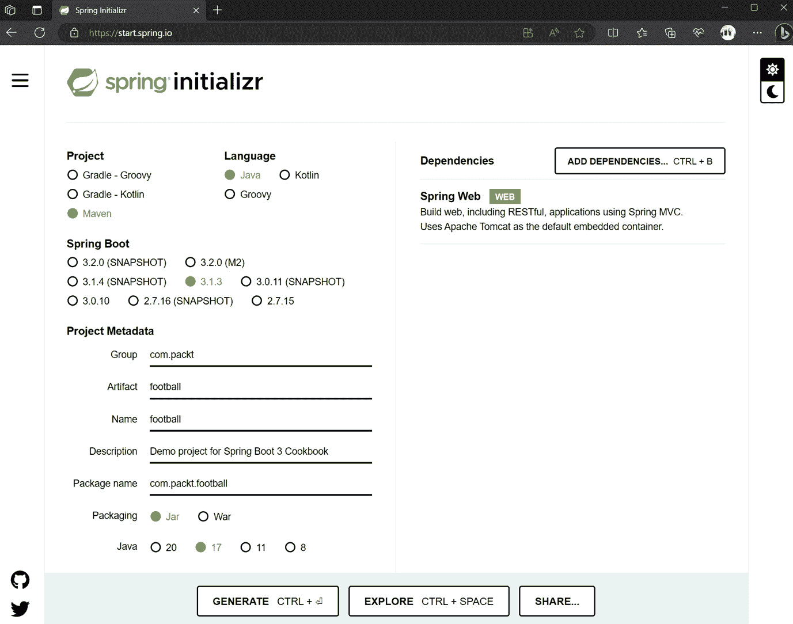
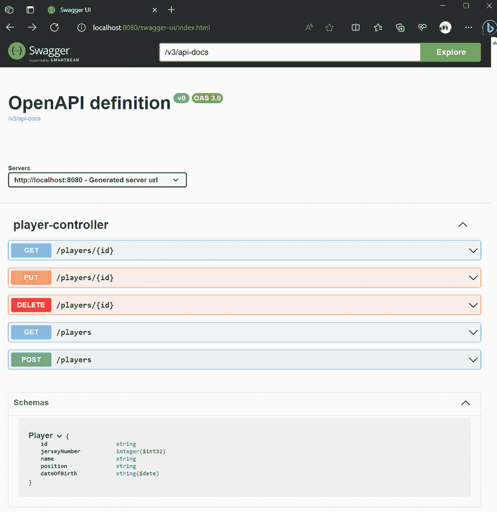
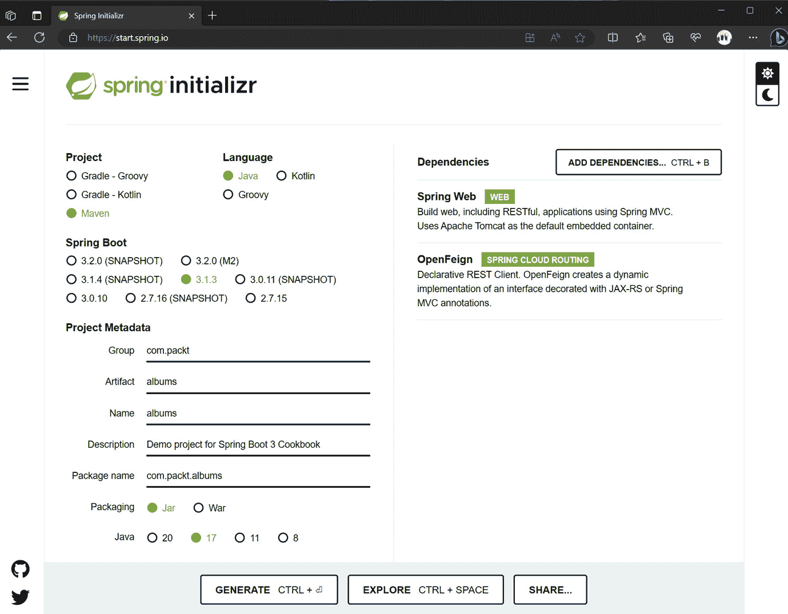

# 第一章：构建 RESTful API

在现代云应用程序中，RESTful API 对于无缝数据交换至关重要，它使得服务之间能够实现互操作性、可扩展性和高效通信。Spring Boot 通过提供快速、高效开发、自动配置和集成工具的框架，简化了 RESTful API 的编写。

在本章中，您将获得创建 RESTful 服务和无缝地从其他应用程序中消费它们的技能。您还将学习如何使用 Spring Boot 和其他流行工具提供的功能为您的 RESTful API 创建自动化测试。

在本章中，我们将介绍以下主要食谱：

+   创建 RESTful API

+   定义 API 暴露的响应和数据模型

+   在 RESTful API 中管理错误

+   测试 RESTful API

+   使用 OpenAPI 来记录我们的 RESTful API

+   使用 FeignClient 从另一个 Spring Boot 应用程序中消费 RESTful API

+   使用 RestClient 从另一个 Spring Boot 应用程序中消费 RESTful API

+   模拟 RESTful API

# 技术要求

要完成本章的食谱，您需要一个运行任何操作系统（我使用的是 Windows Subsystem for Linux – WSL 上的 Ubuntu）的计算机，一个编辑器，如 Visual Studio Code ([`code.visualstudio.com/`](https://code.visualstudio.com/)) 或 IntelliJ Idea ([`www.jetbrains.com/idea/`](https://www.jetbrains.com/idea/))），以及 Java OpenJDK 17 或更高版本。

来自不同供应商的 Java 有多种发行版——如果您已经安装了一个，您可以继续使用它；如果您需要安装一个，可以使用 Eclipse Adoptium 发行版（[`adoptium.net/`](https://adoptium.net/))。

如果您使用 Visual Studio Code，我建议安装 Java 扩展包（[`marketplace.visualstudio.com/items?itemName=vscjava.vscode-java-pack`](https://marketplace.visualstudio.com/items?itemName=vscjava.vscode-java-pack)）和 Spring Boot 扩展包（[`marketplace.visualstudio.com/items?itemName=vmware.vscode-boot-dev-pack`](https://marketplace.visualstudio.com/items?itemName=vmware.vscode-boot-dev-pack)）。

如果您没有用于执行 HTTP 请求的工具，可以使用 curl ([`curl.se/`](https://curl.se/)) 或 Postman ([`www.postman.com/`](https://www.postman.com/))。

最后，您可以在 GitHub 上下载完整的项目：[`github.com/PacktPublishing/Spring-Boot-3.0-Cookbook/`](https://github.com/PacktPublishing/Spring-Boot-3.0-Cookbook/).

您需要一个 git 客户端来从本书的 GitHub 仓库下载代码（[`git-scm.com/downloads`](https://git-scm.com/downloads)）。

# 创建 RESTful API

**RESTful API**是一种标准化的方式，软件组件可以通过 HTTP 方法和 URL 在互联网上进行通信。你应该学习它，因为它对于现代 Web 和云应用开发是基础。它促进了可扩展、灵活和无状态的通信，使开发者能够设计高效且广泛兼容的系统。理解 RESTful API 对于构建和集成服务至关重要。

当我还是个孩子的时候，我玩足球球员卡片，用我多余的卡片和朋友交换。我的孩子们，几十年后，还在玩这个游戏。在本章中，你将创建一个管理系统，用于管理足球卡片交易游戏，包括球队、球员、专辑和卡片。在这个菜谱中，你将创建一个暴露足球球员**创建、读取、更新和删除**（**CRUD**）**操作**的 RESTful API。

## 准备中

要创建 RESTful API，Spring Boot 提供了一个名为 Spring Initializr 的强大工具。你可以在浏览器中使用[`start.spring.io/`](https://start.spring.io)打开这个工具。我们将使用这个工具创建一个包含所有依赖项的 Spring Boot 项目。这个工具也与代码编辑器如 VSCode 和 IntelliJ（高级版）很好地集成。

## 如何操作...

让我们使用 Spring Initializr 创建一个 RESTful 项目，并使用典型的 HTTP 操作创建我们的第一个端点：

1.  在你的浏览器中打开[`start.spring.io`](https://start.spring.io)，你会看到以下屏幕：



图 1.1：Spring Initializr

Spring Initializr 允许你配置项目，并生成带有必要文件和依赖项的结构，你可以将其用作应用程序的起点。在这个起始页面上，设置以下配置：

+   在**项目**部分，选择**Maven**

+   在**语言**部分，选择**Java**

+   在**Spring Boot**部分，选择最新稳定版本——在撰写本书时，这是**3.1.4**

+   在**依赖项**部分，选择**Spring Web**

+   在`com.packt`中执行以下操作

+   对于`football`

+   《Spring Boot 3 Cookbook》演示项目

+   对于**打包**，选择**Jar**

+   对于**Java**，选择**21**

1.  一旦你配置了前面的选项，你可以选择**生成**、**探索**或**分享…**的选项：

    +   如果你点击**探索**，你可以在下载之前探索项目。

    +   如果你点击**分享**，将生成一个你可以与他人分享的 URL。例如，我们的配置将生成以下 URL：[`start.spring.io/#!type=maven-project &language=java&platformVersion=3.1.3&packaging=jar&jvmVersion=1 7&groupId=compackt&artifactId=football&name=football&description=Demo%20project%20for%20Spring%20Boot%203%20Cookbook&packageName=com.packt.football&dependencies=web`](https://start.spring.io/). 如果你打开它，它将配置如*图 1.1*所示的选项。

    +   如果您点击 **生成**，它将下载项目结构的 ZIP 文件。现在点击此选项。

1.  解压文件。现在您有了基本的项目结构，但您还没有任何 API。如果您尝试运行应用程序，您将收到 HTTP 404 Not Found 响应。

1.  在 `src/main/java/com/packt/football` 文件夹中，创建一个名为 `PlayerController.java` 的文件，并包含以下内容以创建 RESTful 端点：

    ```java
    package com.packt.football;
    import java.util.List;
    import org.springframework.web.bind.annotation.*;
    @RequestMapping("/players") @RestController
    public class PlayerController {
       @GetMapping
       public List<String> listPlayers() {
          return List.of("Ivana ANDRES", "Alexia PUTELLAS");
       }
    }
    ```

1.  要运行它，请在项目根目录中打开一个终端并执行以下命令：

    ```java
    ./mvnw spring-boot:run
    ```

    此命令将构建您的项目并启动应用程序。默认情况下，Web 容器监听端口 `8080`。

1.  执行一个 HTTP 请求以查看结果。您可以在浏览器中打开 `http://localhost:8080/players`，或者使用 curl 等工具执行请求：

    ```java
    curl http://localhost:8080/players
    ```

    您将收到控制器返回的玩家列表。

1.  通过添加更多动词来增强您的 RESTful 端点。在 `PlayerController.java` 文件中，执行以下操作：

    +   实现一个用于创建玩家的 POST 请求：

        ```java
        @PostMapping
        public String createPlayer(@RequestBody String name) {
             return "Player " + name + " created";
        }
        ```

    +   添加另一个 GET 请求以返回一个玩家：

        ```java
        @GetMapping("/{name}")
        public String readPlayer(@PathVariable String name) {
             return name;
        }
        ```

    +   添加一个 DELETE 请求以删除一个玩家：

        ```java
        @DeleteMapping("/{name}")
        public String deletePlayer(@PathVariable String name) {
             return "Player " + name + " deleted";
        }
        ```

    +   实现一个用于更新玩家的 PUT 请求：

        ```java
        @PutMapping("/{name}")
        public String updatePlayer(@PathVariable String name, @RequestBody String newName) {
             return "Player " + name + " updated to " + newName;
        }
        ```

1.  按照第 5 步中的说明再次执行应用程序并测试您的端点。在终端中输入以下命令执行 GET 请求：

    ```java
    curl http://localhost:8080/players/Ivana%20ANDRES
    Ivana ANDRES
    ```

    使用 curl 执行 POST 请求：

    ```java
    curl --header "Content-Type: application/text" --request POST
    --data 'Itana BONMATI' http://localhost:8080/players
    Player Itana BONMATI created
    Perform a DELETE request:

    ```

    curl --header "Content-Type: application/text" --request DELETE http://localhost:8080/players/Aitana%20BONMATI

    ```java

    And you will receive this output:

    ```

    玩家 Aitana BONMATI 已被删除

    ```java

    ```

## 它是如何工作的...

通过将 Spring Web 依赖项添加到我们的项目中，Spring Boot 自动将 Tomcat 服务器嵌入到应用程序中。`start.spring.io` 并监听端口 `8080`，这是 Tomcat 的默认端口。然而，由于应用程序中没有配置映射，它总是响应 404 Not Found 错误。

通过添加 `PlayerController` 类，我们通知 Spring Boot 应将其 `PlayerController` 类注册到依赖容器中作为实现类。通过添加 `PlayerController` 类。由于我们在类级别上应用了这些，我们已使用 `players` 前缀配置了此类中的所有请求。

最后一步是将请求映射到处理方法。这是通过使用映射注解来完成的：

+   `@GetMapping`：将 GET 请求映射到方法

+   `@PostMapping`：将 POST 请求映射到方法

+   `@PutMapping`：将 PUT 请求映射到方法

+   `@DeleteMethod`：将 DELETE 请求映射到方法

这些映射注解是 `@RequestMapping` 的一个特殊化，因为它们通知 Web 容器如何将请求映射到其处理器，在这种情况下，使用注解的方法。

请记住，每个控制器（即，一个 `GetMapping` 或 `PostMapping`）只能有一个这种映射类型，除非您提供更多配置来细化映射。在这个例子中，您可以看到有两个 `@GetMapping` 实例，但 `readPlayer` 被注解了额外的元素，因此它被映射到其类前缀 `players` 加上名称。这意味着所有以 `/players/anything` 开头的 GET 请求都将映射到这个方法。

到目前为止，这些额外信息尚未在方法中配置。要使用所有这些额外的 HTTP 请求信息在您的方 法中，您可以使用以下注解：

+   `@GetMapping("/{name}") public String readPlayer(@PathVariable String name)` 将路径的最后一部分映射到 `name` 方法参数。

+   **@RequestBody**：这将把请求体映射到方法参数。

+   **@RequestHeader**：这将把请求头映射到方法参数。

+   **@RequestParam**：您可以使用这个注解来映射请求参数，例如查询字符串参数、表单数据或 multipart 请求中的部分。

只需用之前的注解装饰我们的类，Spring Boot 就能设置好 Web 应用程序容器来管理请求。还有一些注解尚未介绍，但我们已经介绍了创建 RESTful API 的基础知识。

## 还有更多...

即使我们所创建的 RESTful 端点非常简单，我也故意添加了这些方法 - 默认的 `GET`、带有标识符的 `GET`、`POST`、`PUT` 和 `DELETE`。这个选择是基于它与执行 CRUD 和列表操作的最普遍语义相一致。

在我们的资源是足球**球员**的上下文中，我们有以下操作：

+   默认情况下，`GET` 通常返回资源列表，在我们的例子中，是所有球员

+   带有标识符的 `GET` 返回一个特定的球员

+   `POST` 创建一个新的资源

+   `PUT` 更新一个资源

+   `DELETE` 删除一个资源

此外，HTTP 状态码响应在 RESTful 操作的语义中非常重要。在这个菜谱中，响应不是按照标准方式管理的。在接下来的菜谱中，我们将扩展这一点，学习 Spring Boot 如何促进正确处理响应。

## 参见

如果您想了解更多关于 API 设计的信息，您可以访问以下页面：

+   [`swagger.io/resources/articles/best-practices-in-api-design/`](https://swagger.io/resources/articles/best-practices-in-api-design/)

+   [`learn.microsoft.com/azure/architecture/best-practices/api-design`](https://learn.microsoft.com/azure/architecture/best-practices/api-design)

# 定义响应和 API 暴露的数据模型

在前一个菜谱中，我们创建了一个非常简单的 RESTful API。为了开发一个为消费者提供良好用户体验的 RESTful API，必须结合使用标准响应代码和一致的数据模型。在这个菜谱中，我们将通过返回标准响应代码并为我们的玩家端点创建数据模型来增强先前的 RESTful API。

## 准备工作

您可以使用之前菜谱中生成的项目或从 GitHub 仓库下载样本：[`github.com/PacktPublishing/Spring-Boot-3.0-Cookbook/`](https://github.com/PacktPublishing/Spring-Boot-3.0-Cookbook/)。

您可以在`chapter1/recipe1-2/start`文件夹中找到启动此练习的代码。

## 如何做...

在这个菜谱中，我们将创建一个文件夹结构来包含我们项目中的不同类型的类。我们将定义一个数据模型来在我们的 RESTful API 中公开，以及一个提供 API 所需操作的服务。

注意，以下步骤中创建的所有内容都将位于`src/main/java/com/packt/football`文件夹或您在需要时创建的子文件夹中。让我们开始吧：

1.  创建一个名为`model`的文件夹。然后在这个文件夹中创建一个名为`Player.java`的文件，内容如下：

    ```java
    public record Player(String id, int jerseyNumber, String name, String position,     LocalDate dateOfBirth) {
    }
    ```

1.  创建一个名为`exceptions`的文件夹。在这个文件夹中创建两个文件：

    +   第一个，`AlreadyExistsException.java`，应包含以下内容：

        ```java
        package com.packt.football.exceptions;
        public class AlreadyExistsException extends RuntimeException {
             public AlreadyExistsException(String message) {
                  super(message);
             }
        }
        ```

    +   第二个，`NotFoundException.java`，应包含以下内容：

        ```java
        package com.packt.football.exceptions;
        public class NotFoundException extends RuntimeException {
            public NotFoundException(String message) {
                  super(message);
             }
        }
        ```

1.  创建另一个名为`services`的文件夹，并在该文件夹中创建一个名为`FootballService`的类。这个类管理我们 RESTful API 所需的所有操作。在这个文件中执行以下操作：

    +   首先创建这个类：

        ```java
        @Service
        public class FootballService {
        }
        ```

    这个类将使用`Map`管理数据，将所有玩家保存在内存中。

    +   现在，让我们定义一个`Map<String, Player>`字段并初始化它。（为了简洁起见，我只创建了两个条目，但在 GitHub 仓库中，您将找到更多）：

        ```java
        private final Map<String, Player> players = Map.ofEntries(
              Map.entry("1884823", new Player("1884823", 5, "Ivana ANDRES", "Defender", LocalDate.of(1994, 07, 13))),
              Map.entry("325636", new Player("325636", 11, "Alexia PUTELLAS", "Midfielder", LocalDate.of(1994, 02, 04
        ))));
        ```

    +   定义我们 RESTful API 所需的操作：

        +   首先列出玩家：

        ```java
        public List<Player> listPlayers() {
             return players.values().stream()
                    .collect(Collectors.toList());
        }
        ```

        +   然后返回一个玩家（请注意，如果玩家不存在，它将抛出一个异常）：

        ```java
        public Player getPlayer(String id) {
             Player player = players.get(id);
              if (player == null)
                  throw new NotFoundException("Player not found");
           return player;
        }
        ```

        +   添加一个新玩家（请注意，如果玩家已经存在，它将抛出一个异常）：

        ```java
        public Player addPlayer(Player player) {
             if (players.containsKey(player.id())) {
                 throw new AlreadyExistsException("The player already exists");
             } else {
                 players.put(player.id(), player);
                 return player;
             }
        }
        ```

        +   更新一个玩家（请注意，如果玩家尚未存在，它将抛出一个异常）：

        ```java
        public Player updatePlayer(Player player) {
             if (!players.containsKey(player.id())) {
                 throw new NotFoundException("The player does not
        exist");
             } else {
                 players.put(player.id(), player);
                return player;
             }
        }
        ```

        +   删除一个玩家（请注意，如果玩家不存在，它将无错误地继续）：

        ```java
        public void deletePlayer(String id) {
            if (players.containsKey(id)) {
                 players.remove(id);
            }
        }
        ```

1.  接下来，在`PlayerController`类中，修改控制器以使用我们新的服务并公开新创建的数据模型：

    +   在`PlayerController`类中添加一个`FootballService`字段，并创建一个带有类型为`FootballService`的参数的构造函数来初始化它：

        ```java
        @RequestMapping("/players")
        @RestController
        public class PlayerController {
            private FootballService footballService;
            public PlayerController(FootballService footballService) {
                this.footballService = footballService;
            }
        }
        ```

    +   创建管理玩家的操作。我们将使用我们最近创建的服务来管理该功能。如前一个菜谱中所述，我们将装饰我们的类方法来管理 RESTful 端点方法，并将调用我们的`Football`服务类的服务：

        ```java
        @GetMapping
        public List<Player> listPlayers() {
             return footballService.listPlayers();
        }
        @GetMapping("/{id}")
        public Player readPlayer(@PathVariable String id) {
             return footballService.getPlayer(id);
        }
        @PostMapping
        public void createPlayer(@RequestBody Player player) {
            footballService.addPlayer(player);
        }
        @PutMapping("/{id}")
        public void updatePlayer(@PathVariable String id,
                                 @RequestBody Player player) {
            footballService.updatePlayer(player);
        }
        @DeleteMapping("/{id}")
        public void deletePlayer(@PathVariable String id) {
            footballService.deletePlayer(id);
        }
        ```

1.  在 `application` 根目录下，打开终端并执行以下命令以运行应用程序：

    ```java
    ./mvnw spring-boot:run
    ```

1.  通过执行以下 `curl` 命令来测试应用程序，以获取所有球员：

    ```java
    curl http://localhost:8080/players
    [{"id":"325636","jerseyNumber":11,"name":"Alexia PUTELLAS","position":"Midfielder","dateOfBirth":"1994-02- 04"},{"id":"1884823","jerseyNumber":5,"name":"Ivana ANDRES","position":"Defender","dateOfBirth":"1994-07-13"}]
    ```

## 它是如何工作的...

在这个菜谱中，我们定义了一个名为 `Player` 的新记录类型。Spring Boot 自动将此对象序列化为响应体，该响应体可以以 JSON 或 XML 等格式发送给客户端。

Spring Boot 使用消息转换器来完成此序列化。消息转换器的选择和序列化格式取决于客户端请求中的 Accept 头。默认情况下，Spring Boot 将响应序列化为 JSON。

关于记录

基于 `equals()`、`hashCode()` 和 `toString()` 构造函数的记录组件。此功能旨在简化主要封装数据的类的创建。Spring Boot 3 使用 Java 17 或更高版本。

如果你有特殊的序列化要求，你可以通过实现自己的 `WebMvcConfigurer` 并覆盖 `configureMessageConverters` 方法来配置自己的消息转换器。你可以在 Spring 框架文档中找到更多信息：[`docs.spring.io/spring-framework/docs/current/javadoc-api/org/springframework/web/servlet/config/annotation/WebMvcConfigurer.html#configureMe%20ssageConverters(java.util.List`](https://docs.spring.io/spring-framework/docs/current/javadoc-api/org/springframework/web/servlet/config/annotation/WebMvcConfigurer.html#configureMe%20ssageConverters(java.util.List))。

Spring Boot 对 HTTP 状态码的默认处理可以总结如下：

+   当执行过程没有生成异常时，它将以 HTTP 200 状态响应。

+   如果端点未实现方法，它将返回一个 **405 方法不允许** 错误。

+   如果尝试获取一个不存在的资源，例如，一个应用程序未管理的路径，它将返回 **404** **未找到**。

+   如果请求无效，它将返回 **400** **错误请求**。

+   在发生异常的情况下，它产生一个 **HTTP 500 内部服务器** **错误**。

+   还有其他与安全相关的操作，我们将在后面的章节中讨论，这些操作可能会返回 **401 未授权** 或 **403 禁止**。

在某些场景中，这种行为可能已经足够，但如果你想要为你的 RESTful API 提供适当的语义，你应该在找不到资源时返回 404 状态码。检查下一个菜谱以了解如何处理这些场景。

注意，`FootballService` 类被注解为 `@Service`、`@Controller`、`@Bean` 等。由于 `PlayerController` 类对 `FootballService` 有依赖，当 Spring Boot 实例化 `PlayerController` 时，它传递 `FootballService` 类的一个实例。

# 管理 RESTful API 中的错误

在上一食谱中，我们通过使用复杂的数据结构增强了我们的 RESTful API。然而，应用程序无法管理一些常见的错误或返回标准的响应代码。在本食谱中，我们将通过管理常见错误并返回符合标准的一致响应代码来增强之前的 RESTful API。

## 准备工作

你可以使用上一食谱生成的项目，或者从 GitHub 仓库[`github.com/PacktPublishing/Spring-Boot-3.0-Cookbook/`](https://github.com/PacktPublishing/Spring-Boot-3.0-Cookbook/)下载样本。

你可以在`chapter1/recipe1-3/start`文件夹中找到开始此练习的代码。

## 如何做到这一点...

在本食谱中，我们将修改上一食谱中创建的 RESTful API，以处理应用程序可能引发的异常，并将返回最合适的 HTTP 响应代码。

在以下步骤中创建的所有内容都将位于`src/main/java/com/packt/football`文件夹或你将创建的子文件夹中。让我们开始吧：

1.  如果你尝试检索一个不存在的玩家或创建相同的玩家两次，它将抛出异常。结果将是一个 HTTP 500 服务器错误：

    ```java
    curl http://localhost:8080/players/99999
    {"timestamp":"2023-09- 16T23:18:41.906+00:00","status":500,"error":"Internal Server Error","path":"/players/99999"}
    ```

1.  为了更一致地管理此错误，我们将在`PlayerController`类中添加一个新的`notFoundHandler`方法来管理`NotFoundException`错误：

    ```java
    @ResponseStatus(value = HttpStatus.NOT_FOUND, reason = "Not found")
    @ExceptionHandler(NotFoundException.class)
    public void notFoundHandler() {
    }
    ```

1.  接下来，我们将添加另一个名为`alreadyExistsHandler`的方法来管理`AlreadyExistsException`错误：

    ```java
    @ResponseStatus(value = HttpStatus.BAD_REQUEST, reason = "Already exists")
    @ExceptionHandler(AlreadyExistsException.class) public void alreadyExistsHandler() {
    }
    ```

1.  在`application`根目录下，打开一个终端并执行以下命令以运行应用程序：

    ```java
    ./mvnw spring-boot:run
    ```

1.  通过执行以下 curl 命令来测试应用程序：

    +   执行以下命令以获取一个不存在的玩家：

        ```java
        curl http://localhost:8080/players/99999
        {"timestamp":"2023-09- 16T23:21:39.936+00:00","status":404,"error":"Not
        Found","path":"/players/99999"}
        ```

    +   注意，通过返回`HTTP 404 Not Found`响应，我们的应用程序遵循标准的 RESTful API 语义。HTTP 404 表示你尝试获取一个不存在的资源，在我们的例子中是玩家 9999。

    +   让我们验证我们的应用程序是否按预期管理了`AlreadyExistsException`。执行以下请求以创建玩家两次：

        ```java
        data="{'id': '8888', 'jerseyNumber':6, 'name':'Cata COLL',"
        data=${data}" 'position':'Goalkeeper', "
        data=${data}" 'dateOfBirth': '2001-04-23'}"
        curl --header "Content-Type: application/json" --request POST \
         --data $data  http://localhost:8080/players
        ```

    第一次运行时将没有任何错误，并返回`HTTP 200`代码。第二次运行将返回`HTTP` `400`代码。

## 它是如何工作的...

正如我们在上一食谱中学到的，Spring Boot 管理最常见的 HTTP 状态代码。在本食谱中，我们展示了如何管理其他特定于我们应用程序逻辑的场景，并需要一致的 HTTP 状态代码。

为了给 RESTful API 提供适当的语义，当资源未找到时，你应该返回`404`状态码。在某些场景中，将`FootballService`的签名更改为在找不到玩家时返回 null 值是有意义的。然而，如果控制器返回 null，响应将仍然是`HTTP 200`。为了避免这种行为，我们添加了**@ExceptionHandler**注解来添加一个处理方法来管理特定类型的异常，以及**@ResponseStatus**注解来管理在该特定方法处理程序中返回的 HTTP 状态码。

## 还有更多...

在你的代码中，你可以更明确地控制响应码。而不是直接在控制器中使用你的数据模型，你可以返回`ResponseEntity`，这允许你明确指定状态码。以下是如何以这种方式实现`getPlayer`的示例：

```java
@GetMapping("/{id}")
public ResponseEntity<Player> readPlayer(@PathVariable String id) 
{
  try {
          Player player = footballService.getPlayer(id);
          return new ResponseEntity<>(player, HttpStatus.OK);
     } catch (NotFoundException e) {
          return new ResponseEntity<>(HttpStatus.NOT_FOUND);
      }
}
```

另一个替代方案是使用带有`@ControllerAdvice`注解的类来为所有控制器提供一个全局处理器：

```java
package com.packt.football;
@ControllerAdvice
public class GlobalExceptionHandler {
    @ExceptionHandler(NotFoundException.class)
     public ResponseEntity<String>
handleGlobalException(NotFoundException ex) {
        return new ResponseEntity<String>(ex.getMessage(), HttpStatus.NOT_FOUND);
    }
}
```

这样，你可以为应用程序中所有 RESTful 端点提供一致的错误处理。

# 测试 RESTful API

手动测试应用程序可能会很累，尤其是在处理难以验证的挑战性场景时。此外，它在开发生产率方面缺乏可扩展性。因此，我强烈建议应用自动化测试。

默认情况下，Spring Boot 包括提供单元和集成测试基本组件的*Testing starter*。在这个菜谱中，我们将学习如何为我们的 RESTful API 实现单元测试。

## 准备工作

在这个菜谱中，我们将为之前菜谱中创建的 RESTful API 创建单元测试。如果你还没有完成，我准备了一个工作版本。你可以在书的 GitHub 仓库中找到它，网址为[`github.com/PacktPublishing/Spring-Boot-3.0-Cookbook/`](https://github.com/PacktPublishing/Spring-Boot-3.0-Cookbook/)。你可以在这个菜谱的`chapter1/recipe1-4/start`文件夹中找到启动此菜谱的代码。

## 如何做...

让我们在我们的 RESTful API 中添加一些测试，以便在更改应用程序时验证它：

1.  我们将首先在`src/test`文件夹中为我们的 RESTful 控制器创建一个新的测试类。让我们将新类命名为`PlayerControllerTest`，并使用`@WebMvcTest`注解，如下所示：

    ```java
    @WebMvcTest(value = PlayerController.class)
    public class PlayerControllerTest {
    }
    ```

1.  现在，定义一个类型为`MockMvc`的字段，并使用`@Autowired`注解。

    ```java
    @Autowired
    private MockMvc mvc;
    ```

1.  然后，创建另一个类型为`FootballService`的字段，并使用`@MockBean`注解。

1.  现在我们已经准备好编写我们的第一个测试：

    1.  让我们创建一个方法来验证我们的 RESTful API 何时返回玩家。将新方法命名为`testListPlayers`：

    ```java
    @Test
    public void testListPlayers() throws Exception {
    }
    ```

    重要的是要注意，它应该使用`@Test`注解。

    1.  测试的第一件事是配置`FootballService`。以下行配置`FootballService`在调用`listPlayers`方法时返回两位玩家的列表：

    ```java
    Player player1 = new Player("1884823", 5, "Ivana ANDRES", "Defender", LocalDate.of(1994, 07, 13));
    Player player2 = new Player("325636", 11, "Alexia PUTELLAS", "Midfielder", LocalDate.of(1994, 02, 04));
    List<Player> players = List.of(player1, player2);
    mvc field created in *step 2* to emulate the HTTP calls and validate it’s behaving as expected:
    ```

```java
MvcResult result = mvc.perform(MockMvcRequestBuilders                 .get("/players")                .accept(MediaType.APPLICATION_JSON))
                .andExpect(status().isOk())
                .andExpect(MockMvcResultMatchers                     .jsonPath("$", hasSize(2)))
                .andReturn();
```

上述代码执行了一个接受 application/JSON 内容的 GET 请求。预期结果是 OK，这意味着任何 200 到 299 之间的 HTTP 状态码。预期结果是一个包含两个元素的 JSON 数组。最后，我们将结果保存在`result`变量中。

1.  由于我们将结果保存在了`result`变量中，我们可以执行额外的验证。例如，我们可以验证返回的球员数组是否完全符合预期：

```java
String json = result.getResponse().getContentAsString();
ObjectMapper mapper = new ObjectMapper();
mapper.registerModule(new JavaTimeModule());
List<Player> returnedPlayers = mapper.readValue(json,
                mapper.getTypeFactory().constructCollectionType(List.class, Player.class));
testReadPlayer_doesnt_exist in the PlayerControllerTest class. Remember to annotate it with @Test:

```

@Test

public void testReadPlayer_doesnt_exist() throws Exception {

}

```java

1.  Let’s arrange the `getPlayer` method of the `FootballService` class to throw a `NotFoundException` when trying to get the player `1884823`. For that, use the following code:

```

String id = "1884823";

given(footballService.getPlayer(id))

使用*步骤 2*中定义的`.mvc`字段来模拟请求，然后验证其行为是否符合预期：

```java
mvc.perform(MockMvcRequestBuilders.get("/players/" + id).accept(MediaType.APPLICATION_JSON))
      .andExpect(status().isNotFound());
```

                要执行测试，请使用以下命令：

```java
mvn test
```

当你执行`package`或`install`目标时，也会执行`test`目标，除非你明确禁用测试执行。

通常，你也可以从你喜欢的 IDE 中执行测试。

            它是如何工作的...

            默认情况下，Spring Initializr 包括对`spring-boot-starter-test`的依赖。这个依赖提供了创建测试所需的所有必要组件。让我们描述在这个菜谱中使用的元素：

                +   `@WebMvcTest`: 当你将此注解应用于测试类时，它禁用了 Spring Boot 默认的自动配置，并仅应用与 MVC 测试相关的配置。这意味着它不会注册带有`@Service`注解的`FootballService`类，但它会注册带有`@RestController`注解的`PlayerController`类。

                +   `@MockBean`: 由于我们的`FootballService`类没有自动配置（因为我们使用了`@WebMvcTest`），我们可以注册自己的`FootballService`实现。`@MockBean`注解允许我们模拟`FootballService`的实现，替换任何之前的 bean 注册。

                +   `given`: 这种方法模拟了一个方法，并允许我们指定其行为。例如，使用`thenReturn`在调用`given`指定的方法时设置返回值。

                +   `MockMvc`: 这模拟了 Web 服务器的行为，并允许你测试你的控制器，而无需部署应用程序。在执行模拟请求时，它返回`ResultActions`，提供了验证控制器行为是否符合预期的方法，例如`andExpect`方法。

            在这个菜谱中，我们使用了其他 JUnit 实用工具，例如`assertArrayEquals`来比较两个数组的元素。JUnit 和其他测试库提供的实用工具非常广泛，我们不会在这本书中详细涵盖所有内容。然而，当我介绍它们时，我会解释测试实用工具。

            还有更多...

            你可以作为一个练习为我们的 RESTful API 公开的其他方法编写测试。我还为这个 RESTful API 准备了一些测试。你可以在书的 GitHub 仓库[`github.com/PacktPublishing/Spring-Boot-3.0-Cookbook`](https://github.com/PacktPublishing/Spring-Boot-3.0-Cookbook)中找到它们——最终版本在`chapter1/recipe1-4/end`文件夹中。

            参见

            在这本书中，我在编写测试时应用了**安排-执行-断言**（**AAA**）原则：

                +   **安排**：在这个步骤中，你通过设置“执行”步骤运行所需的条件来准备你想要测试的类。

                +   **执行**：在这个步骤中，你执行你正在测试的操作

                +   **断言**：在这个步骤中，你验证是否达到了预期的结果

            此外，还有**安排-执行-断言-清理**（**AAAC**）的变体，它增加了一个最后一步来清理测试所做的任何更改。理想情况下，最后一步不应该必要，因为我们可以模拟任何需要清理状态的处理组件或服务。

            使用 OpenAPI 来文档我们的 RESTful API

            现在我们有了 RESTful API，我们可以创建一个消费者应用程序。我们可以创建一个应用程序并仅执行 HTTP 请求。这将要求我们向消费者提供我们应用程序的源代码，并且他们需要理解它。但如果他们正在用不同的语言开发他们的应用程序，并且他们不知道 Java 和 Spring Boot 呢？出于这个原因，OpenAPI 被创建出来。OpenAPI 是一个用于文档 RESTful API 的标准，可以用来生成客户端应用程序。它被广泛采用，并支持不同的语言和框架。Spring Boot 对 OpenAPI 的支持非常出色。

            在这个菜谱中，我们将学习如何为我们的 RESTful API 添加 OpenAPI 支持，并使用 OpenAPI 提供的工具来消费它。

            准备工作

            在这个菜谱中，我们将增强之前菜谱中创建的 RESTful API。如果你还没有完成之前的菜谱，你可以在书的 GitHub 仓库[`github.com/PacktPublishing/Spring-Boot-3.0-Cookbook`](https://github.com/PacktPublishing/Spring-Boot-3.0-Cookbook)中找到一个工作版本。

            你可以在`chapter1/recipe1-5/start`文件夹中找到开始这个练习的代码。

            注意

            OpenAPI 3.0 是 Swagger 在 SmartBear 捐赠给 OpenAPI 倡议后的新名称。你可能会发现很多文档仍然使用*Swagger*这个名字来指代 OpenAPI。

            如何做...

            让我们使用 OpenAPI 来文档我们的 RESTful API，并从漂亮的 OpenAPI 用户界面开始测试：

                1.  打开 RESTful API 项目的`pom.xml`文件，并添加 SpringDoc OpenAPI Starter WebMVC UI 依赖项，`org.springdoc:springdoc-openapi-starter-webmvc-ui`。要添加依赖项，将以下 XML 插入到`<dependencies>`元素中：

    ```java
    <dependencies>
       <dependency>
          <groupId>org.springdoc</groupId>
          <artifactId>springdoc-openapi-starter-webmvc- ui</artifactId>
          <version>2.2.0</version>
       </dependency>
    </dependencies>
    ```

            重要

            为了简洁，我从代码片段中删除了其他依赖项，但你应该在你自己的代码中保留所有这些依赖项。

                1.  现在，您可以执行此应用程序并在浏览器中打开以下 URL：`http://localhost:8080/v3/api-docs`。它以 OpenAPI 格式返回您的 RESTful API 的描述。您还可以打开 `http://localhost:8080/swagger-ui/index.html` 以获得一个用于与您的 API 交互的友好用户界面。

            

            图 1.2：我们的 RESTful API 的 Open API (Swagger) UI

                1.  如您所见，它公开了应用程序中定义的所有 RESTful 操作以及使用的数据模型，在这种情况下是 `Player`。现在您可以使用浏览器执行任何可用的操作。

            它是如何工作的...

            `org.springdoc:springdoc-openapi-starter-webmvc-ui` 依赖项在运行时检查应用程序以生成端点的描述。OpenAPI 的核心是可在 http://localhost:8080/v3/api-docs 找到的服务定义。这是一个遵循 OpenAPI 架构的 JSON 文档，描述了应用程序中托管的 RESTful 端点。端点是路径、HTTP 方法、参数、响应和数据模式的组合。

            OpenAPI 依赖项提供的另一个有趣的功能是使用 OpenAPI 架构提供基本交互的友好 UI。它可以替代 `curl` 来测试 RESTful 服务，因为它不需要记住所有可能的参数。

            使用 FeignClient 从另一个 Spring Boot 应用程序消费 RESTful API

            现在我们有一个 RESTful API，并且它已经得到了适当的文档，我们可以创建一个消费者应用程序。有许多工具可以从 OpenAPI 规范生成客户端代码，但在这个项目中，我们将为了学习目的手动创建客户端代码。

            准备工作

            我们将增强前面菜谱中创建的 RESTful API。如果您还没有完成，您可以在本书的 GitHub 仓库 [`github.com/PacktPublishing/Spring-Boot-3.0-Cookbook`](http://ebay.co.uk) 中找到一个工作版本。

            您可以在 `chapter1/recipe1-6/start` 文件夹中找到开始此练习的代码。

            我们将再次使用 Spring Initializr 工具创建一个新的 Spring Boot 应用程序 ([`start.spring.io`](https://start.spring.io))。

            如何操作...

            我们将创建一个 Spring Boot 应用程序，它将消费在前面菜谱中创建的 Football RESTful API：

                1.  首先，我们将创建一个新的 Spring Boot 应用程序。打开 [`start.spring.io`](https://start.spring.io) 并使用与 *创建 RESTful API* 菜单中相同的参数，除了以下选项需要更改：

    +   对于 `albums`

    +   对于 **依赖项**，选择 **Spring Web** 和 **OpenFeign**

            

            图 1.3：消费者应用的 Spring Initializr

                1.  生成项目以下载 ZIP 文件。解压缩项目并打开 `pom.xml`。

                1.  创建一个名为 `Player` 的记录并添加以下代码：

    ```java
    public record Player(String id, Integer jerseyNumber,
                         String name, String position,
                         LocalDate dateOfBirth) {
    }
    ```

                    1.  创建一个名为 `FootballClient` 的接口并添加以下代码：

    ```java
    @FeignClient(name = "football", url = "http://localhost:8080")
    public interface FootballClient {
        @RequestMapping(method = RequestMethod.GET,
                        value = "/players")
        List<Player> getPlayers();
    }
    ```

                    1.  创建一个名为 `AlbumsController.java` 的控制器，代码如下：

    ```java
    @RestController
    @RequestMapping("/albums")
    public class AlbumsController {
         private final FootballClient footballClient;
         public AlbumsController(FootballClient footballClient) {
              this.footballClient = footballClient;
         }
         @GetMapping("/players")
         public List<Player> getPlayers() {
              return footballClient.getPlayers();
         }
    }
    ```

    通过添加 `@EnableFeignClients` 注解修改 `AlbumsApplication` 应用程序类：

    ```java
    @EnableFeignClients
    @SpringBootApplication
    public class AlbumsApplication {
    }
    ```

                    1.  现在通过在您的终端中执行以下命令来运行应用程序：

    ```java
    ./mvnw spring-boot:run \
    -Dspring-boot.run.arguments=-- server.port=8081
    ```

    额外的参数是运行此应用程序监听端口 `8081`，而不是默认的 `8080`。另一个应用程序正在监听端口 `8080`，因此我们需要避免端口冲突。

                    1.  然后测试应用程序：

    ```java
    curl http://localhost:8081/albums/players
    ```

    您将收到类似以下响应：

    ```java
    [{"id":"1884823","jerseyNumber":5,"name":"Ivana ANDRES","position":"Defender","dateOfBirth":"1994-07- 13"},{"id":"325636","jerseyNumber":11,"name":"Alexia PUTELLAS","position":"Midfielder","dateOfBirth":"1994-02-04"}]
    ```

            它是如何工作的...

            Feign 是一个 `@RequestMapping`，例如 `@GetMapping`、`@PostMapping` 和 `@PutMapping`，用于指定 HTTP 方法以及 URL 路径。实际上，这些注解与服务器端应用程序中使用的注解相同。

            您可以将 Feign 客户端接口注入到您的 Spring 组件中，并使用它来发送 HTTP 请求。Spring Cloud Feign 将根据接口定义自动生成并执行 HTTP 请求。通过在应用程序类上装饰 `@EnableFeignClients`，它会扫描应用程序中带有 `@FeignClient` 注解的接口并生成客户端。

            在控制器中，我们可以通过 Spring Boot 依赖注入简单地使用 Feign 客户端。

            请注意，我们传递了一个额外的参数 `-Dspring-boot.run.arguments=-- server.port=8081` 来执行客户端应用程序。原因是 RESTful API 已经在使用端口 `8080`，因此我们需要在不同的端口上执行客户端应用程序。

            更多...

            除了 Feign 之外，还有其他选项可以执行请求。我决定使用 Feign，因为它与 Spring Cloud 组件（如 Eureka 服务器）的集成非常出色。在接下来的菜谱中，我们将看到如何与 Spring Cloud 集成以及它如何在客户端进行负载均衡。

            在本菜谱中，客户端的大部分代码可以使用 IDE 集成或独立工具自动生成。这些工具特别有用，可以保持客户端代码与服务器描述同步。这些工具使用 RESTful API 暴露的 OpenAPI 描述来生成客户端代码：

                +   OpenAPITools: [`github.com/OpenAPITools/openapi-generator`](https://github.com/OpenAPITools/openapi-generator)

                +   swagger-codegen: [`github.com/swagger-api/swagger-codegen`](https://github.com/swagger-api/swagger-codegen)

            这两个项目都提供了一个命令行工具和一个 Maven 插件来生成客户端代码。

            从另一个 Spring Boot 应用程序使用 RestClient 消费 RESTful API

            在这个菜谱中，我们将使用 Spring 框架 6.1 中引入的新组件，并在 Spring Boot 3.2 版本中可用。在先前的菜谱中，我们通过在客户端应用程序中创建一个接口并定义目标服务中可用的相同方法来创建一个 FeignClient。通过使用 RestClient 组件，我们将获得一个提供 HTTP 库抽象的流畅 API。它允许将 Java 对象转换为 HTTP 请求，反之亦然，从 HTTP 响应创建对象。

            准备工作

            我们将增强在*使用 OpenAPI 记录我们的 RESTful API*菜谱中创建的 RESTful API。如果您还没有完成，您可以在书的 GitHub 仓库中找到一个工作版本，网址为 [`github.com/PacktPublishing/Spring-Boot-3.0-Cookbook`](https://github.com/PacktPublishing/Spring-Boot-3.0-Cookbook)。

            您可以在 `chapter1/recipe1-7/start` 文件夹中找到启动此练习的代码。

            我们将再次使用 Spring Initializr 工具创建一个新的 Spring Boot 应用程序 ([`start.spring.io`](https://start.spring.io))。

            如何做到这一点...

            我们将再次使用 Spring Initializr 工具创建一个新的 Spring Boot 应用程序，该应用程序将消耗在*使用 OpenAPI 记录我们的 RESTful API*菜谱中创建的 RESTful API：

                1.  让我们从使用 Spring Initializr 工具创建一个新的 Spring Boot 应用程序开始。为此，在您的浏览器中打开 [`start.spring.io`](https://start.spring.io)，并使用与*创建 RESTful API*菜谱中相同的参数，除了更改以下选项：

    +   对于 `albums`

    +   对于**依赖项**，选择**Spring Web**

                1.  现在，创建一个名为 `AlbumsConfiguration` 的配置类，在其中我们定义一个 `RestClient` 实例：

    ```java
    @Configuration
    public class AlbumsConfiguration {
        @Value("${football.api.url:http://localhost:8080}")
        String baseURI;
        @Bean
        RestClient restClient() {
            return RestClient.create(baseURI);
        }
    }
    ```

    注意我们使用 `@Value` 注解定义了一个字段来配置远程服务器的 URL。

                    1.  接下来，创建一个名为 `FootballClientService` 的服务类。这个类将使用 Spring Boot 容器在构造函数中注入 `RestClient` 实例：

    ```java
    @Service
    public class FootballClientService {
        private RestClient restClient;
        public FootballClientService(RestClient restClient) {
            this.restClient = restClient;
        }
    }
    ```

                    1.  现在，您可以使用 `RestClient` 从远程 RESTful API 获取数据。您可以创建一个名为 `getPlayers` 的方法，如下所示：

    ```java
    public List<Player> getPlayers() {
        return restClient.get().uri("/players").retrieve()
           .body(new ParameterizedTypeReference<List<Player>>(){ });
    }
    ```

                    1.  接下来，您可以创建另一个方法来从远程 RESTful API 获取单个玩家：

    ```java
    public Optional<Player> getPlayer(String id) {
        return restClient.get().uri("/players/{id}", id)
           .exchange((request, response) -> {
               if (response.getStatusCode().equals(HttpStatus.NOT_FOUND)) {
                  return Optional.empty();
               }
               return Optional.of(response.bodyTo(Player.class));
          });
    }
    ```

                    1.  最后，您可以使用 `FootballClientService` 服务创建一个 Album RESTful API。我创建了一个示例版本，您可以在书的 GitHub 仓库中找到。

            它是如何工作的...

            在这个菜谱中，我们没有创建任何额外的类型来复制远程 RESTful API。相反，我们使用了 `RestClient` 来使用 Fluent API 风格执行请求，即使用方法的结果来链式调用另一个方法。这种 Fluent API 设计易于阅读，因此被称为“Fluent”。

            让我们分析在 `getPlayer` 方法中我们做了什么：

                +   我们首先调用了`get`方法，该方法返回一个可以用来设置请求属性的对象，例如 URI、头部和其他请求参数。我们只是通过使用`uri`方法设置了远程地址。请注意，此地址附加到`AlbumsConfiguration`类中定义的基本地址。

                +   当我们调用`exchange`方法时，RestClient 执行了对远程 RESTful API 的调用。然后，`exchange`方法提供了一个处理器来管理响应。

                +   在响应处理器中，我们控制当找不到播放器时会发生什么，在这种情况下，我们返回一个空对象。否则，我们使用`bodyTo`方法，该方法允许传递一个用于反序列化响应的类型。在这个例子中，我们使用了`Player`类。

            `getPlayers`的代码与`getPlayer`非常相似；主要区别在于结果是播放器的`List`。为了指定这一点，有必要使用`ParameterizedTypeReference`类传递一个泛型类型。为了捕获泛型类型，需要定义`ParameterizedTypeReference`的子类，我们通过定义一个匿名内联类来实现。这就是为什么我们添加了新的`ParameterizedTypeReference<List<Player>>(){ }`，包括最后的括号`{ }`。

            在这个食谱中，我们在`AlbumsConfiguration`类中使用了`@Value`注解。这个注解允许我们从外部源注入值，例如从配置文件或环境变量中。值`"${football.api.url:http://localhost:8080}"`意味着它将首先尝试获取`footbal.api.url`配置属性。如果没有定义，它将采用默认值，`http://localhost:8080`。

            你会看到属性的格式会根据它们是在`application.properties`文件中定义还是在`application.yml`文件中定义而改变。在`application.properties`文件中，你会看到完整的属性在单行中。那就是`football.api.url=http://localhost:8080`。

            另一方面，`application.yml`文件可以嵌套属性，所以你会看到以下内容：

```java
football:
  api:
    url: http://locahost:8080
```

            在这本书中，我将在大多数情况下使用`application.yml`文件，但你也会遇到`application.properties`格式，例如在使用环境变量时。

            模拟 RESTful API

            使用远程服务作为我们之前食谱中所做的主要缺点是，当你测试客户端应用程序时，你需要远程服务正在运行。为了应对这种场景，你可以**模拟**一个远程服务器。通过**模拟**，我的意思是模拟组件或服务的行为了，在这种情况下，是远程服务。

            在测试中模拟远程依赖项可以有几个原因。其中一个主要原因是它允许你在隔离的环境中测试你的代码，无需担心远程依赖项的行为。如果远程依赖项不可靠或速度慢，或者你想要测试难以用远程依赖项复制的不同场景，这特别有用。

            在这个食谱中，我们将学习如何在测试执行期间使用 Wiremock 模拟我们的 Albums 应用程序中的远程 `Football` 服务。

            准备工作

            在这个食谱中，我们将为我们在 *从另一个 Spring Boot 应用程序使用 RestClient 消费 RESTful API* 食谱中构建的应用程序创建测试。如果你还没有完成那个食谱，我准备了一个可以在本书的 GitHub 仓库中找到的工作版本，该仓库位于 [`github.com/PacktPublishing/Spring-Boot-3.0-Cookbook`](https://github.com/PacktPublishing/Spring-Boot-3.0-Cookbook)，在 `chapter1/recipe1-8/start`。

            如何操作...

            我们将向我们的项目添加 Wiremock 依赖项，然后我们将能够为我们的 Albums 应用程序创建隔离的测试：

                1.  首件事是向 Albums 项目添加 Wiremock 依赖项。要做到这一点，打开 `pom.xml` 文件并添加以下依赖项：

    ```java
    <dependency>
        <groupId>com.github.tomakehurst</groupId>
        <artifactId>wiremock-standalone</artifactId>
        <version>3.0.1</version>
        <scope>test</scope>
    </dependency>
    ```

                    1.  现在，我们可以为我们的 `FootballClientService` 创建一个测试类。让我们将测试类命名为 `FootballClientServiceTest`。我们将使用 `@SpringBootTest` 注解传递一个带有远程服务器地址的属性：

    ```java
    @SpringBootTest(properties = { "football.api.url=http://localhost:7979" })
    public class FootballClientServiceTests {
    }
    ```

                    1.  然后，我们需要在测试中设置一个 Wiremock 服务器。将以下内容添加到 `FootballClientServiceTest` 类中：

    ```java
    private static WireMockServer wireMockServer;
    @BeforeAll
    static void init() {
        wireMockServer = new WireMockServer(7979);
        wireMockServer.start();
        WireMock.configureFor(7979);
    }
    ```

                    1.  现在，我们可以声明一个 `FootballClientService` 字段，该字段将由 Spring Boot 注入。用 `@Autowired` 注解它：

    ```java
    @Autowired
    FootballClientService footballClientService;
    ```

                    1.  然后，编写一个测试来验证 `getPlayer` 方法。

    1.  将测试命名为 `getPlayerTest`：

    ```java
    @Test
    public void getPlayerTest() {
    ```

    1.  让我们先安排远程服务的结果。将以下代码添加到测试中：

    ```java
    WireMock.stubFor(WireMock.get(WireMock.urlEqualTo("/players/325636"))
              .willReturn(WireMock.aResponse()
              .withHeader("Content-Type", "application/json")
              .withBody("""
                      {
                          "id": "325636",
                          "jerseyNumber": 11,
                          "name": "Alexia PUTELLAS",
                          "position": "Midfielder",
                          "dateOfBirth": "1994-02-04"
                       }
                       """)));
    ```

    1.  接下来，调用 `getPlayer` 方法。此方法依赖于远程服务：

    ```java
    Optional<Player> player = footballClientService.getPlayer("325636");
    ```

    1.  然后验证结果：

    ```java
    Player expectedPlayer =new Player("325636", 11, "Alexia PUTELLAS", "Midfielder", LocalDate.of(1994, 2, 4));
    assertEquals(expectedPlayer, player.get());
    ```

                    1.  作为练习，你可以为 `FootballClientService` 类的其余方法创建测试，也可以创建其他场景的测试，例如模拟远程服务器不同的响应。你可以在本书的 GitHub 仓库中找到一些准备好的测试。

            它是如何工作的...

            Wiremock 是一个用于 API 模拟测试的库。它可以作为一个独立工具运行，也可以作为一个库运行，就像我们在本食谱中所做的那样。Wiremock 只在测试中是必要的，因此我们将 `scope` 依赖配置为 `test`。与 Spring Boot 版本 3.2.x 存在已知的不兼容性。Spring Boot 使用 Jetty 12，而 Wiremock 依赖于 Jetty 11。为了避免这种不兼容性，我们使用了 `wiremock-standalone` 依赖项，而不是 `wiremock` 依赖项，因为它包含了所有必需的依赖项。

            Wiremock 项目不是 Spring Boot 框架的一部分，然而，它是 Spring 项目中模拟服务的一个流行选择。

            在这个食谱中，我们使用了`@SpringBootTest`注解，因为它使用了 SpringBoot 上下文，并允许通过`properties`字段传递自定义环境变量。我们使用这些属性来传递我们配置 Wiremock 的远程服务器地址。我们使用不同的服务器地址以避免与实际远程服务器发生冲突，无论出于何种原因它可能正在该机器上运行。

            我们还使用了`@BeforeAll`来在每次测试执行之前运行 Wiremock 服务器初始化。在这个初始化中，我们配置 Wiremock 服务器监听端口`7979`，与`properties`字段中传递的配置相匹配。

            使用`StubFor`，我们为远程服务器配置了所需的行为：当接收到对`/players/325636`的`GET`请求时，它应该返回一个包含模拟玩家的 JSON。其余的只是正常的测试验证，以确保结果符合预期。

            参见

            你可以在项目的网页上找到更多关于 Wiremock 的信息：[`www.wiremock.io/`](https://www.wiremock.io/)。

```java

```
