# 3

# 可观测性、监控和应用管理

监控和可观测性是管理和维护现代应用程序健康、性能和可靠性的关键方面。在面向微服务应用程序中，有多个不同服务的实例同时运行以提供解决方案，可观测性和监控有助于理解这些服务之间的交互并识别问题。

在大型环境中，监控发挥着至关重要的作用，能够跟踪资源利用率和性能指标。这反过来又促进了资源动态扩展，以有效满足系统的需求。这在云计算环境中特别有用，在那里您为使用的资源付费，并且您可以根据用户的实际需求调整应用程序资源。没有监控，您如何知道您的应用程序是否以 100%的 CPU 运行，响应时间如此之慢以至于用户放弃使用您的应用程序？

当您的应用程序中运行着多个微服务并且出现问题时，可观测性对于识别失败的组件和错误发生的上下文至关重要。

可观测性和监控对于持续改进也非常重要。您可以使用从监控中获得的知识来做出数据驱动的决策，提高性能，并在一段时间内完善解决方案。

Spring Boot 通过 Actuator 不仅提供监控功能，还提供管理能力，允许您在生产环境中与应用程序交互。这种能力不仅允许您检测应用程序中的潜在问题，还有助于在运行时进行故障排除。

在本章中，您将深入了解在 Spring Boot 应用程序中激活可观测性和监控功能。我们将从在您的应用程序中提供健康检查开始。在这里，您将学习如何利用应用程序通过流行的开源解决方案生成数据。本章还将涵盖在您的系统中创建跟踪，使您能够关联不同微服务之间的活动并使用 Zipkin 进行探索。此外，您还将学习如何使用 Prometheus 和 Grafana 监控应用程序公开的指标。除了 Spring Boot 及其相关组件提供的标准指标之外，您还将生成针对应用程序特定情况的定制指标并对其进行监控。一旦您的应用程序既可监控又可观测，您还可以在考虑市场上众多适合生产环境的强大监控解决方案的同时，将其与商业工具集成。最后，您将学习如何在运行时更改应用程序设置，以便您可以排除应用程序的故障。

在本章中，我们将介绍以下食谱：

+   将 Actuator 添加到您的应用程序中

+   创建自定义 Actuator 端点

+   使用探针和创建自定义健康检查

+   实现分布式跟踪

+   访问标准度量

+   创建您自己的度量

+   将您的应用程序与 Prometheus 和 Grafana 集成

+   修改运行中应用程序的设置

# 技术要求

在本章中，我们需要运行不同的工具，例如 Prometheus、Grafana 和 Zipkin。通常，在您的计算机上运行它们的最简单方法是使用 Docker。您可以从其产品页面获取 Docker：[`www.docker.com/products/docker-desktop/`](https://www.docker.com/products/docker-desktop/)。我将解释如何在其对应的配方中部署每个工具。

本章中将展示的所有配方都可以在以下位置找到：[`github.com/PacktPublishing/Spring-Boot-3.0-Cookbook/tree/main/chapter3`](https://github.com/PacktPublishing/Spring-Boot-3.0-Cookbook/tree/main/chapter3)。

# 将 Actuator 添加到您的应用程序中

因此，您计划开发一个新的 RESTful API 来完成您与足球相关的服务套件。您担心应用程序的响应性以及我们提供弹性服务的目标。因此，您非常关注正确监控应用程序的健康状况。

在您开始监控应用程序之前，您的应用程序应该是可监控的。为此，您决定开始使用 **Spring** **Boot Actuator**。

Spring Boot Actuator 包含了一组与 Spring 框架打包的生产就绪功能。它集成了各种内置工具和端点，旨在允许您在生产环境中监控、管理和与 Spring Boot 应用程序交互。Actuator 简化了理解并解决 Spring Boot 应用程序运行时行为的过程。

Actuator 模块公开了多个端点，包括 `health`、`metrics`、`info`、`dump` 和 `env` 等，为运行中的应用程序提供操作洞察。一旦包含了这个依赖项，您就有很多开箱即用的端点可用。自定义和扩展这些端点很容易实现，并在配置方面提供了灵活性。

在这个配方中，您将学习如何将 Spring Boot Actuator 包含到您的项目中，并使用一些开箱即用的端点。

## 准备工作

在这个配方中，我们将使用 *Spring Initializr* 工具创建一个应用程序。正如您在本书的先前章节中所做的那样，您可以通过访问 [`start.spring.io`](https://start.spring.io) 或将其集成到您最喜欢的代码编辑器中来使用此工具。

## 如何操作…

让我们创建一个启用了 Actuator 的项目，并开始探索提供的端点：

1.  使用 *Spring Initializr* 工具创建一个项目。打开 [`start.spring.io`](https://start.spring.io) 并使用与 *第一章* 中的 *创建 RESTful API 配方* 相同的参数，除了更改以下选项：

    +   对于 `fooballobs`

    +   对于**依赖项**，选择**Spring Web**和**Spring Boot Actuator**

1.  下载使用 *Spring Initializr* 生成的模板，并将其内容解压到您的工作目录中。

1.  如果您现在运行应用程序，您可以通过/actuator/health 访问健康端点。在运行应用程序之前，我们将暴露一些端点。为此，在`resources`文件夹中创建一个`application.yml`文件，并添加以下内容：

    ```java
    management:
        endpoints:
            web:
                exposure:
                    include: http://localhost:8080/actuator/health: This endpoint provides health information about your application. It is very useful in containerized environments such as Kubernetes to ensure that your application is up and running.
    ```

1.  [`localhost:8080/actuator/env`](http://localhost:8080/actuator/env)：此端点返回应用程序的环境变量。

1.  `http://localhost:8080/actuator/metrics`：此端点返回一个包含应用程序已暴露的度量值的列表。您可以通过将名称附加到度量端点来获取任何已暴露的度量值的值。例如，要获取`process.cpu.usage`，您可以请求 http://localhost:8080/actuator/metrics/process.cpu.usage。

1.  `http://localhost:8080/actuator/beans`：此端点返回一个包含在 IoC 容器中注册的 bean 的列表——即可以注入到其他 bean 中的 bean 列表。

1.  `http://localhost:8080/actuator/loggers`：此端点返回应用程序的日志级别和日志记录器的列表。它还允许在运行时修改日志级别。

1.  在这个菜谱中，您只暴露了一些可用的端点。您可以在[`docs.spring.io/spring-boot/docs/current/reference/html/actuator.html#actuator.endpoints`](https://docs.spring.io/spring-boot/docs/current/reference/html/actuator.html#actuator.endpoints)找到内置端点的完整列表。

## 它是如何工作的...

当您将 Actuator 集成到您的应用程序中时，它提供了一组端点，可用于监控您的应用程序和管理其行为。除了内置端点之外，它还允许您添加自己的端点。

端点可以被启用或禁用。默认情况下，除了关闭端点之外，所有端点都是启用的——正如其名称所暗示的，您可以使用它来优雅地关闭应用程序。然后，端点可以被暴露，这意味着它们可以通过 HTTP 请求或 JMX 远程访问。默认情况下，只有健康端点是暴露的。在这本书中，我们将主要关注 HTTP，因为它可以与标准监控工具一起使用，这些工具不是针对 Java 生态系统的。HTTP 仅适用于 Web 应用程序；如果您正在开发其他类型的应用程序，您将需要使用 JMX。

根据您使用的组件，将暴露更多数据。例如，当您包含 Spring Data JPA 时，Spring Data 度量值变得可用，因此您将需要配置 Spring Data 监控的相关度量值，如打开连接数。

## 还有更多...

Actuator 提供的一些端点可能会暴露非常敏感的信息。因此，健康端点是默认暴露的唯一端点。如果您的应用程序只能在虚拟网络内部访问或受到防火墙的保护，也许您可以保持端点开放。无论您的应用程序是否公开暴露，或者您只是想控制谁可以访问您的 Actuator 端点，您可能希望像在*第二章*中解释的那样保护它们。例如，安全配置可能如下所示：

```java
@Configuration
public class SecurityConfig {
    @Bean
    public SecurityFilterChain filterChain(HttpSecurity http) throws Exception {
        return http
                .authorizeHttpRequests(authorize ->
                      authorize.requestMatchers("/actuator/**")
                         .hasRole("ADMIN")
                         .anyRequest().authenticated())
                .oauth2ResourceServer(oauth2 -> oauth2.jwt(Customizer.withDefaults()))
                .build();
    }
}
```

您可以参考 Spring Boot 的官方文档[`docs.spring.io/spring-boot/docs/current/reference/html/actuator.html#actuator.endpoints.security`](https://docs.spring.io/spring-boot/docs/current/reference/html/actuator.html#actuator.endpoints.security)以获取更多详细信息。

## 相关内容

除了 Spring Boot 提供的端点和使用的组件外，Actuator 还提供了一个灵活的实现，允许您创建自己的端点。在本章的后面部分，您将学习如何创建自己的 Actuator 端点、指标和自定义健康检查。

参考以下食谱以获取更多信息：*创建自定义 Actuator 端点*、*创建自定义健康检查*和*创建您自己的指标*。

# 创建自定义 Actuator 端点

在我们的示例中，我们正在开发一个新的 RESTful API，该 API 需要从 blob 存储加载一个文件。该文件不经常更改，这意味着它在应用程序启动时加载到内存中，并且不会自动重新加载。您需要知道加载的文件版本，并且希望在出现新版本时强制重新加载。

要实现此功能，您将使用自定义 Actuator 端点。此端点将有一个 `GET` 操作来返回当前文件版本，以及一个 `POST` 方法来重新加载文件。

## 准备工作

在本食谱中，您将重用您在 *将 Actuator 添加到您的应用程序* 食谱中创建的应用程序。我在本书的 GitHub 仓库中准备了一个工作版本，该版本位于 [`github.com/PacktPublishing/Spring-Boot-3.0-Cookbook/`](https://github.com/PacktPublishing/Spring-Boot-3.0-Cookbook/)。您可以在 `chapter3/recipe3-2/start` 文件夹中找到它。

## 如何操作...

让我们修改 RESTful API，使其从文件夹中加载文件并返回一些结果。完成此操作后，您需要创建一个自定义 Actuator 端点，该端点返回已加载的文件。您还需要配置端点以重新加载文件：

1.  首先，创建一个类来加载文件并保持内容在内存中：

    1.  让我们将其命名为 `FileLoader` 并添加以下代码：

    ```java
    public class FileLoader {
        private String fileName;
        private List<String> teams;
        private String folder;
        public FileLoader(String folder) {
            this.folder = folder;
        }
    }
    ```

    1.  要加载文件并保持内容在内存中，请添加以下代码：

    ```java
    private void loadFile(String fileName) throws Exception {
           this.fileName = fileName;
           ObjectMapper mapper = new ObjectMapper();
           File file = new File(fileName);
           teams = mapper.readValue(file,
                   new TypeReference<List<String>>() {
                   });
     }
    ```

    1.  现在，添加一个公共方法，以便您可以加载在构造函数中传入的文件夹中找到的第一个文件：

    ```java
    public void loadFile() throws IOException {
        Files.list(Paths.get(folder))
             .filter(Files::isRegularFile)
             .findFirst()
             .ifPresent(file -> {
                 try {
                      loadFile(file.toString());
                 } catch (Exception e) {
                      e.printStackTrace();
                 }
            });
    }
    ```

1.  接下来，创建一个带有 `@Endpoint` 注解的类来定义自定义 Actuator 端点。将其命名为 `FootballCustomEndpoint`：

    ```java
    @Endpoint(id = "football")
    public class FootballCustomEndpoint {
        private FileLoader fileLoader;
        FootballCustomEndpoint(FileLoader fileLoader){
            this.fileLoader = fileLoader;
        }
    }
    ```

    此类在构造函数中接收一个`FileLoader`对象以执行必要的操作。

1.  现在，在`FootballCustomEndpoint`中创建自定义端点操作：

    1.  创建一个带有`@ReadOperation`注解的方法来检索正在使用的文件版本：

    ```java
    @ReadOperation
    public String getFileVersion(){
        return fileLoader.getFileName();
    }
    ```

    1.  创建一个带有`@WriteOperation`注解的方法来刷新文件：

    ```java
    @WriteOperation
    public void refreshFile(){
       try {
           fileLoader.loadFile();
       } catch (Exception e) {
           e.printStackTrace();
       }
    }
    ```

1.  接下来，您需要为`FileLoader`和`FootballCustomEndpoint`类创建 bean：

    1.  创建一个名为`FootballConfiguration`的类，并使用`@Configuration`注解：

    ```java
    @Configuration
    public class FootballConfiguration {
        @Value("${football.folder}")
        private String folder;
    }
    ```

    1.  注意有一个字段带有`@Value`注解。它将从配置中加载要加载的文件的文件夹路径。

    1.  创建一个生成`FileLoader` bean 的方法：

    ```java
    @Bean
    public FileLoader fileLoader() throws IOException{
        FileLoader fileLoader = new FileLoader(folder);
        return fileLoader;
    }
    ```

    1.  现在，创建一个生成`FootballCustomEndpoint`的方法：

    ```java
    @Bean
    public FootballCustomEndpoint footballCustomEndpoint(FileLoader fileLoader){
        return new FootballCustomEndpoint(fileLoader);
    }
    ```

1.  由于`FileLoader`需要通过`loadFile`方法加载文件，因此您需要创建一个实现`ApplicationRunner`接口的类：

    ```java
    @Component
    public class DataInitializer implements ApplicationRunner {
        private FileLoader fileLoader;
        public DataInitializer(FileLoader fileLoader) {
            this.fileLoader = fileLoader;
        }
        @Override
        public void run(ApplicationArguments args) throws Exception {
            fileLoader.loadFile();
        }
    }
    ```

1.  修改`resources`文件夹中的`application.yml`文件：

    1.  添加一个设置，提供要加载的文件的文件夹路径：

    ```java
    football:
        folder: teams
    ```

    1.  添加新的执行器端点：

    ```java
    management:
        endpoints:
            web:
                exposure:
                    include: health,env,metrics,beans,loggers,teams in the root of the project and a file named 1.0.0.json. As content, add an array containing teams – for example, [ "Argentina", "Australia", "Brazil"].
    ```

1.  创建一个示例 RESTful 控制器，返回由`FileLoader`类加载到内存中的内容：

    ```java
    @RestController
    @RequestMapping("/football")
    public class FootballController {
        private FileLoader fileLoader;
        public FootballController(FileLoader fileLoader){
            this.fileLoader = fileLoader;
        }
        @GetMapping
        public List<String> getTeams(){
            return fileLoader.getTeams();
        }
    }
    ```

1.  服务现在已准备好测试。执行应用程序并执行以下请求：

    1.  使用自定义执行器端点获取当前文件版本。为此，打开您的终端并执行以下`curl`请求：

    ```java
    curl http://localhost:8080/actuator/football
    ```

    1.  您将收到文件名作为响应 - 即`teams/1.0.0.json`。

    1.  让我们创建文件的新版本。将文件重命名为`1.0.1.json`，并在`teams`数组中添加一个新元素，如下所示：

    ```java
    [ "Senegal", "Argentina", "Australia", "Brazil"]
    ```

    1.  现在，使用自定义执行器端点刷新应用程序中的文件。为此，在您的终端中执行以下`curl`请求：

    ```java
    curl --request POST http://localhost:8080/actuator/football
    ```

    1.  再次检查当前文件版本；你现在将得到`teams/1.0.0.json`。

    1.  您还可以使用 RESTful API 验证结果是否与文件内容相符。

## 它是如何工作的...

通过创建一个带有`@Endpoint`注解的 bean，Actuator 通过 JMX 和 HTTP 公开所有带有`@ReadOperation`、`@WriteOperation`和`@DeleteOperation`注解的方法。此示例与常规 RESTful 端点没有太大区别，但目的不同，因为它用于管理您开发的应用程序或库。当然，您可以实现自己的自定义执行器端点，但通常 Actuator 端点作为其他组件的一部分提供，可能需要公开一些内部信息或行为。例如，数据库驱动程序（如 PostgreSQL）、数据库连接池管理器（如 HikariCP）和缓存系统（如 Redis）通常提供 Actuator 端点。如果您计划创建某种将被他人使用的系统或库，并且您对在运行时便于管理某些内部信息感兴趣，Actuator 端点是一个很好的解决方案。

`ApplicationRunner` 是一个在应用程序启动后立即执行组件。当 Spring Boot 执行时，`ApplicationRunner` 还未准备好接受请求。你可以定义多个 `ApplicationRunner`。一旦所有 `ApplicationRunner` 组件执行完毕，应用程序就准备好接受请求。

# 使用探针和创建自定义健康检查

你的新足球交易服务正被足球迷们迅速采用。这个服务用于在球迷之间交换带有足球运动员照片的贴纸。为了加速这个过程，该服务在应用程序的内存中缓存了一些数据。在你开始处理请求之前，你需要确保缓存已填充。

在正常情况下，足球交易服务运行良好；然而，在负载过重的情况下，应用程序实例开始退化，经过一些不稳定后，最终变得无响应。为了应对这种情况，你在实验室环境中准备了一些压力测试。然而，你意识到应用程序开始退化的原因是连接数据库时出现问题。同时，你意识到当应用程序有超过 90 个待处理订单时，这类问题就会发生。在你找到最终解决方案的同时，你决定在应用程序无法处理更多请求时暴露出来，并创建一个健康检查来验证它是否能够连接到数据库。

探针主要用于容器编排器，如 Kubernetes，以验证应用程序是否准备好接受请求，以及当它已经开始工作时指示它处于活动状态。在 Kubernetes 中，它们被称为就绪和存活探针。

健康检查是一种验证应用程序是否已准备好工作的机制——例如，它能够连接到数据库。

在这个菜谱中，你将学习如何暴露就绪检查，如何更改你的存活状态，以及如何创建一个自定义健康检查，该检查可以被托管平台或监控系统用来确定应用程序实例的健康状况以及应用程序何时准备好接受请求。

## 准备工作

在这个菜谱中，你将重用你在 *创建自定义 Actuator 端点* 菜谱中创建的应用程序。我在本书的 GitHub 仓库中准备了一个工作版本，位于 [`github.com/PacktPublishing/Spring-Boot-3.0-Cookbook/`](https://github.com/PacktPublishing/Spring-Boot-3.0-Cookbook/)。你可以在 `chapter3/recipe3-3/start` 文件夹中找到它。

在这个菜谱中，你将验证应用程序是否能够连接到应用程序数据库。我们将使用 PostgreSQL 作为数据库。为了在本地运行 PostgreSQL，我们将使用 Docker。你只需在终端中执行以下命令即可下载并启动数据库：

```java
docker run -e POSTGRES_USER=packt -e POSTGRES_PASSWORD=packt -p 5432:5432 --name postgresql postgres
```

如果您在*第五章*中创建了任何数据库，您可以在此处重用它。这个菜谱不执行任何真实查询——它只是验证它是否可以连接。如果您在容器中没有创建数据库，您可以使用**psql**工具创建数据库。为此，在您的终端中执行以下命令：

```java
psql -h localhost -U packt
```

您将被提示输入密码。指定`packt`并按**intro**。您将连接到 PostgreSQL 终端。执行以下命令以创建数据库：

```java
CREATE DATABASE football;
```

现在，您可以通过执行`quit;`命令退出数据库。

## 如何做到这一点...

在这个菜谱中，您将配置您的应用程序，使其能够管理探针并创建一个自定义的健康检查来验证应用程序是否可以连接到数据库：

1.  首先，更新`resources`文件夹中的`application.yml`文件，以便它能够启用准备就绪和存活探针。为此，包括以下内容：

    ```java
    management:
        endpoint:
            health:
                probes:
                    enabled: true
    ```

1.  接下来，创建一个模拟足球交易服务的类。命名为`TradingService`：

    ```java
    @Service
    public class TradingService {
    }
    ```

    此类将管理交易请求。在交易请求时，如果它检测到有超过 90 个挂起的订单，它将通知您应用程序无法处理更多请求。为此，它将使用`ApplicationEventPublisher`，该对象将被注入到构造函数中：

    ```java
    private ApplicationEventPublisher applicationEventPublisher;
    public TradingService(ApplicationEventPublisher applicationEventPublisher) {
        this.applicationEventPublisher = applicationEventPublisher;
    }
    ```

    接下来，定义一个返回挂起订单数量的方法。我们将通过返回 0 到 100 之间的随机数来模拟：

    ```java
    public int getPendingOrders() {
        Random random = new Random();
        return random.nextInt(100);
    }
    ```

    最后，您可以创建一个管理交易操作的方法。如果有超过 90 个挂起的订单，它将改变应用程序的状态：

    ```java
    public int tradeCards(int orders) {
        if (getPendingOrders() > 90) {
            AvailabilityChangeEvent.publish(applicationEventPublisher, new Exception("There are more than 90 pending orders"), LivenessState.BROKEN);
        } else {
            AvailabilityChangeEvent.publish(applicationEventPublisher, new Exception("working fine"), LivenessState.CORRECT);
        }
        return orders;
    }
    ```

1.  现在，配置数据库连接：

    1.  添加 Spring Data JDBC 和 PostgreSQL 依赖项。为此，在`pom.xml`文件中添加以下依赖项：

    ```java
    <dependency>
        <groupId>org.springframework.boot</groupId>
        <artifactId>spring-boot-starter-data-jdbc</artifactId>
    </dependency>
    <dependency>
        <groupId>org.postgresql</groupId>
        <artifactId>postgresql</artifactId>
        <scope>runtime</scope>
    </dependency>
    ```

    1.  将以下配置添加到`resources`文件夹中的`application.yml`文件中：

    ```java
    spring:
        datasource:
            url: jdbc:postgresql://localhost:5432/football
            username: packt
            password: packt
    ```

1.  现在，让我们创建一个健康指标：

    1.  为了做到这一点，创建一个名为`FootballHealthIndicator`的类，该类实现了`HealthIndicator`接口：

    ```java
    @Component
    public class FootballHealthIndicator implements HealthIndicator {
    }
    ```

    1.  由于它将连接到数据库，请在构造函数中注入`JdbcTemplate`：

    ```java
    private JdbcTemplate template;
    public FootballHealthIndicator(JdbcTemplate template) {
        this.template = template;
    }
    ```

    1.  现在，重写健康方法，以便您可以执行连接性检查：

    ```java
    @Override
    public Health health() {
        try {
            template.execute("SELECT 1");
            return Health.up().build();
        } catch (DataAccessException e) {
        return Health.down().withDetail("Cannot connect to database", e).build();
        }
    }
    ```

1.  在测试应用程序之前，您可以修改`FileLoader`类，模拟它，使其加载文件需要几秒钟。您可以通过修改`loadFile`方法并添加以下代码来实现这一点。这将使应用程序在加载文件之前等待 10 秒：

    ```java
    try {
        Thread.sleep(10000);
    } catch (InterruptedException e) {
        e.printStackTrace();
    }
    ```

1.  现在，让我们测试应用程序的准备就绪状态：

    1.  在运行应用程序之前，在您的终端中执行以下命令：

    ```java
    watch curl http://localhost:8080/actuator/health/readiness
    ```

    此命令将每秒执行一次就绪探针的请求。

    1.  启动应用程序。您将看到`watch`命令的输出会发生变化。首先，它将显示为**OUT_OF_SERVICE**：

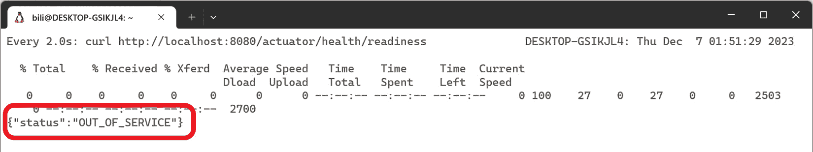

图 3.1：准备状态设置为 OUT_OF_SERVICE

1.  在 10 秒或您在*步骤 5*中配置的时间后，它将变为**UP**：

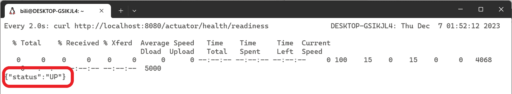

图 3.2：就绪状态变为 UP

1.  现在，测试应用程序的存活状态：

    1.  再次执行一个`watch`命令，但这次，向存活探针的端点发送请求：

    ```java
    watch curl http://localhost:8080/actuator/health/readiness
    watch -n 1 -x curl --request POST -H "Content-Type: application/json" --data "1" http://localhost:8080/football
    ```

    记住，如果有超过 90 个挂起的请求，它将标记自己为失败。由于选择的是 0 到 100 之间的随机数，因此有 10%的可能性它会失败。

    你会看到就绪端点返回 Actuator 健康端点的`watch`命令：

```java
watch curl http://localhost:8080/actuator/health
```

1.  它会每次都返回**UP**。为了验证它是否能够检测到无法连接到数据库的情况，停止 PostgreSQL 容器。为此，请运行以下命令：

```java
docker stop postgresql
```

你会看到 Actuator 端点响应时间会更长，并且响应将是**DOWN**。

## 它是如何工作的…

当 Spring Boot 检测到它在 Kubernetes 上运行时，会自动启用就绪和存活探针，但你也可以手动启用它们。在本菜谱中，我们明确启用了它们，但如果你在 Kubernetes 上运行应用程序，这将自动完成。

就绪和存活探针不应检查任何外部组件。它们应该验证应用程序内部是否就绪，并且能够响应。另一方面，健康检查应该验证所有依赖组件是否可用。

Spring Boot 应用程序的生命周期会经历不同的状态，并且每次状态改变时都会生成事件。在这里，我不会解释所有可能的应用程序状态；相反，我将专注于就绪探针期间的相关状态。第一个状态是`starting`。一旦 Spring Boot 初始化了组件，它就会变为`started`。在这个时候，它还没有准备好，因此需要运行应用程序中定义的所有`ApplicationRunner`和`CommandLineRunner`实例。一旦它们全部执行完毕，它就会变为`ready`。在这个菜谱中，我们在`loadFile`方法中引入了 10 秒的延迟。在这段时间内，就绪状态是**OUT_OF_SERVICE**。一旦它加载了文件，它就会变为**UP**。

如果你想了解更多，请查看以下 Spring Boot 文档：[`docs.spring.io/spring-boot/docs/current/reference/html/features.html#features.spring-application.application-events-and-listeners`](https://docs.spring.io/spring-boot/docs/current/reference/html/features.html#features.spring-application.application-events-and-listeners)。

在检查其他组件时要小心。首先，如果它是另一个服务，例如我们在本菜谱中创建的服务，它可能也会有探针和健康检查。通过你的服务进行检查可能是多余的。其次，尝试进行轻量级检查；否则，你可能会生成过多的负载，这可能导致性能问题。在本菜谱中，我们使用的 SQL 命令是`SELECT 1`。这个命令连接到数据库，但不需要从连接本身获取数据库引擎的计算资源。

## 相关内容

健康检查不一定意味着你需要检查你应用程序的所有依赖项的健康状况。相反，你应该检查你的应用程序是否有任何可以通过减少负载或重启来解决的问题。如果你的应用程序依赖于一个无响应的服务，并且你将你的应用程序标记为不健康，应用程序实例将被重新启动。然而，如果你的问题在另一个应用程序中，问题不会消失，应用程序将一次又一次地重新启动，而不会解决问题。对于这种情况，考虑实现一个*断路器*解决方案。请参阅[`spring.io/guides/gs/cloud-circuit-breaker/`](https://spring.io/guides/gs/cloud-circuit-breaker/)以获取有关如何使用 Spring Cloud 实现此功能的指导。

# 实现分布式跟踪

到目前为止，你已经创建了一个包含两个微服务的解决方案，即足球交易微服务和客户端微服务。除了其他功能外，交易微服务提供了球员排名。客户端微服务通过添加从交易微服务获得的排名来增强球员列表。

分布式跟踪作为一个关键工具出现，因为它提供了一种系统化的方法来监控、分析和优化微服务之间请求的流动。分布式跟踪是一种监控和可视化请求在分布式系统各个组件之间传播的方法，提供了关于性能、延迟和服务之间依赖性的见解。

在这个菜谱中，你将学习如何为你的微服务启用分布式跟踪，将数据导出到 Zipkin，并访问结果。

Zipkin 是一个开源的分布式跟踪系统，它帮助开发者跟踪、监控和可视化请求在分布式系统中的各种微服务之间的路径，为性能和依赖提供有价值的见解。在这个菜谱中你将了解的 Zipkin 知识可以轻松地适应其他工具。

## 准备工作

在这个菜谱中，我们将使用 Zipkin 可视化跟踪。你可以使用 Docker 在你的计算机上部署它。为此，打开你的终端并执行以下命令：

```java
docker run -d -p 9411:9411 openzipkin/zipkin
```

之前的命令将下载一个包含 OpenZipkin 服务器的镜像，如果你还没有，然后启动服务器。

我们将重用我们在*使用探针和创建自定义健康检查*菜谱中创建的交易服务。如果你还没有完成，不要担心——我已经在这个书的 GitHub 仓库中准备了一个工作版本，网址为[`github.com/PacktPublishing/Spring-Boot-3.0-Cookbook/`](https://github.com/PacktPublishing/Spring-Boot-3.0-Cookbook/)。它可以在`chapter3/recipe3-4/start`文件夹中找到。

## 如何做到这一点...

让我们在现有的交易服务中启用分布式跟踪并创建新的客户端服务。对于新的客户端服务，我们需要确保也启用了分布式跟踪。在开始之前，请确保您的 OpenZipkin 服务器正在运行，如*准备*部分中所述：

1.  首先，在您在*使用探针和创建自定义健康检查*配方中创建的交易微服务中启用分布式跟踪：

    1.  为此，打开`pom.xml`文件并添加以下依赖项：

    ```java
    <dependency>
       <groupId>io.micrometer</groupId>
       <artifactId>micrometer-tracing-bridge-otel</artifactId>
    </dependency>
    <dependency>
       <groupId>io.opentelemetry</groupId>
       <artifactId>opentelemetry-exporter-zipkin</artifactId>
    </dependency>
    ```

    1.  第一个依赖项是`resources`文件夹中的`application.yml`文件之间的桥梁，并添加以下设置：

    ```java
    management
        tracing:
            sampling:
                probability: 1.0
    ```

    1.  默认情况下，采样率仅设置为 10%。这意味着只有 10%的跟踪被发送。通过此更改，您将发送 100%的跟踪。

    1.  在相同的`application.yml`文件中，添加以下配置：

    ```java
    spring:
        application:
            name: trading-service
    ```

    此更改不是强制性的，但有助于在分布式跟踪中识别服务。

1.  接下来，在将被客户端微服务消费的足球交易微服务中创建排名端点。为此，在`FootballController`中创建以下方法：

    ```java
    @GetMapping("ranking/{player}")
    public int getRanking(@PathVariable String player) {
        logger.info(«Preparing ranking for player {}», player);
        if (random.nextInt(100) > 97) {
            throw new RuntimeException("It's not possible to get the ranking for player " + player
                  + " at this moment. Please try again later.");
        }
        return random.nextInt(1000);
    }
    ```

    为了模拟随机错误，此方法在从 0 到 99 的随机数大于 97 时抛出异常——也就是说，2%的时间。

1.  接下来，创建一个新的应用程序，该应用程序将充当客户端应用程序。像往常一样，您可以使用*Spring Initializr*工具创建模板：

    +   打开[`start.spring.io`](https://start.spring.io)，使用与*第一章*中*创建 RESTful API*配方中相同的参数，但更改以下选项：

        +   对于`fooballclient`：

        +   对于`pom.xml`文件，添加以下依赖项：

            ```java
            <dependency>
               <groupId>io.micrometer</groupId>
               <artifactId>micrometer-tracing-bridge-otel</artifactId>
            </dependency>
            <dependency>
               <groupId>io.opentelemetry</groupId>
               <artifactId>opentelemetry-exporter-zipkin</artifactId>
            </dependency>
            ```

    +   在客户端应用程序中添加一个 RESTful 控制器：

        1.  命名为`PlayersController`：

        ```java
        @RestController
        @RequestMapping("/players")
        public class PlayersController {
        }
        ```

        1.  此应用程序必须调用交易服务。为此，它将使用`RestTemplate`。为了实现服务调用的关联，您应该使用`RestTemplateBuilder`来创建`RestTemplate`。然后，将`RestTemplateBuilder`注入到控制器的构造函数中：

        ```java
        private RestTemplate restTemplate;
        public PlayersController(RestTemplateBuilder restTemplateBuilder) {
           this.restTemplate = restTemplateBuilder.build();
        }
        ```

        1.  现在，您可以创建调用其他应用程序交易服务的控制器方法：

        ```java
        @GetMapping
        public List<PlayerRanking> getPlayers() {
           String url = "http://localhost:8080/football/ranking";
           List<String> players = List.of("Aitana Bonmatí", "Alexia Putellas", "Andrea Falcón");
           return players.stream().map(player -> {
              int ranking = this.restTemplate.getForObject(url + "/" + player, int.class);
              return new PlayerRanking(player, ranking);
           }).collect(Collectors.toList());
        }
        ```

    +   在`application.yml`文件中配置客户端应用程序跟踪：

        ```java
        management:
            tracing:
                sampling:
                    probability: 1.0
        spring:
            application:
                name: football-client
        ```

        与在交易服务中一样，您应该将`sampling`设置为`1.0`，以便记录 100%的跟踪。为了区分客户端应用程序和交易服务应用程序，将`spring.application.name`属性设置为`football-client`。

    +   为了避免与交易应用程序的端口冲突，配置客户端应用程序，使其使用端口`8090`。为此，将以下参数添加到`application.yml`文件中：

        ```java
        server:
          port: 8090
        ```

    +   现在，您可以测试应用程序。调用客户端应用程序；它将对交易服务进行多次调用。要向客户端应用程序发送连续请求，您可以在终端中执行以下命令：

        ```java
        watch curl http://localhost:8090/players
        ```

    +   最后，打开 Zipkin 查看跟踪。为此，请在浏览器中转到`http://localhost:9411/`：

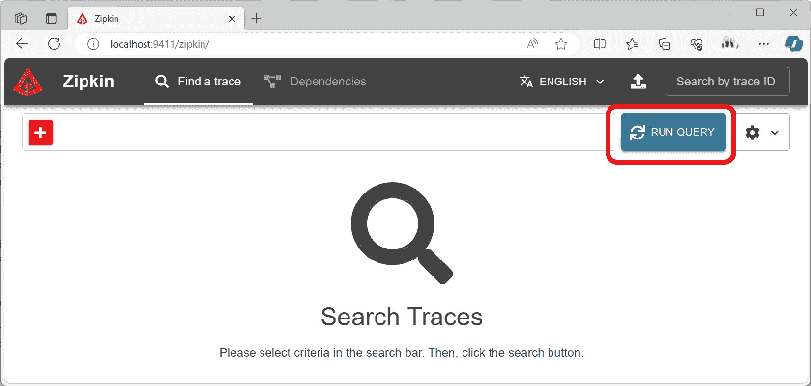

图 3.3：Zipkin 主页

在主页面上，点击 **运行查询** 以查看已生成的跟踪：

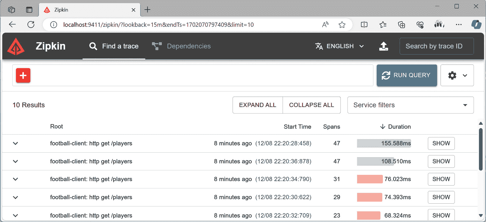

图 3.4：Zipkin 中的根跟踪

在这个页面上，您将看到客户端应用程序的跟踪是根跟踪。由于我们引入了一个随机错误，您将看到有失败和成功的跟踪。如果您点击任何这些跟踪的 **显示** 按钮，您将看到两个 RESTful API 的跟踪。将有一个针对客户端服务的请求和针对交易服务的嵌套请求：

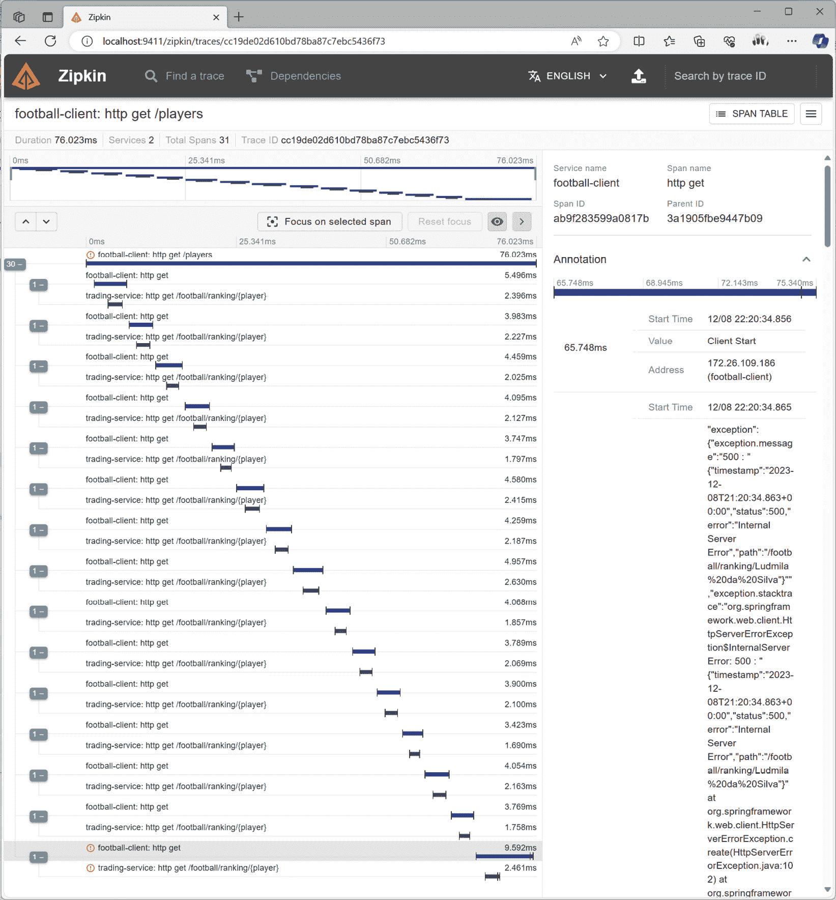

图 3.5：跟踪细节，包括嵌套跟踪

您也可以通过点击顶部栏上的 **依赖关系** 链接来查看服务之间的依赖关系：

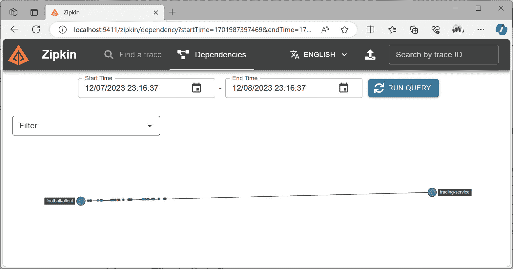

图 3.6：在 Zipkin 中查看服务之间的依赖关系

在这里，您可以查看 `football-client` 应用程序和 `trading-service` 应用程序之间的依赖关系。

## 它是如何工作的…

*Micrometer* 是一个库，允许您在不依赖特定供应商的情况下对应用程序进行仪表化。这意味着如果您决定使用其他工具，如 *Wavefront* 而不是 Zipkin，您的代码将不会改变。

`io.micrometer:micrometer-tracing-bridge-otel` 依赖项在 *Micrometer* 和 *OpenTelemetry* 之间创建了一个桥梁，之后 `io.opentelemetry:opentelemetry-exporter-zipkin` 依赖项将 *OpenTelemetry* 导出至 *Zipkin*。如果您想使用其他工具来监控跟踪，只需更改这些依赖项，无需进行任何额外的代码更改。

默认将跟踪发送到 Zipkin 的地址是 `http://localhost:9411`。这就是为什么我们不需要显式配置它。在生产环境中，您可以使用 `management.zipkin.tracing.endpoint` 属性。

在这个菜谱中，我们使用了 `RestTemplateBuilder`。这很重要，因为它通过向出站请求添加跟踪头来自定义配置 `RestTemplate`。然后，目标服务收集可用于将调用应用程序中的嵌套跟踪从客户端应用程序的根跟踪中收集的跟踪头。在响应式应用程序中，您应该使用 `WebClient.Builder` 而不是 `RestTemplateBuilder`。

在这个菜谱中，我们配置了 100%的采样率。这意味着我们将所有跟踪发送到跟踪服务器。我们这样做是为了学习目的；通常，您不应该在生产环境中这样做，因为您可以通过部署服务器（例如，通过 Zipkin）或使用云中的托管服务时摄入大量数据来超载跟踪服务器。摄入的数据量直接影响监控系统——也就是说，您摄入的数据越多，成本就越高。然而，即使您部署自己的跟踪服务器，您也需要进行扩展。所以，无论哪种方式，它都可能增加您的总体成本。在一个大规模系统中，拥有 10%的采样率就足以检测服务之间的问题以及了解组件之间的依赖关系。

## 还有更多...

Micrometer 跟踪创建跨度——也就是说，代表特定操作执行的工作单元或分布式跟踪的片段，对于每个请求。跨度捕获有关持续时间、上下文以及与相应操作相关的任何关联元数据的信息。

您可以通过使用`ObservationRegistry`组件启动观察来创建跨度。例如，假设`TradingService`有不同的重要部分，您希望跟踪，例如*收集数据*和*处理数据*。您可以在代码中为这些创建不同的跨度。

为了实现这一点，您需要使用 Spring Boot 依赖容器将`ObservationRegistry`注入到您的控制器中。为此，您需要在控制器构造函数中定义`ObservationRegistry`参数：

```java
private final ObservationRegistry observationRegistry;
public FootballController(ObservationRegistry observationRegistry) {
        this.observationRegistry = observationRegistry;
}
```

然后，您必须在代码中创建观察结果：

```java
@GetMapping("ranking/{player}")
public int getRanking(@PathVariable String player) {
   Observation collectObservation = Observation.createNotStarted("collect", observationRegistry);
   collectObservation.lowCardinalityKeyValue("player", player);
   collectObservation.observe(() -> {
      try {
          logger.info("Simulate a data collection for player {}", player);
          Thread.sleep(random.nextInt(1000));
      } catch (InterruptedException e) {
          e.printStackTrace();
      }
   });
   Observation processObservation = Observation.createNotStarted("process", observationRegistry);
   processObservation.lowCardinalityKeyValue("player", player);
   processObservation.observe(() -> {
            try {
                logger.info("Simulate a data processing for player {}", player);
                Thread.sleep(random.nextInt(1000));
            } catch (InterruptedException e) {
                e.printStackTrace();
            }
        });
        return random.nextInt(1000);
    }
```

注意，观察结果包括具有`lowCardinalityKeyValue`的玩家，以便通过这些数据找到跨度。

注意

为了简洁，已删除部分代码。您可以在本书的 GitHub 仓库中找到完整版本，网址为 https://github.com/PacktPublishing/Spring-Boot-3.0-Cookbook/。

现在，在 Zipkin 中，您可以看到嵌套在`trading-service`中的自定义跨度：

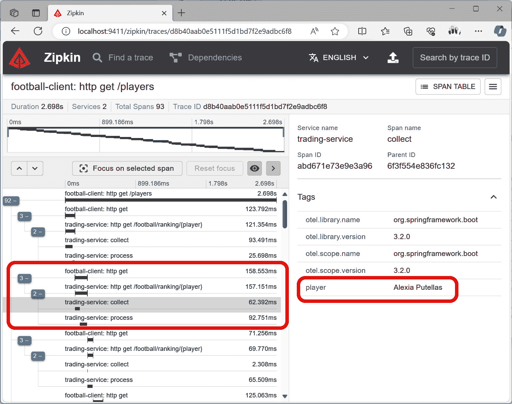

图 3.7：Zipkin 中的自定义跨度

`trading-service`跨度包含两个嵌套跨度，并且两者都有一个自定义标签，指定了玩家的名字。

# 访问标准指标

您的足球交易服务通过被足球迷采用而持续增长。您需要了解它如何表现更好，以便您可以在优化提供服务的资源的同时适应需求。

您可以使用 Spring Boot Actuator 及其相关组件提供的标准指标，以实时洞察您的应用程序的行为。例如，您可以了解您的应用程序使用了多少 CPU 和内存，或者在垃圾收集（**GC**）中花费了多长时间。这些是基本的指标，可以帮助您了解应用程序的性能。

其他指标可能更为微妙，例如由 Web 容器 Tomcat 提供的指标——例如，活跃会话的数量、拒绝的会话数量以及已过期的会话数量。同样，默认为 `hikaricp` 的数据库连接池也暴露了一些指标。例如，您可以查看活跃会话的数量、等待会话的数量或被拒绝的会话数量。这类指标可以成为您应用程序中问题的指示器，这些问题仅通过使用如 CPU 和内存利用率等经典指标难以检测。

在本食谱中，您将学习如何访问标准指标以及如何检测一些常见应用程序问题。您还将学习如何使用 JMeter 进行负载测试，但这不是本食谱的主要目的。

## 准备就绪

在本食谱中，您将重用 *实现分布式跟踪* 食谱中创建的应用程序。如果您还没有完成该食谱，我已准备了一个工作版本，您可以在本书的 GitHub 仓库中找到，网址为 https://github.com/PacktPublishing/Spring-Boot-3.0-Cookbook/，在 `chapter3/recipe3-5/start` 文件夹中。这些应用程序依赖于 PostgreSQL，并且如前一个食谱中所述，将活动导出到 Zipkin。PostgreSQL 和 Zipkin 都可以使用 Docker 在本地运行。

在本食谱中，我们将使用 JMeter，一个流行的负载测试工具，进行一些负载测试。您可以从项目网站 [`jmeter.apache.org/download_jmeter.cgi`](https://jmeter.apache.org/download_jmeter.cgi) 下载 JMeter。在这里，您可以下载包含 JMeter 二进制文件的 ZIP 文件，并将其解压；无需进一步安装。要运行 JMeter，请转到您解压二进制文件的文件夹，打开 `bin` 文件夹。在这里，您将找到根据您的操作系统启动 JMeter 的不同脚本。对于基于 Unix 的操作系统，您可以运行 `jmeter.sh` 脚本，而对于 Windows，您可以运行 `jmeter.bat` 脚本。

我已创建了两个 JMeter 脚本，用于对应用程序施加一些负载。您可以在本书的 GitHub 仓库中找到它们，在 `chapter3/recipe3-5/jmeter` 文件夹中。

## 如何操作…

在本食谱中，我们将使用 *准备就绪* 部分中提到的 JMeter 脚本来为足球应用程序生成工作负载。然后，我们将观察 Spring Boot 及其相关组件提供的指标。按照以下步骤操作：

1.  在运行第一个负载测试之前，请确保交易应用程序正在运行，并且 `metrics` 端点已公开。如 *将 Actuator 添加到您的应用程序* 食谱中所述，这可以通过将 `metrics` 值添加到 `management.endpoints.web.exposure.include` 参数来完成。如果您遵循了前面的食谱或使用了我在 *准备就绪* 部分中解释的工作版本，则 `application.yml` 文件应如下所示：

    ```java
    management:
        endpoints:
            web:
                exposure:
                    include: health,env,loadTeams.jmx script. You can find it in the chapter3/recipe3-5/jmeter folder, as explained in the *Getting ready* section. This script makes a request to the application’s /football path and returns a list of teams. This process is executed by 30 threads infinitely.You can adjust some parameters of the load tests depending on the resources of your development computer. For instance, I used 30 threads to overload my computer, but maybe you need more or even fewer threads than that:
    ```

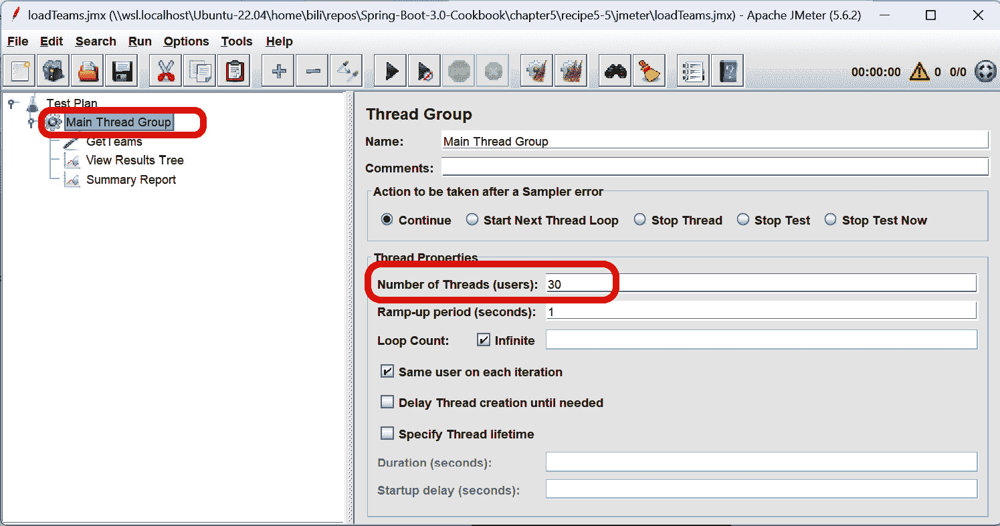

图 3.8：JMeter 中的线程数

如果你想调整线程数，请点击**主线程组**并调整**线程数（用户）**。

一旦应用程序准备就绪，你可以运行 JMeter 脚本。

1.  让我们观察应用程序的指标。转到`http://localhost:8080/actuator/metrics`以查看暴露的指标完整列表。你可以通过将指标名称附加到`/actuator/metrics`路径来获取任何这些指标。通常，你会得到与 CPU 和内存相关的计数器：

    +   通过`http://localhost:8080/actuator/metrics/process.cpu.usage`，你可以得到应用程序进程正在使用的 CPU 百分比

    +   通过`http://localhost:8080/actuator/metrics/system.cpu.usage`，你可以得到系统正在使用的 CPU 百分比

    +   通过`http://localhost:8080/actuator/metrics/jvm.memory.used`，你可以得到应用程序正在使用的内存量

    例如，`process.cpu.usage`指标的结果如下所示：

    ```java
    {
        "name": "system.cpu.usage",
        "description": "The \"recent cpu usage\" of the system the application is running in",
        "measurements": [
            {
                "statistic": "VALUE",
                "value": 0.48494983277591974
            }
        ],
        "availableTags": []
    }
    ```

1.  停止测试 - 你需要创建一个新的端点来访问数据库。为此，请按照以下步骤操作：

    1.  创建一个新的`DataService`类并将`JdbcTemplate`注入到构造函数中：

    ```java
    @Service
    public class DataService {
        private JdbcTemplate jdbcTemplate;
        public DataService(JdbcTemplate jdbcTemplate) {
            this.jdbcTemplate = jdbcTemplate;
        }
    }
    ```

    1.  现在，创建一个调用数据库的方法。为了模拟慢速数据库查询，你可以使用`pg_sleep` PostgreSQL 命令。此命令等待指定数量的秒数或秒数的分数：

    ```java
    public String getPlayerStats(String player) {
        Random random = new Random();
        jdbcTemplate.execute("SELECT pg_sleep(" + random.nextDouble(1.0) + ")");
        return "some complex stats for player " + player;
    }
    Now, you can run the application.
    ```

1.  最后，运行另一个 JMeter 脚本，对该相同的`/football`路径发起请求并返回一个球队列表，以及新的路径`/stats/{player}`，它执行对数据库的长请求。再次，30 个线程无限运行这些请求。

## 它是如何工作的...

在第一次负载测试中，我们可以看到应用程序的 CPU 存在瓶颈。在现实场景中，可以使用 CPU 指标来自动扩展应用程序，例如通过添加应用程序的新实例。这就是在重负载下我们可能预期的瓶颈类型。

在第二次负载测试中，没有物理资源瓶颈，但有一个耗时较长的查询并阻塞了一个无法用于其他请求的连接。在现实场景中，你可以增加连接池中可用的连接数，但只能增加到一定限制，因为这是一个非常昂贵且有限的资源。

如果你查看`system.cpu.usage`和`process.cpu.usage`，你会看到值远低于前一次负载测试中观察到的`1.0`。

你还可以查看与数据库连接池相关的指标。Spring Data 中的默认数据库连接池是 HikariCP，与此组件相关的所有指标都是`hikaricp.*`。让我们考虑以下指标：

+   `hikaricp.connections.max`: 此值指定`hikaricp`将在 PostgreSQL 服务器中打开的最大真实数据库连接数。在测试执行期间，此数值不会改变，因为在应用程序生命周期中该值是静态的。默认情况下，它设置为`10`。

+   `hikaricp.connections.active`: 这是活动连接数——即正在数据库服务器中执行某些操作的连接。在轻负载下，此数字将小于最大值。由于数据库操作时间较长（长达 1 秒），并且只有 10 个最大连接就有 30 个并发线程，因此在 JMeter 脚本的执行期间，此数字将是 10 或接近 10。

+   `hikaricp.connections.pending`: 当连接池中没有可用的连接时，此指标将请求排队。此指标指定了等待可用连接的连接数。在 JMeter 脚本的执行期间，此数字将大于 1。

+   `hikaricp.connections.timeout`: 如果一个请求等待超过给定的时间——默认为 30 秒——它将超时。在执行 JMeter 脚本后，你会看到这个指标将大于 1。

打开物理数据库连接是一项昂贵的操作。为了避免创建连接的开销，存在一种称为数据库连接池的机制，它保持一些已创建的连接以供使用。当进程需要连接到数据库时，它会从池中获取连接，一旦操作完成，就将其返回到池中。在第二次压力测试中，由于它们完成时间较长，因此没有连接，它们花费了很长时间才返回到池中。当没有可用连接时，连接池将排队连接，直到其中一个被释放。这就是为什么你会看到`pending`连接的原因。过了一段时间，你会看到超时连接。这些是排队超过 30 秒的连接。

这种情况也会影响 Web 容器。默认情况下，服务 HTTP 请求的线程数是有限的，也存在一个线程池。当没有更多可用的线程时，Web 容器（在这种情况下，是 Tomcat）将排队请求。在这种情况下，当一个 HTTP 请求主要在等待依赖项完成时，它似乎出现了响应式框架。在这种情况下，应用程序使用特殊类型的线程——非阻塞线程——这些线程旨在进行 I/O 操作。这些类型的线程允许应用程序在等待外部服务响应的同时继续处理其他任务。

## 参见

你可以使用标准的监控工具来可视化你的指标。在*将应用与 Prometheus 和 Grafana 集成*的菜谱中，你将学习如何将应用指标与 Prometheus 集成，并使用 Grafana 进行可视化。这些是两个流行的开源工具，它们是**云原生计算基金会**（**CNCF**）的一部分。

# 创建自己的指标

到目前为止，你在你的足球交易服务中创建了一个新功能，用户可以列出一张卡片进行交换，另一个用户可以对该交易卡片进行竞标。当收到新的竞标时，它将在内存中排队，直到提交，因为它需要一系列复杂的验证。人们对这个新功能有很多期望，你想要确保它运行良好。因此，你想要监控收到的竞标，有多少竞标正在等待提交，以及这个过程持续了多长时间。

在这个菜谱中，你将学习如何使用**Micrometer**创建自定义指标。Micrometer 是一个开源的 Java 应用指标收集库，它与 Spring Boot Actuator 集成得非常好。其他库可以使用 Micrometer 生成的遥测数据导出到不同的监控系统。

有不同类型的指标：

+   **计数器**：正如其名所示，它计算某事发生的次数。我们可以使用这种类型的指标来找出收到了多少竞标。

+   **仪表**：这个指标在给定时刻提供一个值。我们可以用它来找出有多少竞标正在等待处理。

+   **计时器**：这个指标测量给定操作的持续时间。我们可以用它来找出每个竞标花费的时间。

## 准备工作

在这个菜谱中，我们将重用*访问标准指标*菜谱中的项目。如果你还没有完成那个菜谱，我已经准备了一个工作版本。你可以在本书的 GitHub 仓库中找到它，在[`github.com/PacktPublishing/Spring-Boot-3.0-Cookbook/`](https://github.com/PacktPublishing/Spring-Boot-3.0-Cookbook/)的`chapter3/recipe3-6/start`文件夹中。

为了模拟新功能的工作负载，我创建了一个 JMeter 脚本。你可以在本书的 GitHub 仓库中找到它，在`chapter3/recipe3-6/jmeter`文件夹中。你可以从项目网站[`jmeter.apache.org/download_jmeter.cgi`](https://jmeter.apache.org/download_jmeter.cgi)下载 JMeter。在这里，你可以下载一个包含 JMeter 二进制的 ZIP 文件，并将其解压——不需要进一步的安装。要运行 JMeter，请转到您解压二进制的文件夹，然后打开`bin`文件夹。在这里，您可以找到根据您的操作系统启动 JMeter 的不同脚本。对于 Unix，您可以运行`jmeter.sh`脚本，而对于 Windows，您可以运行`jmeter.bat`脚本。

## 如何做到这一点...

在这个菜谱中，你将把你自定义的指标集成到足球交易应用中。这个增强功能将提供对应用在运行时性能的更深入了解：

1.  前往你的交易应用程序并创建一个名为`AuctionService`的新服务类：

    1.  将`MeterRegistry`注入到构造函数中。在同一个构造函数中，创建一个用于收到的竞标的计数器，一个用于处理竞标持续时间的计时器，以及一个用于等待确认的竞标的仪表。

    ```java
    @Service
    public class AuctionService {
        private Map<String, String> bids = new ConcurrentHashMap<>();
        private Counter bidReceivedCounter;
        private Timer bidDuration;
        Random random = new Random();
        public AuctionService(MeterRegistry meterRegistry) {
            meterRegistry.gauge("football.bids.pending", bids, Map::size);
            this.bidReceivedCounter = meterRegistry.counter("football.bids.receieved");
            this.bidDuration = meterRegistry.timer("football.bids.duration");
        }
    }
    ```

    1.  注意，`gauge`返回用于在内存中保持已收到的竞标的映射的大小。

    1.  现在，创建一个处理竞标的方法。在这个方法中，你将使用`bidDuration`计时器来测量操作持续时间，并使用`bidReceivedCounter`增加收到的竞标数量。

    1.  在名为`tradeCards`的新方法中使用`ordersTradedCounter`和`tradedDuration`指标。该方法应如下所示：

    ```java
    public void addBid(String player, String bid) {
        bidDuration.record(() -> {
            bids.put(player, bid);
            bidReceivedCounter.increment();
            try {
                Thread.sleep(random.nextInt(20));
            } catch (InterruptedException e) {
                e.printStackTrace();
            }
            bids.remove(player);
        });
    }
    ```

1.  接下来，在`FootballController`类中公开此功能：

    1.  将你的新`AuctionService`注入到构造函数中：

    ```java
    private AuctionService auctionService;
    public FootballController(AuctionService auctionService) {
       this.auctionService = auctionService;
    }
    ```

    1.  注意，为了简化，所有其他参数和字段都已省略。由于我们正在重用之前菜谱中的相同项目，你应在构造函数中拥有更多参数，并且还应拥有其他字段。

    1.  创建一个新的方法，该方法将使用新服务展示球员的竞标：

    ```java
    @PostMapping("/bid/{player}")
    public void addBid(@PathVariable String player, 
                                 @RequestBody String bid) {
          auctionService.addBidAOP(player, bid);
    }
    ```

1.  现在，你可以运行应用程序并开始生成一些负载。为此，在 JMeter 中打开`loadBids.jmx`文件。你可以在这个书的 GitHub 仓库中找到此文件，网址为 https://github.com/PacktPublishing/Spring-Boot-3.0-Cookbook/，在`chapter3/recipe3-6/jmeter`文件夹中。然后，在 JMeter 中运行脚本并保持运行，同时观察指标。

1.  观察你创建的计数器：

    +   如果你打开`http://localhost:8080/actuator/metrics`上的 Actuator 指标端点，你会看到已创建的新指标：`football.bids.duration`、`football.bids.pending`和`football.bids.received`。如果你将这些指标的名称附加到 Actuator 指标端点，你将得到每个指标的价值。

    +   打开`http://localhost:8080/actuator/metrics/football.bids.received`以获取已收到的竞标数量。你会看到竞标总数。

    +   打开`http://localhost:8080/actuator/metrics/football.bids.duration`以获取竞标处理持续时间。

    +   打开`http://localhost:8080/actuator/metrics/football.bids.pending`以获取待处理的竞标数量。

    对于计数器和持续时间，通常，监控工具也会提供一个基于总值和观察频率计算出的速率。在性能分析方面，了解竞标处理速率比总数量更有趣。同样，这也适用于持续时间。

1.  停止 JMeter 脚本。

## 它是如何工作的...

`MeterRegistry`类注册指标，之后它们将自动在 Actuator 指标端点中公开。

`gauge`调用分配给指标的代理。此代理将根据观察频率执行。在本食谱中，我们显式地调用端点。如果您使用监控工具，它将定期被观察。请注意，此操作应尽可能轻量，因为它将被频繁调用。

计时指标衡量了提供给代理执行所花费的时间。

计数器指标增加计数器的值。如果您在调用`increment`方法时没有提供值，就像我们在本食谱中所做的那样，它将只增加 1。您可以将一个数字作为方法增加的参数，此时它将根据提供的数字增加计数器的值。这个数字始终应该是正数。

## 还有更多...

您可以使用`ObservedAspect` bean 以更声明性的方式创建指标。

要将依赖项添加到*AOP starter*，请在您的`pom.xml`文件中包含以下内容：

```java
<dependency>
    <groupId>org.springframework.boot</groupId>
    <artifactId>spring-boot-starter-aop</artifactId>
</dependency>
```

要配置`ObserverAspect` bean，请将以下方法添加到`Football`配置类中：

```java
@Bean
ObservedAspect observedAspect(ObservationRegistry observationRegistry) {
    return new ObservedAspect(observationRegistry);
}
```

在这一点上，您可以在代码中使用`@Observed`注解来自动生成指标。例如，在本食谱中，我们可以用`@Observed`注解`AuctionService`类：

```java
@Observed(name = "football.auction")
@Service
public class AuctionService {
}
```

然后，您可以简化类，因为您不需要在构造函数中显式创建计数器。在`addBidAOP`方法中，您只需要关注应用逻辑：

```java
public void addBidAOP(String player, String bid) {
    bids.put(bid, player);
    try {
        Thread.sleep(random.nextInt(20));
    } catch (InterruptedException e) {
        e.printStackTrace();
    }
    bids.remove(bid);
}
```

当您运行应用程序并且使用`AuctionService`（第一次使用方法时指标是延迟创建的）时，您将看到 Actuator 指标端点中有两个新的指标：

+   `football.auction`：为您的注解类中定义的方法提供通用计数器

+   `football.auction.active`：为您的注解类中定义的方法提供活动执行的计数器

以下是从`http://localhost:8080/actuator/endpoint/football.auction`获取的`football.auction`指标的示例：

```java
{
    "name": "football.auction",
    "baseUnit": "seconds",
    "measurements": [
        {
            "statistic": "COUNT",
            "value": 1648870
        },
        {
            "statistic": "TOTAL_TIME",
            "value": 15809.168264051
        },
        {
            "statistic": "MAX",
            "value": 0.02272261
        }
    ],
    "availableTags": [
        {
            "tag": "method",
            "values": [
                "addBidAOP"
            ]
        },
        {
            "tag": "error",
            "values": [
                "none"
            ]
        },
        {
            "tag": "class",
            "values": [
                "com.packt.footballobs.service.AuctionService"
            ]
        }
    ]
}
```

您可以使用标签获取特定方法的指标。例如，要获取`addBidAOP`方法的指标，您可以执行以下请求：`http://localhost:8080/actuator/metrics/football.auction?tag=method:addBidAOP`。

此服务在本书的 GitHub 仓库中实现，位于`https://github.com/PacktPublishing/Spring-Boot-3.0-Cookbook`的`chapter3/recipe3-8/end`文件夹中。如前所述，该指标是延迟创建的，因此您应该调用此服务以使其可用。您可以通过在终端中执行以下`curl`请求来实现：

```java
curl http://localhost:8080/football/bid/357669 \
--request POST \
--data "200"
```

# 将您的应用程序与 Prometheus 和 Grafana 集成

您拥有一个成功的足球交易应用，并且可以通过调用各种 Actuator 端点来观察它。然而，这种方式观察应用过于手动。因此，您希望有一个系统允许您自动化应用监控的方式。

在本食谱中，您将学习如何使用 **Prometheus** 可以使用的格式公开您的应用程序指标，之后您将使用 Prometheus 数据作为 **Grafana** 的数据源。Prometheus 是一个开源的监控解决方案，它收集和聚合指标作为时间序列数据，然后实时存储事件，以便事件可以用于监控您的应用程序。Grafana 是一个开源的可视化工具，允许您创建自定义仪表板、图表，甚至警报。Grafana 可以使用的数据源之一是 Prometheus 收集的数据。由于易于使用、灵活性和可扩展性，这两个工具的组合是一个非常受欢迎的选择。

## 准备工作

在本食谱中，您将重用 *创建您自己的指标* 食谱的结果。如果您还没有完成它，我已经准备了一个工作版本。您可以在本书的 GitHub 仓库 https://github.com/PacktPublishing/Spring-Boot-3.0-Cookbook/ 中找到它，在 `chapter3/recipe3-7/start` 文件夹中。

您将使用 Prometheus 和 Grafana 服务器。像往常一样，在您的本地计算机上运行 Prometheus 和 Grafana 最简单的方法是使用 Docker。

要下载并启动 Prometheus，请在您的终端中运行以下命令：

```java
docker run -d --name prometheus -p 9090:9090 \
-v prometheus.yml:/etc/prometheus/prometheus.yml \
prom/prometheus
```

此命令使用 `-v` 参数将卷挂载到名为 `prometheus.yml` 的文件中。此文件包含 Prometheus 的配置。配置将在 *如何做* *它…* 部分作为本食谱的一部分进行描述和创建。

要下载并启动 Grafana，请在您的终端中运行以下命令：

```java
docker run -d --name grafana -p 3000:3000 grafana/grafana
```

为了模拟新功能的工作负载，我创建了一个 JMeter 脚本。您可以在本书的 GitHub 仓库中找到它，在 `chapter3/recipe3-7/jmeter` 文件夹中。您可以从项目的网站 [`jmeter.apache.org/download_jmeter.cgi`](https://jmeter.apache.org/download_jmeter.cgi) 下载 JMeter。从这里，下载包含 JMeter 二进制文件的 ZIP 文件，并将其解压；不需要进一步安装。要运行 JMeter，请转到您解压二进制文件的文件夹，然后打开 `bin` 文件夹。在这里，您将找到不同的脚本以启动 JMeter，具体取决于您的操作系统。对于 Unix，您可以运行 `jmeter` 脚本，而对于 Windows，您可以运行 `jmeter.bat` 脚本。

## 如何做…

首先，我们将配置我们的应用程序，使其公开 Prometheus 端点。之后，我们将设置 Prometheus 和 Grafana，以便我们可以摄取应用程序提供的数据：

1.  让我们从向交易应用程序公开 Prometheus 端点开始。为此，需要两个步骤：

    1.  将以下依赖项添加到 `pom.xml` 文件中：

    ```java
    <dependency>
        <groupId>io.micrometer</groupId>
        <artifactId>micrometer-registry-prometheus</artifactId>
    </dependency>
    ```

    1.  公开 Prometheus 端点。为此，打开 `resources` 文件夹中的 `application.yml` 文件，并添加以下突出显示的属性：

    ```java
    management:
        endpoint:
            health:
                probes:
                    enabled: true
            prometheus:
                enabled: true
        endpoints:
            web:
                exposure:
                    include: health,env,metrics,beans,loggers,football,prometheus
    ```

1.  您可以运行应用程序并打开 Prometheus 端点 http://localhost:8080/actuator/prometheus。

1.  下一步是运行 Prometheus 并配置它以消费新暴露的端点。你可以通过创建一个 `.yaml` 配置文件并将其挂载到 Prometheus Docker 镜像上来配置 Prometheus：

    1.  Prometheus 将托管在 Docker 上，而应用程序将托管在你的计算机上，即 Docker 主机。第一个任务是获取你计算机的 IP 地址。在 Linux 上，你可以在终端中运行以下命令：

    ```java
    ip addr show
    ```

    1.  在 Windows 上，你可以在你的终端中运行以下命令：

    ```java
    ipconfig
    ```

    1.  如果你在一个 WSL 终端中运行你的应用程序的 `ip addr show`。

    1.  例如，当我运行 `ip addr show` 时，我接口的 IP 地址是 `172.26.109.186`。我将使用这个值来配置 Prometheus YAML 文件。

    1.  让我们继续，使用上一步中获得的 IP 地址创建配置文件。在项目的根目录下，创建一个名为 `prometheus.yml` 的应用程序，内容如下：

    ```java
    global:
      scrape_interval: 3s
    scrape_configs:
      - job_name: 'football_trading_app'
        metrics_path: '/actuator/prometheus'
        static_configs:
          - targets: ['172.26.109.186:8080']
    ```

    1.  注意，我们配置了应用程序暴露的指标路径，目标是我们的应用程序的 IP 地址和端口。

    1.  现在，使用配置文件运行 Prometheus 容器。为此，在创建配置文件的同一目录中，在终端中执行以下命令：

    ```java
    docker run -d --name prometheus -p 9090:9090 \
    prom/prometheus image, exposing port 9090 and mounting the prometheus.yml file in the container filesystem at /etc/prometheus/prometheus.yml. $(pwd) is a command substitution in Linux that is used to insert the current directory.
    ```

+   现在，Prometheus 应该正在运行并**抓取**你的应用程序以获取可观察性数据。要验证它是否正常工作，你可以在 http://localhost:9090 打开 Prometheus，然后打开**状态**菜单并选择**目标**：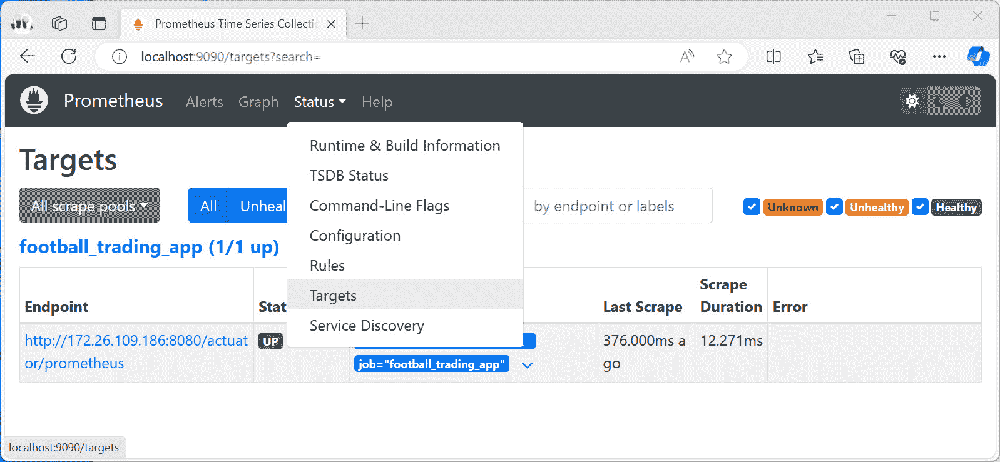

图 3.9：Prometheus 目标

验证你的目标状态是否正常工作。它应该是**UP**。

1.  你可以使用 Prometheus 来可视化你应用程序的数据。转到 Prometheus 主页，搜索任何指标，然后点击**执行**以查看数据。如果你选择**图形**选项卡，你将看到图形形式的数据：

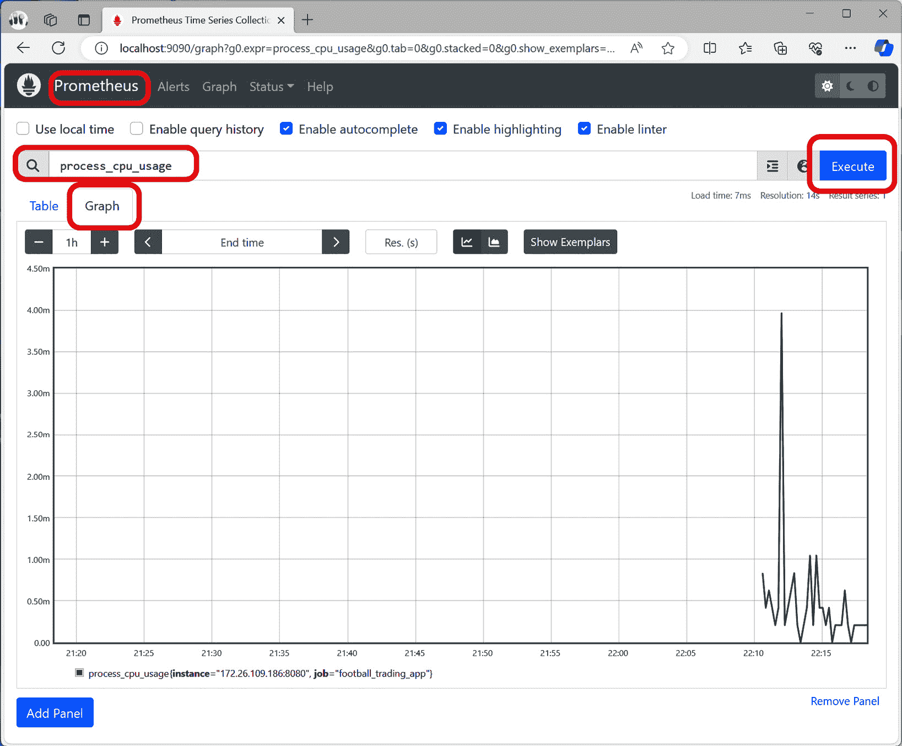

图 3.10：在 Prometheus 中可视化数据

1.  Prometheus 中可用的可视化功能有点有限，但我们可以使用 Grafana 并将其连接到 Prometheus 以实现更好的可视化：

    1.  确保 Grafana 正在运行。如*准备就绪*部分所述，你可以在终端中执行以下命令来运行 Grafana：

    ```java
    docker run -d --name grafana -p 3000:3000 grafana/grafana
    ```

    1.  现在，你可以在浏览器中打开以下地址来打开 Grafana：`http://localhost:3000`。你将需要输入你的凭证。你可以使用默认凭证——即用户设置为 `admin`，密码设置为 `admin`。

1.  接下来，你需要将 Prometheus 作为 Grafana 数据源连接。此时，两个容器都在 Docker 中运行：

    1.  首先，你需要获取 Docker 中的 Prometheus IP 地址。你可以通过检查容器来获取此信息。执行以下命令以获取容器的 IP 地址：

        +   要检索容器 ID，运行以下命令：

    ```java
    docker ps
    ```

    +   我的容器 ID 是`5affa2883c43`。在运行以下命令时，用你的容器 ID 替换它：

    ```java
    docker inspect 5affa2883c43 | grep IPAddress
    ```

    我的终端看起来像这样：

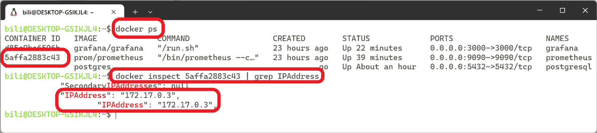

图 3.11：使用 docker inspect 获取容器的 IP 地址

1.  现在，打开左侧菜单并选择**连接** | **数据源**：

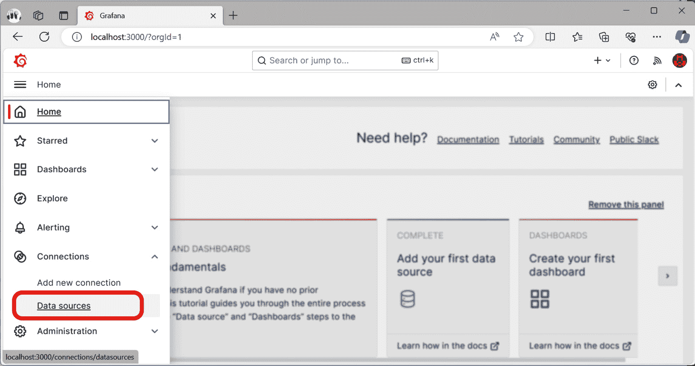

图 3.12：打开数据源

在搜索栏中点击`Prometheus`：

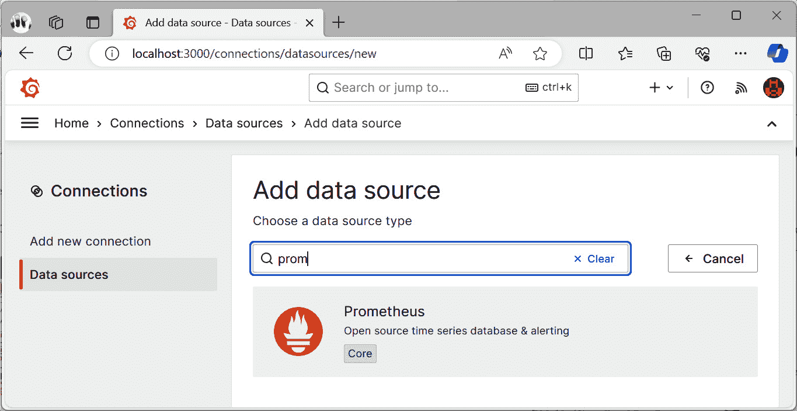

图 3.13：选择 Prometheus 作为数据源

然后，配置`172.17.0.3`，但你的值可能不同。端口号是`9090`：

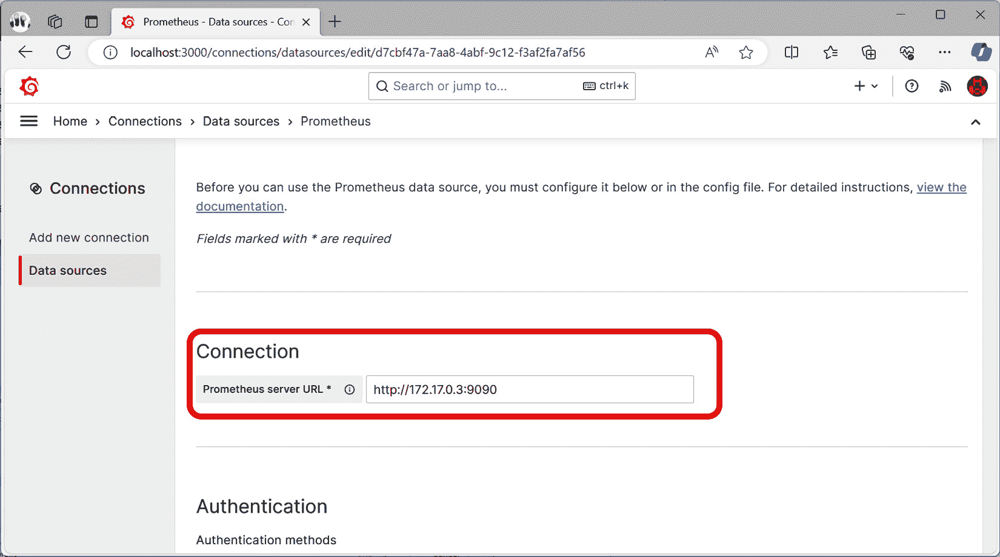

图 3.14：配置 Prometheus 服务器 URL 属性

对于其余参数，你可以保留默认值。在页面底部，你会找到**保存并测试**按钮。点击它。此时，你可以通过构建仪表板来开始可视化数据。

1.  最后，创建一个仪表板来可视化待处理竞标的数量。转到`football_bids_pending`，然后点击**运行查询**。将时间范围更改为过去 30 分钟。最后，点击**保存**：

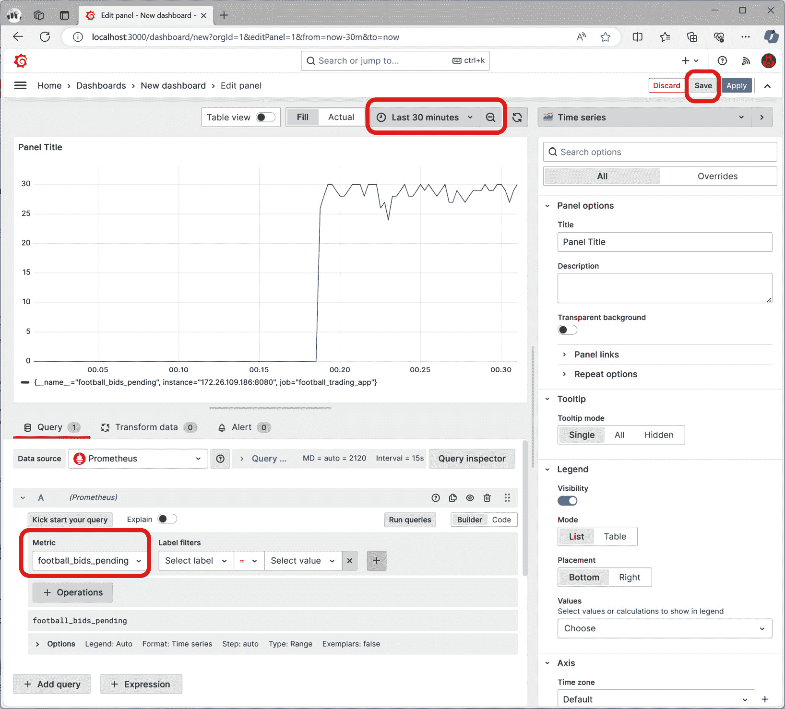

图 3.15：配置面板

现在，保存你的仪表板。将其命名为`待处理竞标`。

1.  运行负载测试以查看指标如何在面板中可视化。你可以使用我创建的 JMeter 脚本来生成一些流量。你可以在本书的 GitHub 仓库中找到它，在`chapter3/recipe3-7/jmeter`文件夹中。[`github.com/PacktPublishing/Spring-Boot-3.0-Cookbook/`](https://github.com/PacktPublishing/Spring-Boot-3.0-Cookbook/)。Grafana 面板应该看起来像这样：

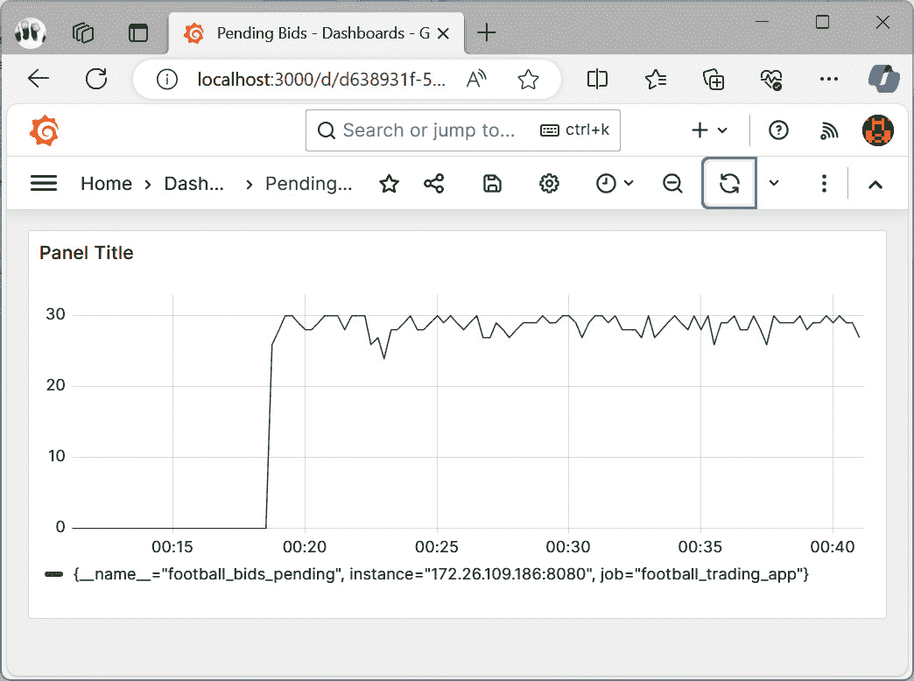

图 3.16：在 Grafana 中可视化的待处理竞标

通过这样，你已经学会了如何在 Grafana 等强大工具中可视化你的指标。

## 它是如何工作的…

Prometheus 是一个可扩展的工具，可以使用导出器。这些导出器是在 Prometheus 中运行的作业，如果它们使用适当的格式公开，可以从外部源获取数据。本食谱的作业定期从外部源抓取数据。在本食谱中，我们配置了我们的应用程序以导出 Prometheus 可以理解的数据格式，然后我们配置了一个目标来检索这些数据。

使用 Prometheus 的一些好处如下：

+   它可以从多个来源获取指标——不仅限于应用程序，还包括基础设施组件。

+   它允许使用 PromQL，这是一种用于查询和聚合数据的语言。你可以将来自多个来源的数据组合起来，以提取用于监控的相关信息。

+   你可以根据查询和定义的阈值创建警报。例如，我们可以使用 CPU 使用率阈值或我们的待处理竞标来发送警报。

Grafana 可以从不同的来源获取数据；其中之一是 Prometheus。这种组合在监控解决方案中非常受欢迎。Grafana 可以用于高级可视化，它还允许你创建警报并发送通知。这非常重要，因为它提高了监控自动化过程。

在这个菜谱中，我们使用了这些流行的开源工具，但相同的做法也可以用于其他商业工具。通常，监控工具管理跟踪、日志和指标，并添加可视化功能，如仪表板和通过不同渠道的警报。

需要考虑的一个重要问题是，在何时应该使用跟踪或指标进行监控。跟踪在显示服务之间的关系以及使用事务本身的数据查找特定操作方面非常有用。这有助于找到问题的根本原因。跟踪的主要问题是，在高操作量的场景中，生成的大量数据可能非常庞大，通常，跟踪会被采样，以便所有生成的数据都可以被处理，并且成本可以得到控制。

另一方面，指标汇总测量值，并且它们定期导出这些汇总测量值以创建时间序列数据。然后，生成的数据是恒定的，无论目标系统管理的流量如何。指标的主要优势是它们不需要采样，生成数据相当精确。因此，指标更适合某些类型的警报。然而，当你需要找到问题的根本原因时，跟踪更适合。

# 更改正在运行的应用程序的设置

到目前为止，你已经为你的成功的足球交易应用程序添加了日志，并且它接收了相当多的流量。程序在不同的地方创建日志。这些日志可以帮助你了解程序在运行时做了什么。并非每个日志都同等重要。因此，程序使用各种日志级别，从调试到错误日志。按日志级别排序可以防止创建过多的日志。然而，你想要确保可以在不重新启动或重新部署应用程序的情况下更改要处理的日志的最小级别。

一些 Spring Boot Actuator 端点允许你在运行时进行更改，无需重新启动应用程序。日志端点是这些端点之一，因为它允许你更改日志的最小级别。

在这个菜谱中，你将学习如何更改正在运行的应用程序的日志级别。

## 准备工作

在这个菜谱中，你将重用*将你的应用程序与 Prometheus 和 Grafana 集成*菜谱的结果。如果你还没有完成它，我已经准备了一个工作版本。你可以在本书的 GitHub 仓库中找到它，网址为 https://github.com/PacktPublishing/Spring-Boot-3.0-Cookbook/，在`chapter3/recipe3-8/start`文件夹中。

## 如何操作...

在这个配方中，你将调整足球交易应用程序，使其生成不同重要级别的日志。一旦完成，你将学习如何在运行时更改级别：

1.  首先，让我们向`TradingService`类添加一些日志：

    1.  为该类创建一个日志记录器。你可以为此定义一个静态成员：

    ```java
    private static final Logger logger = LoggerFactory.getLogger(TradingService.class);
    ```

    1.  然后，向`getPendingOrders`方法添加调试和信息日志记录：

    ```java
    public int getPendingOrders() {
        logger.debug("Ensuring that pending orders can be calculated");
        Random random = new Random();
        int pendingOrders = random.nextInt(100);
        logger.info(pendingOrders + " pending orders found");
        return pendingOrders;
    }
    ```

    1.  你也可以为`tradeCards`方法添加一些日志记录：

    ```java
    public int tradeCards(int orders) {
        if (getPendingOrders() > 90) {
            logger.warn("There are more than 90 orders, this can cause the system to crash");
            AvailabilityChangeEvent.publish(applicationEventPublisher, new Exception("There are more than 90 pending orders"), LivenessState.BROKEN);
        } else {
            logger.debug("There are more less than 90 orders, can manage it");
            AvailabilityChangeEvent.publish(applicationEventPublisher, new Exception("working fine"), LivenessState.CORRECT);
            }
        return orders;
    }
    ```

1.  现在，你可以执行一些请求并验证信息是否被记录。你可以在你的终端中执行以下命令来每秒执行一个请求：

    ```java
    watch -n 1 -x curl --request POST -H "Content-Type: application/json" --data "1" http://localhost:8080/football
    ```

    你会看到只有`INFO`和`WARN`日志被处理：

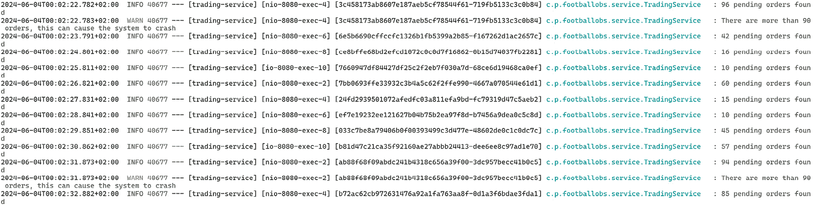

图 3.17：只有 INFO 和 WARN 日志被处理

这是因为默认级别是`INFO`。这意味着只有`INFO`或更高优先级的级别会被记录。

1.  你可以通过调用 Actuator 的`loggers`端点来验证日志级别。访问 http://localhost:8080/actuator/loggers。你会看到可用的日志级别，以及你应用程序中定义的日志记录器。你会看到有一个为你服务类`com.packt.footballobs.service.TradingService`的日志记录器，并且有效级别是`INFO`。

1.  假设你已经在应用程序中检测到一个问题，并且你想激活`DEBUG`级别。让我们通过使用 Actuator 的`loggers`端点来更改它。为此，你只需要执行以下请求：

    ```java
    curl --request POST \
    -H 'Content-Type: application/json' \
    -d '{"configuredLevel": "DEBUG"}' \
    http://localhost:8080/actuator/loggers/com.packt.footballobs.service.TradingService
    ```

    你会看到它现在还生成了`DEBUG`级别的日志：

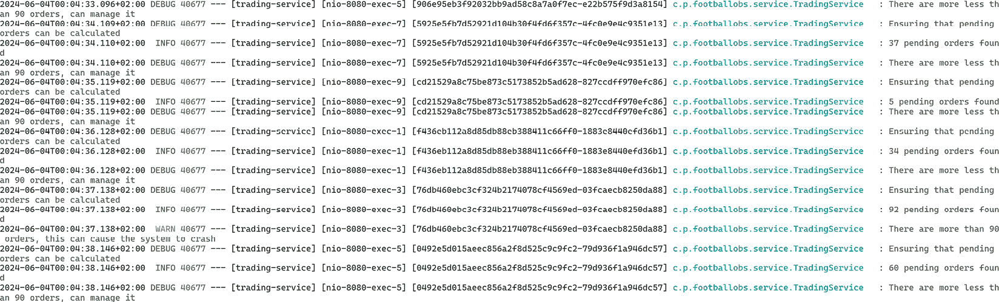

图 3.18：生成 DEBUG 和更高优先级的临界日志

如果你验证了*步骤 3*中解释的`loggers`端点，你会看到`TradingService`类现在有两个属性：

+   `configuredLevel`: `DEBUG`

+   `effectiveLevel`: `DEBUG`

1.  现在你已经验证了日志，你决定将日志级别更改为`WARN`，因为`DEBUG`和`INFO`日志产生了太多的噪音，你可以运行以下命令：

    ```java
    curl --request POST \
    -H 'Content-Type: application/json' \
    -d '{"configuredLevel": "WARN"}' \
    http://localhost:8080/actuator/loggers/com.packt.footballobs.service.TradingService
    ```

如果你验证了*步骤 3*中解释的`loggers`端点，你会看到`TradingService`的级别是`WARN`。如果你继续发送请求，你会看到只有`WARN`日志被输出。

## 它是如何工作的…

正如我们在*创建自定义 Actuator 端点*的配方中看到的，一些端点实现了更新和删除操作。`loggers`端点允许你更改日志级别。当你需要在生产环境中查找问题时，这是一个非常有用的功能，因为你不再需要重新启动你的应用程序。

在高流量应用中，你通常会希望设置较高的日志级别，例如`WARN`。这是警告级别，通常用于指示存在潜在问题或异常，应该引起注意。它表示的情况可能不一定是一个错误，但如果未解决，可能会导致问题。使用更高日志级别，如`WARN`的原因是日志通常由监控系统保存。如果应用生成太多日志，处理和保留它们需要更多资源，这可能会造成成本增加。同时，`DEBUG`和`INFO`日志不是关键的，它们可能会生成过多信息，使得找到问题的根本原因变得更加困难。

## 还有更多...

其他标准端点是 Spring Boot 的一部分，允许你在运行时进行更改。例如，`sessions`端点允许你检索和删除用户会话。
